# DI2 Week 4: Building the Adoptions Microservice Part 2

* back to AWS Cloud Institute repo's root [aci.md](../aci.md)
* back to [Developer Intermediate 2](./developer-intermediate-2.md)
* back to repo's main [README.md](../../../README.md)

## Building the Adoptions Microservice Part 2

### Weekly Overview

Now the shelter wants prospective adopters to be able to submit adoption applications online.

In this module, you will create a new microservice by using AWS SAM to create a serverless function that can interact with a DynamoDB database. This database will create and store applications submitted by prospective adopters.

First, you will review AWS SAM templates. You will use AWS SAM to create an HTTP API Gateway with a POST endpoint. The pet shelter application will use this endpoint to submit and create new adoption applications.

Next, you will connect a Lambda function to handle the POST request. This function will take the adoption application data, validate it, and then write the new record to the DynamoDB table.

As you develop the Lambda function, you might encounter errors such as Cross Origin Resource Sharing, or CORS, errors. You will learn to troubleshoot these by configuring the proper CORS settings in an API Gateway.

Next, you will test the new microservice by using client URL, or cURL, commands in the terminal. cURL is a command-line tool that you can use to send HTTP requests and inspect the responses. You will use cURL to send sample POST requests containing sample adoption application data to your new API endpoint. You will then verify the data is being stored correctly in DynamoDB.

## UNDERSTANDING HOW POST REQUESTS WORK

### Scaling the Adoption Application Process with a New Microservice

Your task is to create a new microservice that enables online application process. This microservice will use AWS Lambda to process the application data and validate it for completeness and accuracy. It will then store it in the shelter's existing Adoptions Amazon DynamoDB table. You will use AWS Serverless Application Model (AWS SAM) to quickly build, test, and deploy this new functionality. Architecting this new capability in this manner will make sure that the shelter can handle the expected increase in adoption applications.

In this lesson, you will walk through the steps to build and deploy this data entry microservice, extending the capabilities of the AnyCompany Pet Shelter application and helping more pets find their forever homes.

#### Preview of application architecture changes

The following diagram shows how the architecture of the AnyCompany Pet Shelter application will look after the addition of the new online application feature.

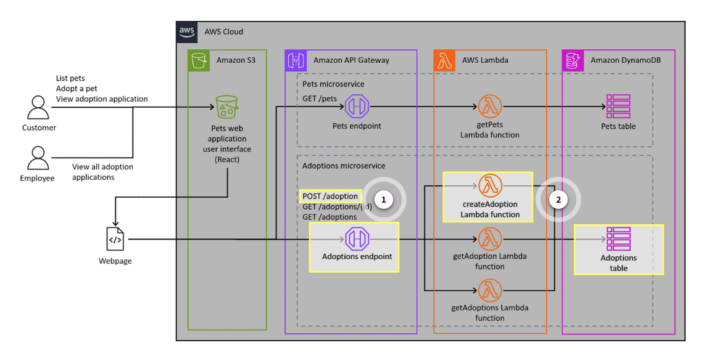

1. **POST method**

    The new online adoption feature will use the HTTP POST method to pass applicant data into the application.

2. **createAdoption function**

    The new online adoption feature will use an AWS Lambda function to store applicant data in the Adoptions table.

#### Potential benefits of adding the new microservice

A microservice-based architecture model offers several benefits for applications deployed in the Amazon Web Services (AWS) Cloud, including improved scalability, fault isolation, and agility in development and deployment. The following are some key benefits that an online application microservice might provide.

##### Prospective adopter benefits

* **Convenience**: Prospective adopters can submit applications online at their convenience, eliminating the need to visit the shelter in person or complete paper forms.
* **Accessibility**: Users can access the online form from any device, making the application process more accessible to a wider audience.
* **Wider reach**: By making the application process more accessible and user friendly, the shelter can attract more prospective adopters, increasing the likelihood of successful adoptions.
* **Reduced barriers**: Simplifying the application process might encourage more people to consider adopting a pet, because the perceived effort to apply is reduced.
* **Automated notifications**: The microservice can be integrated with email or SMS systems to automatically notify applicants of their application status, next steps, or any additional information required.

##### Data management benefits

* **Automated data handling**: The microservice automates the collection, validation, and storage of application data, reducing manual data entry and minimizing errors.
* **Centralized data storage**: All adoption application data is stored in a centralized DynamoDB table, making it easier to manage, search, and retrieve applications.
* **Data integrity**: Automated validation makes sure that all required fields are completed and that the data is in the correct format, improving the overall quality of the data.
* **Data security**: By using AWS services, the shelter can use built-in security features like encryption at rest and in transit, ensuring that sensitive applicant information is protected.
* **Regulatory compliance**: The microservice can also be designed to comply with relevant data protection regulations, such as GDPR. This makes sure that the shelter handles personal data responsibly.

##### Organizational benefits

* **Reduced administrative workload**: Automating the application process reduces the time and effort required by shelter staff to handle paperwork, so that they can focus on other critical tasks, such as animal care and community outreach.
* **Faster response times**: With applications processed and stored electronically, shelter staff can quickly review and respond to applications, improving communication with potential adopters. The microservice also makes sure that all applications are processed uniformly, following the same validation rules and procedures, and leading to more consistent decision-making.
* **Real-time insights**: The shelter can gain real-time insights into application trends, such as the most popular breeds, peak application times, and common applicant demographics. The centralized data can be used to generate reports and analytics, helping the shelter make informed decisions on resource allocation, marketing strategies, and adoption events.
* **Handling increased volume**: The microservice can handle a large volume of applications simultaneously, accommodating peak times without slowing down or crashing.
* **Modular design**: The microservice architecture allows for convenient expansion and integration with other services. This facilitates the adoption of future new features such as payment processing for adoption fees, scheduling appointments for meet-and-greet sessions with pets, surveys, and donation requests, without overhauling the entire system.

### How HTTP POST Requests Work

To make it possible for prospective adopters to apply online using a form on the AnyCompany Pet Shelter website, a microservice will be developed to handle the submission of adoption applications. This microservice will use an HTTP Amazon API Gateway POST operation to receive applicant data and securely store it in the Adoptions Amazon DynamoDB table. By automating this process, the shelter can efficiently manage and process adoption requests, ensuring a smooth and user-friendly experience for potential adopters.

#### Methods for passing data to a server

A `POST` request is used to send data to a server to be processed or stored. Typically, when you enter data into a form on a website and choose `Submit`, a `POST` request is used to transfer the form data to the server for further processing or storage.

Over time, the HTTP protocol was extended to include additional methods that provided more granular control over resource manipulation. These methods include `PUT`, `MERGE`, `PATCH`, and `DELETE`.

* The `PUT` method is used for updating an existing application resource identified by a specific *uniform resource identifier (URI)*. `PUT` requests are *idempotent*, meaning that the same `PUT` operation can be performed multiple times without changing the results from the first successful operation. This behavior is useful in scenarios where you want to ensure that a resource is created or updated with specific data, without worrying about unintended side effects from repeated `PUT` requests.
* The `MERGE` method allows clients to perform partial updates on a resource by merging changes from different sources. It provides a way to merge modifications into an existing resource on the server, handling potential conflicts during the merge process. The `MERGE` method is most useful in scenarios where multiple clients or entities are concurrently modifying different parts of a shared resource.
* An HTTP `PATCH` request is used to update a partial resource on the server. `PATCH` requests only update the fields that must be changed, leaving the rest of the resource unchanged. The `PATCH` request is designed to be efficient by only sending the data that must be updated, rather than the entire resource. This can be beneficial for reducing the amount of data transmitted, especially for resources that are large or frequently updated.
* The `DELETE` method is used to remove a resource from the server. When a client sends a `DELETE` request to the server, the server is expected to delete the specified resource. The `DELETE` method is typically used for scenarios such as deleting a user account, a blog post, or a file. It is important to note that the `DELETE` method is intended to be idempotent, meaning that multiple identical `DELETE` requests should have the same effect as a single request.

The `POST` method has remained a fundamental part of the HTTP protocol. `POST` continues to be widely used in modern web applications and microservices architectures and is the method that you will use in your new microservice.

`POST` requests differ from `PUT`, `MERGE`, and `PATCH` in that they are generally used to send data to the server to create new records.

#### HTTP POST method details

The POST method is a fundamental aspect of the HTTP protocol, primarily used to send data from a client to a server to create a resource. When you submit a form on a website, upload a file, or send data to be processed, a `POST` request is typically involved.

In a `POST` request, the data is sent in the body of the request, not appended to the URL as query parameters as with GET requests. This allows for more complex data to be transmitted, including JSON objects, files, and other structured information.

`POST` requests are non-idempotent, meaning that making the same `POST` request multiple times can result in different outcomes. For example, if you send the same order request twice, you might end up creating two separate orders.

Common use cases for `POST` include creating a new user account, submitting an online order, uploading a file, or sending form data for processing. In the context of AnyCompany Pet Shelter, the `POST` method would be used to submit adoption applications, sending the data from the user to be stored and processed by the server.

#### HTTP POST method RESTful API design

In the context of RESTful API design, HTTP `POST` requests play a specific role in handling the creation of new resources. The key components of a RESTful API design are as follows:

* **Resource identification**: Each resource in the API is identified by a unique URI.
* **HTTP methods**: RESTful APIs use the standard HTTP methods to perform operations that read (`GET`), create (`POST`), update (`PUT`, `PATCH`, or `MERGE`), and delete (`DELETE`) application resources.

When a client sends a `POST` request, the request body usually contains the data for the new resource being created. The server then processes the request, creates the new resource, and responds with an appropriate HTTP status code. The server also includes the URI of the newly created resource in the response headers. For example, when a prospective adopter fills out and submits an application on the AnyCompany Pet Shelter website, the POST request would be sent to the server, which then creates a new record in the Adoptions DynamoDB table.

Each HTTP method in RESTful design is intended to map closely to CRUD operations: create (`POST`), read (`GET`), update (`PUT` or `PATCH`), and delete (`DELETE`). This clear separation allows for a consistent and predictable API structure, making it easier for developers to interact with the API.

RESTful APIs are stateless, meaning that each request from a client contains all the information needed to process it, without relying on stored context from previous requests. This design principle ensures that `POST` requests can be processed independently, maintaining the simplicity and scalability of the API.

#### Naming conventions for HTTP POST routes

When a client wants to send data to a server by using the HTTP `POST` method, it must specify the URL of the server resource that will handle the incoming data. This URL path is known as the *route*. When designing routes for a RESTful API, especially those that will handle `POST` requests, it's important to follow clear and consistent naming conventions. This makes the API easier to understand and use, both for developers and for automated tools. The following are recommended naming convention for routes.

1. **Use resource-oriented route names**

    Routes in RESTful APIs are typically named after the resources that they interact with, in plural form. For example, a route that handles adoption applications might be named `/adoptions`. This route would be used to submit new applications by a `POST` request.

2. **Avoid using verbs in route names**

    In RESTful design, the HTTP method (for example, `POST`) conveys the action, so route names should not include verbs. Instead of naming a route `/createAdoption`, a RESTful API would use `/adoptions` with a `POST` method to create a new adoption application.

3. **Use consistent naming conventions**

    Use consistent naming conventions across all routes in the API. This includes using lowercase letters, hyphens for separating words, and plural nouns. For example, routes like `/adoptions`, `/users`, and `/pets` follow a consistent pattern, making the API intuitive to use.

#### POST request and response structure

When making an HTTP `POST` request to an API, the request body typically contains the data that you want to send to the server. After processing the request, the server responds with an HTTP *status code*.

##### Request body

The request body is a critical component of a `POST` request, because it contains the data that the client wants to send to the server. This data is packaged and transmitted in the body of the request, rather than being appended to the URL as with `GET` requests.

Understanding how to properly structure and transmit data in the request body is essential for developers working with `POST` requests, especially when interacting with APIs or microservices. JSON is a common format for structuring data in a `POST` request body. JSON is widely used in modern web development due to its simplicity, readability, and native support in JavaScript.

JSON represents data as key-value pairs, making it practical to work with in many programming languages. The code shown here is anexample of an adoption application being represented as JSON.

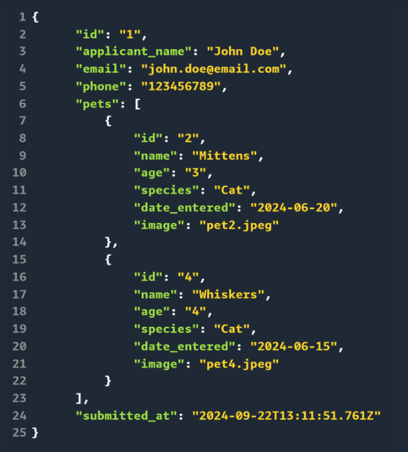

The first five lines of the 25 lines of JSON-formatted data assign an ID number to the application, and capture the applicant's name, email address, and phone number.

Lines 6 through 23 capture the details of the two pets that the applicant is interested in. The last line of code is the date and time that the data was collected.

In this example, the prospective adopter will fill out a form using the application user interface. This form will collect information about their name, email address, phone number, and the pets that they are interested in.

After the user submits the form, this JSON data will be sent as part of the request body to the API gateway, which will ultimately send this data to the AWS Lambda function for creating an adoption application.

The Lambda function will generate the unique ID and the timestamp that is assigned to the newly submitted adoption application. This information will be inserted into the Adoptions table for persistent storage.

```text
XML is another format used for structuring data in POST requests, particularly in systems where a more descriptive or hierarchical data structure is needed. Although more verbose than JSON, XML is still used in certain enterprise environments or when communicating with older systems.
```

##### Response codes

After the server processes a `POST` request, it sends back an HTTP response, which includes a status code that indicates the outcome of the request. Understanding these status codes is crucial for both developers and users, because they provide immediate feedback on the success or failure of the operation. Two codes that indicate the successful invocation of a `POST` request are the `201` and `200` responses.

The `201` Created status code is one of the most common responses to a successful POST request. It indicates that the server has successfully received the request and created a new resource as a result. This status code is often accompanied by a Location header that points to the URL of the newly created resource.

In the example shown here, a user submitted an adoption application through the AnyCompany Pet Shelter application. The server successfully processed the request, and returned a `201 Created` response code. The `Location` output included in the response provides the URL where the new adoption application can be accessed, allowing the client to retrieve or reference the created resource.

```bash
HTTP/1.1 201 Created Location:
https://api.anycompany.com/adoptions/abc123
```

* Example of `201 Created` response.

The `201 Created` status is typical for `POST` requests that create new resources. However, some `POST` requests might return a `200 OK` status, particularly when the request was processed successfully but did not result in the creation of a new resource. This can happen when the `POST` request performs an action like uploading a file or triggering a background process.

```bash
HTTP/1.1 200 OK
```

* Example of `200 OK` response.

In the example shown here, a user uploaded a profile picture through the AnyCompany Pet Shelter application. The server successfully received the picture, processed the request, and returned a 200 OK response code. This response code indicates that the file upload was successful, and no additional resources were created as a result.

The 200 and 201 response codes are not the only possible HTTP responses. There are other responses in the 200 range, all of which indicate some type of successful HTTP response. For reference, other categories of HTTP response codes that you might encounter while developing web-based applications are summarized in the following table:

| HTTP response code range | HTTP error type | Response code example |
| ---------- | ------------------------------ | --------------- |
| 300s | HTTP response codes in the 300s range indicate redirection. These status codes inform the client that further action has to be taken to complete the request, typically by following a different URL or location provided by the server. The specific code indicates whether the redirection is permanent or temporary and whether the client should continue using the same request method or switch to a different method when following the new URL. | **302 Found**<br>Used to indicate that the requested resource has been temporarily moved to a different location |
| 400s | HTTP response codes in the 400s range indicate client errors. When a client receives a 400s status code, it indicates that there is an issue with the client's request, and the client needs to take corrective action before retrying the request. The specific code provides information about the nature of the error, allowing the client to make the necessary adjustments or handle the error appropriately. | **404 Not Found**<br>Returned when the server cannot find the requested resource |
| 500s | HTTP response codes in the 500s range indicate server errors. These status codes are returned by the server when it encounters an unexpected condition or error that prevents it from fulfilling the client's request successfully. Server error codes are typically logged and monitored by server administrators to identify and troubleshoot issues with the server or application infrastructure. | **500 Internal Server Error**<br>Generic server error code that indicates an unexpected condition occurred on the server |

#### Raw HTTP requests and API Gateway endpoint requests

You might encounter situations where your application has to interact with APIs that are not associated with AWS services. In these cases, raw HTTP requests might be required to perform POST requests on the API.

There is one main difference between a raw HTTP request and an HTTP request issued through an API Gateway endpoint. The difference is in the way that the requests are handled and the way that the application data is processed. Specifically, a raw HTTP POST request provides direct communication with the server. In contrast, using Amazon API Gateway to perform an HTTP POST request adds a layer of management, security, and functionality that can simplify API development.

It's helpful to be aware of these differences in behavior when troubleshooting applications that make use of APIs that are not associated with AWS services. The following table compares some of the differences between these two request approaches.

| Characteristic | Raw HTTP request | API Gateway endpoint request |
| ---------- | -------------------- | -------------------- |
| **Authentication and authorization** | Typically requires custom implementation of authentication and authorization mechanisms | Provides built-in support for various authentication methods and can handle authorization at the API level |
| **Request URL** | Sends the request directly to the server's IP address or domain name | Sends the request to the API Gateway URL, which then routes it to the backend service |
| **Headers** | Contains standard HTTP headers | Can include additional headers added by API Gateway |
| **Request transformation** | The request body is sent as-is to the server | Can transform the request using mapping templates, allowing you to modify the request structure before it reaches the backend |
| **Logging and monitoring** | Requires custom implementation for logging and monitoring | Integrates with AWS CloudWatch for logging and monitoring |
| **Cross-origin resource sharing (CORS)** | CORS headers must be implemented on the server side | Offers built-in CORS support |
| **Error handling** | Error handling is implemented on the server side | Provides customizable error responses and can handle certain types of errors before they reach the backend |

#### How a Lambda function accesses and uses data from POST methods

The following is an example of an AWS Lambda function whose code will insert the user-supplied data into a target table.

The following sample code creates a Lambda function called insertOrderFunction, which inserts the body of the POST request into an Amazon DynamoDB table called OrderTable.

```python
import json
import boto3

dynamodb = boto3.resource('dynamodb')
table = dynamodb.Table('OrderTable')

def insertOrderFunction(event, context):
    # Extract the request body from the event
    body = json.loads(event['body'])

    # Insert the payload data into the DynamoDB table
    table.put_item(Item=body)

    # Return a success response
    return {
        'statusCode': 200,
        'body': json.dumps('Order inserted successfully')
    }
```

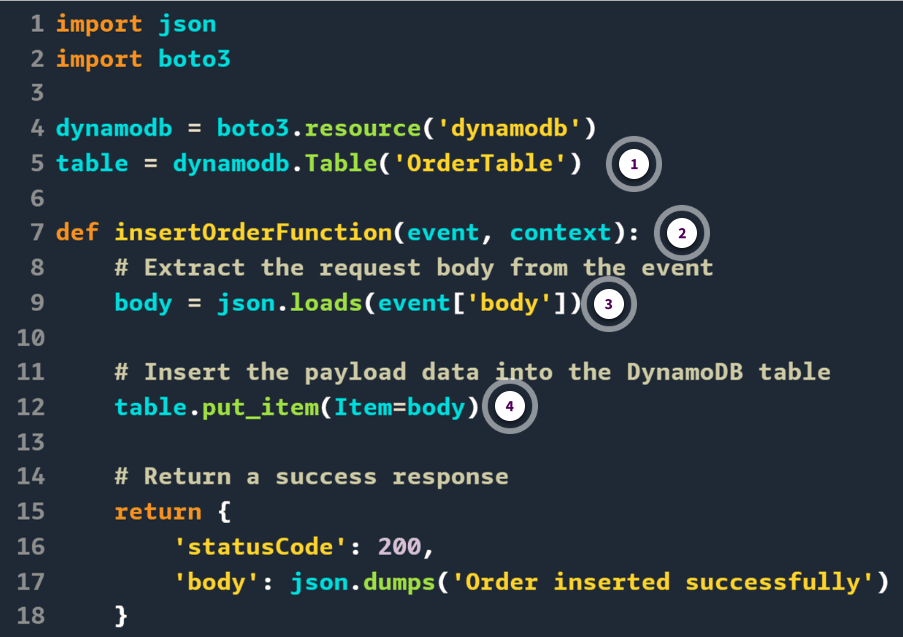

1. **table**

    The `dynamodb.Table('OrderTable')` line creates a reference to the OrderTable DynamoDB table.

2. **insertOrderFunction**

    The `insertOrderFunction` function is the entry point for the Lambda function, which receives the event and context objects as parameters.

3. **body**

    The event object contains information about the incoming HTTP request, including the request body. The `json.loads(event['body'])` line extracts the request body from the event object and deserializes it into a Python dictionary.

4. **table.put_item**

    The `table.put_item(Item=body)` line inserts the request body—which contains the payload of user data—as a new item in the OrderTable. If the insert succeeds, the function returns a success response with a status code of 201 and a message indicating that the order was inserted successfully.

##### body clause

In the example Python code, the `body = json.loads(event['body'])` line serves the purpose of extracting the request payload or data from the event object received by the Lambda function.

When invoked, the AWS Lambda function in the AnyCompany Pet Shelter application will contain the relevant `POST` data collected from the prospective pet adopter. This data might include the adopter's name, phone number, and desired pets in the form of JSON.

The `json.loads(event['body'])` statement deserializes the JSON data from the event body string into a Python dictionary or list. This deserialization allows the Lambda function to access and process the payload data.

##### table.put_item clause

The `table.put_item(Item=body)` clause is responsible for inserting the request payload data into an Amazon DynamoDB table variable.

The `put_item` method is provided by the DynamoDB API in the AWS SDK for Python (Boto3) and allows you to insert or update an item in a DynamoDB table.

The `item=body` is a parameter passed to the put_item method, where body is the variable containing the deserialized JSON data from the request payload. This data was extracted earlier using `json.loads(event['body'])`.

By using the `table.put_item(Item=body)` clause, the AnyCompany Pet Shelter Lambda function can insert prospective adopter data into a specified DynamoDB table. The body variable contents will be the prospective adopter's request payload data. This data will be stored as a new item in the DynamoDB table.

#### Configuring Lambda functions to handle POST requests in an AWS SAM template

Continuing the previous AWS Serverless Application Model (AWS SAM) template example, the API Gateway and Lambda function both must be provisioned. The following is an example of how the AWS SAM template might look for provisioning these resources.

```yaml
CreateOrderLambda:
    Type: AWS::Serverless::Function
    Properties:
        CodeUri: handlers/create_order
        Handler: createOrder.InsertOrderFunction
        Runtime: python3.9
        Architectures: # Specifies the architecture for the Lambda function.
            - x86_64
        Role: !GetAtt MyLambdaRole.Arn
        Events: # Defines events that trigger the Lambda function.
            CreateOrderApi: # Specifies API Gateway event that triggers the Lambda
                Type: Api # Specifies that the event source is an API Gateway endpoint.
                Properties: # Defines properties of the API Gateway event.
                    RestApiId: !Ref OrdersAPI
                    Path: /orders
                    Method: post
```

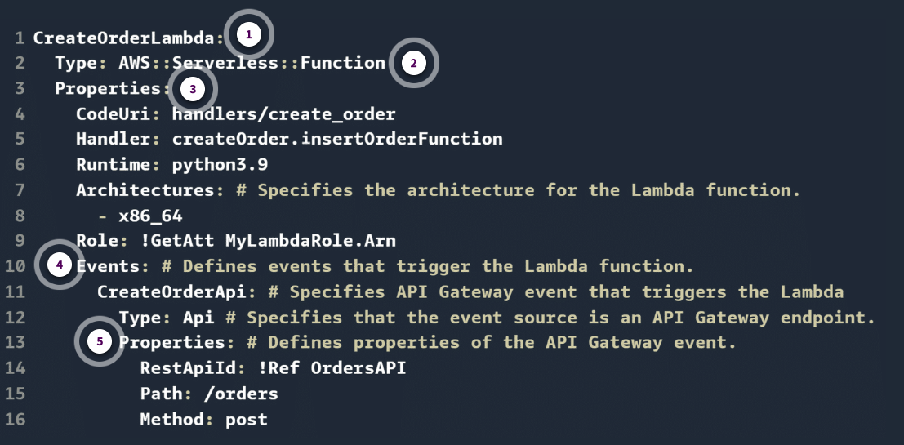

1. **CreateOrderLambda**

    **CreateOrderLambda**: This is the logical resource name of the AWS Lambda function that handles the creation of new orders. This is different from the actual name of the Lambda function which is `insertOrderFunction`.

2. **Type**

    **Type** specifies that this resource is a serverless function, which is managed by AWS Lambda.

3. **Properties (Lambda)**

    **Handler**: The Lambda function code is stored in a file named `createOrder.py`, so `insertOrderFunction` represents the name of the Lambda function defined in that Python file.

    **Role**: This specifies the IAM role that the Lambda function assumes, allowing it to interact with other AWS services. `!GetAtt MyLambdaRole.Arn` retrieves the ARN of a predefined IAM role.

4. **Events**

    This defines the triggers that invoke the Lambda function.

    **CreateOrderApi**: This is the name of the event source, which is an API Gateway event in this case.

    **Type**: This specifies that the event is an API Gateway endpoint.

5. **Properties (API Gateway)**

    **RestApiId** references the API Gateway endpoint (`OrdersAPI`) that will trigger this Lambda function.

    **Path** defines the API path `/orders` where the `POST` requests will be sent to create new orders.

    **Method** specifies that this endpoint responds to `POST` requests, which are typically used to create new resources, like an order.

With these changes, when an HTTP `POST` request is made to the deployed Amazon API Gateway HTTP API endpoint, it will invoke the `insertOrderFunction` Lambda function. The Lambda function will then insert data into the `OrderTable` Amazon DynamoDB table, using the write permissions granted any roles and policies attached to the Lambda function.

For example, assume that the API Gateway endpoint is configured to accept JSON payloads, and the Gateway API endpoint created by the AWS SAM template is called `https://abcdef123456.execute-api.us-east-1.amazonaws.com/`. A conceptual data flow that uses a call to this endpoint to enter data is shown in the following diagram. The order data consists of a customer ID of `1050`, an order date of `22SEP2024`, and an order amount of `$345.89`.

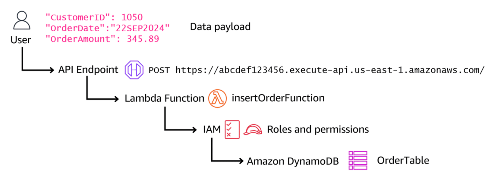

Sample data flow when using an API Gateway endpoint to enter data into an Amazon DynamoDB table.

* `POST https://abcdef123456.execute-api.us-east-1.amazonaws.com/` is the HTTP method and the complete URL for the API Gateway HTTP API endpoint that triggers the insertOrderFunction Lambda function.
* The JSON data payload contains the data elements to be inserted into the `OrderTable` DynamoDB table. These include the values `CustomerID: 1050`, `OrderDate: 22SEP2024`, and `OrderAmount: 345.89`.

### Ways to Test the POST Method

Tests can be performed using the operating system CLI client URL (curl) command, the AWS Command Line Interface (AWS CLI), and the API Gateway console.

#### Using curl to test an API using inline JSON data

The AWS SAM template in the previous lesson creates a function that expects to receive JSON data as a part of the HTTP PUT request. This JSON data will ultimately be inserted into the OrderTable DynamoDB table. One way to supply this JSON data payload is to include the required data directly inline with the curl command itself. An example of this technique is shown here.

#### Testing POST API Gateway endpoints using curl

The curl command is a command-line tool for sending HTTP requests to API Gateway endpoints for basic testing during development. The curl command lets you simulate client requests and inspect the responses, helping you verify the functionality and behavior of your APIs. Additionally, curl supports various HTTP methods, headers, and data payloads, enabling comprehensive testing scenarios. An example of how the curl command can be used to call an API Gateway endpoint is shown below.

```bash
curl -X POST -H "Content-Type: application/json" -d '{"CustomerID": 1050, 
"OrderDate": "22SEP2024", "OrderAmount": 345.89}' https://abcdef123456.execute-api.us-east-1.amazonaws.com/
```

These are descriptions of each part of the curl command used in the inline data example:

* **curl**: This is the command itself, which is used to transfer data using various protocols, including HTTP.
* **-X POST**: The `-X` flag specifies the HTTP method to be used for the request. In this case, `POST` is used to send data to the server.
* **-H "Content-Type: application/json"**: This flag is used to set the `Content-Type` header to `application/json`, indicating that the request body contains JSON data.
* **-d '{"CustomerID": 1050, "OrderDate": "22SEP2024", "OrderAmount": 345.89}'**: The `-d` flag is used to specify the JSON data payload. The JSON data is enclosed in single quotation marks (`'`). Double quotation marks are used for string values within the JSON data itself.
* **`https://abcdef123456.execute-api.us-east-1.amazonaws.com/`**: This is the URL of the API Gateway endpoint to which the POST request is being sent.

When you run this curl command from the operating system command line interface (CLI), it will send a POST request to the specified API Gateway endpoint with the JSON data payload provided in the request body. The server will receive the request, process the data, and respond accordingly.

If the curl command successfully inserts the JSON data payload into the target DynamoDB table, OrderTable, the response is typically a JSON object containing information about the successful operation. The following is an example of what the response might look like.

```json
{
    "statusCode": 200,
    "body": "{\"message\": \"Order inserted successfully\", \"OrderTable\": 
            {\"CustomerID\": 1050, \"OrderDate\": \"22SEP2024\", \"OrderAmount\"; 345.89}}",
    "headers": {
        "Content-Type": "application/json"
    }
}
```

This is what the response from the curl API call is telling you in this example:

* **`"statusCode": 200`**: This indicates that the request was successful, and a new item was successfully inserted into the OrderTable. If the curl API call failed to insert the JSON data payload into the DynamoDB table, the status code response would be a non-2xx value, typically a 3xxx, 4xx, or 5xx value.
* **`"body": "{\"message\": \"Order inserted successfully\", \"OrderTable\": {\"CustomerID\": 1050, \"OrderDate\": \"22SEP2024\", \"OrderAmount\": 345.89}}"`**: This is the response body, which contains a JSON string. The JSON string includes a success message (**`"Order inserted successfully"`**) and the details of the order that was inserted into the OrderTable DynamoDB table.
* **`"headers": { "Content-Type": "application/json" }`**: This specifies the headers included in the response, indicating that the response body is in JSON format.

The actual response structure and content might vary depending on how your AWS Lambda function and API Gateway endpoint are configured. However, this example demonstrates a common pattern where the response includes a success or error message, along with any relevant data related to the operation performed — in this case, the order details that were inserted into the OrderTable DynamoDB table.

#### Using curl to test an API using file-based JSON data

Another way to use curl to send `POST` requests is by defining the payload in a separate JSON or XML file. Defining the JSON data payload in a file is useful when you want to reuse the data, handle larger or more complex data structures, or maintain a clean command line, especially when testing or automating API requests. An example of this technique is shown here.

```bash
curl -X POST -H "Content-Type: application/json" -d @orderData.json https://abcdef123456.execute-api.us-east-1.amazonaws.com/
```

These are descriptions of each part of the curl command used in the file-based data example:

* **`curl`**: This is the command itself, used to transfer data using various protocols, including HTTP.
* **`-X POST`**: The `-X` flag specifies the HTTP method to be used for the request. In this case, `POST` is used to send data to the server.
* **`-H "Content-Type: application/json"`**: This flag is used to set the `Content-Type` header to `application/json`, indicating that the request body contains JSON data.
* **`-d @orderData.json`**: The `-d` flag is used to specify the JSON data payload. In this case, instead of providing the data inline, the `@` symbol indicates that the data should be read from a file called `orderData.json`. This file contains the JSON data in the following format.

    ```json
    {
        "CustomerID": 1050,
        "OrderDate": "22SEP2024",
        "OrderAmount": 345.89
    }
    ```

Three lines of JSON-formatted code with values for CustomerID, OrderDate, and OrderAmount

When you issue this curl command from the operating system CLI, curl will send a POST request to the specified API Gateway endpoint with the data defined in the `orderData.json` file. As with the inline JSON data example, the server will receive the request, process the data, and respond with the appropriate status code.

#### Using AWS CLI to test APIs

The AWS CLI provides the `aws apigateway test-invoke-method` command to send a request to your API and inspect the response. You can use this CLI command to test a `POST` operation against an API Gateway endpoint. The following example shows an AWS CLI test of a `POST` operation against an API Gateway endpoint called `https://abcdef123456.execute-api.us-east-1.amazonaws.com/`. The data payload for the `POST` operation is in JSON format, and consists of three data elements: `CustomerID (1050)`, `OrderDate (22SEP2024)`, and `OrderAmount (345.89)`.

```bash
aws apigateway test-invoke-method \
   --rest-api-id abcdef123456 \
   --resource-id 987654 \
   --http-method POST \
   --path-with-query-string "/" \
   --body '{"CustomerID": 1050, "OrderDate": "22SEP2024", "OrderAmount": 345.89}' \
   --headers '{"Content-Type":"application/json"}' \
   --region us-east-1
```

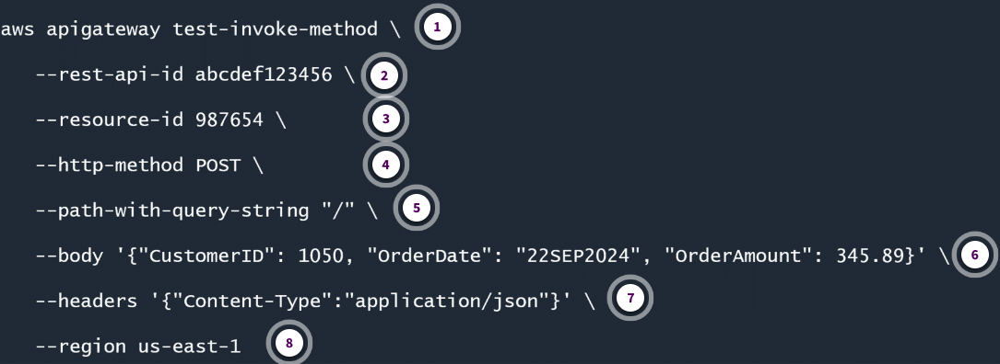

1. **`aws apigateway test-invoke-method`**

    This is the AWS CLI command for testing an API Gateway endpoint.

2. **`--rest-api-id abcdef123456`**

    This is the ID of the API Gateway REST API being tested.

3. **`--resource-id 987654`**

    This is the ID of the specific Lambda function within the API Gateway which is being tested.

4. **`--http-method POST`**

    This specifies the HTTP method to be used for the test request.

5. **`--path-with-query-string "/"`**

    The value "`/`" represents the root path of the API Gateway resource being tested. This means that the simulated HTTP request will be sent to the base URL of the API Gateway endpoint without any additional path segments.

6. **`--body`**

    This specifies the request body for the test request. This is the JSON payload with the three data elements: `CustomerID`, `OrderDate`, and `OrderAmount`.

7. **`--headers '{"Content-Type":"application/json"}'`**

    This specifies the request headers for the test request. In this example, we're setting the `Content-Type` header to `application/json`.

8. **`--region us-east-1`**

    This specifies the AWS Region where the API Gateway is deployed.

The AWS CLI **`apigateway test-invoke-method`** command is helpful for quickly testing your API Gateway endpoints and verifying their functionality before integrating them with other applications or services.

#### Using the Amazon API Gateway console to test APIs

The Amazon API Gateway page of the AWS Management Console provides a GUI-based tool for testing API Gateway endpoints.

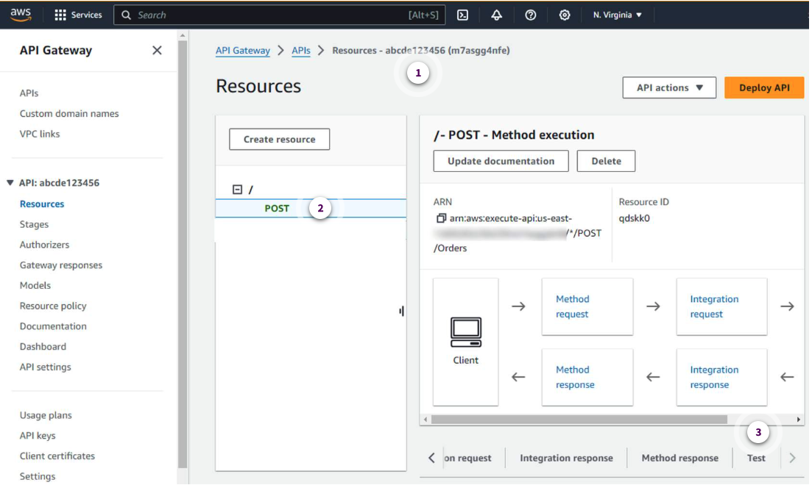

1. **API Gateway console**

    Navigate to the API Gateway console in the AWS Management Console and locate the API endpoint that you want to test. In this example, the endpoint is called `abcde123456`.

2. **POST event**

    Select the POST resource for the selected API.

After navigating to the API Gateway endpoint `Test` tab, you can enter the application data that you want to send to the application into the `Request body` portion of the `Test` tab. Next, you can use the `Test` button on the `Test` tab to send the data to the API Gateway endpoint, and then examine the invocation output for the results.

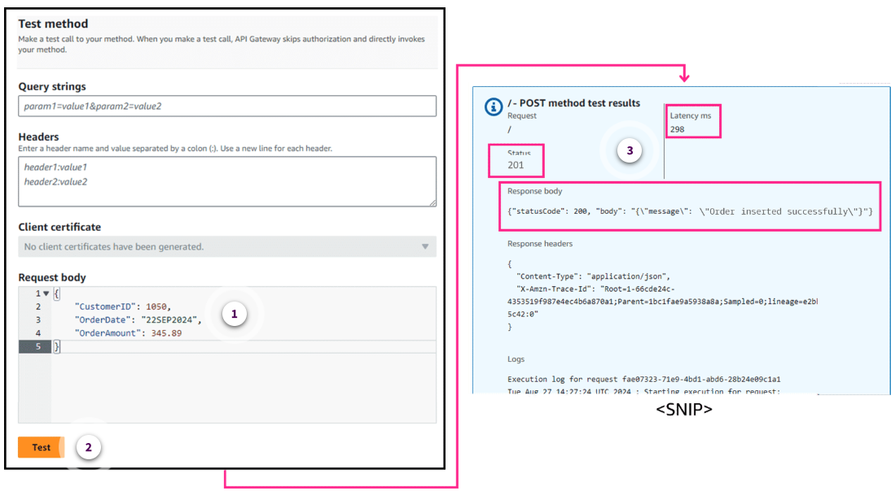

1. **Enter test data**

    The data that the POST operation will pass into the application using the API endpoint is supplied in the `Request body` section of the `Test` tab.

2. **Run test**

    Choose the `Test` button to call the API endpoint and pass in the specified values for the `POST` operation.

3. **Check results**

    The results of the test invocation of the API endpoint will be displayed below the `Test` button. In this example, the response status was successful (Status code 201) and the run API time was 298 milliseconds. Additional detailed log output is also included, but is snipped from this example.

#### Comparison of API testing options

The following table compares the three options that you've seen for testing `POST` requests to Amazon API Gateway endpoints. Each option has its own strengths and weaknesses, and your tool choice depends on factors such as your development environment, familiarity with command-line tools or GUIs, and the specific testing requirements of your project.

By using the AWS API Gateway console's GUI testing tool, you can quickly test your API Gateway endpoints and verify their functionality before integrating them with other applications or services.

| Feature | `curl` command | AWS CLI | Amazon API Gateway console |
| ------- | --------------- | --------------- | --------------- |
| Interface | Command line | Command line | Graphical user interface (GUI) |
| Installation | Preinstalled on UNIX-based systems | Requires installation of AWS CLI | Web-based, no installation required |
| Authentication | Requires configuring AWS credentials | Automatically authenticates with AWS credentials | Automatically authenticates with AWS credentials |
| POST request construction | Manual construction of requests | Command-line arguments for request details | GUI-based request builder |
| POST request payloads | Supports various payload formats (like JSON or XML) | Supports various payload formats (like JSON or XML) | Supports JSON payloads |
| Scripting and automation | Supports scripting and automation | Supports scripting and automation | Supports limited scripting and automation |
| Local development | Suitable for local development | Suitable for local development | Limited to AWS environment |
| Integration testing | Suitable for integration testing | Suitable for integration testing | Suitable for integration testing |

In general, the choice between these methods depends on your specific needs and preferences. If you prefer a command-line approach and need scripting or automation capabilities, the curl or the AWS CLI command technique might be more suitable. If you prefer a graphical interface and are primarily testing within the AWS environment, the AWS API Gateway console testing utility can be a convenient option.

It's worth noting that these methods are not mutually exclusive, and you can use a combination of them depending on the testing scenario. For example, you might use curl or the AWS CLI during local development and then switch to the AWS API Gateway console testing utility when deploying to the AWS environment.

```text
Ultimately, the goal is to choose the method that best fits your workflow and provides the necessary functionality for effectively troubleshooting and testing your Amazon API Gateway endpoints.
```

##### Think about it

When adding the new microservice to collect applicant data from potential pet adopters, you can use any of these methods to test your new function and API Gateway endpoint. Which of these endpoint testing tools do you think will be most useful for you? Will your choice of endpoint testing tool change based on where you are in the microservice development and deployment process? How does the output provided by each endpoint testing tool differ? Which tool provides the most useful output for your own troubleshooting?

### Knowledge Check

#### Which HTTP status code is most appropriate for a successful POST request that creates a new resource on the server?

* 201 Created

Wrong answers:

* 500 Internal Server Error
* 400 Bad Request
* 404 Not Found

##### Explanation

This is the standard status code for a successful `POST` request that results in the creation of a new resource on the server. It confirms that the resource was created and typically includes the URL of the newly created resource in the response.

The other responses are incorrect for the following reasons:

* The `500 Internal Server Error` status code indicates that something went wrong on the server's end, usually due to a malfunction or bug. This is not related to a successful `POST` request. Instead, it signals that the server encountered an unexpected issue.
* The `400 Bad Request` status code is used when the server cannot process the request due to invalid input or a syntax error in the request. It signals that the request is malformed, not that a new resource has been created.
* The `404 Not Found` status code indicates that the server could not find the requested resource. It is unrelated to a successful `POST` request, and is typically used in response to a `GET` request when a resource does not exist.

#### An AWS Serverless Application Model (AWS SAM) template includes a reference to an HttpApi type with a method of `POST`. It also includes a reference to an AWS Lambda function called `CalculateShipping`, whose source code is stored in a directory called ship-processing. What will this AWS SAM syntax do when the template is run?

* It will use the source code in the `ship-processing` directory to create the `CalculateShipping` function and its API endpoint, which will be configured for a `POST` request.

Wrong answers:

* It will use the source code in the ship-processing directory to create the CalculateShipping function and its API endpoint, which will be configured for a PUT request.
* It will use the source code in the POST directory to create the CalculateShipping function and its API endpoint, which will be configured for a POST event.
* It will use the source code in the ship-processing directory to create the CalculateShipping function and its API endpoint, which will be configured for a GET request.

##### Explanation

AWS SAM implicitly creates an API Gateway endpoint for the specified function using the specified method.

The other responses are incorrect for the following reasons:

* The API endpoint would be configured for POST, not PUT requests.
* The directory that contains the CalculateShipping function is stored in the ship-processing directory, not a POST directory.
* The API endpoint would be configured for POST, not GET requests.

#### A developer used the following command to test an API endpoint for a microservice: `curl -X POST -H "Content-Type: application/json" -d '{"ProductID": 25, "Quantity": 12}' https://abcdef123456.execute-api.us-east-1.amazonaws.com/`. Which statements about this command are correct? (Select TWO.)

* The API endpoint is being used to enter data into an application.
* The `-H` option tells the API that the data is in JSON format.

Wrong answers:

* The API endpoint is being used to retrieve data from the application.
* The `-d` option tells the API that this is a direct insert into an Amazon DynamoDB table, bypassing the AWS Cloud.
* The application's home page is found at the URL `https://abcdef123456.execute-api.us-east-1.amazonaws.com/`.

##### Explanation

The use of the `POST` method in the `curl` command means that data is being sent to the API endpoint. The `-H` is a content flag, used to set the `Content-Type` header to `application/json`, indicating that the request body contains JSON data.

The other responses are incorrect for the following reasons:

* A `GET` method would be needed to retrieve data from an application.
* The `-d` option tells the API that what follows is the JSON data to be entered into the application.
* The specified URL is the address of the API endpoint, not the application's home page.

### Summary

* The `POST` method is an HTTP protocol used to send data to a server for processing or storage, allowing more complex data transmission than `GET` requests by sending data in the request body rather than URL parameters.
* `POST` requests are non-idempotent, meaning multiple identical requests can produce different results, and commonly return status codes like `201 Created` for successful resource creation or `200 OK` for successful processing.
* A RESTful API design uses `POST` requests for creating new resources, with the request body containing the resource data and the response including appropriate status codes and potentially the URI of the newly created resource.

## Additional Resources

* [Testing a Lambda function using the AWS CLI](https://docs.aws.amazon.com/lambda/latest/dg/services-apigateway-tutorial.html#services-apigateway-tutorial-method)

---

## BUILDING OUT A POST REQUEST FEATURE USING AMAZON Q DEVELOPER

### Activity: Configuring and Testing the Lambda Function to Handle POST Requests

Going back to our Pet Shelter application, let's create a new AWS Lambda function that will respond to POST requests through Amazon API Gateway. In this activity, you will perform the following steps:

1. Verify the correct folder structure.
2. Examine the UI before adding the feature.
3. Create a boilerplate Lambda handler function that will access the request body from a `POST` request.
4. Initialize and configure resources using an AWS Serverless Application Model (AWS SAM) template.
5. Deploy and test your code.

#### Verify your folder structure

A folder structure should look like this.

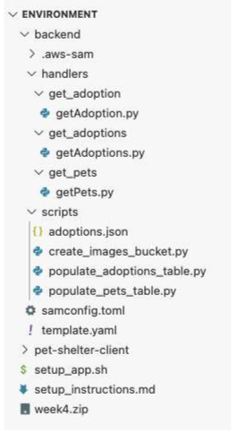

Folder structure that you should see in the AWS supported integrated development environment (IDE).

#### Examine the UI before adding the feature

First, let's examine the UI to see how a prospective pet adopter would submit an adoption application. To do this, we will need to run the React application. If you already have React running you can skip to step five.

Perform the following steps to examine the React application:

1. `cd ~/environment/pet-shelter-client`
2. `npm run dev`
3. Open the React application in your browser.
4. Choose the Adopt link in the running application, where you will see a form.
5. Fill in the form inputs.
6. Submit the form.

**Note**: For the `Select Pets` dropdown, you can select multiple pets by pressing Command on Mac, or Ctrl on Windows, and selecting a pet.

You should see an error message that looks like the following.

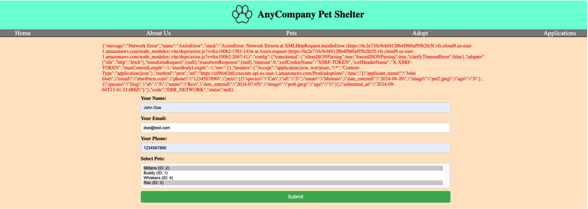

Error that is displayed when submitting the pet adoption form.

The error displayed here is a `"Network Error"` message, which in this case means that the backend is not built to handle post requests for this feature.

Also notice that the error mentions that the data that was submitted has the following format.

```json
{
    "data": {
        "applicant_name": "John Doe",
        "email": "doe@test.com",
        "phone": "1234567890",
        "pets": [
            {
                "species": "Cat",
                "id": "2",
                "name": "Mittens",
                "date_entered": "2024-06-20" ,
                "image": "pet2.jpeg",
                "age": "3"
            },
            {
                "species": "Dog",
                "id": "3",
                "name": "Rex",
                "date_entered": "2024-07-05" ,
                "image": "pet6.jpeg",
                "age": "1"
            }
        ],
        "submitted_at": "2024-09-04T13:41:33.688Z"
    }
}
```

This is the request body that will be sent to the backend containing information from the submitted form.

#### Develop the Lambda handler function

Let's set up some boilerplate code that returns a response to a client with headers that allow all origins to access this resource and also returns the post data in the body. Here you can use Amazon Q to assist with code generation. 

Because the React application is running, it will not allow you to use your current terminal. You can open up a new terminal to have access to entering new commands when needed.

In your `backend/handlers` directory, create a new folder called `create_adoption`. Inside that folder, create a file called `createAdoption.py`. You can do this on the command line or GUI. The following is the command to use in the command line.

```bash
mkdir ~/environment/backend/handlers/create_adoption && touch ~/environment/backend/handlers/create_adoption/createAdoption.py
```

At the top of the file, you will want to import your libraries. The libraries you will be using here are the following:

* json
* boto3
* os
* uuid

Create a function called `lambda_handler` that will be an entry point for an AWS Lambda function.

The function takes two arguments, `event` and `context`. The event argument contains information about the event that triggered the Lambda function, such as any data or parameters passed to the function. The context argument provides additional context about the Lambda function's execution environment.

To get started, define a function called `lambda_handler` that takes two arguments: `event` and `context`. This function is typically used as an entry point for Lambda functions.

Inside the function, create a dictionary called `response` with the following keys:

* `statusCode`
* `headers`
* `body`

The `statusCode` should be set to `200`, which will indicate a successful HTTP response.

The `headers` key should contain two items: one that allows requests from any origin (domain), and a second that allows sending credentials (for example, cookies or HTTP authentication) with cross-origin requests.

#### Build `createAdoption.py` with Amazon Q Developer

Populating code with Amazon Q Developer can be done by starting to type the code itself and selecting the recommended entries that populate.

In this case, we want our file to be a Lambda function with code that returns a response to a client with headers which allow all origins to access this resource, and also returns the post data in the body.

The file should do the following:

1. Connect to DynamoDB
2. Use the environment variable named `ADOPTIONS_TABLE` as the table name to connect to the table
3. Get the body of the event
4. Generate a unique id and add it to the body
5. Insert the body of the event into the table
6. Generate a response object with a `statusCode` of `201`, headers which allow all origins to access this resource, and a body which returns the request data payload
7. Return the response

The following code is a Lambda function written in Python that creates a new adoption record in an Amazon DynamoDB table.

```python
import json 
import boto3 
import os 
import uuid 

# Connect to DynamoDB
dynamodb = boto3.resource('dynamodb')

# Use the environment variable named "ADOPTIONS_TABLE" as the table name to connect to the table
table = dynamodb.Table(os.environ['ADOPTIONS_TABLE'])

# Lambda function with code that returns a response to a client with headers which allow all origins to access this resource and also returns the post data in the body
def lambda_handler(event, context):
    try:
        # Get the body of the event
        body = json.loads(event['body'])

        # Generate a unique id and add it to the body
        body['id'] = str(uuid.uuid4())

        # Insert the body of the event into the table
        table.put_item(Item=body)

        # Generate a success response object with a statusCode of 201
        response = {
            "statusCode": 201,
            "headers": {
                "Access-Control-Allow-Origin" : "*"
            },
            "body": json.dumps(body)
        }
    except Exception as e:
        # Handle any exceptions and return an error response
        response = {
            "statusCode": 500,
            "headers": {
                "Access-Control-Allow-Origin" : "*"
            },
            "body": json.dumps({
                "error": "There was an error processing your request.",
                "message": str(e)
            })
        }

    # Return the response
    return response
```

#### Initialize resources using an AWS SAM template

Next, you will want to configure your AWS SAM template to initialize resources for your Lambda function to establish the `POST` request for the API.

You can use `Amazon Q` to generate some code here for the AWS SAM template. This template can be written in either YAML or JSON.

You should start by defining a resource called `CreateAdoptionLambda`. This resource should create a Lambda function that makes a `POST` request to the API Gateway endpoint for the database.

This Lambda function should assume the AWS Identity and Access Management (IAM) role of `LambdaApplicationRoleSam`.

The API ID should be `PetsAPI`, and the path should be `/adoptions`.

Because this is an AWS SAM template and not an AWS CloudFormation template, it can reference information contained in the `lambda_handler` function that we just created. So you will want to include the handler information as part of the AWS SAM template properties.

If you used Amazon Q, there might have been a bug under the Role property. It's possible that Amazon Q generated the following.

```yaml
Role: !Sub "arn:aws:iam:::AccountId:role/LambdaApplicationRoleSam"
```

However, the correct way to code the role property should be this.

```yaml
Role: !Sub "arn:aws:iam::${AWS::AccountId}:role/LambdaApplicationRoleSam"
```

The following is the correct code for the AWS SAM template.

```yaml
  CreateAdoptionLambda:
    Type: AWS::Serverless::Function
    Properties:
      CodeUri: handlers/create_adoption
      Handler: createAdoption.lambda_handler
      Runtime: python3.12
      Role: !Sub "arn:aws:iam::${AWS::AccountId}:role/LambdaApplicationRoleSam"
      Architectures:
        - x86_64
      Environment:
        Variables:
          ADOPTIONS_TABLE: !Ref AdoptionsTable
      Events:
        CreateAdoptionApi:
          Type: Api
          Properties:
            RestApiId: !Ref PetsAPI
            Path: /adoptions
            Method: post
```

Next, add the following code to the `Outputs` section of your template.yaml file.

```yaml
CreateAdoptionAPIEndpoint:
    Description: API Gateway endpoint URL for Prod stage for CreateAdoption function
    Value: !Sub "https://${PetsAPI}.execute-api.${AWS::Region}.amazonaws.com/Prod/adoptions/"
```

The final state of the code is included the following [template.yaml](./files/W040BuildingAdoptionMicroservicePart2_files/template.yaml) file.

* In the `CreateAdoptionLambda` section, you will see a role (`arn:aws:iam::${AWS::AccountId}:role/LambdaApplicationRoleSam`) that is provided for this specific practice environment. Outside of this course, developers will generally create their own role, and assign policies to it. In this case, the Lambda function requires policy permission to insert into the Amazon DynamoDB table.
* In the `Environment` property, you will see a variable called `ADOPTIONS_TABLE`. This is used to reference the table name in the Lambda function using the `os.environ` syntax.
* The `RestApiId` that you see here is referencing the `PetsAPI` that was created in previous weeks.

#### Deploy the SAM template

Next, you will want to deploy the current AWS SAM template by following these steps:

1. Change directory into the backend directory: `cd ~/environment/backend`

    Then run the following commands:

2. `sam validate`
3. `sam build`
4. `sam deploy`

#### Testing with cURL

Let's do some more testing by creating a test payload file.

In the `~/environment/backend/scripts` folder, create a new file called `postDataTestPayload.json`.

Add the following content to the file.

```json
{
  "applicant_name": "John Doe",
  "email": "doe@test.com",
  "phone": "1234567890",
  "pets": [
    {
      "species": "Cat",
      "id": "2",
      "name": "Mittens",
      "date_entered": "2024-06-20",
      "image": "pet2.jpeg",
      "age": "3"
    },
    {
      "species": "Dog",
      "id": "3",
      "name": "Rex",
      "date_entered": "2024-07-05",
      "image": "pet6.jpeg",
      "age": "1"
    }
  ],
  "submitted_at": "2024-09-04T13:41:33.688Z"
}
```

Next, you will want to run a `cURL` command to the API endpoint. To do so, perform the following steps:

1. Change to the directory where the payload json data is: `cd ~/environment/backend/scripts`
2. Run the following cURL command: `curl -X POST -H "Content-Type: application/json" -d @postDataTestPayload.json YOUR_POST_ENDPOINT_URL_HERE`
3. Be sure to replace the URL shown in step 2 with the dynamic URL for your specific instance by using the outputs generated from deploying the AWS SAM template.

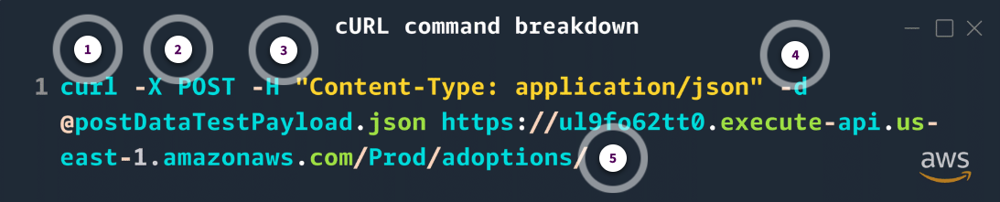

1. This cURL command sends a `POST` request to the specified API endpoint. The Lambda function will be able to access this `POST` data via the `event[‘body’]` syntax.
2. It reads the JSON data from the `postDataTestPayload.json` file.
3. The server (API Gateway in this case) will receive the JSON payload and process it (such as storing it in a database or handling it in a Lambda function).
4. The server will then respond based on the success or failure of the request.

If the command is successful, you should see an output that looks something like the following.

```json
{"applicant_name": "John Doe", "email": "doe@test.com(opens in a new tab)", "phone": "1234567890", "pets": [{"species": "Cat", "id": "2", "name": "Mittens", "date_entered": "2024-06-20", "image": "pet2.jpeg", "age": "3"}, {"species": "Dog", "id": "3", "name": "Rex", "date_entered": "2024-07-05", "image": "pet6.jpeg", "age": "1"}], "submitted_at": "2024-09-04T13:41:33.688Z", "id": "3f446ad0-6fe3-4c2b-b952-90f786032273"}
```

If so, you should be able to go into the DynamoDB console and see that the new adoption application was successfully created.

Go back to the frontend of the React application and submit the form again to see if submitting a new adoption application will create a new entry in DynamoDB.

### Knowledge Check

#### What is a required element in an AWS Serverless Application Model (AWS SAM) template?

* Resources

Wrong asnwers:

* Outputs
* Metadata
* Parameters

##### Explanation

The Resources section is a required element in an AWS SAM template. This is where users define the AWS resources that they want to create, such as AWS Lambda functions, Amazon API Gateway endpoints, or Amazon DynamoDB tables.

The other responses are incorrect because they are not required elements in an AWS SAM template.

#### What is the relationship between an AWS Serverless Application Model (AWS SAM) template and an AWS Lambda function?

* An AWS SAM template can define and deploy a Lambda function.

Wrong answers:

* A Lambda function is required to create an AWS SAM template.
* An AWS SAM template and a Lambda function are unrelated.
* An AWS SAM template is a subset of a Lambda function.

##### Explanation

AWS SAM is an open source framework that lets developers define and deploy serverless applications, including Lambda functions, using an infrastructure-as-code approach.

The other responses are incorrect for the following reasons:

* An AWS SAM template can be created without defining a Lambda function.
* An AWS SAM template is a separate entity and not a subset of a Lambda function.
* An AWS SAM template and a Lambda function are not unrelated. An AWS SAM template can define and deploy a Lambda function.

#### What is a valid resource type in an AWS Serverless Application Model (AWS SAM) template?

* AWS::Lambda::Function

Wrong answers:

* AWS::RDS::DBInstance
* AWS::S3::Bucket
* AWS::EC2::Instance

##### Explanation

The other responses are incorrect because they are not valid resource types in an AWS SAM template.

### Summary

* When configuring a Lambda function to handle POST requests, developers must create proper folder structures and examine the UI functionality before implementing backend features.
* The implementation requires creating a Lambda handler function that can access request body data, properly configuring CORS headers, and initializing AWS SAM template resources for deployment.
* The function needs to connect to DynamoDB using environment variables, generate unique IDs for new records, and return appropriate response codes and headers to ensure proper client-server communication.

---

## HANDS-ON LAB ACTIVITY

### [Lab: Creating a Process Orders Microservice](./labs/W040Lab1CreatingProcessOrdersMicroservice.md)

In this lab, you build the third microservice that you identified as necessary for migrating the AnyCompany Bicycle Shop application to run as a serverless application. You will use Amazon DynamoDB for storing data using a POST request, AWS Lambda to run microservice code, and the Amazon API Gateway to create API endpoints. You should also be able to debug and identify cross-origin resource sharing (CORS) issues in your web application and enable CORS requests for API Gateway.

You will be using AWS Serverless Application Model (AWS SAM) to build and deploy a serverless microservice architecture.
