# DI2 Week 5: Securing the Application

* back to AWS Cloud Institute repo's root [aci.md](../aci.md)
* back to [Developer Intermediate 2](./developer-intermediate-2.md)
* back to repo's main [README.md](../../../README.md)

## Securing the Application

### Weekly Overview

AnyCompany Pet Shelter needs to prevent `personally identifiable information (PII)` from falling into the wrong hands. To do this, the pet shelter wants to restrict access to adoption applications to only employees of the shelter.

There are two parts to accomplishing this. One part involves `authenticating` users so the application knows they are employees. The other part involves `authorizing` employees to view the list of applications and specific details on the applications. Authentication involves establishing either identity or membership in a group. Authorization involves allowing or disallowing access to resources based on identity or group membership.

With `Amazon Cognito`, you can focus on which authentication and authorization rules you want to enforce in a secure manner. In this module, you will use Amazon Cognito to manage your `pool` of employees and Amazon API Gateway to apply your rules to requests for application information.

First, you will create a `user pool` in Amazon Cognito to store and authenticate the employees you add. This pool includes specific details, such as how users will be authenticated and which password rules to enforce. You will then integrate this pool with the AnyCompany Pet Shelter application.

Next, you will update the application to work with Amazon Cognito and make it possible for users to log in. A different version of the website displays for users who log in compared to those who do not.

Finally, you will create an `authorizer` in API Gateway that you will apply to the `/adoptions` endpoint. Then, you will configure the application to use the authorizer so that API calls to the backend resources for adoption applications require proof of being logged in.

## AUTHENTICATING AND AUTHORIZING WITH AMAZON COGNITO

### Securing an Application

Securing an application can include many interrelated components. Application architecture, network configuration, password rules, and encryption decisions are all common parts of securing an application.

This lesson focuses on two critical processes for securing an application—authentication and authorization.

#### What to secure

AnyCompany Pet Shelter's primary concern is ensuring the confidentiality of pet adoption applications submitted by users. These applications contain sensitive information, including personally identifiable information (PII) such as names and contact details. PII is particularly important to safeguard because unauthorized access or exposure can lead to identity theft, fraud, and other privacy breaches.

To mitigate these risks, AnyCompany Pet Shelter must implement strong security measures that focus on both `authentication` (verifying who the user is) and `authorization` (ensuring that users can only access the appropriate resources).

##### Confidentiality

Confidentiality is a core principle of security. It means that information should only be accessible to users or other entities who have a need to access that information. It is closely tied to the concept of secrecy — of hiding things that one doesn't want others to know. Confidentiality is a common concern in everyday life, and like organizations, people have policies about whether their information is confidential and how well protected it is.

For instance, where you bank is generally not highly confidential. It's printed on your debit card and shows up on electronic funds transfers. A lot of other financial entities need to know where you bank and what your account number is, from your place of work to your credit cards.

However, your balances and transactions are generally much more restricted. Besides credit reporting agencies and situations where you have to prove that you have a certain amount of money (such as to enter the US under a student visa), that information is highly confidential, by default. You could have a policy of sharing that information far and wide, but you probably don't.

Protecting the confidentiality of your bank account information is one of the more serious pieces of digital security that people typically have. Banks are expected to have strict controls in place to prevent anyone other than you from seeing, much less doing something with, your money or credit. Authentication and authorization systems are key components of this. The bank is responsible for maintaining systems that restrict access to someone who's authenticated as you. You're responsible for ensuring that no one else can authenticate as you, such as through good password management or promptly reporting lost or stolen cards.

##### Personally identifiable information

Personally identifiable information (PII) is a category of data that is frequently considered confidential. PII includes any information that can be used to identify a specific person. This could be their name, address, tax ID, email address, phone number, or other context-specific pieces of information. In addition, PII goes beyond pieces of data that are highly identifying on their own. For instance, gender, zip code, and birth date are considered PII, even though each piece of data can apply to many people.

PII includes a wide range of data categories that can be used to directly or indirectly identify an individual.

In 2000, computer scientist and technologist Dr. Latanya Sweeney published a study of data from the 1990 US census showing that combinations of widely used, non-identifying pieces of information could be used to uniquely identify many people.

Gender, zip code, and birth date are all common aggregating data used in studies in many fields, such as medicine or economics. Sweeney found that 216 million Americans (87 percent) could be uniquely identified in the 1990 census from those three pieces of data.

The important takeaway here is that PII is a much bigger category than it appears, and it's impossible to anticipate the information that might be relevant to a malicious actor. When you're deciding on what personal information to secure, the starting point should always be `all of it`. Then, you identify types of users who need access to the PII and the minimum access that they need. Then, you grant those users exactly that access. This is known as `the principle of least privilege`.

At AnyCompany Pet Shelter, most employees are multifunctional and need full access to the adoption applications. There are also clients who, at this point, should have no access. It might make sense for clients to be able to see their own applications, but you won't be implementing that during this part. This approach is consistent with the principle of least privilege. AnyCompany Pet Shelter doesn't know whether online access to applications will matter to clients. Granting access should only be done when it's known to be necessary.

#### Authentication and authorization

The combination of authentication and authorization controls access to your application. Together, they answer the question, "Who can do what in my application?" Authentication verifies who a user is. Authorization determines what that user can access and what they can do with it. If you're a traveler entering a country, your authentication is your passport and possibly some additional biometrics. Your authorization—what you can do in the country—is a matter of your visa, residency status, or citizenship.

##### Authentication

Authentication is any process used to determine who someone is. It's important to understand that `who someone is` is often not the same as `identity verification`. Registering for a bank account requires identity verification. Registering for a social media account usually does not. Whether identity is being verified and with what degree of rigor is a matter of account creation, not authentication. Authentication is a matter of what account is accessing the application.

`Who` doesn't always refer to a person. It could represent another system, and in some cases, multiple people might share a single authentication, as seen with streaming services.

It's also common for systems to authenticate users with generic credentials like user when no specific authentication is provided, making authorization decisions based on those default credentials.

Consider the following real-world examples of authentication.

###### Host a party

If you're hosting a small party, everyone who attends is authenticated individually, by one of two methods:

* You know them personally and use the process of recognizing their face.
* They're with someone you know, and you use the process of trusting someone that you have otherwise authenticated.

Most likely, you're not using identity verification.

This is similar to the behavior of some decentralized systems that rely on a [web of trust](https://en.wikipedia.org/wiki/Web_of_trust). A web of trust is a form of public-key encryption, as would be used to authorize a website, but without a centralized certificate authority responsible for verification. Instead, everyone has their own list of public keys and assign a level of trust to them. This can be based on knowing them personally or trusting others that you know who trust them, like being introduced to a friend's date.

###### Get medical help

If you're at an outdoor event and someone gets injured, you might look around to find a prominently labeled medical tent. This authenticates to you that the people working that tent can help with your problem. After approaching them, you will share who you are individually and share a level of identity verification. The medic will need to show you their credentials as an individual, and you might be asked to provide identification for the incident report.

This is similar to the authentication required to open an account with a bank. The medical tent is putting its authentication out into the world for anyone to see, rather like a bank website's certificate. Initially, you're authenticated as just a user of the site, just like you're just an attendee of the event. This is sufficient to `authorize` some activities, such as checking loan rates or asking for water. Creating an account or receiving care, however, requires further authentication, including identity verification. For some accounts, a specific employee of the bank will authenticate themselves to you as your point of contact for the account, just like a medic needs to show credentials before providing aid.

###### Go out to eat

If you're dining at a busy restaurant, you might make a reservation ahead of time and then provide authentication when you arrive by providing the name that you made the reservation for. If you don't have a reservation, authentication is merely providing your name for the wait list and being the only person who responds when your name is called. There's no identity verification here, but the process is sufficient for the needs of the restaurant.

This is similar to the authentication used by many comment portions of websites. Being a logged-in user simplifies the process of commenting and might let you bypass reviews needed before posting a comment. On many sites, you can comment as a guest by providing a name to attach to your comment, just like adding your name to a wait list at a restaurant. Neither the restaurant nor the website in this case is particularly concerned with who you actually are.

##### Authorization

Authorization is the assignment of privileges to users based on identity. A privilege contains two main parts — `When can a user do something?` and `How does that thing behave for the user?`

`When can a user do something?` is the question of whether and under what circumstances can an authenticated user do a thing. Consider an operation to add users to groups in a system. Perhaps there's an administrative role that can always add any user to any group regardless of details (such as which group it is). Other users can only add users to a group if they're the owner of the group. Still others might have a role that's defined to allow them to add users to a particular set of groups. And everyone else can't add anyone to any group.

`How does that thing behave for the user?` is the question of what happens when an authenticated user does a thing. Consider viewing a user's profile on a website, for instance. Several outcomes can happen based on the specific circumstances.

* The user who owns a profile sees everything in the profile and has edit options for everything that's mutable.
* Regular users can view any profile, but what they see is the collection of items that the owner of the profile made public. Some items are never visible to other users as a matter of policy, such as payment information. Viewers might see nothing if the profile is set to private.
* An employee in a billing department should be able to view full contact information, even if not public, and billing information. Depending on the website's processes, they might have the ability to add or edit this information for a user.

Consider the following real-world example of authorization.

###### Enter a country

Authentication when entering a country is straightforward. If you are traveling between countries with an open border agreement — such as in the EU — no authentication is required. Otherwise, authentication requires presentation of a passport and possibly a biometric scan of some sort.

However, authentication gets you nowhere by itself. You also need authorization to enter a country, and that authorization can be highly complex.

* The country might require you to have a visa or permit.
* The country might limit the length of time that you can stay.
* The country might not authorize you to work.
* The country might not authorize you to take classes.
* The country might authorize you to work, but only for a company that sponsors you.
* The country might not authorize you to purchase property.
* The country might provide limited immunity from prosecution for diplomatic reasons.
* You might be a citizen with the automatic authorization to do anything otherwise lawful.

This is just a fraction of possible situations. Authorization is one of the more complex aspects of any system that isn't completely open.

#### Activity: Comparing authentication and authorization

* `Authentication` is about proving your identity, like when you log in to your online banking account with your username and password. That's you showing that you are who you say you are. `Authorization`, on the other hand, is about what you're allowed to do once you're in. For example, after you've logged in, the bank's system decides what you can access, like checking your balance or making a payment.
* `Authentication` is like a key that unlocks the door, and `authorization` decides which doors the key can open. For instance, in a computer system, entering correct login credentials authenticates you. Then, the computer authorizes you to access specific files or complete certain actions, which reflects authorization.

##### Working with authentication and authorization

Although authentication is generally straightforward, even if it involves a lengthy process due to a strong need for identity verification, authorization can be quite complicated. Even capturing all the business requirements for authorization can be a virtual impossibility. Implementing them can be more so if the permissions tools available (users, groups, roles, and the like) don't reflect the way the business rules organize the permissions.

For applying the authorization rules in this task, you will be using a service called `Amazon Cognito` to provide `authenticatio`n and `authorization`. `Amazon Cognito` handles the heavy lifting of securely managing users, letting you focus on the business rules of which users should be able to access what information.

```text
You will learn how to use Amazon Cognito to apply authorization rules in your applications' specifications. You will also have the option to dive a bit deeper into the options that Amazon Cognito provides. Consider what other rules might be appropriate to the application. Consider where the rules that you're enforcing could be better, and what other capabilities of Amazon Cognito could be used to improve authorization.
```

#### Amazon Cognito

`Amazon Cognito` is a fully managed, reliable, and scalable customer identity and access management tool. It lets you configure and manage `authentication` and `authorization` rules for your entire application.

`Amazon Cognito` supports several common authentication methods. This includes logging in using a social media account, username and password, or enterprise identity provider. It also includes support for multi-factor authentication (MFA).

Amazon Cognito integrates with your applications to control access to specified endpoints. Endpoints can be associated with groups of users, called user pools, with access granted or denied based on a user's presence in the associated pool.

Amazon Cognito also provides `identity pools`, which can be used to authorize authenticated or anonymous users to access AWS resources. Amazon Cognito identity pools provide temporary AWS credentials for users who are guests (unauthenticated) and for users who have authenticated and received a token. With those AWS credentials, the application can access AWS resources, such as a backend in AWS.

Amazon Cognito also streamlines user access to AWS services made through your applications. Role-based privileges can be granted to services such as Amazon Simple Storage Service (Amazon S3), Amazon DynamoDB, and AWS Lambda.

### Activity: Pet Shelter – Authentication and Authorization Part 1

Amazon Cognito provides several ways to set up authentication for an application. In the activities in this week, you will set up user pool authentication with managed login for the AnyCompany Pet Shelter application. The Amazon Cognito managed login option provides a login website that is linked to your user pool and application client. The managed login website can perform sign-in, sign-up, and password-reset operations for users. This approach requires less developer effort to implement.

After users log in through the prebuilt managed login website, they will be redirected back to the client application with the necessary JSON web tokens (JWTs). Applications that implement managed login can connect to Amazon Cognito user pools for authentication, as if they were OpenID Connect (OIDC) identity providers.

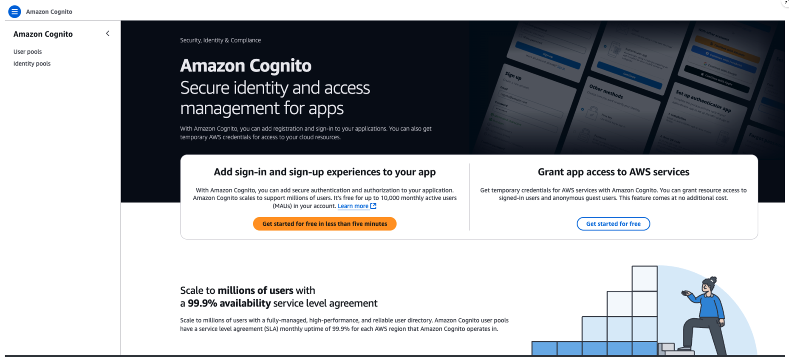

Amazon Cognito page in the AWS Management Console

#### Adding authentication to the Pet Shelter website

In this activity, you will start by implementing the ability to authenticate users through a login interface. However, you will not implement the ability to add or modify users from within the application. Rather, you will create employee user accounts through the Amazon Cognito console in an upcoming activity.

You will also apply authorization rules. This will ensure that only logged in users (who will all be employees) can access the following API endpoints or see the user interface components of the client application that accesses them:

* `GET /adoptions`
* `GET /adoptions/{id}`

#### Configure an Amazon Cognito user pool

Before employees can log in and access adoption applications, the AnyCompany Pet Shelter application must know who they are. Amazon Cognito `user pools` can be accessed by applications to check the credentials of users attempting to log in to the application. An Amazon Cognito user pool is a user directory for web and mobile application authentication and authorization.

The first step in getting started with this activity is to create a user pool. Complete the following steps in your practice environment.

1. At the top of the AWS Management Console, search for and choose `Cognito`.
2. In the left navigation pane, under Amazon Cognito, choose `User pools`. If the left navigation pane is not visible, choose the menu icon in the top-left corner and choose User pools.
3. Choose `Create user pool`.

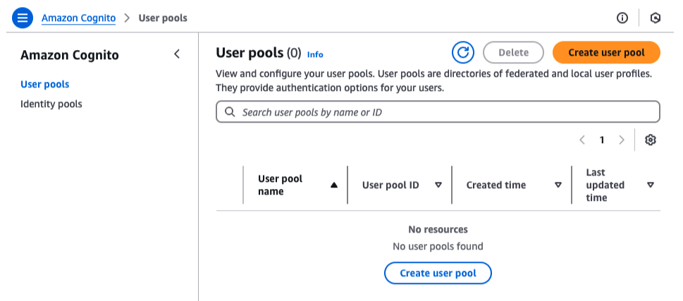

#### Task 1: Select Amazon Cognito configuration options

After proceeding with `Createuser pool`, you should now be on the `Set up resources for your application` page, which contains configuration options for your application. Here, you will define how users can log in to your application and specify a return URL, to which Amazon Cognito will redirect a user after they successfully log in. You will also rename the Amazon Cognito user pool with a human-friendly name.

In Amazon Cognito, the user pool name is a friendly identifier for the user pool that you are creating. The user pool itself is a collection of users for your application. The user pool name does not impact the functionality or security of your user pool. It is primarily used for identification and organization purposes in the AWS Management Console.

1. In the `Define your application` section, configure the following settings:

    * For `Application type`, select `Single-page application (SPA)`.
    * For `Name` your application, enter `pet-shelter-client`.

    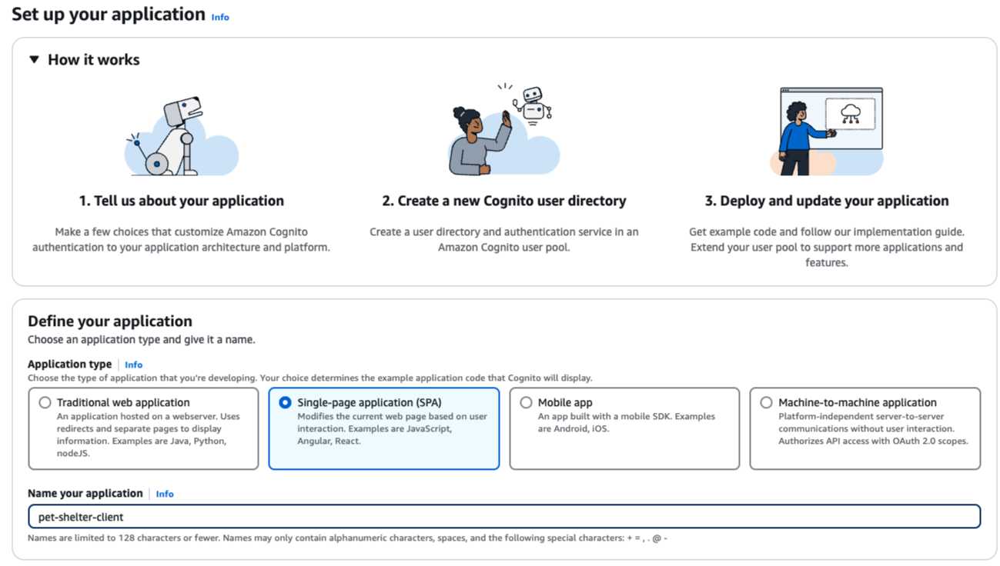

    A correctly configured Amazon Cognito application definition

2. In the `Configure options` section, configure the following settings:

    * For `Options for sign-in identifiers`, select `Email`. This selection means that users will log in to your application using their email address.
    * For `Required attributes for sign-up`, leave the default (no selection). This means that no other user attributes, such as name or phone number, are required for users to sign up for your application.

3. In the `Add a return URL — optional` section, for `Return URL`, you must have your client application, which is the React application, running. If your React application is running, copy the preview URL of the React application, and paste it into the `Return URL` text box. Amazon Cognito redirects to the `Return URL` after successful sign-in from the managed login page.

    If the React application is not running, complete the following steps to run it and obtain the return URL.

    1. Open the AWS supported integrated development environment (IDE) in the practice environment.
    2. Change the directory to the root folder of the React application with the following command: `cd ~/environment/pet-shelter-client/`
    3. Start the development server with `npm run dev`.
    4. Open the React application in a new browser tab.
    5. The URL in the browser should be similar to the following: `https://d38retsm4hd0zq.cloudfront.net/ports/8081/preview`.  
    6. To confirm that the URL is the correct address, choose `Home` in the application window.
    7. Copy the URL and paste it into the `Return URL` text box. Be sure to replace the `https://` that is already there.

    Ensure that the value you paste for the Return URL is the URL for the application's home page. You can ensure this by choosing Home on the UI, and it will take you to the correct home page URL. Also, ensure that there is no trailing forward slash (/) or pound symbol (#) at the end of the URL. It should end in /preview.

    You might also see the return URL referred to as a *callback* or *redirect URL*.

    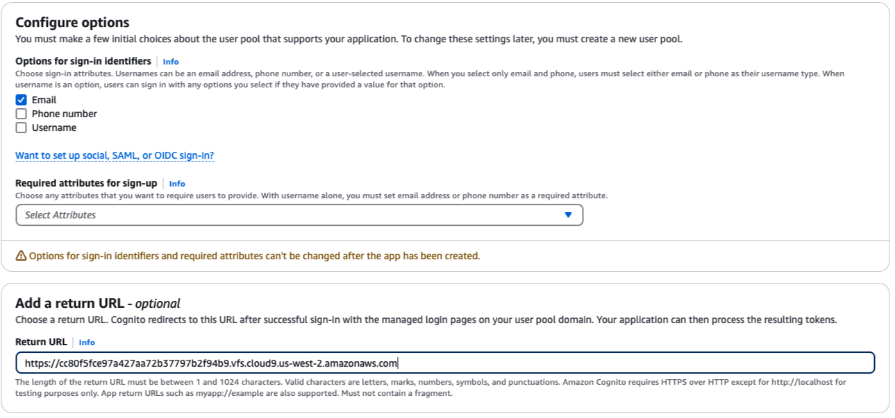

    The `Configure options` section should have `Email` checked for `Options for sign-in identifiers`. For the `Add a Return URL` section, the React application's preview URL should be entered in the `Return URL` text box.

4. Choose `Create user directory`. A banner message like the following should appear at the top of the page: `Your application "pet-shelter-client" and user pool "User pool - jzjnwv" have been created successfully! Follow the instruction to continue the setup.`

    **Note**: You can ignore the error message `[AccessDeniedException] An error occurred while applying managed login branding.` You will choose the branding for the login page in the next task.  

5. Now, you will rename your newly created user pool with a more human-friendly name. In the left navigation pane, under Amazon Cognito, choose `User pools`.
6. On the U`ser pools` page, select the link for the newly created user pool.
7. Choose `Rename`.
8. Enter `pet-shelter-app`.
9. Choose `Save` changes.

    The following banner message should appear at the top of the page: `User pool name has been updated successfully.`

---

#### Task 2: Configure the application’s verification and branding settings

Amazon Cognito provides a variety of features that streamline the process of securing your application. These include automatic attribute verification and user account confirmation, as well as managed login pages with custom styling.

In this task, you will turn off the attribute verification user account confirmation feature for the purposes of this activity. You will also choose Cognito Hosted UI (classic) for the login page branding. The Cognito Hosted UI is a prebuilt authentication interface provided by Amazon Cognito. It simplifies the process of user sign-up and sign-in by offering a customizable, ready-to-use UI. This eliminates the need for developers to build their own authentication pages from scratch. Use the Cognito Hosted UI option if you want a quick and secure way to implement user authentication without the need to design or manage the UI for sign-in, sign-up, and password recovery.

1. In the left navigation pane, under `Authentication`, choose `Sign-up`.
2. In the `Attribute verification and user account confirmation` section, choose `Edit`.
3. In the `Cognito-assisted verification and confirmation` section, under `Automatically send`, choose `Don’t automatically send messages`. Typically, you might allow Amazon Cognito to automatically send email or text messages to verify user attributes and confirm user accounts. However, for AnyCompany Pet Shelter, user accounts will be confirmed by administrators

    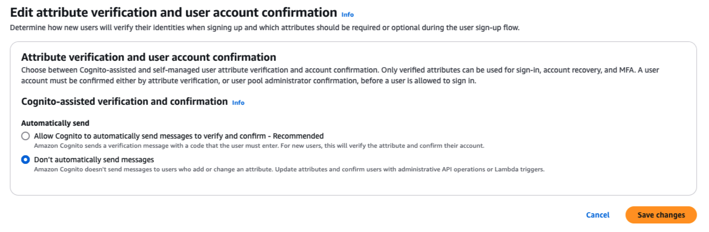

4. Choose `Save changes`. The following banner message should appear at the top of the page: `Attribute verification and user account confirmation has been updated successfully`.
5. In the left navigation pane, under `Branding`, choose `Domain`.
6. In the `Domain` section, choose `Actions`, and then select `Edit Cognito domain branding version`. The branding version determines the appearance of the login pages.
7. In the `Branding version` section, for `Version`, choose `Hosted UI (classic)`. This option uses the classic Amazon Cognito login page with limited styling options.

    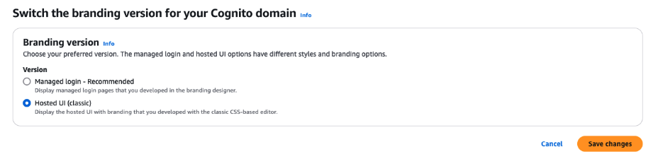

8. Choose `Save changes`.

    The following banner message should appear at the top of the page: `The branding version has been updated for Cognito domain successfully.`

---

#### Task 3: Configure advanced client security settings

In this task, you will specify a sign-out URL, which the user will be redirected to when they sign out of the application. You will also specify additional client security settings, including selecting an implicit grant flow for OAuth 2.0 and removing phone numbers from the OpenID Connect (OIDC) scopes.

1. In the left navigation pane, under `Applications`, choose `App clients`.
2. In the `App clients and analytic`s page, choose `pet-shelter-client`.
3. Choose the `Login pages` tab.
4. In the `Managed login pages configuration` section, choose `Edit`.
5. For `Allowed sign-out URLS - optional`, choose `Add sign-out URL`.
6. In the `URL` text box, enter the same URL that you entered for the `Return URL` in an earlier task. Ensure that there is no forward slash (`/`) at the end of the URL.
7. For `OAuth 2.0 grant types`, from the `Select OAuth 2.0 grant types` menu, configure the following settings:

    * Deselect `Authorization code grant`.
    * Select `Implicit grant`. You will see the following warning message: `The implicit grant flow exposes OAuth tokens in the URL. We recommend that you use only the authorization code flow with PKCE for public clients.` In this activity, you will be using an implicit grant flow for simplicity's sake. As the warning notes, the access and ID tokens are appended to the Return URL, and are thus visible throughout transmission. Using the `Authorization code grant` option instead sends a code to the callback URL. The application is then responsible for retrieving the user's tokens from the authentication token endpoint, which doesn't involve openly displaying any authentication information. However, this requires additional work on the part of your application.

8. For `OpenId Connect Scopes`, configure the following settings:

    * Next to `Phone`, select the `X` to remove it. Authenticated users are not required to provide their phone numbers when they sign up for the application. This action removes phone numbers from the attributes that the application client can retrieve for access tokens.
    * Ensure that `OpenID` and `Email` are selected.

    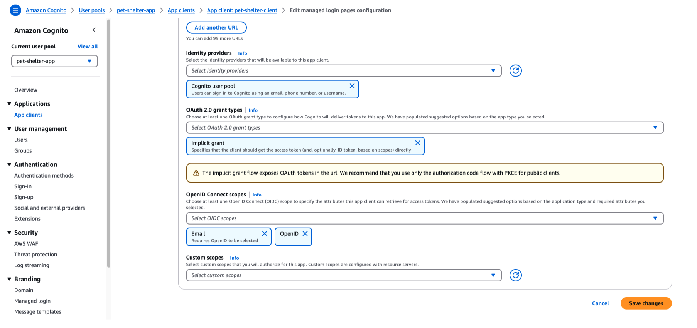

9. Choose `Save changes`.

    The following banner message should appear at the top of the page: `App client "pet-shelter-client" has been updated successfully.`

You successfully configured your Amazon Cognito user pool, tailoring it to meet the AnyCompany Pet Shelter application's specific authentication and user management requirements. By carefully setting up required user attributes, security requirements, and login experience, you laid a solid foundation for secure and user-friendly authentication processes.

### Access Tokens

At a high-level *access tokens* are:

* Critical for securely granting access to APIs and services without exposing sensitive credentials, like usernames and passwords.
* Short-lived and portable, and contain essential user and permission information.

You can use Amazon Cognito to help you work with access tokens. The service simplifies the integration process by automatically managing the issuance and validation of access tokens when users log in through a hosted UI. This allows you to use access tokens as an integral part of managing secure, scalable, and efficient user authentication and authorization in web and mobile applications.

#### Understanding access tokens

Access tokens are an important part of modern web authentication systems, including those provided by Amazon Cognito. An access token is a small, digitally signed piece of data (usually in the form of a JSON Web Token, or JWT) that proves the identity of the user and grants them access to specific resources. These tokens are issued by an authentication server (like Amazon Cognito) after a user successfully logs in. Access tokens allow users to interact with protected resources, such as APIs, while proving their authorization.

Access tokens provide a secure and efficient way to authenticate users and authorize their access to specific services. They have the following qualities:

* **Security**: Tokens can be encrypted and signed, and contain limited lifespans, ensuring that they are valid only for a short period (usually 1 hour).
* **Statelessness**: The server doesn’t have to store session data because the token carries all the necessary information.
* **Portability**: Access tokens can be passed between systems or microservices, allowing users to authenticate and interact with multiple parts of an application.

Using an access token prevents the need to continuously ask for usernames and passwords, because the token acts as proof that the user has already been authenticated.

##### How access tokens work

Access tokens play a crucial role in authentication and authorization processes, ensuring secure access to protected resources.

1. **User login**

    The user provides their credentials (such as username, email address, and password) to a service, like Amazon Cognito.

2. **Token issuance**

    If the credentials are correct, Amazon Cognito generates and returns an access token.

3. **Token usage**

    The client application (like React) stores the token in the browser using key-value storage. One common method for this is localStorage, which allows the token to persist across browser sessions (even after the browser is closed and reopened). This makes the token available until it is explicitly removed by the application or the user. However, although localStorage is convenient for storing tokens, it should be used carefully to avoid security risks, such as cross-site scripting (XSS) attacks.

4. **API calls**

    When the user wants to access a protected resource (like an API), the access *token* is included in the authorization header of the HTTP request.

5. **Server validation**

    The server receiving the API request validates the access token, ensuring that it is still valid and hasn't expired. If valid, the server grants access to the requested resource.

##### Example

Let’s say that you have a React application integrated with Amazon Cognito. After a user logs in through the Cognito Hosted UI, an access token is issued and stored in your application. When the user makes a request to the API (for example, viewing pet adoption applications), the token is included in the request. The API uses this token to verify that the user is authorized to access the requested data.

#### Tokens and Amazon Cognito

Amazon Cognito simplifies token management by automatically issuing, verifying, and refreshing three types of tokens after a successful user login.

* **Access tokens** are the primary token used to grant access to APIs and other protected resources.
* **ID tokens** contain user information, such as names or email addresses, for identification purposes.
* **Refresh tokens** enable an application to request a new access token without requiring a user to log in again, ensuring a seamless experience.

Here's an example of an access token that your React application might receive after logging in with Amazon Cognito.

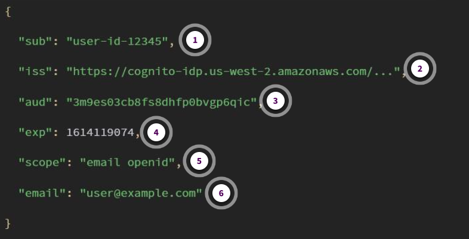

1. **sub**

    `"sub": "user-id-12345"`

    This field represents the unique user ID.

2. **iss**

    `"iss": "https://cognito-idp.us-west-2.amazonaws.com/..."`

    This field represents the issuer, in this case, Amazon Cognito.

3. **aud**

    `"aud": "3m9es03cb8fs8dhfp0bvgp6qic"`

    This field represents the client ID (the application).

4. **exp**

    `"exp": 1614119074`

    This field represents the expiration time, after which the token is no longer valid. This is represented in Unix time format, which is the number of seconds since the Unix epoch.

5. **scope**

    `"scope": "email openid"`

    This field represents the permissions granted to the user (for example, permissions for email and openid).

6. **email**

    `"email": "user@example.com"`

    This field represents the user's email address.

Access tokens are an integral part of managing secure, scalable, and efficient user authentication and authorization in web and mobile applications. Access tokens are secure, stateless, and portable, enabling users to interact with protected resources without constantly providing credentials.

Amazon Cognito can help streamline the process of working with access tokens by managing the issuance and validation of them when users log in through the Cognito Hosted UI.

### Activity: Pet Shelter – Authentication and Authorization Part 2

Now that you have a user pool set up, you must configure your application to integrate with Amazon Cognito. This involves three tasks — integrating the Amazon Cognito hosted login UI into the AnyCompany Pet Shelter application, configuring the website to integrate with a client React application, and creating an Employee Login button to enable access to the login UI.

#### Task 1: Integrate the Amazon Cognito hosted login UI

Before you modify your application to use the Amazon Cognito hosted login UI, you should make sure that the UI is working properly.

1. In the Amazon Cognito console, on the `User pools` page, choose `pet-shelter-app`.
2. Choose `App clients`, and then choose `pet-shelter-client`.
3. Choose `View login page`. A website opens and displays a login screen, as shown in the following image.

    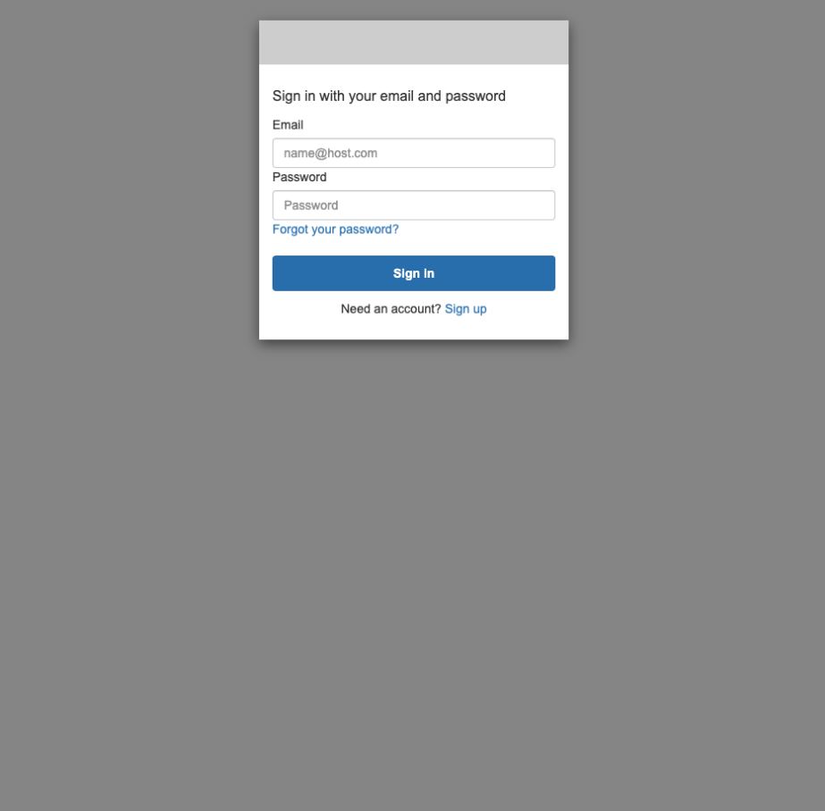

    Because you do not have a user to log in with yet, you can't log in. However, you will need part of the URL for this page in the next step.

    Take a close look at the URL. It should look similar to the following URL:

    `https://us-west-2oiglt5no9.auth.us-west-2.amazoncognito.com/login?client_id=ql7ihfc5d72qhmvpd1lovi65k&response_type=token&scope=email+openid&redirect_uri=https%3A%2F%2Fcc80f5fce97a427aa72b37797b2f94b9.vfs.XXXXX.us-west-2.amazonaws.com`.

4. Copy the portion that looks like `https://us-west-2oiglt5no9.auth.us-west-2.amazoncognito.com` into your clipboard. Make sure that you have nothing after `.com`, including a forward slash (`/`).

#### Task 2: Configure your website

For this task, you must load your AWS supported integrated development environment (IDE). You will be switching between Amazon Cognito and your IDE, so ensure that both are open in your browser.

1. In the IDE, open your application's `.env` file and append the following line. Replace the  `<authentication url>` placeholder with the URL that you copied in the previous task.

    `VITE_COGNITO_AUTH_URL=<authentication url>`

    The application will use this URL in API calls or redirects when handling user authentication, such as for a login process.

2. In the Amazon Cognito `User pools` page, choose `pet-shelter-app`.
3. In the left navigation pane, under `Applications`, choose `App clients`.
4. In the `App client` section, choose `pet-shelter-client`, and then copy the `Client ID`, which is an alphanumeric string.

    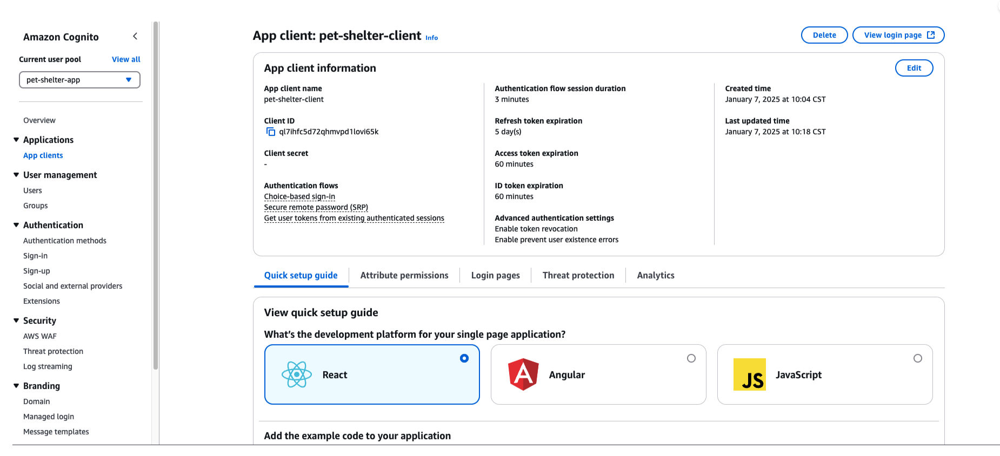

5. In the IDE, open the `.env` file, and append the following line to the file, replacing the placeholder `<cognito client id>` with the `Client I`D that you just copied.

    `VITE_CLIENT_ID=<cognito client id>`

    **Note**: A `client ID` is a unique identifier for your client application that is used by the Amazon Cognito hosted UI to ensure that tokens are associated with the correct application. Your React code will reference this when logging in and out.

6. Open a preview of the AnyCompany Pet Shelter React application, and copy the URL in the application preview. It should look like this:

    `https://abcde123456.cloudfront.net/ports/8081/preview`

    As before, make sure that there is nothing after `.com`, including a forward slash (`/`).

7. In your IDE, append the following line in the `.env` file, replacing the placeholder with the URL of the preview page, and save your changes.

    `VITE_REDIRECT_URI=<pets app URL>`

    This value — the application's home page — is the page that your React code will load after login and log out. Here, this is making the actual request for this page. In Amazon Cognito, you registered this URL as one that the login window is allowed to redirect to.

    After completing the Task 2 steps, your `.env` file should look similar to the following. Be sure to save your changes.

    ```bash
    VITE_API_GATEWAY_URL=https://9r15ae5.execute-api.us-west-2.amazonaws.com/Prod

    VITE_APP_S3_BUCKET_URL=https://images-75416-202806.3.us-west-2.amazonaws.com

    VITE_COGNITO_AUTH_URL=https://abc-2024-04-28.auth.us-west-2.amazoncognito.com

    VITE_CLIENT_ID=3m9es03cb8fs8dhfp0bvgp6qic

    VITE_REDIRECT_URI=https://a336f79ef3a226d.vfs.XXXXX.us-west-2.amazonaws.com
    ```

#### Task 3: Create an Employee Login button

The last piece of configuring your website is to update the React frontend to provide an `Employee Login` button to access the Amazon Cognito login UI.

---

In a previous step, you selected *single page application* as your type of application. As a result, the Amazon Cognito page for `pet-shelter-client` provides sample React, Angular, and vanilla JavaScript code that you can use to integrate Amazon Cognito functionality into your application. This code uses additional client libraries and can be useful to get started quickly. The code presented in this activity does not use additional libraries.

---

1. In the `pet-shelter-client/src/` directory, open the `App.jsx` file, and then replace the code with the following code.

    ```js
    import { useEffect, useState } from "react";
    // import reactLogo from './assets/react.svg'
    // import viteLogo from '/vite.svg'
    import "./styles.css";
    import {Routes, Route, Link, useNavigate} from "react-router-dom";
    import Header from "./components/Header";
    import Home from "./components/Home";
    import AboutUs from "./components/AboutUs";
    import Pets from "./components/Pets";
    import AdoptionForm from "./components/AdoptionForm";
    import Footer from "./components/Footer";
    import Applications from "./components/Applications";
    import ApplicationDetail from "./components/ApplicationDetail";
    import axios from "axios"

    
    // Import the .env variables containing Cognito configuration information
    const COGNITO_AUTH_URL = import.meta.env.VITE_COGNITO_AUTH_URL;
    const CLIENT_ID = import.meta.env.VITE_CLIENT_ID; 
    const REDIRECT_URI = import.meta.env.VITE_REDIRECT_URI;

    function App() {
    const API_GATEWAY_BASE_URL = import.meta.env.VITE_API_GATEWAY_URL;
    const S3_BUCKET_URL = import.meta.env.VITE_PET_IMAGES_BUCKET_URL;

    // -------------------- BEGIN COGNITO CODE -------------------------//
    
    
    
    const [isUserSignedIn, setIsUserSignedIn] = useState(false);

    const navigate = useNavigate();
    
    console.log(localStorage.getItem("accessToken"));
    
    useEffect(() => {
        if (
        localStorage.getItem("accessToken") == null ||
        localStorage.getItem("accessToken") == ""
        ) {
        if (window.location.hash != null && window.location.hash != "") {
            const str = window.location.hash;
            const regex = /#id_token=([^&]+)/;
            const match = str.match(regex);

            if (match) {
            const idTokenValue = match[1];
            console.log(idTokenValue); // Output: 'xxx'
            localStorage.setItem("accessToken", idTokenValue);
            // Clear the hash and navigate to home
            window.history.replaceState(null, null, window.location.pathname);
            navigate("/");
            } else {
            console.log("No match found");
            }
        }
        }
    }, [navigate]);

    useEffect(() => {
        // Check if accessToken is available in localStorage
        const accessToken = localStorage.getItem("accessToken");
        if (accessToken) {
        // If accessToken is available, set isUserSignedIn to true
        setIsUserSignedIn(true);
        } else {
        // If accessToken is not available, set isUserSignedIn to false
        setIsUserSignedIn(false);
        }
    }, []);
    
    const handleSignOut = () => {
        // Clear the ID token from localStorage
        localStorage.removeItem("accessToken");

        // Clear the entire localStorage
        localStorage.clear();

        // Wait
        setTimeout(() => {  
        window.location.href = `${COGNITO_AUTH_URL}/logout?client_id=${CLIENT_ID}&response_type=token&scope=email+openid&logout_uri=${REDIRECT_URI}&redirect_uri=${REDIRECT_URI}`;     
        }, 1000);
    };
        
        
    // END COGNITO CODE //
    
    useEffect(()=>{
        // get pets from api
        axios.get(`${API_GATEWAY_BASE_URL}/pets`)
        .then(res => {
            console.log(res.data);
            setPets(res.data.pets);
        })
        .catch(err => console.log(err))
    },[])
    const [pets, setPets] = useState([]);
    return (
        <div className="App">
        <Header isUserSignedIn={isUserSignedIn}/>
        {/* at the route /, the home compnent renders */}
        <main>
            <div>
            {isUserSignedIn ? (
                // Render content for signed-in users
                <div>
                <div>Signed in as employee</div>
                <button
                    onClick={handleSignOut}
                    style={{
                    color: "white",
                    backgroundColor: "red",
                    padding: "8px 16px",
                    border: "none",
                    borderRadius: "4px",
                    cursor: "pointer",
                    margin: "10px"
                    }}
                >
                    Sign Out
                </button>               
                </div>
            ) : (
                // Render content for signed-out users
                <div>
                <a href={`${COGNITO_AUTH_URL}/login?client_id=${CLIENT_ID}&response_type=token&scope=email+openid&redirect_uri=${REDIRECT_URI}`}>
                    <button
                    style={{
                        color: "white",
                        backgroundColor: "blue",
                        padding: "8px 16px",
                        border: "none",
                        borderRadius: "4px",
                        cursor: "pointer",
                        margin: "10px"
                    }}
                    >
                    Employee Sign In
                </button> 
                </a>               
                </div>
            )}
            </div>
            <Routes>
            <Route path="/" element={<Home />} />
            <Route path="/about" element={<AboutUs />} />
            <Route path="/pets" element={<Pets pets={pets}/>} />
            <Route path="/adopt" element={<AdoptionForm pets={pets}/>} />
            <Route path="/applications" element={<Applications />} />
            <Route path="/applications/:id" element={<ApplicationDetail/>}/>
            {/* Catch-all route */}
            <Route path="*" element={<Home />} />
            </Routes>
        </main>
        <Footer/>
        </div>
    );
    }

    export default App;
    ```

2. In the `pet-shelter-client/src/components` directory, open the `Header.jsx` file, and then replace the code with the following code.

    ```js
    import React from 'react'
    import logo from '../assets/logo.png'
    import { Link } from 'react-router-dom'

    const S3_BUCKET_URL = import.meta.env.VITE_PET_IMAGES_BUCKET_URL;

    const Header = ({isUserSignedIn}) => {
    return (
        <div className='header'>
            <div className='header-title'>
                {/*  */}
                
                <h1>AnyCompany Pet Shelter</h1>
            </div>
            <nav className='navigation'>
                <ul>
                    <li><Link to="/">Home</Link></li>
                    <li><Link to="/about">About Us</Link></li>
                    <li><Link to="/pets">Pets</Link></li>
                    <li><Link to="/adopt">Adopt</Link></li>
                    {
                        isUserSignedIn ?
                            <li><Link to="/applications">Applications</Link></li>
                        : null   
                    }

                </ul>
            </nav>
            
        </div>
    )
    }

    export default Header
    ```

---

#### Understanding the changes

So far, you have modified the React application in the following ways:

* Established Amazon Cognito configuration constants
* Coded a user sign-in state using access tokens
* Wrote code to check whether a user is signed in
* Coded a user sign-out process
* Rendered the Applications page link in the header conditionally

##### Established Amazon Cognito configuration constants

###### What it does

* **COGNITO_AUTH_URL** is the URL for the Amazon Cognito hosted UI. It is the page provided by Amazon Cognito that allows users to sign in, sign up, or reset their password. This hosted UI handles the authentication process for you.
* **CLIENT_ID** is the App client ID for your Amazon Cognito user pool. It identifies the specific client (your React application) that will interact with Amazon Cognito to perform authentication.
* **REDIRECT_URI** is the URL to which Amazon Cognito will send to the user after they've logged in successfully. In this case, it's the URL where your React application is hosted. Amazon Cognito will append a token (such as an ID token) to the URL, allowing your application to authenticate the user.

###### Why it's needed

These variables are necessary for integrating your React application with Cognito’s hosted UI for authentication. **COGNITO_AUTH_URL** tells your application the location of the login page. **CLIENT_ID** identifies the application interacting with Amazon Cognito, and the **REDIRECT_URI** is where the user is sent after they successfully authenticate.

```js
const COGNITO_AUTH_URL = import.meta.env.VITE_COGNITO_AUTH_URL
const CLIENT_ID = import.meta. env.VITE_CLIENT_ID
const REDIRECT_URI = import.meta.env.VITE_REDIRECT_URI
```

##### Coded a user sign-in state using access tokens

###### What it does

Using access tokens lets your application keep a user logged in.

* **isUserSignedIn**: This is a state variable that tracks whether a user is signed in.
* **Access token storage**: When the user is successfully authenticated by the Amazon Cognito hosted UI, the application checks whether an access token is already stored in the browser’s local storage. If no token exists but the URL contains a token (in window.location.hash), the code extracts the token and stores it in local storage for future use.

###### Why it's needed

Access token storage is important because when a user logs in through Amazon Cognito, your application must store the token (which contains the user’s session information) locally. This token determines whether the user is signed in and manages access to the application's content.

---

```js
const [isUserSignedIn, setIsUserSignedIn] = useState(false);

  const navigate = useNavigate();
  
  console.log(localStorage.getItem("accessToken"));
  
  useEffect(() => {
    if (
      localStorage.getItem("accessToken") == null ||
      localStorage.getItem("accessToken") == ""
    ) {
      if (window.location.hash != null && window.location.hash != "") {
        const str = window.location.hash;
        const regex = /#id_token=([^&]+)/;
        const match = str.match(regex);

        if (match) {
          const idTokenValue = match[1];
          console.log(idTokenValue); // Output: 'xxx'
          localStorage.setItem("accessToken", idTokenValue);
          // Clear the hash and navigate to home
          window.history.replaceState(null, null, window.location.pathname);
          navigate("/");
        } else {
          console.log("No match found");
        }
      }
    }
  }, [navigate]);
```

##### Wrote code to check whether a user is signed in

###### What it does

This code runs when the application first loads (inside a `useEffect` hook). It checks whether an `accessToken` exists in `localStorage`. If the token is found, the application considers the user as signed in (`setIsUserSignedIn(true)`). Otherwise, it considers the user as signed out `(setIsUserSignedIn(false))`.

###### Why it's needed

This is necessary for persisting the user's login session across page reloads. Even if the user reloads the page or navigates away, they will remain signed in for as long as the `accessToken` exists in `localStorage`.

```js
useEffect( => {
    // Check if accessToken is available in localStorage
    const accessToken = localStorage.getItem("accessToken");
    if (accessToken) {
        // If accessToken is available, set isUserSignedIn to true
        setIsUserSignedIn(true);
    } else {
        // If accessToken is not available, set isUserSignedIn to false
        setIsUserSignedIn(false);
    }
}, [])；
```

---

##### Coded a user sign-out process

###### What it does

* **Sign-out process**: When a user chooses the `Sign Out` button, this function removes the stored `accessToken` from `localStorage`, effectively signing out the user.
* **Redirect to the Amazon Cognito logout URL**: After a small delay (`setTimeout`), the user is redirected to the Amazon Cognito logout page. This invalidates their session, and after logging out, they are redirected back to the application's `REDIRECT_URI`.

###### Why it's needed

This allows your application to properly handle user sign-out by clearing their session and making sure that they are logged out from Amazon Cognito, not just from the local application.

```js
const handleSignOut = 0 => {
    // Clear the ID token from localStorage
    localStorage.removeItem('accessToken')
    // Clear the entire localStorage
    localStorage.clear()
    // Wait
    setTimeout(() = {
        window. location.href = `${COGNITO_AUTH_URL}/logout?client_id=${CLIENT_ID}
        &response_type=token&scope=email+openid&
        logout_uri=${REDIRECT_URI}&redirect_uri=${REDIRECT_URI}`
    }, 1000)
}
```

---

##### Rendered the Applications page link in the header conditionally

###### What it does

The following code snippet renders the `Applications` link on the page if the user is signed in. This is an example of *conditional rendering* in React. It checks whether the user is signed in by looking at the `isUserSignedIn` state.

* If `isUserSignedIn` is `true` (meaning that the user is signed in), it renders a link to the Applications page.
* If `isUserSignedIn` is `false`, it renders nothing (null).

###### Why it's needed

This allows your application to show or hide certain parts of the UI based on whether the user is signed in. In this case, only authenticated users should be able to access the Applications page, so the link is hidden for users who are not signed in.

```js
{
    isUserSignedIn ?
    ‹li>Link to="/applications">Applications</Link></li>
    : null
}
```

---

#### Summary of the changes

The following is a brief summary of the changes that were made to the code and the purpose of each change.

* **Cognito configuration** (`COGNITO_AUTH_URL`, `CLIENT_ID`, `REDIRECT_URI`) helps set up authentication with the Amazon Cognito hosted UI.
* **Sign-in state management** allows the application to track whether a user is signed in by storing the token and checking it on each page load.
* **Sign-out process** clears the user's session and logs the user out of Amazon Cognito.
* **Conditional rendering** makes sure that only signed-in users see certain links, like the `Applications` link.

#### Verify the changes

To verify the changes, load or reload the application's home page and confirm the following:

* **Employee Login** button is visible.
* **Applications** link is not visible.
* Choosing `Employee Login` brings up the Amazon Cognito login UI.

You will not be able to log in yet, because there are no users in the system.

This completes the integration of the Amazon Cognito hosted UI into your website.

Next, you will create a user in the Amazon Cognito user pool that will represent an employee who can log in and access the page containing information about adoption applications. You will also learn about an Amazon API Gateway authorizer and configure it so that the backend AWS Serverless Application Model (AWS SAM) application is secured from public access.

### Activity: Pet Shelter – Authentication and Authorization Part 3

#### What you've accomplished

You configured an `Amazon Cognito user pool` and `made it ready to integrate with a client React application`. You also modified the frontend application so that users who are not logged in do not see the link to get to the adoptions Applications page.

Currently, there is nothing stopping someone from accessing the Applications page by just using the URL address bar to go to the `/applications` page. This is where the Amazon API Gateway authorizer comes in.

#### How does an authorizer work?

An authorizer works by validating the request token (often an access token), confirming that the user is who they claim to be and that they have permission to access the specific resource.

```text
By implementing an authorizer, you add a layer of security to your API. It makes sure that requests to your endpoints come from authorized users, preventing unauthorized access to sensitive information. For example, when a user tries to view the adoption list, the authorizer checks the token provided in the request to verify the user’s identity before allowing access.
```

#### What's next

Next, you will create a user for the Amazon Cognito user pool. Then, you will create an API Gateway authorizer and use it to secure your application's endpoints. This is crucial for making sure that only authenticated and authorized users can access sensitive data, like the pet adoption list or application details.

Accomplishing all of this will involve four tasks — creating a user for the user pool, creating an API Gateway authorizer, applying the authorizer to the endpoint, and updating the React application to provide access tokens to the authorizer.

#### Task 1: Create a user for the Amazon Cognito user pool

In this task, you will create a test employee user account for the pet shelter application and log in to the application.

1. In Amazon Cognito, navigate to the `User pools` page and choose `pet-shelter-app`.
2. In the left navigation pane, under `User management`, choose `Users`.
3. Choose `Create user`.
4. Choose `Don't send an invitation`, and choose `Set a password`.
5. Enter an email, such as `jane_doe@example.com`, and select `Mark email address as verified`. For `Temporary password`, choose a temporary password, such as the straightforward (and very weak) `Password1!`. Remember your password or record it somewhere so you can use it to log in later.
6. Leave the other options as defaults and choose `Create user`.

    A banner should appear indicating that User `“jane_doe@example.com” has been created successfully`.

    Now, you can use the email and password that you just created to log in. This time, the Applications link will appear, with a red button for logging out.

7. In your AWS supported integrated development environment (IDE), open the website preview, and choose `Employee login`.
8. Enter the email and password that you just created.
9. If you successfully log in, you will be prompted to change your password. Enter a new password of your choice, such as `Dogs&Cats123`!`. Save your password in a note or text file so you can refer to it, if needed.


When you enter your new password, you should be redirected back to the AnyCompany Pet Shelter website. There should now be a message at the top of the page that states, `Signed in as employee`. The `Employee sign in` button should be a `Sign Out` button, and the Applications link should be included in the top navigation bar, as shown in the image.

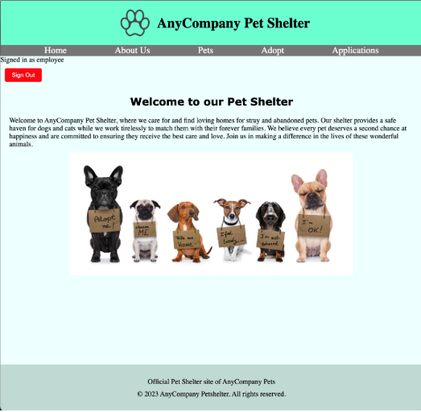

---

#### Task 2: Create an Amazon API Gateway authorizer

Before you create an Amazon API Gateway authorizer, you must first complete the following steps.

1. Choose `Sign out` to log out of the application. Note that the Applications link is no longer present.
2. Append `#/applications` to the end of the URL in the URL bar of the now-logged-out page, so that the URL looks like the following: `https://abcde12345.cloudfront.net/ports/8081/preview#/applications`

##### Task 2.1: Understanding URL hacking

Up to this point, all you've done is hide the link to the Applications page from non-logged-in users, but the page itself is still publicly accessible. This means that although the link might be hidden, anyone who knows or guesses the URL (for example, by typing `/applications` after the home page URL) can still access it. This is a form of a simple vulnerability known as *URL hacking*.

###### More about URL hacking

Only presenting a link or button to logged-in users is good UI design, but it's not securing the site. You must ensure that the API calls themselves are filtered through an authentication system if only authorized users should be accessing them. There are many frameworks that provide this functionality. Amazon API Gateway provides this service for AWS hosted applications.

URL hacking occurs when someone manually enters a specific URL to access pages that are not properly secured. In this case, you’ve unintentionally left the applications page exposed, because there’s no behind-the-scenes protection preventing unauthorized users from accessing it. It’s a common issue that arises when developers hide links to sensitive content without securing the endpoints on the backend.

To prevent this, you must secure your API endpoints, like the `/applications` endpoint, by using an API Gateway authorizer. This ensures that even if someone tries to access the page directly through the URL, they won’t be able to see any data unless they’re properly authenticated and authorized.

---

Additionally, someone can still use the curl command to access the API endpoint for getting all adoptions. For example, if you run the curl command to get the adoption applications data, you will see that it’s still accessible to public users.

You can test this in your AWS supported IDE by running a `curl` command while completing the following steps. Be sure to replace the endpoint URL with the endpoint URL for your `/adoptions`.

You can get this from the outputs generated when you deployed your AWS Serverless Application Model (AWS SAM) template.

3. In the AWS Management Console, search for and select `AWS CloudFormation`.
4. Choose your stack (`sam-app`), and choose `Outputs`.
5. Copy the value for the `GetAdoptionsAPIEndpoint`.
6. Run the `curl` command, and paste the value for the `GetAdoptionsAPIEndpoint` after it, as shown in this example:
`curl https://8ivorbx3t8.execute-api.us-east-1.amazonaws.com/Prod/adoptions/`

Notice that you get back the adoption application data. To solve this problem, you must secure the backend using an API Gateway authorizer.

###### Implementing an API Gateway Authorizer

Begin by navigating to the API Gateway console. From the console, choose the link for your deployed API. It might be named `sam-app` or whatever you named it when you deployed the AWS SAM template. Then view the following options as configured on the API Gateway console API page.

7. In the AWS Management Console, navigate to `Amazon API Gatewa`y, and choose the link for your deployed API. It should be named `pets-backend`.
8. In the left navigation pane, choose `Authorizers`, and then choose `Create authorizer`.
9. On the `create authorizer` page, configure the following settings:

    * For `Authorizer name`, enter `pets_app_authorizer`.
    * For `Authorizer` type, choose `Cognito`.
    * For `Cognito User Pool`, next to `LabRegion`, choose `pet-shelter-app`.
    * For `Token Source`, enter `Authorization`.
    * For `Token Validation` - optional, leave it blank.

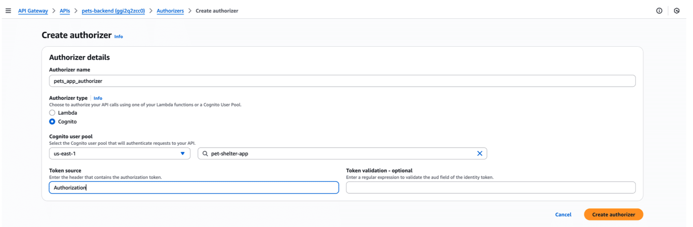

The name here is simply the name of the authorizer. You will use this to attach the authorizer to your endpoints. You also set up Amazon Cognito as your authorizer and `pets_app` as your user pool. The token source is a header name for the access token that Amazon Cognito returns. It must be named this.

10. When the success banner appears, choose `pets_app_authorizer`, and then choose `Test Authorizer`.

You should see a response containing Unauthorized request: followed by a long hexadecimal string.

---

#### Task 3: Apply the authorizer to the /adoptions endpoint

The last component of securing your application is to configure your new authorizer to intercept calls to the two APIs that should not be public. This lesson takes you through this process for `GET /adoptions`. You will then apply the same process for securing `GET /adoptions/{id}`. These are the underlying API calls that the React application makes for URIs ending in `/applications` and `/applications/{id}`.

To secure the `/adoptions` endpoint, you must configure requests to that endpoint to call Amazon Cognito to verify authorization.

1. In the Amazon API Gateway console, in the left navigation pane, choose `Resources`.
2. Expand `Resources`, and choose `/adoptions`.
3. Expand `/adoptions`, and choose `GET`.
4. Choose the `Method Request` tab.
5. Choose `Edit` to enable editing.
6. On the `Authorization` menu, under `Cognito user pool authorizers`, choose `pets_app_authorizer`.
7. Expand `HTTP request headers`, and then choose `Add header`.
8. For Name, enter `Authorization`, select `Required`, and choose `Save`.
9. To deploy this update to the REST API, choose `/` in the `Resources` tree. There is the root of the Pet Shelter API.
10. Choose `Deploy API`.
11. For `Stage`, select `Prod`, and then choose `Deploy` to deploy the authorization check to production.
12. In your development environment, return to (or reopen) the React website. While not **logged** in, try to add `/applications` to the end of the URL.

    Notice that you can no longer access the adoptions API data through URL hacking.

13. Now, log in to the page using the credentials that you created earlier, and choose the `Applications` link. The change might take a few minutes for the authorizer to take effect. When the API changes have been fully deployed, the Applications page should no longer display applications. Opening the browser inspector shows a `401 Unauthorized error` code for the request to the `/adoptions` endpoint.

    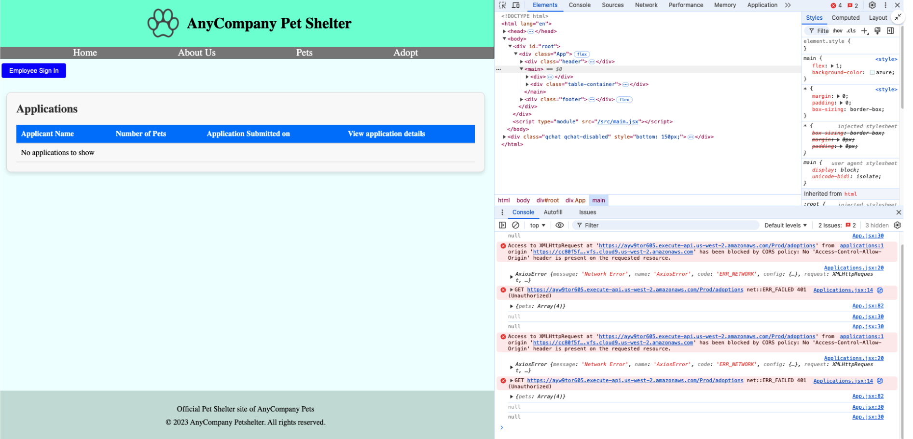

This 401 Unauthorized error occurs in the client because React's handling of the `/applications` route hasn't changed. It doesn't include an authentication token to tell the authorizer that a member of the chosen user pool is attempting access. You will add that token to the request in the next task.

If you run the following `curl` command in the terminal for the `/adoptions` endpoint, you will see that the `curl` command to get all adoptions also doesn’t work anymore. Instead, you will get an "Unauthorized" message.

```bash
ubuntu@ip-10-10-10-218:~/environment/backend$ curl https://ggi2q2zcc0.execute-api.us-east-1.amazonaws.com/Prod/adoptions/
{"message": "Unauthorized"}
```

Before you update the React code's request syntax, you have a choice in how to proceed.

As previously noted, the final part of this activity is to configure the `/adoptions/{id}` endpoint to work with your authorizer. If you want, you can apply the authorizer to both endpoints before moving on to updating the request in the React code. Otherwise, you can finish `/adoptions` first and then complete `/adoptions{id}` all at once.

---

#### Task 4: Update the React application to provide access tokens to the authorizer

In this task, you will update the React application to provide access tokens to the Amazon API Gateway authorizer.

1. In your IDE, load `Applications.jsx`. The code for the API call should look like the following code snippet.

```js
axios.get('${API_GATEWAY_BASE_URL}/adoptions')
    .then((response) => {
        console.log('successfully got applications from table', response.data); 
        setApplications(response.data); 
    })
    .catch((error) => {
        console.log(error);  
    }):
```

The request from the React webpage is essentially the same as the curl request. It calls `/adoptions`, but it does so without any authentication information.

To correct this, you must add a header to the GET request. The header will have the key `Authorization`, which will contain the access token that lets the backend API know that you are authorized to access the resource. After these changes are made, the `Applications.jsx` will look like the following code.

```js
import React, {useEffect, useState} from "react";
import {Link} from 'react-router-dom'
import axios from "axios";

const formatDate = (dateString) => dateString.split('T')[0];

const Applications = () => {
  const API_GATEWAY_BASE_URL = import.meta.env.VITE_API_GATEWAY_URL;
  const [applications, setApplications] = useState([]);
  
  const accessToken = localStorage.getItem("accessToken");

//   get applications from api
  useEffect(() => {
        // use axios to get applications
        axios.get(`${API_GATEWAY_BASE_URL}/adoptions`, {
            headers: {
              Authorization: `Bearer ${accessToken}`,
              "Content-Type": "application/json",
            },
        })
            .then((response) => {
                console.log('successfully got applications from table', response.data);
                setApplications(response.data);
            })
            .catch((error) => {
                console.log(error);
            });
    }, []);

  return <div className="table-container">
    <h3>Applications</h3>
    
    {/* table that loops through all the applications. Each application has properties: appliant_name, email, phone, pet_id, pet_name, species, submitted_at */}
    <table>
        <thead>
            <tr>
                <th>Applicant Name</th>
                <th>Number of Pets</th>
                <th>Application Submitted on</th>
                <th>View application details</th>
            </tr>
        </thead>
        <tbody>
            {/* if applications is empty list, show one row that says "No applications to show" */}
            {applications.length === 0 && (
                <tr>
                    <td colSpan="7">No applications to show</td>
                </tr>
            )}
            {applications.map((application) => (
                <tr key={application.id}>
                    <td>{application.applicant_name}</td>
                    <td>{application.pets.length}</td>
                    <td>{formatDate(application.submitted_at)}</td>
                    <td><Link to={`/applications/${application.id}`}>View Details</Link></td>
                </tr>
            ))}
        </tbody>
    </table>
  </div>;
};

export default Applications;
```

2. Copy the preceding code and replace the code in `Applications.jsx`.

The following lines of code were added to the original API call code.

This line of code was added above the API call.

```js
const accessToken = localStorage.getItem("accessToken"):
```

This code was added to the code calling the API directly.

```js
axios.get('${API_GATEWAY_BASE_URL}/adoptions', {
    headers: {  Authorization: 'Bearer ${accessToken}',
                "Content-Type": "application/json",
    },
})
```

Now, you can return to the running application in your development environment to test your code. If you attempt to access the adoptions list by adding `/applications` to the URL, it will fail because there is no access token to send. If you are logged in and either choose the `Applications` link or add `/applications` to the URL, you will retrieve the list of adoption applications.

Be sure to add similar logic that retrieves the access token and adds it to the GET request headers to `ApplicationDetail.jsx` if you added the API Gateway Authorizer to that endpoint as well.

#### AWS SAM templates with Amazon Cognito

No further action is needed in this part of the AnyCompany Pet Shelter application implementation. However, if you are wondering how the Amazon Cognito configuration process could be represented as an AWS SAM template for future deployments, the following code shows how it would look.

```yaml
CognitoUserPool:
    Type: AWS::Cognito::UserPool
    Properties:
      UserPoolName: pets-app
      UsernameAttributes:
        - email
      UsernameConfiguration:
        CaseSensitive: false
      Policies:
        PasswordPolicy:
          MinimumLength: 8
          RequireLowercase: true
          RequireNumbers: true
          RequireSymbols: true
          RequireUppercase: true
      EmailConfiguration:
        EmailSendingAccount: COGNITO_DEFAULT
      AutoVerifiedAttributes:
        - email
      AccountRecoverySetting:
        RecoveryMechanisms:
          - Name: verified_email
            Priority: 1
      AdminCreateUserConfig:
            AllowAdminCreateUserOnly: true
      
  CognitoUserPoolClient:
    Type: AWS::Cognito::UserPoolClient
    Properties:
      ClientName: pets-app-client
      UserPoolId: !Ref CognitoUserPool
      AccessTokenValidity: 1
      IdTokenValidity: 1
      ExplicitAuthFlows:
        - ALLOW_REFRESH_TOKEN_AUTH
        - ALLOW_USER_SRP_AUTH
      AllowedOAuthFlowsUserPoolClient: true  
      AllowedOAuthFlows:
        - implicit
      AllowedOAuthScopes:
        - email
        - openid
        - aws.cognito.signin.user.admin
      CallbackURLs:
        - https://UNIQUE-ID.vfs.XXXXX.REGION.amazonaws.com # REPLACE WITH PETS APP XXXXX DOMAIN URL
      LogoutURLs:
        - https://UNIQUE-ID.vfs.XXXXX.REGION.amazonaws.com # REPLACE WITH PETS APP XXXXX DOMAIN URL
      SupportedIdentityProviders:
        - COGNITO

  CognitoUserPoolDomain:
    Type: AWS::Cognito::UserPoolDomain
    Properties:
      Domain: jane-doe-2024-07-23-pet # REPLACE with something unique, such as using your initials and the current date for the domain name; for example, abc-2024-04-28. You can add extra characters if needed.
      UserPoolId: !Ref CognitoUserPool
```

The sample code shows the AWS SAM template method of configuring Amazon Cognito in a way similar to what you configured. This is just for informational purposes. Do not deploy this AWS SAM template code.

### Knowledge Check

#### What is the purpose of an application client in an Amazon Cognito user pool?

* Provides a configuration that interacts with a mobile or web application for authentication operations

Wrong answers:

* Provides a UI for capturing authentication credentials
* Provides a template for building a client application that authenticates using the user pool
* Provides a client application to perform unit testing of authentication operations

##### Explanation

The other options are incorrect for the following reasons:

* The hosted UI, not application client, feature of Amazon Cognito provides a user interface for capturing authentication credentials.
* Amazon Cognito does not provide a template or unit testing client to implement or test authentication operations.

#### A developer is creating an Amazon Cognito user pool for an application and is configuring the client security settings. What is the purpose of the sign-out URL in the client configuration options?

* Redirects the user to a specific webpage after signing out of the application

Wrong answers:

* Authenticates users during the sign-out process
* Enables the sign-out functionality in the application
* Logs the sign-out events for troubleshooting and auditing purposes

##### Explanation

The sign-out URL is a configuration option in Amazon Cognito that specifies a URL where users will be redirected after successfully signing out of the application.

The other options are incorrect for the following reasons:

* The sign-out URL is not directly used for authentication purposes during the sign-out process. Rather, it redirects the user to a specified webpage after successful sign-out.
* Although the sign-out URL can be useful for redirecting users after sign-out, it is not a required configuration option to enable the sign-out functionality itself.
* The sign-out URL is not used for logging or auditing purposes. It is a configuration option to redirect users to a specific webpage after signing out.

#### A developer is building a web application. They want to allow authenticated users to write data to an Amazon DynamoDB table and unauthenticated users to read data from the table. Which Amazon Cognito feature should the developer use to implement this requirement?

* Identity pool

Wrong answers:

* Hosted UI
* User pool
* Multi-factor authentication

##### Explanation

An identity pool handles authorization to access AWS services based on the user’s identity. With an identity pool, you can assign an AWS Identity and Access Management (IAM) role to authenticated users, and configure a default IAM role for unauthenticated users.

The other options are incorrect for the following reasons:

* A user pool handles authentication and authorization to access application functions or APIs.
* A hosted UI collects authentication credentials from the user and does not perform any authorization.
* Multi-factor authentication is a feature that provides additional security when authenticating a user. It does not perform authorization.

### Summary

* Authentication and authorization protect confidential information, such as personally identifiable information (PII).
* How to create an Amazon Cognito user pool by configuring login and user registration rules.
* How to connect the user pool to an application.
* How to configure an application to use the Amazon Cognito hosted login UI.
* How to create a user and logging in with the Amazon Cognito hosted UI.
* How to configure an Amazon API Gateway to to intercept traffic.
* How to update React code for an application to provide API Gateway with the proper access token to allow logged-in users to access the two endpoints.

### Additional Resources

* [Simple Demographics Often Identify People Uniquely](https://dataprivacylab.org/projects/identifiability/paper1.pdf)
* [Amazon Cognito](https://docs.aws.amazon.com/cognito/latest/developerguide/what-is-amazon-cognito.html)
* [Amazon Cognito features](https://docs.aws.amazon.com/cognito/latest/developerguide/what-is-amazon-cognito.html#what-is-amazon-cognito-features)
* [Using Amazon Cognito user pools security features](https://docs.aws.amazon.com/cognito/latest/developerguide/managing-security.html)
* [Advanced security with threat protection](https://docs.aws.amazon.com/cognito/latest/developerguide/cognito-user-pool-settings-threat-protection.html)
* [Control access to REST APIs using Amazon Cognito user pools as an authorizer](https://docs.aws.amazon.com/apigateway/latest/developerguide/apigateway-integrate-with-cognito.html)
* [Other application options](https://docs.aws.amazon.com/cognito/latest/developerguide/getting-started-user-pools-application-other-options.html)

## HANDS-ON LAB ACTIVITY

### Lab: Adding Authentication and Authorization to an App
