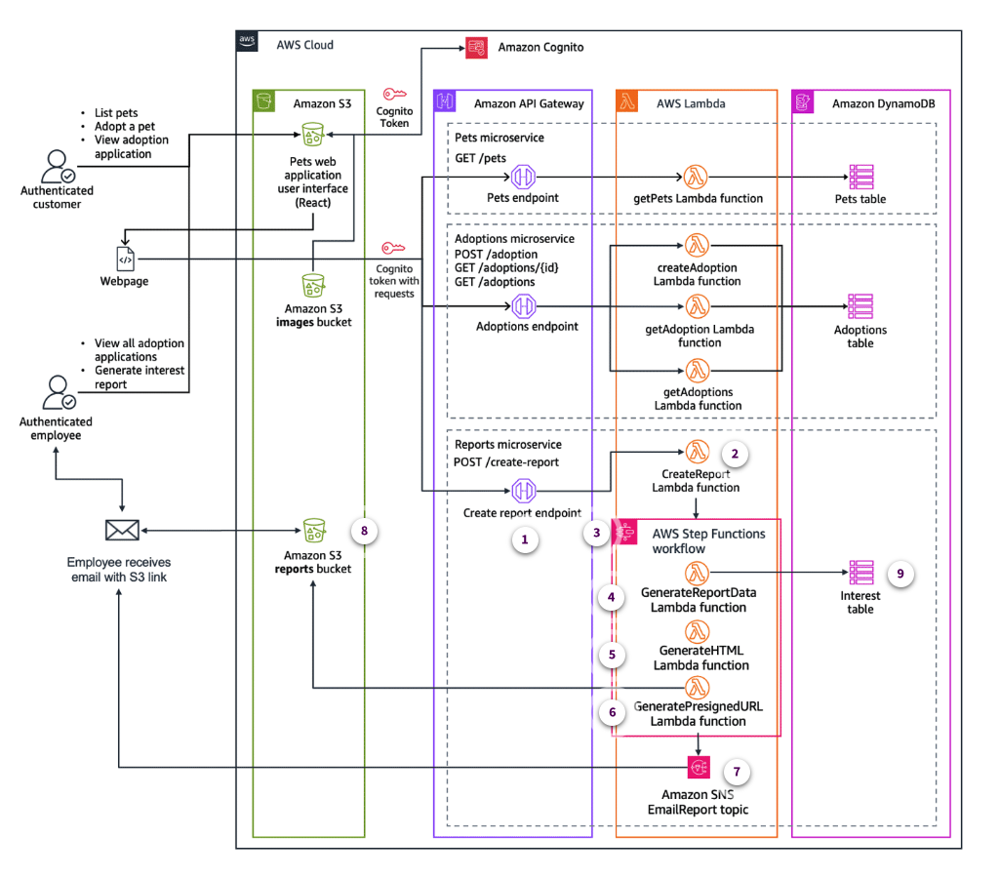

# DI2 Week 6: Adding a Reporting Microservice

* back to AWS Cloud Institute repo's root [aci.md](../aci.md)
* back to [Developer Intermediate 2](./developer-intermediate-2.md)
* back to repo's main [README.md](../../../README.md)

## Adding a Reporting Microservice

### Weekly Overview

You created authentication and authorization for AnyCompany Pet Shelter’s application. This made the personally identifiable information of prospective pet adopters more secure.

Now that AnyCompany Pet Shelter can securely take adoption applications online, they have noticed certain pets are receiving significantly more adoption requests than others. To better understand these adoption trends, the shelter now aims to track adoption interest data.

AnyCompany Pet Shelter employees also want to be able to generate reports on which pets people are interested in. These reports will help them cater their marketing and social media campaigns to focus on pets who might be having trouble finding their forever homes.

First, you will review the serverless microservices architecture in the AWS Serverless Application Model, or AWS SAM, template. This can help you to determine which updates will be required to create a reporting microservice.

Then, you will create an AWS Step Functions state machine to coordinate and orchestrate a workflow for report generation. With AWS Step Functions, you can coordinate between components of your microservices. This includes using AWS Lambda to query pet interest data from an Amazon DynamoDB table.

Next, you will use Lambda to create an HTML report and store it in an Amazon Simple Storage Service, or Amazon S3, bucket.

The last thing you must do is set up a Lambda function to make the report securely accessible to shelter employees. You can accomplish this by using Lambda to configure a presigned URL.

Finally, the state machine will trigger an email notification to an employee using Amazon Simple Notification Service, or Amazon SNS. This email will include a presigned URL. With this URL, the employee can securely access the pet interest report data.

#### Requirements

The pet shelter has been receiving an increasing number of adoption applications, and the staff wants to make more informed decisions about which pets to promote in their adoption campaigns.

They realize that having insight into how many times each pet has been requested for adoption would allow them to better understand which animals are attracting more interest.

This data could help them focus their marketing efforts on pets with fewer requests, to make sure that all pets have an equal chance of finding a home.

To achieve this, the shelter decides to implement a new reporting feature that tracks adoption interest for each pet and generates reports for their staff.

To provide better insight into how often each pet is being requested for adoption, the pet shelter needs a new system to track this data.

This led to the creation of the pets `Interest` Amazon DynamoDB table, which will store information about the number of adoption requests that each pet receives.

By combining this data with the existing `Pets` DynamoDB table, the shelter can generate comprehensive reports showing both pet details and their adoption interest levels. These reports will help employees make more informed decisions, track trends in adoption interest, and ultimately improve pet adoption rates.

#### Reporting microservice architecture

To see a description of the architecture diagram, expand the Architecture changes category.

Architecture changes
Combining Pets table and Interest table data

To generate the report, the GenerateReportData AWS Lambda function will have to fetch and combine data from the Pets and Interest tables.

Pets and Interest tables, with the Pets Adoption Requests Interest Report below.

Joining the Pets and Interest tables will result in a dataset that can be used to generate the Pets Adoption Requests Interest Report.

The GenerateReportData Lambda function will fetch all rows in the Interest and Pets tables. It joins the results into a dataset that will be used by the GenerateHTML Lambda function to generate the HTML for the Pets Adoption Requests Interest Report.

## CONFIGURING A STATE MACHINE FOR REPORT GENERATION

### Reporting Microservice Architecture

### Lambda Functions that Generate a Report Workflow

### Activity: Adding a State Machine to the AWS SAM Template

### Activity: Configuring State Machine States

### Knowledge Check

### Summary

### Additional Resources

## IMPLEMENTING LAMBDA FUNCTIONS FOR REPORTING

### Activity: Adding Lambda Functions to a State Machine

### Knowledge Check

### Summary

## SETTING UP AMAZON SNS FOR REPORT DELIVERY

### Amazon SNS Key Concepts and Architectural Benefits

### Activity: Creating an Amazon SNS Topic in an AWS SAM Template

### Knowledge Check

### Summary

## SENDING A REPORT FROM THE PET SHELTER APPLICATION

### Activity: Using API Gateway to Start a Step Functions Execution

### Activity: Triggering the Reporting Workflow from the Pet Shelter Application

### Knowledge Check

### Summary

## HANDS-ON LAB ACTIVITY

### Lab: Emailing an Inventory Report on Demand

