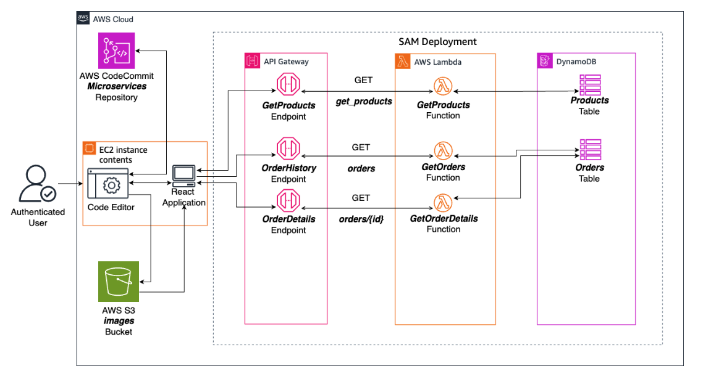
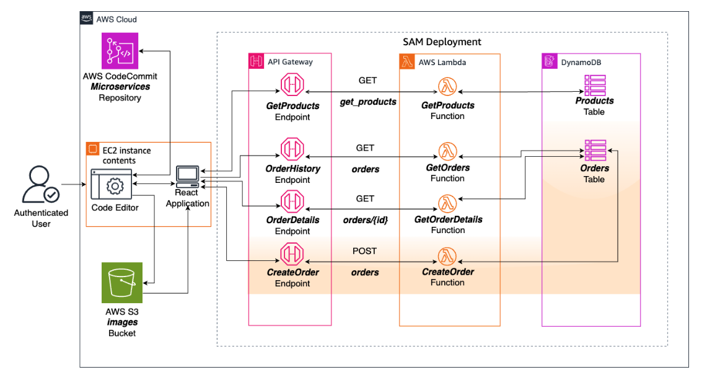

# Developer Intermediate 2 Week 4: Creating a Process Orders Microservice

* back to AWS Cloud Institute repo's root [aci.md](../../aci.md)
* back to [AWS Developer Intermediate 2](../developer-intermediate-2.md)
* back to repo's main [README.md](../../../../README.md)

## Lab Overview

In this lab, you will build the third microservice that you identified as necessary for migrating the AnyCompany bicycle shop application to run as a serverless application. You will use the AWS Cloud integrated development environment (IDE) as your development environment and AWS Serverless Application Model (AWS SAM) for defining the infrastructure as code (IaC) serverless application microservice for retrieving order information.

You will also use Amazon DynamoDB as your NoSQL data storage solution, AWS Lambda to run code on demand, and the Amazon API Gateway service to create API endpoints. Finally, rather than set up another GET request, in this lab, you will create an API Gateway endpoint for a POST request responsible for sending data to your server. You will write the new API Gateway endpoint on your own.

Amazon API Gateway is a fully managed AWS service that assists in developing serverless microservices. It enables the creation and management of APIs that can be integrated with AWS backend services, like AWS Lambda. It provides features such as detailed logging and monitoring that can be used with Amazon CloudWatch. API Gateway also provides solutions for real-life applications, such as traffic management, security, and authentication.

Similar to previous labs, you will be using AWS SAM in this lab to build and deploy a serverless microservice architecture.

Objectives
By the end of this lab, you should be able to do the following:

Create an API Gateway endpoint and the corresponding Lambda function for a POST request.
Debug and identify cross-origin resource sharing (CORS) issues in a web application.
Enable CORS requests for API Gateway.
Fully build a microservice that integrates React, API Gateway, Lambda, and DynamoDB to send product data in a web application.
Icon key
Various icons are used throughout this lab to call attention to different types of instructions and notes. The following list explains the purpose of each icon:

 Answer: An answer to a question or challenge.
 Caution: Information of special interest or importance (not so important to cause problems with the equipment or data if you miss it, but it could result in the need to repeat certain steps).
 Command: A command that you must run.
 Expected output: A sample output that you can use to verify the output of a command or edited file.
 Note: A hint, tip, or important guidance.
 Task complete: A conclusion or summary point in the lab.
 Warning: An action that is irreversible and could potentially impact the failure of a command or process (including warnings about configurations that cannot be changed after they are made).
Start lab
To launch the lab, at the top of the page, choose Start Lab.

 Caution: You must wait for the provisioned AWS services to be ready before you can continue.

To open the lab, choose Open Console .

You are automatically signed in to the AWS Management Console in a new web browser tab.

 Warning: Do not change the Region unless instructed.

Common sign-in errors
Error: Choosing Start Lab has no effect
In some cases, certain pop-up or script blocker web browser extensions might prevent the Start Lab button from working as intended. If you experience an issue starting the lab:

Add the lab domain name to your pop-up or script blocker’s allow list or turn it off.
Refresh the page and try again.

### Lab environment

The following diagram depicts the basic architecture of the lab environment.



Image Description: The authenticated user uses the Code Editor Integrated Development Environment (IDE) that is hosted on an Amazon Elastic Compute Cloud (Amazon EC2) instance to develop a React application using code from the AWS CodeCommit repository. The React application displays images served from Amazon Simple Storage Service (Amazon S3) and triggers three API Gateway endpoints labeled GetProducts, OrderHistory, and OrderDetails. The endpoints trigger associated AWS Lambda functions named GetProducts, GetOrders, and GetOrderDetails, respectively. These functions pull data from either the Products or Orders DynamoDB tables.

By the end of this lab, the architecture will be set up as shown in the following diagram.



Image Description: An authenticated user uses the Code Editor IDE that is hosted on an Amazon EC2 instance to develop a React application using code from the AWS CodeCommit repository. The React application displays images served from Amazon S3 and triggers four API Gateway endpoints labeled GetProducts, OrderHistory, OrderDetails, and CreateOrder. The endpoints trigger associated AWS Lambda functions named GetProducts, GetOrders, GetOrderDetails, and CreateOrder, respectively. These functions pull data from either the Products or Orders DynamoDB tables.

The following list details the major resources in the diagram:

EC2 instance with the Code Editor IDE
AWS CodeCommit repository named microservices
S3 bucket to hold image assets
API Gateway endpoints for GetProducts, OrderHistory, OrderDetails, and CreateOrder
Lambda functions for GetProducts, GetOrders, GetOrderDetails, and CreateOrder
DynamoDB tables for products, order history, and order items
The React application calls the API Gateway endpoints that trigger an AWS Lambda function to pull data from the appropriate DynamoDB table. The data returns to the React application and displays on the user’s website.

AWS services used in this lab
Amazon API Gateway
API Gateway is a fully managed service that makes it easy to create, publish, maintain, monitor, and secure APIs at any scale. It allows you to create RESTful APIs and WebSocket APIs that enable real-time, two-way communication applications.

Amazon DynamoDB
DynamoDB is a key-value and document database that delivers single-digit millisecond performance at any scale. It’s a fully managed, multi-Region, multi-active, durable database with built-in security, backup and restore, and in-memory caching for internet-scale applications.

Amazon Simple Storage Service (Amazon S3)
Amazon S3 is an object storage service that offers industry-leading scalability, data availability, security, and performance. It provides easy-to-use management features that allow you to organize, secure, and monitor your data.

AWS CodeCommit
CodeCommit is a secure, highly scalable, managed source control service that hosts private Git repositories. CodeCommit removes the need for you to manage your own source control system or worry about scaling its infrastructure. You can use CodeCommit to store anything from code to binaries. It supports the standard functionality of Git, so it works seamlessly with your existing Git-based tools.

AWS Identity and Access Management (IAM)
IAM is a web service that helps you securely control access to AWS resources. With IAM, you can create and manage AWS users and groups, and use permissions to allow and deny user access to AWS resources.

AWS Lambda
Lambda is a serverless computing service that runs your code in response to events and automatically manages the underlying compute resources. It allows you to run code without provisioning or managing servers, and you pay only for the compute time you consume.

AWS Serverless Application Model (AWS SAM)
AWS SAM is an open-source framework for building serverless applications on AWS. It provides a simplified way to define and package serverless applications, including AWS Lambda functions, Amazon API Gateway APIs, Amazon DynamoDB tables, and other AWS resources.

AWS services not used in this lab
AWS service capabilities used in this lab are limited to what the lab requires. Expect errors when accessing other services or performing actions beyond those provided in this lab.

Task 1: Pull the app code and re-create the application
In this task, you will pull the code from the repository, make the appropriate changes to be able to rebuild the application, and repopulate the database to match the state of the previous lab.

Task 1.1: Clone the repository using Git
To begin, you will connect to the Code Editor IDE, and then clone the repository.

From the panel to the left of these lab instructions, copy the LabInstanceURL URL value and paste it into a new browser tab.

The Code Editor IDE displays.

 Note: Prior experience with this IDE is not required.

Select the  Notifications icon in the very bottom right corner of the IDE (the bell icon) to clear any notifications that appeared when you opened it.

The lower pane includes the following five tabs:

PROBLEMS
OUTPUT
DEBUG CONSOLE
TERMINAL
PORTS
Use the bash (TERMINAL) for this lab.

 Note: When you attempt to paste into Code Editor for the first time, it will prompt you about this action. Choose Allow.

 Command: To use Git to obtain a copy of the React app you created in the previous lab, run the following commands.

```bash
cd ~/environment
region=$(aws configure get region)
git config --global credential.helper '!aws codecommit credential-helper $@'
git config --global credential.UseHttpPath true
git clone https://git-codecommit.$region.amazonaws.com/v1/repos/microservices
```

 Command: To configure your Git client, run the following commands with your username and email.

```bash
git config --global user.name Diego Ramirez
git config --global user.email dramirez@example.com
```

The terminal in your Code Editor IDE environment is now configured to develop on the bike application.

Task 1.2: Update the role information and rebuild the AWS SAM application
In this task, you will update the AWS SAM application with your AWS AccountId and rebuild the bike application.

In the Code Editor IDE, open the AWS SAM template file located at ~/environment/microservices/backend/sam-app/template.yaml.

Replace ACCOUNT-ID with your AWS account ID to update the Role property for GetProductsFunction, GetOrdersFunction, and GetOrderDetailsFunction.


GetProductsFunction:
  Type: AWS::Serverless::Function
  Properties:
    CodeUri: handlers/get_products
    Handler: get_products.lambda_handler
    Role: arn:aws:iam::ACCOUNT-ID:role/LambdaApplicationRoleSam
    Runtime: python3.12
    Architectures:
      - x86_64
    Events:
      GetProducts:
        Type: Api
        Properties:
          Path: /get_products
          Method: get

GetOrdersFunction:
  Type: AWS::Serverless::Function
  Properties:
    CodeUri: handlers/get_orders
    Handler: get_orders.lambda_handler
    Role: arn:aws:iam::ACCOUNT-ID:role/LambdaApplicationRoleSam
    Runtime: python3.12
    Architectures:
      - x86_64
    Events:
      GetOrders:
        Type: Api
        Properties:
          Path: /orders
          Method: get

GetOrderDetailsFunction:
  Type: AWS::Serverless::Function
  Properties:
    CodeUri: handlers/get_order
    Handler: get_order.lambda_handler
    Runtime: python3.12
    Architectures:
      - x86_64
    Role: arn:aws:iam::ACCOUNT-ID:role/LambdaApplicationRoleSam
    Events:
      GetOrderDetails:
          Type: Api
          Properties:
            Path: /orders/{order_id}
            Method: get
 Hint: The AWS AccountID value can be found to the left of these instructions.

 Command: To validate the AWS SAM template, run the following commands.


cd ~/environment/microservices/backend/sam-app
sam validate
 Expected output


************************
**** EXAMPLE OUTPUT ****
************************

/home/ubuntu/environment/microservices/backend/sam-app/template.yaml
is a valid SAM Template
 Note: If the template is not valid, read the error message returned and attempt to correct the issue. Alternatively, you can paste your resource definition along with the error you received into a large language model (LLM). It might offer a viable solution.

 Command: To build and deploy the AWS SAM application, run the following commands.


cd ~/environment/microservices/backend/sam-app
sam build
sam deploy --config-file samconfig.toml
When prompted, enter y to deploy the stack update.

 Expected output


"Successfully created/updated stack - sam-app in REGION"
 Command: To create a copy of the .env.example file and create a new .env file, run the following command.


cd ~/environment/microservices/bike-app/
cp .env.example .env
 Expected output: There is no expected output unless there is an error.

Navigate to the ~/environment/microservices/backend/bike-app directory, and open the .env file.

In the text editors, to add the API Gateway production endpoint URL to the .env file, assign the API Gateway Prod URL to the VITE_API_GATEWAY_URL environment variable.

 Tip: The API Gateway URL can be found in the API Gateway console or in the sam deploy output in the previous steps.

When you finish editing the .env file, it should look similar to the following example.


************************
**** EXAMPLE OUTPUT ****
************************

VITE_API_GATEWAY_URL=https://UNIQUE-ID.execute-api.REGION.amazonaws.com/Prod
VITE_APP_S3_BUCKET_URL=
The AWS SAM template has successfully deployed all of the necessary resources for the project and the React application is now configured with the API Gateway defined in the template.

Task 1.3: Repopulate DynamoDB and Amazon S3 with the data from the previous lab
In this task, you will run scripts to populate the products DynamoDB table and Amazon S3 images bucket to match the state of the environment at the end of the previous lab.

 Command: To execute the shell script, run the following commands.


cd ~/environment
sh populate-products-lab4.sh
 Expected output


************************
**** EXAMPLE OUTPUT ****
************************

(truncated)...
Bucket policy applied to images-xxxxxxxxxxxx-yyyymmdd.
S3 Bucket URL: https://BUCKET_ID.s3.REGION.amazonaws.com
 Analysis: The terminal commands you executed prepared a script file for execution and then ran the script. The script created and populated an Amazon S3 images bucket, and it populated the DynamoDB table with product data. The BUCKET_ID should be in the format images-xxxxxxxxxxxx-yyyymmdd. This is the unique bucket name that will be used later to ensure that the application is pointing to the correct S3 bucket.

Update the .env file with the Amazon S3 bucket URL from the preceding step’s output.


VITE_APP_S3_BUCKET_URL=https://BUCKET_ID.s3.REGION.amazonaws.com
Task 1.4: Launch the React app
 Command: To install dependencies specified in the package.json and start the React app, run the following command.


cd ~/environment/microservices/bike-app
npm install
npm run dev
 Expected output


************************
**** EXAMPLE OUTPUT ****
************************

(truncated)...

> bike-app@0.0.0 dev
> vite --port 8081


  VITE v5.3.3  ready in 555 ms

  ➜  Local:   http://localhost:8081/absproxy/8081
  ➜  Network: http://10.10.10.50:8081/absproxy/8081/
  ➜  press h + enter to show help
 Note: The command takes a minute or two to complete.

You have successfully rebuilt the bike application.

 Task complete: The app should now function as it did at the end of the previous lab.

Task 2: Add API Gateway to AWS SAM
In the previous labs, each individual API Gateway endpoint was defined in the AWS SAM template. When sam build and sam deploy were run, the deployment automatically created the API Gateway with the defined endpoints. However, settings that need to be applied to the entire API Gateway can only be achieved by explicitly defining the API Gateway in the AWS SAM template.

In this task, you will add an API Gateway resource definition to the AWS SAM template.

In the AWS SAM template located at ~/environment/microservices/backend/sam-app/template.yaml, in the Resources section, add the following API Gateway resource definition.


BikeAPI:
  Type: AWS::Serverless::Api
  Properties:
    StageName: Prod
In the Resources section, link the existing API Gateway endpoints to the previously created BikeAPI API Gateway by adding the RestApiId property, as follows.


GetProductsFunction:
  Type: AWS::Serverless::Function 
  Properties:
    CodeUri: handlers/get_products
    Handler: get_products.lambda_handler
    Role: arn:aws:iam::ACCOUNT-ID:role/LambdaApplicationRoleSam
    Runtime: python3.12
    Architectures:
      - x86_64
    Events:
      GetProducts:
        Type: Api 
        Properties:
          RestApiId: !Ref BikeAPI # NEWLY ADDED
          Path: /get_products
          Method: get

GetOrdersFunction:
  Type: AWS::Serverless::Function
  Properties:
    CodeUri: handlers/get_orders
    Handler: get_orders.lambda_handler
    Role: arn:aws:iam::ACCOUNT-ID:role/LambdaApplicationRoleSam
    Runtime: python3.12
    Architectures:
      - x86_64
    Events:
      GetOrders:
        Type: Api 
        Properties: 
          RestApiId: !Ref BikeAPI # NEWLY ADDED
          Path: /orders
          Method: get
          
GetOrderDetailsFunction:
  Type: AWS::Serverless::Function
  Properties:
    CodeUri: handlers/get_order
    Handler: get_order.lambda_handler
    Runtime: python3.12
    Architectures:
      - x86_64
    Role: arn:aws:iam::ACCOUNT-ID:role/LambdaApplicationRoleSam
    Events:
      GetOrderDetails:
          Type: Api 
          Properties:
            RestApiId: !Ref BikeAPI # NEWLY ADDED
            Path: /orders/{order_id}
            Method: get
 Note: Make sure that ACCOUNT-ID is replaced with your AWS AccountID.

In the Outputs section, update the endpoints to reference BikeAPI instead of ServerlessRestApi.


Outputs:
  MicroserviceApi:
    Description: "API Gateway endpoint URL for Prod stage"
    Value: !Sub "https://${BikeAPI}.execute-api.${AWS::Region}.amazonaws.com/Prod" #MODIFIED
  GetProductsFunction:
    Description: "Get_Products Lambda Function ARN"
    Value: !GetAtt GetProductsFunction.Arn
  EndpointForGetProducts:
    Description: "API Gateway endpoint URL for Prod stage for Get_Products function"
    Value: !Sub "https://${BikeAPI}.execute-api.${AWS::Region}.amazonaws.com/Prod/get_products" #MODIFIED
  EndpointForGetOrders:
    Description: "API Gateway endpoint URL for Prod stage for Get Order History"
    Value: !Sub "https://${BikeAPI}.execute-api.${AWS::Region}.amazonaws.com/Prod/orders" #MODIFIED
  EndpointForGetOrderDetails:
    Description: "API Gateway endpoint URL for Prod stage for Get Order Details"
    Value: !Sub "https://${BikeAPI}.execute-api.${AWS::Region}.amazonaws.com/Prod/orders/{order_id}" #MODIFIED
 Analysis: In AWS SAM templates, for simple GET requests, AWS SAM automatically creates an API Gateway without needing an explicit definition. However, for more complex methods, like POST, explicit API Gateway definitions might be required to provide finer control over an API configuration. When explicitly defining an API Gateway, link it to Lambda functions using the RestApiId property to ensure proper integration.

In the Code Editor IDE, open another terminal window.

 Command: To validate the AWS SAM template, run the following commands.


cd ~/environment/microservices/backend/sam-app
sam validate
 Expected output


************************
**** EXAMPLE OUTPUT ****
************************

/home/ubuntu/environment/microservices/backend/sam-app/template.yaml
is a valid SAM Template
 Note: If the template is not valid, read the error message returned and attempt to correct the issue. The most common issue is caused by improper indentation when pasting in new resource definitions. Alternatively, you can paste your resource definition along with the error you received into an LLM. It might provide a viable solution.

For detailed LLM configuration instructions, expand the following Detailed instructions section.

Detailed instructions
Navigate to the Amazon Bedrock console and choose Get started.

To configure model access, complete the following steps:

If a Manage Model Access pop-up appears, follow the prompts to select a model, or on the left navigation panel towards the bottom, choose Model access.
Choose Enable specific models.
Select one of the following models:
Mistral AI - Mistral Large (24.02)
Meta - Llama 3 8B Instruct
Scroll down and choose Next.
Choose Submit.
Access and configure the chat area, as follows:

In the left navigation pane, under Playgrounds, choose Chat.
Choose Select model, and then complete the following steps:
If you enabled Mistral AI, for Category, choose Mistral AI, and for Model, choose Mistral Large (24.02).
If you enabled Llama, for Category, choose Meta, and for Model, choose Llama 38B Instruct.
Choose Apply.
 Command: To build and deploy the validated AWS SAM template changes, run the following commands.


cd ~/environment/microservices/backend/sam-app
sam build
sam deploy --config-file samconfig.toml
When prompted, enter y to deploy the stack update.

 Expected output


"Successfully created/updated stack - sam-app in REGION"
 Command: Update the .env file with the new BikeAPI UNIQUE_ID that be found in the AWS SAM output.


VITE_API_GATEWAY_URL=https://UNIQUE_ID.execute-api.REGION.amazonaws.com/Prod
 Note: The application should continue to work as before. The API Gateway URL changed because a new API Gateway was created with the newly added BikeAPI resource definition.

 Task complete: You added the API Gateway resource definition to the AWS SAM template.

Task 3: Add a POST endpoint for Create Order
In this task, you will set up the handler that holds the Python code for POST API endpoints, and add the API Gateway and Lambda resource definitions in the AWS SAM template.

Task 3.1: Add the Lambda function code for orders in the AWS SAM project
Add the Lambda Python code to allow users to create a new order.

 Command: To add a directory named create_order inside the ~/environment/microservices/backend/sam-app/handlers directory, run the following commands.


cd ~/environment/microservices/backend/sam-app/handlers
mkdir create_order
cd create_order
 Command: To create a file named create_order.py in the new create_order directory, run the following commands.


cd ~/environment/microservices/backend/sam-app/handlers/create_order
touch create_order.py
In the new create_order.py Python script, add the following code.


import boto3
import json
from datetime import datetime
from decimal import Decimal
import uuid

def lambda_handler(event, context):
    # Create a DynamoDB resource
    dynamodb = boto3.resource('dynamodb')
    # Connect to the DynamoDB table named 'Orders'
    orders_table = dynamodb.Table('Orders')
    
    try:
        # Store the body of the post request in a variable named input_data
        input_data = json.loads(event.get('body', '{}'))
        
        # Generate a unique ID for the order
        order_id = str(uuid.uuid4())
        
        # Initialize total amount and order items list
        total_amount = 0.0
        order_items = []
    
        # Iterate through the input data
        for product_name, product_details in input_data.items():
            quantity = product_details["quantity"]
            price = float(product_details["price"])
            if quantity > 0:
                # Add this products quantity * price to the total amount
                total_amount += (quantity * price)
                
                # Add the product to the order items list
                order_items.append({
                    "product_name": product_name,
                    "product_id": str(product_details["id"]),
                    "quantity": str(quantity),
                    "amount": f"{price:.2f}"
                })
        
        # Prepare the final order structure
        order = {
            "id": order_id,
            "total_amount": f"{total_amount:.2f}",
            "order_date_time": datetime.now().isoformat() + "Z",
            "order_items": order_items
        }
        
        #insert the order into the orders table
        orders_table.put_item(Item=order)

        # Create a response with a 200 status code, the order ID, and CORS headers
        response = {
            'statusCode': 200,
            'body': json.dumps({'message': 'Order created successfully', 'order_id': order_id}),
            'headers': {
                'Access-Control-Allow-Headers': 'Content-Type',
                'Access-Control-Allow-Origin': '*',
                'Access-Control-Allow-Methods': 'OPTIONS,POST,GET'
            }
        }
        
    # Add an exception block that creates a response with a 500 status code, the error message 'Error fetching order history' and CORS headers
    except Exception as e:
        response = {
            'statusCode': 500,
            'body': json.dumps({'message': 'Error creating order', 'error': str(e)}),
            'headers': {
                'Access-Control-Allow-Headers': 'Content-Type',
                'Access-Control-Allow-Origin': '*',
                'Access-Control-Allow-Methods': 'OPTIONS,POST,GET'
            }
        }

    # return the response
    return response
You have added the Python code for the create order API Gateway endpoint.

Task 3.2 - Challenge A: Add the Order POST API endpoint to the AWS SAM template
In this task, you will add the Order POST API endpoint.

Add the resource definition for the POST create_order API Gateway endpoint in the AWS SAM template.
For help with writing the resource definition for the POST API endpoint, expand the following Detailed instructions section.

Detailed instructions
 Answer


CreateOrderFunction:
  Type: AWS::Serverless::Function
  Properties:
    CodeUri: handlers/create_order
    Handler: create_order.lambda_handler
    Runtime: python3.12
    Architectures:
      - x86_64
    Role: arn:aws:iam::ACCOUNT-ID:role/LambdaApplicationRoleSam
    Events:
      CreateOrder:
        Type: Api
        Properties:
          RestApiId: !Ref BikeAPI
          Path: /orders
          Method: post
Make sure that ACCOUNT-ID is replaced with your AWS AccountID.

In the AWS SAM template’s Outputs section, add a new endpoint for Create Order.


EndpointForCreateOrder:
  Description: "API Gateway endpoint URL for Prod stage for Create Order"
  Value: !Sub "https://${BikeAPI}.execute-api.${AWS::Region}.amazonaws.com/Prod/orders"
 Command: To validate the AWS SAM template, run the following commands.


cd ~/environment/microservices/backend/sam-app
sam validate
 Expected output


************************
**** EXAMPLE OUTPUT ****
************************

/home/ubuntu/environment/microservices/backend/sam-app/template.yaml
is a valid SAM Template
 Note: If the template is not valid, read the error message returned and attempt to correct the issue. Alternatively, you can paste your resource definition along with the error you received into an LLM. It might provide a viable solution.

 Command: To build and deploy the validated AWS SAM template changes, run the following commands.


cd ~/environment/microservices/backend/sam-app
sam build
sam deploy --config-file samconfig.toml
When prompted, enter y to deploy the stack update.

 Expected output


Key                 EndpointForCreateOrder
Description         API Gateway endpoint URL for Prod stage for Create Order
Value               https://UNIQUE_ID.execute-api.REGION.amazonaws.com/Prod/orders
...

"Successfully created/updated stack - sam-app in REGION"
The Create Order endpoint is now ready to be used.

Task 3.3: Test the newly created API endpoint for POST orders
Ensure the Create Order endpoint works properly by invoking the API Gateway endpoint.

 Command: To create a file named event.json, run the following commands.


cd ~/environment/microservices/backend/utils/create_orders
touch event.json
In the Code Editor IDE file explorer, navigate to the ~/environment/microservices/backend/utils/create_orders directory, and open the event.json file in the text editor.

In the event.json file, add the following code.


{
    "cassette": {
        "id": 1,
        "quantity": 0,
        "price": "50.00"
    },
    "crankset": {
        "id": 2,
        "quantity": 0,
        "price": "215.00"
    },
    "chain": {
        "id": 3,
        "quantity": 0,
        "price": "35.00"
    },
    "bell": {
        "id": 4,
        "quantity": 0,
        "price": "18.00"
    },
    "gear shifter": {
        "id": 5,
        "quantity": 0,
        "price": "32.00"
    },
    "inner tube": {
        "id": 6,
        "quantity": 0,
        "price": "14.00"
    },
    "saddle": {
        "id": 7,
        "quantity": 0,
        "price": "55.00"
    },
    "wheel": {
        "id": 8,
        "quantity": 2,
        "price": "179.00"
    },
    "pedals": {
        "id": 9,
        "quantity": 0,
        "price": "79.00"
    },
    "brake disk": {
        "id": 10,
        "quantity": 0,
        "price": "45.00"
    },
    "hydraulic brake": {
        "id": 11,
        "quantity": 0,
        "price": "69.00"
    },
    "sports glasses": {
        "id": 12,
        "quantity": 1,
        "price": "129.00"
    }
}
 Command: To invoke the POST orders endpoint using curl, run the following command.


curl -X POST https://UNIQUE_ID.execute-api.REGION.amazonaws.com/Prod/orders -d @/home/ubuntu/environment/microservices/backend/utils/create_orders/event.json
 Note: Update the invoke URL by using a text editor or directly in the Code Editor IDE terminal before running the command. The invoke URL can be found in the terminal output after running the sam deploy command. It can also be found on the Amazon API Gateway console under Stages for the Prod POST Orders endpoint.

 Expected output


{"message": "Order created successfully", "order_id": "554bbd55-5e59-47ee-95d4-b0aa569ab86d"}
Ensure that the newly created order is present on the order history page and that the order details are accessible.

 Expected output

Order details of new order

The Create Order function has now been tested using the API Gateway endpoint invoke URL.

Task 3.4: Enable redirection to the order details page after submitting the order
The current products page already has the order form. Currently, the submission of the form keeps the user on the products page. Typically, the user should have some indication that the form was submitted properly. For this use case, the user will be redirected to the order details page for a newly submitted order.

 Command: To execute the shell script, run the following commands.


cd ~/environment
./update-products-react-lab4.sh
 Note: The script adds a useNavigate hook in the React component. The useNavigate hook cannot be called inside of the submitHandler because it will break one of the rules of hooks, which states, “Don’t call hooks inside loops, conditions, or nested functions”. The script also uncomments the navigate(/absproxy/8081/lookup_order/{$res.data.order_id}) code found in the submitHandler to allow the user to be redirected to the order details page after submitting the form.

The React application is now able to handle redirection to the order details page when submitting the form for a new order.

 Task complete: You set up API Gateway and Lambda for the Create Order API endpoint.

Task 4: Test, debug, and fix the Product Order form
In this task, you will test, debug, and fix issues with the Product Order form associated with the submit_order POST request.

Task 4.1: Submit Product Order form
Test the Create Order function by using the form on the products page.

On the products page, create an order by entering a number larger than zero for any of the products.

The Total Price field should reflect the total price of the order when the quantity of products changes.

To initiate the POST submit_order request, choose Submit.

 Expected output: The React application should stay on the products page.

 Note: The React application was supposed to redirect the user to the order details page after form submission. However, as currently implement, the application stays on the products page.

The testing of Create Order form on the products page was not successfully. You will investigate why the application is not behaving as expected in the next step.

Task 4.2 - Challenge B: Debugging submit_order POST request
Use the browser developer tools to do a deep dive into the unexpected behavior.

If you need help with investigating the unexpected behavior, expand the following Detailed instructions section.

Detailed instructions
Right-click on the React application, and choose Inspect.

In the developer tools pane, choose the Console tab.

If there are no errors in the console logs, submit the Products order form again.

 Expected output


Access to XMLHttpRequest at 'https://cxvbcfsiud.execute-api.us-west-2.amazonaws.com/Prod/orders' from origin 'https://d2jzf2nzr43igi.cloudfront.net' has been blocked by CORS policy: Response to preflight request doesn't pass access control check: No 'Access-Control-Allow-Origin' header is present on the requested resource.

Error submitting order: AxiosError {message: 'Network Error', name: 'AxiosError', code: 'ERR_NETWORK', config: {…}, request: XMLHttpRequest, …}

POST https://cxvbcfsiud.execute-api.us-west-2.amazonaws.com/Prod/orders net::ERR_FAILED
 Analysis: The submit_order POST request is resulting in a CORS error because a preflight request is being sent. This is caused by the React application attempting to send a POST request to a different domain than the origin. The CORS preflight request ensures that the server is aware of the incoming POST request. In previous labs, preflight was omitted for the GET requests. GET requests are considered simple requests and can be submitted to any origin. Typically, POST requests are also considered simple requests, but an API Gateway POST request triggers the preflight check by the browser. The servers handled the CORS request because the backend returned the headers Access-Control-Allow-Headers, Access-Control-Allow-Origin, and Access-Control-Allow-Methods in the response.

Now that you identified the root cause of the unexpected behavior, the API Gateway configuration must be altered to allow the user to submit the form.

Task 4.3: Enable the CORS POST request for API Gateway
The Amazon API Gateway can manage the configuration for CORS requests. This configuration can be defined in the AWS SAM template by adding properties to the API Gateway resource definition that was added in Task 2.

Update the BikeAPI resource definition to enable CORS configuration in ~/environment/microservices/backend/sam-app/template.yaml.


BikeAPI:
  Type: AWS::Serverless::Api
  Properties:
    StageName: Prod
    Cors:
      AllowMethods: "'GET,POST,PUT,DELETE,OPTIONS'"
      AllowHeaders: "'Content-Type,X-Amz-Date,Authorization,X-Api-Key,X-Amz-Security-Token'"
      AllowOrigin: "'*'"
 Analysis: The CORS configuration in the BikiAPI resource definition defines the conditions needed for a request to be considered valid. The following properties are defined for CORS request.

AllowHeaders - Defines the headers allowed in a CORS request
AllowMethods - Defines the type of methods that can be used in a CORS request
AllowOrigin - Defines the origin of a valid CORS request
If a request does not satisfy the conditions defined, then the server will reject the CORS request.

 Command: To validate the AWS SAM template, run the following commands.


cd ~/environment/microservices/backend/sam-app
sam validate
 Expected output


************************
**** EXAMPLE OUTPUT ****
************************

/home/ubuntu/environment/microservices/backend/sam-app/template.yaml
is a valid SAM Template
 Note: If the template is not valid, read the error message returned and attempt to correct the issue. Alternatively, you can paste your resource definition along with the error you received into an LLM. It might provide a viable solution.

 Command: To build and deploy the validated AWS SAM template’s changes, run the following command.


cd ~/environment/microservices/backend/sam-app
sam build
sam deploy --config-file samconfig.toml
When prompted, enter y to deploy the stack update.

 Expected output


"Successfully created/updated stack - sam-app in REGION"
The API Gateway endpoints are now configured to handle CORS requests.

Task 4.4: Test the Product Order form
Test out the new CORS configuration using the Create Order form on the products page.

Return to the React application, reload the webpage, and attempt to submit the product order form.
To see how to submit the product order form, expand the following Detailed instructions section.

Detailed instructions
On the products page, create an order by entering a number larger than zero for any of the products.

The Total Price field should update as the quantity of products is changed by the user.

To initiate the POST submit_order request, choose Submit.

 Expected output

CORS Request Failures from Network Tab in Browser Developer Tools

Image Description: The image shows the order details page with the product quantities and costs on the products page.

The user should be redirected to the order details page, and the page should work as expected. The Order Line Items should reflect all of the quantities and costs that were requested using the form on the products page.

 Task complete: You successfully added and tested the frontend changes for submitting product orders.

Task 5: Check in the final code
As always, it is a best practice to check in your code whenever you achieve a new milestone, however minor, in your development.

In the Code Editor IDE, choose the source control icon on the left side of the editor, and observe the following changes to the project:

template.yaml - Explicit resource definition of API Gateway with CORS configuration

create_order.py - Lambda Python code for uploading orders to server

event.json - Mock data for POST orders API

Products.jsx - Updated to redirect when order form is submitted

 Command: To check in your updated code in CodeCommit, run the following commands.


cd ~/environment/microservices
git status
git add .
git commit -m 'Built POST Orders microservice to website'
git push
git status
 Note: The start of the next lab will include a CodeCommit repository with the code that you built in this lab as the starter code. You will continue developing the application from where you leave off here.

 Task complete: You uploaded the final changes for create order to the CodeCommit repository.

### Conclusion

Congratulations! You completed the following tasks:

* Create an Amazon API Gateway POST endpoint and corresponding Lambda function using an AWS SAM template.
* Debugged CORS errors using browser tools.
* Configured an Amazon API Gateway to handle CORS using an AWS SAM template.
* Fully built a microservice that integrates React, API Gateway, Lambda, and DynamoDB to accept order data in a web application.

### End lab

Follow these steps to close the console and end your lab.

56. Return to the `AWS Management Console`.
57. At the upper-right corner of the page, choose `AWSLabsUser`, and then choose `Sign out`.
58. Choose `End Lab` and then confirm that you want to end your lab.

[React MIT License](https://github.com/facebook/react?tab=MIT-1-ov-file#readme)

Python is property of the Python Software Foundation (PSF), and React is property of Meta Platforms, Inc. Reference in this lab to any specific commercial product, process, or service, or the use of any trade, firm or corporation name is provided for informational purposes, and does not constitute endorsement, recommendation, or favoring by Amazon Web Services.
