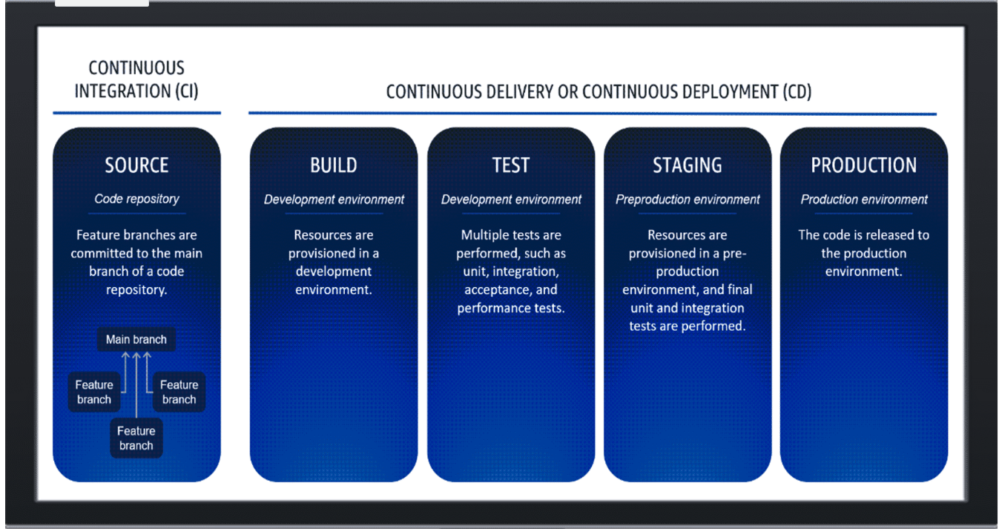

# Week 1: DevOps 2: Review of Continuous Integration and Continuous Delivery

* back to AWS Cloud Institute repo's root [aci.md](../aci.md)
* back to [AWS Cloud Operations 2](./aws-cloud-operations-2.md)
* back to repo's main [README.md](../../../README.md)

## DevOps 2: Review of Continuous Integration and Continuous Delivery

### Pre-assessment

#### What is the primary purpose of continuous integration and continuous delivery (CI/CD)?

* It automates the software release lifecycle, which includes integration, testing, and delivery.

Wrong answers:

* It automates building and testing software code changes but requires manual deployment of infrastructure.
* Continuous integration builds, tests, and stages software code changes, and continuous delivery focuses on improving the development workflow.
* It reduces the amount of time to design and develop software code.

##### Explanation

CI/CD automates many of the deployment steps after a code change has been approved and merged into the main branch of a code repository.

The other options are incorrect because of the following reasons:

* CI/CD includes automating the building and deploying of the infrastructure for each environment.
* Continuous integration improves the development workflow through methods like the trunk-based approach. Continuous delivery builds, tests, and stages software code changes.
* CI/CD reduces the amount of time to build, test, and deploy software applications.

#### Which options are best practices for a continuous integration and continuous delivery (CI/CD) pipeline? (Select TWO.)

* Automated testing and continuous integration
* Automated deployment and canary releases

Wrong answers:

* Manual deployment and manual testing
* Separate environments for development, staging, and production
* Monolithic codebase and manual code merges

##### Explanation

The primary purpose of a CI/CD pipeline is to automate the build, test, and deployment processes. The pipeline is a set of automated steps that take the codebase from the development phase through testing, and ultimately to deployment. These steps reduce the manual effort and potential for errors.

The other options are incorrect because of the following reasons:

* Manual deployment and manual testing are not best practices for the CI/CD pipeline because they are time-consuming, error-prone, and slow down the development and deployment process.
* Separate environments for development, staging, and production are generally a best practice, but they are not directly related to the CI/CD pipeline itself.
* A monolithic codebase can make it more difficult to manage and deploy changes, and manual code merges can introduce errors and conflicts.

#### Which options are core principle of continuous integration and continuous delivery (CI/CD)? (Select TWO.)

* Automated testing
* Frequent code integration

Wrong answers:

* Manual deployments
* Customer code reviews
* Scheduled software releases

##### Explanation

Frequent code integration and automated testing are fundamental principles of CI/CD, as they enable teams to catch and address issues early, maintain a high level of code quality, and deliver software updates more quickly and reliably.

The other options are incorrect because of the following reasons:

* Manual deployments are time-consuming, error-prone, and go against the principles of CI/CD.
* Code reviews can be a part of the development process, but they are not unique to CI/CD practices.
* The goal is to deliver new features and updates to customers as soon as they are ready, without having to wait for a scheduled release cycle.

## DevOps Principles

DevOps is a set of practices and tools that organizations can use to build, test, and deploy software more efficiently and effectively. One of the primary problems that DevOps solves is the traditional divide between development and operations teams. This divide can lead to communication breakdowns, delayed deployments, and a lack of visibility into the software delivery process. DevOps can foster collaboration, streamline development cycles for quicker feature and update delivery.

Continuous integration (CI) and continuous deployment (CD) are two key principles of DevOps that help to automate the software delivery process. CI involves regularly integrating code changes into a shared repository and automatically building, testing, and validating the code. CD, however, involves automatically deploying the tested code to production environments. DevOps contributes to CI/CD by providing the tools and processes necessary for these practices, such as version control, automated testing, and infrastructure as code. By automating these tasks, DevOps helps organizations to deliver software faster, with fewer errors, and with more reliability.

CI/CD is a methodical approach that involves automated integration of code changes into a shared repository, followed by automated delivery to production.

The company can implement a CI/CD pipeline to streamline their software development processes using the following AWS tools:

* First, AWS CodeCommit stores their source code securely, allowing for seamless collaboration among developers.
* Next, AWS CodeBuild automates the build and test stages, ensuring that every code change is automatically built and tested, reducing manual errors and integration issues.
* AWS CodeDeploy handles automated deployment of the application to multiple environments.
* And finally, AWS CodePipeline orchestrates the workflow that pushes these changes through build, test, and deployment stages.

This company can follow these best practices to optimize their CI/CD pipeline:

* They can use Infrastructure as Code (IaC) to automate and replicate environments reliably,
* They can maintain rigorous testing protocols to catch bugs early, and
* They can monitor deployments using AWS CloudWatch to ensure performance and stability.

## CI/CD Core Principles

### CI/CD

CI/CD is the process of automating the software release lifecycle. CI/CD automates most or all of the manual processes traditionally required to get new code from a commit into production. A CI/CD pipeline encompasses the source, build, test, staging, and production stages. In each stage, the CI/CD pipeline provisions any infrastructure that is needed to deploy or test the code. By using a CI/CD pipeline, development teams can make changes to code that are then automatically tested and pushed to deployment.

### Delivery or Deployment

The D in CI/CD can also mean deployment. The difference between continuous delivery and continuous deployment occurs when you release a change to the production environment.

#### Continuous Delivery

With continuous delivery, a manual approval is required before promoting changes to production.

#### Continuous Deployment

Continuous deployment features an uninterrupted flow through the entirety of the pipeline, and no explicit approvals are required.

### Basic CI/CD process

Continuous integration starts with a source (code repository), features branches are committed to the main branch of code repository. Next, continuous delivery or continuous deployment consists of build, test, staging, and production. Build (development environment), resources are provisioned in a development environment. Test (development environment), multiple tests are performed, such as unit, integration, acceptance, and performance tests. Staging (preproduction environment), resources are provisioned in a pre-production environment, and final unit and integration tests are performed. Production (production environment), the code is released to the production environment.

#### Continuous integration

Continuous integration occurs in a code repository, such as a Git repository. You treat a single, main branch as the source of truth for the code base, and you create short-lived branches for feature development. You integrate a feature branch into the main branch when you're ready to deploy the feature to upper environments. Feature branches are never deployed directly to upper environments.

Continuous integration (CI) merges developers' code into a shared repository, with testing and static code analysis, to streamline the process. In the CI process, developers commit their code changes to a version control system. Then, a CI server automatically builds the application, runs automated tests, and reports any issues. This ensures that the codebase remains stable and testable throughout the development process. Continuous integration is a crucial component of the DevOps philosophy. It facilitates faster feedback loops, increased collaboration between developers and operations teams, and more reliable and consistent software deployments. The continuous integration process includes the following steps.

1. The developer creates a new branch from the main branch.
2. The developer makes changes and builds and tests locally.
3. When the changes are ready, the developer creates a pull request (GitHub documentation) with the main branch as the destination.
4. The code is reviewed.
5. When the code is approved, it is merged into the main branch.

To explain the continuous integration process, imagine you are a cloud developer at a tech startup. You are enhancing a project management platform by building a real-time notification microservice. Using a code repository, you create a branch called "notification-service" from the main branch, the code's source of truth. Coding the service, you commit changes locally and run tests. After you are satisfied with the results, you initiate a pull request. 

AWS CodeBuild and AWS CodePipeline automatically build and test your changes. Colleagues review your pull request, providing feedback. After addressing their comments, you merge into the main branch. CodePipeline then deploys the changes to staging and production environments.

In staging, the service undergoes thorough testing for compatibility and performance. Continuous integration facilitates rapid feature iteration while maintaining code quality and reliability.

#### Continuous delivery

Continuous delivery occurs in isolated environments, such as development environments and production environments. The actions that occur in each environment can vary. Often, one of the first stages is used to make updates to the pipeline itself before proceeding. The end result of the deployment is that each environment is updated with the latest changes. The number of development environments for building and testing also varies, but we recommend you use at least two. In the pipeline, each environment is updated in order of its significance, ending with the most important environment, the production environment. The continuous delivery portion of the pipeline starts by pulling the code from the main branch of the source repository and passing it to the build stage.

#### Continuous delivery process

As a cloud developer for a growing startup, you're tasked with streamlining the deployment process for a new feature on your project management platform. This feature involves real-time notifications, and you're excited to implement continuous delivery to ensure smooth deployment.

You begin by setting up the continuous delivery pipeline in CodePipeline. The pipeline is configured to pull code from the main branch of the repository, which serves as the authoritative source for the project's codebase.

#### Infrastructure as Code (IaC)

Using IaC ensures consistency and repeatability in the deployment process. 

It outlines the following steps:

1. Unit Tests
    Unit tests are typically carried out first to validate the functionality of individual components within the codebase. CodeBuild runs these tests automatically, ensuring that each unit of code behaves as expected.
2. AWS CodeBulid
    After passing the unit tests, the code moves to the build stage where CodeBuild compiles the code, packages it, and prepares it for deployment. This stage ensures that the code is in a deployable state and ready for further testing.
3. Resource Provisioning
    Using the infrastructure as code paradigm, CloudFormation provisions the necessary resources for the feature to function properly in the AWS environment. This includes setting up serverless functions, databases, and other infrastructure components required by the notification feature.
4. Integration Tests
    With the resources provisioned, the code is deployed to a test environment where integration tests are conducted. These tests verify that the newly implemented feature integrates seamlessly with existing components of the project management platform.

Unit tests are mentioned in different phases of the CI/CD pipeline. This reflects the nuanced role of unit testing in modern DevOps practices. The placement and usage of unit tests can vary based on team practices, tooling, and specific pipeline configurations. This flexible approach allows for faster feedback and more efficient development cycles.

By incorporating continuous delivery and infrastructure as code practices into the deployment pipeline, you ensure that the deployment process is automated, repeatable, and reliable. This not only accelerates the delivery of new features but also maintains the stability and quality of the project.

## Benefits and Challenges of CI/CD

### Some of the potential benefits

Continuous integration and continuous delivery (CI/CD) can provide many potential benefits for software teams. By automating the build, test, and deployment processes, CI/CD can help accelerate the software release cycle. CI/CD facilitates faster feedback on code changes, so that teams can catch issues early. Frequent, incremental code deployments reduce risk and make it more convenient to isolate bugs. Overall, CI/CD can help teams ship higher quality software more rapidly and frequently.

#### Benefits example

To further discuss the potential benefits of CI/CD, let's use "AnyCompany" as an example. AnyCompany, an e-commerce platform specializing in electronics. Their website is pivotal to their business success, and any disruptions or bugs can lead to customer dissatisfaction and revenue loss. Initially, their development process was cumbersome, hindering their ability to deliver updates quickly and reliably.

1. Upon integrating a CI/CD pipeline, the team witnesses remarkable improvements. During a major product launch event, they need to introduce a feature that users can use to track their orders in real time. Using the CI/CD pipeline, developers confidently roll out the feature, assured that automated tests will catch any glitches.
2. The feature seamlessly goes live, empowering customers to track their orders effortlessly, resulting in heightened satisfaction and increased sales during the event. Moreover, the team promptly receives user feedback, making it possible for them to swiftly address any minor issues that surface.
3. Furthermore, the CI/CD pipeline ensures the timely application of security patches, mitigating the risk of cyber threats and safeguarding customer data. With streamlined processes and accelerated deployments, developers redirect their focus towards innovation instead of being bogged down by manual tasks.
4. Overall, the adoption of CI/CD not only enhances AnyCompany's competitiveness by facilitating rapid feature deployment but also augments customer trust and satisfaction, propelling business expansion and success.

### Some of the potential challenges

Continuous integration and continuous deployment (CI/CD) are powerful processes for automating software delivery, but implementing them comes with challenges. One challenge is ensuring tests adequately cover all changes, so new bugs aren't introduced into production. Another is achieving quick and reliable feedback on build failures to fix them promptly. Configuring infrastructure and tools to support CI/CD pipelines can also be complex. Finally, CI/CD adoption might require an organizational culture shift as developers take more ownership of testing and deployment. When implemented well, however, CI/CD can dramatically improve software quality and development speed.

#### Challenges example

Continuing from our scenario earlier about AnyCompany, an e-commerce platform specializing in electronics, let's discuss the potential challenges of CI/CD.

1. Due to the rapid pace of CI/CD deployment, it also introduces challenges for AnyCompany. In one instance, a bug slips through the automated tests and gets deployed to production unnoticed. The bug causes crashes for a subset of users, leading to negative app reviews and a temporary decline in user trust.
2. Additionally, the pressure to deliver frequent updates can strain the development team. Developers might feel overwhelmed by the constant demand for new features and updates, leading to burnout and decreased productivity.
3. Furthermore, maintaining a robust CI/CD pipeline requires significant investment in infrastructure and tooling. AnyCompany must allocate resources to ensure the reliability and scalability of their CI/CD system, which can be a significant financial burden.
4. In summary, although CI/CD offers numerous benefits for AnyCompany in terms of agility and innovation, it also presents challenges such as the risk of automation errors, developer burnout, and increased infrastructure costs. Managing these drawbacks effectively is essential to maximizing the benefits of CI/CD implementation.

## Best Practices for CI/CD Pipelines

Continuous Integration and Continuous Deployment (CI/CD) are essential practices for modern software development. CI/CD facilitates faster, more reliable software delivery by automating the build, test, and deployment processes. 

By adopting CI/CD best practices, organizations can reduce manual errors, improve code quality, and increase deployment frequency. With CI/CD, teams can catch issues early in the development lifecycle and quickly roll out new features and bug fixes. Implementing CI/CD also helps improve collaboration, visibility, and transparency across the entire software development lifecycle.

1. Prioritize Security
    Security scans can include code scanning for vulnerabilities, dependency scanning, and automated security testing, to ensure that security is a top priority throughout the development process.
2. Build once and reuse
    Use Docker containers or similar technologies to create a consistent build environment, ensuring that builds are reproducible and can be reused across different stages of the pipeline, reducing inconsistencies and improving efficiency.
3. Find the issue early in the process
    Integrate automated testing, including unit tests, integration tests, and code quality checks, into the CI/CD pipeline to identify and address issues as early as possible, minimizing the impact on downstream stages and accelerating feedback loops.
4. Commit your code regularly
    Encourage developers to commit their code frequently to the version control system, which facilitates continuous integration. This makes it possible for changes to be integrated and tested in small, manageable increments, reducing the likelihood of integration conflicts and improving collaboration.
5. Optimize and streamline the tests
    Identify and prioritize critical tests while optimizing and parallelizing test runtime to minimize the overall testing time, ensuring fast feedback without compromising on test coverage or quality.
6. Clean your environments
    Automate environment provisioning and teardown processes to ensure that development, testing, and production environments are clean and consistent, reducing the risk of environment-related issues and improving reliability.
7. Keep a good record
    Maintain comprehensive documentation and logs of all changes, deployments, and pipeline runtimes to facilitate auditing, troubleshooting, and historical analysis, ensuring transparency and accountability throughout the CI/CD process.
8. Provide and receive feedback
    Establish a culture of continuous improvement by providing constructive feedback on the CI/CD pipeline and development practices. Actively soliciting feedback from team members and stakeholders to identify areas for optimization and enhancement.

## [AWS SimuLearn Challenge: CI/CD Pipelines for APIs]()

In this lab, you have been assigned the vital task of repairing and finalizing the CI/CD pipeline for the company’s APIs. While the core architecture is already in place, some key configurations are missing. Your goal is to complete the required tests and make sure the pipeline is fully operational. When your task is successfully completed, the Task Manager application will be fully functional, so employees can create and manage tasks efficiently.

This challenge is a timed challenge. It begins with Step 1 where you encounter a scripted dialog to give you context. Step 2 you are provided details on the task and you must solve the challenge. The timer starts at this moment. Step 3, work through the problem and complete all challenges before the timer expires. You may retry this challenge unlimited times.
