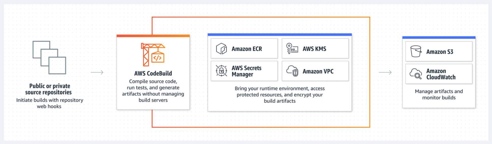
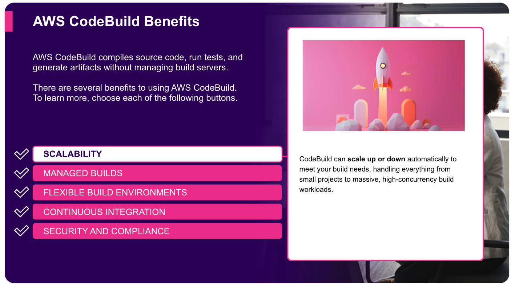
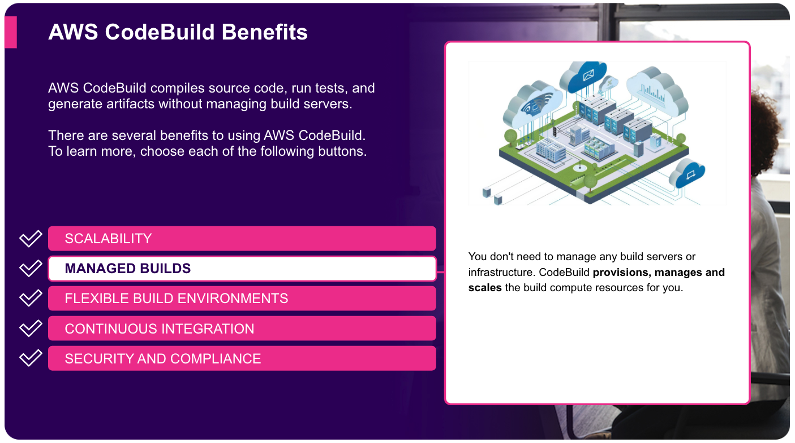
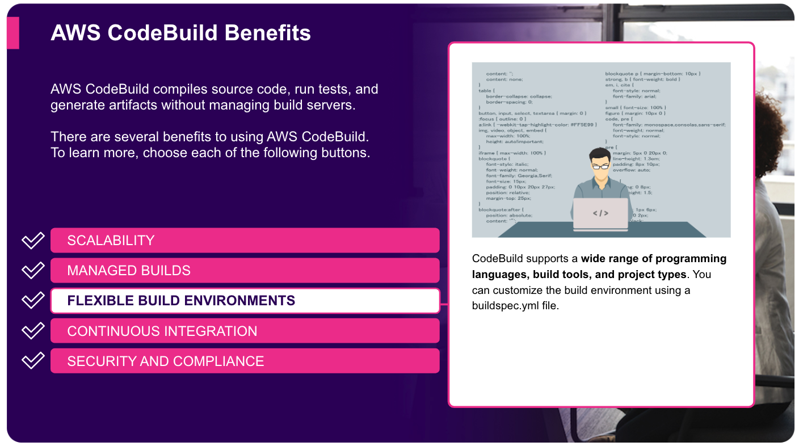
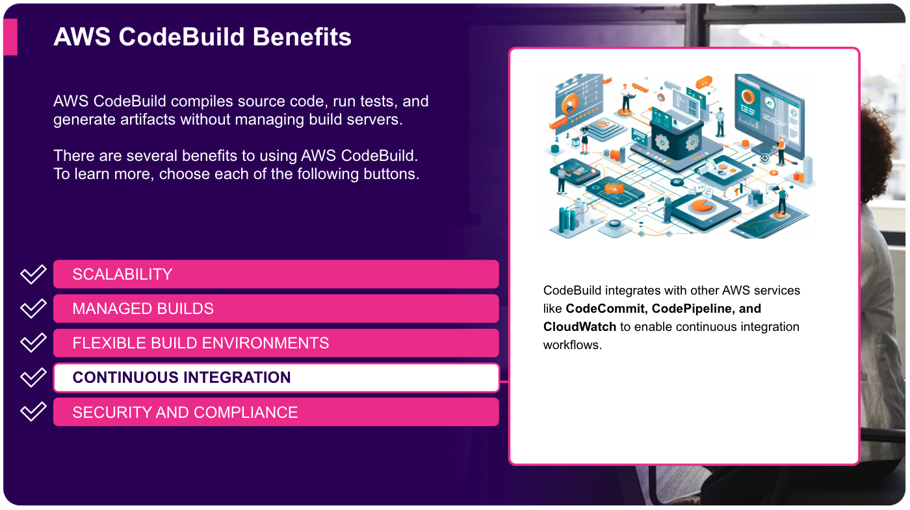
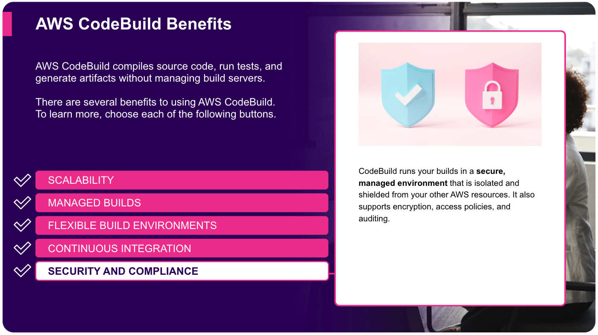

# Week 1: DevOps 2: Automate Testing with AWS CodeBuild

* back to AWS Cloud Institute repo's root [aci.md](../aci.md)
* back to [AWS Cloud Operations 2](./aws-cloud-operations-2.md)
* back to repo's main [README.md](../../../README.md)

## DevOps 2: Automate Testing with AWS CodeBuild

### Pre-assessment

#### Which source repositories are supported by AWS CodeBuild? (Select TWO.)

* Amazon CodeCatalyst
* GitHub

Wrong answers:

* AWS CodePipeline
* Amazon Elastic Container Registry
* Amazon CodeGuru

##### Explanation

The source repositories supported by CodeBuild include Amazon CodeCatalyst, GitHub, Bitbucket, and Amazon Simple Storage Service (Amazon S3). CodeBuild can use webhooks and integrations to connect to common Git-based sources, like GitHub and Bitbucket, to automatically initiate builds on source code changes. Amazon S3 and CodePipeline support packaging code for convenient use in CodeBuild.

The other options are incorrect because of the following reasons:

* CodePipeline is a service for automating software release pipelines, not a source code repository. CodeBuild integrates with CodePipeline, but CodePipeline is not a source repo.
* Amazon Elastic Container Registry (ECR) is a fully managed container registry that offers high-performance hosting. It is not a source code repository.
* CodeGuru is a service that provides code reviews and recommendations, but it is not a source code repository that CodeBuild can directly pull code from.

#### Which of the following describes testing that verifies that an application is meeting the specified requirements and performs the expected actions?

* Functional testing

Wrong answers:

* Integration testing
* Performance testing
* Unit testing

##### Explanation

These tests often involve simulating user interactions with the application and validating the outputs. AWS CodeBuild makes it easy to incorporate functional tests into the build pipeline, ensuring that the application is continuously tested for correct functionality.

The other options are incorrect because of the following reasons:

* Integration testing identifies issues that might arise when individual units are combined into a complete system. It focuses on verifying that different components of the application work together correctly.
* Performance testing focuses on evaluating an application's performance characteristics, such as response times, throughput, and scalability.
* Unit testing helps catch bugs early in the development process and ensures that individual pieces of the application are functioning as expected. This refers to testing individual components or units of the application in isolation.

#### Which of the following is NOT a benefit of AWS CodeBuild?

* Manual deployments

Wrong answers:

* Continuous integration
* Flexible build environments
* Fully managed service

##### Explanation

AWS CodeBuild automatically sets up the test environment based on the programming language and framework used in the application. It provides preconfigured build environments for various runtimes, making it possible to focus on writing the tests without having to worry about the underlying infrastructure.

The other options are incorrect because they accurately describe benefits of CodeBuild.

## AWS CodeBuild

AWS CodeBuild is a fully managed continuous integration service that compiles source code, runs tests, and produces ready-to-deploy software packages.

With CodeBuild, you don’t need to provision, manage, and scale your own build servers. You specify the location of your source code and choose your build settings, and CodeBuild will run your build scripts for compiling, testing, and packaging your code.

Diagram depicting workflow using AWS services: Public source code repositories feed into AWS CodeBuild which compiles code, runs tests, generates artifacts without retaining source/credentials. Integrates with AWS Secrets Manager for secure environment, ECR for container images, KMS for encryption keys, VPC for network isolation. Final stages are storing artifacts on Amazon S3 and monitoring with Amazon CloudWatch.

A "build" refers to the process of converting source code into a runnable software application. This process typically includes compiling the code, running tests to ensure it works correctly, and packaging it into a deployable format. The "build" is an essential step in software development to ensure that the code is functional and ready for deployment.

### AWS CodeBuild Benefits

#### Scalability

#### Managed Builds

#### Flexible Build Environments

#### Continuous Integration

#### Security and Compliance

### Using CodeBuild

CodeBuild is a fully managed continuous integration service that compiles source code, runs tests, and produces ready-to-deploy artifacts, such as Docker images. CodeBuild fits squarely into the CI/CD landscape by providing a scalable and configurable build environment that can be seamlessly integrated with other AWS services like CodePipeline, Amazon Elastic Container Registry (ECR), and AWS Lambda to create end-to-end CI/CD workflows.

1. Prepare your source code

    Store your application's source code in an AWS CodeCatalyst repository, an Amazon S3 bucket, or a third-party repository like GitHub or Bitbucket.

2. Create a buildspec.yml file

    This file defines the build instructions - the commands to run, the build environment to use, and any output artifacts to produce.

3. Create a CodeBuild project

    In the AWS Management Console, define a CodeBuild project that points to your source code location and uses the buildspec.yml file.

4. Start a build

    Initiate a build by pushing new code to your source repository, using the AWS CLI, or integrating with other AWS services like CodePipeline.

5. Monitor and troubleshoot

    Use the CodeBuild console, CloudWatch logs, and build reports to monitor your builds and debug any issues.

By using the benefits of AWS CodeBuild, development teams can significantly accelerate their software delivery lifecycle. The on-demand scalability and automated provisioning of build environments facilitates developers to spend more time coding and testing, instead of managing build infrastructure. With the configurable build specifications, teams can quickly iterate on their build and test processes, and the tight integration with other AWS services streamlines the overall CI/CD workflow.

### Types of Testing in AWS CodeBuild

AWS CodeBuild is a fully managed continuous integration (CI) service provided by Amazon Web Services (AWS). It compiles source code, runs tests, and produces software packages that are ready to deploy. One of the key features of CodeBuild is its support for various types of testing to ensure the quality and reliability of your application.

#### Unit Testing

Unit tests help catch bugs early in the development process and ensure that individual pieces of the application are functioning as expected. This refers to testing individual components or units of the application in isolation. CodeBuild makes it easy to integrate unit tests into the build process, allowing you to automatically run the tests as part of every build.

#### Integration Testing

Integration testing focuses on verifying that different components of the application work together correctly. This type of testing helps identify issues that may arise when individual units are combined into a complete system. CodeBuild provides the ability to run integration tests as part of the build process, helping to catch integration-related bugs before the application is deployed.

#### Functional Testing

Functional tests verify that the application is meeting the specified requirements and performing the expected actions. These tests often involve simulating user interactions with the application and validating the outputs. CodeBuild makes it easy to incorporate functional tests into the build pipeline, ensuring that the application is continuously tested for correct functionality.

#### Performance Testing

Performance testing focuses on evaluating the application's performance characteristics, such as response times, throughput, and scalability. By running performance tests as part of the build process, you can identify and address performance issues before they impact the end-users.

AWS CodeBuild provides a flexible platform for running a wide variety of testing as part of your build process. Each of these testing types plays a crucial role in ensuring the quality and reliability of your application. By using the capabilities of AWS CodeBuild, you can automate these tests as part of your continuous integration and delivery (CI/CD) workflow, helping to catch issues early and deliver high-quality software faster.

### [Lab: Using AWS CodePipeline for Unit Testing](./labs/W010Lab2CodePipelineForUnitTesting.md)

After you update the application, you commit the changes and push the updates to the PresidentsApp code repository. The Presidents-Pipeline is invoked again. After the unit test completes successfully, the application update is deployed using CodeDeploy. Finally, you verify that the application calculates the ages correctly.

In this lab, you will perform the following tasks:

* Verify that the unit test passes.
* Update the Presidents application to calculate the ages of the presidents by using the relative delta type.
* Push changes to the PresidentsApp code repository.
* Verify that the application calculates the ages correctly after the pipeline finishes the new unit testing and deployment stages.

### Knowledge Check
