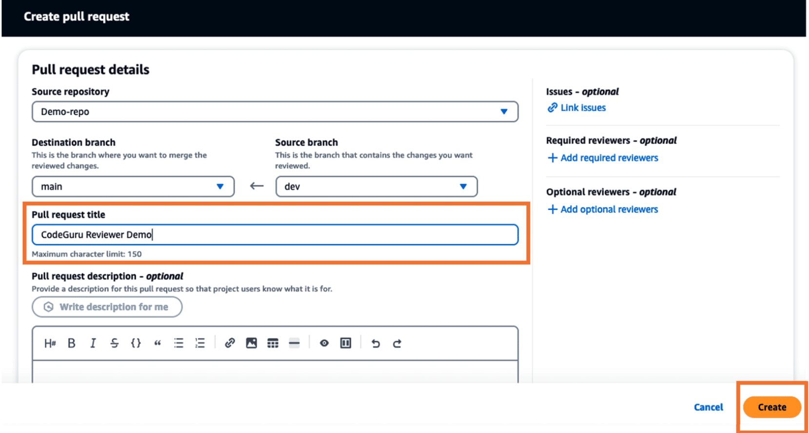
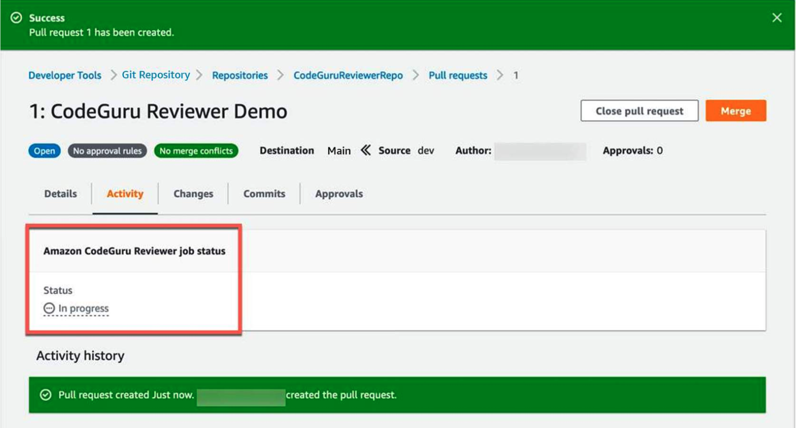
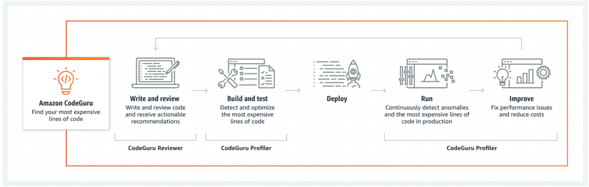
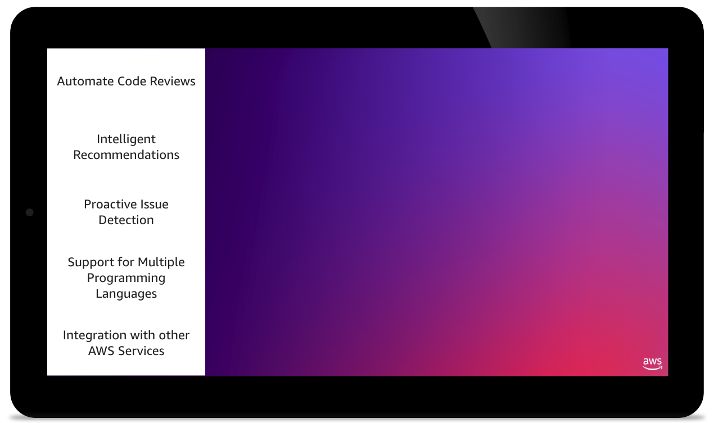
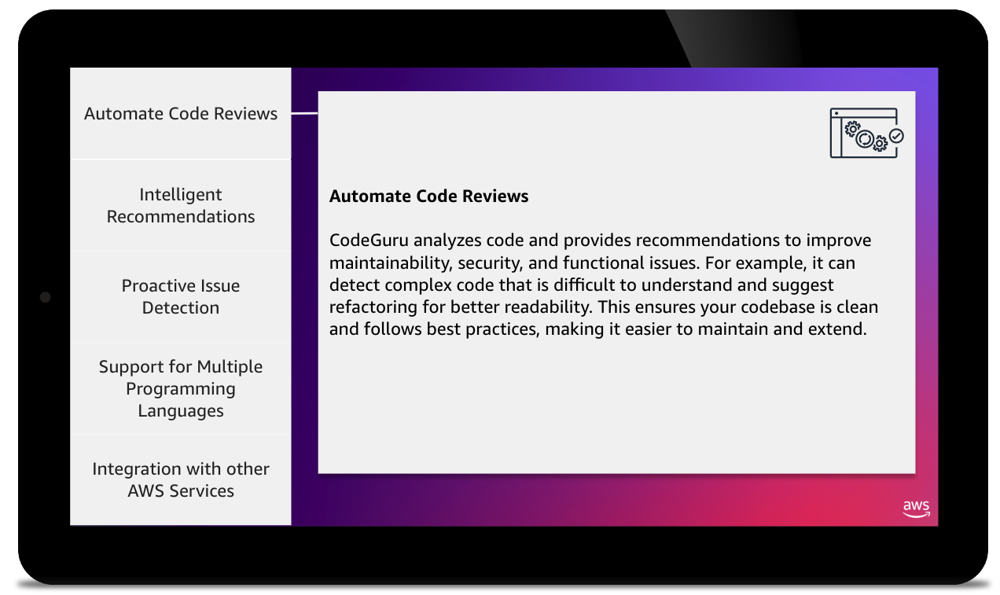
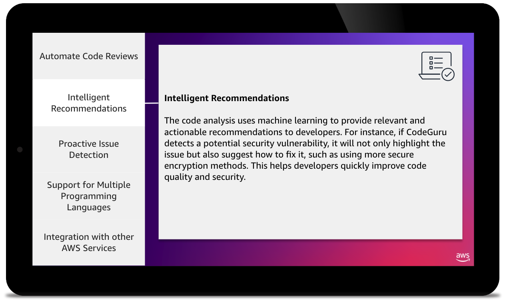
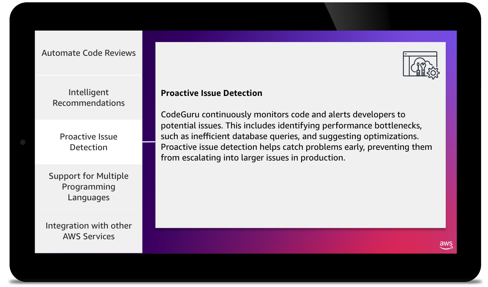
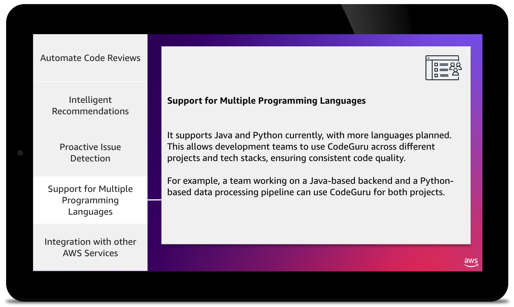
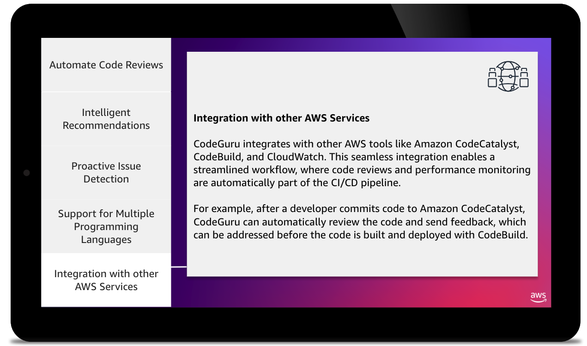
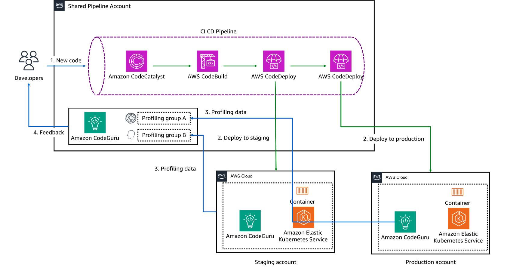

# Week 1: Integrating Code Reviews in Automated Testing

* back to AWS Cloud Institute repo's root [aci.md](../aci.md)
* back to [AWS Cloud Operations 2](./aws-cloud-operations-2.md)
* back to repo's main [README.md](../../../README.md)

## Integrating Code Reviews in Automated Testing

### Pre-assessment

#### What is the primary purpose of incorporating code reviews into an automated testing process?

* Improve code quality and catch bugs earlier in the development cycle

Wrong answers:

* Reduce the number of unit tests
* Automate the deployment process
* Increase the speed of the testing process

##### Explanation

The main purpose of integrating code reviews into an automated testing process is to improve the overall quality of the code base and catch bugs as early as possible in the development lifecycle. With code reviews, developers can identify and address issues before they are introduced into the mainline code base, which can significantly reduce the time and effort required to fix them later.

The other options are incorrect because of the following reasons:

* Reducing the number of unit tests is incorrect because code reviews do not aim to reduce the number of unit tests. Rather, they complement testing by providing human insights and catching issues that automated tests might miss.
* Automating the deployment process is incorrect because code reviews are a manual process aimed at improving code quality, not automating deployment.
* Increasing the speed of the testing process is incorrect because although code reviews contribute to overall code quality, they do not necessarily speed up the testing process since they add a layer of manual inspection.

#### What is a key benefit of automating the code review process?

* Faster feedback and more consistent reviews

Wrong answers:

* Reduced developer productivity
* Increased bias and subjectivity in the review process
* Decreased code coverage in the testing suite

##### Explanation

Automating the code review process can provide several benefits, including faster feedback to developers and more consistent reviews across the team. Automated tools can analyze code changes, identify potential issues, and provide immediate feedback, helping developers to address problems more quickly. This consistency and speed can lead to improved code quality and a more efficient development workflow, compared to manual code reviews.

The other options are incorrect because of the following reasons:

* Reduced developer productivity is incorrect because automating the code review process generally increases productivity by providing quicker feedback and reducing the manual effort required.
* Increased bias and subjectivity in the review process is incorrect because automation aims to reduce bias and subjectivity by applying consistent criteria to all code reviews.
* Decreased code coverage in the testing suite is incorrect because automating code reviews does not inherently affect code coverage. Code coverage is related to the extent of automated testing, not the review process itself.

#### What is the recommended approach for integrating code reviews with continuous integration and continuous deployment (CI/CD) processes?

* Perform code reviews as part of the automated testing suite, before deployment

Wrong answers:

* Conduct code reviews after the deployment process
* Separate the code review process from the CI/CD pipeline
* Rely solely on manual code reviews, without any integration with CI/CD

##### Explanation

The recommended approach for integrating code reviews with CI/CD processes is to perform the code reviews as part of the automated testing suite, before the deployment stage. This supports the identification and resolution of issues.

The other options are incorrect because of the following reasons:

* Conducting code reviews after the deployment process is incorrect because code reviews should be conducted before deployment to catch issues early and prevent faulty code from reaching production.
* Separating the code review process from the CI/CD pipeline is incorrect because integrating code reviews into the CI/CD pipeline ensures that code quality checks are an integral part of the development process, leading to more consistent and reliable deployments.
* Relying solely on manual code reviews, without any integration with CI/CD is incorrect because it does not take advantage of the automation and consistency provided by integrating code reviews into the CI/CD pipeline, potentially leading to slower and less reliable processes.

### Automated Testing and Code Reviews

Automated testing in the DevOps context refers to the process of using specialized tools and scripts to run test cases automatically, without the need for manual intervention. Automated testing is a crucial part of the DevOps process, as it helps ensure the quality and reliability of software applications, and with greater consistency than manual testing.

By integrating automated testing into the DevOps pipeline, developers can receive immediate feedback on the quality of their code. With this feedback, they can identify and address issues early in the development cycle.

By using the power of automated testing, DevOps teams can improve the reliability, consistency, and speed of their software development and deployment processes, ultimately enhancing their competitive edge in the market.

Here are some of the common types of automated testing in DevOps:

* Unit Testing

    This type of testing focuses on verifying the functionality of individual components or units of the software system. It is typically written by developers and is used to ensure that each unit works as expected.

* Integration Testing

    Integration testing is used to verify that different components of the software system work together correctly. It helps identify any issues or conflicts that might arise when integrating various parts of the application.

* End-to-End Testing (E2E)

    E2E testing simulates the entire user journey, from start to finish, to ensure that the application functions as expected from the user's perspective. This type of testing helps identify any issues that might occur during the user's interaction with the application.

* Performance Testing

    Performance testing is used to measure the application's performance under different load conditions, such as high user traffic or large data volumes. It helps identify any performance bottlenecks or scalability issues.

* Security Testing

    Security testing is used to identify and address potential security vulnerabilities in the application. It includes activities like penetration testing, vulnerability scanning, and security audits.

* Regression Testing

    Regression testing is performed after changes have been made to the software system to ensure that existing functionality is not broken. It helps catch any unintended consequences of the changes.

* Smoke Testing

    Smoke testing is a quick, high-level test that checks the basic functionality of the application. It is typically run after a new build or deployment to ensure that the application is in a stable state and ready for further testing.

* Acceptance Testing

    Acceptance testing is used to verify that the software system meets the specified requirements and is ready for deployment. It is typically performed by the customer or end-user to ensure that the application meets their needs.

#### Code Reviews

Code reviews are a crucial aspect of the software development process, and they play an even more significant role in the context of automated testing. Automated testing is the practice of writing and running tests that check the functionality of software without manual intervention. As software systems become increasingly complex, the need for thorough and effective code reviews becomes more apparent.

##### Improved Design and Development Practices

Having another developer review the code gives another perspective on the design of the software. With this human-to-human interaction, developers can convey non-textbook ideas and concepts better than if they were only using text-based documentation. This often results in improved designs or development practices.

##### Compliance to Standards/Policy

In many large organizations, there is a set of standards that developers have to adhere to. A code review is a perfect place to enforce these standards as a human will identify any deviations from these standards and bring them to the attention of the development team.

##### Team Improvement

The developer who wrote the code and the reviewer will both learn from the code review. The reviewer will learn from the actual implementation of the code (rather than only reading about it) and will get an actual dive into the design decisions taken by the developer. The developer, on the other hand, will learn about the common critiques for that piece of functionality and avoid making the same mistakes in the future.

Ultimately, the success of an automated testing strategy depends on the quality and effectiveness of the underlying test code. Code review is a crucial practice in modern software development, where developers review each other's code to identify potential issues, improve code quality, and share knowledge. By incorporating thorough code reviews into the development process, teams can improve the reliability, maintainability, and effectiveness of their automated tests, leading to a more robust and resilient software product.

### Methods for Automated Testing and Code Review Integration

Integrating automated testing into the code review process can enhance its effectiveness by providing objective feedback and ensuring that new changes don't introduce regressions.

Automated Testing has come a long way and has been the backbone for many development teams for various types of projects. However, integration with human intelligence and Code Review is the next big step to improve quality and speeds in development. The synergy between these techniques can only mean shorter and more effective product releases, while still maintaining high quality standards.

Automated testing and code review integration are essential practices in software development to ensure code quality, reliability, and maintainability.

1. Continuous Integration (CI)

    Setting up a CI pipeline that automatically runs a suite of automated tests (unit, integration, and end-to-end tests) every time code changes are pushed to the repository. This helps catch issues early in the development process.

2. Test-Driven Development

    Writing tests before writing the actual code, ensuring that the code meets the specified requirements and reducing the risk of introducing bugs.

3. Code Coverage Analysis

    Measuring the percentage of code that is covered by automated tests, and aiming to maintain a high coverage percentage to ensure thorough testing.

4. Static Code Analysis

    Using tools to analyze the codebase for potential issues, such as code style, code complexity, security vulnerabilities, and code smells, without running the code.

5. Linting

    Automating the enforcement of code style and formatting standards through the use of linting tools, ensuring consistent code quality.

6. Peer Code Review

    Implementing a process where developers review each other's code changes before merging them into the main codebase. This helps catch defects, improve code quality, and share knowledge.

7. Automated Code Review

    Integrating tools like code review bots or plugins into the development workflow to provide automated feedback on code changes, such as identifying common issues, code smells, and security vulnerabilities.

8. Dependency Management

    Automatically monitoring and updating the project's dependencies to ensure that the codebase is using the latest stable and secure versions of libraries and frameworks.

9. Continuous Deployment

    Automating the deployment process, where successful test runs and code reviews initiate the deployment of the code to various environments (for example, development, staging, or production).

10. Monitoring and Feedback Loops

    Implementing mechanisms to track the performance and health of the deployed application, and using the collected data to continuously improve the testing and code review processes.

By adopting these methods, organizations can streamline the software development lifecycle, improve code quality, and reduce the risk of introducing bugs or security vulnerabilities. Additionally, incorporating code reviews into the development workflow encourages peer-to-peer knowledge sharing, improved code readability, and better adherence to coding best practices. As software systems continue to grow in complexity, the adoption of robust automated testing and code review strategies will become increasingly vital to ensuring the smooth and efficient delivery of software products.

### Pull Requests

With pull requests, developers can notify others of changes they have pushed to a repository. When a pull request is opened, other developers can review the proposed changes before they are merged into the main branch. Pull requests facilitate code review and discussion of changes before they are added to the codebase.

Reviewers can comment on specific lines, request changes, approve or reject pull requests. For large features spanning multiple commits, pull requests help break up code review into smaller chunks. Pull requests provide a record of the changes, instead of only merging directly into the main branch. Pull requests can be configured to require a certain number of reviewers to approve before being merged. Some repositories require pull requests to pass continuous integration tests before authorizing the merge.

Pull requests facilitate community code contributions by making it possible for the core team to review external changes before integrating them. Overall, pull requests and manual code reviews improve code quality, encourage discussion, and provide safeguards before altering the main codebase.

### Amazon CodeGuru

Amazon CodeGuru is a developer tool that provides automated code reviews and recommendations to help improve code quality and identify coding issues. It uses machine learning to analyze code and provide recommendations to developers. CodeGuru integrates seamlessly with your development workflow, making it possible for you to review recommendations directly within your code editor or pull requests.

The image depicts a workflow diagram showing the different stages involved in using the Amazon CodeGuru service.

The first stage is "Find your most expensive lines of code" with the CodeGuru icon. The second stage is "Write and review" with icons representing writing and reviewing code. The third stage is "Build and test" with icons for building and testing code.

The fourth stage is "Deploy" with icons showing deployment and optimization. The fifth stage is "Run" with icons indicating continuous monitoring and anomaly detection. The final stage is "Improve" with icons for fixing performance issues and reducing costs.

Below the main workflow, there are labels for the CodeGuru Reviewer, CodeGuru Profiler, and CodeGuru Profiler tools that support different parts of the workflow.

By providing actionable insights and recommendations, CodeGuru Reviewer helps developers write cleaner, more efficient code, leading to improved software quality and reduced technical debt.

### CodeGuro Key Features

#### Automate Code Reviews

#### Intelligent Recommendations

#### Proactive Issue Detection

#### Support for Multiple Programming Languages

#### Integration with other AWS Services

### CodeGuru Profiler

CodeGuru Profiler searches for application performance optimizations and recommends ways to fix issues such as excessive recreation of expensive objects, expensive deserialization, usage of inefficient libraries, and excessive logging. CodeGuru Profiler runs continuously, consuming minimal CPU capacity so it doesn’t significantly impact application performance. You can run an agent or import libraries into your application and send the data collected to CodeGuru, and review the findings on the CodeGuru console.

### Benefits of CodeGuru

Amazon CodeGuru uses machine learning (ML) and goes even deeper with its architecture using AI (Artificial Intelligence) to analyze code and provide recommendations as to what needs to be done to achieve better and more efficient code. As a result there are many benefits to using

* Faster Issue Resolution
* Improved Code Quality
* Reduced Engineering Cost

### [Lab: Automating Code Reviews with Amazon CodeGuru](./labs/W014Lab3CodeReviewsWithCodeGuru_files/)

In this lab, you will utilize Amazon CodeGuru to perform a code review on existing code.

In this lab, you will perform the following tasks:

* Review the existing application, branch structure, and CI/CD pipeline.
* Associate Amazon CodeGuru with the repository and branch to run a code analysis.
* Review Amazon CodeGuru findings and update the codebase.

### Knowledge Check

#### How does Amazon CodeGuru help with manual code reviews?

* Provides automated recommendations for code improvements

Wrong answers:

* Replaces the need for manual code reviews
* Integrates with code review tools to streamline the process
* Generates detailed reports on the code review process

##### Explanation

CodeGuru does not replace the need for manual code reviews, but rather complements the process by providing automated recommendations for code improvements. These recommendations can help developers and reviewers identify and address potential issues more efficiently, without completely replacing the manual review process

The other options are incorrect because of the following reasons:

* Although CodeGuru provides automated code analysis and recommendations, it does not completely eliminate the need for manual code reviews performed by human reviewers. Manual reviews are still valuable for aspects that machine learning might miss, like architecture, design patterns, and overall code quality beyond defects.
* CodeGuru does not directly integrate with code review tools used for manual peer reviews. It operates as a separate service providing automated code analysis recommendations.
* Although CodeGuru analyzes the code, it does not track or report on the overall manual code review process and workflows followed by development teams.

#### What is the primary benefit of using automated testing in the context of code reviews?

* Increased visibility into the impact of code changes

Wrong answers:

* Reduced time spent on manual testing
* Improved collaboration between developers and reviewers
* Enhanced security of the code base

##### Explanation

Automated testing in the context of code reviews provides increased visibility into the impact of code changes, helping to identify potential issues or regressions early in the development process. This helps developers and reviewers make more informed decisions about code changes, instead of relying solely on manual testing or reviews.

The other options are incorrect because of the following reasons:

* Reduced time spent on manual testing is incorrect because the question is specifically about the benefit in the context of code reviews, not general software testing. Although automated testing can reduce time spent on manual testing overall, that is not directly related to the code review process.
* Improved collaboration between developers and reviewers is incorrect. Automated testing does not inherently improve collaboration between developers and reviewers during code reviews. Code reviews are more about reviewing the code changes themselves, not the testing process.
* Enhanced security of the code base is incorrect. Automated testing can improve security indirectly by catching certain types of vulnerabilities, but its primary purpose is validating functionality, not specifically enhancing security of the entire code base during reviews.

#### What is a key benefit of using Amazon CodeGuru?

* Improved code quality

Wrong answers:

* Reduced development costs
* Enhanced security
* Increased productivity

##### Explanation

CodeGuru is a developer tool that uses machine learning to identify potential issues in code, such as bugs, security vulnerabilities, and code style problems. By catching these issues early and providing recommendations for improvement, Amazon CodeGuru helps to improve the overall quality of the code base.

The other options are incorrect because of the following reasons:

* Although CodeGuru can potentially reduce costs indirectly by improving code quality and productivity, its primary purpose is not specifically to reduce development costs. There is no direct cost-saving mechanism associated with using CodeGuru.
* CodeGuru focuses on identifying code quality issues, optimizations, and best practice violations. However, it does not explicitly enhance the overall security aspects of the code base. Security is a separate concern.
* Increased productivity can be an indirect benefit of using CodeGuru's recommendations to improve code quality and fix issues. However, CodeGuru itself does not directly increase productivity—that would depend on how effectively developers implement its suggestions.

#### What is the primary purpose of integrating automated testing with code reviews?

* Ensure that code changes do not introduce new defects

Wrong answers:

* Reduce the time it takes to conduct code reviews
* Improve the productivity of the development team
* Increase the number of code reviews performed

##### Explanation

Integrating automated testing with code reviews helps to ensure that code changes do not introduce new defects by catching issues early in the development process. This enables the development team to address problems before they are merged into the code base, reducing the time and effort required to fix them later.

The other options are incorrect because of the following reasons:

* Although automated testing can potentially speed up code reviews by quickly identifying issues, reducing review time is not the primary purpose of integrating it with code reviews. Code reviews have other important aspects beyond speed.
* Improved productivity can be a potential secondary benefit, but it is not the main purpose of combining automated testing with code reviews specifically. The two processes have a different primary goal.
* Integrating automated testing does not directly increase the number or frequency of code reviews done. Code review policies and processes determine how often reviews occur.

### Summary

#### Automated Testing and Code Reviews

Automated tests are scripts that automatically test code by simulating user interactions and validating expected results. They help catch bugs and regressions quickly during development. Code reviews involve having other developers review code changes before merging them into the main codebase. Reviewers look for bugs, security issues, stylistic problems, and design flaws. Automated testing and human code reviews are complementary techniques for improving software quality and reducing bugs in production. The purpose of code reviews is to help quality assurance and improve the overall code quality, reliability, security, robustness, and performance of the software.

#### Methods for Automated Testing and Code Review Integration

Automated testing and code review integration are essential practices in software development to ensure code quality, reliability, and maintainability. By adopting these methods, organizations can streamline the software development lifecycle, improve code quality, and reduce the risk of introducing bugs or security vulnerabilities.

##### Methods for Automated Testing

1. Continuous Integration (CI)
2. Test-Driven Deployment
3. Static and Code Coverage Analysis
4. Linting
5. Peer and Automatic Code Review
6. Continuous Deployment (CD)
7. Monitoring and Feedback Loops

#### Amazon CodeGuru

Amazon CodeGuru is a developer tool that provides intelligent recommendations to improve code quality and identify an application’s most expensive lines of code. Integrate CodeGuru into your existing software development workflow to automate code reviews during application development and continuously monitor application's performance in production and provide recommendations and visual clues on how to improve code quality, application performance, and reduce overall cost.

The two components in CloudGuru:

1. **Amazon CodeGuru Reviewer**

    Amazon CodeGuru Reviewer is an automated code review service that identifies critical defects and deviation from coding best practices for Java and Python code. It scans the lines of code within a pull request and provides intelligent recommendations based on standards learned from major open-source projects as well as Amazon codebase.

2. **Amazon CodeGuru Profiler**

    Amazon CodeGuru Profiler analyzes the application runtime profile and provides intelligent recommendations and visualizations that guide developers on how to improve the performance of the most relevant parts of their code.
