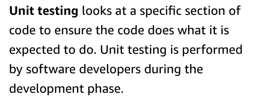
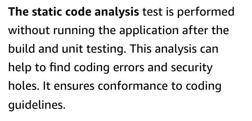
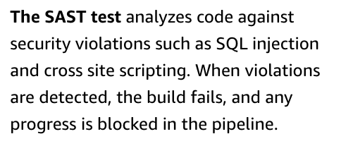
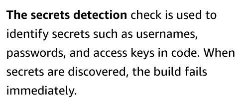
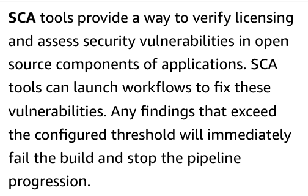
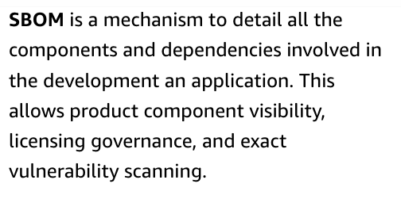
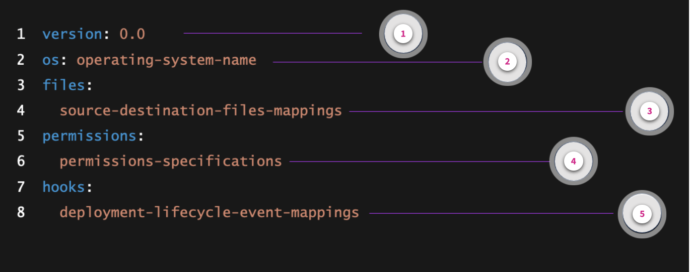
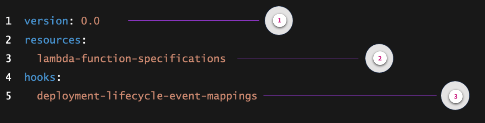
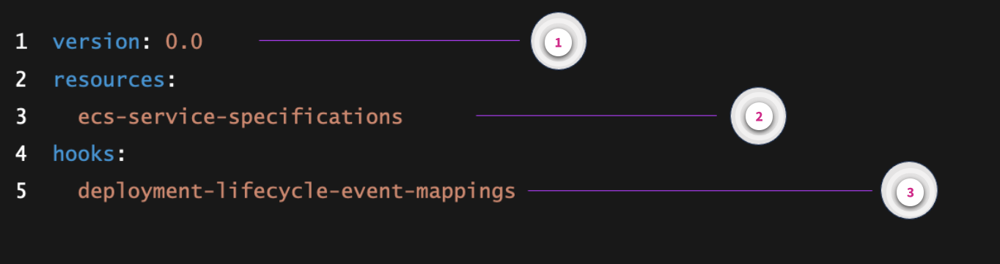
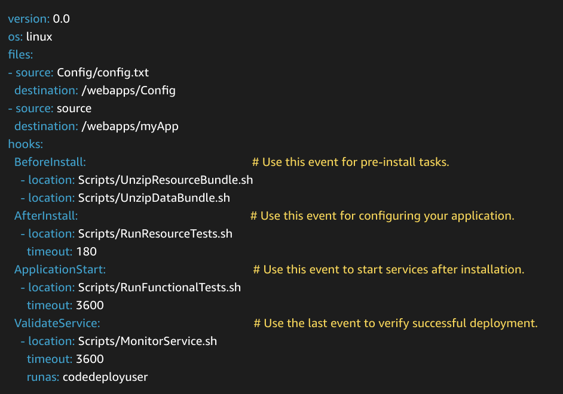

# Week 2: DevOps 2: Integrating with the CI/CD Pipeline

* back to AWS Cloud Institute repo's root [aci.md](../aci.md)
* back to [AWS Cloud Operations 2](./aws-cloud-operations-2.md)
* back to repo's main [README.md](../../../README.md)

## DevOps 2: Integrating with the CI/CD Pipeline

### Pre-assessment

#### What is a function of AWS CodeDeploy?

* To automate the deployment of applications to different compute platforms

Wrong answers:

* To provision and manage AWS resources like Amazon EC2 instances and AWS Lambda functions
* To monitor and troubleshoot application performance issues on AWS
* Mange and scale AWS database resources like Amazon RDS and Amazon DynamoDB

##### Explanation

CodeDeploy can be used to deploy server, serverless, or container applications on various compute platforms.

The other responses are incorrect because of the following:

* CodeDeploy does not provision and manage AWS resources.
* CodeDeploy does not monitor and troubleshoot application performance issues.
* CodeDeploy is used for application deployment, not managing and scaling database resources like Amazon RDS and DynamoDB.

#### What is typically a responsibility of an application developer in a continuous integration and continuous deployment (CI/CD) environment?

* Collaborating with other software developers to design and deploy stable and efficient applications

Wrong answers:

* Managing the design, architecture, and CI/CD infrastructure resources
* Patching and troubleshooting compute resources running in production
* Ignoring security engineers concerns about software vulnerabilities

The other responses are incorrect because of the following:

* Automation engineers manage the design, architecture, and CI/CD infrastructure resources.
* Operations engineers patch and troubleshoot compute resources running in production.
* Developers partner with security engineers to address their concerns about software vulnerabilities.

#### What is the primary reason for running integration tests in both beta and gamma environments?

* To catch regressions and verify new behavior in a volatile environment (beta) before promoting the code to a more stable environment (gamma)

Wrong answers:

* To save time and resources by avoiding the need to run tests in the production environment
* To compare the test results between beta and gamma environments and identify any discrepancies
* To ensure that the code changes work correctly with the beta and gamma databases and dependencies

##### Explanation

Running tests in the beta environment helps catch regressions, verify new behavior, and ensure dependencies are working as expected in a constantly changing environment. Running tests in the gamma environment, which is more stable and closer to production, provides further confidence that the code will work correctly in production.

The other responses are incorrect because of the following:

* Although ensuring compatibility with databases and dependencies is important, this is not the primary reason for running tests in both beta and gamma environments.
* Although avoiding running tests in production is a good practice, this is not the primary reason for running tests in both beta and gamma.
* Comparing test results between beta and gamma might be helpful, but this is not the primary reason for running tests in both environments.

### The Application Developer Role in CI/CD

1. The application developer will commit the changes and push it to AWS CodeCommit, which triggers the CI/CD pipeline. AWS CodeCommit serves as a secure source control service, which seamlessly integrates with other AWS services to enable the automation of the CI/CD process.
2. With the new changes pushed, AWS CodeBuild automatically starts a build. CodeBuild compiles the code, runs tests on the code to check for bugs and ensure accuracy, and produces artifacts that are ready for deployment. It’s crucial for application developers to include comprehensive tests to catch bugs early, before the customers use the feature.
3. Simultaneously, application developers use AWS CodePipeline, which orchestrates the workflow from commit to deployment. CodePipeline detects the updated branch, uses the build artifacts from CodeBuild, and moves them through various stages.

Before the new feature reaches production, it passes through a code review and a quality assurance (or QA) testing phase. Here, manual and automated tests help ensure the code’s quality and functionality.

#### DevOps processes include testing during every stage of the software development lifecycle.

1. **Unit Testing**. Unit testing focuses on small objects. It covers all different conditions and methods available at the class level.
2. **Component testing** covers  larger and more complex applications that are separated into multiple components. Each component might contain different classes and objects to deliver small functionality. These functionalities are tested using an automation framework.
3. **Integration testing**. Because applications are often built with components, two or more components are integrated into the product. Integration testing verifies the interactions between integrated components and ensuring they work together as expected.
4. **API testing**. Microservice architecture is commonly used in organizations. In API testing, individual or interrelated microservices are tested together.
5. **Functional testing** focuses on user workflows and end-user functionality, and is often called **end-to-end testing**. This is often done with automation tools to improve time-efficiency.
6. **Performance testing**. Performance testing measures the application behavior with different loads, different network conditions, and different infrastructure configurations, all in an effort to help ensure a positive user experience. Performance testing can be scripted and automated.

Once the feature passes QA testing, AWS CodeDeploy rolls it out to production. CodeDeploy’s integration with Elastic Load Balancing (ELB) and AWS Auto Scaling ensures that the deployment is smooth, and that the production environment can handle the update without downtime.

Application developers monitor the deployment using Amazon CloudWatch, which provides real-time logs and metrics. This allows them to quickly identify and resolve any issues that may arise after deployment. After the deployment, it’s time for application developers to gather user feedback.

Continuous feedback is essential for iterative development, which can be facilitated by integrating feedback tools within the application or using AWS services like AWS X-Ray for tracing user interactions. Thanks to the robust CI/CD pipeline with AWS developer tools, you can release new features with confidence and ensure reliability and a positive user experience.

Application developers play a critical role in every phase of the pipeline, by contributing code and also ensuring that CI/CD processes are seamless and efficient.

#### Versatile roles and responsibilities

The role and responsibilities of an application developer for CI/CD vary based on the size of an organization or the organization’s team structure. For example, a small organization might require the application developer to both develop the application and work with the operations teams to help manage the CI/CD pipeline components. Larger organizations usually have the benefit to focus roles to their core responsibilities. For example, application developers focus on designing and developing applications, whereas automation engineers manage the design, architecture, and CI/CD infrastructure resources.

Your responsibility as an application developer for CI/CD will depend on your organization’s requirements and DevOps maturity. Your awareness and ability to work with both continuous integration and continuous delivery is crucial for your success as an application developer.

The following are some of the responsibilities that the application developer role often includes:

* Collaborating with other software developers to design and deploy stable and efficient applications
* Ensuring that applications use cloud scalability and performance optimization
* Integrating code changes into the pipeline, automating testing, and facilitating continuous delivery to the cloud
* Partnering with security engineers to address vulnerabilities and ensure that security measures are embedded in the application design

#### CI/CD pipeline testing

To ensure the integrity of an application with each code change, an application developer must run, review, and take appropriate action for the various software tests that occur in each stage of the CI/CD pipeline.

1. **Source**. The source stage is the beginning of the CI/CD pipeline. In practice, the source is usually a code repository like Amazon CodeCatalyst. Any kind of testing, such as unit testing, occurs prior to pushing a code change to a code repository and onto a developer's local environment. After the code change approval, the next stage is the build stage.
2. **Build**. The build stage is a critical phase of the CI/CD pipeline where the source code, collected in the source stage, gets transformed into a tangible product that can be executed in an environment. This transformation depends on the type of application being built.
3. **Staging**. In the staging phase, full environments are created that mirror the eventual production environment. The staging phase includes integration testing, component testing, and performance testing.
4. **Production**. After passing the previous tests, the staging phase is repeated in a production environment. Depending on the deployment strategy choice, additional testing could occur before a full release of software.

#### Testing in Continuous Integration

In the build stage, your build tools use approved changes to a source code repository to build the software and run various types of tests.

* Unit Testing
  * 
* Static Code Analysis
  * 
* Static Application Security Testing (SAST)
  * 
* Secrets Detection
  * 
* Software Composition Analysis (SCA)
  * 
* Software Bill of Materials (SBOM)
  * 

**Application developers review the results of continuous integration tests and take action to remedy any testing failures to ensure the integrity of the build.**

## Continuous Delivery Pipeline Requirements

### Continuous delivery: Staging

Continuous delivery (CD) is the next phase. It involves deploying the application code in a staging environment, which is a replica of the production stack, and running more functional tests. The staging environment could be a static environment premade for testing, or you could provision and configure a dynamic environment with committed infrastructure and configuration code for testing and deploying the application code.

### Continuous delivery: Production

In the pipeline sequence, the production environment is after the staging environment. The production environment is built using infrastructure as code (IaC).

### Continuous deployment

The final phase in the CI/CD deployment pipeline is continuous deployment, which might include full automation of the entire software release process including deployment to the production environment. In a fully mature CI/CD environment, the path to the production environment is fully automated, which allows code to be deployed with high confidence.

### Going beyond the basics

As your organization matures its DevOps practices, it will continue to develop the CI/CD model to include more of the following improvements:

* Staging environments for specific performance, compliance, security, and UI tests
* Unit tests of infrastructure and configuration code along with the application code
* Integration with other systems and processes such as code review, issue tracking, and event notification
* Integration with database schema migration (if applicable)
* Additional steps for auditing and business approval

Even the most mature organizations that have complex multi-environment CI/CD pipelines continue to look for improvements. DevOps is a journey, not a destination. Feedback about the pipeline is continuously collected. The feedback provided to development teams leads to improvements in speed, scale, security, and reliability. By having a single place to collaborate across the teams, for example using AWS CodePipeline, the teams can have visibility to build and deliver software products with confidence.

### Functional testing

Functional testing is a process of determining if a piece of software is acting in accordance with requirements. It tests the functionality of part of the whole system rather than a single function. The tester should have no knowledge of the internal system logic.

The objectives of functional testing include the following:

* Test the main functions of an application.
* Test basic usability and system navigation.
* Test accessibility requirements.
* Test error messages under known conditions.

During all functional testing, the goal should be to fail the code to discover software defects and increase software quality. Functional testing involves six steps.

1. Identify functions the software is expected to perform.
2. Create input data based on the function's specifications.
3. Determine function output based on the function's specifications.
4. Run the test case.
5. Compare actual and expected outcomes.
6. Verify the function works based on customer needs.

## Review of AWS CodeDeploy

### AWS CodeDeploy

CodeDeploy is a fully managed deployment service that automates software deployments to a variety of compute services including Amazon Elastic Compute Cloud (Amazon EC2), AWS Fargate, AWS Lambda, or on-premises servers.

Inside of the CI/CD pipeline, we can deploy first to staging, then beta. Once we've figured out the beta works, then make our way eventually to production. This allows us to move quickly and minimize potential bugs.

In order to facilitate that deployment into our different environments, we're gonna use CodeDeploy. CodeDeploy does more than just deploy to EC2 instances. It can also help facilitate deployments to Fargate, Lambda, ECS, or even on-premise architecture, depending on your needs. If it detects that there's a problem during the deployment, we can automatically roll back, meaning redeploy a previously working copy of the application.

Just like CodeBuild gets a buildspec file with its sets of instructions, CodeDeploy gets an AppSpec file with its set of instructions. With CodeDeploy, you're gonna define how the deployment actually happens.

### Deployment types

* **In-place updates**, without changing anything about the architecture besides ripping out version 1.1 of my code and replacing it with version 1.2. upside is it's quick. downside is well, the downtime.
* **Rolling updates**, it's like doing an in-place update but only on a small subset of our architecture. I replace one, two, maybe three instances at a time in a rolling manner.
* **blue/green**, spin up a second environment, spin new resources up, spin the old resources down and cut over from the old environment to the new.

### CodeDeploy Deployment Destinations

* deployment group or an autoscaling group
* Lambda functions
* containers into our ECS service

### AWS CodeDeploy - why and how

#### Why Use It

You can use CodeDeploy to do the following:

* Deploy server, serverless, or container applications.
* Automate deployments and eliminate the need for manual, error-prone operations. With CodeDeploy, you can reliably and rapidly release new features and updates.
* Deploy on a variety of compute platforms, including Lambda, Amazon Elastic Container Service (Amazon ECS), Amazon EC2, or on premises. You can even configure CodeDeploy to deploy to an Amazon EC2 Auto Scaling group, which will prepare the environment before traffic is sent to it.
* Concurrently deploy to one or multiple instances as the service scales to fit your needs.
* Minimize production downtime for your application by specifying if an update will be applied on an existing instance or a newly provisioned environment that will replace the previous environment. You can also control how to handle the traffic shifts from older to newer versions. For example, consider an application that needs at least 50 percent of the instances in a deployment group to be up and serving traffic. You can specify that in your deployment configuration so that a deployment does not cause downtime.
* Automatically (or through user intervention) stop an unsuccessful deployment and roll back your deployment to a previous version.

#### How it works

To automate the deployment to the appropriate compute resources, CodeDeploy needs to know which files to copy, which scripts to run, and where to deploy.

During deployment, CodeDeploy looks for your AppSpec file in the root directory of the application's source. The AppSpec file specifies where to copy the code and how to get it running. For example, it tells CodeDeploy how to stop the application if it is already running, and how to install the code. It also tells CodeDeploy which command to run before and after the code is installed, and how to get the application running again.

A *deployment group* specifies the deployment targeted environment. The information it contains is specific to the target compute platform: Lambda, Amazon ECS, Amazon EC2, or on premises. For example, you can use Amazon ECS to specify the Amazon ECS service, load balancer, and more. For Amazon EC2, it is a logical group of deployment target instances or physical environments.

The CodeDeploy agent is needed if you are deploying to Amazon EC2 or an on-premises compute platform. It is installed and configured on the target instances. It accepts and runs requests on behalf of CodeDeploy.

During deployment, a *deployment configuration* defines a set of deployment rules and deployment success and failure conditions. For an Amazon EC2 compute platform, it specifies the number or percentage of instances that must remain available during deployment. It also specifies if an instance in the deployment group is briefly taken offline and updated with the latest code revision, or if a new instance replaces the instances in the deployment group.

**In CodeDeploy, an AppSpec file is written in either YAML or JSON.**

### CodeDeploy application specification files

CodeDeploy application specification files are commonly referred to as AppSpec files. They manage each deployment as a series of lifecycle event hooks, which are defined in the file. The structure of the AppSpec file can differ depending on the compute platform you choose.

#### 

1. **Version \[required\]**. This section specifies the version of the AppSpec file. Do not change this value. Currently, the only allowed value is 0.0.
2. **OS \[required\]**. This section specifies the operating system value of the instance to which you deploy. The following values can be specified:
    * linux – The instance is an Amazon Linux, Ubuntu Server, or RHEL instance.
    * windows – The instance is a Windows Server instance.
3. Files

    This section specifies the names of files that should be copied to the instance during the deployment's install event.

    This section is required only if you are copying files from your revision to locations on the instance during deployment.

4. Permissions

    This section specifies how special permissions, if any, should be applied to the files in the files section as they are being copied over to the instance. This section applies to Amazon Linux, Ubuntu Server, and Red Hat Enterprise Linux instances only.

5. Hooks

    This section specifies scripts to run at specific deployment lifecycle events during the deployment.

    A deployment hook is run once per deployment to an instance. You can specify one or more scripts to run in a hook.

#### 

1. **Version \[required\]**. This section specifies the version of the AppSpec file. Do not change this value. Currently, the only allowed value is 0.0.
2. **Resources**. This section specifies information about the Lambda function to deploy. It contains the name, alias, current version, and target version of a Lambda function.
3. **Hooks**. This section specifies Lambda functions to run at specific deployment lifecycle events to validate the deployment. Each hook runs once per deployment. The following are descriptions of hooks available for use in your AppSpec file:
    * BeforeAllowTraffic – Use to run tasks before traffic is shifted to the deployed Lambda function version.
    * AfterAllowTraffic – Use to run tasks after all traffic is shifted to the deployed Lambda function version.

#### 

1. **Version \[required\]**. This section specifies the version of the AppSpec file. Do not change this value. Currently, the only allowed value is 0.0. It is reserved by CodeDeploy for future use.
2. **Resources**. This section specifies information about an Amazon ECS application to deploy.
3. **Hooks**. This section specifies Lambda functions to run at specific deployment lifecycle events to validate the deployment.

#### AppSpec example for Amazon EC2 deployment

The following YAML-formatted AppSpec file illustrates an in-place deployment to an EC2 instance running a Linux-based operating system.

The preceding script performs the following events during the deployment:

1. Run the script located at Scripts/UnzipResourceBundle.sh.
2. If the previous script returned an exit code of 0 (success), run the script located at Scripts/UnzipDataBundle.sh.
3. Copy the file from the path of Config/config.txt to the path /webapps/Config/config.txt.
4. Recursively copy all the files in the source directory to the /webapps/myApp directory.
5. Run the script located at Scripts/RunResourceTests.sh with a timeout of 180 seconds (3 minutes).
6. Run the script located at Scripts/RunFunctionalTests.sh with a timeout of 3600 seconds (1 hour).
7. Run the script located at Scripts/MonitorService.sh as the user codedeploy with a timeout of 3600 seconds (1 hour).

**When using Amazon EC2 or on-premises infrastructure, the AppSpec file must be placed in the root of the directory structure of an application's source code.**

## Review of AWS CodePipeline

### AWS CodePipeline
