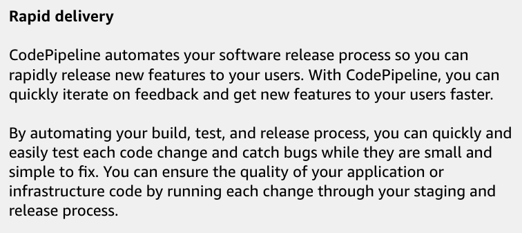
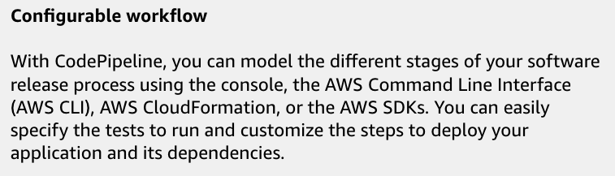
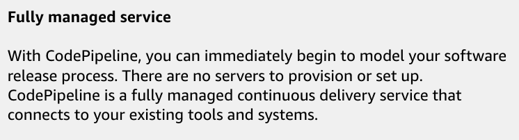
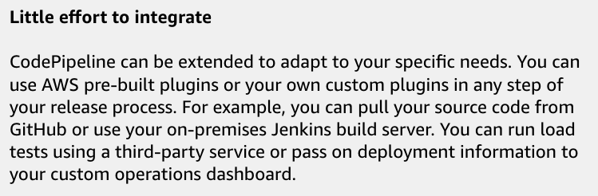
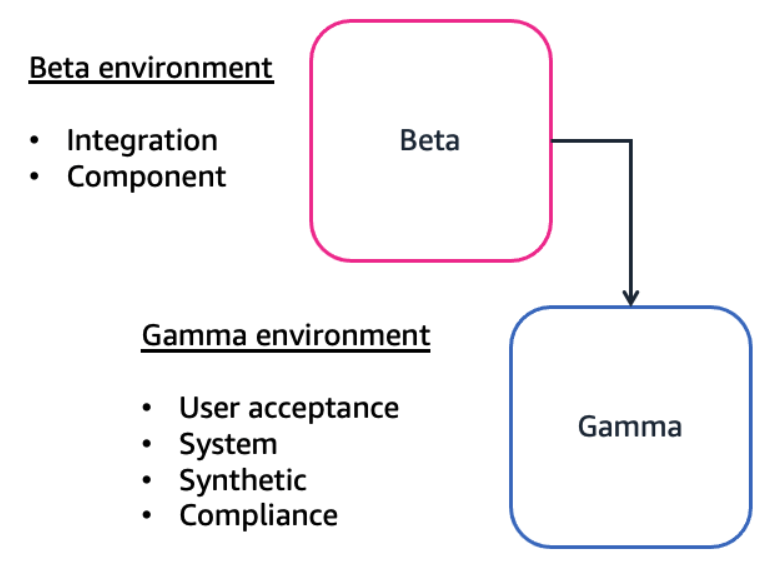

# Week 2: DevOps 2: Integrating with the CI/CD Pipeline

* back to AWS Cloud Institute repo's root [aci.md](../aci.md)
* back to [AWS Cloud Operations 2](./aws-cloud-operations-2.md)
* back to repo's main [README.md](../../../README.md)

## DevOps 2: Integrating with the CI/CD Pipeline

### Pre-assessment

#### What is a function of AWS CodeDeploy?

* To automate the deployment of applications to different compute platforms

Wrong answers:

* To provision and manage AWS resources like Amazon EC2 instances and AWS Lambda functions
* To monitor and troubleshoot application performance issues on AWS
* Mange and scale AWS database resources like Amazon RDS and Amazon DynamoDB

##### Explanation

CodeDeploy can be used to deploy server, serverless, or container applications on various compute platforms.

The other responses are incorrect because of the following:

* CodeDeploy does not provision and manage AWS resources.
* CodeDeploy does not monitor and troubleshoot application performance issues.
* CodeDeploy is used for application deployment, not managing and scaling database resources like Amazon RDS and DynamoDB.

#### What is typically a responsibility of an application developer in a continuous integration and continuous deployment (CI/CD) environment?

* Collaborating with other software developers to design and deploy stable and efficient applications

Wrong answers:

* Managing the design, architecture, and CI/CD infrastructure resources
* Patching and troubleshooting compute resources running in production
* Ignoring security engineers concerns about software vulnerabilities

The other responses are incorrect because of the following:

* Automation engineers manage the design, architecture, and CI/CD infrastructure resources.
* Operations engineers patch and troubleshoot compute resources running in production.
* Developers partner with security engineers to address their concerns about software vulnerabilities.

#### What is the primary reason for running integration tests in both beta and gamma environments?

* To catch regressions and verify new behavior in a volatile environment (beta) before promoting the code to a more stable environment (gamma)

Wrong answers:

* To save time and resources by avoiding the need to run tests in the production environment
* To compare the test results between beta and gamma environments and identify any discrepancies
* To ensure that the code changes work correctly with the beta and gamma databases and dependencies

##### Explanation

Running tests in the beta environment helps catch regressions, verify new behavior, and ensure dependencies are working as expected in a constantly changing environment. Running tests in the gamma environment, which is more stable and closer to production, provides further confidence that the code will work correctly in production.

The other responses are incorrect because of the following:

* Although ensuring compatibility with databases and dependencies is important, this is not the primary reason for running tests in both beta and gamma environments.
* Although avoiding running tests in production is a good practice, this is not the primary reason for running tests in both beta and gamma.
* Comparing test results between beta and gamma might be helpful, but this is not the primary reason for running tests in both environments.

### The Application Developer Role in CI/CD

1. The application developer will commit the changes and push it to AWS CodeCommit, which triggers the CI/CD pipeline. AWS CodeCommit serves as a secure source control service, which seamlessly integrates with other AWS services to enable the automation of the CI/CD process.
2. With the new changes pushed, AWS CodeBuild automatically starts a build. CodeBuild compiles the code, runs tests on the code to check for bugs and ensure accuracy, and produces artifacts that are ready for deployment. It’s crucial for application developers to include comprehensive tests to catch bugs early, before the customers use the feature.
3. Simultaneously, application developers use AWS CodePipeline, which orchestrates the workflow from commit to deployment. CodePipeline detects the updated branch, uses the build artifacts from CodeBuild, and moves them through various stages.

Before the new feature reaches production, it passes through a code review and a quality assurance (or QA) testing phase. Here, manual and automated tests help ensure the code’s quality and functionality.

#### DevOps processes include testing during every stage of the software development lifecycle.

1. **Unit Testing**. Unit testing focuses on small objects. It covers all different conditions and methods available at the class level.
2. **Component testing** covers  larger and more complex applications that are separated into multiple components. Each component might contain different classes and objects to deliver small functionality. These functionalities are tested using an automation framework.
3. **Integration testing**. Because applications are often built with components, two or more components are integrated into the product. Integration testing verifies the interactions between integrated components and ensuring they work together as expected.
4. **API testing**. Microservice architecture is commonly used in organizations. In API testing, individual or interrelated microservices are tested together.
5. **Functional testing** focuses on user workflows and end-user functionality, and is often called **end-to-end testing**. This is often done with automation tools to improve time-efficiency.
6. **Performance testing**. Performance testing measures the application behavior with different loads, different network conditions, and different infrastructure configurations, all in an effort to help ensure a positive user experience. Performance testing can be scripted and automated.

Once the feature passes QA testing, AWS CodeDeploy rolls it out to production. CodeDeploy’s integration with Elastic Load Balancing (ELB) and AWS Auto Scaling ensures that the deployment is smooth, and that the production environment can handle the update without downtime.

Application developers monitor the deployment using Amazon CloudWatch, which provides real-time logs and metrics. This allows them to quickly identify and resolve any issues that may arise after deployment. After the deployment, it’s time for application developers to gather user feedback.

Continuous feedback is essential for iterative development, which can be facilitated by integrating feedback tools within the application or using AWS services like AWS X-Ray for tracing user interactions. Thanks to the robust CI/CD pipeline with AWS developer tools, you can release new features with confidence and ensure reliability and a positive user experience.

Application developers play a critical role in every phase of the pipeline, by contributing code and also ensuring that CI/CD processes are seamless and efficient.

#### Versatile roles and responsibilities

The role and responsibilities of an application developer for CI/CD vary based on the size of an organization or the organization’s team structure. For example, a small organization might require the application developer to both develop the application and work with the operations teams to help manage the CI/CD pipeline components. Larger organizations usually have the benefit to focus roles to their core responsibilities. For example, application developers focus on designing and developing applications, whereas automation engineers manage the design, architecture, and CI/CD infrastructure resources.

Your responsibility as an application developer for CI/CD will depend on your organization’s requirements and DevOps maturity. Your awareness and ability to work with both continuous integration and continuous delivery is crucial for your success as an application developer.

The following are some of the responsibilities that the application developer role often includes:

* Collaborating with other software developers to design and deploy stable and efficient applications
* Ensuring that applications use cloud scalability and performance optimization
* Integrating code changes into the pipeline, automating testing, and facilitating continuous delivery to the cloud
* Partnering with security engineers to address vulnerabilities and ensure that security measures are embedded in the application design

#### CI/CD pipeline testing

To ensure the integrity of an application with each code change, an application developer must run, review, and take appropriate action for the various software tests that occur in each stage of the CI/CD pipeline.

1. **Source**. The source stage is the beginning of the CI/CD pipeline. In practice, the source is usually a code repository like Amazon CodeCatalyst. Any kind of testing, such as unit testing, occurs prior to pushing a code change to a code repository and onto a developer's local environment. After the code change approval, the next stage is the build stage.
2. **Build**. The build stage is a critical phase of the CI/CD pipeline where the source code, collected in the source stage, gets transformed into a tangible product that can be executed in an environment. This transformation depends on the type of application being built.
3. **Staging**. In the staging phase, full environments are created that mirror the eventual production environment. The staging phase includes integration testing, component testing, and performance testing.
4. **Production**. After passing the previous tests, the staging phase is repeated in a production environment. Depending on the deployment strategy choice, additional testing could occur before a full release of software.

#### Testing in Continuous Integration

In the build stage, your build tools use approved changes to a source code repository to build the software and run various types of tests.

* Unit Testing
  * 
* Static Code Analysis
  * 
* Static Application Security Testing (SAST)
  * 
* Secrets Detection
  * 
* Software Composition Analysis (SCA)
  * 
* Software Bill of Materials (SBOM)
  * 

**Application developers review the results of continuous integration tests and take action to remedy any testing failures to ensure the integrity of the build.**

## Continuous Delivery Pipeline Requirements

### Continuous delivery: Staging

Continuous delivery (CD) is the next phase. It involves deploying the application code in a staging environment, which is a replica of the production stack, and running more functional tests. The staging environment could be a static environment premade for testing, or you could provision and configure a dynamic environment with committed infrastructure and configuration code for testing and deploying the application code.

### Continuous delivery: Production

In the pipeline sequence, the production environment is after the staging environment. The production environment is built using infrastructure as code (IaC).

### Continuous deployment

The final phase in the CI/CD deployment pipeline is continuous deployment, which might include full automation of the entire software release process including deployment to the production environment. In a fully mature CI/CD environment, the path to the production environment is fully automated, which allows code to be deployed with high confidence.

### Going beyond the basics

As your organization matures its DevOps practices, it will continue to develop the CI/CD model to include more of the following improvements:

* Staging environments for specific performance, compliance, security, and UI tests
* Unit tests of infrastructure and configuration code along with the application code
* Integration with other systems and processes such as code review, issue tracking, and event notification
* Integration with database schema migration (if applicable)
* Additional steps for auditing and business approval

Even the most mature organizations that have complex multi-environment CI/CD pipelines continue to look for improvements. DevOps is a journey, not a destination. Feedback about the pipeline is continuously collected. The feedback provided to development teams leads to improvements in speed, scale, security, and reliability. By having a single place to collaborate across the teams, for example using AWS CodePipeline, the teams can have visibility to build and deliver software products with confidence.

### Functional testing

Functional testing is a process of determining if a piece of software is acting in accordance with requirements. It tests the functionality of part of the whole system rather than a single function. The tester should have no knowledge of the internal system logic.

The objectives of functional testing include the following:

* Test the main functions of an application.
* Test basic usability and system navigation.
* Test accessibility requirements.
* Test error messages under known conditions.

During all functional testing, the goal should be to fail the code to discover software defects and increase software quality. Functional testing involves six steps.

1. Identify functions the software is expected to perform.
2. Create input data based on the function's specifications.
3. Determine function output based on the function's specifications.
4. Run the test case.
5. Compare actual and expected outcomes.
6. Verify the function works based on customer needs.

## Review of AWS CodeDeploy

### AWS CodeDeploy

CodeDeploy is a fully managed deployment service that automates software deployments to a variety of compute services including Amazon Elastic Compute Cloud (Amazon EC2), AWS Fargate, AWS Lambda, or on-premises servers.

Inside of the CI/CD pipeline, we can deploy first to staging, then beta. Once we've figured out the beta works, then make our way eventually to production. This allows us to move quickly and minimize potential bugs.

In order to facilitate that deployment into our different environments, we're gonna use CodeDeploy. CodeDeploy does more than just deploy to EC2 instances. It can also help facilitate deployments to Fargate, Lambda, ECS, or even on-premise architecture, depending on your needs. If it detects that there's a problem during the deployment, we can automatically roll back, meaning redeploy a previously working copy of the application.

Just like CodeBuild gets a buildspec file with its sets of instructions, CodeDeploy gets an AppSpec file with its set of instructions. With CodeDeploy, you're gonna define how the deployment actually happens.

### Deployment types

* **In-place updates**, without changing anything about the architecture besides ripping out version 1.1 of my code and replacing it with version 1.2. upside is it's quick. downside is well, the downtime.
* **Rolling updates**, it's like doing an in-place update but only on a small subset of our architecture. I replace one, two, maybe three instances at a time in a rolling manner.
* **blue/green**, spin up a second environment, spin new resources up, spin the old resources down and cut over from the old environment to the new.

### CodeDeploy Deployment Destinations

* deployment group or an autoscaling group
* Lambda functions
* containers into our ECS service

### AWS CodeDeploy - why and how

#### Why Use It

You can use CodeDeploy to do the following:

* Deploy server, serverless, or container applications.
* Automate deployments and eliminate the need for manual, error-prone operations. With CodeDeploy, you can reliably and rapidly release new features and updates.
* Deploy on a variety of compute platforms, including Lambda, Amazon Elastic Container Service (Amazon ECS), Amazon EC2, or on premises. You can even configure CodeDeploy to deploy to an Amazon EC2 Auto Scaling group, which will prepare the environment before traffic is sent to it.
* Concurrently deploy to one or multiple instances as the service scales to fit your needs.
* Minimize production downtime for your application by specifying if an update will be applied on an existing instance or a newly provisioned environment that will replace the previous environment. You can also control how to handle the traffic shifts from older to newer versions. For example, consider an application that needs at least 50 percent of the instances in a deployment group to be up and serving traffic. You can specify that in your deployment configuration so that a deployment does not cause downtime.
* Automatically (or through user intervention) stop an unsuccessful deployment and roll back your deployment to a previous version.

#### How it works

To automate the deployment to the appropriate compute resources, CodeDeploy needs to know which files to copy, which scripts to run, and where to deploy.

During deployment, CodeDeploy looks for your AppSpec file in the root directory of the application's source. The AppSpec file specifies where to copy the code and how to get it running. For example, it tells CodeDeploy how to stop the application if it is already running, and how to install the code. It also tells CodeDeploy which command to run before and after the code is installed, and how to get the application running again.

A *deployment group* specifies the deployment targeted environment. The information it contains is specific to the target compute platform: Lambda, Amazon ECS, Amazon EC2, or on premises. For example, you can use Amazon ECS to specify the Amazon ECS service, load balancer, and more. For Amazon EC2, it is a logical group of deployment target instances or physical environments.

The CodeDeploy agent is needed if you are deploying to Amazon EC2 or an on-premises compute platform. It is installed and configured on the target instances. It accepts and runs requests on behalf of CodeDeploy.

During deployment, a *deployment configuration* defines a set of deployment rules and deployment success and failure conditions. For an Amazon EC2 compute platform, it specifies the number or percentage of instances that must remain available during deployment. It also specifies if an instance in the deployment group is briefly taken offline and updated with the latest code revision, or if a new instance replaces the instances in the deployment group.

**In CodeDeploy, an AppSpec file is written in either YAML or JSON.**

### CodeDeploy application specification files

CodeDeploy application specification files are commonly referred to as AppSpec files. They manage each deployment as a series of lifecycle event hooks, which are defined in the file. The structure of the AppSpec file can differ depending on the compute platform you choose.

#### 

1. **Version \[required\]**. This section specifies the version of the AppSpec file. Do not change this value. Currently, the only allowed value is 0.0.
2. **OS \[required\]**. This section specifies the operating system value of the instance to which you deploy. The following values can be specified:
    * linux – The instance is an Amazon Linux, Ubuntu Server, or RHEL instance.
    * windows – The instance is a Windows Server instance.
3. Files

    This section specifies the names of files that should be copied to the instance during the deployment's install event.

    This section is required only if you are copying files from your revision to locations on the instance during deployment.

4. Permissions

    This section specifies how special permissions, if any, should be applied to the files in the files section as they are being copied over to the instance. This section applies to Amazon Linux, Ubuntu Server, and Red Hat Enterprise Linux instances only.

5. Hooks

    This section specifies scripts to run at specific deployment lifecycle events during the deployment.

    A deployment hook is run once per deployment to an instance. You can specify one or more scripts to run in a hook.

#### 

1. **Version \[required\]**. This section specifies the version of the AppSpec file. Do not change this value. Currently, the only allowed value is 0.0.
2. **Resources**. This section specifies information about the Lambda function to deploy. It contains the name, alias, current version, and target version of a Lambda function.
3. **Hooks**. This section specifies Lambda functions to run at specific deployment lifecycle events to validate the deployment. Each hook runs once per deployment. The following are descriptions of hooks available for use in your AppSpec file:
    * BeforeAllowTraffic – Use to run tasks before traffic is shifted to the deployed Lambda function version.
    * AfterAllowTraffic – Use to run tasks after all traffic is shifted to the deployed Lambda function version.

#### 

1. **Version \[required\]**. This section specifies the version of the AppSpec file. Do not change this value. Currently, the only allowed value is 0.0. It is reserved by CodeDeploy for future use.
2. **Resources**. This section specifies information about an Amazon ECS application to deploy.
3. **Hooks**. This section specifies Lambda functions to run at specific deployment lifecycle events to validate the deployment.

#### AppSpec example for Amazon EC2 deployment

The following YAML-formatted AppSpec file illustrates an in-place deployment to an EC2 instance running a Linux-based operating system.


The preceding script performs the following events during the deployment:

1. Run the script located at Scripts/UnzipResourceBundle.sh.
2. If the previous script returned an exit code of 0 (success), run the script located at Scripts/UnzipDataBundle.sh.
3. Copy the file from the path of Config/config.txt to the path /webapps/Config/config.txt.
4. Recursively copy all the files in the source directory to the /webapps/myApp directory.
5. Run the script located at Scripts/RunResourceTests.sh with a timeout of 180 seconds (3 minutes).
6. Run the script located at Scripts/RunFunctionalTests.sh with a timeout of 3600 seconds (1 hour).
7. Run the script located at Scripts/MonitorService.sh as the user codedeploy with a timeout of 3600 seconds (1 hour).

**When using Amazon EC2 or on-premises infrastructure, the AppSpec file must be placed in the root of the directory structure of an application's source code.**

## Review of AWS CodePipeline

A continuous delivery service for fast and reliable application updates.

* What it does:
  * Builds, tests, and deploys your code every time there is a code change
  * Integrates with third-party tools and AWS

Use it to model and visualize your software release process.

### CodePipeline stages example

* Source
* Build
* Test
* Staging
* Production

### Pipeline goals

* Deploy safely without impacting customers and business
* Validate/test code numerous ways:
  * Code
  * Integration with direct dependencies is functioning correctly.
  * Entire application stack is operational.
* Support multiple environments
  * Development, staging, and production

### AWS CodePipeline actions

1. **Source**. Specify where source code is stored.
    * Amazon S3
    * AWS CodeCommit
    * GitHub
    * GitHub Enterprise
    * Amazon ECR
2. **Build**. Specify how application should be built.
    * AWS CodeBuild
    * CloudBees
    * Jenkins
    * TeamCity
3. **Test**. Specify how application should be tested.
    * AWS CodeBuild
    * Jenkins
    * Ghost Inspector
4. **Deploy**. Specify how application should be deployed.
    * AWS CloudFormation
    * AWS CodeDeploy
    * Amazon ECS
    * AWS OpsWorks Stacks
5. **Invoke**. Specify custom function to invoke.
    * AWS Lambda
6. **Approval**. Publish Amazon SNS topic for manual approval.
    * Amazon SNS

### AWS CodePipeline: Supported sources

Automatically push a release and pull latest source code

* Select branch:
  * AWS CodeCommit
  * GitHub
  * GitHub Enterprise
* Select object/prefix:
  * Amazon S3
* Select Docker tag:
  * Amazon ECR

### A three-stage pipeline

* AWS CodePipeline
  * MyApplication
      1. Stage 1: Source
          * Action - Source: AWS CodeCommit
          * Transition to Stage 2
      2. Stage 2: Build
          * Action - BuildMyApp: AWS CodeBuild
          * Transition to Stage 3
      3. Stage 3: Deploy
          * Action - DeployMyApp: AWS CodeDeploy

### Parallel actions in a pipeline

* AWS CodePipeline
  * MyApplication
      1. Stage 1: Source
          * Action - Source: AWS CodeCommit
          * Transition to Stage 2
      2. Stage 2: Build
          * Parallel Actions:
            * BuildMyApp: AWS CodeBuild AND NotifyDevelopers: AWS Lambda
          * Transition to Stage 3
      3. Stage 3: Deploy
          * Action - DeployMyApp: AWS CodeDeploy

### Sequential actions in a pipeline

* AWS CodePipeline
  * MyApplication
      1. Stage 1: Source
          * Action - Source: AWS CodeCommit
          * Transition to Stage 2
      2. Stage 2: Build
          * Parallel Actions:
            * BuildMyApp: AWS CodeBuild AND NotifyDevelopers: AWS Lambda
          * Transition to Stage 3
      3. Stage 3: Deploy
          * Sequential Actions
            * DeployMyApp: AWS CodeDeploy
            * TestAPI: Runscope

### Manual approvals in a pipeline

* AWS CodePipeline
  * MyApplication
      1. Stage 1: Build
          * BuildMyApp: AWS CodeCommit
          * Transition to Stage 2
      2. Stage 2: Staging-Deploy
          * DeployMyApp: AWS CodeDeploy
          * QATeamReview: Review
          * Manual approvals
      3. Stage 3: Prod-Deploy
          * DeployMyApp: AWS CodeDeploy

### Structuring a pipeline

Structuring a pipeline can be done in JSON.

* at least two actions per pipeline. Those actions could be in the same stage.

```json
{
  "version": 2010-09-09,
  "transform": [
    {
      "replace": [
        "https://my-source-repo.com/my-repo.git",
        "my-branch"
      ]
    }
  ],
  "pipeline": {
    "name": "MyTwoStagePipeline",
    "roleArn": "arn:aws:iam::123456789012:role/MyCodePipelineRole",
    "artifactStore": {
      "type": "S3",
      "location": "s3://my-code-pipeline-artifacts"
    },
    "stages": [
      {
        "name": "Source",
        "actions": [
          {
            "name": "SourceCode",
            "actionType": {
              "category": "Source",
              "owner": "AWS",
              "provider": "CodeCommit",
              "version": "1"
            },
            "inputArtifacts": [],
            "outputArtifacts": [
              {
                "name": "SourceArtifact"
              }
            ],
            "configuration": {
              "RepositoryName": "my-code-repo",
              "BranchName": "main",
              "RoleArn": "arn:aws:iam::123456789012:role/MyCodePipelineRole"
            }
          }
        ]
      },
      {
        "name": "Build",
        "actions": [
          {
            "name": "BuildApplication",
            "actionType": {
              "category": "Build",
              "owner": "AWS",
              "provider": "CodeBuild",
              "version": "1"
            },
            "inputArtifacts": [
              {
                "name": "SourceArtifact"
              }
            ],
            "outputArtifacts": [
              {
                "name": "BuildArtifact"
              }
            ],
            "configuration": {
              "ProjectName": "my-codebuild-project",
              "RoleArn": "arn:aws:iam::123456789012:role/MyCodePipelineRole"
            }
          }
        ]
      }
    ]
  }
}
```

### Creating and updating a pipeline through infrastructure as code

* AWS CLI
* AWS CloudFormation

You can download that JSON using our get pipeline call. This will not give you CloudFormation compliant JSON. You can't just copy paste, but what you can do is start structuring that yourself. If you have made it manually and you wanna start using CloudFormation, grab some of that content, export it and then adjust that structure so it fits directly into your CloudFormation template. 

### Example: Invoking AWS Lambda in a pipeline

* AWS CodePipeline
  * MyApplication
      1. Stage 1: Source
          * Action - Source: Versioned Amazon S3 bucket
          * Transition to Stage 2
      2. Stage 2: Deploy
          * DeployMyApp: In-place update with AWS CodeDeploy
          * Transition to Stage 3
      3. Stage 3: Test
          * Auto Scaling deployment group
          * Transition to Stage 4
      4. Invoke
          * Invoke action to test deployment
          * putJobSuccessResult
      5. Deploy to prod stage

### Using resources from another AWS account in a pipeline

* Account A
  * Pipeline
    * Source
    * Deploy
  * Create AWS KMS key to use in pipeline.
  * Set up account policies and roles.
  * Edit the pipeline to use Account B resources.
* Account B
  * AWS CodeDeploy
    * Deployment group
  * Set up account policies and cross-account role to allow Account A to access Account B AWS CodeDeploy resources.

Account A uses AWS CodeDeploy resources of Account B.

### Creating cross-region/cross-account pipeline

Multiple pipelines can be strung together to effectively create one long pipeline.
Output artifact of one pipeline becomes a source for next pipeline.

### Artifact encryption in a pipeline

By default, AWS CodePipeline uses server-side encryption with the Amazon S3-managed encryption keys (SSY-S3) to protect artifacts.

* Best practices:
  * Use customer managed key instead of the default Amazon S3 key.
  * Rotate the key on a schedule to meet security requirements.

### Considerations when designing your CI/CD pipeline

* Stages
* Types of tests
* Order of tests
  * Can any be run in parallel?
* Detect and report failures
* Regions
* Provisioning and management
* Rollbacks

### Patterns and anti-patterns of delivery and deployment

| Anti-pattern | Pattern |
| ------------ | ------- |
| Manual intervention | Automated process |
| Hardcoding config values inside the source code or using different tools in each dev environment | All config values and tools externalized into build/deployment-time properties and resources |
| Only running analysis/tests at the commit stage, taking extended time to discover simple problems | Having the commit build run as quickly as possible to uncover common build problem first |
| Making last-minute changes to force a build to work | Failing fast using CD reduces the need for last-minute fixes |
| Writing an app where each component is tightly coupled with every other | Decoupling components of your app to allow updates of individual components |

### AWS CodePipeline

The goal of building out a CI/CD pipeline is to be able to automate the entire software development and delivery process. That way, you can focus entirely on writing code. A CI/CD pipeline automates the validation of code, the integration with your services, and the deployment through multiple environments.

AWS CodePipeline is a continuous delivery service that you can use to model, visualize, and automate the different stages of your software release process. It can be integrated with the AWS developer tools you learned about in this module for building, testing, and deploying your software versions.

* Rapid delivery
  * 
* Configurable workflow
  * 
* Fully managed service
  * 
* Little effort to integrate
  * 

### CodePipeline actions

CodePipeline includes a number of actions that help you configure, build, test, and deploy resources for your automated release process. An action is a set of operations performed on application code and configured to run in the pipeline at a specified point. This can include a source action from a code change, an action for deploying the application to instances, and so on. For example, a deployment stage might contain a deployment action that deploys code to a compute service like Amazon EC2 or AWS Lambda.

You can use CodePipeline to add actions to stages in your CI/CD pipeline. Each action can be associated with a provider that performs the action.

1. **Source**. Specify where source code is stored.
2. **Build**. Specify how the application should be built.
3. **Test**. Specify how the application should be tested.
4. **Deploy**. Specify how the application should be deployed.
5. **Invoke**. Specify a custom function to invoke.
6. **Approval**. Publish an Amazon Simple Notification Service (Amazon SNS) topic for manual approval.

## Code Testing in Continuous Delivery

Application testing continues through continuous delivery and continuous deployment.

After all designated tests in the build phase of a CI/CD pipeline have completed successfully, the next step is to continue with the designated tests in staging and production. In continuous delivery, the testing strategy moves to the service integration tests, performance and compliance tests, and user interface tests. Here the testing becomes more complex as more of the code is tested together in some form of replica of a production environment. Each software update you submit runs through each of these tests. As an application developer, your responsibility is to take appropriate action based on the results of these tests.

### Types of testing in staging

The number and type of tests an organization runs depends on DevOps maturity along with testing need, costs, and time to deliver software products. Additionally, specific tests are run in suitable environments. The names of those environments include beta and gamma. The following list includes some testing that organizations run during the staging phase of the CI/CD pipeline:

* Integration testing
* Component testing
* System testing
* User acceptance testing
* Synthetic testing
* Compliance testing

**Tests that run in the build phase of the CI/CD pipeline might be run again in the staging phase.**

### Beta and gamma environments

After the build artifacts are created, tests continue to run in the beta environment. Beta is the first place where a code change in one service can interact with another service. Gamma should mimic the production environment as closely as possible to provide the most realistic tests for the code. Data here is often a snapshot of real production data, with any private or potentially sensitive personal data removed from the data set.



**While gamma and beta environments are valuable for thorough testing and validation, they may not be strictly necessary in all cases. The decision to use them, or any other testing environments, should be based on specific needs and requirements.**

### Integration testing

Integration tests are performed to ensure that the final version of the application or service works with all other components of the process. It includes testing with real-life data input. Integration tests are used to determine if independently developed units of software work correctly when they are connected to each other.

Integration tests are first run in a development (dev) environment. Dev environments are often a single machine and not representative of the distributed service environment. The integration tests call the beta service, which uses the beta database and the beta stages of the dependencies. If all of the integration tests pass on beta and all other approval workflows pass, the code changes for the service to run in gamma. After that deployment has completed successfully, the integration tests will run, contacting the gamma stage. This means integration and acceptance testing is done with the gamma database and gamma downstream services.

The beta and gamma stages usually run the same test workflow with the same inputs to the tests. This helps ensure both environments are producing the same expected results. Occasionally, teams might require different tests or different test inputs in beta instead of gamma. This is achieved using test suites, which means that different test code is written for beta and gamma.

But why run these tests twice, in both beta and gamma? Beta is the test environment, and it's constantly in flux. Not only because the service is constantly changing, but because it's where the dependencies are also constantly updating. Running the integration tests locally can give you and your team confidence in the changes being made, and that the dependencies are working as expected. Having the tests run in beta provides continued confidence. On each new change, the tests will ensure that the team has not broken any existing behavior (a regression), new behavior is working as expected, and the beta dependencies are continuing to hold up their end of the agreement. The integration tests are poised to catch any of these issues as soon as possible and stop code changes from moving any further through the pipeline towards production.

Beta's volatile environment is why gamma testing is so important. Gamma should be much more stable and closer to a copy of production quality code. Changes only make it here if they worked in beta, based on the feedback provided by the tests. As for other team’s code, gamma will read data from their production services, making the setup as production-like as possible. If the integration tests work in gamma, there is high confidence that the code will also work in production.

But why not run the integration tests in production? Some teams might run a small subset of their integration tests in production (often referred to as smoke tests), but generally, integration tests are not run there. Good integration tests should be interacting and manipulating the system they're testing. You don't want to make 40 real orders every time the service deploys. This could be happening multiple times a day!

### The need for integration tests

Imagine that a team just finished working on a new feature. The team believes it is a solid design and every single class created or modified is tested by a unit test. The code coverage is great and all the unit tests pass. The code is deployed. The person on-call starts to get tickets about how the new feature isn't working as expected. It turns out the input being sent to the downstream service is causing it to throw errors. The team conducts an evaluation of the errors, referred to as a correction of errors (COE). As a part of the process, it starts with a question of *why didn't testing catch this issue?* *Why didn't testing catch the bad input to the downstream service?*

Teams find themselves in this situation from time to time. A very common recurring theme is that during feature development, assumptions were made that proved to be incorrect. There's nothing wrong with making assumptions. In fact, they're a necessary part of good software development practices. When a mock object is created, it is assumed that there is an understanding of how that object is going to behave. When making an assertion, it's one-part measurement and one-part assumption. Assumptions also exist in the test inputs because it's necessary to assume that this is the right representation of data that this class will see in production. Sooner or later, the team is confronted with the question: *How does the team know all these assumptions are right?*

Integration tests measure and verify the communication points between the objects within the service and between this service and other services. This is the first time all of the pieces of the service are tested together. These tests help determine how good the assumptions really were. Integration tests have higher level scope than unit tests, and they tend to focus on the end result of the service rather than the code method details. They do both of these things by interacting with the service in the same way one of the customers would and verifying the results they get back from the service. This means nothing is mocked (ideally, at least)—not inside the service or any of the dependencies.

### Regression testing

Test cases run for each build to determine whether existing functionalities are still working. Regression testing also verifies that changes in one part of the code didn't introduce any new defects.

Regression testing is expensive in terms of time and money, especially when done manually. It accounts for almost half of software maintenance costs and up to 80 percent of the testing budget. Regression testing can involve running a large number of tests. Certain testing techniques have been developed to reduce the number of tests that need to be run, which minimizes the time it takes to carry out testing while providing adequate code coverage.

### Regression testing

Test cases run for each build to determine whether existing functionalities are still working. Regression testing also verifies that changes in one part of the code didn't introduce any new defects.

Regression testing is expensive in terms of time and money, especially when done manually. It accounts for almost half of software maintenance costs and up to 80 percent of the testing budget. Regression testing can involve running a large number of tests. Certain testing techniques have been developed to reduce the number of tests that need to be run, which minimizes the time it takes to carry out testing while providing adequate code coverage.

### User acceptance testing (UAT)

User acceptance testing (UAT) is part of the last phase of your software testing process. This is where actual users test the software to ensure it can handle the required tasks. Users of the system perform tests in line with what would occur in real-life scenarios.

The goal of UAT is to verify that the software works for the users of the system and meets the documented requirements. These tests are useful because they do the following:

* Capture user requirements in a verifiable way.
* Identify problems that other tests such as unit or integration tests might have missed.
* Provide an overview of the completeness of the work.

### Synthetic testing

Synthetic testing is a method of understanding your user’s experience in an application by predicting behavior. Synthetic testing is often accomplished by using web browser emulation or scripted recordings of web transactions. Scripts are created to simulate the path or action an end user would take on a site. Those paths are then continuously monitored for performance, availability, and response time measures. Synthetic testing is useful because it can help you identify problems before a user experiences them. The monitoring results push to a monitoring service, which can then activate alerts in the case of failures or slowdowns. 

Synthetic testing can run in a CI/CD pipeline to block a release that would break the product. Alternatively, it can run as part of the CD process to evaluate the state of the application immediately after a deployment is finished.

#### Uses

You can use synthetic testing to do the following:

* Monitor application uptime.
* Establish baseline of performance across countries.
* Monitor performance.
* Detect problems caused by third-party scripts.
* Monitor database uptime.

#### Limitations

The following are limitations of synthetic testing:

* User actions are simulated.
* Real users might experience other issues that synthetic testing does not capture.

### [Lab: Using AWS CodePipeline for Integration Testing](./labs/W020Lab1CodePipelineIntegrationTesting.md)

In this lab, you use CodePipeline to automate integration testing on an application. Integration tests are used to determine if independently developed units of software work correctly when they are connected to each other. The lab guides you in reviewing code for an application and a corresponding integration test.

In this lab, you will perform the following tasks:

* Review the existing application, branch structure, and CI/CD pipeline.
* Configure CodePipeline to run the integration test and create reports.
* Add integration tests to the application code and push to a code repository.
* Update the existing application to fix issues discovered by integration testing.

### Knowledge Check

#### Which testing type ensures that changes made do not introduce bugs in other parts of the application?

* Regression testing

Wrong answers:

* Synthetic testing
* User acceptance testing (UAT)
* Integration testing

##### Explanation

Regression testing verifies that changes in one part of the code didn't introduce any new defects. 

The other responses are incorrect because of the following:

* UAT is the last phase of your software testing process. This is where actual users test the software to ensure it can handle the required tasks.
* Synthetic testing is a method of understanding your user’s experience in an application by predicting behavior.
* Integration tests measure and verify the communication points between the objects within the service and between this service and other services.

#### What is the primary purpose of integration testing?

* To verify the communication between objects within a service and other services

Wrong answers:

* To find and fix bugs in individual methods and classes
* To replace the need for unit testing by testing the entire system as a whole
* To achieve high code coverage by testing all possible code paths

##### Explanation

Integration tests measure and verify the communication points between the objects within the service and between this service and other services.

The other responses are incorrect because of the following:

* Unit testing is a better form of testing for high code coverage than integration testing because unit testing focuses on evaluating functional fitness.
* Unit testing and integration testing are used as separate and complementary practices, they are not replacements for each other.
* Integration tests focus on the end result of the service rather than the code method details, which is the purpose of unit testing.

#### Why do organizations use AWS CodeDeploy?

* To automate the deployment of applications to compute services

Wrong answers:

* To monitor the performance of applications running on AWS
* To provision and manage virtual machines in the AWS Cloud
* To manage access control and authentication for AWS resources

##### Explanation

With CodeDeploy, organizations can rapidly release new features, avoid downtime during deployment, and handle the complexity of updating applications.

The other responses are incorrect because of the following:

* Although monitoring application performance is important, this is not the primary purpose of CodeDeploy. Amazon CloudWatch is the service used for monitoring applications running on AWS.
* CodeDeploy is focused on application deployment not provisioning and managing virtual machines. Amazon EC2 is the service used for provisioning and managing virtual machines in the AWS Cloud.
* Access control and authentication for AWS resources are managed by AWS Identity and Access Management (IAM) not CodeDeploy.

### Summary

Types of testing that occur during the build and staging phases of the CI/CD pipeline

* How CodeDeploy works with AppSpec files to deploy applications to supported compute services
* How CodePipeline uses CodePipeline actions to initiate the workflow of each phase of the CI/CD pipeline
* How the application developer's role includes handling testing results that occur through the phases of the CI/CD pipeline

An application developer's role in CI/CD depends on the organization's size and team structure. It ranges from managing the entire pipeline to focusing solely on application development. Common responsibilities include collaborating with other developers, optimizing cloud performance, automating testing and delivery, and partnering with security engineers to address vulnerabilities.

### Additional Resources

* [What is CodeDeploy?](https://docs.aws.amazon.com/codedeploy/latest/userguide/welcome.html)

* [What is AWS CodePipeline?](https://docs.aws.amazon.com/codepipeline/latest/userguide/welcome.html)

* [CodePipeline](https://docs.aws.amazon.com/whitepapers/latest/practicing-continuous-integration-continuous-delivery/testing-stages-in-continuous-integration-and-continuous-delivery.html)
