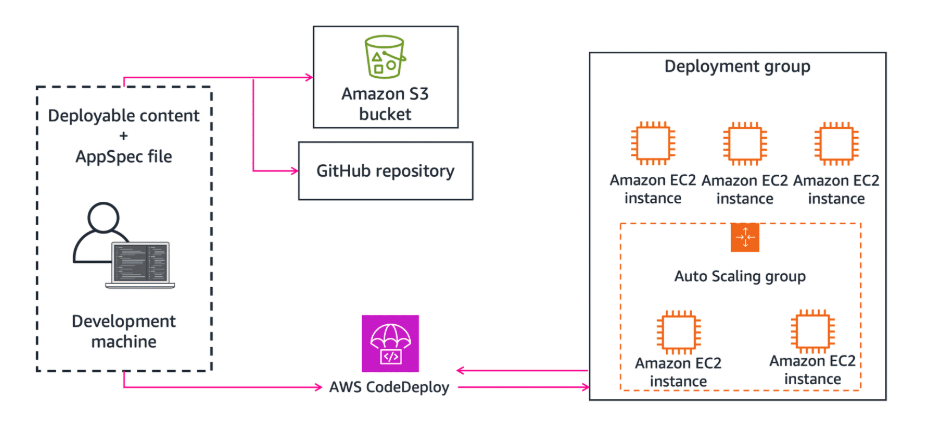
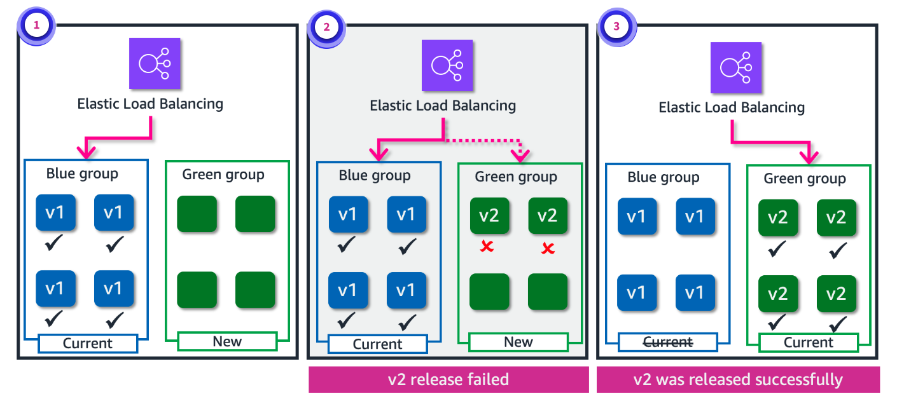

# Week 2: DevOps 2: Deployment Strategies for Continuous Delivery and Deployment

* back to AWS Cloud Institute repo's root [aci.md](../aci.md)
* back to [AWS Cloud Operations 2](./aws-cloud-operations-2.md)
* back to repo's main [README.md](../../../README.md)

## DevOps 2: Deployment Strategies for CD

### Pre-assessment

#### Why is there a need for a deployment strategy for continuous deployment?

* To ensure that new code changes are deployed in a controlled and efficient manner, which minimizes downtime and reduces the risk of introducing bugs or issues

Wrong answers:

* To automate the entire software development lifecycle from coding to testing and deployment
* To comply with regulatory requirements and industry standards
* To maintain a stable and consistent development environment across all team members

##### Explanation

A deployment strategy is essential for continuous deployment to define the processes, tools, and steps required to safely and reliably roll out new changes to the production environment without disrupting the application's availability or functionality.

The other responses are incorrect because of the following:

* Continuous deployment aims to automate the deployment process overall. A deployment strategy could be part of continuous deployment.
* Although compliance with regulations and standards is important, it is not the primary reason for having a deployment strategy for continuous deployment.
* A deployment strategy is primarily concerned with the deployment process to the production environment not the development environment.

#### What is an in-place deployment strategy?

* An existing application is updated with a new version without taking it offline or affecting the availability of the system.

Wrong answers:

* The entire application is redeployed from scratch every time there is an update or change.
* The new version of the application is deployed on a separate set of servers or infrastructure before switching to the new version.
* Updates are deployed to an application by manually copying the new files or packages to the production environment.

##### Explanation

 In-place deployment is a technique used in DevOps to minimize downtime and ensure seamless updates to live systems.

The other responses are incorrect because of the following:

* An in-place deployment does not involve redeploying the entire application from scratch. The goal is to update the existing application or service incrementally, without starting from scratch, to maintain availability and minimize downtime.
* A blue/green strategy is where the new version is deployed in parallel with the existing version before switching over.
* Although manual file copying could be a part of an in-place deployment process, it is not the defining characteristic. In-place deployment is more about updating the existing application or service gradually, without taking it offline, regardless of the specific deployment mechanism used.

#### What is a rolling deployment strategy?

* A new version of an application is gradually rolled out to replace the old version, with a subset of instances being updated at a time.

Wrong answers:

* The entire application is taken down, updated, and then brought back up with the new version.
* Multiple versions of an application run simultaneously, and traffic is load-balanced between them.
* A new version of an application is deployed to a small subset of users or a subset of the infrastructure for testing purposes before being rolled out more widely.

##### Explanation

In a rolling deployment, the new version of an application is deployed in a controlled and incremental manner, minimizing downtime and reducing the risk of disrupting the entire system

The other responses are incorrect because of the following:

* A rolling deployment aims to avoid downtime by gradually updating instances rather than taking down the entire application at once.
* Although load balancing is often used in conjunction with rolling deployments, a rolling deployment specifically refers to the incremental deployment of a new version to replace an old version, rather than running multiple versions simultaneously.
* Although testing is an important part of the deployment process, a rolling deployment specifically refers to the incremental deployment of a new version to replace an old version in a production environment, not just for testing purposes.

## Types of Deployment Strategies for CD

### Continuous delivery and continuous deployment

Manual intervention is the key difference between continuous delivery and continuous deployment. A commonality between them is the various deployment strategies for releasing applications to production. This topic uses the term continuous deployment in various parts but consider the deployment strategies also apply to continuous delivery unless otherwise noted.Continuous delivery and continuous deployment

### Application deployment in CI/CD

Organizations follow different deployment strategies based on their business model. Some choose to deliver software that is fully tested, and others might want their users to provide feedback or let their users evaluate under development features (such as beta releases). Business requirements determine the deployment strategy of software, and this is true for ones that use CI/CD. A deployment strategy defines how you want to deliver your software.

1. **In-place**. Update your application on existing instances instead of replacing with new instances.
2. **Rolling**. Gradually roll your updates to your application for some portion of the production fleet.
3. **Immutable**. Stand up a new infrastructure with the new application version.
4. **Blue/green**. Systems use the same backend (parallel environment). They clone and swap parallel environments to reduce downtime.

## In-Place Deployments

With in-place deployments, you are replacing the existing application version (for example, v1.1) on the application infrastructure with a new version (for example, v1.2), in the most basic sense.

In-place deployment is a method of rolling out a new application version on an existing fleet of servers. The update is done in one deployment action. It requires some degree of downtime. By contrast, there are hardly any infrastructure changes needed for this update (no need to add additional infrastructure unless necessary). There is also no need to update existing DNS records. The deployment process is quick. If the deployment fails, redeployment is the only option for restoration. AWS CodeDeploy, AWS Elastic Beanstalk, AWS OpsWorks are some of the services that support in-place updates.

1. **Create deployable content**. Create deployable content on your local development machine or similar environment, and then add an AppSpec file. The AppSpec file is unique to CodeDeploy. It defines the deployment actions you want CodeDeploy to perform. You bundle your deployable content and the AppSpec file into an archive file and then upload it to an Amazon Simple Storage Service (Amazon S3) bucket or a GitHub repository. This archive file is called an application revision (or a revision).
    * 
2. **CodeDeploy**. Provide CodeDeploy with information about your deployment, such as which S3 bucket or GitHub repository to pull the revision from and to which set of EC2 instances to deploy its contents. CodeDeploy calls a set of EC2 instances a deployment group. A deployment group contains individually tagged EC2 instances, EC2 instances in Amazon EC2 Auto Scaling groups, or both. Each time you successfully upload a new application revision that you want to deploy to the deployment group, that bundle is set as the target revision for the deployment group. The application revision that is currently targeted for deployment is the target revision. This is also the revision that is pulled for automatic deployments.
     * 
3. **CodeDeploy agents**. The CodeDeploy agent on each instance polls CodeDeploy to determine what and when to pull from the specified S3 bucket or GitHub repository.
     * 
4. **CodeDeploy agents pull changes**. The CodeDeploy agent on each instance pulls the target revision from the S3 bucket or GitHub repository and, using the instructions in the AppSpec file, deploys the contents to the instance.
     * 

### Benefits of in-place deployments

In-place deployments have the following benefits:

* Rapid deployment
* Low cost
* Application upgrades on live EC2 instance
* CodeDeploy to push updates to all EC2 instances

### Multiple tools/options available

* AWS CodeDeploy to push updates to all instances
* AWS Elastic Beanstalk to deploy new version to all instances simultaneously
* AWS OpsWork Stacks to update applications in stacks

## Immutable Updates

Immutable or disposable environment updates can be an easier option if your application has unknown dependencies. An earlier application infrastructure that has been patched and re-patched over time becomes more and more difficult to update the configuration.

This type of update technique is more common in an immutable infrastructure. Immutable environment updates ensure that configuration changes that require replacing instances are applied efficiently and safely. If an immutable environment update fails, the rollback process requires only terminating an Auto Scaling group. By contrast, a failed rolling update requires performing an additional rolling update to roll back the changes.

For disposable updates, you can set up a cloned environment with deployment services, such as Elastic Beanstalk, CloudFormation, and OpsWorks. You can also use those services in combination with an auto scaling configuration to manage the upgrades.

### Immutable updates example

In the preceding example diagram, a DevOps team uses AWS CodeBuild to build the application dependencies and use AWS CloudFormation as a CodeDeploy provider. This creates the resources while respecting their interdependencies and enforcing an all-or-nothing operation. All resources are created successfully or none of them are created at all. The DevOps team uses CodePipeline to integrate with other dev tools to automate this solution for their test environment.

### Benefits of immutable updates

* When version 2 of an application update is in place, cutover from the version can occur quickly with little to no downtime.
* If version 2 of an application encounters an issue, rollback to the previous version is seamless and quick.

### Tools available

* AWS CloudFormation

## Rolling Deployments

With a rolling deployment, the fleet is divided into portions so that the fleet isn’t upgraded at once. During the deployment process, two software versions, new and earlier versions, are running on the same fleet. This method enables a zero-downtime update. If the deployment fails, only the upgraded portion of the fleet will be affected.

1. **Rolling deployment starts**. Half of the production fleet is running the updated application. Network traffic from the load balancer is distributed across all EC2 instances.
2. **Rollout continue**. Half of the fleet is upgraded to the new application version. A rollback is not required of the new application version. The other half is under deployment as displayed by the glowing instances.

### Benefits of rolling deployments

* Zero downtime
* Straightforward risk mitigation
* Multiple tools and options

### Multiple tools/options available

* AWS CodeDeploy
  * OneAtATime
  * HalfAtATime
  * Custom
* AWS Elastic Beanstalk
  * Rolling
  * Rolling with additional batch

## Blue/Green Deployments

Your blue environment is your existing production environment carrying live traffic. In parallel, you provision a green environment, which is identical to the blue environment other than the new version of your code.

When it’s time to deploy, you route production traffic from the blue environment to the green. If you encounter any issues with the green environment, you can roll it back by reverting traffic back to the original blue environment. DNS cutover and swapping auto scaling groups are the two most common methods used to redirect traffic in blue/green deployments.

1. **Green deployment created**. A parallel environment using the same resources as the blue group is created. This new environment is the green group. Network traffic only flows to the blue group.
2. **Version 2 release failed**. The updated version was released to the green group. The deployment failed on the green group. Notice that Elastic Load Balancing is still pointing to the blue group, so no users were affected.
3. **Version 2 deployment succeeds**. After some changes, Version 2 was deployed successfully. The Elastic Load Balancing switches to the green environment. Because of the successful deployment in the green group, the blue group instances will be decommissioned.

### Benefits of blue/green deployments

* Control how network traffic is routed across both the blue and green environments
* Straightforward rollback if a deployment fails with little to no impact on application performance
* Multiple cutover tools and options

### Multiple tools/options available

* AWS CodeDeploy
* AWS Elastic Beanstalk
* AWS OpsWork Stacks
* AWS CloudFormation

### [Lab: Blue/Green Deployments with AWS CodeDeploy and Amazon EC2](./labs/W022Lab2BlueGreenDeploymentsWithCodeDeployAndEc2.md)

In this lab, you configure a blue/green deployment strategy using CodeDeploy and CodePipeline. The application code resides in a hosted code repository. A blue/green deployment is a deployment strategy in which you create two separate, but identical environments. One environment (blue) is running the current application version, and one environment (green) is running the new application version. After testing has been completed on the green environment, live application traffic is directed to the green environment and the blue environment is deprecated.

In this lab, you perform the following tasks:

* Review the lab environment to observe the existing lab components.
* Create a new EC2 instance.
* Install and configure a CodeDeploy agent on the new EC2 instance.
* Configure CodeDeploy for a blue/green deployment.
* Test the blue/green deployment with a code change.

### Knowledge Check

#### Which deployment strategy replaces an existing infrastructure with a new one when deploying a new application version?

* Immutable

Wrong answers:

* In-place
* Rolling
* Blue/green

##### Explanation

An immutable deployment replaces components instead of changing them. In essence, the application or service is redeployed with every new version.

The other responses are incorrect because of the following:

* A rolling deployment strategy involves gradually replacing old instances with new instances in a sequential manner.
* An in-place deployment strategy updates the existing instances in-place without creating new instances.
* A blue/green deployment strategy involves maintaining two identical environments (blue and green) and shifting traffic between them during deployments.

#### Which deployment strategy involves maintaining two identical environments and shifting traffic between them?

* Blue/green

Wrong answers:

* Rolling
* In-place
* Immutable

##### Explanation

A blue/green deployment strategy involves maintaining two identical environments (blue and green) and shifting traffic between them during deployments. This approach allows for zero downtime and rollbacks if issues are encountered.

The other responses are incorrect because of the following:

* A rolling deployment strategy involves gradually replacing old instances with new instances in a sequential manner.
* An in-place deployment strategy updates the existing instances in-place without creating new instances.
* The immutable updates specify a deployment of application code by starting an entirely new set of servers with a new configuration or version of application code.

#### What is a rolling deployment strategy in DevOps?

* New instances are gradually rolled out, replacing old instances in a sequential manner.

Wrong answers:

* All instances are replaced with new instances simultaneously.
* Two identical environments are maintained, and traffic is shifted between them.
* Existing instances are updated in-place without creating new instances.

##### Explanation

A rolling deployment strategy minimizes downtime and reduces the risk of deployment failures affecting the entire system simultaneously.

The other responses are incorrect because of the following:

* Replacing all instances simultaneously can lead to complete downtime and increased risk.
* A blue/green deployment is where two identical environments (blue and green) are maintained, and traffic is shifted between them.
* An in-place deployment is where existing instances are updated in-place without creating new instances.

### Summary

The need for choosing an appropriate deployment strategy for a CI/CD pipeline

* Various deployment strategies including in-place, blue/green, and rolling
* The benefits of each type of deployment strategy

A deployment strategy defines how you want to deliver your software. Organizations follow different deployment strategies based on their business requirements. In some cases, organizations might opt to choose multiple deployment strategies based on anticipated value back to the business.

1. **In-place**. Update your application on existing instances instead of replacing with new instances.
2. **Immutable**. Gradually roll your updates to your application for some portion of the production fleet.
3. **Rolling**. Stand up a new infrastructure with the new application version.
4. **Blue/green**. Systems use the same backend (parallel environment). They clone and swap parallel environments to reduce downtime.

### Additional Resources

* [Deployment Methods](https://docs.aws.amazon.com/whitepapers/latest/practicing-continuous-integration-continuous-delivery/deployment-methods.html)

* [Blue/Green Deployments](https://d1.awsstatic.com/whitepapers/AWS_Blue_Green_Deployments.pdf)

* [Canary Deployments](https://docs.aws.amazon.com/wellarchitected/2023-10-03/framework/rel_tracking_change_management_immutable_infrastructure.html#implementation-guidance)
