# Week 2: DevOps 2: Providing Reliable and Consistent DevOps Environments

* back to AWS Cloud Institute repo's root [aci.md](../aci.md)
* back to [AWS Cloud Operations 2](./aws-cloud-operations-2.md)
* back to repo's main [README.md](../../../README.md)

## DevOps 2: Providing Reliable and Consistent DevOps Environments

### Pre-assessment

#### Which statement best describes the purpose of a DevOps self-service portal for developers?

* It empowers application developers to manage development environments within established guardrails for usage.

Wrong answers:

* It provides a choice for integrated development environments (IDEs).
* It gives open, unfettered access to cloud providers like AWS to build and deploy applications quickly.
* It encourages developers to choose the best programming language to meet their application requirements.

##### Explanation

Organizations strive to increase ownership and autonomy of these teams to ensure a high velocity of updates. They also need to ensure consistency and adherence to an organization's standards.

The other responses are incorrect because of the following:

* A DevOps self-service portal for developers is specific to the authorized resources to produce development and production environments for applications.
* Providing open, unfettered access to cloud providers is the main reason why there is a need for a self-service portal. The portal removes open access.
* A self-service portal has no direct bearing on the choice of programming language.

#### What is AWS Proton?

* A managed service for providing self-service provisioning and deployment of serverless and container-based applications

Wrong answers:

* A managed deployment service that automates software deployments to a variety of compute services
* A managed continuous delivery service for applications running on AWS
* A service that creates AWS resources from infrastructure templates

##### Explanation

Proton provides a way to manage standard application stacks that contain architecture, infrastructure resources, and the CI/CD software deployment pipeline.

The other responses are incorrect because of the following:

* AWS CodeDeploy is a managed deployment service that automates software deployments to a variety of compute services.
* AWS CodePipeline is a managed continuous delivery service for applications running on AWS.
* AWS CloudFormation is a service that creates AWS resources from infrastructure templates.

#### What is the underlying service that performs the requested deployments made in AWS Service Catalog?

* AWS CloudFormation

Wrong answers:

* AWS Proton
* AWS CodePipeline
* AWS CodeDeploy

##### Explanation

CloudFormation stacks helps with managing the lifecycle of AWS Service Catalog products.

The other responses are incorrect because of the following:

* AWS Proton is managed service for providing self-service provisioning and deployment of serverless and container-based applications.
* CodePipeline is a managed continuous delivery service for applications running on AWS.
* CodeDeploy provides managed continuous delivery service for applications running on AWS.

## Managing DevOps Standards

### The need to standardize DevOps practices

As organizations mature in their DevOps practice, more applications are developed and delivered through a CI/CD pipeline. To ensure a high velocity of updates for applications that are hosted on a cloud platform, software development teams drive toward a microservices architecture for each function of an application. This typically means multiple development teams that own a function of an application require development and production environments. If unchecked, development teams at the same organization could procure disparate cloud resources, which leads to difficulty in cloud infrastructure management. Organizations strive to increase ownership and autonomy of these teams to ensure a high velocity of updates. They also need to ensure consistency and adherence to an organization's standards.

### Self-service for developers

Implementing a self-service portal empowers application developers to create, manage, and decommission their own isolated development or sandbox environments within the established boundaries set by the platform team. While fostering autonomy for development teams, this approach accelerates the development process and reduces the operational load on the supporting platform team. To ensure adherence to the organization's standards and ensure consistency, the portal could include predefined environment templates and resource bundles.

The portal can evolve over time into a central resource for common, reusable tools and capabilities that are preconfigured to comply with organizational standards. This facilitates streamlined, automated governance activities. This might include centralized access to common tools into a unified developer portal, including observability, security, quality, cost, and organizational use cases. If adopted by many teams, this platform can become an excellent method for communicating changes within the organization.

### Self-service portal responsibility

Application development teams are the primary users of self-service portals. They typically don't have the responsibility of implementing nor managing them. Platform teams do have that responsibility. They define infrastructure templates and maintain organizational standards across CI/CD tools. Platform teams drive toward helping application developers adopt modern application architecture and provide a way to independently deploy their applications. Platform teams usually write application templates and work toward removing undifferentiated heavy lifting for application developers.

Maintaining hundreds—or sometimes thousands—of microservices with constantly changing infrastructure resources and CI/CD configurations is a nearly impossible task for even the most capable platform teams. To meet this management responsibility, platform teams look for their tools to alleviate some of that complexity, while accelerating the development process. Platform teams strive to give developers a straightforward way to deploy their code using containers and serverless technologies, using the management tools, governance, and visibility needed to ensure consistent standards and best practices. Application developers remain responsible for writing application code and deploying it using the platform abstractions and artifacts made available by a platform team.

### AWS services for providing self-service

* **AWS Proton** is a managed service for managing infrastructure templates for self-service deployments.
* With **AWS Service Catalog**, organizations can create and manage catalogs of IT services that are approved for AWS.

## AWS Proton

AWS Proton is a managed service for providing self-service provisioning and deployment of serverless and container-based applications. AWS Proton provides a way to manage standard application stacks that contain architecture, infrastructure resources, and the CI/CD software deployment pipeline. AWS Proton provides a self-service interface for developers to choose from authorized application stacks to deploy their code to a production environment.

### AWS Proton terms

#### Environment template

An environment template defines shared infrastructure used by multiple applications or resources.

#### Service template

A service template defines the type of infrastructure that's needed to deploy and maintain a single application in an environment.

#### AWS Proton service

An AWS Proton service is an instantiation of a service template, which normally includes several service instances and a pipeline.

#### AWS Proton service instance

An AWS Proton service instance is an instantiation of a service template in a specific environment.

### How AWS Proton works

1. **Environment template creation**. A platform team creates and registers environment templates with AWS Proton, which defines the shared resources. Examples of shared resources include virtual private clouds (VPCs), databases, clusters, and so forth. Multiple applications or resources could reside in a single environment.
    * 
2. **Environment deployment**. AWS Proton deploys one or more environments, based on an environment template.
    * 
3. **Service template creation**.
    * 

    A platform team creates and registers service templates with AWS Proton, which defines the related infrastructure, monitoring, and CI/CD resources as well as compatible environment templates. Examples of services include Fargate, Lambda, EC2 instances, and other AWS services.

    AWS Proton services are application specific, and developers need to configure them according to the needs of their specific project. If a service template includes a pipeline, developers must indicate the code repository that holds their application code.

4. **Service template selection**. As a developer, you select a registered service template and provide a link to your source code repository.
    * 
5. **AWS Proton provisioning**. AWS Proton provisions the service with a CI/CD pipeline for your service instances.
    * 
6. **Service is live**. AWS Proton provisions and manages the service and the service instances that are running the source code as was defined in the selected service template. A service instance is an instantiation of the selected service template in an environment for a single stage of a pipeline (for example Production).
    * 

### Demo: Creating Environments and Services with AWS Proton

AWS Proton is a fully managed application delivery service that enables platform operations teams to provide consistent architecture across an organization and enables developers to deliver their applications on approved infrastructure using a self-service interface. In this demo, we'll see how to set up all the different tools our development teams need for infrastructure provisioning, code deployments, monitoring, and updates.

Let's begin by opening the AWS Proton service page in the AWS console and clicking Get started. Before development teams can use Proton to deploy services, we'll need to create a service template for them to use and a standardized environment where they can deploy their services. To create that environment, we first need to create an environment template. Let's go ahead and do that now. A Proton environment template is a reusable bundle of configuration files that define the metadata and infrastructure resources needed to create a given environment. For this demo, we'll be creating a template to provision a new environment using one of the sample template bundles provided by the AWS Proton team.

The sample template bundle consists of a manifest.yaml file which lists the files used to define an environment's infrastructure, a schema.yaml file which defines the input parameters used in the infrastructure templates, and a cloudformation.yaml infrastructure file which defines the infrastructure itself. We also have the option of providing our own template bundle which will build a custom environment according to our organization's best practices. Or, we could tell Proton to use some existing provisioned infrastructure that we manage on our own.

Let's select the Fargate environment sample template bundle, fill in a template name and description, and leave the rest of the options alone. Next, we'll create a service template. A service template, similar to an environment template, is a reusable bundle of configuration files that define a complete set of resources. The sample, Fargate service template bundle, like the Fargate environment template bundle we just saw, also consists of manifest, schema, and CloudFormation YAML files to define the infrastructure but also contains an additional cloudformation.yaml and manifest.yaml file to define a deployment pipeline for the service.

We'll fill in the service template name and description and leave the rest of the options alone like before except for the compatible environment templates. Here, we'll make sure to select our Proton demo environment template from earlier. This will ensure that anybody using Proton to deploy the service will deploy it to a compatible environment.

After clicking, Create service template, we're asked to configure an account role. This is the IAM role that Proton will use to make API calls to other services such as CloudFormation on our behalf. For this demo, we'll have Proton create a new service role for us. However, we strongly advise platform administrators to read more on Proton's access control and scope this roll down to the minimal set of privileges required by the templates they intend to use.

Before our developer teams can deploy their own Fargate service with Proton, our last step, as the platform operators, is to actually build the environment they would be deploying to. Let's use the environment template we created earlier to do that now. We'll choose our Proton demo environment template. Call this a staging environment. Choose the default service role we created, and click Next. It's now asking us for some VPC and subnet CIDR ranges because the schema.yaml file in the sample template bundle said to expect some. these values are optional, though, so let's leave these fields blank to accept the defaults.

The deployment was created and is now in progress. While that's running, let's repeat the process to create a production environment too, and let's specify some CIDR ranges this time as well. Creation of the sample environments should only take a few minutes to complete, but for longer deployments, we can switch over to the CloudFormation console to follow its progress in more detail.

Great, the environment is ready and now just needs a service to run in it. Our work as platform operators is complete for now, so let's see how the next steps look from the perspective of our developer team.

We're now logged in with a separate AWS Proton developer role, which has the default AWS Proton Developer Access IAM policy attached to it as well as read-only access to AWS CloudFormation, AWS CodePipeline, and a variety of services consumed by our sample application, such as Amazon ECS.

Let's create our first service. First, we go to services in the Proton service page, and click create service. Next, we select the Proton demo service template and click configure. We'll give it a name and description, then configure the repository settings. For this demo, we already have a GitHub repository connection established that allows us to detect source changes. To configure your own, click Create connection, and follow the steps. In this case we'll have it deployed from the main branch of our forked AWS Proton sample Fargate service repository using the existing AWS Proton demo repository connection.

Next, we'll configure two service instances, one for each environment that we created earlier. First, we'll create a staging service instance that will deploy to the staging environment using whichever defaults are specified in the service template. And then, we'll add a production service instance for the production environment. This time, since it's for a production environment, let's have it create three medium-sized Fargate tasks instead. Finally, we'll leave the container image and pipeline inputs at their defaults for this demo, as the pipeline configuration within the sample Fargate service template bundle for AWS Proton takes care of building the container image and configuring our Fargate task definitions accordingly to use it.

Proton will create the service and service deployment pipeline, and we can follow the progress using the CloudFormation stack events log. Then, we can watch the deployment pipeline itself deploy our sample application to each environment. Now that our application is deployed, making changes is just a matter of pushing new commits to our repository, which will be detected by CodePipeline and begin a new deployment cycle.

Since all this infrastructure is in our account, we have full capacity to manage, update, and troubleshoot as required. For example, platform operators can review CloudFormation stack events for issues when deploying environments. Developers can see details on code deployments within CodeBuild and CodePipeline. And, we can make changes to the underlying environments or services by creating a new minor or major version of the corresponding template, providing an updated template bundle, and then updating the environments or service instances to use the latest versions.

## AWS Service Catalog

AWS Service Catalog provides approved, self-service cloud resources.

Service Catalog provides you the means to create and manage catalogs of IT services that your organization approves for AWS. These IT services include everything from Amazon EC2 AMIs, Amazon EC2 instances, storage, and databases, to complete multi-tier application architectures. Service Catalog enables central management of commonly deployed IT services and helps organizations achieve consistent governance and meet compliance requirements. End users can deploy only the approved IT services they need, following the constraints set by the organization.

### Benefits of using Service Catalog

#### Standardization

Administer and manage approved assets by restricting where the product can be launched, the type of instance that can be used, and other configuration options. The result is a standardized landscape for product provisioning for your entire organization.

#### Self-service discovery and launch

Users browse listings of products (services or applications) that they have access to. When they locate the products they want to use, they launch it all on their own as a provisioned product.

#### Fine-grain access control

Administrators assemble portfolios of products from their catalog and add constraints and resource tags to be used at provisioning. Afterwards, administrators grant access to the portfolio through AWS Identity and Access Management (IAM) users and groups.

#### Extensibility and version control

Administrators can add a product to any number of portfolios and restrict it without creating another copy. Updating the product to a new version propagates the update to all products in every portfolio that references it.

### AWS Service Catalog Workflow

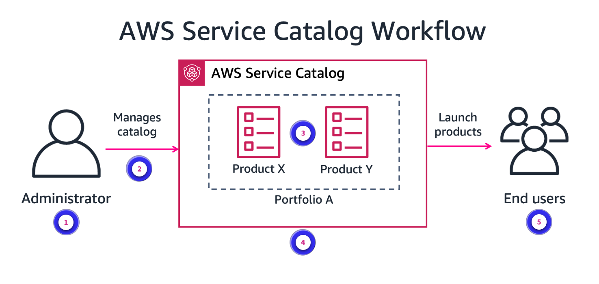

1. **Catalog administrator**. Catalog administrators manage a catalog of products (applications and services) by organizing them into portfolios and granting access to end users.
2. **Manage Catalog**. To provide advanced resource management, Service Catalog administrators prepare CloudFormation templates, configure constraints, and manage IAM roles that are assigned to products.
3. **Service Catalog product**. A product is an IT service that you want to make available for deployment on AWS. A product consists of one or more AWS resource. A product can be a single compute instance running Amazon Linux, a fully configured multi-tier web application running in its own environment, or anything in between. You create a product by importing a CloudFormation template.
4. **Service Catalog portfolio**. A portfolio is a collection of products, together with configuration information. Portfolios help manage who can use specific products and how they can use them. With Service Catalog, you can create a customized portfolio for each type of user in your company and selectively grant access to the appropriate portfolio.
5. **End users**. End users receive AWS credentials from their IT department or manager. They use the AWS Management Console to launch products to which they have been granted access.

### Working with Service Catalog

The two types of users of Service Catalog are administrators and end users. Catalog administrators prepare CloudFormation templates, configure constraints, and manage IAM roles for products to provide for advanced resource management. End users use their credentials to create authorized resources on AWS. Each user type has their own set of tasks, whether administrative or non-administrative in purpose.

#### Service Catalog: Administrator workflow

1. **Design a template**.

    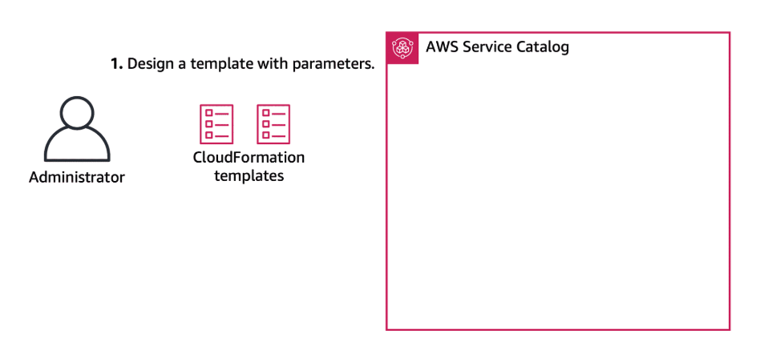

    To start using Service Catalog, an administrator creates CloudFormation templates that include a parameters section. AWS provides a Getting Started Library of well-architected product templates to expedite this step. For more information, see Getting Started Library(opens in a new tab) in the AWS Service Catalog Administrator Guide.

2. **Create a portfolio**.

    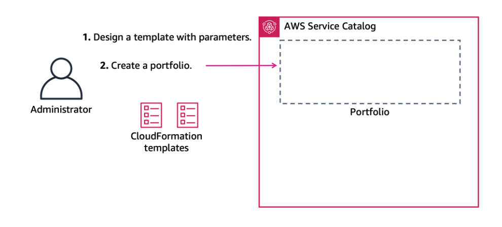

    A portfolio of products provides a consistent way for offering choices to end users. To begin, create a portfolio for your intended products.

3. **Create products**.

    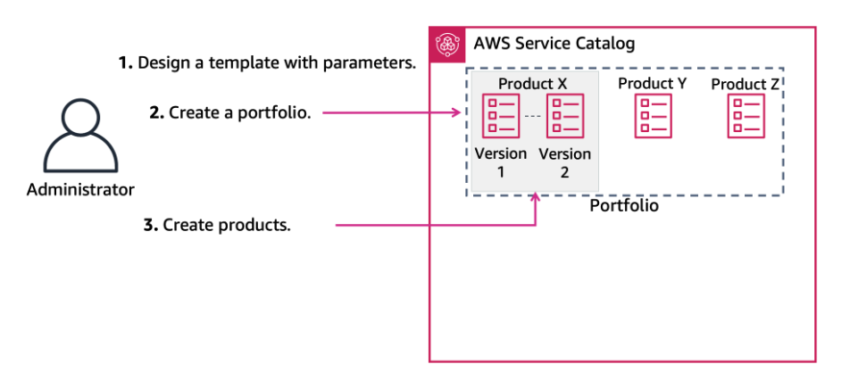

    Create a product using your CloudFormation templates. In this step, you open the portfolio, then proceed with specifying the details of the product. After you create the product, it will be visible in the portfolio. You also can manage versions of products instead of recreating them. End users will have access to the versions you specify.

4. **Add constraints and grant access**.

    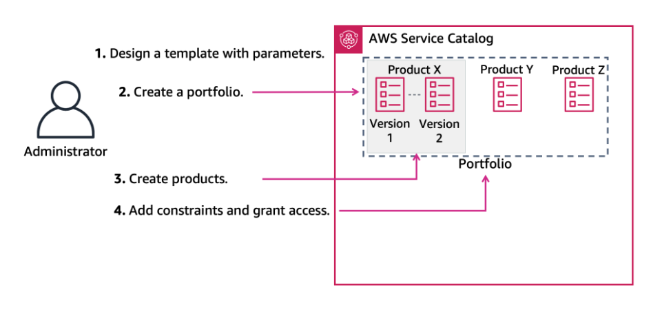

    Constraints control the ways that specific AWS resources can be deployed for a product. You can use them to apply limits to products for governance or cost control.

    Granting a user access to a portfolio allows that user to browse the portfolio and launch the products in it. To control who can view and modify your catalog, apply IAM permissions. You can assign IAM permissions to IAM users, groups, and roles.

5. **Test end user experience**.

    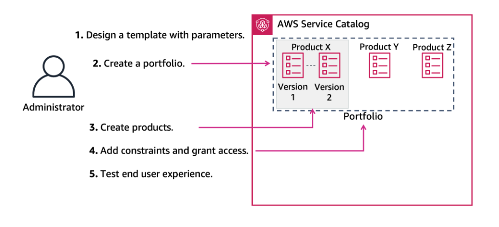

    To verify the end user can successfully access the end user console view and launch your product, sign in to AWS as the end user and perform those tasks.

With the implementation of a service like Service Catalog, application developers have the benefit of choosing authorized infrastructure options for their applications. Typically, developers are the end users of Service Catalog with the autonomy to choose the right environment for their applications.

#### Service Catalog: End user workflow

1. **Browse products**.

    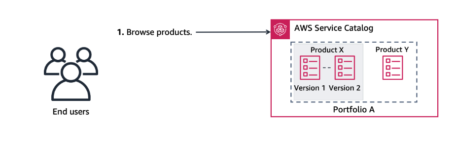

    You can use the Service Catalog console to see a list of products and provisioned products.

2. **Select a version**.

    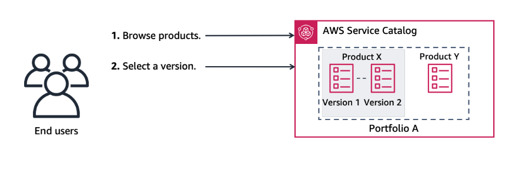

    The Product details page displays information about a product, including a description of the product, details about the product versions, and support information.

    If multiple versions of a product are available, you can decide which version to use when you read the version descriptions. Typically, you should use the latest version of a product.

3. **Populate details**.

    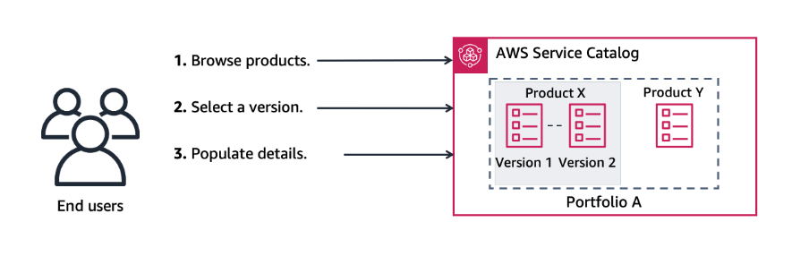

    After selecting a version, you provide any necessary parameters for customizing your requested resources. You provide any required tags for your provisioned product.

4. **Launch a product**.

    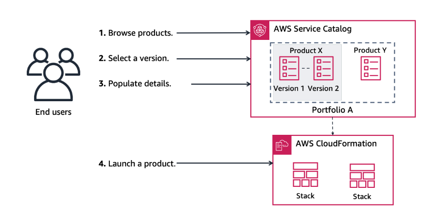

    You can launch any product that appears in your Service Catalog products list. When you launch a product, you create a provisioned product, usually an instance of the product in an CloudFormation stack. A provisioned product in AWS is one or more cloud resource that you manage as a single unit such as compute instances, databases, or networking components.

5. **Review outputs**.

    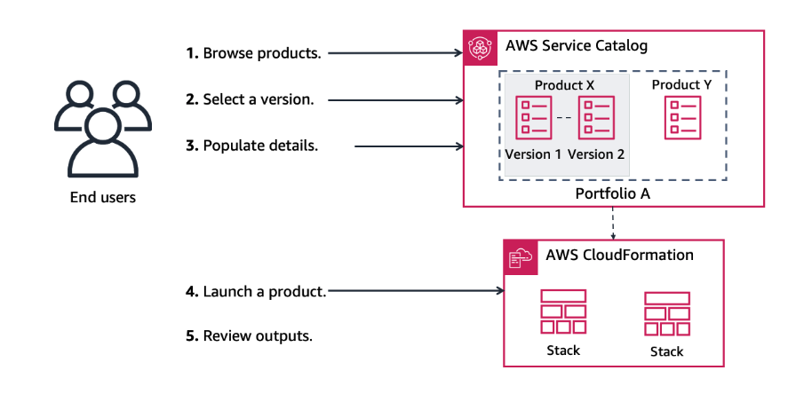

    Provisioned products provide information and named outputs when a product launches. Outputs usually display URLs, IP addresses, and database connection strings after the provisioned product launches. Each output has a key, value, and description.

### Service Catalog and AWS Proton

Your organization will choose one that fits their need and expertise. AWS Proton is a deployment workflow tool for modern applications. It can be used to manage IaC template builds with tools like AWS CloudFormation or Terraform. By comparison, Service Catalog is a catalog of AWS resources that provides you with options to store, share, and govern IaC templates and create individual stacks. For example, a stack could be for specific building blocks like an Amazon S3 bucket product. Some organizations use AWS Proton to manage architectures that include Service Catalog product components. There are many options for customization, so organizations will decide which method is best suited to meet its application delivery needs.

### Demo: Create Deployment Pipeline with AWS Service Catalog

In this video, you'll see how to create a continuous deployment pipeline using AWS Service Catalog products for CodePipeline and Elastic Beanstalk. With this solution, you can leverage reference architecture from GitHub to easily set up a continuous integration and deployment or CI/CD pipeline that integrates with your .NET application.

We'll begin from the GitHub repository that contains the AWS Service Catalog reference architecture for the CI/CD pipeline. This diagram gives a quick overview of the reference architecture. To install the reference architecture in your account, visit this page and click Launch Stack. A wizard will guide you through some set up steps. For demonstration purposes, we have already launched the stack and set it up in our AWS account. Let's take a look.

The reference architecture created a portfolio with the service catalog products needed to deploy the pipeline. It also provisioned an AWS Cloud9 IDE product as well as an Identity and Access Management, or IAM, group and role for Service Catalog end users. Users assigned to this role or group automatically have permission to deploy the products in this portfolio. 

Let's launch the Elastic Beanstalk CodePipeline project. We can launch either a Windows or Linux product version. We'll name our .NET application and launch the product. Next, we'll deploy the Cloud9 IDE instance so we can edit code and push changes to the CodeCommit repository. Users can, of course, choose to configure their own local development environment for this purpose.

Let's obtain the Git repository URL so we can associate the repository with the development environment. Copy the URL. Launch the Cloud9 development environment. Now paste the URL we just copied to specify the linked Git repo path. Let's also specify where in the Git repository folder our project code will live. Let's skip ahead to when the Cloud9 environment has fully deployed and open it.

For the purposes of this example, the folder associated with our repository is already populated with the sample ASP.NET project. Let's push it to CodeCommit to begin the CodePipeline execution. Next, let's check to make sure the CodePipeline execution triggered. As you can see, the pipeline has begun execution and is now pulling the code from our CodeCommit repository. Let's skip ahead a few minutes.

The source pull and build stages have successfully completed, but the deployment step failed. Let's look at the details. The deployment step failed because we haven't yet deployed the Elastic Beanstalk application environment where our .NET web application will be running. In order to deploy Elastic Beanstalk, we'll need the location of the Amazon Simple Storage Service, or Amazon S3, bucket that was generated by the CodePipeline product. Let's copy it and return to Service Catalog.

Launch the Elastic Beanstalk product. In the source code parameters, paste the name of the S3 bucket. Cut the name of the application bundle from the string and paste it in the next field. Next, we'll provide the information needed for Elastic Beanstalk to create the application associated with our project code. We'll need the name of the solution stack that supports our application deployment runtime configuration. We can find that information in the AWS documentation. For our purposes, we'll copy the solution stack name for Windows Server Core 2019. Paste the solution stack name into the field. Launch the product.

Now let's ensure the application has successfully deployed. We can use the Load Balancer URL to access the application website. The application successfully deployed. Next let's test that this Elastic Beanstalk application has been properly configured in our CodePipeline. To do so, we'll modify the project code and push our changes to CodeCommit, which will trigger the pipeline to redeploy. Let's change the index page heading to "Hello CodePipeline!". Now let's push the change. 

Returning to CodePipeline, we can see that our push to the CodeCommit repository triggered a pipeline execution. As you can see, the Update-Beanstalk action successfully executed in the Deploy step of the pipeline. Let's return to the application website to see the deployed change. The page now shows the new headline.

### [Lab: Deploying Standardized Assets Using AWS Service Catalog](./labs/W024Lab3DeployingUsingAwsServiceCatalog.md)

In this lab, you explore how to work with Service Catalog from both an administrator's and an end user's perspective. Service Catalog provides organizations a way to provide authorized, compliant cloud resources to end users through self-service. You create a Service Catalog portfolio that contains various AWS compute and storage cloud resources, then deploy those resources as an end user.

In this lab, you perform the following tasks:

* Create a Service Catalog portfolio.
* Create products for your portfolio.
* Create launch constraints for your products.
* Create template constraints to your Service Catalog products.
* Launch your products as an end user.

### Knowledge Check

#### What is an AWS Service Catalog product?

* An authorized IT resource made available for deployment on AWS

Wrong answers:

* A definition of shared infrastructure that is used by multiple applications
* An option to preview how a proposed change to an application stack might impact AWS resources before making the change
* A means to control the ways that specific AWS resources can be deployed

##### Explanation

The other responses are incorrect because of the following:

* An environment template is a definition of shared infrastructure that is used by multiple applications. Environment templates are used in AWS Proton.
* An AWS CloudFormation change set provides an option to preview how a proposed change to an application stack might impact AWS resources before making the change.
* A constraint is a means to control the ways that specific AWS resources can be deployed.

#### Which step comes after populate details by an end user in AWS Service Catalog?

* Launch a product.

Wrong answers:

* Select a version.
* Browse products.
* Review outputs.

##### Explanation

The other responses are incorrect because the workflow is as follows:

1. Browse products.
2. Select a version.
3. Populate details.
4. Launch a product.
5. Review outputs.

#### What defines the infrastructure, monitoring, and CI/CD resources in AWS Proton?

* Service template

Wrong answers:

* Environment template
* Product template
* Catalog template

##### Explanation

The other responses are incorrect because of the following:

* An environment template defines shared infrastructure used by multiple applications or resources.
* A product template is a term used in AWS Service Catalog to describe an IT service you want to make available for deployment in AWS.
* AWS Proton does not have a catalog template.

### Summary

* The needs and benefits of standardizing DevOps workflows while providing self-service options to application development teams
* How AWS Proton provides development teams CI/CD tools through a self-service portal
* Workflows for administering and using AWS Service Catalog

Maintaining hundreds—or sometimes thousands—of microservices with constantly changing infrastructure resources and CI/CD configurations is a nearly impossible task for even the most capable platform teams. To meet this management responsibility, platform teams look for their tools to alleviate some of that complexity. At the same time, platform teams want to provide choices to development teams to determine what is the optimal way of deploying and maintaining their applications. To facilitate those options, platform teams provide self-service portals.

In this topic, you examined two AWS services that provide self-service options to application developers.

* **AWS Proton**

    AWS Proton is a managed service for managing infrastructure templates for self-service deployments.

* **AWS Service Catalog**

    With AWS Service Catalog, organizations can create and manage catalogs of IT services that are approved for AWS.

### Additional Resources

* [AWS Service Catalog](https://docs.aws.amazon.com/servicecatalog/latest/adminguide/introduction.html)

* [AWS Proton](https://docs.aws.amazon.com/proton/latest/userguide/Welcome.html)

* [Unified Developer Portal Recommendation](https://docs.aws.amazon.com/wellarchitected/latest/devops-guidance/ag.dep.8-implement-a-unified-developer-portal-for-self-service-environment-management.html)
