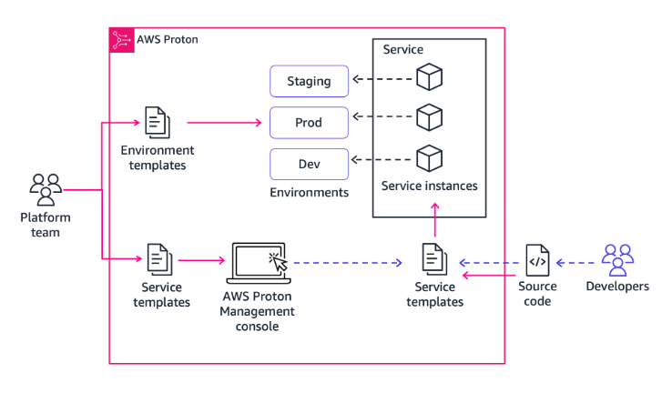

# Week 2: DevOps 2: Providing Reliable and Consistent DevOps Environments

* back to AWS Cloud Institute repo's root [aci.md](../aci.md)
* back to [AWS Cloud Operations 2](./aws-cloud-operations-2.md)
* back to repo's main [README.md](../../../README.md)

## DevOps 2: Providing Reliable and Consistent DevOps Environments

### Pre-assessment

#### Which statement best describes the purpose of a DevOps self-service portal for developers?

* It empowers application developers to manage development environments within established guardrails for usage.

Wrong answers:

* It provides a choice for integrated development environments (IDEs).
* It gives open, unfettered access to cloud providers like AWS to build and deploy applications quickly.
* It encourages developers to choose the best programming language to meet their application requirements.

##### Explanation

Organizations strive to increase ownership and autonomy of these teams to ensure a high velocity of updates. They also need to ensure consistency and adherence to an organization's standards.

The other responses are incorrect because of the following:

* A DevOps self-service portal for developers is specific to the authorized resources to produce development and production environments for applications.
* Providing open, unfettered access to cloud providers is the main reason why there is a need for a self-service portal. The portal removes open access.
* A self-service portal has no direct bearing on the choice of programming language.

#### What is AWS Proton?

* A managed service for providing self-service provisioning and deployment of serverless and container-based applications

Wrong answers:

* A managed deployment service that automates software deployments to a variety of compute services
* A managed continuous delivery service for applications running on AWS
* A service that creates AWS resources from infrastructure templates

##### Explanation

Proton provides a way to manage standard application stacks that contain architecture, infrastructure resources, and the CI/CD software deployment pipeline.

The other responses are incorrect because of the following:

* AWS CodeDeploy is a managed deployment service that automates software deployments to a variety of compute services.
* AWS CodePipeline is a managed continuous delivery service for applications running on AWS.
* AWS CloudFormation is a service that creates AWS resources from infrastructure templates.

#### What is the underlying service that performs the requested deployments made in AWS Service Catalog?

* AWS CloudFormation

Wrong answers:

* AWS Proton
* AWS CodePipeline
* AWS CodeDeploy

##### Explanation

CloudFormation stacks helps with managing the lifecycle of AWS Service Catalog products.

The other responses are incorrect because of the following:

* AWS Proton is managed service for providing self-service provisioning and deployment of serverless and container-based applications.
* CodePipeline is a managed continuous delivery service for applications running on AWS.
* CodeDeploy provides managed continuous delivery service for applications running on AWS.

## Managing DevOps Standards

### The need to standardize DevOps practices

As organizations mature in their DevOps practice, more applications are developed and delivered through a CI/CD pipeline. To ensure a high velocity of updates for applications that are hosted on a cloud platform, software development teams drive toward a microservices architecture for each function of an application. This typically means multiple development teams that own a function of an application require development and production environments. If unchecked, development teams at the same organization could procure disparate cloud resources, which leads to difficulty in cloud infrastructure management. Organizations strive to increase ownership and autonomy of these teams to ensure a high velocity of updates. They also need to ensure consistency and adherence to an organization's standards.

### Self-service for developers

Implementing a self-service portal empowers application developers to create, manage, and decommission their own isolated development or sandbox environments within the established boundaries set by the platform team. While fostering autonomy for development teams, this approach accelerates the development process and reduces the operational load on the supporting platform team. To ensure adherence to the organization's standards and ensure consistency, the portal could include predefined environment templates and resource bundles.

The portal can evolve over time into a central resource for common, reusable tools and capabilities that are preconfigured to comply with organizational standards. This facilitates streamlined, automated governance activities. This might include centralized access to common tools into a unified developer portal, including observability, security, quality, cost, and organizational use cases. If adopted by many teams, this platform can become an excellent method for communicating changes within the organization.

### Self-service portal responsibility

Application development teams are the primary users of self-service portals. They typically don't have the responsibility of implementing nor managing them. Platform teams do have that responsibility. They define infrastructure templates and maintain organizational standards across CI/CD tools. Platform teams drive toward helping application developers adopt modern application architecture and provide a way to independently deploy their applications. Platform teams usually write application templates and work toward removing undifferentiated heavy lifting for application developers.

Maintaining hundreds—or sometimes thousands—of microservices with constantly changing infrastructure resources and CI/CD configurations is a nearly impossible task for even the most capable platform teams. To meet this management responsibility, platform teams look for their tools to alleviate some of that complexity, while accelerating the development process. Platform teams strive to give developers a straightforward way to deploy their code using containers and serverless technologies, using the management tools, governance, and visibility needed to ensure consistent standards and best practices. Application developers remain responsible for writing application code and deploying it using the platform abstractions and artifacts made available by a platform team.

### AWS services for providing self-service

* **AWS Proton** is a managed service for managing infrastructure templates for self-service deployments.
* With **AWS Service Catalog**, organizations can create and manage catalogs of IT services that are approved for AWS.

## AWS Proton

AWS Proton is a managed service for providing self-service provisioning and deployment of serverless and container-based applications. AWS Proton provides a way to manage standard application stacks that contain architecture, infrastructure resources, and the CI/CD software deployment pipeline. AWS Proton provides a self-service interface for developers to choose from authorized application stacks to deploy their code to a production environment.

### AWS Proton terms

#### Environment template

An environment template defines shared infrastructure used by multiple applications or resources.

#### Service template

A service template defines the type of infrastructure that's needed to deploy and maintain a single application in an environment.

#### AWS Proton service

An AWS Proton service is an instantiation of a service template, which normally includes several service instances and a pipeline.

#### AWS Proton service instance

An AWS Proton service instance is an instantiation of a service template in a specific environment.

### How AWS Proton works

1. **Environment template creation**. A platform team creates and registers environment templates with AWS Proton, which defines the shared resources. Examples of shared resources include virtual private clouds (VPCs), databases, clusters, and so forth. Multiple applications or resources could reside in a single environment.
    * 
2. **Environment deployment**. AWS Proton deploys one or more environments, based on an environment template.
    * 
3. **Service template creation**.

    A platform team creates and registers service templates with AWS Proton, which defines the related infrastructure, monitoring, and CI/CD resources as well as compatible environment templates. Examples of services include Fargate, Lambda, EC2 instances, and other AWS services.

    AWS Proton services are application specific, and developers need to configure them according to the needs of their specific project. If a service template includes a pipeline, developers must indicate the code repository that holds their application code.

    * 
4. **Service template selection**. As a developer, you select a registered service template and provide a link to your source code repository.
    * 
5. **AWS Proton provisioning**. AWS Proton provisions the service with a CI/CD pipeline for your service instances.
    * 
6. **Service is live**. AWS Proton provisions and manages the service and the service instances that are running the source code as was defined in the selected service template. A service instance is an instantiation of the selected service template in an environment for a single stage of a pipeline (for example Production).
    * 
