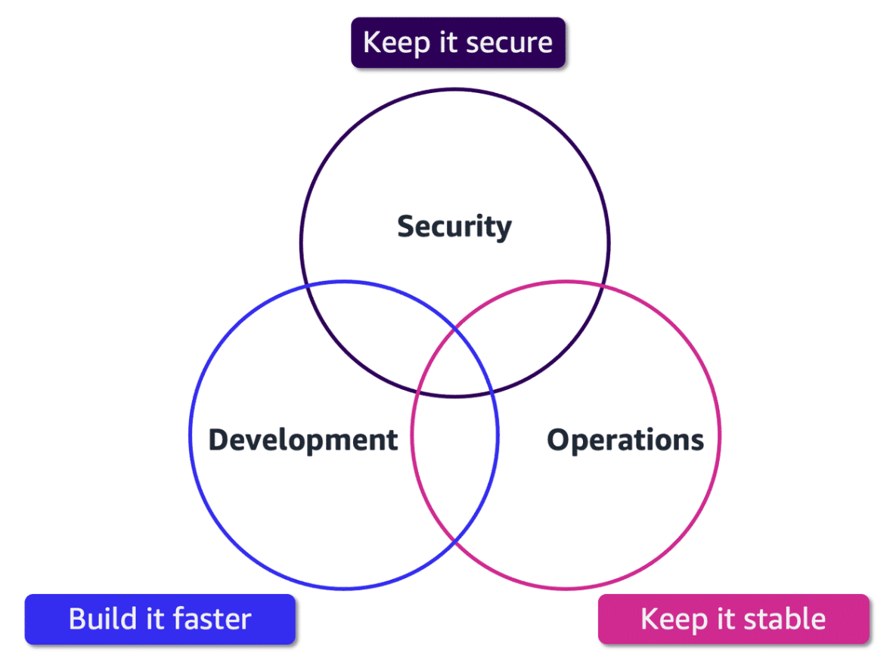
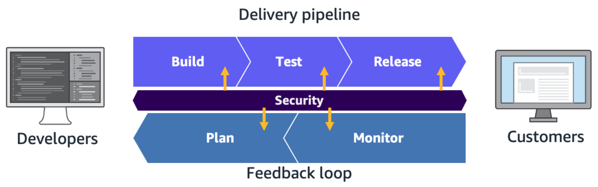

# Week 3: DevOps 2: DevSecOps

* back to AWS Cloud Institute repo's root [aci.md](../aci.md)
* back to [AWS Cloud Operations 2](./aws-cloud-operations-2.md)
* back to repo's main [README.md](../../../README.md)

## DevOps 2: DevSecOps

### Pre-assessment

#### What is development, security, and operations (DevSecOps)?

* An approach that integrates security practices into the DevOps process

Wrong answers:

* A cybersecurity framework that focuses solely on securing the production environment and infrastructure
* A methodology that separates security practices from development and operations processes, ensuring a clear separation of duties
* A term used to describe the process of securing software applications after they have been deployed to production environments

##### Explanation

DevSecOps aims to build security into the entire software development process, from inception to deployment and beyond, by involving security teams early on and automating security checks and processes.

The other responses are incorrect because of the following:

* DevSecOps is not limited to securing the production environment and infrastructure. It encompasses security practices throughout the entire software development lifecycle, including during the planning, coding, testing, and deployment phases.
* DevSecOps promotes the integration and collaboration of security practices with development and operations processes instead of separating them. The goal is to shift security left and make it an intrinsic part of the software development lifecycle.
* While DevSecOps does address security in production environments, it is not limited to securing applications after deployment.

#### What is a component of DevSecOps?

* Threat modeling

Wrong answers:

* Code obfuscation
* Ethical hacking
* Using antivirus software

##### Explanation

Threat modeling helps to shift security left, integrating it into the development process from the outset.

The other responses are incorrect because of the following:

* Code obfuscation is a technique used to make code more difficult to understand or reverse engineer by transforming it into an obscure form. It is not a component of DevSecOps.
* Although using antivirus software on any computer is a good security practice, it is not a component of DevSecOps.
* Ethical hacking or penetration testing is a valuable security practice but is not a component of DevSecOps.

#### What is static application security testing (SAST)?

* Analyzing source code to find potential security vulnerabilities

Wrong answers:

* Performing manual penetration testing on a running application
* Monitoring network traffic for potential security threats
* Scanning an application's dependencies for known vulnerabilities

##### Explanation

The other responses are incorrect because of the following:

* SAST is performed on the source code itself without running the application.
* Monitoring network traffic is a part of dynamic application security testing (DAST), which involves testing the running application from the outside by simulating real-world attacks.
* Scanning dependencies for known vulnerabilities is a part of software composition analysis (SCA), not SAST.

### The Role of DevSecOps

Development, security, and operations (DevSecOps) is the practice of integrating security testing at every stage of the software development process. It is an extension of the DevOps practice.

* DevSecOps is:
  * Team/community effort, not a single person's responsibility
  * Automated and autonomous security
  * Security at scale
* The DevSecOps role is:
  * Not there to audit code
  * There to implement the control segments to artifacts as part of the CI/CD process

### Enhancing DevOps with security

Think of DevSecOps as putting security in the middle of DevOps. DevSecOps includes tools and processes that encourage collaboration between developers, security specialists, and operations teams to build software that is both efficient and secure. DevSecOps brings cultural transformation that makes security a shared responsibility for everyone who is building the software.

### Security work in DevSecOps

* Application developer
* Security analyst
* Automation engineer

In DevOps, multiple roles contribute to the development and deployment process. DevOps roles break down silos between engineering and IT, promoting collaboration and transparency. DevSecOps enhances DevOps. It requires a team effort, not an individual role engaged in securing software and infrastructure. The distinction in the function of DevSecOps is to validate and audit software code and artifacts as part of the continuous integration and continuous delivery (CI/CD) process. To achieve this function, application developers, security analysts, and automation engineers work together to integrate automated security testing in the CI/CD pipeline.

### Importance of security

DevOps = Efficiencies that speed up the lifecycle
DevSecOps = Validate building blocks without slowing lifecycle

DevSecOps ensures that security is built into the software development lifecycle so it's not an afterthought. With security built into each phase of the CI/CD pipeline, organizations benefit from speed and agility and remain secure into production. When done correctly, integrating security into DevOps should not sacrifice speed or agility for the secure delivery of an application.

### DevSecOps principles

The success of DevSecOps practice is measured by the degree of adherence to its principles. There are six DevSecOps principles that AWS software development teams use.

1. Everyone is responsible for building secure software./Collaborate with all stakeholders.
2. Security starts at the beginning of the software development lifecycle./Codify everything.
3. Integrate security testing in everything./Test everything.
4. Automate security testing./Automate everything.
5. Measure and monitor everything.
6. Deliver secure software faster while ensuring compliance./Deliver business value with continual feedback.

### DevSecOps practices

1. Security **of** the CI/CD pipeline
    * Access roles
    * Hardening build servers/nodes
2. Security **in** the CI/CD pipeline
    * Artifact validation
    * Static code analysis
3. Infrastructure automation
    * Secure account and resource creation templates
    * Elastic resource validation and governance
    * Automated incident response and repudiation
    * Continuous compliance validation

### What does DevSecOps CI/CD give us?

* Confidence that code is validated against the corporate security policies
* Platforms that avoid infrastructure/application failure in a later deployment due to different security configuration
* DevOps pace of innovation
* Ability to audit and alert
* Security at scale

### Benefits of DevSecOps

1. **Catch software vulnerabilities early**

    Software teams focus on security controls through the entire development process. Instead of waiting until the software is completed, they conduct checks at each stage. Software teams can detect security issues at earlier stages and reduce the cost and time of fixing vulnerabilities. As a result, users experience minimal disruption and greater security after the application is produced.

2. **Reduce time to market**

    With DevSecOps, software teams can automate security tests and reduce human errors. It also prevents the security assessment from being a bottleneck in the development process.

3. **Ensure regulatory compliance**

    Software teams use DevSecOps to comply with regulatory requirements by adopting professional security practices and technologies. They identify data protection and security requirements in the system. For example, software teams use AWS Security Hub to automate security checks against industry standards.

4. **Build a security-aware culture**

    Software teams become more aware of security best practices when developing an application. They are more proactive in spotting potential security issues in the code, modules, or other technologies for building the application.

5. **Develop new features securely**

    DevSecOps encourages flexible collaboration between the development, operations, and security teams. They share the same understanding of software security and use common tools to automate assessment and reporting. Everyone focuses on ways to add more value to the customers without compromising on security.

### Key Components of DevSecOps
