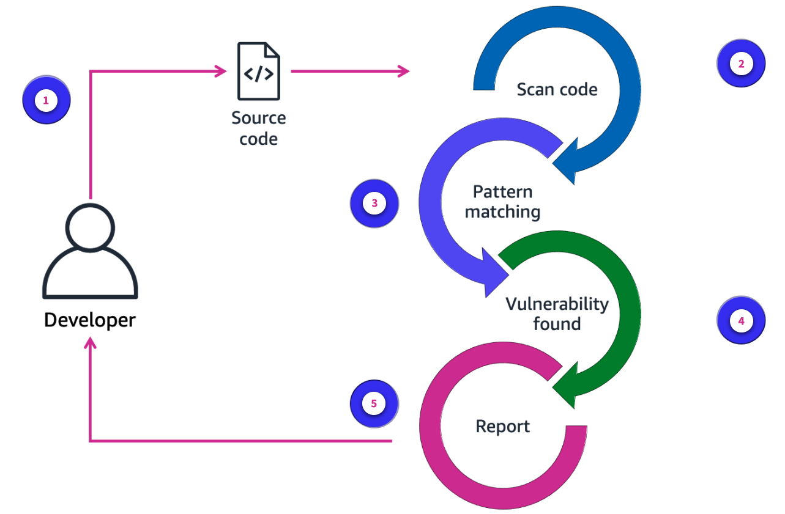
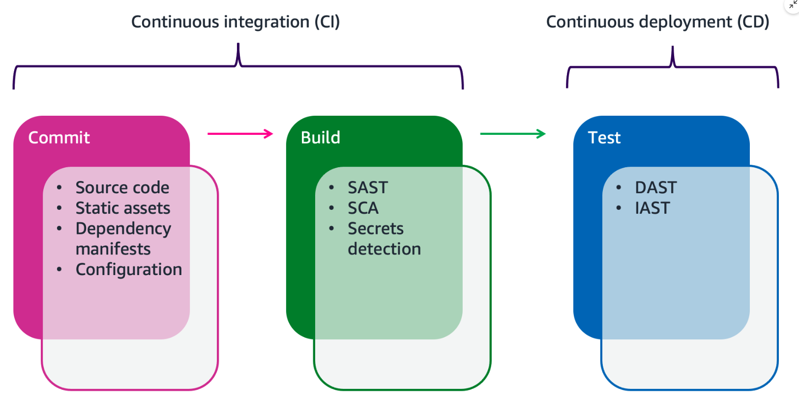

# Week 3: DevOps 2: DevSecOps

* back to AWS Cloud Institute repo's root [aci.md](../aci.md)
* back to [AWS Cloud Operations 2](./aws-cloud-operations-2.md)
* back to repo's main [README.md](../../../README.md)

## DevOps 2: DevSecOps

### Pre-assessment

#### What is development, security, and operations (DevSecOps)?

* An approach that integrates security practices into the DevOps process

Wrong answers:

* A cybersecurity framework that focuses solely on securing the production environment and infrastructure
* A methodology that separates security practices from development and operations processes, ensuring a clear separation of duties
* A term used to describe the process of securing software applications after they have been deployed to production environments

##### Explanation

DevSecOps aims to build security into the entire software development process, from inception to deployment and beyond, by involving security teams early on and automating security checks and processes.

The other responses are incorrect because of the following:

* DevSecOps is not limited to securing the production environment and infrastructure. It encompasses security practices throughout the entire software development lifecycle, including during the planning, coding, testing, and deployment phases.
* DevSecOps promotes the integration and collaboration of security practices with development and operations processes instead of separating them. The goal is to shift security left and make it an intrinsic part of the software development lifecycle.
* While DevSecOps does address security in production environments, it is not limited to securing applications after deployment.

#### What is a component of DevSecOps?

* Threat modeling

Wrong answers:

* Code obfuscation
* Ethical hacking
* Using antivirus software

##### Explanation

Threat modeling helps to shift security left, integrating it into the development process from the outset.

The other responses are incorrect because of the following:

* Code obfuscation is a technique used to make code more difficult to understand or reverse engineer by transforming it into an obscure form. It is not a component of DevSecOps.
* Although using antivirus software on any computer is a good security practice, it is not a component of DevSecOps.
* Ethical hacking or penetration testing is a valuable security practice but is not a component of DevSecOps.

#### What is static application security testing (SAST)?

* Analyzing source code to find potential security vulnerabilities

Wrong answers:

* Performing manual penetration testing on a running application
* Monitoring network traffic for potential security threats
* Scanning an application's dependencies for known vulnerabilities

##### Explanation

The other responses are incorrect because of the following:

* SAST is performed on the source code itself without running the application.
* Monitoring network traffic is a part of dynamic application security testing (DAST), which involves testing the running application from the outside by simulating real-world attacks.
* Scanning dependencies for known vulnerabilities is a part of software composition analysis (SCA), not SAST.

### The Role of DevSecOps

Development, security, and operations (DevSecOps) is the practice of integrating security testing at every stage of the software development process. It is an extension of the DevOps practice.

* DevSecOps is:
  * Team/community effort, not a single person's responsibility
  * Automated and autonomous security
  * Security at scale
* The DevSecOps role is:
  * Not there to audit code
  * There to implement the control segments to artifacts as part of the CI/CD process

### Enhancing DevOps with security

Think of DevSecOps as putting security in the middle of DevOps. DevSecOps includes tools and processes that encourage collaboration between developers, security specialists, and operations teams to build software that is both efficient and secure. DevSecOps brings cultural transformation that makes security a shared responsibility for everyone who is building the software.

### Security work in DevSecOps

* Application developer
* Security analyst
* Automation engineer

In DevOps, multiple roles contribute to the development and deployment process. DevOps roles break down silos between engineering and IT, promoting collaboration and transparency. DevSecOps enhances DevOps. It requires a team effort, not an individual role engaged in securing software and infrastructure. The distinction in the function of DevSecOps is to validate and audit software code and artifacts as part of the continuous integration and continuous delivery (CI/CD) process. To achieve this function, application developers, security analysts, and automation engineers work together to integrate automated security testing in the CI/CD pipeline.

### Importance of security

DevOps = Efficiencies that speed up the lifecycle
DevSecOps = Validate building blocks without slowing lifecycle

DevSecOps ensures that security is built into the software development lifecycle so it's not an afterthought. With security built into each phase of the CI/CD pipeline, organizations benefit from speed and agility and remain secure into production. When done correctly, integrating security into DevOps should not sacrifice speed or agility for the secure delivery of an application.

### DevSecOps principles

The success of DevSecOps practice is measured by the degree of adherence to its principles. There are six DevSecOps principles that AWS software development teams use.

1. Everyone is responsible for building secure software./Collaborate with all stakeholders.
2. Security starts at the beginning of the software development lifecycle./Codify everything.
3. Integrate security testing in everything./Test everything.
4. Automate security testing./Automate everything.
5. Measure and monitor everything.
6. Deliver secure software faster while ensuring compliance./Deliver business value with continual feedback.

### DevSecOps practices

1. Security **of** the CI/CD pipeline
    * Access roles
    * Hardening build servers/nodes
2. Security **in** the CI/CD pipeline
    * Artifact validation
    * Static code analysis
3. Infrastructure automation
    * Secure account and resource creation templates
    * Elastic resource validation and governance
    * Automated incident response and repudiation
    * Continuous compliance validation

### What does DevSecOps CI/CD give us?

* Confidence that code is validated against the corporate security policies
* Platforms that avoid infrastructure/application failure in a later deployment due to different security configuration
* DevOps pace of innovation
* Ability to audit and alert
* Security at scale

### Benefits of DevSecOps

1. **Catch software vulnerabilities early**

    Software teams focus on security controls through the entire development process. Instead of waiting until the software is completed, they conduct checks at each stage. Software teams can detect security issues at earlier stages and reduce the cost and time of fixing vulnerabilities. As a result, users experience minimal disruption and greater security after the application is produced.

2. **Reduce time to market**

    With DevSecOps, software teams can automate security tests and reduce human errors. It also prevents the security assessment from being a bottleneck in the development process.

3. **Ensure regulatory compliance**

    Software teams use DevSecOps to comply with regulatory requirements by adopting professional security practices and technologies. They identify data protection and security requirements in the system. For example, software teams use AWS Security Hub to automate security checks against industry standards.

4. **Build a security-aware culture**

    Software teams become more aware of security best practices when developing an application. They are more proactive in spotting potential security issues in the code, modules, or other technologies for building the application.

5. **Develop new features securely**

    DevSecOps encourages flexible collaboration between the development, operations, and security teams. They share the same understanding of software security and use common tools to automate assessment and reporting. Everyone focuses on ways to add more value to the customers without compromising on security.

### Key Components of DevSecOps

DevSecOps makes security testing a part of the application development process itself. Security teams and developers collaborate to protect users from software vulnerabilities. For example, security teams create security policies that specify infrastructure hardening configuration, application developers write the code to prevent vulnerabilities, and testers test all changes to prevent unauthorized third-party access.

#### DevSecOps has the following two main goals

* Embed security knowledge into DevOps teams to secure pipelines they design and automate.
* Embed application security knowledge, automated tools, and processes into security teams to provide security at scale in the cloud.

There are several components of DevSecOps that help organizations achieve these goals to realize a successful DevSecOps implementation.

#### Components of DevSecOps

* Code Analysis
  * [Code Analysis](./images/W03Img020DevSecOpsComponentsCodeAnalysis.png)
* Change Management
  * [Change Management](./images/W03Img022DevSecOpsComponentsChangeManagement.png)
* Compliance Management
  * [Compliance Management](./images/W03Img024DevSecOpsComponentsComplianceManagement.png)
  * For more information, see the following resources:
    * [HIPAA](https://aws.amazon.com/compliance/hipaa-compliance/)
    * [FedRAMP](https://aws.amazon.com/compliance/fedramp/)
    * [PCI DSS](https://aws.amazon.com/compliance/pci-dss-level-1-faqs/)
* Threat Modeling
  * [Threat Modeling](./images/W03Img026DevSecOpsComponentsThreatModeling.png)
* Security Training
  * [Security Training](./images/W03Img028DevSecOpsComponentsSecurityTraining.png)

### Threat modeling

Threat modeling works to identify, communicate, and understand threats and mitigations within the context of protecting something of value.

-Open Web Application Security Project (OWASP)

According to the National Institute of Standards and Technology (NIST), threat modeling is "a form of risk assessment that models aspects of the attack and defense sides of a particular logical entity." Through threat modeling, you and your team can improve your security posture and identify unrealized risks to your applications.

A useful threat model includes details on the overall security posture of an application including potential attacks and defense mechanisms to protect an application and its users. A threat model helps you and your team build a common understanding and reference document. It also directly supports you and your team to define, agree on, and communicate what is necessary to deliver a secure product or service.

You can begin threat modeling early in your design phase. This puts you in a better position to identify security-centric design choices early in the cycle, so you can efficiently build and deliver your applications securely. It is more straightforward to identify and resolve security issues in the design phase compared to when the it is fully developed.

#### The core steps of threat modeling are as follows

1. Identify assets, actors, entry points, components, use cases, and trust levels and include these in a design diagram.
2. Identify a list of threats.
3. For each threat, identify mitigations, which might include security control implementations.
4. Create and review a risk matrix to determine if the threat is adequately mitigated.

Threat modeling requires brainstorming, collaboration, and communication. The output of threat modeling for DevSecOps is creating general guidance about where to focus security testing in the CI/CD pipeline and identifying security testing criteria at each stage.

More detailed information about threat modeling is beyond the scope of this section. For more information about threat modeling, see [Threat Modeling for Builders Workshop](https://explore.skillbuilder.aws/learn/course/external/view/elearning/13274/threat-modeling-the-right-way-for-builders-workshop).

## Common Vulnerabilities in Software Development

When it comes to incorporating security into a software development, developers value the importance of caution and attention to detail in their work. This means checking for any potential risks or hazards in making software design choices, big or small. In DevSecOps, teams evaluate where vulnerabilities might exist in the software development lifecycle. A software vulnerability is a weakness in the design, implementation, or operation of the software that can be exploited to gain unauthorized access to data, systems, or resources. These weaknesses arise from errors in coding, flaws in system architecture, or misconfigurations.

### Common software vulnerabilities

Teams that are new to DevSecOps might need a baseline to determine which types of security testing are needed for securing software. Threat modeling provides a systematic approach to enumerate potential threats to a software application and devise mitigation strategies. Knowing about common software vulnerabilities helps expedite the threat modeling process by establishing a starting point. Security organizations, like the Open Web Application Security Project (OWASP), regularly publish security reports that establish common software vulnerabilities.

* **Injection flaws**

    These flaws occur when untrusted data is inserted into commands or queries. Attackers use these flaws to inject malicious code and manipulate the system. For instance, SQL injection targets database queries, and cross-site scripting (XSS) injects malicious scripts into webpages.

* **Broken access controls**

    These vulnerabilities arise from inadequate mechanisms controlling who can access or modify data and functionalities in the software. Weaknesses in authentication, authorization, or privilege management can leave systems exposed.

* **Cryptographic failures**

    These vulnerabilities involve improper use of encryption algorithms, weak keys, or insecure data storage. They can expose sensitive information, like passwords or financial data, to unauthorized access.

* **Insecure designs**

    These are flaws in the fundamental architecture of the software that make it inherently vulnerable. For example, a system designed to store all user data with the same level of access permission creates a security risk.

* **Security misconfigurations**

    These vulnerabilities arise from incorrect settings in software, operating systems, or network devices. Improper configurations can leave security features disabled or weaken overall system defenses.

* **Vulnerable and outdated components**

    Using software libraries or frameworks with known vulnerabilities creates a security risk. Keeping components up to date with security patches is crucial.

* **Identification and authentication failures**

    These vulnerabilities involve weaknesses in user authentication mechanisms, such as weak password policies or insecure login procedures. Attackers can exploit these weaknesses to gain unauthorized access to accounts.

* **Software and data integrity failures**

    These vulnerabilities involve a lack of mechanisms to ensure the integrity of software code and data. Attackers can exploit these weaknesses to tamper with data or inject malicious code.

### Mitigating software vulnerabilities

The following is a list of strategies to address common software vulnerabilities:

* **Secure coding practices**: Employ secure coding practices, like input validation, proper data sanitization, and memory management techniques.
* **Threat modeling**: Identify potential threats and vulnerabilities early in the development process through threat modeling.
* **Regular security testing**: Conduct regular security testing throughout the development lifecycle to identify and address vulnerabilities.
* **Staying updated**: Use the latest secure versions of libraries and frameworks, and keep software patched with security updates.
* **Secure design principles**: Integrate security considerations into the design phase of the software development lifecycle.

### Importance of code standards

**The importance of code standards is to ensure that all developers on your team follow the same set of rules for writing code.**

*Code standards* are technical definitions and guidelines for developers that help establish the technical requirements for the code and practices that all members of the team will follow. Code standards help mitigate, detect, and eliminate vulnerabilities.

Some industries require the use of code standards for compliance.

#### Code standards goals

The goal of code standards is to ensure the following:

* The code is safe and can be used without harm.
* The code is secure and cannot be hacked.
* The code is reliable and works as expected every time.  
* The code is testable.
* The code is readable and easy to understand.
* The code is portable to different environments.

#### Code standards examples

Code standard examples include the following:

* Setting a maximum number of parameters for a method
* Using comments
* Determining how variables, functions, and methods should be named
* Reducing method complexity
* Implementing security standards
* Ensuring accessibility

## Security Testing Practices in DevSecOps

### Security testing in software development

Part of the output from threat modeling includes a list of potential risks and vulnerabilities in the software development lifecycle. To mitigate against potential threats, security testing is a necessity. The DevSecOps practice provides a commonly accepted list of security testing tools that teams can implement. These tools assess, detect, and report security flaws during software development.

* **SAST**

    Static application security testing (SAST) tools analyze and find vulnerabilities in proprietary source code.

    SAST is also called static analysis or static code analysis.

* **SCA**

    Software composition analysis (SCA) is the process of automating visibility into open source software used for risk management, security, and license compliance.

* **DAST**

    Dynamic application security testing (DAST) tools mimic external attacks by testing the application's security from outside the network. This type of testing occurs later in the software development lifecycle.

* **IAST**

    DevSecOps teams use interactive application security testing (IAST) tools to evaluate an application’s potential vulnerabilities in the production environment. IAST tools consists of special security monitors that run from within the application.

### Using SAST

SAST, or static application security testing, is a proactive measure to identify potential vulnerabilities in your source code before they become part of a live application. SAST is a specialized form of nonfunctional static testing that provides a way to analyze the source or binary code for security vulnerabilities. SAST doesn't need the code to be running. SAST requires little resources and can be implemented into your integrated development environment (IDE). This means you can test your source code at any time. In DevSecOPs, SAST occurs after the initial commit stage of the CI/CD pipeline.

1. **Submit source code**

    A developer writes application code, then submits it to the SAST tool.

2. **Source code scan**

    The SAST tool scans the source code. The tool scans all lines of the source code, which is designed to provide 100 percent source code coverage. The tool attempts to identify errors and vulnerabilities in the code.

3. **Pattern matching**

    SAST tools use predefined and custom rulesets to determine the numbers and types of vulnerabilities found. SAST tool compatibility with the application's language and framework is key to yielding accurate results.

4. **Vulnerability found**

    When a match is found against a matching rule, a vulnerability is identified. A best practice is to incrementally add rulesets to prevent a high number of false positives.

5. **Report created**

    A report with the scan results is sent to the developer to review and address any existing vulnerabilities.

### Using SCA

The use of open source software and third-party components accelerates the software development process, but it also introduces security and compliance risks. SCA is used to assess these risks and verify that external dependencies used in software don't have known vulnerabilities. SCA works by scanning software component inventories, such as software bill of materials (SBOM) and dependency manifest files (for example, package.json files).

**An SBOM is a complete, formally structured list of the components, libraries, and modules required to build a piece of software. An SBOM also contains metadata such as license status, version numbers, and patch status of the items in the list. Many SCA tools offer SBOM generators.**

SCA tools check the SBOM against security repositories such as the National Vulnerability Database (NVD) and Common Vulnerabilities and Exposures (CVE). The results from SCA scans provide development teams with actions they can take to address vulnerabilities and any non-compliance issues. In DevSecOps, SCA occurs during the build stage.

For more information, see the following resources:

* [National Vulnerability Database (NVD)](https://nvd.nist.gov/general)
* [Common Vulnerabilities and Exposures (CVE)](https://www.cve.org/About/Overview)

### Using DAST

Although other forms of security testing identify potential vulnerabilities in code that hasn't been run, DAST detects vulnerabilities in a running application. DAST works by simulating real-world attacks to identify potential security flaws while the application is running, uncovering vulnerabilities that might not be detectable through static testing. By proactively uncovering security weaknesses during runtime, DAST reduces the probability of vulnerabilities being exploited in production environments. The simulated attacks originate from systems that are external to the environment running the application. As such, this type of testing is called "black box testing."

### Using IAST

IAST offers an inside-out approach to application security testing by combining the strengths of both SAST and DAST. Unlike DAST, inspects a running system from outside that system, IAST uses embedded agents which has access to application code, system memory, stack traces, and requests and responses to monitor system behavior during runtime. IAST is a form of "white box testing" because of it has extensive access to the environment and application.

Unlike other automated security testing methods that can produce false alarms, IAST's real-time observability from within the application provides a contextual understanding that reduces false positive rates. When vulnerabilities are detected, IAST provides deeper insight into how the system is impacted, providing proof that the vulnerabilities flagged are genuine and actionable.

### Security testing in the CI/CD pipeline

This image illustrates where each security test aligns with three of the stages of the CI/CD pipeline after a commit to a code repository.

### Additional types of security testing in DevSecOps

* Pre-commit hooks
* Penetration testing
* Red/Blue/Purple teaming

### Demo: SAST

Many kinds of tools available that provide Static application security testing (SAST) functionality.

One of the ways is a custom AWS Lambda function and CodePipeline to conduct SAST or a static code analysis, for example, to check a CloudFormation template after it's committed to a git repository.

### Knowledge Check

#### What is dynamic application security testing (DAST)?

* Detecting vulnerabilities in a running application

Wrong answers:

* Performing static code analysis to identify vulnerabilities
* Reviewing application design documents for security weaknesses
* Performing network vulnerability scans to identify open ports or services

##### Explanation

DAST involves simulating real-world attacks and analyzing the application's behavior to identify potential vulnerabilities or security flaws.

The other responses are incorrect because of the following:

* Static code analysis involves examining the code without running it, typically using automated tools or manual code reviews.
* Design reviews are typically part of the threat modeling or secure software development lifecycle (SDLC) processes, but they do not involve testing a running application.
* Network vulnerability scanning is a technique used to identify vulnerabilities in network infrastructure, such as open ports, outdated software versions, or misconfigured services.

#### Which kind of cultural transformation does development, security, and operations (DevSecOps) provide?

* It makes security a shared responsibility.

Wrong answers:

* It automates security testing and remediation processes.
* It shifts security responsibilities to application developers.
* It eliminates the need for security professionals.

##### Explanation

DevSecOps breaks down silos and encourages collaboration between development, operations, and security teams to ensure security is embedded throughout the entire process.

The other responses are incorrect because of the following:

* Although DevSecOps does involve automating security practices, it goes beyond just automating security testing and remediation. It's a cultural shift among those involved with building software.
* DevSecOps aims to distribute security responsibilities across all teams, rather than centralizing it within a dedicated security team.
* DevSecOps integrates security professionals into cross-functional teams and uses their expertise throughout the software development lifecycle (SDLC).

#### Which type of vulnerability is an injection flaw?

* It allows attackers to input malicious code and manipulate the system.

Wrong answers:

* It allows attackers to steal passwords.
* It is a software bug that causes system crashes.
* It is a network-based attack that exploits vulnerabilities in firewalls

##### Explanation

By exploiting an injection flaw, an attacker can manipulate the system's behavior, steal data, or gain unauthorized access.

The other responses are incorrect because of the following:

* Although injection flaws can potentially cause system crashes or instability, this response is incorrect. It does not address the core aspect of an injection flaw, which is the ability to inject malicious code into a system.
* Although injection flaws can potentially lead to data theft, including passwords, this response is too narrow and does not accurately capture the full scope of an injection flaw.
* Injection flaws can exist in various types of applications and systems, including web applications, databases, and operating systems. They are not limited to network-related vulnerabilities or firewall exploits.

### Summary

* DevSecOps enhances the DevOps practice by integrating security testing.
* A successful DevSecOps practice requires collaboration among different teams to integrate security testing in the CI/CD pipeline.
* Common vulnerabilities in software development can be mitigated with code standards and other security best practices.
* DevSecOps integrates automated security testing in each stage of the CI/CD pipeline.

The practice of DevSecOps follows the strategy of build software faster, keep it secure, and keep it safe.

#### Development, security, and operations (DevSecOps)

The practice of DevSecOps enhances DevOps by ensuring that security is integrated with each stage of the software development lifecycle. The application of DevSecOps involves automating security testing and passing back test results similarly to other tests that run in both continuous integration and continuous delivery.

#### Security testing in the CI/CD pipeline

Security testing occurs in different stages of the CI/CD pipeline after a code commit.

There are many kinds of security testing that organizations choose to automate in CI/CD pipelines. Organizational security criteria, cross-team collaboration, and DevSecOps maturity determine the types of security testing, the depth of testing, and the amount of testing to implement in the software development lifecycle.

### Additional Resources

* [Security testing in CI/CD pipeline](https://docs.aws.amazon.com/whitepapers/latest/practicing-continuous-integration-continuous-delivery/security-in-every-stage-of-cicd-pipeline.html#interactive-application-security-testing-iast)

* [AWS Well-Architected Framework](https://docs.aws.amazon.com/wellarchitected/latest/devops-guidance/qa.st.6-validate-third-party-components-using-software-composition-analysis.html)

* [Threat modeling](https://aws.amazon.com/blogs/security/how-to-approach-threat-modeling/)

* [Deployment Pipeline Reference Architecture](https://pipelines.devops.aws.dev/application-pipeline/)
