# Week 3: DevOps 2: Applying DevSecOps

* back to AWS Cloud Institute repo's root [aci.md](../aci.md)
* back to [AWS Cloud Operations 2](./aws-cloud-operations-2.md)
* back to repo's main [README.md](../../../README.md)

## DevOps 2: Applying DevSecOps

### Pre-assessment

#### What is Amazon CodeGuru Security?

* A static application security tool that detects security policy violations and vulnerabilities

Wrong answers:

* A cloud-based integrated development environment for secure coding practices
* A generative AI service that generates software coding that follows security best practices
* A web application firewall that protects applications from common exploits

##### Explanation

It provides suggestions for addressing security risks and generates metrics so you can track the security posture of your applications.

The other responses are incorrect because of the following:

* Amazon Q Developer provides in-line code suggestions, security scanning, and more.
* Amazon CodeGuru Security is not a firewall or a runtime protection tool.
AWS Cloud9 is a cloud-based integrated development environment that provides a means to write software code using a web browser.

#### Which stage of the continuous integration and continuous delivery (CI/CD) pipeline does static application security testing (SAST) occur?

* Build

Wrong answers:

* Source
* Test
* Production

##### Explanation

SAST occurs during local development and after a developer commits a code change to a software repository. SAST is typically performed during the build stage of the CI/CD pipeline, which is responsible for compiling or packaging the application's code into a deployable artifact (for example, a Java Archive \[JAR\], Web Application Archive \[WAR\], or Docker image).

The other responses are incorrect because of the following:

* SAST is a distinct activity from functional testing or other types of testing that might occur during the test stage.
* SAST is completed before the production stage.
* The source stage is specific to how a developer commits code changes to a central code repository.

#### Which benefit does Amazon Inspector provide in DevSecOps?

* Continual scanning

Wrong answers:

* Automated code review
* Container image scanning
* Infrastructure as code (IaC) security analysis

##### Explanation

Amazon Inspector provides the ability to continuously scan AWS resources for potential security vulnerabilities and deviations from best practices, which is a key aspect of the DevSecOps approach.

The other responses are incorrect because of the following:

* Amazon Inspector is a vulnerability management service that performs automated security assessments on AWS resources, not code review.
* Amazon Inspector is designed to assess the security posture of AWS resources like Amazon EC2 instances and networks, not to scan container images.
* Amazon Inspector does not perform security analysis on IaC templates or configurations.

### Security Testing Tools

#### Putting security testing together

The amount of security testing to implement in the continuous integration and continuous delivery (CI/CD) pipeline depends on your organization's security policies and requirements. This means the amount of security testing, validation parameters, and the security testing tools could vary. This section covers how various security testing tools align with the stages of a CI/CD pipeline.

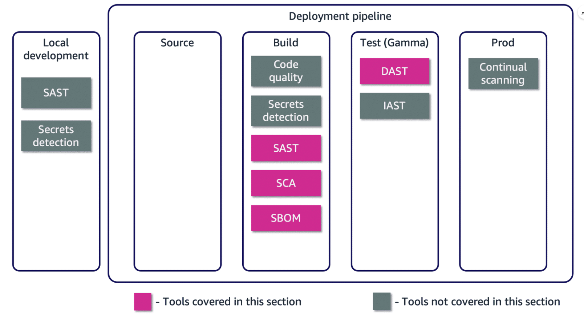

Security testing that occurs at each stage of a CI/CD pipeline. The Test (Beta) stage is omitted for the purpose of this section. This section focuses on tools that provide SAST, SCA, SBOM, and DAST, capabilities.

#### Amazon CodeGuru Security

Amazon CodeGuru Security is a static application security tool that uses machine learning (ML) to detect security policy violations and vulnerabilities. It provides suggestions for addressing security risks and generates metrics so you can track the security posture of your applications. All code scans perform code security analysis, where CodeGuru Security scans your code and returns findings about detected security vulnerabilities and hard-coded secrets. Amazon CodeGuru Security provides the means to implement static application security testing along with secrets detection.

### Amazon CodeGuru Security in the pipeline

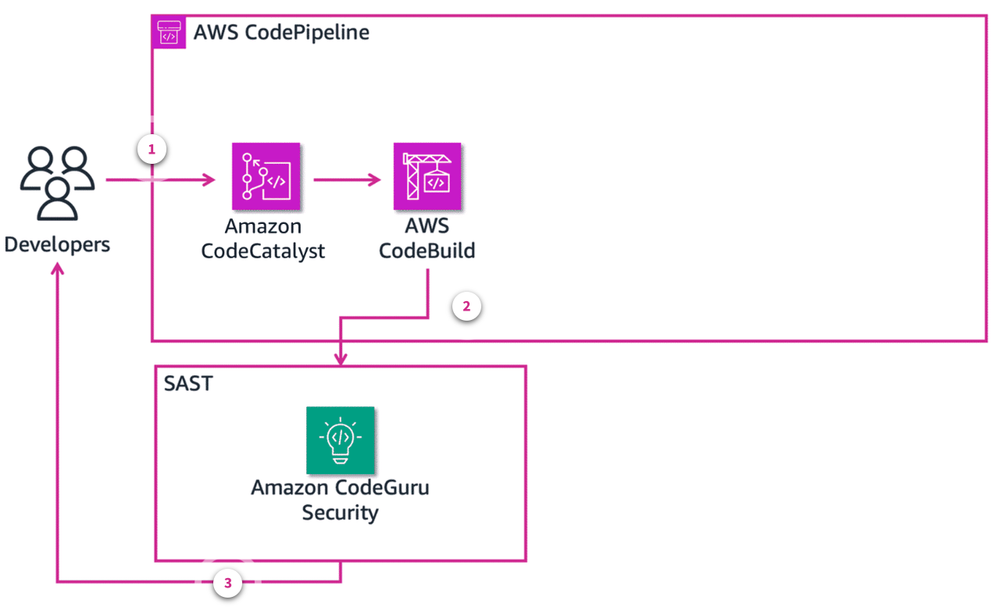

1. **Commit code**. When a user commits the code to an Amazon CodeCatalyst repository, an Amazon CloudWatch event is generated, which activates CodePipeline.
2. **Start scanning**. AWS CodePipeline calls on CodeBuild to send source code to CodeGuru Security. CodeBuild initiates a SAST scan of the code.
3. **Scan results**. If there are no violations, the build continues. If there are violations, then the development team is notified. Developers can review scans and findings in the CodeGuru Security console.

CodeBuild provides the means to use other static application security testing (SAST) tools, if preferred.

### Software composition analysis

The preceding architecture image shows how CodeBuild calls on CodeGuru Security to perform a static code analysis. The next step is to conduct a Software Composition Analysis (SCA). SCA is the process of automating visibility into open-source software use for the purpose of risk management, security, and license compliance. For SCA, you could use an open-source tool, such as OWASP Dependency-Check.

OWASP Dependency-Check is an open-source SCA tool maintained by the OWASP Foundation. The tool scans file names, package names, manifests, and source files to determine types of identifiers: vendor, product, and version. The identifiers are then matched against the National Vulnerability Database (NVD) and Common Vulnerability Exposures resources. Each identifier with a confirmed vulnerability shows within a report. The report also includes severity level (for example, low to high) and confidence in result (for example, low to high). Confidence in result refers to the degree of confidence that the scan correctly matched an identifier to a known vulnerability.

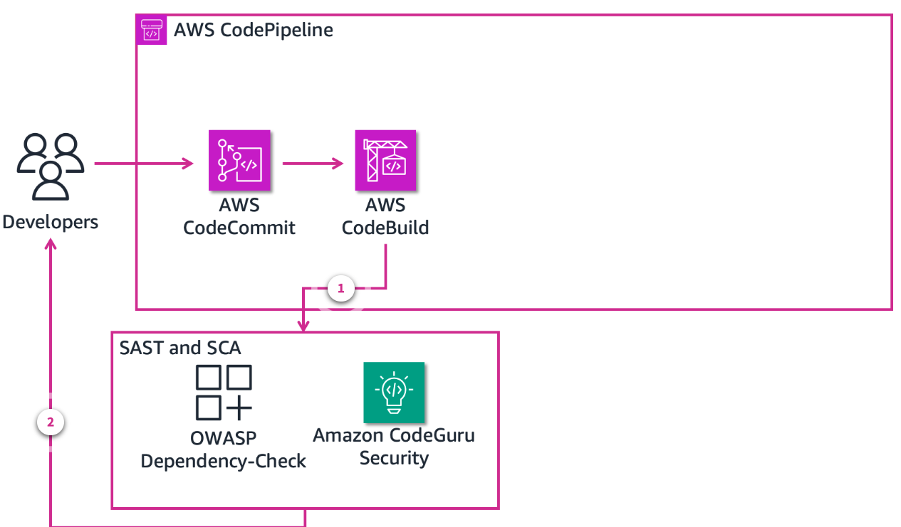

1. **CodeBuild initiates scan**. CodeBuild scans the code with an SCA tool (OWASP Dependency-Check). CodePipeline is set to run both SAST and SCA at the same time.
2. **Scan results**. Developers review the SCA scan results and take appropriate remediation steps. If the results are negative, then the build continues.

    Accessing scan results is dependent on the pipeline's architecture. One way is to post them into AWS Security Hub. A separate AWS Lambda function is necessary to ingest scan results and post them in Security Hub.

### Dynamic application security testing

By this point, the application has passed previous security checks and has been deployed to a test environment. You have the option to proceed with dynamic application security testing (DAST) or interactive application security testing (IAST). You and your team determine which type of security testing (DAST or IAST) is appropriate, and complies with your organization's software deployment goals. DAST is the focus here, but the concepts are similar for IAST. For DAST, you can use an open-source tool like OWASP Zed Attack Proxy (ZAP).

ZAP is a penetration testing tool that provides both manual and automated testing. In manual mode, ZAP, as a proxy between a tester's web browser and the application, inspects and manipulates captured packets and sends them to their destination. In automated testing, ZAP discovers each web page of the target web application, then performs an attack on the web application pages, functionality, and parameters. The goal is to find vulnerabilities. You can configure ZAP for authentication to your web application for deeper scanning.

ZAP results include a map of your web application along with corresponding alerts and risk categories.

1. **Deploy to test**. CodeDeploy launches the application to a testing environment (for example, Gamma).
2. **Initiate DAST**. CodeBuild initiates the dynamic application security testing. In this example, OWASP ZAP conducts automated scanning of the application running in the Gamma environment.
3. **Scanning results**. ZAP provides reporting back to the development team, where they take appropriate action. You could use Security Hub to review those results. A Lambda function could pull the results and store them in Security Hub.
4. **Deploy application**. CodeDeploy deploys the application after all security vulnerabilities have been addressed. In this example architecture, CodeDeploy deploys the application to an AWS Elastic Beanstalk instance.

### Comprehensive security testing in a CI/CD pipeline

The previous diagrams provide a relatively straightforward deployment of security testing in a CI/CD pipeline. The following image provides a comprehensive deployment of an AWS DevSecOps CI/CD pipeline architecture. To learn more about this CI/CD pipeline architecture, see [Building End-to-End AWS DevSecOps CI/CD Pipeline with Open Source SCA, SAST and DAST Tools](https://aws.amazon.com/blogs/devops/building-end-to-end-aws-devsecops-ci-cd-pipeline-with-open-source-sca-sast-and-dast-tools/).

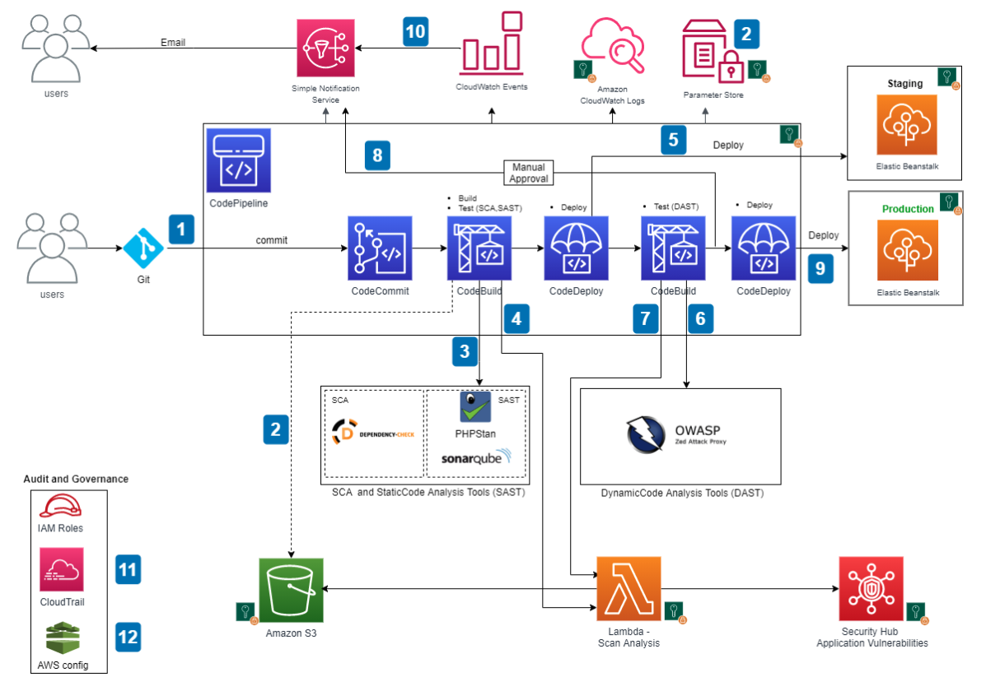

### Getting Started with Amazon CodeGuru Security

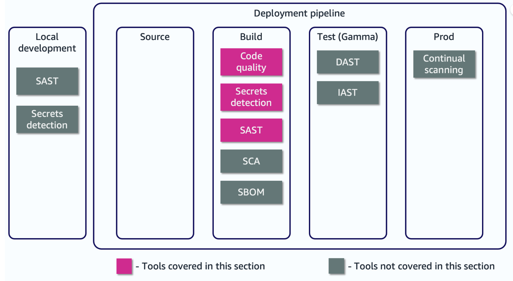

Security testing that occurs at each stage of a CI/CD pipeline. This section focuses on CodeGuru Security that provides code quality scans, SAST, and secrets detection capabilities.

### Amazon CodeGuru Security is a component of Amazon CodeGuru

Amazon CodeGuru Security scans your applications, detects security vulnerabilities, and provides suggestions for how to remediate them in your code. After updating your code, you rerun the scan to ensure the security vulnerability has been remediated and to close the finding. By revising code and re-running scans, you generate security metrics you can track to continuously improve the security posture of your applications.

Amazon CodeGuru Security can perform code security analysis and code quality analysis in code scans. All code scans perform code security analysis, where CodeGuru Security scans your code and returns findings about detected security vulnerabilities and hard-coded secrets. You can also configure your scans to include code quality analysis, which returns findings related to the quality of your code, in addition to security vulnerabilities.

#### Code security analysis

Code security analysis detects potential security policy violations and vulnerabilities in your code. Code security analysis is powered by Amazon CodeGuru detectors that are informed by years of Amazon.com and AWS security best practices. Examples of security vulnerabilities include resource leaks, hard-coded credentials, and cross-site scripting.

In addition to security vulnerabilities identified by CodeGuru detectors, security analysis also includes scanning code and text files for hard-coded secrets.

#### Code quality analysis

Code quality analysis detects issues related to quality and maintainability in your code. You can include code quality analysis in addition to security analysis in your scans to ensure your code is meeting quality best practices. Code quality analysis returns findings with an informational severity level that does not impact the security assessment of your code base.

#### Secrets detection

CodeGuru Security integrates with AWS Secrets Manager to use a secrets detector that finds unprotected secrets in your code and text files. Secrets detection is automatically enabled in scans, so you don't need to turn it on.

The secrets detector searches for hard-coded passwords, database connection strings, user names, and more. When an unprotected secret is found during a code scan, CodeGuru Security generates a finding with a suggested remediation that tells you about the unprotected secret.

### Scanning and revising code with Amazon CodeGuru Security

All scans are manually activated within the AWS Management Console.

1. **Python code**

    The following Python code contains at least two security vulnerabilities:

    * Unsanitized user input for a SQL database query
    * A resource leak from from not closing a database connection

    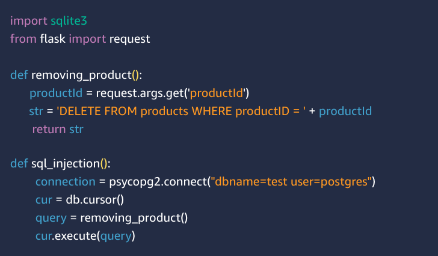

2. **Start scan**

    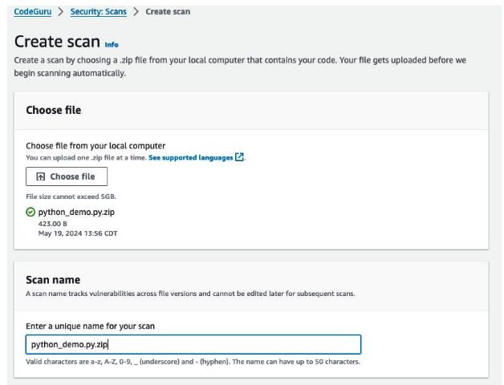

    From the Amazon CodeGuru Security console, choose **Create scan**. The next screen shows the requirements to start scanning your code. Your code files must be in a ZIP file to conduct a manual scan. After uploading the file, you give the scan a name.

    The image shows the name of the file as **python_demo.py.zip**. The zipped file contains the code from the previous step. The scan name is **python_demo.py.zip**. After providing the name, choose **Create scan**. CodeGuru Security will scan your code. Because the code is small, the scan should run for about 1 minute.

3. **Review results**

    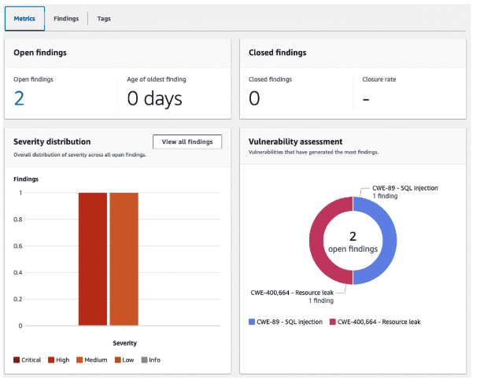

    CodeGuru Security states there are two open findings. An open finding means some type of security vulnerability that includes a Common Weakness Enumeration (CWE) designation. The results show the following open findings:

    * CWE-89 - SQL injection
    * CWE-400,664 - Resource leak

    The SQL injection is ranked as high severity, and the resource leak as a medium severity. How you handle software vulnerabilities depends on your organization's security policies, yet a code build typically fails when a SQL injection vulnerability is discovered. As for the resource leak, this means that code doesn't properly close the database connection.

    The image in this step shows the results of the security scan. The image is from the CodeGuru Security console.

4. **Review the open findings

    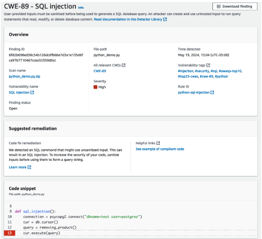

    Choose the Findings tab, then choose each finding to learn more about the details. For this step, review the SQL injection finding. CodeGuru Security provides the following:

    * a description of the vulnerability
    * details from the scan
    * suggested remediation
    * code snippet with the highlighted line number

    Additionally, CodeGuru Security provides additional resources to review more information about the finding and how to remediate the vulnerability (for example, compliant code).

    The image shows the open finding details including an overview, suggested remediation, and code snippet.

5. **Update the code**.

    After reviewing the open findings, update the source code to address the two open findings. To address the SQL injection vulnerability, the updated code sanitizes user input, which protects against unauthorized SQL activity. To ensure the database connection is closed properly, even in the event of an exception, the updated code includes a try-finally block. Regardless of whether an exception occurred, the finally block will run. This ensures that the database connection is closed, even if an exception was raised. The if statement in the finally block ensures to only close the connection if a connection was successfully established.

    For this demonstration, the updated code is as follows:

    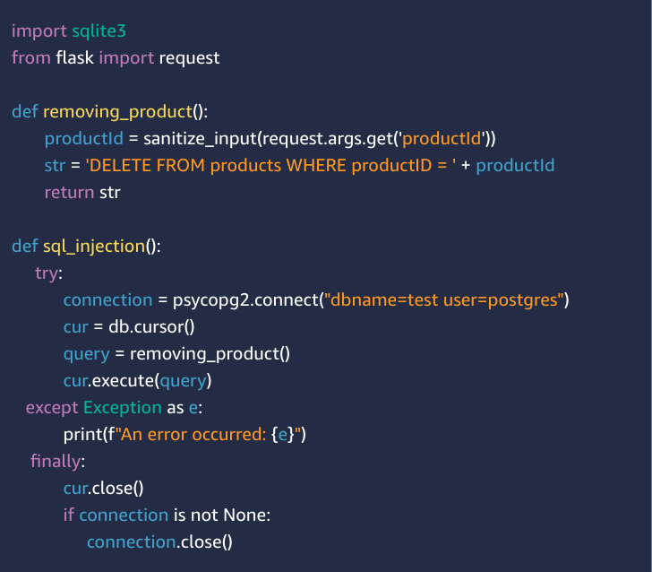

6. **Scan the updated code**

    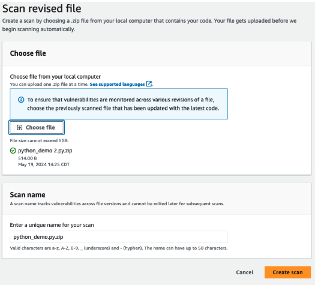

    From the CodeGuru Security console, choose the scan named **python_demo.py.zip**, then choose **Scan revised file**. On the next screen, select the updated zip file, then choose **Create scan**.

    The image shows that the updated code resides in the file named **python_demo 2.py.zip**. The scan name remains unchanged.

7. **Review the results again

    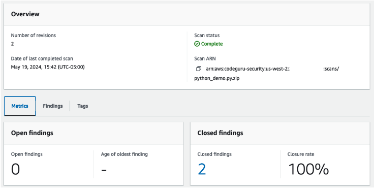

    When the scan completes, the results show there are now two closed findings and zero open findings. The image confirms those results.

    CodeGuru Security also integrates with third-party tools and other AWS services like Amazon CodeCatalyst and AWS CodePipeline. This means organizations can implement automated security testing with CodeGuru Security into their CI/CD pipelines.

### CodeGuru Security and CodeGuru Reviewer

There are functional similarities between CodeGuru Security and Amazon CodeGuru Reviewer. CodeGuru Security is a rearchitected and redesigned version of CodeGuru Reviewer. CodeGuru Security uses hundreds of new security detectors to scan your code, in addition to the detectors that were developed for CodeGuru Reviewer. CodeGuru Security also includes many additional features, such as vulnerability tracking and a metrics dashboard to help you monitor the security posture of your applications. For now, organizations have a choice between the two services. For anyone using CodeGuru Reviewer and wanting access to updated scanning capabilities, they can enable quality analysis in their scans. Otherwise, CodeGuru Security is a straightforward choice.

### Getting Started with Amazon Inspector

#### Applications in production

When new and updated applications reach production and become available for usage, security testing shifts to security monitoring. As shown in the following image, security monitoring involves continual scanning of applications and the production environment. Organizations need the ability to remediate security vulnerabilities when they are detected. This section reviews Amazon Inspector as a service that provides continual security monitoring of applications.

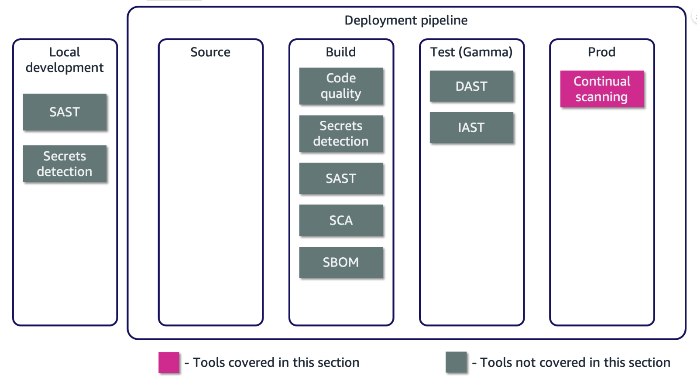

Security testing that occurs at each stage of a CI/CD pipeline. This section focuses on Amazon Inspect that provides continual scanning capabilities in a production environment.

### Amazon Inspector

Amazon Inspector is an AWS security service that continuously assesses your workloads for vulnerabilities. It automatically scans the Amazon EC2 instances, container images, and repositories residing in the Amazon Elastic Container Registry (Amazon ECR), and Lambda functions in your AWS environment. After the assessment, it produces a detailed list of security findings that is organized by level of severity.

Amazon Inspector creates a finding when it discovers a software vulnerability or network configuration issue. A finding describes the vulnerability, identifies the affected resource, rates the severity of the vulnerability, and provides remediation guidance. You can analyze findings using the Amazon Inspector console, or view and process your findings through other AWS services.

### How Amazon Inspector helps

* Automate discovery and continual scanning that delivers near real-time vulnerability scanning.
* Provide a highly accurate risk score for each finding to efficiently prioritize remediation.
* Consolidate vulnerability management solutions into one fully managed service.
* Integrate with AWS Security Hub and Amazon EventBridge to automate workflows, ticket routing, and remediation.

### Amazon Inspector benefits

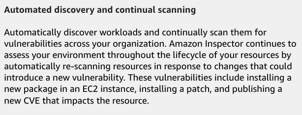

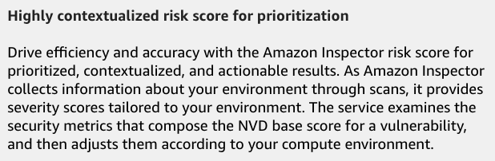

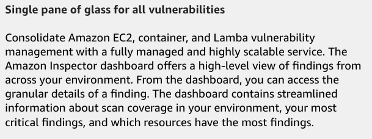

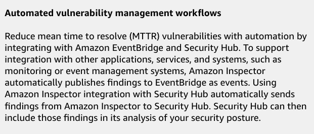

### Automating Vulnerability Management with Amazon Inspector

### Implementing Amazon Inspector

Amazon Inspector is a vulnerability management service that continually scans AWS workloads for software vulnerabilities and unintended network exposure. With a few actions in the AWS Management Console, you can use Amazon Inspector across all accounts in your organization. After it's started, it automatically discovers running EC2 instances, container images residing in Amazon ECR, and Lambda functions at scale, then immediately starts assessing them for known vulnerabilities.

After vulnerabilities have been identified, they are aggregated and automated into workflows through the Amazon Inspector console, Security Hub, and EventBridge. Container image vulnerabilities will also be sent to Amazon ECR for resource owners to remediate as needed. Amazon Inspector creates an event for EventBridge for newly generated findings, newly aggregated findings, and changes in the state of findings.

When you use EventBridge events with Amazon Inspector, you automate tasks to help you respond to security issues revealed by Amazon Inspector findings. To use the Amazon Inspector integration with Security Hub, you activate Security Hub. You use the Amazon Inspector integration with Security Hub to send findings from Amazon Inspector to Security Hub. Security Hub then includes those findings in its analysis of your security posture.

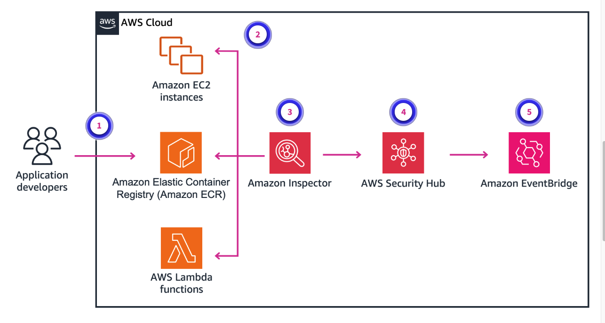

1. **Deploy applications**. Developers deploy their application through a CI/CD pipeline. The state of the application could be in a container image file, a Lambda function, or to an Amazon EC2 instance.
2. **Activate Amazon Inspector**. Amazon Inspector continually scans EC2 instances, Amazon ECR repositories, and Lambda functions.
3. **Amazon Inspector**. Amazon Inspector creates a finding when it discovers a software vulnerability or network configuration issue. A finding is a detailed report about a vulnerability that affects one of your resources. Amazon Inspector generates a finding whenever it detects a vulnerability in an EC2 instance, a container image in an Amazon ECR repository, or a Lambda function.
4. **Security Hub**. You can use Amazon Inspector integration with Security Hub to send findings from Amazon Inspector to Security Hub. Security Hub provides a comprehensive view of your security state in AWS and helps you check your environment against security industry standards and best practices.
5. **EventBridge**. When you use EventBridge events with Amazon Inspector, you automate tasks to help you respond to security issues revealed by Amazon Inspector findings.

#### Amazon Inspector terminology

* **Environment coverage**

    The Environment coverage section provides statistics about the resources scanned by Amazon Inspector. In this section, you can see the count and percentage of EC2 instances, Amazon ECR images, and Lambda functions scanned by Amazon Inspector.

* **Critical findings**

    The Critical findings section provides a count of the critical vulnerabilities in your environment and a total count of all findings in your environment.

* **Risk-based remediations**

    The Risk-based remediations section shows the top five software packages with critical vulnerabilities that affect the most resources in your environment. Remediating these packages can help significantly reduce the number of critical risks to your environment.

* **Instances with critical findings**

    The Instances with most critical findings section shows the top five Amazon EC2 instances with the most critical findings. The view shows instance identifier, AWS account identifier, Amazon Machine Image (AMI) identifier, number of critical vulnerabilities, and total number of vulnerabilities. This view helps infrastructure owners identify which instances might require patching.

* **AMIs with most critical findings**

    The AMIs with most critical findings section shows the top five AMIs in your environment with the most critical findings. The view shows the the number of critical vulnerabilities, and the total number of vulnerabilities in each AMI. The view includes other AMI details. This view helps infrastructure owners identify which AMIs might require rebuilding.

* **AWS Lambda functions with most critical findings**

    The AWS Lambda functions with most critical findings section shows the top five Lambda functions in your environment with the most critical findings. The view shows the Lambda function name, AWS account identifier, runtime environment, the number of critical vulnerabilities, the number of high vulnerabilities, and the total number of vulnerabilities. This view helps infrastructure owners identify which Lambda functions might require remediation.

### Scenario: DevSecOps Best Practices

#### Launch-day jitters with a secure fix

Paul Roe and his team are nearing the launch date for AnyCompany's new application. The launch date is fast approaching, and everyone is excited. However, a critical security vulnerability was discovered just 2 weeks before launch. The vulnerability could expose user data and lead to a major public relations disaster. The team spent long hours and worked on the weekend to address the vulnerability so they could still launch the app on schedule. Now, the team wonders how this costly mistake could have been avoided.

The best practices of DevSecOps could help Paul and team now and going forward.

#### Shift left

Paul's team had not been following a shift left approach, which is a DevSecOps best practice. Security testing was only happening at the end of the development cycle. This meant the vulnerability went unnoticed for a long time. If the team implements a shift left approach to software development, they could have potentially caught the vulnerability much earlier in the development process before significant coding was complete.

#### Which type of security testing aligns with the shift left approach?

* Static application security testing

Wrong answers:

* Dynamic application security testing
* Interactive application security testing
* Continual security scanning

##### Explanation

By implementing shift left, the team can integrate static code analysis tools into their continuous integration and continuous delivery (CI/CD) pipeline.

The other responses are incorrect because they occur later in the CI/CD pipeline.

#### Automated security testing

With the launch deadline looming, manual security testing would be too slow. Instead, the team would benefit by implementing automated security testing through the CI/CD pipeline. The team could configure automated security scans with each code change, starting with a successful commit to the main code repository.  This allows for quick identification and remediation of vulnerabilities without slowing down the development process.

#### Which security tool or service includes an automated security scanning capability?

* Amazon CodeGuru Security

Wrong answers:

* AWS CodeBuild
* AWS CodeCatalyst
* AWS CodePipeline

##### Explanation

CodeGuru Security integrates with other AWS services, such as CodePipeline, which could automatically initiate security testing.

The other responses are incorrect because they do not directly provide automated security testing.

#### Security awareness

The situation with Paul's team highlights the importance of promoting security awareness among all team members. Developers should be trained in secure coding practices to write code that is less prone to vulnerabilities. The operations team should be aware of the security implications of infrastructure choices. The security team should work with both teams to provide guidance and recommendations on what are acceptable security practices. The security team could also have some responsibility in reviewing security testing results and managing security next steps and exceptions. By fostering a culture of shared security responsibility, everyone becomes accountable for building a secure application.

#### Shift right for continuous protection

Even after fixing the vulnerability and launching the application, Paul and his team's work isn't complete. They should implement the DevSecOps best practice of shift right, which means continuously monitoring the application for suspicious activity and new vulnerabilities. Security information and event management tools can be used to detect and respond to potential threats promptly.

#### Which tool or service aligns with the DevSecOps best practice, shift right?

* Amazon Inspector

Wrong answers:

* Amazon CodeGuru Security
* OWASP Zed Attack Proxy (ZAP)
* OWASP Dependency-Check

##### Explanation

Amazon Inspector is a vulnerability management service that continuously scans your AWS workloads for software vulnerabilities and unintended network exposure.

The other responses are incorrect because of the following:

* Amazon CodeGuru Security aligns with the shift left best practice of DevSecOps.
* OWASP ZAP is a dynamic application security testing tool that is used during testing phase of the continuous integration and continuous delivery (CI/CD) pipeline.
* OWASP Dependency-Check is a software composition analysis tool that is used during the build phase of the CI/CD pipeline.

By adopting these DevSecOps best practices, Paul's team can now prevent similar vulnerabilities from progressing too far into the development and deployment of applications. They should now have the confidence to release new and updated applications securely, ensuring successful launches that occur on time.

In summary, DevSecOps best practices include the following:

* **Shift left**: Shift left is the process of checking for vulnerabilities in the earlier stages of software development. By following the process, software teams can prevent undetected security issues when they build the application. For example, developers create secure code in a DevSecOps process.
* **Use automated security tool**s: DevSecOps teams might need to make multiple revisions in a day. To do that, they need to integrate security scanning tools into the CI/CD process. This prevents security evaluations from slowing down development.
* **Promote security awareness**: Companies make security awareness a part of their core values when building software. Every team member who plays a role in developing applications must share the responsibility of protecting software users from security threats.
* **Shift right**: Shift right indicates the importance of focusing on security after the application is deployed. Some vulnerabilities might escape earlier security checks and become apparent only when customers use the software.

### [Lab: Using Amazon Inspector for Vulnerability Scanning](./labs/W030Lab1AmazonInspectorForVulnerabilityScanning.md)

In this lab, you work with Amazon Inspector to scan for vulnerabilities in pre-existing AWS resources, such as Amazon EC2 instances and AWS Lambda functions. You learn about the importance of security scanning, how to configure Amazon Inspector, and how to interpret and remediate findings.

In this lab, you perform the following tasks:

* Activate and configure Amazon Inspector.
* Review the inspected AWS resources.
* Analyze and interpret vulnerability findings.
* Remediate vulnerabilities.

### [AWS SimuLearn: Secure Self-Service Infrastructure]()

In this AWS SimuLearn assignment, you will review a real-world scenario helping a fictional customer design a solution on AWS. After the design is complete, you will build the proposed solution in a guided lab within a live AWS Console environment. You will gain hands-on experience working with AWS services, using the same tools technology professionals use to construct AWS solutions.

For this assignment, you will help the new head of the IT Services department at a web gaming company who has limited staff to deploy IT services to other departments. The IT Services department is looking for a way to hand off these deployments to the other departments themselves, something like a self-service tool in which configurations already meet compliance requirements and resources are secure.

### [AWS SimuLearn: Securing Your Servers]()

In this AWS SimuLearn assignment, you will review a real-world scenario helping a fictional customer design a solution on AWS. After the design is complete, you will build the proposed solution in a guided lab within a live AWS Console environment. You will gain hands-on experience working with AWS services, using the same tools technology professionals use to construct AWS solutions.

For this assignment, you will help a mining operation which built an enterprise resource planning (ERP) application to process job applicant submissions. The application is deployed and running, but the mining operation wants help setting least privilege permissions to limit the application's effect on AWS resources.

### Knowledge Check

#### Which type of scan does Amazon CodeGuru Security provide?

* Secrets detection

Wrong answers:

* Dynamic application security testing
* Infrastructure vulnerability
* Missing operating system updates

##### Explanation

Amazon CodeGuru Security provides secrets detection, which is the ability to scan source code repositories and identify potentially hard-coded secrets and credentials. This can include AWS access keys, database passwords, and API keys.

The other responses are incorrect because of the following:

* Dynamic application security testing occurs on running applications deployed during the test phase of the continuous integration and continuous delivery (CI/CD) pipeline. CodeGuru Security scanning occurs during the build phase.
* CodeGuru Security does not scan for infrastructure vulnerabilities, although it does scan Infrastructure as Code templates.
* CodeGuru Security does not scan for missing operating system updates.

#### What is a DevSecOps best practice?

* Shift left.

Wrong answers:

* Keep security and development teams separate.
* Focus solely on automating security testing.
* Ensure developers have the ability to override security concerns to meet the launch timeline.

##### Explanation

Shift left is the process of checking for vulnerabilities in the earlier stages of software development. By following the process, software teams can prevent undetected security issues when they build the application. For example, developers create secure code in a DevSecOps process.

The other responses are incorrect because of the following:

* DevSecOps promotes collaboration and integration between development, security, and operations teams throughout the software development lifecycle. Keeping these teams separate can lead to silos and hinder the ability to address security concerns in a timely and efficient manner.
* DevSecOps encompasses more than just automating security testing. Although automation is a critical component, DevSecOps also emphasizes cultural and organizational changes. These include fostering a security-conscious mindset, continuous monitoring, and shared responsibilities among cross-functional teams.
* When following DevSecOps best practices, developers should not have the need to override security concerns to meet launch timelines.

#### What does the DevSecOps best practice, shift right, mean?

* Continuously monitor applications for suspicious activity and new vulnerabilities

Wrong answers:

* Implement security tests and validations earlier in the development process
* Automate the deployment and configuration management of security tools and services
* Implement security testing in the testing stage

##### Explanation

Shift right refers to extending security practices beyond the development and deployment phases into the runtime operations of applications. It involves continuously monitoring applications for security threats, vulnerabilities, and compliance violations when running in a production environment.

The other responses are incorrect because of the following:

* Implement security tests and validations earlier in the development process refers to the DevSecOps best practice, shift left.
* While automating security tool deployment and configuration management is a DevSecOps best practice, it does not directly relate to the specific concept of "shift right".
* Implement security testing in the testing stage is associated with the shift left best practice.

### Summary

* A combination of testing tools can properly satisfy security testing requirements in each phase of the CI/CD pipeline.
* Amazon CodeGuru Security provides reporting on detected security vulnerabilities and secrets, along with remediation suggestions.
* Amazon Inspector provides continuous monitoring and reporting of detected security vulnerabilities in both applications and infrastructure.

#### DevSecOps best practices

Following best practices of DevSecOps requires a cross-team commitment to prioritize delivering secure software quickly. Teams shouldn't sacrifice security integrity to meet software delivery deadlines.

When done the right way, teams should commit to the following best practices:

* **Shift left**: Check for vulnerabilities early when developing software.
* **Use automated security tools**: Commit to automating security testing at each phase of the CI/CD pipeline.
* **Promote security awareness**: Everyone involved in the software development lifecycle commits to the responsibility of protecting software users from security threats.
* **Shift right**: Similar to the shift left best practice, continually check for vulnerabilities after software delivery and when the application remains live for software users.

### Additional Resources

* [To learn more about Amazon CodeGuru Security](https://docs.aws.amazon.com/codeguru/latest/security-ug/what-is-codeguru-security.html)
* [To learn more about Amazon Inspector](https://docs.aws.amazon.com/inspector/latest/user/what-is-inspector.html)
* [To learn more about how Amazon Inspector helps build and deploy pipelines for applications](https://aws.amazon.com/blogs/security/use-amazon-inspector-to-manage-your-build-and-deploy-pipelines-for-containerized-applications/)
