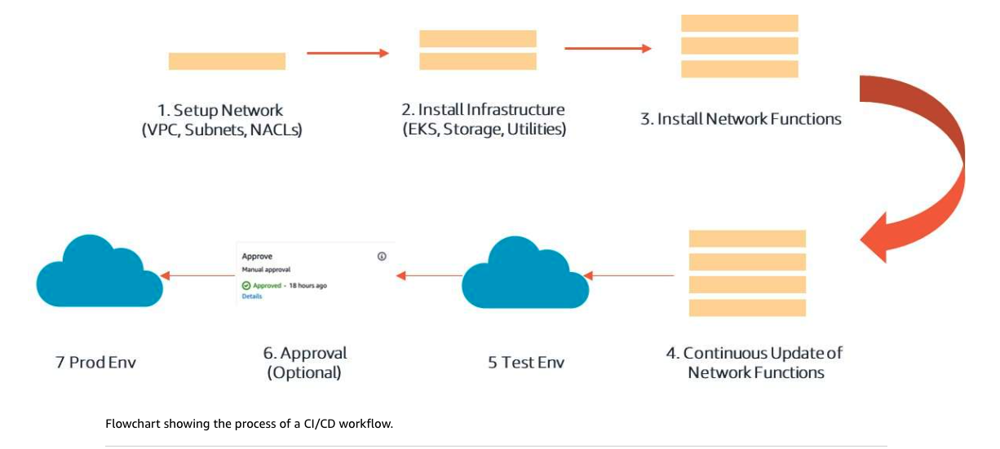

# Week 4: IaC: IaC as Part of a DevOps Workflow

* back to AWS Cloud Institute repo's root [aci.md](../aci.md)
* back to [AWS Cloud Operations 2](./aws-cloud-operations-2.md)
* back to repo's main [README.md](../../../README.md)

## IaC as a Part of a DevOps Workflow

### Pre-assessment

#### Which statement best describes how infrastructure as code (IaC) fits into the DevOps workflow?

* IaC enables the automation of infrastructure provisioning and configuration as part of continuous integration and continuous delivery (CI/CD).

Wrong answers:

* IaC is used to manually provision and configure infrastructure resources.
* IaC is only used for testing and compliance purposes, not for actual infrastructure deployment.
* IaC is a separate process that is independent of the DevOps workflow.

##### Explanation

IaC allows infrastructure resources to be defined and managed using code, which can be integrated into the continuous integration and delivery pipeline. This enables infrastructure to be provisioned, configured, and deployed automatically as part of the DevOps workflow, ensuring consistency and reducing manual effort.

The other options are incorrect because of the following:

* Infrastructure as code is meant to automate and codify infrastructure provisioning and configuration, not do it manually.
* Infrastructure as code enables automated deployment of infrastructure resources in addition to testing and compliance checking.
* Infrastructure as code is an integral part of the DevOps methodology, enabling infrastructure management through the same workflows as application code.

#### What is a key responsibility of application developers when writing and maintaining infrastructure as code (IaC) templates?

* Defining the infrastructure resources required for their applications and encoding them in IaC templates

Wrong answers:

* Ensuring that the IaC templates meet the organization's General Data Protection Regulation (GDPR) requirements
* Collaborating with physical infrastructure teams to define and maintain the IaC templates
* Manually provisioning and configuring the infrastructure resources based on the IaC templates

##### Explanation

Application developers have the best understanding of the infrastructure requirements for their applications. By encoding these requirements in IaC templates, developers can ensure that the infrastructure meets the application's needs and can be consistently provisioned and configured.

The other options are incorrect because of the following:

* Meeting GDPR requirements is related to data privacy compliance, not a core responsibility of application developers when working with infrastructure as code templates.
* IaC templates are typically defined and maintained by the application teams themselves, without necessarily collaborating with separate physical infrastructure teams.
* The purpose of IaC is to automate and codify infrastructure provisioning and configuration, not do it manually based on the templates.

#### Which statement best describes the collaboration between application developers and infrastructure teams when working with infrastructure as code (IaC)?

* There is a high need for coordination and collaboration between application developers and infrastructure teams to ensure successful implementation of IaC.

Wrong answers:

* Application developers work independently on IaC templates, and infrastructure teams are responsible for deploying and managing the infrastructure.
* Infrastructure teams define and maintain all IaC templates, and application developers have no involvement in the process.
* Application developers and infrastructure teams work in silos, with minimal coordination or collaboration required.

##### Explanation

The successful implementation of IaC requires close collaboration between application developers and infrastructure teams. Developers must define the infrastructure requirements, while infrastructure teams must ensure that the IaC templates meet organizational standards and can be deployed and managed effectively.

The other options are incorrect for the following reasons:

* They suggest a siloed approach without coordination between the two teams, which goes against successful implementation of IaC.
* They exclude application developers from the IaC process, which requires collaboration between both teams for successful implementation.
* They contradict the need for high coordination and collaboration between the two teams, as stated in the correct option.

## IaC as Part of a DevOps Workflow

### IaC and the DevOps workflow

Infrastructure as code (IaC) is a practice that involves the use of code to automate the provisioning, deployment, and management of servers, networks, and databases. Rather than relying on manual processes, IaC employs code to perform these tasks, ensuring consistency, repeatability, and scalability across various infrastructure components.

This code can be written in the programming language that you feel most comfortable with through the use of the AWS Cloud Development Kit (AWS CDK).

### Role of IaC in DevOps

#### Reproducible configurations

IaC enables reproducible infrastructure configurations that can be version-controlled, tracked, and collaborated on. It ensures consistent provisioning across environments, reducing human error and ensuring compliance with standards.

#### Seamless integration

IaC seamlessly integrates with continuous integration and continuous delivery (CI/CD) pipelines, allowing infrastructure and application changes to be coordinated and tested together. It facilitates infrastructure testing and enables faster, more reliable deployments.

#### Setup environments

IaC allows DevOps teams to quickly provision and configure consistent environments for development, testing, and production using code. This includes setting up virtual machines, containers, networks, and other resources in a repeatable manner.

IaC provides a common language for both developers and operations. Changes can be reviewed in a transparent manner, which fosters better collaboration in a DevOps environment.

### Version control

Version control is done differently when using IaC principles.

#### Version control without IaC

Without IaC, version control is limited to application code and configuration management. Infrastructure changes are often made manually through the AWS Management Console or AWS Command Line Interface (AWS CLI), making it challenging to track and reproduce changes consistently across different environments (for example, development, staging, and production). It is also difficult to automate the creation and deployment of infrastructure.

Furthermore, developing specifications for physical and virtual infrastructure often requires a lot of time and multiple teams.

#### Version control with IaC

When using IaC with version control, you can manage your entire AWS infrastructure as code. Version control systems provide several benefits, including the following:

* Detailed history of changes made to your infrastructure code, allowing you to track who made what changes and when
* Branching and merging using repositories like Amazon CodeCatalyst to manage different versions of the infrastructure code
* Deployment process using continuous integration and continuous deployment (CI/CD) pipelines, ensuring consistent and repeatable deployments across environments
* Ability to roll back to previous versions of the infrastructure code, if needed, minimizing the impact of issues or failures

Performing version control with IaC provides the ability to perform code reviews on deployment changes before they are applied. This adds an extra layer of safety to deployments and keeps infrastructure costs low. For example, a team working on a project can designate a group of trusted reviewers to ensure that all infrastructure changes are approved by engineers who are familiar with the implications of an infrastructure change on stability and cost.

Additionally, defining infrastructure in configuration files gives engineers a straightforward and agreed-upon view of the intended state of the system. If multiple members of a large engineering team were to make all of their infrastructure changes at the command line or in the AWS Management Console, it would quickly become unmaintainable.

With IaC version control and code reviews, multiple engineers must agree that the proposed infrastructure change is correct, and they must have done their due diligence to look for potential issues before approving.

### Continuous integration/continuous delivery

Continuous integration/continuous delivery (CI/CD) is the use of continuous processes for the publishing of new versions of code. For CI/CD to work, you first need to have your code stored in a centralized repository, such as Amazon CodeCatalyst or Git.

The process of CI/CD follows a workflow similar to the following graphic.

#### Continuous Integration

With CI, each time a change is made to your code, an automated process is triggered that compiles, builds, tests, and packages the code.

This automated process produces feedback for the developer(s) who made the change who can review and iterate on their code.

#### Continuous Delivery

CD is an extension of CI as it relates to IaC in that it takes code that has gone through an automated review process and then puts that code through a process in preparation for a live deployment.

Once approved, code is then deployed to the production environment using a tool like AWS CodePipeline or a third-party CI/CD tool.

Infrastructure deployments are monitored and capture logs are audited, and they include a plan to roll back to a previous state or recover from failures during the deployment and delivery process.

### [Lab 1: Deploying Infrastructure as Code with AWS CodePipeline](./labs/W040Lab1DeployingIaCUsingAwsCodePipeline.md)

In this lab, you will use AWS CodePipeline to deploy infrastructure as code (IaC) using an AWS CloudFormation template. This lab includes steps for building out a CloudFormation template, creating a CodePipeline by pulling source code from a code repository, and finally, creating and updating a CloudFormation stack.

In this lab, you will perform the following tasks:

* Create a CloudFormation template
* Configure an AWS CodePipeline
* Modify an infrastructure stack by updating the CloudFormation template
* Push the modified stack to the source code repository

### Developer Responsibilities in Writing and Maintaining IaC Templates

#### Application architecture and dependencies

As an application developer, one of your primary responsibilities is to identify the cloud resources required to run your application successfully. This involves understanding the application's architecture, components, and dependencies. You need to determine the types of resources needed, such as compute instances, like Amazon Elastic Compute Cloud (Amazon EC2); databases, like Amazon Relational Database Service (Amazon RDS) or Amazon DynamoDB; load balancers; networking components, such as virtual private clouds (VPCs), subnets, and security groups; storage, like Amazon Elastic Block Store (Amazon EBS) and Amazon Simple Storage Service (Amazon S3); and other services or resources your application requires.

To identify the required resources, start by breaking down the application into its various components and mapping them to the corresponding cloud resources. For example, if your application has a web tier, you might need EC2 instances or an Amazon Elastic Container Service (Amazon ECS) cluster for hosting the web servers. If it has a database tier, you might need an Amazon RDS instance or a DynamoDB table. If your application requires file storage, you might need an Amazon Elastic File System (Amazon EFS) or S3 bucket.

#### Mapping application components to cloud resources

Once you identify your application's components, the next step is to map each component to the appropriate cloud resources. This mapping process involves understanding the capabilities and limitations of different AWS services and selecting the most suitable resources for your application's needs.

For example, if your application requires a relational database, you might choose Amazon RDS as the cloud resource. If your application needs a NoSQL database, you might choose Amazon DynamoDB. If your application requires object storage, you might choose Amazon S3. If your application needs a message queue, you might choose Amazon Simple Queue Service (Amazon SQS) or Amazon Simple Notification Service (Amazon SNS).

It's important to consider factors such as scalability, performance, availability, and cost when mapping application components to cloud resources. You should also consider the integration and compatibility of different services, as well as any specific requirements or constraints your application might have.

1. **Define resources**

   Once a developer identifies the required cloud resources for their application, the next step is to define the resources in the IaC templates. IaC templates are essentially code files that describe the desired state of an infrastructure, including the resources the developer wants to provision and their configurations.

   In your IaC templates, you will define the resources using the syntax and constructs provided by the IaC tool you are using, such as AWS CloudFormation or Terraform. For example, in a CloudFormation template, you would define an EC2 instance using the AWS::EC2::Instance resource type, and specify its properties, such as the instance type, Amazon Machine Image (AMI), and security groups.

   When defining resources in your IaC templates, follow best practices and adhere to the principles of infrastructure as code. This includes using descriptive names, organizing resources logically, and providing comments and documentation to improve readability and maintainability.

2. **Configure resource properties and settings**

   After defining the resources in the IaC templates, the developer must configure the properties and settings according to the application's requirements. This includes specifying resources like instance types, AMIs, security group rules, database configurations, and any other resource-specific settings.

   For example, if you are defining an EC2 instance, you might configure properties such as the instance type (*InstanceType*), AMI (*ImageId*), key pair (*KeyName*), and security groups (*SecurityGroupIds*). If you are defining an Amazon RDS instance, you might configure properties such as the database engine (*Engine*), instance class (*DBInstanceClass*), allocated storage (*AllocatedStorage*), and database credentials (*MasterUsername* and *MasterUserPassword*).

   Developers must consider the configurations and settings carefully for each resource, as the settings can significantly impact an application's performance, scalability, security, and cost. They should also follow best practices and organizational standards when configuring resource properties.

3. **Handle resource dependencies and relationships**

    In most applications, cloud resources are not isolated entities; they often have dependencies and relationships with other resources. For example, an EC2 instance might depend on a security group, an Amazon RDS instance might depend on a subnet and security group, and a load balancer might depend on target groups and listeners.

    When writing IaC templates, handling these dependencies and relationships correctly is crucial. Most IaC tools provide mechanisms for defining resource dependencies, such as the *DependsOn* property in AWS CloudFormation or the *depends_on* meta-argument in Terraform.

    By properly handling resource dependencies, developers ensure that resources are created, updated, and deleted in the correct order, preventing errors and ensuring the successful deployment of the infrastructure. Additionally, they can define relationships between resources, such as attaching an EC2 instance to an Elastic Load Balancing (ELB) target group or associating an Amazon RDS instance with a security group.

### How Developers and Infrastructure Teams Work Together over IaC

#### Collaborative development

Application developers and cloud development teams work together in an iterative manner, collaborating on the infrastructure as code (IaC) codebase. Application developers can review and provide feedback on the infrastructure configurations, ensuring they align with the application's requirements, while infrastructure teams can suggest optimizations or best practices to the application developers.

Through collaborative development, teams can use IaC in conjunction with containerization, which decouples applications from the underlying operating system and infrastructure. Since the operating system and hardware resources are automatically provisioned, and the application is encapsulated within containers, these technologies complement each other for various deployment scenarios, such as testing, staging, and production environments. For instance, the infrastructure team might propose using Amazon Elastic Container Service (Amazon ECS) or Amazon Elastic Kubernetes Service (Amazon EKS) for containerized workloads, while the application might provide developers with insights into the application's scaling and resource requirements.

#### Testing and validation

Both application development and cloud development teams participate in testing and validating the IaC configurations. This involves creating temporary environments (for example, development or staging) and deploying the infrastructure using the IaC tools. Application developers can then test their applications in these environments, ensuring the provisioned infrastructure meets their needs.

For instance, the infrastructure team might use AWS CloudFormation to create a staging environment, and the application developers can deploy their application to the provisioned resources for testing purposes.

#### Monitoring and maintenance

Both application development and cloud development teams also collaborate on monitoring and maintaining the deployed infrastructure. Infrastructure teams monitor the health and performance of the provisioned resources, while application developers monitor the application's behavior and performance within the infrastructure.

For instance, the infrastructure team might use Amazon CloudWatch to monitor the EC2 instances and Elastic Load Balancing (ELB) load balancers, while the application developers use application-level monitoring tools to track the application's performance and identify potential issues.

By working together over infrastructure as code, application developers and infrastructure teams can achieve faster and more reliable deployments, consistent environments across different stages (for example, development, staging, and production), and better collaboration and knowledge sharing.

### Knowledge Check

#### What is CI/CD, and how does it relate to infrastructure as code (IaC)?

* CI/CD stands for continuous integration/continuous delivery, and it is a software development practice that automates the building, testing, and deployment of applications, often using IaC for infrastructure provisioning and management.

Wrong answers:

* CI/CD stands for continuous integration/continuous deployment, and it is a software development practice that is completely separate from IaC.
* CI/CD stands for continuous improvement/continuous development, and it is a project management methodology that has no direct relation to IaC.
* CI/CD stands for continuous integration/continuous deployment, and it is a security practice that ensures the continuous monitoring and hardening of infrastructure, which can be achieved through IaC.

##### Explanation

The other options are incorrect because of the following:

* CI/CD practices are often integrated with IaC for infrastructure provisioning and management, rather than being completely separate.
* CI/CD does not stand for continuous improvement/continuous development, and it is directly related to software development practices that involve IaC.
* The primary purpose of CI/CD is related to software development and deployment practices, not specifically security monitoring and hardening, although it can contribute to security indirectly.

#### How do application developers and infrastructure teams typically work together over IaC?

* Application developers and infrastructure teams collaborate closely, with developers writing IaC templates and infrastructure teams reviewing and providing feedback.

Wrong answers:

* Application developers write IaC templates independently, and infrastructure teams deploy them without collaboration.
* Infrastructure teams write and maintain all IaC templates, and application developers have no involvement.
* Application developers and infrastructure teams work in silos, with no collaboration or communication regarding IaC.

##### Explanation

The other options are incorrect because both teams should be involved and a lack of communication between them is neither effective nor a best practice for IaC implementation.

#### Why is version control important when working with IaC templates?

* Version control for IaC templates allows for easy rollback to previous versions if issues arise during deployment, and enables collaboration and tracking of changes made by multiple team members.

Wrong answers:

* Version control is not more important for IaC templates compared to other types of code or configuration files.
* Version control is only necessary for IaC templates if multiple teams are working on them simultaneously.
* Version control is primarily used for tracking changes made to IaC templates, but it does not provide any benefits for rollback or collaboration.

##### Explanation

The other options are incorrect because version control is particularly crucial for IaC templates due to the potential impact of infrastructure changes and the need for collaboration among multiple teams. In addition, version control is beneficial for IaC templates even in single-team scenarios, because it allows for tracking changes, rolling back if needed, and maintaining a history of infrastructure code.

### Summary

#### IaC as part of a DevOps workflow

* Differences between imperative and declarative approaches.
* How resource pooling, software-defined intelligence, and a unified API fit into DevOps.
* How manual scripting fits into DevOps, and how to mitigate risks associated with it.
