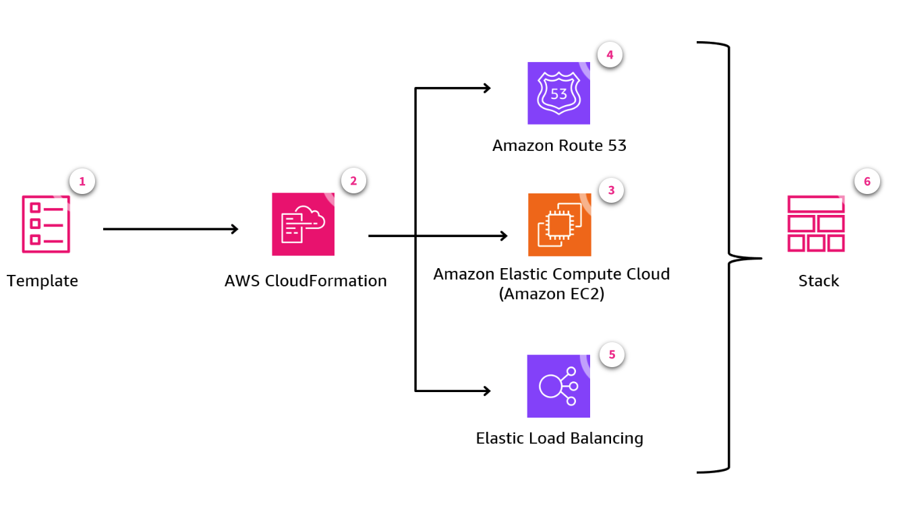
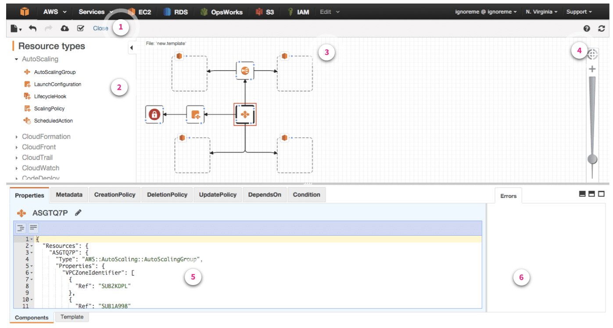

# Week 4: IaC: Building Templates in AWS CloudFormation

* back to AWS Cloud Institute repo's root [aci.md](../aci.md)
* back to [AWS Cloud Operations 2](./aws-cloud-operations-2.md)
* back to repo's main [README.md](../../../README.md)

## IaC: Building Templates in AWS CloudFormation

### Pre-assessment

#### What two programming languages can an AWS CloudFormation template be written in?

* JSON and YAML

Wrong answers:

* JSON and HashiCorp Configuration Language (HCL)
* Python and JSON
* Python and YAML

##### Explanation

The other options are incorrect because CloudFormation templates cannot be written in HCL or Python.

#### Which section in an AWS CloudFormation template is required for the template to function?

* Resources

Wrong answers:

* Conditions
* Rules
* Parameters

##### Explanation

The other options are incorrect because conditions, rules, and parameters are not required for a CloudFormation template.

#### What does an AWS CloudFormation template do?

* Defines the resources a developer needs to create, configure, and manage, such as Amazon Elastic Compute Cloud (Amazon EC2) instances, virtual private clouds (VPCs), security groups, load balancers, and more

Wrong answers/:

* Automatically scales AWS resources based on usage patterns
* Monitors and logs AWS resource performance and usage
* Enables serverless computing by deploying AWS Lambda functions

##### Explanation

The other options are incorrect because of the following reasons:

* **Automatically scales AWS resources based on usage patterns**: Describes the functionality of AWS Auto Scaling.
* **Monitors and logs AWS resource performance and usage**: Describes the functionality of Amazon CloudWatch.
* **Enables serverless computing by deploying AWS Lambda functions**: While AWS CloudFormation can deploy AWS Lambda functions, its primary purpose is to define and provision infrastructure resources in a declarative manner, not exclusively to enable serverless computing.

### Review of AWS CloudFormation

#### AWS CloudFormation review

AWS CloudFormation is a managed service that helps you model and deploy your AWS resources through automation. Without CloudFormation, you must individually create and manage each resource in your AWS environment. With CloudFormation, you submit one request to the AWS API to deploy your resources into your AWS environment. CloudFormation handles setting up and configuring each AWS resource that you specify.

To have CloudFormation deploy your AWS resources, provide it with a **CloudFormation template**. A template defines all your resources and their properties. CloudFormation uses your template to create a **CloudFormation stack**, which is a collection of the AWS resources CloudFormation creates on your behalf.

You can use CloudFormation to build applications with AWS products, such as the following, without creating or configuring the underlying infrastructure.

* Amazon Elastic Compute Cloud (Amazon EC2)
* Elastic Load Balancing (ELB)
* Amazon Route 53

The following CloudFormation workflow diagram shows how you submit a CloudFormation template to create a stack. You follow the same workflow when modifying existing stacks. To modify a stack, submit changes either as new input parameter values or by using an updated template.



1. **CloudFormation template**

    With CloudFormation, you declare all of your resources and dependencies in a template file. You can author your CloudFormation template with any code editor. You can check it into a version-control system, such as GitHub or Amazon CodeCatalyst. And you can review files before deploying. CloudFormation is available in all AWS Regions, and you pay only for the resources that you use.

2. **AWS CloudFormation

    CloudFormation is an API wrapper. When you create an Amazon EC2 instance in the AWS Management Console wizard, you initiate an API call to the Amazon EC2 service. The information that you enter in the wizard is passed as parameters. CloudFormation calls those same APIs. What you define in your CloudFormation template is organized as an API call to the service, just like the wizard. CloudFormation manages the dependencies and relationships.

3. **Amazon EC2**

    CloudFormation sends API requests to create your AWS resources on your behalf.

4. **Amazon Route 53**

    When you use AWS CloudFormation, you can reuse your template to set up your Route 53 and Route 53 Resolver resources. Describe your resources and then provision the same resources in multiple AWS accounts and Regions.

5. **Elastic Load Balancing**

    CloudFormation can utilize Elastic Load Balancing to automatically distributes incoming application traffic across instances.

6. **Stack**

    CloudFormation templates define a collection of resources as a single unit, called a stack. CloudFormation creates and deletes all member resources of the stack together and manages all dependencies between the resources for you.

### AWS CloudFormation Templates

#### CloudFormation templates

AWS CloudFormation templates offer a repeatable and consistent way to manage your AWS resources.

A CloudFormation template is a formatted JSON or YAML text file that is uploaded to the AWS Management Console and declares the AWS resources a developer wants to create and configure. To create a resource in a CloudFormation template, you declare an object as a name-value pair, or a pairing of a name with a set of child objects enclosed. A typical template has a hierarchical structure of objects, where the child objects provide the necessary configuration details.

#### Template anatomy

Your template file might contain different sections that specify the infrastructure configuration for your AWS instance. A template file has one required section and a number of optional sections.

The **Resources** section is required. The optional sections that you can include in your AWS CloudFormation template include the following:

* Format version (optional)
* Description (optional)
* Metadata (optional)
* Parameters (optional)
* Rules (optional)
* Mappings (optional)
* Conditions (optional)
* Transform (optional)
* Outputs (optional)

The following example shows part of a YAML-formatted template. Note that, in this example, the required **Resources** section is included after the optional **Transform** section.

```yaml
---
AWSTemplateFormatVersion: "version date" # 0

Description:                             # 1
  String

Metadata:                                # 2
  template metadata

Parameters:                              # 3
  set of parameters

Rules:                                   # 4
  set of rules

Mappings:                                # 5
  set of mappings

Conditions:                              # 6
  set of conditions

Transform:                               # 7
  set of transforms

Resources:                               # 8
  set of resources

Outputs:                                 # 9
  set of outputs
```

0. **Format version**

    Indicates the AWS CloudFormation template version that the template conforms to. The template format version isn't the same as the API or WSDL version. The template format version can change independently of the API and WSDL versions.

1. **Description**

    Describes the template in a text string. This section must always follow the template format version section.

2. **Metadata**

    Includes objects that provide additional information about the template.

3. **Parameters**

    Indicates values to pass to your template at runtime (when you create or update a stack). You can refer to parameters from the Resources and Outputs sections of the template.

4. **Rules**

    Validates a parameter or combination of parameters passed to a template during a stack creation or stack update.

5. **Mappings**

    Provides a mapping of keys and associated values that you can use to specify conditional parameter values, similar to a lookup table. You can match a key to a corresponding value by using the **Fn::FindInMap** intrinsic function in the Resources and Outputs sections.

6. **Conditions**

    Indicates conditions that control whether certain resources are created or certain resource properties are assigned a value during stack creation or updates. For example, you could conditionally create a resource that depends on whether the stack is for a production or test environment.

7. **Transform**

    For serverless applications (also referred to as *Lambda-based applications*), specifies the version of the AWS Serverless Application Model (AWS SAM) to use. When you specify a transform, you can use AWS SAM syntax to declare resources in your template. The model defines the syntax that you can use and how it's processed.

8. **Resources**

    Declares the stack resources and their properties, such as an Amazon Elastic Compute Cloud (Amazon EC2) instance or an Amazon Simple Storage Service (Amazon S3) bucket. You can refer to resources in the **Resources** and **Outputs** sections of the template.

9. **Outputs**

    Describes the values that are returned whenever you view your stack's properties. For example, you can declare an output for an S3 bucket name and then call the **aws cloudformation describe-stacks** AWS Command Line Interface (AWS CLI) command to view the name.

#### Template sections

Review the AWS product documentation for a [full explanation](https://docs.aws.amazon.com/AWSCloudFormation/latest/UserGuide/template-anatomy.html) of the sections that can be included in an AWS CloudFormation template. Here, we will look at the required **Resources** section, as well as the **Rules** and **Conditions** sections.

Sections in a template can be in any order. However, as you build your template, it can be helpful to use the logical order shown in the preceding list because values in one section might refer to values in a previous section.

#### Resources section

The required Resources section declares the AWS resources that you want to include in the stack, such as an EC2 instance or an Amazon S3 bucket.

You can see here that the section includes a "**Logical ID**", a "**Resource type**", and "**Properties**".

##### Resources section in JSON

```json
"Resources" : {
    "Logical ID of resource" : {
        "Type" : "Resource type",
        "Properties" : {
            Set of properties
        }
    }
}
```

##### Resources section in YAML

```yaml
Resources:
  Logical ID of resource:
    Type: Resource type
    Properties:
      Set of properties
```

#### Resource section example

```json
"Resources" : {
    "MyEC2Instance" : {
        "Type" : "AWS::EC2::Instance",
        "Properties" : {
            "ImageId" : "ami-00f8a91507f77f867"
        }
    }
}
```

1. **Logical ID**

    The logical ID must be alphanumeric (A–Z, a–z, and 0–9) and unique within the template. Use the logical name to reference the resource in other parts of the template. For example, if you want to map an Amazon Elastic Block Store (Amazon EBS) volume to an Amazon EC2 instance, you reference the logical IDs to associate the block stores with the instance.

    In this example, the Logical ID is "**MyEC2Instance**".

2. **Resource type**

    The resource type identifies the type of resource that you are declaring. For example, in this case, **AWS::EC2::Instance** declares an EC2 instance. For a list of all resource types, see [AWS resource and property types reference](https://docs.aws.amazon.com/AWSCloudFormation/latest/UserGuide/aws-template-resource-type-ref.html).

3. **Properties**

    Resource properties are additional options that you can specify for a resource. For example, for each EC2 instance, you must specify an Amazon Machine Image (AMI) ID for that instance.

    In this example, the AMI ID is declared as a property of the instance.

    If a resource doesn't require that the properties are declared, omit the **Properties** section for that resource.

The following block shows another example of a resource declaration. In this case, it defines two resources—the "**MyInstance**" resource includes the "**MyQueue**" resource as part of its "**UserData**" property.

```json
"Resources" : {
    "MyInstance" : {
        "Type" : "AWS::EC2::Instance",
        "Properties" : {
            "UserData:" : {
                "Fn::Base64" : {
                    "Fn::Join" : [ "", [ "Queue=", { "Ref" : "MyQueue" } ] ]
                } },
            "AvailabilityZone" : "us-east-1a",
            "ImageId" : "ami-00f8a91507f77f867"
        }
    },

    "MyQueue" : {
       "Type" : "AWS::SQS::Queue",
       "Properties" : {
       } 
    }
}
```

```yaml
Resources:
  MyInstance:
    Type: "AWS::EC2::Instance"
    Properties:
      UserData::
        "Fn::Base64":
          !Sub |
            Queue=${MyQueue}
      AvailabilityZone: "us-east-1a"
      ImageId: "ami-00f8a91507f77f867"
  MyQueue:
    Type: "AWS::SQS::Queue"
    Properties: {}
```

#### Rules section

Rules validate a parameter or a combination of parameters passed to a template during a stack creation or stack update. The **Rules** section *specifies the conditions under which certain resources should be created or updated*. This can be helpful when you need to ensure that certain conditions exist for the template to execute successfully. For example, you can add a rule to ensures that end users have specified a public subnet or have used smaller instance types for development and test (Dev/Test) environments.

To use template rules, explicitly declare **Rules** in your template followed by an assertion. Use the **Rules** section to validate parameter values before creating or updating resources.

##### YAML Rules Format

```yaml
Rules:
  Rule01:
    RuleCondition:
      rule-specific intrinsic function: Value01
    Assertions:
      - Assert:
          rule-specific intrinsic function: Value02
        AssertDescription: Information about this assert
      - Assert:
          rule-specific intrinsic function: Value03
        AssertDescription: Information about this assert
  Rule02:
    Assertions:
      - Assert:
          rule-specific intrinsic function: Value04
        AssertDescription: Information about this assert
```

##### JSON Rules Format

```json
{
    "Rules": {
        "Rule01": {
            "RuleCondition": {
                "rule-specific intrinsic function": "Value01"
            },
            "Assertions": [
                {
                    "Assert": {
                        "rule-specific intrinsic function": "Value02"
                    },
                    "AssertDescription": "Information about this assert"
                },
                {
                    "Assert": {
                        "rule-specific intrinsic function": "Value03"
                    },
                    "AssertDescription": "Information about this assert"
                }
            ]
        },
        "Rule02": {
            "Assertions": [
                {
                    "Assert": {
                        "rule-specific intrinsic function": "Value04"
                    },
                    "AssertDescription": "Information about this assert"
                }
            ]
        }
    }
}
```

#### Conditions section

Conditions are similar to rules, but they operate differently.

Whereas rules enforce that parameters have certain values, conditions are used to create certain CloudFormation entities, such as a resource, or an output, depending on whether a condition is true or false, such as whether a property of a resource has a certain value. Conditions are evaluated during deployment.

#### Difference between Rules and Conditions

##### Rules

*Rules* validate parameter values before creating the resources in the template. For example, you can add a rule to ensure that end users use smaller instance types for Dev/Test environments, as shown in the following YAML example.

```yaml
Rules:
  testInstanceType:
    RuleCondition: !Equals 
      - !Ref Environment
      - test
    Assertions:
      - Assert:
          'Fn::Contains':
            - - a1.medium
            - !Ref InstanceType
        AssertDescription: 'For a test environment, the instance type must be a1.medium'
  prodInstanceType:
    RuleCondition: !Equals 
      - !Ref Environment
      - prod
    Assertions:
      - Assert:
          'Fn::Contains':
            - - a1.large
            - !Ref InstanceType
        AssertDescription: 'For a production environment, the instance type must be a1.large'
```

##### Conditions

*Conditions* define the circumstances under which entities are created or configured.

For example, you might create a condition and then associate it with a resource or output so AWS CloudFormation only creates the resource or output if the condition is true.

Similarly, you can associate the condition with a property, so AWS CloudFormation only sets the property to a specific value if the condition is true. If the condition is false, AWS CloudFormation sets the property to a different value, which you specify.

Here's an example of a condition in YAML.

```yaml
MyAndCondition: !And
  - !Equals ["sg-mysggroup", !Ref "ASecurityGroup"]
  - !Condition SomeOtherCondition
```

#### Intrinsic functions

Intrinsic functions are built-in functions provided by CloudFormation that allow you to perform various operations in your template. These functions help you manage and manipulate values, reference other resources, and perform conditional logic. You can use intrinsic functions in your templates to assign values to properties that are not available until runtime.

Intrinsic functions in CloudFormation can be broadly categorized into two types — *intrinsic functions* and *condition intrinsic functions*.

* **Fn::GetAtt**

    Returns the value of an attribute from a resource in the template.

    The following example template returns the **SourceSecurityGroup.OwnerAlias** and **SourceSecurityGroup.GroupName** of the load balancer with the logical name **myELB**.

```yaml
AWSTemplateFormatVersion: 2010-09-09
Resources:
  myELB:
    Type: AWS::ElasticLoadBalancing::LoadBalancer
    Properties:
      AvailabilityZones:
        - eu-west-1a
      Listeners:
        - LoadBalancerPort: '80'
          InstancePort: '80'
          Protocol: HTTP
  myELBIngressGroup:
    Type: AWS::EC2::SecurityGroup
    Properties:
      GroupDescription: ELB ingress group
      SecurityGroupIngress:
        - IpProtocol: tcp
          FromPort: 80
          ToPort: 80
          SourceSecurityGroupOwnerId: !GetAtt myELB.SourceSecurityGroup.OwnerAlias
          SourceSecurityGroupName: !GetAtt myELB.SourceSecurityGroup.GroupName
```

* **Fn::Join**

    Joins a set of values into a single value, separated by a specified delimiter.

    The following example uses **Fn::Join** to construct a string value. It uses the **Ref** function with the **AWS::Partition** parameter and the **AWS::AccountId** pseudo parameter.

```yaml
!Join
  - ''
  - - 'arn:'
    - !Ref AWS::Partition
    - ':s3::elasticbeanstalk-*-'
    - !Ref AWS::AccountId
```

* **Fn::Select**

    Returns a single object from a list of objects by index.

    The following example returns "grapes".

```yaml
!Select [ "1", [ "apples", "grapes", "oranges", "mangoes" ] ] 
```

* **Fn::Split**

    Splits a string into a list of string values, based on a specified delimiter.

    The following example splits a string at each vertical bar (|). The function returns *["a", "b", "c"]*.

```yaml
!Split [ "|", "a|b|c" ] 
```

* **Fn::Sub**

    Substitutes variables in a string with their corresponding values.

    In this simple example, the InstanceSecurityGroup resource's description is dynamically created with the AWS::StackName pseudo parameter. For instance, if the stack name is "*VPC-EC2-ALB-Stack*", the resulting description is "*SSH security group for VPC-EC2-ALB-Stack*".

```yaml
InstanceSecurityGroup:
  Type: AWS::EC2::SecurityGroup
  Properties:
    GroupDescription: !Sub "SSH security group for ${AWS::StackName}"
```

* **Ref**

    Returns the value of a specified parameter or resource.

    This example demonstrates how to use the **Fn::Sub** intrinsic function to substitute values for the **Ref** function. The **Ref** and the **Fn::GetAtt** functions can then be used to reference the appropriate values, based on the input for the stage. **Fn::Sub** is first used to obtain the ARN of the appropriate Amazon Simple Notification Service (Amazon SNS)  topic to set the dimensions of the Amazon CloudWatch alarm. Next, **Fn::Join** is used with **Ref** to create the logical ID string of the **Stage** parameter.

```yaml
AWSTemplateFormatVersion: 2010-09-09
Transform: 'AWS::LanguageExtensions'
Parameters:
  Stage:
    Type: String
    Default: Dev
    AllowedValues:
      - Dev
      - Prod
Resources:
  TopicDev:
    Type: AWS::SNS::Topic
    Properties:
      TopicName: MyTopic
Outputs:
  stageOutput:
    Value: !Ref
      'Fn::Sub': 'Topic${Stage}'
```

**Note: You can use intrinsic functions only in specific parts of a template. Currently, you can use intrinsic functions in resource properties, outputs, metadata attributes, and update policy attributes. You can also use intrinsic functions to conditionally create stack resources.**

#### Condition intrinsic functions

Condition intrinsic functions are a specific type of intrinsic functions that allow you to define conditions and control the creation of resources based on those conditions. These functions help you create conditional logic within your CloudFormation templates.

Condition intrinsic functions define conditions based on logical comparisons or evaluations. For instance, the condition intrinsic function **Fn::If** would conditionally include or exclude resources based on whether a condition is true or false.

* **Fn::And**

    Returns true if all the specified conditions evaluate to **true**, or returns **false** if any one of the conditions evaluates to **false**. **Fn::And** acts as an AND operator. The minimum number of conditions that you can include is 2, and the maximum is 10.

    For example, say you want to create an S3 bucket with versioning enabled only if two conditions are met — the environment is production, and the AWS Region is us-west-2. Using the Fn::And function, you can do so.

    The following **MyAndCondition** evaluates to true if the referenced security group name is equal to * sg-mysggroup** and if **SomeOtherCondition** evaluates to true.

```json
"MyAndCondition": {
    "Fn::And": {
        { "Fn::Equals": [ "sg-mysggroup", { "Ref": "ASecurityGroup" } ] },
        { "Condition": "SomeOtherCondition" }
    }
}
```

* **Fn::Equals**

    Compares if two values are equal. Returns **true** if the two values are equal and **false** if they are not equal.

    For instance, suppose you want to create an EC2 instance with different instance types based on the environment (for example, development or production). In the development environment, you want to use a smaller instance type to save costs, while in the production environment, you want to use a larger instance type for better performance.

    In your CloudFormation template, you can define a parameter for the environment and use the **Fn::Equals** condition intrinsic function to check the value of the environment parameter. Based on the condition, you can specify different instance types for the EC2 instance.

    The following **UseProdCondition** condition evaluates to true if the value for the **EnvironmentType** parameter is equal to **prod**.

```json
"UseProdCondition": {
    "Fn::Equals": [
        { "Ref": "EnvironmentType" },
        "prod"
    ]
}
```

* **Fn::If**

    This function will conditionally include or exclude resources based on whether a condition evaluates to **true** or **false**.

    For instance, suppose you're deploying a web application using CloudFormation, and you want to create an Amazon Relational Database Service (Amazon RDS) database instance only if a specific parameter (for example, **CreateDatabase**) is set to **true**.

    The following snippet provides an automatic scaling update policy only if the **RollingUpdates** condition evaluates to true. If the condition evaluates to false, CloudFormation removes the **AutoScalingRollingUpdate** update policy.

```json
"UpdatePolicy": {
    "autoScalingRollingUpdate": {
        "Fn::If": [
            "RollingUpdates",
            {
                "MaxBatchSize": "2",
                "MinInstancesInService": "2",
                "PauseTime": "PT0M30S"
            },
            {
                "Ref": "AWS::NpValue"
            }
        ]
    }
}
```

* **Fn::Not*

    Returns **true** for a condition that evaluates to **false** or returns **false** for a condition that evaluates to **true**. Fn::Not acts as a NOT operator.

    For example, suppose you have a CloudFormation template that deploys an Amazon RDS database instance. You want to enable multi-AZ deployment (for high availability) for the production environment but not for the development environment. You can achieve this by using the **Fn::Not** function along with the **AWS::NoValue** pseudo parameter.

    The following **EnvCondition** condition evaluates to true if the value for the **EnvironmentType** parameter isn't equal to **prod**.

```json
"MyNotCondition": {
    "Fn::Not": [ {
        "Fn::Equals": [
            { "Ref": "EnvironmentType" },
            "prod"
        ]
    } ]
}
```

* **Fn::Or**

    Returns **true** if any one of the specified conditions evaluates to **true**, or returns **false** if all the conditions evaluate to **false**. **Fn::Or** acts as an OR operator. The minimum number of conditions that you can include is 2, and the maximum is 10.

    For instance, say you want to create an EC2 instance with different instance types based on the environment (for example, development or production) and the availability of a specific Amazon Machine Image (AMI). You can do so by using a **Fn::Or** function.

    The following **MyOrCondition** evaluates to true if the referenced security group name is equal to **sg-mysggroup** or if **SomeOtherCondition** evaluates to true.

```json
"MyCondition": {
    "Fn::Or": [
        { "Fn::Equals" : [ "sg-mysggroup", { "Ref" : "ASecurityGroup" } ] },
        { "Condition" : "SomeOtherCondition" }
    ]
}
```

#### Template macros

Macros are fully customizable tools that enable you to abstract, or pre-process, certain parts of your CloudFormation template into a macro, which can be called up in your code. After you submit your CloudFormation template, macros are called to transform portions of your template before CloudFormation actually starts provisioning resources.

Under the hood, macros are powered by AWS Lambda functions that you write. They should be functional components that take in some existing CloudFormation and output additional CloudFormation.

Macros can be used to perform simple actions, like find-and-replace operations, or extensive transformations of entire templates. Macros can speed up the process of creating CloudFormation templates by capturing common patterns or configurations that you use in your templates.

Template macros are useful in the following kinds of scenarios.

* **Simplifying complex templates**: If you have a large and complex template with repetitive sections, you can use macros to abstract and modularize those sections, making the template more readable and maintainable.
* **Stay consistent with best practices**: Macros can be used to enforce best practices in your organization. For example, you can create a macro that ensures all resources have appropriate tags or that certain resource configurations adhere to specific standards.
* **Improved re-usability**: Macros can help you create reusable template snippets or patterns that can be easily incorporated into multiple templates, reducing duplication and promoting consistency.

#### Macro example

Suppose you have a template that creates multiple EC2 instances with similar configurations. Instead of repeating the same resource block for each instance, you can create a macro that generates the instance resource based on a set of input parameters.

```yaml
# Macro definition
Resources:
  Macro:
    Type: AWS::CloudFormation::Macro
    Properties:
      Name: EC2InstanceMacro
      FunctionProvider:
        IncludeURL: !Sub 'https://s3.${AWS::Region}.amazonaws.com/my-bucket/macro.js'

# Template resources
Resources:
  Instance1:
    Type: AWS::EC2::Instance
    Properties:
      ImageId: ami-0123456789abc
      InstanceType: t2.micro
      AWS::CloudFormation::Macro:
        Name: EC2InstanceMacro
        Properties:
          InstanceName: Instance1
          SecurityGroupIds:
            - sg-0123456789abc

  Instance2:
    Type: AWS::EC2::Instance
    Properties:
      ImageId: ami-0123456789abc
      InstanceType: t2.micro
      AWS::CloudFormation::Macro:
        Name: EC2InstanceMacro
        Properties:
          InstanceName: Instance2
          SecurityGroupIds:
            - sg-0123456789abc
```

In this example, the **EC2InstanceMacro** is defined as a CloudFormation macro resource. The macro function is hosted in an S3 bucket and referenced using the **IncludeURL** property.

When creating the **Instance1** and **Instance2** resources, the macro is invoked with the specified properties (**InstanceName** and **SecurityGroupIds**). The macro function can then generate the appropriate resource configuration based on these properties, potentially adding additional tags, security group rules, or other configurations, as needed.

By using macros, you can abstract away the repetitive parts of the template, making it more concise and easier to maintain. Additionally, if you need to update the instance configuration in the future, you only need to modify the macro function, and all instances will inherit the changes automatically.

#### Creating macros

There are two steps to creating and using macros. First, define a macro, which you can do with a CloudFormation template. Second, to use the macro in a template, add it as a transform for the entire template or call it directly.

1. **Define the macro logic**

    Determine the functionality that you want your macro to perform. This could include tasks such as generating resource configurations, enforcing best practices, or integrating with external systems.

    Define the input parameters and output structure for your macro, specifying how it will interact with CloudFormation templates.

2. **Implement the macro as an AWS Lambda function**

    Write the logic for your macro using a programming language supported by AWS Lambda (Python, Node.js, or Java).

    Create an AWS Lambda function that captures your macro's logic. Make sure that the function handles the input parameters passed by CloudFormation and produces the expected output.

3. **Package and deploy the Lambda function**

    Package your Lambda function code along with any dependencies into a deployment package that can be uploaded to AWS Lambda using the AWS Management Console, AWS CLI, or SDKs.

    Configure the Lambda function settings, including the runtime environment, memory allocation, and execution role.

4. **Register the macro with CloudFormation**

    Once the Lambda function is deployed, register it as a CloudFormation macro using the AWS CloudFormation console, CLI, or SDKs.

    Provide a unique name for the macro, along with the Amazon Resource Name (ARN) of the Lambda function.

5. **Test the macro**

    Test your macro by applying it to CloudFormation templates and verifying that it produces the desired output.

    Ensure that the macro behaves as expected under various scenarios and input configurations.

6. **Use the macro in CloudFormation templates**

    Once the macro is registered, you can use it in your CloudFormation templates by referencing its name as a transform.

    Include the transform directive at the top level of your template, specifying the name of the macro to apply.

    Use the macro's input parameters in your template to customize its behavior as needed.

7. **Summary**

    To learn more about how to create a CloudFormation macro, refer to the [documentation](https://docs.aws.amazon.com/AWSCloudFormation/latest/UserGuide/macros-example.html).

#### Template modules

Modules are reusable, self-contained collections of CloudFormation building blocks that can be reused across multiple CloudFormation templates. They are used just like other CloudFormation resources. Modules are essentially nested stacks that can be referenced and included in other templates, promoting code reuse and modularization.

Modules can encapsulate common service configurations and best practices as modular building blocks for your stack templates. Modules enable you to include resource configurations that incorporate best practices, expert domain knowledge, and best practices for an organization in your templates.

These building blocks can be for a single resource, like best practices for defining an Amazon Elastic Compute Cloud (Amazon EC2) instance, or they can be for multiple resources, to define common patterns of application architecture.

##### CloudFormation Module in YAML

A CloudFormation module provisions an EC2 instance and an S3 bucket.

```yaml
# Module: EC2-S3-Module.yaml

Parameters:
  InstanceType:
    Type: String
    Default: t2.micro
    Description: EC2 instance type

Resources:
  EC2Instance:
    Type: AWS::EC2::Instance
    Properties:
      ImageId: ami-0cff7528ff583bf9a
      InstanceType: !Ref InstanceType
      Tags:
        - Key: Name
          Value: MyEC2Instance

  S3Bucket:
    Type: AWS::S3::Bucket
    Properties:
      BucketName: !Sub 'my-bucket-${AWS::AccountId}'

Outputs:
  InstanceId:
    Description: The instance ID
    Value: !Ref EC2Instance
    Export:
      Name: InstanceId

  BucketName:
    Description: The name of the S3 bucket
    Value: !Ref S3Bucket
    Export:
      Name: BucketName
```

##### Module Placed into CloudFormation Template In YAML

To use the module in a CloudFormation template, use the !Ref or !GetAtt functions.

```yaml
# Main CloudFormation template

Resources:
  MyModule:
    Type: AWS::CloudFormation::Stack
    Properties:
      TemplateURL: https://s3.amazonaws.com/my-bucket/EC2-S3-Module.yaml
      Parameters:
        InstanceType: t2.small

Outputs:
  InstanceId:
    Description: The instance ID from the module
    Value: !GetAtt MyModule.Outputs.InstanceId
    Export:
      Name: ModuleInstanceId

  BucketName:
    Description: The bucket name from the module
    Value: !GetAtt MyModule.Outputs.BucketName
    Export:
      Name: ModuleBucketName
```

CloudFormation modules are available in the CloudFormation registry, so you can use them just like a built-in resource. A module with a resource type is *postfixed* in the CloudFormation registry with *::MODULE*, so it’s easy to denote when you are using a module or a registry resource. Parameters that are defined in the CloudFormation module become properties when consuming the *::MODULE* resource type. When you use a CloudFormation module, the module template is expanded into the consuming template, which makes it possible for you to access the resources inside the module using a *Ref* or *Fn::GetAtt*.

To learn more about creating modules, refer to [this guide](https://docs.aws.amazon.com/AWSCloudFormation/latest/UserGuide/modules.html) in the CloudFormation documentation.

#### Difference between modules and macros

* **Purpose**: Macros are used for custom processing and transformation of CloudFormation templates, while modules are used for code reuse and modularization of CloudFormation resources.
* **Implementation**: Macros are implemented as AWS Lambda functions, while modules are separate CloudFormation templates.
* **Execution Time**: Macros are executed during the template processing phase, before the stack is created or updated, while modules are deployed as separate nested stacks during the stack creation or update process.
* **Use Cases**: Macros are useful for performing complex logic, validations, or transformations on templates, while modules are useful for encapsulating and reusing common infrastructure patterns or application stacks.

Both macros and modules can be used together in CloudFormation to achieve different goals, such as modularizing resources and performing custom processing on templates.

### AWS CloudFormation Designer

AWS CloudFormation Designer is a graphical tool that allows you to create and modify your CloudFormation templates visually. CloudFormation Designer gives you a visual representation of your infrastructure as code templates, allowing you to better understand and manage complex architectures. You can also use it to confirm that the infrastructure architecture in your CloudFormation template code is doing what you expect it to.

* **Export and import**

    You can export CloudFormation templates from the Designer in JSON format, which can then be used for deployment using AWS CloudFormation CLI, SDKs, or AWS Management Console. Similarly, you can import existing templates into the Designer for visualization and editing.

* **Real-time editing**

    You can edit your CloudFormation templates directly in the Designer interface. Changes made to the template are reflected in real time on the visual canvas, allowing users to see the impact of their changes immediately.

* **Template validation**

    The Designer includes built-in validation capabilities to ensure that the CloudFormation templates adhere to AWS CloudFormation syntax and resource specifications. It helps you identify and fix errors in their templates before deploying them.

* **Visual representation**

    CloudFormation Designer provides a visual canvas where you can drag and drop AWS resource types to create a visual representation of their infrastructure. This makes it easier to understand the relationships between resources and the overall architecture of the application.

The interface for CloudFormation Designer is shown in the following image.



1. **Toolbar**

    The toolbar provides quick access to commands for common actions, such as opening and saving templates, undoing or redoing changes, creating a stack, and validating your template. You can also download the diagram as an image, get help, or refresh the diagram in the canvas pane.

2. **Resource types paneI**

    The Resource types panel lists all the template resources that you can add to your template, categorized by their AWS service name. You add resources by dragging them from the Resource types panel to the canvas.

3. **Canvas pane**
    The Canvas pane displays your template resources as a diagram. You use it to add or remove resources, create relationships between resources, and arrange their layout. The changes that you make in the canvas automatically modify the template's JSON or YAML file.

4. **Fit to window button**

    The Fit to window button resizes the canvas to fit your template's diagram.

5. **Integrated JSON and YAML editor pane**

    In the integrated editor, you specify the details of your template, such as resource properties or template parameters. When you select an item in the canvas, Designer highlights the related JSON or YAML in the editor. After editing the JSON or YAML, you must refresh the canvas to update the diagram.

    You can convert a valid template between JSON and YAML by selecting the appropriate radio button in Choose template language.

6. **Messages pane**

    When you convert a template from JSON to YAML or vice versa, the Messages pane displays a success or failure message. When you open, validate, or attempt to create a stack with an invalid template, the Messages pane displays validation errors.

### [Lab 3: Implementing AWS CloudFormation Intrinsic Functions and Keywords](./labs/W044Lab3CloudFormationIntristicFunctions_files/)

In this lab, you will work with an existing AWS CloudFormation template that has been stripped of its intrinsic functions, conditions, and rules. The template includes comments and instructions guiding you on how to complete the missing elements. By filling in the necessary CloudFormation utilities, you will develop your understanding of these advanced features.

In this lab, you will perform the following tasks:

* Use the *Ref* function to retrieve and reference resource properties
* Apply the *Fn::GetAtt* function to retrieve and use attribute values of resources
* Implement conditional logic using the *Fn::If*, Fn::Equals and Fn::Not functions to determine resource provisioning
* Demonstrate the ability to create a complete CloudFormation stack by filling in the missing elements in the provided template
* Validate the successful deployment of the CloudFormation stack and its provisioned resources
* Properly delete the CloudFormation stack and its resources, reinforcing the importance of infrastructure management best practices

### Knowledge Check

#### A company is building an AWS CloudFormation template that includes a resource with multiple properties. They want to reference the same parameter value in multiple properties to avoid duplication. Which template feature should they use?

* Template macros

Wrong answers:

* Mappings
* Output references
* Intrinsic functions

##### Explanation

Template macros allow you to define reusable snippets that can be included across your template. This avoids duplicating the same parameter references.

The other options are incorrect because of the following reasons:

* Mappings allow you to map keys to values, but they don't reduce duplication of parameter references.
* You can't reference an Output value in the Resources section of a template.
* Intrinsic functions by themselves don't reduce duplication of parameter references.

#### Which statement about CloudFormation templates is correct?

* CloudFormation templates can be used to provision and manage resources across multiple AWS accounts and Regions.

Wrong answers:

* CloudFormation templates can only be written in JSON format.
* CloudFormation templates cannot reference other templates or resources.
* The required sections for a CloudFormation template are Rules and Conditions.

##### Explanation

The other options are incorrect because of the following reasons:

* CloudFormation templates can be written in JSON and YAML formats.
* CloudFormation templates can reference other templates or resources using the !Ref and !GetAtt functions.
* CloudFormation templates do not require a Conditions section.

#### Which intrinsic function in AWS CloudFormation is used to return a value based on a condition?

* !If

Wrong answers:

* !Join
* !Base64
* !Ref

##### Explanation

The *!If* intrinsic function in AWS CloudFormation is used to return one value if a specified condition evaluates to true, and a different value if the condition evaluates to false.

The other options are incorrect because of the following reasons:

* !Ref is used to retrieve the value of a resource or parameter from the CloudFormation template.
* !Base64 is used to encode or decode a string into Base64 format.
* !Join is used to concatenate a set of values into a single string, separated by a specified delimiter.

#### In AWS CloudFormation, what is the difference between Rules and Conditions?

* Rules define the circumstances under which resources are created or updated, while Conditions specify the criteria for evaluating the Rules.

Wrong answers:

* Rules are used to define the order in which resources are created or updated, while Conditions determine whether a resource should be created or not.
* Rules are used to define the relationships between resources, while Conditions specify the criteria for evaluating the Rules.
* Rules and Conditions are interchangeable terms in AWS CloudFormation, and they serve the same purpose.

##### Explanation

The other options are incorrect because:

* Conditions are used to determine whether certain resources are created or configured, not for evaluating rules.
* Rules in CloudFormation do not define relationships between resources.
* Rules and Conditions are not interchangeable; they serve distinct purposes in CloudFormation templates.

### Summary

#### General review of AWS CloudFormation

AWS CloudFormation is a managed service that helps you model and deploy your AWS resources through automation. CloudFormation requires templates that can be written in either JSON or YAML. The resources section is required for a CloudFormation template to function.

#### AWS CloudFormation templates

* Template anatomy and sections that can be included in a CloudFormation template.
* How Rules and Conditions are used in CloudFormation templates and the differences between them.
* Differences between intrinsic functions and condition intrinsic functions, and how they are used in CloudFormation.
* Template macros, including what they do and how to use them in CloudFormation templates.
* Template modules, including what they are, what they do, and how to use in them in CloudFormation templates.
* CloudFormation Designer, including what it is and how it can help in the creation of CloudFormation templates.
