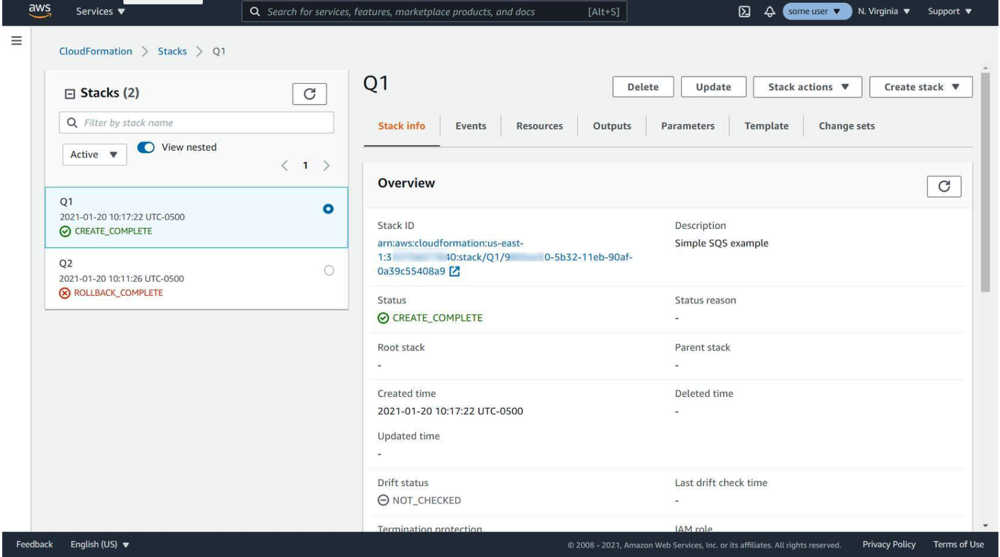
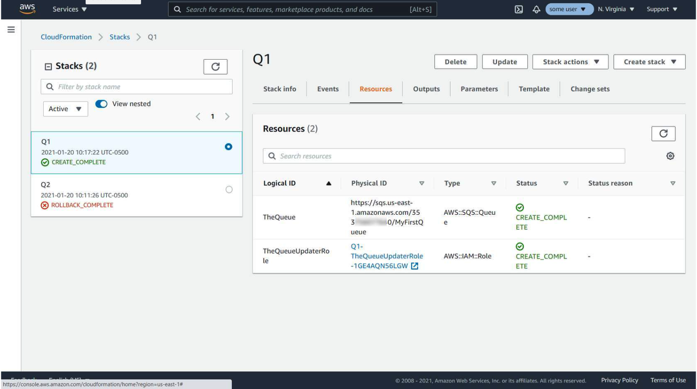
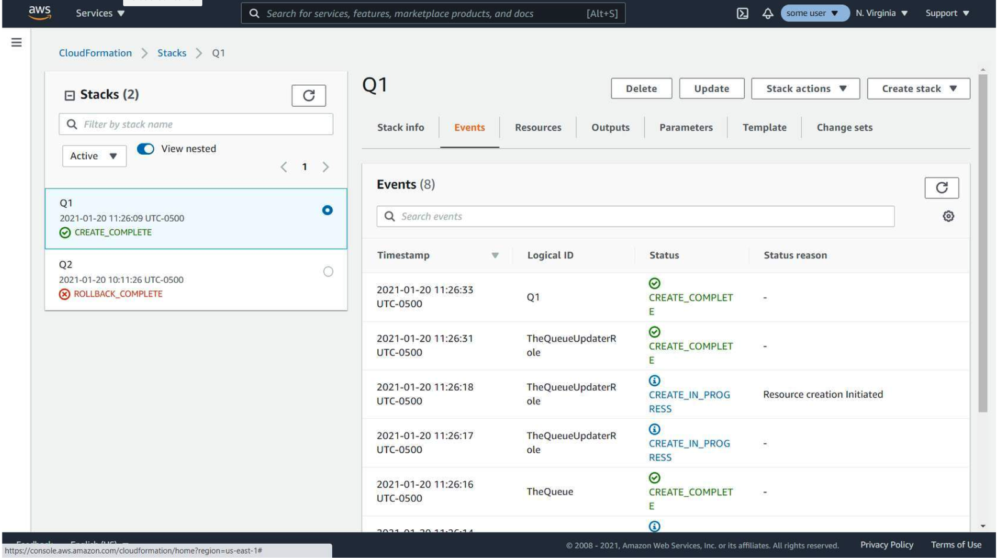
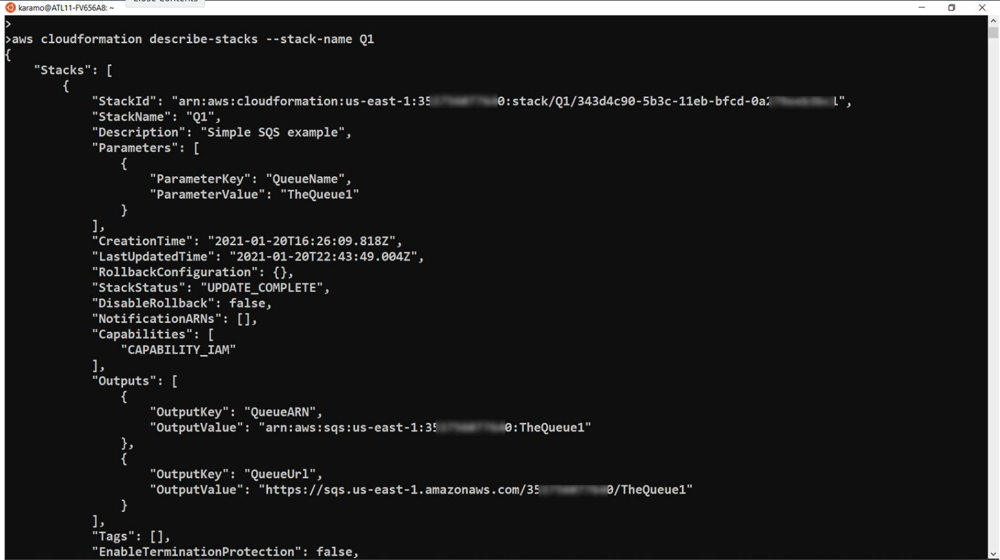
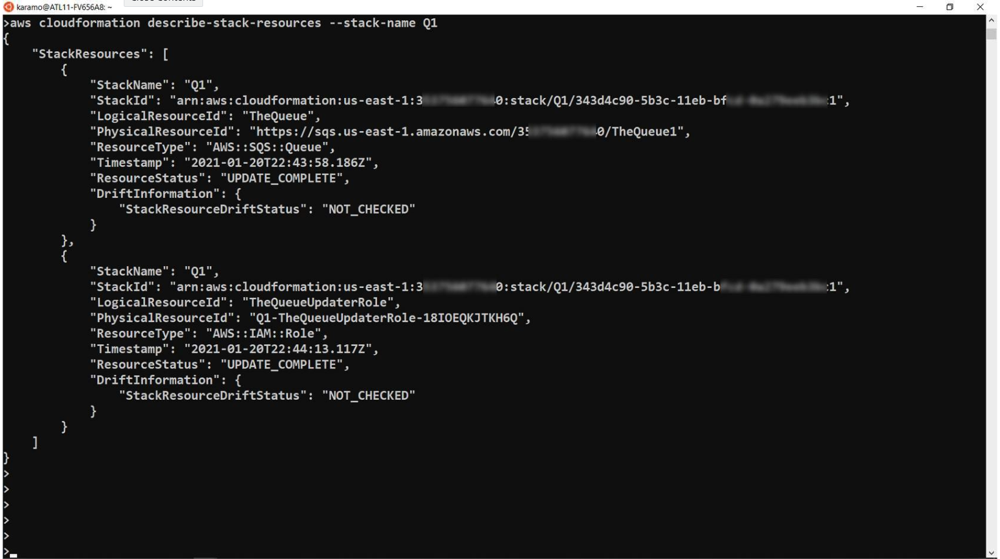
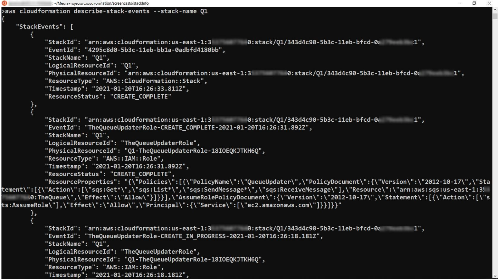
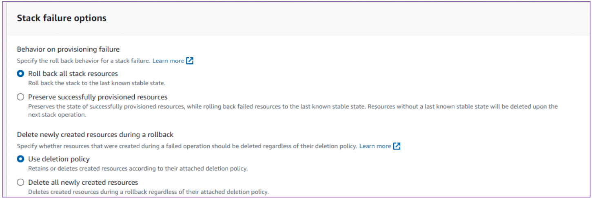
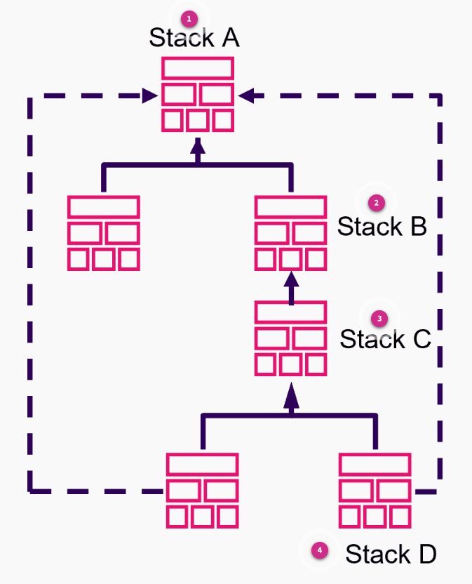
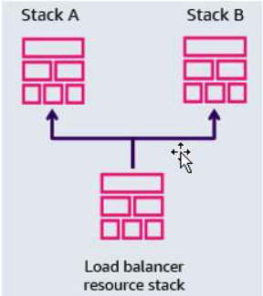

# Week 5: IaC: Working with AWS CloudFormation Stacks

* back to AWS Cloud Institute repo's root [aci.md](../aci.md)
* back to [AWS Cloud Operations 2](./aws-cloud-operations-2.md)
* back to repo's main [README.md](../../../README.md)

## IaC: Working with AWS Cloud Formation Stacks

### Pre-assessment

#### In AWS CloudFormation what is the definition of a stack?

* A stack is a collection of AWS resources that is managed, updated, and deployed as a single unit.

Wrong answers:

* A stack is a set of code used to build a single resource within the AWS cloud.
* A stack is a single AWS resources managed and updated through the AWS Command Line Interface (AWS CLI).
* A stack is a collection of YAML or JSON documents used to build an Amazon Elastic Compute Cloud (Amazon EC2) resource.

##### Explanation

The other options are incorrect because a stack is multiple resources, built using templates written in JSON or YAML and then deployed using CloudFormation.

#### What is the definition of stack drift?

* When AWS CloudFormation deployed resources are modified outside of CloudFormation

Wrong answers:

* When AWS Management Console deployed resources are modified by the AWS Command Line Interface (AWS CLI)
* The incremental changes to deployed resources over time
* The ability to modify AWS resources using a drift tool

##### Explanation

The other options are incorrect because drift occurs when changes are made outside of modifying the stack, whether the changes are made through the AWS CLI, AWS Management Console, incremental or full. All changes to stack deployed resources must be made through CloudFormation.

#### What is the default setting for a stack that fails to deploy?

* Rollback the entire stack upon failure

Wrong answers:

* Rollback only the failed resource upon failure
* Deploy all resources that didn't fail
* Deploy only the resources before the failure

##### Explanation

By default, the stack is set to roll back upon failure and all successfully deployed resources, in addition to the failed resources, are removed.

The other options are incorrect. Although the default behavior can be changed to keep successfully deployed resources, the other options are incorrect because they are not available by default.

### Building stacks

An AWS CloudFormation stack is a collection of Amazon Web Services (AWS) resources that you manage, update, and deploy as a single unit. The stack is built using a CloudFormation template written in either JSON or YAML. Stacks group resources together, so you can quickly build repeatable architectures across your AWS Regions, accounts, and Availability Zones. If your business grows or expands, you can use your stacks to duplicate your environment in different areas. You can also use your stacks for development, quality assurance (QA), or staging environments.

#### CloudFormation Template Example

```yaml
---
AWSTemplateFormatVersion: "2010-09-09"
Description: "Simple budget example"
Parameters:
  Email:
    Type: String
    Default: email@example.com
    Description: Please enter the email address to which budget notifications should be addressed.
Resources:
  BudgetExample:
    Type: "AWS::Budgets::Budget"
    Properties:
      Budget:
        BudgetLimit:
          Amount: 10
          Unit: USD
        TimeUnit: MONTHLY
        BudgetType: COST
      NotificationsWithSubscribers:
        - Notification:
            NotificationType: ACTUAL
            ComparisonOperator: GREATER_THAN
            Threshold: 99
          Subscribers:
            - SubscriptionType: EMAIL
              Address: !Ref Email
        - Notification:
            NotificationType: ACTUAL
            ComparisonOperator: GREATER_THAN
            Threshold: 80
          Subscribers:
          - SubscriptionType: EMAIL
            Address: !Ref Email
Outputs:
  BudgetId:
    Value: !Ref BudgetExample
```

### Creating a stack

1. **Open the AWS Management Console**

    

    Open the AWS Management Console and search for CloudFormation on the services search bar. Choose **CloudFormation**.

    When working with stacks, make sure you log into the correct AWS account and are viewing the Region where the stacks were created.

2. **Create the stack**

    

    In the CloudFormation section, choose **Create stack**.

3. **Specify the template**

    

    You can provide your own template, use a sample template, or use the template designer, which is a graphical interface for creating templates.

    If you are providing the template, you can specify an Amazon Simple Storage Service (Amazon S3) location or upload it from your computer.

4. **Specify details – Name and parameters**

    

    You need to provide a unique name for your stack (stacks in different accounts or different Regions can have the same name, but not in the same account and Region).

    If your template has any parameters, you can specify them here.

5. **Configure more options**

    

    On the next screen, you can configure more options.

    You can add tags to your stack to make it more convenient to group and manage them.

    You can specify whether you want a special AWS Identity and Access Management (IAM) role for CloudFormation to use to operate on the stack.

    You can specify other advanced options, like enhanced protection with a stack policy, rollback and notification options, and other creation options.

6. **Review and confirm**

    

    The console will display all options that will be used for your stack, so you can review and verify they are all as intended.

    Choosing **Create stack** will initiate the stack creation.

7. **Stack list and events**

    

    While the stack is being created, you can see a list of events updating as new resources are created. The other tabs have different information about your stack.

    Eventually, your stack and all its resources should be in **CREATE_COMPLETE** state.

8. **Stack creation using the AWS Command Line Interface**

    

    If you have the AWS CLI installed and configured, you can create a stack using the CloudFormation create-stack command.

    To do this, you need both the stack name and the template, which is either stored as a local file or in a Amazon S3 bucket.

    You can use the CloudFormation describe-stacks command to obtain basic information about your stack.

### Define Stackset

If a stack is a group of resources deployed from a template in a single location, a stackset uses this one template to deploy stacks across different accounts and Regions. Stacksets expand the capability of stacks so you can create, update, or delete stacks across multiple accounts and Regions with a single operation.

You create a Stackset from within an administrator account. You can create and manage an AWS CloudFormation template to use for provisioning stacks into selected target accounts across specified Regions.


The image shows a single template in an administrative account. The template is then used to deploy identical stacks within different Regions and different accounts.

### Modifying stacks

There are a number of ways to manage stacks, such as using the AWS Management Console, AWS CLI, or CloudFormation APIs. When modifying resources and properties built using a stack template, you must modify the stack's template and not the running resources. If you make changes to individual resources, you run the risk of stack drift.

#### Building change sets

The best way to update resources within your stacks or stack sets, is to use a change set. A change set is a summary of the proposed changes that you are attempting to make. Change sets show you how proposed changes to a stack might affect your running resources before implementing them.

For example, using change sets can verify whether your changes accidentally delete or replace any critical resources, like IP address ranges, security group settings, or Amazon Elastic Compute Cloud (Amazon EC2) instance types. CloudFormation makes the changes to your stack only after you decide to implement the change set. This gives you the opportunity to adjust your proposed changes and verify everything is in working order prior to implementing the changes.

To create a change set for a running stack, you submit the changes that you want to make by providing a modified template, new input parameter values, or both. CloudFormation generates a change set by comparing your stack with the changes you submitted. You can either modify a template before creating the change set or during change set creation.

Change sets are created from a variety of sources—from modifying a stack template directly in the CloudFormation console, using a modified template stored in Amazon S3 or locally on your computer, or from the AWS Application Composer.


1. **Create change set**

    Create a change set by submitting changes for the stack that you want to update. You can submit a modified stack template or modified input parameter values. CloudFormation compares your stack with the changes that you submitted to generate the change set; it doesn't make changes to your stack at this point.

2. **View change set**

    View the change set to see which stack settings and resources will change. For example, you can see which resources CloudFormation will add, modify, or delete. Additionally, you can see a before-and-after comparison of the resource properties and attributes, such as tags, that CloudFormation will modify.

3. **Optional: Create additional change sets**

    Optional: If you want to consider other changes before you decide which changes to make, create additional change sets. Creating multiple change sets helps you understand and evaluate how different changes will affect your resources and properties. You can create as many change sets as you need.

4. **Implement change set**

    Implement the change set that contains the changes that you want to apply to your stack. CloudFormation updates your stack with those changes.

* [For more information on building, viewing, and modifying change sets.](https://docs.aws.amazon.com/AWSCloudFormation/latest/UserGuide/using-cfn-updating-stacks-changesets-create.html)

#### Change set example

Here's an example of updating an Amazon EC2 instance using a change set.

1. **Prepare the CloudFormation stack**

    

    The stack consists of an EC2 instance with an instance type of t2.medium. The template shown in the image is from the previous lesson. For this walkthrough, the change set consists of updating the EC2 instance to t2.large.

2. **Create the change set**

    

    To start, choose the **Stack actions** dropdown list, and then choose **Create change set for current stack**.

3. **Submit the updated template**

    

    The image shows CloudFormation Designer. The update changes the InstanceType value to t2.large. With the updated template complete, you can create the change set.

4. **Review impact of the change set**

    

    CloudFormation shows the creation of the change set and lists the intended change. The current EC2 instance is set to be modified. The console shows two options: **Delete change set** or **Execute change set**.

5. **Confirm update behaviors**

    

    After you choose **Execute change set**, you have options for what you want to happen if the provisioning fails. For this walkthrough, the default option is selected, and **Execute change set** is chosen again.

6. **Confirm updated stack status**

    

    This image shows the intended update completed successfully. The EC2 instance now has an instance type of t2.large.

Creating templates, stacks, and change sets are part of maintaining an automated infrastructure as code (IaC) environment. Change sets can be reviewed by others, ensuring that changes to your system have been vetted by multiple developers. By deploying and managing IaC, rather than only through the console or command line, you increase the stability and maintainability of your applications.

## Remediating Stack Drift

Individual resources, created by the stack, can still be modified outside of the stack. Any well-meaning administrator with permissions to resources can modify these resources accidentally or intentionally. When changes occur outside of the stack, it complicates the stack update or deletion operations and inhibits your ability to manage a standardized, repeatable infrastructure. In this lesson, you will learn about what happens when your stacks are modified outside of CloudFormation and best practices to avoid this scenario.

### Defining stack drift

Stack drift is when your CloudFormation deployed resources are modified outside of CloudFormation. When this happens, your deployed stack drifts away from the actual property values in your intended configuration. These changes could be as basic as checkbox being unchecked or as complicated as the deletion of an EC2 instance. A stack is considered to have drifted if one or more of its resources have drifted. A resource is considered drifted if it changes without using the proper CloudFormation management, potentially by a direct change on behalf of a user.

If there is a drift, the **Drift status** of the stack is listed as **DRIFTED**.

#### Identifying stack drift

To determine whether a resource has drifted, CloudFormation identified the expected resource property values, as defined in the stack template and any values specified as template parameters. It then compares those expected values with the actual values of the resource properties as they currently exist in the stack. CloudFormation generates detailed information on each resource in the stack that has drifted.

CloudFormation detects drift on those AWS resources that support drift detection. Resources that don't support drift detection are assigned a drift status of **NOT_CHECKED**. To view a list of AWS resources that support drift detection, see [Resource Type Support](https://docs.aws.amazon.com/AWSCloudFormation/latest/UserGuide/resource-import-supported-resources.html).

The **Detect drift** Stack action is used to determine if the stack has any unapproved modifications.

* Stack actions
  * Detect drift

#### Permissions required

To successfully perform drift detection on a stack, a user must have the following permissions:

* **Read permission** for each resource that supports drift detection included in the stack.
  * For example, if the stack includes an AWS::EC2::Instance resource, you must have ec2:DescribeInstances permission to perform drift detection on the stack.
* cloudformation:DetectStackDrift
* cloudformation:DetectStackResourceDrift
* cloudformation:BatchDescribeTypeConfigurations

#### Drift detection status codes

There are various status types used with drift detection and operations. Below are two of the common status types:

* **Drift detection operation** status describes the current state of the drift operation.
* **Drift status**: Resource drift status describes the drift status of an individual resource.
  * For stack sets, this describes the drift status of the stack set as a whole, based on the drift status of the stack instances that belong to it.
  * For stack instances, this describes the drift status of the stack instance, based on the drift status of its associated stack.
  * For stacks, this describes the drift status of the stack as a whole, based on the drift status of its resources.

The following table lists the status codes CloudFormation assigns to stack drift detection operations.

| Drift detection operation status | Description |
| -------------------------------- | ----------- |
| **DETECTION_COMPLETE** | The stack drift detection operation has successfully completed for all resources in the stack that support drift detection. |
| **DETECTION_FAILED** | The stack drift detection operation has failed for at least one resource in the stack. Results will be available for resources on which CloudFormation successfully completed drift detection. |
| DETECTION_IN_PROGRESS | The stack drift detection operation is currently in progress. |

For more information on drift status codes and descriptions, see [Drift Detection Status Codes](https://docs.aws.amazon.com/AWSCloudFormation/latest/UserGuide/using-cfn-stack-drift.html).

### Resolving drift

Resolution of your stack drift depends on whether you want to keep the changes that were made to the stack.

The AWS best practice is to update your stack using the original templates. You modify the original templates to match the values that you want in your stack. Using these updated templates, you run an update that changes the values in the stack. Now the values in your stack match the values that were manually changed. Because the values were deployed using CloudFormation, the stack no longer displays as drifted. Optionally, to remove any manual changes, update your deployed stack using your original templates that contain all your original configurations.

### Resolving drift with an import operation

If you want to retain the changed resource, another option is using the resource import feature to update the resource. This resolves the stack drift results without replacing the modified resource or value. Resolving drift by using an import operation consists of the following steps:

1. Add a **DeletionPolicy** attribute, set to **Retain**, to the resource.
 a. This ensures the existing resource is retained rather than deleted when it's removed from the stack.
2. Remove the resource from the template and run a stack update operation.
 a. This removes the resource from the stack, but doesn't delete it.
3. Describe the resource’s actual state in the stack template, and then import the existing resource back into the stack.
 a. This adds the resource back into the stack and resolves the property differences that were causing the drift results.

* [**Resolve Drift with an Import Operation Using the CloudFormation Console**](https://docs.aws.amazon.com/AWSCloudFormation/latest/UserGuide/resource-import-resolve-drift.html#resource-import-resolve-drift-console-step-01-update-stack)

### Importing existing resources

Import is also useful if you created an AWS resource manually and now want that resource added to your stack. You can bring this existing resource into CloudFormation management using a resource import.

Using the AWS CloudFormation IaC generator, you can generate a template using AWS resources already provisioned in your account. These would be resources that are not currently managed by CloudFormation. Maybe they were built prior to using CloudFormation or they were manually added and now need to be part of your stack for business or disaster-recovery testing. You generate a template using the IaC generator and then use the template to import resources into CloudFormation or replicate resources in a new account or Region.

The IaC generation process consists of several steps:

1. Start a scan of your account.
2. Create a template, either from scratch or by using the template of an existing stack as a starting point.
3. Add scanned resources and related resources to the template using the add resources wizard.
4. Import the resources to be managed by CloudFormation as a stack or migrate them into an AWS CDK app.

The IaC generator feature is available in all commercial Regions and supports many common AWS resource types.

* [**Generating Templates for Existing Resources**](https://docs.aws.amazon.com/AWSCloudFormation/latest/UserGuide/generate-IaC.html)

### Exporting stack output values

Just as with importing a value into your stack, if you have resources that you want to share with another stack, you can export a stack's output values.

#### Exporting Values from a Stack

Imagine you have a CloudFormation stack that sets up your network, including things like subnets (sections of your network) and security groups (sets of firewall rules). You can set this stack to export details like subnet IDs and security group IDs.

Exporting these details means that this stack provides these IDs in a way that other stacks can conveniently access them. Think of it as this stack holding up a sign with this information that other stacks can read.

#### Importing Values into Another Stack

Now, let's say you have another stack that is responsible for setting up a web server. This web server needs to know where in the network it should exist (which subnet) and which security rules it should follow (which security group).

Instead of manually typing these IDs into your web server stack, you can set this stack to import the values from the first stack. This means the web server stack reads the information from the sign that the first stack is holding up.

#### Benefits

* **Simplicity and ease of management**: You don’t have to manually keep track of IDs or input them every time you set up a new resource. This reduces errors and saves time.
* **Automatic updates**: If the network settings in the first stack change, the web server stack automatically gets the updated information. You don’t need to do anything extra.
* **Clean organization**: This method keeps your resource setups clean and organized. Each stack has its own job, but can communicate necessary information with other stacks effortlessly.
* Using this export and import feature helps ensure that all parts of your AWS environment are consistently using the correct settings without manual intervention, making your overall cloud infrastructure more robust and easier to manage.

**Note: If another stack imports your exported output value, you cannot delete the original stack that is exporting the output value. You also cannot modify the exported output value. All the imports must be removed before you can delete the exporting stack or modify the output value.**

CloudFormation drift detection works only on the main stack and not on nested stacks.

## Encountering Stack Failures

According to AWS Chief Technology Officer (CTO) Werner Vogels, understanding that resources, systems, and processes eventually fail helps AWS builders plan and prepare for failures.

Working with and preparing for failures in your CloudFormation stacks is the same process as planning for failures in other AWS services. Not every template you try to deploy will work. The error could stem from an extra comma in a line, or a misspelled value in the template. Eventually, one of your stacks will fail to deploy and you need to know how to fix it when it does.

### Watching the stack build

During stack deployment, the majority of deployment time is used for CloudFormation creating, configuring, and running consistency checks against the resources created by the stack. When a resource starts its creation process, the AWS Management Console displays the status **CREATE_IN_PROGRESS**. This column identifies where you are in the stack build.

After the resource is created and configured as specified, and the configuration matches what is specified in the template, the status of **CREATE_COMPLETE** is shown.

### Identifying failure information

If CloudFormation fails to create, update, or delete your stack, you can view error messages or logs to help you learn more about the issue. The following screenshots show the types of information available for troubleshooting a CloudFormation issue when using the AWS Management Console.

#### Stack Info

The Stack info tab shows basic information about each stack: stack ID, status, description, and when it was last created, deleted, or updated.



#### Resources

The Resources tab shows information about all the resources grouped by this stack. You can view many of the resources through links to the AWS Management Console. 



#### Events

The Events tab shows all the events that have been generated for the stack, with their timestamp. This is very useful when trying to figure out what exactly is happening if something goes wrong.



The AWS CloudFormation console will also show you other information about your stack. This includes stack outputs, the template that was used and its parameters, and any change sets.

### Locating stack errors via the AWS CLI

The AWS CLI allows you to view detailed information about your CloudFormation stacks. The following commands are useful and take a stack name as an argument using the --stack-name option.

#### describe-stacks

This AWS CLI command shows the basic information about the stack, similar to the Stack info tab in the AWS Management Console.

The command is: **aws cloudformation describe-stacks --stack-name <stack-name>**



#### describe-stack-resources

This command shows information about the resources belonging to a stack, similar to the Resources tab in the AWS Management Console.

The command is: **describe-stack-resources**



#### describe-stack-events

This command shows information about all the events generated for a stack, in reverse chronological order, similar to the Events tab in the AWS Management Console.

The command is: **describe-stack-events**.



### Selecting stack failure options

If the stack fails to deploy, the automatic behavior is to do a rollback.

A *rollback* is when any defined resources in your stack are removed, deleted, or rolled back to their original state. If the stack is a new stack, the rolled-back resource's original state is that they didn't exist, so those resources are deleted. If you are updating a stack that was already there, then the stack rolls back to its state prior to the failed update.

By default, the stack is set to roll back upon failure. You might need to change this behavior so that resources aren't deleted when they don't deploy properly. Failed resources often contain log files or error messages, so deleting them isn't recommended. You might need these logs to resolve why the stack is failing to deploy.

When you provision your stack, you can choose one of the following stack failure options:

* **Roll back all stack resources**: The *rollback-stack* option causes all resources in the template to roll back to the last known stable state.
  * Choose this option if you want to ensure that your stack remains in a consistent state without any partially created resources.
* **Preserve successfully provisioned resources**: The *disable-rollback* option preserves the state of successful resources while rolling back failed resources to the last known stable state. Failed resources remain in an **UPDATE_FAILED** state and resources with no last known stable state are deleted upon the next stack operation.
  * Choose this option if you need to investigate the reason for failure by examining the logs or error messages in the failed resources.

The following image is a screen capture showing the Stack failure options in the in the AWS Management Console.



### Resolving stack failures

CloudFormation identifies dependencies between resources and then provisions resources in parallel, in independent provisioning paths until it encounters a failure. In the event of a failure, CloudFormation stops at the first failure in each independent provisioning path. A failure in one path doesn’t affect the other provisioning paths. CloudFormation continues to provision the resources until completion or a stop on a different failure. If a stack encounters a failure, you must identify and resolve the issue. CloudFormation can only successfully provision a stack containing no failures. 

You begin troubleshooting by issuing a *Retry*, *Update*, or *Roll back* operation. For example, if you're provisioning an Amazon EC2 instance and the EC2 instance fails during a create operation, you should investigate the error first, rather than rolling back the failed resource right away. To do this, you review system status checks and instances status checks. After you've identified and fixed the issue, you can select the *Retry* operation and watch to see if the stack deploys.

When a stack operation fails, you can select one of the following options:

#### Retry

The retry option, reruns the provisioning operation on a failed resources. It then continues provisioning the template until the successful completion of the stack operation or the next failure. Select this option if the resource failed to provision due to an issue that doesn't require template modifications, such as an IAM permission.

#### Update

Resources that have been provisioned are updated on template updates. Resources that failed to create or update are retried. Select this option if the resource failed to provision due to template errors, and you've modified the template. When you update a stack that's in a FAILED state, you must select **Preserve successfully provisioned resources** for the Stack failure options to continue updating your stack.

#### Roll back

CloudFormation rolls back the stack to the last known stable state.

### How to resolve a failed stack rollback example

**UPDATE_ROLLBACK_FAILED** means that AWS cloud formation cannot roll back one or more stacks to a previous working state after a failed update on the stack. In most cases, you must fix the error mentioned as seen in the cloud formation stack events that causes the update rollback to fail before you can continue to roll back your stack. In other cases such as when a stack operation times out, you can continue to roll back the update without any changes.

To continue rolling back an update, there are two options

* using the AWS Cloud Formation console
* using the AWS command line interface or CLI

#### Update Rollback Failed example with IAM policy

One of the reasons of UPDATE_ROLLBACK_FAILED state may be a situation when you are trying to attach an IAM policy to a role during stack update, and the update failed because there was an explicit deny in the role policy for IAM attached role: "iam:AttachRolePolicy" is "Deny".

To fix this situation, the role may be updated and the deny statement has to be removed.

Navigate to IAM console, go to roles type test demo role and then check for the policies attached to that role. One of the policies explicitly denies attaching a role policy. So let's fix this by changing it to allow click review policy, save the changes, delete the version of the policy that is not used and you can confirm from your IAM rule that the policy now allows IAM attached role policy permission as we fix the required permissions on the IAM rule.

Let's navigate back to cloud formation console, select the cloud formation stack in the update rollback fail state, click on actions continue update rollback, click on yes, continue rollback.

#### Skipping resources that can be rolled back

For cases where we are not able to fix the issue that you are seeing in the stack events, we can skip the resources that AWS cloud formation cannot successfully roll back. To achieve that, you can use the resources to skip flag For the continue update rollback CLI command.

If a stack has failed due to an issue with the autoscaling group resource and is currently in the update rollback failed state. You can use AWS CLI to run the command to continue update rollback the stack.

```shell
aws cloudformation continue-update-rollback --stack-name MyTestStack --resources-to-skip DemoAutoScalingGroup --region us-west-2 
```

This will take two arguments, **--stack-name** and the **logical ID** of the resources that you want to skip. If the command is successful, you won't see an error message on the terminal. Now let's navigate back to CloudFormation console and then check the stack status. You'll notice that in the stack events, the resource demo autoscaling group will be skipped during rollback in the stack reason column and that the stack is now in update rollback complete state.

Note that AWS cloud formation sets the status of the specified resources to update complete and then continues to roll back the stack. After the rollback is the state of the skip resources will be inconsistent with the state of the resources in the stack template. Before you perform another stack update, you must modify the resources or update the stacks to be consistent with each other. If you don't, then subsequent stack updates might fail and make your stack unrecoverable.

#### UPDATE_ROLLBACK_FAILED for nested stacks

You may also encounter a scenario where you have nested stacks and all stacks are stuck in update rollback failed state due to resources issues. If you use nested stacks, then rolling back the parent stack will attempt to roll back all the child stacks as well.

Here's an example running against a parent stack **WebInfra** but update failed resources are defined in nested stacks.

```shell
aws cloudformation continue-update-rollback --stack-name WebInfra --resources-to-skip myCustom WebInfra-Compute-Asg.myAsg WebInfra-Compute-LB.myLoadBalancer WebInfra-Storage.DB
```

We are skipping the nested stack named **myCustom** as well as resource **myAsg** of the nested stack named **WebInfra-Compute-Asg**, which is mentioned as nested **\<stack Logical ID\>.\<resource Logical ID\>** form. Also skipping **myLoadBalancer** and DB resource of the other nested stacks. The resources to skip accepts a list of strings.

### Monitor and roll back stack operations

By using rollback triggers, you can have CloudFormation monitor the state of your application during stack creation and updating. It then has the ability to roll back operations if the application reaches the threshold of any of the specified alarms. You create alarms within Amazon Cloudwatch. When an alarm is configured, CloudFormation monitors for any alarm that changes into an ALARM state. CloudFormation then rolls back the entire stack operation, even the resources that were successfully deployed.

Things to remember when setting up alarms:

* Set a monitoring time from 0 to 180 minutes.
  * The default is 0.
* By default, CloudFormation only rolls back stack operations if an alarm goes to ALARM state.
* During an update operation, CloudFormation doesn't monitor rollback triggers. 
* You can add a maximum of five rollback triggers.

There are two rollback triggers that you should be familiar with.

#### Monitoring Time In Minutes

**MonitoringTimeInMinutes** is the amount of time, in minutes, that CloudFormation should monitor all the rollback triggers. This happens after the stack creation or during update operation for all necessary resources.

* **Usage**: Set this to a value greater than 0 to enable monitoring. For example, setting it to 15 minutes monitors the rollback triggers for 15 minutes.
* The default is 0 minutes.

#### RollbackTriggers.member.N

The trigger called **RollbackTriggers.member.N** is monitored during a stack creation or update action.

By default, AWS CloudFormation saves the rollback triggers specified for a stack and applies them to any subsequent update operations for the stack. So, if you change or modify the rollback triggers when you deploy a stack, these same settings apply to all updates to the stack.

If you change rollback triggers for this parameter, those changes replace any trigger changes you previously specified for the stack.

This means the following:

* When updating a stack. If you want to use the rollback triggers previously specified for this stack change or use this *RollbackTriggers.member.N* parameter.
* To specify new or updated rollback triggers, you must specify all the triggers that you want used for this stack, including triggers specified on earlier deployments. For example, you need to include triggers from when the stack was created or triggers used during a previous stack update. Any triggers that you don't include in the updated list of triggers are no longer applied to the stack.
* To remove all currently specified triggers, specify an empty list for this parameter.

### Troubleshooting a deployment state

* CREATE_IN_PROGRESS
* UPDATE_IN_PROGRESS
* UPDATE_ROLLBACK_IN_PROGRESS
* DELETE_IN_PROGRESS

The first thing when troubleshooting a cloud formation stack is to check which resource is preventing the stack from progressing closer to the completion state. After logging into the AWS Management consult, navigate to the cloud formation console, then select the stack that's stuck. Finally, choose the resources tab.

Look for resources, whether create, update, delete action was requested but is not yet fulfilled. If one of the resources is stuck in the state **CREATE_IN_PROGRESS**, the resource is causing a cloud formation stack to be stuck in the **CREATE_IN_PROGRESS** state. After you identify the resource that's causing your stack to be stuck, the next step is to inspect that resource to see why it's causing the stack to be stuck. To do this, inspect the resource itself in its console. In particular, look at the services events log it stopped tasks, and the Amazon Cloud watch logs that you could set up in the task definition. You can find more resources online from AWS support that you can use to troubleshoot your individual resources.

Sometimes your resource doesn't appear to have any errors in its respective console, and yet your cloud formation stack is stuck. If this is the case, then you can inspect your AWS Cloud trail logs to investigate your issue further.

* Navigate to the CloudFormation stack events and note the time that the cloud formation initialize the creation of the stuck resource.
* Navigate to the CloudTrail console and then choose event history for the 5 minutes time range starting the noted time of the creation in the previous step. Search for possible errors.

#### Getting a CloudFormation stack unstuck

For most cases, wait for your CloudFormation stack to time out. The value for the stack to time out can vary, depending on the individual resource that's currently stuck and whether you have set the timeout stack creation option.

However, there are a few resources, such as Amazon Elastic Container Service services and custom resources, where you can bypass the timeout to get your stack unstack quickly.

After your stacks are successfully deployed and in production, it's important that any changes made to the stack is done by updating the stack through CloudFormation.

## Deploying Multiple Stacks

Regardless of your environment size, you might require multiple stacks to build your infrastructure. You might determine that a single template file becomes too large and unmanageable. You might need to create multiple stacks to address different environment types, like development, staging, or QA. Perhaps you just need standardized, repeatable resources deployed in multiple locations. Instead of copying the code everywhere, you can build these resources in their own stack and reference this stack from all the other places.

### Reusing templates

As your infrastructure grows, common patterns emerge where you declare the same components in multiple templates. Over time, creating and managing templates that define the same components requires repeated effort and scales poorly. For example, if you need to update a component that is defined in multiple templates, you must update each individual template. CloudFormation provides a way to manage your templates so you only make one change to impact each instance where the component exists. In CloudFormation, this practice is called nested stacks.



1. **CloudFormation template**

    With nested stacks, your CloudFormation template includes references to other templates that reside in an S3 bucket. In this example, the template you submit to CloudFormation is a template for the root stack.

2. **Nested template**

    CloudFormation retrieves the templates from their S3 bucket and sets an order of creation of resources. The resources specified in these templates are called nested stacks.

3. **Resource creation**

    When you change or delete a stack, CloudFormation operates on the root stack first and then on each nested stack.

4. **CloudFormation stack**

    CloudFormation recognizes the relationship between nested stacks and the root stack. The service operates on each resource as though it belongs to one stack.

The preceding diagram shows the order of creation for nested stacks. CloudFormation updates only the resources in the nested stacks that have changes specified in corresponding templates.

### Nested hierarchy

Nested stacks are a series of stacks that are built using other stacks. They reference each other in a hierarchical form. Nested stacks can contain other nested stacks, resulting in a hierarchy of stacks. The root stack is the top-level of the hierarchy to which all the nested stacks ultimately belong. In addition, each nested stack has an immediate parent stack.



1. **Stack A**

    Stack A is the root stack for all the other nested stacks in the hierarchy.

2. **Stack B**

    For stack B, stack A is both the parent stack, and the root stack.

3. **Stack C**

    For stack C, stack B is the parent and stack D is the child.

4. **Stack D**

    For stack D, stack C is the parent stack.

### Uses for nested stacks

Nested stacks are best used when you have identical components in multiple templates. Instead of declaring the same resources using the same code in multiple stacks, you can take these repetitive components and create dedicated templates for them. You then reference these dedicated resources in your template. When one template references another templates, you are creating nested stacks.


For example, assume that you have a load balancer configuration that you use for most of your stacks. 

Instead of copying and pasting the same configurations into your templates, you can create a dedicated template for the load balancer. Then, you use the resource to reference that template from within other templates.

You can create stacks of commonly used resources and reference these stacks from other stacks, creating a nested stack.

For your stacks that are already built, you can use the resource import feature to nest an existing stack within another existing stack. CloudFormation only supports one level of nesting using the resource import. This means that you can't import a stack into a child stack or import a stack that has children.

### Using change sets with nested stacks

With change sets for nested stacks, you can preview the changes to your application and infrastructure resources across the entire nested stack hierarchy. You can then proceed with updates when you have confirmed that all the changes are as intended. 

When modifying nested stacks, all updates are initiated from the root (top parent) stack. Nested stacks work seamlessly with Change Sets, allowing you to make changes and preview these changes before deploying them in your environment. Cloudformation provides a list of proposed changes by comparing your stack with the changes to the resources you submitted and allows you to preview the suggested changes before you deploy them.

A root change set is the change set associated with the stack from which the whole hierarchy of the change set are created. You must initiate or delete change sets for any nested stacks from the root change set.

### Building Microsoft Windows stacks

Stacks are used for a variety of purposes, including deploying and maintaining applications. They can also deploy and maintain your EC2 instances. One example is built in support for managing Microsoft Windows based EC2 instances. You can install software, set up a remote desktop, and provide updates and configuration using stacks.

### Working with stack sets

A stack set ensures consistent deployment of the same stack resources, with the same settings, to all specified target accounts. It is a single template used to create stacks across multiple AWS accounts and Regions. A stack set is a *Regional resource*. You must view a stack set in the Region in which it was created. There is no way to view all stack sets for all your Regions at once.

After it's created, you can update, delete, or modify stacks in the target accounts and Regions you specify. Additionally, you choose the order of Regions, the failure tolerance threshold before stack operations stop, and the number of accounts performing stack operations concurrently.

#### Stack set permissions

You can create stack sets using either self-managed permissions or service-managed permissions.

With self-managed permissions, you create the IAM roles required by StackSets to deploy across accounts and Regions. These roles are necessary to establish a trusted relationship between the account you're administering the stack set from and the account you're deploying stack instances to. Using this permissions model, StackSets can deploy to any AWS account in which you have permissions to create an IAM role.

With service-managed permissions, you can deploy stack instances to accounts managed by AWS Organizations. Using this permissions model, you don't have to create the necessary IAM roles. StackSets creates the IAM roles on your behalf. With this model, you can also turn on automatic deployments to accounts that you add to your organization in the future.

#### Stack instances

A *stack instance* is a reference to a stack in a target account within a Region. A stack instance can exist without a stack. For example, if the stack couldn't be created for some reason, the stack instance shows the reason for stack creation failure. A stack instance associates with only one stack set.

Note that there is a logical relationships between stack sets, stack operations, and stacks. When you update a stack set, all associated stack instances update throughout all accounts and Regions.

#### Updating stack sets

When you update a stack set, you push changes out to stacks in your stack set. You can update a stack set in one of the following ways:

* Change existing settings in the template or add new resources, such as updating parameter settings for a specific service or adding new Amazon EC2 instances.
* Replace the template with a different template.
* Add stacks in existing or additional target accounts, across existing or additional Regions.

Your template updates always affect all stacks. You can't selectively update the template for some stacks in the stack set, but not others

* [Stack sets](https://docs.aws.amazon.com/AWSCloudFormation/latest/UserGuide/stacksets-concepts.html)

### [Lab: Deploying Advanced CloudFormation Stacks]()

In this lab, you use CloudFormation to create a nested stack, experience provisioning failure with stack failure options, and modify a nested stack from a change set.

In this lab, you will perform the following tasks:

* Create and use a nested stack.
* Pass a list of parameters between stacks.
* Select and use stack failure options.
* Implement a change set.

### Knowledge Check

#### What is an AWS CloudFormation change set?

* An option to preview how a proposed change to a stack might impact AWS resources before making the change

Wrong answers:

* A set of changes that are part of other changes in the AWS Organization
* An option to extend the capability of stacks across multiple AWS accounts and AWS Regions with a single operation
* A way to manage extensions, both public and private, such as resources, modules, and hooks that are available for use in an AWS account

##### Explanation

The other options are incorrect because a change set indicates proposed changes, not a subset of changes, nor an option to extend capabilities. It is also not a way to manage extensions, which would be done in CloudFormation registry.

#### Which of these options illustrates the core information needed when deciding how to remediate stack drift?

* Whether to keep the changes to the stack or roll them back.

Wrong answers:

* Who made the changes and were the proper change forms completed.
* Whether the changes have any impact on the running applications.
* At what time was drift detection last run on your stack.

##### Explanation

Determining whether to keep the changes or roll them back determines how to start resolving the drift. If the changes need to stay, then the original template values need to be updated to match the changes. If the changes need to go, then the original templates can be rerun and the values in the stack reset.

The other answers are incorrect because rolling back does not care who made the changes nor what time the changes were made. Rolling back decisions also does not factor if the changes made had any impact on running applications.

#### What type of AWS resource is a stack set?

* Regional

Wrong answers:

* Global
* Virtual private cloud (VPC)
* Availability Zone

##### Explanation

You must view a stack set in the Region in which it was created by changing the Region in the AWS Management Console.

The other answers are incorrect because stack sets are not a global resource, don't live within a VPC, nor an Availability Zone.

### Summary

#### Introduction to CloudFormation stacks

This topic discussed how to work with CloudFormation stacks, how to build them, and how to maintain them properly. You covered stack drift, how it occurs, how to prevent it, and how to remediate it when it occurs. You also learned about stack deployment failures, nesting stacks for reusing common components, and how to deploy multiple stacks.

You also learned the following:

* The benefits and uses of change sets that give you the ability to view any proposed changes before you implement them. This is a useful feature to ensure that no change gets rolled out that might stop or impact currently running resources.
* How to roll back a stack in the event that it didn't deploy successfully or that the behavior of the changes were contrary to what you intended.
* You defined what a nested stack is and how they are deployed and managed.
