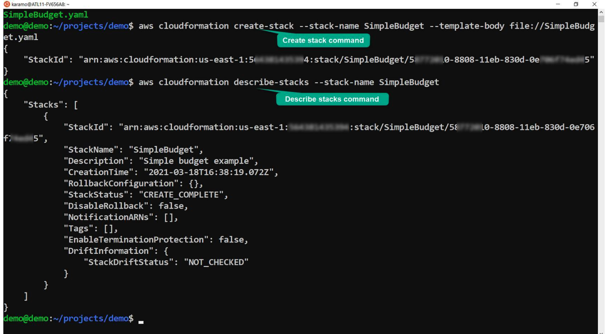

# Week 5: IaC: Working with AWS CloudFormation Stacks

* back to AWS Cloud Institute repo's root [aci.md](../aci.md)
* back to [AWS Cloud Operations 2](./aws-cloud-operations-2.md)
* back to repo's main [README.md](../../../README.md)

## IaC: Working with AWS Cloud Formation Stacks

### Pre-assessment

#### In AWS CloudFormation what is the definition of a stack?

* A stack is a collection of AWS resources that is managed, updated, and deployed as a single unit.

Wrong answers:

* A stack is a set of code used to build a single resource within the AWS cloud.
* A stack is a single AWS resources managed and updated through the AWS Command Line Interface (AWS CLI).
* A stack is a collection of YAML or JSON documents used to build an Amazon Elastic Compute Cloud (Amazon EC2) resource.

##### Explanation

The other options are incorrect because a stack is multiple resources, built using templates written in JSON or YAML and then deployed using CloudFormation.

#### What is the definition of stack drift?

* When AWS CloudFormation deployed resources are modified outside of CloudFormation

Wrong answers:

* When AWS Management Console deployed resources are modified by the AWS Command Line Interface (AWS CLI)
* The incremental changes to deployed resources over time
* The ability to modify AWS resources using a drift tool

##### Explanation

The other options are incorrect because drift occurs when changes are made outside of modifying the stack, whether the changes are made through the AWS CLI, AWS Management Console, incremental or full. All changes to stack deployed resources must be made through CloudFormation.

#### What is the default setting for a stack that fails to deploy?

* Rollback the entire stack upon failure

Wrong answers:

* Rollback only the failed resource upon failure
* Deploy all resources that didn't fail
* Deploy only the resources before the failure

##### Explanation

By default, the stack is set to roll back upon failure and all successfully deployed resources, in addition to the failed resources, are removed.

The other options are incorrect. Although the default behavior can be changed to keep successfully deployed resources, the other options are incorrect because they are not available by default.

### Building stacks

An AWS CloudFormation stack is a collection of Amazon Web Services (AWS) resources that you manage, update, and deploy as a single unit. The stack is built using a CloudFormation template written in either JSON or YAML. Stacks group resources together, so you can quickly build repeatable architectures across your AWS Regions, accounts, and Availability Zones. If your business grows or expands, you can use your stacks to duplicate your environment in different areas. You can also use your stacks for development, quality assurance (QA), or staging environments.

#### CloudFormation Template Example

```yaml
---
AWSTemplateFormatVersion: "2010-09-09"
Description: "Simple budget example"
Parameters:
  Email:
    Type: String
    Default: email@example.com
    Description: Please enter the email address to which budget notifications should be addressed.
Resources:
  BudgetExample:
    Type: "AWS::Budgets::Budget"
    Properties:
      Budget:
        BudgetLimit:
          Amount: 10
          Unit: USD
        TimeUnit: MONTHLY
        BudgetType: COST
      NotificationsWithSubscribers:
        - Notification:
            NotificationType: ACTUAL
            ComparisonOperator: GREATER_THAN
            Threshold: 99
          Subscribers:
            - SubscriptionType: EMAIL
              Address: !Ref Email
        - Notification:
            NotificationType: ACTUAL
            ComparisonOperator: GREATER_THAN
            Threshold: 80
          Subscribers:
          - SubscriptionType: EMAIL
            Address: !Ref Email
Outputs:
  BudgetId:
    Value: !Ref BudgetExample
```

### Creating a stack

1. **Open the AWS Management Console**

    

    Open the AWS Management Console and search for CloudFormation on the services search bar. Choose **CloudFormation**.

    When working with stacks, make sure you log into the correct AWS account and are viewing the Region where the stacks were created.

2. **Create the stack**

    

    In the CloudFormation section, choose **Create stack**.

3. **Specify the template**

    

    You can provide your own template, use a sample template, or use the template designer, which is a graphical interface for creating templates.

    If you are providing the template, you can specify an Amazon Simple Storage Service (Amazon S3) location or upload it from your computer.

4. **Specify details – Name and parameters**

    

    You need to provide a unique name for your stack (stacks in different accounts or different Regions can have the same name, but not in the same account and Region).

    If your template has any parameters, you can specify them here.

5. **Configure more options**

    

    On the next screen, you can configure more options.

    You can add tags to your stack to make it more convenient to group and manage them.

    You can specify whether you want a special AWS Identity and Access Management (IAM) role for CloudFormation to use to operate on the stack.

    You can specify other advanced options, like enhanced protection with a stack policy, rollback and notification options, and other creation options.

6. **Review and confirm**

    

    The console will display all options that will be used for your stack, so you can review and verify they are all as intended.

    Choosing **Create stack** will initiate the stack creation.

7. **Stack list and events**

    

    While the stack is being created, you can see a list of events updating as new resources are created. The other tabs have different information about your stack.

    Eventually, your stack and all its resources should be in **CREATE_COMPLETE** state.

8. **Stack creation using the AWS Command Line Interface**

    

    If you have the AWS CLI installed and configured, you can create a stack using the CloudFormation create-stack command.

    To do this, you need both the stack name and the template, which is either stored as a local file or in a Amazon S3 bucket.

    You can use the CloudFormation describe-stacks command to obtain basic information about your stack.

### Define Stackset

If a stack is a group of resources deployed from a template in a single location, a stackset uses this one template to deploy stacks across different accounts and Regions. Stacksets expand the capability of stacks so you can create, update, or delete stacks across multiple accounts and Regions with a single operation.

You create a Stackset from within an administrator account. You can create and manage an AWS CloudFormation template to use for provisioning stacks into selected target accounts across specified Regions.


The image shows a single template in an administrative account. The template is then used to deploy identical stacks within different Regions and different accounts.

### Modifying stacks

There are a number of ways to manage stacks, such as using the AWS Management Console, AWS CLI, or CloudFormation APIs. When modifying resources and properties built using a stack template, you must modify the stack's template and not the running resources. If you make changes to individual resources, you run the risk of stack drift.

#### Building change sets

The best way to update resources within your stacks or stack sets, is to use a change set. A change set is a summary of the proposed changes that you are attempting to make. Change sets show you how proposed changes to a stack might affect your running resources before implementing them.

For example, using change sets can verify whether your changes accidentally delete or replace any critical resources, like IP address ranges, security group settings, or Amazon Elastic Compute Cloud (Amazon EC2) instance types. CloudFormation makes the changes to your stack only after you decide to implement the change set. This gives you the opportunity to adjust your proposed changes and verify everything is in working order prior to implementing the changes.

To create a change set for a running stack, you submit the changes that you want to make by providing a modified template, new input parameter values, or both. CloudFormation generates a change set by comparing your stack with the changes you submitted. You can either modify a template before creating the change set or during change set creation.

Change sets are created from a variety of sources—from modifying a stack template directly in the CloudFormation console, using a modified template stored in Amazon S3 or locally on your computer, or from the AWS Application Composer.


1. **Create change set**

    Create a change set by submitting changes for the stack that you want to update. You can submit a modified stack template or modified input parameter values. CloudFormation compares your stack with the changes that you submitted to generate the change set; it doesn't make changes to your stack at this point.

2. **View change set**

    View the change set to see which stack settings and resources will change. For example, you can see which resources CloudFormation will add, modify, or delete. Additionally, you can see a before-and-after comparison of the resource properties and attributes, such as tags, that CloudFormation will modify.

3. **Optional: Create additional change sets**

    Optional: If you want to consider other changes before you decide which changes to make, create additional change sets. Creating multiple change sets helps you understand and evaluate how different changes will affect your resources and properties. You can create as many change sets as you need.

4. **Implement change set**

    Implement the change set that contains the changes that you want to apply to your stack. CloudFormation updates your stack with those changes.

* [For more information on building, viewing, and modifying change sets.](https://docs.aws.amazon.com/AWSCloudFormation/latest/UserGuide/using-cfn-updating-stacks-changesets-create.html)

#### Change set example

Here's an example of updating an Amazon EC2 instance using a change set.

1. **Prepare the CloudFormation stack**

    

    The stack consists of an EC2 instance with an instance type of t2.medium. The template shown in the image is from the previous lesson. For this walkthrough, the change set consists of updating the EC2 instance to t2.large.

2. **Create the change set**

    

    To start, choose the **Stack actions** dropdown list, and then choose **Create change set for current stack**.

3. **Submit the updated template**

    

    The image shows CloudFormation Designer. The update changes the InstanceType value to t2.large. With the updated template complete, you can create the change set.

4. **Review impact of the change set**

    

    CloudFormation shows the creation of the change set and lists the intended change. The current EC2 instance is set to be modified. The console shows two options: **Delete change set** or **Execute change set**.

5. **Confirm update behaviors**

    

    After you choose **Execute change set**, you have options for what you want to happen if the provisioning fails. For this walkthrough, the default option is selected, and **Execute change set** is chosen again.

6. **Confirm updated stack status**

    

    This image shows the intended update completed successfully. The EC2 instance now has an instance type of t2.large.

Creating templates, stacks, and change sets are part of maintaining an automated infrastructure as code (IaC) environment. Change sets can be reviewed by others, ensuring that changes to your system have been vetted by multiple developers. By deploying and managing IaC, rather than only through the console or command line, you increase the stability and maintainability of your applications.

## Remediating Stack Drift
