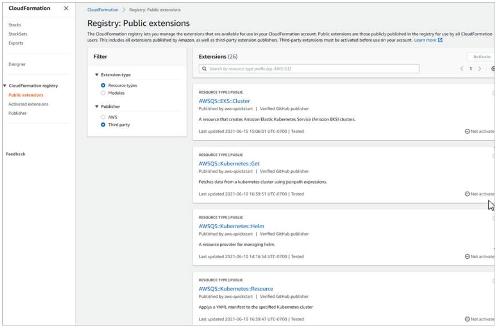
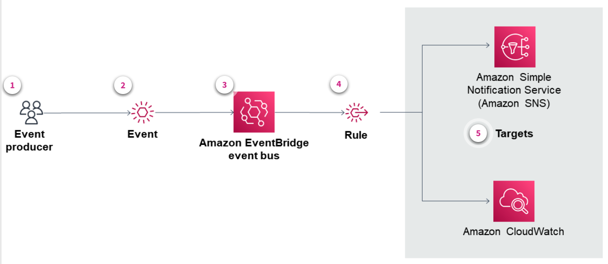
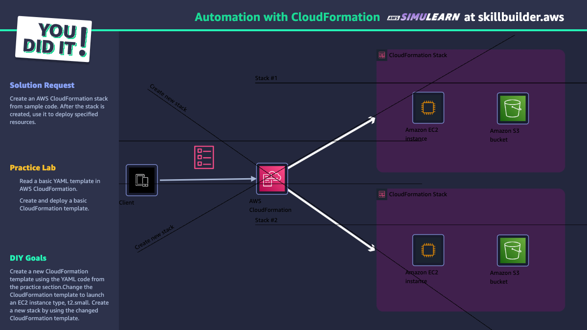

# Week 5: IaC: Expanding AWS CloudFormation Usage

* back to AWS Cloud Institute repo's root [aci.md](../aci.md)
* back to [AWS Cloud Operations 2](./aws-cloud-operations-2.md)
* back to repo's main [README.md](../../../README.md)

## Expanding AWS CloudFormation Usage

### Pre-assessment

#### What is the purpose of an AWS CloudFormation registry extension?

* Enhance the functionality of CloudFormation.

Wrong answers:

* Enhance the functionality of the AWS Management Console.
* Provide discounts on billable compute time.
* Provide additional file-type storage for your volumes.

##### Explanation

An example of enhancing functionality might be, if a software application in your environment that requires a specific feature or routing logic that isn't offered by default. An extension that might provide that ability and extensions can be downloaded from AWS or purchased on the AWS Marketplace.

The other answers are incorrect because the registry does not enhance the AWS Management Console, nor does it have anything to do with your billing cycles or storage volumes.

#### What is the AWS CloudFormation registry?

* AWS managed service for registering AWS and third-party resource types

Wrong answers:

* Registry for holding configuration information for CloudFormation stacks
* Customer-managed service for registering AWS only resource types
* File that provides resource recovery when a stack fails

##### Explanation

The CloudFormation registry is a searchable collection of extensions that enhance the capability of CloudFormation.

The other options are incorrect as the do not define the AWS CloudFormation registry.

#### Which benefits does Amazon EventBridge provide when used with AWS CloudFormation? (Select TWO.)

* Creates templates from existing event buses
* Provides the ability to respond and take corrective action on events

Wrong answers:

* Identifies opportunities to reduce application latency
* Builds functional stacks using event messages
* Allows monitoring of security breaches in your templates

##### Explanation

The other options are incorrect because Amazon EventBridge does not build stacks, nor monitor templates for security. It might help monitor application latency when used with Amazon CloudWatch, but not as a function of infrastructure as code (IaC) and AWS CloudFormation.

## Using the CloudFormation Registry

IaC focuses on automating and streamlining your daily tasks. By having a solid and continuous deployment cycle, teams can spend more time innovating and less time on manual processes and interventions. However, what if your organization needs to deploy a custom application or service requiring specific configuration steps or integrations with third-party services? Instead of manually performing these tedious steps or writing complex custom scripts, you can use the CloudFormation registry.

### Exploring the CloudFormation registry

The CloudFormation registry is an AWS managed service that gives you the ability to register, use, and discover AWS and third-party resource types. Basically, the CloudFormation registry is a searchable collection of extensions that provide additional features or functionality to CloudFormation. By using the registry, you can quickly discover, use, and provision these extensions. When using extensions, you still complete the provisioning in your CloudFormation stacks and AWS Cloud Development Kit (AWS CDK) applications in the same way as when using other AWS provided resources.

Using the CloudFormation registry, you can build your own or use resource providers to model and provision third-party resources. For example, you could acquire extensions that give you the ability to use SaaS monitoring tools, team productivity, or source-code management resources.

### Managing public and private extensions

With the CloudFormation registry, you can manage extensions, such as resources, modules, and hooks that are available for use in your AWS account. The registry makes it more convenient to discover and provision extensions in your AWS CloudFormation templates in the same manner you use AWS provided resources.

#### Extensions

An extension is an artifact, registered in the CloudFormation registry, that alters and enhances the functionality of CloudFormation. These extensions are built and registered by AWS, AWS Partner Network, AWS Marketplace sellers, and the developer community.

Extension types are registered as either public or private.

#### Public extensions

Public extensions are those publicly published in the registry for use by all CloudFormation users. This includes extensions published by AWS and third-party extension publishers. There are two kinds of public extensions:

* **AWS public extensions**: Extensions published by AWS are always public and activated by default, so you don't have to take any action before using them in your account. In addition, AWS controls the versioning of the extension, so you are always using the latest available version.
* **Third-party public extensions**: These are extensions made available for general use by publishers other than AWS.

#### Private extensions

Private extensions are those extensions from third parties that you have explicitly activated for use in your AWS account. There are two kinds of private extensions:

* **Activated private extensions**: Are local copies of third-party extensions activated for your account and Region. When you activate a third-party private extension, CloudFormation creates a local copy of that extension in your account's registry.
* **Registered private extensions**: These are extensions you've created yourself, or ones shared with you by your organization or other third party. To use a private extension in your account, you must first register it. Registering the extension uploads a copy of it to the CloudFormation registry in your account and activates it.

#### Extension types

Currently, the registry offers the following extension types:

* **Resource types**: With resource types, you can model and provision custom logic as a resource by using stacks in CloudFormation. A resource type identifies the type of resource that you are declaring within a CloudFormation template. For example, **AWS::EC2::Instance** is a resource type from the Amazon EC2 provider. This resource type declares that an Amazon EC2 instance should build when your stack is deployed. A *resource provider* is a set of these resource types that provide additional details around controlling the lifecycle of underlying resources. You can use resource providers to model and provision resources using CloudFormation.
* **Modules**: Modules give you the ability to package resource configurations for inclusion across stack templates, in a transparent, manageable, and repeatable way. Modules are customizable building blocks that users can include in their stack templates. With modules, you can build and distribute resource configurations that incorporate best practices, expert domain knowledge, and accepted guidelines. Users can then include these modules in their templates without having to acquire deep knowledge of the intricacies of the resource implementation.
* **CloudFormation Hooks**: This is a feature that ensures your CloudFormation resources are compliant with your organization's security, operational, and cost-optimization best practices. CloudFormation Hooks provides code that proactively inspects the configuration of your AWS resources before provisioning. If non-compliant resources are found, CloudFormation either fails the operation and prevents the resources from being provisioned, or emits a warning and allows the provisioning operation to continue.

This registry acts as a centralized repository holding pre-built resource providers or extensions that encapsulate the necessary logic for your specific needs. By browsing the public registries provided by AWS, partners, and the community, or even your organization's private registry, you can discover and use these pre-built resource providers. You can then incorporate them into your CloudFormation templates, streamlining the deployment process and eliminating the need for manual interventions or complex scripting.

#### Use case



Your organization asked you to deploy a web application that requires integration with a third-party monitoring service like Datadog, Inc. 
You don't have time to manually configure the monitoring agent and necessary integrations. Instead, you search the CloudFormation registry for a pre-built resource provider that handles the integration with the monitoring service.

You locate a Datadog resource provider in the public registry. This is a custom resource that encapsulates the logic for installing and configuring the Datadog agent on your web application instances. This resource provider also handles the necessary configurations and API key management for integrating your application with the Datadog monitoring platform.

By incorporating this pre-built resource provider into your CloudFormation template, you streamline the deployment process. Additionally, this ensures consistent integration with the third-party monitoring service across all your application environments. Instead of writing complex scripts, you declare the Datadog resource provider in your template, and CloudFormation provisions and configures the resources during the stack deployment.

This approach saves time, reduces the risk of error, and promotes reusability and consistency. The resource provider is also shareable and used across multiple CloudFormation stacks or projects within your organization.

### Creating registry resources

The CloudFormation registry lists the resources available to your CloudFormation account for use in your stack templates. To get started let's go to the registry. There are two types of CloudFormation registry resources: public resources provided by AWS, and private resources developed and registered for use in your account.

This account has no private registry resources. To start defining a private resource let's go to our development environment. We'll be using Cloud9 but all steps we take here can be done in a local development environment> First we'll use pip to install the CloudFormation CLI tool and the python plugin. Let's make sure the cCloudFormation CLI tool installed properly. Next we'll install the CloudFormation serverless application model or SAM CLI tool, so that we'll be able to locally test and debug the Lambda functions containing the provisioning logic for our resource. Now we'll create a project folder for our resource type. Next we'll run the CFN init command to bootstrap our project folder with all the necessary files and folders for the creation of our resource.

For the purposes of this example we'll create a resource type to implement Logic for the provisioning of a password policy resource. Let's implement the provisioning logic in Python 3.7. We'll follow the recommendation to use Docker for packaging the provisioning logic. Let's take a look at some of the files the wizard generated. Our folder now contains a JSON file that defines all of the parameters, resources utilized, and metadata for our new resource type. At the top we can define our resource type name, description, source URL, and any schema definition metadata we choose to provide.

Here, we can define any properties and parameters to be used in our Handler logic. At the bottom, we see that a resource type implements provisioning Logic for create, read, update delete, and list events. Any necessary permissions for the AWS identity and access management or IAM role to perform these tasks are defined here. The CFN init command also generated boilerplate source code for the Handler logic. Let's take a look. This python source code file contains Handler Logic for our resources create, update, delete, read, and list operations. The models file contains data structure definitions that will be used in our Handler logic. It was generated automatically using the JSON file we saw earlier. Let's return to that file to add some custom fields for our password policy resource type.

Let's clear the boilerplate definitions section. For our purposes we'll Define only the properties and necessary IAM execution policy for our resource type. Let's replace the properties section with the properties we wish to define. Under required, we can specify whether any of our defined Fields must be filled in when our resource is provisioned. Let's set minimum password length as a required field. We can also designate specific properties as read-only. Let's do so for the resource type name. Let's also designate the name as the primary identifier. In the Handler section we'll define any necessary IAM policies required by our resource types corresponding IAM execution rules.

Let's save the file and return to the terminal. Next let's run CFN generate, which will automatically refresh our resource type data models and documentation with the fields we just defined. Let's look at the documentation. As you can see the readme file was automatically populated with the defined properties and values. It also auto-generated a description of each field we input, including links to more information. Similarly the data models have been automatically generated according to our specifications. Next we'll use the data models to provide the provisioning logic for each Handler operation. First we'll define the desired state of our create action using the get account password policy model. This model Returns the policy or raises an error if the policy isn't there or the action fails.

Next we'll implement the creation Logic for our password policy resource type. We'll continue defining the logic for each of the Handler functions. Let's run CFN generate to refresh our project files. Before submitting our resource to the directory we can perform tests to ensure the Handler functions work as expected. We can use SAM to instantiate a local Lambda function using our built resource type artifact and then run tests against it. In this case we won't run tests. Let's submit our resource type to the CloudFormation registry. Our custom resource type is now submitted and registered let's return to CloudFormation.

Our resource now appears on the private resource type page in the CloudFormation registry. A description, ARN, release date and documentation are provided along with the schema we defined. Notice that multiple versions of this private resource type can be created and offered for selection. Next let's create a simple CloudFormation template that utilizes our new resource.

Next, let's copy our CloudFormation template to an Amazon simple storage service or Amazon S3 bucket and deploy it. We'll need to provide the S3 URL for the CloudFormation template we just created. Now that the resource has provisioned let's navigate to IAM to ensure the password policy has been implemented in our account. The password policy has been added. You can see if configuration changes were made to your stack resources outside of CloudFormation by using the drift detection feature. In addition, resource types from the CloudFormation registry are automatically tracked in AWS Config. With AWS Config you can assess audit and evaluate the configurations of your application resources.

## Exploring Amazon EventBridge

Amazon EventBridge is a service that provides real-time access to changes in data in AWS services or your own applications without writing code. EventBridge is a serverless service that uses these changes, called events, to communicate between and connect application components together. You use EventBridge to coordinate across microservices, or to monitor and audit your applications.

EventBridge provides a convenient and consistent way to ingest, filter, transform, and deliver activities in your environment. It works under the premise that an application or service produces an event whenever there is a change in a resource.

As with many AWS services, AWS CloudFormation generates and sends events to the EventBridge default event bus. An *event bus* is a router that receives events and delivers them to zero or more destinations, or targets. Rules you specify for the event bus evaluate events as they arrive. Each rule checks whether an event matches the rule's event pattern. If the event does match, the event bus sends the event to the specified targets. A default event bus is automatically provisioned within every AWS account.



1. **Event Producer**

    An event producer is a SaaS software application or service that publishes events to EventBridge. The event producer might be an AWS service, third-party application, or a custom application written by you.

    Example: An EC2 instance running a web server emits a custom CloudWatch metric indicating high CPU usage.

2. **Event**

    An event indicates a change in an environment represented as a JSON object. Each event contains a similar structure containing the same top-level fields.

    Example: The custom CloudWatch metric crosses a predefined threshold, triggering an alarm.

3. **Event bus**

    An event bus is a pipeline that receives events. EventBridge provides a default event bus, but supports creating multiple event buses for multiple paths of event processing.

    Example: The CloudWatch alarm sends an event to an Amazon EventBridge bus.

4. **Rule**

    An Eventbridge rule associated with the event bus evaluates events as they arrive. Each rule checks whether an event matches the rule's criteria using an event pattern. If an event matches, it is sent to defined targets.

    Example: A rule on the EventBridge bus matches events from the specific CloudWatch alarm, indicating high CPU usage.

5. **Targets**

    EventBridge sends matching events to targets—resources or endpoints specified in a rule. Rules process events and send relevant data to targets. EventBridge needs permission to access targets. Each rule can have up to five targets.

    The rule targets an Amazon EC2 Auto Scaling group to launch additional EC2 instances and a Lambda function to log the scaling event for auditing purposes.

### Viewing EventBridge events

The event producer publishes the event on the event bus in JSON format in a key/value dictionary format. The key represents the name of the data value. Although events are published with different structures, each contains the following keys:

| Event Key | Description |
| --------- | ----------- |
| version | Currently set to 0 (zero) for all events |
| id | An automatically generated Version 4 Universally Unique Identifier (UUID) for every event |
| account | The 12-digit AWS account ID |
| source | Identifies the service that generated the event |
| time | The time that the event occurred |
| region | Identifies the AWS Region for the event |
| resources | A JSON array that contains the Amazon Resource Name (ARN) of the bucket |
| detail-type | The type of event that's being sent, such as object creation |
| detail | A JSON structure that contains information about the event |

#### Event structure

Below is an example showing the structure of an EventBridge event. The JSON in this event describes the state change of an EC2 instance. The event shows that the source of aws.ec2 for instance of i-1234567890abcdef0 in the region of us-west-1 now has a state of terminated.

```json
{
  "version": "0",
  "id": "6a7e8feb-b491-4cf7-a9f1-bf3703467718",
  "detail-type": "EC2 Instance State-change Notification",
  "source": "aws.ec2",
  "account": "111177778888",
  "time": "2017-12-22T18:43:482",
  "region": "us-west-1",
  "resources": [
    "arn:aws:ec2:us-west-1:123456789012:instance/i-9876543210abcdef7"
  ],
  "detail": [
    "instance-id": "i-9876543210abcdef7",
    "state": "terminated"
  ]
}
```

### Event-driven actions

The EventBridge event bus provides you with the ability to respond to events and take corrective action as necessary. In the previous example where an Amazon EC2 instance was being terminated, alerting for an event is performed by defining a rule to match that event.

With CloudFormation, you can trigger event-driven actions after creating, updating, or deleting your CloudFormation StackSets. Additionally, you have the option to build your event-driven applications across multiple AWS accounts, organizational units (OUs), and Regions using AWS CloudFormation StackSets and Amazon EventBridge.

EventBridge is useful for a variety of purposes. It can communicate between AWS and third-party services to notify when a resource change occurs. Or, it can automate the process of drift detection to verify the integrity of a CloudFormation stack before you attempt to deploy it.

#### Changes to stacks and stack sets

CloudFormation also sends events to EventBridge for status changes to stack sets and stack-set instances. You use EventBridge rules to route events to your defined targets. These events are guaranteed to be delivered, but they might be delivered out of order.

Because CloudFormation events represent changes to stacks or stack sets and their resources, you can use them to initiate workflows associated with respective events. Review the following examples:

* Create a stack or stack set specific tags on all resources provisioned through CloudFormation.
* Establish an association between a CloudFormation stack or stack set and an Amazon WorkSpaces Application Manager (Amazon WAM).
* Specify an association with an AppRegistry for the created stack or stack set.

#### CloudFormation events

The following events are generated by CloudFormation and sent to the default event bus in EventBridge.

| Event type | Description |
| ---------- | ----------- |
| Resource Status Change | Any updates performed on a stack that changes underlying resource properties |
| Stack Status Change | Represents a status change to a given stack |
| Drift Detection Status Change | Represents a user-initiated drift detection update on a given stack |
| StackSet Status Change | Represents a status change to a given stack set |
| StackSet Stack Instance Status Change | Represents a status change to a specific StackSet stack instance |
| StackSet Operation Status Change | Represents a status change to a given StackSet operation |

#### Defining rules in EventBridge

A rule definition includes the event bus where events are published. An event pattern matches specific events and sends them to the target service. The following example includes an event pattern matching EC2 instance termination events.

```json
{
  "source": ["aws.ec2"],
  "detail-type": "EC2 Instance State-change Notification",
  "detail": {
    "state": ["terminated"]
  }
}
```

* The **source** field specifies the origin of the events that the rule matches. In this case, the rule matches events generated by Amazon EC2 (aws.ec2) and Auto Scaling (aws.autoscaling).
* The **detail** field provides filtering based on specific details within the event. Here, it is looking at the state property within the event details.
* The **state** field within the detail object filters events based on their state. The condition specified is that the state must exist and be true.

The EventBridge rule pattern is designed to match events from either Amazon EC2 or Amazon EC2 Auto Scaling where the state attribute exists and its value is true. This can trigger specific actions when certain state changes occur in Amazon EC2 instances or Amazon EC2 Auto Scaling groups, such as when instances are successfully launched or scaled. In a production scenario, this rule might be used to do the following:

* Trigger a Lambda function that performs logging or notifies an administrator whenever a new EC2 instance is successfully launched.
* Integrate with other services or workflows that need to react to changes in the state of EC2 instances or Auto Scaling activities.

#### Enhancing event patterns

You can use comparison operators to enhance event patterns. This example shows a new event pattern that now supports the event from a list of event producers (aws.ec2 and aws.autoscaling). This event pattern also matches an event if a state key exists with any value, and not just the value of terminated.

```json
{
  "source": ["aws.ec2","aws.autoscaling"],
  "detail": {
    "state": [{"exists": true}]
  }
}
```

For a full list of comparison operators, navigate to [Amazon EventBridge Event Patterns](https://docs.aws.amazon.com/eventbridge/latest/userguide/eb-event-patterns.html).

### Generating templates for EventBridge

To help you jumpstart developing CloudFormation templates, the EventBridge console enables you to create CloudFormation templates from the existing event buses, rules, and pipes in your account.

#### Event bus templates

With EventBridge, you can generate templates from the existing event buses in your account. It provides the option of including the rules associated with the event bus in your template. You can then use these templates as the basis for creating stacks of resources under CloudFormation management.

For example, EventBridge generates a template from an existing event bus monitoring Amazon EC2 instance state changes. This monitor includes the rules that invoke Lambda functions for specific events. You then use this template to create a CloudFormation stack. This stack automatically sets up the same event bus and rules in new AWS accounts or Regions, streamlining the deployment process.

#### Rules templates

With EventBridge, you can generate templates from the existing rules in your account as an aid to help you start developing CloudFormation templates. You can select a single rule, or multiple rules to include in the template. You can then use these templates as the basis for creating stacks of resources under CloudFormation management.

For example, you have several EventBridge rules set up in your account. These rules filter and route events to different targets like Lambda functions, Amazon Simple Queue Service (Amazon SQS) queues. These rules are working well, but you want to make sure they are reproducible and portable. By using the EventBridge rules template capability, you can automatically generate a CloudFormation template from your existing rules. This template can then be checked into source control and used to recreate the rules in other accounts or Regions.

#### Pipe templates

EventBridge gives you the ability to generate templates from the existing pipes in your account. You can select a single pipe or multiple pipes to include in the template.

For example, you have a continuous integration and continuous delivery (CI/CD) pipeline that builds and deploys your application whenever code is pushed to your Git repository. You can create an EventBridge rule that detects the Amazon CodeCatalyst Push event, and targets a CloudFormation stack that updates your application.

This rule can be exported as a template, so you can conveniently recreate the same event-driven pipeline in other accounts and Regions by launching that CloudFormation stack.

The benefits for creating templates through EventBridge are faster setup, consistency, and streamlined management of event-driven pipelines. Templates encapsulate the underlying resources and wiring logic, avoiding manual work.

#### Considerations

The following are some considerations before using a CloudFormation template generated from an event bus, rules, or pipes:

* EventBridge does not include any passwords in the generated template. You can edit the template to include template parameters. This gives users the ability to specify passwords or other sensitive information when using the template to create or update a CloudFormation stack. In addition, users can use AWS Secrets Manager to create a secret in the desired Region, then edit the generated template to employ dynamic parameters.
* Targets in the generated template remain exactly as they were specified in the original event bus. This can lead to cross-Region issues if you do not appropriately edit the template before using it to create stacks in other Regions. Additionally, the generated template will not create the downstream targets automatically.

* [Generating CloudFormation Templates for EventBridge Buses, Rules, and Pipes](https://docs.aws.amazon.com/AWSCloudFormation/latest/UserGuide/eventbridge-cfn-template-generation.html)

EventBridge sends metrics to Amazon CloudWatch every minute for everything from the number of matched events to the number of times that a target is invoked by a rule. CloudFormation support is available in all Regions where EventBridge is available.

### AWS SimuLearn: Automation with CloudFormation

In this AWS SimuLearn assignment, you will review a real-world scenario helping a fictional customer design a solution on AWS. After the design is complete, you will build the proposed solution in a guided lab within a live AWS Console environment. You will gain hands-on experience working with AWS services, using the same tools technology professionals use to construct AWS solutions.

For this assignment, you will help reduce human error and standardize a robotics research deployment infrastructure.

* [Sample File](./files/W0520SimuLearn_sample_code.txt)
* [CloudFormation Template File](./files/W0522SimuLearn_template-1747028811596.yaml)

#### Create a CloudFormation template and deploy Stack 1

```yaml
Resources:
  RobotAppServer:
    Type: 'AWS::EC2::Instance'
    Properties:
      InstanceType: t2.micro
      ImageId: ami-087c17d1fe0178315
      SecurityGroups:
      - !Ref RobotAppSecurityGroup
  RobotAppSecurityGroup:
    Type: 'AWS::EC2::SecurityGroup'
    Properties:
      GroupDescription: Enable SSH access via port 22
      SecurityGroupIngress:
      - IpProtocol: tcp
        FromPort: '22'
        ToPort: '22'
        CidrIp: 0.0.0.0/0
  RobotS3Bucket:
    Type: 'AWS::S3::Bucket'
    DeletionPolicy: Delete
```

#### Create a CloudFormation template and deploy Stack 2 with EC2 type t2.small

```yaml
Resources:
  RobotAppServer:
    Type: 'AWS::EC2::Instance'
    Properties:
      InstanceType: t2.small
      ImageId: ami-087c17d1fe0178315
      SecurityGroups:
      - !Ref RobotAppSecurityGroup
  RobotAppSecurityGroup:
    Type: 'AWS::EC2::SecurityGroup'
    Properties:
      GroupDescription: Enable SSH access via port 22
      SecurityGroupIngress:
      - IpProtocol: tcp
        FromPort: '22'
        ToPort: '22'
        CidrIp: 0.0.0.0/0
  RobotS3Bucket:
    Type: 'AWS::S3::Bucket'
    DeletionPolicy: Delete
```



### Knowledge Check

#### How often does Amazon EventBridge send metric data to Amazon CloudWatch?

* Every 1 minute

Wrong answers:

* Every 90 seconds
* Every 2 minutes
* Every 5 minutes

##### Explanation

Amazon EventBridge sends metrics to Amazon CloudWatch every minute for everything from the number of matched events to the number of times that a target is invoked by a rule.

The other answers are incorrect because 90 seconds, 2 minutes, and 5 minutes are too long.

#### What is the format of the event produced by the event producer?

* JSON

Wrong answers:

* YAML
* HTML
* XML

##### Explanation

The other answers are incorrect because the event bus doesn't publish event producers in YAML, HTML, or XML.

#### What are the two types of public extensions when using the Amazon CloudFormation registry? (Select TWO.)

* Third-party public extensions
* AWS public extensions

Wrong answers:

* Private extensions
* S3 public extensions
* EC2 public extensions

##### Explanation

AWS public extensions are extensions published by AWS that are always public and activated by default. Third-party public extensions are extensions made available for general use by publishers other than AWS.

The other answers are incorrect because private extensions are not available through the public CloudFormation registry. The registry only contains public extensions. S3 public extensions is incorrect because S3 is an AWS service, not a type of public extension in the CloudFormation registry. EC2 public extensions is incorrect because EC2 is an AWS service, not a type of public extension in the CloudFormation registry.

### Summary

#### Overview of CloudFormation registry

You learned what the CloudFormation registry is and how it's used to manage public and private extensions. The extensions expand CloudFormation functionality. They give you support of third-party products so you can use CloudFormation for applications and workflow templates that you might not have in-house resources to build.

Additionally, you also learned the following:

* The purpose of extensions and types, such as resource types, modules, and hooks
* How to use CloudFormation to send events to Amazon EventBridge

#### Integration of Amazon EventBridge with CloudFormation

You learned briefly about the function and purpose of Amazon EventBridge. You also learned how to use EventBridge to build CloudFormation templates based on rules, pipes, and other options.
