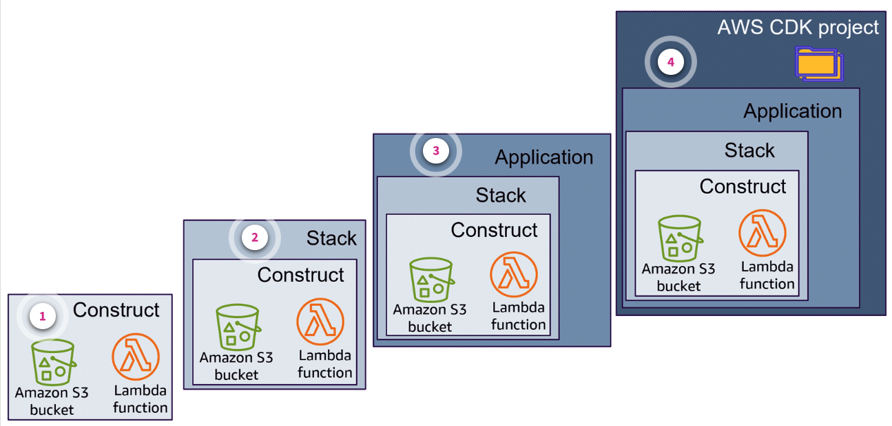

# Week 5: IaC: Examining AWS Cloud Development Kit (AWS CDK)

* back to AWS Cloud Institute repo's root [aci.md](../aci.md)
* back to [AWS Cloud Operations 2](./aws-cloud-operations-2.md)
* back to repo's main [README.md](../../../README.md)

## Examining the AWS Cloud Development Kit

### Pre-assessment

#### Which type of programming does the AWS Cloud Development Kit (AWS CDK) use?

* Imperative

Wrong answers:

* Declarative
* Functional
* Procedural

##### Explanation

The AWS CDK, uses the **imperative approach**, using any variety of the support programming languages. 

The other options are incorrect because declarative, functional, and procedural approaches do not work like the imperative approach.

#### What is a construct?

* Code that represents one or more AWS CloudFormation resources and their configuration

Wrong answers:

* Code that represents the output of a stack
* An AWS resource built using the AWS Command Line Interface (AWS CLI)
* A tool used to build out a graphical representation of AWS resources

##### Explanation

The other options are incorrect because there is no code that represents the OUTPUT of a stack, it is not a resource built using a CLI, nor a tool to build graphics.

#### Which offering provides the ability to build and interact with AWS Cloud Development Kit (AWS CDK) apps and projects?

* AWS CDK Toolkit

Wrong answers:

* AWS Construct Library
* AWS CDK contexts
* AWS CDK assets

##### Explanation

The **AWS CDK Toolkit** is a command line tool for interacting with AWS CDK apps.

The other options are incorrect because none of these items allow interaction with AWS CDK apps.

## Provisioning Resources with AWS CDK

AWS Cloud Development Kit (AWS CDK) is a faster way to build and deploy resources.

### Defining the AWS CDK

The AWS CDK is an open-source development toolkit for defining cloud IaC. It operates on a construct-based model. Constructs are pre-written, modular, and reusable pieces of code. Cloud application developers define these reusable components that represent AWS resources, and assemble them into stacks for deployment.

AWS CDK streamlines infrastructure management by providing a higher-level abstraction over CloudFormation templates. This means that instead of typing the individual AWS resources using YAML or JSON into a template, you call a construct that has this code already written. This saves you time and reduces inefficiencies. The AWS CDK then creates ready-to-use CloudFormation templates from AWS CDK stacks.

AWS CDK uses a variety of familiar programming languages to define application resources. You develop and build using coding languages you already know. You can also use your existing integrated development environment (IDE), using tools such as autocomplete and in-line documentation to accelerate development of infrastructure.

The AWS CDK supports TypeScript, JavaScript, Python, Java, C#/.Net, and Go. Check the most current user guide to verify the list of supported languages.


You can use any of these supported programming languages to define reusable cloud components, known as constructs. You compose these together into stacks and apps. Then, you deploy your CDK applications to CloudFormation to provision or update your resources.

The following image shows the stack creation process when using the AWS CDK. The code built using the AWS CDK is first converted to CloudFormation templates. CloudFormation then processes and provisions these templates as stacks.


AWS CDK points to a template. Cloudformation turns the template into a stack.

### How the AWS CDK and CloudFormation differ

The AWS CDK is tightly integrated with CloudFormation, but there are some differences that you should know.

CloudFormation templates are *declarative*, meaning they declare the desired state or outcome of your infrastructure. The CloudFormation templates use JSON or YAML to define AWS resources (AWS services) and properties (the configuration of those services). When you deploy your template in CloudFormation, your resources and their configured properties are provisioned as described within your template.

The AWS CDK, uses the *imperative approach* using any variety of the support programming languages. Instead of just defining a desired state declaratively, you can define the logic or sequence necessary to reach the desired state. For example, you can use *if* statements or *conditional loops* that determine how to reach a desired end state for your infrastructure.

Infrastructure created with the AWS CDK is eventually translated or synthesized into CloudFormation templates and deployed using the CloudFormation service. Although the AWS CDK offers a different approach to creating your infrastructure, you still receive the benefits of CloudFormation.

### Benefits of using the AWS CDK

The AWS CDK provides the ability to develop applications using the flexibility and capabilities of common programming languages. This approach yields many benefits for your business.

* **Develop and manage IaC**

    Provides infrastructure, application code, and configuration all in one place.

* **Use general-purpose programming languages**

    Use common programming language to define your infrastructure and your application logic.

* **Deploy infrastructure through CloudFormation**

    AWS CDK integrates with CloudFormation to deploy and provision your infrastructure on AWS.

* **Developing applications quickly using constructs**

    Develop faster by using and sharing reusable components called constructs. You define more infrastructure with less code.

### Architecture and coupling



1. **Constructs**

    A construct is a code within your application that represents one or more CloudFormation resources and their configuration. You build your application, piece by piece, by importing and configuring constructs.

    For example, you can import a construct for an Amazon S3 bucket and an AWS Lambda function into your AWS CDK app.

    Constructs are available from the AWS Construct Library. You can also create and distribute your own constructs, or use constructs created by third-party developers.

2. **AWS CDK stack**

    An AWS CDK stack is a collection of one or more constructs. Because the constructs define the resources, each CDK stack represents a CloudFormation stack in your CDK application. At deployment, constructs within a stack are provisioned as a single unit.

3. **AWS CDK app**

    The AWS CDK application, or app, is a collection of one or more CDK stacks. Because stacks are a collection of constructs defining AWS resources and properties, the overall grouping of your stacks and constructs are known as your CDK app.

4. **AWS CDK Project**

    You start with a CDK project, which contains a structure of folders and files, including assets. Within the project, you create a CDK application. Within the app, you define a stack, which directly represents a CloudFormation stack. Within the stack, you define your AWS resources and properties using constructs.

### Additional CDK concepts

1. **Identifiers**

    The identifier serves as a namespace for everything defined within the construct. It’s used to generate unique identifiers, such as resource names and CloudFormation logical IDs.

    Identifiers need only be unique *within a scope*. This lets you instantiate and reuse constructs without concern for the constructs and identifiers they might contain, and builds composing constructs into higher-level abstractions. Scopes make it possible to refer to groups of constructs all at once. Examples include tagging or specifying where the constructs will be deployed.

2. **Environments**

    An environment is the target AWS account and Region where the stacks are deployed. All stacks in your AWS CDK app are explicitly or implicitly associated with an environment (env).

3. **Contexts**

    Context values are key-value pairs that can be associated with an app, stack, or construct.

    They might be supplied to your app from a file (usually either cdk.json or cdk.context.json in your project directory) or on the command line.

4. **Assets**

    Assets are local files, directories, or Docker images that can be bundled into AWS CDK libraries and apps.

    For example, an asset might be a directory that contains the handler code for a Lambda function. Assets can represent any artifact that the app needs to operate.

* [Learn AWS CDK Core Concepts](https://docs.aws.amazon.com/cdk/v2/guide/core_concepts.html)

### AWS CDK building blocks

The AWS CDK consists of two main parts:

* **AWS Construct Library**: This is a collection of pre-written code, called constructs, that you can use, modify, and integrate to develop your infrastructure quickly. The goal of the AWS CDK Construct Library is to reduce the complexity required to define and integrate AWS services together when building applications on AWS.
* **AWS CDK Toolkit**: A command line tool for interacting with AWS CDK apps. Use the AWS CDK Toolkit to create, manage, and deploy your AWS CDK projects.

### AWS Construct Library architecture

The AWS Construct Library contains a collection of constructs that are developed and maintained by AWS. It is organized into various modules that contain constructs representing all of the resources available on AWS.

Constructs from the AWS Construct Library are categorized into three levels. Each level offers an increasing level of abstraction. The higher the abstraction, the more convenient it is to configure, requiring less expertise. The lower the abstraction, the more customization available, requiring more expertise.

#### Level 1: CFN resources

L1 constructs, also known as CFN resources, are the lowest-level construct and offer no abstraction. Each L1 construct maps directly to a single CloudFormation resource. With L1 constructs, you import a construct that represents a specific AWS CloudFormation resource. You then define the resource’s properties within your construct instance.

L1 constructs are great to use when you are familiar with CloudFormation and need complete control over defining your AWS resource properties.

In the AWS Construct Library, L1 constructs are named starting with Cfn, followed by an identifier for the CloudFormation resource that it represents. For example, the **CfnBucket** construct is an L1 construct that represents an **AWS::S3::Bucket** AWS CloudFormation resource.

**Example**: Suppose you want to create an S3 bucket with specific properties. Using an L1 construct, you can define every detail exactly as you would in a CloudFormation template.

```python
import aws_cdk as cdk
from aws_cdk import (
  aws_s3 as s3,
  Stack
)
from constructs import Construct

class MyStack(Stack):
  def __init__(self, scope: Construct, id: str, **kwargs) -> None:
    super().__init__(scope, id, **kwargs)

    ## Create an S3 bucket using an L1 construct
    bucket = s3.CfnBucket(self, "MyBucket",
                          bucket_name="my-unique-bucket-name",
                          versioning_configuration=s3.CfnBucket.VersioningConfigurationProperty(
                            status="Enabled"
                          ))

    # Output the bucket name
    cdk.CfnOutput(self,"BucketNameOutput",
                  value=bucket.ref,
                  description="The name of the S3 bucket"
    )

app = cdk.App()
MyStack(app, "MyStackIdentifier")
my.synth()
```

#### Level 2: Curated constructs

L2 constructs, also known as *curated constructs*, are the most widely used construct type. L2 constructs map directly to single AWS CloudFormation resources and provide a higher-level abstraction through an intent-based API. L2 constructs include sensible default property configurations, best-practice security policies, and generate the boilerplate code and glue logic for you.

L2 constructs also provide helper methods for most resources that make it quicker to define properties, permissions, and event-based interactions between resources.

The **s3.Bucket class** is an example of an L2 construct for an Amazon S3 bucket resource.

**Example**: Suppose you want to create an S3 bucket with versioning enabled. Using an L2 construct, you can create the bucket with less code and better defaults.

**Why it's useful**: L2 constructs provide helper methods for most resources that make it quicker to define properties, permissions, and event-based interactions between resources. The s3.Bucket class is an example of an L2 construct for an Amazon S3 bucket resource.

```python
import aws_cdk as cdk
from aws_cdk import (
  aws_s3 as s3,
  Stack
)
from constructs import Construct

class MyStack(Stack):
  def __init__(self, scope: Construct, id: str, **kwargs) -> None:
    super().__init__(scope, id, **kwargs)

    ## Create an S3 bucket using an L2 construct
    bucket = s3.Bucket(self, "MyBucket",
                       bucket_name="my-unique-bucket-name",
                       versioned=True
                      )

    # Output the bucket name
    cdk.CfnOutput(self,"BucketNameOutput",
                  value=bucket.bucket_name,
                  description="The name of the S3 bucket"
    )

app = cdk.App()
MyStack(app, "MyStackIdentifier")
my.synth()
```

#### Level 3: Pattern constructs

L3 constructs, also known as *patterns*, are the highest-level of abstraction. Each L3 construct contains a collection of resources configured to work together to accomplish a specific task or service within your application. L3 constructs are used to create entire AWS architectures for particular use cases in your application.

To provide complete system designs, or substantial parts of a larger system, L3 constructs offer *opinionated* default property configurations. They are built around a particular approach toward solving a problem and providing a solution. With L3 constructs, you create and configure multiple resources quickly, with the fewest amount of input and code.

The **ecs_patterns.ApplicationLoadBalancedFargateService** class is an example of an L3 construct that represents an AWS Fargate service running on an Amazon Elastic Container Service (Amazon ECS) cluster, fronted by an application load balancer. This setup is ideal for quickly deploying scalable containerized web applications.

**Example**: Suppose you want to set up a fully managed containerized web application. Using an L3 construct, you can quickly create a complete infrastructure setup with minimal input.

The following is an explanation of the example:

* **Import statements**: Import the necessary modules from the AWS CDK library.
* **Stack definition**: Define a new stack by extending the cdk.Stack class.
* **L3 construct usage**: Use the **ecs_patterns.ApplicationLoadBalancedFargateService** construct to create an ECS Fargate service with a load balancer. This construct automatically sets up multiple resources (ECS cluster, Fargate service, and Application Load Balancer) to work together.
* **Minimal input**: The L3 construct requires minimal input, such as the container image, making it straightforward to set up complex architectures.

**Why it's useful**: L3 constructs offer opinionated default property configurations and are built around solving specific problems with minimal code. They give you the ability to create and configure multiple AWS resources quickly and efficiently, providing complete system designs or substantial parts of larger systems.

```python
import aws_cdk as cdk
from aws_cdk import (
  aws_ecs as ecs,
  aws_ecs_patterns as ecs_patterns,
  Stack
)
from constructs import Construct

class MyStack(Stack):
  def __init__(self, scope: Construct, id: str, **kwargs) -> None:
    super().__init__(scope, id, **kwargs)

    ## Create an ECS cluster
    cluster = ecs.Cluster(self, "MyCluster",
                          cluster_name="my-ecs-cluster"                         
    )
    
    # Create a Fargate service with a load balancer using an L3 construct
    ecs_patterns.ApplicationLoadBalancedFargateService(
                          self, "MyFargateService",
                          cluster=cluster,
                          task_image_options={
                            "image": ecs.ContainerImage.from_registry("amazon/amazon-ecs-sample")
                          }
    )

app = cdk.App()
MyStack(app, "MyStackIdentifier")
my.synth()
```

### AWS CDK Toolkit

The AWS CDK Toolkit, (the **cdk** command), is the primary tool for interacting with your AWS CDK app. It runs your app, interrogates the application model you defined, and produces and deploys the CloudFormation templates generated by the AWS CDK. It also provides other features useful for creating and working with AWS CDK projects.

All CDK Toolkit commands start with **cdk**, which is followed by a subcommand (list, synthesize, deploy, and so on). Some subcommands have a shorter version (ls, synth, and so on) that is equivalent. Arguments and options follow the subcommand in any order. The following code snippet shows the command, subcommand, arguments, and options as they would appear on the CDK CLI.

```text
cdk <command> <arguments> <options>
```

### AWS CDK CLI command reference

The AWS CDK CLI command reference provides instructions and usage information on the CDK commands you need to help create and deploy your IaC. The following commands are the most frequently used commands.

| Command | Description |
| ------- | ----------- |
| **init** | Create a new AWS CDK project from a template. |
| **synth** | Synthesize a AWS CDK app to produce a cloud assembly, including a CloudFormation template for each stack. |
| **diff** | Perform a diff to see infrastructure changes between AWS CDK stacks. |
| **deploy** | Deploy one or more AWS CDK stacks into your AWS environment. |

* [AWS CDK CLI Command Reference](https://docs.aws.amazon.com/cdk/v2/guide/ref-cli-cmd.html)

### AWS CDK best practices

When building apps with the AWS CDK, it's best practice to organize the apps into logical units, such as an API, database, and monitoring resources. Optionally, there should be a plan for a pipeline to automate deployments. The logical units should be implemented as constructs that include the following:

* Infrastructure (for example, S3 buckets, Amazon VPC)
* Runtime code (for example, a Lambda function)
* Configuration code

Stacks are the deployment of these logical units. When developing a series of best practices for the AWS CDK, much research was done on why deployments failed. Deployment failures are often related to out-of-band changes to an application that were not fully tested, such as configuration changes.

* [AWS re:Invent - Advanced AWS CDK: Lessons Learned From 4 years of Use](https://www.youtube.com/watch?v=Wzawix9bMAE)

The AWS CDK was built on the idea of having your entire application defined in code. This includes the business logic, in addition to the infrastructure and configuration. By developing in this way, any proposed changes can be carefully reviewed and tested in environments resembling production, and rolled back if something goes wrong.


### Workshop resources

There are plenty of resources that provide guidance and an opportunity to explore building with the AWS CDK. With the hands-on workshop, you can build in your language of choice and familiarize yourself with the AWS CDK in a non-production environment. To explore more learning opportunities, navigate to the following resources.

* [AWS CDK Workshop](https://cdkworkshop.com/)
* [Getting Started with the AWS CDK](https://docs.aws.amazon.com/cdk/v2/guide/getting_started.html)

### [Lab: Working with Constructs in AWS CDK](./labs/W052Lab2ConstructsInAwsCdk.md)

In this lab, you use AWS CDK within the AWS supported IDE to deploy and test a Lambda function, and API Gateway REST API.

In this lab, you will perform the following tasks:

* Build applications using Python CDK.
* Define a CDK application’s infrastructure using the AWS Construct Library.
* Deploy an AWS CDK application.
* Validate the correctness of provisioned infrastructure by performing tests.

### Knowledge Check

#### Which construct level has the least amount of abstraction from AWS CloudFormation?

* Level 1

Wrong answers:

* Level 2
* Level 3
* Level 4

##### Explanation

The **Level 1** constructs-CFN resources have the least amount of abstraction from CloudFormation.

The other options are incorrect because they have more abstraction.

#### Which prefix begins each of the command line interface (CLI) commands when using the AWS Cloud Development Kit (AWS CDK) CLI?

* cdk

Wrong answers:

* aws
* deploy
* init

##### Explanation

**All of the AWS CDK CLI commands begin with cdk**, followed by the command, arguments, and any options the developer wants to include.

The other options are incorrect because the AWS CDK CLI commands do not use these prefixes.

#### What is the relationship between stacks and constructs when building with the AWS Cloud Development Kit (AWS CDK) toolkit?

* Stacks are a collection of one or more constructs.

Wrong answers:

* Stacks are collections of AWS resources built using the AWS Management console.
* Constructs make up applications, but not within a stack.
* Stacks are used to build applications. Constructs have no relation to stacks.

##### Explanation

The constructs define the resources, each CDK stack represents a CloudFormation stack in your AWS CDK application. At deployment, constructs within a stack are provisioned as a single unit.

The other options are incorrect because they confuse the nesting of stacks and constructs.

### Summary

#### Defined the AWS CDK

You learned that the AWS CDK is an open-source development toolkit for defining cloud IaC. It streamlines infrastructure management by providing a higher-level abstraction over CloudFormation templates.

You also learned how the AWS CDK differs from CloudFormation in that the AWS CDK uses the imperative approach to define the logic and sequence of the state. CloudFormation uses a declarative approach and declares what the final state or outcome is.

Additionally you learned the following:

* The purpose of using the AWS CDK
* The architectural relationship of constructs, stacks, and apps
* The benefits and usage of the AWS Construct Library
