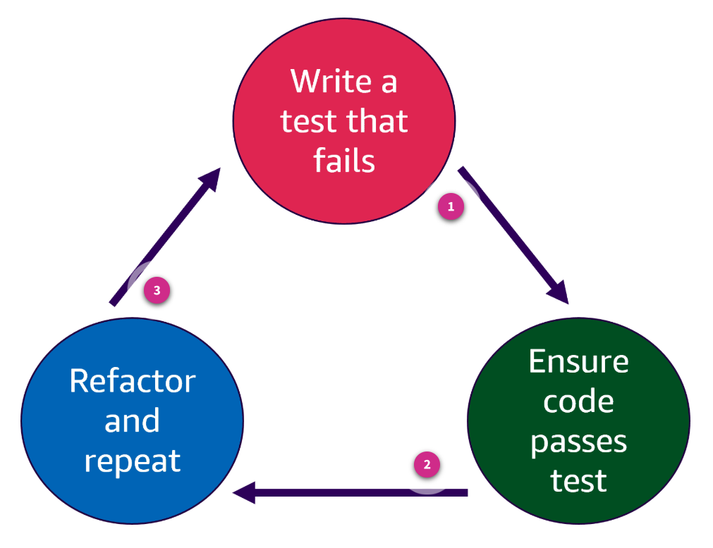

# Week 5: IaC: Testing AWS CDK Constructs

* back to AWS Cloud Institute repo's root [aci.md](../aci.md)
* back to [AWS Cloud Operations 2](./aws-cloud-operations-2.md)
* back to repo's main [README.md](../../../README.md)

## Testing AWS CDK Constructs

### Pre-assessment

#### How would a developer define a test-driven development (TDD) approach?

* Develop test cases to specify and validate the code

Wrong answers:

* Develop code without thought of validation testing.
* A test is performed after each line of code is built.
* Code is tested by peer developers on a weekly basis

##### Explanation

The other answers are incorrect as they do not define a test-driven development approach.

#### What is the correct definition of an assertion?

* A Boolean (true or false) expression that identifies the outcome of the code at a single point

Wrong answers:

* A bold statement in a line of code
* A conditional expression that identifies the outcome of the code at the end point 
* A rational expression that identifies what the code is doing

##### Explanation

If the Boolean is true, the code passes the test. If the outcome is false, then the code produces an error.

The other options are incorrect because bold text, conditional and rational expressions are not used to define assertions.

#### What do integration tests run against?

* The whole application

Wrong answers:

* One specific line of code
* Only on specific constructs
* A single stack

##### Explanation

Integration tests are designed to verify that the entire application, including all the infrastructure resources defined in the AWS CloudFormation template, works together as intended. They validate the configuration, provisioning, and interconnections of these resources.

The other answers are incorrect for the following reasons:  

* Integration tests focus on the interactions between components within the applications entire infrastructure, such as services, databases, and networks. This includes all stacks that make up the application, not just a single one.
* Although specific constructs might be part of what is tested in an integration test, the purpose of integration tests is broader. They aim to ensure that multiple constructs and their interactions within the stack work correctly as a whole. Focusing only on specific constructs would miss the overall integration aspect.
* Integration tests are designed to test how different components of a system work together. Testing a single line of code is more suited to unit tests, which focus on individual components or functions in isolation.

## Testing Methods Used with AWS CDK Apps

With the AWS CDK, your infrastructure is just as quickly testable as any other code you build. The AWS CDK apps use the same testing approach to test the AWS CDK assertions module and popular test frameworks. These frameworks include Jest for TypeScript and JavaScript or Pytest for Python.

### Test-driven development approach

It's a best-practice to follow a test-driven development (TDD) approach with the AWS CDK. TDD is a software development process that relies on the repetition of a very short development cycle. The steps are as follows:

1. Write a failing automated test case that defines a desired new function or improvement.
2. Write the minimum amount of code to pass that test.
3. Refactor the new code to acceptable standards.

You can use TDD to write the test case, first. This helps you validate the infrastructure with different design constraints in terms of enforcing a security policy for resources and following a unique naming convention for the project. The standard approach to testing AWS CDK applications is to use the AWS CDK assertions module and popular test frameworks. These include Jest for TypeScript and JavaScript or Pytest for Python.



1. **Write test that fails**

    Step 1: Write a failing automated test case that defines a desired new function or improvement. 

    **Example**: Write a small piece of code to add an Amazon S3 bucket.

    ```python
    #1. Write a test 
    def test_s3_bucket_created(): 
        app = cdk.App()
        stack = cdk.Stack(app, "test-stack")
        bucket = s3.Bucket(stack, "MyTestBucket")

        # Assert that the bucket resource exists 
        assert bucket is not None
    ```

2. **Fix code to pass test**

    Step 2: Write the minimum amount of code required to pass the new test. 

    **Example**: Run the test that was built in step 1. It will fail because no Amazon S3 bucket is defined.

3. **Refactor**

    Step 3: Refactor if necessary, then repeat.

    **Example**: Add the minimum code to pass the test.

    ```python
    app = cdk.App()

    stack = cdk.Stack(app, "test-stack")
    bucket = s3.Bucket(stack, "MyTestBucket")
    ```

    Rerun the test and now it passes. Repeat the process by adding more tests for additional features and functionality.

### Benefits of TDD

The key benefits of TDD with AWS CDK are as follows:

* Each change is verified through automated testing.
* The results are modular, flexible code.
* This allows for rapid feedback cycles and continuous integration.

TDD encourages an iterative development process focused on writing tests first, then just enough code to pass the tests before refactoring.

### Test categories

When building an app with the CDK, you must build in ways to test and verify that the code runs successfully. Testing the code in the app is much like testing any other type of code.

Writing test patterns for infrastructure is similar to writing test patterns for application code. First, identify and define the test case and then instantiate the construct as you would in your AWS CDK app. Finally, you make assertions about the CloudFormation template that the code would generate.

The AWS CDK has two categories of tests that you can write to validate your AWS CDK apps.

#### Fine-grained assertions

*Fine-grained assertions* test specific aspects of the generated template, such as *this resource has this property with this value*. Additionally, the following is true:

* An assertion is a Boolean (true or false) expression that identifies the outcome of the code at a single point. If the Boolean is true, the code passes the test. If the outcome is false, then the code produces and error.
* Fine-grained assertions can detect regressions. They're also useful when developing new features using test-driven development. (You write a test first, then make it pass by writing a correct implementation.)
* Fine-grained assertions are the most frequently used tests.

Imagine you have an AWS CDK app that creates an S3 bucket. A fine-grained assertion would verify that the bucket has versioning enabled.

For example, after synthesizing your CDK app, you check if the generated CloudFormation template includes a property specifying that versioning is set to Enabled. This ensures that specific configurations are correctly applied.

#### Snapshot tests

*Snapshot tests* validate the synthesized template against a previously stored baseline template. Snapshot testing is a common technique to store a snapshot of the output and compare it during future changes. Because CloudFormation templates are human readable, they are a good target for snapshot testing.

With snapshot tests, you can refactor freely because you can be sure that the refactored code works exactly the same way as the original. If the changes were intentional, you can accept a new baseline for future tests. However, AWS CDK upgrades can also cause synthesized templates to change, so you can't rely only on snapshots to make sure that your implementation is correct.

For example, consider you have a complex infrastructure defined in your AWS CDK app. A snapshot test would involve generating the CloudFormation template and saving it as a baseline snapshot. When you make changes to your app, the snapshot test compares the new template to the baseline to detect unintended changes. This ensures your infrastructure remains consistent over time.

### AWS CDK assertions module

The AWS CDK assertions module provides functions for writing test asserting against CDK applications, with a specific focus on CloudFormation templates. The Template class includes a set of methods for writing assertions against templates. The assertions module is located in the API reference guide for the AWS CDK.

* [**aws-cdk-lib.assertions module**](https://docs.aws.amazon.com/cdk/api/v2/docs/aws-cdk-lib.assertions-readme.html)

Testing should validate expected behavior of your AWS CDK application. There are two types of tests that are run.

#### Integration tests

Integration tests run against the whole of your application. Integration tests for AWS CDK constructs can also be included by using an *integ-tests* module.

An integration test should be defined as an AWS CDK application. There should be a one-to-one relationship between an integration test and an AWS CDK application.

For more information, navigate to [integ-tests-alpha module](https://docs.aws.amazon.com/cdk/api/v2/docs/integ-tests-alpha-readme.html)in the AWS CDK API Reference.

#### Unit tests

Unit tests using assertion functions are used to test configurations in the CloudFormation templates before deploying these templates.

There are differences between unit tests and integration tests. Although unit tests run on a single unit or function, integration tests run assertions in the deployed resources as a whole, and not just one specific section.

* [**How to Write and Execute Integration Tests for AWS CDK Applications**](https://aws.amazon.com/blogs/devops/how-to-write-and-execute-integration-tests-for-aws-cdk-applications/#:~:text=Unit%20tests%20using%20assertion%20functions,example%20application%20using%20AWS%20CDK)

### Best practice tips for testing

Tests only live as long as the code they test, and they are read and modified just as often. Take the time to consider what you want to test and determine how best to write them. The following are some best practices for testing:

* Don't copy and paste setup lines or common assertions. Instead, refactor this logic into fixtures or helper functions.
* Use good names that reflect what each test actually tests.
* Write basic tests. Trying to do too much in a single test is inefficient. Preferably, a test should only test a single behavior. If you accidentally break that behavior, one test should fail, and the name of the test should tell you what failed.

### Knowledge Check

#### Which test type validates specific aspects of a generated template?

* Fine-grained assertions

Wrong answers:

* Snapshot tests
* Unit test
* Integration test

##### Explanation

Fine-grained assertions test specific aspects of the generated template, such as *this resource has this property with this value*. This allows targeted testing of template logic.

The other options are incorrect because snapshot tests validate full output but not specific aspects. Unit tests don't directly validate generated output. Integration tests don't directly validate generated output.

#### Which type of test synthesizes a template against a previously stored baseline template?

* Snapshot tests

Wrong answers:

* Fine-grained assertions
* Unit test
* Integration test

##### Explanation

These test the synthesized template against a previously stored baseline template. Snapshot testing is a common technique to store a snapshot of the output and compare it during future changes. Because CloudFormation templates are human readable, they are a good target for snapshot testing.

The other options are incorrect because fine-grained assertions are low-level tests that validate small units of code, not entire snapshots. Unit tests validate individual software components in isolation, not against a full snapshot. Integration tests validate interactions between software components, not against a snapshot.

#### When would unit tests be used with the AWS Cloud Development Kit (AWS CDK)?

* To validate that the AWS CDK code is producing the expected AWS resources.

Wrong answers:

* To test the functionality of the AWS resources created by the AWS CDK.
* To verify that the AWS CDK app complies with organizational policies.
* To check that the AWS CDK constructs meet security standards.

##### Explanation

Unit tests validate that the AWS CDK code is working as expected by comparing the generated CloudFormation template against the expected resources and configurations. This gives developers the ability to test their AWS CDK code modules and constructs in isolation.

The other options are incorrect because:

* To test the functionality of the AWS resources created by the AWS CDK is incorrect because it validates resource functionality not AWS CDK code.
* To verify that the AWS CDK app complies with organizational policies is incorrect because policy compliance is out of scope.
* To check that the AWS CDK constructs meet security standards is incorrect because the security validation should be done separately.

### Summary

#### Defined AWS CDK and benefits

In this topic, you were introduced the the test-driven development approach. In this approach you write a failing test, test the code, fix, and refactor. This process makes the code less complicated to read and eliminates errors and bugs.

You were also introduced to the two categories of a test: Fine-grained assertions and snapshot tests. The topic covered how and when to use these.

In addition, the following items were covered:

* Described how to test AWS CDK apps
* Defined assertions and how they work
* Explored best practices for AWS CDK app testing
