# Week 7: Logging and Scaling: Auto Scaling and Elastic Load Balancing

* back to AWS Cloud Institute repo's root [aci.md](../aci.md)
* back to [AWS Cloud Operations 2](./aws-cloud-operations-2.md)
* back to repo's main [README.md](../../../README.md)

## Auto Scaling

### Pre-assessment

#### What is the main benefit of auto scaling in the cloud?

* It automatically scales resources to maintain performance as demand changes.

Wrong answers:

* Users can manually scale their resources up or down freely without any restriction.
* It provisions a fixed number of resources indefinitely.
* It launches as many resources as possible to handle peak load at all times.

##### Explanation

Auto scaling automatically scales resources based on metrics to optimize performance and cost as demand fluctuates.

The other options are incorrect for the following reason:

* A key benefit of auto scaling is the ability to scale resources automatically based on metrics like CPU utilization or traffic. Auto scaling aims to maintain enough resources to meet demand, and not peak demand 100 percent of the time.

#### Which Amazon EC2 Auto Scaling configuration would be used to scale based on demand?

* Monitor metrics like CPU utilization and scale out when thresholds are crossed.

Wrong answers:

* Launch instances on a fixed schedule regardless of workload.
* Scale out capacity preemptively for any type of workload.
* Launch new instances only when manually invoked.

##### Explanation

Amazon EC2 Auto Scaling responds to changes in monitored metrics like CPU utilization to scale appropriately.

The other options are incorrect because they are not the characteristics of Amazon EC2 Auto Scaling.

#### What is the purpose of the cooldown period in scaling policies?

* The cooldown period allows time for a previous scaling activity to finish before the next scaling activity starts. This prevents excessive scaling.

Wrong answers:

* The cooldown period prevents any scaling activities from happening. It is a period where no scaling occurs.
* The cooldown period causes all scaling activities to be blocked until it expires. This prevents scale-out and scale-in activities.
* The cooldown period has no impact on scaling activities. It is just a waiting period between activities.

##### Explanation

The cooldown period allows time for a previous scaling activity to finish before the next scaling activity starts. This prevents excessive scaling.

The other options are incorrect for the following reasons:

* The scaling policies support a cooldown period. This is the number of seconds to wait for a previous scaling activity to take effect. For scale-out events, the intention is to continuously (but not excessively) scale out. After service auto scaling successfully scales out using a scaling policy, it starts to calculate the cooldown time.
* The scaling policy won't increase the desired capacity again unless either a larger scale out is initiated or the cooldown period ends. While the scale-out cooldown period is in effect, the capacity added by the initiating scale-out activity is calculated as part of the desired capacity for the next scale-out activity.
* For scale-in events, the intention is to scale in conservatively to protect your application's availability, so scale-in activities are blocked until the cooldown period has expired. However, if another alarm initiates a scale-out activity during the scale-in cooldown period, service auto scaling scales out the target immediately. In this case, the scale-in cooldown period stops and doesn't complete.

### How Auto Scaling Works

Auto scaling works by scheduling and dynamically adjusting the number of resources allocated to an application, based on its current workload. Auto scaling relies on predefined metrics and thresholds to make decisions.

These metrics might include:

* CPU usage
* Network traffic
* Custom application-specific measurements

When these metrics exceed predefined alarm thresholds, auto scaling initiates.

The process begins with continuous monitoring of the selected metrics. The scaling tools collect real-time data on the application's performance. When a metric exceeds defined thresholds, an alarm is activated, which invokes a scaling action. This could be because of a spike or increase in the CPU usage due to high demand on the application, or it could be a decrease in CPU usage, suggesting underutilized resources. Auto scaling is configured with scaling policies to define which actions to take in response to specific alarms.

There are typically two types of scaling: horizontal and vertical. Amazon EC2 Auto Scaling uses horizontal scaling. Horizontal scaling involves adding or removing instances to handle increases or decreases in workload. Vertical scaling involves adjusting the capacity of existing instances by increasing or decreasing CPU and memory resources. Amazon EC2 Auto Scaling provides a number of ways to adjust scaling to best meet the needs of your applications.

* **Target tracking scaling**

    These policies increase or decrease the current capacity of the group based on an Amazon CloudWatch metric and target value. The way this works is similar to the way that your thermostat maintains the temperature of your home. You select a temperature, and the thermostat does the rest.

* **Step scaling**

    These policies increase or decrease the current capacity of the group based on a set of step adjustments, which vary based on specific CloudWatch alarm triggers.

* **Scheduled scaling**

    Scaling based on a schedule means that you can scale your application in response to predictable changes in demand. Let's say that every week, the traffic to your web application starts to increase on Wednesday, remains high on Thursday, and starts to decrease on Friday. You can configure a schedule for Amazon EC2 Auto Scaling to increase capacity on Wednesday and decrease capacity on Friday.

After the scaling event, the system performs health checks to ensure that the newly launched instances are operational and can handle the workload. Auto scaling continues to monitor and adjust the application's resources when the workload fluctuates. This helps to maintain the performance while optimizing costs.

The benefits of auto scaling:

* It enhances system reliability by ensuring that applications can adapt to varying workloads
* helps to prevent overprovisioning
* reduces operational costs

### Vertical scaling and horizontal scaling

#### Vertical scaling

Vertical scaling has the following characteristics:

* It involves increasing the specifications and resources of an existing server, for example, adding more RAM, CPU cores, and storage to a server to make it more powerful.
* It supports handling more load on the same server. It also reduces the need for more servers.
* It has hardware limitations in terms of how much a server can be upgraded.
* It requires downtime and migrations when upgrading server hardware.

#### Horizontal scaling

Horizontal scaling has the following characteristics:

* It involves adding more servers that function together as one unit, for example, adding more application servers behind a load balancer.
* It supports handling more overall load by distributing it across more servers. It's more scalable than vertical scaling.
* It has no hardware limitations. More inexpensive commodity servers can be added whenever needed.
* It provides scaling with no downtime. New servers can be added to the resource pool seamlessly.
* It requires more complex architecture and testing to distribute load and tasks.

### Application Auto Scaling and Amazon EC2 Auto Scaling

AWS Application Auto Scaling is a web service for developers and system administrators who need a solution for automatically scaling their scalable resources for individual AWS offerings such as Amazon ECS services, DynamoDB tables, and more. Amazon EC2 Auto Scaling is a specific feature used with Amazon EC2 instances. You create collections of EC2 instances, called Amazon EC2 Auto Scaling groups.

### Target tracking scaling

With target tracking scaling policies, you specify an Amazon CloudWatch metric and a target value that represents the ideal average utilization or throughput level for your application.

A target tracking scaling policy is more aggressive in adding capacity when utilization increases than it is in removing capacity when utilization decreases. For example, if the policy's specified metric reaches its target value, the policy assumes that your application is already heavily loaded. So it responds by adding capacity proportional to the metric value as fast as it can. The higher the metric, the more capacity is added.

When the metric falls below the target value, the policy expects that utilization will eventually increase again. In this case, it slows down scaling by removing capacity only when utilization passes a threshold that is far enough below the target value (usually more than 10 percent lower) for utilization to be considered to have slowed. The intention of this more conservative behavior is to ensure that removing capacity only happens when the application is no longer experiencing demand at the same high level that it was previously.

#### Choosing metrics

You can create target tracking scaling policies with either predefined metrics or custom metrics. Consider the following when choosing a metric:

* AWS recommends that you only use metrics that are available at 1-minute intervals to help you scale faster in response to utilization changes. Target tracking will evaluate metrics aggregated at a 1-minute granularity for all predefined metrics and custom metrics. But the underlying metric might publish data less frequently. For example, all Amazon EC2 metrics are sent in 5-minute intervals by default, but they are configurable to 1 minute (known as detailed monitoring). This choice is up to the individual services. Most try to use the smallest interval possible.
Not all custom metrics work for target tracking. The metric must be a valid utilization metric and describe how busy a scalable target is. The metric value must increase or decrease proportionally to the capacity of the scalable target so that the metric data can be used to proportionally scale the scalable target.
* To use the **ALBRequestCountPerTarget** metric, you must specify the **ResourceLabel** parameter to identify the load balancer target group that is associated with the metric.
* When a metric emits real 0 values to CloudWatch (for example, **ALBRequestCountPerTarget**), AWS Application Auto Scaling can scale in to 0 when there is no traffic to your application for a sustained period of time. To have your scalable target scale in to 0 when no requests are routed it, the scalable target's minimum capacity must be set to 0.
* Instead of publishing new metrics to use in your scaling policy, you can use metric math to combine existing metrics.

#### Defining target value

When you create a target tracking scaling policy, you must specify a target value. The target value represents the optimal average utilization or throughput for your application. To use resources cost efficiently, set the target value as high as possible with a reasonable buffer for unexpected traffic increases. When your application is optimally scaled out for a normal traffic flow, the actual metric value should be at or just below the target value.

When a scaling policy is based on throughput, such as the request count per target for an Application Load Balancer, network I/O, or other count metrics, the target value represents the optimal average throughput from a single entity (such as a single target of your Application Load Balancer target group), for a 1-minute period.

#### Considerations

The following considerations apply when working with target tracking scaling policies:

* Do not create, edit, or delete the CloudWatch alarms that are used with a target tracking scaling policy. Amazon EC2 Auto Scaling or Application Auto Scaling creates and manages the CloudWatch alarms that are associated with your target tracking scaling policies and deletes them when no longer needed.
* If the metric is missing data points, this causes the CloudWatch alarm state to change to **INSUFFICIENT_DATA**. When this happens, Amazon EC2 Auto Scaling or Application Auto Scaling cannot scale your scalable target until new data points are found.
* If the metric is sparsely reported by design, metric math can be helpful. For example, to use the most recent values, use the **FILL(m1,REPEAT)** function where m1 is the metric.
* You might see gaps between the target value and the actual metric data points. This is because AWS acts conservatively by rounding up or down when it determines how much capacity to add or remove. This prevents it from adding insufficient capacity or removing too much capacity. However, for a scalable target with a small capacity, the actual metric data points might seem far from the target value. For a scalable target with a larger capacity, adding or removing capacity causes less of a gap between the target value and the actual metric data points.
* A target tracking scaling policy assumes that it should perform scale out when the specified metric is above the target value. You can't use a target tracking scaling policy to scale out when the specified metric is below the target value.

### Step scaling

Step scaling policies increase or decrease the current capacity of a scalable target based on a set of scaling adjustments, known as step adjustments. The adjustments vary based on the size of the alarm breach. The policy continues to respond to additional alarms while a scaling activity is in progress. Therefore, all alarms that are breached are evaluated by Amazon EC2 Auto Scaling or Application Auto Scaling as it receives the alarm messages.

#### Step adjustments

When you create a step scaling policy, you specify one or more step adjustments that automatically scale the capacity of the target dynamically based on the size of the alarm breach. Each step adjustment specifies the following:

* A lower bound for the metric value
* An upper bound for the metric value
* The amount by which to scale, based on the scaling adjustment type

CloudWatch aggregates metric data points based on the statistic for the metric that is associated with your CloudWatch alarm. When the alarm is breached, the appropriate scaling policy is invoked. Amazon EC2 Auto Scaling or Application Auto Scaling applies the aggregation type to the most recent metric data points from CloudWatch (as opposed to the raw metric data). It compares this aggregated metric value against the upper and lower bounds defined by the step adjustments to determine which step adjustment to perform.

You specify the upper and lower bounds relative to the breach threshold. For example, let's say that you have a scalable target that has a capacity of 10. You have CloudWatch alarms with metric high and metric low thresholds of 60 percent and 40 percent, respectively.

You have an adjustment type of **PercentChangeInCapacity** and scale-out and scale-in policies with the following step adjustments:

##### Example: Step adjustments for scale-out policy

| Lower bound | Upper bound | Adjustment |
| ----------- | ----------- | ---------- |
| 0 | 10 | 0 |
| 10 | 20 | 10 |
| 20 | Null | 30 |

##### Example: Step adjustments for scale-in policy

| Lower bound | Upper bound | Adjustment |
| ----------- | ----------- | ---------- |
| -10 | 0 | 0 |
| -20 | -10 | -10 |
| Null | -20 | -30 |

This creates the following scaling configuration:

Metric value

```text
-infinity          30%    40%          60%     70%             infinity
-----------------------------------------------------------------------
          -30%      | -10% | Unchanged  | +10%  |       +30%        
-----------------------------------------------------------------------
```

##### Summary

* The original capacity is maintained while the aggregated metric value is greater than 40 and less than 60.
* If the metric value gets to 60, Application Auto Scaling increases the capacity of the scalable target by 1, to 11. That's based on the second step adjustment of the scale-out policy (add 10 percent of 10). After the new capacity is added, Application Auto Scaling increases the current capacity to 11. If the metric value rises to 70 even after this increase in capacity, Application Auto Scaling increases the target capacity by 3, to 14. That's based on the third step adjustment of the scale-out policy (add 30 percent of 11, 3.3, rounded down to 3).
* If the metric value gets to 40, Application Auto Scaling decreases the capacity of the scalable target by 1, to 13, based on the second step adjustment of the scale-in policy (remove 10 percent of 14, 1.4, rounded down to 1). If the metric value falls to 30 even after this decrease in capacity, Application Auto Scaling decreases the target capacity by 3, to 10, based on the third step adjustment of the scale-in policy (remove 30 percent of 13, 3.9, rounded down to 3).

When you specify the step adjustments for your scaling policy, note the following:

* The ranges of your step adjustments can't overlap or have a gap.
* Only one step adjustment can have a null lower bound (negative infinity). If one step adjustment has a negative lower bound, then there must be a step adjustment with a null lower bound.
* Only one step adjustment can have a null upper bound (positive infinity). If one step adjustment has a positive upper bound, then there must be a step adjustment with a null upper bound.
* The upper and lower bound can't be null in the same step adjustment.
* If the metric value is above the breach threshold, the lower bound is inclusive and the upper bound is exclusive. If the metric value is below the breach threshold, the lower bound is exclusive and the upper bound is inclusive.

#### Scheduled scaling

Scheduled scaling helps you to set up your own scaling schedule according to predictable load changes. To use scheduled scaling, you create scheduled actions. Scheduled actions are performed automatically as a function of date and time. When you create a scheduled action, you specify when the scaling activity should occur and the new desired minimum and maximum sizes for the scaling action. You can create scheduled actions that scale one time only or that scale on a recurring schedule.

You can use scheduled scaling and scaling policies together on the same resource to get the benefits of both. After a scheduled action runs, the scaling policy can continue to make decisions about whether to further scale capacity. This helps you ensure that you have sufficient capacity to handle the load for your application. While your application scales to match demand, current capacity must fall within the minimum and maximum capacity that was set by your scheduled action.

##### Considerations

When you create a scheduled action, keep the following in mind:

* A scheduled action sets the **MinCapacity** and **MaxCapacity** to what is specified by the scheduled action at the date and time specified. The request can optionally include only one of these sizes. For example, you can create a scheduled action with only the minimum capacity specified. In some cases, however, you must include both sizes to ensure that the new minimum capacity is not greater than the maximum capacity, or the new maximum capacity is not less than the minimum capacity.
* By default, the recurring schedules that you set are in Coordinated Universal Time (UTC). You can change the time zone to correspond to your local time zone or a time zone for another part of your network. When you specify a time zone that observes daylight saving time, the action automatically adjusts for Daylight Saving Time (DST).
* You can temporarily turn off scheduled scaling for a scalable target. This helps you prevent scheduled actions from being active without having to delete them. You can then resume scheduled scaling when you want to use it again.
* The order in which scheduled actions run is guaranteed for the same scalable target, but not for scheduled actions across scalable targets.
* To complete a scheduled action successfully, the specified resource must be in a scalable state in the target service. If it isn't, the request fails and returns an error message, for example: *Resource Id \[ActualResourceId\] is not scalable. Reason: The status of all DB instances must be 'available' or 'incompatible-parameters'*.
* A scheduled action generally runs within seconds. However, the action might be delayed for up to 2 minutes from the scheduled start time. Because scheduled actions are run in the order that they are specified, scheduled actions with start times close to each other can take longer to run.

##### Commonly used commands for scheduled action creation, management, and deletion

The following commands are commonly used for working with scheduled scaling:

* Use the [register-scalable-target](https://awscli.amazonaws.com/v2/documentation/api/latest/reference/application-autoscaling/register-scalable-target.html) command to register AWS or custom resources as scalable targets (a resource that Application Auto Scaling can scale), and to suspend and resume scaling.
* Use the [put-scheduled-action](https://awscli.amazonaws.com/v2/documentation/api/latest/reference/application-autoscaling/put-scheduled-action.html) command to add or modify scheduled actions for an existing scalable target.
* Use the [describe-scaling-activities](https://awscli.amazonaws.com/v2/documentation/api/latest/reference/application-autoscaling/describe-scaling-activities.html) command to return information about scaling activities in an AWS Region.
* Use the [describe-scheduled-actions](https://awscli.amazonaws.com/v2/documentation/api/latest/reference/application-autoscaling/describe-scheduled-actions.html) command to return information about scheduled actions in an AWS Region.
* Use the [delete-scheduled-action](https://awscli.amazonaws.com/v2/documentation/api/latest/reference/application-autoscaling/delete-scheduled-action.html) command to delete a scheduled action.

##### Limitations

The following are limitations when using scheduled scaling:

* The names of scheduled actions must be unique per scalable target.
* Application Auto Scaling doesn't provide second-level precision in schedule expressions. The finest resolution using a cron expression is 1 minute.
* The scalable target can't be an Amazon Managed Streaming for Apache Kafka (Amazon MSK) cluster. Scheduled scaling is not supported for Amazon MSK.
* Console access to view, add, update, or remove scheduled actions on scalable resources depends on the resource that you use.

### Auto Scaling with Amazon ECS

Amazon Elastic Container Service (Amazon ECS) is a fully managed container orchestration service that helps you deploy, manage, and scale containerized applications.

With Amazon ECS, your applications are containerized. An Amazon ECS cluster can run a containerized application as a task. Amazon ECS services are used to run and maintain your desired number of tasks.

Amazon ECS services are scaled by modifying the number of running tasks.

#### Application Auto Scaling with Amazon ECS

Amazon ECS uses the Application Auto Scaling service to provide service auto scaling functionality. Application Auto Scaling is a web service for developers and system administrators who need a solution for automatically scaling their scalable resources for individual AWS services beyond Amazon EC2.

Amazon ECS publishes CloudWatch metrics with your service’s average CPU and memory usage. You can use these and other CloudWatch metrics to scale out your service (add more tasks) to deal with high demand at peak times, and to scale in your service (run fewer tasks) to reduce costs during periods of low utilization.

Amazon ECS supports target tracking scaling, step scaling, and scheduled scaling.

#### Service auto scaling and deployments

Application Auto Scaling turns off scale-in processes while Amazon ECS deployments are in progress. However, scale-out processes continue to occur, unless suspended, during a deployment. If you want to suspend scale-out processes while deployments are in progress, take the following steps.

1. Call the [describe-scalable-targets](https://awscli.amazonaws.com/v2/documentation/api/latest/reference/application-autoscaling/describe-scalable-targets.html) command, specifying the resource ID of the service associated with the scalable target in Application Auto Scaling (for example: **service/default/sample-webapp**). Record the output. You will need it when you call the next command.
2. Call the [register-scalable-target](https://awscli.amazonaws.com/v2/documentation/api/latest/reference/application-autoscaling/register-scalable-target.html) command, specifying the resource ID, namespace, and scalable dimension. Specify **true** for both **DynamicScalingInSuspended** and **DynamicScalingOutSuspended**.
3. After deployment is complete, you can call the [register-scalable-target](https://awscli.amazonaws.com/v2/documentation/api/latest/reference/application-autoscaling/register-scalable-target.html) command to resume scaling.

#### Considerations

When using scaling policies, consider the following:

* Amazon ECS sends metrics in 1-minute intervals to CloudWatch. Metrics are not available until the clusters and services send the metrics to CloudWatch, and you cannot create CloudWatch alarms for metrics that do not exist.
* The scaling policies support a cooldown period. This is the number of seconds to wait for a previous scaling activity to take effect. For scale-out events, the intention is to continuously (but not excessively) scale out. After service auto scaling successfully scales out using a scaling policy, it starts to calculate the cooldown time. The scaling policy won't increase the desired capacity again unless either a larger scale out is initiated or the cooldown period ends. While the scale-out cooldown period is in effect, the capacity added by the initiating scale-out activity is calculated as part of the desired capacity for the next scale-out activity. For scale-in events, the intention is to scale in conservatively to protect your application's availability, so scale-in activities are blocked until the cooldown period has expired. However, if another alarm initiates a scale-out activity during the scale-in cooldown period, service auto scaling scales out the target immediately. In this case, the scale-in cooldown period stops and doesn't complete.
* If a service's desired count is set below its minimum capacity value, and an alarm activates a scale-out activity, service auto scaling scales the desired count up to the minimum capacity value. It continues to scale out as required, based on the scaling policy associated with the alarm. However, a scale-in activity does not adjust the desired count because it is already below the minimum capacity value.
* If a service's desired count is set above its maximum capacity value, and an alarm activates a scale-in activity, service auto scaling scales the desired count out to the maximum capacity value. It continues to scale in as required, based on the scaling policy associated with the alarm. However, a scale-out activity does not adjust the desired count because it is already above the maximum capacity value.
* During scaling activities, the actual running task count in a service is the value that service auto scaling uses as its starting point, as opposed to the desired count. This is what processing capacity is supposed to be. This prevents excessive (runaway) scaling that might not be satisfied, for example, if there aren't enough container instance resources to place the additional tasks. If the container instance capacity is available later, the pending scaling activity might succeed, and then further scaling activities can continue after the cooldown period.
* If you want your task count to scale to zero when there's no work to be done, set a minimum capacity of 0. With target tracking scaling policies, when actual capacity is 0 and the metric indicates that there is workload demand, service auto scaling waits for one data point to be sent before scaling out. In this case, it scales out by the minimum possible amount as a starting point and then resumes scaling based on the actual running task count.
* Application Auto Scaling turns off scale-in processes while Amazon ECS deployments are in progress. However, scale-out processes continue to occur, unless suspended, during a deployment.
* You have several Application Auto Scaling options for Amazon ECS tasks. Target tracking is the easiest mode to use. With it, all you need to do is set a target value for a metric, such as CPU average utilization. Then the auto scaler automatically manages the number of tasks that are needed to attain that value. With step scaling, you can more quickly react to changes in demand, because you define the specific thresholds for your scaling metrics, and how many tasks to add or remove when the thresholds are crossed. And more importantly, you can react very quickly to changes in demand by minimizing the amount of time that a threshold alarm is in breach.

#### Task scale-in protection

You can use Amazon ECS task scale-in protection to protect your tasks from being terminated by scale-in events from either service auto scaling or deployments. Certain applications require a mechanism to safeguard mission-critical tasks from termination by scale-in events during times of low utilization or during service deployments. Here are some examples:

* You have a queue-processing asynchronous application such as a video transcoding job where some tasks have to run for hours even when cumulative service utilization is low.
* You have a gaming application that runs game servers as Amazon ECS tasks that have to continue running even if all users have logged out, to reduce startup latency of a server reboot.
* When you deploy a new code version, you need tasks to continue running because it would be expensive to reprocess.

To protect tasks that belong to your service from terminating in a scale-in event, set the **protectionEnabled** attribute to **true**. By default, tasks are protected for 2 hours. You can customize the protection period by using the **expiresInMinutes** attribute. You can protect your tasks for a minimum of 1 minute and up to a maximum of 2,880 minutes (48 hours).

After a task finishes its requisite work, you can set the **protectionEnabled** attribute to **false**, allowing the task to be terminated by subsequent scale-in events.

#### Task scale-in protection mechanisms

You can set and get task scale-in protection using either the Amazon ECS container agent endpoint or the Amazon ECS API.

##### Amazon ECS container agent endpoint

AWS recommends using the Amazon ECS container agent endpoint for tasks that can self-determine the need to be protected. Use this approach for queue-based or job-processing workloads.

When a container starts processing work, for example by consuming an Amazon Simple Queue Service (Amazon SQS) message, you can set the **ProtectionEnabled** attribute through the task scale-in protection endpoint path **$ECS_AGENT_URI/task-protection/v1/state** from within the container. Amazon ECS will not terminate this task during scale-in events. After your task finishes its work, you can unset the **ProtectionEnabled** attribute using the same endpoint, making the task eligible for termination during subsequent scale-in events.

##### Amazon ECS API

You can use the Amazon ECS API to set task scale-in protection if your application has a component that tracks the status of active tasks. Use **UpdateTaskProtection** to mark one or more tasks as protected.

An example of this approach would be if your application is hosting game server sessions as Amazon ECS tasks. When a user logs in to a session on the server (task), you can mark the task as protected. After the user logs out, you can either clear the protection specifically for this task or periodically clear protection for similar tasks that no longer have active sessions, depending on your requirement to keep idle servers.

You can also combine both approaches. For example, use the Amazon ECS agent endpoint to set task protection from within a container and use the Amazon ECS API to remove task protection from your external controller service.

### Auto Scaling with DynamoDB

Many database workloads are cyclical in nature, and others are difficult to predict in advance. For one example, consider a social networking app where most of the users are active during daytime hours. The database must be able to handle the daytime activity, but there's no need for the same levels of throughput at night. Consider another example, a new mobile gaming app that is experiencing unexpectedly rapid adoption. If the game becomes too popular, it could exceed the available database resources, resulting in slow performance and unhappy customers. These kinds of workloads often require manual intervention to scale database resources up or down in response to varying usage levels.

Amazon DynamoDB auto scaling uses the Application Auto Scaling service to dynamically adjust provisioned throughput capacity on your behalf, in response to actual traffic patterns. This makes it possible for a table or a global secondary index to increase its provisioned read and write capacity to handle sudden increases in traffic, without throttling. When the workload decreases, Application Auto Scaling decreases the throughput so that you don't pay for unused provisioned capacity.

**If you use the AWS Management Console to create a table or a global secondary index, DynamoDB auto scaling is enabled by default. You can modify your auto scaling settings at any time. When you delete a table or global table replica, any associated scalable targets, scaling polices, or CloudWatch alarms are not automatically deleted with it.**

With Application Auto Scaling, you create a scaling policy for a table or a global secondary index. The scaling policy specifies whether you want to scale read capacity or write capacity (or both), and the minimum and maximum provisioned capacity unit settings for the table or index.

The scaling policy also contains a target utilization—the percentage of consumed provisioned throughput at a point in time. Application Auto Scaling uses a target tracking algorithm to adjust the provisioned throughput of the table (or index) upward or downward in response to actual workloads, so that the actual capacity utilization remains at or near your target utilization.

You can set the auto scaling target utilization values between 20 and 90 percent for your read and write capacity.

**In addition to tables, DynamoDB auto scaling also supports global secondary indexes. Every global secondary index has its own provisioned throughput capacity, separate from that of its base table. When you create a scaling policy for a global secondary index, Application Auto Scaling adjusts the provisioned throughput settings for the index to ensure that its actual utilization stays at or near your desired utilization ratio.**

### How DynamoDB auto scaling works


1. **Create an Application Auto Scaling policy**

    You create an Application Auto Scaling policy for your DynamoDB table.

2. **Publish metrics**

    DynamoDB publishes consumed capacity metrics to Amazon CloudWatch.

3. **Activate alarms**

    If the table's consumed capacity exceeds your target utilization (or falls below the target) for a specific length of time, CloudWatch activates an alarm. You can view the alarm on the console and receive notifications using Amazon Simple Notification Service (Amazon SNS).

4. **Invoke Application Auto Scaling**

    The CloudWatch alarm invokes Application Auto Scaling to evaluate your scaling policy.

5. **Issue an UpdateTable request**

    Application Auto Scaling issues an **UpdateTable** request to adjust your table's provisioned throughput.

6. **Process the UpdateTable request**

    DynamoDB processes the **UpdateTable** request, dynamically increasing (or decreasing) the table's provisioned throughput capacity so that it approaches your target utilization.

Suppose that you have a table named **ProductCatalog**. The table is bulk-loaded with data infrequently, so it doesn't incur very much write activity. However, it does experience a high degree of read activity, which varies over time. By monitoring the CloudWatch metrics for **ProductCatalog**, you determine that the table requires 1,200 read capacity units (to avoid DynamoDB throttling read requests when activity is at its peak). You also determine that **ProductCatalog** requires 150 read-capacity units at a minimum, when read traffic is at its lowest point.

Within the range of 150 to 1,200 read-capacity units, you decide that a target utilization of 70 percent would be appropriate for the **ProductCatalog** table. Target utilization is the ratio of consumed capacity units to provisioned capacity units, expressed as a percentage. Application Auto Scaling uses its target tracking algorithm to ensure that the provisioned read capacity of **ProductCatalog** is adjusted as required so that utilization remains at or near 70 percent.

```text
DynamoDB auto scaling modifies provisioned throughput settings only when the actual workload stays elevated or depressed for a sustained period of several minutes. The Application Auto Scaling target tracking algorithm seeks to keep the target utilization at or near your chosen value over the long term.

Sudden, short-duration spikes of activity are accommodated by the table's built-in burst capacity.
```

To enable DynamoDB auto scaling for the **ProductCatalog** table, you create a scaling policy. This policy specifies the following:

* The table or global secondary index that you want to manage
* Which capacity type to manage (read capacity or write capacity)
* The upper and lower boundaries for the provisioned throughput settings
* Your target utilization

When you create a scaling policy, Application Auto Scaling creates a pair of CloudWatch alarms on your behalf. Each pair represents the upper and lower boundaries for your provisioned throughput settings. These CloudWatch alarms are invoked when the table's actual utilization deviates from your target utilization for a sustained period of time.

When one of the CloudWatch alarms is activated, Amazon SNS sends you a notification (if you have enabled it). The CloudWatch alarm then invokes Application Auto Scaling, which in turn notifies DynamoDB to adjust the **ProductCatalog** table's provisioned capacity upward or downward as appropriate.

#### Considerations

Before you begin using DynamoDB auto scaling, you should be aware of the following:

* DynamoDB auto scaling can increase read capacity or write capacity as often as necessary, in accordance with your auto scaling policy.
* DynamoDB auto scaling updates your table’s provisioned capacity within minutes. Factor this scaling time into your auto scaling settings to allow time for the capacity to be provisioned.
* DynamoDB auto scaling doesn't prevent you from manually modifying provisioned throughput settings. These manual adjustments don't affect any existing CloudWatch alarms that are related to DynamoDB auto scaling.
* If you enable DynamoDB auto scaling for a table that has one or more global secondary indexes, AWS highly recommends that you also apply auto scaling uniformly to those indexes. This will help ensure better performance for table writes and reads, and help avoid throttling. You can enable auto scaling by selecting **Apply same settings to global secondary indexes** in the AWS Management Console.
* When you delete a table or global table replica, any associated scalable targets, scaling polices, or CloudWatch alarms are not automatically deleted with it.
* When you create a global secondary index (GSI) for an existing table, auto scaling is not enabled for the GSI. You will have to manually manage the capacity while the GSI is being built. When the backfill on the GSI is complete and it reaches active status, auto scaling will operate as normal.

### Auto Scaling with Aurora

To meet your connectivity and workload requirements, Amazon Aurora uses Application Auto Scaling to dynamically adjust the number of Aurora Replicas (reader DB instances) provisioned for an Aurora DB cluster.

Aurora Replicas have two main purposes. You can issue queries to them to scale the read operations for your application. You typically do so by connecting to the reader endpoint of the cluster. That way, Aurora can spread the load for read-only connections across as many Aurora Replicas as you have in the cluster. Aurora Replicas also help to increase availability. If the writer instance in a cluster becomes unavailable, Aurora automatically promotes one of the reader instances to take its place as the new writer.

Aurora auto scaling is available for both Amazon Aurora MySQL-Compatible Edition and Amazon Aurora PostgreSQL-Compatible Edition. Aurora auto scaling empowers your Aurora DB cluster to handle sudden increases in connectivity or workload. When the connectivity or workload decreases, Aurora auto scaling removes unnecessary Aurora Replicas so that you don't pay for unused provisioned DB instances.

You define and apply a scaling policy to an Aurora DB cluster. The scaling policy defines the minimum and maximum number of Aurora Replicas that Aurora auto scaling can manage. Based on the policy, Aurora auto scaling adjusts the number of Aurora Replicas up or down in response to actual workloads, determined by using CloudWatch metrics and target values.

You can use the AWS Management Console to apply a scaling policy based on a predefined metric. Alternatively, you can use either the AWS Command Line Interface (AWS CLI) or Application Auto Scaling API to apply a scaling policy based on a predefined or custom metric.

#### Considerations

Before you can use Aurora auto scaling with an Aurora DB cluster, you must first create an Aurora DB cluster with a primary (writer) DB instance. Aurora auto scaling only scales a DB cluster if the DB cluster is in the available state.

When Application Auto Scaling adds a new Aurora replica, the new Aurora replica is the same DB instance class as the one used by the primary instance. Also, the promotion tier for new Aurora replicas is set to the last priority, which is 15 by default. This means that during a failover, a replica with a better priority, such as one created manually, would be promoted first.

Aurora auto scaling only removes Aurora replicas that it created.

To benefit from Aurora auto scaling, your applications must support connections to new Aurora replicas. To do so, AWS recommends using the Aurora reader endpoint. For Aurora MySQL-Compatible, you can use a driver such as the AWS JDBC Driver for MySQL.

**Aurora global databases currently do not support Aurora auto scaling for secondary DB clusters.**

### Aurora auto scaling policies

Aurora auto scaling uses a scaling policy to adjust the number of Aurora replicas in an Aurora DB cluster. You can scale Aurora DB clusters using target tracking scaling policies, step scaling policies, and scheduled scaling.

#### Service-linked role

Aurora auto scaling uses the **AWSServiceRoleForApplicationAutoScaling_RDSCluster** service-linked role.

The service-linked role can be assumed only by the service principal authorized by the trust relationships defined for the role. The service-linked role used by Application Auto Scaling grants access to the following service principal:

* **rds.application-autoscaling.amazonaws.com**

#### Target metric

In this type of policy, a predefined or custom metric and a target value for the metric are specified in a target-tracking scaling policy configuration. Aurora auto scaling creates and manages CloudWatch alarms that invoke the scaling policy and calculates the scaling adjustment based on the metric and target value.

The scaling policy adds or removes Aurora replicas as required to keep the metric at, or close to, the specified target value. In addition to keeping the metric close to the target value, a target-tracking scaling policy also adjusts to fluctuations in the metric due to a changing workload.

Such a policy also minimizes rapid fluctuations in the number of available Aurora replicas for your DB cluster.

For example, take a scaling policy that uses the predefined average CPU utilization metric. Such a policy can keep CPU utilization at, or close to, a specified percentage of utilization, such as 40 percent.

**Note**: For each Aurora DB cluster, you can create only one scaling policy for each target metric.

#### Minimum and maximum capacity

You can specify the maximum number of Aurora replicas to be managed by Application Auto Scaling. This value must be set to any number between 0 and 15, and must be equal to or greater than the value specified for the minimum number of Aurora replicas.

You can also specify the minimum number of Aurora replicas to be managed by Application Auto Scaling. This value must be set to any number between 0 and 15, and must be equal to or less than the value specified for the maximum number of Aurora replicas.

**Note**: The minimum and maximum capacity are set for an Aurora DB cluster. The specified values apply to all the policies associated with that Aurora DB cluster.

#### Cooldown period

You can tune the responsiveness of a target-tracking scaling policy by adding cooldown periods that affect the scaling of your Aurora DB cluster in and out. A cooldown period blocks subsequent scale-in or scale-out requests until the period expires. These blocks slow the deletions of Aurora replicas in your Aurora DB cluster for scale-in requests, and the creation of Aurora replicas for scale-out requests.

You can specify the following cooldown periods:

* A scale-in activity reduces the number of Aurora replicas in your Aurora DB cluster. A scale-in cooldown period specifies the amount of time, in seconds, after a scale-in activity is complete before another scale-in activity can start.
* A scale-out activity increases the number of Aurora replicas in your Aurora DB cluster. A scale-out cooldown period specifies the amount of time, in seconds, after a scale-out activity is complete before another scale-out activity can start.
* If you don't set the scale-in or scale-out cooldown period, the default for each is 300 seconds.

**Note**: A scale-out cooldown period is ignored if a subsequent scale-out request is for a larger number of Aurora replicas than the first request.

#### Enabling or disabling scale-in activities

You can enable or disable scale-in activities for a policy. Enabling scale-in activities allows the scaling policy to delete Aurora replicas. When scale-in activities are enabled, the scale-in cooldown period in the scaling policy applies to scale-in activities. Disabling scale-in activities prevents the scaling policy from deleting Aurora replicas.

**Note**: Scale-out activities are always enabled so that the scaling policy can create Aurora replicas as needed.

### DB instance IDs and tagging

When a replica is added by Aurora auto scaling, its DB instance ID is prefixed by **application-autoscaling-**, for example, **application-autoscaling-61aabbcc-4e2f-4c65-b620-ab7421abc123**.

The following tag is automatically added to the DB instance. You can view it on the Tags tab of the DB instance detail page.

| Tag | Value |
| --- | ----- |
| application-autoscaling:resourceId | cluster:mynewcluster-cluster |

### Aurora auto scaling and Performance Insights

Performance Insights expands on existing Amazon Aurora monitoring features to illustrate and help you analyze your cluster performance. By default, Performance Insights is turned on in the console create wizard for all Amazon RDS engines.

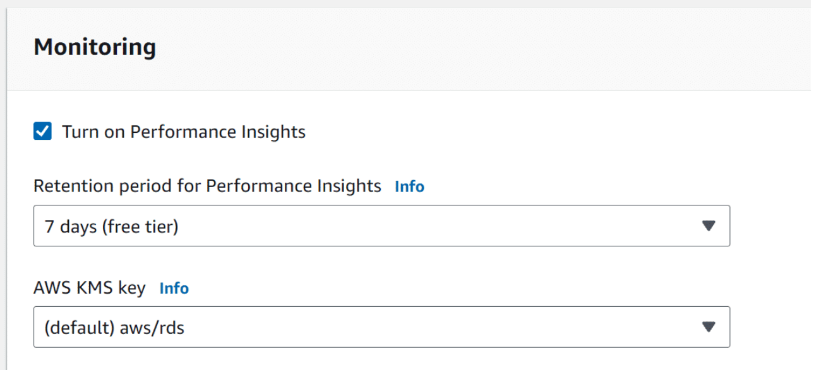

With the Performance Insights dashboard, you can visualize the database load on your Amazon Aurora cluster load and filter the load by waits, SQL statements, hosts, or users. You can use Performance Insights to monitor replicas that have been added by Aurora auto scaling, the same as with any Aurora reader DB instance.

You can't turn on Performance Insights for an Aurora DB cluster. You can manually turn on Performance Insights for each DB instance in the DB cluster.

When you turn on Performance Insights for the writer DB instance in your Aurora DB cluster, Performance Insights isn't turned on automatically for reader DB instances. You have to turn on Performance Insights manually for the existing reader DB instances and new replicas added by Aurora auto scaling.

## Amazon EC2 Auto Scaling

Amazon EC2 Auto Scaling helps you ensure that you have the correct number of Amazon EC2 instances available to handle the load for your application. You create collections of EC2 instances, called **Amazon EC2 Auto Scaling groups**.

You can specify the minimum number of instances in each Auto Scaling group, and Amazon EC2 Auto Scaling ensures that your group never goes below this size. You can specify the maximum number of instances in each Auto Scaling group, and Amazon EC2 Auto Scaling ensures that your group never goes above this size. If you specify the desired capacity, either when you create the group or at any time thereafter, Amazon EC2 Auto Scaling ensures that your group has this many instances. If you specify scaling policies, Amazon EC2 Auto Scaling can launch or terminate instances as demand on your application increases or decreases.

### Amazon EC2 Auto Scaling components

1. **Launch templates**

    Before you can create an Auto Scaling group using a launch template, you must create a launch template that includes the parameters required to launch an EC2 instance, such as the ID of the Amazon Machine Image (AMI) and an instance type.

    A launch template provides full functionality for Amazon EC2 Auto Scaling and also newer features of Amazon EC2, such as the current generation of Amazon Elastic Block Store (Amazon EBS) Provisioned IOPS volumes (io2), EBS volume tagging, T2 Unlimited instances, Elastic Inference, and Dedicated Hosts.

2. **Groups**

    Your EC2 instances are organized into groups so that they can be treated as a logical unit for the purposes of scaling and management. When you create a group, you can specify its minimum, maximum, and desired number of EC2 instances.

    For example, a Scaling group can have a minimum size of one instance, a desired capacity of two instances, and a maximum size of four instances. The scaling policies that you define adjust the number of instances, within your minimum and maximum number of instances, based on the criteria that you specify.

3. **Scaling options**

    Amazon EC2 Auto Scaling provides several ways for you to scale your Auto Scaling groups. You can use the following tools to invoke scaling in your groups:

    * **Health status checks**: You can configure your group to maintain a specified number of running instances at all times. If an instance becomes unhealthy, the group terminates the unhealthy instance and launches another instance to replace it.
    * **Manual scaling**: Manual scaling is the most basic way to scale your resources. You specify only the change in the maximum, minimum, or desired capacity of your group. Amazon EC2 Auto Scaling manages the process of creating or terminating instances to maintain the updated capacity.
    * **Schedules**: You can scale by schedule. Actions are performed automatically as a function of time and date. Scaling by schedule is useful when you know exactly when to increase or decrease the number of instances in your group.
    * **Demands**: A more advanced way to scale your resources, using dynamic scaling, lets you define a scaling policy that dynamically resizes your Auto Scaling group to meet changes in demand. For example, let's say that you have a web application that currently runs on two instances, and you want the CPU utilization of the Auto Scaling group to stay at around 50 percent when the load on the application changes. This method is useful for scaling in response to changing conditions, when you don't know when those conditions will change. You can set up Amazon EC2 Auto Scaling to respond for you.
    * **Predictive scaling**: You can also combine predictive scaling and dynamic scaling (proactive and reactive approaches, respectively) to scale your Amazon EC2 capacity faster. Use predictive scaling to increase the number of EC2 instances in your Auto Scaling group in advance of daily and weekly patterns in traffic flows.

There are no additional fees with Amazon EC2 Auto Scaling, and you only pay for the AWS resources (for example, EC2 instances, EBS volumes, and CloudWatch alarms) that you use.

### Amazon EC2 Auto Scaling instance lifecycle

The EC2 instances in an Auto Scaling group have a path, or lifecycle, that differs from that of other EC2 instances. The lifecycle starts when the Auto Scaling group launches an instance and puts it into service. The lifecycle ends when you terminate the instance, or the Auto Scaling group takes the instance out of service and terminates it.

**You are billed for instances as soon as they are launched, including the time that they are not yet in service.**

The following illustration shows the transitions between instance states in the Amazon EC2 Auto Scaling lifecycle.

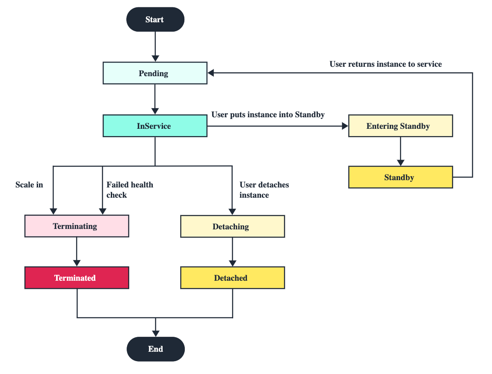

This example of the Amazon EC2 Auto Scaling lifecycle shows that the lifecycle starts when the Auto Scaling group launches an instance. This new instance goes to the *Pending* state and then gets put into service.

When the instance is in an *InService state*, you can put this instance into a *Standby* state. When the instance is in the *Standby* state, you can troubleshoot or make changes to it. When you are finished with the changes, you can put the instance back into service. The instance will then go to the *Pending* state briefly before it gets put into service again.

The lifecycle ends when you terminate the instance because of a scale-in event or because the instance fails the health check. Or the lifecycle also ends when the Auto Scaling group takes the instance out of service (detach instances).

#### Scale-out events

The following scale-out events direct the Auto Scaling group to launch EC2 instances and attach them to the group:

* You manually increase the size of the group.
* You create a scaling policy to automatically increase the size of the group based on a specified increase in demand.
* You set up scaling by schedule to increase the size of the group at a specific time.

When a scale-out event occurs, the Auto Scaling group launches the required number of EC2 instances, using its assigned launch template. These instances start in the *Pending* state. When each instance is fully configured and passes the Amazon EC2 health checks, it is attached to the Auto Scaling group and it enters the *InService* state. The instance is counted against the desired capacity of the Auto Scaling group.

#### Instances in service

Instances remain in the *InService* state until one of the following occurs:

* A scale-in event occurs, and Amazon EC2 Auto Scaling chooses to terminate this instance to reduce the size of the Auto Scaling group.
* You put the instance into a *Standby* state.
* You detach the instance from the Auto Scaling group.
* The instance fails a required number of health checks, so it is removed from the Auto Scaling group, terminated, and replaced.

#### Scale-in events

The following scale-in events direct the Auto Scaling group to detach EC2 instances from the group and terminate them:

* You manually decrease the size of the group.
* You create a scaling policy to automatically decrease the size of the group based on a specified decrease in demand.
* You set up scaling by schedule to decrease the size of the group at a specific time.

It is important that you create a corresponding scale-in event for each scale-out event that you create. This helps ensure that the resources assigned to your application match the demand for those resources as closely as possible. When a scale-in event occurs, the Auto Scaling group terminates one or more instances. The Auto Scaling group uses its termination policy to determine which instances to terminate. Your Auto Scaling groups use a default termination policy, but you can optionally choose or create your own termination policies with your own termination. The default termination policy helps ensure that instances are distributed evenly across Availability Zones for high availability.

For example, you have an environment that has an Auto Scaling group that uses a default termination policy across two Availability Zones referred to as AZ-a and AZ-b. AZ-a has four Amazon EC2 instances, and AZ-b has three EC2 instances. During the scale-in event, Amazon EC2 Auto Scaling selects the Availability Zone with four instances, and then continues to evaluate.

This action is the starting point of the default termination policy if the Availability Zones have an unequal number of instances, and the instances are unprotected.

Then the Auto Scaling group terminates the instance that was launched from the oldest launch template. If the instances were launched from the same launch template or launch configuration, Amazon EC2 Auto Scaling selects the instance that is closest to the next billing hour and terminates it.

Instances that are in the process of terminating from the Auto Scaling group enter the *Terminating* state and can't be put back into service.

* [Get Started with Amazon EC2 Auto Scaling ](https://docs.aws.amazon.com/autoscaling/ec2/userguide/get-started-with-ec2-auto-scaling.html)

### Automatic and Manual Scaling

#### Configuring and launching Auto Scaling groups

Amazon EC2 Auto Scaling automatically increases and decreases EC2 instances in an Auto Scaling group, based on user-defined policies, schedules, and health checks.

Amazon EC2 Auto Scaling is a service that automatically increases and decreases the number of EC2 instances available to handle the load of an application. This collection of EC2 instances is called an Amazon EC2 Auto Scaling group. The number of EC2 instances in an Auto Scaling group is scaled in or out based on user-defined policies, schedules, and health checks.

##### Launch templates

You use a launch template to specify the instance configuration information for your Auto Scaling group.

* Amazon Machine Image (AMI)
* EC2 instance type
* A key pair to access the instance
* User data
* EBS volume
* Network interface
* Security group
* Tags

You can use a combination of On-Demand Instances, Reserved Instances, and Spot Instances in your launch template.

Launch templates are immutable; after you create a launch template, you can't modify it. Instead, you create a new version of the launch template that includes any changes you require. This is an efficient way to deploy EC2 configuration and application updates through a consistent and secure pipeline.

##### Scaling policy

When you create an Auto Scaling group, you can select a launch template to use. Additionally, you can choose a scaling policy to increase or decrease the number of instances in your group dynamically in response to changing conditions. There are several scaling policies you can choose from, and you can use them individually or combine them.

Use **dynamic scaling** to scale the capacity of your Auto Scaling group as traffic changes occur. With a simple scaling policy, you choose a metric and set a minimum and a maximum threshold that will cause the Auto Scaling group to scale in or scale out.

For example, you can set the policy to launch a new instance when the CPU utilization for the group is above 75 percent for more than 2 minutes. You can also set the policy to terminate an instance when CPU utilization is less than 40 percent.

With a **step scaling** policy, you can set multiple alarms to launch or terminate instances in response to multiple thresholds. For example, you can launch one additional instance when the CPU utilization is greater than 40 percent. Then you can launch two more instances when CPU utilization is greater than 80 percent.

**Target tracking** is a less complex way to scale EC2 instances. Instead of monitoring a metric to determine if you cross a threshold, you set a target level of utilization that you want to maintain. For example, if you know your application operates best at 60 percent CPU utilization, you can set that as the target. Then, the Auto Scaling group will scale in or scale out to maintain that constant level of utilization.

Dynamic scaling is a convenient way to automate scaling during normal business operations. But there are times when there are known patterns or traffic spikes that might benefit from additional preemptive scaling. If there are specific times of the day, week, or year when you expect increases in traffic, you can apply a **scheduled scaling** policy.

You can apply as many scaling policies to an Auto Scaling group as needed. For example, you can apply scheduled scaling because you anticipate a spike in traffic. You can also use dynamic scaling to reduce the number of provisioned instances if you don't need as many as you thought you would. Using multiple scaling policies balances cost with the need to provide end users the best experience.

After you run your Auto Scaling group and collect enough data to see trends in traffic patterns over time, you can apply predictive scaling. Predictive scaling uses machine learning, or ML, to identify patterns based on historical data from Amazon CloudWatch. It then scales automatically to meet predicted changes in traffic based on those patterns.

#### Amazon EC2 Auto Scaling in the Amazon EC2 console demo

##### Creating a Launch Template

1. **Creating a launch template**. In the navigation pane, under **Instances**, choose **Launch Template**s. Choose **Create launch template**.
2. Name this the **app-launch-template**, and enter the following description: **A webserver for MyApp**.
3. Select the option for **Auto Scaling guidance** to specifically focus on Amazon EC2 Auto Scaling. Then scroll down and select the components that are needed to launch the instances. The launch template informs the Auto Scaling group about configurations to use when the instances are launched. This includes the instance types and all the details you would typically use if you were manually launching instances.
4. If you don't have any instances running and haven't created an AMI yet, you can choose an AMI in the **Quick Start** tab. For this example, choose the **Amazon Linux AMI**.
5. For Instance type, select **t2.micro**. For the key, you can **select an existing key** or **create a new one**. For the Network settings, you can use the **default security group**. You can leave the rest of the settings as their defaults and choose Create launch template.

##### Creating EC2 Auto Scaling group

1. In the navigation pane, under **Auto Scaling**, choose **Auto Scaling Groups**. Then choose **Create Auto Scaling group**. The name for this group will be **app-asg**.
2. For **Launch template**, select the launch template you created specifically for this group. Then choose **Next**.
3. Choose various launch options. For this example, you can use the **default VPC** to launch the instances into. Then, select an **Availability Zone**, and choose **Next**.
4. You're in the advanced options. For this example, you can leave these options as the defaults. Choose **Next**.
5. Here, you can decide how large or small you want the group of instances or the fleet of instances to be. Set the desired capacity to 2. Set the minimum capacity to 2 and the maximum capacity to 4. This will mean that the Auto Scaling group will launch with two and then will never get smaller than two instances. If one of those two instances is deemed unhealthy, a healthy instance will launch to take its place. If there is a load on the instances, then the maximum size that the fleet will be is four instances. That's what the group size is establishing.
6. Next, you can configure the **Auto Scaling policies**. With scaling policies, you define how to scale the capacity of your Auto Scaling group in response to changing demand. For example, you could set up a scaling policy with CloudWatch that scales in and out whenever your instance CPU utilization or any other metric that you'd like reaches a certain limit.

    For this example, we want to use target tracking scaling policies to adjust the capacity of this group. For the scaling policy, choose **Target tracking scaling policy**. Change the target value for the average CPU utilization to 60 and keep the 300 seconds of warm up as the default. This will ensure that if you scale, the scaling is based on the average CPU utilization across the fleet. If it reaches or goes above 60 percent, then it will launch new instances. It will give those instances 300 seconds, or 5 minutes, to warm up and start passing their health checks before it performs another scaling action. Choose **Next**.

7. Here, you can add a notification if you want. You can make the notification an Amazon Simple Notification Service, or Amazon SNS, topic that uses your email address. It will then notify you any time a scaling action is taken. We will not add notifications as part of this demonstration. Instead, choose **Next**, and then choose **Next** again. Quickly review that everything appears as you want it to before you create the Auto Scaling group.

##### Testing the Auto Scaling group

1. In the navigation pane, choose **Instances**. Choose the refresh button, and you should see that the Auto Scaling group has launched two additional instances. This means the application is up and running, and there are multiple instances that will be used whenever requests are made. If one becomes unhealthy or goes down for any reason, the other instance can answer those requests.
2. To test the application, select one of the instances. Then choose **Instance state** and select **Terminate instance**. The instance shuts down.
3. After a few minutes, you can choose the refresh button. Because we set the minimum instances in the auto scaling policy to two, the Auto Scaling group is now launching a new instance to replace the one we terminated.

#### Manually adjusting Auto Scaling group capacity demo

1. Navigate to the Auto Scaling page, specifically the Auto Scaling group page, within the EC2 console. With this details page, we're specifically looking at the group details and the launch template.
2. In this case, we have a t2.micro. We have the appropriate security groups associated, and then we have an AMI connected to launch this instance. The AMI is just an Amazon Linux AMI. From there, we saved this template specifically as **opstest**, and then that went into the Auto Scaling group. The Auto Scaling group, also called **opstest**, was created.
3. The maximum capacity set to 10, the minimum capacity set to 1, and the desired capacity set to 4. The manual scaling is just adjusting the desired capacity in order to add and remove instances. Go to **Edit** here, adjust the desired capacity from 4 to say, 6, and then click **Update**.
4. Go over to the EC2 management console, currently you can see that four instances are running. After refreshing this console, you can then see that two additional instances are being pending to be launched. And so those instances will go through the launch process. And then once they're done and their status checks have passed, they will be added to the Auto Scaling group.
5. When additional two instances are now running, and soon their initializing process will be done, and their status checks will be complete.

### [Lab: Introduction to Amazon EC2 Auto Scaling](./labs/W070Lab1Ec2AutoScaling.md)

In this lab, you create a launch template that defines your Amazon Elastic Compute Cloud (Amazon EC2) instances and an Amazon EC2 Auto Scaling group with a single instance in it.

You then terminate the instance and verify that the instance was removed from service and replaced. To maintain a constant number of instances, Amazon EC2 Auto Scaling automatically detects and responds to Amazon EC2 health and reachability checks.

In this lab, you will perform the following tasks:

* Create a launch template.
* Create an Auto Scaling group.
* Test the Amazon EC2 Auto Scaling infrastructure.
* View the results of the Auto Scaling group launch.

### Auto Scaling Case Studies

#### TechnologyOne Improves Customer Experience by Implementing Predictive Scaling on AWS

##### Overview

Australian ERP software provider TechnologyOne wanted to scale its business solutions more simply and effectively to improve the customer experience. In 2012, the company had transformed itself into a software-as-a-service (SaaS) provider by running its solutions on Amazon Web Services (AWS). TechnologyOne uses Amazon Elastic Compute Cloud (Amazon EC2), which provides secure and resizable compute capacity for virtually any workload, to power its SaaS solution. As its SaaS customer base grew, TechnologyOne used manual methods of reactively scaling capacity, making it a challenge to meet spikes in customer demand in a timely way.

To manage scaling, TechnologyOne used Amazon EC2 Auto Scaling, which customers can use to add or remove compute capacity to meet changes in demand. In 2018, AWS introduced an Amazon EC2 Auto Scaling predictive scaling policy — which uses machine learning (ML) to learn from past usage patterns and launch compute instances in advance of predicted demand — and by 2021, Amazon EC2 Auto Scaling natively supported predictive scaling. By implementing predictive scaling, TechnologyOne can now scale its solutions sustainably, improving its efficiency and the customer experience.

##### Opportunity

TechnologyOne, an AWS Partner, provides enterprise resource planning software for local and federal government entities, higher education, health and community services, and asset-intensive industries. The company had been growing by 30 percent year over year since 2017, and its team found it challenging to keep up with the manual scaling processes to meet this growing customer demand. The company had been using Amazon EC2 Auto Scaling since it launched its SaaS offering. However, because of particularities with its software, TechnologyOne still needed to run some manual processes for scaling. Because the company was scaling reactively, Amazon EC2 Auto Scaling would start spinning up a new instance when it reached capacity, but by the time the warm-up process had run, clients had already spent 20 minutes unable to use the software.

Scaling too slowly affected the performance and customer experience of TechnologyOne’s solutions. The company began looking for a better scaling process, and in November 2021, the team saw that Amazon EC2 Auto Scaling natively supported predictive scaling. Predictive scaling uses ML to schedule the right number of Amazon EC2 instances in anticipation of approaching traffic changes.

##### Solution

TechnologyOne began implementing predictive scaling in Amazon EC2 Auto Scaling in late 2021. Its previous deployment pattern in Amazon EC2 Auto Scaling was to tear down and rebuild Amazon EC2 Auto Scaling groups every week. Also, TechnologyOne uses a blue-green deployment methodology — creating two environments for deploying the old and new software versions and gradually shifting traffic to the new version — in which every time software is deployed, a new Amazon EC2 Auto Scaling group is created. This presented challenges for implementing predictive scaling because the predictive scaling algorithm needs 14 days of historical data to effectively predict future traffic. Following expertise from the AWS product team, TechnologyOne now uses a custom metrics feature so that it can retain metrics across deployments and use them for predictive scaling. Now the predictive scaling model can use data from the previous week’s Amazon EC2 Auto Scaling groups to generate a forecast right away. The predictive scaling algorithm also gathers data throughout the week to detect changing patterns and automatically adjust its forecast.

Predictive scaling is especially useful for TechnologyOne because its customers use its solutions in predictable patterns, primarily during business hours on weekdays. Now TechnologyOne can bring new servers online in the minutes before they are needed rather than after. Implementing predictive scaling has reduced the number of customer incidents. This not only improves the customer experience but also drives efficiency within TechnologyOne because engineers have fewer support issues to resolve.

##### Outcome

Now that TechnologyOne has implemented predictive scaling, its next goals are to reevaluate deployment strategies to maximize the benefits of the algorithm and to use predictive scaling to optimize costs in Amazon EC2. Additionally, TechnologyOne will use predictive scaling to optimize Amazon EC2 deployments, working toward its corporate objective of reducing its carbon footprint.

#### Hudl Scales Video Processing and Boosts Reliability by Optimizing on Amazon EC2 Spot Instances

##### Overview

To continue its mission to “make every moment count,” Hudl, a global sports video and analytics company, needs to provide its customers with a reliable video uploading experience. In March 2021, Hudl set out to modernize its almost 10-year-old ingest and transcoding infrastructure. Hudl had been using Amazon Web Services (AWS) since 2009, so when it decided to migrate from its self-managed databases to a more scalable, fault-tolerant infrastructure, the company knew it would find the right solution using AWS. Now Hudl is realizing increased reliability and scalability as well as cost savings on video encoding processes.

##### Re-architecting infrastructure to optimize workloads

More than 180,000 sports teams depend on Hudl to deliver video and analytics, including all 30 NBA teams, 20 teams in the Premier League, and 18 teams in Bundesliga, so it’s important that Hudl’s upload infrastructure provides a consistent experience to customers — including during peak times. The company needs 10,000 servers for 4 hours every Friday night during high school football season; however, the scaling protocols of Hudl’s self-managed databases weren’t handling the job at the level that Hudl needed.

##### Creating a fault-tolerant infrastructure using the Cloud

Hudl relies on Amazon Elastic Compute Cloud (Amazon EC2), which provides secure, resizable compute capacity in the cloud. At the heart of its scalable, fault-tolerant system are Amazon EC2 Spot Instances, which let users take advantage of unused Amazon EC2 capacity on AWS and are available at up to a 90 percent discount compared to Amazon EC2 On-Demand Pricing. To get the most out of Spot Instances, Hudl takes advantage of all Availability Zones within the AWS Region, using multiple instance families and generations to maintain the availability and capacity it needs. By using Spot Instances instead of On-Demand instances, Hudl is saving approximately $100,000 per month.

Originally self-managing its instance provisioning, Hudl began using Amazon EC2 Auto Scaling, which companies can use to maintain application availability and automatically add or remove Amazon EC2 instances according to conditions they define. Now, instead of manually selecting which instances to run and attempting to self-optimize, Hudl can rely on Amazon EC2 Auto Scaling to evaluate instances and optimize compute.

To optimize its usage of Spot Instances, Hudl uses the capacity-optimized allocation strategy, which chooses instances with the lowest interruption rate and most interrupt-friendly configuration — delivering the company additional savings of 28 percent. As a result of managing Spot Instances using Amazon EC2 Auto Scaling and the capacity-optimized allocation strategy for its ingest and transcoding infrastructure, Hudl’s total video compute costs have been reduced by approximately $450,000 annually.

##### Future-proofing compute to scale efficiently

The success Hudl has seen using AWS for its video ingestion and transcoding has inspired the company to consider expanding its use of AWS solutions. And as part of its mission to future-proof its compute in a way that’s also cost efficient, Hudl has begun working on optimizing its storage tiering using Amazon Simple Storage Service (Amazon S3), an object storage service offering industry-leading scalability, data availability, security, and performance.

### Knowledge Check

#### What are the three components of Amazon EC2 Auto Scaling?

* Launch template, scaling policies, Amazon EC2 Auto Scaling group

Wrong answers:

* Scaling policies, security group, Amazon EC2 Auto Scaling group
* Security group, instance type, key pair
* Amazon Machine Image (AMI) ID, instance type, storage

##### Explanation

Amazon EC2 Auto Scaling requires you to specify three main components:

* Launch template as a configuration template for the Amazon EC2 instances
* Scaling policies that configure a group to scale, based on the occurrence of specified conditions or on a schedule
* Amazon EC2 Auto Scaling group that specifies the minimum, maximum, and desired capacity of the instances

The other options are incorrect because they are not part of the main components of Amazon EC2 Auto Scaling.

#### A developer has an application with unpredictable traffic patterns that runs on at least two instances. They want the CPU utilization to stay at about 75 percent. Which Amazon EC2 Auto Scaling strategy should they choose?

* Dynamic

Wrong answers:

* Manual
* Scheduled
* Predictive

##### Explanation

Dynamic scaling provides extra capacity to handle traffic spikes without maintaining an excessive number of idle resources. 

The other options are incorrect for the following reasons:

* You can't handle unpredictable traffic patterns with manual scaling.
* Scheduled scaling is suitable when the traffic pattern is predictable.
* Predictive scaling would be best for cyclical traffic, recurring on-and-off workload patterns, or applications that take a long time to initialize.

#### What does Amazon DynamoDB auto scaling do when the actual workload is elevated or depressed for a sustained period?

* It modifies provisioned throughput settings.

Wrong answers:

* It keeps utilization at the minimum level.
* It uses burst capacity to handle spikes.
* It scales capacity up and down quickly.

##### Explanation

 DynamoDB auto scaling modifies provisioned throughput settings when workload changes are sustained, not just brief spikes.

The other options are incorrect for the following reasons:

* DynamoDB auto scaling modifies provisioned throughput settings only when the actual workload stays elevated or depressed for a sustained period of several minutes.
* The Application Auto Scaling target tracking algorithm seeks to keep the target utilization at or near your chosen value over the long term.
* Sudden, short-duration spikes of activity are accommodated by the table's built-in burst capacity.

### Summary

#### How auto scaling works

Auto scaling relies on predefined metrics and thresholds to make decisions. These metrics might include CPU usage, network traffic, or custom application-specific measurements. When these metrics exceed or fall below predefined alarm thresholds, auto scaling initiates.

There are typically two types of scaling: horizontal and vertical. Amazon EC2 Auto Scaling uses horizontal scaling. Horizontal scaling involves adding or removing instances to handle increases or decreases in workload. Vertical scaling involves adjusting the capacity of the existing instances.

Ways to adjust scaling to best meet the needs of your applications.

1. **Target tracking scaling**

    With target tracking scaling policies, you specify an Amazon CloudWatch metric and a target value that represents the ideal average utilization or throughput level for your application.

2. **Step scaling**

    Step scaling policies increase or decrease the current capacity of a scalable target based on a set of scaling adjustments, known as step adjustments. The adjustments vary based on the size of the alarm breach.

3. **Scheduled scaling**

    Scheduled scaling helps you to set up your own scaling schedule according to predictable load changes.

#### Auto scaling with Amazon ECS

Amazon ECS uses the Application Auto Scaling service to provide this functionality. Amazon ECS publishes CloudWatch metrics with your service’s average CPU and memory usage. Amazon ECS service auto scaling supports the following three policies:

* Target tracking scaling
* Step scaling
* Scheduled scaling

Application Auto Scaling turns off scale-in processes while Amazon ECS deployments are in progress. However, scale-out processes continue to occur, unless suspended, during a deployment.

You can also use Amazon ECS task scale-in protection to protect your tasks from being terminated by scale-in events from either Service Auto Scaling or deployments.

#### Auto Scaling with DynamoDB

Amazon DynamoDB uses the Application Auto Scaling service to automatically adjust the provisioned throughput capacity based on the real traffic patterns. DynamoDB auto scaling is enabled by default when you use the AWS Management Console to generate a table or global secondary index.

DynamoDB auto scaling only modifies the provisioned throughput configurations when the actual workload remains high or low for several minutes. The Application Auto Scaling target tracking algorithm aims to maintain the target utilization at or close to your selected value in the long run. Short-term, sudden spikes in activity are handled by the table's inherent burst capacity.

If you enable DynamoDB auto scaling for a table that has one or more global secondary indexes, AWS recommends that you also apply auto scaling uniformly to those indexes.

When you delete a table or global table replica, any associated scalable targets, scaling polices, or CloudWatch alarms are not automatically deleted with it.

#### Auto scaling with Amazon Aurora

Aurora auto scaling dynamically adjusts the number of Aurora replicas (reader DB instances) provisioned for an Aurora DB cluster. Aurora auto scaling is available for both Aurora MySQL-Compatible and Aurora PostgreSQL-Compatible. Aurora auto scaling empowers your Aurora DB cluster to handle sudden increases in connectivity or workload. When the connectivity or workload decreases, Aurora auto scaling removes unnecessary Aurora replicas so that you don't pay for unused provisioned DB instances.

You define and apply a scaling policy to an Aurora DB cluster. The scaling policy defines the minimum and maximum number of Aurora replicas that Aurora auto scaling can manage. Based on the policy, Aurora auto scaling adjusts the number of Aurora replicas up or down in response to actual workloads, determined by using Amazon CloudWatch metrics and target values.

Before you can use Aurora auto scaling with an Aurora DB cluster, you must first create an Aurora DB cluster with a primary (writer) DB instance. Aurora auto scaling only scales a DB cluster if the DB cluster is in the available state.

#### Amazon EC2 Auto Scaling

Amazon EC2 Auto Scaling helps you ensure that you have the correct number of Amazon EC2 instances available to handle the load for your application. You create collections of EC2 instances, called Amazon EC2 Auto Scaling groups.

Amazon EC2 Auto Scaling has the following three key components:

* **Launch templates**: Your group uses a launch template as a configuration template for its EC2 instances. You can specify information such as the AMI ID, instance type, key pair, security groups, and block device mapping for your instances.
* **Groups**: Your EC2 instances are organized into groups so that they can be treated as a logical unit for the purposes of scaling and management. When you create a group, you can specify its minimum, maximum, and desired number of EC2 instances.
* **Scaling options**: Amazon EC2 Auto Scaling provides several ways for you to scale your Auto Scaling groups. For example, you can configure a group to scale based on the occurrence of specified conditions (dynamic scaling) or on a schedule.

#### Amazon EC2 Auto Scaling instance lifecycle

The EC2 instances in an Auto Scaling group have a lifecycle. The lifecycle starts when the Auto Scaling group launches an instance and puts it into service. The lifecycle ends when you terminate the instance, or the Auto Scaling group takes the instance out of service and terminates it.

### Additional Resources

* [Suspend and Resume Scaling for Application Auto Scaling](https://docs.aws.amazon.com/autoscaling/application/userguide/application-auto-scaling-suspend-resume-scaling.html)

* [Manual scaling for Amazon EC2 Auto Scaling](https://docs.aws.amazon.com/autoscaling/ec2/userguide/as-manual-scaling.html)

* [Dynamic Scaling for Amazon EC2 Auto Scaling](https://docs.aws.amazon.com/autoscaling/ec2/userguide/as-scale-based-on-demand.html)

* [Scheduled Scaling for Amazon EC2 Auto Scaling](https://docs.aws.amazon.com/autoscaling/ec2/userguide/ec2-auto-scaling-scheduled-scaling.html)

* [Service-Linked Roles for Application Auto Scaling](https://docs.aws.amazon.com/autoscaling/application/userguide/application-auto-scaling-service-linked-roles.html)

* [Amazon ECS CloudWatch Metrics](https://docs.aws.amazon.com/AmazonECS/latest/developerguide/cloudwatch-metrics.html)

## Amazon EC2 Auto Scaling Optimization

### Pre-assessment

#### What is the characteristic of an Amazon EC2 launch template?

* A launch template specifies AMI, instance type, key pair, and other parameters to launch EC2 instances.

Wrong answers:

* A launch template must contain all possible parameters required to launch EC2 instances.
* A launch template does not allow using features like Amazon Elastic Block Store (Amazon EBS) volume tagging and T2 Unlimited.
* Only one version of a launch template can be created.

##### Explanation

Launch templates specify AMI, instance type, key pair, security groups, and other parameters to launch EC2 instances.

The other options are incorrect for the following reasons:

* It's possible to create a launch template with every possible parameter, but this is not the requirement.
* A launch template allows using features like Amazon Elastic Block Store (Amazon EBS) volume tagging and T2 Unlimited.
* Users can have multiple versions of a launch template.

#### What is the purpose of lifecycle hooks in Amazon EC2 Auto Scaling groups?

* Lifecycle hooks perform custom actions when an instance launches or terminates.

Wrong answers:

* Lifecycle hooks configure scaling policies for an Amazon EC2 Auto Scaling group.
* Lifecycle hooks monitor the health of instances in an Amazon EC2 Auto Scaling group.
* Lifecycle hooks automatically attach Amazon Elastic Block Store (Amazon EBS) volumes to instances.

#### How does a predictive scaling policy forecast capacity needs?

* By analyzing historical usage patterns

Wrong answers:

* By monitoring real-time CPU usage only
* By running load tests on instances
* By estimating costs for each scaling action

##### Explanation

Predictive scaling uses machine learning to predict capacity requirements based on historical data from Amazon CloudWatch. The machine learning algorithm consumes the available historical data and calculates capacity that best fits the historical load pattern, and then continuously learns based on new data to make future forecasts more accurate.

### Launch Templates

#### Launch template definition

A launch template is an instance configuration template that an Amazon EC2 Auto Scaling group uses to launch EC2 instances. When you create a launch template, you specify information for the instances. The configuration information includes the ID of the Amazon Machine Image (AMI), the instance type, a key pair, security groups, and other parameters used to launch EC2 instances. You can have multiple versions of a launch template.

With versioning of launch templates, you can create a subset of the full set of parameters. Then you can reuse it to create other versions of the same launch template.

For example, you can create a launch template that defines a base configuration without an AMI or user data script. After you create your launch template, you can create a new version and add the AMI and user data that has the latest version of your application for testing. This results in two versions of the launch template. Storing a base configuration helps you to maintain the required general configuration parameters. You can create a new version of your launch template from the base configuration whenever you want. You can also delete the versions used for testing your application when you no longer need them.

With launch templates, you can use the latest features of Amazon EC2 and Amazon EC2 Auto Scaling. This includes AWS Systems Manager parameters (AMI ID), the current generation of Amazon Elastic Block Store (Amazon EBS) Provisioned IOPS volumes, Amazon EBS volume tagging, T2 Unlimited instances, Capacity Reservations, Capacity Blocks, and Dedicated Hosts, to name a few.

When you create a launch template, all parameters are optional. However, if a launch template does not specify an AMI, you cannot add the AMI when you create your Amazon EC2 Auto Scaling group. If you specify an AMI but no instance type, you can add one or more instance types when you create your Auto Scaling group.

#### Permissions

You will need required permissions to use launch templates. You can use the **AmazonEC2FullAccess** policy to have complete access to work with Amazon EC2 Auto Scaling resources, launch templates, and other Amazon EC2 resources in your account.

As a security best practice, you can write your own custom and more restricted AWS Identity and Access Management (IAM) policies if you want to give users specific permissions to work with launch templates.

The following policy shows an example of basic permissions that you modify to fit your needs. The policy grants permissions to create, update, and delete all Auto Scaling groups, but only if the group uses the tag **purpose=testing**. It then gives permission for all **Describe** actions. Because **Describe** actions do not support resource-level permissions, you must specify them in a separate statement without conditions.

When you update or create an Auto Scaling group and specify a launch template, your **ec2:RunInstances** permissions are checked. If you do not have sufficient permissions, you receive an error that you're not authorized to use the launch template.

IAM identities (users or roles) with this policy have permission to create or update an Auto Scaling group with a launch template because they're also given permission to use the **ec2:RunInstances** action.

```json
{
    "Version": "2012-10-17",
    "Statement": [
       {
         "Effect": "Allow",
         "Action": [
             "autoscaling:CreateAutoScalingGroup",
             "autoscaling:UpdateAutoScalingGroup",
             "autoscaling:DeleteAutoScalingGroup"
         ],
         "Resource": "*",
         "Condition": {
            "StringEquals": { "autoscaling:ResourceTag/purpose": "testing" }
         }
      },
       {
         "Effect": "Allow",
         "Action": [
             "autoscaling:Describe*",
             "ec2:RunInstances"
         ],
         "Resource": "*"
      }
  ]
}
```

Users who create or update Auto Scaling groups might need some related permissions.

* **ec2:CreateTags**

    To add tags to the instances and volumes on creation, the user must have the ec2:CreateTags permission in an IAM policy.

* **iam:PassRole**

    To launch EC2 instances from a launch template that contains an instance profile (a container for an IAM role), the user must also have the iam:PassRole permission in an IAM policy.

* **ssm:GetParameters**

    To launch EC2 instances from a launch template that uses an AWS Systems Manager parameter, the user must also have the ssm:GetParameters permission in an IAM policy.

These permissions for actions to be completed when launching instances are checked when the user interacts with an Auto Scaling group.

### Creating a launch template

Before you can use a launch template to create an Auto Scaling group, you must create a launch template with the parameters required to launch an EC2 instance. These parameters include the ID of the AMI and an instance type. You can create and manage launch templates through the AWS Management Console, AWS Command Line Interface (AWS CLI), or SDKs.

The following examples show you how to create and manage launch templates for Amazon EC2 Auto Scaling from the AWS CLI.

#### Considerations for default network interface settings

When changing the default network interface settings, consider the following:

* You must configure the security groups as part of the network interface, not in the **Security groups** section of the template. You cannot specify security groups in both places.
* You cannot assign secondary private IP addresses, known as secondary IP addresses, to a network interface.
* If you specify an existing network interface ID, you can launch only one instance. To do this, you must use the AWS CLI or an SDK to create the Auto Scaling group. When you create the group, you must specify the Availability Zone, but not the subnet ID. Also, you can specify an existing network interface only if it has a device index of 0.
* You cannot auto-assign a public IPv4 address if you specify more than one network interface. You also cannot specify duplicate device indexes across network interfaces. Both the primary and secondary network interfaces reside in the same subnet.
* When an instance launches, a private address is automatically allocated to each network interface. The address comes from the Classless Inter-Domain Routing (CIDR) range of the subnet in which the instance is launched.

#### Example usage

You can use the following example to create a launch template.

```json
{
    "LaunchTemplateName": "my-template-for-auto-scaling",
    "VersionDescription": "test description",
    "LaunchTemplateData": {
        "ImageId": "ami-04d5cc9b88example",
        "InstanceType": "t2.micro",
        "SecurityGroupIds": [
            "sg-903004f88example"
        ], 
        "KeyName": "MyKeyPair",
        "Monitoring": {
            "Enabled": true
        },
        "Placement": {
            "Tenancy": "dedicated"
        },
        "CreditSpecification": {
            "CpuCredits": "unlimited"
        },
        "MetadataOptions": {
            "HttpTokens": "required",
            "HttpPutResponseHopLimit": 1,
            "HttpEndpoint": "enabled"
        }
    }
}
```

#### Creating a basic launch template

To create a basic launch template, use the **create-launch-template** command as follows, with these modifications:

* Replace **ami-04d5cc9b88example** in the example usage with the ID of the AMI from which to launch the instances.
* Replace **t2.micro** in the example usage with an instance type that is compatible with the AMI that you specified.

This example creates a launch template with the name **my-template-for-auto-scaling**. If the instances created by this launch template are launched in a default virtual private cloud (VPC), they receive a public IP address by default. If the instances are launched in a nondefault VPC, they do not receive a public IP address by default.

```shell
aws ec2 create-launch-template --launch-template-name my-template-for-auto-scaling --version-description version1 \
  --launch-template-data '{"ImageId":"ami-04d5cc9b88example","InstanceType":"t2.micro"}'
```

* [create-launch-template command](https://awscli.amazonaws.com/v2/documentation/api/latest/reference/ec2/create-launch-template.html)

### Updating an Auto Scaling group to use a launch template

You can use the **update-auto-scaling-group** command to add a launch template to an existing Auto Scaling group.

#### Updating an Auto Scaling group to use the latest version of a launch template

The following **update-auto-scaling-group** command updates the specified Auto Scaling group to use the latest version of the specified launch template.

```shell
aws autoscaling update-auto-scaling-group --auto-scaling-group-name my-asg \
  --launch-template LaunchTemplateId=lt-068f72b729example,Version='$Latest'
```

#### Updating an Auto Scaling group to use a specific version of a launch template

The following update-auto-scaling-group command updates the specified Auto Scaling group to use a specific version of the specified launch template.

```shell
aws autoscaling update-auto-scaling-group --auto-scaling-group-name my-asg \
  --launch-template LaunchTemplateName=my-template-for-auto-scaling,Version='2'
```

### Spot Fleets and Auto Scaling

Combining Amazon EC2 Spot Fleet with auto scaling provides a robust solution for optimizing both cost efficiency and application performance. Spot Fleet's integration with auto scaling allows applications to dynamically adjust the number of instances based on demand. This ensures optimal resource utilization. The use of Spot Instances significantly lowers compute costs, and it offers a cost-effective alternative to On-Demand Instances. Spot Fleet's flexibility spreads instances across diverse pools, instance types, and Availability Zones. This helps reduce the risk of interruptions. With customizable scaling policies, you can tailor Spot Fleet's behavior to match your application's specific requirements.

#### Spot Instances and Spot Fleet

Spot Instances are instances that use spare Amazon EC2 capacity and are available at up to a 90 percent discount compared to On-Demand prices.

A Spot Fleet is a set of Spot Instances and optionally On-Demand Instances that is launched based on criteria that you specify. The Spot Fleet selects the Spot capacity pools that meet your needs and launches Spot Instances to meet the target capacity for the fleet. By default, Spot Fleets are set to maintain target capacity by launching replacement instances after Spot Instances in the fleet are terminated. You can submit a Spot Fleet as a one-time request, which does not persist after the instances have been terminated. You can include On-Demand Instance requests in a Spot Fleet request.

#### Spot Fleet request types

* **request**

    If you configure the request type as **request**, Spot Fleet places an asynchronous one-time request for your desired capacity. After that, if capacity is diminished because of Spot interruptions, the fleet does not attempt to replenish Spot Instances. The fleet also doesn't submit requests in alternative Spot capacity pools if capacity is unavailable.

* **maintain**

    If you configure the request type as **maintain**, Spot Fleet places an asynchronous request for your desired capacity, and maintains capacity by automatically replenishing any interrupted Spot Instances.

To specify the type of request in the Amazon EC2 console, do the following when creating a Spot Fleet request:

* To create a Spot Fleet of type **request**, clear the **Maintain target capacity** check box.
* To create a Spot Fleet of type **maintain**, select the **Maintain target capacity** check box.

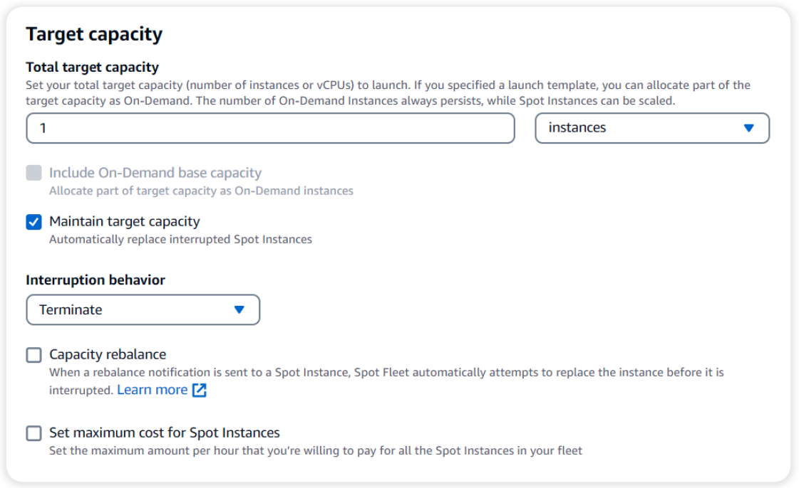

#### Automatic scaling for Spot Fleet

A Spot Fleet can either launch instances (scale out) or terminate instances (scale in), within the range that you choose, in response to one or more scaling policies.

1. **Target tracking scaling**

    This policy increases or decreases the current capacity of the fleet based on a target value for a specific metric. This is similar to the way that your thermostat maintains the temperature of your home — you select temperature and the thermostat does the rest.

2. **Step scaling**

    This policy increases or decreases the current capacity of the fleet based on a set of scaling adjustments, known as step adjustments, that vary based on the size of the alarm breach.

3. **Scheduled scaling**

    This policy increases or decreases the current capacity of the fleet based on the date and time.

The scaling policies that you create for Spot Fleet support a cooldown period. This is the number of seconds after a scaling activity completes where previous trigger-related scaling activities can influence future scaling events. By default, this cooldown period is set to 300 seconds (5 minutes).

For scale-out policies, the added capacity from the previous event that started the cooldown is included in the desired capacity for the next scale out. This applies while the cooldown period is in effect. The intention is to continuously (but not excessively) scale out.

For scale-in policies, the cooldown period is used to block subsequent scale-in requests until it has expired. The intention is to scale in conservatively to protect your application's availability. However, if another alarm invokes a scale-out policy during the cooldown period after a scale-in, automatic scaling scales out your scalable target immediately.

AWS recommends that you scale based on instance metrics with a 1-minute frequency because that ensures a faster response to utilization changes. Scaling on metrics with a 5-minute frequency can result in slower response time and scaling on stale metric data. To send metric data for your instances to Amazon CloudWatch in 1-minute periods, you must specifically enable detailed monitoring.

The Spot Fleet request must have a request type of **maintain**. Automatic scaling is not supported for requests of type **request**.

#### IAM permissions required for Spot Fleet automatic scaling

Automatic scaling for Spot Fleet is made possible by a combination of the Amazon EC2, Amazon CloudWatch, and AWS Application Auto Scaling APIs. Spot Fleet requests are created with Amazon EC2, alarms are created with CloudWatch, and scaling policies are created with Application Auto Scaling.

In addition to the IAM permissions for Spot Fleet and Amazon EC2, the user that accesses fleet scaling settings must have the appropriate permissions for the services that support dynamic scaling. Users must have permissions to use the actions shown in the following example policy.

```json
{
    "Version": "2012-10-17",
    "Statement": [
        {
            "Effect": "Allow",
            "Action": [
                "application-autoscaling:*",
                "ec2:DescribeSpotFleetRequests",
                "ec2:ModifySpotFleetRequest",
                "cloudwatch:DeleteAlarms",
                "cloudwatch:DescribeAlarmHistory",
                "cloudwatch:DescribeAlarms",
                "cloudwatch:DescribeAlarmsForMetric",
                "cloudwatch:GetMetricStatistics",
                "cloudwatch:ListMetrics",
                "cloudwatch:PutMetricAlarm",
                "cloudwatch:DisableAlarmActions",
                "cloudwatch:EnableAlarmActions",
                "iam:CreateServiceLinkedRole",
                "sns:CreateTopic",
                "sns:Subscribe",
                "sns:Get*",
                "sns:List*"
            ],
            "Resource": "*"
        }
    ]
}
```

#### Using target tracking policies to scale Spot Fleet

With target tracking scaling policies, you select a metric and set a target value. Spot Fleet creates and manages the CloudWatch alarms that invoke the scaling policy and calculates the scaling adjustment based on the metric and the target value. The scaling policy adds or removes capacity as required to keep the metric at, or close to, the specified target value. In addition to keeping the metric close to the target value, a target tracking scaling policy also adjusts to the fluctuations in the metric due to a fluctuating load pattern and minimizes rapid fluctuations in the capacity of the fleet.

You can create multiple target tracking scaling policies for a Spot Fleet, provided that each of them uses a different metric. The fleet scales based on the policy that provides the largest fleet capacity. With this, you can ensure that there is always enough capacity to process your application workloads under different scenarios.

To ensure application availability, the fleet scales out proportionally to the metric as fast as it can, but scales in more gradually. When a Spot Fleet terminates an instance because the target capacity was decreased, the instance receives a Spot Instance interruption notice.

You should not edit or delete the CloudWatch alarms that Spot Fleet manages for a target tracking scaling policy. Spot Fleet deletes the alarms automatically when you delete the target tracking scaling policy.

##### AWS Management Console

**To configure a target tracking policy with the AWS Management Console:**

1. Open the Amazon EC2 console at [https://console.aws.amazon.com/ec2/](https://console.aws.amazon.com/ec2/).
2. In the navigation pane, choose **Spot Requests**.
3. Select your Spot Fleet request and choose **Auto Scaling**.
4. If automatic scaling is not configured, choose **Configure**.
5. Use **Scale capacity between** to set the minimum and maximum capacity for your fleet. Automatic scaling does not scale your fleet below the minimum capacity or above the maximum capacity.
6. For **Policy name**, enter a name for the policy.
7. Choose a **Target metric**.
8. Enter a **Target value** for the metric.
9. (Optional) Set Cooldown period to modify the default cooldown period.
10. (Optional) Select Disable scale-in to omit creating a scale-in policy based on the current configuration. You can create a scale-in policy using a different configuration.
11. Choose **Save**.

##### AWS CLI

**To configure a target tracking policy with the AWS CLI:**

1. Register the Spot Fleet request as a scalable target using the [register-scalable-target](https://awscli.amazonaws.com/v2/documentation/api/latest/reference/application-autoscaling/register-scalable-target.html) command.
2. Create a scaling policy using the [put-scaling-policy](https://awscli.amazonaws.com/v2/documentation/api/latest/reference/application-autoscaling/put-scaling-policy.html) command.

#### Using step scaling policies to scale Spot Fleet

With step scaling policies, you specify CloudWatch alarms to activate the scaling process. For example, if you want to scale out when CPU utilization reaches a certain level, create an alarm using the **CPUUtilization** metric provided by Amazon EC2.

When you create a step scaling policy, you must specify one of the following scaling adjustment types:

* **Add**: This increases the target capacity of the fleet by a specified number of capacity units or a specified percentage of the current capacity.
* **Remove**: This decreases the target capacity of the fleet by a specified number of capacity units or a specified percentage of the current capacity.
* **Set to**: This sets the target capacity of the fleet to the specified number of capacity units.

When an alarm is activated, the automatic scaling process uses the fulfilled capacity and the scaling policy to calculate the new target capacity. It then updates the target capacity accordingly.

For example, suppose that the target capacity and fulfilled capacity are 10 and the scaling policy adds 1. When the alarm is activated, the automatic scaling process adds 1 to 10 to get 11, so Spot Fleet launches 1 instance.

When a Spot Fleet terminates an instance because the target capacity was decreased, the instance receives a Spot Instance interruption notice.

You should also consider the following two prerequisites before you configure a step scaling policy for your Spot Fleet.

* Consider which CloudWatch metrics are important to your application. You can create CloudWatch alarms based on metrics provided by AWS or your own custom metrics.
* For the AWS metrics that you will use in your scaling policies, you need to enable CloudWatch metrics collection if the service that provides the metrics does not enable it by default.

**To configure a step scaling policy:**

##### AWS Management Console

**To configure a step scaling policy for your Spot Fleet with the AWS Management Console:**

1. Open the Amazon EC2 console at [https://console.aws.amazon.com/ec2/](https://console.aws.amazon.com/ec2/).
2. In the navigation pane, choose **Spot Requests**.
3. Select your Spot Fleet request and choose **Auto Scaling**.
4. If automatic scaling is not configured, choose **Configure**.
5. Use **Scale capacity between** to set the minimum and maximum capacity for your fleet. Automatic scaling does not scale your fleet below the minimum capacity or above the maximum capacity.
6. Initially, Scaling policies contains policies named **ScaleUp** and **ScaleDown**. You can complete these policies, or choose **Remove policy** to delete them. You can also choose **Add policy**.
7. To define a policy, do the following:
 a. For **Policy name**, enter a name for the policy.
 b. For **Policy trigger**, select an existing alarm or choose **Create new alarm** to open the Amazon CloudWatch console and create an alarm.
 c. For **Modify capacity**, select a scaling adjustment type, select a number, and select a unit.
 d. (Optional) To perform step scaling, choose **Define steps**. By default, an add policy has a lower bound of -infinity and an upper bound of the alarm threshold. By default, a remove policy has a lower bound of the alarm threshold and an upper bound of +infinity. To add another step, choose **Add step**.
 e. (Optional) To modify the default value for the cooldown period, select a number from **Cooldown period**.
8. Choose **Save**.

##### AWS CLI

**To configure step scaling policies for your Spot Fleet with the AWS CLI:**

1. Register the Spot Fleet request as a scalable target using the [register-scalable-target](https://awscli.amazonaws.com/v2/documentation/api/latest/reference/application-autoscaling/register-scalable-target.html) command.
2. Create a scaling policy using the [put-scaling-policy](https://awscli.amazonaws.com/v2/documentation/api/latest/reference/application-autoscaling/put-scaling-policy.html) command.
3. Create an alarm that initiates the scaling policy using the [put-metric-alarm](https://awscli.amazonaws.com/v2/documentation/api/latest/reference/cloudwatch/put-metric-alarm.html) command.

#### Using scheduled policies to scale Spot Fleet

Scaling based on a schedule provide you the ability to scale your application in response to predictable changes in demand. To use scheduled scaling, you create scheduled actions, which tell Spot Fleet to perform scaling activities at specific times.

When you create a scheduled action, you specify an existing Spot Fleet, when the scaling activity should occur, minimum capacity, and maximum capacity. You can create scheduled actions that scale one time only or that scale on a recurring schedule.

You can only create a scheduled action for Spot Fleets that already exist. You can't create a scheduled action at the same time that you create a Spot Fleet.

**Different actions that you can perform with scheduled scaling in the AWS Management Console:**

##### Creating a one-time scheduled action

**To create a one-time scheduled action:**

1. Open the Amazon EC2 console at [https://console.aws.amazon.com/ec2/](https://console.aws.amazon.com/ec2/).
2. In the navigation pane, choose **Spot Requests**.
3. Select your Spot Fleet request and choose the **Scheduled Scaling** tab near the bottom of the screen.
4. Choose **Create Scheduled Action**.
5. For **Name**, specify a name for the scheduled action.
6. Enter a value for **Minimum capacity**, **Maximum capacity**, or both.
7. For **Recurrence**, choose **Once**.
8. (Optional) Choose a date and time for **Start time**, **End time**, or both.
9. Choose **Submit**.

##### Scaling on a recurring schedule

**To scale on a recurring schedule:**

1. Open the Amazon EC2 console at [https://console.aws.amazon.com/ec2/](https://console.aws.amazon.com/ec2/).
2. In the navigation pane, choose **Spot Requests**.
3. Select your Spot Fleet request and choose the **Scheduled Scaling** tab near the bottom of the screen.
4. For **Recurrence**, choose one of the predefined schedules (for example, **Every day**), or choose **Custom** and enter a cron expression. For more information about the cron expressions supported by scheduled scaling, see [Cron Expressions](https://docs.aws.amazon.com/eventbridge/latest/userguide/eb-cron-expressions.html) in the Amazon EventBridge User Guide.
5. (Optional) Choose a date and time for **Start time**, **End time**, or both.
6. Choose **Submit**.

##### Editing a scheduled action

**To edit a scheduled action:**

1. Open the Amazon EC2 console at [https://console.aws.amazon.com/ec2/](https://console.aws.amazon.com/ec2/).
2. In the navigation pane, choose **Spot Requests**.
3. Select your Spot Fleet request and choose the **Scheduled Scaling** tab near the bottom of the screen.
4. Select the scheduled action and choose **Actions**, **Edit**.
5. Make the needed changes and choose **Submit**.

##### Deleting a scheduled action

**To delete a scheduled action:**

1. Open the Amazon EC2 console at [https://console.aws.amazon.com/ec2/](https://console.aws.amazon.com/ec2/).
2. In the navigation pane, choose **Spot Requests**.
3. Select your Spot Fleet request and choose the **Scheduled Scaling** tab near the bottom of the screen.
4. Select the scheduled action and choose **Actions**, **Delete**.
5. When prompted for confirmation, choose **Delete**.

You can also manage scheduled scaling with the following AWS CLI commands:

* [put-scheduled-action](https://awscli.amazonaws.com/v2/documentation/api/latest/reference/application-autoscaling/put-scheduled-action.html)
* [describe-scheduled-actions](https://awscli.amazonaws.com/v2/documentation/api/latest/reference/application-autoscaling/describe-scheduled-actions.html)
* [delete-scheduled-action](https://awscli.amazonaws.com/v2/documentation/api/latest/reference/application-autoscaling/delete-scheduled-action.html)

### Amazon EC2 Auto Scaling Group for Elastic Beanstalk

#### Elastic Beanstalk and auto scaling

AWS Elastic Beanstalk simplifies the deployment and management of applications by handling the underlying infrastructure details. When coupled with an Amazon EC2 Auto Scaling group, it adds a crucial layer of scalability and reliability. Auto scaling ensures that your application can seamlessly handle varying levels of traffic by automatically adjusting the number of instances based on demand. With auto scaling, Elastic Beanstalk can dynamically scale your application up or down, and distribute incoming traffic across instances to maintain responsiveness. It also enhances fault tolerance by replacing unhealthy instances.

Combining Elastic Beanstalk with an Amazon EC2 Auto Scaling group streamlines application deployment and management while ensuring that your application is both scalable and resilient to changes in workload.

#### Amazon EC2 Auto Scaling group for Elastic Beanstalk environment 

Your Elastic Beanstalk environment includes an Amazon EC2 Auto Scaling group that manages the Amazon EC2 instances in your environment. In a single-instance environment, the Auto Scaling group ensures that there is always one instance running. In a load-balanced environment, you configure the group with a range of instances to run, and Amazon EC2 Auto Scaling adds or removes instances as needed, based on load.

The Auto Scaling group also applies the launch configuration for the instances in your environment. You can modify the launch configuration to change the instance type, key pair, Amazon Elastic Block Store (Amazon EBS) storage, and other settings that can only be configured when you launch an instance.

You can use the Elastic Beanstalk console, the EB CLI, or configuration options to configure an Auto Scaling group.

#### Auto Scaling group configuration with the AWS Management Console

You can configure how an Auto Scaling group works by editing **Instance traffic and scaling** > **Capacity** on the environment's **Configuration** page in the Elastic Beanstalk console.

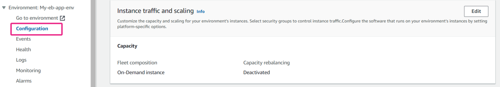

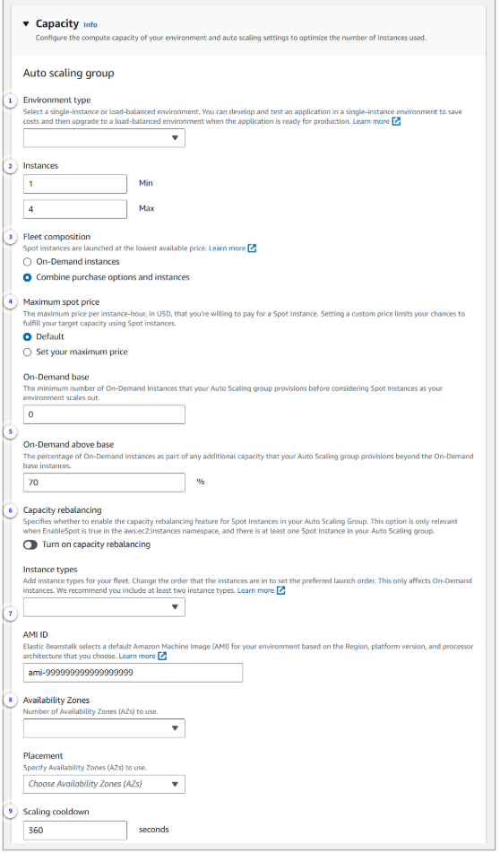

1. **Environment type**. Choose **Load balanced**.

    A load balanced environment can create multiple instances connected to a load balancer.

2. **Min and max instances**

    * **Min instances** is the minimum number of EC2 instances that the group should contain at any time. The group starts with the minimum count and adds instances when the scale-up trigger condition is met.
    * **Max instances** is the maximum number of EC2 instances that the group should contain at any time.

3. **Fleet composition**

    The default is **On-Demand instances**. To enable Spot Instance requests, select **Combined purchase options and instances**.The following options are enabled if you select to enable Spot Instance requests:

    * **Maximum spot price**
    * **On-Demand base**
    * **On-Demand above base**

4. **Maximum spot price**

    Choose **Default**. For recommendations about maximum price options for Spot Instances, see [Spot Instance Pricing History](https://docs.aws.amazon.com/AWSEC2/latest/UserGuide/using-spot-instances-history.html) in the Amazon EC2 User Guide for Linux Instances.

5. **On-Demand base and On-Demand above base**

    * **On-Demand base**: The minimum number of On-Demand Instances that your Auto Scaling group provisions before considering Spot Instances as your environment scales out.
    * **On-Demand above base**: The percentage of On-Demand Instances as part of any additional capacity that your Auto Scaling group provisions beyond the On-Demand base instances.

6. **Capacity rebalancing**

    This option is only relevant when there is at least one Spot Instance in your Auto Scaling group. When this feature is enabled, Amazon EC2 automatically attempts to replace Spot Instances in the Auto Scaling group before they are interrupted. This minimizes Spot Instance interruptions to your applications.

    For more information, see [Capacity Rebalancing](https://docs.aws.amazon.com/autoscaling/ec2/userguide/ec2-auto-scaling-capacity-rebalancing.html) in the Amazon EC2 Auto Scaling User Guide.

7. **Instance types and AMI ID**

    **Instance types**: The type of Amazon EC2 instance launched to run your application.

    For details, see [Instance Types](https://docs.aws.amazon.com/elasticbeanstalk/latest/dg/using-features.managing.ec2.html#using-features.managing.ec2.instancetypes).

    **AMI ID**: The machine image that Elastic Beanstalk uses to launch Amazon EC2 instances in your environment.

    For details, see [AMI ID](https://docs.aws.amazon.com/elasticbeanstalk/latest/dg/using-features.managing.ec2.html#using-features.managing.ec2.customami).

8. **Availability Zones**

    Choose the number of Availability Zones to spread your environment's instances across. By default, the Auto Scaling group launches instances evenly across all usable zones. To concentrate your instances in fewer zones, choose the number of zones to use. For production environments, use at least two zones to ensure that your application is available in case one Availability Zone goes out.

9. **Scaling cooldown**

    The amount of time, in seconds, to wait for instances to launch or terminate after scaling, before continuing to evaluate triggers.

    For more information, see [Scaling Cooldowns](https://docs.aws.amazon.com/autoscaling/ec2/userguide/ec2-auto-scaling-scaling-cooldowns.html).

#### Configuration options

Elastic Beanstalk provides configuration options for auto scaling settings in two namespaces: **aws:autoscaling:asg** and **aws:ec2:instances**.

##### aws:autoscaling:asg namespace

The **aws:autoscaling:asg** namespace provides options for overall scale and availability.

The following configuration file example configures the Auto Scaling group to use two to four instances, specific Availability Zones, and a cooldown period of 12 minutes (720 seconds).

Capacity Rebalancing for Spot Instances is enabled. This last option only takes effect if **EnableSpot** is set to **true** in the **aws:ec2:instances** namespace, as shown in the next example.

```yaml
option_settings:
aws:autoscaling:asg:
Availability Zones: Any
Cooldown: '720'
Custom Availability Zones: 'us-west-2a,us-west-2b'
MaxSize: '4'
MinSize: '2'
          EnableCapacityRebalancing: true
```

##### aws:ec2:instances namespace

The **aws:ec2:instances** namespace provides options related to your environment's instances, including Spot Instance management. It complements **aws:autoscaling:launchconfiguration** and **aws:autoscaling:asg**.

When you update your environment configuration and remove one or more instance types from the InstanceTypes option, Elastic Beanstalk terminates any EC2 instances running on any of the removed instance types. Your environment's Auto Scaling group then launches new instances as necessary to complete the desired capacity, using your current specified instance types.

The following configuration file example configures the Auto Scaling group to enable Spot Instance requests for your environment. Three possible instance types can be used. At least one On-Demand Instance is used for baseline capacity, and a sustained 33 percent of On-Demand Instances is used for any additional capacity.

```yaml
option_settings:
aws:ec2:instances:
EnableSpot: true
InstanceTypes: 't2.micro,t3.micro,t3.small'
SpotFleetOnDemandBase: '1'
          SpotFleetOnDemandAboveBasePercentage: '33'
```

* [Configuration Options](https://docs.aws.amazon.com/elasticbeanstalk/latest/dg/command-options.html)
* [aws:autoscaling:asg](https://docs.aws.amazon.com/elasticbeanstalk/latest/dg/command-options-general.html#command-options-general-autoscalingasg)
* [aws:autoscaling:launchconfiguration](https://docs.aws.amazon.com/elasticbeanstalk/latest/dg/command-options-general.html#command-options-general-autoscalinglaunchconfiguration)
* [aws:ec2:instances](https://docs.aws.amazon.com/elasticbeanstalk/latest/dg/command-options-general.html#command-options-general-ec2instances)
* [Configuration Files](https://docs.aws.amazon.com/elasticbeanstalk/latest/dg/ebextensions.html)

#### Triggers

The Auto Scaling group uses two Amazon CloudWatch alarms to trigger scaling operations. The default triggers scale when the average outbound network traffic from each instance is higher than 6 mebibytes (MiB) or lower than 2 MiB over a period of 5 minutes. To use auto scaling effectively, configure triggers that are appropriate for your application, instance type, and service requirements. You can scale based on several statistics including latency, disk I/O, CPU utilization, and request count.

##### Configuring Auto Scaling group triggers

You can configure the triggers that adjust the number of instances in your environment's Auto Scaling group in the Elastic Beanstalk console.

On the **Configuration** page, edit the **Instance traffic and scaling** > **Capacity** section, and then configure the settings in the **Scaling triggers** section. To save the changes, choose **Apply** at the bottom of the page.

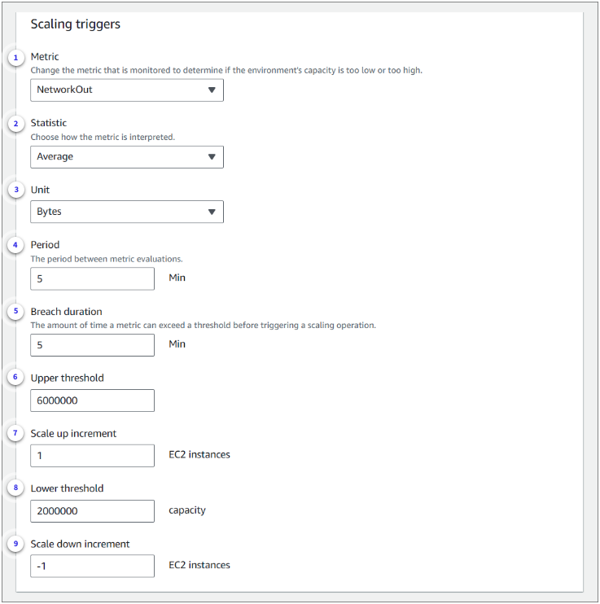

1. **Metric**

    This is the metric used for your Auto Scaling group trigger.

2. **Statistic**

    This is the statistic calculation that the trigger should use, such as **Average**.

3. **Unit**

    This is the unit for the trigger metric, such as **Bytes**.

4. **Period**

    This specifies how frequently CloudWatch measures the metrics for your trigger.

5. **Breach duration**

    This is the amount of time, in minutes, that a metric can be outside of the upper and lower thresholds before triggering a scaling operation.

6. **Upper threshold**

    If the metric exceeds this number for the breach duration, a scaling operation is triggered.

7. **Scale up increment**

    This is the number of EC2 instances to add when performing a scaling activity.

8. **Lower threshold**

    If the metric falls below this number for the breach duration, a scaling operation is triggered.

9. **Scale down increment**

    This is the number of Amazon EC2 instances to remove when performing a scaling activity.

##### aws:autoscaling:trigger namespace

Elastic Beanstalk provides configuration options for auto scaling settings in the **aws:autoscaling:trigger** namespace. Settings in this namespace are organized by the resource that they apply to.

```yaml
option_settings:
  AWSEBAutoScalingScaleDownPolicy.aws:autoscaling:trigger:
    LowerBreachScaleIncrement: '-1'
  AWSEBAutoScalingScaleUpPolicy.aws:autoscaling:trigger:
    UpperBreachScaleIncrement: '1'
  AWSEBCloudwatchAlarmHigh.aws:autoscaling:trigger:
    UpperThreshold: '6000000'
  AWSEBCloudwatchAlarmLow.aws:autoscaling:trigger:
    BreachDuration: '5'
    EvaluationPeriods: '1'
    LowerThreshold: '2000000'
    MeasureName: NetworkOut
    Period: '5'
    Statistic: Average
    Unit: Bytes
```

#### Scheduled actions

To optimize your environment's use of Amazon EC2 instances through predictable periods of peak traffic, configure your Auto Scaling group to change its instance count on a schedule. You can configure your environment with a recurring action to scale up each day in the morning, and scale down at night when traffic is low. For example, if you have a marketing event that will drive traffic to your site for a limited period, you can schedule a one-time event to scale up when it starts, and another to scale down when it ends.

##### Configuring scheduled actions

You can create scheduled actions for your environment's Auto Scaling group in the Elastic Beanstalk console. On the **Configuration** page, edit the **Instance traffic and scaling** > **Capacity section**.

In the **Time-based scaling** section, choose **Add scheduled action**.

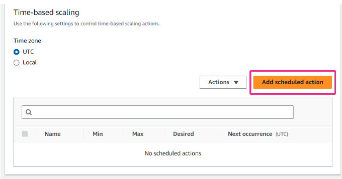

Then the **Scheduled action** window is displayed. Fill in the scheduled action settings. After you are finished with the settings, choose **Add**. To save the changes, you will need to choose **Apply**.

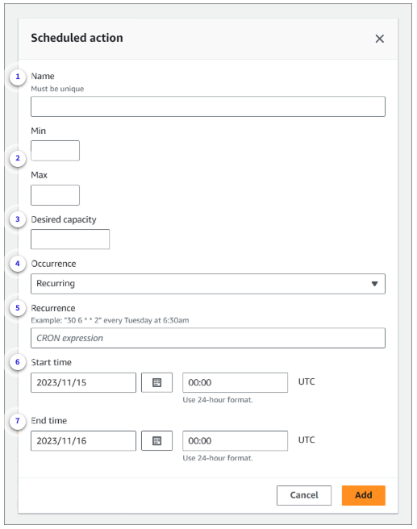

1. **Name**

    Specify a unique name of up to 255 alphanumeric characters, with no spaces.

2. **Min and Max**

    Choose the minimum and maximum instance count to apply to the Auto Scaling group.

3. **Desired capacity (optional)**

    Set the initial desired capacity for the Auto Scaling group. After the scheduled action is applied, triggers adjust the desired capacity based on their settings.

4. **Occurrence**

    Choose Recurring to repeat the scaling action on a schedule.

5. **Recurrence**

    Use a Cron expression to specify the frequency with which you want the scheduled action to occur. For example, ```30 6 * * 2``` runs the action every Tuesday at 6:30 AM UTC.

6. **Start time**

    For one-time actions, choose the date and time to run the action. For recurrent actions, a start time is optional. Specify it to choose the earliest time that the action is performed. After this time, the action recurs according to the **Recurrence** expression.

7. **End time (optional)**

    This is optional for recurrent actions. If specified, the action recurs according to the **Recurrence** expression, and is not performed again after this time. When a scheduled action ends, the Auto Scaling group doesn't automatically go back to its previous settings. Configure a second scheduled action to return the Auto Scaling group to the original settings as needed.

##### aws:autoscaling:scheduledaction namespace

If you need to configure a large number of scheduled actions, you can use configuration files or the Elastic Beanstalk API to apply the configuration option changes from a YAML or JSON file. These methods also let you access the Suspend option to temporarily deactivate a recurrent scheduled action.

**When working with scheduled action configuration options outside of the console, use ISO 8601 time format to specify start and end times in UTC. For example, ```2015-04-28T04:07:02Z```.**

Elastic Beanstalk provides configuration options for scheduled action settings in the **aws:autoscaling:scheduledaction** namespace. Use the r**esource_name** field to specify the name of the scheduled action.

The following **Scheduled-scale-up-specific-time-long.config** file instructs Elastic Beanstalk to scale out from five instances to 10 instances at 2015-12-12T00:00:00Z.

```yaml
option_settings:
  - namespace: aws:autoscaling:scheduledaction
    resource_name: ScheduledScaleUpSpecificTime
    option_name: MinSize
    value: '5'
  - namespace: aws:autoscaling:scheduledaction
    resource_name: ScheduledScaleUpSpecificTime
    option_name: MaxSize
    value: '10'
  - namespace: aws:autoscaling:scheduledaction
    resource_name: ScheduledScaleUpSpecificTime
    option_name: DesiredCapacity
    value: '5'
  - namespace: aws:autoscaling:scheduledaction
    resource_name: ScheduledScaleUpSpecificTime
    option_name: StartTime
    value: '2015-12-12T00:00:00Z'
```

* [aws:autoscaling:scheduledaction namespace](https://docs.aws.amazon.com/elasticbeanstalk/latest/dg/environments-cfg-autoscaling-scheduledactions.html)

#### Health check setting

Amazon EC2 Auto Scaling monitors the health of each Amazon EC2 instance that it launches. If any instance terminates unexpectedly, Amazon EC2 Auto Scaling detects the termination and launches a replacement instance. By default, the Auto Scaling group created for your environment uses Amazon EC2 status checks. If an instance in your environment fails an Amazon EC2 status check, Amazon EC2 Auto Scaling takes it down and replaces it.

Amazon EC2 status checks only cover an instance's health, not the health of your application, server, or any Docker containers running on the instance. If your application crashes, but the instance that it runs on is still healthy, it might be kicked out of the load balancer, but Amazon EC2 Auto Scaling won't replace it automatically. The default behavior is good for troubleshooting. If Amazon EC2 Auto Scaling replaced the instance as soon as the application crashed, you might not realize that anything went wrong, even if it crashed quickly after starting up.

If you want Amazon EC2 Auto Scaling to replace instances whose application has stopped responding, you can use a configuration file to configure the Auto Scaling group to use Elastic Load Balancing health checks. The following example sets the group to use the load balancer's health checks, in addition to the Amazon EC2 status check, to determine an instance's health.

##### Example .ebextensions/autoscaling.config

```yaml
Resources:
  AWSEBAutoScalingGroup:
    Type: "AWS::AutoScaling::AutoScalingGroup"
    Properties:
      HealthCheckType: ELB
      HealthCheckGracePeriod: 300
```

By default, the Elastic Load Balancing health check is configured to attempt a TCP connection to your instance over port 80. This confirms that the web server running on the instance is accepting connections. However, you might want to customize the load balancer health check to ensure that your application, and not just the web server, is in a good state. The grace period setting sets the number of seconds that an instance can fail the health check without being terminated and replaced. Instances can recover after being kicked out of the load balancer, so give the instance an amount of time that is appropriate for your application.

### Creating Fully Managed Auto Scaling with Lifecycle Hooks

#### How lifecycle hooks work

Amazon EC2 Auto Scaling offers the ability to add lifecycle hooks to your Amazon EC2 Auto Scaling groups. These hooks let you create solutions that are aware of events in the EC2 Auto Scaling instance lifecycle, and then perform a custom action on instances when the corresponding lifecycle event occurs.

You can use Amazon EC2 Auto Scaling to scale out or to scale in your EC2 instances automatically, based on policies you configure in response to demands on your application. With Amazon EC2 Auto Scaling groups, you can set a minimum and a maximum number of EC2 instances to automatically resize your cluster based on a defined schedule, or by using instance metrics such as CPU utilization or network traffic.

You might want to perform custom actions before your Amazon EC2 Auto Scaling groups start accepting traffic or before they're terminated. To do this, you can add something called lifecycle hooks to your Amazon EC2 Auto Scaling groups. These hooks let you create solutions that track events in the Amazon EC2 Auto Scaling instance lifecycle, and then perform a custom action on instances when the lifecycle event occurs.

#### Some examples of using lifecycle hooks with Amazon EC2 Auto Scaling instances

* When a scale-out event occurs, your newly launched instance completes its startup sequence and transitions into a wait state. While the instance is in a wait state, it runs a script to download and install the needed software packages and perform custom configurations for your application. This ensures that your instance is ready before it starts receiving traffic.
* When a scale-in event occurs, a lifecycle hook pauses the instance before it is terminated and sends you a notification through Amazon EventBridge. While the instance is in the wait state, you can invoke an AWS Lambda function, or connect to the instance to retrieve logs or other data before the instance is terminated.

**A lifecycle hook provides a default 1-hour wait period to allow the custom actions to complete before the instance transitions to the next state.**

You can choose a target service to perform these actions based on your preferred development approach.

1. Amazon EventBridge to invoke a Lambda function that performs the custom actions that you choose.
2. Creating an Amazon Simple Notification Service, or Amazon SNS topic, to which notifications are published. You can subscribe to the SNS topic and receive the published messages, and then perform the manual actions.
3. Using Amazon Simple Queue Service, or Amazon SQS. You can use Amazon SQS to set up a notification target to receive messages when a lifecycle action occurs. When this happens, a queue consumer polls an SQS queue, which responds to the notifications.

As a best practice, AWS recommends that you use EventBridge. The notifications sent to Amazon SNS and Amazon SQS contain the same information as the notifications that Amazon EC2 Auto Scaling events send to EventBridge. EventBridge also offers more options for the services you can target, including Lambda function, Amazon SNS topic, and Amazon SQS queue. Using serverless architecture makes it easier to handle events.

#### Examples of using lifecycle hooks with EC2 Auto Scaling instances

##### Scale-out events

When a scale-out event occurs, your newly launched instance completes its startup sequence and transitions to a wait state. While the instance is in a wait state, it runs a script to download and install the needed software packages for your application, making sure that your instance is fully ready before it starts receiving traffic. When the script is finished installing software, it sends the **complete-lifecycle-action** command to continue.

##### Scale-in events

When a scale-in event occurs, a lifecycle hook pauses the instance before it is terminated and uses Amazon EventBridge to send you a notification. While the instance is in the wait state, you can invoke an AWS Lambda function or connect to the instance to download logs or other data before the instance is fully terminated.

#### Transition between states

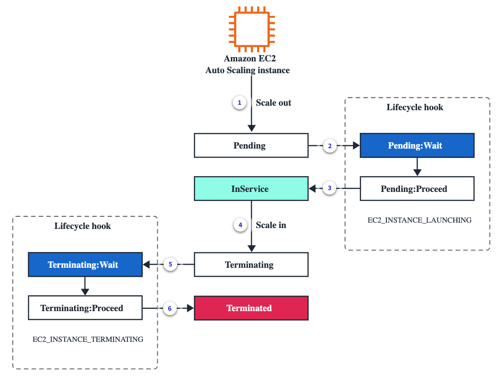

1. **Scaling out**

    The Auto Scaling group responds to a scale-out event and begins launching an instance.

2. **Entering Pending:Wait state**

    The lifecycle hook puts the instance into a wait state (**Pending:Wait**) and then performs a custom action.

    The instance remains in a wait state until you either complete the lifecycle action, or the timeout period ends. By default, the instance remains in a wait state for 1 hour, and then the Auto Scaling group continues the launch process (**Pending:Proceed**). If you need more time, you can restart the timeout period by recording a heartbeat.

3. **Entering in-service state**

    The instance enters the **InService** state and the health check grace period starts. However, before the instance reaches the **InService** state, if the Auto Scaling group is associated with an Elastic Load Balancing load balancer, the instance is registered with the load balancer, and the load balancer starts checking its health. After the health check grace period ends, Amazon EC2 Auto Scaling begins checking the health state of the instance.

4. **Scaling in**

    The Auto Scaling group responds to a scale-in event and begins terminating an instance. If the Auto Scaling group is being used with Elastic Load Balancing, the terminating instance is first deregistered from the load balancer. If connection draining is enabled for the load balancer, the instance stops accepting new connections and waits for existing connections to drain before completing the deregistration process.

5. **Entering Terminating:Wait state**

    The lifecycle hook puts the instance into a wait state (**Terminating:Wait**) and then performs a custom action.

    The instance remains in a wait state either until you complete the lifecycle action or until the timeout period ends (1 hour by default). After you complete the lifecycle hook or the timeout period expires, the instance transitions to the next state (**Terminating:Proceed**).

6. **Terminated**

    The instance is terminated.

#### Considerations for lifecycle hooks

* Amazon EC2 Auto Scaling provides its own lifecycle to help with the management of Auto Scaling groups. This lifecycle differs from that of other EC2 instances.
* You can use lifecycle hooks with Spot Instances, but a lifecycle hook does not prevent an instance from terminating in the event that capacity is no longer available, which can happen at any time with a 2-minute interruption notice.
* The result of the lifecycle hook can be either abandon or continue. If an instance is launching, continue indicates that your actions were successful, and that Amazon EC2 Auto Scaling can put the instance into service. Otherwise, abandon indicates that your custom actions were unsuccessful, and that AWS can terminate and replace the instance. If an instance is terminating, both abandon and continue allow the instance to terminate. However, abandon stops any remaining actions, such as other lifecycle hooks, and continue allows any other lifecycle hooks to complete.
* Amazon EC2 Auto Scaling limits the rate at which it allows instances to launch if the lifecycle hooks are failing consistently, so make sure to test and fix any permanent errors in your lifecycle actions.
* Creating and updating lifecycle hooks using the AWS CLI, AWS CloudFormation, or an SDK provides options not available when creating a lifecycle hook from the AWS Management Console. For example, the field to specify the Amazon Resource Name (ARN) of an SNS topic or SQS queue doesn't appear in the console, because Amazon EC2 Auto Scaling already sends events to Amazon EventBridge. These events can be filtered and redirected to AWS services such as Lambda, Amazon SNS, and Amazon SQS as needed.
* You can add multiple lifecycle hooks to an Auto Scaling group while you are creating it, by calling the CreateAutoScalingGroup API using the AWS CLI, AWS CloudFormation, or an SDK. However, each hook must have the same notification target and IAM role, if specified. To create lifecycle hooks with different notification targets and different roles, create the lifecycle hooks one at a time in separate calls to the PutLifecycleHook API.
* If you add a lifecycle hook for instance launch, the health check grace period starts as soon as the instance reaches the *InService* state.

### Configuring a notification target for lifecycle notifications

You can add lifecycle hooks to an Auto Scaling group to perform custom actions when an instance enters a *wait* state. You can choose a target service to perform these actions depending on your preferred development approach. As a best practice, AWS recommends that you use EventBridge as the target service.

```text
The EventBridge rule and Lambda function that you use with lifecycle hooks must always be in the same Region where you created your Auto Scaling group. When you use the AWS Management Console to create an event rule, the console automatically adds the IAM permissions necessary to grant EventBridge permission to call your Lambda function. If you are creating an event rule using the AWS CLI, you need to grant this permission explicitly.
```

#### Using EventBridge to route notifications to Lambda functions

You can configure an EventBridge rule to invoke a Lambda function when an instance enters a *wait* state. Amazon EC2 Auto Scaling emits a lifecycle event notification to EventBridge about the instance that is launching or terminating and a token that you can use to control the lifecycle action.

1. Create a Lambda function by using Lambda console and note its Amazon Resource Name (ARN). For example:

    ```shell
    arn:aws:lambda:region:123456789012:function:MY_FUNCTION
    ```

    You need the ARN to create an EventBridge target

    For more information, see [Getting Started with Lambda](https://docs.aws.amazon.com/lambda/latest/dg/getting-started.html) in the AWS Lambda Developer Guide.

2. To create a rule that matches events for instance launch, use the following [put-rule](https://awscli.amazonaws.com/v2/documentation/api/latest/reference/events/put-rule.html) command

    ```shell
    aws events put-rule --name MY_RULE --event-pattern file://pattern.json --state ENABLED
    ```

    The4 following example shows the pattern.json for a instance launch lifecycle action. Replace the text inside the brackets **(MY_ASG)** with the name of your Auto Scaling group.

    ```json
    {
        "source": [ "aws.autoscaling" ],
        "detail-type": [ "EC2 Instance-launch Lifecycle Action" ],
        "detail": {
            "AutoScalingGroupName": [ "MY_ASG" ]
        }
    }
    ```

    If the command runs successfully, EventBridge responds with the ARN of the rule. Note this ARN. You will need to enter it in step 4.

3. To specify the Lambda function to use as a target for the rule, use the following [put-targets](https://awscli.amazonaws.com/v2/documentation/api/latest/reference/events/put-targets.html) command.

    ```shell
    aws events put-targets --rule MY_RULE --targets Id=1,Arn=arn:aws:lambda:region:123456789012:function:MY_FUNCTION
    ```

    In the preceding command, *MY_RULE* is the name that you specified for the rule in step 2, and the value for the Arn parameter is the ARN of the function that you created in step 1.

4. To add permissions that allow the rule to invoke your Lambda function, use the following Lambda [add-permission](https://awscli.amazonaws.com/v2/documentation/api/latest/reference/lambda/add-permission.html) command. This command trusts the EventBridge service principal (events.amazonaws.com) and scopes permissions to the specified rule.

    ```shell
    aws lambda add-permission --function-name MY_FUNCTION --statement-id MY_UNIQUE_ID --action 'lambda:InvokeFunction' --principal events.amazonaws.com --source-arn arn:aws:events:region:123456789012:rule/MY_RULE
    ```

    In the preceding command:

    * *MY_FUNCTION* is the name of the lambda function tat you want the rule to use as a target.
    * *My_UNIQUE_ID* is a unique identifier that you define to describe the statement in the Lambda function policy
    * source-arn is the ARN of the EventBridge rule.

    ```json
    {
        "Statement": "{\"Sid\": \"my-unique-id\",
            \"Effect\": \"Allow\",
            \"Principal\": {\"Service\": \"events.amazonaws.com\"},
            \"Action\": \"lambda:InvokeFunction\",
            \"Resource\": \"arn:aws:lambda:us-west-2:123456789012:function:my-function\",
            \"Condition\": {
                \"ArnLike\": {
                    \"AWS:SourceArn\": \"arn:aws:events:us-west-2:123456789012:rule/my-rule\"
                }
            }
        }"
    }
    ```

    The *Statement* value is a JSON string version of the statement that was added to the Lambda function policy.

#### Adding lifecycle hooks

To put your Auto Scaling instances into a *wait* state and perform custom actions on them, you can add lifecycle hooks to your Auto Scaling group. Custom actions are performed as the instances launch or before they terminate. Instances remain in a *wait* state until you either complete the lifecycle action or the timeout period ends.

After you create an Auto Scaling group from the AWS Management Console and set up a custom action, you can add one or more lifecycle hooks to it, up to a total of 50 lifecycle hooks. You can also use the AWS CLI, AWS CloudFormation, or an SDK to add lifecycle hooks to an Auto Scaling group as you create it.

To add lifecycle hooks for scaling out (instances launching) and scaling in (instances terminating or returning to a warm pool), you must create two separate hooks.

By default, when you add a lifecycle hook in the console, Amazon EC2 Auto Scaling sends lifecycle event notifications to Amazon EventBridge. Using EventBridge or a user data script is a recommended best practice.

##### Adding a lifecycle hook for scaling out

###### Scaling out

1. Open the Amazon EC2 console at [https://console.aws.amazon.com/ec2(]https://console.aws.amazon.com/ec2/) and choose **Auto Scaling Groups** from the navigation pane.
2. Select the check box next to your Auto Scaling group. A split pane opens up in the bottom of the page.
3. On the **Instance management** tab, in **Lifecycle hooks**, choose **Create lifecycle hook**.
4. To define a lifecycle hook for scale out (instances launching), do the following:
 a. For **Lifecycle hook** name, specify a name for the lifecycle hook.
 b. For **Lifecycle transition**, choose **Instance launch**.
 c. For **Heartbeat timeout**, specify the amount of time, in seconds, for instances to remain in a wait state when scaling out before the hook times out. The range is from **30** to **7200** seconds. Setting a long timeout period provides more time for your custom action to complete. Then, if you finish before the timeout period ends, send the [complete-lifecycle-action](https://awscli.amazonaws.com/v2/documentation/api/latest/reference/autoscaling/complete-lifecycle-action.html) command to allow the instance to proceed to the next state.
 d. For **Default result**, specify the action to take when the lifecycle hook timeout elapses or when an unexpected failure occurs. You can choose to either **CONTINUE** or **ABANDON**.
   * If you choose **CONTINUE**, the Auto Scaling group can proceed with any other lifecycle hooks and then put the instance into service.
   * If you choose **ABANDON**, the Auto Scaling group stops any remaining actions and terminates the instance immediately.
 e. (Optional) For **Notification metadata**, specify other information that you want to include when Amazon EC2 Auto Scaling sends a message to the notification target.
5. Choose **Create**.

##### Adding a lifecycle hook for scaling in

###### Scaling in

1. Choose **Create lifecycle hook** to continue where you left off after creating a lifecycle hook for scale out.
2. To define a lifecycle hook for scale in (instances terminating or returning to a warm pool), do the following:
 a. For **Lifecycle hook name**, specify a name for the lifecycle hook.
 b. For **Lifecycle transition**, choose **Instance terminate**.
 c. For **Heartbeat timeout**, specify the amount of time, in seconds, for instances to remain in a wait state when scaling out before the hook times out. AWS recommends a short timeout period of **30** to **12**0 seconds, depending on how much time you need to perform any final tasks, such as pulling EC2 logs from CloudWatch.
 d. For **Default result**, specify the action that the Auto Scaling group takes when the timeout elapses or if an unexpected failure occurs. Both **ABANDON** and **CONTINUE** let the instance terminate.
   * If you choose **CONTINUE**, the Auto Scaling group can proceed with any remaining actions, such as other lifecycle hooks, before termination.
   * If you choose **ABANDON**, the Auto Scaling group terminates the instance immediately.
 e. (Optional) For **Notification metadata,** specify other information that you want to include when Amazon EC2 Auto Scaling sends a message to the notification target.
3. Choose **Create**.

#### Completing a lifecycle action

Completing the lifecycle action with a result of **CONTINUE** is helpful if you finish before the timeout period has expired. If you don't complete the lifecycle action, the lifecycle hook goes to the status that you specified for **Default result** after the timeout period ends.

##### Manually completing a lifecycle action with AWS CLI

The following procedure is for the command-line interface and is not supported in the console.

1. If you need more time to complete the custom action, you can use the [record-lifecycle-action-heartbeat](https://awscli.amazonaws.com/v2/documentation/api/latest/reference/autoscaling/record-lifecycle-action-heartbeat.html) CLI command to restart the timeout period and keep the instance in a *wait* state. This extends the timeout period by the timeout value specified when you created the lifecycle hook.

    For example, if the timeout period is 1 hour, and you call this command after 30 minutes, the instance remains in a wait state for an additional hour, or a total of 90 minutes.

    You can specify the lifecycle action token that you received with the notification, as shown in the following command.

    ```shell
    aws autoscaling record-lifecycle-action-heartbeat --lifecycle-hook-name my-launch-hook \
      --auto-scaling-group-name my-asg --lifecycle-action-token bcd2f1b8-9a78-44d3-8a7a-4dd07d7cf635
    ```

    Alternatively, you can specify the ID of the instance that you received with the notification, as shown in the following command.

    ```shell
    aws autoscaling record-lifecycle-action-heartbeat --lifecycle-hook-name my-launch-hook \
      --auto-scaling-group-name my-asg --instance-id i-1a2b3c4d
    ```

2. If you finish the custom action before the timeout period ends, you can use the [complete-lifecycle-action](https://awscli.amazonaws.com/v2/documentation/api/latest/reference/autoscaling/complete-lifecycle-action.html) command so that the Auto Scaling group can continue launching or terminating the instance. You can specify the lifecycle action token, as shown in the following command.

    ```shell
    aws autoscaling complete-lifecycle-action --lifecycle-action-result CONTINUE \
    --lifecycle-hook-name my-launch-hook --auto-scaling-group-name my-asg \
      --lifecycle-action-token bcd2f1b8-9a78-44d3-8a7a-4dd07d7cf635
    ```

    Alternatively, you can specify the ID of the instance, as shown in the following command.

    ```shell
    aws autoscaling complete-lifecycle-action --lifecycle-action-result CONTINUE \
    --instance-id i-1a2b3c4d --lifecycle-hook-name my-launch-hook \
      --auto-scaling-group-name my-asg
    ```

##### Automatically completing a lifecycle action

If you have a user data script that configures your instances after they launch, you do not need to manually complete lifecycle actions. You can add the [complete-lifecycle-action](https://awscli.amazonaws.com/v2/documentation/api/latest/reference/autoscaling/complete-lifecycle-action.html) command to the script. The script can retrieve the instance ID from the instance metadata and signal Amazon EC2 Auto Scaling when the bootstrap scripts are successfully complete.

If you use Lambda, you can also set up a callback in your function's code to let the lifecycle of the instance proceed if the custom action is successful.

* [Tutorial: Configure a Lifecycle Hook That Invokes a Lambda Function](https://docs.aws.amazon.com/autoscaling/ec2/userguide/tutorial-lifecycle-hook-lambda.html)

### Predictive Scaling for Amazon EC2 Auto Scaling with Machine Learning

You can use predictive scaling to increase the number of EC2 instances in your Amazon EC2 Auto Scaling group in advance of daily and weekly patterns in traffic flows.

Predictive scaling is suited for the following situations:

* When your applications have cyclical traffic, such as high use of resources during regular business hours and low use of resources during evenings and weekends.
* When your applications have recurring on-and-off workload patterns, such as batch processing, testing, or periodic data analysis.
* When your applications take a long time to initialize, which causes a noticeable latency impact on application performance during scale-out events.

In general, if you have regular patterns of traffic increases and applications that take a long time to initialize, you should consider using predictive scaling. Predictive scaling can help you scale faster by launching capacity in advance of forecasted load, compared to using only dynamic scaling, which is reactive in nature. Predictive scaling can also potentially save you money on your Amazon EC2 bill by helping you avoid the need to overprovision capacity.

For example, consider an application that has high usage during business hours and low usage overnight. At the start of each business day, predictive scaling can add capacity before the first influx of traffic. This helps your application maintain high availability and performance when going from a period of lower utilization to a period of higher utilization. You don't have to wait for dynamic scaling to react to changing traffic. You also don't have to spend time reviewing your application's load patterns and trying to schedule the right amount of capacity using scheduled scaling.

#### How predictive scaling works

Predictive scaling uses machine learning to predict capacity requirements based on historical data from Amazon CloudWatch. The machine learning algorithm consumes the available historical data and calculates capacity that best fits the historical load pattern, and then continuously learns based on new data to make future forecasts more accurate.

To use predictive scaling, you first create a scaling policy with a pair of metrics and a target utilization. Forecast creation starts immediately after you create your policy if there is at least 24 hours of historical data. Predictive scaling finds patterns in CloudWatch metric data from the previous 14 days to create an hourly forecast for the next 48 hours. Forecast data is updated every 6 hours based on the most recent CloudWatch metric data.

You can configure predictive scaling in forecast only mode so that you can evaluate the forecast before predictive scaling starts actively scaling capacity. You can then view the forecast and recent metric data from CloudWatch in graph form from the Amazon EC2 Auto Scaling console. You can also access forecast data by using the AWS CLI or one of the SDKs.

When you are ready to start scaling with predictive scaling, switch the policy from forecast only mode to forecast and scale mode. After you switch to forecast and scale mode, your Auto Scaling group starts scaling based on the forecast.

With the forecast, Amazon EC2 Auto Scaling scales the number of instances at the beginning of each hour with the following considerations:

* If actual capacity is less than the predicted capacity, Amazon EC2 Auto Scaling scales out your Auto Scaling group so that its desired capacity is equal to the predicted capacity.
* If actual capacity is greater than the predicted capacity, Amazon EC2 Auto Scaling doesn't scale in capacity.
* The values that you set for the minimum and maximum capacity of the Auto Scaling group are adhered to if the predicted capacity is outside of this range.

#### Best practices

##### Workload

Confirm whether predictive scaling is suitable for your workload. A workload is a good fit for predictive scaling if it demonstrates recurring load patterns that are specific to the day of the week or the time of day.

To check this, you can use the Amazon EC2 Auto Scaling console to create multiple predictive scaling policies in forecast only mode. This tests the potential effects of different metrics and target values.

Amazon EC2 Auto Scaling then provides recommendations based on observations about potential policy performance. You can evaluate the forecast and the recommendations before letting predictive scaling actively scale your application.

You can create multiple predictive scaling policies for each Auto Scaling group, but only one of the policies can be used for active scaling.

##### Historical data

Predictive scaling needs at least 24 hours of historical data to start forecasting. However, forecasts are more effective if historical data spans 2 full weeks. If you update your application by creating a new Auto Scaling group and deleting the old one, your new Auto Scaling group needs 24 hours of historical load data before predictive scaling can start generating forecasts again.

You can use custom metrics to aggregate metrics across old and new Auto Scaling groups. Otherwise, you might have to wait a few days for a more accurate forecast.

##### Load metric

When choosing a load metric, make sure that its data describes the full load on your application. Also make sure that it's relevant to the performance aspect that you want to scale on.

##### Predictive scaling with dynamic scaling

Use predictive scaling with dynamic scaling. Dynamic scaling is used to automatically scale capacity in response to real-time changes in resource utilization. Using it with predictive scaling helps you follow the demand curve for your application closely, scaling in during periods of low traffic and scaling out when traffic is higher than expected.

When multiple scaling policies are active, each policy determines the desired capacity independently, and the desired capacity is set to the maximum of those.

For example, if 10 instances are required to stay at the target utilization in a target tracking scaling policy, and 8 instances are required to stay at the target utilization in a predictive scaling policy, the group's desired capacity is set to 10.

##### Mixed instance groups

A core assumption of predictive scaling is that all instances in your Auto Scaling group are of equal capacity. If this isn’t true for your group, forecasted capacity can be inaccurate. Therefore, use caution when creating predictive scaling policies for mixed instance groups, because instances of different types can be provisioned that are of unequal capacity.

The following examples might cause the forecasted capacity to be inaccurate:

Your predictive scaling policy is based on CPU utilization, but the number of vCPUs on each EC2 Auto Scaling instance varies between instance types.

Your predictive scaling policy is based on network in or network out, but the network bandwidth throughput for each EC2 Auto Scaling instance varies between instance types. For example, the M5 and M5n instance types are similar, but the M5n instance type delivers significantly higher network throughput.

#### Creating a predictive scaling policy with AWS CLI examples

##### Example 1: A predictive scaling policy that creates forecasts but doesn't scale

The following example policy shows a complete policy configuration that uses CPU utilization metrics for predictive scaling with a target utilization of **40**. **ForecastOnl**y** mode is used by default, unless you explicitly specify which mode to use. You can save this configuration in a file named **config.json**.

```json
{
    "MetricSpecifications": [
        {
            "TargetValue": 40,
            "PredefinedMetricPairSpecification": {
                "PredefinedMetricType": "ASGCPUUtilization"
            }
        }
    ]
}
```

To create the policy from the command line, run the **put-scaling-policy** command with the configuration file specified, as demonstrated in the following example.

```shell
aws autoscaling put-scaling-policy --policy-name cpu40-predictive-scaling-policy \
--auto-scaling-group-name my-asg --policy-type PredictiveScaling \
  --predictive-scaling-configuration file://config.json
```

If successful, this command returns the policy's ARN.

```json
{
   "PolicyARN": "arn:aws:autoscaling:region:account-id:scalingPolicy:2f4f5048-d8a8-4d14-b13a-d1905620f345:autoScalingGroupName/my-asg:policyName/cpu40-predictive-scaling-policy",
   "Alarms": []
}
```

##### Example 2: A predictive scaling policy that forecasts and scales

For a policy that allows Amazon EC2 Auto Scaling to forecast and scale, add the property **Mode** with a value of **ForecastAndScale**. The following example shows a policy configuration that uses Application Load Balancer request count metrics. The target utilization is **1000**, and predictive scaling is set to **ForecastAndScale** mode.

```json
{
          "MetricSpecifications": [
                 {
                       "TargetValue": 1000,
                       "PredefinedMetricPairSpecification": {
                       "PredefinedMetricType": "ALBRequestCount",
                       "ResourceLabel": "app/my-alb/778d41231b141a0f/targetgroup/my-alb-target-group/943f017f100becff"
                              }
                 }
           ],
           "Mode": "ForecastAndScale"
}      
```

To create this policy, run the **put-scaling-policy** command with the configuration file specified, as demonstrated in the following example.

```shell
aws autoscaling put-scaling-policy --policy-name alb1000-predictive-scaling-policy \
--auto-scaling-group-name my-asg --policy-type PredictiveScaling \
  --predictive-scaling-configuration file://config.json
```

If successful, this command returns the policy's ARN.

```json
{
"PolicyARN": "arn:aws:autoscaling:region:account-id:scalingPolicy:19556d63-7914-4997-8c81-d27ca5241386:autoScalingGroupName/my-asg:policyName/alb1000-predictive-scaling-policy",
"Alarms": []
}
```

##### Example 3: A predictive scaling policy that can scale higher than maximum capacity

The following example shows how to create a policy that can scale higher than the group's maximum size limit when you need it to handle a higher-than-normal load. By default, Amazon EC2 Auto Scaling doesn't scale your Amazon EC2 capacity higher than your defined maximum capacity. However, it might be helpful to let it scale higher with slightly more capacity to avoid performance or availability issues.

To provide room for Amazon EC2 Auto Scaling to provision additional capacity when the capacity is predicted to be at, or very close to, your group's maximum size, specify the **MaxCapacityBreachBehavior** and **MaxCapacityBuffer** properties, as shown in the following example. You must specify **MaxCapacityBreachBehavior** with a value of **IncreaseMaxCapacity**. The maximum number of instances that your group can have depends on the value of **MaxCapacityBuffer**.

```json
{
    "MetricSpecifications": [
        {
            "TargetValue": 70,
            "PredefinedMetricPairSpecification": {
                "PredefinedMetricType": "ASGCPUUtilization"
            }
        }
    ],
    "MaxCapacityBreachBehavior": "IncreaseMaxCapacity",
    "MaxCapacityBuffer": 10
}
```

In this example, the policy is configured to use a 10 percent buffer (**"MaxCapacityBuffer": 10**), so if the predicted capacity is 50 and the maximum capacity is 40, the effective maximum capacity is 55. A policy that can scale capacity higher than the maximum capacity to equal but not exceed predicted capacity would have a buffer of 0 (**"MaxCapacityBuffer": 0**).

To create this policy, run the **put-scaling-policy** command with the configuration file specified, as demonstrated in the following example.

```shell
aws autoscaling put-scaling-policy --policy-name cpu70-predictive-scaling-policy \
--auto-scaling-group-name my-asg --policy-type PredictiveScaling \
  --predictive-scaling-configuration file://config.json
```

If successful, this command returns the policy's ARN.

```json
{
"PolicyARN": "arn:aws:autoscaling:region:account-id:scalingPolicy:d02ef525-8651-4314-bf14-888331ebd04f:autoScalingGroupName/my-asg:policyName/cpu70-predictive-scaling-policy",
"Alarms": []
}
```

* [CloudWatch metrics for predictive scaling](https://docs.aws.amazon.com/autoscaling/ec2/APIReference/API_PredictiveScalingMetricSpecification.html)

### Knowledge Check

#### What happens if a lifecycle hook times out?

* The instance launches or terminates as normal.

Wrong answers:

* The lifecycle hook is retried.
* An Amazon CloudWatch alarm is activated.
* The instance gets terminated no matter what.

##### Explanation

 If a lifecycle hook times out, the instance will proceed to launch or terminate as normal. The lifecycle hook is not retried. It also won't activate a CloudWatch alarm.

#### Which service should you use to configure the processing to complete your lifecycle action, as a best practice?

* Amazon EventBridge

Wrong answers:

* Amazon Simple Queue Service (Amazon SQS)
* Amazon Simple Notification Service (Amazon SNS)
* Amazon Simple Email Service (Amazon SES)

##### Explanation

As a best practice, AWS recommends using EventBridge. The notifications sent to Amazon SNS and Amazon SQS contain the same information as the notifications that Amazon EC2 Auto Scaling sends to EventBridge. Before EventBridge, the standard practice was to send a notification to Amazon SNS or Amazon SQS and integrate another service with SNS or SQS to perform programmatic actions. Today, EventBridge gives users more options for which services you can target and makes it easier to handle events using serverless architecture.

#### How much time of historical data is needed before predictive scaling can start forecasting?

* At least 24 hours

Wrong answers:

* At least 30 minutes
* At least 1 hour
* At least 14 days

##### Explanation

Predictive scaling needs at least 24 hours of historical data to start forecasting. However, forecasts are more effective if historical data spans 2 full weeks. If a user updates their application by creating a new Auto Scaling group and deleting the old one, their new Auto Scaling group needs 24 hours of historical load data before predictive scaling can start generating forecasts again.

### Summary

#### Launch templates

A launch template is a template used by Auto Scaling groups to launch EC2 instances. It specifies configuration information like AMI ID, instance type, key pair, security groups, and other parameters used to launch EC2 instances. You can have multiple versions of a launch template.

#### Spot Fleets and auto scaling

A Spot Fleet can either launch instances (scale out) or terminate instances (scale in), within the range that you choose, in response to one or more scaling policies. Spot Fleets support the following three scaling policies:

* **Target tracking scaling**: This policy increases or decreases the current capacity of the fleet based on a target value for a specific metric.
* **Step scaling**: This policy increases or decreases the current capacity of the fleet based on a set of scaling adjustments, known as step adjustments, that vary based on the size of the alarm breach.
* **Scheduled scaling**: This policy increases or decreases the current capacity of the fleet based on the date and time.

Automatic scaling for Spot Fleet is made possible by a combination of the Amazon EC2, CloudWatch, and Application Auto Scaling APIs. Spot Fleet requests are created with Amazon EC2, alarms are created with CloudWatch, and scaling policies are created with Application Auto Scaling.

#### Auto Scaling group for Elastic Beanstalk

Your AWS Elastic Beanstalk environment uses an Amazon EC2 Auto Scaling group to handle the EC2 instances. In a single instance setup, the group keeps one instance operating at all times. In a load balanced setup, you specify a range of instances and the Auto Scaling group scales in or out as necessary based on load.

Elastic Beanstalk provides configuration options for auto scaling settings in the following two namespaces:

* The **aws:autoscaling:asg** namespace provides options for overall scale and availability.
* The **aws:ec2:instances** namespace provides options related to your environment's instances, including Spot Instance management. It complements **aws:autoscaling:launchconfiguration** and **aws:autoscaling:asg**.

The Auto Scaling group uses two CloudWatch alarms to launch scaling operations. The default triggers scale when the average outbound network traffic from each instance is higher than 6 MiB or lower than 2 MiB over a period of 5 minutes. You can scale based on several statistics including latency, disk I/O, CPU utilization, and request count.

To optimize your environment's use of EC2 instances through predictable periods of peak traffic, configure your Auto Scaling group to change its instance count on a schedule.

Amazon EC2 Auto Scaling monitors the health of each EC2 instance that it launches. If any instance terminates unexpectedly, Amazon EC2 Auto Scaling detects the termination and launches a replacement instance.

#### Creating fully managed auto scaling with lifecycle hooks

You can add lifecycle hooks to an Auto Scaling group to perform custom actions when an instance enters a wait state. A lifecycle hook provides a default, 1-hour wait period to allow the custom actions to complete before the instance transitions to the next state. You can choose a target service to perform these actions depending on your preferred development approach. As a best practice, AWS recommends that you use EventBridge as the target service.

##### Scale-out events

When a scale-out event occurs, your newly launched instance completes its startup sequence and transitions to a wait state. While the instance is in a wait state, it runs a script to download and install the needed software packages for your application, making sure that your instance is fully ready before it starts receiving traffic. When the script is finished installing software, it sends the complete-lifecycle-action command to continue.

##### Scale-in events

When a scale-in event occurs, a lifecycle hook pauses the instance before it is terminated and uses EventBridge to send you a notification. While the instance is in the wait state, you can invoke an AWS Lambda function or connect to the instance to download logs or other data before the instance is fully terminated.

#### Predictive scaling for Amazon EC2 Auto Scaling with machine learning

If your application traffic tends to increase at predictable times and you have applications that are slow to start up, you might want to use predictive scaling. Predictive scaling can launch Amazon EC2 capacity before traffic spikes happen; dynamic scaling only adds capacity after load increases. Predictive scaling can help scale faster and potentially save money on Amazon EC2 costs by reducing the need to overprovision capacity.

Predictive scaling uses machine learning to forecast capacity needs based on historical data from Amazon CloudWatch. The machine learning algorithm analyzes the available historical data and calculates the capacity that best matches the historical load patterns. It then continuously learns from new data to make future predictions more precise.

## Elastic Load Balancing

### Pre-assessment

#### Which AWS service helps avoid downtime by automatically distributing incoming application traffic across multiple targets like Amazon EC2 instances?

* Elastic Load Balancing (ELB)

Wrong answers:

* Amazon CloudFront
* Amazon Route 53
* AWS Lambda

##### Explanation

Elastic Load Balancing (ELB) is a highly available and scalable AWS service that automatically distributes incoming application traffic across multiple targets like EC2 instances. This helps avoid downtime by routing traffic away from unhealthy instances to healthy ones.

The other options are incorrect for the following reasons:

* CloudFront is a web service that speeds up distribution of your static and dynamic web content, such as .html, .css, .js, and image files, to your users.
* Route 53 is a highly available and scalable Domain Name System (DNS) web service. It doesn't automatically distribute traffic across multiple targets.
* AWS Lambda is a compute service that lets you run code without provisioning or managing servers.

#### What is a valid target for an Application Load Balancer?

* An Amazon EC2 instance

Wrong answers:

* An Availability Zone
* An Amazon S3 bucket
* A virtual private network (VPN) connection

##### Explanation

A load balancer distributes incoming application traffic across multiple targets, such as EC2 instances, in multiple Availability Zones, to increase the availability of your application. The possible target types are instance ID, IP addresses, and Lambda functions.

#### A developer wants to incrementally deploy a new version of an application to a percentage of users before rolling it out more broadly. Which deployment strategy can they use?

* Canary deployments

Wrong answers:

* Blue/green deployments
* In-place deployments
* Rolling deployments

##### Explanation

The purpose of a canary deployment is to reduce the risk of deploying a new version that impacts the workload. The method will incrementally deploy the new version to a small percentage of users, making it visible to new users in a slow fashion. As developers gain confidence in the deployment, they will deploy it to replace the current version in its entirety.

The other options are incorrect for the following reasons:

* A blue/green deployment is a deployment strategy in which developers create two separate but identical environments. When testing has been completed on the green (new) environment, live application traffic is directed to the green environment and the blue environment is deprecated.
* An in-place deployment is a deployment strategy that updates the application version without replacing any infrastructure components.
* A rolling deployment is a deployment strategy that slowly replaces previous versions of an application with new versions of an application by completely replacing the infrastructure on which the application is running.

### How Elastic Load Balancing Works

Elastic Load Balancing, or ELB, is a highly available and scalable AWS service that automatically distributes incoming application traffic across multiple targets. Targets can be

* Amazon EC2 instances
* containers
* IP addresses
* Lambda functions
* and more

The targets can be in a single Availability Zone or in multiple zones. ELB requires that you have two or more Amazon EC2 instances. If one instance stops responding, ELB will distribute the traffic to the other instances without affecting your customers.

#### ELB Listeners

Your load balancers are configured with listeners. You can have more than one listener per load balancer. Listeners have different functions for different types of load balancers, and your load balancer can forward requests to one or more target groups, based on the rules and the settings defined for that listener.

Each target group routes requests to one or more registered targets through the specific protocol and port number. You can register a target with multiple target groups.

#### ELB health checks

ELB uses health checks to determine if a resource is available. The health checks are indicated by an HTTP response code. For example, if the code is 200, the resource is running without any issues. If the code is 503, the resource is unavailable, so ELB will route traffic to other available resources.

#### Load Balancer types

* **Application Load Balancer**: This load balancer functions at the application layer, which is the seventh layer of the Open Systems Interconnection model. Application Load Balancers support content-based routing, applications that run in containers, and open standard protocols. This type of balancer is ideal for advanced load balancing of HTTP and HTTPS traffic.
* **Network Load Balancer**: This load balancer is designed to handle tens of millions of requests per second while maintaining high throughput at ultra-low latency. Network Load Balancer operates at layer four, and it routes connections to targets based on IP protocol data. Targets might include EC2 instances, containers, and IP addresses. It is ideal for balancing TCP and User Datagram Protocol, or UDP traffic.
* **Gateway Load Balancer**: You can use this load balancer to deploy, scale, and manage your third-party virtual appliances. It provides one gateway for distributing traffic across multiple virtual appliances, and scales them up or down based on demand. This distribution reduces potential points of failure in your network and increases availability. Gateway Load Balancer passes all layer-three traffic transparently through third-party virtual appliances, and is invisible to the source and destination.

#### Benefits of ELB

* **High availability and elasticity**: ELB is an AWS managed service that supports your application in a Region. ELB automatically distributes your traffic across multiple targets in a single Availability Zone or multiple Availability Zones. ELB automatically adds and removes capacity based on server usage.
* **Security**: ELB works with Amazon Virtual Private Cloud (Amazon VPC) to provide robust security features, including integrated certificate management, user authentication, and SSL/TLS decryption.
* **Feature breadth**: ELB includes support for features needed in container-based workloads, including HTTP(S), gRPC, TLS offload, advanced rule-based routing, and integration with container services.
* **Health checks**: ELB load balancers can detect unhealthy targets, stop sending traffic to them, and spread the load across the remaining healthy targets.
* **Robust monitoring and visibility**: ELB helps you to monitor the health of your applications and their performance in real time with Amazon CloudWatch metrics, logging, and request tracing. This improves visibility into your application’s performance.
* **Integration and global reach**: ELB is integrated with other AWS services, such as Amazon Elastic Compute Cloud (Amazon EC2), Amazon Elastic Container Service (Amazon ECS), Amazon Elastic Kubernetes Service (Amazon EKS), and more. ELB is available wherever you run your AWS workloads.

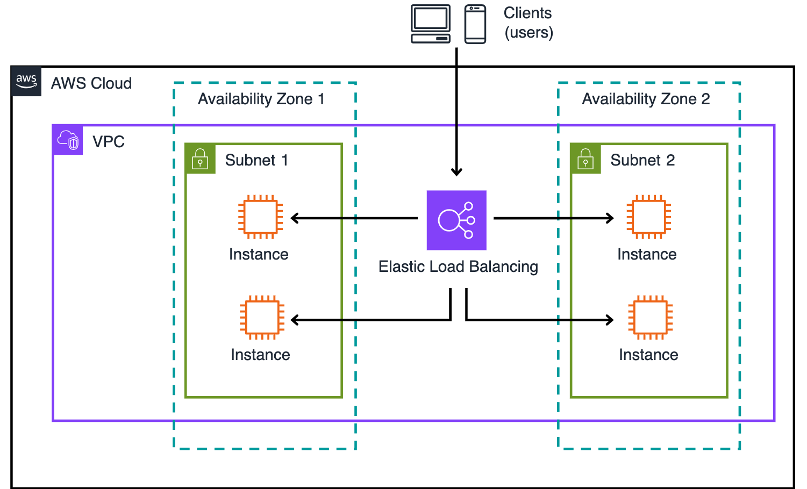

In this example, the load balancer receives requests from desktop and mobile clients (users). There are two subnets in the same virtual private cloud (VPC), with two EC2 instances each. Each subnet is in a separate Availability Zone. All four EC2 instances are registered to the same load balancer and receive traffic.

#### ELB components

1. Listeners

    A listener is a process that checks for connection requests. To define a listener, you configure a protocol and port, based on the load balancer type. Customers connect to a listener, which is referred as client-side.

2. Target groups

    A target group is a collection of resources, such as Amazon EC2 instances, AWS Lambda functions, or IP addresses, where you send traffic. Each target group must have health check definitions.

3. Rules

    Rules determine how requests are routed to the targets in one or more target groups. A rule uses conditions built from properties of the request, such as source IP or host header.

### ELB with Amazon EC2 Auto Scaling

ELB can be integrated with Amazon EC2 Auto Scaling to effectively manage target groups as instances are added or removed. To use ELB with your Amazon EC2 Auto Scaling group, you attach the load balancer to your Auto Scaling group. This registers the group with the load balancer, which acts as a single point of contact for all incoming web traffic to your Auto Scaling group.

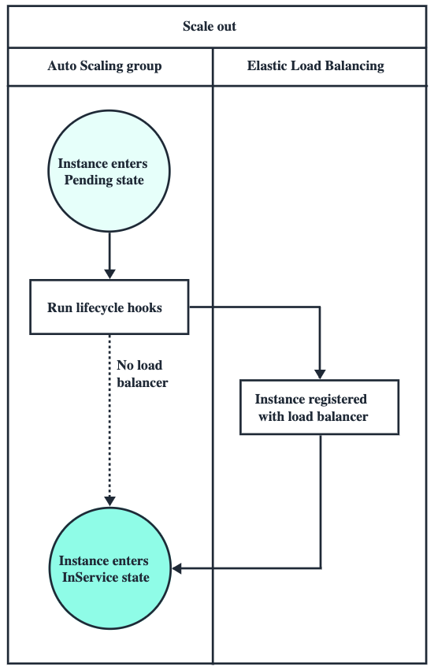

When you use ELB with your Auto Scaling group in a scale-out event, it's not necessary to register individual EC2 instances with the load balancer. Instances that are launched by your Auto Scaling group are automatically registered with the load balancer before they transition into *InService* state.

In this illustration of a scale-out event, an instance is launched in the Auto Scaling group entering *Pending* state. The Auto Scaling group then runs lifecycle hooks to perform custom actions. If there is no load balancer used with the Auto Scaling group, after custom actions are completed, the instance enters InService state. If a load balancer is used, after running lifecycle hooks, the instance is registered automatically with the load balancer. The instance then enters InService state.

Likewise, during a scale-in event, your Auto Scaling group automatically deregisters the terminating instance from the load balancer. Deregistering the instance ensures that all new requests are redirected to other instances in the load balancer's target group, while existing connections to the instance are allowed to continue until the deregistration delay expires.

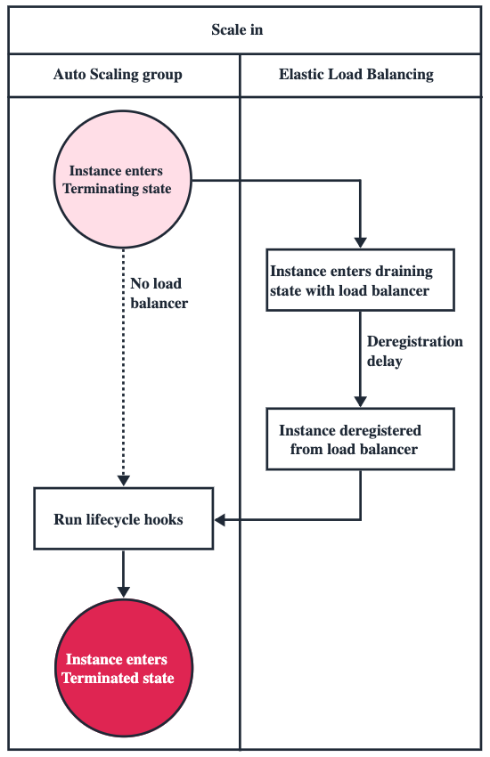

In this illustration of a scale-in event, an instance is terminating in the Auto Scaling group entering the *Terminating* state. If there is no load balancer used with the Auto Scaling group, the Auto Scaling group runs lifecycle hooks to perform custom actions. After custom actions are completed, the instance enters the Terminated state. If a load balancer is used, after the instance enters the *Terminating* state, the instance will enter the *draining* state with the load balancer and the load balancer stops sending requests to targets that are deregistering (called deregistration delay). After the deregistration delay elapses, the deregistration process is complete, and the instance is deregistered from the load balancer. It will run lifecycle hooks, and then the instance finally enters the Terminated state.

After attaching a load balancer to your Auto Scaling group, you can configure your Auto Scaling group to use ELB metrics (such as the Application Load Balancer request count per target) to scale the number of instances in the group as demand fluctuates.

### ELB health checks

You can add Elastic Load Balancing health checks to your Auto Scaling group so that Amazon EC2 Auto Scaling can identify and replace unhealthy instances based on these additional health checks.

To ensure that your Auto Scaling group can determine instance health based on additional load balancer tests, you configure the Auto Scaling group to use ELB health checks. The load balancer periodically sends pings, attempts connections, or sends requests to test the EC2 instances and determines if an instance is unhealthy. If you configure the Auto Scaling group to use ELB health checks, it considers the instance unhealthy if it fails either the Amazon EC2 health checks or the ELB health checks.

If you attach multiple load balancer target groups to an Amazon EC2 Auto Scaling group, all of them must report that an instance is healthy for it to consider the instance healthy. If any one of them reports an instance as unhealthy, the Auto Scaling group replaces the instance, even if others report it as healthy.

#### Overview of how ELB health checks work with auto scaling

1. An Auto Scaling group launches EC2 instances and automatically registers them with a specified load balancer.
2. The load balancer performs periodic health checks on all the registered EC2 instances to test their status. These health checks can be ping requests, connection attempts, or requests to a specific endpoint. By default, ELB checks instance health every 30 seconds, but you can customize this health check internally based on your requirements.
3. If an instance fails the health checks several times consecutively, the load balancer marks the instance as unhealthy or out-of-service. The load balancer stops sending requests to the unhealthy instance.
4. Auto Scaling group monitors the health status of instances through ELB health checks. If an instance is marked unhealthy, Auto Scaling group will terminate it and launch a new instance to replace it.
5. The new instance is again registered with the load balancer and added to the rotation after passing the health checks.
6. When the Auto Scaling group needs to scale in (remove EC2 instances), it will first use the ELB health check status to identify any unhealthy instances. These instances are marked for termination first. If there are no unhealthy instances, the Auto Scaling group will identify healthy instances that have been running the longest and terminate those to meet the desired capacity.
7. As the Auto Scaling group terminates instances, the instances are marked as unhealthy and deregistered from the ELB target group. This removes them from receiving new traffic. Existing connections on the instance are given time to complete gracefully.
8. After the deregistration delay timeout, the instance is detached from the ELB target group completely. The Auto Scaling group proceeds to terminate the instance.
9. The load balancer stops routing requests to the terminated instances and the load balancer automatically redistributes traffic evenly across the remaining healthy instances in the target group.

### Elastic Load Balancing Services

#### Open Systems Interconnection (OSI) model

The Open Systems Interconnection (OSI) model is a conceptual framework that divides network communications functions into seven layers.

##### Seven layers of the OSI model

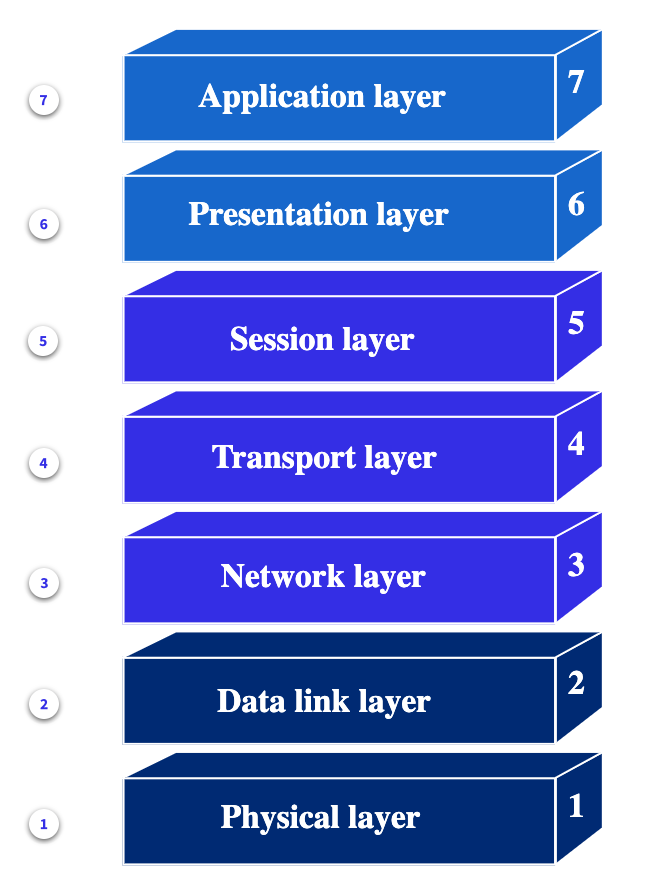

1. **Physical layer (layer 1)**. The physical layer refers to the physical communication medium and the technologies to transmit data across that medium.

2. **Data link layer (layer 2)**. The data link layer refers to the technologies used to connect two machines across a network where the physical layer already exists.

3. **Network layer (layer 3)**. The network layer is concerned with concepts such as routing, forwarding, and addressing across a dispersed network or multiple connected networks of nodes or machines.

4. **Transport layer (layer 4)**. The primary focus of the transport layer is to ensure that data packets arrive in the right order, without losses or errors, or can be seamlessly recovered if required.

    Flow control, along with error control, is often a focus at the transport layer. For example, TCP is commonly used where all data must be intact (such as file share), whereas UDP is used when retaining all packets is less critical (such as video streaming).

5. **Session layer (layer 5)**. The session layer is responsible for network coordination between two separate applications in a session.

6. **Presentation layer (layer 6)**. The presentation layer ensures that data is in a usable format and is where data encryption occurs.

7. **Application layer (layer 7)**. The application layer is the human-computer interaction layer, where applications can access the network services.

    This layer is concerned with the specific type of application and its standardized communication methods. For example, browsers can communicate using HTTPS, and HTTP and email clients can communicate using Post Office Protocol version 3 (POP3) and Simple Mail Transfer Protocol (SMTP).

#### Application Load Balancers

An Application Load Balancer is ideal for load balancing HTTP and HTTPS traffic. It operates at layer 7, routing traffic to targets (Amazon EC2 instances, containers, IP addresses, and AWS Lambda functions) based on the request content.

You can add and remove targets from your load balancer as your needs change, without disrupting the overall flow of requests to your application. ELB scales your load balancer as traffic to your application changes over time. ELB can scale to the vast majority of workloads automatically.

You can configure health checks, which are used to monitor the health of the registered targets so that the load balancer can send requests only to the healthy targets.

##### Key features of Application Load Balancers

###### Security

You can create and manage security groups associated with ELB to provide additional networking and security options inside your VPC. Application Load Balancer supports desync protections implementation based on the **http_desync_guardian** library, where customer applications are protected from HTTP vulnerabilities.

###### TLS offloading

An Application Load Balancer supports client TLS session termination. You can create an HTTPS listener, which enables traffic encryption between your load balancer and the clients that initiate SSL or TLS sessions.

###### Sticky sessions

An Application Load Balancer supports both duration-based and application-based cookies, enabling nearly continuous request routing from the same client to the same target.

###### Redirects

An Application Load Balancer can redirect an incoming request from one URL, such as HTTP, to another URL, such as HTTPS, helping you to achieve security compliance.

###### Fixed response

An Application Load Balancer can control which client requests are served by your application, so it can respond to requests before they reach your applications.

###### Content-based routing

An Application Load Balancer can route a request to a service based on the content of the request, such as Host field, Path URL, HTTP header, HTTP method, Query string, or source IP address.

##### Benefits of migrating from a Classic Load Balancer

Using an Application Load Balancer instead of a Classic Load Balancer (a previous-generation load balancer) has the following benefits:

* Support for path conditions. You can configure rules for your listener that forward requests based on the URL in the request. This helps you structure your application as smaller services and route requests to the correct service based on the content of the URL.
* Support for host conditions. You can configure rules for your listener that forward requests based on the host field in the HTTP header. You can route requests to multiple domains using a single load balancer.
* Support for routing based on fields in the request, such as HTTP header conditions and methods, query parameters, and source IP addresses.
* Support for routing requests to multiple applications on a single EC2 instance. You can register an instance or IP address with multiple target groups, each on a different port.
* Support for redirecting requests from one URL to another.
* Support for returning a custom HTTP response.
* Support for registering targets by IP address, including targets outside the VPC for the load balancer.
* Support for registering Lambda functions as targets.
* Support for the load balancer to authenticate users of your applications through their corporate or social identities before routing requests.
* Support for containerized applications. Amazon ECS can select an unused port when scheduling a task and register the task with a target group using this port. This helps you make efficient use of your clusters.
* Support for monitoring the health of each service independently, as health checks are defined at the target group level and many CloudWatch metrics are reported at the target group level. By attaching a target group to an Auto Scaling group, you can scale each service dynamically based on demand.
* Access logs contain additional information and are stored in compressed format.
* Improved load balancer performance.

#### Network Load Balancers

A Network Load Balancer is ideal for load balancing TCP and UDP traffic. It operates at layer 4, routing connections to targets (Amazon EC2 instances, microservices, and containers) in Amazon VPC, based on IP protocol data. It can handle millions of requests per second. After the load balancer receives a connection request, it selects a target from the target group for the default rule. It attempts to open a TCP connection to the selected target on the port specified in the listener configuration.

For TCP traffic, the load balancer selects a target using a flow hash algorithm based on the protocol, source IP address, source port, destination IP address, destination port, and TCP sequence number. The TCP connections from a client have different source ports and sequence numbers, and can be routed to different targets. Each individual TCP connection is routed to a single target for the life of the connection.

For UDP traffic, the load balancer selects a target using a flow hash algorithm based on the protocol, source IP address, source port, destination IP address, and destination port. A UDP flow has the same source and destination, so it is consistently routed to a single target throughout its lifetime. Different UDP flows have different source IP addresses and ports, so they can be routed to different targets.

##### Key features of Network Load Balancers

###### Sticky sessions

Requests are routed from the same client to the same target by a sticky session defined at the target group level.

###### Low latency

A Network Load Balancer offers low latencies for latency-sensitive applications.

###### Preserve source IP address

A Network Load Balancer preserves the client-side source IP address and allows the backend to see the client’s IP address.

###### Static IP support

A Network Load Balancer automatically provides a static IP address per Availability Zone (subnet) that can be used by applications as the load balancer’s front-end IP.

###### Elastic IP address support

You can assign an Elastic IP address per Availability Zone (subnet) and have your own fixed IP address.

###### DNS failover

If no healthy targets are registered with the Network Load Balancer, or the Network Load Balancer nodes in a zone are unhealthy, Amazon Route 53 will direct traffic to load balancer nodes in other Availability Zones.

#### Gateway Load Balancers

You can use Gateway Load Balancers to deploy, scale, and manage virtual appliances, such as firewalls, intrusion detection and prevention systems, and deep packet inspection systems. They combine a transparent network gateway (that is, a single entry and exit point for all traffic) and distribute traffic while scaling your virtual appliances with the demand.

A Gateway Load Balancer operates at the third layer of the OSI model, the network layer. It listens for all IP packets across all ports and forwards traffic to the target group that's specified in the listener rule. It maintains stickiness of flows to a specific target appliance using 5-tuple (for TCP/UDP flows) or 3-tuple (for non-TCP/UDP flows). A Gateway Load Balancer and its registered virtual appliance instances exchange application traffic using the GENEVE protocol on port 6081. 

Gateway Load Balancers use Gateway Load Balancer endpoints to securely exchange traffic across VPC boundaries. A Gateway Load Balancer endpoint is a VPC endpoint that provides private connectivity between virtual appliances in the service provider VPC and application servers in the service consumer VPC. You deploy the Gateway Load Balancer in the same VPC as the virtual appliances. You register the virtual appliances with a target group for the Gateway Load Balancer. 

Traffic to and from a Gateway Load Balancer endpoint is configured using route tables. Traffic flows from the service consumer VPC over the Gateway Load Balancer endpoint to the Gateway Load Balancer in the service provider VPC, and then returns to the service consumer VPC. You must create the Gateway Load Balancer endpoint and the application servers in different subnets. You can configure the Gateway Load Balancer endpoint as the next hop in the route table for the application subnet.

##### Key features of Gateway Load Balancers

###### Bring higher availability to third-party virtual appliances

A Gateway Load Balancer ensures high availability and reliability by routing traffic through healthy virtual appliances and rerouting flows when a virtual appliance becomes unhealthy.

###### Monitor health and performance metrics

You can monitor your Gateway Load Balancer using Amazon CloudWatch with Availability Zone metrics.

###### Streamline deployment with AWS Marketplace

Deploying a new virtual appliance can be as straightforward as selecting it in AWS Marketplace.

###### Ensure private connectivity in the AWS Cloud with Gateway Load Balancer endpoints

A Gateway Load Balancer connects internet gateways, VPCs, and other network resources over a private connection. Your traffic flows in the AWS Cloud, which protects your data from being exposed on the internet.

### Availability Zones and Load Balancer Nodes

When enabling an Availability Zone for your load balancer, Elastic Load Balancing creates a load balancer node in that zone. Targets registered in an enabled zone receive traffic; targets in a non-enabled zone do not. For high availability, enable multiple zones and ensure that each has at least one registered target. For Application Load Balancers, enabling at least two zones is required. This provides redundancy in case one zone becomes unavailable. If a zone is disabled, its registered targets remain registered but do not receive traffic.

#### Cross-zone load balancing

The nodes for your load balancer distribute requests from clients to registered targets. When cross-zone load balancing is enabled, each load balancer node distributes traffic across the registered targets in all enabled Availability Zones. When cross-zone load balancing is disabled, each load balancer node distributes traffic only across the registered targets in its Availability Zone.

The following diagrams demonstrate the effect of cross-zone load balancing with round robin (see glossary) as the default routing algorithm. There are two enabled Availability Zones, with two targets in Availability Zone A and eight targets in Availability Zone B. Clients send requests, and Amazon Route 53 responds to each request with the IP address of one of the load balancer nodes. Based on the round robin routing algorithm, traffic is distributed such that each load balancer node receives 50 percent of the traffic from the clients. Each load balancer node distributes its share of the traffic across the registered targets in its scope.

If cross-zone load balancing is enabled, each of the 10 targets receives 10 percent of the traffic. This is because each load balancer node can route its 50 percent of the client traffic to all 10 targets.

##### Cross-zone load balancing enabled

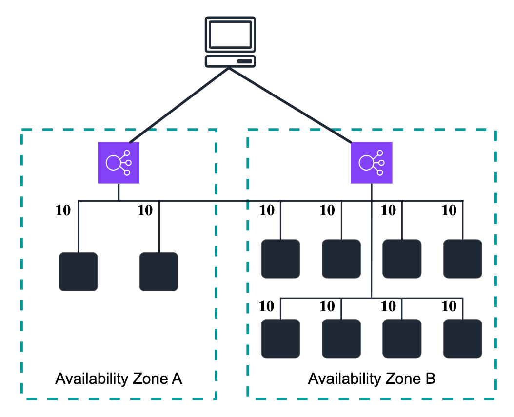

##### Cross-zone load balancing disabled

If cross-zone load balancing is disabled, the following results occur:

* Each of the two targets in Availability Zone A receives 25 percent of the traffic.
* Each of the eight targets in Availability Zone B receives 6.25 percent of the traffic.

This is because each load balancer node can route its 50 percent of the client traffic only to targets in its Availability Zone.

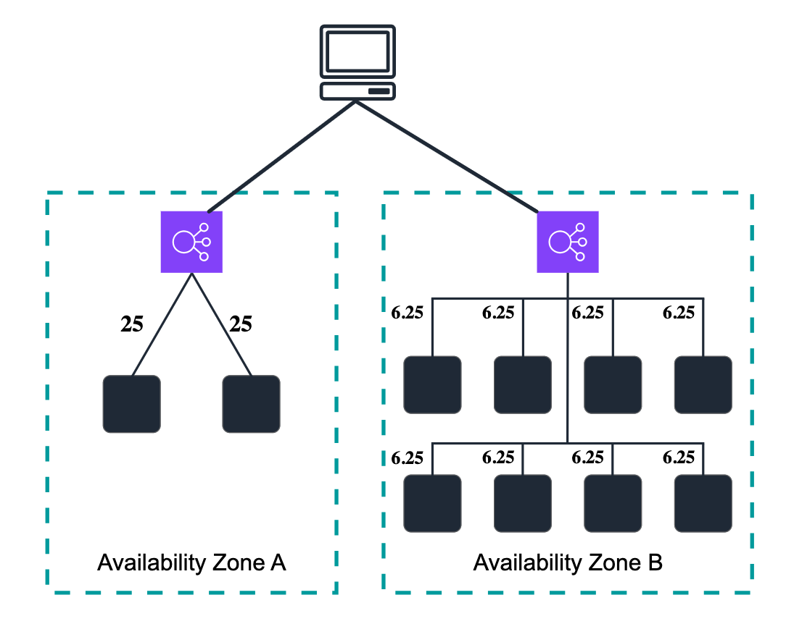

With Application Load Balancers, cross-zone load balancing is always enabled at the load balancer level. At the target group level, cross-zone load balancing can be disabled.

With Network Load Balancers and Gateway Load Balancers, cross-zone load balancing is disabled by default. After you create the load balancer, you can enable or disable cross-zone load balancing at any time.

#### Glossary

* **Round robin routing algorithm**

    Round robin is the most widely deployed load balancing algorithm. Using this method, client requests are routed to available servers on a cyclical basis. Round robin server load balancing works best when servers have roughly identical computing capabilities and storage capacity.

    Round robin network load balancing rotates connection requests among web servers in the order that requests are received. For a simplified example, assume that an enterprise has a cluster of three servers: Server A, Server B, and Server C.

  * The first request is sent to Server A.
  * The second request is sent to Server B.
  * The third request is sent to Server C.

The load balancer continues to pass requests to servers based on this order. This ensures that the server load is distributed evenly to handle high traffic.

#### Load balancer scheme

When you create a load balancer, you must choose whether to make it an internal load balancer or an internet-facing load balancer. For example, an internal load balancer can be used to route requests that are internal to the VPC, such as requests between web servers and application servers.

The nodes of an internet-facing load balancer have public IP addresses. The DNS name of an internet-facing load balancer is publicly resolvable to the public IP addresses of the nodes. Therefore, internet-facing load balancers can route requests from clients over the internet.

The nodes of an internal load balancer have only private IP addresses. The DNS name of an internal load balancer is publicly resolvable to the private IP addresses of the nodes. Therefore, internal load balancers can only route requests from clients with access to the VPC for the load balancer.

Both internet-facing and internal load balancers route requests to your targets using private IP addresses. Therefore, your targets do not need public IP addresses to receive requests from an internal or an internet-facing load balancer.

### Deployment Strategies

Resource provisioning, configuration management, application deployment, software updates, monitoring, access control, and other concerns are all important factors to consider when designing a deployment solution. The deployment processes that you choose to update your application can depend on your desired balance of control, speed, cost, risk tolerance, and other factors.

#### Blue/green deployments

A blue/green deployment is a deployment strategy in which you create two separate but identical environments. One environment (blue) is running the current application version and one environment (green) is running the new application version. Using a blue/green deployment strategy increases application availability and reduces deployment risk by simplifying the rollback process if a deployment fails. When testing has been completed on the green environment, live application traffic is directed to the green environment and the blue environment is deprecated.

#### Canary deployments

The purpose of a canary deployment is to reduce the risk of deploying a new version that impacts the workload. The method will incrementally deploy the new version, making it visible to new users slowly. As you gain confidence in the deployment, you will deploy it to replace the current version in its entirety.

The following are the key aspects of canary deployments:

* A small percentage of real user traffic is shifted to the new version. This is the *canary group* that acts as an early warning indicator if anything goes wrong.
* The canary deployment permits testing the new version on actual user traffic and workflows, under real production load conditions. This catches issues that staging environments might miss.
* If the canary deployment succeeds with no issues, the release is progressively rolled out to more users in phases. If issues are detected, the rollback to the previous version is also done incrementally.
* Canary deployments help reduce risk and provide faster feedback on releases. If the canary users experience problems, the impact is limited to a small percentage of traffic.
* Automated analysis of metrics from canary users is used to detect regressions or other problems. Metrics can include error rates, latency, or traffic levels. Configurable thresholds determine whether to continue, roll back or cancel the rollout.
* Canary deployments let developers gain confidence in changes and catch issues proactively before impacting all users. It's a key technique for continuous delivery and deployment of applications.

#### Rolling deployments

A rolling deployment is a deployment strategy that slowly replaces previous versions of an application with new versions of an application by completely replacing the infrastructure on which the application is running. For example, in a rolling deployment in Amazon ECS, containers running previous versions of the application will be replaced one-by-one with containers running new versions of the application.

The rolling deployment pattern is similar to a canary deployment in that the IT team makes the new release available to some users before others. However, the canary technique targets *certain users* to receive access to the new application version, and the rolling deployment targets *certain servers*.

A rolling deployment is generally faster than a blue/green deployment. However, unlike a blue/green deployment, in a rolling deployment there is no environment isolation between the old and new application versions. This allows rolling deployments to complete more quickly, but also increases risks and complicates the process of rollback if a deployment fails.

#### In-place deployments

An in-place deployment is a deployment strategy that updates the application version without replacing any infrastructure components. In an in-place deployment, the previous version of the application on each compute resource is stopped, the latest application is installed, and the new version of the application is started and validated. This allows application deployments to proceed with minimal disturbance to underlying infrastructure.

With in-place deployment, you can deploy your application without creating new infrastructure; however, the availability of your application can be affected during these deployments. This approach also minimizes infrastructure costs and management overhead associated with creating new resources.

#### Prebaking and bootstrapping AMIs

If your application relies heavily on customizing or deploying applications onto Amazon EC2 instances, you can optimize your deployments through bootstrapping and prebaking practices.

Installing your application, dependencies, or customizations whenever an EC2 instance is launched is called bootstrapping an instance. If you have a complex application or large downloads are required, this can slow down deployments and scaling events.

An Amazon Machine Image (AMI) provides the information required to launch an instance (such as operating systems, storage volumes, permissions, and software packages). You can launch multiple, identical instances from a single AMI. Whenever an EC2 instance is launched, you select the AMI that is to be used as a template. Prebaking is the process of embedding a significant portion of your application artifacts within an AMI.

Prebaking application components into an AMI can speed up the time to launch and operationalize an EC2 instance. Prebaking and bootstrapping practices can be combined during the deployment process to quickly create new instances that are customized to the current environment.

#### Combining deployment services

There is not a “one size fits all” deployment solution on AWS. In the context of designing a deployment solution, it is important to consider the type of application because this can dictate which AWS services are most appropriate. To deliver complete functionality to provision, configure, deploy, scale, and monitor your application, it is often necessary to combine multiple deployment services.

A common pattern for applications on AWS is to use AWS CloudFormation (and its extensions) to manage general-purpose infrastructure, and use a more specialized deployment solution for managing application updates. In the case of a containerized application, CloudFormation could be used to create the application infrastructure, and Amazon ECS and Amazon EKS could be used to provision, deploy, and monitor containers.

AWS deployment services can also be combined with third-party deployment services. Organizations can then readily integrate AWS deployment services into their existing continuous integration and continuous delivery (CI/CD) pipelines or infrastructure management solutions. For example, AWS OpsWorks can be used to synchronize configurations between on-premises and AWS nodes, and AWS CodeDeploy can be used with a number of third-party CI/CD services as part of a complete pipeline.

### Activity: Identifying the Type of Deployment by its Characteristics

#### You're tasked with deploying a critical update to your web application on AWS. Which deployment strategy involves creating a duplicate environment with the new version that allows easy rollback if issues arise?

* Blue/green deployment

Wrong answers:

* In-place deployment
* Rolling deployment
* Canary deployment

##### Explanation

A blue/green deployment is a deployment strategy in which you create two separate but identical environments. One environment (blue) is running the current application version and one environment (green) is running the new application version. Using a blue/green deployment strategy increases application availability and reduces deployment risk by simplifying the rollback process if a deployment fails.

#### You team wants to gradually introduce a new feature to a subset of your users on AWS. What deployment approach can you use to roll out changes to a small group, monitor their impact, and then proceed to a wider audience if successful?

* Canary deployment

Wrong answers:

* In-place deployment
* Blue/green deployment
* Rolling deployment

##### Explanation

The purpose of a canary deployment is to reduce the risk of deploying a new version that impacts the workload. A small percentage of real user traffic is shifted to the new version. This is the *canary group* that acts as an early warning indicator if anything goes wrong. As you gain confidence in the deployment, you will deploy it to replace the current version in its entirety.

#### In an effort to minimize application downtime, you need to update instances one at a time while maintaining the existing environment. Which deployment method gradually replaces old instances with new ones in an orchestrated manner?

* Rolling deployment

Wrong answers:

* Blue/green deployment
* Canary deployment
* In-place deployment

##### Explanation

A rolling deployment is a deployment strategy that slowly replaces previous versions of an application with new versions of an application by completely replacing the infrastructure on which the application is running. The rolling deployment is similar to a canary deployment. However, the **canary technique** targets **certain users** rather than **certain servers**.

### Using an Application Load Balancer for Canary and Blue/Green Deployments

Canary deployments are a pattern for the slow rollout of a new version of an existing application. With canary deployments, you can incrementally deploy the new version, making it visible to new users in a slow fashion. As you gain confidence in the deployment, you can deploy it to replace the current version in its entirety.

Blue/green deployments provide near-zero downtime release and rollback capabilities. The fundamental idea behind blue/green deployment is to shift traffic between two identical environments that are running different versions of your application. The blue environment represents the current application version serving production traffic. In parallel, the green environment is staged running a newer version of your application. After the green environment is ready and tested, production traffic is redirected from blue to green. If any problems are identified, you can roll back by reverting traffic to the blue environment.

AWS provides several options to help you automate and streamline your canary deployments and blue/green deployments. One approach is to use the Application Load Balancer weighted target group feature.

#### Application Load Balancer weighted target groups

Application Load Balancers support weighted target groups routing. With this feature, you can add more than one target group to the forward action of a listener rule, and specify a weight for each group. For example, when you define a rule as having two target groups with weights of 9 and 1, the load balancer routes 90 percent of the traffic to the first target group and 10 percent to the other target group. You can create and configure your weighted target groups by using the AWS Management Console, AWS Command Line Interface (AWS CLI), or an AWS SDK.

##### Target group level stickiness

You can set target group stickiness to make sure that clients get served from a specific target group for a configurable duration of time to ensure consistent experience. Target group stickiness is different from the already existing load balancer stickiness (also known as sticky sessions). Sticky sessions make sure that the requests from a client are always sticking to a particular target within a target group. Target group stickiness only ensures that the requests are sent to a particular target group.

You can enable target group level stickiness by using the AWS CLI with the **TargetGroupStickinessConfig** parameter, as shown in the following CLI command:

```shell
aws elbv2 modify-listener \
    --listener-arn " < LISTENER ARN > " \
    --default-actions \
    '[{
       "Type": "forward",
       "Order": 1,
       "ForwardConfig": {
          "TargetGroups": [
             {"TargetGroupArn": "<Blue Target Group ARN>", "Weight": 90}, \
             {"TargetGroupArn": "<Green Target Group ARN>", "Weight": 10}, \
          ],
          "TargetGroupStickinessConfig": {
             "Enabled": true,
             "DurationSeconds": 120
          }
       }
    }]'
```

#### Canary deployments with Application Load Balancer weighted target group

The canary deployment pattern provides you the ability to roll out a new version of your application to a subset of users before making it widely available. This can be helpful in validating the stability of a new version of the application or performing A/B testing.

For this use case, you want to perform canary deployment for your application and test it by driving only 10 percent of the incoming traffic to your new version for 12 hours. You need to create two weighted target groups for your Application Load Balancer and use target group stickiness set to a duration of 12 hours. When target group stickiness is enabled, the requests from a client are sent to the same target group for the specified time duration. You can define a rule as having two target groups, blue and green, with weights of 90 and 10, respectively, and enable target group level stickiness with a duration of 12 hours (43,200 seconds). The following table and CLI command summarize this configuration.

| Target Group | Application | Weight |
| ------------ | ----------- | ------ |
| Target Group Blue | Version 1 (current production version) | 90% |
| Target Group Green | Version 2 (new version) | 10% |

```shell
aws elbv2 modify-listener \
    --listener-arn " < LISTENER ARN > " \
    --default-actions \
    '[{
       "Type": "forward",
       "Order": 1,
       "ForwardConfig": {
          "TargetGroups": [
             {"TargetGroupArn": "<Blue Target Group ARN>", "Weight": 90}, \
             {"TargetGroupArn": "<Green Target Group ARN>", "Weight": 10}, \
          ],
          "TargetGroupStickinessConfig": {
             "Enabled": true,
             "DurationSeconds": 43200
          }
       }
    }]'
```

At this point, the users with existing sessions continue to be sent to the blue target group running version 1, and 10 percent of the new users without a session are sent to the green target group for up to 12 hours running version 2, as illustrated in the following diagram.

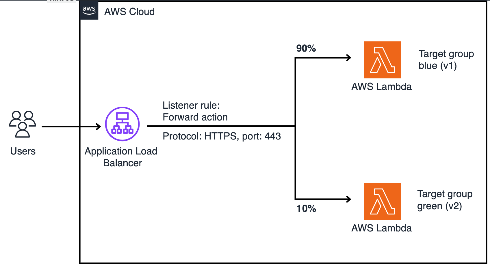

Users make connections with the Application Load Balancer with the listener rule: forward action and protocol: HTTPS, port: 443. The Application Load Balancer then sends 90 percent of the users with existing sessions to the blue target group running version 1, and 10 percent of the new users without a session to the green target group running version 2.

When you’re confident that the new version is stable and performing well, you can update the target group weights for your blue and green target groups to be 0 percent and 100 percent, respectively, to ensure that all the traffic is shifted to your green target group. You might still see some traffic flowing into the blue target group for existing users with active sessions whose target group stickiness duration (in this case, target group stickiness duration is 12 hours) has not expired.

#### Blue/green deployments with Application Load Balancer weighted target group

For this use case, you want to perform blue/green deployment for your application to provide near-zero downtime release and rollback capabilities. You can create two weighted target groups called blue and green with the following weights applied as an initial configuration.

| Target Group | Application | Weight |
| ------------ | ----------- | ------ |
| Target Group Blue | Version 1 (current production version) | 100% |
| Target Group Green | Version 2 (new version) | 0% |

When you’re ready to perform the deployment, you can change the weights for blue and green targets groups to be 0 percent and 100 percent, respectively, to shift the traffic completely to your newer version of the application.

| Target Group | Application | Weight |
| ------------ | ----------- | ------ |
| Target Group Blue | Version 1 (current production version) | 0% |
| Target Group Green | Version 2 (new version) | 100% |

When you’re performing blue/green deployment using weighted target groups, the recommendation is to not enable target group level stickiness, so that traffic shifts immediately from the blue target group to the green target group. Refer to the following CLI command:

```shell
aws elbv2 modify-listener \
    --listener-arn "<LISTENER ARN>" \
    --default-actions \
    '[{
       "Type": "forward",
       "Order": 1,
       "ForwardConfig": {
          "TargetGroups": [
             {"TargetGroupArn": "<Blue Target Group>", "Weight": 0}, \
             {"TargetGroupArn": "<Green Target Group>", "Weight": 100}, \
          ]
       }
    }]'
```

The following diagram shows the updated architecture.

|[Blue-green deployment architecture diagram with 0% blue traffic and 100% green traffic.](./images/W07Img082ELBCanaryDeploymentBlueGreen.png)

Users make connections with the Application Load Balancer. The load balancer sends 0 percent of the users to the blue target group running version 1, and 100 percent of the users to the green target group running version 2.

If you need to enable target group level stickiness, you can ensure that all traffic transitions from the blue target group to the green target group by keeping the target group level stickiness duration as low as possible (5 minutes or less).

In the following code, the target group level stickiness is enabled for a duration of 5 minutes and traffic is completely shifted from the blue target group to the green target group:

```shell
aws elbv2 modify-listener \
    --listener-arn "<LISTENER ARN> " \
    --default-actions \
    '[{
       "Type": "forward",
       "Order": 1,
       "ForwardConfig": {
          "TargetGroups": [
             {"TargetGroupArn": "<Blue Target Group>", "Weight": 0}, \
             {"TargetGroupArn": "<Green Target Group>", "Weight": 100}, \
          ],
          "TargetGroupStickinessConfig": {
             "Enabled": true,
             "DurationSeconds": 300
          }
       }
    }]'
```

The existing users with connection stickiness to the blue target group continue to the blue target group until the 5-minute duration elapses from the last request time.

**Target group stickiness duration still influences the traffic shift between blue and green targets. So AWS recommends that you reduce the target group stickiness duration from 5 minutes to 1 minute or less, depending upon your use case, to ensure that all users transition into the green target group at the earliest.**

#### Connection draining

To provide near-zero downtime release with blue/green deployment, you want to avoid breaking open network connections while taking an instance out of service, updating its software, or replacing it with a fresh instance that contains updated software. In the previous use cases, you can ensure graceful transition between blue and green target groups by enabling the connection draining feature for your load balancers. You can do this from the AWS Management Console or the AWS CLI, or by calling the **ModifyLoadBalancerAttributes** function in the Elastic Load Balancing API. You can enable the feature and enter a timeout between 1 second and 1 hour. The connection time out duration depends upon your application profile. If your application is stateless like your customers are using your website, connection time out duration of lowest value is preferable.

Applications that are transactions heavy and connection oriented sessions like web sockets, AWS recommends that you choose relatively high connection draining duration.

#### Load balancer stickiness

In addition to the target group level stickiness, Application Load Balancers also support load balancer level stickiness. When a load balancer first receives a request from a client, it routes the request to a target, generates a cookie named AWSALB that encodes information about the selected target, encrypts the cookie, and includes the cookie in the response to the client. The client should include the cookie that it receives in subsequent requests to the load balancer. When the load balancer receives a request from a client that contains the cookie, if sticky sessions are enabled for the target group and the request goes to the same target, the load balancer detects the cookie and routes the request to the same target. If the cookie is present but can’t be decoded, or if it refers to a target that was deregistered or is unhealthy, the load balancer selects a new target and updates the cookie with information about the new target.

You can enable Application Load Balancer stickiness by using the AWS CLI or the console. You can specify a value between 1 second and 7 days.

In the context of blue/green and canary deployments, the load balancer stickiness has no influence on the traffic shifting behavior using the weighted target groups because target group stickiness takes precedence over load balancer stickiness.

* [Sticky Sessions for your Application Load Balancer](https://docs.aws.amazon.com/elasticloadbalancing/latest/application/sticky-sessions.html)

### [Lab: Introduction to Elastic Load Balancing](./labs/W072Lab2ElasticLoadBalancer.md)

In this lab, you will create, configure, and test a Network Load Balancer and an Application Load Balancer.

You will perform the following tasks:

* Configure a target group and register targets for a Network Load Balancer.
* Configure target groups and register targets for an Application Load Balancer.
* Create and test a Network Load Balancer.
* Create and test an Application Load Balancer.

### How Elastic Load Balancing Integrates with Route 53

#### DNS failover for ELB

Failover refers to automatically switching traffic from one resource to another in the event of a failure or unavailability. Elastic Load Balancing (ELB) can be integrated into Amazon Route 53 to enhance the availability and fault tolerance of your applications by enabling automatic failover across Availability Zones and Regions. This integration helps prevent outages by routing traffic to healthy resources even if some become unavailable.

Determining the health of an ELB endpoint is more complex than health checking a single IP address. For example, what if your application is running fine on Amazon EC2, but the load balancer itself isn't reachable? Or if your load balancer and your EC2 instances are working correctly, but a bug in your code causes your application to crash? Or how about if the EC2 instances in one Availability Zone of a Multi-AZ ELB load balancer are experiencing problems?

Route 53 DNS failover handles all these failure scenarios by integrating with ELB behind the scenes. When Route 53 DNS failover is enabled, Route 53 automatically configures and manages health checks for individual ELB nodes. Route 53 also takes advantage of the EC2 instance health checking that ELB performs. By combining the results of health checks of your EC2 instances and your load balancers, Route 53 DNS failover is able to evaluate the health of the load balancer and the health of the application running on the EC2 instances behind it. In other words, if any part of the stack goes down, Route 53 detects the failure and routes traffic away from the failed endpoint.

When setting up DNS failover for an ELB endpoint, you simply set Evaluate Target Health to Yes and you don't need to create a health check of your own for this endpoint.

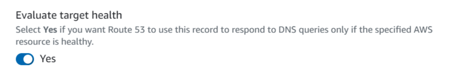

#### Request routing

Before a client sends a request to your load balancer, it resolves the load balancer's domain name by using a DNS server. The DNS entry is controlled by Amazon because your load balancers are in the **amazonaws.com** domain. The Amazon DNS servers return one or more IP addresses to the client. These are the IP addresses of the load balancer nodes for your load balancer. With Network Load Balancers, Elastic Load Balancing creates a network interface for each Availability Zone that you enable, and uses it to get a static IP address. You can optionally associate one Elastic IP address with each network interface when you create the Network Load Balancer.

As traffic to your application changes over time, ELB scales your load balancer and updates the DNS entry. The DNS entry also specifies the time-to-live (TTL) of 60 seconds. This helps ensure that the IP addresses can be remapped quickly in response to changing traffic.

The client determines which IP address to use to send requests to the load balancer. The load balancer node that receives the request selects a healthy registered target and sends the request to the target using its private IP address.

##### Routing algorithm

With Application Load Balancers, the load balancer node that receives the request uses the following process:

1. It evaluates the listener rules in priority order to determine which rule to apply.
2. It selects a target from the target group for the rule action, using the routing algorithm configured for the target group. The default routing algorithm is round robin. Routing is performed independently for each target group, even when a target is registered with multiple target groups.

With Network Load Balancers, the load balancer node that receives the connection uses the following process:

1. It selects a target from the target group for the default rule using a flow hash algorithm. It bases the algorithm on the following:

    * The protocol
    * The source IP address and source port
    * The destination IP address and destination port
    * The TCP sequence number

2. It routes each individual TCP connection to a single target for the life of the connection. The TCP connections from a client have different source ports and sequence numbers, and can be routed to different targets.

#### Routing traffic to an ELB load balancer

A company might say, "I want my customers to be routed to my company's website when they access example.com. How can I do that?" What would be your recommendation to this scenario?

If you host a website on multiple Amazon EC2 instances, you can distribute traffic to your website across the instances by using an ELB load balancer. The ELB service automatically scales the load balancer as traffic to your website changes over time. The load balancer can also monitor the health of its registered instances and route domain traffic only to healthy instances.

To route domain traffic to an ELB load balancer, you can use Route 53 to create an alias record that points to your load balancer. An alias record is a Route 53 extension to DNS. It's similar to a CNAME record, but you can create an alias record both for the root domain, such as example.com, and for subdomains, such as www.example.com. (You can create CNAME records only for subdomains.)

##### Prerequisites to route traffic to an ELB load balancer

To get started, you need the following:

* **An ELB load balancer**: You can use an Application Load Balancer or Network Load Balancer. Give the load balancer a name that will help you remember what it's for later. The name that you specify when you create a load balancer is the name that you will choose when you create an alias record in the Route 53 console.
* **A registered domain name**: You can use Route 53 as your domain registrar, or you can use a different registrar.
* **Route 53 as the DNS service for the domain**: If you register your domain name by using Route 53, AWS automatically configures Route 53 as the DNS service for the domain.

##### Configuring Route 53 to route traffic to an ELB load balancer

1. If you created the Route 53 hosted zone and the ELB load balancer using the same account, skip to step 2.

    If you created the hosted zone and the ELB load balancer using different accounts, perform the procedure [Getting the DNS Name for an Elastic Load Balancing Load Balancer](https://docs.aws.amazon.com/Route53/latest/DeveloperGuide/resource-record-sets-creating.html#resource-record-sets-elb-dns-name-procedure) to get the DNS name for the load balancer.

2. Sign in to the AWS Management Console and open the Route 53 console.

    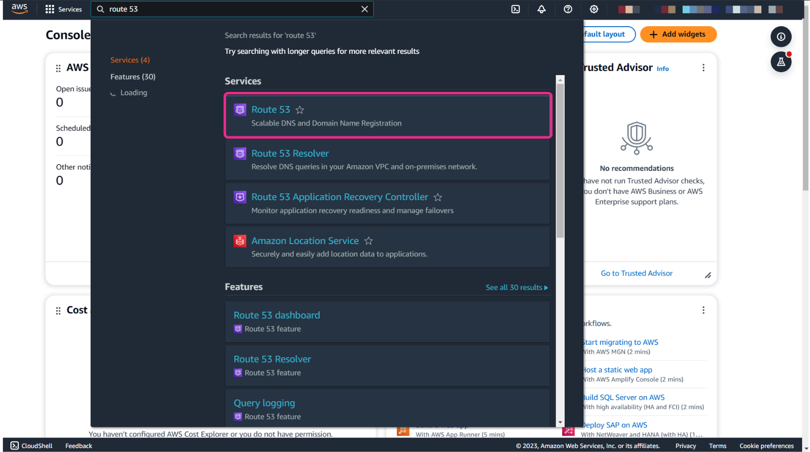

3. In the left navigation pane, choose **Hosted zones**.

    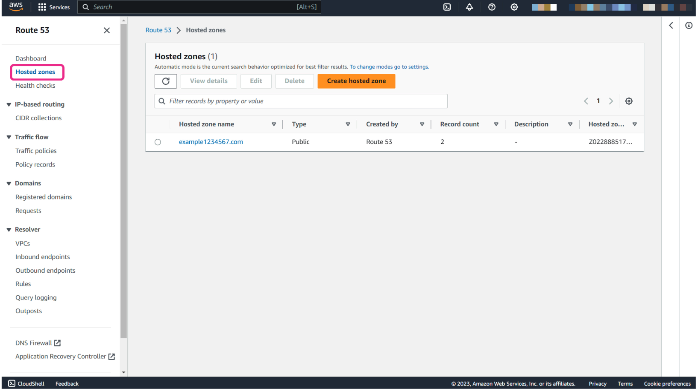

4. Choose the name of the hosted zone that has the domain name that you want to use to route traffic to your load balancer.

    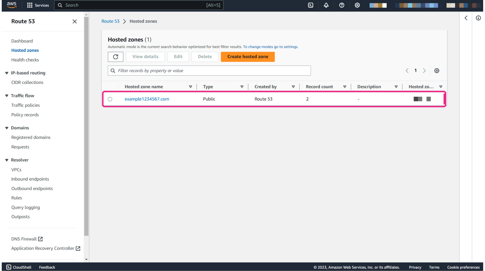

5. Choose **Create record**.

    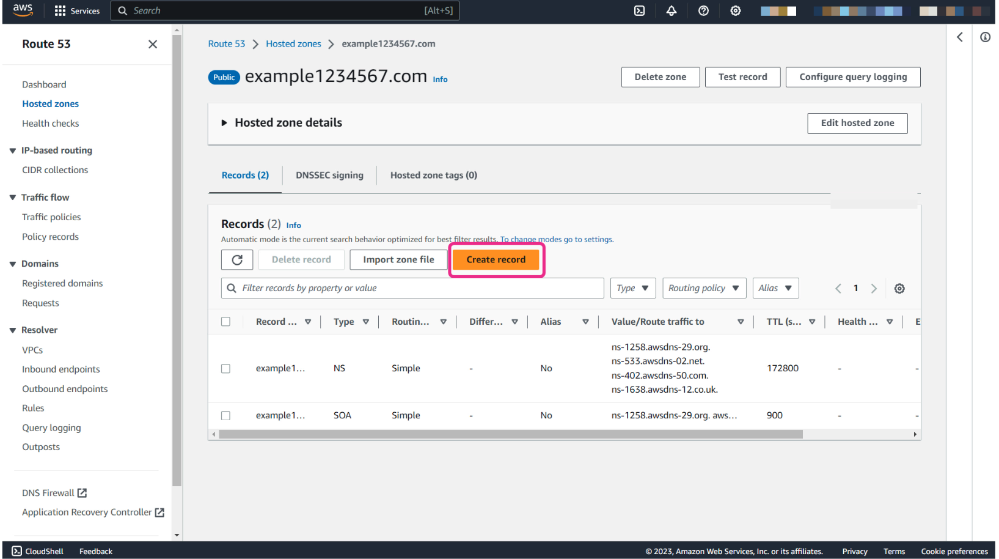

6. If you use the wizard to create the record, select the applicable routing policy and then choose **Next**.

    |[Routing policy selections: simple routing, weighted, geolocation, latency, failover, multivalue answer, and IP-based.](./images/W07Img095ELBDnsRoute53HostedZonesCreateRecordRoutingPolicy.png)

7. 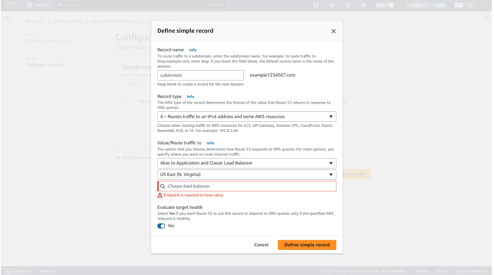

    On the **Configure records** page, choose **Define simple record** and specify the following values:

    * **Record name**: Enter the domain or subdomain name that you want to use to route traffic to your ELB load balancer. The default value is the name of the hosted zone. For example, if the name of the hosted zone is **example.com** and you want to use **acme.example.com** to route traffic to your load balancer, enter **acme**.
    * **Record type**: Choose **A – IPv4 address**.
    * **Value/Route traffic to**: Choose **Alias to Application and Classic Load Balancer** or **Alias to Network Load Balancer**, and then choose the Region that the endpoint is from. If you created the hosted zone and the ELB load balancer using the same AWS account, choose the name that you assigned to the load balancer when you created it. If you created the hosted zone and the ELB load balancer using different accounts, enter the value that you got in step 1 of this procedure.
    * **Evaluate target health**: If you want Route 53 to route traffic based on the health of your resources, select **Yes**.

    Choose **Define simple record**.

8. On the **Configure records** page, choose **Create records**.

    Changes generally propagate to all Route 53 servers within 60 seconds. When propagation is done, you will be able to route traffic to your load balancer by using the name of the alias record that you created in this procedure.

9. Create record with Quick create method.

    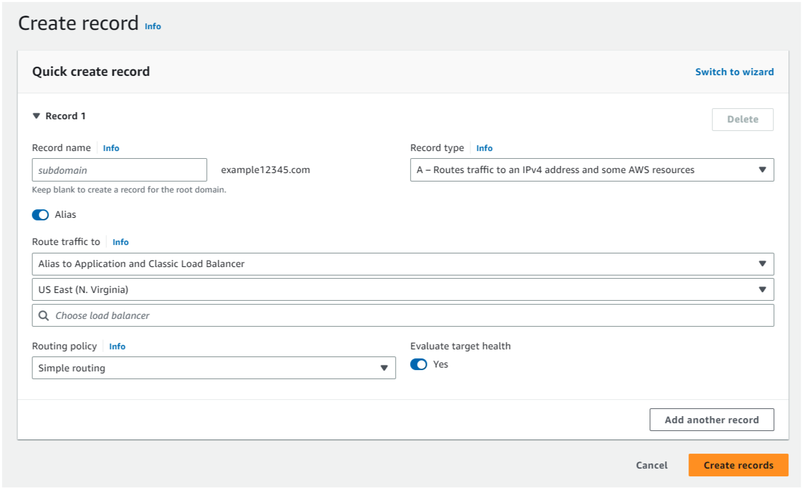

    If you use **Quick create** to create the record, specify the following value:

    * **Record name**: Enter the domain or subdomain name that you want to use to route traffic to your ELB load balancer. The default value is the name of the hosted zone. For example, if the name of the hosted zone is example.com and you want to use acme.example.com to route traffic to your load balancer, enter acme.
    * **Record type**: Choose **A – IPv4 address**.
    * **Alias**: Turn on **Alias**.
    * **Route traffic to**: Choose **Alias to Application and Classic Load Balancer** or **Alias to Network Load Balancer**, and then choose the Region that the endpoint is from. If you created the hosted zone and the ELB load balancer using the same AWS account, choose the name that you assigned to the load balancer when you created it. If you created the hosted zone and the ELB load balancer using different accounts, enter the value that you got in step 1 of this procedure.
    * **Routing policy**: Choose the applicable routing policy.
    * **Evaluate target health**: If you want Route 53 to route traffic based on the health of your resources, select **Yes**.

    Choose **Create records**.

In summary, Elastic Load Balancing health checks integrate with Route 53 DNS to remove unhealthy instances from rotation and failover traffic, when needed, to maintain application availability. The load balancer handles the underlying failover so the DNS changes happen automatically.

### Using PrivateLink to Connect with Elastic Load Balancing Services

You can use AWS PrivateLink to securely access services over a VPC without going over the public internet. With PrivateLink, you can connect services across different accounts and VPCs to significantly simplify your network architecture.

The following diagram shows how you can share your service that's hosted in AWS with other AWS customers, and how those customers connect to your service. To use PrivateLink as the service provider, you create a Network Load Balancer for your application in your VPC. You then select this load balancer when you create the VPC endpoint service configuration. You grant permission to specific AWS principals so that they can connect to your service.

A service consumer then creates an interface endpoint, which establishes connections between the subnets that they select from their VPC and your endpoint service. The load balancer receives requests from the service consumer and creates an elastic network interface in your subnet with a private IP address. This private IP address serves as an entry point for traffic destined to the service, and the traffic from the consumer is then routed to the targets hosting your service.

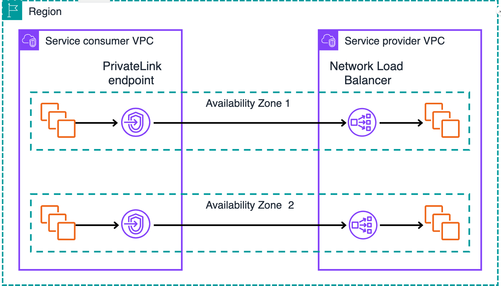

There are two VPCs and two Availability Zones in a Region. One VPC represents the service consumer VPC and the other is the service provider VPC. In each Availability Zone, instances in the service consumer VPC connect to their PrivateLink endpoints. These service consumer PrivateLink endpoints then make connections to the endpoint services in the service provider VPC. The Network Load Balancer receives traffic from the service consumer and then routes the traffic to the targets in the service provider VPC.

**For low latency and high availability, AWS recommends that you make your service available in at least two Availability Zones.**

#### Using an interface endpoint (AWS PrivateLink) to access ELB

You can establish a private connection between your VPC and the Elastic Load Balancing API by creating an interface VPC endpoint. You can use this connection to call the ELB API from your VPC without requiring that you attach an internet gateway, NAT instance, or VPN connection to your VPC. The endpoint provides reliable, scalable connectivity to the ELB API, which you use to create and manage your load balancers.

Interface VPC endpoints are powered by AWS PrivateLink, a feature that enables communication between your applications and AWS services using private IP addresses.

**AWS PrivateLink does not support Network Load Balancers with more than 50 listeners.**

1. **Creating an interface endpoint for Elastic Load Balancing**

    You first create an endpoint for Elastic Load Balancing with the following service name:

    ```shell
    com.amazonaws.region.elasticloadbalancing
    ```

    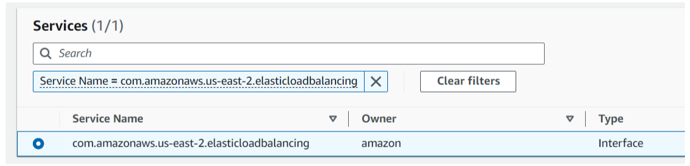

2. **Creating a VPC endpoint policy for Elastic Load Balancing**

    You can attach a policy to your VPC endpoint to control access to the Elastic Load Balancing API. The policy specifies the following:

    * The principal that can perform actions
    * The actions that can be performed
    * The resource on which the actions can be performed

    The following example shows a VPC endpoint policy that denies everyone permission to create a load balancer through the endpoint. The example policy also grants everyone permission to perform all other actions.

    ```json
    {
       "Statement": [
            {
                "Action": "*",
                "Effect": "Allow",
                "Resource": "*",
                "Principal": "*"
            },
            {
                "Action": "elasticloadbalancing:CreateLoadBalancer",
                "Effect": "Deny",
                "Resource": "*",
                "Principal": "*"
            }
        ]
    }
    ```

#### Creating a VPC endpoint

##### AWS Management Console

These are the steps to create an interface endpoint for an AWS service:

1. Open the Amazon VPC console at [https://console.aws.amazon.com/vpc](https://console.aws.amazon.com/vpc/).
2. In the navigation pane, choose **Endpoints**.
3. Choose **Create endpoint**.
4. For **Service category**, choose **AWS services**.
5. For **Service name**, select the service **com.amazonaws.region.elasticloadbalancing**.
6. For **VPC**, select the VPC from which you will access the AWS service.
7. For **Subnet**s, select one subnet per Availability Zone from which you will access the AWS service. You can't select multiple subnets from the same Availability Zone. AWS creates an endpoint network interface in each subnet that you select. By default, AWS selects IP addresses from the subnet IP address ranges and assigns them to the endpoint network interfaces. To choose the IP addresses for an endpoint network interface, select **Designate IP addresses** and enter an IPv4 address from the subnet address range. If the endpoint service supports IPv6, you can also enter an IPv6 address from the subnet address range.
8. For **IP address type**, choose from the following options:

    * **IPv4**: Assign IPv4 addresses to your endpoint network interfaces. This option is supported only if all selected subnets have IPv4 address ranges and the service accepts IPv4 requests.
    * **IPv6**: Assign IPv6 addresses to your endpoint network interfaces. This option is supported only if all selected subnets are IPv6 only subnets and the service accepts IPv6 requests.
    * **Dualstack**: Assign both IPv4 and IPv6 addresses to your endpoint network interfaces. This option is supported only if all selected subnets have both IPv4 and IPv6 address ranges and the service accepts both IPv4 and IPv6 requests.

9. For **Security groups**, select the security groups to associate with the endpoint network interfaces for the VPC endpoint. By default, AWS associates the default security group for the VPC.
10. For **Policy**, select **Full access** to allow all operations by all principals on all resources over the VPC endpoint. Otherwise, select **Custom** to attach a VPC endpoint policy that controls the permissions that principals have for performing actions on resources over the VPC endpoint. This option is available only if the service supports VPC endpoint policies.
11. (Optional) To add a tag, choose **Add new tag** and enter the tag key and the tag value.
12. Choose **Create endpoint**.

##### Command line

If you want to create an interface endpoint using the command line, you can use the following information:

* [create-vpc-endpoint](https://awscli.amazonaws.com/v2/documentation/api/latest/reference/ec2/create-vpc-endpoint.html) (AWS CLI)
* [New-EC2VpcEndpoint](https://docs.aws.amazon.com/powershell/latest/reference/items/New-EC2VpcEndpoint.html) (Tools for Windows PowerShell)

#### The key benefits of a VPC endpoint are as follows:

* The backend services are not publicly reachable.
* You don't need public IPs or internet gateways in the private subnets.
* Traffic stays within the AWS network for improved security. 

* [Use Case Examples](https://docs.aws.amazon.com/whitepapers/latest/aws-privatelink/use-case-examples.html)

### [AWS SimuLearn: Highly Available Web Applications](./labs/W074SimuLearn1ElasticLoadBalancerEc2AutoScaling.md)

In this AWS SimuLearn assignment, you will review a real-world scenario helping a fictional customer design a solution on AWS. After the design is complete, you will build the proposed solution in a guided lab within a live AWS Console environment. You will gain hands-on experience working with AWS services, using the same tools technology professionals use to construct AWS solutions.

For this assignment, you will help a travel agency create a highly available web application architecture.

### Knowledge Check

#### Which load balancer should be used for an application that requires a target group selection by using a rule based on website domains?

* Application Load Balancer

Wrong answers:

* Network Load Balancer
* Gateway Load Balancer
* Classic Load Balancer

##### Explanation

Application Load Balancer is a layer 7 load balancer that routes HTTP and HTTPs traffic, with support for rules.

The other options will not meet the requirements.

#### A developer has configured an Application Load Balancer with two target groups, blue (old) and green (new), to perform a canary deployment for their application. The canary deployment is set to last for 12 hours, during which the target group weights are configured as 90% for the blue group and 10% for the green group. Target group stickiness is also enabled for the same 12-hour period. During this deployment period, what percentage of new users will be routed to the green target group?

* 10 percent

Wrong answers:

* 0 percent
* 50 percent
* 90 percent

##### Explanation

With canary deployments, when target group weights are set to 90 percent and 10 percent and target group stickiness is enabled for 12 hours, 10 percent of new users will be routed to the green (new) target group for the first 12 hours.

#### Which AWS service feature provides the ability to shift traffic between two environments running different versions of an application to support blue/green deployments?

* Application Load Balancer weighted target groups

Wrong answers:

* Application Load Balancer connection draining
* Application Load Balancer stickiness
* Elastic Load Balancing connection draining

##### Explanation

With weighted target groups, you can add more than one target group and specify a weight for each group to shift traffic between environments for blue/green deployments.

The other options are incorrect for the following reasons:

* Connection draining is used to stop sending requests to instances that are de-registering or unhealthy, while keeping the existing connections open.
* Application Load Balancer stickiness is used to repeatedly route traffic from a client to a single destination, instead of balancing the traffic across multiple destinations.

### Summary

#### How Elastic Load Balancing works

Elastic Load Balancing (ELB) is a service that automatically distributes incoming web traffic across multiple AWS instances to ensure high availability and enhanced fault tolerance for applications. The following are the three main components of ELB:

* **Listeners**: A listener is a process that checks for connection requests. To define a listener, you configure a protocol and port, based on the load balancer type. Customers connect to a listener, which is referred as client-side.
* **Target groups**: A target group is a collection of resources, such as Amazon EC2 instances, AWS Lambda functions, or IP addresses, where you send traffic. Each target group must have health check definitions.
* **Rules**: Rules are sets of connection instructions that define the source IP addresses and resources in target groups. You configure rules to associate a target group with a listener.

##### Cross-zone load balancing

When cross-zone load balancing is enabled, each load balancer node distributes traffic across the registered targets in all enabled Availability Zones. When cross-zone load balancing is disabled, each load balancer node distributes traffic only across the registered targets in its Availability Zone.

##### ELB with Amazon EC2 Auto Scaling

Elastic Load Balancing can be integrated with Amazon EC2 Auto Scaling to effectively manage target groups, as instances are added or removed. When you use ELB with your Auto Scaling group, it's not necessary to register individual EC2 instances with the load balancer. Instances that are launched by your Auto Scaling group are automatically registered with the load balancer. Likewise, instances that are terminated by your Auto Scaling group are automatically deregistered from the load balancer.

#### Types of ELB resources

##### Application Load Balancer

This load balancer functions at the application layer, the seventh layer of the Open Systems Interconnection (OSI) model. The Application Load Balancer supports content-based routing, applications that run in containers, and open standard protocols. This type of balancer is ideal for advanced load balancing of HTTP and HTTPS traffic.

##### Network Load Balancer

This load balancer is designed to handle tens of millions of requests per second while maintaining high throughput at ultra-low latency. The Network Load Balancer operates at Layer 4, routing connections to targets based on IP protocol data. Targets include EC2 instances, containers, and IP addresses. It is ideal for balancing TCP and UDP traffic.

##### Gateway Load Balancer

You can use this load balancer to deploy, scale, and manage your third-party virtual appliances. It provides one gateway for distributing traffic across multiple virtual appliances, and scales them up or down, based on demand. This distribution reduces potential points of failure in your network and increases availability. The Gateway Load Balancer passes all Layer 3 traffic transparently through third-party virtual appliances. It is invisible to the source and destination.

#### Deployment strategies

The deployment processes that you choose to update your application can depend on your desired balance of control, speed, cost, risk tolerance, and other factors.

##### Blue/green deployments

Blue/green deployments involve creating two identical environments, one running the current application version (blue) and one running the new version (green). This strategy increases availability and reduces risk, because rollback just involves switching traffic back to the blue environment if issues arise with the green version.

##### Canary deployments

Canary deployment is gradually rolling out a new software version to a small subset of users to test it before rolling it out more widely.

##### Rolling deployments

Rolling deployment involves incrementally deploying an application to production by replacing instances one-by-one rather than all at once. This minimizes downtime and risk. It's similar to canary deployments; however, the canary technique targets certain users to receive access to the new application version, and the rolling deployment targets certain servers.

##### In-place deployments

An in-place deployment updates the application version on existing infrastructure without replacing any components. This allows deployments with minimal disturbance to underlying infrastructure. The downside is that the application availability can be impacted during in-place deployments.

##### Prebaking and bootstrapping AMIs

Prebaking embeds a significant portion of an application into an AMI to speed up launch and operationalization of EC2 instances. Bootstrapping is installing applications, dependencies, or customizations when an EC2 instance launches. This can slow deployments if you have complex applications or large downloads. Prebaking AMIs and bootstrapping during deployment can quickly create new customized instances for the current environment.

#### How ELB works with Route 53

ELB can be integrated with Amazon Route 53 to enhance the availability and fault tolerance of your applications by enabling automatic failover across Availability Zones and Regions. This integration helps prevent outages by routing traffic to healthy resources, even if some become unavailable. When Route 53 DNS failover is enabled, Route 53 automatically configures and manages health checks for individual ELB nodes. Route 53 also takes advantage of the EC2 instance health checking that ELB performs. By combining the results of health checks of your EC2 instances and your load balancers, Route 53 DNS failover is able to evaluate the health of the load balancer and the health of the application running on the EC2 instances behind it.

#### Using PrivateLink to connect with ELB

AWS PrivateLink provides secure access to services over a VPC without going over the public internet. It connects services across accounts and VPCs to simplify network architecture. The service provider creates a Network Load Balancer and endpoint service in their VPC. Consumers create an interface endpoint that connects their VPC subnets to the endpoint service. The load balancer routes traffic from the consumer to the service targets through elastic network interfaces with private IP addresses. The ELB API can also be accessed privately from a VPC using an interface endpoint instead of an internet gateway, NAT instance, or VPN connection. This provides reliable, scalable connectivity to create and manage load balancers from within the VPC using private IP addresses.

### Additional Resources

* [Tutorial: Set Up a Scaled and Load-Balanced Application](https://docs.aws.amazon.com/autoscaling/ec2/userguide/tutorial-ec2-auto-scaling-load-balancer.html)
* [Access an AWS Service Using an Interface VPC Endpoint](https://docs.aws.amazon.com/vpc/latest/privatelink/create-interface-endpoint.html)
* [Control Access to VPC Endpoints Using Endpoints Policies](https://docs.aws.amazon.com/vpc/latest/privatelink/vpc-endpoints-access.html)
