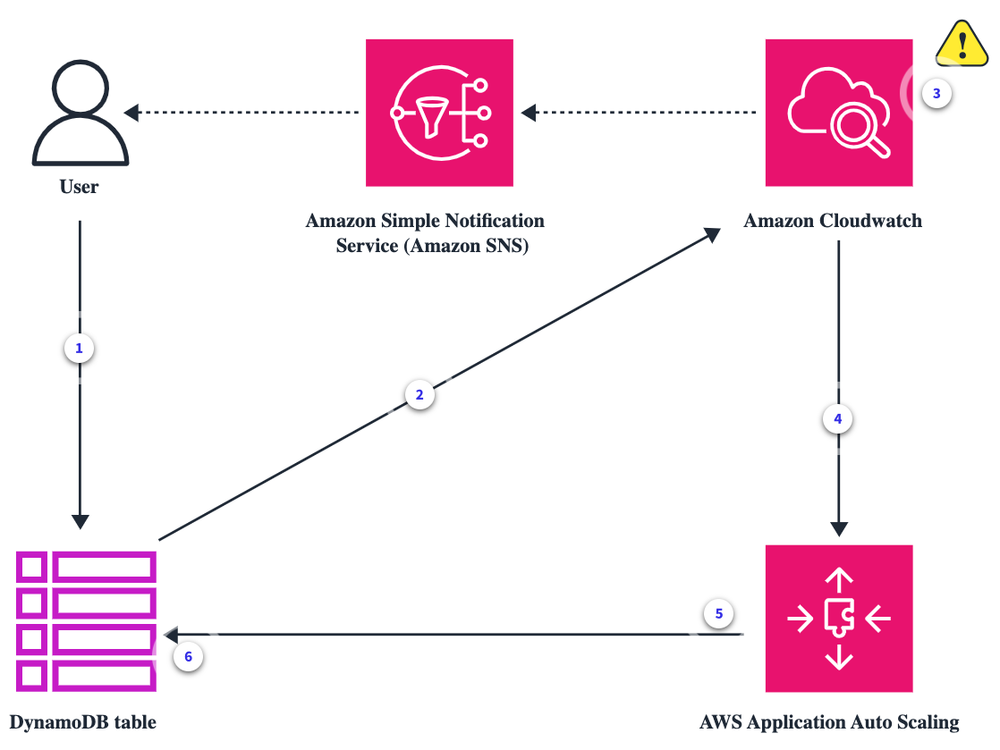

# Week 7: Logging and Scaling: Auto Scaling and Elastic Load Balancing

* back to AWS Cloud Institute repo's root [aci.md](../aci.md)
* back to [AWS Cloud Operations 2](./aws-cloud-operations-2.md)
* back to repo's main [README.md](../../../README.md)

## Auto Scaling

### Pre-assessment

#### What is the main benefit of auto scaling in the cloud?

* It automatically scales resources to maintain performance as demand changes.

Wrong answers:

* Users can manually scale their resources up or down freely without any restriction.
* It provisions a fixed number of resources indefinitely.
* It launches as many resources as possible to handle peak load at all times.

##### Explanation

Auto scaling automatically scales resources based on metrics to optimize performance and cost as demand fluctuates.

The other options are incorrect for the following reason:

* A key benefit of auto scaling is the ability to scale resources automatically based on metrics like CPU utilization or traffic. Auto scaling aims to maintain enough resources to meet demand, and not peak demand 100 percent of the time.

#### Which Amazon EC2 Auto Scaling configuration would be used to scale based on demand?

* Monitor metrics like CPU utilization and scale out when thresholds are crossed.

Wrong answers:

* Launch instances on a fixed schedule regardless of workload.
* Scale out capacity preemptively for any type of workload.
* Launch new instances only when manually invoked.

##### Explanation

Amazon EC2 Auto Scaling responds to changes in monitored metrics like CPU utilization to scale appropriately.

The other options are incorrect because they are not the characteristics of Amazon EC2 Auto Scaling.

#### What is the purpose of the cooldown period in scaling policies?

* The cooldown period allows time for a previous scaling activity to finish before the next scaling activity starts. This prevents excessive scaling.

Wrong answers:

* The cooldown period prevents any scaling activities from happening. It is a period where no scaling occurs.
* The cooldown period causes all scaling activities to be blocked until it expires. This prevents scale-out and scale-in activities.
* The cooldown period has no impact on scaling activities. It is just a waiting period between activities.

##### Explanation

The cooldown period allows time for a previous scaling activity to finish before the next scaling activity starts. This prevents excessive scaling.

The other options are incorrect for the following reasons:

* The scaling policies support a cooldown period. This is the number of seconds to wait for a previous scaling activity to take effect. For scale-out events, the intention is to continuously (but not excessively) scale out. After service auto scaling successfully scales out using a scaling policy, it starts to calculate the cooldown time.
* The scaling policy won't increase the desired capacity again unless either a larger scale out is initiated or the cooldown period ends. While the scale-out cooldown period is in effect, the capacity added by the initiating scale-out activity is calculated as part of the desired capacity for the next scale-out activity.
* For scale-in events, the intention is to scale in conservatively to protect your application's availability, so scale-in activities are blocked until the cooldown period has expired. However, if another alarm initiates a scale-out activity during the scale-in cooldown period, service auto scaling scales out the target immediately. In this case, the scale-in cooldown period stops and doesn't complete.

### How Auto Scaling Works

Auto scaling works by scheduling and dynamically adjusting the number of resources allocated to an application, based on its current workload. Auto scaling relies on predefined metrics and thresholds to make decisions.

These metrics might include:

* CPU usage
* Network traffic
* Custom application-specific measurements

When these metrics exceed predefined alarm thresholds, auto scaling initiates.

The process begins with continuous monitoring of the selected metrics. The scaling tools collect real-time data on the application's performance. When a metric exceeds defined thresholds, an alarm is activated, which invokes a scaling action. This could be because of a spike or increase in the CPU usage due to high demand on the application, or it could be a decrease in CPU usage, suggesting underutilized resources. Auto scaling is configured with scaling policies to define which actions to take in response to specific alarms.

There are typically two types of scaling: horizontal and vertical. Amazon EC2 Auto Scaling uses horizontal scaling. Horizontal scaling involves adding or removing instances to handle increases or decreases in workload. Vertical scaling involves adjusting the capacity of existing instances by increasing or decreasing CPU and memory resources. Amazon EC2 Auto Scaling provides a number of ways to adjust scaling to best meet the needs of your applications.

* **Target tracking scaling**

    These policies increase or decrease the current capacity of the group based on an Amazon CloudWatch metric and target value. The way this works is similar to the way that your thermostat maintains the temperature of your home. You select a temperature, and the thermostat does the rest.

* **Step scaling**

    These policies increase or decrease the current capacity of the group based on a set of step adjustments, which vary based on specific CloudWatch alarm triggers.

* **Scheduled scaling**

    Scaling based on a schedule means that you can scale your application in response to predictable changes in demand. Let's say that every week, the traffic to your web application starts to increase on Wednesday, remains high on Thursday, and starts to decrease on Friday. You can configure a schedule for Amazon EC2 Auto Scaling to increase capacity on Wednesday and decrease capacity on Friday.

After the scaling event, the system performs health checks to ensure that the newly launched instances are operational and can handle the workload. Auto scaling continues to monitor and adjust the application's resources when the workload fluctuates. This helps to maintain the performance while optimizing costs.

The benefits of auto scaling:

* It enhances system reliability by ensuring that applications can adapt to varying workloads
* helps to prevent overprovisioning
* reduces operational costs

### Vertical scaling and horizontal scaling

#### Vertical scaling

Vertical scaling has the following characteristics:

* It involves increasing the specifications and resources of an existing server, for example, adding more RAM, CPU cores, and storage to a server to make it more powerful.
* It supports handling more load on the same server. It also reduces the need for more servers.
* It has hardware limitations in terms of how much a server can be upgraded.
* It requires downtime and migrations when upgrading server hardware.

#### Horizontal scaling

Horizontal scaling has the following characteristics:

* It involves adding more servers that function together as one unit, for example, adding more application servers behind a load balancer.
* It supports handling more overall load by distributing it across more servers. It's more scalable than vertical scaling.
* It has no hardware limitations. More inexpensive commodity servers can be added whenever needed.
* It provides scaling with no downtime. New servers can be added to the resource pool seamlessly.
* It requires more complex architecture and testing to distribute load and tasks.

### Application Auto Scaling and Amazon EC2 Auto Scaling

AWS Application Auto Scaling is a web service for developers and system administrators who need a solution for automatically scaling their scalable resources for individual AWS offerings such as Amazon ECS services, DynamoDB tables, and more. Amazon EC2 Auto Scaling is a specific feature used with Amazon EC2 instances. You create collections of EC2 instances, called Amazon EC2 Auto Scaling groups.

### Target tracking scaling

With target tracking scaling policies, you specify an Amazon CloudWatch metric and a target value that represents the ideal average utilization or throughput level for your application.

A target tracking scaling policy is more aggressive in adding capacity when utilization increases than it is in removing capacity when utilization decreases. For example, if the policy's specified metric reaches its target value, the policy assumes that your application is already heavily loaded. So it responds by adding capacity proportional to the metric value as fast as it can. The higher the metric, the more capacity is added.

When the metric falls below the target value, the policy expects that utilization will eventually increase again. In this case, it slows down scaling by removing capacity only when utilization passes a threshold that is far enough below the target value (usually more than 10 percent lower) for utilization to be considered to have slowed. The intention of this more conservative behavior is to ensure that removing capacity only happens when the application is no longer experiencing demand at the same high level that it was previously.

#### Choosing metrics

You can create target tracking scaling policies with either predefined metrics or custom metrics. Consider the following when choosing a metric:

* AWS recommends that you only use metrics that are available at 1-minute intervals to help you scale faster in response to utilization changes. Target tracking will evaluate metrics aggregated at a 1-minute granularity for all predefined metrics and custom metrics. But the underlying metric might publish data less frequently. For example, all Amazon EC2 metrics are sent in 5-minute intervals by default, but they are configurable to 1 minute (known as detailed monitoring). This choice is up to the individual services. Most try to use the smallest interval possible.
Not all custom metrics work for target tracking. The metric must be a valid utilization metric and describe how busy a scalable target is. The metric value must increase or decrease proportionally to the capacity of the scalable target so that the metric data can be used to proportionally scale the scalable target.
* To use the **ALBRequestCountPerTarget** metric, you must specify the **ResourceLabel** parameter to identify the load balancer target group that is associated with the metric.
* When a metric emits real 0 values to CloudWatch (for example, **ALBRequestCountPerTarget**), AWS Application Auto Scaling can scale in to 0 when there is no traffic to your application for a sustained period of time. To have your scalable target scale in to 0 when no requests are routed it, the scalable target's minimum capacity must be set to 0.
* Instead of publishing new metrics to use in your scaling policy, you can use metric math to combine existing metrics.

#### Defining target value

When you create a target tracking scaling policy, you must specify a target value. The target value represents the optimal average utilization or throughput for your application. To use resources cost efficiently, set the target value as high as possible with a reasonable buffer for unexpected traffic increases. When your application is optimally scaled out for a normal traffic flow, the actual metric value should be at or just below the target value.

When a scaling policy is based on throughput, such as the request count per target for an Application Load Balancer, network I/O, or other count metrics, the target value represents the optimal average throughput from a single entity (such as a single target of your Application Load Balancer target group), for a 1-minute period.

#### Considerations

The following considerations apply when working with target tracking scaling policies:

* Do not create, edit, or delete the CloudWatch alarms that are used with a target tracking scaling policy. Amazon EC2 Auto Scaling or Application Auto Scaling creates and manages the CloudWatch alarms that are associated with your target tracking scaling policies and deletes them when no longer needed.
* If the metric is missing data points, this causes the CloudWatch alarm state to change to **INSUFFICIENT_DATA**. When this happens, Amazon EC2 Auto Scaling or Application Auto Scaling cannot scale your scalable target until new data points are found.
* If the metric is sparsely reported by design, metric math can be helpful. For example, to use the most recent values, use the **FILL(m1,REPEAT)** function where m1 is the metric.
* You might see gaps between the target value and the actual metric data points. This is because AWS acts conservatively by rounding up or down when it determines how much capacity to add or remove. This prevents it from adding insufficient capacity or removing too much capacity. However, for a scalable target with a small capacity, the actual metric data points might seem far from the target value. For a scalable target with a larger capacity, adding or removing capacity causes less of a gap between the target value and the actual metric data points.
* A target tracking scaling policy assumes that it should perform scale out when the specified metric is above the target value. You can't use a target tracking scaling policy to scale out when the specified metric is below the target value.

### Step scaling

Step scaling policies increase or decrease the current capacity of a scalable target based on a set of scaling adjustments, known as step adjustments. The adjustments vary based on the size of the alarm breach. The policy continues to respond to additional alarms while a scaling activity is in progress. Therefore, all alarms that are breached are evaluated by Amazon EC2 Auto Scaling or Application Auto Scaling as it receives the alarm messages.

#### Step adjustments

When you create a step scaling policy, you specify one or more step adjustments that automatically scale the capacity of the target dynamically based on the size of the alarm breach. Each step adjustment specifies the following:

* A lower bound for the metric value
* An upper bound for the metric value
* The amount by which to scale, based on the scaling adjustment type

CloudWatch aggregates metric data points based on the statistic for the metric that is associated with your CloudWatch alarm. When the alarm is breached, the appropriate scaling policy is invoked. Amazon EC2 Auto Scaling or Application Auto Scaling applies the aggregation type to the most recent metric data points from CloudWatch (as opposed to the raw metric data). It compares this aggregated metric value against the upper and lower bounds defined by the step adjustments to determine which step adjustment to perform.

You specify the upper and lower bounds relative to the breach threshold. For example, let's say that you have a scalable target that has a capacity of 10. You have CloudWatch alarms with metric high and metric low thresholds of 60 percent and 40 percent, respectively.

You have an adjustment type of **PercentChangeInCapacity** and scale-out and scale-in policies with the following step adjustments:

##### Example: Step adjustments for scale-out policy

| Lower bound | Upper bound | Adjustment |
| ----------- | ----------- | ---------- |
| 0 | 10 | 0 |
| 10 | 20 | 10 |
| 20 | Null | 30 |

##### Example: Step adjustments for scale-in policy

| Lower bound | Upper bound | Adjustment |
| ----------- | ----------- | ---------- |
| -10 | 0 | 0 |
| -20 | -10 | -10 |
| Null | -20 | -30 |

This creates the following scaling configuration:

Metric value

```text
-infinity          30%    40%          60%     70%             infinity
-----------------------------------------------------------------------
          -30%      | -10% | Unchanged  | +10%  |       +30%        
-----------------------------------------------------------------------
```

##### Summary

* The original capacity is maintained while the aggregated metric value is greater than 40 and less than 60.
* If the metric value gets to 60, Application Auto Scaling increases the capacity of the scalable target by 1, to 11. That's based on the second step adjustment of the scale-out policy (add 10 percent of 10). After the new capacity is added, Application Auto Scaling increases the current capacity to 11. If the metric value rises to 70 even after this increase in capacity, Application Auto Scaling increases the target capacity by 3, to 14. That's based on the third step adjustment of the scale-out policy (add 30 percent of 11, 3.3, rounded down to 3).
* If the metric value gets to 40, Application Auto Scaling decreases the capacity of the scalable target by 1, to 13, based on the second step adjustment of the scale-in policy (remove 10 percent of 14, 1.4, rounded down to 1). If the metric value falls to 30 even after this decrease in capacity, Application Auto Scaling decreases the target capacity by 3, to 10, based on the third step adjustment of the scale-in policy (remove 30 percent of 13, 3.9, rounded down to 3).

When you specify the step adjustments for your scaling policy, note the following:

* The ranges of your step adjustments can't overlap or have a gap.
* Only one step adjustment can have a null lower bound (negative infinity). If one step adjustment has a negative lower bound, then there must be a step adjustment with a null lower bound.
* Only one step adjustment can have a null upper bound (positive infinity). If one step adjustment has a positive upper bound, then there must be a step adjustment with a null upper bound.
* The upper and lower bound can't be null in the same step adjustment.
* If the metric value is above the breach threshold, the lower bound is inclusive and the upper bound is exclusive. If the metric value is below the breach threshold, the lower bound is exclusive and the upper bound is inclusive.

#### Scheduled scaling

Scheduled scaling helps you to set up your own scaling schedule according to predictable load changes. To use scheduled scaling, you create scheduled actions. Scheduled actions are performed automatically as a function of date and time. When you create a scheduled action, you specify when the scaling activity should occur and the new desired minimum and maximum sizes for the scaling action. You can create scheduled actions that scale one time only or that scale on a recurring schedule.

You can use scheduled scaling and scaling policies together on the same resource to get the benefits of both. After a scheduled action runs, the scaling policy can continue to make decisions about whether to further scale capacity. This helps you ensure that you have sufficient capacity to handle the load for your application. While your application scales to match demand, current capacity must fall within the minimum and maximum capacity that was set by your scheduled action.

##### Considerations

When you create a scheduled action, keep the following in mind:

* A scheduled action sets the **MinCapacity** and **MaxCapacity** to what is specified by the scheduled action at the date and time specified. The request can optionally include only one of these sizes. For example, you can create a scheduled action with only the minimum capacity specified. In some cases, however, you must include both sizes to ensure that the new minimum capacity is not greater than the maximum capacity, or the new maximum capacity is not less than the minimum capacity.
* By default, the recurring schedules that you set are in Coordinated Universal Time (UTC). You can change the time zone to correspond to your local time zone or a time zone for another part of your network. When you specify a time zone that observes daylight saving time, the action automatically adjusts for Daylight Saving Time (DST).
* You can temporarily turn off scheduled scaling for a scalable target. This helps you prevent scheduled actions from being active without having to delete them. You can then resume scheduled scaling when you want to use it again.
* The order in which scheduled actions run is guaranteed for the same scalable target, but not for scheduled actions across scalable targets.
* To complete a scheduled action successfully, the specified resource must be in a scalable state in the target service. If it isn't, the request fails and returns an error message, for example: *Resource Id \[ActualResourceId\] is not scalable. Reason: The status of all DB instances must be 'available' or 'incompatible-parameters'*.
* A scheduled action generally runs within seconds. However, the action might be delayed for up to 2 minutes from the scheduled start time. Because scheduled actions are run in the order that they are specified, scheduled actions with start times close to each other can take longer to run.

##### Commonly used commands for scheduled action creation, management, and deletion

The following commands are commonly used for working with scheduled scaling:

* Use the [register-scalable-target](https://awscli.amazonaws.com/v2/documentation/api/latest/reference/application-autoscaling/register-scalable-target.html) command to register AWS or custom resources as scalable targets (a resource that Application Auto Scaling can scale), and to suspend and resume scaling.
* Use the [put-scheduled-action](https://awscli.amazonaws.com/v2/documentation/api/latest/reference/application-autoscaling/put-scheduled-action.html) command to add or modify scheduled actions for an existing scalable target.
* Use the [describe-scaling-activities](https://awscli.amazonaws.com/v2/documentation/api/latest/reference/application-autoscaling/describe-scaling-activities.html) command to return information about scaling activities in an AWS Region.
* Use the [describe-scheduled-actions](https://awscli.amazonaws.com/v2/documentation/api/latest/reference/application-autoscaling/describe-scheduled-actions.html) command to return information about scheduled actions in an AWS Region.
* Use the [delete-scheduled-action](https://awscli.amazonaws.com/v2/documentation/api/latest/reference/application-autoscaling/delete-scheduled-action.html) command to delete a scheduled action.

##### Limitations

The following are limitations when using scheduled scaling:

* The names of scheduled actions must be unique per scalable target.
* Application Auto Scaling doesn't provide second-level precision in schedule expressions. The finest resolution using a cron expression is 1 minute.
* The scalable target can't be an Amazon Managed Streaming for Apache Kafka (Amazon MSK) cluster. Scheduled scaling is not supported for Amazon MSK.
* Console access to view, add, update, or remove scheduled actions on scalable resources depends on the resource that you use.

### Auto Scaling with Amazon ECS

Amazon Elastic Container Service (Amazon ECS) is a fully managed container orchestration service that helps you deploy, manage, and scale containerized applications.

With Amazon ECS, your applications are containerized. An Amazon ECS cluster can run a containerized application as a task. Amazon ECS services are used to run and maintain your desired number of tasks.

Amazon ECS services are scaled by modifying the number of running tasks.

#### Application Auto Scaling with Amazon ECS

Amazon ECS uses the Application Auto Scaling service to provide service auto scaling functionality. Application Auto Scaling is a web service for developers and system administrators who need a solution for automatically scaling their scalable resources for individual AWS services beyond Amazon EC2.

Amazon ECS publishes CloudWatch metrics with your service’s average CPU and memory usage. You can use these and other CloudWatch metrics to scale out your service (add more tasks) to deal with high demand at peak times, and to scale in your service (run fewer tasks) to reduce costs during periods of low utilization.

Amazon ECS supports target tracking scaling, step scaling, and scheduled scaling.

#### Service auto scaling and deployments

Application Auto Scaling turns off scale-in processes while Amazon ECS deployments are in progress. However, scale-out processes continue to occur, unless suspended, during a deployment. If you want to suspend scale-out processes while deployments are in progress, take the following steps.

1. Call the [describe-scalable-targets](https://awscli.amazonaws.com/v2/documentation/api/latest/reference/application-autoscaling/describe-scalable-targets.html) command, specifying the resource ID of the service associated with the scalable target in Application Auto Scaling (for example: **service/default/sample-webapp**). Record the output. You will need it when you call the next command.
2. Call the [register-scalable-target](https://awscli.amazonaws.com/v2/documentation/api/latest/reference/application-autoscaling/register-scalable-target.html) command, specifying the resource ID, namespace, and scalable dimension. Specify **true** for both **DynamicScalingInSuspended** and **DynamicScalingOutSuspended**.
3. After deployment is complete, you can call the [register-scalable-target](https://awscli.amazonaws.com/v2/documentation/api/latest/reference/application-autoscaling/register-scalable-target.html) command to resume scaling.

#### Considerations

When using scaling policies, consider the following:

* Amazon ECS sends metrics in 1-minute intervals to CloudWatch. Metrics are not available until the clusters and services send the metrics to CloudWatch, and you cannot create CloudWatch alarms for metrics that do not exist.
* The scaling policies support a cooldown period. This is the number of seconds to wait for a previous scaling activity to take effect. For scale-out events, the intention is to continuously (but not excessively) scale out. After service auto scaling successfully scales out using a scaling policy, it starts to calculate the cooldown time. The scaling policy won't increase the desired capacity again unless either a larger scale out is initiated or the cooldown period ends. While the scale-out cooldown period is in effect, the capacity added by the initiating scale-out activity is calculated as part of the desired capacity for the next scale-out activity. For scale-in events, the intention is to scale in conservatively to protect your application's availability, so scale-in activities are blocked until the cooldown period has expired. However, if another alarm initiates a scale-out activity during the scale-in cooldown period, service auto scaling scales out the target immediately. In this case, the scale-in cooldown period stops and doesn't complete.
* If a service's desired count is set below its minimum capacity value, and an alarm activates a scale-out activity, service auto scaling scales the desired count up to the minimum capacity value. It continues to scale out as required, based on the scaling policy associated with the alarm. However, a scale-in activity does not adjust the desired count because it is already below the minimum capacity value.
* If a service's desired count is set above its maximum capacity value, and an alarm activates a scale-in activity, service auto scaling scales the desired count out to the maximum capacity value. It continues to scale in as required, based on the scaling policy associated with the alarm. However, a scale-out activity does not adjust the desired count because it is already above the maximum capacity value.
* During scaling activities, the actual running task count in a service is the value that service auto scaling uses as its starting point, as opposed to the desired count. This is what processing capacity is supposed to be. This prevents excessive (runaway) scaling that might not be satisfied, for example, if there aren't enough container instance resources to place the additional tasks. If the container instance capacity is available later, the pending scaling activity might succeed, and then further scaling activities can continue after the cooldown period.
* If you want your task count to scale to zero when there's no work to be done, set a minimum capacity of 0. With target tracking scaling policies, when actual capacity is 0 and the metric indicates that there is workload demand, service auto scaling waits for one data point to be sent before scaling out. In this case, it scales out by the minimum possible amount as a starting point and then resumes scaling based on the actual running task count.
* Application Auto Scaling turns off scale-in processes while Amazon ECS deployments are in progress. However, scale-out processes continue to occur, unless suspended, during a deployment.
* You have several Application Auto Scaling options for Amazon ECS tasks. Target tracking is the easiest mode to use. With it, all you need to do is set a target value for a metric, such as CPU average utilization. Then the auto scaler automatically manages the number of tasks that are needed to attain that value. With step scaling, you can more quickly react to changes in demand, because you define the specific thresholds for your scaling metrics, and how many tasks to add or remove when the thresholds are crossed. And more importantly, you can react very quickly to changes in demand by minimizing the amount of time that a threshold alarm is in breach.

#### Task scale-in protection

You can use Amazon ECS task scale-in protection to protect your tasks from being terminated by scale-in events from either service auto scaling or deployments. Certain applications require a mechanism to safeguard mission-critical tasks from termination by scale-in events during times of low utilization or during service deployments. Here are some examples:

* You have a queue-processing asynchronous application such as a video transcoding job where some tasks have to run for hours even when cumulative service utilization is low.
* You have a gaming application that runs game servers as Amazon ECS tasks that have to continue running even if all users have logged out, to reduce startup latency of a server reboot.
* When you deploy a new code version, you need tasks to continue running because it would be expensive to reprocess.

To protect tasks that belong to your service from terminating in a scale-in event, set the **protectionEnabled** attribute to **true**. By default, tasks are protected for 2 hours. You can customize the protection period by using the **expiresInMinutes** attribute. You can protect your tasks for a minimum of 1 minute and up to a maximum of 2,880 minutes (48 hours).

After a task finishes its requisite work, you can set the **protectionEnabled** attribute to **false**, allowing the task to be terminated by subsequent scale-in events.

#### Task scale-in protection mechanisms

You can set and get task scale-in protection using either the Amazon ECS container agent endpoint or the Amazon ECS API.

##### Amazon ECS container agent endpoint

AWS recommends using the Amazon ECS container agent endpoint for tasks that can self-determine the need to be protected. Use this approach for queue-based or job-processing workloads.

When a container starts processing work, for example by consuming an Amazon Simple Queue Service (Amazon SQS) message, you can set the **ProtectionEnabled** attribute through the task scale-in protection endpoint path **$ECS_AGENT_URI/task-protection/v1/state** from within the container. Amazon ECS will not terminate this task during scale-in events. After your task finishes its work, you can unset the **ProtectionEnabled** attribute using the same endpoint, making the task eligible for termination during subsequent scale-in events.

##### Amazon ECS API

You can use the Amazon ECS API to set task scale-in protection if your application has a component that tracks the status of active tasks. Use **UpdateTaskProtection** to mark one or more tasks as protected.

An example of this approach would be if your application is hosting game server sessions as Amazon ECS tasks. When a user logs in to a session on the server (task), you can mark the task as protected. After the user logs out, you can either clear the protection specifically for this task or periodically clear protection for similar tasks that no longer have active sessions, depending on your requirement to keep idle servers.

You can also combine both approaches. For example, use the Amazon ECS agent endpoint to set task protection from within a container and use the Amazon ECS API to remove task protection from your external controller service.

### Auto Scaling with DynamoDB

Many database workloads are cyclical in nature, and others are difficult to predict in advance. For one example, consider a social networking app where most of the users are active during daytime hours. The database must be able to handle the daytime activity, but there's no need for the same levels of throughput at night. Consider another example, a new mobile gaming app that is experiencing unexpectedly rapid adoption. If the game becomes too popular, it could exceed the available database resources, resulting in slow performance and unhappy customers. These kinds of workloads often require manual intervention to scale database resources up or down in response to varying usage levels.

Amazon DynamoDB auto scaling uses the Application Auto Scaling service to dynamically adjust provisioned throughput capacity on your behalf, in response to actual traffic patterns. This makes it possible for a table or a global secondary index to increase its provisioned read and write capacity to handle sudden increases in traffic, without throttling. When the workload decreases, Application Auto Scaling decreases the throughput so that you don't pay for unused provisioned capacity.

**If you use the AWS Management Console to create a table or a global secondary index, DynamoDB auto scaling is enabled by default. You can modify your auto scaling settings at any time. When you delete a table or global table replica, any associated scalable targets, scaling polices, or CloudWatch alarms are not automatically deleted with it.**

With Application Auto Scaling, you create a scaling policy for a table or a global secondary index. The scaling policy specifies whether you want to scale read capacity or write capacity (or both), and the minimum and maximum provisioned capacity unit settings for the table or index.

The scaling policy also contains a target utilization—the percentage of consumed provisioned throughput at a point in time. Application Auto Scaling uses a target tracking algorithm to adjust the provisioned throughput of the table (or index) upward or downward in response to actual workloads, so that the actual capacity utilization remains at or near your target utilization.

You can set the auto scaling target utilization values between 20 and 90 percent for your read and write capacity.

**In addition to tables, DynamoDB auto scaling also supports global secondary indexes. Every global secondary index has its own provisioned throughput capacity, separate from that of its base table. When you create a scaling policy for a global secondary index, Application Auto Scaling adjusts the provisioned throughput settings for the index to ensure that its actual utilization stays at or near your desired utilization ratio.**

### How DynamoDB auto scaling works



1. **Create an Application Auto Scaling policy**

    You create an Application Auto Scaling policy for your DynamoDB table.

2. **Publish metrics**

    DynamoDB publishes consumed capacity metrics to Amazon CloudWatch.

3. **Activate alarms**

    If the table's consumed capacity exceeds your target utilization (or falls below the target) for a specific length of time, CloudWatch activates an alarm. You can view the alarm on the console and receive notifications using Amazon Simple Notification Service (Amazon SNS).

4. **Invoke Application Auto Scaling**

    The CloudWatch alarm invokes Application Auto Scaling to evaluate your scaling policy.

5. **Issue an UpdateTable request**

    Application Auto Scaling issues an **UpdateTable** request to adjust your table's provisioned throughput.

6. **Process the UpdateTable request**

    DynamoDB processes the **UpdateTable** request, dynamically increasing (or decreasing) the table's provisioned throughput capacity so that it approaches your target utilization.

Suppose that you have a table named **ProductCatalog**. The table is bulk-loaded with data infrequently, so it doesn't incur very much write activity. However, it does experience a high degree of read activity, which varies over time. By monitoring the CloudWatch metrics for **ProductCatalog**, you determine that the table requires 1,200 read capacity units (to avoid DynamoDB throttling read requests when activity is at its peak). You also determine that **ProductCatalog** requires 150 read-capacity units at a minimum, when read traffic is at its lowest point.

Within the range of 150 to 1,200 read-capacity units, you decide that a target utilization of 70 percent would be appropriate for the **ProductCatalog** table. Target utilization is the ratio of consumed capacity units to provisioned capacity units, expressed as a percentage. Application Auto Scaling uses its target tracking algorithm to ensure that the provisioned read capacity of **ProductCatalog** is adjusted as required so that utilization remains at or near 70 percent.

```text
DynamoDB auto scaling modifies provisioned throughput settings only when the actual workload stays elevated or depressed for a sustained period of several minutes. The Application Auto Scaling target tracking algorithm seeks to keep the target utilization at or near your chosen value over the long term.

Sudden, short-duration spikes of activity are accommodated by the table's built-in burst capacity.
```

To enable DynamoDB auto scaling for the **ProductCatalog** table, you create a scaling policy. This policy specifies the following:

* The table or global secondary index that you want to manage
* Which capacity type to manage (read capacity or write capacity)
* The upper and lower boundaries for the provisioned throughput settings
* Your target utilization

When you create a scaling policy, Application Auto Scaling creates a pair of CloudWatch alarms on your behalf. Each pair represents the upper and lower boundaries for your provisioned throughput settings. These CloudWatch alarms are invoked when the table's actual utilization deviates from your target utilization for a sustained period of time.

When one of the CloudWatch alarms is activated, Amazon SNS sends you a notification (if you have enabled it). The CloudWatch alarm then invokes Application Auto Scaling, which in turn notifies DynamoDB to adjust the **ProductCatalog** table's provisioned capacity upward or downward as appropriate.

#### Considerations

Before you begin using DynamoDB auto scaling, you should be aware of the following:

* DynamoDB auto scaling can increase read capacity or write capacity as often as necessary, in accordance with your auto scaling policy.
* DynamoDB auto scaling updates your table’s provisioned capacity within minutes. Factor this scaling time into your auto scaling settings to allow time for the capacity to be provisioned.
* DynamoDB auto scaling doesn't prevent you from manually modifying provisioned throughput settings. These manual adjustments don't affect any existing CloudWatch alarms that are related to DynamoDB auto scaling.
* If you enable DynamoDB auto scaling for a table that has one or more global secondary indexes, AWS highly recommends that you also apply auto scaling uniformly to those indexes. This will help ensure better performance for table writes and reads, and help avoid throttling. You can enable auto scaling by selecting **Apply same settings to global secondary indexes** in the AWS Management Console.
* When you delete a table or global table replica, any associated scalable targets, scaling polices, or CloudWatch alarms are not automatically deleted with it.
* When you create a global secondary index (GSI) for an existing table, auto scaling is not enabled for the GSI. You will have to manually manage the capacity while the GSI is being built. When the backfill on the GSI is complete and it reaches active status, auto scaling will operate as normal.

### Auto Scaling with Aurora

To meet your connectivity and workload requirements, Amazon Aurora uses Application Auto Scaling to dynamically adjust the number of Aurora Replicas (reader DB instances) provisioned for an Aurora DB cluster.

Aurora Replicas have two main purposes. You can issue queries to them to scale the read operations for your application. You typically do so by connecting to the reader endpoint of the cluster. That way, Aurora can spread the load for read-only connections across as many Aurora Replicas as you have in the cluster. Aurora Replicas also help to increase availability. If the writer instance in a cluster becomes unavailable, Aurora automatically promotes one of the reader instances to take its place as the new writer.

Aurora auto scaling is available for both Amazon Aurora MySQL-Compatible Edition and Amazon Aurora PostgreSQL-Compatible Edition. Aurora auto scaling empowers your Aurora DB cluster to handle sudden increases in connectivity or workload. When the connectivity or workload decreases, Aurora auto scaling removes unnecessary Aurora Replicas so that you don't pay for unused provisioned DB instances.

You define and apply a scaling policy to an Aurora DB cluster. The scaling policy defines the minimum and maximum number of Aurora Replicas that Aurora auto scaling can manage. Based on the policy, Aurora auto scaling adjusts the number of Aurora Replicas up or down in response to actual workloads, determined by using CloudWatch metrics and target values.

You can use the AWS Management Console to apply a scaling policy based on a predefined metric. Alternatively, you can use either the AWS Command Line Interface (AWS CLI) or Application Auto Scaling API to apply a scaling policy based on a predefined or custom metric.

#### Considerations

Before you can use Aurora auto scaling with an Aurora DB cluster, you must first create an Aurora DB cluster with a primary (writer) DB instance. Aurora auto scaling only scales a DB cluster if the DB cluster is in the available state.

When Application Auto Scaling adds a new Aurora replica, the new Aurora replica is the same DB instance class as the one used by the primary instance. Also, the promotion tier for new Aurora replicas is set to the last priority, which is 15 by default. This means that during a failover, a replica with a better priority, such as one created manually, would be promoted first.

Aurora auto scaling only removes Aurora replicas that it created.

To benefit from Aurora auto scaling, your applications must support connections to new Aurora replicas. To do so, AWS recommends using the Aurora reader endpoint. For Aurora MySQL-Compatible, you can use a driver such as the AWS JDBC Driver for MySQL.

**Aurora global databases currently do not support Aurora auto scaling for secondary DB clusters.**

### Aurora auto scaling policies

Aurora auto scaling uses a scaling policy to adjust the number of Aurora replicas in an Aurora DB cluster. You can scale Aurora DB clusters using target tracking scaling policies, step scaling policies, and scheduled scaling.

#### Service-linked role

Aurora auto scaling uses the **AWSServiceRoleForApplicationAutoScaling_RDSCluster** service-linked role.

The service-linked role can be assumed only by the service principal authorized by the trust relationships defined for the role. The service-linked role used by Application Auto Scaling grants access to the following service principal:

* **rds.application-autoscaling.amazonaws.com**

#### Target metric

In this type of policy, a predefined or custom metric and a target value for the metric are specified in a target-tracking scaling policy configuration. Aurora auto scaling creates and manages CloudWatch alarms that invoke the scaling policy and calculates the scaling adjustment based on the metric and target value.

The scaling policy adds or removes Aurora replicas as required to keep the metric at, or close to, the specified target value. In addition to keeping the metric close to the target value, a target-tracking scaling policy also adjusts to fluctuations in the metric due to a changing workload.

Such a policy also minimizes rapid fluctuations in the number of available Aurora replicas for your DB cluster.

For example, take a scaling policy that uses the predefined average CPU utilization metric. Such a policy can keep CPU utilization at, or close to, a specified percentage of utilization, such as 40 percent.

**Note**: For each Aurora DB cluster, you can create only one scaling policy for each target metric.

#### Minimum and maximum capacity

You can specify the maximum number of Aurora replicas to be managed by Application Auto Scaling. This value must be set to any number between 0 and 15, and must be equal to or greater than the value specified for the minimum number of Aurora replicas.

You can also specify the minimum number of Aurora replicas to be managed by Application Auto Scaling. This value must be set to any number between 0 and 15, and must be equal to or less than the value specified for the maximum number of Aurora replicas.

**Note**: The minimum and maximum capacity are set for an Aurora DB cluster. The specified values apply to all the policies associated with that Aurora DB cluster.

#### Cooldown period

You can tune the responsiveness of a target-tracking scaling policy by adding cooldown periods that affect the scaling of your Aurora DB cluster in and out. A cooldown period blocks subsequent scale-in or scale-out requests until the period expires. These blocks slow the deletions of Aurora replicas in your Aurora DB cluster for scale-in requests, and the creation of Aurora replicas for scale-out requests.

You can specify the following cooldown periods:

* A scale-in activity reduces the number of Aurora replicas in your Aurora DB cluster. A scale-in cooldown period specifies the amount of time, in seconds, after a scale-in activity is complete before another scale-in activity can start.
* A scale-out activity increases the number of Aurora replicas in your Aurora DB cluster. A scale-out cooldown period specifies the amount of time, in seconds, after a scale-out activity is complete before another scale-out activity can start.
* If you don't set the scale-in or scale-out cooldown period, the default for each is 300 seconds.

**Note**: A scale-out cooldown period is ignored if a subsequent scale-out request is for a larger number of Aurora replicas than the first request.

#### Enabling or disabling scale-in activities

You can enable or disable scale-in activities for a policy. Enabling scale-in activities allows the scaling policy to delete Aurora replicas. When scale-in activities are enabled, the scale-in cooldown period in the scaling policy applies to scale-in activities. Disabling scale-in activities prevents the scaling policy from deleting Aurora replicas.

**Note**: Scale-out activities are always enabled so that the scaling policy can create Aurora replicas as needed.

### DB instance IDs and tagging

When a replica is added by Aurora auto scaling, its DB instance ID is prefixed by **application-autoscaling-**, for example, **application-autoscaling-61aabbcc-4e2f-4c65-b620-ab7421abc123**.

The following tag is automatically added to the DB instance. You can view it on the Tags tab of the DB instance detail page.

| Tag | Value |
| --- | ----- |
| application-autoscaling:resourceId | cluster:mynewcluster-cluster |

### Aurora auto scaling and Performance Insights

Performance Insights expands on existing Amazon Aurora monitoring features to illustrate and help you analyze your cluster performance. By default, Performance Insights is turned on in the console create wizard for all Amazon RDS engines.


With the Performance Insights dashboard, you can visualize the database load on your Amazon Aurora cluster load and filter the load by waits, SQL statements, hosts, or users. You can use Performance Insights to monitor replicas that have been added by Aurora auto scaling, the same as with any Aurora reader DB instance.

You can't turn on Performance Insights for an Aurora DB cluster. You can manually turn on Performance Insights for each DB instance in the DB cluster.

When you turn on Performance Insights for the writer DB instance in your Aurora DB cluster, Performance Insights isn't turned on automatically for reader DB instances. You have to turn on Performance Insights manually for the existing reader DB instances and new replicas added by Aurora auto scaling.

## Amazon EC2 Auto Scaling

Amazon EC2 Auto Scaling helps you ensure that you have the correct number of Amazon EC2 instances available to handle the load for your application. You create collections of EC2 instances, called **Amazon EC2 Auto Scaling groups**.

You can specify the minimum number of instances in each Auto Scaling group, and Amazon EC2 Auto Scaling ensures that your group never goes below this size. You can specify the maximum number of instances in each Auto Scaling group, and Amazon EC2 Auto Scaling ensures that your group never goes above this size. If you specify the desired capacity, either when you create the group or at any time thereafter, Amazon EC2 Auto Scaling ensures that your group has this many instances. If you specify scaling policies, Amazon EC2 Auto Scaling can launch or terminate instances as demand on your application increases or decreases.

### Amazon EC2 Auto Scaling components

1. **Launch templates**

    Before you can create an Auto Scaling group using a launch template, you must create a launch template that includes the parameters required to launch an EC2 instance, such as the ID of the Amazon Machine Image (AMI) and an instance type.

    A launch template provides full functionality for Amazon EC2 Auto Scaling and also newer features of Amazon EC2, such as the current generation of Amazon Elastic Block Store (Amazon EBS) Provisioned IOPS volumes (io2), EBS volume tagging, T2 Unlimited instances, Elastic Inference, and Dedicated Hosts.

2. **Groups**

    Your EC2 instances are organized into groups so that they can be treated as a logical unit for the purposes of scaling and management. When you create a group, you can specify its minimum, maximum, and desired number of EC2 instances.

    For example, a Scaling group can have a minimum size of one instance, a desired capacity of two instances, and a maximum size of four instances. The scaling policies that you define adjust the number of instances, within your minimum and maximum number of instances, based on the criteria that you specify.

3. **Scaling options**

    Amazon EC2 Auto Scaling provides several ways for you to scale your Auto Scaling groups. You can use the following tools to invoke scaling in your groups:

    * **Health status checks**: You can configure your group to maintain a specified number of running instances at all times. If an instance becomes unhealthy, the group terminates the unhealthy instance and launches another instance to replace it.
    * **Manual scaling**: Manual scaling is the most basic way to scale your resources. You specify only the change in the maximum, minimum, or desired capacity of your group. Amazon EC2 Auto Scaling manages the process of creating or terminating instances to maintain the updated capacity.
    * **Schedules**: You can scale by schedule. Actions are performed automatically as a function of time and date. Scaling by schedule is useful when you know exactly when to increase or decrease the number of instances in your group.
    * **Demands**: A more advanced way to scale your resources, using dynamic scaling, lets you define a scaling policy that dynamically resizes your Auto Scaling group to meet changes in demand. For example, let's say that you have a web application that currently runs on two instances, and you want the CPU utilization of the Auto Scaling group to stay at around 50 percent when the load on the application changes. This method is useful for scaling in response to changing conditions, when you don't know when those conditions will change. You can set up Amazon EC2 Auto Scaling to respond for you.
    * **Predictive scaling**: You can also combine predictive scaling and dynamic scaling (proactive and reactive approaches, respectively) to scale your Amazon EC2 capacity faster. Use predictive scaling to increase the number of EC2 instances in your Auto Scaling group in advance of daily and weekly patterns in traffic flows.

There are no additional fees with Amazon EC2 Auto Scaling, and you only pay for the AWS resources (for example, EC2 instances, EBS volumes, and CloudWatch alarms) that you use.

### Amazon EC2 Auto Scaling instance lifecycle

The EC2 instances in an Auto Scaling group have a path, or lifecycle, that differs from that of other EC2 instances. The lifecycle starts when the Auto Scaling group launches an instance and puts it into service. The lifecycle ends when you terminate the instance, or the Auto Scaling group takes the instance out of service and terminates it.

**You are billed for instances as soon as they are launched, including the time that they are not yet in service.**

The following illustration shows the transitions between instance states in the Amazon EC2 Auto Scaling lifecycle.


This example of the Amazon EC2 Auto Scaling lifecycle shows that the lifecycle starts when the Auto Scaling group launches an instance. This new instance goes to the *Pending* state and then gets put into service.

When the instance is in an *InService state*, you can put this instance into a *Standby* state. When the instance is in the *Standby* state, you can troubleshoot or make changes to it. When you are finished with the changes, you can put the instance back into service. The instance will then go to the *Pending* state briefly before it gets put into service again.

The lifecycle ends when you terminate the instance because of a scale-in event or because the instance fails the health check. Or the lifecycle also ends when the Auto Scaling group takes the instance out of service (detach instances).

#### Scale-out events

The following scale-out events direct the Auto Scaling group to launch EC2 instances and attach them to the group:

* You manually increase the size of the group.
* You create a scaling policy to automatically increase the size of the group based on a specified increase in demand.
* You set up scaling by schedule to increase the size of the group at a specific time.

When a scale-out event occurs, the Auto Scaling group launches the required number of EC2 instances, using its assigned launch template. These instances start in the *Pending* state. When each instance is fully configured and passes the Amazon EC2 health checks, it is attached to the Auto Scaling group and it enters the *InService* state. The instance is counted against the desired capacity of the Auto Scaling group.

#### Instances in service

Instances remain in the *InService* state until one of the following occurs:

* A scale-in event occurs, and Amazon EC2 Auto Scaling chooses to terminate this instance to reduce the size of the Auto Scaling group.
* You put the instance into a *Standby* state.
* You detach the instance from the Auto Scaling group.
* The instance fails a required number of health checks, so it is removed from the Auto Scaling group, terminated, and replaced.

#### Scale-in events

The following scale-in events direct the Auto Scaling group to detach EC2 instances from the group and terminate them:

* You manually decrease the size of the group.
* You create a scaling policy to automatically decrease the size of the group based on a specified decrease in demand.
* You set up scaling by schedule to decrease the size of the group at a specific time.

It is important that you create a corresponding scale-in event for each scale-out event that you create. This helps ensure that the resources assigned to your application match the demand for those resources as closely as possible. When a scale-in event occurs, the Auto Scaling group terminates one or more instances. The Auto Scaling group uses its termination policy to determine which instances to terminate. Your Auto Scaling groups use a default termination policy, but you can optionally choose or create your own termination policies with your own termination. The default termination policy helps ensure that instances are distributed evenly across Availability Zones for high availability.

For example, you have an environment that has an Auto Scaling group that uses a default termination policy across two Availability Zones referred to as AZ-a and AZ-b. AZ-a has four Amazon EC2 instances, and AZ-b has three EC2 instances. During the scale-in event, Amazon EC2 Auto Scaling selects the Availability Zone with four instances, and then continues to evaluate.

This action is the starting point of the default termination policy if the Availability Zones have an unequal number of instances, and the instances are unprotected.

Then the Auto Scaling group terminates the instance that was launched from the oldest launch template. If the instances were launched from the same launch template or launch configuration, Amazon EC2 Auto Scaling selects the instance that is closest to the next billing hour and terminates it.

Instances that are in the process of terminating from the Auto Scaling group enter the *Terminating* state and can't be put back into service.

* [Get Started with Amazon EC2 Auto Scaling ](https://docs.aws.amazon.com/autoscaling/ec2/userguide/get-started-with-ec2-auto-scaling.html)

### Automatic and Manual Scaling

#### Configuring and launching Auto Scaling groups

Amazon EC2 Auto Scaling automatically increases and decreases EC2 instances in an Auto Scaling group, based on user-defined policies, schedules, and health checks.

Amazon EC2 Auto Scaling is a service that automatically increases and decreases the number of EC2 instances available to handle the load of an application. This collection of EC2 instances is called an Amazon EC2 Auto Scaling group. The number of EC2 instances in an Auto Scaling group is scaled in or out based on user-defined policies, schedules, and health checks.

##### Launch templates

You use a launch template to specify the instance configuration information for your Auto Scaling group.

* Amazon Machine Image (AMI)
* EC2 instance type
* A key pair to access the instance
* User data
* EBS volume
* Network interface
* Security group
* Tags

You can use a combination of On-Demand Instances, Reserved Instances, and Spot Instances in your launch template.

Launch templates are immutable; after you create a launch template, you can't modify it. Instead, you create a new version of the launch template that includes any changes you require. This is an efficient way to deploy EC2 configuration and application updates through a consistent and secure pipeline.

##### Scaling policy

When you create an Auto Scaling group, you can select a launch template to use. Additionally, you can choose a scaling policy to increase or decrease the number of instances in your group dynamically in response to changing conditions. There are several scaling policies you can choose from, and you can use them individually or combine them.

Use **dynamic scaling** to scale the capacity of your Auto Scaling group as traffic changes occur. With a simple scaling policy, you choose a metric and set a minimum and a maximum threshold that will cause the Auto Scaling group to scale in or scale out.

For example, you can set the policy to launch a new instance when the CPU utilization for the group is above 75 percent for more than 2 minutes. You can also set the policy to terminate an instance when CPU utilization is less than 40 percent.

With a **step scaling** policy, you can set multiple alarms to launch or terminate instances in response to multiple thresholds. For example, you can launch one additional instance when the CPU utilization is greater than 40 percent. Then you can launch two more instances when CPU utilization is greater than 80 percent.

**Target tracking** is a less complex way to scale EC2 instances. Instead of monitoring a metric to determine if you cross a threshold, you set a target level of utilization that you want to maintain. For example, if you know your application operates best at 60 percent CPU utilization, you can set that as the target. Then, the Auto Scaling group will scale in or scale out to maintain that constant level of utilization.

Dynamic scaling is a convenient way to automate scaling during normal business operations. But there are times when there are known patterns or traffic spikes that might benefit from additional preemptive scaling. If there are specific times of the day, week, or year when you expect increases in traffic, you can apply a **scheduled scaling** policy.

You can apply as many scaling policies to an Auto Scaling group as needed. For example, you can apply scheduled scaling because you anticipate a spike in traffic. You can also use dynamic scaling to reduce the number of provisioned instances if you don't need as many as you thought you would. Using multiple scaling policies balances cost with the need to provide end users the best experience.

After you run your Auto Scaling group and collect enough data to see trends in traffic patterns over time, you can apply predictive scaling. Predictive scaling uses machine learning, or ML, to identify patterns based on historical data from Amazon CloudWatch. It then scales automatically to meet predicted changes in traffic based on those patterns.

#### Amazon EC2 Auto Scaling in the Amazon EC2 console demo

##### Creating a Launch Template

1. **Creating a launch template**. In the navigation pane, under **Instances**, choose **Launch Template**s. Choose **Create launch template**.
2. Name this the **app-launch-template**, and enter the following description: **A webserver for MyApp**.
3. Select the option for **Auto Scaling guidance** to specifically focus on Amazon EC2 Auto Scaling. Then scroll down and select the components that are needed to launch the instances. The launch template informs the Auto Scaling group about configurations to use when the instances are launched. This includes the instance types and all the details you would typically use if you were manually launching instances.
4. If you don't have any instances running and haven't created an AMI yet, you can choose an AMI in the **Quick Start** tab. For this example, choose the **Amazon Linux AMI**.
5. For Instance type, select **t2.micro**. For the key, you can **select an existing key** or **create a new one**. For the Network settings, you can use the **default security group**. You can leave the rest of the settings as their defaults and choose Create launch template.

##### Creating EC2 Auto Scaling group

1. In the navigation pane, under **Auto Scaling**, choose **Auto Scaling Groups**. Then choose **Create Auto Scaling group**. The name for this group will be **app-asg**.
2. For **Launch template**, select the launch template you created specifically for this group. Then choose **Next**.
3. Choose various launch options. For this example, you can use the **default VPC** to launch the instances into. Then, select an **Availability Zone**, and choose **Next**.
4. You're in the advanced options. For this example, you can leave these options as the defaults. Choose **Next**.
5. Here, you can decide how large or small you want the group of instances or the fleet of instances to be. Set the desired capacity to 2. Set the minimum capacity to 2 and the maximum capacity to 4. This will mean that the Auto Scaling group will launch with two and then will never get smaller than two instances. If one of those two instances is deemed unhealthy, a healthy instance will launch to take its place. If there is a load on the instances, then the maximum size that the fleet will be is four instances. That's what the group size is establishing.
6. Next, you can configure the **Auto Scaling policies**. With scaling policies, you define how to scale the capacity of your Auto Scaling group in response to changing demand. For example, you could set up a scaling policy with CloudWatch that scales in and out whenever your instance CPU utilization or any other metric that you'd like reaches a certain limit.

    For this example, we want to use target tracking scaling policies to adjust the capacity of this group. For the scaling policy, choose **Target tracking scaling policy**. Change the target value for the average CPU utilization to 60 and keep the 300 seconds of warm up as the default. This will ensure that if you scale, the scaling is based on the average CPU utilization across the fleet. If it reaches or goes above 60 percent, then it will launch new instances. It will give those instances 300 seconds, or 5 minutes, to warm up and start passing their health checks before it performs another scaling action. Choose **Next**.

7. Here, you can add a notification if you want. You can make the notification an Amazon Simple Notification Service, or Amazon SNS, topic that uses your email address. It will then notify you any time a scaling action is taken. We will not add notifications as part of this demonstration. Instead, choose **Next**, and then choose **Next** again. Quickly review that everything appears as you want it to before you create the Auto Scaling group.

##### Testing the Auto Scaling group

1. In the navigation pane, choose **Instances**. Choose the refresh button, and you should see that the Auto Scaling group has launched two additional instances. This means the application is up and running, and there are multiple instances that will be used whenever requests are made. If one becomes unhealthy or goes down for any reason, the other instance can answer those requests.
2. To test the application, select one of the instances. Then choose **Instance state** and select **Terminate instance**. The instance shuts down.
3. After a few minutes, you can choose the refresh button. Because we set the minimum instances in the auto scaling policy to two, the Auto Scaling group is now launching a new instance to replace the one we terminated.

#### Manually adjusting Auto Scaling group capacity demo

1. Navigate to the Auto Scaling page, specifically the Auto Scaling group page, within the EC2 console. With this details page, we're specifically looking at the group details and the launch template.
2. In this case, we have a t2.micro. We have the appropriate security groups associated, and then we have an AMI connected to launch this instance. The AMI is just an Amazon Linux AMI. From there, we saved this template specifically as **opstest**, and then that went into the Auto Scaling group. The Auto Scaling group, also called **opstest**, was created.
3. The maximum capacity set to 10, the minimum capacity set to 1, and the desired capacity set to 4. The manual scaling is just adjusting the desired capacity in order to add and remove instances. Go to **Edit** here, adjust the desired capacity from 4 to say, 6, and then click **Update**.
4. Go over to the EC2 management console, currently you can see that four instances are running. After refreshing this console, you can then see that two additional instances are being pending to be launched. And so those instances will go through the launch process. And then once they're done and their status checks have passed, they will be added to the Auto Scaling group.
5. When additional two instances are now running, and soon their initializing process will be done, and their status checks will be complete.

### [Lab: Introduction to Amazon EC2 Auto Scaling](./labs/W070Lab1Ec2AutoScaling.md)

In this lab, you create a launch template that defines your Amazon Elastic Compute Cloud (Amazon EC2) instances and an Amazon EC2 Auto Scaling group with a single instance in it.

You then terminate the instance and verify that the instance was removed from service and replaced. To maintain a constant number of instances, Amazon EC2 Auto Scaling automatically detects and responds to Amazon EC2 health and reachability checks.

In this lab, you will perform the following tasks:

* Create a launch template.
* Create an Auto Scaling group.
* Test the Amazon EC2 Auto Scaling infrastructure.
* View the results of the Auto Scaling group launch.

### Auto Scaling Case Studies

#### TechnologyOne Improves Customer Experience by Implementing Predictive Scaling on AWS

##### Overview

Australian ERP software provider TechnologyOne wanted to scale its business solutions more simply and effectively to improve the customer experience. In 2012, the company had transformed itself into a software-as-a-service (SaaS) provider by running its solutions on Amazon Web Services (AWS). TechnologyOne uses Amazon Elastic Compute Cloud (Amazon EC2), which provides secure and resizable compute capacity for virtually any workload, to power its SaaS solution. As its SaaS customer base grew, TechnologyOne used manual methods of reactively scaling capacity, making it a challenge to meet spikes in customer demand in a timely way.

To manage scaling, TechnologyOne used Amazon EC2 Auto Scaling, which customers can use to add or remove compute capacity to meet changes in demand. In 2018, AWS introduced an Amazon EC2 Auto Scaling predictive scaling policy — which uses machine learning (ML) to learn from past usage patterns and launch compute instances in advance of predicted demand — and by 2021, Amazon EC2 Auto Scaling natively supported predictive scaling. By implementing predictive scaling, TechnologyOne can now scale its solutions sustainably, improving its efficiency and the customer experience.

##### Opportunity

TechnologyOne, an AWS Partner, provides enterprise resource planning software for local and federal government entities, higher education, health and community services, and asset-intensive industries. The company had been growing by 30 percent year over year since 2017, and its team found it challenging to keep up with the manual scaling processes to meet this growing customer demand. The company had been using Amazon EC2 Auto Scaling since it launched its SaaS offering. However, because of particularities with its software, TechnologyOne still needed to run some manual processes for scaling. Because the company was scaling reactively, Amazon EC2 Auto Scaling would start spinning up a new instance when it reached capacity, but by the time the warm-up process had run, clients had already spent 20 minutes unable to use the software.

Scaling too slowly affected the performance and customer experience of TechnologyOne’s solutions. The company began looking for a better scaling process, and in November 2021, the team saw that Amazon EC2 Auto Scaling natively supported predictive scaling. Predictive scaling uses ML to schedule the right number of Amazon EC2 instances in anticipation of approaching traffic changes.

##### Solution

TechnologyOne began implementing predictive scaling in Amazon EC2 Auto Scaling in late 2021. Its previous deployment pattern in Amazon EC2 Auto Scaling was to tear down and rebuild Amazon EC2 Auto Scaling groups every week. Also, TechnologyOne uses a blue-green deployment methodology — creating two environments for deploying the old and new software versions and gradually shifting traffic to the new version — in which every time software is deployed, a new Amazon EC2 Auto Scaling group is created. This presented challenges for implementing predictive scaling because the predictive scaling algorithm needs 14 days of historical data to effectively predict future traffic. Following expertise from the AWS product team, TechnologyOne now uses a custom metrics feature so that it can retain metrics across deployments and use them for predictive scaling. Now the predictive scaling model can use data from the previous week’s Amazon EC2 Auto Scaling groups to generate a forecast right away. The predictive scaling algorithm also gathers data throughout the week to detect changing patterns and automatically adjust its forecast.

Predictive scaling is especially useful for TechnologyOne because its customers use its solutions in predictable patterns, primarily during business hours on weekdays. Now TechnologyOne can bring new servers online in the minutes before they are needed rather than after. Implementing predictive scaling has reduced the number of customer incidents. This not only improves the customer experience but also drives efficiency within TechnologyOne because engineers have fewer support issues to resolve.

##### Outcome

Now that TechnologyOne has implemented predictive scaling, its next goals are to reevaluate deployment strategies to maximize the benefits of the algorithm and to use predictive scaling to optimize costs in Amazon EC2. Additionally, TechnologyOne will use predictive scaling to optimize Amazon EC2 deployments, working toward its corporate objective of reducing its carbon footprint.

#### Hudl Scales Video Processing and Boosts Reliability by Optimizing on Amazon EC2 Spot Instances

##### Overview

To continue its mission to “make every moment count,” Hudl, a global sports video and analytics company, needs to provide its customers with a reliable video uploading experience. In March 2021, Hudl set out to modernize its almost 10-year-old ingest and transcoding infrastructure. Hudl had been using Amazon Web Services (AWS) since 2009, so when it decided to migrate from its self-managed databases to a more scalable, fault-tolerant infrastructure, the company knew it would find the right solution using AWS. Now Hudl is realizing increased reliability and scalability as well as cost savings on video encoding processes.

##### Re-architecting infrastructure to optimize workloads

More than 180,000 sports teams depend on Hudl to deliver video and analytics, including all 30 NBA teams, 20 teams in the Premier League, and 18 teams in Bundesliga, so it’s important that Hudl’s upload infrastructure provides a consistent experience to customers — including during peak times. The company needs 10,000 servers for 4 hours every Friday night during high school football season; however, the scaling protocols of Hudl’s self-managed databases weren’t handling the job at the level that Hudl needed.

##### Creating a fault-tolerant infrastructure using the Cloud

Hudl relies on Amazon Elastic Compute Cloud (Amazon EC2), which provides secure, resizable compute capacity in the cloud. At the heart of its scalable, fault-tolerant system are Amazon EC2 Spot Instances, which let users take advantage of unused Amazon EC2 capacity on AWS and are available at up to a 90 percent discount compared to Amazon EC2 On-Demand Pricing. To get the most out of Spot Instances, Hudl takes advantage of all Availability Zones within the AWS Region, using multiple instance families and generations to maintain the availability and capacity it needs. By using Spot Instances instead of On-Demand instances, Hudl is saving approximately $100,000 per month.

Originally self-managing its instance provisioning, Hudl began using Amazon EC2 Auto Scaling, which companies can use to maintain application availability and automatically add or remove Amazon EC2 instances according to conditions they define. Now, instead of manually selecting which instances to run and attempting to self-optimize, Hudl can rely on Amazon EC2 Auto Scaling to evaluate instances and optimize compute.

To optimize its usage of Spot Instances, Hudl uses the capacity-optimized allocation strategy, which chooses instances with the lowest interruption rate and most interrupt-friendly configuration — delivering the company additional savings of 28 percent. As a result of managing Spot Instances using Amazon EC2 Auto Scaling and the capacity-optimized allocation strategy for its ingest and transcoding infrastructure, Hudl’s total video compute costs have been reduced by approximately $450,000 annually.

##### Future-proofing compute to scale efficiently

The success Hudl has seen using AWS for its video ingestion and transcoding has inspired the company to consider expanding its use of AWS solutions. And as part of its mission to future-proof its compute in a way that’s also cost efficient, Hudl has begun working on optimizing its storage tiering using Amazon Simple Storage Service (Amazon S3), an object storage service offering industry-leading scalability, data availability, security, and performance.

### Knowledge Check

#### What are the three components of Amazon EC2 Auto Scaling?

* Launch template, scaling policies, Amazon EC2 Auto Scaling group

Wrong answers:

* Scaling policies, security group, Amazon EC2 Auto Scaling group
* Security group, instance type, key pair
* Amazon Machine Image (AMI) ID, instance type, storage

##### Explanation

Amazon EC2 Auto Scaling requires you to specify three main components:

* Launch template as a configuration template for the Amazon EC2 instances
* Scaling policies that configure a group to scale, based on the occurrence of specified conditions or on a schedule
* Amazon EC2 Auto Scaling group that specifies the minimum, maximum, and desired capacity of the instances

The other options are incorrect because they are not part of the main components of Amazon EC2 Auto Scaling.

#### A developer has an application with unpredictable traffic patterns that runs on at least two instances. They want the CPU utilization to stay at about 75 percent. Which Amazon EC2 Auto Scaling strategy should they choose?

* Dynamic

Wrong answers:

* Manual
* Scheduled
* Predictive

##### Explanation

Dynamic scaling provides extra capacity to handle traffic spikes without maintaining an excessive number of idle resources. 

The other options are incorrect for the following reasons:

* You can't handle unpredictable traffic patterns with manual scaling.
* Scheduled scaling is suitable when the traffic pattern is predictable.
* Predictive scaling would be best for cyclical traffic, recurring on-and-off workload patterns, or applications that take a long time to initialize.

#### What does Amazon DynamoDB auto scaling do when the actual workload is elevated or depressed for a sustained period?

* It modifies provisioned throughput settings.

Wrong answers:

* It keeps utilization at the minimum level.
* It uses burst capacity to handle spikes.
* It scales capacity up and down quickly.

##### Explanation

 DynamoDB auto scaling modifies provisioned throughput settings when workload changes are sustained, not just brief spikes.

The other options are incorrect for the following reasons:

* DynamoDB auto scaling modifies provisioned throughput settings only when the actual workload stays elevated or depressed for a sustained period of several minutes.
* The Application Auto Scaling target tracking algorithm seeks to keep the target utilization at or near your chosen value over the long term.
* Sudden, short-duration spikes of activity are accommodated by the table's built-in burst capacity.

### Summary

#### How auto scaling works

Auto scaling relies on predefined metrics and thresholds to make decisions. These metrics might include CPU usage, network traffic, or custom application-specific measurements. When these metrics exceed or fall below predefined alarm thresholds, auto scaling initiates.

There are typically two types of scaling: horizontal and vertical. Amazon EC2 Auto Scaling uses horizontal scaling. Horizontal scaling involves adding or removing instances to handle increases or decreases in workload. Vertical scaling involves adjusting the capacity of the existing instances.

Ways to adjust scaling to best meet the needs of your applications.

1. **Target tracking scaling**

    With target tracking scaling policies, you specify an Amazon CloudWatch metric and a target value that represents the ideal average utilization or throughput level for your application.

2. **Step scaling**

    Step scaling policies increase or decrease the current capacity of a scalable target based on a set of scaling adjustments, known as step adjustments. The adjustments vary based on the size of the alarm breach.

3. **Scheduled scaling**

    Scheduled scaling helps you to set up your own scaling schedule according to predictable load changes.

#### Auto scaling with Amazon ECS

Amazon ECS uses the Application Auto Scaling service to provide this functionality. Amazon ECS publishes CloudWatch metrics with your service’s average CPU and memory usage. Amazon ECS service auto scaling supports the following three policies:

* Target tracking scaling
* Step scaling
* Scheduled scaling

Application Auto Scaling turns off scale-in processes while Amazon ECS deployments are in progress. However, scale-out processes continue to occur, unless suspended, during a deployment.

You can also use Amazon ECS task scale-in protection to protect your tasks from being terminated by scale-in events from either Service Auto Scaling or deployments.

#### Auto Scaling with DynamoDB

Amazon DynamoDB uses the Application Auto Scaling service to automatically adjust the provisioned throughput capacity based on the real traffic patterns. DynamoDB auto scaling is enabled by default when you use the AWS Management Console to generate a table or global secondary index.

DynamoDB auto scaling only modifies the provisioned throughput configurations when the actual workload remains high or low for several minutes. The Application Auto Scaling target tracking algorithm aims to maintain the target utilization at or close to your selected value in the long run. Short-term, sudden spikes in activity are handled by the table's inherent burst capacity.

If you enable DynamoDB auto scaling for a table that has one or more global secondary indexes, AWS recommends that you also apply auto scaling uniformly to those indexes.

When you delete a table or global table replica, any associated scalable targets, scaling polices, or CloudWatch alarms are not automatically deleted with it.

#### Auto scaling with Amazon Aurora

Aurora auto scaling dynamically adjusts the number of Aurora replicas (reader DB instances) provisioned for an Aurora DB cluster. Aurora auto scaling is available for both Aurora MySQL-Compatible and Aurora PostgreSQL-Compatible. Aurora auto scaling empowers your Aurora DB cluster to handle sudden increases in connectivity or workload. When the connectivity or workload decreases, Aurora auto scaling removes unnecessary Aurora replicas so that you don't pay for unused provisioned DB instances.

You define and apply a scaling policy to an Aurora DB cluster. The scaling policy defines the minimum and maximum number of Aurora replicas that Aurora auto scaling can manage. Based on the policy, Aurora auto scaling adjusts the number of Aurora replicas up or down in response to actual workloads, determined by using Amazon CloudWatch metrics and target values.

Before you can use Aurora auto scaling with an Aurora DB cluster, you must first create an Aurora DB cluster with a primary (writer) DB instance. Aurora auto scaling only scales a DB cluster if the DB cluster is in the available state.

#### Amazon EC2 Auto Scaling

Amazon EC2 Auto Scaling helps you ensure that you have the correct number of Amazon EC2 instances available to handle the load for your application. You create collections of EC2 instances, called Amazon EC2 Auto Scaling groups.

Amazon EC2 Auto Scaling has the following three key components:

* **Launch templates**: Your group uses a launch template as a configuration template for its EC2 instances. You can specify information such as the AMI ID, instance type, key pair, security groups, and block device mapping for your instances.
* **Groups**: Your EC2 instances are organized into groups so that they can be treated as a logical unit for the purposes of scaling and management. When you create a group, you can specify its minimum, maximum, and desired number of EC2 instances.
* **Scaling options**: Amazon EC2 Auto Scaling provides several ways for you to scale your Auto Scaling groups. For example, you can configure a group to scale based on the occurrence of specified conditions (dynamic scaling) or on a schedule.

#### Amazon EC2 Auto Scaling instance lifecycle

The EC2 instances in an Auto Scaling group have a lifecycle. The lifecycle starts when the Auto Scaling group launches an instance and puts it into service. The lifecycle ends when you terminate the instance, or the Auto Scaling group takes the instance out of service and terminates it.

### Additional Resources

* [Suspend and Resume Scaling for Application Auto Scaling](https://docs.aws.amazon.com/autoscaling/application/userguide/application-auto-scaling-suspend-resume-scaling.html)

* [Manual scaling for Amazon EC2 Auto Scaling](https://docs.aws.amazon.com/autoscaling/ec2/userguide/as-manual-scaling.html)

* [Dynamic Scaling for Amazon EC2 Auto Scaling](https://docs.aws.amazon.com/autoscaling/ec2/userguide/as-scale-based-on-demand.html)

* [Scheduled Scaling for Amazon EC2 Auto Scaling](https://docs.aws.amazon.com/autoscaling/ec2/userguide/ec2-auto-scaling-scheduled-scaling.html)

* [Service-Linked Roles for Application Auto Scaling](https://docs.aws.amazon.com/autoscaling/application/userguide/application-auto-scaling-service-linked-roles.html)

* [Amazon ECS CloudWatch Metrics](https://docs.aws.amazon.com/AmazonECS/latest/developerguide/cloudwatch-metrics.html)

## Amazon EC2 Auto Scaling Optimization

### Pre-assessment

#### What is the characteristic of an Amazon EC2 launch template?

* A launch template specifies AMI, instance type, key pair, and other parameters to launch EC2 instances.

Wrong answers:

* A launch template must contain all possible parameters required to launch EC2 instances.
* A launch template does not allow using features like Amazon Elastic Block Store (Amazon EBS) volume tagging and T2 Unlimited.
* Only one version of a launch template can be created.

##### Explanation

Launch templates specify AMI, instance type, key pair, security groups, and other parameters to launch EC2 instances.

The other options are incorrect for the following reasons:

* It's possible to create a launch template with every possible parameter, but this is not the requirement.
* A launch template allows using features like Amazon Elastic Block Store (Amazon EBS) volume tagging and T2 Unlimited.
* Users can have multiple versions of a launch template.

#### What is the purpose of lifecycle hooks in Amazon EC2 Auto Scaling groups?

* Lifecycle hooks perform custom actions when an instance launches or terminates.

Wrong answers:

* Lifecycle hooks configure scaling policies for an Amazon EC2 Auto Scaling group.
* Lifecycle hooks monitor the health of instances in an Amazon EC2 Auto Scaling group.
* Lifecycle hooks automatically attach Amazon Elastic Block Store (Amazon EBS) volumes to instances.

#### How does a predictive scaling policy forecast capacity needs?

* By analyzing historical usage patterns

Wrong answers:

* By monitoring real-time CPU usage only
* By running load tests on instances
* By estimating costs for each scaling action

##### Explanation

Predictive scaling uses machine learning to predict capacity requirements based on historical data from Amazon CloudWatch. The machine learning algorithm consumes the available historical data and calculates capacity that best fits the historical load pattern, and then continuously learns based on new data to make future forecasts more accurate.

### Launch Templates

#### Launch template definition

A launch template is an instance configuration template that an Amazon EC2 Auto Scaling group uses to launch EC2 instances. When you create a launch template, you specify information for the instances. The configuration information includes the ID of the Amazon Machine Image (AMI), the instance type, a key pair, security groups, and other parameters used to launch EC2 instances. You can have multiple versions of a launch template.
