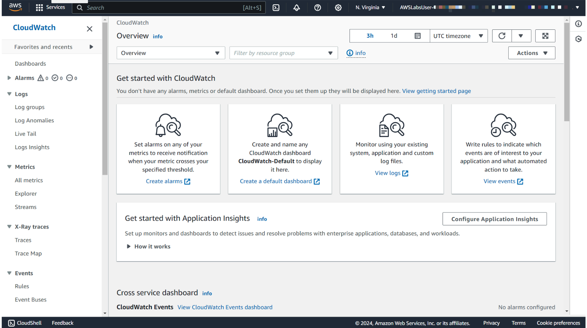
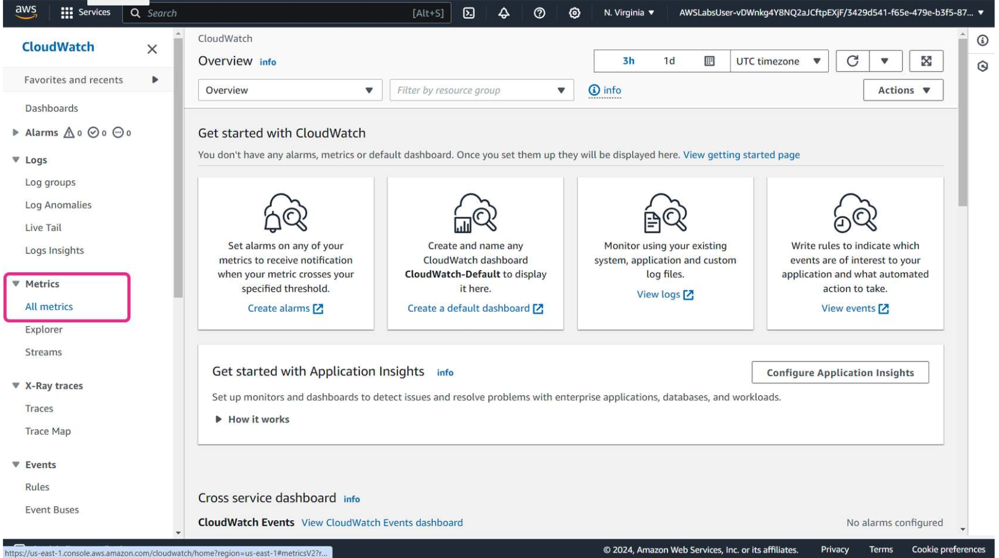
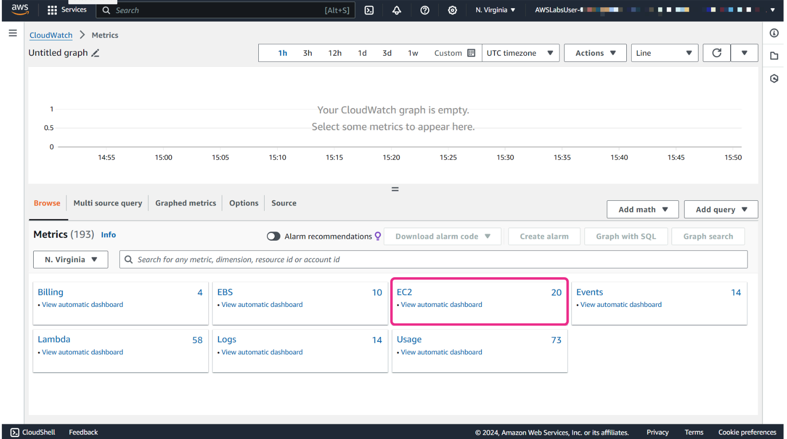
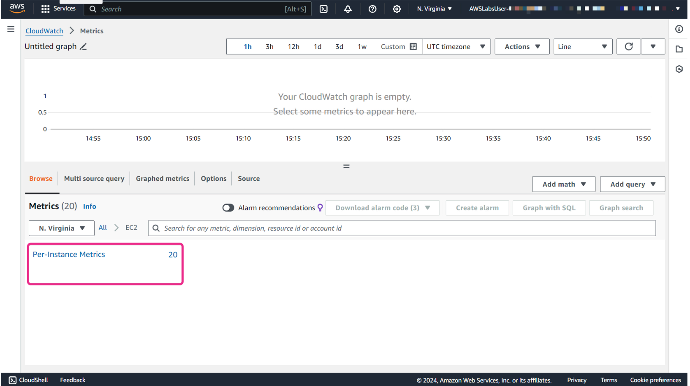
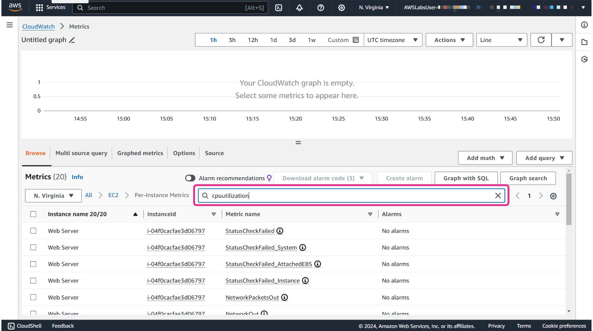
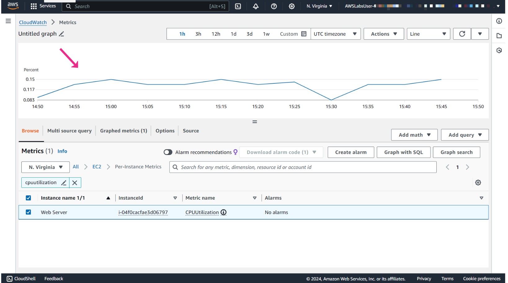
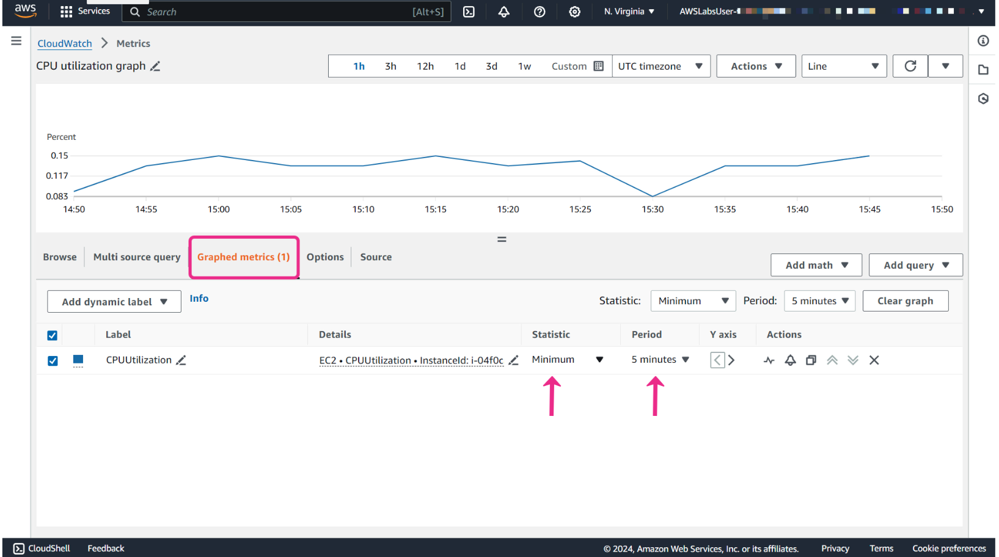

# Week 9: Monitoring and Troubleshooting: Metrics and Network Monitoring and Troubleshooting

* back to AWS Cloud Institute repo's root [aci.md](../aci.md)
* back to [AWS Cloud Operations 2](./aws-cloud-operations-2.md)
* back to repo's main [README.md](../../../README.md)

## Metric Monitoring

### Pre-assessment

#### What is a namespace in Amazon CloudWatch?

* A container for organizing metrics

Wrong answers:

* A unique identifier for an AWS Region
* A measurement unit for custom metrics
* A timestamp for metric data

##### Explanation

A namespace is a container for organizing metrics within CloudWatch. Metrics in different namespaces are isolated from each other, so that metrics from different applications are not mistakenly aggregated into the same statistics.

The other options are incorrect because of the following:

* A namespace is not specific to a Region but is rather a logical grouping of metrics that is globally unique across all Regions and services within an AWS account.
* A namespace is not related to measurement units but rather to metric categorization.
* A namespace is not a timestamp but rather a naming context.

#### How can custom metrics be published to Amazon CloudWatch?

* Through the AWS APIs or AWS CLI

Wrong answers:

* Only through the AWS Management Console
* Only through AWS CLI
* Only through direct database connection

##### Explanation

To send custom metrics, users must use the AWS APIs or AWS CLI instead of the AWS Management Console. Users can view statistical graphs of the published metrics with the AWS Management Console.

The other options are incorrect because of the following:

* AWS Management Console does not provide a direct method to publish custom metrics. The console is used primarily for viewing and managing existing metrics and alarms.
* Besides the AWS CLI, custom metrics can also be published using the AWS SDKs through application code, which interacts with the AWS APIs.
* CloudWatch does not support direct database connections for publishing metrics.

#### How does Amazon CloudWatch Metrics Insights help users understand their AWS resource usage? 

* By correlating and analyzing metric data

Wrong answers:

* By visualizing AWS CloudTrail logs
* By providing recommendations for cost optimization
* By automatically scaling Amazon EC2 instances

##### Explanation

CloudWatch Metrics Insights helps users understand their resource usage by correlating and analyzing metric data to identify trends and anomalies.

The other options are incorrect because of the following:

* CloudTrail logs are related to AWS API activity, not resource usage metrics.
* AWS Trusted Advisor is the tool that can be used for cost optimization.
* Automatically scaling of EC2 instances is typically done by Amazon EC2 Auto Scaling, not CloudWatch Metrics Insights.

### Custom Metrics

#### CloudWatch terminology and concepts

##### Namespaces

A namespace is a container for CloudWatch metrics. Metrics in different namespaces are isolated from each other, so that metrics from different applications are not mistakenly aggregated into the same statistics.

##### Metrics

A metric represents a time-ordered set of data points that are published to CloudWatch. For example, the CPU usage of a particular instance is one metric provided by Amazon Elastic Compute Cloud (Amazon EC2). The data points themselves can come from any application or business activity from which you collect data.

Metrics exist only in the Region in which they are created. Metrics cannot be deleted, but they automatically expire after 15 months if no new data is published to them.

##### Dimensions

A dimension is a name/value pair that is part of the identity of a metric. You can assign up to 30 dimensions to a metric. Dimensions provide additional context and specificity to metrics, and this helps you to categorize and filter data more effectively.

Dimensions are part of the unique identifier for a metric. This means that whenever you add a unique name/value pair to one of your metrics, you are creating a new variation of that metric.

##### Resolution

Each metric is one of the following:

* Standard resolution where your data has a granularity of 1 minute
* High resolution where your data has a granularity of 1 second

Metrics produced by Amazon Web Services (AWS) services are standard resolution by default. However, if you use a custom metric, you can define it as standard resolution or high resolution.

##### Statistics

Statistics in CloudWatch represent aggregated data from metrics over defined time intervals. CloudWatch generates statistics based on metric data points provided by your custom data or by other AWS services. These aggregations consider factors such as namespaces, metric names, dimensions, and the data point unit of measures, all within the time period that you specify.

##### Percentiles

A percentile indicates the relative standing of a value in a dataset. For example, the 95th percentile means that 95 percent of the data is lower than this value and 5 percent of the data is higher than this value.

Percentiles help you get a better understanding of the distribution of your metric data and percentiles are often used to isolate anomalies.

##### Alarms

You can use an alarm to automatically initiate actions on your behalf. An alarm watches a single metric over a specified time period, and performs one or more specified actions, based on the value of the metric relative to a threshold over time.

Alarms invoke actions for sustained state changes only. CloudWatch alarms do not invoke actions simply because they are in a particular state. The state must have changed and been maintained for a specified number of periods.

A custom metric is a user-defined data point that you can use to monitor and collect specific performance metrics from your own applications or services. This is especially useful when you need to monitor or analyze aspects of your applications that are not covered by the standard metrics.

#### Custom metrics use cases

##### Application performance monitoring

You can track custom application metrics such as response time, error rates, or specific application-level performance indicators.

For example, a company running a popular ecommerce platform might use application performance monitoring to track the response time and error rates of their checkout process. By monitoring these metrics, the company can identify and resolve issues that could lead to cart abandonment or poor user experience, ensuring smooth and efficient transactions for their customers.

##### Business key performance indicator (KPI) monitoring

You can monitor business-specific metrics such as user sign-ups, orders processed, or any other key performance indicators.

##### User engagement metrics

You can track user engagement metrics for applications or services, such as active users, session durations, or specific user interactions.

#### High-resolution metrics

Metrics produced by AWS services are standard resolution by default. However, if you use a custom metric, you can define it as standard resolution or high resolution.

High-resolution metrics gives you the ability to collect and store data at a higher granularity, with resolution as low as 1-second intervals. This is particularly useful for monitoring applications and systems where immediate detection of anomalies or performance fluctuations is crucial. This could include monitoring the response time of your web application to ensure that it meets service-level agreements (SLAs). For example, you monitor the latency of an API endpoint every second to quickly identify spikes or performance degradation.

When you publish a high-resolution metric, CloudWatch stores it with a resolution of 1 second, and you can read and retrieve it with a period of 1 second, 5 seconds, 10 seconds, 30 seconds, or any multiple of 60 seconds.

With high-resolution metrics, you detect and respond to changes or anomalies more quickly. This leads to improved visibility and operational efficiency. However, it's important to remember that high-resolution metrics come with additional costs. So you should make sure to consider your monitoring requirements and budget constraints when you use high-resolution metrics.

#### Metric retention

CloudWatch retains metrics data as follows:

* Data points with a period of fewer than 60 seconds are available for 3 hours.
* Data points with a period of 1 minute are available for 15 days.
* Data points with a period of 5 minutes are available for 63 days.
* Data points with a period of 1 hour are available for 455 days (15 months).

**Data points that are initially published within a shorter period are aggregated together for long-term storage. For example, if you collect data using a period of 1 minute, the data remains available for 15 days with a 1-minute resolution. After 15 days, the data is still available, but it is aggregated and only retrievable with a resolution of 5 minutes. After 63 days, the data is further aggregated and available with a resolution of 1 hour.**

#### Using dimensions

Let's look at the following scenario. Imagine a company that operates a fleet of delivery vehicles. The company wants to monitor the fuel consumption of each vehicle to optimize fuel usage and maintenance schedules. What can they do to achieve this? They can use CloudWatch custom metrics with dimensions to track fuel consumption per vehicle.

In custom metrics, the **--dimensions** parameter is common. A dimension further clarifies what the metric is and what data it stores. You can have up to 30 dimensions assigned to one metric, and each dimension is defined by a name and value pair.

Dimensions are crucial in custom metrics. When you publish custom metrics, you can include dimensions to provide additional context to the data being collected. AWS services that send data to CloudWatch attach dimensions to each metric. You can use dimensions to filter the results that CloudWatch returns.

For example, in the fuel-consumption-per-vehicle scenario, you might have the following setup:

* Metric name: FuelConsumption
* Namespace: DeliveryFleet
* VehicleID: A unique identifier for each vehicle such as license plate number (this is the dimension parameter)
* FuelType: The type of fuel used by the vehicle, such as gasoline or diesel (this is another dimension parameter)

With this setup, the company can analyze fuel consumption trends for each vehicle by **VehicleID** and compare fuel consumption between different fuel types by **FuelType**. This information can help the company make informed decisions about refueling schedules, maintenance, and fleet management.

How you specify a dimension is different when you use different commands. Let's look at a different example. This example command publishes a **Buffers** metric with two dimensions named **InstanceId** and **InstanceType**.

With **put-metric-data**, you specify each dimension as **MyDimensionName=MyDimensionValue**. If you have multiple dimensions, you separate them with commas.

```shell
aws cloudwatch put-metric-data --metric-name Buffers --namespace MyNameSpace --unit Bytes --value 231434333 --dimensions InstanceId=1-23456789,InstanceType=m1.small
```

With **get-metric-statistics** or **put-metric-alarm** commands, you use the format **Name=MyDimensionName,Value=MyDimensionValue**.

This following command retrieves statistics for that same metric. This command separates the Name and Value parts of a single dimension with commas. If you have multiple dimensions, you can use a space between one dimension and the next.

```shell
aws cloudwatch get-metric-statistics --metric-name Buffers --namespace MyNameSpace --dimensions Name=InstanceId,Value=1-23456789 Name=InstanceType,Value=m1.small --start-time 2024-04-15T04:00:00Z --end-time 2024-04-19T07:00:00Z --statistics Average --period 60
```

#### Publishing custom metrics

You can use the AWS Command Line Interface (AWS CLI) or an API to publish your own metrics to CloudWatch. And then, you can view statistical graphs of your published metrics with the AWS Management Console.

You can use the **put-metric-data** command to publish your custom metrics. The following examples use the **put-metric-data** command with one value and time stamp to publish a single data point for a new or existing metric. This means that if you call the **put-metric-data** command with a new metric name, CloudWatch will create a metric for you. Otherwise, CloudWatch associates your data with the existing metric that you specified. Each command line publishes one data point.

```shell
aws cloudwatch put-metric-data --metric-name PageViewCount --namespace MyService --value 2 --timestamp 2024-04-20T12:00:00.000Z

aws cloudwatch put-metric-data --metric-name PageViewCount --namespace MyService --value 4 --timestamp 2024-04-20T12:00:01.000Z

aws cloudwatch put-metric-data --metric-name PageViewCount --namespace MyService --value 5 --timestamp 2024-04-20T12:00:02.000Z
```

After you publish those data points, you can use the **get-metric-statistics** command to retrieve statistics. For example, if you want to retrieve statistics with start time 2024-04-20T12:00:00.000Z and end time 2024-04-20T12:05:00.000Z, you will use the following command.

```shell
aws cloudwatch get-metric-statistics --namespace MyService --metric-name PageViewCount \
--statistics "Sum" "Maximum" "Minimum" "Average" "SampleCount" \
--start-time 2024-04-20T12:00:00.000Z --end-time 2024-04-20T12:05:00.000Z --period 60
```

And then you will get the following example result:

```json
{
    "Datapoints": [
        {
            "SampleCount": 3.0, 
            "Timestamp": "2024-10-20T12:00:00Z", 

            "Average": 3.6666666666666665, 
            "Maximum": 5.0, 
            "Minimum": 2.0, 
            "Sum": 11.0, 
            "Unit": "None"
        }
    ], 
    "Label": "PageViewCount"
}
```

##### Publishing the value zero

When your data is less consistent and there are intervals without associated data points, you have two options for publishing: either include the value zero (0) for that period or no value at all.

If you use periodic calls to **PutMetricData** for application health monitoring, it can be beneficial to publish zeros instead of no value. For example, you might set up a CloudWatch alarm to notify you if your application fails to publish metrics every 5 minutes. In such cases, it's beneficial for such applications to publish zeros for intervals without associated data.

Imagine you have an application that periodically sends metrics to CloudWatch to monitor its health. It sends a metric every 5 minutes to indicate that it's running smoothly. Due to temporary network issues, the application stops sending metrics, and CloudWatch might interpret this as a problem with the application. However, if the application sends a metric with a value of zero instead, CloudWatch understands that the application is still running but there's just no new data at the moment. This way, you can avoid false alarms and ensure that you're only alerted when there's a real issue with your application.

You might also choose to publish zeros if you want to track the total number of data points. Or you might publish zeros if you want statistics such as minimum and average to include data points with the value 0.

##### Stopping publishing metrics

To stop publishing custom metrics to CloudWatch, change your application's or service's code to stop using **PutMetricData**. CloudWatch doesn't pull metrics from applications, it only receives what is pushed to it. If you need to stop publishing your metrics, you must stop them at the source.

#### Custom metrics use case with Amazon EC2

By default, Amazon EC2 delivers a set of metrics related to your instance to CloudWatch in the AWS/EC2 namespace. This includes CPU utilization and a set of NetworkIn and NetworkOut metrics.

Say that you are monitoring an application running on Amazon EC2 instances. What happens if you want to track the memory utilization of these EC2 instances when memory utilization is not part of the default metrics?

To monitor memory utilization, you can use the CloudWatch agent to collect custom metrics from your EC2 instances. Here is an example of how you can use the CloudWatch agent to collect memory utilization information.

##### Install the CloudWatch agent on the EC2 instances

You can download and install the CloudWatch agent on Amazon EC2 instances. The CloudWatch agent is a software application that runs on EC2 instances and collects metrics, logs, and events from the instances.

**Note**: To use the CloudWatch agent, you need to create AWS Identity and Access Management (IAM) roles and users that activate the agent that collects metrics from the server. For more information, refer to [Create IAM Roles and Users for Use with CloudWatch Agent](https://docs.aws.amazon.com/AmazonCloudWatch/latest/monitoring/create-iam-roles-for-cloudwatch-agent-commandline.html).

##### Configure the CloudWatch agent

You can configure the CloudWatch agent to collect custom metrics. You can define a metrics specification to specify the name, unit, and dimensions of the metrics that you want to collect.

The following code example shows a basic agent configuration file that reports memory usage and disk usage metrics on a Windows system.

```json
{
    "metrics": {
        "metrics_collected": {
            "LogicalDisk": {
                "measurement": [
                    "% Free Space"
                 ],
                "resources": [
                    "*"
                 ]
            },
            "Memory": {
                "measurement": [
                    "% Committed Bytes In Use"
                 ]
            }
        },
        "append_dimensions": {
            "InstanceId": "${aws:InstanceId}"
        }
    }
}
```

##### Publish custom metrics

You then start the agent on the Amazon EC2 instances so that you can publish these custom metrics to CloudWatch.

For more information on starting the agent on the EC2 instance, refer to [Start the CloudWatch Agent Using the Command Line](https://docs.aws.amazon.com/AmazonCloudWatch/latest/monitoring/install-CloudWatch-Agent-commandline-fleet.html#start-CloudWatch-Agent-EC2-commands-fleet).

##### Monitor and analyze metrics

Finally, you can use the CloudWatch console to monitor and analyze the memory utilization metrics that you have published. By default, the active agent reports metrics from your instances to the **CWAgent** namespace within CloudWatch.

You can set alarms, visualize metrics using graphs and charts, and perform various operations on the metrics. This helps you to gain insights into the performance and usage of your applications.

### Data Aggregation

The purpose of data aggregation is to condense large amounts of raw data into more manageable and meaningful summaries. This aggregated data might provide different insights into trends, patterns, and anomalies. This makes it convenient for users to analyze and understand complex datasets. Data aggregation is commonly used for monitoring and managing AWS resources.

#### Statistics

Statistics are metric data aggregations over specified periods of time. When you graph or retrieve the statistics for a metric, you specify the period of time, such as 5 minutes, to use to calculate each statistical value. For example, if the **Period** is 5 minutes, the **Sum** is the sum of all sample values collected during the 5-minute period, and the **Minimum** is the lowest value collected during the 5-minute period.

CloudWatch supports the following statistics for metrics.

* **Sample Count** is the number of data points during the period.
* **Sum** is the sum of the values of the all data points collected during the period.
* **Average** is the value of **Sum** divided by **SampleCount** during the specified period.
* **Minimum** is the lowest value observed during the specified period.
* **Maximum** is the highest value observed during the specified period.
* **Percentile (p)** indicates the relative standing of a value in a dataset.
    For example, **p95** is the 95th percentile and means that 95 percent of the data within the period is lower than the value and 5 percent of the data is higher than this value. Percentiles help you get a better understanding of the distribution of your metric data.
* **Trimmed mean (TM)** is the mean of all values that are between two specified boundaries. Values outside of the boundaries are ignored when the mean is calculated. You define the boundaries as one or two numbers between 0 and 100, up to 10 decimal places. The numbers can be absolute values or percentages.
    For example, **tm98** calculates the average after removing the 10% of data points with the highest values. **TM(2%:98%)** calculates the average after removing the 2% lowest data points and the 2% highest data points. **TM(150:1000)** calculates the average after removing all data points that are lower than or equal to 150, or higher than 1000.
* **Interquartile mean (IQM)** is the trimmed mean of the interquartile range, or the middle 50% of values. It is equivalent to **TM(25%:75%)**.
* **Winsorized mean (VM)** is similar to trimmed mean. However, with winsorized mean, the values that are outside the boundary are not ignored. They are considered to be equal to the value at the edge of the appropriate boundary. After this normalization, the average is calculated. You define the boundaries as one or two numbers between 0 and 100, up to 10 decimal places.
    For example, **wm98** calculates the average while treating the 2% of the highest values to be equal to the value at the 98th percentile. WM is important because it reduces the impact of outliers on the calculated mean, providing a more robust measure of central tendency in datasets with extreme values.
* **Percentile rank (PR)** is the percentage of values that meet a fixed threshold.
    For example, **PR(:300)** returns the percentage of data points that have a value of 300 or less. **PR(100:2000)** returns the percentage of data points that have a value between 100 and 2000. **Percentile tank** is exclusive on the lower bound and inclusive on the upper bound.
* **Trimmed count (TC)** is the number of data points in the chosen range for a trimmed mean statistic.
    For example, **tc90** returns the number of data points not including any data points that fall in the highest 10% of the values. **TC(0.005:0.030)** returns the number of data points with values between 0.005 (exclusive) and 0.030 (inclusive).
* **Trimmed sum (TS)** is the sum of the values of data points in a chosen range for a trimmed mean statistic. It is equivalent to (Trimmed mean) * (Trimmed count).
    For example, **ts90** returns the sum of the data points not including any data points that fall in the highest 10% of the values. **TS(80%)** returns the sum of the data point values, not including any data points with values in the lowest 80% of the range of values.

#### Statistics use cases

##### Trimmed mean (TM)

**Trimmed mean (TM)** is most useful for metrics with a large sample size, such as webpage latency. For example, **tm99** disregards extreme high outliers that could result from network problems or human errors, to give a more accurate number for the average latency of typical requests.

Similarly, **TM(10%:)** disregards the lowest 10% of latency values, such as those resulting from cache hits. And **TM(10%:99%)** excludes both of these types of outliers. It's recommended to use trimmed mean for monitoring latency.

##### Trimmed count (TC)

t's a good idea to keep watch on trimmed count (TC) whenever you are using trimmed mean. This is to ensure that the number of values being used in your trimmed mean calculations are enough to be statistically significant.

##### Percentile rank (PR)

You can use **percentile rank (PR)** to put values into *bins* of ranges, and you can use this to manually create a histogram. To do this, break your values down into various bins, such as **PR(:1)**, **PR(1:5)**, **PR(5:10)**, and **PR(10:)**. Put each of these bins into a visualization as bar charts, and you have a histogram.

Percentile rank is exclusive on the lower bound and inclusive on the upper bound.

#### Getting statistics for a specific resource

In the following example, let's take a look how you can determine the minimum CPU utilization of a specific EC2 instance.

##### Step 1



Open the **CloudWatch** console.

##### Step 2



In the navigation pane, choose **All metrics**.

##### Step 3



On the **Browse** tab, choose the **EC2 namespace**.

##### Step 4



Then choose the dimension named **Pre-Instance Metrics**.

##### Step 5



In the search field, you can use **CPUUtilization** as the keyword, and press Enter.

##### Step 6



Then select the row for the specific instance, which displays a graph for the **CPUUtilization** metric for the instance.

If you want to change the name of the graph, choose the pencil icon.

You can also change the time range that is used for the graph.

##### Step 7



To change the statistic, choose the **Graphed metrics** tab.

In the **Statistic** column, choose the dropdown menu and then choose one of the statistics or predefined percentiles.

To change the period, in the **Period** column, choose the dropdown menu and then choose a different value.

#### Publishing statistic sets

You can aggregate your data before you publish to CloudWatch. When you have multiple data points per minute, aggregating data minimizes the number of calls to **put-metric-data**. For example, instead of calling **put-metric-data** multiple times for three data points that are within 3 seconds of each other, you can aggregate the data into a statistic set that you publish with one call, using the **--statistic-values** parameter. You would use the following command.

```shell
aws cloudwatch put-metric-data --metric-name PageViewCount --namespace MyService --statistic-values Sum=11,Minimum=2,Maximum=5,SampleCount=3 --timestamp 2024-04-14T12:00:00.000Z
```

CloudWatch requires raw data points to calculate percentiles. If you publish data using a statistic set instead, you can't retrieve percentile statistics for this data unless one of the following conditions is true:

* The **SampleCount** of the statistic set is 1.
* The **Minimum** and the **Maximum** of the statistic set are equal.

Minimizing the number of API calls can help in managing costs, improving performance, and simplifying the process of sending data to CloudWatch, especially when dealing with large volumes of data.
