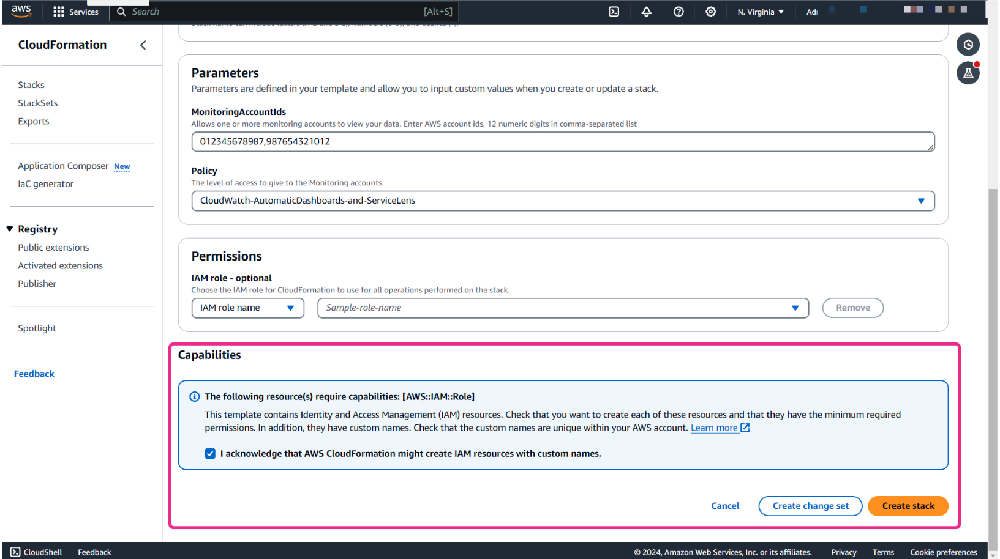

# Week 9: Monitoring and Troubleshooting: Metrics and Network Monitoring and Troubleshooting

* back to AWS Cloud Institute repo's root [aci.md](../aci.md)
* back to [AWS Cloud Operations 2](./aws-cloud-operations-2.md)
* back to repo's main [README.md](../../../README.md)

## Metric Monitoring

### Pre-assessment

#### What is a namespace in Amazon CloudWatch?

* A container for organizing metrics

Wrong answers:

* A unique identifier for an AWS Region
* A measurement unit for custom metrics
* A timestamp for metric data

##### Explanation

A namespace is a container for organizing metrics within CloudWatch. Metrics in different namespaces are isolated from each other, so that metrics from different applications are not mistakenly aggregated into the same statistics.

The other options are incorrect because of the following:

* A namespace is not specific to a Region but is rather a logical grouping of metrics that is globally unique across all Regions and services within an AWS account.
* A namespace is not related to measurement units but rather to metric categorization.
* A namespace is not a timestamp but rather a naming context.

#### How can custom metrics be published to Amazon CloudWatch?

* Through the AWS APIs or AWS CLI

Wrong answers:

* Only through the AWS Management Console
* Only through AWS CLI
* Only through direct database connection

##### Explanation

To send custom metrics, users must use the AWS APIs or AWS CLI instead of the AWS Management Console. Users can view statistical graphs of the published metrics with the AWS Management Console.

The other options are incorrect because of the following:

* AWS Management Console does not provide a direct method to publish custom metrics. The console is used primarily for viewing and managing existing metrics and alarms.
* Besides the AWS CLI, custom metrics can also be published using the AWS SDKs through application code, which interacts with the AWS APIs.
* CloudWatch does not support direct database connections for publishing metrics.

#### How does Amazon CloudWatch Metrics Insights help users understand their AWS resource usage? 

* By correlating and analyzing metric data

Wrong answers:

* By visualizing AWS CloudTrail logs
* By providing recommendations for cost optimization
* By automatically scaling Amazon EC2 instances

##### Explanation

CloudWatch Metrics Insights helps users understand their resource usage by correlating and analyzing metric data to identify trends and anomalies.

The other options are incorrect because of the following:

* CloudTrail logs are related to AWS API activity, not resource usage metrics.
* AWS Trusted Advisor is the tool that can be used for cost optimization.
* Automatically scaling of EC2 instances is typically done by Amazon EC2 Auto Scaling, not CloudWatch Metrics Insights.

### Custom Metrics

#### CloudWatch terminology and concepts

##### Namespaces

A namespace is a container for CloudWatch metrics. Metrics in different namespaces are isolated from each other, so that metrics from different applications are not mistakenly aggregated into the same statistics.

##### Metrics

A metric represents a time-ordered set of data points that are published to CloudWatch. For example, the CPU usage of a particular instance is one metric provided by Amazon Elastic Compute Cloud (Amazon EC2). The data points themselves can come from any application or business activity from which you collect data.

Metrics exist only in the Region in which they are created. Metrics cannot be deleted, but they automatically expire after 15 months if no new data is published to them.

##### Dimensions

A dimension is a name/value pair that is part of the identity of a metric. You can assign up to 30 dimensions to a metric. Dimensions provide additional context and specificity to metrics, and this helps you to categorize and filter data more effectively.

Dimensions are part of the unique identifier for a metric. This means that whenever you add a unique name/value pair to one of your metrics, you are creating a new variation of that metric.

##### Resolution

Each metric is one of the following:

* Standard resolution where your data has a granularity of 1 minute
* High resolution where your data has a granularity of 1 second

Metrics produced by Amazon Web Services (AWS) services are standard resolution by default. However, if you use a custom metric, you can define it as standard resolution or high resolution.

##### Statistics

Statistics in CloudWatch represent aggregated data from metrics over defined time intervals. CloudWatch generates statistics based on metric data points provided by your custom data or by other AWS services. These aggregations consider factors such as namespaces, metric names, dimensions, and the data point unit of measures, all within the time period that you specify.

##### Percentiles

A percentile indicates the relative standing of a value in a dataset. For example, the 95th percentile means that 95 percent of the data is lower than this value and 5 percent of the data is higher than this value.

Percentiles help you get a better understanding of the distribution of your metric data and percentiles are often used to isolate anomalies.

##### Alarms

You can use an alarm to automatically initiate actions on your behalf. An alarm watches a single metric over a specified time period, and performs one or more specified actions, based on the value of the metric relative to a threshold over time.

Alarms invoke actions for sustained state changes only. CloudWatch alarms do not invoke actions simply because they are in a particular state. The state must have changed and been maintained for a specified number of periods.

A custom metric is a user-defined data point that you can use to monitor and collect specific performance metrics from your own applications or services. This is especially useful when you need to monitor or analyze aspects of your applications that are not covered by the standard metrics.

#### Custom metrics use cases

##### Application performance monitoring

You can track custom application metrics such as response time, error rates, or specific application-level performance indicators.

For example, a company running a popular ecommerce platform might use application performance monitoring to track the response time and error rates of their checkout process. By monitoring these metrics, the company can identify and resolve issues that could lead to cart abandonment or poor user experience, ensuring smooth and efficient transactions for their customers.

##### Business key performance indicator (KPI) monitoring

You can monitor business-specific metrics such as user sign-ups, orders processed, or any other key performance indicators.

##### User engagement metrics

You can track user engagement metrics for applications or services, such as active users, session durations, or specific user interactions.

#### High-resolution metrics

Metrics produced by AWS services are standard resolution by default. However, if you use a custom metric, you can define it as standard resolution or high resolution.

High-resolution metrics gives you the ability to collect and store data at a higher granularity, with resolution as low as 1-second intervals. This is particularly useful for monitoring applications and systems where immediate detection of anomalies or performance fluctuations is crucial. This could include monitoring the response time of your web application to ensure that it meets service-level agreements (SLAs). For example, you monitor the latency of an API endpoint every second to quickly identify spikes or performance degradation.

When you publish a high-resolution metric, CloudWatch stores it with a resolution of 1 second, and you can read and retrieve it with a period of 1 second, 5 seconds, 10 seconds, 30 seconds, or any multiple of 60 seconds.

With high-resolution metrics, you detect and respond to changes or anomalies more quickly. This leads to improved visibility and operational efficiency. However, it's important to remember that high-resolution metrics come with additional costs. So you should make sure to consider your monitoring requirements and budget constraints when you use high-resolution metrics.

#### Metric retention

CloudWatch retains metrics data as follows:

* Data points with a period of fewer than 60 seconds are available for 3 hours.
* Data points with a period of 1 minute are available for 15 days.
* Data points with a period of 5 minutes are available for 63 days.
* Data points with a period of 1 hour are available for 455 days (15 months).

**Data points that are initially published within a shorter period are aggregated together for long-term storage. For example, if you collect data using a period of 1 minute, the data remains available for 15 days with a 1-minute resolution. After 15 days, the data is still available, but it is aggregated and only retrievable with a resolution of 5 minutes. After 63 days, the data is further aggregated and available with a resolution of 1 hour.**

#### Using dimensions

Let's look at the following scenario. Imagine a company that operates a fleet of delivery vehicles. The company wants to monitor the fuel consumption of each vehicle to optimize fuel usage and maintenance schedules. What can they do to achieve this? They can use CloudWatch custom metrics with dimensions to track fuel consumption per vehicle.

In custom metrics, the **--dimensions** parameter is common. A dimension further clarifies what the metric is and what data it stores. You can have up to 30 dimensions assigned to one metric, and each dimension is defined by a name and value pair.

Dimensions are crucial in custom metrics. When you publish custom metrics, you can include dimensions to provide additional context to the data being collected. AWS services that send data to CloudWatch attach dimensions to each metric. You can use dimensions to filter the results that CloudWatch returns.

For example, in the fuel-consumption-per-vehicle scenario, you might have the following setup:

* Metric name: FuelConsumption
* Namespace: DeliveryFleet
* VehicleID: A unique identifier for each vehicle such as license plate number (this is the dimension parameter)
* FuelType: The type of fuel used by the vehicle, such as gasoline or diesel (this is another dimension parameter)

With this setup, the company can analyze fuel consumption trends for each vehicle by **VehicleID** and compare fuel consumption between different fuel types by **FuelType**. This information can help the company make informed decisions about refueling schedules, maintenance, and fleet management.

How you specify a dimension is different when you use different commands. Let's look at a different example. This example command publishes a **Buffers** metric with two dimensions named **InstanceId** and **InstanceType**.

With **put-metric-data**, you specify each dimension as **MyDimensionName=MyDimensionValue**. If you have multiple dimensions, you separate them with commas.

```shell
aws cloudwatch put-metric-data --metric-name Buffers --namespace MyNameSpace --unit Bytes --value 231434333 --dimensions InstanceId=1-23456789,InstanceType=m1.small
```

With **get-metric-statistics** or **put-metric-alarm** commands, you use the format **Name=MyDimensionName,Value=MyDimensionValue**.

This following command retrieves statistics for that same metric. This command separates the Name and Value parts of a single dimension with commas. If you have multiple dimensions, you can use a space between one dimension and the next.

```shell
aws cloudwatch get-metric-statistics --metric-name Buffers --namespace MyNameSpace --dimensions Name=InstanceId,Value=1-23456789 Name=InstanceType,Value=m1.small --start-time 2024-04-15T04:00:00Z --end-time 2024-04-19T07:00:00Z --statistics Average --period 60
```

#### Publishing custom metrics

You can use the AWS Command Line Interface (AWS CLI) or an API to publish your own metrics to CloudWatch. And then, you can view statistical graphs of your published metrics with the AWS Management Console.

You can use the **put-metric-data** command to publish your custom metrics. The following examples use the **put-metric-data** command with one value and time stamp to publish a single data point for a new or existing metric. This means that if you call the **put-metric-data** command with a new metric name, CloudWatch will create a metric for you. Otherwise, CloudWatch associates your data with the existing metric that you specified. Each command line publishes one data point.

```shell
aws cloudwatch put-metric-data --metric-name PageViewCount --namespace MyService --value 2 --timestamp 2024-04-20T12:00:00.000Z

aws cloudwatch put-metric-data --metric-name PageViewCount --namespace MyService --value 4 --timestamp 2024-04-20T12:00:01.000Z

aws cloudwatch put-metric-data --metric-name PageViewCount --namespace MyService --value 5 --timestamp 2024-04-20T12:00:02.000Z
```

After you publish those data points, you can use the **get-metric-statistics** command to retrieve statistics. For example, if you want to retrieve statistics with start time 2024-04-20T12:00:00.000Z and end time 2024-04-20T12:05:00.000Z, you will use the following command.

```shell
aws cloudwatch get-metric-statistics --namespace MyService --metric-name PageViewCount \
--statistics "Sum" "Maximum" "Minimum" "Average" "SampleCount" \
--start-time 2024-04-20T12:00:00.000Z --end-time 2024-04-20T12:05:00.000Z --period 60
```

And then you will get the following example result:

```json
{
    "Datapoints": [
        {
            "SampleCount": 3.0, 
            "Timestamp": "2024-10-20T12:00:00Z", 

            "Average": 3.6666666666666665, 
            "Maximum": 5.0, 
            "Minimum": 2.0, 
            "Sum": 11.0, 
            "Unit": "None"
        }
    ], 
    "Label": "PageViewCount"
}
```

##### Publishing the value zero

When your data is less consistent and there are intervals without associated data points, you have two options for publishing: either include the value zero (0) for that period or no value at all.

If you use periodic calls to **PutMetricData** for application health monitoring, it can be beneficial to publish zeros instead of no value. For example, you might set up a CloudWatch alarm to notify you if your application fails to publish metrics every 5 minutes. In such cases, it's beneficial for such applications to publish zeros for intervals without associated data.

Imagine you have an application that periodically sends metrics to CloudWatch to monitor its health. It sends a metric every 5 minutes to indicate that it's running smoothly. Due to temporary network issues, the application stops sending metrics, and CloudWatch might interpret this as a problem with the application. However, if the application sends a metric with a value of zero instead, CloudWatch understands that the application is still running but there's just no new data at the moment. This way, you can avoid false alarms and ensure that you're only alerted when there's a real issue with your application.

You might also choose to publish zeros if you want to track the total number of data points. Or you might publish zeros if you want statistics such as minimum and average to include data points with the value 0.

##### Stopping publishing metrics

To stop publishing custom metrics to CloudWatch, change your application's or service's code to stop using **PutMetricData**. CloudWatch doesn't pull metrics from applications, it only receives what is pushed to it. If you need to stop publishing your metrics, you must stop them at the source.

#### Custom metrics use case with Amazon EC2

By default, Amazon EC2 delivers a set of metrics related to your instance to CloudWatch in the AWS/EC2 namespace. This includes CPU utilization and a set of NetworkIn and NetworkOut metrics.

Say that you are monitoring an application running on Amazon EC2 instances. What happens if you want to track the memory utilization of these EC2 instances when memory utilization is not part of the default metrics?

To monitor memory utilization, you can use the CloudWatch agent to collect custom metrics from your EC2 instances. Here is an example of how you can use the CloudWatch agent to collect memory utilization information.

##### Install the CloudWatch agent on the EC2 instances

You can download and install the CloudWatch agent on Amazon EC2 instances. The CloudWatch agent is a software application that runs on EC2 instances and collects metrics, logs, and events from the instances.

**Note**: To use the CloudWatch agent, you need to create AWS Identity and Access Management (IAM) roles and users that activate the agent that collects metrics from the server. For more information, refer to [Create IAM Roles and Users for Use with CloudWatch Agent](https://docs.aws.amazon.com/AmazonCloudWatch/latest/monitoring/create-iam-roles-for-cloudwatch-agent-commandline.html).

##### Configure the CloudWatch agent

You can configure the CloudWatch agent to collect custom metrics. You can define a metrics specification to specify the name, unit, and dimensions of the metrics that you want to collect.

The following code example shows a basic agent configuration file that reports memory usage and disk usage metrics on a Windows system.

```json
{
    "metrics": {
        "metrics_collected": {
            "LogicalDisk": {
                "measurement": [
                    "% Free Space"
                 ],
                "resources": [
                    "*"
                 ]
            },
            "Memory": {
                "measurement": [
                    "% Committed Bytes In Use"
                 ]
            }
        },
        "append_dimensions": {
            "InstanceId": "${aws:InstanceId}"
        }
    }
}
```

##### Publish custom metrics

You then start the agent on the Amazon EC2 instances so that you can publish these custom metrics to CloudWatch.

For more information on starting the agent on the EC2 instance, refer to [Start the CloudWatch Agent Using the Command Line](https://docs.aws.amazon.com/AmazonCloudWatch/latest/monitoring/install-CloudWatch-Agent-commandline-fleet.html#start-CloudWatch-Agent-EC2-commands-fleet).

##### Monitor and analyze metrics

Finally, you can use the CloudWatch console to monitor and analyze the memory utilization metrics that you have published. By default, the active agent reports metrics from your instances to the **CWAgent** namespace within CloudWatch.

You can set alarms, visualize metrics using graphs and charts, and perform various operations on the metrics. This helps you to gain insights into the performance and usage of your applications.

### Data Aggregation

The purpose of data aggregation is to condense large amounts of raw data into more manageable and meaningful summaries. This aggregated data might provide different insights into trends, patterns, and anomalies. This makes it convenient for users to analyze and understand complex datasets. Data aggregation is commonly used for monitoring and managing AWS resources.

#### Statistics

Statistics are metric data aggregations over specified periods of time. When you graph or retrieve the statistics for a metric, you specify the period of time, such as 5 minutes, to use to calculate each statistical value. For example, if the **Period** is 5 minutes, the **Sum** is the sum of all sample values collected during the 5-minute period, and the **Minimum** is the lowest value collected during the 5-minute period.

CloudWatch supports the following statistics for metrics.

* **Sample Count** is the number of data points during the period.
* **Sum** is the sum of the values of the all data points collected during the period.
* **Average** is the value of **Sum** divided by **SampleCount** during the specified period.
* **Minimum** is the lowest value observed during the specified period.
* **Maximum** is the highest value observed during the specified period.
* **Percentile (p)** indicates the relative standing of a value in a dataset.
    For example, **p95** is the 95th percentile and means that 95 percent of the data within the period is lower than the value and 5 percent of the data is higher than this value. Percentiles help you get a better understanding of the distribution of your metric data.
* **Trimmed mean (TM)** is the mean of all values that are between two specified boundaries. Values outside of the boundaries are ignored when the mean is calculated. You define the boundaries as one or two numbers between 0 and 100, up to 10 decimal places. The numbers can be absolute values or percentages.
    For example, **tm98** calculates the average after removing the 10% of data points with the highest values. **TM(2%:98%)** calculates the average after removing the 2% lowest data points and the 2% highest data points. **TM(150:1000)** calculates the average after removing all data points that are lower than or equal to 150, or higher than 1000.
* **Interquartile mean (IQM)** is the trimmed mean of the interquartile range, or the middle 50% of values. It is equivalent to **TM(25%:75%)**.
* **Winsorized mean (VM)** is similar to trimmed mean. However, with winsorized mean, the values that are outside the boundary are not ignored. They are considered to be equal to the value at the edge of the appropriate boundary. After this normalization, the average is calculated. You define the boundaries as one or two numbers between 0 and 100, up to 10 decimal places.
    For example, **wm98** calculates the average while treating the 2% of the highest values to be equal to the value at the 98th percentile. WM is important because it reduces the impact of outliers on the calculated mean, providing a more robust measure of central tendency in datasets with extreme values.
* **Percentile rank (PR)** is the percentage of values that meet a fixed threshold.
    For example, **PR(:300)** returns the percentage of data points that have a value of 300 or less. **PR(100:2000)** returns the percentage of data points that have a value between 100 and 2000. **Percentile tank** is exclusive on the lower bound and inclusive on the upper bound.
* **Trimmed count (TC)** is the number of data points in the chosen range for a trimmed mean statistic.
    For example, **tc90** returns the number of data points not including any data points that fall in the highest 10% of the values. **TC(0.005:0.030)** returns the number of data points with values between 0.005 (exclusive) and 0.030 (inclusive).
* **Trimmed sum (TS)** is the sum of the values of data points in a chosen range for a trimmed mean statistic. It is equivalent to (Trimmed mean) * (Trimmed count).
    For example, **ts90** returns the sum of the data points not including any data points that fall in the highest 10% of the values. **TS(80%)** returns the sum of the data point values, not including any data points with values in the lowest 80% of the range of values.

#### Statistics use cases

##### Trimmed mean (TM)

**Trimmed mean (TM)** is most useful for metrics with a large sample size, such as webpage latency. For example, **tm99** disregards extreme high outliers that could result from network problems or human errors, to give a more accurate number for the average latency of typical requests.

Similarly, **TM(10%:)** disregards the lowest 10% of latency values, such as those resulting from cache hits. And **TM(10%:99%)** excludes both of these types of outliers. It's recommended to use trimmed mean for monitoring latency.

##### Trimmed count (TC)

t's a good idea to keep watch on trimmed count (TC) whenever you are using trimmed mean. This is to ensure that the number of values being used in your trimmed mean calculations are enough to be statistically significant.

##### Percentile rank (PR)

You can use **percentile rank (PR)** to put values into *bins* of ranges, and you can use this to manually create a histogram. To do this, break your values down into various bins, such as **PR(:1)**, **PR(1:5)**, **PR(5:10)**, and **PR(10:)**. Put each of these bins into a visualization as bar charts, and you have a histogram.

Percentile rank is exclusive on the lower bound and inclusive on the upper bound.

#### Getting statistics for a specific resource

In the following example, let's take a look how you can determine the minimum CPU utilization of a specific EC2 instance.

##### Step 1


Open the **CloudWatch** console.

##### Step 2


In the navigation pane, choose **All metrics**.

##### Step 3


On the **Browse** tab, choose the **EC2 namespace**.

##### Step 4


Then choose the dimension named **Pre-Instance Metrics**.

##### Step 5


In the search field, you can use **CPUUtilization** as the keyword, and press Enter.

##### Step 6


Then select the row for the specific instance, which displays a graph for the **CPUUtilization** metric for the instance.

If you want to change the name of the graph, choose the pencil icon.

You can also change the time range that is used for the graph.

##### Step 7


To change the statistic, choose the **Graphed metrics** tab.

In the **Statistic** column, choose the dropdown menu and then choose one of the statistics or predefined percentiles.

To change the period, in the **Period** column, choose the dropdown menu and then choose a different value.

#### Publishing statistic sets

You can aggregate your data before you publish to CloudWatch. When you have multiple data points per minute, aggregating data minimizes the number of calls to **put-metric-data**. For example, instead of calling **put-metric-data** multiple times for three data points that are within 3 seconds of each other, you can aggregate the data into a statistic set that you publish with one call, using the **--statistic-values** parameter. You would use the following command.

```shell
aws cloudwatch put-metric-data --metric-name PageViewCount --namespace MyService --statistic-values Sum=11,Minimum=2,Maximum=5,SampleCount=3 --timestamp 2024-04-14T12:00:00.000Z
```

CloudWatch requires raw data points to calculate percentiles. If you publish data using a statistic set instead, you can't retrieve percentile statistics for this data unless one of the following conditions is true:

* The **SampleCount** of the statistic set is 1.
* The **Minimum** and the **Maximum** of the statistic set are equal.

Minimizing the number of API calls can help in managing costs, improving performance, and simplifying the process of sending data to CloudWatch, especially when dealing with large volumes of data.

### Cross-Account Cross-Region Monitoring

#### Purpose of cross-account cross-Region monitoring

Cross-account monitoring and cross-Region monitoring in Amazon CloudWatch help provide organizations with comprehensive oversight and management capabilities within the AWS Cloud.

Organizations often deploy applications and services across multiple AWS accounts and Regions for different reasons, such as increasing scalability, security, and resilience. However, managing and monitoring these distributed resources can be challenging.

Organizations can use features of cross-account and cross-Region monitoring to aggregate metrics, set alarms, and implement automated responses from a single and centralized CloudWatch dashboard.

By configuring cross-account access permissions, administrators can grant CloudWatch access to resources across multiple AWS accounts. This facilitates unified monitoring and management. Similarly, with cross-Region monitoring capabilities, organizations can monitor resources deployed in different AWS Regions without the need to switch between Region-specific consoles.

The goal of cross-account and cross-Region monitoring is to enhance visibility, control, and operational efficiency. Organizations are encouraged to gain insights into the health, performance, and utilization of their resources, regardless of where these resources are located or who owns them.

This centralized monitoring approach streamlines capacity planning, troubleshooting, and performance optimization efforts. It also ensures compliance, security, and governance requirements across the organization’s AWS infrastructure.

Overall, cross-account and cross-Region monitoring is one of the keys to achieving operational excellence, scalability, and resilience for your resources in the AWS Cloud.

#### Cross-Region functionality

Cross-Region functionality is now built in automatically. You don't need to take any extra steps to display metrics from different Regions in a single account on the same graph or the same dashboard. However, cross-Region functionality is not supported for alarms, so you can't create an alarm in one Region that watches a metric in a different Region.

#### Using cross-account functionality in CloudWatch

Before you can use cross-account functionality in CloudWatch, you need to set up your sharing accounts and monitoring accounts.

##### Sharing account

When you set up a sharing account in CloudWatch, you are essentially granting another AWS account access to view metrics and logs from your resources.

##### Monitoring account

When you set up a monitoring account in CloudWatch, you are configuring your AWS account to access and view metrics and logs from another AWS account.

#### IAM roles

IAM roles are necessary to grant permissions for cross-account monitoring. Each sharing account should have a role named **CloudWatch-CrossAccountSharingRole**. Your monitoring account should also have an IAM role, and this service-linked role is called **AWSServiceRoleForCloudWatchCrossAccount**.

If you don't have these IAM roles, you need to create them, otherwise you would get access denied errors when you display cross-account data. The following steps show you how to set up a sharing account and a monitoring account. After these steps, the IAM roles will be created.

##### Setting up a sharing account

You must enable sharing in each account that will make data available to the monitoring account. Completing the following procedure creates an IAM role (**CloudWatch-CrossAccountSharingRole**) which enables your account to share data with one account.

###### Step 1


Open the CloudWatch console at [https://console.aws.amazon.com/cloudwatch/](https://console.aws.amazon.com/cloudwatch/).

In the navigation pane, choose **Settings**.

###### Step 2


In the **Share your CloudWatch data section**, choose **Configure**.

###### Step 3


For **Sharing**, choose **Specific accounts**, and enter the IDs of the accounts that you want to share data with.

Any accounts that you specify here can view your account's CloudWatch data. You should only specify the IDs that you know and trust.

###### Step 4


For **Permissions**, specify how to share your data with one of the following options:

* **Provide read-only access to your CloudWatch metrics, dashboards, log widgets and alarms**. This option enables the monitoring accounts to create cross-account dashboards that include widgets that contain CloudWatch data from your account.
* **Include CloudWatch automatic dashboards**. If you select this option, users in the monitoring account can also view the information in this account's automatic dashboards.
* **Include X-Ray read-only access for ServiceLens**. If you select this option, users in the monitoring account can also view the X-Ray trace map and X-Ray trace information in this account. (Note that **ServiceLens** has been replaced by the **X-Ray Trace Map**. However, you might still see **ServiceLens** in the console UI.)
* **Full read-only access to everything in your account**. This option enables the accounts that you use for sharing to create cross-account dashboards that include widgets that contain CloudWatch data from your account. It also enables those accounts to look deeper into your account and view your account's data in the consoles of other AWS services.

Then, choose **Launch CloudFormation template**.

###### Step 5


On the **Launch CloudFormation template** confirmation screen, type **Confirm**, and choose **Launch template**.

###### Step 6



You will be redirected to the AWS CloudFormation console. At the bottom of the **Quick create stack** page, for **Capabilities**, select the **I acknowledge...** check box, and choose **Create stack**.

This CloudFormation template contains AWS Identity and Access Management (IAM) resources.

###### Step 7


Go back to the CloudWatch console to complete the settings. After you have completed the template, the **CloudWatch-CrossAccountSharingRole** will be created.

Then choose **Done**.

##### Setting up a monitoring account

Enable each monitoring account if you want to view cross-account CloudWatch data.

When you complete the following procedure, CloudWatch creates a service-linked role that CloudWatch uses in the monitoring account to access data shared from your other accounts. This service-linked role is called **AWSServiceRoleForCloudWatchCrossAccount**.

###### Step 1


Open the CloudWatch console at [https://console.aws.amazon.com/cloudwatch/](https://console.aws.amazon.com/cloudwatch/).

In the navigation pane, choose **Settings**.

###### Step 2


In the **View cross-account cross-region** section, choose **Configure**.

###### Step 3


On the **View cross-account cross-region** page, select the **Show selector in the console** check box. This enables an account selector to appear in the CloudWatch console when you're graphing a metric or creating an alarm.

###### Step 4


In the **Enable account selector** section, choose one of the following options:

* **Account Id Input**. This option prompts you to manually input an account ID each time that you want to switch accounts when you view cross-account data.
* **AWS Organization account selector**. This option causes the accounts that you specified when you completed your cross-account integration with AWS Organizations to appear. Next time you use the console, CloudWatch displays a dropdown list of these accounts for you to select from when you are viewing cross-account data.
To do this, you must have first used your organization management account to allow CloudWatch to see a list of accounts in your organization.
* **Custom account selector**. This option prompts you to enter a list of account IDs. When you next use the console, CloudWatch displays a dropdown list of these accounts for you to select from when you are viewing cross-account data.

You can also enter a label for each of these accounts to help you identify them when choosing accounts to view.

The account selector settings that a user makes here are retained only for that user, not for all other users in the monitoring account.

Then choose **Enable**.

#### Cross-account observability in CloudWatch

With enabling cross-account observability in Amazon CloudWatch, you can set up a centralized monitoring account in CloudWatch, link multiple source accounts to it, and then browse cross-account data with the monitoring account.

##### Configuring centralized monitoring account

Let's configure its settings. This configuration will be available for source accounts in the specified AWS Region, which is US East, North Virginia. Let's retain the default settings for the types of telemetry data we want this account to monitor. Next, we'll list the specific source accounts we want to monitor. Let's paste in an organization path and an account ID. Here, we can define a label to identify our source account within the monitoring account. We'll retain the default label and use the account name.

##### Linking source accounts to this monitoring account demo

We have two options for linking source accounts. AWS Organization, the recommended option, automatically onboards new accounts as they're added to the organization. The Any Account option lets us link individual source accounts. 

1. Linking using AWS Organization. Let's download the CloudFormation template. Next, we'll log in with the CloudFormation delegated admin account, and navigate to AWS CloudFormation, where we'll create a StackSet with this template. We'll give the StackSet a name, and proceed to the next step. We'll retain the default StackSet options. For our purposes, we'll deploy the StackSet to the US East, North Virginia Region. Let's review our settings and create the StackSet. Once the StackSet finishes launching, we'll be able to sign into CloudWatch with our monitoring account to browse through our cross-account telemetry data.
2. Linking individual accounts outside our AWS Organization. We can download a template as before, or copy a link and share it to our accounts manually. In this case, we'll use the link. Let's copy the URL and navigate to it from within the source account whose ID we entered during the configuration process. Now that we are logged in with our source account, let's review and confirm the settings. We'll confirm the linking of the accounts.

##### Disconnecting a source account

Because we added this source account manually, we can stop sharing data with this monitoring account in a few clicks. To disconnect source accounts that were linked using CloudFormation stacks or StackSets, we'd need to update the respective template or delete the stack. Let's return to the monitoring account settings.

##### Connecting a new source account manually

Now we'll see how to connect a new source account manually after we've already set up cross-account monitoring. Let's take a look at our configuration policy. Here, we can add principal accounts directly. We can also remove permissions from accounts to begin sharing with us. We can also add or delete accounts programmatically through CloudFormation, AWS SDKs, or the AWS CLI. For further information, please refer to our documentation. Let's go back to the CloudWatch homepage. Let's take a look at the service map. ServiceLens integrates traces, metrics, logs, alarms, and other resource health information into one place to offer a 360-degree view of your cross-account applications, health, and performance. We can filter the view to see one or more of our linked accounts.

After connecting a source account we can navigate CloudWatch data in the monitoring account like within the account, for example:

* lambda function information, which is associated with the source account
* the function's metrics, as well as any alerts
* a cross-account dashboard or cross-account alarms from cross-account metrics
* with the service map, we can filter the metrics by a specific account
* view our CloudWatch logs
* we can use cross-account monitoring to generate insights for multiple accounts
* we can use Contributor Insights as we would for an individual account

Learn more at [CloudWatch Cross-Account Observability](https://docs.aws.amazon.com/AmazonCloudWatch/latest/monitoring/CloudWatch-Unified-Cross-Account.html).

### Amazon CloudWatch Anomaly Detection

CloudWatch anomaly detection automatically detects unusual behavior in your metrics by analyzing historical data patterns.

When you activate anomaly detection for a metric, CloudWatch applies statistical and machine-learning algorithms. And this helps identify deviations from expected values so that you can proactively respond to potential issues or anomalies in your system.

CloudWatch algorithms perform the following functions:

* Analyze system and application metrics continuously
* Determine normal baselines
* Reveal anomalies with minimal user intervention
* Account for seasonality and trend changes in metrics

The algorithms generate an anomaly detection model. The model generates a range of expected values that represent normal metric behavior. You can use the model of expected values in two ways.

#### Creating alarms for a metric's expected value

You can create anomaly detection alarms based on a metric's expected value. These types of alarms don't have a static threshold for determining the alarm state. Instead, they compare the metric's value to the expected value based on the anomaly detection model.

For example, let's say you have a metric that tracks the number of website visits per minute. Instead of setting a static threshold for the number of visits (for example, 100 visits) to invoke an alarm, you can create an anomaly detection alarm. This alarm compares the current number of visits to the expected number based on historical data.

If the current number of visits deviates significantly from the expected value, the alarm will be invoked, alerting you to a potential anomaly in the website traffic.

#### Viewing metrics as a graph

When viewing a graph of metric data, the model overlays the expected values onto the chart as a band. This makes it visually clear which values in the graph are out of the normal range.

The following graph is an example.


#### Notes when using anomaly detection

1. The anomaly detection model created by CloudWatch compares metrics to past data. The model assesses trends and patterns of the metric and can train on up to 2 weeks of data.
2. After CloudWatch creates a model, anomaly detection continually evaluates it and makes adjustments to ensure accuracy.

    This includes retraining the model to adjust if metric values evolve or encounter sudden changes. Over time, the algorithms can also include predictors to improve models for seasonal or sparse metrics.

3. Without anomaly detection, you need to specify static thresholds for your metrics to create alarms.

    Static thresholds can make it difficult to reveal issues, especially if your metrics are seasonal, spike, or bottom out.

4. You can have long-term trends that grow or shrink. You will need to continuously adjust your thresholds if you have a growing business and use static thresholds to track metrics.

    Anomaly detection can consider this trend, eliminating the need to make adjustments.

5. Anomaly detection is useful when you cannot determine baselines for your metrics in advance.

For example, even if you are unsure what to expect from a metric, anomaly detection can analyze patterns over time and provide the necessary data.

#### Creating a CloudWatch alarm based on anomaly detection demo

You have the option to create an alarm based on CloudWatch anomaly detection, which evaluates historical metric data to establish a model of expected values. The expected values take into account the typical hourly, daily, and weekly patterns in the metric.

You set a value for the anomaly detection threshold, and CloudWatch uses this threshold with the model to determine the normal range of values for the metric. A higher value for the threshold produces a thicker band of normal values.

Then you can choose whether the alarm is invoked when the metric value is above the band of expected values, below the band, or either above or below the band.

In this demonstration, we will look at anomaly detection and Amazon CloudWatch alarms. We can use CloudWatch alarms to alert on anomalous behavior using anomaly detection.

1. Navigate to the CloudWatch console.
2. Choose **All metrics** and open the **Browse** tab.
3. Choose **DynamoDB**, and then **Table Operation Metrics**. Now, we want to see how many items are returned from our database over time. For **Metric** name, choose **ReturnedItemCount**. It is potentially useful for us to know if there are fewer or more items being returned than expected. However, this kind of metric can be difficult to predict or might change due to the time of day, day of the week, or time of the year. This is where anomaly detection can be useful.
4. Choose **Graphed metrics**.
5. We want to understand the total number of items returned in each time period. So, change the **Statistic** value to **Sum**. The anomaly detection band is added to the graphed metrics as **ReturnedItemCount (expected)**. Choose the edit icon. The number at the end represents the standard deviation from the mean (or the thickness of the gray band in the graph). Change this number to **4** because there are too many anomalies at the default configuration. Choose **Apply**, and you can see that the thickness of the band has increased.
6. Create an alarm. Choose the alarm icon. We can now see a preview of the last 3 hours. All the details about the metric are displayed. If you scroll down to the bottom of the screen, you can edit the conditions for invoking this alarm. We could set a **static threshold** at this point, but we will leave it using **anomaly detection**. We do care if this metric is **above or below** the expected value. Being above could indicate heavy utilization; being below could indicate that a problem is causing underutilization. Choose **Next**.
7. Configure actions. Possible options are:

    * configure a notification using an Amazon Simple Notification Service, or Amazon SNS
    * auto scaling actions
    * Amazon EC2 actions
    * Create an incident or OpsItem in AWS Systems Manager

    We could subscribe an AWS Lambda function or Systems Manager action to that topic. That way, we could create an automatic remediation. Or, we could integrate with other tools, such as sending an alert to an instant messaging service through a webhook.

    For now, choose **Next**.

8. Give the alarm a name. Choose **Next** to view the preview of what we are creating.
9. Choose **Create alarm**. The alarm will start off with a state of insufficient data until there are enough data points. To see more information about the alarm and its status, let’s choose **View alarm**.

### Alarms with Amazon CloudWatch Metrics Insights

#### CloudWatch Metrics Insights

CloudWatch Metrics Insights is an SQL-based query language that you can use to query your metrics at scale, and a single query can process up to 10,000 metrics. With this powerful tool, you can perform advanced queries and identify trends, anomalies, and correlations in metric data.

* [Build a Rich Query Step by Step](https://docs.aws.amazon.com/AmazonCloudWatch/latest/monitoring/cloudwatch-metrics-insights-querylanguage.html#cloudwatch-metrics-insights-syntaxexample)

CloudWatch Metrics Insights comes with standard SQL language, but you can also get started with CloudWatch Metrics Insights by using the query builder. Query builder helps you to build the query without knowing SQL. You can select metrics of interest, namespaces, and dimensions visually, and the console automatically constructs SQL queries based on selections.

You can also create alarms on CloudWatch Metrics Insights queries. The query catches new resources and resources that change. This helps you have alarms that track multiple resources without the need to update the alarms for the resources later.

For example, you can create an alarm that watches the CPU utilization of your fleet, and the alarm automatically evaluates new instances that you launch after creating the alarm.

The key difference between CloudWatch Metrics Insights alarms and regular CloudWatch metrics is the level of flexibility and automation that they provide.

##### Regular CloudWatch metrics

These are the basic monitoring metrics that you can collect on your AWS resources, such as CPU utilization and network traffic.

You typically create individual alarms for each specific metric that you want to monitor on a specific resource. If you add new resources, you'd have to create new alarms for those resources to monitor the same metrics.

##### CloudWatch Metrics Insights alarms

You can use CloudWatch Metrics Insights to create more complex and custom queries to monitor multiple metrics across multiple resources.

Instead of creating individual alarms for each resource, you can create a single alarm that monitors a group of resources based on your query.

As new resources are added that match your query criteria, the alarm will automatically start monitoring them without you having to update the alarm.

The key benefit is that CloudWatch Metrics Insights alarms are much more dynamic and adaptive to changes in your infrastructure. With regular CloudWatch metrics, you have to manually manage and update alarms as your environment evolves.

#### Creating a CloudWatch Metrics Insights alarm

Let's create an alarm with CloudWatch Metrics Insights in the CloudWatch console. The alarm will be invoked when average CPU utilization crosses the 20 percent threshold.

1. Open the CloudWatch console at [https://console.aws.amazon.com/cloudwatch/](https://console.aws.amazon.com/cloudwatch/).

    In the navigation pane, choose **Metrics > All metrics**.

    

2. Choose the **Multi source query** tab to display the CloudWatch Metrics Insights query builder.

    Specify the **Namespace** and **Metric name**. In this example, the namespace is **AWS/EC2 > Pre-Instance Metrics**, and the metric name is **AVG(CPUUtilization)**.

    Then choose **Graph query**.

    

3. You will see the graph plotted for average CPU utilization across all Amazon EC2 instances.

    Let's choose the **Graphed metrics** tab to review more settings and set up an alarm.

    

4. On the **Graphed metrics** tab, in the **Details** column, you can see the complete SQL query by choosing the edit math expression pen icon. The **Edit query** box is then displayed.

    

5. To create an alarm for this query, in the **Actions** column, choose the create alarm icon.

    

6. On the **Create alarm** page, in the **Metric** section, you can configure the **Period** for evaluation of metric and threshold value for the alarm.

    To set the threshold for the metric, go to the **Conditions** section and specify the requirements. The following conditions are used in this example:

    * **Threshold type**: Static
    * **Whenever Query 1 is Greater than 20**.

    

7. After you set the threshold for the metric, a red line shows up on the page representing the threshold with value **20**.

    Choose **Next**.

    

8. On the **Configure actions** page, you can add an SNS topic for notification when the alarm is in *ALARM* state, *OK* state, or *INSUFFICIENT_DATA* state. You can either use an existing SNS topic or create a new topic. To have the alarm send multiple notifications for the same alarm state or for different alarm states, choose **Add notification**. To have the alarm not send notifications, choose **Remove**.

    The following settings are used for this example:

    * **Alarm state trigger: In alarm**
    * **Send a notification to the following SNS topic: Select an existing SNS topic**
    * **Send a notification to: Default_CloudWatch_Alarms_Topic**

    Then choose **Next**.

    

9. On the **Add name and description** page, you can add a meaningful name and description for the alarm. The following settings are used for this example:

    * **Alarm name: Average CPU across fleet**
    * **Alarm description: This alarm monitors the average CPU utilization across entire EC2 fleet.**

    Then, choose **Next**.

    

10. Review the settings. After you are finished with the review, you can choose **Create alarm** to complete the alarm creation.

    

11. You will be redirected to the **CloudWatch > Alarms** page with the alarm that you just created. You will also see a message indicating that the alarm was successfully created.

    

#### Using AWS CLI to create an alarm on a CloudWatch Metrics Insights query

You can also use the **put-metric-alarm** command and specify a CloudWatch Metrics Insights query in the metrics parameter. For example, the following command sets an alarm that goes into *ALARM* state if any of your instances go above 50 percent in CPU utilization.

```shell
aws cloudwatch put-metric-alarm --alarm-name Metrics-Insights-alarm --evaluation-periods 1 --comparison-operator GreaterThanThreshold --metrics '[{"Id":"m1","Expression":"SELECT MAX(CPUUtilization) FROM SCHEMA(\"AWS/EC2\", InstanceId)", "Period":60}]' --threshold 50
```

### Activity: Exploring a Use Case Scenario with Amazon CloudWatch Custom Metrics

#### Background

You are a developer working on an ecommerce platform specializing in digital content delivery, such as ebooks and online courses. The ecommerce platform has experienced rapid growth over the past few years, with the user base increasing exponentially. In the past 3 months, the company has seen a spike in user complaints about slow download speeds for the ebooks and lagging video performance for the online courses. Customer service tickets related to performance issues have increased by 30 percent.

It's crucial to identify the key metrics that could be impacting the customer experience. These metrics could include content access latency, download rates, content viewing durations, and user engagement levels.

#### Gathering relevant metrics and data

As mentioned earlier, there are many metrics to consider, so knowing how to identify the root issue is key in resolving issues of this nature. The customers have complained about slow download speeds and lagging video playback. Using the troubleshooting methodology, the content latency could be the cause of the negative customer experience.

Content latency is an important metric to consider because it directly impacts user experience, making it a valuable first step in understanding the performance and efficiency of your system.

In this use case, let's focus on the content access latency metric. You can use the Amazon CloudWatch **PutMetricData** API to send your own custom metric data to CloudWatch.

##### Application-specific measurement

The content access latency metric for your application is a custom metric. It specifically measures the time taken from when a user requests to download content to when the content delivery actually begins within your application.

This isn't something CloudWatch tracks by default because it's specific to your application's logic and user interaction flow.

##### Business-relevant insights

For a digital content delivery application, the speed at which content is made available after a request is a key indicator of user satisfaction and service quality. High delays might indicate issues not just with network performance but potentially with how content is processed, stored, or retrieved in your application stack.

##### Fine-grained troubleshooting

By tracking the content latency metric, you can pinpoint issues specific to content delivery in your application, separate from broader network or server latency issues. This can help in specifically tuning application components affecting content access speed.

##### Customized alerting

With custom metrics, you can define tailored alarms in CloudWatch. For example, the latency exceeds a threshold that you determine, and it impacts user experience based on your business insights.

You can then set up alerts to notify your team to investigate and address the issue promptly.

#### Analyzing the metric

With the custom metric collected in CloudWatch, you can now analyze the data to identify any significant changes or anomalies.

* **Create a custom dashboard**. You can set up a CloudWatch dashboard to visualize the content access latency metric. This dashboard can show graphs of latency over time, to help you to quickly assess performance trends and identify periods of high latency.
* **Set alarms**. You can configure CloudWatch alarms on the content latency metric to automatically notify you of any performance degradations. For example, you can set an alarm to invoke if the average latency exceeds a certain threshold (for example, 5 seconds) over a specified period (for example, 15 minutes). This alarm can notify you through email, SMS, or other mechanisms through Amazon Simple Notification Service (Amazon SNS) when performance issues occur.

#### Isolating the problem areas

Based on the metric analysis in CloudWatch, you can start to identify the specific problem areas contributing to the poor customer experience.

The ability to filter the custom metrics by dimensions like content type, user segment, or geographical location can help you isolate the issues. For example, you might discover that certain types of content or Regions are experiencing higher latency or lower download rates compared to others.

#### Investigating the underlying causes

Now that you've isolated the problem areas, you can dive deeper to understand the root causes.

* **Anomaly detection** − You can use CloudWatch anomaly detection to automatically identify unusual patterns in your latency metric. Anomaly detection uses machine learning algorithms to create a model of your metric's normal behavior and then highlights anomalies.
* **Amazon CloudWatch Metrics Insights** − You can use CloudWatch Metrics Insights to run SQL-like queries on your metrics data. This can be used to perform more complex analysis, such as comparing latency across different ebooks or times of day.
* **Amazon CloudWatch Logs** − CloudWatch Logs can be invaluable in this step, because we can correlate the custom metric data with other performance logs and debugging information. You will learn more about using CloudWatch Logs in the later sections.

#### Implementing corrective actions

Based on the findings from the investigation, you can then implement the appropriate corrective actions to resolve the performance issues. CloudWatch alarms can help you monitor the effectiveness of the solutions, and alert you to any regressions or new problems that might arise.

By continuously collecting and monitoring the custom metrics, you can ensure that the corrective actions are having the desired impact on the customer experience.

#### Impacts

Implementing a custom metric to measure content access latency could have the following impacts on the business.

##### Improved customer experience

* By tracking content access latency, you can identify and address performance issues more effectively, leading to faster download speeds and smoother video playback.
* Improved performance can enhance the overall user experience, leading to increased customer satisfaction and reduced customer service tickets related to performance.
* Satisfied customers are more likely to continue using the platform, leading to higher customer retention and loyalty.

##### Optimized content delivery

* The latency data can help you identify slowdowns in the content delivery process, such as server performance, network issues, or content optimization problems.
* You can use this information to optimize the content delivery infrastructure, such as caching, content delivery networks (CDNs), or server scaling, to improve overall performance.
* Optimized content delivery can lead to faster download and streaming times, which can positively impact user engagement and satisfaction.

##### Informed business decisions

* The content access latency data can provide valuable insights into customer behavior and preferences.
* You can analyze the correlation between content access latency and other metrics, such as content consumption and engagement, to make more informed business decisions.
* This data can help you prioritize investments in infrastructure, content optimization, or other areas that can improve the overall user experience and business performance.

##### Competitive advantage

* In the digital content delivery market, fast and reliable performance can be a significant competitive advantage.
* By addressing performance issues and improving content access latency, you can differentiate your platform from competitors and potentially attract more customers.
* Maintaining a high-performing platform can also help you retain customers who might be sensitive to performance issues.

### Knowledge Check

#### What are dimensions used for in Amazon CloudWatch metrics?

* To provide additional information about the metric

Wrong answers:

* To define the time range for metric data
* To provide a container for organizing CloudWatch metrics
* To specify the retention period for metric data

##### Explanation

Dimensions are key-value pairs associated with metrics that provide additional information to identify or filter the metric’s data.

The other options are incorrect because of the following:

* Time range for metric data can be configured through the CloudWatch dashboard to display data per minutes, hours, days, or weeks.
* A namespace, not a not dimension, is a container for organizing metrics.
* The metric retention period is not controlled by dimensions. CloudWatch retains metric data as follows:
  * Data points with a period of less than 60 seconds are available for 3 hours. These data points are high-resolution custom metrics.
  * Data points with a period of 60 seconds (1 minute) are available for 15 days.
  * Data points with a period of 300 seconds (5 minutes) are available for 63 days.
 *Data points with a period of 3,600 seconds (1 hour) are available for 455 days (15 months).

#### What is required to set up Amazon CloudWatch for cross-account monitoring?

* AWS Identity and Access Management (IAM) roles with appropriate permissions

Wrong answers:

* AWS Lambda functions
* AWS Organizations
* Virtual private cloud (VPC) peering connections

##### Explanation

IAM roles are necessary to grant permissions for cross-account monitoring.

The other options are incorrect because of the following:

* Cross-account monitoring can be done without the need for Lambda functions.
* Cross-account monitoring can be set up between individual AWS accounts, even if they are not part of an organization.
* Cross-account IAM roles and permissions can be used to access the metrics and logs across accounts, without the need for VPC connectivity.

#### How are Amazon CloudWatch alarms invoked based on anomaly detection?

* Alarms are invoked when anomalies are detected by the machine learning models.

Wrong answers:

* Alarms are invoked based on a fixed threshold set by the user.
* Alarms are invoked at regular intervals set by Amazon EventBridge.
* Alarms are invoked based on the average metric value over time.

##### Explanation

When users enable anomaly detection for a metric, CloudWatch applies statistical and machine learning algorithms. These algorithms continuously analyze metrics of systems and applications, determine normal baselines, and reveal anomalies with minimal user intervention.

The other options are incorrect because in anomaly detection, alarms are not based on fixed thresholds such as average metric values. Alarms are not invoked based on regular intervals, but on the detection of anomalies by machine learning models.

### Summary

#### Custom metrics

A custom metric is a user-defined data point that you can use to monitor and collect specific performance metrics from your own applications or services. When you use a custom metric, you can define it as standard resolution or high resolution. High-resolution metrics give you the ability to collect and store data at a higher granularity, with resolution as low as 1-second intervals.

In custom metrics, using the **--dimensions** parameter is common. A dimension further clarifies what the metric is and what data it stores. You can have up to 30 dimensions assigned to one metric, and each dimension is defined by a name and value pair.

When you are ready to publish your custom metrics, you can use the AWS CLI (for example, the **put-metric-data** command) or an API to publish these metrics to Amazon CloudWatch. And then you can view statistical graphs of your published metrics with the AWS Management Console.

#### Data aggregation

Data aggregation is commonly used for monitoring and managing AWS resources. Statistics (one of the CloudWatch concepts) are metric data aggregations over specified periods of time. When you graph or retrieve the statistics for a metric, you specify the period of time to use to calculate each statistical value.

#### Cross-account cross-Region monitoring

The ability to show metrics from multiple geographic areas in one account on the same graph or dashboard is now included by default. You do not need to take any additional actions to enable this cross-geographic area feature. However, creating alarms that monitor a metric in one geographic location from another geographic location is not possible.

For cross-account monitoring, each sharing account should have a role named **CloudWatch-CrossAccountSharingRole**. Your monitoring account should also have an IAM role, and this service-linked role is called **AWSServiceRoleForCloudWatchCrossAccount**. If you don't have these IAM roles, you need to create them, otherwise you would get access denied errors when you display cross-account data.

##### CloudWatch anomaly detection

CloudWatch anomaly detection uses statistical and machine-learning algorithms to generate an anomaly detection model. You can use the model of expected values in two ways:

* You can create anomaly detection alarms based on a metric's expected value.
* When you view a graph of metric data, the model overlays the expected values onto the chart as a band. This makes it visually clear which values in the graph are out of the normal range.

#### Alarms with CloudWatch Metrics Insights

CloudWatch Metrics Insights is an SQL-based query language that you can use to perform advanced queries and identify trends, anomalies, and correlations in metric data. You can create alarms on CloudWatch Metrics Insights queries. The query catches new resources and resources that change. This helps you have alarms that track multiple resources without the need to update the alarms for the resources later.

The following steps are the general process of creating alarms with CloudWatch Metrics Insights:

1. In the CloudWatch console, under **All metrics**, use the **Multi source query** tab and create a query for your resource.
2. Switch to the **Graphed metrics** tab. Then, in the **Actions** column, choose the create alarm icon.
3. On the **Create alarms page**, specify metric and conditions and choose a threshold for the alarm.
4. Then choose an alarm action. You can choose from a variety of actions, such as sending an email or invoking an AWS Lambda function.
5. Provide a description for the alarm and choose a name for the alarm.
6. Review the settings and create an alarm.

## Insights and Network Monitoring

### Pre-assessment

#### Which AWS offering can developers use to gain visibility into how internet issues impact the performance and availability between their applications hosted on AWS and their end users?

* Amazon CloudWatch Internet Monitor

Wrong answers:

* Amazon CloudFront
* Amazon VPC
* AWS Transit Gateway

##### Explanation

Internet Monitor uses the connectivity data that AWS captures from its global networking footprint to calculate a baseline of performance and availability for internet-facing traffic. Developers can see a global view of traffic patterns and health events, and easily drill down into information about events. Developers can also get alerts for internet health events that affect your application clients.

The other options are incorrect because of the following:

* Amazon CloudFront speeds up the distribution of static and dynamic web content, such as .html, .css, .js, and image files, to the end users.
With Amazon VPC, developers can launch AWS resources in a logically isolated virtual network that they’ve defined. * A VPC is a virtual network dedicated to developers’ AWS accounts. It is logically isolated from other virtual networks in the AWS Cloud. Developers can launch AWS resources, such as Amazon EC2 instances, into their VPC.
* A transit gateway is a network transit hub that developers can use to interconnect their virtual private clouds (VPCs) and on-premises networks.

#### What can Amazon CloudWatch Lambda Insight help developers optimize for better efficiency and cost-effectiveness?

* Serverless application architecture

Wrong answers:

* Container resource allocation
* Virtual machine configuration
* On-premises network bandwidth

##### Explanation

CloudWatch Lambda Insights is a monitoring and troubleshooting solution for serverless applications running on AWS Lambda. The solution collects, aggregates, and summarizes system-level metrics including CPU time, memory, disk, and network. It also collects, aggregates, and summarizes diagnostic information to help developers isolate issues within their Lambda functions.

The other options are incorrect because of the following:

* Developers can use CloudWatch Container Insights to collect, aggregate, and summarize metrics and logs from the containerized applications and microservices.
* Developers can optimize virtual machine configurations by using Amazon EC2 instance types, sizes, and configurations.
* AWS Direct Connect is a service that establishes a dedicated network connection between an on-premises data center and AWS. Although it’s not specifically for optimizing network bandwidth, it can indirectly impact network performance.

#### An operations team wants to gain insights into the performance and resource utilization of their containerized application running on Amazon Elastic Container Service (Amazon ECS). Which AWS offering can they use to achieve this goal?

* Amazon CloudWatch Container Insights

Wrong answers:

* Amazon EventBridge
* Amazon CloudWatch alarms
* AWS CloudTrail

##### Explanation

CloudWatch Container Insights is used to collect, aggregate, and summarize metrics and logs from the containerized applications and microservices.

The other options are incorrect because of the following:

* EventBridge is a serverless service that uses events to connect application components together and can deliver a near real-time stream of events that describe changes in AWS resources. It doesn’t provide detailed insights into container performance and resource utilization.
* CloudWatch alarms is a feature where users can set thresholds on CloudWatch metrics and receive notifications when thresholds are exceeded. It doesn’t provide detailed insights into container performance and resource utilization.
* CloudTrail records API calls and related events made within an AWS account and provides visibility into user activity and resource changes. It doesn’t directly provide insights into the performance and resource utilization of containerized applications running on Amazon ECS.

### [AWS SimuLearn: Monitor and Analyze Network Traffic](./labs/W090SimuLearn1MonitorAnalyzeNetworkData.md)

In this AWS SimuLearn assignment, you will review a real-world scenario helping a fictional customer design a solution on AWS. After the design is complete, you will build the proposed solution in a guided lab within a live AWS Console environment. You will gain hands-on experience working with AWS services, using the same tools technology professionals use to construct AWS solutions.

For this assignment, you will help aerospace engineers who want to monitor and analyze network traffic to detect misuse of a space station's data and systems. The engineers want to capture information about IP traffic going to and from the network interfaces of each system, and then analyze the information to detect unusual network activity.

### Using Amazon CloudWatch Container Insights
