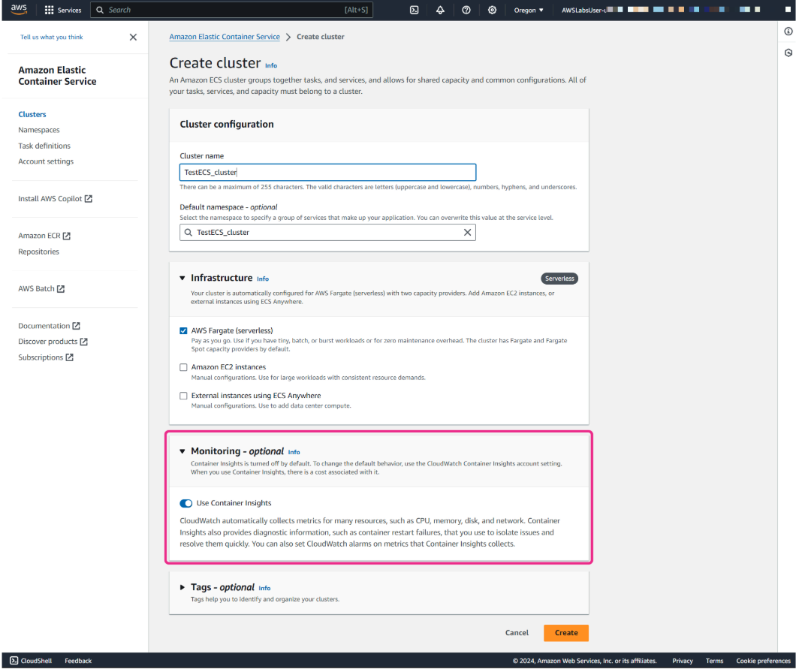
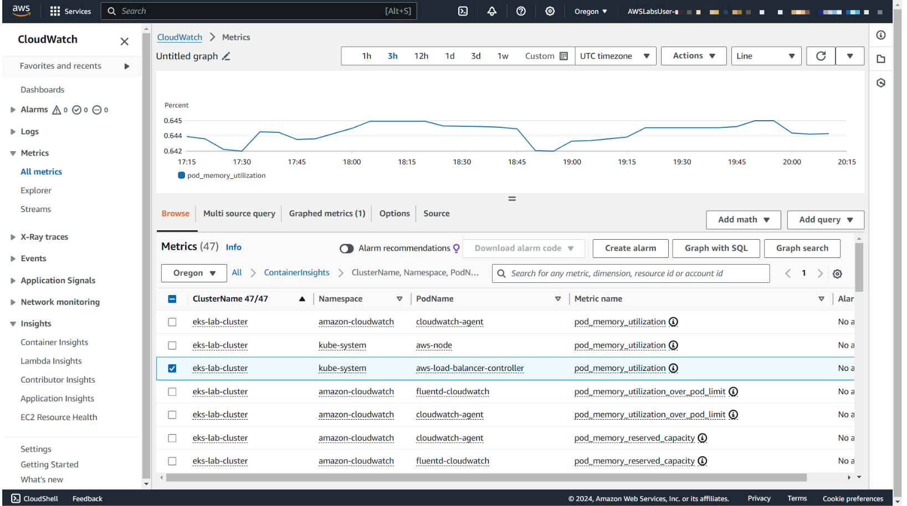
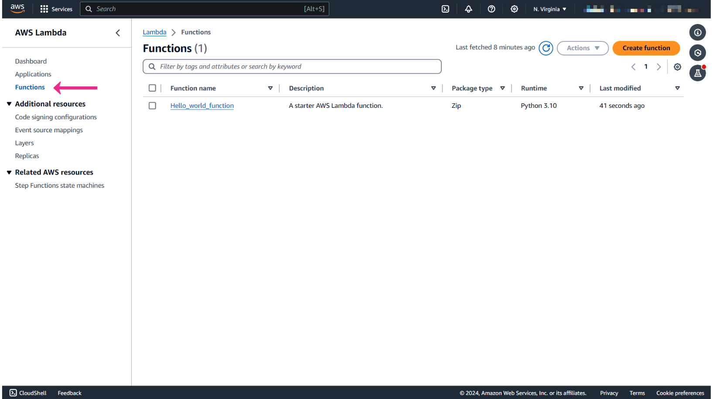
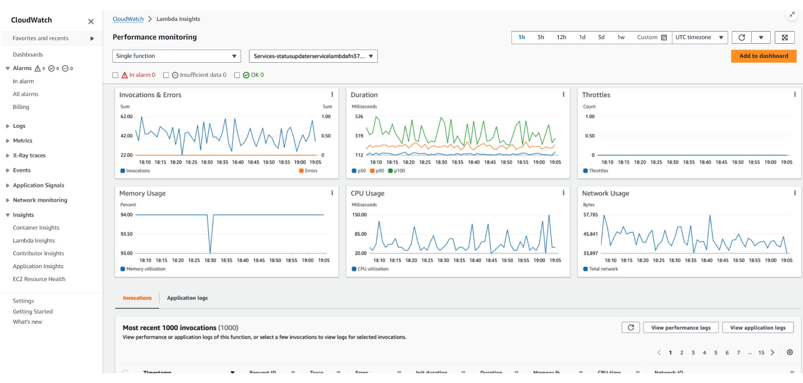

# Week 9: Monitoring and Troubleshooting: Metrics and Network Monitoring and Troubleshooting

* back to AWS Cloud Institute repo's root [aci.md](../aci.md)
* back to [AWS Cloud Operations 2](./aws-cloud-operations-2.md)
* back to repo's main [README.md](../../../README.md)

## Metric Monitoring

### Pre-assessment

#### What is a namespace in Amazon CloudWatch?

* A container for organizing metrics

Wrong answers:

* A unique identifier for an AWS Region
* A measurement unit for custom metrics
* A timestamp for metric data

##### Explanation

A namespace is a container for organizing metrics within CloudWatch. Metrics in different namespaces are isolated from each other, so that metrics from different applications are not mistakenly aggregated into the same statistics.

The other options are incorrect because of the following:

* A namespace is not specific to a Region but is rather a logical grouping of metrics that is globally unique across all Regions and services within an AWS account.
* A namespace is not related to measurement units but rather to metric categorization.
* A namespace is not a timestamp but rather a naming context.

#### How can custom metrics be published to Amazon CloudWatch?

* Through the AWS APIs or AWS CLI

Wrong answers:

* Only through the AWS Management Console
* Only through AWS CLI
* Only through direct database connection

##### Explanation

To send custom metrics, users must use the AWS APIs or AWS CLI instead of the AWS Management Console. Users can view statistical graphs of the published metrics with the AWS Management Console.

The other options are incorrect because of the following:

* AWS Management Console does not provide a direct method to publish custom metrics. The console is used primarily for viewing and managing existing metrics and alarms.
* Besides the AWS CLI, custom metrics can also be published using the AWS SDKs through application code, which interacts with the AWS APIs.
* CloudWatch does not support direct database connections for publishing metrics.

#### How does Amazon CloudWatch Metrics Insights help users understand their AWS resource usage? 

* By correlating and analyzing metric data

Wrong answers:

* By visualizing AWS CloudTrail logs
* By providing recommendations for cost optimization
* By automatically scaling Amazon EC2 instances

##### Explanation

CloudWatch Metrics Insights helps users understand their resource usage by correlating and analyzing metric data to identify trends and anomalies.

The other options are incorrect because of the following:

* CloudTrail logs are related to AWS API activity, not resource usage metrics.
* AWS Trusted Advisor is the tool that can be used for cost optimization.
* Automatically scaling of EC2 instances is typically done by Amazon EC2 Auto Scaling, not CloudWatch Metrics Insights.

### Custom Metrics

#### CloudWatch terminology and concepts

##### Namespaces

A namespace is a container for CloudWatch metrics. Metrics in different namespaces are isolated from each other, so that metrics from different applications are not mistakenly aggregated into the same statistics.

##### Metrics

A metric represents a time-ordered set of data points that are published to CloudWatch. For example, the CPU usage of a particular instance is one metric provided by Amazon Elastic Compute Cloud (Amazon EC2). The data points themselves can come from any application or business activity from which you collect data.

Metrics exist only in the Region in which they are created. Metrics cannot be deleted, but they automatically expire after 15 months if no new data is published to them.

##### Dimensions

A dimension is a name/value pair that is part of the identity of a metric. You can assign up to 30 dimensions to a metric. Dimensions provide additional context and specificity to metrics, and this helps you to categorize and filter data more effectively.

Dimensions are part of the unique identifier for a metric. This means that whenever you add a unique name/value pair to one of your metrics, you are creating a new variation of that metric.

##### Resolution

Each metric is one of the following:

* Standard resolution where your data has a granularity of 1 minute
* High resolution where your data has a granularity of 1 second

Metrics produced by Amazon Web Services (AWS) services are standard resolution by default. However, if you use a custom metric, you can define it as standard resolution or high resolution.

##### Statistics

Statistics in CloudWatch represent aggregated data from metrics over defined time intervals. CloudWatch generates statistics based on metric data points provided by your custom data or by other AWS services. These aggregations consider factors such as namespaces, metric names, dimensions, and the data point unit of measures, all within the time period that you specify.

##### Percentiles

A percentile indicates the relative standing of a value in a dataset. For example, the 95th percentile means that 95 percent of the data is lower than this value and 5 percent of the data is higher than this value.

Percentiles help you get a better understanding of the distribution of your metric data and percentiles are often used to isolate anomalies.

##### Alarms

You can use an alarm to automatically initiate actions on your behalf. An alarm watches a single metric over a specified time period, and performs one or more specified actions, based on the value of the metric relative to a threshold over time.

Alarms invoke actions for sustained state changes only. CloudWatch alarms do not invoke actions simply because they are in a particular state. The state must have changed and been maintained for a specified number of periods.

A custom metric is a user-defined data point that you can use to monitor and collect specific performance metrics from your own applications or services. This is especially useful when you need to monitor or analyze aspects of your applications that are not covered by the standard metrics.

#### Custom metrics use cases

##### Application performance monitoring

You can track custom application metrics such as response time, error rates, or specific application-level performance indicators.

For example, a company running a popular ecommerce platform might use application performance monitoring to track the response time and error rates of their checkout process. By monitoring these metrics, the company can identify and resolve issues that could lead to cart abandonment or poor user experience, ensuring smooth and efficient transactions for their customers.

##### Business key performance indicator (KPI) monitoring

You can monitor business-specific metrics such as user sign-ups, orders processed, or any other key performance indicators.

##### User engagement metrics

You can track user engagement metrics for applications or services, such as active users, session durations, or specific user interactions.

#### High-resolution metrics

Metrics produced by AWS services are standard resolution by default. However, if you use a custom metric, you can define it as standard resolution or high resolution.

High-resolution metrics gives you the ability to collect and store data at a higher granularity, with resolution as low as 1-second intervals. This is particularly useful for monitoring applications and systems where immediate detection of anomalies or performance fluctuations is crucial. This could include monitoring the response time of your web application to ensure that it meets service-level agreements (SLAs). For example, you monitor the latency of an API endpoint every second to quickly identify spikes or performance degradation.

When you publish a high-resolution metric, CloudWatch stores it with a resolution of 1 second, and you can read and retrieve it with a period of 1 second, 5 seconds, 10 seconds, 30 seconds, or any multiple of 60 seconds.

With high-resolution metrics, you detect and respond to changes or anomalies more quickly. This leads to improved visibility and operational efficiency. However, it's important to remember that high-resolution metrics come with additional costs. So you should make sure to consider your monitoring requirements and budget constraints when you use high-resolution metrics.

#### Metric retention

CloudWatch retains metrics data as follows:

* Data points with a period of fewer than 60 seconds are available for 3 hours.
* Data points with a period of 1 minute are available for 15 days.
* Data points with a period of 5 minutes are available for 63 days.
* Data points with a period of 1 hour are available for 455 days (15 months).

**Data points that are initially published within a shorter period are aggregated together for long-term storage. For example, if you collect data using a period of 1 minute, the data remains available for 15 days with a 1-minute resolution. After 15 days, the data is still available, but it is aggregated and only retrievable with a resolution of 5 minutes. After 63 days, the data is further aggregated and available with a resolution of 1 hour.**

#### Using dimensions

Let's look at the following scenario. Imagine a company that operates a fleet of delivery vehicles. The company wants to monitor the fuel consumption of each vehicle to optimize fuel usage and maintenance schedules. What can they do to achieve this? They can use CloudWatch custom metrics with dimensions to track fuel consumption per vehicle.

In custom metrics, the **--dimensions** parameter is common. A dimension further clarifies what the metric is and what data it stores. You can have up to 30 dimensions assigned to one metric, and each dimension is defined by a name and value pair.

Dimensions are crucial in custom metrics. When you publish custom metrics, you can include dimensions to provide additional context to the data being collected. AWS services that send data to CloudWatch attach dimensions to each metric. You can use dimensions to filter the results that CloudWatch returns.

For example, in the fuel-consumption-per-vehicle scenario, you might have the following setup:

* Metric name: FuelConsumption
* Namespace: DeliveryFleet
* VehicleID: A unique identifier for each vehicle such as license plate number (this is the dimension parameter)
* FuelType: The type of fuel used by the vehicle, such as gasoline or diesel (this is another dimension parameter)

With this setup, the company can analyze fuel consumption trends for each vehicle by **VehicleID** and compare fuel consumption between different fuel types by **FuelType**. This information can help the company make informed decisions about refueling schedules, maintenance, and fleet management.

How you specify a dimension is different when you use different commands. Let's look at a different example. This example command publishes a **Buffers** metric with two dimensions named **InstanceId** and **InstanceType**.

With **put-metric-data**, you specify each dimension as **MyDimensionName=MyDimensionValue**. If you have multiple dimensions, you separate them with commas.

```shell
aws cloudwatch put-metric-data --metric-name Buffers --namespace MyNameSpace --unit Bytes --value 231434333 --dimensions InstanceId=1-23456789,InstanceType=m1.small
```

With **get-metric-statistics** or **put-metric-alarm** commands, you use the format **Name=MyDimensionName,Value=MyDimensionValue**.

This following command retrieves statistics for that same metric. This command separates the Name and Value parts of a single dimension with commas. If you have multiple dimensions, you can use a space between one dimension and the next.

```shell
aws cloudwatch get-metric-statistics --metric-name Buffers --namespace MyNameSpace --dimensions Name=InstanceId,Value=1-23456789 Name=InstanceType,Value=m1.small --start-time 2024-04-15T04:00:00Z --end-time 2024-04-19T07:00:00Z --statistics Average --period 60
```

#### Publishing custom metrics

You can use the AWS Command Line Interface (AWS CLI) or an API to publish your own metrics to CloudWatch. And then, you can view statistical graphs of your published metrics with the AWS Management Console.

You can use the **put-metric-data** command to publish your custom metrics. The following examples use the **put-metric-data** command with one value and time stamp to publish a single data point for a new or existing metric. This means that if you call the **put-metric-data** command with a new metric name, CloudWatch will create a metric for you. Otherwise, CloudWatch associates your data with the existing metric that you specified. Each command line publishes one data point.

```shell
aws cloudwatch put-metric-data --metric-name PageViewCount --namespace MyService --value 2 --timestamp 2024-04-20T12:00:00.000Z

aws cloudwatch put-metric-data --metric-name PageViewCount --namespace MyService --value 4 --timestamp 2024-04-20T12:00:01.000Z

aws cloudwatch put-metric-data --metric-name PageViewCount --namespace MyService --value 5 --timestamp 2024-04-20T12:00:02.000Z
```

After you publish those data points, you can use the **get-metric-statistics** command to retrieve statistics. For example, if you want to retrieve statistics with start time 2024-04-20T12:00:00.000Z and end time 2024-04-20T12:05:00.000Z, you will use the following command.

```shell
aws cloudwatch get-metric-statistics --namespace MyService --metric-name PageViewCount \
--statistics "Sum" "Maximum" "Minimum" "Average" "SampleCount" \
--start-time 2024-04-20T12:00:00.000Z --end-time 2024-04-20T12:05:00.000Z --period 60
```

And then you will get the following example result:

```json
{
    "Datapoints": [
        {
            "SampleCount": 3.0, 
            "Timestamp": "2024-10-20T12:00:00Z", 

            "Average": 3.6666666666666665, 
            "Maximum": 5.0, 
            "Minimum": 2.0, 
            "Sum": 11.0, 
            "Unit": "None"
        }
    ], 
    "Label": "PageViewCount"
}
```

##### Publishing the value zero

When your data is less consistent and there are intervals without associated data points, you have two options for publishing: either include the value zero (0) for that period or no value at all.

If you use periodic calls to **PutMetricData** for application health monitoring, it can be beneficial to publish zeros instead of no value. For example, you might set up a CloudWatch alarm to notify you if your application fails to publish metrics every 5 minutes. In such cases, it's beneficial for such applications to publish zeros for intervals without associated data.

Imagine you have an application that periodically sends metrics to CloudWatch to monitor its health. It sends a metric every 5 minutes to indicate that it's running smoothly. Due to temporary network issues, the application stops sending metrics, and CloudWatch might interpret this as a problem with the application. However, if the application sends a metric with a value of zero instead, CloudWatch understands that the application is still running but there's just no new data at the moment. This way, you can avoid false alarms and ensure that you're only alerted when there's a real issue with your application.

You might also choose to publish zeros if you want to track the total number of data points. Or you might publish zeros if you want statistics such as minimum and average to include data points with the value 0.

##### Stopping publishing metrics

To stop publishing custom metrics to CloudWatch, change your application's or service's code to stop using **PutMetricData**. CloudWatch doesn't pull metrics from applications, it only receives what is pushed to it. If you need to stop publishing your metrics, you must stop them at the source.

#### Custom metrics use case with Amazon EC2

By default, Amazon EC2 delivers a set of metrics related to your instance to CloudWatch in the AWS/EC2 namespace. This includes CPU utilization and a set of NetworkIn and NetworkOut metrics.

Say that you are monitoring an application running on Amazon EC2 instances. What happens if you want to track the memory utilization of these EC2 instances when memory utilization is not part of the default metrics?

To monitor memory utilization, you can use the CloudWatch agent to collect custom metrics from your EC2 instances. Here is an example of how you can use the CloudWatch agent to collect memory utilization information.

##### Install the CloudWatch agent on the EC2 instances

You can download and install the CloudWatch agent on Amazon EC2 instances. The CloudWatch agent is a software application that runs on EC2 instances and collects metrics, logs, and events from the instances.

**Note**: To use the CloudWatch agent, you need to create AWS Identity and Access Management (IAM) roles and users that activate the agent that collects metrics from the server. For more information, refer to [Create IAM Roles and Users for Use with CloudWatch Agent](https://docs.aws.amazon.com/AmazonCloudWatch/latest/monitoring/create-iam-roles-for-cloudwatch-agent-commandline.html).

##### Configure the CloudWatch agent

You can configure the CloudWatch agent to collect custom metrics. You can define a metrics specification to specify the name, unit, and dimensions of the metrics that you want to collect.

The following code example shows a basic agent configuration file that reports memory usage and disk usage metrics on a Windows system.

```json
{
    "metrics": {
        "metrics_collected": {
            "LogicalDisk": {
                "measurement": [
                    "% Free Space"
                 ],
                "resources": [
                    "*"
                 ]
            },
            "Memory": {
                "measurement": [
                    "% Committed Bytes In Use"
                 ]
            }
        },
        "append_dimensions": {
            "InstanceId": "${aws:InstanceId}"
        }
    }
}
```

##### Publish custom metrics

You then start the agent on the Amazon EC2 instances so that you can publish these custom metrics to CloudWatch.

For more information on starting the agent on the EC2 instance, refer to [Start the CloudWatch Agent Using the Command Line](https://docs.aws.amazon.com/AmazonCloudWatch/latest/monitoring/install-CloudWatch-Agent-commandline-fleet.html#start-CloudWatch-Agent-EC2-commands-fleet).

##### Monitor and analyze metrics

Finally, you can use the CloudWatch console to monitor and analyze the memory utilization metrics that you have published. By default, the active agent reports metrics from your instances to the **CWAgent** namespace within CloudWatch.

You can set alarms, visualize metrics using graphs and charts, and perform various operations on the metrics. This helps you to gain insights into the performance and usage of your applications.

### Data Aggregation

The purpose of data aggregation is to condense large amounts of raw data into more manageable and meaningful summaries. This aggregated data might provide different insights into trends, patterns, and anomalies. This makes it convenient for users to analyze and understand complex datasets. Data aggregation is commonly used for monitoring and managing AWS resources.

#### Statistics

Statistics are metric data aggregations over specified periods of time. When you graph or retrieve the statistics for a metric, you specify the period of time, such as 5 minutes, to use to calculate each statistical value. For example, if the **Period** is 5 minutes, the **Sum** is the sum of all sample values collected during the 5-minute period, and the **Minimum** is the lowest value collected during the 5-minute period.

CloudWatch supports the following statistics for metrics.

* **Sample Count** is the number of data points during the period.
* **Sum** is the sum of the values of the all data points collected during the period.
* **Average** is the value of **Sum** divided by **SampleCount** during the specified period.
* **Minimum** is the lowest value observed during the specified period.
* **Maximum** is the highest value observed during the specified period.
* **Percentile (p)** indicates the relative standing of a value in a dataset.
    For example, **p95** is the 95th percentile and means that 95 percent of the data within the period is lower than the value and 5 percent of the data is higher than this value. Percentiles help you get a better understanding of the distribution of your metric data.
* **Trimmed mean (TM)** is the mean of all values that are between two specified boundaries. Values outside of the boundaries are ignored when the mean is calculated. You define the boundaries as one or two numbers between 0 and 100, up to 10 decimal places. The numbers can be absolute values or percentages.
    For example, **tm98** calculates the average after removing the 10% of data points with the highest values. **TM(2%:98%)** calculates the average after removing the 2% lowest data points and the 2% highest data points. **TM(150:1000)** calculates the average after removing all data points that are lower than or equal to 150, or higher than 1000.
* **Interquartile mean (IQM)** is the trimmed mean of the interquartile range, or the middle 50% of values. It is equivalent to **TM(25%:75%)**.
* **Winsorized mean (VM)** is similar to trimmed mean. However, with winsorized mean, the values that are outside the boundary are not ignored. They are considered to be equal to the value at the edge of the appropriate boundary. After this normalization, the average is calculated. You define the boundaries as one or two numbers between 0 and 100, up to 10 decimal places.
    For example, **wm98** calculates the average while treating the 2% of the highest values to be equal to the value at the 98th percentile. WM is important because it reduces the impact of outliers on the calculated mean, providing a more robust measure of central tendency in datasets with extreme values.
* **Percentile rank (PR)** is the percentage of values that meet a fixed threshold.
    For example, **PR(:300)** returns the percentage of data points that have a value of 300 or less. **PR(100:2000)** returns the percentage of data points that have a value between 100 and 2000. **Percentile tank** is exclusive on the lower bound and inclusive on the upper bound.
* **Trimmed count (TC)** is the number of data points in the chosen range for a trimmed mean statistic.
    For example, **tc90** returns the number of data points not including any data points that fall in the highest 10% of the values. **TC(0.005:0.030)** returns the number of data points with values between 0.005 (exclusive) and 0.030 (inclusive).
* **Trimmed sum (TS)** is the sum of the values of data points in a chosen range for a trimmed mean statistic. It is equivalent to (Trimmed mean) * (Trimmed count).
    For example, **ts90** returns the sum of the data points not including any data points that fall in the highest 10% of the values. **TS(80%)** returns the sum of the data point values, not including any data points with values in the lowest 80% of the range of values.

#### Statistics use cases

##### Trimmed mean (TM)

**Trimmed mean (TM)** is most useful for metrics with a large sample size, such as webpage latency. For example, **tm99** disregards extreme high outliers that could result from network problems or human errors, to give a more accurate number for the average latency of typical requests.

Similarly, **TM(10%:)** disregards the lowest 10% of latency values, such as those resulting from cache hits. And **TM(10%:99%)** excludes both of these types of outliers. It's recommended to use trimmed mean for monitoring latency.

##### Trimmed count (TC)

t's a good idea to keep watch on trimmed count (TC) whenever you are using trimmed mean. This is to ensure that the number of values being used in your trimmed mean calculations are enough to be statistically significant.

##### Percentile rank (PR)

You can use **percentile rank (PR)** to put values into *bins* of ranges, and you can use this to manually create a histogram. To do this, break your values down into various bins, such as **PR(:1)**, **PR(1:5)**, **PR(5:10)**, and **PR(10:)**. Put each of these bins into a visualization as bar charts, and you have a histogram.

Percentile rank is exclusive on the lower bound and inclusive on the upper bound.

#### Getting statistics for a specific resource

In the following example, let's take a look how you can determine the minimum CPU utilization of a specific EC2 instance.

##### Step 1


Open the **CloudWatch** console.

##### Step 2


In the navigation pane, choose **All metrics**.

##### Step 3


On the **Browse** tab, choose the **EC2 namespace**.

##### Step 4


Then choose the dimension named **Pre-Instance Metrics**.

##### Step 5


In the search field, you can use **CPUUtilization** as the keyword, and press Enter.

##### Step 6


Then select the row for the specific instance, which displays a graph for the **CPUUtilization** metric for the instance.

If you want to change the name of the graph, choose the pencil icon.

You can also change the time range that is used for the graph.

##### Step 7


To change the statistic, choose the **Graphed metrics** tab.

In the **Statistic** column, choose the dropdown menu and then choose one of the statistics or predefined percentiles.

To change the period, in the **Period** column, choose the dropdown menu and then choose a different value.

#### Publishing statistic sets

You can aggregate your data before you publish to CloudWatch. When you have multiple data points per minute, aggregating data minimizes the number of calls to **put-metric-data**. For example, instead of calling **put-metric-data** multiple times for three data points that are within 3 seconds of each other, you can aggregate the data into a statistic set that you publish with one call, using the **--statistic-values** parameter. You would use the following command.

```shell
aws cloudwatch put-metric-data --metric-name PageViewCount --namespace MyService --statistic-values Sum=11,Minimum=2,Maximum=5,SampleCount=3 --timestamp 2024-04-14T12:00:00.000Z
```

CloudWatch requires raw data points to calculate percentiles. If you publish data using a statistic set instead, you can't retrieve percentile statistics for this data unless one of the following conditions is true:

* The **SampleCount** of the statistic set is 1.
* The **Minimum** and the **Maximum** of the statistic set are equal.

Minimizing the number of API calls can help in managing costs, improving performance, and simplifying the process of sending data to CloudWatch, especially when dealing with large volumes of data.

### Cross-Account Cross-Region Monitoring

#### Purpose of cross-account cross-Region monitoring

Cross-account monitoring and cross-Region monitoring in Amazon CloudWatch help provide organizations with comprehensive oversight and management capabilities within the AWS Cloud.

Organizations often deploy applications and services across multiple AWS accounts and Regions for different reasons, such as increasing scalability, security, and resilience. However, managing and monitoring these distributed resources can be challenging.

Organizations can use features of cross-account and cross-Region monitoring to aggregate metrics, set alarms, and implement automated responses from a single and centralized CloudWatch dashboard.

By configuring cross-account access permissions, administrators can grant CloudWatch access to resources across multiple AWS accounts. This facilitates unified monitoring and management. Similarly, with cross-Region monitoring capabilities, organizations can monitor resources deployed in different AWS Regions without the need to switch between Region-specific consoles.

The goal of cross-account and cross-Region monitoring is to enhance visibility, control, and operational efficiency. Organizations are encouraged to gain insights into the health, performance, and utilization of their resources, regardless of where these resources are located or who owns them.

This centralized monitoring approach streamlines capacity planning, troubleshooting, and performance optimization efforts. It also ensures compliance, security, and governance requirements across the organization’s AWS infrastructure.

Overall, cross-account and cross-Region monitoring is one of the keys to achieving operational excellence, scalability, and resilience for your resources in the AWS Cloud.

#### Cross-Region functionality

Cross-Region functionality is now built in automatically. You don't need to take any extra steps to display metrics from different Regions in a single account on the same graph or the same dashboard. However, cross-Region functionality is not supported for alarms, so you can't create an alarm in one Region that watches a metric in a different Region.

#### Using cross-account functionality in CloudWatch

Before you can use cross-account functionality in CloudWatch, you need to set up your sharing accounts and monitoring accounts.

##### Sharing account

When you set up a sharing account in CloudWatch, you are essentially granting another AWS account access to view metrics and logs from your resources.

##### Monitoring account

When you set up a monitoring account in CloudWatch, you are configuring your AWS account to access and view metrics and logs from another AWS account.

#### IAM roles

IAM roles are necessary to grant permissions for cross-account monitoring. Each sharing account should have a role named **CloudWatch-CrossAccountSharingRole**. Your monitoring account should also have an IAM role, and this service-linked role is called **AWSServiceRoleForCloudWatchCrossAccount**.

If you don't have these IAM roles, you need to create them, otherwise you would get access denied errors when you display cross-account data. The following steps show you how to set up a sharing account and a monitoring account. After these steps, the IAM roles will be created.

##### Setting up a sharing account

You must enable sharing in each account that will make data available to the monitoring account. Completing the following procedure creates an IAM role (**CloudWatch-CrossAccountSharingRole**) which enables your account to share data with one account.

###### Step 1


Open the CloudWatch console at [https://console.aws.amazon.com/cloudwatch/](https://console.aws.amazon.com/cloudwatch/).

In the navigation pane, choose **Settings**.

###### Step 2


In the **Share your CloudWatch data section**, choose **Configure**.

###### Step 3


For **Sharing**, choose **Specific accounts**, and enter the IDs of the accounts that you want to share data with.

Any accounts that you specify here can view your account's CloudWatch data. You should only specify the IDs that you know and trust.

###### Step 4


For **Permissions**, specify how to share your data with one of the following options:

* **Provide read-only access to your CloudWatch metrics, dashboards, log widgets and alarms**. This option enables the monitoring accounts to create cross-account dashboards that include widgets that contain CloudWatch data from your account.
* **Include CloudWatch automatic dashboards**. If you select this option, users in the monitoring account can also view the information in this account's automatic dashboards.
* **Include X-Ray read-only access for ServiceLens**. If you select this option, users in the monitoring account can also view the X-Ray trace map and X-Ray trace information in this account. (Note that **ServiceLens** has been replaced by the **X-Ray Trace Map**. However, you might still see **ServiceLens** in the console UI.)
* **Full read-only access to everything in your account**. This option enables the accounts that you use for sharing to create cross-account dashboards that include widgets that contain CloudWatch data from your account. It also enables those accounts to look deeper into your account and view your account's data in the consoles of other AWS services.

Then, choose **Launch CloudFormation template**.

###### Step 5


On the **Launch CloudFormation template** confirmation screen, type **Confirm**, and choose **Launch template**.

###### Step 6


You will be redirected to the AWS CloudFormation console. At the bottom of the **Quick create stack** page, for **Capabilities**, select the **I acknowledge...** check box, and choose **Create stack**.

This CloudFormation template contains AWS Identity and Access Management (IAM) resources.

###### Step 7


Go back to the CloudWatch console to complete the settings. After you have completed the template, the **CloudWatch-CrossAccountSharingRole** will be created.

Then choose **Done**.

##### Setting up a monitoring account

Enable each monitoring account if you want to view cross-account CloudWatch data.

When you complete the following procedure, CloudWatch creates a service-linked role that CloudWatch uses in the monitoring account to access data shared from your other accounts. This service-linked role is called **AWSServiceRoleForCloudWatchCrossAccount**.

###### Step 1


Open the CloudWatch console at [https://console.aws.amazon.com/cloudwatch/](https://console.aws.amazon.com/cloudwatch/).

In the navigation pane, choose **Settings**.

###### Step 2


In the **View cross-account cross-region** section, choose **Configure**.

###### Step 3


On the **View cross-account cross-region** page, select the **Show selector in the console** check box. This enables an account selector to appear in the CloudWatch console when you're graphing a metric or creating an alarm.

###### Step 4


In the **Enable account selector** section, choose one of the following options:

* **Account Id Input**. This option prompts you to manually input an account ID each time that you want to switch accounts when you view cross-account data.
* **AWS Organization account selector**. This option causes the accounts that you specified when you completed your cross-account integration with AWS Organizations to appear. Next time you use the console, CloudWatch displays a dropdown list of these accounts for you to select from when you are viewing cross-account data.
To do this, you must have first used your organization management account to allow CloudWatch to see a list of accounts in your organization.
* **Custom account selector**. This option prompts you to enter a list of account IDs. When you next use the console, CloudWatch displays a dropdown list of these accounts for you to select from when you are viewing cross-account data.

You can also enter a label for each of these accounts to help you identify them when choosing accounts to view.

The account selector settings that a user makes here are retained only for that user, not for all other users in the monitoring account.

Then choose **Enable**.

#### Cross-account observability in CloudWatch

With enabling cross-account observability in Amazon CloudWatch, you can set up a centralized monitoring account in CloudWatch, link multiple source accounts to it, and then browse cross-account data with the monitoring account.

##### Configuring centralized monitoring account

Let's configure its settings. This configuration will be available for source accounts in the specified AWS Region, which is US East, North Virginia. Let's retain the default settings for the types of telemetry data we want this account to monitor. Next, we'll list the specific source accounts we want to monitor. Let's paste in an organization path and an account ID. Here, we can define a label to identify our source account within the monitoring account. We'll retain the default label and use the account name.

##### Linking source accounts to this monitoring account demo

We have two options for linking source accounts. AWS Organization, the recommended option, automatically onboards new accounts as they're added to the organization. The Any Account option lets us link individual source accounts. 

1. Linking using AWS Organization. Let's download the CloudFormation template. Next, we'll log in with the CloudFormation delegated admin account, and navigate to AWS CloudFormation, where we'll create a StackSet with this template. We'll give the StackSet a name, and proceed to the next step. We'll retain the default StackSet options. For our purposes, we'll deploy the StackSet to the US East, North Virginia Region. Let's review our settings and create the StackSet. Once the StackSet finishes launching, we'll be able to sign into CloudWatch with our monitoring account to browse through our cross-account telemetry data.
2. Linking individual accounts outside our AWS Organization. We can download a template as before, or copy a link and share it to our accounts manually. In this case, we'll use the link. Let's copy the URL and navigate to it from within the source account whose ID we entered during the configuration process. Now that we are logged in with our source account, let's review and confirm the settings. We'll confirm the linking of the accounts.

##### Disconnecting a source account

Because we added this source account manually, we can stop sharing data with this monitoring account in a few clicks. To disconnect source accounts that were linked using CloudFormation stacks or StackSets, we'd need to update the respective template or delete the stack. Let's return to the monitoring account settings.

##### Connecting a new source account manually

Now we'll see how to connect a new source account manually after we've already set up cross-account monitoring. Let's take a look at our configuration policy. Here, we can add principal accounts directly. We can also remove permissions from accounts to begin sharing with us. We can also add or delete accounts programmatically through CloudFormation, AWS SDKs, or the AWS CLI. For further information, please refer to our documentation. Let's go back to the CloudWatch homepage. Let's take a look at the service map. ServiceLens integrates traces, metrics, logs, alarms, and other resource health information into one place to offer a 360-degree view of your cross-account applications, health, and performance. We can filter the view to see one or more of our linked accounts.

After connecting a source account we can navigate CloudWatch data in the monitoring account like within the account, for example:

* lambda function information, which is associated with the source account
* the function's metrics, as well as any alerts
* a cross-account dashboard or cross-account alarms from cross-account metrics
* with the service map, we can filter the metrics by a specific account
* view our CloudWatch logs
* we can use cross-account monitoring to generate insights for multiple accounts
* we can use Contributor Insights as we would for an individual account

Learn more at [CloudWatch Cross-Account Observability](https://docs.aws.amazon.com/AmazonCloudWatch/latest/monitoring/CloudWatch-Unified-Cross-Account.html).

### Amazon CloudWatch Anomaly Detection

CloudWatch anomaly detection automatically detects unusual behavior in your metrics by analyzing historical data patterns.

When you activate anomaly detection for a metric, CloudWatch applies statistical and machine-learning algorithms. And this helps identify deviations from expected values so that you can proactively respond to potential issues or anomalies in your system.

CloudWatch algorithms perform the following functions:

* Analyze system and application metrics continuously
* Determine normal baselines
* Reveal anomalies with minimal user intervention
* Account for seasonality and trend changes in metrics

The algorithms generate an anomaly detection model. The model generates a range of expected values that represent normal metric behavior. You can use the model of expected values in two ways.

#### Creating alarms for a metric's expected value

You can create anomaly detection alarms based on a metric's expected value. These types of alarms don't have a static threshold for determining the alarm state. Instead, they compare the metric's value to the expected value based on the anomaly detection model.

For example, let's say you have a metric that tracks the number of website visits per minute. Instead of setting a static threshold for the number of visits (for example, 100 visits) to invoke an alarm, you can create an anomaly detection alarm. This alarm compares the current number of visits to the expected number based on historical data.

If the current number of visits deviates significantly from the expected value, the alarm will be invoked, alerting you to a potential anomaly in the website traffic.

#### Viewing metrics as a graph

When viewing a graph of metric data, the model overlays the expected values onto the chart as a band. This makes it visually clear which values in the graph are out of the normal range.

The following graph is an example.


#### Notes when using anomaly detection

1. The anomaly detection model created by CloudWatch compares metrics to past data. The model assesses trends and patterns of the metric and can train on up to 2 weeks of data.
2. After CloudWatch creates a model, anomaly detection continually evaluates it and makes adjustments to ensure accuracy.

    This includes retraining the model to adjust if metric values evolve or encounter sudden changes. Over time, the algorithms can also include predictors to improve models for seasonal or sparse metrics.

3. Without anomaly detection, you need to specify static thresholds for your metrics to create alarms.

    Static thresholds can make it difficult to reveal issues, especially if your metrics are seasonal, spike, or bottom out.

4. You can have long-term trends that grow or shrink. You will need to continuously adjust your thresholds if you have a growing business and use static thresholds to track metrics.

    Anomaly detection can consider this trend, eliminating the need to make adjustments.

5. Anomaly detection is useful when you cannot determine baselines for your metrics in advance.

For example, even if you are unsure what to expect from a metric, anomaly detection can analyze patterns over time and provide the necessary data.

#### Creating a CloudWatch alarm based on anomaly detection demo

You have the option to create an alarm based on CloudWatch anomaly detection, which evaluates historical metric data to establish a model of expected values. The expected values take into account the typical hourly, daily, and weekly patterns in the metric.

You set a value for the anomaly detection threshold, and CloudWatch uses this threshold with the model to determine the normal range of values for the metric. A higher value for the threshold produces a thicker band of normal values.

Then you can choose whether the alarm is invoked when the metric value is above the band of expected values, below the band, or either above or below the band.

In this demonstration, we will look at anomaly detection and Amazon CloudWatch alarms. We can use CloudWatch alarms to alert on anomalous behavior using anomaly detection.

1. Navigate to the CloudWatch console.
2. Choose **All metrics** and open the **Browse** tab.
3. Choose **DynamoDB**, and then **Table Operation Metrics**. Now, we want to see how many items are returned from our database over time. For **Metric** name, choose **ReturnedItemCount**. It is potentially useful for us to know if there are fewer or more items being returned than expected. However, this kind of metric can be difficult to predict or might change due to the time of day, day of the week, or time of the year. This is where anomaly detection can be useful.
4. Choose **Graphed metrics**.
5. We want to understand the total number of items returned in each time period. So, change the **Statistic** value to **Sum**. The anomaly detection band is added to the graphed metrics as **ReturnedItemCount (expected)**. Choose the edit icon. The number at the end represents the standard deviation from the mean (or the thickness of the gray band in the graph). Change this number to **4** because there are too many anomalies at the default configuration. Choose **Apply**, and you can see that the thickness of the band has increased.
6. Create an alarm. Choose the alarm icon. We can now see a preview of the last 3 hours. All the details about the metric are displayed. If you scroll down to the bottom of the screen, you can edit the conditions for invoking this alarm. We could set a **static threshold** at this point, but we will leave it using **anomaly detection**. We do care if this metric is **above or below** the expected value. Being above could indicate heavy utilization; being below could indicate that a problem is causing underutilization. Choose **Next**.
7. Configure actions. Possible options are:

    * configure a notification using an Amazon Simple Notification Service, or Amazon SNS
    * auto scaling actions
    * Amazon EC2 actions
    * Create an incident or OpsItem in AWS Systems Manager

    We could subscribe an AWS Lambda function or Systems Manager action to that topic. That way, we could create an automatic remediation. Or, we could integrate with other tools, such as sending an alert to an instant messaging service through a webhook.

    For now, choose **Next**.

8. Give the alarm a name. Choose **Next** to view the preview of what we are creating.
9. Choose **Create alarm**. The alarm will start off with a state of insufficient data until there are enough data points. To see more information about the alarm and its status, let’s choose **View alarm**.

### Alarms with Amazon CloudWatch Metrics Insights

#### CloudWatch Metrics Insights

CloudWatch Metrics Insights is an SQL-based query language that you can use to query your metrics at scale, and a single query can process up to 10,000 metrics. With this powerful tool, you can perform advanced queries and identify trends, anomalies, and correlations in metric data.

* [Build a Rich Query Step by Step](https://docs.aws.amazon.com/AmazonCloudWatch/latest/monitoring/cloudwatch-metrics-insights-querylanguage.html#cloudwatch-metrics-insights-syntaxexample)

CloudWatch Metrics Insights comes with standard SQL language, but you can also get started with CloudWatch Metrics Insights by using the query builder. Query builder helps you to build the query without knowing SQL. You can select metrics of interest, namespaces, and dimensions visually, and the console automatically constructs SQL queries based on selections.

You can also create alarms on CloudWatch Metrics Insights queries. The query catches new resources and resources that change. This helps you have alarms that track multiple resources without the need to update the alarms for the resources later.

For example, you can create an alarm that watches the CPU utilization of your fleet, and the alarm automatically evaluates new instances that you launch after creating the alarm.

The key difference between CloudWatch Metrics Insights alarms and regular CloudWatch metrics is the level of flexibility and automation that they provide.

##### Regular CloudWatch metrics

These are the basic monitoring metrics that you can collect on your AWS resources, such as CPU utilization and network traffic.

You typically create individual alarms for each specific metric that you want to monitor on a specific resource. If you add new resources, you'd have to create new alarms for those resources to monitor the same metrics.

##### CloudWatch Metrics Insights alarms

You can use CloudWatch Metrics Insights to create more complex and custom queries to monitor multiple metrics across multiple resources.

Instead of creating individual alarms for each resource, you can create a single alarm that monitors a group of resources based on your query.

As new resources are added that match your query criteria, the alarm will automatically start monitoring them without you having to update the alarm.

The key benefit is that CloudWatch Metrics Insights alarms are much more dynamic and adaptive to changes in your infrastructure. With regular CloudWatch metrics, you have to manually manage and update alarms as your environment evolves.

#### Creating a CloudWatch Metrics Insights alarm

Let's create an alarm with CloudWatch Metrics Insights in the CloudWatch console. The alarm will be invoked when average CPU utilization crosses the 20 percent threshold.

1. Open the CloudWatch console at [https://console.aws.amazon.com/cloudwatch/](https://console.aws.amazon.com/cloudwatch/).

    In the navigation pane, choose **Metrics > All metrics**.

    

2. Choose the **Multi source query** tab to display the CloudWatch Metrics Insights query builder.

    Specify the **Namespace** and **Metric name**. In this example, the namespace is **AWS/EC2 > Pre-Instance Metrics**, and the metric name is **AVG(CPUUtilization)**.

    Then choose **Graph query**.

    

3. You will see the graph plotted for average CPU utilization across all Amazon EC2 instances.

    Let's choose the **Graphed metrics** tab to review more settings and set up an alarm.

    

4. On the **Graphed metrics** tab, in the **Details** column, you can see the complete SQL query by choosing the edit math expression pen icon. The **Edit query** box is then displayed.

    

5. To create an alarm for this query, in the **Actions** column, choose the create alarm icon.

    

6. On the **Create alarm** page, in the **Metric** section, you can configure the **Period** for evaluation of metric and threshold value for the alarm.

    To set the threshold for the metric, go to the **Conditions** section and specify the requirements. The following conditions are used in this example:

    * **Threshold type**: Static
    * **Whenever Query 1 is Greater than 20**.

    

7. After you set the threshold for the metric, a red line shows up on the page representing the threshold with value **20**.

    Choose **Next**.

    

8. On the **Configure actions** page, you can add an SNS topic for notification when the alarm is in *ALARM* state, *OK* state, or *INSUFFICIENT_DATA* state. You can either use an existing SNS topic or create a new topic. To have the alarm send multiple notifications for the same alarm state or for different alarm states, choose **Add notification**. To have the alarm not send notifications, choose **Remove**.

    The following settings are used for this example:

    * **Alarm state trigger: In alarm**
    * **Send a notification to the following SNS topic: Select an existing SNS topic**
    * **Send a notification to: Default_CloudWatch_Alarms_Topic**

    Then choose **Next**.

    

9. On the **Add name and description** page, you can add a meaningful name and description for the alarm. The following settings are used for this example:

    * **Alarm name: Average CPU across fleet**
    * **Alarm description: This alarm monitors the average CPU utilization across entire EC2 fleet.**

    Then, choose **Next**.

    

10. Review the settings. After you are finished with the review, you can choose **Create alarm** to complete the alarm creation.

    

11. You will be redirected to the **CloudWatch > Alarms** page with the alarm that you just created. You will also see a message indicating that the alarm was successfully created.

    

#### Using AWS CLI to create an alarm on a CloudWatch Metrics Insights query

You can also use the **put-metric-alarm** command and specify a CloudWatch Metrics Insights query in the metrics parameter. For example, the following command sets an alarm that goes into *ALARM* state if any of your instances go above 50 percent in CPU utilization.

```shell
aws cloudwatch put-metric-alarm --alarm-name Metrics-Insights-alarm --evaluation-periods 1 --comparison-operator GreaterThanThreshold --metrics '[{"Id":"m1","Expression":"SELECT MAX(CPUUtilization) FROM SCHEMA(\"AWS/EC2\", InstanceId)", "Period":60}]' --threshold 50
```

### Activity: Exploring a Use Case Scenario with Amazon CloudWatch Custom Metrics

#### Background

You are a developer working on an ecommerce platform specializing in digital content delivery, such as ebooks and online courses. The ecommerce platform has experienced rapid growth over the past few years, with the user base increasing exponentially. In the past 3 months, the company has seen a spike in user complaints about slow download speeds for the ebooks and lagging video performance for the online courses. Customer service tickets related to performance issues have increased by 30 percent.

It's crucial to identify the key metrics that could be impacting the customer experience. These metrics could include content access latency, download rates, content viewing durations, and user engagement levels.

#### Gathering relevant metrics and data

As mentioned earlier, there are many metrics to consider, so knowing how to identify the root issue is key in resolving issues of this nature. The customers have complained about slow download speeds and lagging video playback. Using the troubleshooting methodology, the content latency could be the cause of the negative customer experience.

Content latency is an important metric to consider because it directly impacts user experience, making it a valuable first step in understanding the performance and efficiency of your system.

In this use case, let's focus on the content access latency metric. You can use the Amazon CloudWatch **PutMetricData** API to send your own custom metric data to CloudWatch.

##### Application-specific measurement

The content access latency metric for your application is a custom metric. It specifically measures the time taken from when a user requests to download content to when the content delivery actually begins within your application.

This isn't something CloudWatch tracks by default because it's specific to your application's logic and user interaction flow.

##### Business-relevant insights

For a digital content delivery application, the speed at which content is made available after a request is a key indicator of user satisfaction and service quality. High delays might indicate issues not just with network performance but potentially with how content is processed, stored, or retrieved in your application stack.

##### Fine-grained troubleshooting

By tracking the content latency metric, you can pinpoint issues specific to content delivery in your application, separate from broader network or server latency issues. This can help in specifically tuning application components affecting content access speed.

##### Customized alerting

With custom metrics, you can define tailored alarms in CloudWatch. For example, the latency exceeds a threshold that you determine, and it impacts user experience based on your business insights.

You can then set up alerts to notify your team to investigate and address the issue promptly.

#### Analyzing the metric

With the custom metric collected in CloudWatch, you can now analyze the data to identify any significant changes or anomalies.

* **Create a custom dashboard**. You can set up a CloudWatch dashboard to visualize the content access latency metric. This dashboard can show graphs of latency over time, to help you to quickly assess performance trends and identify periods of high latency.
* **Set alarms**. You can configure CloudWatch alarms on the content latency metric to automatically notify you of any performance degradations. For example, you can set an alarm to invoke if the average latency exceeds a certain threshold (for example, 5 seconds) over a specified period (for example, 15 minutes). This alarm can notify you through email, SMS, or other mechanisms through Amazon Simple Notification Service (Amazon SNS) when performance issues occur.

#### Isolating the problem areas

Based on the metric analysis in CloudWatch, you can start to identify the specific problem areas contributing to the poor customer experience.

The ability to filter the custom metrics by dimensions like content type, user segment, or geographical location can help you isolate the issues. For example, you might discover that certain types of content or Regions are experiencing higher latency or lower download rates compared to others.

#### Investigating the underlying causes

Now that you've isolated the problem areas, you can dive deeper to understand the root causes.

* **Anomaly detection** − You can use CloudWatch anomaly detection to automatically identify unusual patterns in your latency metric. Anomaly detection uses machine learning algorithms to create a model of your metric's normal behavior and then highlights anomalies.
* **Amazon CloudWatch Metrics Insights** − You can use CloudWatch Metrics Insights to run SQL-like queries on your metrics data. This can be used to perform more complex analysis, such as comparing latency across different ebooks or times of day.
* **Amazon CloudWatch Logs** − CloudWatch Logs can be invaluable in this step, because we can correlate the custom metric data with other performance logs and debugging information. You will learn more about using CloudWatch Logs in the later sections.

#### Implementing corrective actions

Based on the findings from the investigation, you can then implement the appropriate corrective actions to resolve the performance issues. CloudWatch alarms can help you monitor the effectiveness of the solutions, and alert you to any regressions or new problems that might arise.

By continuously collecting and monitoring the custom metrics, you can ensure that the corrective actions are having the desired impact on the customer experience.

#### Impacts

Implementing a custom metric to measure content access latency could have the following impacts on the business.

##### Improved customer experience

* By tracking content access latency, you can identify and address performance issues more effectively, leading to faster download speeds and smoother video playback.
* Improved performance can enhance the overall user experience, leading to increased customer satisfaction and reduced customer service tickets related to performance.
* Satisfied customers are more likely to continue using the platform, leading to higher customer retention and loyalty.

##### Optimized content delivery

* The latency data can help you identify slowdowns in the content delivery process, such as server performance, network issues, or content optimization problems.
* You can use this information to optimize the content delivery infrastructure, such as caching, content delivery networks (CDNs), or server scaling, to improve overall performance.
* Optimized content delivery can lead to faster download and streaming times, which can positively impact user engagement and satisfaction.

##### Informed business decisions

* The content access latency data can provide valuable insights into customer behavior and preferences.
* You can analyze the correlation between content access latency and other metrics, such as content consumption and engagement, to make more informed business decisions.
* This data can help you prioritize investments in infrastructure, content optimization, or other areas that can improve the overall user experience and business performance.

##### Competitive advantage

* In the digital content delivery market, fast and reliable performance can be a significant competitive advantage.
* By addressing performance issues and improving content access latency, you can differentiate your platform from competitors and potentially attract more customers.
* Maintaining a high-performing platform can also help you retain customers who might be sensitive to performance issues.

### Knowledge Check

#### What are dimensions used for in Amazon CloudWatch metrics?

* To provide additional information about the metric

Wrong answers:

* To define the time range for metric data
* To provide a container for organizing CloudWatch metrics
* To specify the retention period for metric data

##### Explanation

Dimensions are key-value pairs associated with metrics that provide additional information to identify or filter the metric’s data.

The other options are incorrect because of the following:

* Time range for metric data can be configured through the CloudWatch dashboard to display data per minutes, hours, days, or weeks.
* A namespace, not a not dimension, is a container for organizing metrics.
* The metric retention period is not controlled by dimensions. CloudWatch retains metric data as follows:
  * Data points with a period of less than 60 seconds are available for 3 hours. These data points are high-resolution custom metrics.
  * Data points with a period of 60 seconds (1 minute) are available for 15 days.
  * Data points with a period of 300 seconds (5 minutes) are available for 63 days.
 *Data points with a period of 3,600 seconds (1 hour) are available for 455 days (15 months).

#### What is required to set up Amazon CloudWatch for cross-account monitoring?

* AWS Identity and Access Management (IAM) roles with appropriate permissions

Wrong answers:

* AWS Lambda functions
* AWS Organizations
* Virtual private cloud (VPC) peering connections

##### Explanation

IAM roles are necessary to grant permissions for cross-account monitoring.

The other options are incorrect because of the following:

* Cross-account monitoring can be done without the need for Lambda functions.
* Cross-account monitoring can be set up between individual AWS accounts, even if they are not part of an organization.
* Cross-account IAM roles and permissions can be used to access the metrics and logs across accounts, without the need for VPC connectivity.

#### How are Amazon CloudWatch alarms invoked based on anomaly detection?

* Alarms are invoked when anomalies are detected by the machine learning models.

Wrong answers:

* Alarms are invoked based on a fixed threshold set by the user.
* Alarms are invoked at regular intervals set by Amazon EventBridge.
* Alarms are invoked based on the average metric value over time.

##### Explanation

When users enable anomaly detection for a metric, CloudWatch applies statistical and machine learning algorithms. These algorithms continuously analyze metrics of systems and applications, determine normal baselines, and reveal anomalies with minimal user intervention.

The other options are incorrect because in anomaly detection, alarms are not based on fixed thresholds such as average metric values. Alarms are not invoked based on regular intervals, but on the detection of anomalies by machine learning models.

### Summary

#### Custom metrics

A custom metric is a user-defined data point that you can use to monitor and collect specific performance metrics from your own applications or services. When you use a custom metric, you can define it as standard resolution or high resolution. High-resolution metrics give you the ability to collect and store data at a higher granularity, with resolution as low as 1-second intervals.

In custom metrics, using the **--dimensions** parameter is common. A dimension further clarifies what the metric is and what data it stores. You can have up to 30 dimensions assigned to one metric, and each dimension is defined by a name and value pair.

When you are ready to publish your custom metrics, you can use the AWS CLI (for example, the **put-metric-data** command) or an API to publish these metrics to Amazon CloudWatch. And then you can view statistical graphs of your published metrics with the AWS Management Console.

#### Data aggregation

Data aggregation is commonly used for monitoring and managing AWS resources. Statistics (one of the CloudWatch concepts) are metric data aggregations over specified periods of time. When you graph or retrieve the statistics for a metric, you specify the period of time to use to calculate each statistical value.

#### Cross-account cross-Region monitoring

The ability to show metrics from multiple geographic areas in one account on the same graph or dashboard is now included by default. You do not need to take any additional actions to enable this cross-geographic area feature. However, creating alarms that monitor a metric in one geographic location from another geographic location is not possible.

For cross-account monitoring, each sharing account should have a role named **CloudWatch-CrossAccountSharingRole**. Your monitoring account should also have an IAM role, and this service-linked role is called **AWSServiceRoleForCloudWatchCrossAccount**. If you don't have these IAM roles, you need to create them, otherwise you would get access denied errors when you display cross-account data.

##### CloudWatch anomaly detection

CloudWatch anomaly detection uses statistical and machine-learning algorithms to generate an anomaly detection model. You can use the model of expected values in two ways:

* You can create anomaly detection alarms based on a metric's expected value.
* When you view a graph of metric data, the model overlays the expected values onto the chart as a band. This makes it visually clear which values in the graph are out of the normal range.

#### Alarms with CloudWatch Metrics Insights

CloudWatch Metrics Insights is an SQL-based query language that you can use to perform advanced queries and identify trends, anomalies, and correlations in metric data. You can create alarms on CloudWatch Metrics Insights queries. The query catches new resources and resources that change. This helps you have alarms that track multiple resources without the need to update the alarms for the resources later.

The following steps are the general process of creating alarms with CloudWatch Metrics Insights:

1. In the CloudWatch console, under **All metrics**, use the **Multi source query** tab and create a query for your resource.
2. Switch to the **Graphed metrics** tab. Then, in the **Actions** column, choose the create alarm icon.
3. On the **Create alarms page**, specify metric and conditions and choose a threshold for the alarm.
4. Then choose an alarm action. You can choose from a variety of actions, such as sending an email or invoking an AWS Lambda function.
5. Provide a description for the alarm and choose a name for the alarm.
6. Review the settings and create an alarm.

## Insights and Network Monitoring

### Pre-assessment

#### Which AWS offering can developers use to gain visibility into how internet issues impact the performance and availability between their applications hosted on AWS and their end users?

* Amazon CloudWatch Internet Monitor

Wrong answers:

* Amazon CloudFront
* Amazon VPC
* AWS Transit Gateway

##### Explanation

Internet Monitor uses the connectivity data that AWS captures from its global networking footprint to calculate a baseline of performance and availability for internet-facing traffic. Developers can see a global view of traffic patterns and health events, and easily drill down into information about events. Developers can also get alerts for internet health events that affect your application clients.

The other options are incorrect because of the following:

* Amazon CloudFront speeds up the distribution of static and dynamic web content, such as .html, .css, .js, and image files, to the end users.
With Amazon VPC, developers can launch AWS resources in a logically isolated virtual network that they’ve defined. * A VPC is a virtual network dedicated to developers’ AWS accounts. It is logically isolated from other virtual networks in the AWS Cloud. Developers can launch AWS resources, such as Amazon EC2 instances, into their VPC.
* A transit gateway is a network transit hub that developers can use to interconnect their virtual private clouds (VPCs) and on-premises networks.

#### What can Amazon CloudWatch Lambda Insight help developers optimize for better efficiency and cost-effectiveness?

* Serverless application architecture

Wrong answers:

* Container resource allocation
* Virtual machine configuration
* On-premises network bandwidth

##### Explanation

CloudWatch Lambda Insights is a monitoring and troubleshooting solution for serverless applications running on AWS Lambda. The solution collects, aggregates, and summarizes system-level metrics including CPU time, memory, disk, and network. It also collects, aggregates, and summarizes diagnostic information to help developers isolate issues within their Lambda functions.

The other options are incorrect because of the following:

* Developers can use CloudWatch Container Insights to collect, aggregate, and summarize metrics and logs from the containerized applications and microservices.
* Developers can optimize virtual machine configurations by using Amazon EC2 instance types, sizes, and configurations.
* AWS Direct Connect is a service that establishes a dedicated network connection between an on-premises data center and AWS. Although it’s not specifically for optimizing network bandwidth, it can indirectly impact network performance.

#### An operations team wants to gain insights into the performance and resource utilization of their containerized application running on Amazon Elastic Container Service (Amazon ECS). Which AWS offering can they use to achieve this goal?

* Amazon CloudWatch Container Insights

Wrong answers:

* Amazon EventBridge
* Amazon CloudWatch alarms
* AWS CloudTrail

##### Explanation

CloudWatch Container Insights is used to collect, aggregate, and summarize metrics and logs from the containerized applications and microservices.

The other options are incorrect because of the following:

* EventBridge is a serverless service that uses events to connect application components together and can deliver a near real-time stream of events that describe changes in AWS resources. It doesn’t provide detailed insights into container performance and resource utilization.
* CloudWatch alarms is a feature where users can set thresholds on CloudWatch metrics and receive notifications when thresholds are exceeded. It doesn’t provide detailed insights into container performance and resource utilization.
* CloudTrail records API calls and related events made within an AWS account and provides visibility into user activity and resource changes. It doesn’t directly provide insights into the performance and resource utilization of containerized applications running on Amazon ECS.

### [AWS SimuLearn: Monitor and Analyze Network Traffic](./labs/W090SimuLearn1MonitorAnalyzeNetworkData.md)

In this AWS SimuLearn assignment, you will review a real-world scenario helping a fictional customer design a solution on AWS. After the design is complete, you will build the proposed solution in a guided lab within a live AWS Console environment. You will gain hands-on experience working with AWS services, using the same tools technology professionals use to construct AWS solutions.

For this assignment, you will help aerospace engineers who want to monitor and analyze network traffic to detect misuse of a space station's data and systems. The engineers want to capture information about IP traffic going to and from the network interfaces of each system, and then analyze the information to detect unusual network activity.

### Using Amazon CloudWatch Container Insights

#### Container Insights

CloudWatch Container Insights collects, aggregates, and summarizes metrics and logs from your containerized applications and microservices. You can gain deep insights into your containers, identify and troubleshoot performance issues, and optimize resource utilization based on real-time container metrics. CloudWatch Container Insights helps you with the following:

* **Microservices monitoring**: CloudWatch Container Insights streamlines the monitoring of microservices. It provides visibility and analytics into each affected service and its corresponding containers. 
* **A holistic view of container cluster**: You can get aggregated views across all containers within the cluster, as opposed to individually monitoring each container. This makes it convenient to analyze resource usage, network traffic, and performance metrics on a broader scale.
* **Monitoring multi-cluster environment**: Whether your container clusters are running on Amazon ECS or Amazon Elastic Kubernetes Service (Amazon EKS), Container Insights supports them all. This helps you to have unified monitoring for all of your container clusters, and it makes managing multi-cluster environments more efficient. 

#### Supported platforms

Container Insights is available for Amazon ECS, Amazon EKS and Kubernetes platforms on Amazon Elastic Compute Cloud (Amazon EC2) instances.

* For Amazon EKS and Kubernetes platforms on Amazon EC2 instances, Container Insights is supported only on Linux instances.
* For Amazon ECS, Container Insights collects metrics at the cluster, task, and service levels on both Linux and Windows Server instances. It can collect metrics at the instance level only on Linux instances.
* For Amazon ECS, network metrics are available only for containers in **bridge** network mode and **awsvpc** network mode. They are not available for containers in **host** network mode. For more information, refer to the Amazon ECS network metrics section.

#### Amazon ECS network metrics

When you run containers on Amazon ECS, you have the following three options for how those containers connect to the network:

* **bridge** network mode
* **host** network mode
* **awsvpc** network mode

In the **bridge** network mode and **awsvpc** network mode, each container gets its own separate network connection, similar to having its own virtual network card. This means that AWS can monitor and collect information about how much network data (like bytes sent and received) each container is using.

However, in the **host** network mode, the containers share the same network connection as the host machine (the computer they're running on). This makes it difficult for AWS to separate and monitor the network usage of each individual container.

This means that AWS can provide you with network usage metrics for containers running in **bridge** network mode or **awsvpc** network mode. It cannot provide those metrics for containers running in **host** network mode.

Having network usage metrics is helpful because you can understand how much network resources each of your containers is using. It can also help you identify if any of your containers are using too much network bandwidth or experiencing network issues.

#### Setting up Container Insights on Amazon ECS

You can either turn on Container Insights on all new clusters by default, or you can turn it on when you create a new cluster.

##### Turn on Container Insights on all new clusters by default

You can use the following steps to turn on Container Insights on all new clusters by default:

1. Open the console at [https://console.aws.amazon.com/ecs/v2](https://console.aws.amazon.com/ecs/v2).
2. In the navigation page, choose **Account settings**.
3. Choose **Update**.
4. Under **CloudWatch Container Insights**, select **CloudWatch Container Insights**.
5. Choose **Save changes**.


##### Turn on Container Insights when creating a single cluster

You can also use the following steps to create a cluster with Container Insights turned on:

1. In the navigation pane, choose **Clusters**.
2. On the **Clusters** page, choose **Create cluster**.
3. Under **Cluster configuration**, for Cluster name, enter a unique name.
4. To turn on Container Insights, expand **Monitoring**, and then turn on **Use Container Insights**.



##### Turning on Container Insights for an existing Amazon ECS cluster

Use AWS Command Line Interface (AWS CLI) with the following command.

```shell
aws ecs update-cluster-settings --cluster YOUR_CLUSTER_NAME --settings name=containerInsights,value=enabled
```

**You must be running version 1.16.200 or later of the AWS CLI for this command to work.**

#### Setting up Container Insights on Amazon EKS

The recommended way to install Container Insights on an Amazon EKS cluster is to use the CloudWatch Observability EKS add-on. Additionally, if you want to retrieve accelerated computing networks, you must use the CloudWatch Observability EKS add-on.

The CloudWatch Observability EKS add-on installs the CloudWatch agent and the Fluent Bit agent on an Amazon EKS cluster. With this add-on, Container Insights enhanced observability for Amazon EKS and CloudWatch Application Signals are turned on by default.

Using the add-on, you can collect detailed infrastructure metrics, application performance telemetry, and container logs for your Amazon EKS clusters. You can then use curated, immediately usable dashboards to drill down into application and infrastructure telemetry. Container Insights with enhanced observability for Amazon EKS collects granular health, performance, and status metrics up to the container level, and also control plane metrics.

With the enhanced observability add-on, Container Insights metrics are charged for each observation instead of being charged for each metric stored or log ingested.

When you install the add-on, you must also grant AWS Identity and Access Management (IAM) permissions so that the CloudWatch agent can send metrics, logs, and traces to CloudWatch. You can attach a policy to the IAM role of your worker nodes. This option grants permissions to worker nodes to send telemetry to CloudWatch.

##### EKS observability add-on installation example

Attach the **CloudWatchAgentServerPolicy** IAM policy to your worker nodes by entering the following command. In this command, you can replace my-worker-node-role with the IAM role used by your Kubernetes worker nodes.

```shell
aws iam attach-role-policy \
--role-name my-worker-node-role \
--policy-arn arn:aws:iam::aws:policy/CloudWatchAgentServerPolicy
```

##### Installing the add-on with the Amazon EKS console

###### Step 1


Open the Amazon EKS console at [https://console.aws.amazon.com/eks/home#/clusters](https://console.aws.amazon.com/eks/home#/clusters).

In the left navigation pane, choose **Clusters**.

Choose the name of the cluster that you want to configure the CloudWatch Observability EKS add-on for.

###### Step 2


Choose the **Add-ons** tab.

Then, choose **Get more add-ons**.

###### Step 3


On the **Select add-ons** page, do the following:

* In the **Amazon EKS add-ons** section, select the **Amazon CloudWatch Observability** check box.
* Choose **Next**.

###### Step 4


On the **Configure selected add-ons settings** page, do the following:

* Select the **Version** you'd like to use. The default selection is usually the latest version.
* For **Select IAM role**, select **Not set**. This option means that the add-on will use the IAM role of the node where it runs.

Then, choose **Next**.

###### Step 5


On the **Review and add** page, choose **Create**.

After the add-on installation is complete, you see your installed add-on.

### Troubleshooting with CloudWatch Container Insights

#### Using the console

You can use the console to show information in different views to analyze the performance of your containerized workloads. When you first open up the Container Insights, you will see a summary view of the clusters state, the performance and status, and the control plane. You can also view the Top 10 resources based on different metrics such as CPU utilization and memory utilization. You can also see a list of clusters in the Clusters overview section. If you choose the name of the cluster, you will be redirected to the performance monitoring page of that specific cluster.


#### Viewing cluster resources

On the performance monitoring page, there are multiple views you can use to analyze the performance. You can drill down into more detailed views to gain additional insights. By diving into different views, you can more readily identify the root cause of issues.

##### Example 1. Cluster-wide performance view


This view provides an overview of resource utilization across the entire cluster.

##### Example 2. Nodes performance view


This view shows metrics at the individual node level.

##### Example 3. Containers performance view


When you drill into details at the container level, the filters automatically populate with related components for that container. This gives visibility into containerized workloads from high-level monitoring to pod and container metrics. This visibility helps troubleshoot and optimize container performance.

#### Map view

Imagine you have a containerized application, consisting of multiple microservices or components. Each component is running in one or more containers. You've noticed that one of the components is experiencing performance issues or failures, causing delays or errors.

With CloudWatch Container Insights, you can also analyze your resources with the map view. The map view provides a visual representation of your containerized application and the relationships between its components. 

If you choose **View in maps** on the performance monitoring page, you can see the cluster resources in a tree format. If you choose one of the nodes on the map, the critical metrics about the resource will then appear after the tree map.


The map shows a topology view of the relationships between services, helping you understand how different services interact. You can use the map view for the following tasks:

* **Topology visualization**: It provides a graphical representation of the container infrastructure, showing the connections and dependencies between different containers, pods, services, and other resources. This helps you understand the overall architecture and identify potential slowdowns or single points of failure.
* **Troubleshooting and root cause analysis**: The map view can help you trace the flow of traffic and dependencies between containers and services. This can be valuable when investigating performance issues or failures.
* **Performance monitoring**: The map view displays performance metrics, such as CPU and memory utilization, for each container and service. This helps you to identify resources that are experiencing high or low utilization, which can help you optimize resource allocation and scaling.

#### Using metrics

Metrics are data about the performance of your systems. You can also use metrics from Container Insights to troubleshoot your containerized applications.

For example, if you observe a sudden increase in memory utilization or a surge of traffic to your application, you can immediately investigate the issue and use CloudWatch metrics to drill down and identify the root cause of the problem. AWS also provides pre-built dashboards, alarms, and views in CloudWatch that you can use to identify issues, analyze patterns and trends, and take proactive actions to mitigate these issues.

If you have Container Insights enabled, you can find the **ContainerInsights** namespace under the CloudWatch metrics section. This is a custom AWS namespace where all of the metrics from all of the EKS clusters collected by CloudWatch Container Insights are grouped together.


After you choose the **ContainerInsights** namespace, you see different metric types. For example, you can choose the **ClusterName**, **Namespace**, **PodName** metric category to further investigate different metrics over time and identify trends and patterns with the graphs.



#### Logs from EKS cluster

When you configure Container Insights for your EKS cluster, it automatically deploys the Fluent Bit DaemonSet on all the nodes in your EKS cluster. This Fluent Bit DaemonSet is responsible for collecting log data from all the containers running on each node. As Fluent Bit collects the log data, it sends (or forwards) this data to CloudWatch log groups. However, you don't need to manually create these log groups. Container Insights automatically creates the necessary log groups in CloudWatch when it is configured for your EKS cluster.

These log groups appear in the console with the following syntax:

```shell
/aws/containerinsights/*cluster-name*/performance
```

When you use the Container Insights console to analyze the performance of your applications, you can also view the performance logs. You can access the performance logs option at the bottom of the page. 

If you choose **Actions > View performance logs**, you will be redirected to the **CloudWatch > Logs Insights** page.


The log group and timeline will be selected for you, and a sample query will be present. You can then choose **Run query** and view the logs listed. You can discover patterns and trends, and then diagnose issues by analyzing logs. These logs can be related to application behavior, security events, performance, and errors. You will learn more about logs and CloudWatch Logs Insights in the later sections.


### Using Amazon CloudWatch Lambda Insights

#### Lambda Insights

Lambda Insights is a feature provided by CloudWatch that offers detailed observability into the performance and behavior of serverless applications running on AWS Lambda.

Lambda Insights uses a CloudWatch Lambda extension, which is provided as a Lambda layer. When you install this extension on a Lambda function, it collects system-level metrics including CPU time, memory, disk, and network. It also collects, aggregates, and summarizes diagnostic information such as cold starts and Lambda worker shutdowns to help you isolate issues with your Lambda functions and resolve them quickly.

##### Extensions

Extensions are built with the Lambda Extensions API. This API provides a way for tools to get greater control during function initialization, invocation, and shutdown.

Lambda Extensions API builds on the existing Lambda Runtime API, which you can use to bring custom runtimes to Lambda.

##### Lambda runtime and function

You can use Lambda Insights with any Lambda function that uses a Lambda runtime that supports Lambda extensions.

Lambda Insights collects several metrics from the Lambda functions where it is installed.

#### Setting up Lambda Insights

To use Lambda Insights on a Lambda function, you can use a one-click toggle in the Lambda console. Alternatively, you can use the AWS CLI, AWS CloudFormation, the AWS Serverless Application Model (AWS SAM) CLI, or the AWS Cloud Development Kit (AWS CDK).

The following examples use the Lambda console and AWS CLI methods.

##### Lambda console

###### Step 1



Open the AWS Lambda console at [https://console.aws.amazon.com/lambda/](https://console.aws.amazon.com/lambda/).

###### Step 2


Choose the name of a function. In this example, the name of the function is **Hello_world_function**.

###### Step 3


The **Hello_world_function** page is displayed. In the **Function overview** section, note that the value of **Layers** is currently zero. Lambda layers are packages of code or data that can be used across multiple Lambda functions. You can use Lambda layers to centrally manage and share dependencies. If the **Layers** value is zero, it means the Lambda function does not have any external code packages or dependencies attached from Lambda layers. Instead, it relies only on the resources bundled with the function itself or provided by the Lambda runtime environment.

Choose the **Configuration** tab.

###### Step 4


Under the **Configuration** tab, choose **Monitoring and operations** tools in the left navigation menu.

Then, in the **Additional monitoring tool** section, choose **Edit**.

You are then directed to a screen where you can edit monitoring tools.

###### Step 5


On the Edit monitoring tools page, under the **CloudWatch Lambda Insights** section, enable **Enhanced monitoring**.

Then, choose **Save**.

###### Step 6


You are directed back to the **Function overview** page. After enabling the Lambda Insights, the value of **Layers** becomes **1**.

This means that the **LambdaInsightsExtension** is added to the layer.

##### AWS CLI

If you want to use AWS CLI to enable Lambda Insights on your existing Lambda function, you can use the following steps.

###### Step 1: Update function permission

You will need to attach the **CloudWatchLambdaInsightsExecutionRolePolicy** managed IAM policy to the function's execution role by using the following command.

```shell
aws iam attach-role-policy \
--role-name function-execution-role \
--policy-arn "arn:aws:iam::aws:policy/CloudWatchLambdaInsightsExecutionRolePolicy"
```

###### Step 2: Install the Lambda extension

You can install the Lambda extension by using the following command. You replace the ARN value for the layers parameter with the ARN matching your Region and the extension version that you want to use.

```shell
aws lambda update-function-configuration \
 --function-name function-name \
 --layers "arn:aws:lambda:us-west-1:580247275435:layer:LambdaInsightsExtension:14"
```

###### Step 3: Enable the CloudWatch Logs VPC endpoint

This step is necessary only for functions running in a private subnet with no internet access, and if you have not already configured a CloudWatch Logs virtual private cloud (VPC) endpoint.

If you need to do this step, you can use the following command by replacing the placeholders with information for your VPC. These placeholder values are: **vpcId**, **region**, **subnetId**, and **securitygroupId**.

```shell
aws ec2 create-vpc-endpoint \
--vpc-id vpcId \
--vpc-endpoint-type Interface \
--service-name com.amazonaws.region.logs \
--subnet-id subnetId 
--security-group-id securitygroupId
```

#### Viewing Lambda Insight metrics

After you have installed the Lambda Insights extension on a Lambda function that has been invoked, you can use the CloudWatch console to see your metrics.

You can use the Lambda Insights dashboard multi-function overview in the CloudWatch console to identify over- and under-utilized Lambda functions. You can use the Lambda Insights dashboard single-function view in the CloudWatch console to troubleshoot individual requests.

If you want to view the multi-function overview for your Lambda Insights metrics, go to the CloudWatch console at [https://console.aws.amazon.com/cloudwatch/](https://console.aws.amazon.com/cloudwatch/).

Then, in the left navigation pane, choose **Lambda Insights**. On the **Performance monitoring** page, select **Multi-function**. In the following example, you will see the metrics from many Lambda functions. In this multi-function dashboard, you can see metrics and alarms for function cost, duration, invocations, errors, memory usage, network usage, concurrent executions maximum, and throttles.


If you want to focus on a single function, select **Single function** from the dropdown list. The following example shows a Lambda Insights single-function performance monitoring dashboard. It includes metrics and alarms for invocations and errors, duration, throttles, memory usage, CPU usage, and network usage over a 1-hour period.



### Troubleshooting with CloudWatch Lambda Insights

#### Rightsizing the Lambda functions

Let's reuse the previous example of the single-function performance monitoring dashboard. In the memory usage metric for the **statusupdaterservice** Lambda function, you can see that the memory utilization of the Lambda function is very high (at 94 percent). This is a clear indication that higher memory needs to be allocated.


**The amount of memory determines the amount of virtual CPU available to a function. Adding more memory proportionally increases the amount of CPU, which increases the overall computational power available. If a function is CPU-, network-, or memory-bound, changing the memory setting can dramatically improve its performance.**

**You can't directly change the CPU allocation for a Lambda function.**

But how much more memory do you need to allocate to this Lambda function? Increasing memory allocation without knowing the current allocation might lead to over-provisioning, and this results in wasted resources and higher costs.

You can use the **get-function-configuration** command to retrieve the settings of a Lambda function. The following **get-function-configuration** example displays the settings for the Lambda function that contains the name of **statusupdaterservice**.

```shell
LAMBDA_FUNCTION_NAME=$(aws lambda list-functions | jq -r '.Functions[].FunctionName | select(contains("statusupdaterservice"))')

aws lambda get-function-configuration --function-name $LAMBDA_FUNCTION_NAME
```

The example output for this Lambda function shows that the current memory allocation is 128 MB, which is the default size that the Lambda console assigns to new functions.

```json
{
    "FunctionName": "Services-statusupdaterservicelambdafn37232E00-1CTXYK88E604J",
    "FunctionArn": "arn:aws:lambda:us-east-2:************:function:Services-statusupdaterservicelambdafn37232E00-1CTXYK88E604J",
    "Runtime": "nodejs12.x",
    "Role": "arn:aws:iam::************:role/Services-statusupdaterservicelambdaexecutionroleF9-1RM3D41Q7QJZN",
    "Handler": "index.handler",
    "CodeSize": 7845628,
    "Description": " ",
    "Timeout": 3,
    "MemorySize": 128,
    "LastModified": "2021-04-01T00:53:31.026+0000",
    "CodeSha256": "WlwdIXpkkx8AV4wkyFdxnfgu7lHJ48aUFd0L9a/XNr4=",
    "Version": "$LATEST"
}
```

You can then use the following command to increase the memory allocation to 256 MB.

```shell
aws lambda  update-function-configuration --function-name $LAMBDA_FUNCTION_NAME --memory-size 256
```

After waiting for a few minutes, the memory utilization will drop in the **Performance monitoring** dashboard.


#### Using queries to troubleshoot a function

You can use the single-function view on the Lambda Insights dashboard to identify the root cause of a spike in function duration.

For example, let's say the multi-function overview indicates a large increase in function duration, and you want to find out what happen. You can pause on or choose each function in the **Duration** pane to determine which function is causing the increase. You can then go to the single-function view and review the **Application logs** to determine the root cause.

You can also choose the **Invocations** tab to show the **Most recent 1000 invocations**. Then, you can select the **Timestamp** or **Message** for the invocation request that you want to troubleshoot.


When you choose **View performance logs**, an autogenerated query for your function opens in the **Logs Insights** dashboard. You can choose **Run query** to generate a **Logs** message for the invocation request. You can then discover patterns and trends to diagnose issues. You will dive deeper into Logs Insights in the later sections.


### Amazon CloudWatch Internet Monitor

CloudWatch Internet Monitor provides visibility into how internet issues impact the performance and availability between your applications hosted on AWS and your end users. It can reduce the time it takes for you to diagnose internet issues from days to minutes.

Imagine that you manage a popular social media site that has users across the globe. Some of your users in Europe have complained of slow load times and intermittent outages when accessing the site. How can you find out if these issues are specific to only the Europe region or if it's indicative of a larger problem?

You can use Internet Monitor to get more visibility. Internet Monitor provides you with a global view of internet traffic patterns and health by using the global network footprint of AWS.

You found out that there are no major internet issues except for some degradation of performance across Europe. With these insights, you can now take targeted action. For example, you can configure Amazon CloudFront to cache your social media site content closer to users in Europe. This improves performance because the content is served from local edge locations instead of halfway across the world.

#### Features

* You can monitor the performance and availability of internet-facing traffic, and quickly identify what's impacting your application's performance and availability. This helps you track down and address issues.
* Internet Monitor publishes internet measurements to CloudWatch Logs and CloudWatch Metrics. This is to support using CloudWatch tools with health information for locations and Autonomous System Numbers (ASNs) specific to your application.
* You can receive alerts for internet health events that affect application clients. Internet Monitor sends health events to Amazon EventBridge so that you can set up notifications. If an issue is caused by the AWS network, you also automatically receive an AWS Health Dashboard notification with the steps that AWS is taking to mitigate the problem.
* Internet Monitor suggests insights and recommendations that can help you improve your end users' experience. You can explore potential improvements to the client experience by using CloudFront or routing through different AWS Regions.

#### Using Internet Monitor

You can create a monitor and associate your application's resources with it—VPCs, Network Load Balancers, CloudFront distributions, or WorkSpaces directories—to enable Internet Monitor to know where your application's internet-facing traffic is. Internet Monitor then publishes internet measurements from AWS that are specific to the city-networks where clients access your application. That is, the client locations and ASNs, typically internet service providers (ISPs).

#### Internet Monitor components

##### Monitor

A monitor includes the resources for a single application that you want to view internet performance and availability measurements for, and that you want to get health event alerts about. When you create a monitor for an application, you add resources for the application to define the cities (locations) for Internet Monitor to monitor.

##### Monitored resource

A resource that you add to a monitor is a monitored resource in Internet Monitor. That is:

* Each VPC that you add in a Region is a monitored resource. When you add a VPC, Internet Monitor monitors the traffic for any internet-facing application in the VPC. For example, an application hosted on an EC2 instance, behind a Network Load Balancer, or an AWS Fargate container.
* Each Network Load Balancer that you add in a Region is a monitored resource.
* Each WorkSpaces directory that you add in a Region is a monitored resource.
* Each CloudFront distribution that you add is a monitored resource.

##### Autonomous System Number (ASN)

In Internet Monitor, an ASN typically refers to an ISP.

An ASN is a network provider that an end user uses to access your internet application. An Autonomous System (AS) is a set of internet routable IP prefixes that belong to a network or a collection of networks that are all managed, controlled, and supervised by one organization.

Including ASN information in Internet Monitor provides visibility into the ISPs or network providers that your end users are using to access your internet applications.

##### City-network (location and ASN)

A city-network is the location (such as a city) where clients access your application resources from and the ASN, typically an ISP, that clients access the resources through. To help control your bill, you set a limit for the maximum number of city-networks for Internet Monitor to monitor for each monitor. You pay only for the actual number of city-networks that you monitor, up to the maximum number.

##### Internet measurements

Internet Monitor publishes internet measurements into log files in CloudWatch Logs every 5 minutes for the top 500 city-networks in your account. These measurements quantify the performance score, availability score, bytes transferred (bytes in and bytes out), and round-trip time for your application's city-networks.

These are measurements for the city-networks specific to your VPCs, Network Load Balancers, CloudFront distributions, or WorkSpaces directories.

##### Metrics

Internet Monitor generates aggregated metrics for CloudWatch metrics, for global traffic to your application and global traffic to each AWS Region.

##### Health event

Internet Monitor uses a health event to notify you when your application is affected by a particular problem. It detects internet issues, such as increased network latency, throughout the world. It then uses its historical internet measurements from across the AWS global infrastructure footprint to calculate the impact of current issues on your application and create health events.

By default, Internet Monitor creates health events based on both overall impact and local impact thresholds.

##### Thresholds

Internet Monitor creates health events based on both overall thresholds and local thresholds. You can change the default thresholds and configure other options, such as turning off local thresholds.

For example, you might want to adjust the overall thresholds to more stringent values if your application has strict performance requirements. Alternatively, you might want to adjust it to more relaxed values if you want to reduce the number of alerts for minor fluctuations.

Similarly, turning off local thresholds might be suitable if you're primarily interested in monitoring the overall performance of your internet resources, rather than location-specific deviations.

By understanding and configuring thresholds in Internet Monitor, you can tailor the monitoring and alerting capabilities to better suit your application's needs. You can also prioritize the most critical performance issues and optimize the monitoring experience for your specific use case.

##### Performance and availability scores

Internet Monitor detects drops in your application's performance and availability compared to estimated baselines by analyzing data that AWS collects.

To make those drops clearer to see, Internet Monitor reports the information to you as scores. A performance score represents the estimated percentage of traffic that is not seeing a performance drop. Similarly, an availability score represents the estimated percentage of traffic that is not seeing an availability drop.

##### Bytes transferred and monitored bytes transferred

Bytes transferred is the total number of bytes of ingress and egress traffic between an application in AWS and the city-network where clients access an application. Monitored bytes transferred is a similar metric, but includes only bytes for monitored traffic.

##### Round-trip time

Round-trip time (RTT) is how long it takes for a request from a client user to return a response to the user. When RTT is aggregated across client locations (cities or other geographies), the value is weighted by how much of your application traffic is driven by each client location.

Measuring and aggregating RTT based on client location and traffic volume is crucial because it provides an accurate representation of the actual end-user experience for your application. You can identify and prioritize performance optimizations for Regions or locations with the highest traffic and potential impact.

#### Internet Monitor use case

Multiplayer online games require fast, stable internet connections to ensure smooth, seamless gameplay. Internet speed and connectivity are a significant priority for gamers. Latency is one of the single highest priorities for a game developer to ensure a smooth experience for players.

You can use Internet Monitor to help you quickly identify where game players in global cloud gaming apps are experiencing latency issues globally and provide insights into improving performance. By identifying where the most players currently have the slowest time to first byte (TTFB), you know how to improve latency to make your biggest player base happier.

For more details on how to set up and use Internet Monitor for this use case, see the following blog post.

* [Using CloudWatch Internet Monitor for a Better Gaming Experience](https://aws.amazon.com/blogs/gametech/using-cloudwatch-internet-monitor-for-a-better-gaming-experience/)
* [Getting started with CloudWatch Internet Monitor using the console](https://docs.aws.amazon.com/AmazonCloudWatch/latest/monitoring/CloudWatch-IM-get-started.html)

#### Monitoring and optimizing with the Internet Monitor dashboard

After you create a monitor, Internet Monitor publishes CloudWatch logs. The logs contain measurements for client location-network (city-network) pairs. It also publishes aggregated CloudWatch metrics. These metrics are for traffic to your application, AWS Regions, and edge locations. You can then filter, explore, and get suggestions from the information.

There are three tabs that you might use more to filter and view Internet Monitor metrics: overview, historical explorer, and traffic insights.


1. **Overview**. On the **Overview** tab, you can see current and historical performance and availability information about your application, and health events impacting your client locations.
2. **Historical explorer**. On the **Historical explorer** tab, you can filter by location, ASN, date, and so on, and visualize metrics for your internet traffic over time, using the graphs.
3. **Traffic insights**. On the **Traffic insights** tab, in addition to viewing information about top monitored traffic summarized in several customizable ways, you can get suggestions for optimized setups to improve performance for different location and ASN pairs.
    Internet Monitor predicts your application's performance improvement, based on your traffic patterns and past performance, when you change how you route your traffic or the AWS resources you use.

##### Overview

You can use the **Overview** tab to get a high-level view of performance and availability for the traffic that your monitor tracks. The tab also displays an internet traffic overview map, with traffic clusters that can help you visualize your application's global traffic, and the location and impact of health events.

###### Health scores

The **Health scores** graph shows performance and availability information for your global traffic. AWS has substantial historical data about internet performance and availability for network traffic between geographic locations for different ASNs and AWS services. Internet Monitor uses the connectivity data that AWS has captured from its global networking footprint to calculate a baseline of performance and availability for internet traffic. This is the same data that we use at AWS to monitor our own internet uptime and availability.

With those measurements as a baseline, Internet Monitor can detect when the performance and availability of your application has dropped, compared to the baseline. To make those drops clearer to see, we report that information to you as a performance score and an availability score.

The **Health scores** graph includes health events that occurred during a time period that you choose. When there's a health event, you see a drop in the performance or availability line on the graph. If you select the event, you see more details and bands appear on the graph, with date and time information showing how long the event lasted.


###### Internet traffic overview

The **Internet traffic overview** map shows you the internet traffic and health events that are specific to the locations and ASNs where your users access your application from.

Each circle on the map indicates a health event in an area, for a time period that you select.

Internet Monitor creates health events when it finds a connectivity problem, at a set threshold, between a resource hosted on AWS and a city-network used by an application's user.

Choosing a circle on the map displays more details about the health event for that location. In addition, for clusters that have health events, you can see detailed information in the **Health events** table.


##### Historical explorer

You can use the **Historical explorer** tab to filter and view data for your application that's in CloudWatch Logs. Internet Monitor publishes measurements to CloudWatch Logs specific to your application for the following:

* Availability
* Performance
* Monitored bytes transferred (or client connection count, for WorkSpaces directories only)
* Round-trip time for your monitored city-networks in AWS Regions


##### Traffic insights

You can use the **Traffic insights** tab to look at summary information for top traffic (by volume) for your application. You can filter and sort your application traffic in multiple ways. You can select different setup combinations for your application to see what Internet Monitor suggests for the best alternatives to obtain the fastest time to first byte (TTFB) performance. Internet Monitor publishes to CloudWatch Logs internet measurements every 5 minutes for the top 500 (by traffic volume) city-networks that send traffic to each monitor.

To learn more about the information displayed on the **Traffic insights** tab, choose each of the numbered markers.


1. **Overall traffic and top client locations**

    You can start by viewing high-level summaries of your application's overall traffic and performance, over a specific time period, filtered by client location.

    You can also look at the performance of your application for the top (or bottom) client locations by traffic volume, filtered and sorted in multiple ways.

    For example, you can sort by granularity (that is, city, subdivision, country, or metro area), by total traffic, average time to first byte (TTFB), and other factors.

2. **Traffic optimization suggestions**

    This section displays a filtered set of monitored city-networks (locations and ASNs, internet service providers) for your traffic, along with the total client traffic for each one. You can get setup recommendations for your top locations.

    The entries in the table are based on the filters that you chose for your application traffic for Traffic insights at the top of the page. The default is the top 10 cities by traffic volume.

Internet Monitor gives you insights into the internet so that you can make better-informed decisions when optimizing the performance of your services. This can help you adjust your workload deployment strategy and improve your end users' experiences.

### Amazon CloudWatch Network Monitor

Imagine that You run a hybrid application that has components hosted on AWS and on premises. You want to ensure that your network connections between these resources are stable and performing well. CloudWatch Network Monitor provides you with the ability to track latency and packet loss for your hybrid network connections. 

You can create probes that are sent from your AWS resources to on-premises destination IP addresses. These probes collect measurements and send them to Network Monitor. Network Monitor uses these measurements to create health event alerts for your application. You can set alerts and thresholds based on specific metrics, such as latency or packet loss. When an alert is activated, Network Monitor notifies you with an email or SMS. You can then use the information provided in the alert to troubleshoot issues and improve the end user experience of your application.

Network Monitor is fully managed by AWS. Therefore, you won't need to install additional agents to monitor your network performance.

#### Network Monitor Features

* With Network Monitor, you can assess your changing hybrid network environment through ongoing real-time tracking of packet loss and latency metrics.
* When using AWS Direct Connect, Network Monitor rapidly pinpoints network degradation by logging the AWS Network Health Indicator into your CloudWatch account. This metric gives a probability score to determine if the network issues were within AWS.
* Network Monitor enables seamless monitoring with a fully-managed agent method, meaning no agent installation is required on either VPCs or on-premises. You only need to specify a VPC subnet and an on-premises IP address to start.
* Network Monitor publishes metrics to CloudWatch Metrics. You can make dashboards to view your metrics and generate actionable thresholds and alarms on the application-specific metrics.

#### Difference between Internet Monitor and Network Monitor

##### Monitoring target

* **Internet Monitor** focuses on monitoring internet-facing traffic and connectivity to your application clients over the internet.
* **Network Monitor** is designed to monitor hybrid network connections between your resources hosted on AWS and on-premises destinations.

##### Data sourcing

* **Internet Monitor** uses the connectivity data captured from AWS global networking footprint to calculate performance baselines.
* **Network Monitor** uses a fully-managed agent approach, where you create probes sent from your AWS resources to on-premises IP addresses to gather measurements.

##### Monitoring scope

* **Internet Monitor** provides a global view of traffic patterns and health events for internet-facing traffic.
* **Network Monitor** helps you track and visualize latency and packet loss specifically for hybrid network connections.

##### Use cases

* **Internet Monitor** helps you monitor the overall health of your application's internet connectivity and explore potential improvements using Amazon CloudFront or routing through different AWS Regions.
* **Network Monitor** helps you monitor the performance of your hybrid network connections between AWS and on-premises resources, so you can troubleshoot issues and improve the end-user experience.

#### Network MonitorComponents

##### Monitor

A monitor shows the resources that you want to view network performance and availability measurements for, and that you want to get health event alerts about.

When you create a monitor for an application, you add a resources hosted by AWS as the network source. Network Monitor then creates a list of all possible probes between the AWS resources and your destination IP addresses.

##### Probes

A probe is the traffic that's sent from the resource hosted on AWS to your on-premises destination IP address. Network Monitor metrics are written into your CloudWatch account for every probe that's configured in a monitor.

##### AWS network source

This is a network monitor probe's originating AWS source, which will be a subnet in any of your VPCs.

##### Destination

This is the target in your on-premises network for the AWS network source. The destination is a combination of your on-premises IP addresses, network protocols, ports, and network packet size. Both IPv4 and IPv6 addresses are supported.

#### How CloudWatch Network Monitor works

Network Monitor streamlines monitoring by offering a fully managed, agentless solution. When you set up a monitor in your AWS environment, AWS handles all the infrastructure in the background to conduct round-trip time and packet loss measurements. You can scale your monitoring rapidly without installing or removing agents in your AWS infrastructure.

Instead of broadly monitoring all traffic from your AWS Region, Network Monitor focuses on the paths taken by flows from your AWS resources. If your workloads are distributed across multiple Availability Zones, Network Monitor can track routes from each of your private subnets.

##### Availability and performance measurements

Network Monitor sends periodic active probes from your AWS resource to your on-premises destinations. 

###### Aggregation interval

The aggregation interval is the time, in seconds, that CloudWatch receives the measured results. This will be either every 30 or 60 seconds. The aggregation period you choose for the monitor applies to all probes in that monitor.

###### Probe protocol

Each probe added to a monitor must use either the Internet Control Message Protocol (ICMP) or the Transmission Control Protocol (TCP) protocols.

###### Packet size

The packet size is the size, in bytes, of each packet transmitted between your AWS resource and your destination on a single probe. Each probe in a monitor can have its own packet size.

Network Monitor sends the following two metrics to your CloudWatch account based on the aggregation interval you specify when creating a monitor:

* The round-trip time metric measures the time it takes for a probe to be transmitted to its destination IP address and receive a response. It is measured in milliseconds, providing valuable insights into network performance and troubleshooting.
* The packet loss metric measures the percentage of total packets sent. It records the number of transmitted probes that didn't receive an associated response, which implies that those packets were effectively lost along the network path.

For example, you might create an alarm to notify you if your packet loss average is higher than a static 0.1 percent threshold for a packet loss sensitive workload. You can also use CloudWatch anomaly detection to alarm on packet loss or latency metrics outside your desired ranges.

##### AWS Network Health Indicator

Network Monitor publishes a Network Health Indicator (NHI) metric, which provides information on network performance and availability for destinations connected through Direct Connect. The metric is a statistical measure of the health of the network path controlled by AWS from the resources hosted on AWS.

Network Monitor employs anomaly detection to calculate availability drops or performance degradation along your network paths.

To provide the NHI health metric, Network Monitor applies statistical correlation across AWS datasets. It also applies statistical correlation to the packet loss and round-trip latency metrics for traffic simulating your network path.

The metric can be one of two variables: 1 or 0. A value of 1 indicates that Network Monitor observed a network degradation in the network path controlled by AWS. A value of 0 indicates that Network Monitor did not observe any network degradation along the path. This then helps you to troubleshoot network issues more quickly. You can set alerts on the NHI metric to be informed about ongoing issues along your network paths.

* [Creating a Network Monitor](https://docs.aws.amazon.com/AmazonCloudWatch/latest/monitoring/getting-started-nw.html)

#### Network Monitor dashboards

You can use the CloudWatch Network Monitor dashboards to view AWS network health, and probe round-trip time and packet loss. You can view these metrics for both monitors and for individual probes.

##### Monitor dashboard

You can access the monitor dashboard under the Network Monitor in the CloudWatch console. In the **Network monitors** section, choose the **Name** link to open the monitor dashboard.

On the **Overview** tab, the data is represented by an interactive graph. By default, data is displayed for a 2-hour time frame, calculated from the current date and time. However, you can change the range to fit your requirements.


1. **AWS Network**

    The AWS Network section displays the overall health of only the AWS network.

    A **Healthy** status indicates Network Monitor did not observe any issue with the AWS network.

    A **Degraded** status indicates that Network Monitor observed an issue with the AWS network.

2. **Probe traffic summary**

    This section displays the current state of the traffic between the source AWS subnets in the monitor and the destination IP.

    **Probes in alarm** is the number of probes that are in a degraded state.

    **Packet loss** is the number of packets lost from the source subnet to the destination IP address.

    **Round-trip time** is the time it takes for a packet from the source subnet to reach the destination IP address and then come back again.

3. **AWS Network Health Indicator**

    The status bar in this section shows the status of the network over a default time of 1 hour.

4. **Packet loss**

    This graph displays a unique line showing the percentage of packet loss for each probe in the monitor. The legend at the bottom of the page displays each of the probes in the monitor, color-coded for uniqueness. Hovering over a probe in this chart displays the source subnet, the destination IP, and the percentage of packet loss.

5. **Round-trip time (RTT)**

    This graph displays a line for each probe, showing the round-trip time for each probe. The legend at the bottom of the page displays each of the probes in the monitor, color-coded for uniqueness. Hovering over a probe in this chart displays the source subnet, the destination IP address, and the round-trip time.

##### Monitor details tab

When you choose the **Monitor details** tab, you can see the details about your monitor, including probes. On this page, you can manage tags or add a probe. This page is divided into the following three sections: monitor details, probes, and tags.

1. **Monitor details**

    This section provides details about your monitor. Information in this section can't be edited. However, you can choose the **Role name** link to view details of the Network Monitor service-linked role.

    

2. **Probes**

    This section displays a list of all probes associated with the monitor. You can choose a **VPC ID** or **Subnet ID** link to open the VPC or subnet details in the Amazon VPC Console. You can modify a probe as well, including activating or deactivating it.

    The **Probes** section displays information about each probe set up for that monitor. This information includes the probe **ID**, **VPC ID**, **Subnet ID**, **IP address**, **Protocol**, and whether the probe **State** is **Active** or **Inactive**.

    If you've set up an alarm for a probe, the current **Status** of that alarm displays. OK indicates that there are no metrics events that have activated any alarms. **In alarm** indicates that a metric you set up in CloudWatch invoked an alarm. If no status is displayed for a probe, no CloudWatch alarm was set up.

    

3. **Tags**

    In this section, you can view the current tags for a monitor. If you want to add or remove tags, you can choose **Manage tags**. This opens the **Edit** probe page.

    

##### Probe dashboard

If you want to get more details about the probes, you can use a probe dashboard. To access a probe dashboard, in a monitor dashboard, choose the **Monitor details** tab. Then, in the **Probes** section, choose the **ID** link to view the dashboard for this probe. 

You will see the **Overview** tab and **Probe details** tab in the probe dashboard.

1. **Overview**

    The Overview page displays the following information for your probe:

    * **AWS Network Health Indicator details**: This provides the overall health of only the AWS network. The status will be either **Healthy** or **Degraded**. A **Degraded** status indicates that there's an issue with the AWS network and does not indicate whether there's an issue with your probe.
    * **Packet loss**: The number of packets that were lost from the source subnet to the destination IP address for this probe.
    * **Round-trip time**: The time it took, in milliseconds, for a packet from the source subnet to reach the destination IP address and then come back again.

    

2. **Probe details**

    The **Probe details** page displays the details about a probe. On this page, you can edit the probe.

    * **Probe details**: This section provides general information about the probe. Information in this section can't be edited.
    * **Probe source and destination**: This section displays details about the probe. Choose a **VPC ID** or **Subnet ID** link to open the VPC or subnet details in the Amazon VPC Console. You can modify a probe as well, including activating or deactivating it.
    * **Tags**: You can view the current tags for a monitor. You can add or remove tags by choosing **Manage tags**.

    

### [AWS SimuLearn: Traffic Mirroring](./labs/W092SimuLearn2TrafficMirroring.md)

In this AWS SimuLearn assignment, you will review a real-world scenario helping a fictional customer design a solution on AWS. After the design is complete, you will build the proposed solution in a guided lab within a live AWS Console environment. You will gain hands-on experience working with AWS services, using the same tools technology professionals use to construct AWS solutions.

For this assignment, the general of a galactic security fleet needs your help to ensure that their spaceships and planetary bases are secure from any potential threats. The general wants a solution to monitor the fleet's network traffic from their spaceships and bases, and test the network's effectiveness.

### Knowledge Check
