# Week 10: Monitoring and Troubleshooting: Logs and Application Monitoring

* back to AWS Cloud Institute repo's root [aci.md](../aci.md)
* back to [AWS Cloud Operations 2](./aws-cloud-operations-2.md)
* back to repo's main [README.md](../../../README.md)

## Logs

### Pre-assessment

#### What is the purpose of metric filters in Amazon CloudWatch?

* To retrieve and process raw CloudWatch log data

Wrong answers:

* To analyze billing data accrued by CloudWatch
* To deploy serverless applications through CloudWatch
* To manage CloudWatch AWS Identity and Access Management (IAM) permissions

##### Explanation

Metric filters define the terms and patterns to look for in log data as it is sent to Amazon CloudWatch Logs. CloudWatch Logs uses these metric filters to turn log data into numerical CloudWatch metrics that users can graph or set an alarm on.

The other options are incorrect because of the following:

* Although CloudWatch can be used for monitoring billing, metric filters specifically focus on extracting and processing raw metric log data, not billing data.
* Metric filters are not directly related to deploying serverless applications.
* Metric filters are not used for managing IAM permissions. They are specifically designed for log analysis and extracting metrics from log data.

#### What is the primary purpose of the Live Tail feature in Amazon CloudWatch?

* Live Tail is used to view and analyze real-time log data from your AWS resources.

Wrong answers:

* Live Tail is used to create custom dashboards to monitor your AWS infrastructure.
* Live Tail is used to set up automated alerts and notifications for your AWS resources.
* Live Tail is used to provide historical data analysis and trend visualization for your AWS services.

##### Explanation

The Live Tail feature in Amazon CloudWatch can be used to view and analyze real-time log data from AWS resources, such as Amazon EC2 instances, AWS Lambda functions, and other services. This feature permits quick identification and troubleshooting of issues by providing a live stream of log data.

The other options are incorrect because of the following:

* Custom dashboards are created with CloudWatch Dashboards through the CloudWatch console.
* Automated alerts and notifications are set up using CloudWatch alarms, based on specific metrics or log data.
* Amazon CloudWatch Logs, CloudWatch Logs Insights or metrics can provide historical data analysis and trend visualization for your AWS services.

#### What is VPC Flow Logs?

* A feature that records information about the IP traffic going to and from network interfaces in a virtual private cloud (VPC)

Wrong answers:

* A feature that records information about changes made to security groups and network access control lists (network ACLs) in a virtual private cloud (VPC)
* A feature that records information about changes made to route tables and internet gateways in a virtual private cloud (VPC)
* A log that records information about changes to instance types and volumes attached to Amazon EC2 instances in a virtual private cloud (VPC)

##### Explanation

VPC Flow Logs is a feature that captures information about IP traffic going to and from network interfaces in a VPC. This includes details like IP addresses, ports, protocols, and number of bytes and packets.

The other options are incorrect because they are referring to change logs, not IP traffic logs.

### Metric Filters

Imagine that you are managing a web application that logs various type of events. These events could include error messages, informational messages, or warnings. These logs are stored in Amazon CloudWatch Logs. Now you need to monitor the number of error messages to ensure that the application is running smoothly and to quickly troubleshoot issues when they arise. What can you do about this? You can search and filter the log data coming into CloudWatch Logs by creating one or more metric filters.

A metric filter is a tool that you can use to extract specific metrics from log data. These metrics can then be visualized, monitored, and used to invoke alarms. Metric filters are essential for converting unstructured log data into actionable metrics. These actionable metrics can provide insights into the performance and the health of your applications and infrastructure. Metric filters are assigned to log groups, and all the filters assigned to a log group are applied to their log streams.

#### Log groups

* **Definition**: A log group is a collection of log streams that share the same retention, monitoring, and access control settings.
* **Purpose**: Log groups are used to organize logs so that you can manage them as a single entity.
* **Configuration**: You can configure retention policies, tags, and access control for each log group.
* **Example use case**:

  * You can group logs for a specific application or service.
  * You can group logs by environment such as development, staging, or production.
  * You can group logs by component such as frontend, backend, or database.

#### Log streams

* **Definition**: A log stream is a sequence of log events that originate from the same source, such as an instance of an application or a service.
* **Purpose**: You can use log streams to track logs over time from a specific source.
* **Structure**: Each log streams belongs to a single log group and contains log events in a time-ordered sequence.
* **Example use case**:

  * You can track logs from a specific Amazon Elastic Compute Cloud (Amazon EC2) instance.
  * You can capture logs from a particular AWS Lambda function operation.
  * You can log output from a specific container in a Kubernetes cluster.

When you create a metric from a log filter, you can also choose to assign dimensions and a unit to the metric. If you specify a unit, be sure to specify the correct one when you create the filter. Changing the unit for the filter later will have no effect.

#### Concepts

Each metric filter is made up of the following key elements.

##### Default value

This is the value reported to the metric filter during a period when logs are ingested but no matching logs are found. By default, Amazon CloudWatch metric filters don't emit any metric data points for periods without matching log events. This can lead to gaps in the metric data. To avoid these gaps and ensure that there are always data points for each time period, you can specify a default value for the metric filter.

By setting this to 0, you ensure that data is reported during every such period, preventing spotty metrics with periods of no matching data. For example, you might set a default value of 0 for your **ERROR** metric. This way, even if there are no errors detected in a given period, CloudWatch will still record a 0 for that period. This helps maintaining a continuous and complete metric data set.

Here is another example. Your log group publishes two records every minute, the metric value is 1, and the default value is 0. If your metric filter finds matches in both log records within the first minute, the metric value for that minute is 2. If your metric filter doesn't find matches in either record during the second minute, the default value for that minute is 0.

**Note**: If you assign dimensions to a metric created by a metric filter, you can't assign a default value for that metric.

##### Dimensions

Dimensions are the key-value pairs that further define a metric. You can assign dimensions to the metric created from a metric filter.

Dimensions are part of the unique identifier for a metric. Whenever a unique name-value pair is extracted from your logs, you are creating a new variation of that metric.

For example, suppose that you want to categorize metrics by service name and Amazon Web Services (AWS) Region. You can create dimensions for **ServiceName** and **Region** to track errors specifically in the **User Authentication** service in the **US West (Oregon) Region**.

##### Filter pattern

This is a symbolic description of how CloudWatch Logs should interpret the data in each log event. For example, a log entry might contain timestamps, IP addresses, strings, and so on. You use the pattern to specify what to look for in the log file.

Let's say you want to filter log events that contain the keyword **ERROR**. You can create a filter pattern like **\[ERROR\]** to match any log event with the word **ERROR**.

##### Metric name

This is the name of the CloudWatch metric to which the monitored log information should be published. For example, you might publish to a metric called **ErrorCount**.

##### Metric namespace

This is the destination namespace of the new CloudWatch metric.

So what's the difference between metric name and metric namespace? A metric name is a label that identifies a specific metric, such as **CPUUtilization** or **ErrorCount**, representing a specific type of data being monitored.

The metric namespace is a container for organizing and grouping related metrics under a common category. For example, these categories could be **AWS/EC2** for Amazon EC2 metrics or **CustomNamespace** for custom metrics. This provides a logical separation for different types of data.

##### Metric value

This is the numerical value to publish to the metric each time a matching log is found. For example, if you're counting the occurrences of a particular term like **ERROR**, the value will be 1 for each occurrence. This means that if your filter pattern ERROR appears three times in a log event, the metric value for ErrorCount would increase by 3.

If you're counting the bytes transferred, you can increment by the actual number of bytes found in the log event.

### Filter pattern syntax

Filter patterns make up the syntax that metric filters use to match terms in log events. Terms can be words, exact phrases, or numeric values. A regular expression (regex) can be used to create standalone filter patterns, or it can be incorporated with JSON and space-delimited filter patterns.

You create filter patterns with the terms that you want to match. Filter patterns only return the log events that contain the terms that you define. You can test filter patterns on the CloudWatch console.

#### Matching terms with a regex

When using regexes to search and filter log data, you must surround your expressions with percentage signs (**%**). The following syntax shows an example of a filter pattern that returns all log events consisting of the **AUTHORIZED** keyword.

```shell
%AUTHORIZED%
```

This filter pattern returns log event message, such as the following:

* **\[ERROR 401\] UNAUTHORIZED REQUEST**
* **\[SUCCESS 200\] AUTHORIZED REQUEST**

##### Supported regex syntax

* [Supported regex syntax](https://docs.aws.amazon.com/AmazonCloudWatch/latest/logs/FilterAndPatternSyntax.html#regex-expressions)

#### Matching terms in unstructured log events

You might see a log file containing the following:

```shell
2024-04-18T10:00:00.000Z  [INFO 200] SUCCESSFUL REQUEST
2024-04-18T10:00:02.000Z  [ERROR 401] UNAUTHORIZED REQUEST
2024-04-18T10:00:06.000Z  [ERROR 400] BAD REQUEST
2024-04-18T10:02:00.000Z  [ERROR 419] MISSING ARGUMENTS
2024-04-18T10:02:06.000Z [ERROR 420] INVALID ARGUMENTS
2024-04-18T10:04:01.000Z [ERROR 500] INTERNAL SERVER ERROR
2024-04-18T10:10:00.000Z [SUCCESS 200] AUTHORIZED REQUEST
2024-04-18T10:10:07.000Z [INFO] REQUEST FAILED
2024-04-18T10:10:10.000Z [WARN] UNAUTHORIZED REQUEST
2024-04-18T10:11:07.000Z [WARNING 404] PAGE NOT FOUND
2024-04-18T10:12:03.000Z [DEBUG 500] DEBUGGING INTERNAL INVALID
```

#### Match terms to search in unstructured log events

##### Single term

The following code snippet shows an example of a single-term filter pattern that returns all log events where messages contain the word **ERROR**.

`ERROR`

This filter pattern matches log event messages, such as the following:

```shell
[ERROR 400] BAD REQUEST
[ERROR 401] UNAUTHORIZED REQUEST
[ERROR 419] MISSING ARGUMENTS
[ERROR 420] INVALID ARGUMENTS
[ERROR 500] INTERNAL SERVER ERROR 
```

##### Multiple terms

The following code snippet shows an example of a multiple-term filter pattern that returns all log events where messages contain the words **ERROR** and **ARGUMENTS**.

`ERROR ARGUMENTS`

The filter returns log event messages, such as the following:

```shell
[ERROR 419] MISSING ARGUMENTS
[ERROR 420] INVALID ARGUMENTS
```

This filter pattern doesn't return the following log event messages because they don't contain both of the terms specified in the filter pattern.

```shell
[ERROR 400] BAD REQUEST
[ERROR 401] UNAUTHORIZED REQUEST
```

##### Optional terms

You can use pattern matching to create filter patterns that return log events containing optional terms. Place a question mark (**?**) before the terms that you want to match. The following code snippet shows an example of a filter pattern that returns all log events where messages contain the word **ERROR** or the word **ARGUMENTS**.

`?ERROR ?ARGUMENTS`

This filter pattern matches log event messages, such as the following:

```shell
[ERROR 400] BAD REQUEST
[ERROR 401] UNAUTHORIZED REQUEST
[ERROR 419] MISSING ARGUMENTS
[ERROR 420] INVALID ARGUMENTS
[ERROR 500] INTERNAL SERVER ERROR
```

**Note**: You cannot combine the question mark (**?**) with other filter patterns. If you combine **?** with other filter patterns, the question mark (?) will be ignored. For example, the following filter pattern matches all events containing the word **REQUEST**, but the question mark (**?**) filter is ignored and has no effect.

`?ERROR ?ARGUMENTS REQUEST`

This filter pattern would match the following log event messages:

```shell
[INFO 200] SUCCESSFUL REQUEST
[WARN] UNAUTHORIZED REQUEST
[ERROR] 400 BAD REQUEST
[SUCCESS 200] AUTHORIZED REQUEST
[INFO] REQUEST FAILED
```

##### Exact phrases

The following code snippet shows an example of a filter pattern that returns log events where messages contain the exact phrase **INTERNAL SERVER ERROR**.

`"INTERNAL SERVER ERROR"`

This filter pattern returns the following log event message:

```shell
[ERROR 500] INTERNAL SERVER ERROR
```

##### Everything

You can match everything in your log events with double quotation marks. The following code snippet shows an example of a filter pattern that returns all log events.

`"   "`

##### Include and exclude terms

You can create filter patterns that return log events where messages include some terms and exclude other terms. Place a minus symbol (**-**) before the terms that you want to exclude. The following code snippet shows an example of a filter pattern that returns log events where messages include the term **ERROR** and exclude the term **ARGUMENTS**.

`ERROR -ARGUMENTS`

This filter pattern returns log event messages, such as the following:

```shell
[ERROR 400] BAD REQUEST
[ERROR 401] UNAUTHORIZED REQUEST
[ERROR 500] INTERNAL SERVER ERROR
```

This filter pattern doesn't return the following log event messages because they contain the word **ARGUMENTS**.

```shell
[ERROR 419] MISSING ARGUMENTS
[ERROR 420] INVALID ARGUMENTS
```

#### Using metric filters

Let's look at the following examples on how you can use metric filters. Note that filters do not retroactively filter data. Filters only publish the metric data points for events that happen after the filter was created. Filtered results return the first 50 lines, which will not be displayed if the timestamp on the filtered results is earlier than the metric creation time.

##### Example 1: Counting log events

The simplest type of log event monitoring is to count the number of log events that occur. You might want to do this to keep a count of all events, to create a *heartbeat* style monitor or just to practice creating metric filters.

In the following example, a metric filter called **EventCount** is applied to the log group **MyApp/access.log**. This metric filter creates the metric **MyEventCount** in the CloudWatch namespace **MyNamespaceCount**. The filter is configured to match any log event content and to increment the metric by **1**.

###### Step 1


* Open the CloudWatch console at [https://console.aws.amazon.com/cloudwatch/](https://console.aws.amazon.com/cloudwatch/).
* In the navigation pane, choose **Log groups**. Then select a log group.
* In this example, the log group **MyApp/access.log** is selected.

###### Step 2


* Choose **Actions > Create metric filter**.

###### Step 3


On the **Define pattern** page, you can do the following:

* Leave **Filter pattern** blank because you want to count the number of all log events.
* In the **Test pattern** section, you can test your filter pattern on sample log data. In this example, the **TestSteam1** log stream is used.
* After you run the test, you would see that there are 19 matches out of 19 events found in the sample log.

After you complete the test, choose **Next**.

###### Step 4


On the **Assign metric** page, enter the details of the metric filter. This example uses the following settings:

* For **Filter name**, enter **EventCount**.
* For **Metric namespace**, enter **MyNameSpaceCount**.
* For **Metric name**, enter **MyEventCount**.
* For **Metric value**, confirm that the value is **1**. This specifies that the count is incremented by 1 for every log event.
* For **Default value - optional**, enter **0**. Specifying a default value ensures that data is reported even during periods when no log events occur. This prevents spotty metrics where data sometimes doesn't exist.

Then choose **Next**.  

###### Step 5


On the **Review and create** page, you can review the settings. If everything looks good, choose **Create metric filter**.

##### Example 2: Counting HTTP 404 error codes

Using CloudWatch Logs, you can monitor how many times your Apache servers return an HTTP 404 response, which is the response code for page not found. You might want to monitor this to understand how often your site visitors do not find the resource that they are looking for. Assume that your log records are structured to include the following information for each log event (site visit):

* Requestor IP Address
* RFC 1413 Identity
* Username
* Timestamp
* Request method with requested resource and protocol
* HTTP response code to request
* Bytes transferred in request

An example of this might look like the following:

```shell
127.0.0.1 - frank [10/Oct/2000:13:55:36 -0700] "GET /apache_pb.gif HTTP/1.0" 404 2326
```

You could specify a rule which attempts to match events of that structure for HTTP 404 errors.

###### Step 1

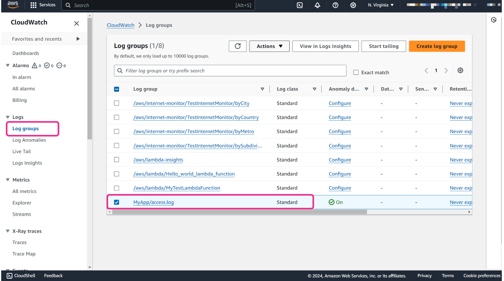

* Open the CloudWatch console at [https://console.aws.amazon.com/cloudwatch/](https://console.aws.amazon.com/cloudwatch/).
* In the navigation pane, choose **Log groups**. Then select a log group.
* In this example, the log group **MyApp/access.log** is selected.

###### Step 2


* Choose **Actions > Create metric filter.**

###### Step 3


On the **Define pattern** page, do the following:

* For **Filter pattern**, enter **[IP, UserInfo, User, Timestamp, RequestInfo, StatusCode=404, Bytes]**.
* In the **Test pattern** section, you can test your filter pattern on sample log data. In this example, the **TestSteam1** log stream is used.
* After you run the test, you would see that only 9 matches out of 19 events are found in the sample log now.

After you complete the test, choose **Next**.

###### Step 4


On the **Assign metric** page, enter the details of the metric filter. This example uses the following settings:

* For **Filter name**, enter **HTTP404Errors**.
* For **Metric namespace**, use **MyNameSpaceCount**.
* For **Metric name**, enter **ApacheNotFoundErrorCount**.
* For **Metric value**, confirm that the value is **1**. This specifies that the count is incremented by 1 for every log event.
* For **Default value - optional**, enter **0**. Specifying a default value ensures that data is reported even during periods when no log events occur. This prevents spotty metrics where data sometimes doesn't exist.

Then choose **Next**.  

###### Step 5


* On the **Review and create** page, you can review the settings. If everything looks good, choose **Create metric filter**.

### Live Tail Data with CloudWatch Logs

Imagine a company that has just launched a new version of its ecommerce platform. During the first few hours after the launch, the development and operations teams are on high alert. They need to be ready to address any issues that might arise. In such a critical period, using Live Tail sessions become invaluable. The teams can use this feature to stream and monitor application logs in real time, so they can catch error or unexpected behavior instantly. With the ability to filter and search through logs interactively, the team can quickly identify and resolve issues. This ensures a smooth user experience and maintains the platform's reliability.

Amazon CloudWatch Logs Live Tail helps you quickly troubleshoot incidents by viewing a streaming list of new log events as they are ingested. You can view, filter, and highlight ingested logs in near real time, helping you to detect and resolve issues quickly. You can filter the logs based on terms that you specify. You can also highlight logs that contain specified terms to help you quickly find what you are looking for.

**Live Tail sessions incur costs by session usage time, per minute. Live Tail is supported only for log groups in the Standard log class.**

#### Starting a Live Tail session

You can use the CloudWatch console to start a Live Tail session. The following example shows you how to start a Live Tail session by using the **Live Tail** option in the navigation pane. You can also start Live Tail sessions from the **Log Groups** page or the **CloudWatch Logs Insights** page.

##### Step 1


Open the CloudWatch console at [https://console.aws.amazon.com/cloudwatch/](https://console.aws.amazon.com/cloudwatch/).

In the navigation pane, under the **Logs** section, choose **Live Tail**.

##### Step 2

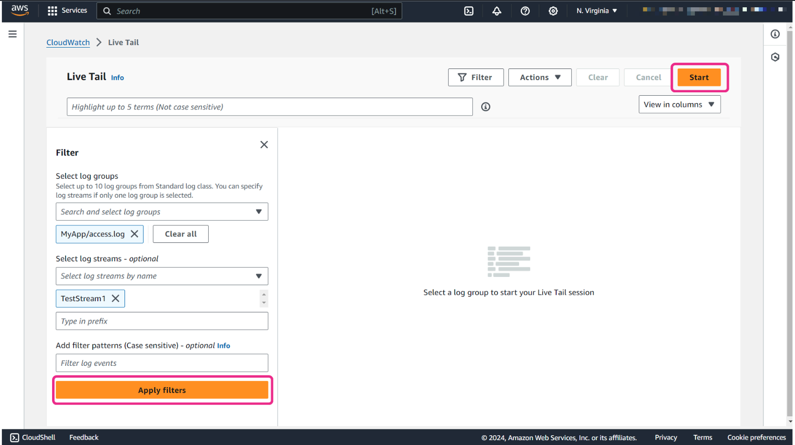

The **Live Tail** page is displayed.

In the **Filter** section, you can specify the following:

* **Select log groups**: You select the log groups that you want to view events from. In this example, **MyApp/access.log** is used.  
* **Select log streams - optional**: If you selected only one log group, you can use this option to filter your Live Tail session further. In this example, **TestStream1** is used.

Then you can either choose **Start** or **Apply filters** to start the session.

##### Step 3

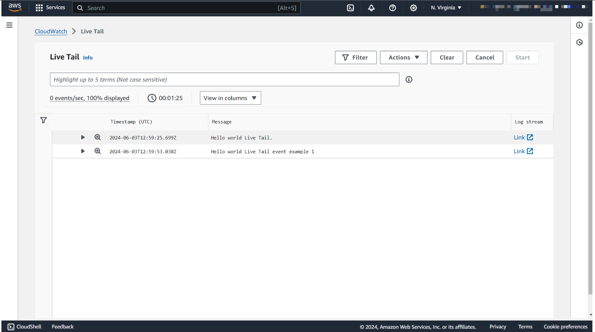

After the Live Tail session starts, the matching log events begin appearing in the window. In this example, you can see that two log events are showing:

One log event message shows **"Hello world Live Tail"** at **2024-06-03 12:59:25 UTC**. The other log event message shows **"Hello world Live Tail event example 1"** at **2024-06-03 12:59:53 UTC**.

#### Live Tail features


1. **Highlight**

    Highlight can be used along with filtering to quickly troubleshoot issues. To highlight some of the displayed log events, you can enter up to five terms to search for and highlight under **Live Tail**. If you add multiple terms to highlight, a different color is assigned to represent each term. A highlight indicator is displayed to the left of any log event that contains the specified term.

    For example, you can highlight the events that contain **error** and **info**.

2. **events/sec**

    **events/sec** displays how many ingested log events per second match the filters that you have set.

    To prevent the session from scrolling too quickly when many events match the filters, CloudWatch Logs might display only some of the matching events. If this happens, the percentage of matching events displayed on the screen is shown.

    In this example, 100 percent of events are displayed.

3. **Timer**

    The timer displays how long the Live Tail session has been active.

4. **Filter panel**

    A left-side pop-out filter panel displays a mandatory field for you to select log groups across multiple accounts. This also includes optional fields to select log streams and filtering patterns.

5. **Viewing details about each log event**

    During the session, you can see more details with the following:

    * To display the entire text for a log event in the main window, choose the arrow next to that log event.
    * To display the entire text for a log event in a side window, choose the magnifying glass next to that log event. The event flow pauses, and the side window appears. Displaying a log event text in the side window is useful to compare its text to other events in the main window.

### Querying with CloudWatch Logs Insights

You can use CloudWatch Logs Insights to interactively search and analyze your log data in CloudWatch Logs. You can query by log group, filter by fields, aggregate and transform data, join log data, and visualize results. This helps troubleshoot issue or analyze trends.

CloudWatch Logs Insights uses a SQL-like query language to search and analyze the log data. A single request can query up to 50 log groups. Queries time out after 60 minutes, if they have not completed. Query results are available for 7 days.

You can save queries that you have created. This can help you run complex queries when you need to, without having to re-create them each time that you want to run them.

**What's the difference between CloudWatch Logs Insights and metric filters? With metric filters, a specified numerical value is added to a metric filter each time a matching log is found. For example, if you're counting the occurrences of a particular term like Error, the value will be 1 for each occurrence. If you're counting the bytes transferred, you can increment by the actual number of bytes found in the log event.**

**CloudWatch Logs Insights is an interactive query tool that helps you search and analyze log data by using a custom query language. Metric filters automatically update CloudWatch metrics based on specific patterns. CloudWatch Logs Insights helps you perform on-the-fly queries and generate complex reports and visualizations from your log data. This makes CloudWatch Logs Insights more flexible for impromptu analysis and detailed log examination.**

#### Exploring queries

When you open the **Logs Insights** page on the CloudWatch console, a sample query is automatically placed in the query field. This sample query does the following:

* It displays the timestamp and message by using the **fields** command.
* It sorts the timestamp in descending (desc) order.
* It limits the display to the last 1,000 results.

If you choose **Run query**, you can then view the results.


At the top, you can see a histogram showing the distribution of log events over time where they match your query. Underneath, you can see the events that match your query. You can also choose the arrow icon of each line to expand the event.

#### Find messages containing text

You can use the **filter** command to specify which log events you want to work with. The **filter** command can be used to specify an exact match on a field. For example, if you want to look for logs that contain the string **Order** in the log, you can use the following query command.

```sql
fields @timestamp, @message
| filter @message like /Order/
| sort @timestamp desc
| limit 20
```

Notice that the number of logs that you found has decreased from 28 logs to 18 logs. Log data can often contain a large volume of irrelevant or unimportant information. With the **filter** command, you can focus log entries that are related to the specific problem that you're trying to address.


**The values for the filter command in a query are case sensitive.**

#### Counting events and viewing the result as a bar chart

You can also use the **stats** command to aggregate data. The **stats** command can be used to count the number of events, or to calculate statistics on a specific field, such as average, sum, max, and min.

In the following query command, the query will return a result that is the count of the number of messages captured in 5-minute bins (5-minute period).

```sql
fields @timestamp, @message
| stats count(@message) as number_of_events by bin(5m)
| limit 20
```

With this query, the log data was aggregated into five results, similar to the following:


If you want to visualize your results, you can use the **Visualization** tab, and then select the graph type. The following example uses **Bar** as the graph type.


### Log Anomaly Detection and Pattern Analysis

Amazon CloudWatch Logs offers log anomaly detection, which uses machine learning to automatically detect unusual patterns in log data. It can be used to detect spikes in traffic or sudden increases in error rates. You can also use it to detect other unusual behavior that might indicate a security breach, system failure, or other issues.

Suppose you have an application that processes customer orders. The application logs each step of the order processing to CloudWatch Logs. Normally, the order processing logs show a steady rate of orders at average processing times.

However, one day the order processing logs start showing much higher processing times and error messages, indicating that orders are taking longer than usual to process. You check the CloudWatch logs, but you don't see anything obviously wrong with the log contents.

This is where CloudWatch Logs anomaly detection could help troubleshoot the issue. The anomaly detection feature can automatically detect when log patterns deviate from the norm and flag the anomalies. In this case, it would detect the spike in processing times and errors as anomalous compared to the normal baseline. The anomalies would be flagged on the CloudWatch console, and you can quickly identify the issue time period.

Then you could analyze the anomalous log entries in more detail to identify the root cause of the performance problem, such as an infrastructure issue or bug. Without anomaly detection, it would take more effort to manually detect the anomaly in the logs.

#### Log anomaly detector

You can create a log anomaly detector for each log group. The anomaly detector scans the log events ingested into the log group and find anomalies in the log data. Anomaly detection uses machine-learning and pattern recognition to establish baselines of typical log content. After you create an anomaly detector for a log group, it uses the past 2 weeks of log events in the log group for training. The training period can take up to 15 minutes. After the training is complete, it begins to analyze incoming logs to identify anomalies, and the anomalies are displayed in the CloudWatch Logs console for you to examine.

CloudWatch Logs pattern recognition extracts log patterns by identifying static and dynamic content in your logs. Patterns are useful for analyzing large log sets because a large number of log events can often be compressed into a few patterns.

For example, let's see the following sample of five log events.

```shell
2024-05-01 19:00:01 [ERROR] Order 123 processing failed. Process time: 500ms.
2024-05-01 19:01:22 [ERROR] Order 456 processing failed. Process time: 4500ms.
2024-05-01 19:02:30 [INFO] Order 789 processed successfully. Process time: 200ms.
2024-05-01 19:03:07 [ERROR] Order 012 processing failed. Process time: 6700ms.
2024-04-01 19:03:44 [ERROR] Order 001 processing failed. Process time: 37000ms.
```

In the previous example, four log events follow one pattern:

```regexp
<*> <*> [ERROR] Order <*> processing failed. Process time: <*>ms.
```

Fields within a pattern are called tokens. Fields that vary within a pattern, such as an order number or timestamp, are referred to as dynamic tokens. Dynamic tokens are represented by <*> when CloudWatch Logs displays the pattern. Each different value found for a dynamic token is called a token value. CloudWatch Logs anomaly detection uses these patterns to find anomalies. After the anomaly detector model training period, logs are evaluated against known trends. The anomaly detector flags significant fluctuations as anomalies.

#### Creating a log anomaly detector

##### Step 1

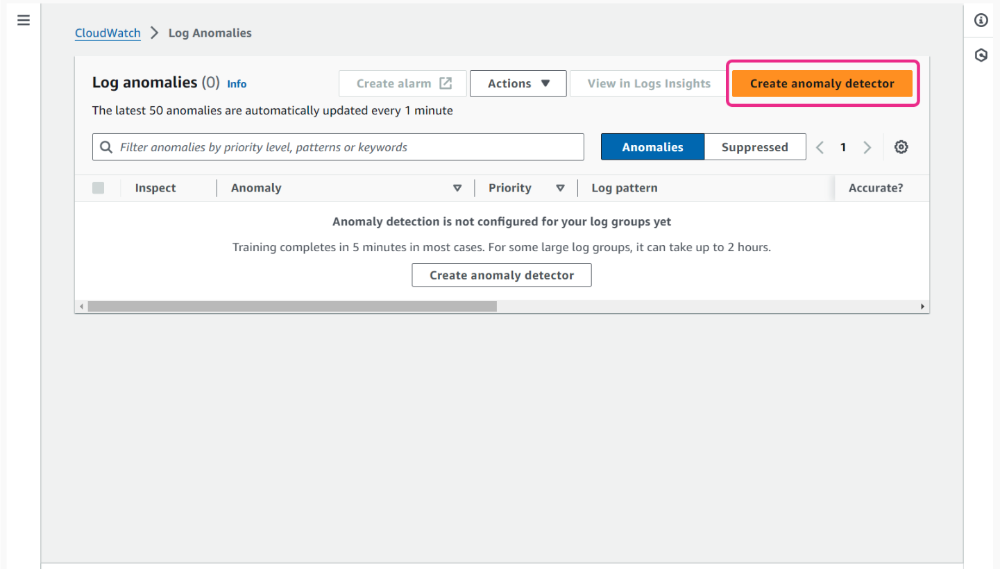

To create a log anomaly detector on the console, open the CloudWatch console at [https://console.aws.amazon.com/cloudwatch/](https://console.aws.amazon.com/cloudwatch/).

In the navigation pane, under **Logs**, choose **Log Anomalies**. Then choose **Create anomaly detector**.

##### Step 2


The **Anomaly detection configuration** page is displayed. You would configure the following values:

* **Log group selection**: Choose the log group to create this anomaly detector for. In this example, **MyApp/access.log** is chosen.
* **Anomaly detector name**: Enter a name for the detector. In this example, **logs-anomaly-detector** is used.
* **Evaluation frequency**: Choose how often you want your logs to be analyzed for anomalies. In this example, **5 min** is used.
* **Filter patterns - optional**: You can specify the filter conditions to apply on your log data as it gets evaluated for anomaly detection.
* **Advanced configuration - optional**: When you create an anomaly detector, you can specify the maximum anomaly visibility period for it. This is the number of days that the anomaly is displayed in the console and is returned by the **ListAnomalies** API operation. After this time period has elapsed for an anomaly, if it continues to happen, it's automatically accepted as regular behavior. The anomaly detector model will then stop flagging it as an anomaly. If you don't adjust the visibility time when you create an anomaly detector, 21 days is used as the default.

Then choose **Activate anomaly detection**.

##### Step 3


The anomaly detector is created and starts training its model, based on the log events that the log group is ingesting. After some time (time might vary), anomaly detection is active and begins to find and reveal anomalies.

#### Severity and priority of anomalies and patterns

Each anomaly found by a log anomaly detector is assigned a priority. Each pattern found is assigned a severity.

##### Severity

Severity is based only on keywords found in the patterns, such as **FATAL**, **ERROR**, and **WARN**. If none of these keywords are found, the severity of a pattern is marked as **NONE**.

##### Priority

Priority is automatically computed, and is based on both the severity level of the pattern and the amount of deviation from expected values.

For example, if a certain token value suddenly increases by 500 percent, that anomaly might be designated as **HIGH** priority even if its severity is **NONE**.

For example, one of the records on the Log anomalies page shows the following:

* **Anomaly**: 3863.5% increase in log event count
* **Priority**: High
* **Log pattern**: REPORT RequestId: <*> Duration: <*> ms Billed Duration: <*> ms Memory Size: <*> MB Max Memory Used: <*> MB Init Duration: <*> ms
There were no keywords such as **FATAL**, **ERROR**, or **WARN** found in the pattern. However, the **Priority** is still marked as **HIGH** because the log event count suddenly increases by 3863.5 percent.


#### Finding recurring patterns in the logs

CloudWatch Logs Insights uses machine learning algorithms to find patterns when you query your logs. After you set up the log groups that you want to query, you can then use the **Patterns** tab for more detailed information. The **Patterns** tab on the **Logs Insights** page finds recurring patterns in your query results so that you can analyze these recurring patterns in detail. This makes it easier to find what you’re looking for and drill down into new or unexpected content in your logs.

In the following example, let's say that you have a log group of an AWS Lambda function that you want to inspect. You can see that there are many patterns found in this log group.


In this example, you see the following information:

* The **Event count** shows the number of times that the pattern appeared in the queried log events.
* The **Event ratio (%)** is the percentage of the queried log events that contain this pattern.
* The **Severity type** will be one of the following: **ERROR**, **WARN**, **INFO**, or **NONE** based on the keywords found in the pattern. 

You can choose the magnifying glass icon to further analyze this pattern. After you choose the icon, the **Pattern inspect** window is displayed. A histogram with the occurrences of the pattern in the selected time period is shown. After the histogram, samples from the logs are also provided.

![Screenshot of Pattern inspect window with Pattern \[ERROR\] Something happen in loop.](./images/W10Img060CloudWatchLogsInsightsPatternInspect.png)

The variable parts of the pattern (such as numbers) have been extracted as tokens. You can select a token value to quickly add it as a filter to the query and focus on the logs that contain this pattern with this specific value.


#### Comparing patterns with previous time periods

You can also use CloudWatch Logs Insights to compare changes in your log events over time. You can compare the logs from a recent time range with those from the previous or similar past time periods. This can help you find whether an error in your logs was recently introduced or was already occurring, and can help you find other trends.

To do so, in CloudWatch Logs Insights, you choose **Compare** in the time interval selector. This updates the query to compare results with a previous period. In the following example, let's say that you choose **Previous day** to see what changed compared to yesterday.


Now, back on the **Patterns** tab, you see that there has actually been a 10 percent decrease in the number of errors, so the current situation might not be too bad.

![Under the Patterns tab, Pattern \[ERROR\] Something happened in loop.. has 10 percent decrease.](./images/W10Img066CloudWatchLogsInsightsPatternsComparePatterns.png)

To see the full comparison of the two time periods, you can choose the magnifying glass icon on the pattern with severity type **ERROR**. The graph overlaps the occurrences of the pattern over the two periods (now and yesterday, in this case) inside the selected time range (1 hour).


### Troubleshooting with VPC Flow Logs

Imagine that you have designed and configured your network to maintain operational excellence using proactive monitoring of specific metrics with visibility and alerts. You have also been tasked to stay current and implement services and tools to help troubleshoot your network when issues arise.

There are many services and tools that you can use to add visibility to troubleshoot, diagnose, and fix network problems. In this section, let's look at how you can troubleshoot with VPC Flow Logs.

#### VPC Flow Logs

VPC Flow Logs is a feature that you can use to capture information about the IP traffic going to and from network interfaces in your virtual private cloud (VPC). You can use VPC Flow Logs as a centralized source to monitor different network aspects. You can create a flow log for a VPC, a subnet, or a network interface. If you create a flow log for a subnet or VPC, each network interface in that subnet or VPC is monitored.

Flow log data for a monitored network interface is recorded as flow log records, which are log events consisting of fields that describe the traffic flow.

VPC Flow Logs collects metadata for all Amazon Virtual Private Cloud (Amazon VPC) networks that are used by your workload. Flow log data can be published to CloudWatch Logs, Amazon Simple Storage Service (Amazon S3), or Amazon Data Firehose. After you create a flow log, you can retrieve and view the flow log records in the log group, bucket, or delivery stream that you configured.

Flow logs can help you with several tasks, such as the following:

* Diagnosing overly restrictive security group rules
* Monitoring the traffic that is reaching your instance
* Determining the direction of the traffic to and from the network interfaces

**Flow log data is collected outside of the path of your network traffic, and therefore does not affect network throughput or latency. You can create or delete flow logs without any risk of impact to network performance.**

#### Flow log records

A flow log record represents a network flow in your VPC. By default, each record captures a network internet protocol (IP) traffic flow that occurs within an aggregation interval, also referred to as a capture window.

Each record is a string with fields separated by spaces. A record includes values for the different components of the IP flow, for example, the source, destination, and protocol.

When you create a flow log, you can use the default format for the flow log record, or you can specify a custom format.

##### Aggregation interval

The aggregation interval is the period of time during which a particular flow is captured and aggregated into a flow log record. By default, the maximum aggregation interval is 10 minutes. When you create a flow log, you can optionally specify a maximum aggregation interval of 1 minute. Flow logs with a maximum aggregation interval of 1 minute produce a higher volume of flow log records than flow logs with a maximum aggregation interval of 10 minutes.

For example, if you want to get a near real-time view of the network traffic and events happening in your VPC, you can use the aggregation interval of 1 minute. This can be beneficial for security monitoring, where you might want to quickly detect and respond to potential threats or suspicious activities.

##### Default format

With the default format, the flow log records include the version 2 fields, such as protocol, source address, and destination address. For the full list of the available version 2 fields, you can find them in the order shown in the [available fields](https://docs.aws.amazon.com/vpc/latest/userguide/flow-log-records.html#flow-logs-fields) table. Remember, you can't customize or change the default format.

If you want to capture additional fields or a different subset of fields, you should specify a custom format instead.

##### Custom format

With a custom format, you can specify which fields are included in the flow log records and in which order. This helps you create flow logs that are specific to your needs and omit fields that are not relevant.

For example, let's say that your security solution must analyze the source and destination IP addresses. You also need to know about the Region that contains the network interface for which traffic is recorded.

The default VPC flow log format includes the source and destination IP addresses, but it doesn't include the Region. By using a custom format, you can add this additional field to the VPC flow logs. This makes it easier for your security solution to process and analyze the data.

Using a custom format can reduce the need for separate processes to extract specific information from the published flow logs. You can specify any number of the available flow log fields, but you must specify at least one.

#### Creating a flow log that publishes to CloudWatch Logs

You can use the AWS Management Console or AWS Command Line Interface (AWS CLI) to create flow logs. The following example uses the console to create a flow log. For example, if you want to create a flow log for your VPCs, you first open the VPC console at [https://console.aws.amazon.com/vpc/](https://console.aws.amazon.com/vpc/). Then, in the navigation pane, choose **Your VPCs**. Select the checkbox for the VPC. Then choose **Actions > Create flow log**.

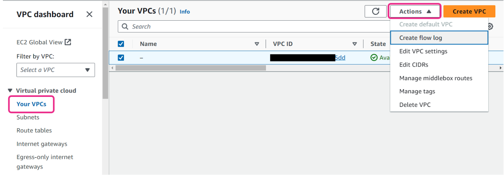

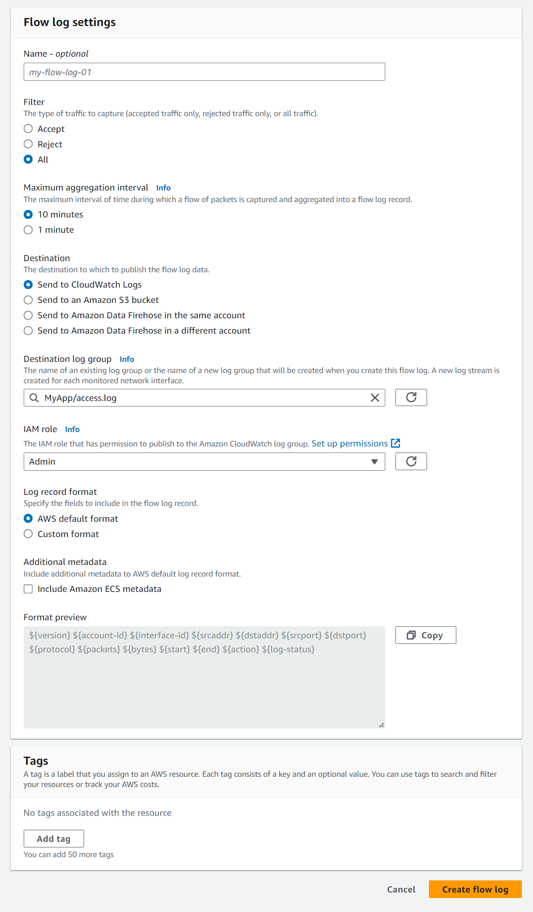

1. **Filter**

    You can specify the type of traffic to log. Select **All** to log accepted and rejected traffic, **Reject** to log only rejected traffic, or **Accept** to log only accepted traffic.

    In this example, **All** is selected.

2. **Maximum aggregation interval**

    Select the maximum period of time during which a flow is captured and aggregated into one flow log record.

    In this example, **10 minutes** is selected.

3. **Destination**

    You then specify the destination to which to publish the flow log data. You can publish flow log data to CloudWatch Logs, an Amazon S3 bucket, or Amazon Data Firehose.

    In this example, **Send to CloudWatch Logs** is selected.

4. **Destination log group**

    Choose the name of an existing log group or enter the name of a new log group that will be created when you create this flow log.

    In this example, **MyApp/access.log** is used.

5. **IAM role**

    You specify the name of the role that has permissions to publish logs to CloudWatch Logs.

    In this example, the IAM role **Admin** is used.

6. **Log record format**

    You can select the format for the flow log record.

    * To use the default format, select **AWS default format**.
    * To use a custom format, select **Custom format** and then select fields from **Log format**.

    In this example, **AWS default format** is selected.

#### Creating a flow log with CLI

You can also use AWS CLI to create a flow log. The following example creates a flow log that captures all accepted traffic for the specified subnet. The flow logs are delivered to the specified log group. The **--deliver-logs-permission-arn parameter** specifies the AWS Identity and Access Management (IAM) role required to publish to CloudWatch Logs.

```shell
aws ec2 create-flow-logs --resource-type Subnet --resource-ids subnet-1a2b3c4d --traffic-type ACCEPT --log-group-name my-flow-logs --deliver-logs-permission-arn arn:aws:iam::123456789101:role/publishFlowLogs
```

**By default, users don't have permission to work with flow logs. You can create an IAM role with a policy attached that grants users the permissions to create, describe, and delete flow logs.**

#### Flow log record examples

The following are examples of flow log records that capture specific traffic flows.

##### Example 1: Accepted and rejected traffic

The following are examples of default flow log records. In this example, Secure Shell (SSH) traffic (destination port 22, TCP protocol 6) from IP address 172.31.16.139 to network interface with private IP address is 172.31.16.21. ID eni-1235b8ca123456789 in account 123456789010 was allowed.

```log
2 123456789010 eni-1235b8ca123456789 172.31.16.139 172.31.16.21 20641 22 6 20 4249 1418530010 1418530070 ACCEPT OK 
```

In the following example, Remote Desktop Protocol (RDP) traffic (destination port 3389, TCP protocol 6) to network interface eni-1235b8ca123456789 in account 123456789010 was rejected.

```log
2 123456789010 eni-1235b8ca123456789 172.31.9.69 172.31.9.12 49761 3389 6 20 4249 1418530010 1418530070 REJECT OK 
```

##### Example 2: Security group and network ACL rules

If you're using flow logs to diagnose overly restrictive or permissive security group rules or network access control list (network ACL) rules, be aware of the statefulness of these resources. Security groups are stateful. This means that responses to allowed traffic are also allowed, even if the rules in your security group do not permit it. Conversely, network ACLs are stateless. Therefore, responses to allowed traffic are subject to network ACL rules.

For example, you use the **ping** command from your home computer (IP address is 203.0.113.12) to your instance (the network interface's private IP address is 172.31.16.139). Your security group's inbound rules allow Internet Control Message Protocol (ICMP) traffic, but the outbound rules do not allow ICMP traffic. Because security groups are stateful, the response ping from your instance is allowed. Your network ACL permits inbound ICMP traffic but does not permit outbound ICMP traffic. Because network ACLs are stateless, the response ping is dropped and does not reach your home computer. In a default flow log, this is displayed as the two following flow log records.

An ACCEPT record for the originating ping was allowed by both the network ACL and the security group. Therefore, the ping was allowed to reach your instance.

```log
2 123456789010 eni-1235b8ca123456789 203.0.113.12 172.31.16.139 0 0 1 4 336 1432917027 1432917142 ACCEPT OK 
```

A REJECT record for the response ping was denied by the network ACL.

```log
2 123456789010 eni-1235b8ca123456789 172.31.16.139 203.0.113.12 0 0 1 4 336 1432917094 1432917142 REJECT OK 
```

If your network ACL permits outbound ICMP traffic, the flow log displays two ACCEPT records (one for the originating ping and one for the response ping). If your security group denies inbound ICMP traffic, the flow log displays a single REJECT record, because the traffic was not permitted to reach your instance.

### [Lab: Monitoring Applications and Infrastructure](./labs/W100Lab1MonitoringAppAndInfra.md)

You will practice setting up and monitoring metrics for business application events. You will also practice defining relevant event thresholds for metrics, creating an automated notification and remediation when metric thresholds are exceeded.

In this lab, you will perform the following tasks:

* Configure telemetry on Amazon EC2 instances with the Amazon CloudWatch agent, AWS Sessions Manager, command documents, and Parameter Store.
* Create a CloudWatch dashboard to display CloudWatch agent metrics.
* Subscribe to Amazon Simple Notification Service (Amazon SNS) topics for automatic notifications.
* Configure CloudWatch alarms for monitoring and notification when specific metric thresholds are crossed.
* Manually test any CloudWatch alarm in your AWS environment using the AWS Command Line Interface (AWS CLI).
* Create an AWS Lambda based Canary alarm for a web server.

### Knowledge Check

#### A developer is troubleshooting an issue with their application and wants to view their application logs in near real time to detect errors quickly. Which Amazon CloudWatch feature can they use?

* CloudWatch Logs Live Tail

Wrong answers:

* CloudWatch Logs Insights
* CloudWatch metrics
* CloudWatch Logs subscription filters

##### Explanation

The developer can use the Live Tail feature to view their logs in near real time to quickly detect and troubleshoot issues.

The other options are incorrect because of the following:

* CloudWatch Insights runs queries on log data, but it does not provide near real-time streaming of logs.
* CloudWatch metrics allows the viewing of metrics and alarms, but it does not provide access to log data.
* Subscription filters allow routing log data to other services, but they do not provide near real-time streaming of logs.

#### A developer is troubleshooting connectivity issues between two Amazon EC2 instances in different subnets in their virtual private cloud (VPC). They have enabled VPC Flow Logs for their VPC. How can they use VPC Flow Logs to troubleshoot the connectivity problem?

* Check VPC Flow Logs for allowed traffic between the two instances' private IP addresses to see if there are any rejections. This would indicate a network access control list (network ACL) or security group issue.

Wrong answers:

* Check VPC Flow Logs for allowed traffic between the two instances' public IP addresses to see if there are any rejections. This would indicate an internet gateway issue.
* Check VPC Flow Logs for allowed traffic between the two instances' private IP addresses to identify the ports and protocols in use. This can help identify any mismatches.
* Check VPC Flow Logs for allowed traffic between the two instances' Elastic IP addresses to see if there are any rejections. This would indicate a route table issue.

##### Explanation

VPC Flow Logs can be checked for allowed traffic between the private IP addresses to see if there are rejections. This would indicate a network ACL or security group configuration issue.

The other options are incorrect because of the following:

* For connectivity between instances in the same VPC, only the private IP addresses would be used. Public IP traffic would not indicate an issue.
* Although checking ports and protocols can provide useful information, it does not directly help identify a connectivity issue.
* Elastic IP addresses are public IP addresses, so these would not be used for communication between instances in the same VPC.

#### A developer is setting up an anomaly detector in Amazon CloudWatch Logs. What is the default visibility period if they don’t adjust the visibility time?

* 21 days

Wrong answers:

* 7 days
* 14 days
* 60 days

##### Explanation

If the developer does not adjust the visibility time when they create an anomaly detector, 21 days is used as the default. After this time period has elapsed for an anomaly, if it continues to happen, it is automatically accepted as regular behavior. The anomaly detector model will stop flagging it as an anomaly.

The other options are incorrect because they are not the default visibility time period.

### Summary

#### Metric filters

You can search and filter the log data coming into CloudWatch Logs by creating one or more metric filters. Metric filters define the terms and patterns to look for in log data as it is sent to CloudWatch Logs. CloudWatch Logs uses these metric filters to turn log data into numerical CloudWatch metrics that you can graph or set an alarm on.

#### Live Tail with CloudWatch Logs

CloudWatch Logs Live Tail helps you quickly fix problems by showing you a live list of new log events as they are received. You can view, filter, and highlight the received logs almost instantly, which helps you detect and solve issues fast. You can filter the logs based on the terms that you choose, and also highlight logs that contain specific terms to help you find what you need quickly.

#### Querying with CloudWatch Logs

CloudWatch Logs Insights helps you interactively search, analyze, and visualize your log data in CloudWatch Logs. It provides a SQL-like query language to do the following:

* Filter logs by specific fields or terms
* Aggregate and transform log data
* Join log data from multiple sources
* Visualize the query results

The main difference between CloudWatch Logs Insights and metric filters is that metric filters add a specified numerical value to a metric each time a matching log is found. In contrast, CloudWatch Logs Insights permits more complex querying, aggregation, and visualization of the raw log data itself.

#### Log anomaly detection and pattern analysis

CloudWatch Logs offers an anomaly detection feature that uses machine learning to automatically detect unusual patterns in log data. This can help identify issues like spikes in traffic, increases in error rates, or other unusual behavior that might indicate a security breach, system failure, or other problems.

The anomaly detection feature establishes a baseline of normal log patterns, and then flags any deviations from that baseline as anomalies. You can quickly identify the time period where the anomaly occurred, so that you can then analyze the anomalous log entries in more detail to identify the root cause.

You can create a log anomaly detector for each log group in CloudWatch Logs. The detector uses the past 2 weeks of log events to train and establish the baseline, and then begins analyzing new incoming logs to identify anomalies.

In addition to anomaly detection, CloudWatch Logs also provides pattern recognition capabilities that can compress large log sets into a few recurring patterns. This makes it easier to analyze and find insights in large volumes of log data.

#### Troubleshooting with VPC Flow Logs

VPC Flow Logs helps you to capture information about the IP traffic going to and from network interfaces in your VPC. These logs can be used for a variety of purposes, including network troubleshooting and security analysis.

To use VPC Flow Logs for troubleshooting, you first need to enable the feature and configure it to capture the necessary information. After you have enabled the feature, the logs will record details about the traffic flowing through your VPC. These details include the source and destination IP addresses, ports, protocols, and the number of bytes and packets transferred. You can then use these logs to identify network issues, such as connectivity problems, unauthorized access attempts, or unusual traffic patterns. By analyzing the flow logs, you can pinpoint the root cause of the issue and take appropriate action to resolve it.

## Application Monitoring

### Pre-assessment

#### What is a component in Amazon CloudWatch Application Insights?

* An auto-grouped, standalone, or custom grouping of similar resources that make up an application

Wrong answers:

* An individual AWS resource such as an Amazon EC2 instance or an AWS Lambda function
* A monitoring tool used to track the performance of individual resources
* A tag applied to resources to help with filtering and searching

##### Explanation

For example, a web application can be a group of an Application Load Balancer and Amazon EC2 instances running the web application. This entire group of resources is called a component.

The other options are incorrect because of the following:

* A component in CloudWatch Application Insights refers to a logical grouping of related resources, not an individual resource.
* A component in CloudWatch Application Insights is not a monitoring tool itself. It is a way to group resources for monitoring and analysis purposes.
* Although tags can be used to group resources, a component specifically refers to an auto-grouped, standalone, or custom grouping of resources that make up an application.

#### What is an Amazon CloudWatch Synthetics canary?

* A canary is a scheduled script that monitors the availability and performance of the web applications or APIs.

Wrong answers:

* A canary is a feature that permits automatic scaling of cloud resources based on demand.
* A canary is a type of machine learning model used for anomaly detection in cloud infrastructure.
* A canary is a security tool that helps detect and prevent distributed denial-of-service (DDoS) attacks on the application.

##### Explanation

It can simulate user actions, check for specific responses, and report any issues or performance degradation.

The other options are incorrect because of the following:

* Auto scaling is a separate feature in AWS, and it is not the same as a canary in CloudWatch Synthetics.
* Canaries are scripts that actively monitor the availability and performance of web applications or APIs. They are not machine learning models.
* AWS Shield is a security service that helps protect applications against DDoS attacks. It is not related to canaries.

#### Which Amazon CloudWatch metrics does Amazon CloudWatch RUM provide?

* Page view counts

Wrong answers:

* Client connections
* Backend API latency
* Database queries

##### Explanation

CloudWatch RUM provides metrics on page view counts and user-centric performance data.

The other options are incorrect because of the following:

* Although CloudWatch RUM analyzes user sessions, it does not provide metrics specifically on client connections.
* CloudWatch RUM focuses on frontend performance and does not provide backend API latency metrics.
* CloudWatch RUM does not monitor or provide metrics on database queries. It focuses on frontend performance from the user's perspective.

### Using CloudWatch Application Insights

#### CloudWatch Application Insights recap

Imagine a company that runs a large ecommerce website on Amazon Elastic Compute Cloud (Amazon EC2) instances. To handle high volumes of traffic and transactions, the website relies on a Microsoft SQL Server database running in high availability mode across multiple AWS Regions. The development team wants to easily monitor the performance and health of the SQL Server database. They also want to monitor other application components like the web and application servers.

Amazon CloudWatch Application Insights would be extremely useful for this company. It identifies and sets up key metrics, logs, and alarms across your application resources and technology stack. These resources could include your Microsoft SQL Server database, web (Microsoft Internet Information Services) and application servers, OS, load balancers, and queues.

This helps them detect any anomalies or errors. CloudWatch Application Insights also generates automated dashboards with correlated insights to troubleshoot issues, and creates events to streamline incident response and resolution. The automated dashboards help you to take remedial actions to keep your applications healthy and to prevent impact to the end users of your application.

CloudWatch Application Insights also integrates with OpsCenter, a capability of AWS Systems Manager, by automatically creating operational work items (OpsItems) for detected issues. OpsItems are detailed records of operational issues, providing relevant information such as the affected resources, potential causes, and recommended actions.

#### Enabling CloudWatch Application Insights

You can set up, configure, and manage your CloudWatch Application Insights application with the AWS Management Console, the AWS CLI, and AWS Tools for Windows PowerShell. In the following example, let's look at how you can set up CloudWatch Application Insights with the console.

##### Step 1

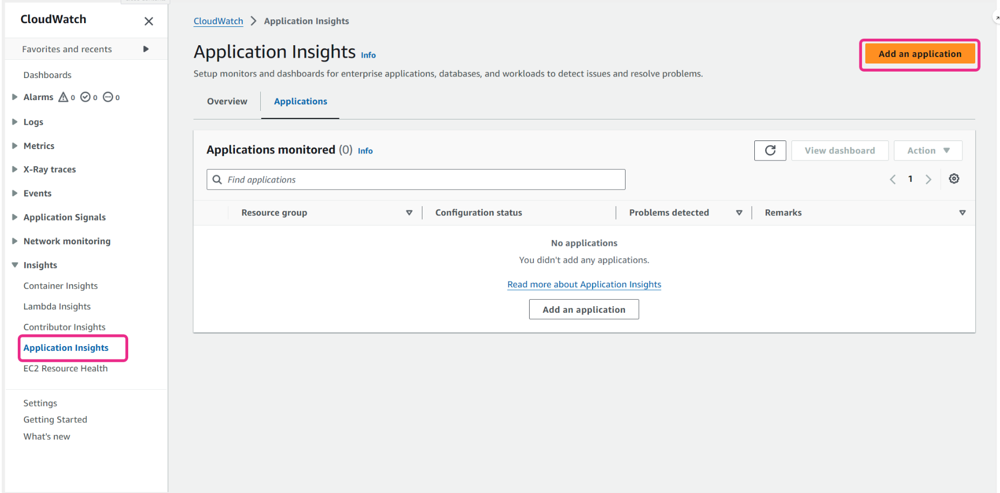

Open the CloudWatch console landing page at: [http://console.aws.amazon.com/cloudwatch](http://console.aws.amazon.com/cloudwatch).

From the navigation pane, under **Insights**, choose **Application Insights**.

The page that opens shows the list of applications that are monitored with CloudWatch Application Insights, along with their monitoring status.

To set up monitoring for your application, choose **Add an application**. When you choose **Add an application**, you are prompted to **Choose Application Type**.

* **Resource group-based application** – When you select this option, you can choose which resource groups in this account to monitor. This groups together AWS resources—such as EC2 instances or Amazon Relational Database Service (Amazon RDS) databases—into a single logical application. Use this when you want to monitor and manage specific sets of resources as a cohesive unit. To use multiple applications on a component, you must use resource group-based monitoring. In this example, this option is used.
* **Account-based application** – When you select this option, you can monitor all of the resources in this account. If you want to monitor all of the resources in an account, it's recommended to use this option over the resource group-based option. It's because the application onboarding process is faster for the account-based application option.

##### Step 2


On the **Step 1 - Specify application details** page, choose a resource group. In this example, the **Application**s** resource group is used.

##### Step 3

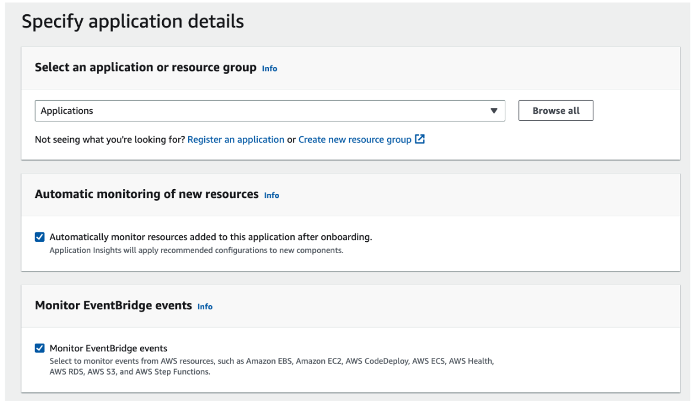

You can select **Automatically monitor resources added to this application after onboarding** to automatically allow onboarding of new components in the future.

You can also select **Monitor EventBridge events** to get insights from services that support Amazon EventBridge events.

##### Step 4

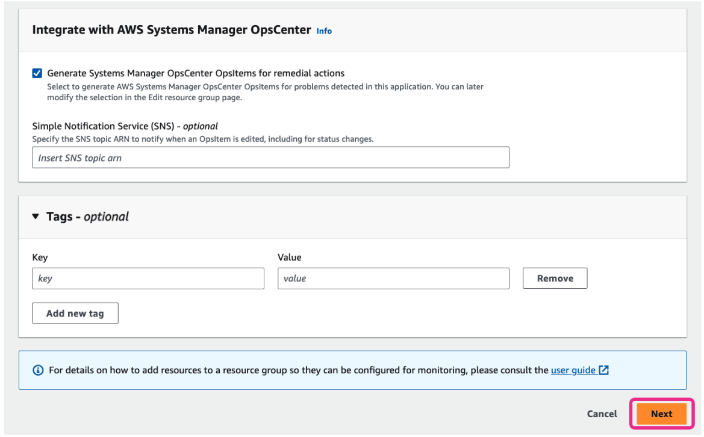

You can optionally select **Generate Systems Manager OpsCenter OpsItems for remedial action**s to integrate CloudWatch Application Insights with OpsCenter.

OpsCenter is a capability of AWS Systems Manager. It provides a central location where operations engineers and IT professionals can view, investigate, and resolve operational work items (called OpsItems).

You can also optionally add tags to your CloudWatch Application Insights application.

Choose **Next**.

##### Step 5

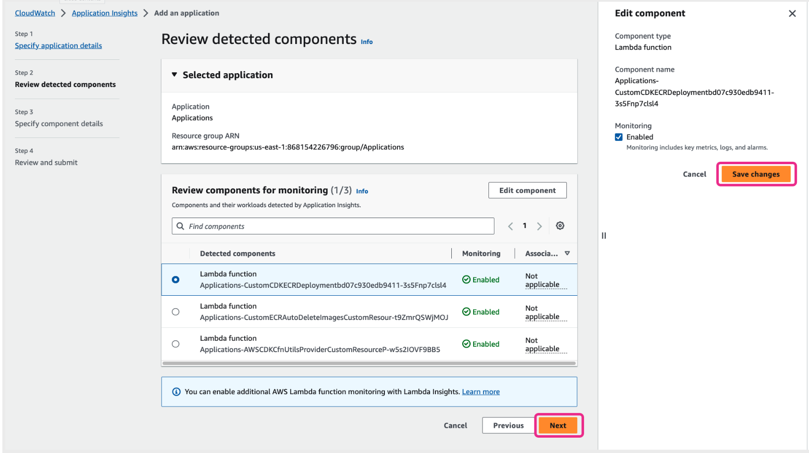

On the **Step 2 - Review detected components** page, application components supported by CloudWatch Application Insights for monitoring are listed.

This example application contains three AWS Lambda functions. CloudWatch Application Insights will monitor metrics and logs on each Lambda function.

You can also select any component, then choose **Edit component** to modify monitoring configurations of the corresponding component.

After you are finished with modifying, choose **Save changes**, and then choose **Next**.

##### Step 6

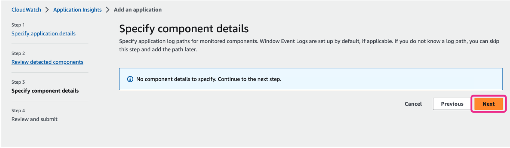

On the **Step 3 - Specify component details** page, you can specify more monitoring details such as application log paths for monitored components.

For this example application, no more details are needed. CloudWatch Application Insights will automatically monitor the Lambda logs from default Lambda log groups.

Choose **Next**.

##### Step 7

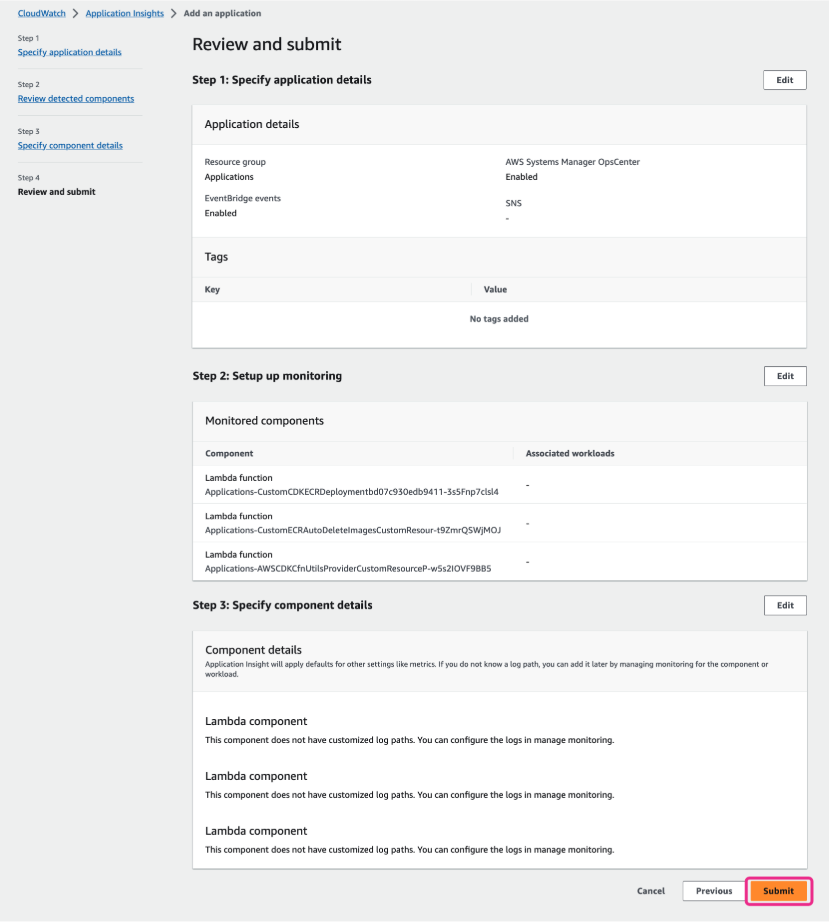

On the **Step 4 - Review and submit page**, you can review the monitoring settings configured in previous steps.

When you are ready, choose **Submit**. A CloudWatch Application Insights application will be generated.

#### Enabling CloudWatch Application Insights with AWS CLI

If you want to use AWS CLI to enable CloudWatch Application Insights, you can use the **create-application** command. In the following example, you add an application for your resource group called **Applications**. You also enable OpsCenter to deliver the created OpsItem to the Amazon Simple Notification Service (Amazon SNS) topic Amazon Resource Name (ARN) **arn:aws:sns:us-east-1:123456789012:MyTopic**.

```shell
aws application-insights create-application --resource-group-name Applications --ops-center-enabled --ops-item-sns-topic-arn arn:aws:sns:us-east-1:123456789012:MyTopic
```

**CloudWatch Application Insights retains problems for 55 days and observations for 60 days.**

#### Troubleshooting with console overview

Now that you have enabled CloudWatch Application Insights, let's look at how you can use the overview and the problem summary sections to troubleshoot. On the **Application Insights page**, on the **Overview** tab, you can see the summary of monitored applications and components.

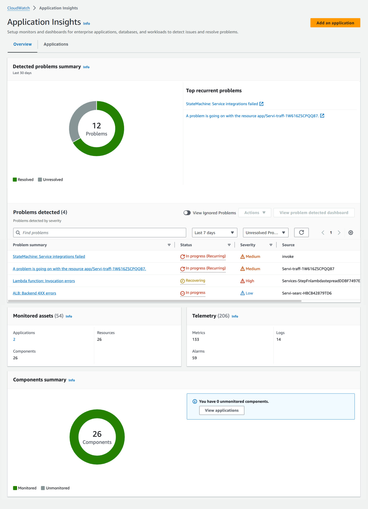

1. **Detected problems summary**

     The detected problems summary displays the number of resolved and unresolved detected application problems for the past 30 days. It also shows the top recurrent problems in the past 30 days and the full list of detected problems.

2. **Problems detected**

    If you want to view more details about a detected problem, you can choose the name of the problem in the **Problem summary** column.

    You can view details such as the problem ID, the complete problem insight, and related events.

3. **Monitored assets**

    You can see the summary of monitored applications and components. An application is a group of components being monitored. For example, an application can have a database, a web application, and a message queue as three different components. A component is an auto-grouped, standalone, or custom grouping of similar resources that make up an application. For example, a web application can be a group consisting of an Application Load Balancer and EC2 instances running the web application.

4. **Telemetry**

    Telemetry is the total number of metrics, logs, and alarms configured for monitoring by CloudWatch Application Insights.

### Using CloudWatch Synthetics
