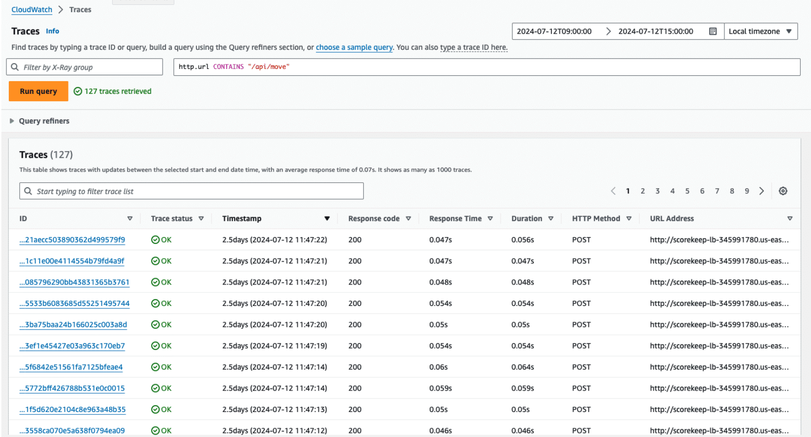

# Week 11: Monitoring and Troubleshooting: Tracing

* back to AWS Cloud Institute repo's root [aci.md](../aci.md)
* back to [AWS Cloud Operations 2](./aws-cloud-operations-2.md)
* back to repo's main [README.md](../../../README.md)

## VPC Reachability Analyzer

### Pre-assessment

#### What is the purpose of VPC Reachability Analyzer?

* Determines whether a destination resource is reachable from a source resource without sending actual traffic

Wrong answers:

* Monitors and analyzes network traffic flows in a virtual private cloud (VPC)
* Automatically fixes network connectivity issues between resources
* Provisions and configures networking resources like subnets and route tables

##### Explanation

Reachability Analyzer is a service that can examine network connectivity between two endpoints in a VPC without sending any packets or actual traffic.

The other options are incorrect because of the following:

* Reachability Analyzer does analyze network configurations. However, it does not monitor or analyze actual network traffic flows.
* Reachability Analyzer does not automatically fix connectivity issues. It only analyzes and identifies potential configuration problems that might be causing connectivity issues.
* Reachability Analyzer does not provision or configure networking resources like subnets or route tables. It analyzes the existing configurations of these resources to determine potential connectivity between endpoints.

#### What should a cloud engineer do to quickly resolve connectivity issues caused by misconfigurations in their virtual private cloud (VPC)?

* Use VPC Reachability Analyzer to identify any blocking components between source and destination resources.

Wrong answers:

* Review VPC Flow Logs to identify and analyze network traffic patterns.
* Configure and manage VPC connectivity using AWS Transit Gateway Network Manager.
* Delete the VPC and create a new one from scratch.

##### Explanation

Reachability Analyzer is a network configuration analysis tool for VPCs. It can perform a reachability analysis between a source resource and a destination resource. If there is a network misconfiguration, Reachability Analyzer provides information about the component(s) blocking the path.

The other options are incorrect because of the following:

* VPC Flog Logs capture information about IP traffic going to and from network interfaces in a VPC. Flow logs do not directly resolve connectivity issues.
* Transit Gateway Network Manager helps monitor and manage global network resources. It does not directly resolve connectivity issues caused by misconfigurations in a VPC.
* Deleting the VPC and creating a new one should be considered a last resort. It can be time-consuming and might result in data loss or disruption of services.

#### What is the first step when using VPC Reachability Analyzer?

* Verify that the source and destination resources meet requirements.

Wrong answers:

* Create the path.
* Analyze the path.
* View path analysis results.

##### Explanation

The first step when using Reachability Analyzer is to verify that the source and destination resources meet the requirements for the analysis. They must be resources that can connect to a network, such as Amazon EC2 instances, internet gateways, VPC endpoint services, or IP addresses.

The other options are incorrect because of the following:

* Creating the path is the second step after verifying that the source and destination meet requirements.
* Analyzing the path is the third step. It comes after first verifying the resources meet requirements and then creating the path.
* Viewing the path analysis results is the last step.

#### Which requirement must be met for VPC Reachability Analyzer to be able to analyze the connectivity between a source and destination resource?

* They must be in the same AWS Region.

Wrong answers:

* They must be in the same Availability Zone.
* They must be in the same AWS account.
* They must be in the same virtual private cloud (VPC).

##### Explanation

For Reachability Analyzer to check that two resources can connect, the source and destination resources must be in the same Region.

The other options are incorrect because of the following:

* The source and destination resources are not required to be in the same Availability Zone.
* The source and destination resources can belong to different AWS accounts in the same organization from AWS Organizations.
* The source and destination resources must be in the same VPC or in VPCs that are connected through a VPC peering connection or a transit gateway.

### Network Troubleshooting

#### Network issues and their causes

Some types of problems are common across networks. Expand each of the following categories to learn more.

##### Connectivity problems

This is when devices or systems can't connect to the network or the internet. Causes can include faulty cables, misconfigured network settings, or issues with network hardware like routers or switches.

##### Slow network performance

When the network is running slowly, it can make tasks like browsing the web or transferring files frustratingly slow. Common causes include too many devices on the network, bandwidth limitations, or network congestion.

##### Hardware failures

Network hardware like routers, switches, or cables can sometimes fail because of age, physical damage, or manufacturing defects, causing network disruptions.

##### Configuration errors

Incorrectly configured network settings, such as IP addresses, routing tables, or firewall rules, can prevent devices from communicating properly on the network.

##### Software issues

Problems with network software, like outdated drivers or application bugs, can also cause network issues.

#### Network troubleshooting techniques

A consistent troubleshooting technique can help with identifying and resolving network issues. A systematic approach helps make sure that every potential cause is considered and evaluated methodically and efficiently, instead of relying on guesswork or trial-and-error.

A consistent troubleshooting approach typically consists of three overall steps:

1. Gather information
2. Isolate the problem
3. Resolve the issue

___

#### Structured network troubleshooting technique

1. **Gather information: Define the problem**

    In this stage, you work to identify the problem or issue you're experiencing.

    Ask questions like the following:

    * What is the problem I am seeing?
    * What does the error or failure look like?
    * What is failing to connect?

2. **Gather information: Identify failure patterns**

    Then, determine if the issue occurs consistently or intermittently.

    Ask questions like the following:

    * Does it always fail, or does it work sometimes?
    * If it doesn't always fail, why does it work sometimes?

3. **Gather information: Compare good scenarios against bad scenarios**

    Analyze the differences between when the issue occurs and when it doesn't.

    Ask questions like the following:

    * What is the difference between when it does connect and doesn't connect?
    * Why is it only happening for some requests?

4. **Gather information: Understand assumptions**

    Examine the underlying assumptions and how the system or components are expected to work.

    Ask questions like the following:

    * How do Application Load Balancer health checks work?
    * What does the health check do, and why would it fail?
    * How does the web application server connect to the API server?

5. **Gather information: Use observability tools**

    Use available monitoring, logging, and tracing tools to gather more information and identify affected components.

    If necessary, identify ways to gain more visibility into the system or components involved.

    Ask questions like the following:

    * Is there any instrumentation that will help to narrow down the cause?
    * Are there any other AWS services, features, or logs that can help diagnose failed connectivity?
    * Does the application have instrumentation in AWS X-Ray?

6. **Isolate the problem: Process of elimination**

    Systematically rule out potential causes by testing different scenarios or components.

    Ask questions like the following:

    * Is there a way to confirm or rule out the various causes?
    * If I have the working and failing Amazon Simple Storage Service (Amazon S3) URI, what can I check next?
    * Does the problem occur when using a different client or application?

7. **Isolate the problem: Divide and conquer (50/50 method)**

    Divide and conquer as a problem-solving strategy means breaking down the problem into smaller parts and isolating the root cause. In network troubleshooting more specifically, it refers to the idea of selecting a layer and testing its health. Then you move up or down the OSI layers based on the observed results, instead of working bottom-up or top-down. This makes it possible for you to identify the faulty layer by verifying the proper functioning of layers above and below.

    Ask questions like the following:

    * What if I bypass the load balancer and make a request directly to the target? Do I still see the problem?
    * Can I isolate the problem by testing network-level connectivity between two components?
    * Does the issue still occur if I bypass the firewall or security appliance?

8. **Isolate the problem: Identify network configurations**

    Examine network configurations, such as security groups, network access control lists (network ACLs), and route tables, that could affect connectivity.

    Ask questions like the following:

    * What are some reasons that a connection from an Amazon Elastic Compute Cloud (Amazon EC2) instance to another host in another virtual private cloud (VPC) might fail? Security groups? Network ACLs? Route tables?
    * Which tools can help me to identify and troubleshoot any network misconfigurations?

9. **Resolve the issue: Fix and retest**

    After the root cause is identified, research and implement the necessary changes.

    Retest the system to ensure the issue is resolved.

10. **Resolve the issue: Document process and solution**

    Document how you were able to troubleshoot the issue. This should include your findings from the information gathering stage, how you isolated the problem, and how the issue was resolved.

    You might not reference this documentation again yourself, but others on your team might find it helpful in the future.

#### Troubleshooting networks on AWS

AWS provides networking services and components that you can use to create and manage virtual networks in the cloud. Understanding these components is important for troubleshooting network-related issues on AWS.

1. **Virtual private cloud (VPC)**

    A  **VPC** is a logically isolated virtual network in the AWS Cloud. You can launch AWS resources, and control inbound and outbound traffic.

2. **Subnet**

    A **subnet** is a subdivision of a VPC IP address range. You can create multiple subnets in a VPC and assign resources to specific subnets. They can be public or private.

3. **Route table**

    A **route table** contains a set of rules, called routes, that determine where network traffic from your subnet or gateway is directed.

4. **Internet gateway**

    An **internet gateway** is a horizontally scaled, redundant, and highly available VPC component that you can use to communicate between your VPC and the internet. It enables resources in your public subnets to connect to the internet if the resource has a public IP address.

5. **Network access control list (network ACL)**

    A **network ACL** allows or denies specific inbound or outbound traffic at the subnet level. You can use the default network ACL for your VPC, which allows all inbound and outbound traffic. You can also create a custom network ACL for your VPC to add an additional layer of security to your VPC.

6. **Security group**

    A **security group** controls the traffic that is allowed to reach and leave the resources that it is associated with. For example, after you associate a security group with an EC2 instance, it controls the inbound and outbound traffic for the instance.

7. **Elastic network interface (ENI)**

    An **elastic network interface** (also referred to as a network interface) is a logical networking component in a VPC that represents a virtual network card.

8. **Transit gateway**

    A **transit gateway** is a network transit hub that you can use to interconnect your VPCs and on-premises networks.

9. **VPC peering connection**

    A **VPC peering connection** is a networking connection between two VPCs that you can use to route traffic between them using private IP addresses. Instances in either VPC can communicate with each other as if they are in the same network. You can create a VPC peering connection between your own VPCs, or with a VPC in another AWS account. The VPCs can be in different Regions (also known as an inter-Region VPC peering connection).

___

#### Common networking issues on AWS

Most applications use many AWS services and resources deployed across multiple AWS accounts, VPC environments, and AWS Regions. When you deploy your services in VPCs, you might need to configure VPC connectivity to different destinations on the internet and private and hybrid networks. \

1. **Connectivity**

    Connectivity issues refer to problems where resources in your AWS environment are unable to communicate with each other or with external networks.

    For example, you might have an EC2 instance in a subnet of your VPC that you're unable to connect to from your local machine. This could be because of a missing or incorrect internet gateway or NAT gateway configuration. This would prevent the instance from accessing the internet or being accessed from outside the VPC. Verifying your VPC and subnet configurations, including configuring for internet access, can help you to avoid and troubleshoot connectivity issues.

2. **Firewalls**

    Security groups act as virtual firewalls for your EC2 instances, controlling inbound and outbound traffic. Network ACLs act as virtual firewalls for your VPC subnets. Misconfigured security group rules or network ACLs can lead to connectivity issues or security vulnerabilities.

    For example, you might have an EC2 instance running a web server, but you find you're unable to access the website from the internet. Upon checking the security group rules, you realize that the inbound rule allowing HTTP (port 80) traffic is missing or incorrectly configured.

3. **Route tables**

    Route tables determine where network traffic is directed in your VPC. Incorrect or missing route entries can prevent resources from communicating with each other or with external networks.

    For example, imagine that you want to set up a peering connection between two VPCs. However, the connection cannot be established because the subnet associated with one VPC does not have a route to the peered subnet. Analyze the route table entries to make sure that resources from one VPC can communicate with other network components.

4. **Network performance**

    Network performance issues can manifest as slow data transfer speeds, high latency, or packet loss, impacting the overall performance of your applications and services.

    For example, imagine that you have an Amazon EC2 instance running a database server, and you're experiencing slow query response times. Upon investigation, you find that the instance is running in a subnet with a high network traffic load, causing network congestion and performance degradation.

    Proactively monitoring network performance metrics can help you avoid any issues.

#### AWS network troubleshooting tools

To identify and resolve connectivity issues, you need data on VPC components that enable connectivity. These components can include internet gateways, security groups, network ACLs, subnets, route tables, and more. Compiling all this information in one place can be challenging, making it time consuming to troubleshoot network problems. Doing all of this in a timely manner is critical when these connectivity issues can cause application downtime, slow down deployments, or compromise security.

AWS provides tools and services that can help with troubleshooting network issues. These tools include VPC Flow Logs, Traffic Mirroring, and VPC Reachability Analyzer.

1. **VPC Flow Logs**

    With **VPC Flow Logs**, you can capture information about the IP traffic going to and from network interfaces in your VPC. Flow log data can be published to Amazon S3 or Amazon CloudWatch Logs. Flow logs can be used for troubleshooting purposes, such as determining why traffic is not reaching a particular instance. They also can be used as a security tool to monitor the traffic that is reaching your instance.

2. **Traffic Mirroring**

    **Traffic Mirroring** is an Amazon VPC feature that you can use to copy network traffic from a network interface of Amazon EC2 instances. You can then send the traffic to out-of-band security and monitoring appliances for content inspection, threat monitoring, and troubleshooting.

3. **Reachability Analyzer**

    **Reachability Analyze**r is a configuration analysis tool that you can use to perform connectivity testing between a source resource and a destination resource in your VPCs. When the destination is reachable, Reachability Analyzer produces hop-by-hop details of the virtual network path between the source and the destination. When the destination is not reachable, Reachability Analyzer identifies the blocking component. For example, paths can be blocked by configuration issues in a security group, network ACL, route table, or load balancer.

### [Lab: Troubleshooting Website Reachability Behind a Load Balancer](./labs/W110Lab1TroubleshootingWebReachabilityBehindLoadBalancer.md)

A web server is currently running behind an Application Load Balancer. Users are reporting that they are not able to reach the website running on Amazon EC2 instances behind the load balancer.

Your goal is to troubleshoot and fix all the misconfigured issues so that users can access the website. You should still be able to use the load balancer DNS name while ensuring the solution still works if one of the instances is down.

In this lab, you will perform the following tasks:

* Examine the current configuration of the Application Load Balancer and the website running on EC2 instances behind the Application Load Balancer.
* Troubleshoot and identify the issues in the existing configuration, which are preventing users from accessing the website.
* Remediate the configuration so that users can access the website behind the Application Load Balancer and ensure the solution is highly available.

### Reachability Analyzer Functionality and Use Cases

Imagine you are expanding your network design into AWS and deploying a more complex network architecture. A more complex architecture can mean that it takes longer to resolve network connectivity issues caused by misconfiguration. As you update your network design and configure your expanded network, you must verify that each part has been set up correctly.

For example, you might need to ensure that an internet gateway has been created and attached to your VPC. You also might need to check that security groups are configured for outbound traffic. You might need to verify that an elastic IP address is associated with your Amazon EC2 instances. Your network design can help you troubleshoot and diagnose any issues that arise in this process. Your network design document can also help you follow the path of configurations. However, these processes can take additional time.

AWS provides a service called Reachability Analyzer, which can be integrated into your network design process. Reachability Analyzer helps with troubleshooting network issues by verifying connectivity between a source resource and destination resource by using automated reasoning. All resource configurations that can affect the connectivity of your network are inspected to determine if the network flow is possible. This includes components like security groups, routes, firewalls, and so on.

To use Reachability Analyzer, the source and destination resources must be in the same AWS Region. These resources must also be in the same VPC or in VPCs that are connected through a VPC peering connection or a transit gateway. The source and destination resources can belong to different AWS accounts in the same organization from Organizations.

Reachability Analyzer supports the following AWS resource types as sources and destinations:

* Instances
* Internet gateways
* Network interfaces
* Transit gateways
* Transit gateway attachments
* VPC endpoint services
* VPC endpoints
* VPC peering connections
* VPN gateways

Reachability Analyzer also supports IP addresses as destinations.

Reachability Analyzer analyzes all possible paths through your network without having to send any traffic through the network. It looks at the configuration of all resources in your VPCs to determine what network flows are feasible.

#### Using Reachability Analyzer

Troubleshooting your network connectivity issues within a VPC can be time-consuming. Your environment can quickly scale to involve 12 or more AWS services that support routing, protocol, security, access controls, and gateways, all in the support of managing internal and external traffic to servers and services within your environment.

**VPC Reachability Analyzer** provides an easy way to examine network connectivity between two endpoints within your VPC without sending any packets. VPC Reachability Analyzer looks at the configurations of all the resources between the designated endpoints and then determines if it is possible to pass network traffic between them.

For example, imagine you're supporting an environment with two VPCs in the same Region, one dedicated to production and another for development. As part of the development testing process, your development team has asked you to establish a transit gateway peering connection between the two environments. The development team's goal is to enable replication of real-world production data into the development environment to support beta product testing.

To support this change, you update the security groups in each VPC that manage communication for the involved servers. Next, you update the transit gateway peering connection with a route to allow traffic between the production and development database servers.

After these changes are in place, you can use VPC Reachability Analyzer to validate your changes. In this example, because we are looking at the network flow path between two VPCs, you need to repeat the analysis for the second VPC.

##### How it works

1. Configure VPC Reachability Analyzer to analyze the path between the production server and the transit gateway. Note that we are using the ARN for the production server as the source, and the ARN for the transit gateway as the destination. After you initialize the analysis process, results will not take long.
2. VPC Reachability Analyzer will show the results under the Reachability status on the analysis panel. The Reachability status results will indicate any configuration problems between the two endpoints.
3. The Analysis Explorer panel will provide more analysis details using a graphical representation of the network path. This shows what AWS objects are involved in passing or managing data from the source Amazon EC2 instance to the transit gateway. Each object is identified by its ARN and a graphical icon. In this case, the ARN for our production server is labeled as the source. Next is the elastic network interface bound to the EC2 instance. Following is the security group that allows traffic to pass from the subnet to the transit gateway. Then the elastic network interface within the production VPC that is bound to the transit gateway. The last object in the list is the ARN for the transit gateway, which is the endpoint for this network path analysis.
4. Repeating these steps in the development VPC between the development database and the transit gateway will ensure successful implementation of the network portion of this project.

___

**Amazon Resource Names (ARNs) uniquely identify AWS resources. An ARN is required when you need to specify a resource unambiguously across all of AWS. This includes when selecting a source resource and destination resource for Reachability Analyzer.**
___

#### How Reachability Analyzer works

Before you begin, verify that your source and destination resources meet the requirements.

1. **Create a path**

    The first step is to specify the path of communication for the traffic from a source to a destination for any of the following endpoint types: 

    * VPN gateways
    * Instances
    * Network interfaces
    * Internet gateways
    * VPC endpoints
    * VPC peering connections
    * Transit gateways

    The source and destination resources must be the following:

    * Owned by the same AWS account
    * In the same AWS Region
    * In the same VPC or in VPCs that are connected through a VPC transit gateway or peering connection

    In the case of a shared VPC, the resources can belong to different AWS accounts in the same organization from AWS Organizations.

2. **Analyze the path**

    After you create the path, Reachability Analyzer analyzes the path once. You can analyze a path at any time to determine whether your intended connectivity is supported, even as your network configuration changes.

    For example, set instance A for source and instance B for destination. You can choose to check for connectivity through either the TCP or UDP protocols. Optionally, you can also specify a port number, source, or destination IP address. To test the connectivity between instance A and instance B within the same subnet, the Reachability Analyzer would begin at your designated entry point, instance A. It would:

    * Check if there is a network interface attached to that instance and check the outbound traffic on the security group.
    * Begin the journey to the other instance by checking its security group for inbound rules that apply at the network interface.
    * Arrive at the destination instance, instance B.

    If the instances were in different subnets, it would also check the network ACLs for appropriate rules.

    You can run a reachability analysis between two network interfaces or between a network interface and a gateway. If there is a reachable path between the source and destination, Reachability Analyzer displays the details. If not, Reachability Analyzer identifies the blocking component.

3. **View the results of the path analysis**

    After the path analysis completes, you can view the results. When the destination is:

    * **Reachable**, the Reachability Analyzer produces hop-by-hop details of the virtual network path between the source and the destination.
    * **Not reachable**, the Reachability Analyzer identifies the blocking component. Paths can be blocked by configuration issues in a security group, network ACL, route table, or load balancer. If a destination is not reachable, Reachability Analyzer provides one or more explanation codes to help you diagnose and address network misconfiguration. For example:
      * **ENI_SG_RULES_MISMATCH** means the security group has no inbound or outbound rules that apply.
      * **TGW_ROUTE_AZ_RESTRICTION** means the transit gateway is not registered in the Availability Zone where the traffic originates.

4. **Change network configuration and analyze the path**

    If the reachability status does not match your intent, you can change your network configuration. Then you can analyze the path again to confirm that the reachability status matches your intent.

    For example, you could specify:

    * Internet gateway as the source
    * Amazon EC2 instance as the destination
    * Port 22 as the destination port
    * TCP as the protocol

    This would help to verify that you can connect to the EC2 instance through the internet gateway using Secure Shell (SSH).

    If there are multiple reachable paths between a source and a destination, Reachability Analyzer identifies and displays the shortest path. You can analyze the path again, specifying an intermediate component, to find an alternative reachable path that traverses the intermediate component.

5. **Summary**

    Steps for setting up and using Reachability Analyzer:

    1. Verify that the source and destination resources meet requirements.
    2. Create the path.
    3. Analyze the path.
    4. View the results of path analysis.
    5. Change network configuration and analyze the path (if needed).

___

#### Reachability Analyzer use cases

VPCs are user-configured networks that include compute devices, resources, networking components, access controls, and so on. This gives you the ability to design and configure your network to your specific use cases. However, as your VPC grows, so does the complexity. Reachability Analyzer helps to automate, identify, and resolve misconfigurations. It also helps to maintain the security and availability of your applications through all infrastructure changes.

Reachability Analyzer uses automated reasoning to look at all the resource configurations that can affect the connectivity and determines whether the network flow is possible. In a network configuration, sometimes something can block resources from communicating with each other. This means the resources cannot communicate with each other, which means the network is not working. The root cause of the issue is usually overlapping or conflicting configurations. This highlights the importance of updating a network design as the environment changes.

Reachability Analyzer is not limited to checking if resources within or across VPCs can communicate with each other. You can also use Reachability Analyzer when launching an Amazon EC2 instance that requires internet access into a private subnet. You can use Reachability Analyzer to make sure that the EC2 instance can reach the internet.

Reachability Analyzer can help your network design by addressing some common use cases.

##### Connectivity issues

*Troubleshooting connectivity issues caused by network misconfiguration*

Imagine you have an Amazon EC2 instance in a private subnet. It is unable to connect to an Amazon Relational Database Service (Amazon RDS) database in another private subnet within the same VPC. You suspect a network misconfiguration issue, but you're unsure where the problem lies.

With Reachability Analyzer, you can create a reachability analysis to test the connectivity between the EC2 instance (the source) and the RDS database (the destination). The analysis will evaluate all the network components involved, such as security groups, network ACLs, route tables, and subnet configurations. If there's a misconfiguration preventing connectivity, the analysis will identify the specific component and the reason for the connectivity issue. This will help you to troubleshoot the problem more efficiently.

##### Network design verification

*Verifying that your network configuration matches your intended connectivity*

Imagine you have a complex VPC setup with multiple subnets, security groups, and network ACLs to support different application tiers and environments. You want to ensure that your network configuration aligns with your intended connectivity design, which specifies allowed and denied traffic flows between resources.

With Reachability Analyzer, you can create reachability analyses to test the connectivity between various source and destination resources in your VPC. By defining the expected connectivity intent (allowed or denied) for each analysis, you can verify that your network configuration matches your design. If there are any connectivity issues, the analysis will highlight them and help you to identify any departures from the intended network design.

##### Automate verification of design changes

*Automating the verification of your connectivity intent as your network configuration changes*

Imagine that your organization has a continuous integration and continuous deployment (CI/CD) pipeline for deploying infrastructure changes to your VPC environment. You want to ensure that any network configuration changes introduced during the deployment process do not inadvertently break the intended connectivity between resources.

With Reachability Analyzer, you can create reachability analyses that represent your connectivity intent and automate their implementation as part of your CI/CD pipeline. Whenever a new deployment introduces network configuration changes, the automated analyses will run and validate that the connectivity between resources remains as intended. If any issues are detected, the pipeline can be halted and notifications can be sent to the appropriate teams for investigation and resolution. This helps to minimize the impact of connectivity disruptions in your production environment.

##### VPC resource reachability

Determining whether a destination resource in your VPC is reachable from a source resource

Imagine you have a web application running on an Amazon EC2 instance in a public subnet. It requires access to an Amazon ElastiCache cluster in a private subnet for caching. Before deploying the application, you want to ensure that the EC2 instance can reach the ElastiCache cluster as intended.

With Reachability Analyzer, you can create a reachability analysis to test the connectivity between the EC2 instance (the source) and the ElastiCache cluster (the destination). The analysis will evaluate all the network components involved, such as security groups, network ACLs, route tables, and subnet configurations. If the analysis determines that the ElastiCache cluster is reachable from the EC2 instance, you can proceed with the deployment. If not, the analysis will provide insights into the connectivity issue, supporting you to address it before deploying the application.

### Activity: Troubleshooting with Reachability Analyzer

The network design for the application uses VPCs connected through transit gateway peering with a Gateway Load Balancer. The workload runs on two Amazon EC2 instances in two different Availability Zones.

The team has realized that they cannot route packets between the ywo EC2 instances in the different VPCs.

The VPCs belong to the same AWS account, and they are in the same AWS Region. The teams has already set up security group rules to allow traffic between the two servers.

#### Which tool can help troubleshoot a blocked path between two EC2 instances in different VPCs?

* VPC Reachability Analyzer

Wrong answers:

* VPC Flow Logs
* AWS Config

___

Reachability Analyzer can determine if the destination is reachable by identifying a path from the source to the destination. Paths can identify relevant VPC configuration details such as the routes, firewall rules, or other settings admitting the packet at each step. If a blocked path is identified, Reachability Analyzer produces reasons for the blocked path throughout as the packet travel from source to destination.

#### The current design for the application is configured to keep traffic in the same availability Zone where it originated until it reaches its destination. But the actual flow of the traffic to and from the two instances for the application is directed to two different firewalls in the two different Availability Zones. Using Reachability Analyzer, you identify that the communication is being blocked between the two instances. The current design for teh application has the VPC attachments in separate Availability Zones, which results in asymmetric routing of the packets. This happens by default when traffic is not specifically configured to route between the VPC attachments with a transit gateway and a Gateway Load Balancer. What is teh MOST efficient way to resolve this?

* Enable the appliance mode feature of the transit gateway to ensure symmetric routing of traffic.

Wrong answers:

* Modify the security group rules of the EC2 instances to allow traffic between them.
* Delete the current network setup and re-create the VPCs in the same availability Zone.

___

When appliance mode is enabled, a transit gateway selects a single network interface in the appliance VPC to send traffic to, for the life of the flow. The transit gateway uses the same network interface for the return traffic. This ensures that bidirectional traffic is routed symmetrically - it's routed through the same Availability Zone in the VPC attachment for the life of the flow.
___

#### Why is VPC Reachability Analyzer a suitable troubleshooting tool for this scenario?

* It can verify connectivity between the two endpoints, and also diagnose any blocked paths with the application updates or updated configurations.

Wrong answers:

* It can automatically reconfigure the transit gateway and VPC attachments to resolve and connectivity issues that it detects.
* It can monitor and analyze the performance of the AWS Site-to-Site VPN connection and the transit gateway, ensuring optimal network throughput.

___

Reachability Analyzer can verify connectivity between endpoints such as a transit gateway with an AWS Site-toSite VPN attachment and the internal application hosted in the VPC.

To resolve connectivity issues automatically, you can configure Reachability Analyzer with Amazon CloudWatch to alert on and probably automatically remediate any issues using AWS Lambda.

___

#### The original network design consisted of two transit gateways: A transit gateway in the us-east-2 Region and another transit gateway in the us-west-2 Region. Each transit gateway had one VPC and one VPN attachment. The new update to the design added a second VPN attachment to the us-west-2 Region. Can VPC Reachability Analyzer be used to troubleshoot this scenario?

* Yes, because it can verify the connectivity through the transit gateways and diagnose any blocked paths.

Wrong answers:

* No, because the source and destination resources must be in the same AWS Region.
* No, because the sources and destination resources must be in the same VPC.

___

Using two VPCs and a transit gateway, your traffic can hop through multiple elastic network interfaces before it ends up at its destination. This makes it difficult to diagnose issues with your traffic through your transit gateways. Now with the new VPN attachment, VPC Reachability Analyzer can help you verify the connectivity and troubleshoot any blocked paths for the global network.

___

#### Summary

Reachability Analyzer can be useful as a tool to verify and troubleshoot network-level connectivity. It can be used in scenarios that involve multiple VPCs, transit gateways, and AWS Site-to-Site VPN attachments. Even in global networks, Reachability Analyzer can be used to verify the connectivity of individual network path segments.

### Reachability Analyzer

#### A network engineer must troubleshoot a blocked path between two Amazon EC2 instances in a virtual private cloud (VPC). The path might be blocked because of configuration issues in a security group, network access control list (network ACL), route table, or load balancer. Which AWS service can help identify the blocking component in this network?

* VPC Reachability Analyzer

Wrong answers:

* AWS CloudTrail
* AWS X-Ray
* AWS Transit Gateway Network Manager

##### Explanation

When there is a blocked network path, Reachability Analyzer displays information about the component or combination of components that is blocking the path.

The other options are incorrect because of the following:

* CloudTrail is a service that provides auditing of AWS account activity. It is not designed to troubleshoot blocked network paths.
* X-Ray is a service that analyzes and helps with troubleshooting distributed applications. It is designed to trace application-level requests, not troubleshoot network-level requests.
* Transit Gateway Network Manager can help to monitor transit gateways and provide global network visibility. It is not designed to provide troubleshooting for network connectivity.

#### A video game company has a complex virtual private cloud (VPC) setup. It includes multiple subnets, security groups, and network access control lists (network ACLs) to support different application tiers and environments. The company plans to roll out a substantial update to its network design. Which capability of VPC Reachability Analyzer can help the company verify that the updated network configuration matches its intended connectivity design?

* Reachability analyses to test connectivity between resources

Wrong answers:

* Continuous monitoring of network traffic flows
* Integration with AWS Config for resource inventory
* Visualization of network topology diagrams

##### Explanation

Reachability Analyzer can be used to verify that any changes to network configuration match the intended connectivity.

The other options are incorrect because of the following:

* Reachability Analyzer does not provide continuous monitoring of network traffic flows.
* AWS Config can help you manage resource configuration changes, but it is not designed to integrate with Reachability Analyzer to verify network connectivity.
* Reachability Analyzer can help this company verify its network topology diagrams, but it is not designed to provide such a visualization.

#### Which resource types can be used as a source or destination resource in VPC Reachability Analyzer? (Select THREE.)

* VPN gateways
* Network interfaces
* EC2 instances

Wrong answers:

* AWS Lambda functions
* Amazon S3 buckets
* AWS CloudFormation stacks

##### Explanation

Reachability Analyzer analyzes the path of connectivity between source and destination resources. These are components that can connect to a network using protocols like TCP or UDP.

The other options are incorrect because of the following:

* Lambda functions are serverless compute resources and not a supported resource type.
* S3 buckets are object storage resources and are typically accessed over HTTP. They are not reachable sources or destinations for Reachability Analyzer.
* CloudFormation stacks are infrastructure-as-code resources and not a valid source or destination in Reachability Analyzer.

#### An engineering team plans to verify changes to its network configuration using VPC Reachability Analyzer. It must check that an Amazon EC2 instance can make requests to an Amazon RDS database in a different virtual private cloud (VPC) in the same Region. Which additional condition must be met for VPC Reachability Analyzer to be used?

* The VPCs must be connected through a VPC peering connection or a transit gateway.

Wrong answers:

* The EC2 instance and RDS database must be in the same Availability Zone.
* The EC2 instance and RDS database must be in the same AWS account.
* Reachability Analyzer cannot be used here, because the EC2 instance and RDS database must be in the same VPC.

##### Explanation

For VPC Reachability Analyzer to verify connectivity between resources, they must either be in the same VPC or in connected VPCs.

The other options are incorrect because of the following:

* The EC2 instance and RDS database are not required to be in the same Availability Zone.
* The source and destination resources can belong to different AWS accounts if they are in the same organization from AWS Organizations.
* Resources can be in different VPCs if they are connected through a VPC peering connection or transit gateway.

### Summary

Reachability Analyzer is a configuration analysis tool that can perform connectivity testing between a source resource and a destination resource in VPCs. When the destination is reachable, Reachability Analyzer produces hop-by-hop details of the virtual network path between the source and the destination. It inspects resource configurations (such as security groups, routes, and firewalls) that can affect network connectivity to determine if the network flow is possible.

To use Reachability Analyzer, the source and destination resources must be in the same AWS Region. Additionally, they must be either in the same VPC or in VPCs connected through a VPC peering connection or a transit gateway. Reachability Analyzer supports various AWS resource types as sources and destinations. These resource types include EC2 instances, internet gateways, network interfaces, transit gateways, VPC endpoints, VPC peering connections, and IP addresses.

Reachability Analyzer analyzes possible paths through your network without sending any packets, making it a useful tool for verifying and troubleshooting connectivity between network resources. If multiple paths are available, Reachability Analyzer identifies the shortest path between two resources.

When the destination is not reachable, Reachability Analyzer identifies the blocking component. For example, paths can be blocked by configuration issues in a security group, network ACL, route table, or load balancer. For unreachable paths, Reachability Analyzer provides an explanation code and detailed information about the component or combination of components that is blocking the path.

Reachability Analyzer can help address the following common networking use cases:

* Connectivity issues
* Network design verification
* Automate verification of design changes
* VPC resource reachability

## Tracing with X-Ray

### Pre-assessment

#### What are the benefits of using AWS X-Ray? (Select TWO.)

* View detailed insights into application latency and bottlenecks
* Integrate with AWS Lambda functions and other AWS services

Wrong answers:

* Detect and identify unused services
* Detect threats and automate incident response in real time
* Apply fine-grained access control and authentication mechanisms

##### Explanation

X-Ray is designed to provide detailed insights into how a distributed application handles requests. This data can help customers troubleshoot any issues and optimize application performance. X-Ray also provides seamless integration with Lambda and other AWS services.

The other options are incorrect because of the following:

* X-Ray can help identify performance issues, but is not designed to detect and identify unused services. Services like Amazon CloudWatch or AWS Trusted Advisor can be used to identify unused or underutilized services.
* X-Ray trace data can help provide audit trails and logs for security and compliance purposes. However, it is not designed to detect threats and automate responses. Services like Amazon GuardDuty and Amazon Inspector can be used for threat detection and response.
* As mentioned previously, X-Ray trace data can help with security and compliance. However, X-Ray is not designed to apply fine-grained access control and authentication mechanisms. Services like AWS Identity and Access Management (IAM) and Amazon Cognito can be used to provide fine-grained access control and authentication.

#### Which statement correctly describes the relationship between traces, trace maps, and segments in AWS X-Ray?

* A trace represents a single request, a trace map visualizes a single request, and segments represent individual components or services involved in the request.

Wrong answers:

* A trace represents a single request, a trace map visualizes the entire application, and segments represent individual components or services involved in the request.
* A segment represents multiple trace maps, a trace map visualizes a single request, and a trace represents individual components or services involved in each request.
* A trace is a collection of trace maps, a trace map visualizes the entire application, and segments represent individual requests within a trace.

##### Explanation

In X-Ray, a trace map is a visual representation of a single trace. A trace captures the end-to-end journey of a request as it travels through your application. Segments represent the individual components or services involved in each trace.

The other options are incorrect because they do not correctly describe the relationship between traces, trace maps, and segments.

#### How does AWS X-Ray improve the tracking of requests across distributed application components? (Select TWO.)

* Correlating data across services
* Using a user-centric model

Wrong answers:

* Managing log formats
* Monitoring network traffic
* Providing a SQL querying language for traces

##### Explanation

X-Ray improves tracking of requests across distributed application components by correlating the data across application components. It also uses a user-centric model instead of a service-centric or a resource-centric model. With this, you can create a user-centric picture of requests as they travel across services and resources.

The other options are incorrect because of the following:

* X-Ray does not manage log formats. Amazon CloudWatch is designed to help you organize and manage logs from different sources.
* X-Ray does not monitor network traffic. It monitors requests to your application components and downstream services.
* X-Ray does not provide a SQL querying language. It does provide a filter expression language.

#### How do the AWS X-Ray SDK and the X-Ray daemon work together in an instrumented application?

* The X-Ray SDK sends trace data to the X-Ray daemon, which then relays it to the X-Ray service.

Wrong answers:

* The X-Ray daemon sends trace data to the X-Ray SDK, and the X-Ray SDK sends it to the X-Ray service.
* The X-Ray daemon instruments your application code, and the X-Ray SDK processes the trace data.
* The X-Ray SDK and the X-Ray daemon work independently and do not interact with each other.

##### Explanation

The X-Ray SDK is used to instrument application code to generate trace data. However, instead of sending this data directly to X-Ray, the SDK sends it to the X-Ray daemon. The daemon is an agent that listens for traffic on UDP port 2000 and receives the trace data (segments) from the X-Ray SDK. The daemon then buffers these segments in a queue and uploads them to the X-Ray service in batches.

The other options are incorrect because they do not correctly describe the interaction between the X-Ray SDK and the X-Ray daemon.

### X-Ray Features and Functionality

Imagine that you are running a distributed application, with multiple components that requests pass through. A request through such an application might consist of many calls to databases, applications, and web services. These components might run in on-premises servers, Amazon EC2, containers, AWS Lambda, or other AWS services. You might have dozens, if not hundreds, or even thousands of integration points in a distributed application.

X-Ray is a service that can help you troubleshoot and optimize your distributed applications. X-Ray helps you understand how your application and its underlying services are performing. With this information, you can identify and troubleshoot the root cause of performance issues and errors.

X-Ray gives you a visual representation of your servicesa service mapthat illustrates each integration point, and gives you quick insight into successes and failures. Then, you can drill down into the details of each individual trace.

You can enable X-Ray with one click for Lambda, API Gateway, and Amazon SNS. You can also turn it on for SQS queues that are not Lambda event sources, and you can add custom instrumentation to your function using the X-Ray SDK to write your own code.

X-Ray integrations support both active and passive instrumentation. Active instrumentation samples and instruments incoming requests. Services that support active instrumentation write traces to X-Ray. Passive instrumentation instruments requests that have been sampled by another service. Services that support passive instrumentation cant create traces, but can add information to them.

Integration with Lambda supports active and passive instrumentation of incoming requests on all runtimes. Lambda adds two nodes to your service map: one for the Lambda service, and one for the function itself.

When you trace your Lambda function, the X-Ray daemon automatically runs in the Lambda environment to gather trace data and send it to the X-Ray service.

API Gateway also supports both active and passive instrumentation. API Gateway uses sampling rules to determine which requests to record, and adds a node for the gateway stage for your service map.

X-Ray integration with Amazon SNS supports passive instrumentation. If an SNS publisher traces its client with the X-Ray SDK, subscribers can retrieve the tracing header and continue to propagate the original trace from the publisher with the same trace ID.

Amazon SQS also supports passive instrumentation. If a service traces requests by using the X-Ray SDK, SQS can send the tracing header and continue to propagate the original trace from the sender to the consumer with a consistent trace ID.

You can use groups to apply custom filters, based on your expected thresholds for things like latency or errors. You also get built-in analytics that bucket your individual traces into categories and give you a time-series distribution.

#### X-Ray features

With X-Ray, you can gain insights into the requests that your distributed application serves to identify issues and opportunities for optimization. X-Ray provides tools that you can use to quickly view, filter, and analyze the collected data from your application.

X-Ray makes it convenient for developers to analyze the behavior of their distributed production applications with end-to-end tracing capabilities. It creates a map of your underlying application components. You can use X-Ray to identify performance bottlenecks, edge case errors, and other hard-to-detect issues.

X-Ray supports applications of any type or size, whether in development or production. It covers basic asynchronous event calls and three-tier web applications, in addition to complex microservices-based distributed applications. Developers can quickly find and address problems in their applications and improve the experience for end users of their applications.

To use X-Ray, you must first instrument your application so that X-Ray can track how your application handles a request. Instrumenting your application means adding code or other integrations that enable your application to generate and send trace data to X-Ray.

X-Ray can provide trace information about any received responses and calls that an instrumented application makes, including the following:

* Downstream AWS resources
* Microservices
* Databases
* Web APIs

You can use trace data and visualizations to gain insights into your application's performance, identify issues, and find opportunities for optimization. You can also use analysis tools in X-Ray to view, filter, and investigate details for any traced request to your application.

##### How X-Ray works

X-Ray helps you analyze and debug modern applications built using microservices and serverless architecture. As mentioned previously, to use X-Ray, you must first instrument your application so that X-Ray can track how your application handles a request. Adding instrumentation to your application lets X-Ray send trace data and metadata for incoming and outbound requests and other events within your application.

You can instrument your application in three different ways:

* **Auto instrumentation**: Instrument your application with zero code changes, typically through configuration changes, adding an auto-instrumentation agent, or other mechanisms.
* **Library instrumentation**: Make minimal application code changes to add pre-built instrumentation targeting specific libraries or frameworks, such as the AWS SDK, Apache HTTP clients, or SQL clients.
* **Manual instrumentation**: Add an instrumentation code to your application at each location where you want to send trace information.

X-Ray tracks data in instrumented applications through different components called traces, segments, and subsegments.

Imagine you're planning a cross-country road trip. The entire journey from start to finish can be considered a trace. Within this trace, you will have different legs or stages of the trip. For example, driving from one city to another or stopping at a certain location. You can think of these stages as segments. In each segment, you might have smaller events or activities, such as stopping for gas, getting food, or taking a short detour. These smaller events within a segment are called subsegments. You will learn more about these components in the next section. By breaking down a request's journey through your distributed application into traces, segments, and subsegments, X-Ray can provide a detailed view of how your application is performing.

The following diagram depicts how X-Ray collects and processes data from a data request. To learn more, choose each numbered marker.


1. **Collect traces**

    The distributed application receives a request for data. You can collect data about the request from each of the underlying service nodes, or components, that the request passes through.

    You can add an AWS collector or agent, such as the X-Ray daemon, to your components to collect trace data.

2. **Record traces**

    As the data request passes through application components, the AWS collector or agent collects the trace id and segments.

    This data is sent to a tracing framework, which combines the data gathered from each service into singular units, or traces.

    The tracing framework can interact with other AWS services and track trace data during these interactions as well.

3. **View service map**

    X-Ray collects the request data and sends it to a console graphical user interface (GUI).

    X-Ray uses trace data to generate a detailed trace map. The trace map shows the services that are called in a single request. Use the trace map to identity bottlenecks, latency spikes, and other issues.

    X-Ray also generates a service map that provides an overall view of how your application interacts with your service components.

4. **Analyze issues**

    You can drill into the service that is showing unusual behavior to identify the root issue of any errors or latency in your application.

#### X-Ray use cases

What specific problems does X-Ray solve? Without X-Ray, tracking requests across distributed application components requires per-service or per-resource processes. This is because a request travels across many different individual components in a distributed application. The problem is further complicated by the varying log formats and storage media across the frameworks, services, and resources that your application might use. This makes it difficult to correlate the various pieces of data and create an end-to-end picture of a request.

To solve this problem, X-Ray provides a user-centric model, instead of a service-centric or resource-centric model, for collecting data related to requests made to your application. With this approach, you can create a user-centric picture of requests as they travel across services and resources.
___

**X-Ray correlates and aggregates data on your behalf, so you can focus on improving the experience for end users of your application.**
___

##### Analysis and debugging

Receive trace data from your basic and complex applications, whether they are in development or production. X-Ray provides a detailed breakdown of the requests flowing through your application, including information about the different services and resources involved. This makes it convenient to identify issues, diagnose errors, and troubleshoot problems within your application.

##### Detailed service maps

Compile data from your AWS resources to determine bottlenecks in your cloud architecture and improve application performance. X-Ray generates a service map that illustrates the architecture of your application and shows how different components interact with each other. This visual representation helps you understand the dependencies between services and identify areas for optimization and potential bottlenecks.

##### Performance analytics

X-Ray can be used to profile your application's performance by identifying hotspots and bottlenecks. It can help you understand which parts of your code are consuming the most resources or taking the most time, so you can optimize your application's performance. Compare trace sets with different conditions for root cause analysis purposes.

##### Secure data audits

You can configure X-Ray to help meet your security and compliance objectives. X-Ray trace data can help provide audit trails and logs for security and compliance purposes.

#### X-Ray benefits

X-Ray provides several benefits for developers and operations teams working on distributed applications.

##### Distributed tracing

X-Ray provides end-to-end tracing capabilities, so developers can trace requests as they flow through various services and resources. This helps in understanding the complete request path and identifying performance bottlenecks or errors across different components.

##### Improved troubleshooting

With detailed tracing information and insights into request flows, developers can quickly pinpoint the root cause of issues and troubleshoot them more effectively. This reduces the time spent on debugging and resolving problems, leading to faster issue resolution and improved application reliability.

##### Performance insights

X-Ray visualizes the latency and duration of each component so developers can pinpoint performance bottlenecks in their application's request processing. This information helps in optimizing the application's architecture and resource allocation to improve overall performance.

##### Service map

X-Ray automatically generates a service map that visualizes the dependencies between different components of an application. This helps developers understand how services interact and identify potential points of failure or bottlenecks. It also aids in managing complex architectures and ensuring smooth integration between services.

##### Real-time monitoring and alerting

X-Ray continuously monitors application performance and provides real-time insights into latency, error rates, and other metrics. Developers can set up alarms and notifications based on specific thresholds. They will receive alerts when performance issues occur, so they can take proactive measures to address them.

##### Integration with AWS services

X-Ray integrates with other AWS services, such as Lambda, Amazon EC2, Amazon API Gateway, and AWS Elastic Beanstalk. With this integration, developers can gain deeper insights into the performance and behavior of these services. This facilitates comprehensive monitoring and optimization of the entire application stack.

##### Support for multiple programming languages

X-Ray supports tracing for applications that are written in Node.js, Java, and .NET. Developers can use X-Ray with their preferred programming language without any limitations.

#### Summary

X-Ray is designed to provide application-level request tracing to troubleshoot and optimize distributed applications. Applications instrumented with X-Ray can send trace data to the X-Ray API. This aggregates data from different application components and displays it in user-centric and request-centric maps.

### X-Ray Concepts

X-Ray is a service that provides trace information about user requests in a distributed application. X-Ray collects this data from different components in your instrumented application, and presents it in user-centric visualizations. This can help you gain insights into your application's performance, troubleshoot issues, and identify areas for optimization. In this section, you will learn more about the core concepts of X-Ray.

#### Traces and trace IDs

An X-Ray trace is a set of data points that share the same trace ID. For example, when a client makes a request to your application, it is assigned a unique trace ID. As the request makes its way through services in your application, the services use this trace ID to relay information about the request back to X-Ray. The piece of information relayed by each service in your application to X-Ray is a segment. A trace is a collection of all the segments generated by a single request.

The following image shows an example of an application serving an HTTP request. The trace summary contains the HTTP response code, the time to serve the request, and how long ago the application served the request. The following image also shows a timeline for each trace segment. The timeline shows the status, HTTP response code, and time that it took the segment to finish. A chart shows the duration, start time, and end time of each segment in the trace with respect to the other segments.


#### Segments

The compute resources running your application logic send data about their work in units called *segments*. A segment provides the resource's name, details about the request, and details about the work done. For example, when an HTTP request reaches your application, it can record the following data:

* **The host**  hostname, alias, or IP address
* **The request**  method, client address, path, user agent
* **The response**  status, content
* **The work done**  start and end times, subsegments
* **Issues that occur**  errors, faults, and exceptions, including automatic capture of exception stacks

The following image is an example overview of the information returned about a segment. The image shows information about an ID, start and end time, any errors or faults, and the request and response code from an HTTP request.


The tracing framework consists of SDKs or APIs. It gathers information from request and response headers, the code in your application, and metadata about the AWS resources on which your application runs. You choose which data X-Ray collects by modifying your application configuration or code to instrument incoming requests, downstream requests, and AWS services.

#### Subsegments

You can divide a segment into subsegments. Subsegments provide more granular timing information and details about downstream calls that your application makes to serve the original request. A subsegment contains additional details about a call to an AWS service, an external HTTP API, or an SQL database. You can also define subsegments to instrument-specific functions or lines of code in your application.

For example, when your application makes a call to a database in response to a request, X-Ray creates a segment for that request. The segment has a subsegment representing the database call and its result. The subsegment can contain data such as the query, table used, timestamp, and error status.

The following image shows a subsegment view of a request to an application called Scorekeep. A PUT request was made to the application at the following URL: http://scorekeep.us-west-2.elb.amazonaws.com/api/game/rules/TicTacToe (this is not a live link). The segment data is divided into subsegments here that provide more granular information. Here, the subsegments show the individual calls to Amazon DynamoDB that are made to complete this request. The subsegments contain information about the type of request to DynamoDB, such as GetItem or UpdateItem. They also capture data about the tables involved, such as scorekeep-game and scorekeep-session. You can also see information about the response code and duration of the requests.


#### Annotations and metadata

When you instrument your application, the X-Ray SDK records information about incoming and outgoing requests. The SDK also records information about the AWS resources used, and the application itself. You can add other information to the segment document such as annotations and metadata. Annotations and metadata are combined at the trace level. They can be added to any segment or subsegment.

##### Annotations

**Annotations** are key-value pairs that are **indexed** for use with filter expressions. Filter expressions can help you apply a filter to narrow down results when you search traces in the X-Ray console. You will learn more about filter expressions later in this topic.

Use annotations to record data that you want to use to group traces to view in the console, or when calling the GetTraceSummaries API.

X-Ray can index up to 50 annotations for each trace.

##### Metadata

**Metadata** are key-value pairs with values of any type, including objects and lists, that are not indexed. Use metadata to record data you want to store in the trace but don't need to use for searching traces.

#### Service graphs and maps

X-Ray uses the data that your application sends to generate a service graph. Each AWS resource that sends data to X-Ray appears as a service node in the graph. Edges connect the services that work together to serve requests, connect clients to your application, and connect your application to the downstream services and resources that it uses.

A service graph is a JSON document that contains information about the services and resources that make up your application. The X-Ray console uses the service graph to generate a visualization or *service map*.

The following image shows a service map. The service map displays the relationship between the client's request to your application and the services that your application interacts with to serve the request. In the following image, a sample Scorekeep application runs in an Amazon Elastic Container Service (Amazon ECS) container and serves client requests. The application interacts with two DynamoDB tables called scorekeep-move and scorekeep-session. It also interacts with Amazon Simple Notification Service (Amazon SNS).


In a distributed application, X-Ray combines nodes from all services that process requests with the same trace ID into a single service graph. The first service that the request interacts with adds a tracing header that is propagated between the frontend and the services that it calls.

Service maps make it less complicated to visualize the following:

* Which services make up your application
* How long transactions take
* How many transactions take place
* Where you have faults and errors

This helps you locate the root cause of any issues and identify areas for optimization.

#### Sampling

The X-Ray SDK applies a sampling algorithm to ensure efficient tracing and provide a representative sample of the requests that your application serves. This algorithm determines which requests get traced. By default, the X-Ray SDK records the first request received at the beginning of each second, and five percent of any additional requests.

To avoid incurring service charges when you are getting started, the default sampling rate is conservative. You can configure X-Ray to change the default sampling rate and configure additional rules that apply sampling based on the properties of the service or request.

For example, you might want to turn off sampling and trace all requests for calls that modify state or handle users or transactions. For high-volume read-only calls, you can sample at a low rate and still get enough data to see any issues that arise. For example, with calls like background polling, health checks, or connection maintenance.

#### X-Ray daemon

The X-Ray daemon is an agent that you can add to your application to collect the trace ID and segments of a request. Use the X-Ray daemon if you have legacy code, or an application that requires customized tracing and thus must use the X-Ray APIs. It is available for Linux, Microsoft Windows, and macOS, and is also included on the Elastic Beanstalk and Lambda platforms.

The X-Ray daemon is a software application. After it is installed, it listens for traffic on UDP port 2000, gathers raw segment data, and relays it to the X-Ray API. The daemon works with the X-Ray SDKs and must run so data sent by the SDKs can reach the X-Ray service.

The following diagram depicts how the X-Ray daemon works.


1. **X-Ray daemon**

    This EC2 instance runs one component of a distributed application. The component is instrumented using the X-Ray SDK.

    The X-Ray SDK sends trace data to an AWS collector or agent. In this case, that is the X-Ray daemon. It listens for raw segment data and relays it to the X-Ray API.

    To upload trace data to X-Ray, the daemon requires AWS credentials with sufficient permissions. On an EC2 instance, the daemon automatically uses the instance's instance profile role.

2. **X-Ray visualizations**

    The X-Ray daemon relays data to X-Ray. X-Ray creates visualizations from this data that you can access in a console GUI. This is where you can view information about your traces, segments, and subsegments for a single request in a trace map.

    You can also see how these components interact in a service map. Edges in the service map connect the service nodes. They show how often the nodes communicate with each other and the latency of those communications.

___

You can also monitor your Lambda functions with X-Ray. The Lambda runtime allows the daemon to up to 3 percent of your function's configured memory or 16 MB, whichever is greater. If your function runs out of memory during invocation, the runtime terminates the daemon process first to free up memory.

The daemon process is fully managed by Lambda and cannot be configured by the user. All segments generated by function invocations are recorded in the same account as the Lambda function. The daemon cannot be configured to redirect them to any other account.

#### X-Ray SDKs

X-Ray includes a set of language-specific SDKs for instrumenting your application to send traces to X-Ray. Each X-Ray SDK provides the following:

* Interceptors to add to your code to trace incoming HTTP requests
* Client handlers to instrument AWS SDK clients that your application uses to call other AWS services
* An HTTP client to instrument calls to other internal and external HTTP web services

X-Ray SDKs also support instrumenting calls to SQL databases, automatic AWS SDK client instrumentation, and other features. Instead of sending trace data directly to X-Ray, the SDK sends JSON segment documents to a daemon process listening for UDP traffic. The X-Ray daemon buffers segments in a queue and uploads them to X-Ray in batches.

SDKs are provided for the following programming languages:

* Go
* Java
* Node.js
* Python
* .NET
* Ruby


#### Integrations with AWS services

Many AWS services provide varying levels of X-Ray integration. This includes sampling and adding headers to incoming requests, running the X-Ray daemon, and automatically sending trace data to X-Ray. Integration with X-Ray can include the following:

* **Active instrumentation**  Samples and instruments incoming requests
* **Passive instrumentation**  Instruments requests that have been sampled by another service
* **Request tracing**  Adds a tracing header to all incoming requests and propagates it downstream
* **Tooling**  Runs the X-Ray daemon to receive segments from the X-Ray SDK

##### Lambda

Lambda provides active and passive instrumentation of incoming requests on all runtimes. Lambda adds two nodes to your trace map, one for the Lambda service, and one for the function. When you enable instrumentation, Lambda also runs the X-Ray daemon on Java and Node.js runtimes for use with the X-Ray SDK.

##### API Gateway

API Gateway provides active and passive instrumentation. API Gateway uses sampling rules to determine which requests to record and adds a node for the gateway stage to your service map.

##### Elastic Beanstalk

Elastic Beanstalk provides tooling. Elastic Beanstalk includes the X-Ray daemon on the following platforms:

* Java SE  2.3.0 and later configurations
* Tomcat  2.4.0 and later configurations
* Node.js  3.2.0 and later configurations
* Windows Server  All configurations other than Windows Server Core that have been released after December 9th, 2016

You can use the Elastic Beanstalk console to tell Elastic Beanstalk to run the daemon on these platforms. Alternatively, you can use the XRayEnabled option in the aws:elasticbeanstalk:xray namespace.

##### Elastic Load Balancing

Elastic Load Balancing (ELB) requests tracing on Application Load Balancers. The Application Load Balancer adds the trace ID to the request header before sending it to a target group.

##### Amazon EventBridge

EventBridge provides passive instrumentation. If a service that publishes events to EventBridge is instrumented with the X-Ray SDK, event targets will receive the tracing header and can continue to propagate the original trace ID.

##### Amazon SNS

Amazon SNS provides passive instrumentation. If an Amazon SNS publisher traces its client with the X-Ray SDK, subscribers can retrieve the tracing header and continue to propagate the original trace from the publisher with the same trace ID.

##### Amazon SQS

Amazon Simple Queue Service (Amazon SQS) provides passive instrumentation. If a service traces requests by using the X-Ray SDK, Amazon SQS can send the tracing header and continue to propagate the original trace from the sender to the consumer with a consistent trace ID.

X-Ray also integrates with CloudWatch Application Signals, Amazon CloudWatch RUM, and CloudWatch Synthetics to make it straightforward to monitor the health of your applications. You can enable Application Signals in your application to monitor and troubleshoot the operational health of your services, client pages, Synthetics canaries, and service dependencies.

By correlating CloudWatch metrics, logs, and X-Ray traces, the X-Ray trace map provides an end-to-end view of your services to help you quickly pinpoint performance bottlenecks and identify impacted users.

#### Summary

X-Ray provides troubleshooting and performance analysis for distributed applications by collecting trace data on requests through application components.

To use X-Ray, you can instrument your application using the X-Ray SDKs, which are available in several different programming languages. The request sampling rules can be customized and control which requests are traced. The X-Ray SDK sends the trace data it collects to the X-Ray daemon, which sends data to the X-Ray service for aggregation and analysis.

Different AWS services have different levels of integration with X-Ray. Services such as Lambda and API Gateway provide active instrumentation, which means that they can be configured to sample and instrument incoming requests. Other services, like Amazon Simple Notification Service (Amazon SNS) and Amazon Simple Queue Service (Amazon SQS), provide passive instrumentation. This means that if a passively instrumented application sends the service a request, the service can continue to propagate the original trace from the publisher with the same trace ID.

Each trace that X-Ray collects represents an end-to-end request and contains segments from each service involved, identified by a unique trace ID. Segments capture details about the request and the work done. Subsegments provide more granular timing information and details about downstream calls that your application makes.

If you must capture additional data in your traces, annotations, and metadata can both record custom data fields on segments and subsegments. Annotations are indexed for use with filtering and are limited to 50 for each trace.

With this data, X-Ray constructs service graphs that visualize the distributed application components and their relationships.

These concepts explain how X-Ray provides analysis and troubleshooting of distributed applications.

### Tracing an Application

X-Ray key concepts:

* tracing
* segments
* trace maps
* metadata
* X-Ray daemon

#### Scorekeep sample application

A sample application called Scorekeep has been deployed to AWS. With this application, users can create and play games, as shown in the following screenshots.


The Scorekeep application allows users to

1. Create a user session
2. Name and create a game instance
3. Start the game
4. Play a game of tic tac toe

The application consists of a RESTful web API built using Spring, which is a Java application framework. The application also includes a frontend web application that consumes the API endpoints. On AWS, the application runs in an Amazon ECS container. The application uses several DynamoDB tables to persist data. It also sends notifications to Amazon SNS.

The application is instrumented with the X-Ray SDK for Java and SDK clients. This allows X-Ray to track the application's interactions with incoming HTTP calls, DynamoDB SDK clients, and HTTP clients. When this application runs on Amazon ECS, the X-Ray daemon runs in a container that is deployed alongside the Scorekeep application. The daemon listens for and gathers raw segment data on UDP port 2000 and sends it to the X-Ray API.

* [AWS X-Ray sample application](https://docs.aws.amazon.com/xray/latest/devguide/xray-scorekeep.html)

#### Generating and viewing traces

The Scorekeep application includes a frontend web application. To generate traffic to the web API and send trace data to X-Ray, the user must interact with the frontend.

A player first creates a user and session, a game name, and sets the rules to Tic Tac Toe. They choose **Play** to start the game. They choose tiles to make a move and change the game state. Each of these steps in the client application generates HTTP requests to the Scorekeep API. These steps also generate downstream calls to DynamoDB to read and write user, session, game, move, and state data.

To see the trace map and traces generated as the user interacts with this application, you can navigate to the CloudWatch console.

##### Step 1: Navigate to CloudWatch console


In the CloudWatch console, the lefthand side menu has a section called X-Ray traces. In this section, you can choose Traces or Trace Map to access the X-Ray console.

##### Step 2: Open trace map view


If you choose Trace Map, you can see a representation of the service map that X-Ray generates from the trace data sent by the application. You can adjust the time period if needed, to make sure that it displays all traces for the period that you are interested in viewing.

The trace map shows the web application client, the API running in Amazon ECS, and each DynamoDB table that the application uses. It also shows the SNS topic associated with this application. Every request to the application, up to a configurable maximum number of requests each second, is traced as it hits the API, generates requests to downstream services, and completes.

You can choose any node in the service map to view traces for requests that generated traffic to that node. Currently, notice that the SNS node is highlighted dark yellow and shows a 100 percent error rate.

##### Step 3: Find cause of SNS error

If you choose the node named SNS, the SNS node details panel is displayed below the map. Choosing **View traces** leads to the **Traces** page.

On the **Traces** page, you can adjust the time period if needed here also. You can see the nodes associated with this trace. Choosing the SNS node brings up the **Segment details** view for SNS. Various tabs are available, such as **Overview**, **Resources**, **Annotations**, and **Metadata**. Choosing the **Exceptions** tab leads to information about the error thrown by this application node.

Here, you can see the following exception message was logged: **Invalid parameter: Email address (Service: AmazonSNS; Status Code: 400; Error Code: InvalidParameter; Request ID: 66326b9b-340a-5673-a431-34912fe06b2a)"**. For the application developer troubleshooting this error, this provides a central location that tells them any error information. Here, it tells them that this SNS received an invalid parameter for the field Email Address from the Scorekeep application running on Amazon ECS. They can then drill further into their application to identify where this is coming from.

___

#### Using filter expressions

In the X-Ray console, you can use filter expressions to view a trace map or traces for a specific request or service. You can also filter for traces for a connection between two services (an edge), or requests that satisfy a condition.

X-Ray provides a filter expression language for filtering requests, services, and edges based on data in request headers, response status, and indexed fields on the original segments.

When you choose a time period of traces to view in the X-Ray console, you might get more results than the console can display. For example, the Scorekeep application currently has over 100 traces from the past 5 minutes.


This screenshot of the X-Ray console shows that there are 115 traces for the Scorekeep application from the past 5 minutes.

You can use a filter expression to narrow the results to only the traces that you want to find. The console constructs a filter expression based on the service name of the node you choose and the types of error present based on your selection.

For example, choosing the SNS node with the topic **scorekeep-notifications** automatically populated the following filter expression: **service(id(name: "arn:aws:sns:us-east-1:891377283630:scorekeep-notifications", type: "AWS::SNS"))**.


This screenshot of the X-Ray console shows how the filter expression narrows down the resulting traces for the Scorekeep application from 115 to 5.

To find traces that show performance issues or that relate to specific requests, you can adjust the expression that the console provides or create your own. If you add annotations with the X-Ray SDK, you can also filter based on the presence of an annotation key or the value of a key.

#### Filter expression syntax

Filter expressions can contain a keyword, a unary or binary operator, and a value for comparison.

```shell
keyword operator value
```

Different operators are available for different types of keywords. For example, **responsetime** is a number keyword and can be compared with operators related to numbers.

You can query for requests where the response time was greater than a certain number of seconds, such as **responsetime > 2**.


This screenshot of the X-Ray console shows how applying the filter expression **responsetime > 2** narrows down the trace results to only one. A trace with a response time of 2.256 seconds is the only result that matches this filter expression.

#### Filter expression types

##### Booleans

**Boolean keyword** values are either true or false. Use these keywords to find traces that resulted in errors. These keywords include the following: 

* **ok**  Response status code was 2XX Success.
* **error**  Response status code was 4XX Client Error.
* **throttle**  Response status code was 429 Too Many Requests.
* **fault**  Response status code was 5XX Server Error.

Boolean operators find segments where the specified key is true or false. These include the following: 

* **none**  The expression is true if the keyword is true.
* **!**  The expression is true if the keyword is false.
* **=**,**!=**  Compare the value of the keyword to the string true or false. These operators act the same as the other operators but are more explicit.

###### Example  response status is not 2XX ok

```shell
!ok
```

The following screenshot from the X-Ray console shows the results of applying the **!ok** filter.


##### Numbers

Use **number keywords** to search for requests with a specific response time, duration, or response status. These include the following:

* **responsetime**  Time that the server took to send a response.
* **duration**  Total request duration, including all downstream calls.
* **http.status**  Response status code.
* **index**  Position of an element in an enumerated list.

Number keywords use standard equality and comparison operators like the following: 

* **=**,**!=**  The keyword is equal to or not equal to a number value.
* **\<**,**\<=**, **\>**,**\>=**  The keyword is less than or greater than a number value.

###### Example  Response time greater than 2

```shell
responsetime > 2
```


#### Strings

Use **string** keywords to find traces with specific text in the request headers, or specific user IDs. These include the following:

* **http.url**  Request URL.
* **http.method**  Request method.
* **http.useragent**  Request user agent string.
* **http.clientip**  Requestor's IP address.
* **user**  Value of the user field on any segment in the trace.
* **name**  The name of a service or exception.
* **type**  Service type.
* **message**  Exception message.

String operators find values that are equal to or contain specific text. Values must always be specified in quotation marks.

* **=**,**!=**  The keyword is equal to or not equal to a number value.
* **CONTAINS**  The keyword contains a specific string.
* **BEGINSWITH** , **ENDSWITH**  The keyword begins or ends with a specific string.

###### Examplehttp.url filter

```shell
http.url CONTAINS "/api/game/"
```

The following screenshot from the Traces page shows the results of applying the http.url CONTAINS "/api/move" filter.



##### Complex keywords

Use complex keywords to find requests based on service name, edge name, or annotation value. For services and edges, you can specify an additional filter expression that applies to the service or edge. For annotations, you can filter on the value of an annotation with a specific key using Boolean, number, or string operators.

* **annotation.key**  Value of an annotation with field key. The value of an annotation can be a Boolean, number, or string, so you can use any of the comparison operators of those types. You can use this keyword in combination with the service or edge keyword.
* **edge(source, destination) {filter}**  Connection between services source and destination. Optional curly braces can contain a filter expression that applies to segments on this connection.
* **group.name** / **group.arn**  The value of a group's filter expression, referenced by group name or group ARN.
* **json**  JSON root cause object. See Getting data from X-Ray for steps to create JSON entities programmatically.
* **service(name) {filter}**  Service with name name. Optional curly braces can contain a filter expression that applies to segments created by the service.

###### ExampleService filter

Requests that included a call to api.example.com with a fault (500 series error).

```shell
service("api.example.com") { fault }
```

##### id function

When you provide a service name to the service or edge keyword, you get results for all nodes that have that name. For more precise filtering, you can use the id function to specify a service type in addition to a name. This helps to distinguish between nodes with the same name.

For example, you can use the account.id function to specify an account for the service when viewing traces from multiple accounts in a monitoring account.

```shell
id(name: "service-name", type:"service::type", account.id:"account-ID")
```

The following screenshot from the X-Ray console Traces page shows the results of combining the service and id functions.


___

* [Using filter expressions](https://docs.aws.amazon.com/xray/latest/devguide/xray-console-filters.html)

___

#### Cross-account tracing

With CloudWatch cross-account observability, you can monitor and troubleshoot applications that span multiple accounts within an AWS Region. You can search, visualize, and analyze your metrics, logs, and X-Ray traces in any of the linked accounts without account boundaries.

To do this, you can set up one or more AWS accounts as monitoring accounts and link them with multiple source accounts. A monitoring account is a central AWS account that can view and interact with observability data generated from source accounts. A source account is an individual AWS account that generates observability data for the resources that reside in it. Source accounts share their observability data, including X-Ray trace data, with the monitoring account.

There are two options for linking source accounts to your monitoring account. One option is to use Organizations to link accounts in an organization or organizational unit to the monitoring account. You can also connect individual AWS accounts to the monitoring account. You can use one or both options. AWS recommends using Organizations so that new AWS accounts created later in the organization are automatically onboarded to cross-account observability as source accounts.

To enable unified monitoring across accounts, CloudWatch provides the following features:

* **CloudWatch cross-account observability**  CloudWatch facilitates observability within a single Region with the Observability Access Manager (OAM) service. You can link accounts and effortlessly view metrics, logs, traces, and other telemetry between accounts. This helps you to unify observability in central monitoring accounts that view telemetry shared from source accounts. You can also operate on this shared telemetry as if it were native to the monitoring account.
* **Cross-account cross-Region CloudWatch console**  CloudWatch delivers a console experience that you can use to view dashboards, metrics, and alarms of other accounts across Regions by toggling between accounts. By enabling this feature, you can also set up dashboards that contain cross-account cross-Region metrics for centralized visibility within an account.

These features are also complementary to each other and can be used independently or together.

___

* [Monitor across accounts and Regions](https://docs.aws.amazon.com/AmazonCloudWatch/latest/monitoring/CloudWatch-Cross-Account-Methods.html)

___

#### Summary

In this section, you learned how to use the X-Ray console for a sample application called Scorekeep. As a user interacts with the Scorekeep application, requests are made to different application components and aggregated by X-Ray. Trace maps visualize the path of a request through the application, and you can choose nodes in the trace map to drill down into errors or performance bottlenecks. X-Ray provides a feature called filter expressions, which you can use to filter the number of traces shown in the X-Ray console. Additionally, cross-account observability of X-Ray traces can be set up with CloudWatch. This makes it possible for you to select a monitoring account that can view trace data generated by source accounts.

### Knowledge Check

#### Which use cases is AWS X-Ray designed to provide solutions for? (Select TWO.)

* Tracing requests between microservices
* Debugging and optimizing applications

Wrong answers:

* Monitoring AWS costs and usage
* Auditing user access and API calls
* Automating load testing

##### Explanation

X-Ray is designed to track data requests through distributed application. It aggregates and analyzes this data, which supports customers to gain insights into their application performance, identify issues, and find opportunities to optimize.

The other options are incorrect because of the following:

* Services like Amazon CloudWatch and tools like AWS Cost Explorer can help monitor application costs and usage.
* AWS CloudTrail is designed to audit user access and API calls in AWS accounts.
* X-Ray can help to identify performance bottlenecks, but it is not designed to provide automated load testing.

#### A software developer is instrumenting an application with AWS X-Ray and wants to be able to troubleshoot user-specific issues. They would like to add additional data to the traces to include user information associated with requests, such as user IDs. They must be able to use this data when using filter expressions to analyze traces. Which X-Ray feature should they use to include this information in traces?

* Annotations

Wrong answers:

* Subsegments
* Metadata
* Service maps

##### Explanation

Annotations in X-Ray are key-value pairs that are indexed for use with filter expressions. They are designed so that developers can include additional data or context in their traces, which can be useful for troubleshooting, analysis, and filtering.

The other options are incorrect because of the following:

* Subsegments are used to provide more granular information about application requests. They are not designed to include additional context like user information.
* Metadata is similar to annotations but not indexed for use with filter expressions. This makes metadata less suitable for this scenario, which requires filtering traces based on user information.
* Service maps are visual representations of the application components involved in processing a request. They do not provide a mechanism for including additional request data or context.

#### Which AWS services can provide BOTH active and passive instrumentation for incoming requests in AWS X-Ray? (Select TWO.)

* Amazon API Gateway
* AWS Lambda

Wrong answers:

* Amazon Simple Notification Service (Amazon SNS)
* AWS Elastic Beanstalk
* Amazon EventBridge

##### Explanation

API Gateway and Lambda can provide both passive and active instrumentation. This means that application components running on these services can be passively instrumented. In other words, only instrument requests that have been sampled by another service. These services can also be actively instrumented to participate in the tracing process by sampling incoming requests and adding tracing headers to those requests.

The other options are incorrect because of the following:

* Amazon SNS provides passive instrumentation.
* Elastic Beanstalk provides tooling.
* EventBridge provides passive instrumentation.

#### What is the purpose of filter expressions in AWS X-Ray?

* To search traces based on specific criteria

Wrong answers:

* To configure sampling rules for tracing requests
* To instrument application code to send trace data to X-Ray
* To generate the service map and relationships between components

##### Explanation

Filter expressions in X-Ray are used to narrow down the results when searching for traces in the X-Ray console or when calling the GetTraceSummaries API. They make it possible for customers to filter traces based on specific criteria, such as annotations or other trace data.

The other options are incorrect because of the following:

* Sampling rules are configured separately and not related to filter expressions.
* The X-Ray SDKs, not filter expressions, can be used to instrument application code.
* The service map is generated by trace data, not by filter expressions.

### Summary

AWS X-Ray provides a solution for troubleshooting and optimizing distributed applications. X-Ray makes it convenient for developers to analyze the behavior of their distributed production applications with end-to-end tracing capabilities. It creates a map of your underlying application components. X-Ray provides the following benefits:

* Tracing of highly distributed applications
* Improved troubleshooting
* Performance insights
* Visual service map
* Real-time monitoring and alerting
* Integration with AWS services
* Support for multiple programming languages

#### X-Ray concepts

##### Trace

A trace in X-Ray represents the path of a request as it travels through a distributed application. It includes information about the request, such as the start time, end time, and any subsegments associated with it.

##### Segment concepts

* **Segments**: A segment represents a component or service that handles a particular portion of a request. Each segment records the time taken to process that portion of the request. This includes metadata, such as the name of the service, the hostname, and the error status.
* **Subsegments**: Subsegments are optional and provide additional granularity within a segment. With subsegments, you can break down a segment into smaller units to gain more insight into the performance of specific functions or methods. Consider using X-Ray subsegments to break down long-running operations into smaller steps to identify performance bottlenecks.
* **Groups:** Related segments and subsegments can be grouped together through a group object to visualize linked data.
* **Edges**: The connections between segments and subsegments are called edges. These show how data flows between components.
* **Trace IDs**: Each traced request has a unique ID that is propagated across all segments and subsegments related to that request. This provides end-to-end tracing.
* **Annotations**: These are key-value pairs that provide additional context to a segment or subsegment. They can be used to store custom metadata or information related to the request, helping you understand the data flow and behavior of your application. Use annotations to record custom data or mark events in your traces. With annotations, you can provide additional context about what's happening in your application.

##### Metadata

Metadata is similar to annotations but is used to store additional information about a segment or subsegment. Unlike annotations, metadata is not indexed for searching or filtering.

##### Service map

The service map is a visual representation of the components and dependencies within your distributed application. It helps you understand the relationship between various services and identify bottlenecks or latency issues.

##### X-Ray daemon

The X-Ray daemon is a process that runs on the host machine or within containers to collect data and send it to X-Ray. It intercepts network traffic, records segments and subsegments, and sends them to the X-Ray service for analysis and storage.

##### X-Ray SDKs

X-Ray SDKs provide libraries and APIs for instrumenting applications to generate and send trace data to X-Ray. These SDKs are available for Go, Java, Node.js, Python, .NET, and Ruby.

##### Sampling

With sampling, you can control the amount of data collected by X-Ray. By sampling a subset of requests, you can reduce the overhead of collecting and storing traces, ensuring efficient resource utilization. Use X-Ray sampling rules to target increased data collection during deployments or for specific user segments. This can help debug issues for new releases or specific users.

___

#### Filter expressions

In the X-Ray console, you can use filter expressions to narrow down the trace data displayed based on specific criteria. With filter expressions, you can view trace maps or individual traces for a particular request, service, or connection between services (edge). You can also filter for requests that satisfy certain conditions. The console provides a filter expression language that enables filtering based on data in request headers, response status, and indexed fields on the original trace segments.

When dealing with a large number of traces, filter expressions help you quickly find the relevant traces. You can use filter expressions to narrow down results based on service names, error types, response times, or annotations added through the X-Ray SDK. The console can automatically generate filter expressions based on your selections, or you can create custom expressions using keywords, operators, and values for comparison. With filter expressions, you can analyze and troubleshoot your distributed applications by searching for specific traces that meet certain criteria.

#### Cross-account tracing

With CloudWatch cross-account observability, you can monitor and troubleshoot distributed applications that span multiple AWS accounts within a Region. With this feature, you can set up a monitoring account and link it with source accounts that generate observability data, including X-Ray trace data.

Source accounts share their trace data with the monitoring account, so that you can search, visualize, and analyze traces across accounts without account boundaries. You can link source accounts to the monitoring account using Organizations or by connecting individual accounts.

With CloudWatch cross-account observability, you can view and operate on trace data from multiple accounts as if it were native to the monitoring account. This can help with troubleshooting and optimizing applications that involve multiple microservices or components deployed across different AWS accounts.

## Troubleshooting and Monitoring with X-Ray

### Pre-assessment

#### Which information does a latency histogram in AWS X-Ray provide?

* It shows the distribution of latencies (response times) for requests processed by a service or component.

Wrong answers:

* It displays the network latency between different services in a distributed application.
* It visualizes the overall performance of application components, including CPU utilization and memory usage.
* It shows the number of requests processed by each service over time.

##### Explanation

A latency histogram in X-Ray is a visual representation of the distribution of response times for requests handled by a specific service or component. It displays the duration on the x-axis and the percentage of requests that match each duration on the y-axis.

The other options are incorrect because of the following:

* A latency histogram shows request latency. Not all latency histograms include network latency.
* A latency histogram does not provide visualizations of application metrics like CPU utilization and memory usage.
* X-Ray can provide information on the total number of requests processed by application components over a period of time, but not through latency histograms.

#### What is the primary purpose of AWS X-Ray Insights?

* To automatically detect and analyze performance anomalies in an application's behavior

Wrong answers:

* To provide an interactive tool for exploring and visualizing trace data
* To configure X-Ray sampling rules for tracing requests
* To instrument application code to send trace data to X-Ray

##### Explanation

X-Ray Insights continuously analyzes the trace data collected by X-Ray. It uses machine learning models to identify patterns and deviations from normal behavior, such as increased fault rates or response times. It creates insights to record and track these performance issues until they are resolved.

The other options are incorrect because of the following:

* X-Ray Analytics provides an interactive tool for exploring and visualizing trace data.
* X-Ray sampling rules are configured separately and not through X-Ray Insights.
* The X-Ray SDKs can be used to instrument application code.

#### Which features of the AWS X-Ray Analytics console can compare two different sets of traces based on different criteria? (Select TWO.)

* Filtered trace set A
* Filtered trace set B

Wrong answers:

* Groups
* Response time root cause entity paths
* Retrieved traces

##### Explanation

The X-Ray Analytics console can be used to create a copy of the initial filtered trace set (Filtered trace set A) as Filtered trace set B. Then different filters can be applied to Filtered trace set B to compare the two sets of traces side by side. This can help to identify correlations or discrepancies between them.

The other options are incorrect because of the following:

* Groups are used to retrieve different groupings of trace data, not to compare different trace sets.
* Response time root cause entity paths are a table of recorded entity paths. X-Ray determines which path in your trace is the most likely cause for the response time.
* Retrieved traces represent all traces in your working set.

#### A software developer is investigating performance issues in an application. The issue seems related to a specific HTTP status code. Which steps should they follow in the AWS X-Ray Analytics console to drill down and identify the root cause?

* Identify response time peaks, view all traces marked with the specific status code, and identify a trace of interest and view its details.

Wrong answers:

* Enable X-Ray Insights, analyze the generated insights, and use filter expressions to search for traces with the specific status code.
* Configure X-Ray sampling rules, instrument application code with the X-Ray SDK, and analyze the trace data in the Analytics console.
* Identify response time peaks, view all traces marked with the specific status code, and observe faults on the service graph.

##### Explanation

These steps will help the software developer to drill down and identify the root cause of a performance issue related to a specific HTTP status code. By following these steps, the software developer can progressively filter and narrow down the trace data to isolate the issue and identify potential root causes.

The other options are incorrect because of the following:

* X-Ray Insights and X-Ray Analytics are two separate services. Insights are used to identify emergent issues, not troubleshoot ongoing performance issues.
* If the application has not been instrumented, trace data will not be available in the X-Ray Analytics console.
* Observing faults on the service graph is typically the first step in the troubleshooting process, not the last one.

### Activity: Latency Histograms

When you select a node or edge on an X-Ray trace map, the X-Ray console shows a visualization called a latency distribution histogram. What information does this type of visualization capture?

Latency is the amount of time between when a request starts and when it completes. Think about a group of runners completing a race and how long it takes each runner to complete the race. Race finish times capture how long it takes a runner to go from start to finish. Similarly, latency captures the amount of time it takes a data request to go from start to finish.

A histogram is a type of graph that shows the distribution of data, and so a latency histogram shows a distribution of latencies. It shows the duration on the x-axis and the percentage of requests that match each duration on the y-axis.


This latency histogram shows a service that completes most requests in less than 300 ms. A small percentage of requests take up to 2 seconds, and a few outliers take more time.

#### Service and edge histograms

Latency histograms are available under the Response time distribution tab in the Trace Map View. You can view latency histograms by service or by edge. They provide a visual representation of latency from the viewpoint of a service or requester.

##### Service Histograms

To view a service histogram, select a service node by choosing a node in the Trace Map, and choose **Response time distribution**. X-Ray shows a histogram of requests served by the service. The latencies are those recorded by the service, which here is Amazon ECS. The latencies don't include any network latency between the service and the requester.


##### Edge Histograms

To view an edge histogram, choose an edge by selecting the line or arrow tip of the edge between two services. X-Ray shows a histogram of requests from the requester that were served by the downstream service. The latencies are those recorded by the requester and include latency in the network connection between the two services.


___

To view traces filtered by latency, select a range on the histogram. Choose where you want to start the selection and drag from left to right to highlight a range of latencies to include in the trace filter. Then, you can choose View filtered traces to see the traces with those latencies.


#### Latency histograms use cases

Why are latency histograms useful? They can help with several use cases, including the following:

* Performance monitoring
* Service level agreement (SLA) compliance
* Capacity planning
* Troubleshooting and root cause analysis
* Optimization and benchmarking

___

1. Our food delivery company is receiving complaints about long waiting times for order confirmations on our mobile app. How can we pinpoint the root cause?

    Analyze the AWS X-Ray latency histograms for the nodes related to order confirmations. Look for bimodal distributions or long tails indicating outliers. This can reveal root causes like inefficient location mapping logic.

2. Our gaming company is rolling out a major update to the GameState service, and we want to know if the new changes will introduce performance regressions. What should we do?

    Use X-Ray latency histograms to baseline operations in the GameState service before the update. Then compare with post-development histograms to quickly identify and quantify any performance regressions.

3. Our ecommerce website is experiencing intermittent slowness during peak hours, leading to customer complaints and potential loos of revenue. How can we identify and resolve this issue?

    Use AWS X-Ray latency histograms to visualize the distribution of response times for different services and operations. Then you can quickly identify slow components like the *checkout* service during peak hours.

___

#### Summary

In this section, you learned about how latency histograms can help you analyze and understand the performance characteristics of your applications and services. Latency histograms are visual representations of the distribution of response times for your services or applications. They provide a graphical view of how long it takes for requests to be processed, broken down into different time intervals or buckets.

### Activity: X-Ray Insights and Analytics

#### Insights

X-Ray continuously analyzes trace data in your account to identify emergent issues in your applications. When fault rates exceed the expected range, it creates an insight that records the issue and tracks its impact until it's resolved. With insights, you can:

* Identify where in your application issues are occurring, the root cause of the issue, and the associated impact. The impact analysis provided by insights makes it possible for you to derive the severity and priority of an issue.
* Receive notifications as the issue changes over time. Insights notifications can be integrated with your monitoring and alerting solution using EventBridge. With this integration, you can send automated emails or alerts based on the severity of the issue.

The X-Ray console identifies nodes with ongoing incidents in the trace map. To see a summary of the insight, you can choose the affected nodes, which are labeled with **Insight** in blue highlight.


This is a screenshot of the X-Ray Insights console. The selected insight identifies an incident that impacts a DynamoDB table called products. It provides information on the duration of the incident (10 minutes) and the percentage of client requests impacted (47 percent).

X-Ray creates an insight when it detects an anomaly in one or more nodes of the service map. The service uses statistical modeling to predict the expected fault rates of services in your application. In the preceding example, the anomaly is an increase in faults from Elastic Beanstalk. The Elastic Beanstalk server experienced multiple API call timeouts, causing an anomaly in the downstream nodes.

#### Enabling insights

Insights must be enabled for each group you want to use the insights feature with. You can enable insights from the Groups page. In the X-Ray console, you can either select an existing group or create a new one by choosing **Create group**. Then you can select **Enable insights**.


You can also select **Enable notifications** if you want to create a notification for each insight event. This results in notifications through EventBridge events when an insight is created, changes significantly, or is closed.

#### Insights overview

The overview page for an insight attempts to answer three key questions:

* What is the underlying issue?
* What is the root cause?
* What is the impact?

##### Anomalous services

The **Anomalous services** section of the overview shows a timeline for each service. This timeline illustrates the change in fault rates during the incident. You can see the number of traces with faults overlaid on a solid band. This indicates the expected number of faults based on the amount of traffic recorded. The duration of the insight is visualized by the Incident window. The incident window begins when X-Ray observes the metric becoming anomalous and persists while the insight is active.

The following screenshot shows an increase in faults that caused an incident.


##### Root cause

The **Root cause** section shows a trace map focused on the root cause service and the impacted path. You can hide the unaffected nodes by selecting the eye icon in the top right of the Root cause map. The root cause service is the farthest downstream node where X-Ray identified an anomaly. It can represent a service that you instrumented or an external service that your service called with an instrumented client. For example, if you call DynamoDB with an instrumented AWS SDK client, an increase in faults from DynamoDB results in an insight with DynamoDB as the root cause.

To further investigate the root cause, select View root cause details on the root cause graph. The following screenshot shows an example of the Root cause view in the Insights console.


##### Impact graph

Faults that continue upstream in the map can impact multiple nodes and cause multiple anomalies. If a fault is passed all the way back to the user who made the request, the result is a client fault. This is a fault in the root node of the trace map. The **Impact graph** provides a timeline of the client experience for the entire group. This experience is calculated based on percentages of the following states: **Fault**, **Error**, **Throttle**, and **Okay**.

The example in the following image shows an increase in traces with a fault at the root node during the time of an incident. Incidents in downstream services don't always correspond to an increase in client errors.


___

#### X-Ray measures impact in two ways

* Impact to the X-Ray group
* Impact on the root cause service

This impact is determined by the percentage of requests that are failing or causing an error within a given time period. With this impact analysis, you can derive the severity and priority of the issue based on your particular scenario. This impact is available as part of the console experience in addition to insights notifications.

#### Review an insight's progress

X-Ray reevaluates insights periodically until they are resolved, and records each notable intermediate change as a notification, which can be sent as an EventBridge event. This helps you to build processes and workflows to determine how the issue has changed over time. You can then take appropriate actions such as sending an email or integrating with an alerting system using EventBridge.

You can review incident events in the Impact Timeline on the **Inspect** page. By default, the timeline displays the most impacted service until you choose a different service.


To take a deeper look at the traces involved in an incident, choose Analyze event on the **Inspect** page. You can also use the Analytics console to refine the list of traces and identify affected users. You will learn about X-Ray Analytics next.

#### Analytics

The X-Ray Analytics console is an interactive tool for interpreting trace data. You can use it to understand how your application and its underlying services are performing.

With the console, you can explore, analyze, and visualize traces through interactive response time and time-series graphs.

When making selections in the Analytics console, the console constructs filters to reflect the selected subset of all traces.

You can refine the active dataset with increasingly granular filters. You can do this by choosing the graphs and panels of metrics and fields associated with the current trace set.


This is an example of the X-Ray Analytics console. In this example, the user is investigating API requests that take more than a few seconds. You can filter for traces belonging to different groups, or use filter expressions to narrow down your results further.

You can make a copy of a result set and apply further filters to compare the two result sets. Here, the user has applied a responsetime filter expression to view data for outliers in request duration.

Using the X-Ray Analytics console, you can see information such as the following:

* Root cause
* Response time distribution
* Time series activity
* User agent
* HTTP method
* Entry point

You can get all this information from the traces you are comparing against. The console also displays a list of traces to explore individual requests in more detail.

The following timeline explains how the X-Ray Analytics console can help troubleshoot an application issue. It follows a basic troubleshooting workflow, in which you first spot unhealthy nodes, then interact with the Analytics console to automatically generate comparative queries. After you have narrowed the scope through queries, you will finally look at trace details to determine what is damaging the health of the service.

##### Step 1: Observe faults on the service graph

The trace map indicates the health of each node by coloring it based on the ratio of successful calls to errors and faults. When you see a percentage of red on your node, it signals a fault. Use the X-Ray Analytics console to investigate it.


##### Step 2: Identify response time peaks

Using the response time distribution, you can observe peaks in response time. By selecting the peak in response time, the tables below the graphs will update to expose all associated metrics, such as status codes.

When you click and drag, X-Ray selects and creates a filter. It's shown in a gray shadow on top of the graphed lines. You can now drag that shadow left and right along the distribution to update your selection and filter.


##### Step 3: View all traces marked with a status code

You can drill into traces within the selected peak by using the metrics tables below the graphs. By choosing a row in the **HTTP STATUS CODE** table, you automatically create a filter on the working dataset. For example, you could view all traces of status code 500. This creates a filter tag in the trace set tile named http.status.

##### Step 4: View all items in a subgroup and associated with a user

Drill into the error set based on user, URL, response time root cause, or other predefined attributes. For example, to additionally filter the set of traces with a 500 status code, select a row from the **USERS** table. This results in two filter tags in the trace set tile: http.status, as designated previously, and user.

##### Step 5: Compare two sets of traces with different criteria

Compare across various users and their **POST** requests to find other discrepancies and correlations. Apply your first set of filters. They are defined by a blue line in the response time distribution. Then select **Compare**. Initially, this creates a copy of the filters on **trace set A**.

To proceed, define a new set of filters to apply to **trace set B**. This second set is represented by a green line. The following example shows different lines according to the blue and green color scheme.


##### Step 6: Identify a trace of interest and view its details

As you narrow your scope using the console filters, the trace list below the metrics tables becomes more meaningful. The trace list table combines information about **URL**, **USER**, and **STATUS CODE** into one view. For more insights, select a row from this table to open the trace's detail page and view its timeline and raw data.

#### Analytics console features

The X-Ray Analytics console uses the following key features for grouping, filtering, comparing, and quantifying trace data.

##### Groups

The initial selected group is Default. To change the retrieved group, select a different group from the menu to the right of the main filter expression search bar.


##### Retrieved traces

By default, the Analytics console generates graphs based on all traces in the selected group. Retrieved traces represent all traces in your working set. You can find the trace count in this tile. Filter expressions you apply to the main search bar refine and update the retrieved traces.


##### Show in charts/Hide from charts

A toggle to compare the active group against the retrieved traces. To compare the data related to the group against any active filters, choose **Show in charts**. To remove this view from the charts, choose **Hide from charts**.

In this example, a filter expression of !ok has been applied to the retrieved traces. **Show in charts** has been toggled on to compare the data against the active filter.


##### Filtered trace set A

Through interactions with the graphs and tables, apply filters to create the criteria for Filtered trace set A. As the filters are applied, the number of applicable traces and the percentage of traces from the total that are retrieved are calculated within this tile. Filters populate as tags within the Filtered trace set A tile and can also be removed from the tile.

Here, the response time distribution has been selected to filter for traces with response times of 50ms or greater. Notice how this creates a Filtered trace set A that consists of 22 traces (12.36 percent of retrieved traces).


##### Refine

This function updates the set of retrieved traces based on the filters applied to trace set A. Refining the retrieved trace set refreshes the working set of all traces retrieved based on the filters for trace set A. The working set of retrieved traces is a sampled subset of all traces in the group.

In the previous graphic, the Refine option became available after creating Filtered trace set A. Choosing Refine results in the entire retrieved set being updated to the previous filtered set.


##### Filtered trace set B

When created, Filtered trace set B is a copy of Filtered trace set A. To compare the two trace sets, make new filter selections that will apply to trace set B, while trace set A remains fixed. As the filters are applied, the number of applicable traces and the percentage of traces from the total retrieved are calculated within this tile. Filters populate as tags within the Filtered trace set B tile and can also be removed from the tile.

Here, Filtered trace set B was created as a copy of Filtered trace set A. A filter was applied to Filtered trace set B to narrow down results to traces with an HTTP method of PUT.


##### Response time root cause entity paths

A table of recorded entity paths. X-Ray determines which path in your trace is the most likely cause for the response time. The format indicates a hierarchy of entities that are encountered, ending in a response time root cause. Use these rows to filter for recurring response time faults.


##### Delta ()

This is a column that is added to the metrics tables when both trace set A and trace set B are active. The Delta column calculates the difference in the percentage of traces between trace set A and trace set B.


___

#### Comparing X-Ray Insights and Analytics

1. You are a DevOps engineer responsible for monitoring the performance of a mission-critical ecommerce application. Recently, you've notices an increase in customer complaints about slow response times and intermittent errors. You want to quickly identify the root cause of these issues and understand their impact on your application's performance. Which AWS X-Ray feature would be most suitable for this scenario?

    **X-Ray Insights** is designed to help you quickly identify the root cause of performance issues and intermittent errors. It continuously analyzes trace data and creates notifications when it detects anomalies. This can help you quickly find information on root causes and their impact on your application components.

2. You are a software developer investigating a performance issue in your company's web application. A specific user group or API endpoint might be causing the issue. However, you need to analyze the trace data to confirm your hypothesis. You want an interactive tool that allows you to explore, filter, and visualize the trace data to identify patterns and correlations. Which AWS X-Ray feature would be most appropriate for this scenario?

    By using **X-Ray Analytics**, you can investigate the performance issue by filtering and analyzing the trace data based on the suspected user group or API endpoint. The interactive visualizations and filtering capabilities of the Analytics console can help ypu identify patterns and correlations that might reveal the root cause of the performance issue.

#### Summary

In this section, you learned about the X-Ray Insights and Analytics features, which each serve a distinct purpose. You can use X-Ray Insights to automatically detect and analyze performance issues or anomalies in your application's behavior. Insights continuously analyzes the trace data collected by X-Ray and uses machine learning models to identify patterns and deviations from normal behavior. However, you can use X-Ray Analytics when you must quickly understand how your application and its underlying services are performing. You can use the console to explore, analyze, and visualize traces through interactive response times and time-series graphs.

### X-Ray SDK for Python

#### Instrumenting your Python application

There are two ways to instrument your Python application to send traces to X-Ray:

* **AWS Distro for OpenTelemetry Python** is an AWS distribution that provides a set of open-source libraries for sending correlated metrics and traces to multiple AWS monitoring solutions. These include CloudWatch, X-Ray, and Amazon OpenSearch Service, through the AWS Distro for OpenTelemetry Collector.
* **X-Ray SDK for Python** is a set of libraries for generating and sending traces to X-Ray through the X-Ray daemon.

The SDKs included with X-Ray are part of a tightly integrated instrumentation solution offered by AWS. The Distro for OpenTelemetry is part of a broader industry solution in which X-Ray is only one of many tracing solutions. You can implement end-to-end tracing in X-Ray using either approach.

#### When to chose what

##### Distro for OpenTelemetry

AWS recommends instrumenting your application with the Distro for OpenTelemetry if you require the following:

* The ability to send traces to multiple different tracing back ends without having to re-instrument your code
* Support for a large number of library instrumentations for each language, maintained by the OpenTelemetry community
* Fully managed Lambda layers that package everything you need to collect telemetry data, without requiring code changes when using Java, Python, or Node.js

##### X-Ray SDKs

AWS recommends choosing an X-Ray SDK for instrumenting your application if you require the following:

* A tightly integrated single-vendor solution
* Integration with X-Ray centralized sampling rules, including the ability to configure them from the X-Ray console and automatically use them across multiple hosts

#### X-Ray SDK for Python

X-Ray SDK for Python is a library for Python web applications that provides classes and methods for generating and sending trace data to the X-Ray daemon. The daemon is installed or runs alongside the Python code that you instrument with the SDK.

Trace data contains information about incoming HTTP requests served by the application. It also includes calls that the application makes to downstream services using the AWS SDK, HTTP clients, or an SQL database connector. You can also create segments manually and add debug information in annotations and metadata.

You can download the SDK to your environment with pip, the package installer for Python.

```shell
$ pip install aws-xray-sdk
```

___

The X-Ray SDK for Python is an open-source project. You can follow the project and submit issues and pull requests on GitHub: [https://github.com/aws/aws-xray-sdk-python](https://github.com/aws/aws-xray-sdk-python)

___

##### Django and Flask

Django and Flask are two Python frameworks that developers use to build web applications. If you use Django or Flask in your Python application, start by adding the SDK middleware to your application to trace incoming requests. The middleware creates a segment for each traced request and completes the segment when the response is sent. While the segment is open, you can use the SDK client's methods to add information to the segment and create subsegments to trace downstream calls. The SDK also automatically records exceptions that your application throws while the segment is open.

The following code provides an example of how you can instrument your Flask application. The X-Ray SDK for Python has a class named xray_recorder that provides the global recorder. You first configure a service name on the xray_recorder. Then, use the XRayMiddleware function to patch your Flask application. 

```python
from aws_xray_sdk.core import xray_recorder
from aws_xray_sdk.ext.flask.middleware import XRayMiddleware

app = Flask(__name__)
xray_recorder.configure(service='My application')
XRayMiddleware(app, xray_recorder)
```

This code tells the X-Ray recorder to trace requests served by your Flask application with the default sampling rate. 

##### Other applications

For scripts or if your application does not use Django or Flask, you can still instrument your code and create segments manually. You can either create segments for each incoming request or around patched HTTP or AWS SDK clients to provide context for the recorder to add subsegments.

The following code provides an example of how you can create a segment and subsegment, add metadata and annotations, and close the segment and subsegment.

```python
from aws_xray_sdk.core import xray_recorder

# Start a segment
segment = xray_recorder.begin_segment('segment_name')
# Start a subsegment
subsegment = xray_recorder.begin_subsegment('subsegment_name')

# Add metadata and annotations
segment.put_metadata('key', dict, 'namespace')
subsegment.put_annotation('key', 'value')

# Close the subsegment and segment
xray_recorder.end_subsegment()
xray_recorder.end_segment()
```

##### Lambda

You might have Lambda functions written in Python that you want to instrument. For Lambda functions called by an instrumented application or service, Lambda reads the tracing header and traces sampled requests automatically. For other functions, you can configure Lambda to sample and trace incoming requests. In either case, Lambda creates the segment and provides it to the X-Ray SDK. On Lambda, the X-Ray SDK is optional. If you don't use it in your function, your service map will still include a node for the Lambda service and one for each Lambda function. By adding the SDK, you can instrument your function code to add subsegments to the function segment recorded by Lambda and trace downstream calls.

The following code provides an example of a Lambda function that is *not* called by an instrumented application. As a result, Lambda does not receive a tracing header by default. This is a worker function that is part of the Scorekeep application. It is called every 5 minutes by a bundled CloudWatch Events event. Its role is to collect information about completed games and store the data in an Amazon S3 bucket. The function has active tracing enabled in its configuration in Lambda. With active tracing, Lambda creates the trace ID and makes sampling decisions. Adding the X-Ray SDK for Python consists of a few lines of code at the top of the function. This enables Lambda to sample and trace incoming requests. 

```python
import os
import boto3
import json
import requests
import time
from aws_xray_sdk.core import xray_recorder
from aws_xray_sdk.core import patch_all

patch_all()
queue_url = os.environ['WORKER_QUEUE']

def lambda_handler(event, context):
# Create SQS client
sqs = boto3.client('sqs')
s3client = boto3.client('s3')
# Receive message from SQS queue
response = sqs.receive_message(
    QueueUrl=queue_url,
    AttributeNames=[ 'SentTimestamp' ],
    MaxNumberOfMessages=1,
    MessageAttributeNames=['All' ],
    VisibilityTimeout=0,
    WaitTimeSeconds=0
)
...
```

This code imports the SDK and runs its **patch_all** function. This function patches the AWS SDK for Python (Boto3) and HTTP clients that it uses to call Amazon SQS and Amazon S3. When the worker calls the Scorekeep API, the SDK adds the tracing header to the request to trace calls through the API. You will learn more about patching and tracing downstream calls next.

___

#### Patching downstream libraries

After adding the X-Ray SDK for Python to your application, you can instrument downstream calls by patching your application's libraries. Whenever your application makes downstream calls to AWS, a database, or other HTTP services, the SDK records information about the call in a subsegment. AWS services and the resources that you access within the services appear as downstream nodes on the trace map. This helps you identify errors and throttling issues on individual connections. The SDK supports the following libraries for patching:

* **botocore**, **boto3**  Instrument SDK for Python clients
* **pynamodb**  Instrument the PynamoDB version of the DynamoDB client
* **aiobotocore**, **aioboto3**  Instrument asyncio-integrated versions of SDK for Python clients
* **requests**, **aiohttp**  Instrument high-level HTTP clients
* **httplib**, **http.client**  Instrument low-level HTTP clients and the higher-level libraries that use them
* **sqlite3**  Instrument SQLite clients
* **mysql-connector-python**  Instrument MySQL clients
* **pg8000**  Instrument Pure-Python PostgreSQL interface
* **psycopg2**  Instrument PostgreSQL database adapter
* **pymongo**  Instrument MongoDB clients
* **pymysql**  Instrument PyMySQL based clients for MySQL and MariaDB

##### Patch all supported libraries

To patch all available libraries, use the **patch_all** function in **aws_xray_sdk.core**. Some libraries, such as httplib and urllib, might require enabling double patching by calling **patch_all(double_patch=True)**.

The following code shows how to do this in an example main.py file.

```python
import boto3
import botocore
import requests
import sqlite3 from aws_xray_sdk.core
import xray_recorder from aws_xray_sdk.core
import patch_all

patch_all()
```

##### Patch specific libraries

To patch a single library, call the patch function with a tuple of the library name. To achieve this, you must provide a single-element list.

The following code shows how to do this in an example main.py file.

```python
import boto3
import botocore
import requests
import mysql-connector-python
from aws_xray_sdk.core import xray_recorder
from aws_xray_sdk.core import patch

libraries = (['botocore'])
patch(libraries)
```

#### Customizing behavior

After you start using the SDK, you can customize its behavior by configuring the recorder and middleware. You can add plugins to record data about the compute resources running your application and customize sampling behavior by defining sampling rules. You can also set the log level to see more or less information from the SDK in your application logs.

You can also record additional information about requests and the work that your application does in annotations and metadata. Annotations are basic key-value pairs that are indexed for use with filter expressions so that you can search for traces that contain specific data. Metadata entries are less restrictive and can record entire objects and arraysanything that can be serialized into JSON.

When you have a lot of instrumented clients in your code, a single request segment can contain many subsegments, one for each call made with an instrumented client. You can organize and group subsegments by wrapping client calls in custom subsegments. You can create a custom subsegment for an entire function or any section of code. You can then record metadata and annotations on the subsegment instead of writing everything on the parent segment.

#### Tracing calls

Your application might make downstream calls to AWS services to perform actions such as storing data, writing to a queue, or sending notifications. When your application makes these downstream calls, the X-Ray SDK for Python tracks the calls downstream in subsegments. Traced AWS services and resources that you access within those services appear as downstream nodes on the trace map in the X-Ray console. These could be resources such as an Amazon S3 bucket or an Amazon SQS queue.

The X-Ray SDK for Python automatically instruments all AWS SDK clients when you patch the **botocore** library. You cannot instrument individual clients. For all services, you can see the name of the API called in the X-Ray console. For a subset of services, the X-Ray SDK adds information to the segment to provide more granularity in the service map.

For example, when you make a call with an instrumented DynamoDB client, the SDK adds the table name to the segment for calls that target a table. In the console, each table appears as a separate node in the service map, with a generic DynamoDB node for calls that don't target a table.

##### Subsegment generated from downstream AWS call

```json
{
  "id": "24756640c0d0978a",
  "start_time": 1.480305974194E9,
  "end_time": 1.4803059742E9,
  "name": "DynamoDB",
  "namespace": "aws",
  "http": {
    "response": {
      "content_length": 60,
      "status": 200
    }
  },
  "aws": {
    "table_name": "scorekeep-user",
    "operation": "UpdateItem",
    "request_id": "UBQNSO5AEM8T4FDA4RQDEB94OVTDRVV4K4HIRGVJF66Q9ASUAAJG",
  }
}
```

When you access named resources, calls that don't target specific resources create a generic node for the service. Calls to the following services create additional nodes in the service map:

* **DynamoDB**  Table name
* **Amazon S3**  Bucket and key name
* **Amazon SQS**  Queue name

When your application makes calls to microservices or public HTTP APIs, you can use the X-Ray SDK for Python to instrument those calls also. This adds the API to the service graph as a downstream service.

When you instrument a call to a web API, the X-Ray SDK records a subsegment that contains information about the HTTP request and response. X-Ray uses the subsegment to generate an inferred segment for the remote API. The following is an example subsegment for a downstream HTTP call.

##### Subsegment generated from downstream web API call

```json
{
    "id": "004f72be19cddc2a",
    "start_time": 1484786387.131,
    "end_time": 1484786387.501,
    "name": "names.example.com",
    "namespace": "remote",
    "http": {
        "request": {
            "method": "GET",
            "url": "https://names.example.com/"
        },
        "response": {
            "content_length": -1,
            "status": 200
        }
    }
}
```

##### Inferred subsegment from downstream web API call

```json
{
    "id": "168416dc2ea97781",
    "name": "names.example.com",
    "trace_id": "1-62be1272-1b71c4274f39f122afa64eab",
    "start_time": 1484786387.131,
    "end_time": 1484786387.501,
    "parent_id": "004f72be19cddc2a",
    "http": {
        "request": {
            "method": "GET",
            "url": "https://names.example.com/"
        },
        "response": {
            "content_length": -1,
            "status": 200
        }
    },
    "inferred": true
}
```

#### Creating custom subsegments

Subsegments extend a trace's segment with details about work done to serve a request. Each time you make a call with an instrumented client, the X-Ray SDK records the information generated in a subsegment. You can create additional subsegments to group other subsegments, to measure the performance of a section of code, or to record annotations and metadata.

To manage subsegments, use the **begin_subsegment** and **end_subsegment methods**. The following code shows how you can do so in an example **main.py** file.

```python
from aws_xray_sdk.core import xray_recorder

subsegment = xray_recorder.begin_subsegment('annotations')

subsegment.put_annotation('id', 12345)

xray_recorder.end_subsegment()
```

#### Summary

In this section, you learned about how to instrument a Python application. You learned about the X-Ray SDK for Python, which provides classes and methods for generating and sending trace data to the X-Ray daemon. You saw examples of how to integrate the SDK into different types of Python applications. You learned about how to patch libraries, which allows X-Ray to instrument requests that your application makes to downstream services. You learned about tracing calls to other AWS services and HTTP requests, including the data that can be generated for each of those subsegments.

* [AWS X-Ray SDK for Python API Reference](https://docs.aws.amazon.com/xray-sdk-for-python/latest/reference/)
* [Instrumenting web frameworks deployed to serverless environments](https://docs.aws.amazon.com/xray/latest/devguide/xray-sdk-python-serverless.html)

### [AWS SimuLearn: Core Security Concepts](./labs/W112SimuLearn1CoreSecurityConcepts.md)

In this AWS SimuLearn assignment, you will review a real-world scenario helping a fictional customer design a solution on AWS. After the design is complete, you will build the proposed solution in a guided lab within a live AWS Console environment. You will gain hands-on experience working with AWS services, using the same tools technology professionals use to construct AWS solutions.

For this assignment, you will improve security at the city's stock exchange by ensuring that support engineers can perform only authorized actions.

### Knowledge Check

#### What is the difference between a service histogram and an edge histogram in AWS X-Ray?

* A service histogram shows the latency distribution for requests served by a service, and an edge histogram shows the latency distribution from the requester's viewpoint.

Wrong answers:

* A service histogram displays the network latency between services, and an edge histogram shows the processing latency within a service.
* A service histogram is used for monitoring performance, and an edge histogram is used for troubleshooting and root cause analysis.
* A service histogram is available for all AWS services, and an edge histogram is only available for specific AWS services.

##### Explanation

A service histogram provides the latency distribution for requests handled by a specific service, excluding any network latency between the service and the requester. An edge histogram, however, shows the latency distribution from the perspective of the requester, including any network latency.

The other options are incorrect because of the following:

* A service histogram shows the processing latency within a service.
* Both service and edge histograms can be used to monitor performance and troubleshoot.
* Service and edge histograms are both available for AWS services that are compatible with X-Ray.

#### How can an application developer identify potential performance issues or bottlenecks in their application using the AWS X-Ray Analytics console?

* Observing faults on the service graph and using the Analytics console to investigate unhealthy nodes

Wrong answers:

* Configuring the X-Ray sampling rules to trace all requests
* Enabling AWS X-Ray Insights and analyzing the generated insights
* Instrumenting application code with the X-Ray SDK to send more detailed trace data

##### Explanation

The trace map in the X-Ray console indicates the health of each node by coloring it based on the ratio of successful calls to errors and faults. When there is a percentage of red on a node, it signals a fault. The X-Ray Analytics console can be used to investigate the unhealthy node and identify potential performance issues or bottlenecks.

The other options are incorrect because of the following:

* X-Ray applies sampling rules to determine which requests get traced. Sampling is a prerequisite to being able to analyze the application in the Analytics console.
* X-Ray Insights is a separate service that is designed to monitor for anomalies in application performance and health.
* Instrumenting application code is also a prerequisite to being able to analyze the application with X-Ray Analytics.

#### What is the purpose of patching downstream libraries when using the AWS X-Ray SDK for Python?

* To instrument downstream calls made by an application to other services, databases, or web APIs

Wrong answers:

* To instrument application code to send trace data to X-Ray
* To configure the X-Ray sampling rules for tracing requests
* To narrow down trace result sets when viewing data in the X-Ray Analytics console

##### Explanation

After adding the X-Ray SDK for Python to an application, downstream calls can be instrumented by patching the application's libraries. Whenever the application makes downstream calls to AWS, a database, or other web services, the SDK records information about the call in a subsegment.

The other options are incorrect because of the following:

* Instrumenting application code is achieved by integrating the X-Ray SDK, not by patching downstream libraries.
* X-Ray sampling rules are not related to patching downstream libraries.
* Narrowing down trace result sets is achieved through filter expressions in the Analytics console, not through patching downstream libraries.

#### A cloud application developer is integrating AWS X-Ray into their Python code. They are creating segments and subsegments manually in their code using the classes and methods from the X-Ray SDK for Python. Which use cases support the requirement to manually create segments and subsegments for this Python code? (Select THREE.)

* They do not use web frameworks like Django or Flask in their code.
* They are writing code for a Python script, not an application.
* They must record annotations and metadata.

Wrong answers:

* They are running their code in an AWS Lambda function.
* They must be able to instrument downstream calls.
* They must be able to patch specific application libraries.

##### Explanation

A developer might need to add custom logic to their instrumented code because they do not use common web frameworks. Their code might also be for a script and not part of an application. To record annotations and metadata, they would have to add custom logic to capture that data.

The other options are incorrect because of the following:

* Running the Python code in a Lambda function does not mean they would need to manually create segments and subsegments.
* Instrumenting downstream calls can be done through patching application libraries, not by manually creating segments and subsegments.
* Patching downstream libraries is not directly related to manually creating segments and subsegments.

### Summary

X-Ray can be used for distributed application monitoring and troubleshooting. The X-Ray features discussed in this topic included latency histograms, the X-Ray Insights console, the X-Ray Analytics console, and the X-Ray SDK for Python.

#### Latency histograms

X-Ray provides latency histograms as a visualization tool to analyze the performance of your distributed applications. A latency histogram displays the distribution of response times for requests processed by a service or component. In a latency histogram, the x-axis represents duration, and the y-axis shows the percentage of requests that match each duration.


X-Ray provides two types of latency histograms. **Service histograms** show the latency from the viewpoint of a service. **Edge histograms** show the latency from the perspective of the requester, which can include network latency.

These histograms can be useful for use cases such as performance monitoring, capacity planning, and troubleshooting. You can also use histograms to optimize your applications by identifying performance bottlenecks, outliers, or areas for improvement.

#### X-Ray Insights

X-Ray Insights is a feature that can be enabled to continuously analyze trace data. It will automatically detect and record performance anomalies or issues in your applications, such as increased fault rates or response times.

When an anomaly is detected, X-Ray creates an insight that identifies the anomalous services, the root cause, and an impact graph. These insights provide detailed information, including timelines and visualizations, to help you understand the underlying issue, its severity, and its progression over time.

X-Ray Insights also integrates with EventBridge, so that you can receive notifications as the insight changes. With notifications, you can take appropriate actions or integrate the alerts into your existing monitoring and alerting solutions. With Insights, you can proactively identify and troubleshoot performance issues in your distributed applications without manually analyzing trace data.

#### X-Ray Analytics

The X-Ray Analytics console is an interactive tool that you can use to explore, analyze, and visualize trace data through interactive response time and time-series graphs. It provides powerful filtering and comparison capabilities. In the X-Ray Analytics console, you can refine the dataset with increasingly granular filters based on various fields associated with the traces.

With X-Ray Analytics, you can create filtered trace sets, apply different filter criteria, and compare them side by side to identify patterns, correlations, or discrepancies. The Analytics console also displays information such as response time distributions, time-series activity, HTTP methods, and entry points. This aggregated data can help you understand the root cause of any performance issues.

Additionally, you can use it to follow a troubleshooting workflow. Analytics helps you to spot unhealthy nodes, identify response time peaks, and drill down into specific traces. As a result, you can view detailed trace information to pinpoint the source of any issues in your distributed applications.

#### X-Ray SDK for Python

The X-Ray SDK for Python is a library that provides classes and methods for generating and sending trace data to the X-Ray daemon. It can be installed in Python applications and scripts using pip. With X-Ray SDK for Python, you can trace incoming HTTP requests. You can also trace calls made by your Python application to downstream services like AWS services, databases, and HTTP APIs.

You can integrate the SDK into different types of Python applications, such as those built with Django or Flask frameworks. You can patch libraries used by your application to enable downstream tracing. The SDK also supports creating custom subsegments, recording annotations and metadata, and customizing behavior through configuration options.

The X-Ray SDK for Python provides a solution for instrumenting and tracing Python code within X-Ray.
