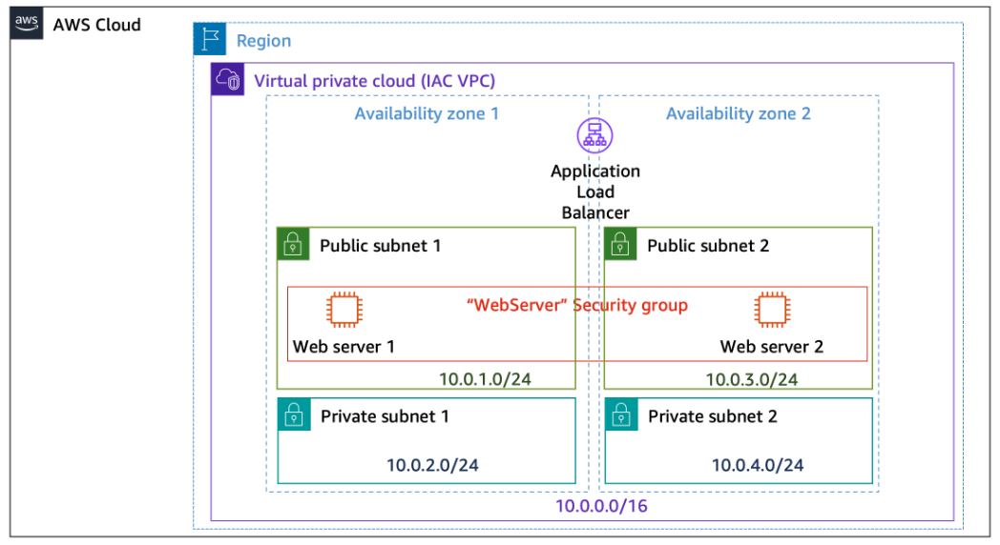

# Deploying Infrastructure as Code with AWS CodePipeline

## Lab Overview

In this lab, you create an AWS CloudFormation template and then configure AWS CodePipeline to automatically deploy the template when changes are made to the source code repository containing the template. Finally, you make a configuration change to the template and verify that the changes are complete.

By completing this lab, you learn how to create a CloudFormation template and use AWS CodePipeline to automatically deploy the template whenever changes are made to the source code repository. This automation process helps streamline infrastructure provisioning and ensures consistency across different environments.

## Objectives

By the end of this lab, you will be able to do the following:

Create an AWS CloudFormation template
Configure an AWS CodePipeline to deploy the template
Modify an existing infrastructure as code stack
Push the modified stack to the source code repository
Prerequisites
This lab requires:

Access to a computer with Microsoft Windows, Mac OS X, or Linux (Ubuntu, SuSE, or Red Hat)
A modern internet browser such as Chrome or Firefox
Duration
This lab requires approximately 75 minutes to complete.

Icon key
Various icons are used throughout this lab to call attention to different types of instructions and notes. The following list explains the purpose for each icon:

 Caution: Information of special interest or importance (not so important to cause problems with the equipment or data if you miss it, but it could result in the need to repeat certain steps).
 Command: A command that you must run.
 Expected output: A sample output that you can use to verify the output of a command or edited file.
 Hint: A hint to a question or challenge.
 Note: A hint, tip, or important guidance.
 Task complete: A conclusion or summary point in the lab.

## Task 1: Build your stack using Cloudformation

### Task 1.1: Clone the existing repository into Cloud9

Copy the Cloud9Environment URL link from the Lab Information section to the left of these instructions and paste it into a new browser tab.

 Note: The browser takes you to the AWS Cloud9 environment that you use during this lab.

Navigate to top section of the Cloud9 IDE and choose File and select New File.

Locate the Spaces: option located on the bottom of the new tab and click on this option one time.

Change the number of Spaces from 2 to 4.

 Command: To clone the iac-code-repo repository, run the following command in the bash terminal window:

```shell
git clone codecommit::us-west-2://iac-code-repo
```

 Expected output:

```shell
************************
**** EXAMPLE OUTPUT ****
************************

Cloning into 'iac-code-repo'...
remote: Counting objects: 5, done.
Unpacking objects: 100% (5/5), 485 bytes | 161.00 KiB/s, done.
```

 Command: To navigate to the source code directory, enter the following commands in the terminal.

```shell
cd iac-code-repo
```

 Expected output:

None, unless there is an error.

To see the contents of the code folder, in the panel to the left, expand the iac-code-repo folder.

Open the file named infrastructure.yml.

 Note: This file is the CloudFormation template that defines the stack you are building. The network infrastructure and two web servers have already been defined for you. You must define the rest of the stack.

### Task 1.2: Build a CloudFormation stack

In this task, you add the necessary resources to complete the infrastructure.



Image description: The image depicts a Amazon Virtual Private Cloud named IAC VPC with CIDR 10.0.0.0/16. IAC VPC consists of two Availability Zones: Availability Zone 1 and Availability Zone 2. Availability Zone 1 contains a Public subnet with CIDR 10.0.1.0/24. Availability Zone 1 contains a Private subnet with CIDR 10.0.2.0/24. Availability Zone 2 contains a Public subnet with CIDR 10.0.3.0/24. Availability Zone 2 contains a Private subnet with CIDR 10.0.4.0/24. Each Public subnet contains a Web server configured in WebServer security group. An Application load balancer balances traffic between Availability Zones 1 and 2.

Based on the infrastructure diagram supplied, use CloudFormation code to create the infrastructure. Guidance on the infrastructure is provided in the following steps.

 Caution: The CloudFormation code given below is written in yaml. Yaml is sensitive regarding indentation. Be sure to place resources starting at 1 tab from the beginning of the line. If you need help, a model solution is supplied.

Create a resource called WebServerRole of type AWS::IAM::Role with the following properties:

WebServerRole resource

  WebServerRole:
    Type: AWS::IAM::Role
    Properties:
      Description: 'Role for WebServer instances'
      AssumeRolePolicyDocument:
        Version: 2012-10-17
        Statement:
          - Effect: Allow
            Principal:
                Service:
                  - ec2.amazonaws.com
            Action:
              - sts:AssumeRole
      RoleName: WebServerRole
Create a resource called WebServerInstanceProfile of type AWS::IAM::InstanceProfile with the following properties:

Roles: !Ref WebServerRole
WebServerInstanceProfile resource

  WebServerInstanceProfile:
      Type: AWS::IAM::InstanceProfile
      Properties:
          Roles:
          - !Ref WebServerRole
Create a resource called WebServerSecurityGroup of type AWS::EC2::SecurityGroup with the following properties:

GroupName: WebServerSecurityGroup
GroupDescription: WebServerSecurityGroup
VpcId: !Ref VPC
Security Group Inbound rules
Allow SSH (Port 22) from Anywhere (0.0.0.0/0)
Allow HTTP (Port 80) from Anywhere (0.0.0.0/0)
Tags:
Key: Name
Value: WebServerSecurityGroup
WebServerSecurityGroup resource

  WebServerSecurityGroup:
      Type: AWS::EC2::SecurityGroup
      Properties:
          GroupName: "WebServerSecurityGroup"
          GroupDescription: "WebServerSecurityGroup"
          VpcId: !Ref VPC
          SecurityGroupIngress:
              - IpProtocol: tcp
                FromPort: 22
                ToPort: 22
                CidrIp: 0.0.0.0/0
              - IpProtocol: tcp
                FromPort: 80
                ToPort: 80
                CidrIp: 0.0.0.0/0
          Tags:
              - Key: Name
                Value: WebServerSecurityGroup
Create a resource called LoadBalancerSecurityGroup of type AWS::EC2::SecurityGroup with the following properties:

GroupName: LoadBalancerSecurityGroup
GroupDescription: LoadBalancerSecurityGroup
VpcId: !Ref VPC
Security Group Inbound rules
Allow HTTP (Port 80) from Anywhere (0.0.0.0/0)
Tags:
Key: Name
Value: WebServerSeLoadBalancerSecurityGroupcurityGroup
LoadBalancerSecurityGroup resource

  LoadBalancerSecurityGroup:
      Type: AWS::EC2::SecurityGroup
      Properties:
          GroupName: "LoadBalancerSecurityGroup"
          GroupDescription: "LoadBalancerSecurityGroup"
          VpcId: !Ref VPC
          SecurityGroupIngress:
              - IpProtocol: tcp
                FromPort: 80
                ToPort: 80
                CidrIp: 0.0.0.0/0
          Tags:
              - Key: Name
                Value: LoadBalancerSecurityGroup
Create a resource called ApplicationLoadBalancer of type AWS::ElasticLoadBalancingV2::LoadBalancer with the following properties:

Load Balancer Name: ApplicationLoadBalancer
Type: application
Scheme: Internet-facing
IP Address Type: ipv4
Subnets:
!Ref PublicSubnet1
!Ref PublicSubnet2
Security Group: !Ref LoadBalancerSecurityGroup
ApplicationLoadBalancer resource

  ApplicationLoadBalancer:
      Type: AWS::ElasticLoadBalancingV2::LoadBalancer
      Properties:
          IpAddressType: ipv4
          Name: !Ref 'AWS::StackName'
          LoadBalancerAttributes:
            - Key: deletion_protection.enabled
              Value: "false"
          Scheme: internet-facing
          SecurityGroups:
              - !Ref LoadBalancerSecurityGroup
          Subnets:
              - !Ref PublicSubnet1
              - !Ref PublicSubnet2
          Tags:
              - Key: Name
                Value: !Ref 'AWS::StackName'
          Type: application
Create a resource called Listener of type AWS::ElasticLoadBalancingV2::Listener with the following properties:

LoadBalancerArn: !Ref ApplicationLoadBalancer
Port: 80
Protocol: HTTP
DefaultAction
Type: forward TargetGroupArn: !Ref TargetGroup
Listener resource


  Listener:
      Type: AWS::ElasticLoadBalancingV2::Listener
      DependsOn:
        - ApplicationLoadBalancer
        - TargetGroup
      Properties:
          LoadBalancerArn: !Ref ApplicationLoadBalancer
          Port: 80
          Protocol: HTTP
          DefaultActions:
              - Type: forward
                TargetGroupArn: !Ref TargetGroup
Create a resource called TargetGroup of type AWS::ElasticLoadBalancingV2::TargetGroup with the following properties:

Target Group Name: AppTargetGroup
Target Type: Instance
Protocol: HTTP
Port: 80
VpcId: !Ref VPC
Targets:
WebServer1 Port 80
WebServer2 Port 80
TargetGroup resource

  TargetGroup:
      Type: AWS::ElasticLoadBalancingV2::TargetGroup
      Properties:
          Name: AppTargetGroup
          Port: 80
          Protocol: HTTP
          VpcId: !Ref VPC
          LoadBalancerArns:
              - !Ref ApplicationLoadBalancer
          TargetType: instance
          Targets:
              - Id: !Ref WebServer1
                Port: 80
              - Id: !Ref WebServer2
                Port: 80
Add an output called ApplicationLoadBalancerDNS to the template to provide the DNSName of the load balancer.
Outputs

Outputs:
    ApplicationLoadBalancerDNS:
        Description: DNS of Application Load Balancer
        Value: !GetAtt ApplicationLoadBalancer.DNSName
 Hint: If you need help, the model solution for infrastructure.yml is supplied below.

Model Solution for infrastructure.yml


AWSTemplateFormatVersion: 2010-09-09
Description: Sample template that contains common networking components for a lab with suggested dependencies to mitigate race conditions.

Resources:
#################################################
###  Start - Create lab network resources  ###
#################################################
  VPC:
      Type: AWS::EC2::VPC
      Properties:
          CidrBlock: 10.0.0.0/16
          EnableDnsSupport: true
          EnableDnsHostnames: true
          Tags:
              - Key: Name
                Value: IAC VPC
  
  InternetGateway:
      Type: AWS::EC2::InternetGateway
      DependsOn: VPC
      Properties:
          Tags:
              - Key: Name
                Value: IAC VPC Internet Gateway
  
  
  AttachGateway:
      Type: AWS::EC2::VPCGatewayAttachment
      Properties:
          VpcId: !Ref "VPC"
          InternetGatewayId: !Ref "InternetGateway"
  
  PublicSubnet1:
      Type: AWS::EC2::Subnet
      DependsOn: AttachGateway
      Properties:
          VpcId: !Ref "VPC"
          CidrBlock: 10.0.1.0/24
          AvailabilityZone: !Select
              - "0"
              - !GetAZs ""
          Tags:
              - Key: Name
                Value: IAC VPC Public Subnet 1
  
  PrivateSubnet1:
      Type: AWS::EC2::Subnet
      Properties:
          VpcId: !Ref "VPC"
          CidrBlock: 10.0.2.0/24
          AvailabilityZone: !Select
              - "0"
              - !GetAZs ""
          Tags:
              - Key: Name
                Value: IAC VPC Private Subnet 1
  
  PublicSubnet2:
      Type: AWS::EC2::Subnet
      DependsOn: AttachGateway
      Properties:
          VpcId: !Ref "VPC"
          CidrBlock: 10.0.3.0/24
          AvailabilityZone: !Select
              - "1"
              - !GetAZs ""
          Tags:
              - Key: Name
                Value: IAC VPC Public Subnet 2
  
  PrivateSubnet2:
      Type: AWS::EC2::Subnet
      Properties:
          VpcId: !Ref "VPC"
          CidrBlock: 10.0.4.0/24
          AvailabilityZone: !Select
              - "1"
              - !GetAZs ""
          Tags:
              - Key: Name
                Value: IAC VPC Private Subnet 2
  
  PublicRouteTable:
      Type: AWS::EC2::RouteTable
      DependsOn:
      - PublicSubnet1
      Properties:
          VpcId: !Ref "VPC"
          Tags:
              - Key: Name
                Value: IAC VPC Public Route Table
  
  PublicRoute:
      Type: AWS::EC2::Route
      DependsOn:
          - VPC
          - AttachGateway
      Properties:
          RouteTableId: !Ref "PublicRouteTable"
          DestinationCidrBlock: 0.0.0.0/0
          GatewayId: !Ref "InternetGateway"
  
  PublicSubnet1RouteTableAssociation:
      Type: AWS::EC2::SubnetRouteTableAssociation
      DependsOn: PublicRoute
      Properties:
          SubnetId: !Ref "PublicSubnet1"
          RouteTableId: !Ref "PublicRouteTable"
  
  PublicSubnet2RouteTableAssociation:
      Type: AWS::EC2::SubnetRouteTableAssociation
      DependsOn: PublicRoute
      Properties:
          SubnetId: !Ref "PublicSubnet2"
          RouteTableId: !Ref "PublicRouteTable"
  
  PrivateRouteTable:
      Type: AWS::EC2::RouteTable
      Properties:
          VpcId: !Ref "VPC"
          Tags:
              - Key: Name
                Value: IAC VPC Private Route Table
  
  PrivateSubnet1RouteTableAssociation:
      Type: AWS::EC2::SubnetRouteTableAssociation
      DependsOn:
          - PublicRouteTable
      Properties:
          SubnetId: !Ref "PrivateSubnet1"
          RouteTableId: !Ref "PrivateRouteTable"
  
  PrivateSubnet2RouteTableAssociation:
      Type: AWS::EC2::SubnetRouteTableAssociation
      DependsOn:
          - PublicRouteTable
      Properties:
          SubnetId: !Ref "PrivateSubnet2"
          RouteTableId: !Ref "PrivateRouteTable"
  ############################################
  ###  End - Create lab network resources  ###
  ############################################
  
  
  WebServerRole:
    Type: AWS::IAM::Role
    Properties:
      Description: 'Role for WebServer instances'
      AssumeRolePolicyDocument:
        Version: 2012-10-17
        Statement:
          - Effect: Allow
            Principal:
                Service:
                  - ec2.amazonaws.com
            Action:
              - sts:AssumeRole
      RoleName: WebServerRole
  
  WebServerInstanceProfile:
      Type: AWS::IAM::InstanceProfile
      Properties:
          Roles:
          - !Ref WebServerRole
  
  WebServer1:
      Type: AWS::EC2::Instance
      Properties:
          AvailabilityZone: !Select 
              - '0'
              - !GetAZs 
          ImageId: !Sub '{{resolve:ssm:/aws/service/ami-amazon-linux-latest/al2023-ami-minimal-kernel-default-x86_64}}'
          InstanceType: t2.micro
          IamInstanceProfile: !Ref WebServerInstanceProfile
          NetworkInterfaces:
              - DeviceIndex: 0
                AssociatePublicIpAddress: true
                SubnetId: !Ref PublicSubnet1
                GroupSet:
                  - !Ref WebServerSecurityGroup
          UserData:
              Fn::Base64:
                !Sub |  
                #!/bin/bash
                # Install Apache Web Server and PHP
                sudo yum install -y httpd
                sudo systemctl start httpd 
                sudo systemctl enable httpd 
                sudo usermod -a -G apache ec2-user
                sudo chown -R ec2-user:apache /var/www
                sudo chmod 2775 /var/www
                find /var/www -type d -exec sudo chmod 2775 {} \;
                echo "Hello World from $(hostname)" > /var/www/html/index.html
          Tags:
              - Key: Name
                Value: WebServer1
  
  WebServer2:
      Type: AWS::EC2::Instance
      Properties:
          AvailabilityZone: !Select 
              - '1'
              - !GetAZs 
          ImageId: !Sub '{{resolve:ssm:/aws/service/ami-amazon-linux-latest/al2023-ami-minimal-kernel-default-x86_64}}'
          InstanceType: t2.micro
          IamInstanceProfile: !Ref WebServerInstanceProfile
          NetworkInterfaces:
              - DeviceIndex: 0
                AssociatePublicIpAddress: true
                SubnetId: !Ref PublicSubnet2
                GroupSet:
                    - !Ref WebServerSecurityGroup
          UserData:
              Fn::Base64:
                !Sub |  
                #!/bin/bash
                # Install Apache Web Server and PHP
                sudo yum install -y httpd
                sudo systemctl start httpd 
                sudo systemctl enable httpd 
                sudo usermod -a -G apache ec2-user
                sudo chown -R ec2-user:apache /var/www
                sudo chmod 2775 /var/www
                find /var/www -type d -exec sudo chmod 2775 {} \;
                echo "Hello World from $(hostname)" > /var/www/html/index.html
          Tags:
              - Key: Name
                Value: WebServer2
  
  WebServerSecurityGroup:
      Type: AWS::EC2::SecurityGroup
      Properties:
          GroupName: "WebServerSecurityGroup"
          GroupDescription: "WebServerSecurityGroup"
          VpcId: !Ref VPC
          SecurityGroupIngress:
              - IpProtocol: tcp
                FromPort: 22
                ToPort: 22
                CidrIp: 0.0.0.0/0
              - IpProtocol: tcp
                FromPort: 80
                ToPort: 80
                CidrIp: 0.0.0.0/0
          Tags:
              - Key: Name
                Value: WebServerSecurityGroup
  
  LoadBalancerSecurityGroup:
      Type: AWS::EC2::SecurityGroup
      Properties:
          GroupName: "LoadBalancerSecurityGroup"
          GroupDescription: "LoadBalancerSecurityGroup"
          VpcId: !Ref VPC
          SecurityGroupIngress:
              - IpProtocol: tcp
                FromPort: 80
                ToPort: 80
                CidrIp: 0.0.0.0/0
          Tags:
              - Key: Name
                Value: LoadBalancerSecurityGroup
  
  TargetGroup:
      Type: AWS::ElasticLoadBalancingV2::TargetGroup
      Properties:
          Name: AppTargetGroup
          Port: 80
          Protocol: HTTP
          VpcId: !Ref VPC
          LoadBalancerArns:
              - !Ref ApplicationLoadBalancer
          TargetType: instance
          Targets:
              - Id: !Ref WebServer1
                Port: 80
              - Id: !Ref WebServer2
                Port: 80
  
  
  ApplicationLoadBalancer:
      Type: AWS::ElasticLoadBalancingV2::LoadBalancer
      Properties:
          IpAddressType: ipv4
          Name: !Ref 'AWS::StackName'
          LoadBalancerAttributes:
            - Key: deletion_protection.enabled
              Value: "false"
          Scheme: internet-facing
          SecurityGroups:
              - !Ref LoadBalancerSecurityGroup
          Subnets:
              - !Ref PublicSubnet1
              - !Ref PublicSubnet2
          Tags:
              - Key: Name
                Value: !Ref 'AWS::StackName'
          Type: application
  
  Listener:
      Type: AWS::ElasticLoadBalancingV2::Listener
      DependsOn:
        - ApplicationLoadBalancer
        - TargetGroup
      Properties:
          LoadBalancerArn: !Ref ApplicationLoadBalancer
          Port: 80
          Protocol: HTTP
          DefaultActions:
              - Type: forward
                TargetGroupArn: !Ref TargetGroup
    
Outputs:
    ApplicationLoadBalancerDNS:
        Description: DNS of Application Load Balancer
        Value: !GetAtt ApplicationLoadBalancer.DNSName
Save the changes to infrastructure.yml.

 Command: To stage the changes and commit them to your local repository, run the following commands:


git add -A
git commit -m "Created the CloudFormation template"
 Expected output:


************************
**** EXAMPLE OUTPUT ****
************************

[main 1d2793a] Created the CloudFormation template
    Committer: Ubuntu <ubuntu@ip-10-0-1-126.us-west-2.compute.internal>
Your name and email address were configured automatically based
on your username and hostname. Please check that they are accurate.
You can suppress this message by setting them explicitly:

    git config --global user.name "Your Name"
    git config --global user.email you@example.com

After doing this, you may fix the identity used for this commit with:

    git commit --amend --reset-author

1 file changed, 8 insertions(+)
 Command: To push your changes to the iac-code-repo repository, run the following command:


git push
 Expected output:


************************
**** EXAMPLE OUTPUT ****
************************

Enumerating objects: 5, done.
Counting objects: 100% (5/5), done.
Delta compression using up to 2 threads
Compressing objects: 100% (3/3), done.
Writing objects: 100% (3/3), 499 bytes | 499.00 KiB/s, done.
Total 3 (delta 1), reused 0 (delta 0), pack-reused 0
remote: Validating objects: 100%
To codecommit::us-west-2://iac-code-repo
    20f08fc..1d2793a  main -> main
 Task complete: You have created a CloudFormation template to define your stack and checked your changes into the source code repository.

Task 2: Configure AWS CodePipeline to deploy an infrastructure stack
In this task, you configure an AWS CodePipeline to deploy and update the infrastructure stack when new code changes are push to the source code repository. You create source, build, and deploy steps as part of the pipeline.

Return to browser tab with the AWS Console.

At the top of the AWS Management Console, in the search bar, search for and choose CodePipeline.

Choose Create pipeline.

On the Choose pipeline settings page, make the following selections:

In the Pipeline settings section:

For Pipeline name, enter iac-pipeline.
For Pipeline type, leave this as Queued (Pipeline type V2 required).
For Service role, select Existing service role.
For Role ARN, select the role with ApplicationPipelineRole as the Role ARN.
In the Variables section:

Leave this as the default setting.
In the Advanced settings section:

For Artifact store, select Custom location.
For Bucket, select the bucket with artifactstorebucket in the name.
Choose Next.

On the Add source stage page, make the following selections:

In the Source section:
For Source provider, select AWS CodeCommit.
For Repository name, select iac-code-repo.
For Branch name, choose main.
Leave everything else as default.
Choose Next.

On the Add build stage page, make the following selections:

In the Build - optional section:
For Build provider, select AWS CodeBuild.
For Region, keep this as default.
For Input artifacts, keep this as default.
For Project name, choose the Create project button and follow the steps in the pop up window that appears.
 Note: Ensure the browser has the pop-up settings enabled.

On the Create build project window, make the following selections:

In the Project configuration section:

For project name, enter IacBuildProject.
In the Environment section:

For Service role, select Existing service role.
For Role ARN, select the role arn with ApplicationBuildProjectRole in the name.
In the Buildspec section:

For Build specifications, select Use a buildspec file.
Leave everything else as default.
Choose Continue to CodePipeline.

 Note: If prompted about leaving the site, choose Leave.

 Expected output: Once you choose Leave, a green box with Successfully created IacBuildProject in CodeBuild appears following the Project name section.

Continuing on to the Add build stage page, choose Next.

On the Add deploy stage page, make the following selections:

In the Deploy - optional section:
For Deploy provider, select AWS CloudFormation.
For Region, leave this as the default.
For Input artifacts, leave this as the default.
For Action mode, select Create or update a stack.
For Stack name, enter iac-stack.
For Artifact name, select BuildArtifact.
For File name, enter infrastructure.yml.
For Capabilities - optional, select CAPABILITY_NAMED_IAM.
For Role name, select the role with PipelineCloudformationAdmin in the name.
For Output file name, leave this blank.
Choose Next.

Choose Create pipeline.

The pipeline is created and begins running.

Wait until the deploy stage of the pipeline completes successfully.

 Caution: If all 3 stages of the pipeline do not complete successfully, verify that you have completed all of the steps in the lab correctly.

At the top of the AWS Management Console, in the search bar, search for and choose CloudFormation.

In the list of stacks, choose the stack with iac-stack as the stack name.

On the stack details page, choose the Outputs tab.

Copy the value of the ApplicationLoadBalancerDNS output and paste it into a new browser tab.

You should see a simple html page with text similar to the following: Hello World from ip-10-0-3-98.us-west-2.compute.internal.

 Task complete: You have successfully configured an AWS CodePipeline and deployed an infrastructure as code stack.

Task 3: Modify an infrastructure stack
After a security review, it is pointed out that WebServer1 and WebServer2 do not need to have port 22 open to any IP address (0.0.0.0/0). This configuration is a security vulnerability.

In this task, you modify the stack by removing the inbound rule allowing port 22 access to the WebServer security group.

In the AWS Cloud9 IDE, modify infrastructure.yml by removing the Port 22 SecurityGroupIngress role from the WebServerSecurityGroup.

The WebServerSecurityGroup should look like the following.


WebServerSecurityGroup:
    Type: AWS::EC2::SecurityGroup
    Properties:
    GroupName: "WebServerSecurityGroup"
    GroupDescription: "WebServerSecurityGroup"
    VpcId: !Ref VPC
    SecurityGroupIngress:
        - IpProtocol: tcp
          FromPort: 80
          ToPort: 80
          CidrIp: 0.0.0.0/0
    Tags:
        - Key: Name
        Value: WebServerSecurityGroup
Save the changes to infrastructure.yml.

 Command: To stage the changes and commit them to your local repository, run the following commands:


git add -A
git commit -m "Removed access to Port 22 for the WebServerSecurityGroup"
 Expected output:


************************
**** EXAMPLE OUTPUT ****
************************

[main 1d2793a] Created the CloudFormation template
    Committer: Ubuntu <ubuntu@ip-10-0-1-126.us-west-2.compute.internal>
Your name and email address were configured automatically based
on your username and hostname. Please check that they are accurate.
You can suppress this message by setting them explicitly:

    git config --global user.name "Your Name"
    git config --global user.email you@example.com

After doing this, you may fix the identity used for this commit with:

    git commit --amend --reset-author

1 file changed, 8 insertions(+)
 Command: To push your changes to the iac-code-repo repository, run the following command:


git push
 Expected output:


************************
**** EXAMPLE OUTPUT ****
************************

Enumerating objects: 5, done.
Counting objects: 100% (5/5), done.
Delta compression using up to 2 threads
Compressing objects: 100% (3/3), done.
Writing objects: 100% (3/3), 499 bytes | 499.00 KiB/s, done.
Total 3 (delta 1), reused 0 (delta 0), pack-reused 0
remote: Validating objects: 100%
To codecommit::us-west-2://iac-code-repo
    20f08fc..1d2793a  main -> main
After the CodePipeline completes, verify that the stack is still configured properly by visiting the load balancer URL as you did in Task 2.

 Task complete: You have created a CloudFormation template to define your stack and checked your changes into the source code repository.

Conclusion
 Congratulations! You now have successfully:

Created an AWS CloudFormation template
Configured an AWS CodePipeline to deploy the template
Modified an existing infrastructure as code stack
Pushed the modified stack to the source code repository
End lab
Follow these steps to close the console and end your lab.

Return to the AWS Management Console.

At the upper-right corner of the page, choose AWSLabsUser, and then choose Sign out.

Choose End lab and then confirm that you want to end your lab.

Additional Resources
For more information about AWS CloudFormation, see What is AWS CloudFormation?.
For more information about AWS CodePipeline, see What is AWS CodePipeline?