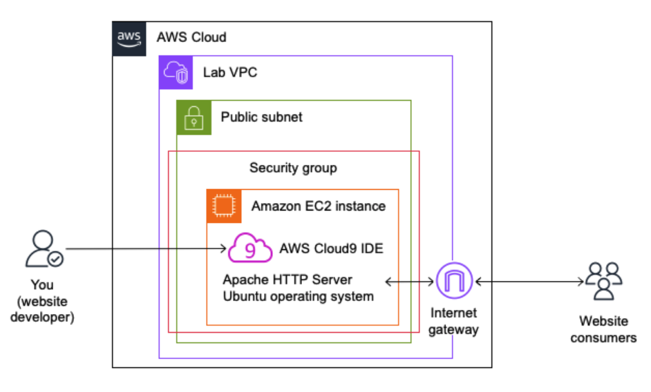

# Implementing AWS CloudFormation Intrinsic Functions and Keywords

## Lab Overview

You are a cloud engineer at AnyCompany, responsible for deploying and managing the company’s infrastructure on Amazon Web Services (AWS) using AWS CloudFormation. AnyCompany is transitioning to an infrastructure-as-code approach, and you have been tasked with enhancing an existing AWS CloudFormation template to leverage advanced utilities like intrinsic functions, conditions, and rules.

In this lab, you review a provided AWS CloudFormation template. You fill in the missing keywords and implement the required intrinsic functions, conditions, and rules. After completing the template, you deploy the AWS CloudFormation stack, validate the provisioned resources, and then delete the entire stack and its associated resources, reinforcing the importance of proper infrastructure management practices.

Objectives
By the end of this lab, you should be able to do the following:

Utilize intrinsic functions to reference and retrieve resource properties and values.
Implement conditional logic and input validation rules within the CloudFormation template.
Deploy a complete CloudFormation stack by filling in the missing elements.
Validate the successful deployment and deletion of the CloudFormation stack and its resources.
Icon key
 Answer: An answer to a question or challenge.
 Caution: Information of special interest or importance (not so important to cause problems with the equipment or data if you miss it, but it could result in the need to repeat certain steps).
 Hint: A hint to a question or challenge.
 Learn more: Where to find more information.
 Note: A hint, tip, or important guidance.
 Task complete: A conclusion or summary point in the lab.
 Warning: An action that is irreversible and could potentially impact the failure of a command or process (including warnings about configurations that cannot be changed after they are made).
Start lab
To launch the lab, at the top of the page, choose Start lab.

 Caution: You must wait for the provisioned AWS services to be ready before you can continue.

To open the lab, choose Open Console .

You are automatically signed in to the AWS Management Console in a new web browser tab.

 Warning: Do not change the Region unless instructed.

Common sign-in errors
Error: Choosing Start Lab has no effect
In some cases, certain pop-up or script blocker web browser extensions might prevent the Start Lab button from working as intended. If you experience an issue starting the lab:

Add the lab domain name to your pop-up or script blocker’s allow list or turn it off.
Refresh the page and try again.

## Lab environment

The following diagram shows the basic architecture of the lab environment. The resources depicted in the diagram already exist in your Amazon Web Services (AWS) account when you start the lab.



Image description: The diagram illustrates a setup where a web developer uses the AWS Cloud infrastructure to develop and host a website. The website is served from an Amazon Elastic Compute Cloud (Amazon EC2) instance. The Amazon EC2 instance runs an Apache web server and is accessible to the public through an internet gateway. The security group acts as a firewall to control access to the Amazon EC2 instance. For more information, refer to the following detailed diagram overview.

To review the detailed diagram description, expand the following section.
The diagram illustrates an AWS infrastructure setup, which includes various components arranged hierarchically to represent how a web development environment is configured in the cloud. Starting from the outermost layer and moving inward, the components are as follows:

AWS Cloud: The overall environment is encapsulated in the AWS Cloud, which is the broader context where all the components reside.

Lab VPC: A virtual private cloud (VPC) designated as Lab VPC. This is like a virtual network in the AWS environment that is isolated from other virtual networks.

Public subnet: Inside the Lab VPC, is a public subnet. This subnet is accessible from the internet. A subnet is a range of IP addresses in the VPC.

Security group: In the public subnet, is a security group. It acts as a virtual firewall controlling the traffic to the Amazon Elastic Compute Cloud (Amazon EC2) instance.

Amazon EC2 instance: Inside the security group, is an EC2 instance. This is a virtual server in AWS where applications can run. The EC2 instance is depicted with the EC2 instance group icon. Inside this instance, two key components are mentioned:

AWS Cloud9 IDE: An integrated development environment (IDE) provided by AWS. In this diagram, it’s part of the EC2 instance. This indicates that the AWS Cloud9 IDE is being used for development directly in the EC2 instance.
Apache HTTP Server on Ubuntu operating system: The EC2 instance is running the Ubuntu operating system and has an Apache HTTP Server installed on it. The Apache server is software that handles HTTP requests and serves webpages.
Internet gateway: The internet gateway connects to the public subnet, making communication possible between the EC2 instance and the internet.

You (website developer): On the left side of the diagram, is an icon of a person with the label You (website developer). This represents the developer who interacts with the AWS Cloud and, specifically, the EC2 instance, perhaps using the AWS Cloud9 IDE for developing a website.

Website consumers: On the right side of the diagram, is an icon of three people with the label Website consumers. This represents end users or visitors who access the website hosted on the EC2 instance through the internet.

Services used in this lab
AWS CloudFormation
AWS CloudFormation is a service that helps you model and provision all the resources needed for your applications across all Regions and accounts in an automated and secure manner. In this lab, you use CloudFormation to deploy and manage AWS resources using a template that leverages intrinsic functions, conditions, and rules.

Amazon EC2
Amazon Elastic Compute Cloud (Amazon EC2) provides scalable computing capacity in the AWS Cloud. In this lab, deploy an EC2 instance using the CloudFormation template, and configure it with an Apache web server to serve a dynamic HTML page displaying instance metadata.

Amazon VPC
Amazon Virtual Private Cloud (Amazon VPC) enables you to provision a logically isolated virtual network in the AWS Cloud. In this lab, you import a pre-existing VPC and subnet created in another stack to be used by the EC2 instance deployed through the CloudFormation template.

Cloud9
AWS Cloud9 is a cloud-based integrated development environment (IDE) that allows you to write, run, and debug code with just a browser. In this lab, you use the Cloud9 IDE to edit and update the CloudFormation template with intrinsic functions, conditions, and rules.

Task 1: Establish the development environment
In this task, you connect to the AWS Cloud9 integrated development environment (IDE) to use as the development environment. Then you add the provided AWS CloudFormation template to this environment for use in this lab.

Task 1.1: Connect to the AWS Cloud9 IDE
In this initial task, you establish the development environment by connecting to the AWS Cloud9 integrated development environment (IDE) and familiarizing yourself with the provided AWS CloudFormation template. The Cloud9 IDE serves as your primary workspace for editing and updating the CloudFormation template throughout this lab.

Copy the Cloud9Environment URL value that is listed to the left of these instructions, and paste it into a new browser tab. It connects you to the AWS Cloud9 IDE.

 Note: The LabTemplate.yaml file is located at the root of the Cloud9 file directory. This file is necessary to complete this lab.

Open the LabTemplate.yaml file in the AWS Cloud9 file editor

Familiarize yourself with the AWS CloudFormation template contained in the LabTemplate.yaml file by observing the following sections.

Parameters: Configure resources dynamically during stack creation or update.
Mappings: Associate values or configurations with specific conditions or keys.
Resources: Define AWS resources to create, configure, and manage using logical IDs.
Outputs: Expose important resource information or values for reference or further use.
Helpful Terms
Logical ID: A unique identifier for each resource within the template, used for referencing and managing dependencies.
Intrinsic Functions: Special functions that modify resource properties or values. Examples: !Ref, !FindInMap, !Sub, !GetAtt.
Stack: A collection of AWS resources created, updated, or deleted as a single unit based on the AWS CloudFormation template.
Parameter: A value passed during stack creation or update to dynamically configure resources.
Mapping: A set of key-value pairs associating specific values or configurations with conditions or keys.
Resource: An AWS service or component defined and managed by CloudFormation (for example: EC2 instance, security group, VPC).
Output: Resource information or values exposed by the CloudFormation stack for reference or further use.
Template recap
This template provisions an EC2 instance with an Apache HTTP server. It dynamically configures the instance using parameters and mappings based on the selected environment (Development or Production). The instance retrieves its metadata to generate an HTML page displaying instance details. The template also creates a security group allowing inbound HTTP traffic and outputs the instance’s public DNS name and website URL.

 Task complete: You have successfully connected to the AWS Cloud9 IDE and familiarized yourself with the AWS CloudFormation lab template.

Task 2: Implement Intrinsic Functions
In this task, you update the existing AWS CloudFormation template by implementing various intrinsic functions using the Cloud9 IDE. These functions enhance the template’s flexibility, enabling dynamic resource configurations and cross-stack value sharing.

Task 2.1: Reference stack resources
The !Ref function is used to reference resources, parameters, or other values within the same CloudFormation stack.

To locate the reference TODO tasks in the LabTemplate.yaml file, search for the keyword Reference.

 Note: To search a keyword (or phrase):

Use the keyboard shortcut Cntrl+F on Windows and Linux machines or Command+F on a Mac.
A Find tool bar appears at the bottom of the Cloud9 IDE browser window.
Enter the desired search parameter into the Find text-area.
After searching a keyword (or phrase), all existing instances of your search are highlighted in the Cloud9 IDE.
If multiple instances exist, the arrows to the right of the search text-area allow you to navigate between each instance.
To reference the image ID in the lab EC2 instance, assign the latest AMI ID parameter to the ImageId key.

 Hint:

To view the hint, expand the following section.
Use the !Ref function.
The latest AMI parameter logical ID is LatestAmiId.
 Answer:

To view the answer, expand the following section.

**********************************
**** This is an EXAMPLE ONLY. ****
**********************************

Resources:
  LabInstance:
    Type: AWS::EC2::Instance
    Properties:
      ImageId: !Ref LatestAmiId # DONE: Reference the Latest AMI ID parameter`
After updating the code in the template file, change the status from TODO to DONE.

To navigate to the next TODO task, select the right arrow in the Find tool bar to Find the next instance of the keyword Reference.

To reference the security group in the lab EC2 instance, assign the security group logical ID to the SecurityGroupIds list.

 Hint:

To view the hint, expand the following section.
Use the !Ref function.
The security group logical ID is InstanceSecurityGroup.
This YAML code uses list syntax, where any list item is preceded by a dash.
One security group is added for this use case.
 Answer:

To view the answer, expand the following section.

**********************************
**** This is an EXAMPLE ONLY. ****
**********************************

```yaml
SecurityGroupIds:
  - !Ref InstanceSecurityGroup # DONE: Reference the Instance Security Group resource
```

After updating the code in the template file, change the status from TODO to DONE.
This task accomplished referencing resources and values within the same CloudFormation stack using the !Ref intrinsic function.

Task 2.2: Retrieve values from mappings
The !FindInMap function is used to retrieve values from mappings defined within your CloudFormation template. Mappings allow you to associate specific values or configurations with different conditions or keys, enabling dynamic resource configurations based on your requirements.

To locate the find in map TODO task in the LabTemplate.yaml file, search for the keywords Find and retrieve the instance type.

Use the !FindInMap function to retrieve the InstanceType from the EnvironmentConfigMap mapping based on the Environment parameter value.

 Hint:

To view the hint, expand the following section.
Syntax example: !FindInMap [ MapName, TopLevelKey, SecondLevelKey ].
The MapName is EnvironmentConfigMap.
The TopLevelKey is a reference to the Environment parameter.
The SecondLevelKey is the InstanceType.
Using the !FindInMap function and referencing the Environment parameter is necessary because the environment could be either Development or Production and the value of the InstanceType is different for each environment.
 Answer:

To view the answer, expand the following section.

**********************************
**** This is an EXAMPLE ONLY. ****
**********************************

InstanceType: !FindInMap [EnvironmentConfigMap, !Ref Environment, InstanceType] # DONE: Find and retrieve the instance type from the EnvironmentConfigMap mapping based on the Environment parameter value
After updating the code in the template file, change the status from TODO to DONE.
The !FindInMap function retrieved the EC2 instance type from the EnvironmentConfigMap mapping. This allowed tailoring resource configuration to the selected environment using the Environment parameter value and mapping values.

Task 2.3: Import resources from another stack
The !ImportValue function allows you to import resources from other CloudFormation stacks, enabling a modular infrastructure design. In this lab, you import a pre-existing VPC and subnet created and exported from another template. This approach aligns with AWS best practices for better resource lifecycle management and cross-stack references. Importing resources from separate stacks is useful when you want to share common infrastructure components across multiple applications or environments, promoting reusability and maintainability of your CloudFormation templates.

To locate the import TODO tasks in the LabTemplate.yaml file, search for the keywords Import the public subnet ID.

To import the subnet into the lab EC2 instance, assign the imported value of PublicSubnetId to the SubnetId key. This subnet has been created in another stack and provided for use in this lab.

 Hint:

To view the hint, expand the following section.
Use the !ImportValue function.
The provided subnet export name is PublicSubnetId.
 Answer:

To view the answer, expand the following section.

**********************************
**** This is an EXAMPLE ONLY. ****
**********************************

SubnetId: !ImportValue PublicSubnetId # DONE: Import the public subnet ID provided for this lab
After updating the code in the template file, change the status from TODO to DONE.

To complete the next TODO task, navigate to the next instance of the keyword Import.

To import the VPC into the instance security group, assign the imported value of LabVPCId to the VpcId key. This VPC has been created in another stack and provided for use in this lab.

 Hint:

To view the hint, expand the following section.
Use the !ImportValue function.
The provided subnet export name is LabVPCId.
 Answer:

To view the answer, expand the following section.

**********************************
**** This is an EXAMPLE ONLY. ****
**********************************

VpcId: !ImportValue LabVPCId # DONE: Import the VPC ID provided for this lab
After updating the code in the template file, change the status from TODO to DONE.
You imported pre-existing resources from another CloudFormation stack using the !ImportValue function to enable modular infrastructure design and resource reusability.

Task 2.4: Retrieve resource attributes
The !GetAtt function is used to retrieve specific attribute values from resources within your AWS CloudFormation template.

To locate the get attribute TODO task in the LabTemplate.yaml file, search for the keyword Get.

Retrieve the public DNS name attribute of the lab instance and assign it to the Value: key. Use dot notation to access the resource attribute.

 Hint:

To view the hint, expand the following section.
Use the !GetAtt function.
Syntax example: !GetAtt LogicalNameOfResource.AttributeName.
The LogicalNameOfResource is LabInstance.
The AttributeName is PublicDnsName.
 Answer:

To view the answer, expand the following section.

**********************************
**** This is an EXAMPLE ONLY. ****
**********************************

Value: !GetAtt LabInstance.PublicDnsName #DONE: Get the LabInstance PublicDnsName attribute
After updating the code in the template file, change the status from TODO to DONE.
You retrieved the EC2 instance’s public DNS name attribute using !GetAtt and assigned it as an output value for easy reference.

Task 2.5: Construct dynamic strings
The !Sub function is used to construct string values within AWS CloudFormation templates by substituting variables or resource attributes.

To locate the substitute usage and TODO task in the LabTemplate.yaml file, search for the keyword Substitute.

Examine the implementation of the !Sub function in the UserData script.

 Caution: Do not edit the code unless there is a TODO task. The code in the UserData script is complete.

 Note:

The Fn::Base64 function is used to encode the UserData script as a base64 string, which is a requirement for providing user data to EC2 instances.
The !Sub function is used with the | multi-line signifier to substitute values into the multi-line string.
Navigate to the second instance of the keyword Substitute.

Examine the ${Environment} variable usage.

 Note: The ${Environment} variable displays either the value Development or Production. Environment is a parameter chosen during stack creation.

To complete the !Sub TODO task, navigate to the third instance of the keyword Substitute.

Substitute the lab instance public DNS name into the website URL.

 Hint:

To view the hint, expand the following section.
Use the !Sub function.
Syntax example: !Sub http://${RelevantValue}.
The RelevantValue is LabInstance.PublicDnsName.
 Answer:

To view the answer, expand the following section.

**********************************
**** This is an EXAMPLE ONLY. ****
**********************************

Value: !Sub http://${LabInstance.PublicDnsName} #DONE: Substitute the LabInstance PublicDnsName into the website URL
After updating the code in the template file, change the status from TODO to DONE.
You substituted a resource attribute value into a string using the !Sub intrinsic function.

To confirm all TODO tasks are complete, search the keyword TODO. The word TODO should no longer be found in the template file.

Save the LabTemplate.yaml file locally. Choose (right-click) the file name LabTemplate.yaml and select download. Remember where you save the file, you upload it in the next task.

 Task complete: You have successfully leveraged the !Ref, !FindInMap, !ImportValue, !GetAtt, and !Sub intrinsic functions to enhance the CloudFormation template’s flexibility and enable dynamic resource configurations. By completing this task, you have gained hands-on experience with essential CloudFormation utilities and their practical applications.

 Learn more: See AWS CloudFormation Intrinsic Functions listed in the Additional Resources section.

Task 3: Deploy the AWS CloudFormation stack
In this task, you deploy the updated AWS CloudFormation template that incorporates the various intrinsic functions implemented in the previous task. This allows you to witness the practical application of these functions and observe how they enable dynamic resource configurations and cross-stack value sharing.

At the top of the AWS Management Console, in the search bar, search for and choose AWS CloudFormation.

On the upper right corner of the page, choose Create stack  .

Select With new resources (standard).

Select  Choose an existing template .

Select  Upload a template file .

Choose Choose file.

Select the LabTemplate.yaml file you save in the previous task.

Choose Next.

On the Specify stack details page, in the Stack name field, enter the value CloudFormationUtilities.

 Note:

Keep the default value for the Environment and LatestAmiId parameters.
The options for the Environment parameter are configured in the LabTemplate.yaml file.
The Latest Linux AMI is the preferable option, but the default value could be changed during creation if necessary.
Choose Next.

On the Configure stack options page, scroll down and choose Next.

On the Review and create page, scroll down and choose Submit.

 Note:

The stack has a status of CREATE_IN_PROGRESS.
After a few minutes, if properly configured, the status changes to  CREATE_COMPLETE.
If stack creation is not successful, troubleshoot any error messages before proceeding. A common mistake is an improperly formatted template.
If stack creation is successful, proceed to confirm functionality.
Select the Outputs tab in the AWS CloudFormation console.

 Note: Details of the two outputs created in your template are displayed here.

Open the WebsiteURL in a new browser tab.

 Note: The HTML page should display the EC2 instance ID, public IP address, public DNS name, and the selected environment (Development or Production) as confirmation of successful functionality.

 Task complete: You have successfully deployed the CloudFormation stack incorporating the intrinsic functions, witnessed their practical application in dynamic resource configurations and cross-stack value sharing, and confirmed the successful functionality of the provisioned resources.

Task 4: Delete the CloudFormation Stack
After validating the successful deployment of the CloudFormation stack, you delete the stack and all its associated resources to practice proper infrastructure management practices and ensure a clean environment for future labs or projects.

In the AWS Management Console, navigate to the CloudFormation service.

Select the CloudFormationUtilities stack from the list of stacks.

From the stack actions menu, choose Delete to initiate the deletion process.

When prompted, check the box to confirm that you want to delete the stack and its associated resources.

Choose Delete Stack.

The stack has a status of DELETE_IN_PROGRESS while it is being deleted.

 Note: After a few minutes, if the deletion is successful, the stack is removed from the list of stacks.

 Task complete: You have successfully deleted the CloudFormation stack and all its provisioned resources.

Conclusion
In this lab, you have successfully done the following:

Utilize intrinsic functions to reference and retrieve resource properties and values.
Implement conditional logic and input validation rules within the CloudFormation template.
Deploy a complete CloudFormation stack by filling in the missing elements.
Validate the successful deployment and deletion of the CloudFormation stack and its resources.
End lab
Follow these steps to close the console and end your lab.

Return to the AWS Management Console.

At the upper-right corner of the page, choose AWSLabsUser, and then choose Sign out.

Choose End lab and then confirm that you want to end your lab.

### Additional Resources

* For more information about AWS CloudFormation best practices, see [AWS CloudFormation best practices](https://docs.aws.amazon.com/AWSCloudFormation/latest/UserGuide/best-practices.html).
* For insights into AWS CloudFormation intrinsic functions, see [AWS CloudFormation intrinsic functions](https://docs.aws.amazon.com/AWSCloudFormation/latest/UserGuide/intrinsic-function-reference.html), a comprehensive guide explaining all intrinsic functions available in CloudFormation, their syntax, and examples.
* To refer to documentation on how to reference resource attributes using intrinsic functions, see [AWS CloudFormation resource attribute references](https://docs.aws.amazon.com/AWSCloudFormation/latest/UserGuide/resource-attribute-reference.html).
* To learn more about importing and exporting resources across different CloudFormation stacks, see [AWS CloudFormation cross-stack references](https://docs.aws.amazon.com/AWSCloudFormation/latest/UserGuide/walkthrough-crossstackref.html), a walkthrough and examples.
* For an introduction to CloudFormation templates, sections, and syntax, dive into [AWS CloudFormation template basics](https://docs.aws.amazon.com/AWSCloudFormation/latest/UserGuide/gettingstarted.templatebasics.html).
