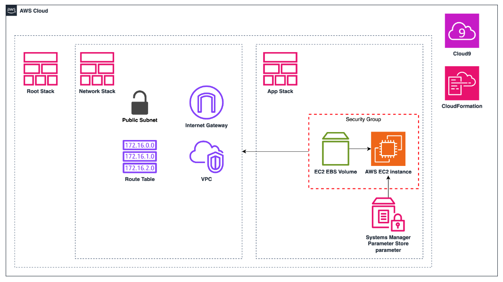
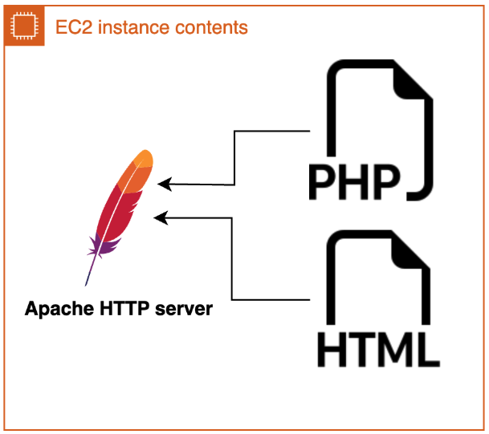
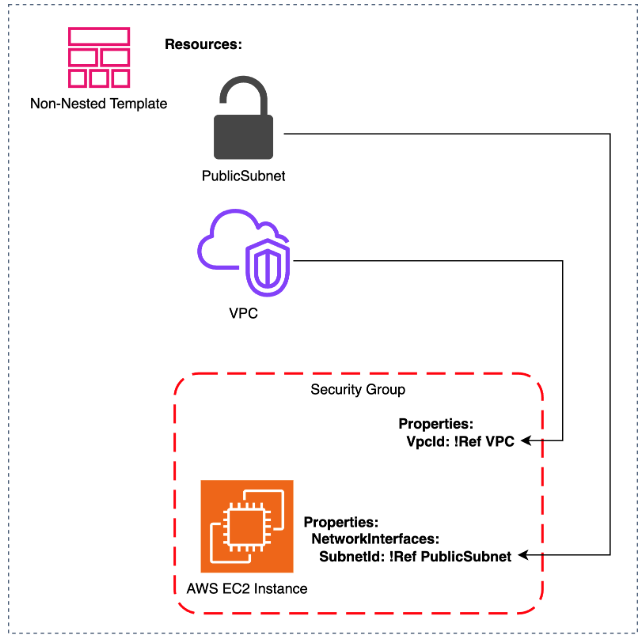
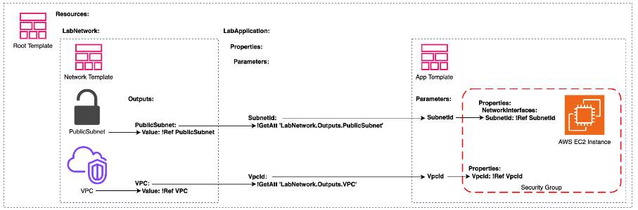

# Deploying Advanced CloudFormation Stacks

## Lab overview

Nested stacks are used to modularize and encapsulate different components or services within a larger application or infrastructure setup. They provide a way to organize and manage related resources as separate, reusable units, promoting better code organization and maintainability.

In this lab, you will create a public website using a nested stack, execute a change set, and debug errors in CloudFormation.

Objectives
By the end of this lab, you should be able to do the following:

Leverage a nested stack.
Pass parameters between stacks.
Execute a change set.
Utilize stack failure options.
Debug and fix a CloudFormation template.
Duration
This lab requires 60 minutes to complete.

Icon key
Various icons are used throughout this lab to call attention to different types of instructions and notes. The following list explains the purpose for each icon:

 Caution: Information of special interest or importance (not so important to cause problems with the equipment or data if you miss it, but it could result in the need to repeat certain steps).
 Command: A command that you must run.
 Expected output: A sample output that you can use to verify the output of a command or edited file.
 Learn more: Where to find more information.
 Note: A hint, tip, or important guidance.
 Task complete: A conclusion or summary point in the lab.
 Warning: An action that is irreversible and could potentially impact the failure of a command or process (including warnings about configurations that cannot be changed after they are made).
Start lab
To launch the lab, at the top of the page, choose Start lab.

 Caution: You must wait for the provisioned AWS services to be ready before you can continue.

To open the lab, choose Open Console .

You are automatically signed in to the AWS Management Console in a new web browser tab.

 Warning: Do not change the Region unless instructed.

Common sign-in errors
Error: Choosing Start Lab has no effect
In some cases, certain pop-up or script blocker web browser extensions might prevent the Start Lab button from working as intended. If you experience an issue starting the lab:

Add the lab domain name to your pop-up or script blocker’s allow list or turn it off.
Refresh the page and try again.

## Lab environment

In this lab, you work to create a nested AWS CloudFormation stack that serves a public daily agenda website to boost team productivity. It is shown in the following diagram:



Image description: Network resources are created within a VPC from the Network stack. Application layer resources are created from the App Stack. The Root stack is the parent of both the Network and App stacks.

The AWS EC2 instance fetches the AWS Systems Manager Parameter Store parameter on the server-side with a PHP script and an HTML file is served to the client to display a website:



Image description: The Apache server is installed and started with cfn::init from the App stack.

Services used in this lab
AWS CloudFormation
AWS CloudFormation is an infrastructure as code (IaC) service offered by Amazon Web Services (AWS). It allows you to define and provision AWS resources using declarative templates, enabling automated and consistent deployment of applications and infrastructure. CloudFormation templates can be used to create, update, and delete collections of resources in a predictable and repeatable manner, simplifying infrastructure management and promoting DevOps practices.

Amazon EC2
Amazon Elastic Compute Cloud is a web service that provides secure, resizable compute capacity in the cloud. It allows you to launch and manage virtual servers (or instances) in Amazon data centers, making it easy to scale computing resources up or down as needed. EC2 instances can run various operating systems, including Linux distributions, providing flexibility in running applications and workloads.

AWS Systems Manager
AWS Systems Manager is a comprehensive management service that provides a unified user interface to view and control your AWS resources across multiple AWS services. It enables you to automate operational tasks, centralize shared data, and streamline maintenance and deployment activities across your AWS environment. The Parameter Store feature of Systems Manager allows you to securely store and retrieve configuration data, passwords, and other sensitive information, providing a centralized and highly available parameter store for your applications and infrastructure.

AWS Cloud9
AWS Cloud9 is a cloud-based integrated development environment (IDE) provided by Amazon Web Services. It allows developers to write, run, and debug code directly from their web browser, eliminating the need for local development environments. With Cloud9, developers can collaborate in real-time on code projects, share environments, and access their IDE from anywhere with an internet connection.

Task 1: Review the non-nested stack template
In this task, you will open the AWS Cloud9 IDE and review the non-nested template equivalent of the daily agenda application.

Copy the Cloud9Environment URL value that is listed to the left of these instructions, and paste it into a new browser tab. A new browser tab opens and displays the AWS Cloud9 IDE.

In the file directory at the left of the IDE, under task_1, select complete.yaml.

Review this non-nested template that creates the same AWS resources as the nested template you create later in this lab.

All resources for an application are defined within this one stack. All references are simple as they refer to a resource that is managed in the same template. One such example, designating what subnet the Amazon EC2 instance should be in, is shown below:


SubnetId:
    !Ref PublicSubnet
In the next task, you gain understanding of why, despite the simplicity of a non-nested template, the benefits of using nested templates for certain applications outweigh the drawbacks.

 Task complete: You reviewed the non-nested AWS CloudFormation template for the daily agenda application.

Task 2: Provision resources from a nested stack
In this task, you will provision resources from a nested stack to build part of the complete daily agenda application.

Task 2.1: Use the AWS::CloudFormation::Stack resource
Add a nested stack to the root stack to create network resources.

To open the Network template, in the file directory at the left of the IDE, under task_2, select 2_network.yaml.

Review this template that creates a VPC, internet gateway, public route table, and public subnet.

 Note: These are a subsection of the same resources created in the complete application template from Task 1. But unlike the complete application template, this Network template can be used time and time again, in any use case that needs a public subnet within a VPC, as an independent root template, or as a template within a nested stack. It is agnostic to region and to application layer, and is modular, and it separates itself from more complicated application definition.

To open the root template, in the file directory, under task_2, select 2_root.yaml.

To complete the root template, copy and paste only the code located between the TODO:1 comments.

```yaml
# BEGIN TODO:1 - Define network nested stack
Type: AWS::CloudFormation::Stack
Properties:
    # Nested template uploaded to S3 template bucket
    TemplateURL: !Sub 'https://templates-${AWS::AccountId}.s3.${AWS::Region}.amazonaws.com/2_network.yaml'
# END TODO:1
```

 Caution: Throughout this lab, pay close attention to indention when adding code to CloudFormation templates. YAML is sensitive to incorrect indentation. Errors such as “‘null’ values are not allowed in templates” are frequently due to indentation mistakes.

 Expected output

```yaml
AWSTemplateFormatVersion: 2010-09-09
Description: >-
Root Template: Nested stack creates a network stack containing a VPC with DNS and public IPs enabled.

# This template creates:
#   network nested stack

######################
# Resources section
######################

Resources:
# Network Template: Creates a VPC with DNS and public IPs enabled.
LabNetwork:
    # BEGIN TODO:1 - Define network nested stack
    Type: AWS::CloudFormation::Stack
    Properties:
        # Nested template uploaded to S3 template bucket
        TemplateURL: !Sub 'https://templates-${AWS::AccountId}.s3.${AWS::Region}.amazonaws.com/2_network.yaml'
    # END TODO:1
```

The only resource in this stack is of type AWS::CloudFormation::Stack. This is the resource type for nesting a stack as a resource in a top-level template. To reference a nested stack, you provide the Amazon S3 location of the nested stack template, which you upload in the following steps.

To save changes to the file, press Ctrl+S on Windows or ⌘+S on mac.
Task 2.2: Create a nested stack
Upload nested templates to S3 and then use AWS CLI to create a stack.

To change directories to the location where the templates for task 2 are, in the command line at the bottom of the Cloud9 IDE, run the following command:


cd task_2
To set your lab account ID as an environment variable, run the following command:


ACCOUNT_ID=$(aws sts get-caller-identity --output text --query 'Account')
 Note: Here is a breakdown of the CLI command:

aws sts get-caller-identity: CLI command that retrieves details about the IAM user or role that is currently authenticated.
–output text: A command option that formats the output as plain text
–query ‘Account’: An option that extracts just the account ID from the response.
ACCOUNT_ID=$(…): Stores the output of the AWS CLI command (your account ID) in an environment variable named ACCOUNT_ID.
To create an S3 bucket to hold CloudFormation templates, run the following command:


aws s3 mb s3://templates-$ACCOUNT_ID
 Expected output


************************
**** EXAMPLE OUTPUT ****
************************

make_bucket: templates-464359687269
 Note: Your bucket name is different from the example output as your lab is within a different account.

To upload the contents of the task_2 folder to the template bucket, run the following command:


aws s3 sync . s3://templates-$ACCOUNT_ID
 Expected output


************************
**** EXAMPLE OUTPUT ****
************************

upload: ./2_network.yaml to s3://templates-464359687269/2_network.yaml
upload: ./2_root.yaml to s3://templates-464359687269/2_root.yaml
To create the nested stack, run the following command:


aws cloudformation create-stack --stack-name "nested-stack" --template-body "file://2_root.yaml"
 Note: The create-stack command is used with the following options:

–stack-name: The name associated with the stack, which must be unique in the region you are creating the stack.
–template-body: Set as the path to the locally stored root stack template, but could also be an S3 location.
 Learn more: Refer to AWS CLI Command Reference for cloudformation create-stack in the Additional resources section for more options or to review any CLI commands used in this lab.


************************
**** EXAMPLE OUTPUT ****
************************

{
    "StackId": "arn:aws:cloudformation:us-east-1:464359687269:stack/nested-stack/f614de20-229c-11ef-a3ac-0affe4e4c251"
}
 Task complete: Congratulations! You created a nested stack.

Task 3: Validate deployment
In this task, you will view the resources created by CloudFormation in console.

At the top of the AWS Management Console, in the search bar, search for and choose CloudFormation.

To view details of the stack you created, under the Stacks list, choose nested-stack.

To view the resources created by the root stack, choose the Resources tab.

 Note: The only resource defined in the root stack is the LabNetwork nested stack.

To view information from the nested stack, select the Physical ID of LabNetwork.

To see the resources the Network stack created, choose the Resources tab.

 Note: The Network stack creates all the resources necessary for a public subnet with internet access:

Internet gateway
Public route
Public route table
Public subnet network ACL association
Public subnet route table association
VPC
VPC Gateway attachment
 Task complete: You reviewed the relation between a root stack and a nested stack in console.

### Task 4: Create a changeset with stack failure options

In this task, you will add an app layer nested stack to your root stack, manage output and parameter passing between stacks, and execute a change set to modify the existing stack.

In a non-nested stack, parameter passing is often simple. The reference values of the VPC and subnet resources are used to configure the EC2 instance and security group resources.



Image description: This is the simple parameter passing strategy of the non-nested stack.

It becomes more complicated when nested stacks need values from each other. Needed values from one stack are output, defined as parameters and referenced in another nested stack, and those parameter values are set in the root stack.



Image description: This is the cross-stack parameter passing strategy you work to in this task.

Task 4.1: Output values from the Network stack
The EC2 instance and security group within the App stack require the IDs of the VPC and subnet created in the Network stack, so you output those values from the Network stack.

Return to the Cloud9 development environment.

To change directories to the location storing the templates for task 4, run the following command:


cd ../task_4
To open the Network template, in the file directory, under task_4, select 4_network.yaml.

To output the ID of the subnet, copy and paste only the code located between the TODO:2 comments.


# BEGIN TODO:2 - Reference the PublicSubnet return value
Value: !Ref PublicSubnet
# END TODO:2
 Note: Here you utilize the !Ref intrinsic function to return properties of resources managed by this template.

To output the ID of the VPC, copy and paste only the code located between the TODO:3 comments.


# BEGIN TODO:3 - Reference the VPC return value
Value: !Ref VPC
# END TODO:3
 Learn more: Refer to AWS::EC2::VPC resource in the Additional resources section for more information on return values.

 Expected output


######################
# Outputs section
######################

Outputs:
PublicSubnet:
    Description: Public subnet enabling HTTP access from public internet
    # BEGIN TODO:2 - Reference the PublicSubnet return value
    Value: !Ref PublicSubnet
    # END TODO:2

VPC:
    Description: VPC containing the PublicSubnet
    # BEGIN TODO:3 - Reference the VPC return value
    Value: !Ref VPC
    # END TODO:3
To save changes to the file, press Ctrl+S on Windows or ⌘+S on mac.

Task 4.2: Define the App stack in the root template
To keep stacks in logical and reusable units, add another AWS::CloudFormation::Stack resource to the root stack, defining the App stack, a second nested stack. Pass the subnet and VPC IDs from the Network stack to the App stack to configure its EC2 instance.

To open the root template, in the file directory, under task_4, select 4_root.yaml.

To add the App nested stack to the root template, copy and paste only the code located between the TODO:4 comments.


# BEGIN TODO:4 - Define the application nested stack
Type: AWS::CloudFormation::Stack
Properties:
  # Nested template uploaded to S3 template bucket
    TemplateURL: !Sub 'https://templates-${AWS::AccountId}.s3.${AWS::Region}.amazonaws.com/4_app.yaml'
    Parameters:
        SubnetId: !GetAtt 'LabNetwork.Outputs.PublicSubnet' # Gets the PublicSubnet Output of the LabNetwork stack
        VpcId: !GetAtt 'LabNetwork.Outputs.VPC' # Gets the VPC Output of the LabNetwork stack
        DailyAgendaParameterValue: !Ref DailyAgendaParameterValue # Gets the value of the DailyAgendaParameterValue parameter
# END TODO:4
 Note: The nested App stack requires these parameters:

SubnetId & VpcId: You are inputting the values you outputted from the Network stack, to the App stack. !GetAtt ‘RESOURCE.Outputs.OUTPUT’ is one way to accomplish this from the root stack.
DailyAgendaParameterValue: You are referring to an input parameter of the root stack, the value you want to store in the Systems Manager Parameter Store parameter.
 Expected output


######################
# Resources section
######################

Resources:
# Network Template: Creates a VPC with DNS and public IPs enabled.
LabNetwork:
    Type: AWS::CloudFormation::Stack
    Properties:
        # Nested template uploaded to S3 template bucket
        TemplateURL: !Sub 'https://templates-${AWS::AccountId}.s3.${AWS::Region}.amazonaws.com/4_network.yaml'
# App Template: Creates the app level resources for serving a basic site to display a company's daily agenda
LabApplication:
    # BEGIN TODO:4 - Define the application nested stack
    Type: AWS::CloudFormation::Stack
    Properties:
    # Nested template uploaded to S3 template bucket
        TemplateURL: !Sub 'https://templates-${AWS::AccountId}.s3.${AWS::Region}.amazonaws.com/4_app.yaml'
        Parameters:
            SubnetId: !GetAtt 'LabNetwork.Outputs.PublicSubnet' # Gets the PublicSubnet Output of the LabNetwork stack
            VpcId: !GetAtt 'LabNetwork.Outputs.VPC' # Gets the VPC Output of the LabNetwork stack
            DailyAgendaParameterValue: !Ref DailyAgendaParameterValue # Gets the value of the DailyAgendaParameterValue parameter
    # END TODO:4
To save changes to the file, press Ctrl+S on Windows or ⌘+S on mac.

Task 4.3: Finish the App stack template
The Application resources have been copied from the non-nested stack in task 1, but the references are no longer accurate. Reference the input parameters for VPC and subnet IDs, and add an input parameter for the Systems Manager Parameter Store parameter value.

To open the App template, in the file directory, under task_4, select 4_app.yaml.

Review the incomplete App CloudFormation template to see what resources it creates.

To modify the configuration of the EC2 instance from a non-nested stack, to a nested stack, copy only the code located between the TODO:5 comments and replace the existing reference.


# BEGIN TODO:5 - Reference the SubnetId parameter
!Ref SubnetId
# END TODO:5
 Note: PublicSubnet was a reference to a resource created in a non-nested stack. Now that the subnet is created in the Network stack and passed as an input parameter to the App stack, its referred to by SubnetId.

 Expected output


Properties:
    Tags:
    - Key: Name
      Value: daily-agenda-service # The name of the EC2 instance
    IamInstanceProfile: ec2ssm
    InstanceType: t2.micro
    ImageId: !Ref LatestAmiId
    NetworkInterfaces:
        - GroupSet:
            - !Ref WebServerSecurityGroup # References the WebServerSecurityGroup resource of this template
        AssociatePublicIpAddress: true
        DeviceIndex: 0
        DeleteOnTermination: true
        SubnetId:
            # BEGIN TODO:5 - Reference the SubnetId parameter
            !Ref SubnetId
            # END TODO:5
To modify the configuration of the EC2 security group from a non-nested stack, to a nested stack, copy only the code located between the TODO:6 comments and replace the existing reference.


# BEGIN TODO:6 - Reference the VpcId parameter
!Ref VpcId
# END TODO:6
 Expected output


# Security group for EC2 that allows incoming HTTP and SSH
WebServerSecurityGroup:
Type: AWS::EC2::SecurityGroup
Properties:
    GroupDescription: Enable HTTP ingress
    VpcId:
    # BEGIN TODO:6 - Reference the VpcId parameter
    !Ref VpcId
    # END TODO:6
    SecurityGroupIngress:
    - IpProtocol: tcp
        FromPort: 80
        ToPort: 80
        CidrIp: 0.0.0.0/0
    - IpProtocol: tcp
        FromPort: 22
        ToPort: 22
        CidrIp: 0.0.0.0/0
To add an input parameter that is the value stored in Parameter store, copy and paste only the code located between the TODO:7 comments.


# BEGIN TODO:7 - Define the input parameter for the daily agenda value
DailyAgendaParameterValue:
    Type: String
    Description: The value to be stored in the Parameter Store parameter
# END TODO:7
 Expected output


######################
# Parameters section
######################

Parameters:
LatestAmiId:
    Type: 'AWS::SSM::Parameter::Value<AWS::EC2::Image::Id>'
    Default: '/aws/service/ami-amazon-linux-latest/amzn2-ami-hvm-x86_64-gp2'
    Description: The ID of the latest Amazon Linux 2 AMI.
VpcId:
    Type: AWS::EC2::VPC::Id
    Description: The VPC ID of the VPC created in the network nested stack
SubnetId:
    Type: AWS::EC2::Subnet::Id
    Description: The Subnet ID of the subnet created in the network nested stack
DailyAgendaParameterName:
    Type: String
    Description: The name of the Systems Manager parameter to store the daily agenda
    Default: /daily_agenda
# BEGIN TODO:7 - Define the input parameter for the daily agenda value
DailyAgendaParameterValue:
    Type: String
    Description: The value to be stored in the Parameter Store parameter
# END TODO:7
To save changes to the file, press Ctrl+S on Windows or ⌘+S on mac.

Task 4.4: Output the website URL
Output the URL of the public website hosted by the EC2 instance.

To re-open the App template, in the file directory, under task_4, select 4_root.yaml.

To add an input parameter that is the value stored in Parameter store, copy and paste only the code located between the TODO:8 comments.


# BEGIN TODO:8 - Define and set the value of the agenda site
Description: URL of the website
Value: !GetAtt 'LabApplication.Outputs.URL'
# END TODO:8
 Expected output


######################
# Outputs section
######################

Outputs:
URL:
    # BEGIN TODO:8 - Define and set the value of the agenda site
    Description: URL of the website
    Value: !GetAtt 'LabApplication.Outputs.URL'
    # END TODO:8
To save changes to the file, press Ctrl+S on Windows or ⌘+S on mac.

Task 4.5: Create and execute a change set
Create a change set to view what changes will be made to your stack and then execute it to exercise those changes.

To open the shell script and review the CLI commands it runs, in the file directory, under task_4, select cf.sh.

 Note: Using shell scripts for repeated steps can help save time. In addition to syncing the S3 template bucket with your present working directory, the create-change-set AWS CLI command creates a change set with the following options:

–stack-name “nested stack”: The name of the stack you created earlier.
–template-body “file://4_root.yaml”: The path to the updated root template.
–change-set-name addAppLayer: The name associated with the change stack, which must be unique amongst the stack’s change sets.
–parameters ParameterKey=“DailyAgendaParameterValue”,ParameterValue=“Finish Q4 deliverables\,Week 5 code review\,Add MFA to production accounts”: The parameter option of format *ParameterKey=“…”,ParameterValue=“…” sets the parameter value to the sole root template parameter as today’s agenda.
To create a change set, run the following command:


sh cf.sh
 Expected output


************************
**** EXAMPLE OUTPUT ****
************************

upload: ./4_app.yaml to s3://templates-464359687269/4_app.yaml   
upload: ./4_network.yaml to s3://templates-464359687269/4_network.yaml
upload: ./destroy.sh to s3://templates-464359687269/destroy.sh    
upload: ./cf.sh to s3://templates-464359687269/cf.sh             
upload: ./4_root.yaml to s3://templates-464359687269/4_root.yaml
{
    "Id": "arn:aws:cloudformation:us-east-1:464359687269:changeSet/addAppLayer/7035d830-406b-4825-9562-bbd1699b79dd",
    "StackId": "arn:aws:cloudformation:us-east-1:464359687269:stack/nested-stack3/f68eda00-22a5-11ef-9b73-0affea5eaa61"
}
At the top of the AWS Management Console, in the search bar, search for and choose CloudFormation.

Under the Stacks list, choose nested-stack.

To view change sets, choose the Change Sets tab.

To view the changes that will be made, select the addAppLayer change set.

 Caution: Read the entire next instruction before taking action to avoid issues.

To execute the change set, choose Execute change set, then choose Preserve successfully provisioned resources, and finally choose Execute change set.

 Expected output: Observe the Stacks list to see that the creation of the nested LabApplication stack failed, but that resources not dependent upon the failure cause are successfully updated and created because you chose Preserve successfully provisioned resources.

 Task complete: You added an application layer to your architecture.

Task 5: CloudFormation debugging
In this task, you will debug the stack failure, fix it and then retry the change set.

Task 5.1: Debug the stack failure
To view details of the failed nested stack, under the Stacks list, choose the stack that begins with nested-stack-LabApplication.

To view the events associated with creating that stack, choose the Events tab.

To find the root cause, scroll down until you see the first CREATE_FAILED status.

The resource called SsmParam has failed with a status explaining that a Parameter store parameter called /daily_agenda already exists. Two parameters of the same name cannot exist in the same region.

To continue investigation, at the top of the AWS Management Console, in the search bar, search for and choose Parameter Store, which is a feature of the Systems Manager service.

To view the parameter of the same name as the parameter your stack is attempting to create, select /daily_agenda.

Observe that the Value is Go grocery shopping,Oil change,Call mom.

 Caution: It seems a member of your team has used this parameter as his personal to-do list!

If you don’t still have the CloudFormation console page open, at the top of the AWS Management Console, in the search bar, search for and choose CloudFormation.

To view details of the failed nested stack, under the Stacks list, choose the stack that begins with nested-stack-LabApplication.

To view the resources that successfully created, choose the Resources tab.

To confirm your understanding of the error, visit the newly launched daily agenda site, by selecting the Physical ID of the WebServerInstance.

In the EC2 instances list, select the Instance ID of the instance named daily-agenda-service.

 Caution: Wait until the Instance Status check is complete to perform the next step.

Copy the Public IPv4 DNS value, and in a new web browser tab, enter http://, paste the Public IPv4 DNS, and then press Enter to navigate to the site.

The values from your teammate’s to-do list populate the teams daily agenda tool:


Daily Agenda
- Go grocery shopping
- Oil change
- Call mom
Task 5.2 Fix the failure
Fix the failure by deleting the parameter not managed by CloudFormation.

Return to the Parameter Store console page.

Select the daily_agenda parameter and choose Delete.

To delete the parameter, choose Delete parameters.

 Note: While it would work for now to delete the Parameter Store parameter from your stack and change the value of this parameter, it’s correct practice to have all resources within an application managed by CloudFormation. A single manually created resource amongst an app managed by stacks is not Well-Architected.

Task 5.3 Retry the change set
Retry the change set to successfully create the nested stack.

Return to the CloudFormation console page.

Under the Stacks list, choose the root stack, nested-stack.

Choose Retry.

In the pop-up, choose Retry.

After the LabApplication stack status changes to UPDATE_COMPLETE, choose the Outputs tab of the root stack, nested-stack.

Select the link corresponding to URL.

The Parameter Store parameter successfully populates the daily agenda site!


Daily Agenda
- Finish Q4 deliverables
- Week 5 code review
- Add MFA to production accounts
 Task complete: Congratulations! You debugged a CloudFormation error and fixed its root cause to create a CloudFormation nested stack.

Conclusion
You successfully completed the following:

Leveraged a nested stack.
Passed parameters between stacks.
Executed a change set.
Utilized stack failure options.
Debugged and fix a CloudFormation template.
End lab
Follow these steps to close the console and end your lab.

Return to the AWS Management Console.

At the upper-right corner of the page, choose AWSLabsUser, and then choose Sign out.

Choose End lab and then confirm that you want to end your lab.

Additional resources
AWS::EC2::VPC resource
AWS CLI Command Reference for cloudformation create-stack
