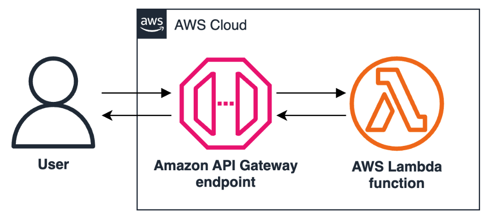

# Working with Constructs in AWS CDK

## Lab overview

In this lab, you use AWS Cloud Development Kit (AWS CDK) to create, deploy, test, and update a simple Lambda-backed API endpoint in AWS.

Objectives
By the end of this lab, you should be able to do the following:

Build applications using Python CDK.
Define a CDK application’s infrastructure using the AWS Construct Library.
Deploy an AWS CDK application.
Validate the correctness of provisioned infrastructure by performing tests.
Duration
This lab requires 45 minutes to complete.

Icon key
Various icons are used throughout this lab to call attention to different types of instructions and notes. The following list explains the purpose for each icon:

 Caution: Information of special interest or importance (not so important to cause problems with the equipment or data if you miss it, but it could result in the need to repeat certain steps).
 Command: A command that you must run.
 Expected output: A sample output that you can use to verify the output of a command or edited file.
 File contents: A code block that displays the contents of a script or file you need to run that has been pre-created for you.
 Note: A hint, tip, or important guidance.
 Security: An opportunity to incorporate security best practices.
 Task complete: A conclusion or summary point in the lab.
 WARNING: An action that is irreversible and could potentially impact the failure of a command or process (including warnings about configurations that cannot be changed after they are made).
Start lab
To launch the lab, at the top of the page, choose Start Lab.

 Caution: You must wait for the provisioned AWS services to be ready before you can continue.

To open the lab, choose Open Console .

You are automatically signed in to the AWS Management Console in a new web browser tab.

 Warning: Do not change the Region unless instructed.

Common sign-in errors
Error: Choosing Start Lab has no effect
In some cases, certain pop-up or script blocker web browser extensions might prevent the Start Lab button from working as intended. If you experience an issue starting the lab:

Add the lab domain name to your pop-up or script blocker’s allow list or turn it off.
Refresh the page and try again.

## Lab environment

The following diagram shows the resources you work to create with AWS CDK:

Image description: The preceding diagram depicts a user requesting an Amazon API Gateway endpoint proxying a Lambda function to return a simple message to the user.

Services used in this lab
AWS Cloud Development Kit (CDK)
AWS Cloud Development Kit is an open source software development framework. You can use it to model and provision your cloud application resources using familiar programming languages. It provides you with high-level components that pre-configure cloud resources with proven defaults, so you can build cloud applications without needing to be an expert. With AWS CDK, you can provision your resources in a repeatable manner using AWS CloudFormation.

AWS Cloud9
AWS Cloud9 is a cloud-based integrated development environment (IDE) provided by Amazon Web Services. It allows developers to write, run, and debug code directly from their web browser, eliminating the need for local development environments. With Cloud9, developers can collaborate in real-time on code projects, share environments, and access their IDE from anywhere with an internet connection.

AWS Lambda
With AWS Lambda, you can run code for virtually any type of application or backend service - all with zero administration. Just upload your code and Lambda takes care of everything required to run and scale your code with high availability. You can set up your code to be invoked automatically by other AWS services or call it directly from any web or mobile app.

Amazon API Gateway
Amazon API Gateway is a fully managed service that makes it easy for developers to create, publish, maintain, monitor, and secure APIs. APIs act as the “front door” for applications to access data, business logic, or functionality from your backend services. Using API Gateway, you can create RESTful APIs and WebSocket APIs that enable real-time two-way communication between applications.

Task 1: Connect to the Cloud9 IDE and initialize a CDK project
In this task, you will create the files needed to develop with AWS CDK.

Copy the Cloud9Environment URL value that is listed to the left of these instructions, and paste it into a new browser tab. A new browser tab opens and displays the AWS Cloud9 IDE.

 Command: To create an empty directory, run the following command:

mkdir lambda-api
 Command: To move to the directory you created, run the following command:

cd lambda-api
 Command: To initialize a new CDK project with Python as the programming language, run the following command:

cdk init app --language python
 Expected output

************************
**** EXAMPLE OUTPUT ****
************************

Applying project template app for python

# Welcome to your CDK Python project!

This is a blank project for CDK development with Python.

The `cdk.json` file tells the CDK Toolkit how to execute your app.

This project is set up like a standard Python project.  The initialization
process also creates a virtualenv within this project, stored under the `.venv`
directory.  To create the virtualenv it assumes that there is a `python3`
(or `python` for Windows) executable in your path with access to the `venv`
package. If for any reason the automatic creation of the virtualenv fails,
you can create the virtualenv manually.

To manually create a virtualenv on MacOS and Linux:

$ python3 -m venv .venv

...
 Note: The command runs successfully as the CDK has already been installed by the lab environment. The command creates the following files and subdirectories inside of the lambda-api root directory:

lambda-api/
├── lambda_api/
│   ├── __init__.py
│   └── lambda_api_stack.py
├── tests/
│   ├── unit/
│   │   ├── __init__.py
│   │   └── test_lambda_api_stack.py    
│   └── __init__.py        
├── app.py
├── cdk.json
├── README.md
├── requirements-dev.txt
├── requirements.txt
└── source.bat
Here is a brief description of the most important directories and files.

lambda_api/ : The main package directory for your CDK application. Here you can create subdirectories that correspond to custom constructs, lambda functions, and more.
__init__.py: Makes the directory it is in a Python package.
lambda_api_stack.py: Defines the CDK stack and its resources.
tests/: The directory for test files.
app.py: The entry point for the CDK application. Instantiates stack defined in lambda_api_stack.py and includes it in application.
cdk.json: Contains configuration settings for the project
requirements.txt: Lists the Python dependencies of the app.
 Command: To activate the project’s virtual environment, run the following command:

source .venv/bin/activate
To view the Python packages required for this project, in the file directory, under the lambda_api directory, select requirements.txt.

 Command: To install the packages, run the following command:

pip install -r requirements.txt
 Expected output

************************
**** EXAMPLE OUTPUT ****
************************

Collecting aws-cdk-lib==2.145.0
    Downloading aws_cdk_lib-2.145.0-py3-none-any.whl (35.7 MB)
        |████████████████████████████████| 35.7 MB 207 kB/s            
Collecting constructs<11.0.0,>=10.0.0
    Downloading constructs-10.3.0-py3-none-any.whl (58 kB)
        |████████████████████████████████| 58 kB 11.2 MB/s            
Collecting typeguard~=2.13.3

...
 Note: When you run the command cdk init, the CDK toolkit automatically adds the required core libraries to the file. Importing constructs from the AWS Construct Library also automatically adds package entries to this file. The following is a brief explanation of the two main packages installed:

aws-cdk-lib: The core library for AWS CDK. It provides the necessary classes and methods to define and deploy AWS infrastructure using code.
constructs: The basic building blocks for defining cloud components, allowing for higher-level abstractions.
 Task complete: You initialized a CDK project.

Task 2: Code, deploy, and test the application
In this task, you will add code to the CDK project to deploy a Lambda function and then run a test.

Task 2.1 Create a function handler
Write a lambda function handler to return a simple message.

To have a place to hold Lambda code, choose (right-click) the lambda_api subdirectory that is within the lambda-api/ directory, and choose New Folder.

To name the new directory, enter lambda.

To create a file that will be the Lambda function handler’s code, choose (right-click) the lambda subdirectory and choose New File.

To name the new file, enter hello.py.

To open the file you created, select (double-click) hello.py.

Copy the below code and paste it into the hello.py file.

def handler(event, context):
    print("request:", event)
    return {
        "statusCode": 200,
        "headers": {"Content-Type": "text/plain"},
        "body": f"Hello, CDK! You've hit {event['path']}\n",
    }
 Note: This Lambda function handles HTTP requests by printing the request details and returning a plain text response with a greeting and the requested path.

To save changes to the file, press Ctrl+S on Windows or ⌘+S on mac.

Task 2.2 Define the function infrastructure
Define the infrastructure necessary to deploy the Lambda function for which you created the handler in the previous step. You modify the lambda_api_stack.py file to include the Lambda function, specify its execution role, and configure its settings such as the handler and runtime.

To open the file that defines your CDK stack and its resources, select (double-click) lambda_api_stack.py.

 File contents:

from aws_cdk import (
    # Duration,
    Stack,
    # aws_sqs as sqs,
)
from constructs import Construct

class LambdaApiStack(Stack):

    def __init__(self, scope: Construct, construct_id: str, **kwargs) -> None:
        super().__init__(scope, construct_id, **kwargs)

        # The code that defines your stack goes here

        # example resource
        # queue = sqs.Queue(
        #     self, "LambdaApiQueue",
        #     visibility_timeout=Duration.seconds(300),
        # )
 Note: You can ignore the commented out code that the CDK init creates as an example for usage.

To import the modules for using AWS Lambda and AWS IAM resources, add the following imports to the from aws_cdk import statement.

aws_lambda as lambda_,
aws_iam as iam
To be able to work with your local file system, import the os module by adding the following code as a new line in your imports section.

import os
The imports section of lambda_api_stack.py should now look like the following:

**************************
**** Example .py file ****
**************************

import os

from aws_cdk import (
    # Duration,
    Stack,
    # aws_sqs as sqs,
    aws_lambda as lambda_,
    aws_iam as iam
)
from constructs import Construct
 Security: Constructs automatically create required roles at construction time if you have not specified a rule for the construct to use. But for this lab, you use a role that has been created by the lab environment.

To use the from_role_arn method to create a CDK Role object from the HelloLambdaRole execution role that was already created for you in the lab environment, add the following line within the init method.

hello_role = iam.Role.from_role_arn(self, "HelloRole", f"arn:aws:iam::{Stack.of(self).account}:role/HelloLambdaRole")
To create a Lambda function with the Function method of the CDK Lambda module, add the following code within the init method.

hello_function = lambda_.Function(self, 'Hello', 
    code= lambda_.Code.from_asset(os.path.join('lambda_api/lambda')),
    handler= 'hello.handler',
    runtime= lambda_.Runtime.PYTHON_3_9,
    role= hello_role,
);
lambda_api_stack.py should now look like the following:

**************************
**** Example .py file ****
**************************

import os

from aws_cdk import (
    # Duration,
    Stack,
    # aws_sqs as sqs,
    aws_lambda as lambda_,
    aws_iam as iam
)
from constructs import Construct

class LambdaApiStack(Stack):

    def __init__(self, scope: Construct, construct_id: str, **kwargs) -> None:
        super().__init__(scope, construct_id, **kwargs)

        # The code that defines your stack goes here

        # example resource
        # queue = sqs.Queue(
        #     self, "LambdaApiQueue",
        #     visibility_timeout=Duration.seconds(300),
        # )
        
        hello_role = iam.Role.from_role_arn(self, "HelloRole", f"arn:aws:iam::{Stack.of(self).account}:role/HelloLambdaRole")
        
        hello_function = lambda_.Function(self, 'Hello', 
            code= lambda_.Code.from_asset(os.path.join('lambda_api/lambda')),
            handler= 'hello.handler',
            runtime= lambda_.Runtime.PYTHON_3_9,
            role= hello_role,
        );
To save changes to the file, press Ctrl+S on Windows or ⌘+S on mac.

Task 2.3 Bootstrapping and defining a synthesizer
Prepare your AWS account for CDK deployment by bootstrapping the environment. Bootstrapping sets up the necessary resources that AWS CDK requires to deploy an application. After, define a custom synthesizer, the component responsible for transforming high-level constructs and resources defined in the CDK application, into a CloudFormation template.

In this task, you tell CDK where and how to create and deploy CloudFormation scripts from CDK.

 Note: In AWS CDK V2, the default bootstrap template and synthesizer create and use resources including S3 buckets and highly privileged IAM roles. For the sake of this lab, the resource creation has already been done, and using a custom bootstrap template, your CDK configuration becomes aware of these resources.

 Command: To execute the custom bootstrap template, run the following command:

cdk bootstrap --template ../customized-bootstrap-template.yaml
 Expected output

************************
**** EXAMPLE OUTPUT ****
************************

Using bootstrapping template from ../customized-bootstrap-template.yaml
⏳  Bootstrapping environment aws://715062909492/us-east-1...
Trusted accounts for deployment: (none)
Trusted accounts for lookup: (none)
Using default execution policy of 'arn:aws:iam::aws:policy/AdministratorAccess'. Pass '--cloudformation-execution-policies' to customize.
CDKToolkit: creating CloudFormation changeset...
✅  Environment aws://715062909492/us-east-1 bootstrapped.
To open the stack instantiation file, from lambda_api, select (double-click) app.py.

To create a synthesizer object that uses the bootstrap resources and pass it to your stack object, replace the contents of the file with the following:

# Import the core AWS CDK module and the DefaultStackSynthesizer class
import aws_cdk as cdk
from aws_cdk import DefaultStackSynthesizer
# Import the LambdaApiStack class from your stack definition module
from lambda_api.lambda_api_stack import LambdaApiStack

# Create a new CDK application instance
app = cdk.App()

# Instantiate your stack and configure it to use a custom synthesizer
LambdaApiStack(app, "LambdaApiStack", 
    synthesizer=DefaultStackSynthesizer(
        # A unique identifier to differentiate resources created by this synthesizer
        qualifier="cdk8487",
        # Name of the repository for storing Docker images used in the application
        image_assets_repository_name="cdk-staging-assets-repository",
        # IAM role ARN used for looking up existing resources during the deployment
        lookup_role_arn="arn:aws:iam::${AWS::AccountId}:role/CDK-LabStack-Lookup-Role",
        # Name of the S3 bucket used for storing file assets (like Lambda function code)
        file_assets_bucket_name="cdk-staging-bucket-${AWS::AccountId}-${AWS::Region}",
        # IAM role ARN used for deploying resources defined in the stack
        deploy_role_arn="arn:aws:iam::${AWS::AccountId}:role/CDK-LabStack-Deploy-Role",
        # Optional external ID used for assuming the deploy role (not used here)
        deploy_role_external_id="",
        # IAM role ARN used for publishing file assets to the S3 bucket
        file_asset_publishing_role_arn="arn:aws:iam::${AWS::AccountId}:role/CDK-LabStack-File-Publishing-Role",
        # Optional external ID used for assuming the file asset publishing role (not used here)
        file_asset_publishing_external_id="",
        # IAM role ARN used for publishing Docker images to the repository
        image_asset_publishing_role_arn="arn:aws:iam::${AWS::AccountId}:role/CDK-LabStack-Image-Publishing-Role",
        # Optional external ID used for assuming the image asset publishing role (not used here)
        image_asset_publishing_external_id="",
        # IAM role ARN used for executing CloudFormation during the deployment
        cloud_formation_execution_role="arn:aws:iam::${AWS::AccountId}:role/CDK-LabStack-CFN-Execution-Role",
        # SSM parameter used to track the version of the bootstrap stack
        bootstrap_stack_version_ssm_parameter="/cdk-bootstrap/${Qualifier}/version",
        # Ensure that the synthesizer generates a rule to check for the correct bootstrap version
        generate_bootstrap_version_rule=True
    ))
# Synthesize the CloudFormation template for the CDK application
app.synth()
To save changes to the file, press Ctrl+S on Windows or ⌘+S on mac.

Task 2.4 Deploying the application
Use essential cdk functions to deploy your stack.

 Command: To generate the CloudFormation template that represents the resources defined in your CDK application, run the following command:

cdk synth
 Expected output

************************
**** EXAMPLE OUTPUT ****
************************

Resources:
Hello4A628BD4:
    Type: AWS::Lambda::Function
    Properties:
    Code:
        S3Bucket:
        Fn::Sub: cdk-staging-bucket-${AWS::AccountId}-${AWS::Region}
        S3Key: d026a4b2b91ca69934038753572a3da8ba6ffd99af26c7ed67ef88feb6ddb139.zip
    Handler: hello.handler
    Role:
        Fn::Join:
        - ""
        - - "arn:aws:iam::"
            - Ref: AWS::AccountId
            - :role/HelloLambdaRole
    Runtime: python3.9

...
 Command: To deploy the resources defined in your application, run the following command:

cdk deploy
 Expected output

************************
**** EXAMPLE OUTPUT ****
************************

✨  Synthesis time: 14.28s

current credentials could not be used to assume 'arn:aws:iam::715062909492:role/CDK-LabStack-Deploy-Role', but are for the right account. Proceeding anyway.
current credentials could not be used to assume 'arn:aws:iam::715062909492:role/CDK-LabStack-Deploy-Role', but are for the right account. Proceeding anyway.
LambdaApiStack:  start: Building d026a4b2b91ca69934038753572a3da8ba6ffd99af26c7ed67ef88feb6ddb139:current_account-current_region
LambdaApiStack:  success: Built d026a4b2b91ca69934038753572a3da8ba6ffd99af26c7ed67ef88feb6ddb139:current_account-current_region
LambdaApiStack:  start: Publishing d026a4b2b91ca69934038753572a3da8ba6ffd99af26c7ed67ef88feb6ddb139:current_account-current_region
LambdaApiStack:  start: Building 72a494634029f890c7eae40230f1fcc993a6aa48ea89c19de0efa469a68e85e0:current_account-current_region
LambdaApiStack:  success: Built 72a494634029f890c7eae40230f1fcc993a6aa48ea89c19de0efa469a68e85e0:current_account-current_region
LambdaApiStack:  start: Publishing 72a494634029f890c7eae40230f1fcc993a6aa48ea89c19de0efa469a68e85e0:current_account-current_region
current credentials could not be used to assume 'arn:aws:iam::715062909492:role/CDK-LabStack-File-Publishing-Role', but are for the right account. Proceeding anyway.
current credentials could not be used to assume 'arn:aws:iam::715062909492:role/CDK-LabStack-File-Publishing-Role', but are for the right account. Proceeding anyway.
LambdaApiStack:  success: Published d026a4b2b91ca69934038753572a3da8ba6ffd99af26c7ed67ef88feb6ddb139:current_account-current_region
LambdaApiStack:  success: Published 72a494634029f890c7eae40230f1fcc993a6aa48ea89c19de0efa469a68e85e0:current_account-current_region
current credentials could not be used to assume 'arn:aws:iam::715062909492:role/CDK-LabStack-Lookup-Role', but are for the right account. Proceeding anyway.
Lookup role exists but was not assumed. Proceeding with default credentials.
current credentials could not be used to assume 'arn:aws:iam::715062909492:role/CDK-LabStack-Deploy-Role', but are for the right account. Proceeding anyway.
LambdaApiStack: deploying... [1/1]
LambdaApiStack: creating CloudFormation changeset...

✅  LambdaApiStack

✨  Deployment time: 21.61s

Stack ARN:
arn:aws:cloudformation:us-east-1:715062909492:stack/LambdaApiStack/bb866580-2a67-11ef-a2b2-0e05143cd51b

✨  Total time: 35.89s
 Note: You can ignore the warnings saying the “current credentials could not be used to assume” the cdk roles throughout this lab, as that is intended.

 Note: The deploy command takes different actions depending on the state of the application and can be run multiple times. Because this app has never been deployed before, all its resources are created. If it had previously been deployed, likely update and delete actions would have been performed as well.

Task 2.5 Test the function
Test that the function works in console.

At the top of the AWS Management Console, in the search bar, search for and choose Lambda.

In the left navigation pane, choose Functions.

Select the function created by your CDK application, with prefix LambdaApiStack-.

Choose the Test tab.

To name the test event, in Event name enter api-request.

To mimic an API Gateway proxy request to your function, expand Template - optional and choose API Gateway AWS Proxy.

 Note: This template formats a test event to simulate a typical request coming from Amazon API Gateway, including path, headers, and other request details.

To run the test, choose Test.

To view the test result, expand Details under Executing function: succeeded.

 Expected output

************************
**** EXAMPLE OUTPUT ****
************************

{
"statusCode": 200,
"headers": {
    "Content-Type": "text/plain"
},
"body": "Hello, CDK! You've hit /path/to/resource\n"
}
 Task complete: You deployed resources using CDK.

Task 3: Update the stack to include an API
In this task, you will add an Amazon API Gateway endpoint to your CDK project, allowing HTTP requests to trigger the Lambda function. This provides a public-facing interface for the function, enabling it to handle web requests.

To import the module for using API Gateway, add the following import to the from aws_cdk import statement.

aws_apigateway as apigateway
The imports section of lambda_api_stack.py should now look like the following:

**************************
**** Example .py file ****
**************************

import os

from aws_cdk import (
    # Duration,
    Stack,
    # aws_sqs as sqs,
    aws_lambda as lambda_,
    aws_iam as iam,
    aws_apigateway as apigateway
)
To create a Lambda function with the Function method of the CDK Lambda module, add the following code within the init method.

api = apigateway.LambdaRestApi(self, "myApi", handler = hello_function)
lambda_api_stack.py should now look like the following:

**************************
**** Example .py file ****
**************************

import os

from aws_cdk import (
    # Duration,
    Stack,
    # aws_sqs as sqs,
    aws_lambda as lambda_,
    aws_iam as iam,
    aws_apigateway as apigateway
)
from constructs import Construct

class LambdaApiStack(Stack):

    def __init__(self, scope: Construct, construct_id: str, **kwargs) -> None:
        super().__init__(scope, construct_id, **kwargs)

        hello_role = iam.Role.from_role_arn(self, "HelloRole", f"arn:aws:iam::{Stack.of(self).account}:role/HelloLambdaRole")

        hello_function = lambda_.Function(self, 'Hello', 
            code= lambda_.Code.from_asset(os.path.join('lambda_api/lambda')),
            handler= 'hello.handler',
            runtime= lambda_.Runtime.PYTHON_3_9,
            role= hello_role,
        );
        
        api = apigateway.LambdaRestApi(self, "myApi", handler = hello_function)
To save changes to the file, press Ctrl+S on Windows or ⌘+S on mac.

 Task complete: You added an API Gateway to your CDK project.

Task 4: Test the app
In this task, you will write and run assertion tests for your CDK app. These tests verify that the synthesized CloudFormation template correctly defines the expected AWS resources and their properties. This helps catch configuration errors early and ensures the stack will behave as intended when deployed.

 Command: To install pytest in the CDK app’s virtual environment, run the following command:

pip install pytest
 Expected output

************************
**** EXAMPLE OUTPUT ****
************************

Collecting pytest
Downloading pytest-8.2.2-py3-none-any.whl (339 kB)
    |████████████████████████████████| 339 kB 5.7 MB/s            
Collecting packaging
Downloading packaging-24.1-py3-none-any.whl (53 kB)
    |████████████████████████████████| 53 kB 2.2 MB/s             
Collecting tomli>=1
Downloading tomli-2.0.1-py3-none-any.whl (12 kB)
Collecting iniconfig
Downloading iniconfig-2.0.0-py3-none-any.whl (5.9 kB)
Requirement already satisfied: exceptiongroup>=1.0.0rc8 in ./.venv/lib/python3.9/site-packages (from pytest) (1.2.1)
Collecting pluggy<2.0,>=1.5
Downloading pluggy-1.5.0-py3-none-any.whl (20 kB)
Installing collected packages: tomli, pluggy, packaging, iniconfig, pytest
Successfully installed iniconfig-2.0.0 packaging-24.1 pluggy-1.5.0 pytest-8.2.2 tomli-2.0.1
To open the file that defines your CDK stack and its resources, from lambda_api/tests/unit, select (double-click) test_lambda_api_stack.py.

Delete the contents of the file.

To test the LambdaApiStack class of the lambda_api_stack module, add the following statement to the code:

from lambda_api.lambda_api_stack import LambdaApiStack
To import the remaining necessary modules and classes for your test, add the following code at the top of the file:

import pytest
from aws_cdk import (
    Stack,
    App,
    assertions,
    aws_lambda as lambda_
)
When testing a stack using fine-grained assertions, you’re writing assertions against a generated CloudFormation template.

To make the CloudFormation template a reusable fixture for all tests in this file, add the following code below the import statements:

@pytest.fixture
def template():
    app = App()
    stack = LambdaApiStack(app, "lambda-api")
    template = assertions.Template.from_stack(stack)
    return template
 Note: This function creates an instance of your “LambdaApiStack” class using an instance of the aws_cdk App class called “lambda-api” and synthesizes a template of that stack. The pytest.fixture tag makes the template usable across all functions with prefix test_.

To test that the synthesized stack has a ApiGateway resource, add the following function to the bottom of the file:

def test_api_restapi(template):
    template.has_resource("AWS::ApiGateway::RestApi", {})
To test that there is one API Gateway deployment, add the following function to the bottom of the file:

def test_api_deployment(template):
    template.resource_count_is("AWS::ApiGateway::Deployment", 1)
To test the the Lambda function will be deployed and is configured properly, add the following function:

def test_lambda(template):
    template.has_resource_properties(
        "AWS::Lambda::Function",
        {
            "Handler": "hello.handler",
            "Runtime": "python3.9",
        },
    )
test_lambda_api_stack.py should now look like the following:

**************************
**** Example .py file ****
**************************

from lambda_api.lambda_api_stack import LambdaApiStack

import pytest
from aws_cdk import (
    Stack,
    App,
    assertions,
    aws_lambda as lambda_
)
    
@pytest.fixture
def template():
    app = App()
    stack = LambdaApiStack(app, "lambda-api")
    template = assertions.Template.from_stack(stack)
    return template
    
def test_api_restapi(template):
    template.has_resource("AWS::ApiGateway::RestApi", {})

def test_api_deployment(template):
    template.resource_count_is("AWS::ApiGateway::Deployment", 1)
    
def test_lambda(template):
    template.has_resource_properties(
        "AWS::Lambda::Function",
        {
            "Handler": "hello.handler",
            "Runtime": "python3.9",
        },
    )
 Command: To make sure you are in the root app directory, run the following command:

pwd
 Expected output

************************
**** EXAMPLE OUTPUT ****
************************

/home/ec2-user/environment/lambda-api
 Command: To run the tests you defined, run the following command:

pytest
 Expected output: test_lambda_api_stack should look like the following:

************************
**** EXAMPLE OUTPUT ****
************************

================================== test session starts ==================================
platform linux -- Python 3.9.16, pytest-8.2.2, pluggy-1.5.0
rootdir: /home/ec2-user/environment/lambda-api
plugins: typeguard-2.13.3
collected 3 items                                                                                                                                                                                   

tests/unit/test_lambda_api_stack.py ...                                                                                                                                                       [100%]

================================== 3 passed in 6.95s ==================================
 Task complete: You performed assertion tests on your CDK app’s stack.

Task 5: Deploy the updated and tested stack
In this task, you will check that the incoming changes to your application are the desired and deploy those changes.

 Command: To compare the desired state of the CDK application with the current state of the resources deployed, run the following command:

cdk diff
 Expected output

************************
**** EXAMPLE OUTPUT ****
************************

...

──────────────────────────────────────

IAM Statement Changes
┌───┬──────────────┬────────┬───────────────────────┬──────────────────────────────────────┬───────────────────────────────────────────────────────────────────────┐
│   │ Resource     │ Effect │ Action                │ Principal                            │ Condition                                                             │
├───┼──────────────┼────────┼───────────────────────┼──────────────────────────────────────┼───────────────────────────────────────────────────────────────────────┤
│ + │ ${Hello.Arn} │ Allow  │ lambda:InvokeFunction │ Service:apigateway.amazonaws.com     │ "ArnLike": {                                                          │
│   │              │        │                       │                                      │   "AWS:SourceArn": "arn:${AWS::Partition}:execute-api:${AWS::Region}: │
│   │              │        │                       │                                      │ ${AWS::AccountId}:${myApi10332170}/${myApi/DeploymentStage.prod}/*/*" │
│   │              │        │                       │                                      │ }                                                                     │
│ + │ ${Hello.Arn} │ Allow  │ lambda:InvokeFunction │ Service:apigateway.amazonaws.com     │ "ArnLike": {                                                          │
│   │              │        │                       │                                      │   "AWS:SourceArn": "arn:${AWS::Partition}:execute-api:${AWS::Region}: │
│   │              │        │                       │                                      │ ${AWS::AccountId}:${myApi10332170}/test-invoke-stage/*/*"             │
│   │              │        │                       │                                      │ }                                                                     │
│ + │ ${Hello.Arn} │ Allow  │ lambda:InvokeFunction │ Service:apigateway.amazonaws.com     │ "ArnLike": {                                                          │
│   │              │        │                       │                                      │   "AWS:SourceArn": "arn:${AWS::Partition}:execute-api:${AWS::Region}: │
│   │              │        │                       │                                      │ ${AWS::AccountId}:${myApi10332170}/${myApi/DeploymentStage.prod}/*/"  │
│   │              │        │                       │                                      │ }                                                                     │
│ + │ ${Hello.Arn} │ Allow  │ lambda:InvokeFunction │ Service:apigateway.amazonaws.com     │ "ArnLike": {                                                          │
│   │              │        │                       │                                      │   "AWS:SourceArn": "arn:${AWS::Partition}:execute-api:${AWS::Region}: │
│   │              │        │                       │                                      │ ${AWS::AccountId}:${myApi10332170}/test-invoke-stage/*/"              │
│   │              │        │                       │                                      │ }                                                                     │
└───┴──────────────┴────────┴───────────────────────┴──────────────────────────────────────┴───────────────────────────────────────────────────────────────────────┘
(NOTE: There may be security-related changes not in this list. See https://github.com/aws/aws-cdk/issues/1299)

Resources
[+] AWS::ApiGateway::RestApi myApi myApi10332170 
[+] AWS::ApiGateway::Deployment myApi/Deployment myApiDeployment12138A1E0f08f783343819a3a0146dada235ee7e 
[+] AWS::ApiGateway::Stage myApi/DeploymentStage.prod myApiDeploymentStageprodBF46AA96 
[+] AWS::ApiGateway::Resource myApi/Default/{proxy+} myApiproxyB1F7DCCD 
[+] AWS::Lambda::Permission myApi/Default/{proxy+}/ANY/ApiPermission.LambdaApiStackmyApi437DA5E7.ANY..{proxy+} myApiproxyANYApiPermissionLambdaApiStackmyApi437DA5E7ANYproxyFBE121E1 
[+] AWS::Lambda::Permission myApi/Default/{proxy+}/ANY/ApiPermission.Test.LambdaApiStackmyApi437DA5E7.ANY..{proxy+} myApiproxyANYApiPermissionTestLambdaApiStackmyApi437DA5E7ANYproxy232C2B9D 
[+] AWS::ApiGateway::Method myApi/Default/{proxy+}/ANY myApiproxyANY5D46D965 
[+] AWS::Lambda::Permission myApi/Default/ANY/ApiPermission.LambdaApiStackmyApi437DA5E7.ANY.. myApiANYApiPermissionLambdaApiStackmyApi437DA5E7ANYE8E2AB96 
[+] AWS::Lambda::Permission myApi/Default/ANY/ApiPermission.Test.LambdaApiStackmyApi437DA5E7.ANY.. myApiANYApiPermissionTestLambdaApiStackmyApi437DA5E7ANYFA16568F 
[+] AWS::ApiGateway::Method myApi/Default/ANY myApiANYF3D763C9 

Outputs
[+] Output myApi/Endpoint myApiEndpointF2DFDFB1: {"Value":{"Fn::Join":["",["https://",{"Ref":"myApi10332170"},".execute-api.",{"Ref":"AWS::Region"},".",{"Ref":"AWS::URLSuffix"},"/",{"Ref":"myApiDeploymentStageprodBF46AA96"},"/"]]}}

✨  Number of stacks with differences: 1
 Note: cdk diff first performs synthesis to create a CloudFormation template from your app code, then compares it to the current state of your deployed resources, then generates a difference report to show the changes that will be made upon cdk deploy.

 Command: To make the changes highlighted by cdk diff, run the following command:

cdk deploy
 Expected output

************************
**** EXAMPLE OUTPUT ****
************************

...

IAM Statement Changes
┌───┬──────────────┬────────┬───────────────────────┬──────────────────────────────────────┬───────────────────────────────────────────────────────────────────────┐
│   │ Resource     │ Effect │ Action                │ Principal                            │ Condition                                                             │
├───┼──────────────┼────────┼───────────────────────┼──────────────────────────────────────┼───────────────────────────────────────────────────────────────────────┤
│ + │ ${Hello.Arn} │ Allow  │ lambda:InvokeFunction │ Service:apigateway.amazonaws.com     │ "ArnLike": {                                                          │
│   │              │        │                       │                                      │   "AWS:SourceArn": "arn:${AWS::Partition}:execute-api:${AWS::Region}: │
│   │              │        │                       │                                      │ ${AWS::AccountId}:${myApi10332170}/${myApi/DeploymentStage.prod}/*/*" │
│   │              │        │                       │                                      │ }                                                                     │
│ + │ ${Hello.Arn} │ Allow  │ lambda:InvokeFunction │ Service:apigateway.amazonaws.com     │ "ArnLike": {                                                          │
│   │              │        │                       │                                      │   "AWS:SourceArn": "arn:${AWS::Partition}:execute-api:${AWS::Region}: │
│   │              │        │                       │                                      │ ${AWS::AccountId}:${myApi10332170}/test-invoke-stage/*/*"             │
│   │              │        │                       │                                      │ }                                                                     │
│ + │ ${Hello.Arn} │ Allow  │ lambda:InvokeFunction │ Service:apigateway.amazonaws.com     │ "ArnLike": {                                                          │
│   │              │        │                       │                                      │   "AWS:SourceArn": "arn:${AWS::Partition}:execute-api:${AWS::Region}: │
│   │              │        │                       │                                      │ ${AWS::AccountId}:${myApi10332170}/${myApi/DeploymentStage.prod}/*/"  │
│   │              │        │                       │                                      │ }                                                                     │
│ + │ ${Hello.Arn} │ Allow  │ lambda:InvokeFunction │ Service:apigateway.amazonaws.com     │ "ArnLike": {                                                          │
│   │              │        │                       │                                      │   "AWS:SourceArn": "arn:${AWS::Partition}:execute-api:${AWS::Region}: │
│   │              │        │                       │                                      │ ${AWS::AccountId}:${myApi10332170}/test-invoke-stage/*/"              │
│   │              │        │                       │                                      │ }                                                                     │
└───┴──────────────┴────────┴───────────────────────┴──────────────────────────────────────┴───────────────────────────────────────────────────────────────────────┘
Enter y to deploy the changes.

 Expected output

************************
**** EXAMPLE OUTPUT ****
************************

LambdaApiStack: deploying... [1/1]
LambdaApiStack: creating CloudFormation changeset...

✅  LambdaApiStack

✨  Deployment time: 27.14s

Outputs:
LambdaApiStack.myApiEndpointF2DFDFB1 = https://99p5xwt96e.execute-api.us-east-1.amazonaws.com/prod/
Stack ARN:
arn:aws:cloudformation:us-east-1:715062909492:stack/LambdaApiStack/bb866580-2a67-11ef-a2b2-0e05143cd51b

✨  Total time: 38.61s
Copy the output of key beginning with LambdaApiStack.myApiEndpoint. This is your endpoint.

 Command: To request your API endpoint, run the following command, replacing INSERT_MY_API_ENDPOINT with the value you just copied:

curl INSERT_MY_API_ENDPOINT
 Expected output

************************
**** EXAMPLE OUTPUT ****
************************

Hello, CDK! You've hit /
To test the endpoint in a web browser, paste the endpoint value you copied in a new web browser tab, and press ENTER.

 Expected output

************************
**** EXAMPLE OUTPUT ****
************************

Hello, CDK! You've hit /
 Task complete: You added resources to the CDK created stack!

Task 6: Clean up your resources
In this task, you will destroy the resources created by your project.

 Command: To delete your AWS CDK stack, run the following command:

cdk destroy
Enter y.

 Expected output

************************
**** EXAMPLE OUTPUT ****
************************

LambdaApiStack: destroying... [1/1]
current credentials could not be used to assume 'arn:aws:iam::715062909492:role/CDK-LabStack-Deploy-Role', but are for the right account. Proceeding anyway.

✅  LambdaApiStack: destroyed
 Task complete: You destroyed the project resources.

Conclusion
You successfully completed the following:

Built applications using Python CDK.
Defined a CDK application’s infrastructure using the AWS Construct Library.
Deployed an AWS CDK application.
Validated the correctness of provisioned infrastructure by performing tests.
End lab
Follow these steps to close the console and end your lab.

Return to the AWS Management Console.

At the upper-right corner of the page, choose AWSLabsUser, and then choose Sign out.

Choose End Lab and then confirm that you want to end your lab.
