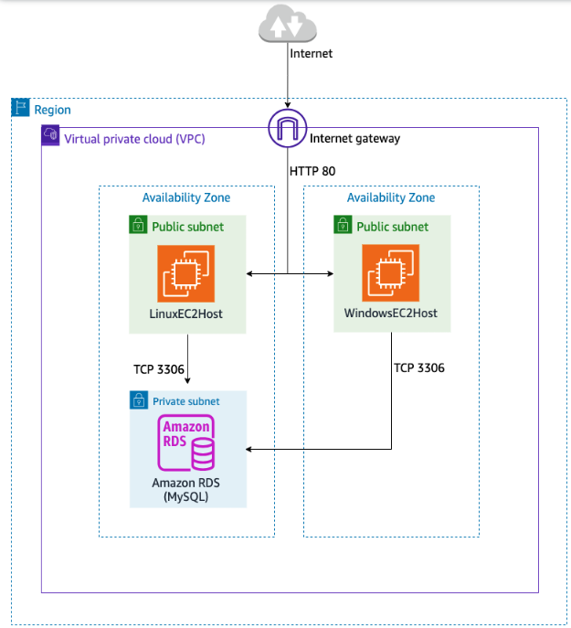

# Collecting and Analyzing Logs with Amazon CloudWatch Logs Insights

## Lab overview

In this lab, you learn to use Amazon CloudWatch Logs Insights to interactively search and analyze log data in Amazon CloudWatch Logs. You set up log groups and log streams in CloudWatch Logs and run queries against Amazon Virtual Private Cloud (Amazon VPC) flow logs and database logs to detect potential security vulnerabilities.

Objectives
By the end of this lab, you will be able to do the following:

Install and configure the Amazon CloudWatch agent on the Amazon Elastic Compute Cloud (Amazon EC2) instances by using AWS Systems Manager.
Collect web server and system logs from an Amazon EC2 instance and publish them over to CloudWatch Logs.
Enable Amazon VPC Flow Logs across virtual private clouds (VPCs) and subnets.
Enable CloudWatch Logs for an Amazon Relational Database Service (Amazon RDS) database instance.
Use CloudWatch Logs Insights to explore logs.
Use CloudWatch Logs Insights and CloudWatch metrics to inspect logs.
Technical knowledge prerequisites
To successfully complete this lab, you should be familiar with services like Amazon EC2, CloudWatch, Amazon VPC, and Amazon RDS. You should also be familiar with using the AWS Management Console.

Duration
This lab requires approximately 30 minutes to complete.

Icon key
Various icons are used throughout this lab to call attention to different types of instructions and notes. The following list explains the purpose for each icon:

 Expected output: A sample output that you can use to verify the output of a command or edited file.
 Note: A hint, tip, or important guidance.
 Additional information: Where to find more information.
 Refresh: A time when you might need to refresh a web browser page or list to show new information.
 Copy edit: A time when copying a command, script, or other text to a text editor (to edit specific variables within it) might be easier than editing directly in the command line or terminal.
 Congratulations! A conclusion or summary point in the lab.
Start lab
To launch the lab, at the top of the page, choose Start lab.
 Caution: You must wait for the provisioned AWS services to be ready before you can continue.

To open the lab, choose Open Console.
You are automatically signed in to the AWS Management Console in a new web browser tab.

 WARNING: Do not change the Region unless instructed.

Common sign-in errors
Error: You must first sign out

If you see the message, You must first log out before logging into a different AWS account:

Choose the click here link.
Close your Amazon Web Services Sign In web browser tab and return to your initial lab page.
Choose Open Console again.
Error: Choosing Start Lab has no effect
In some cases, certain pop-up or script blocker web browser extensions might prevent the Start Lab button from working as intended. If you experience an issue starting the lab:

Add the lab domain name to your pop-up or script blocker’s allow list or turn it off.
Refresh the page and try again.

## Lab environment

The following architecture diagram lists the major resources provisioned in this lab. They include two EC2 instances (Linux and Windows) to host a website, an Amazon RDS for MySQL database instance, two public subnets, a private subnet, and a VPC.

Services used in this lab
AWS Systems Manager:
Systems Manager is a collection of capabilities for configuring and managing your EC2 instances, on-premises servers, virtual machines (VMs), and certain other Amazon Web Services (AWS) resources. The service includes a unified interface that you can use to centralize operational data and automate tasks across your AWS resources. Systems Manager shortens the time to detect and resolve operational problems in your infrastructure. The service gives you a complete view of your infrastructure performance and configuration. It simplifies resource and application management, and facilitates operation and management of your infrastructure at scale.

Amazon CloudWatch:
CloudWatch is a monitoring and management service that provides data and actionable insights for AWS, on-premises, hybrid, and other cloud applications and infrastructure resources. You can collect and access all your performance and operational data in the form of logs and metrics from a single platform. You can use CloudWatch to monitor your complete stack (applications, infrastructure, network, and services) and use alarms, logs, and events data to take automated actions. CloudWatch gives you actionable insights that help you optimize application performance, manage resource utilization, and understand system-wide operational health.

Task 1: Using Systems Manager to set up the CloudWatch agent
In this task, you set up the CloudWatch agent on EC2 instances by using Systems Manager. This agent collects metrics and logs from the EC2 instances and sends them to CloudWatch Logs for further analysis. You use Parameter Store, a capability of AWS Systems Manager, to store the agent configuration and install the CloudWatch agent.

Task 1.1: Review the Systems Manager IAM policies attached to EC2 instances
To use the Systems Manager service, ensure that the EC2 instances are attached with the correct Systems Manager policies through an AWS Identity and Access Management (IAM) role. In this case, the two EC2 instances assume a role that was created when you launched this lab. Ensure that the role is attached to both EC2 instances.

On the AWS Management Console, in the search box, search for and choose EC2.

In the left navigation pane, choose Instances.

Select LinuxEC2Host.

Choose the Security tab and then choose the link under IAM Role.

In the Permissions policies section, under Policy name, choose the  next to EC2SSMRolePolicy.

 Expected output: This will expand and display the policy for the EC2SSMRole. You can review it to see what the allowed actions are for this role.

Navigate back into the EC2 console browser page that you had open.

Clear the check box next to LinuxEC2Host and select the check box for WindowsEC2Host.

Choose the Security tab and then choose the link under IAM Role.

In the Permissions policies section, under Policy name, choose the  next to EC2SSMRolePolicy.

 Expected output: This is the same role that has been attached to the Linux EC2 Instance.

You have confirmed that the role with the Systems Manager policy is attached to the EC2 instances.

Task 1.2: Testing the webpage on both Linux and Windows servers
In this task, you check the webpages deployed on both EC2 instances.

Copy the LinuxWebsiteURL value that is listed to the left of these instructions, and paste it into a new browser tab.

 Expected output: A simple web page with date and time is displayed.

Copy the WindowsWebsiteURL value that is listed to the left of these instructions, and paste it into a new browser tab.

 Expected output: A default Internet Information Services (IIS) webpage displays.

Close both the browser tabs.

Later, you will explore the web server logs from these instances and look for different browsing patterns.

Task 1.3: Installing the CloudWatch agent on the EC2 instances
On the AWS Management Console, in the search box, search for and choose Systems Manager.

In the left navigation pane, under Node Management, choose Run Command.

Choose Run Command.

On the Run a command page, from the Command document section, select AWS-ConfigureAWSPackage.

 Note: If the command is not on the first page, search for the command or use the arrows at the top right to move to the next page.

Scroll down the page to configure the document as follows:

From the Command parameters section:

For Action, choose Install.

For Name, enter AmazonCloudWatchAgent.

From the Target Selection section:

For Target selection, select Specify instance tags.

For Tag key, enter CloudwatchAgentInstalled.

For Tag value (optional), enter true.

Choose Add.

Choose Run.

 Expected output: A  Command ID: was successfully sent! message is displayed at the top of the page. The status of the instances should change from In Progress to Success. This can take a couple of minutes. If the status does not change, refresh the page by choosing the refresh icon.

 Congratulations! You have successfully installed the Amazon CloudWatch agent on the EC2 instances.

Task 1.4: Starting the CloudWatch agent on the EC2 instances
In the left navigation pane, under Node Management, choose Run Command.

Choose Run command.

On the Run a command page, from the Command document section, search for and select AmazonCloudWatch-ManageAgent.

 Note: If the command is not on the first page, search for the command or use the arrows at the top right to move to the next page.

In the Command parameters section, for Optional Configuration Location, enter ConfigParamForEC2s.

 Note: This field is required.

 Additional information: The ConfigParamForEC2s Parameter Store parameter that you added in this task looks like the following:

    {
  "agent": {
    "metrics_collection_interval": 10
  },
  "logs": {
    "logs_collected": {
      "files": {
        "collect_list": [
          {
            "file_path": "/var/log/httpd/error_log",
            "log_stream_name": "{instance_id}/httpErr.log",
            "log_group_name": "AccessLogGroup",
            "timezone": "Local"
          },
          {
            "file_path": "/var/log/httpd/access_log",
            "log_group_name": "AccessLogGroup",
            "log_stream_name": "{instance_id}/http.log",
            "timezone": "Local"
          },
          {
            "file_path": "/var/log/secure",
            "log_group_name": "SSHLogGroup",
            "log_stream_name": "{instance_id}/ssh.log",
            "timezone": "Local"
          },
          {
            "file_path": "C:\\inetpub\\logs\\LogFiles\\W3SVC1\\*.log",
            "log_group_name": "IISLogGroup",
            "log_stream_name": "{instance_id}/http.log"
          },
          {
            "file_path": "C:\\Windows\\System32\\LogFiles\\HTTPERR\\*.log",
            "log_group_name": "IISLogGroup",
            "log_stream_name": "{instance_id}/httpErr.log"
          },
          {
            "file_path": "C:\\Users\\Administrator\\Jobs\\rdplogs\\*.log",
            "log_group_name": "RDPLogGroup",
            "log_stream_name": "{instance_id}/rdp.log"
          }
        ]
      }
    }
  }
}
This JSON config parameter file is the configuration file used to install the CloudWatch agent on the EC2 instances. It creates the file paths and log group and log stream names that will be sent to CloudWatch.

In the Target selection section, configure the following values:

For Target selection, select Specify instance tags.

For Tag key, enter MonitoringConfig.

For Tag value (optional), enter BasicMixOSMonitoring.

Choose Add.

Choose Run.

 Expected output: A  Command ID: was successfully sent! message is displayed at the top of the page. The status of the instances should change from In Progress to Success. This can take a couple of minutes.

 Congratulations! You have successfully started the CloudWatch agent on the EC2 instances.

Task 2: Network logging
In this task, to capture different types of unauthorized network activities, you enable Amazon VPC Flow Logs. With this feature, you can capture information about the IP traffic going to and from network interfaces in your VPC. Flow log data can be published to CloudWatch Logs and Amazon Simple Storage Service (Amazon S3).

You can create a flow log for a VPC, subnet, or network interface. If you create a flow log for a subnet or VPC, each network interface in the VPC or subnet is monitored automatically. To create a flow log, specify the resource for which to create the flow log, the type of traffic to capture (accepted traffic, rejected traffic, or all traffic), and the destination to which you want to publish the flow log data. After you’ve created a flow log, it can take a few minutes to begin collecting and publishing data to the chosen destination.

On the AWS Management Console, in the search box, search for and choose CloudWatch.

In the left navigation pane, under Logs, choose Log groups.

Choose Create log group.

For Log group name, enter VPCFlowLogGroup .

Choose Create.

 Expected output: A  Log group “VPCFlowLogGroup” has been created message is displayed at the top of the page. You can also see VPCFlowLogGroup available in the list of log groups.

On the AWS Management Console, in the search box, search for and choose VPC.

In the left navigation pane, choose Subnets.

Select all subnets that start with Log Collection.

 Note: There will be four subnets that match the criteria.

From the Actions dropdown menu, choose Create flow log.

On the Create flow log page, configure the following values:

For Filter, select All.

For Maximum aggregation interval, select 10 minutes.

For Destination, select Send to CloudWatch Logs.

For Destination log group, search for and choose VPCFlowLogGroup.

For IAM role, choose VPCFlowLogsRole from the dropdown menu.

 Note: The IAM role that is associated with the flow log must have sufficient permissions to publish flow logs to the specified log group in CloudWatch Logs. In addition, the role must have the trust relationship that allows the flow logs service to assume the role.

Choose Create flow log.

 Expected output: A  Successfully created flow log for subnet- message is displayed at the top of the page.

Task 3: Enabling database logging
In this task, you enable and configure database logging. By publishing database logs to CloudWatch Logs, you can perform real-time analysis of the log data, store the data in highly durable storage, and manage the data with the CloudWatch Logs agent. You should collect monitoring data from all parts of your AWS solution so that you can more easily debug a multi-point failure if one occurs. For example, with Amazon RDS, you can monitor network throughput; I/O for read, write, or metadata operations; client connections; and burst credit balances for your database instances.

On the AWS Management Console, in the search box, search for and choose RDS.

In the left navigation pane, choose Databases.

Select the database.

 Note: There will be one database with xxxxx-rdsdatabase-xxxxx available for selection.

Choose Modify.

Scroll down to the Additional configuration section.

For Log exports, select Error log.
Choose Continue.

In the Schedule modifications section, select Apply immediately.

Choose Modify DB instance.

 Expected output: A  Successfully modified message is displayed at the top of the page and the database status changes from Available to configuring-log-exports and back to Available. This can take a couple of minutes.

Choose the Actions menu and choose Reboot.

Choose Confirm.

 Expected output: The database status changes from Rebooting to Available. This can take a couple of minutes.

 Congratulations! You have successfully enabled database logging.

Task 4: Using CloudWatch Logs Insights to explore log streams
In this task, you use CloudWatch Logs Insights to interactively search and analyze your log data in Amazon CloudWatch Logs. This helps you to quickly and effectively respond to operational issues, identify potential causes, and validate remedial measures. You also learn to create and configure a CloudWatch metric to monitor for events in a log group.

On the AWS Management Console, in the search box, search for and choose CloudWatch.

In the left navigation pane, under Logs, choose Log groups.

 Expected output: You should see the various log groups listed.

Choosing the clickable link for each log group displays the log stream files for that group.

CloudWatch Logs Insights includes a purpose-built query language with a few simple but powerful commands. CloudWatch Logs Insights provides sample queries, command descriptions, query autocompletion, and log field discovery to help you get started quickly. Sample queries are included for several types of AWS service logs.

In the following examples, you explore CloudWatch Logs Insights with some sample queries.

Example 1: Exploring web server traffic and access patterns
As part of lab provisioning, the Linux EC2 instance is set up with an Apache web server, and the Windows EC2 instance is set up with an IIS web server. To generate log data on each web server, one of the EC2 instances is constantly calling these servers. You can explore these logs with CloudWatch Logs Insights.

In the left navigation pane, under Logs, choose Logs Insights.

From the Select up to 50 log groups dropdown menu, choose AccessLogGroup.

Keep the default query, which will show the 20 most recent log entries from the Apache web server. Choose Run query.

 Expected output: A histogram and a table with log entries are presented.

Review the log entries in the table. You can expand the  icon for more details on each entry.

 Expected output: You can access information such as the IP address of the call and the corresponding response codes (200 or 404) from the @message field.

To find out the number of hits the Apache web server received in a 5-minute interval, select the entire code block in the query window located in the Logs Insights section and press Delete to clear the window. Then copy and paste the following text into the query window:

fields @timestamp, @message
| sort @timestamp desc
| stats count() by bin(5m)
Choose Run query.

 Expected output: A histogram and a table with log entries are presented that list the count of the number of hits received by the Apache web server.

Example 2: Exploring VPC Flow Logs to identify database calls that are not legitimate
Amazon VPC Flow Logs capture information about the IP traffic going to and from network interfaces in a VPC. Use the Amazon VPC Flow Logs to investigate network traffic patterns and identify threats and risks across your VPC network. In this example, you look for all the database calls attempted on the wrong database port. This lab is provisioned with a MySQL Amazon RDS database instance. The default MySQL port number is 3306, and any calls made on 3306 are legitimate calls. Calls to any port other than port 3306 are considered not valid and would need further investigating.

On the AWS Management Console, in the search box, search for and choose EC2 .

In the left navigation pane, under Network & Security, choose Network Interfaces.

 Expected output: A list of network interfaces is displayed.

Using the scroll bar, scroll to the right and locate the entry with RDSNetworkInterface in the Description column.

Select the check box corresponding to the RDSNetworkInterface.

On the Details tab, record the Network interface ID (from the Network interface details section) and the Private IPv4 address (from the IP addresses section). These will be used in the CloudWatch Logs Insights query editor to filter the database server.

On the AWS Management Console, in the search box, search for and choose CloudWatch.

In the left navigation pane, under Logs, choose Logs Insights.

On the Select up to 50 log groups dropdown menu, choose VPCFlowLogGroup.

Clear the existing query in the query editor and enter the following query in the query window, updating the values of interface_id and dstaddr in line 4 with values corresponding to Network Interface ID and Private IPv4 address respectively (within the double quotes) which were recorded earlier:

fields @srcaddr, @dstport, @dstaddr, @interface_id
|parse '* * * * * * * * * * * * * *'  as version, account_id, interface_id, srcaddr, dstaddr, srcport, dstport, protocol, packets, bytes, start, end, action, log_status
| stats count(*) as callsNotOnPort3306 by srcaddr, dstport, dstaddr, interface_id
| filter dstport != 3306 and dstport != 80  and interface_id="enter Network Interface ID" and dstaddr = "enter Private IPv4 address"
| sort by callsNotOnPort3306 desc
| limit 20
Choose Run query.

 Expected output: A table with log entries is presented that lists the source IP address of the incoming traffic attempting to call the database on a port other than port 3306. You can expand the  icon for more details on each entry.

 Note: The lab has been set up with scheduled scripts to poll the database at regular intervals on ports 3306 and 4306. The scheduled scripts runs every minute but inside the script it invokes the database call every 10 seconds. Calls made to port 3306 will succeed and calls made to port 4306 call will fail.

Example 3: Exploring rejected calls by source IP
In this example, you use a prebuilt sample query to review all the flow logs and identify IP addresses that could be trying to data breach the network.

Clear any log group selected earlier by choosing Clear all.

From the Select up to 50 log groups dropdown menu, choose VPCFlowLogGroup.

In the right navigation pane, choose Queries.

 Expected output: This section contains a list of general and useful query commands that you can run in the CloudWatch console.

Under Sample queries, choose the  icon to expand VPC Flow Logs, and choose Top 20 source IP addresses with highest number of rejected requests.

Choose Apply.

Choose Run query.

 Expected output: A histogram and a table with log entries are presented that list the count of the number of rejected calls by source IP address.

 Note: The lab has been set up with scheduled scripts that provide the rejected requests. Some of these requests come from the Linux instance and some from the Windows instance. Other sources of rejected requests are from random scans and from internet background noise.

Example 4: Creating a CloudWatch metric filter for all 404 error response codes
In the left navigation pane, under Logs, choose Log groups.

Select the AccessLogGroup check box.

Choose the Actions menu and choose Create metric filter.

To define a filter pattern that the metric filter uses to match terms in log events, configure the following values:

For Filter pattern, enter [host, logName, user, timestamp, request, statusCode=404, size].

For Select log data to test, choose the file that ends with http.log from the dropdown menu.

Choose Test pattern.

 Expected output: Log events with the status code 404, as defined in the filter pattern, are presented.

Choose Next.

Configure the metric with the following values:

For Filter name, enter accesslogs-404-errors.

For Metric namespace, enter WebsiteLogMetrics.

For Metric name, enter accesslogs-404-errors.

For Metric value, enter 1.

For Default value – optional, enter 0.

Choose Next.

Choose Create metric filter.

 Expected output: A  Metric filter “accesslogs-404-errors” has been created message is displayed at the top of the page.

In the left navigation pane, under Metrics, choose All metrics.

 Expected output: On the lower half of the page, you should see WebsiteLogMetrics metrics available as a custom namespace. Refresh the web browser if the metric is not available.

Choose WebsiteLogMetrics, and then choose Metrics with no dimensions.

Select the accesslogs-404-errors check box.

Choose the Graphed metrics tab from the top navigation panel in the lower half of the page.

Configure the accesslogs-404-errors metric as follows:

For Statistic, choose Sum from the dropdown options.

For Period, choose 30 Seconds from the dropdown options.

In the Untitled graph displayed in the top half of the page, choose 1h. Refresh to update the graph.

 Note: It will take a couple of minutes for the graph to update.

Move the cursor over the points in the graph to inspect the number of 404 errors on the Linux server.

 Congratulations! You have successfully explored CloudWatch Logs Insights with various examples, and learned to create a CloudWatch metric to monitor for events in a log group.

Conclusion
Congratulations! You now have successfully done the following:

Installed and configured the CloudWatch agent on EC2 instances by using Systems Manager.
Collected web server and system logs from an EC2 instance and published them over to CloudWatch Logs.
Enabled Amazon VPC Flow Logs across VPCs and subnets.
Enabled CloudWatch Logs for an Amazon RDS database instance.
Used CloudWatch Logs Insights to explore logs.
Used CloudWatch Logs Insights and CloudWatch metrics to inspect logs.
End lab
Follow these steps to close the console and end your lab.

Return to the AWS Management Console.

At the upper-right corner of the page, choose AWSLabsUser, and then choose Sign out.

Choose End lab and then confirm that you want to end your lab.

Additional resources
AWS Systems Manager
Amazon CloudWatch
VPC Flow Logs
CloudWatch Logs Insights Sample Queries
For more information about AWS Training and Certification, see https://aws.amazon.com/training/.

Your feedback is welcome and appreciated.
If you would like to share any feedback, suggestions, or corrections, please provide the details in our AWS Training and Certification Contact Form.
