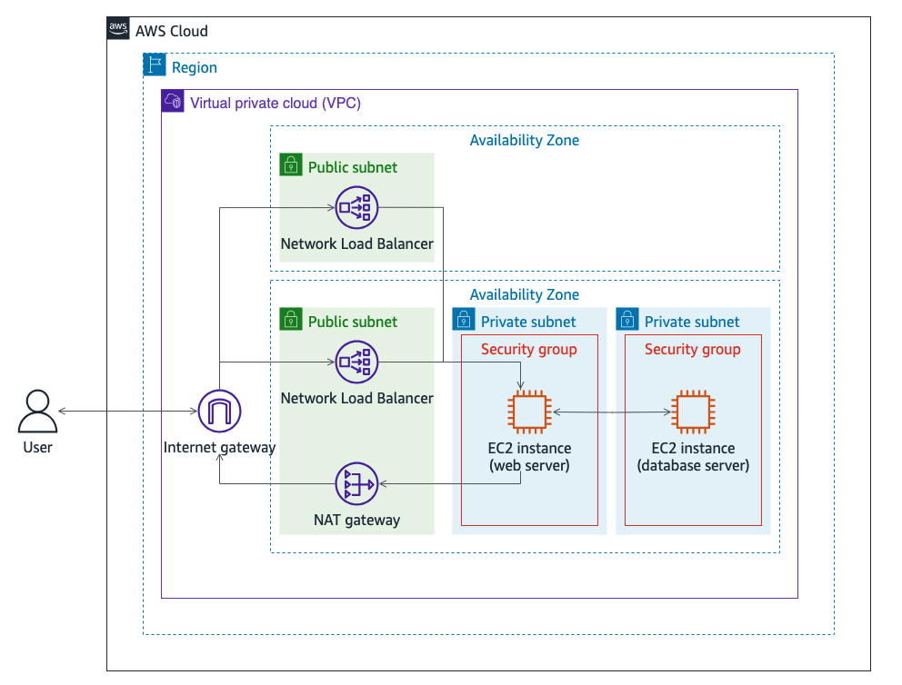

# Monitoring Security with Amazon CloudWatch

## Lab overview

As a security engineer at AnyCompany, you are responsible for monitoring the company network and Amazon Elastic Compute Cloud (Amazon EC2) instances for abnormal activity.

In this lab, you will monitor security on the database server with Amazon CloudWatch. You configure the database server to send log files to Amazon CloudWatch. You then create CloudWatch alarms and notifications to alert you to a specified number of login failures on your database server. Finally, you create a CloudWatch alarm and notification to monitor outgoing traffic through a NAT gateway.

Objectives
By the end of this lab, you will be able to do the following:

Configure an Amazon Linux 2 instance to send log files to CloudWatch.
Create CloudWatch alarms and notifications to monitor for failed login attempts.
Create CloudWatch alarms to monitor network traffic through a NAT gateway.
Technical knowledge prerequisites
To successfully complete this lab, you should be familiar with basic navigation of the AWS Management Console. You should also be comfortable running commands in a Linux command line interface (CLI).

Duration
This lab requires approximately 45 minutes to complete.

Icon key
Various icons are used throughout this lab to call attention to different types of instructions and notes. The following list explains the purpose for each icon:

 Command: A command that you must run
 Expected output: A sample output that you can use to verify the output of a command or edited file
 Note: A hint, tip, or important guidance
 Additional information: Where to find more information
 Consider: A moment to pause to consider how you might apply a concept in your own environment or to initiate a conversation about the topic at hand
 Refresh: A time when you might need to refresh a web browser page or list to show new information
 Copy edit: A time when copying a command, script, or other text to a text editor (to edit specific variables within it) might be easier than editing directly in the command line or terminal
 Task complete: A conclusion or summary point in the lab

## Lab environment

The following diagram represents the basic architecture of the lab environment.

The network traffic flows from an external user, through an internet gateway to one of the two Network Load Balancer nodes, to the web server. The database servers receives traffic from the web server.

The following list details the major resources in the diagram:

A VPC with one public subnet and two private subnets in one Availability Zone, and one public subnet in a second Availability Zone
A Network Load Balancer with two nodes, one in each public subnet
An EC2 instance acting as a web server in the first private subnet
An EC2 instance acting as a database server in the second subnet
Two security groups, one for each instance based on its purpose
A traditional web architecture with two Network Load Balancers, a web server and a database is provisioned in this lab. In this lab, you will monitor security on the database server with Amazon CloudWatch.

Start lab
To launch the lab, at the top of the page, choose Start Lab.

 Caution: You must wait for the provisioned AWS services to be ready before you can continue.

To open the lab, choose Open Console .

You are automatically signed in to the AWS Management Console in a new web browser tab.

 Warning: Do not change the Region unless instructed.

Common sign-in errors
Error: Choosing Start Lab has no effect
In some cases, certain pop-up or script blocker web browser extensions might prevent the Start Lab button from working as intended. If you experience an issue starting the lab:

Add the lab domain name to your pop-up or script blocker’s allow list or turn it off.
Refresh the page and try again.
Task 1: Sending local logs from an EC2 instance to CloudWatch
In this task, you install the CloudWatch agent on an Amazon Linux 2 EC2 instance. The instance serves as the database server for your customer-facing blog site and contains sensitive information, so you need an efficient way to monitor any abnormalities.

Task 1.1: Installing the CloudWatch agent
On the AWS Management Console, in the search bar, search for and choose EC2.

In the left navigation pane, choose Instances.

Select Database Server, and then, at the top, choose Connect.

On the Connect to instance page, choose the Session Manager tab, and then choose Connect.

 Expected output: A new web browser tab opens with a console connection to the instance. A set of commands that change to the user’s home directory and display the path of the working directory run automatically when you connect to the instance. The following is an example:

cd $HOME; pwd
sh-4.2$ cd $HOME; pwd
/home/ec2-user
sh-4.2$
First, install the CloudWatch agent package.

 To install the CloudWatch agent package, run the following command:

sudo yum install -y amazon-cloudwatch-agent
 Expected output: Successful installation of the CloudWatch agent as indicated by the Complete! status at the end of the installation.

 Note: It will take a few minutes for the agent to exit and return the instance terminal to the shell prompt.

 To start the CloudWatch agent configuration wizard, run the following command:

sudo /opt/aws/amazon-cloudwatch-agent/bin/amazon-cloudwatch-agent-config-wizard
 Expected output: The wizard opens to the following menu:

================================================================
= Welcome to the Amazon CloudWatch Agent Configuration Manager =
=                                                              =
= CloudWatch Agent allows you to collect metrics and logs from =
= your host and send them to CloudWatch. Additional CloudWatch =
= charges may apply.                                           =
================================================================
On which OS are you planning to use the agent?
1. linux
2. windows
3. darwin
default choice: [1]:
Configure the CloudWatch agent as follows:

 Note: You must press Enter after each entry.

For On which OS are you planning to use the agent?, enter 1 for linux.

For Are you using EC2 or On-Premises hosts?, enter 1 for EC2.

For Which user are you planning to run the agent?, enter 2 for root.

For Do you want to turn on StatsD daemon?, enter 2 for no.

For Do you want to monitor metrics from CollectD?, enter 2 for no.

For Do you want to monitor any host metrics?, enter 2 for no.

For Do you have any existing CloudWatch Log Agent configuration file to import for migration?, enter 2 for no.

For Do you want to monitor any log files?, enter 1 for yes.

For Log file path:, enter /var/log/secure.

For Log group name:, enter database_server_security_logs.

For Log group class:, press Enter to keep the default value of 1.

For Log stream name:, press Enter to keep the default value of {instance_id}.

For Log Group Retention in days, press Enter to keep the default value of 1.

For Do you want to specify any additional log files to monitor?, enter 2 for no.

 Note: If you need to modify the CloudWatch agent configuration in the future, you can find it at /opt/aws/amazon-cloudwatch-agent/bin/config.json.

For Do you want the CloudWatch agent to also retrieve X-ray traces?, enter 2 for no.

For Do you want to store the config in the SSM parameter store?, enter 2 for no.

 Expected Output: You should receive a Program exits now message and return to the shell prompt.

 Additional information: The /var/log/secure is the file we configured the agent to deliver CloudWatch logs.

 To start the CloudWatch agent service, run the following command:

sudo /opt/aws/amazon-cloudwatch-agent/bin/amazon-cloudwatch-agent-ctl -a fetch-config -m ec2 -s -c file:/opt/aws/amazon-cloudwatch-agent/bin/config.json
 Note: Notice the file path to the config.json file at the end of the command, which is the CloudWatch agent configuration file you created with the CloudWatch agent wizard.

 Expected Output: The output should display information about the configuration file that is loaded by the agent, similar to the following:

***** processing amazon-cloudwatch-agent ******
I! Trying to detect region from ec2 D! [EC2] Found active network interface Successfully fetched the config and saved in /opt/aws/amazon-cloudwatch-agent/etc/amazon-cloudwatch-agent.d/file_config.json.tmp
Start configuration validation...
2023/09/06 17:27:04 Reading json config file path: /opt/aws/amazon-cloudwatch-agent/etc/amazon-cloudwatch-agent.d/file_config.json.tmp ...
2023/09/06 17:27:04 I! Valid Json input schema.
2023/09/06 17:27:04 Configuration validation first phase succeeded
I! Detecting run_as_user...
I! Trying to detect region from ec2
D! [EC2] Found active network interface
/opt/aws/amazon-cloudwatch-agent/bin/amazon-cloudwatch-agent -schematest -config /opt/aws/amazon-cloudwatch-agent/etc/amazon-cloudwatch-agent.toml
Configuration validation second phase succeeded
Configuration validation succeeded
amazon-cloudwatch-agent has already been stopped
Created symlink from /etc/systemd/system/multi-user.target.wants/amazon-cloudwatch-agent.service to /etc/systemd/system/amazon-cloudwatch-agent.service.
 To verify the status of the CloudWatch agent service, run the following command:

sudo /opt/aws/amazon-cloudwatch-agent/bin/amazon-cloudwatch-agent-ctl -m ec2 -a status
 Expected Output: The output should show that the CloudWatch agent is running, similar to the following:

{  
  "status": "running",
  "starttime": "2023-09-05T21:53:15+0000",
  "configstatus": "configured",
  "version": "1.300026.2"
}
Task 1.2: Generating authentication failures in the security logs
 To attempt to log in as dbdev, run the following command:

su dbdev
When prompted for a password, be creative and try to guess what the password might be. Remember, you are trying to generate authentication failures, so failed logins are what you want.

 Expected Output: Notice the Authentication failure message.

Repeat the previous two steps three more times to generate a total of four failed login attempts.

Task 1.3: Verifying the log files are sent to CloudWatch
 To view the failed log in attempts in the /var/log/secure file, run the following command:

sudo cat /var/log/secure
 Expected Output: You should see the four failed authentication failure attempts logged to the file.

Nov 15 20:35:23 ip-10-10-20-20 su: pam_unix(su:auth): authentication failure; logname= uid=1000 euid=0 tty=pts/0 ruser=ec2-user rhost=  user=dbdev
Nov 15 20:35:32 ip-10-10-20-20 su: pam_unix(su:auth): authentication failure; logname= uid=1000 euid=0 tty=pts/0 ruser=ec2-user rhost=  user=dbdev
Nov 15 20:35:41 ip-10-10-20-20 su: pam_unix(su:auth): authentication failure; logname= uid=1000 euid=0 tty=pts/0 ruser=ec2-user rhost=  user=dbdev
Nov 15 20:35:52 ip-10-10-20-20 su: pam_unix(su:auth): authentication failure; logname= uid=1000 euid=0 tty=pts/0 ruser=ec2-user rhost=  user=dbdev
Return to your web browser tab with the Amazon EC2 console.

At the top of the page, in the search bar, search for and choose CloudWatch.

In the left navigation pane, under Logs, choose Log groups.

On the Log groups page, choose the link for the database_server_security_logs log group.

 If the database_server_security_logs is not listed, wait 1 minute, and then choose the refresh icon  at the top of the page.

On the database_server_security_logs page, choose the Log streams tab.

 Expected Output: Notice there is one log stream with the EC2 instance ID of the Database Server instance.

To view the security logs from the Database Server instance, choose the link for the log stream name.

 Expected Output: Scroll to the end of the log, and then notice the four authentication failures logged.

 Congratulations! You have successfully installed the CloudWatch agent on an EC2 instance and configured it to send security logs to CloudWatch.

Task 2: Creating a CloudWatch alarm and notification
Now that you are sending the security logs from the database server to CloudWatch, you can create CloudWatch metrics and alarms to monitor the logs for abnormal behavior.

In this task, you create a CloudWatch metric filter to locate authentication failure event messages in the logs from the database server. You then create a CloudWatch alarm and notification to email you any time there are too many login failures in a 5-minute window.

Task 2.1: Creating a metric filter
In the navigation breadcrumbs at the top of the page, choose the database_server_security_logs link.

On the database_server_security_logs page, choose the Metric filters tab.

Choose Create metric filter.

On the Define pattern page, do the following:

For Filter pattern, enter "authentication failure".

For Select log data to test, choose the EC2 instance ID for the Database Server.

 Note: The EC2 instance ID should match the DatabaseServerId value listed to the left of these instructions.

Choose Test pattern.

 Expected output: Under Results, notice the four authentication failures. The number of entries should match the number of times you failed to log in as dbdev on the Database Server instance. Only the last 50 log messages are used as a sample to test your filter pattern with. If you don’t observe any results during your pattern test, try generating authentication failures again.

At the bottom of the page, choose Next.

On the Assign metric page, do the following:

For Filter name, enter database server authentication failures.
For Metric namespace, enter authentication failures, and then verify that the Create new option is turned on .
For Metric name, enter database server authentication failures.
For Metric value, enter 1.
For Default value, enter 0.
At the bottom of the page, choose Next.

On the Review and create page, choose Create metric filter.

 Expected output: You should notice a  Metric filter “database server authentication failures” has been created. message at the top of the page.

Task 2.2: Creating a CloudWatch alarm from a metric filter
On the database_server_security_logs page, on the Metric filters tab, you should observe a card for the database server authentication failures filter.

Select the check box  in the top right of the database server authentication failures card.

Choose Create alarm .

 Expected output: A new web browser tab opens to the Specify metric and conditions page.

On the Specify metric and conditions page, in the Metric section, do the following:

For Metric name, enter database server authentication failures.
For Statistic, choose Sum from the drop-down menu.
For Period, choose 5 minutes from the drop-down menu.
 Note: This information might already be entered by default.

In the Conditions section, do the following:

For Threshold type, choose  Static.
For Whenever database server authentication failures is…, choose  Greater.
For than…, enter 2.
Expand the Additional configuration section, and then do the following:

For Missing data treatment, choose Treat missing data as good (not breaching threshold).
At the bottom of the page, choose Next.

On the Configure actions page, in the Notification section, do the following:

For Alarm state trigger, choose  In alarm.
For Send a notification to the following SNS topic, choose  Create new topic.
For Create a new topic…, enter CloudWatch_alarm_notifications to replace the default topic.
For Email endpoints that will receive the notification…, enter your email address.
Choose Create topic.

At the bottom of the page, choose Next.

On the Add name and description page, do the following:

For Alarm name, enter database server authentication failures alarm.
For Alarm description, enter Alarms and notifies for more than 2 authentication failures over a span of 5 minutes.
Choose Next.

At the bottom of the Preview and create page, choose Create alarm.

 Expected output: You should notice two banners at the top of the page:

 Successfully created alarm database server authentication failures alarm.

 Some subscriptions are pending confirmation

You must confirm your email address before Amazon Simple Notification Service (Amazon SNS) can send notification messages to you.

Check your email for a message from AWS Notifications with a subject line of AWS Notification - Subscription Confirmation.

 Expected output: The message should look similar to the following:

"You have chosen to subscribe to the topic: arn:aws:sns:us-west-2:111122223333:CloudWatch_alarm_notifications

To confirm this subscription, click or visit the link below (If this was in error no action is necessary): Confirm subscription"

Choose the Confirm subscription link.

 Expected output: A new web browser tab should open to a Subscription confirmed! page.

Close your web browser tab with the Subscription confirmed! page.

Navigate back to the CloudWatch console, and then in the Some subscriptions are pending confirmation banner at top of the page, choose View SNS Subscriptions.

On the Subscriptions page, verify that the status for the CloudWatch_alarm_notifications topic is  Confirmed.

Close your web browser tab with the Subscriptions page.

Task 2.3: Verifying the alarm is activated
On the CloudWatch console, in the left navigation pane, ensure that you are on the Alarms > All Alarms page.

To view the alarm details, choose the database server authentication failures alarm link.

Scroll down to the Details tab.

 Consider: Is the alarm State currently In alarm or OK? What do you think caused the current state of the alarm?

When you configured the alarm, you set it to alert for two or more authentication failures in a 5-minute time span. If this situation occurs, the alarm state changes to In alarm until there is another time span of 5 or more minutes where there are no authentication failures. The alarm state then changes back to OK.

If the alarm state is  OK, return to the Database Server console session, and then attempt to log in as dbdev using incorrect passwords as detailed in Task 1.2.

 Note: If the terminal window has timed out, reconnect to the database server referring to Task 1.1.

Return to your web browser tab with the database server authentication failures alarm page, and then refresh the page.

 Note: It can take approximately 2 minutes for the alarm state to change to In alarm.

The alarm status should now be  In alarm, and you should receive an email notification regarding the state change.

 Congratulations! You successfully created a CloudWatch alarm and notification to monitor authentication failures on an EC2 instance.

Task 3: Monitoring a NAT gateway
In addition to monitoring authentication failures, you want to monitor for abnormal outgoing network traffic.

In this task, you create a CloudWatch alarm to monitor metrics related to outgoing traffic through a NAT gateway.

Task 3.1: Creating a CloudWatch alarm to monitor outgoing network traffic through a NAT gateway
On the CloudWatch console, in the left navigation pane, under Alarms, choose All alarms.

On the Alarms page, in the top right, choose Create alarm.

On the Specify metric and conditions page, choose Select metric.

In the Metrics section, under AWS namespaces, choose NATGateway.

Choose Nat Gateway Metrics.

In the search bar at the top of the Metrics section, search for BytesOutToDestination.

 Expected output: The list of metrics should now be filtered to show only the BytesOutToDestination metric name.

Select the metric with a NatGatewayId that matches the NatGatewayId value listed to the left of these instructions.

At the bottom of the page, choose Select metric.

On the Specify metric and conditions page, in the Metric section, do the following:

For Metric name, enter BytesOutToDestination.
For NatGatewayId, verify it matches the NatGatewayId value listed to the left of these instructions.
For Statistic, choose Sum.
For Period, choose 15 minutes.
In the Conditions section, do the following:

For Threshold type, choose  Static.
For Whenever BytesOutToDestination is…, choose  Greater.
For than…, enter 2000000.
At the bottom of the page, choose Next.

On the Configure actions page, in the Notification section, do the following:

For Alarm state trigger, choose  In alarm.
For Send a notification to the following SNS topic, choose  Select an existing SNS topic.
For Send a notification to…, search for and choose CloudWatch_alarm_notifications.
At the bottom of the page, choose Next.

On the Add name and description page, do the following:

For Alarm name, enter NAT gateway outgoing traffic alarm.
For Alarm description, enter Alarms and notifies for more than 2 MB of outgoing network traffic over 15 minutes.
Choose Next.

At the bottom of the Preview and create page, choose Create alarm.

 Expected output: You should notice a  Successfully created alarm NAT gateway outgoing traffic alarm. message at the top of the page.

Task 3.2: Generating enough outgoing traffic to activate the alarm
Next, you upload data to an Amazon Simple Storage Service (Amazon S3) bucket to generate enough outgoing traffic to invoke the alarm. A sample file named SampleData.zip was added to the database server instance during the lab environment build process. The file has a size of approximately 2.3 MB.

Return to your web browser tab with the console connection to the Database Server instance.

 Note: If the terminal window has timed out, reconnect to the database server referring to Task 1.1.

 Copy edit: To set an environment variable to hold the name of the S3 bucket, run the following command:

 Note: Replace the TEST_BUCKET placeholder value with the TestBucket value listed to the left of these instructions.

TestBucket=TEST_BUCKET
 To upload the SampleData.zip file to an S3 bucket in the lab environment, run the following command:

aws s3 cp ~/SampleData.zip s3://$TestBucket/
 Expected output: The output should display an upload message, which indicates the file uploaded to Amazon S3 successfully.

Return to your web browser tab with the CloudWatch console.

If you are not on the Alarms page, in the left navigation pane, choose All alarms.

Wait approximately 1–2 minutes, and then refresh the page. You should notice that NAT gateway outgoing traffic alarm now has a status of  In alarm. You should also receive a notification email from AWS Notifications with the details of the alarm status change.

 Congratulations! You have successfully created a CloudWatch alarm to monitor outgoing network traffic through a NAT gateway.

Conclusion
 Congratulations! You now have successfully done the following:

Configured an Amazon Linux 2 instance to send log files to CloudWatch
Created CloudWatch alarms and notifications to monitor for failed login attempts
Created CloudWatch alarms to monitor network traffic through a NAT gateway
End lab
Follow these steps to close the console and end your lab.

Return to the AWS Management Console.

At the upper-right corner of the page, choose AWSLabsUser, and then choose Sign out.

Choose End Lab and then confirm that you want to end your lab.

Additional resources
Installing the CloudWatch Agent Using the Command Line
Create the CloudWatch Agent Configuration File with the Wizard
CloudWatch Logs Agent Reference
Getting Started with CloudWatch Logs
Creating Metrics from Log Events Using Filters
For more information about AWS Training and Certification, see https://aws.amazon.com/training/.

Your feedback is welcome and appreciated.
If you would like to share any feedback, suggestions, or corrections, please provide the details in our AWS Training and Certification Contact Form.
