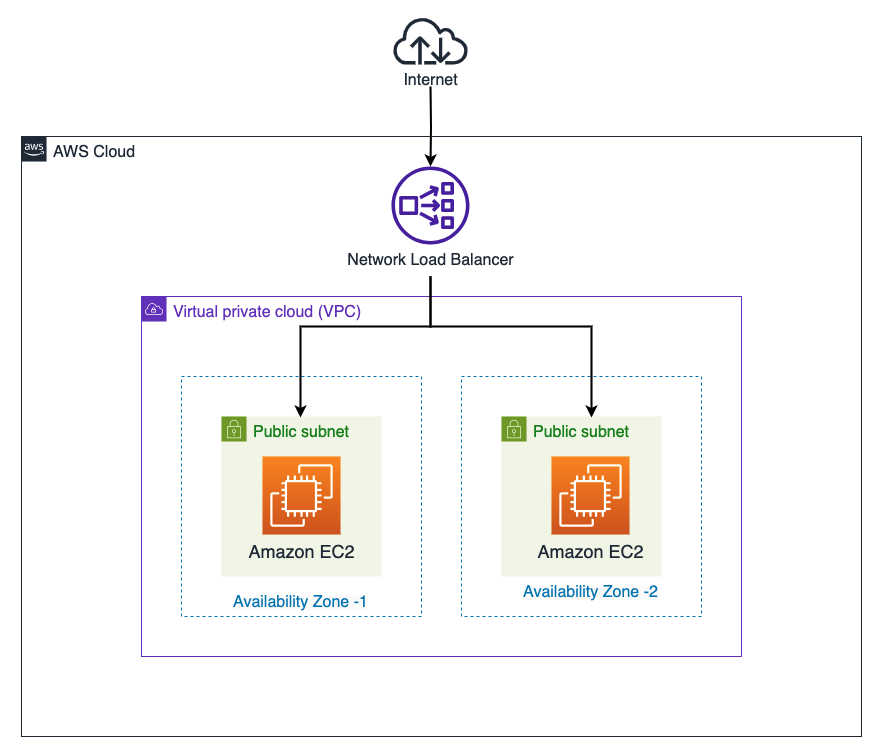
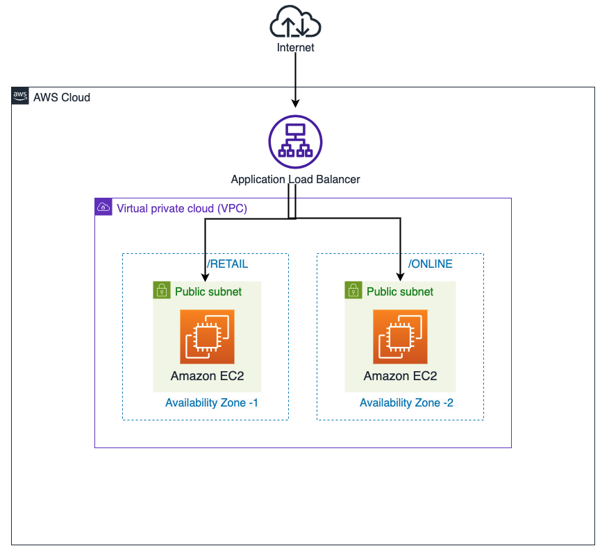

```test
myNLB-b30a3fbeef022b18.elb.us-east-1.amazonaws.com
myALB-814579836.us-east-1.elb.amazonaws.com
```

# Introduction to Elastic Load Balancing

## Lab overview

In this lab you create, configure, and test a Network Load Balancer and an Application Load Balancer.

Objectives
By the end of this lab, you should be able to do the following:

Configure a target group and register targets for a Network Load Balancer.
Configure target groups and register targets for an Application Load Balancer.
Create and test a Network Load Balancer.
Create and test an Application Load Balancer.
Technical knowledge prerequisites
This hands-on lab assumes that you are familiar with the principles of Elastic Load Balancing and have a basic understanding of Network Load Balancer and Application Load Balancer.

Icon key
Various icons are used throughout this lab to call attention to different types of instructions and notes. The following list explains the purpose for each icon:

 Expected output: A sample output that you can use to verify the output of a command or edited file.
 Note: A hint, tip, or important guidance.
 Learn more: Where to find more information.
 Caution: Information of special interest or importance (not so important to cause problems with the equipment or data if you miss it, but it could result in the need to repeat certain steps).
 Warning: An action that is irreversible and could potentially impact the failure of a command or process (including warnings about configurations that cannot be changed after they are made).
 Task complete: A conclusion or summary point in the lab.
Start lab
To launch the lab, at the top of the page, choose Start lab.

 Caution: You must wait for the provisioned AWS services to be ready before you can continue.

To open the lab, choose Open Console .

You are automatically signed in to the AWS Management Console in a new web browser tab.

 Warning: Do not change the Region unless instructed.

Common sign-in errors
Error: Choosing Start Lab has no effect
In some cases, certain pop-up or script blocker web browser extensions might prevent the Start Lab button from working as intended. If you experience an issue starting the lab:

Add the lab domain name to your pop-up or script blocker’s allow list or turn it off.
Refresh the page and try again.

## Lab environment

The following diagram displays the basic architecture of a Network Load Balancer in this lab environment.



Image description: The preceding diagram depicts the basic architecture of a Network Load Balancer in this lab environment.

The following diagram displays the basic architecture of an Application Load Balancer in this lab environment.



Image description: The preceding diagram depicts the basic architecture of an Application Load Balancer in this lab environment.

The following list details the major resources in the diagram:

A virtual private cloud (VPC) with two public subnets, one in each Availability Zone
A Network Load Balancer or Application Load Balancer balancing traffic between the two web servers
An Amazon Elastic Compute Cloud (Amazon EC2) instance acting as a web server in the first public subnet
An EC2 instance acting as a web server in the second public subnet
The network traffic flows from the internet to one of the load balancers, which then balances the traffic between the web servers depending on the type of load balancer.

Services used in this lab
Elastic Load Balancing
Elastic Load Balancing (ELB) automatically distributes incoming traffic across multiple targets, such as EC2 instances, containers, and IP addresses, in one or more Availability Zones. It monitors the health of its registered targets and routes traffic only to the healthy targets. ELB scales your load balancer as your incoming traffic changes over time. It can automatically scale to the vast majority of workloads.

Network Load Balancer
A Network Load Balancer functions at the transport layer, which is the fourth layer of the Open Systems Interconnection (OSI) model. It is contextless, caring only about the network layer information contained in the packets it is directing. It can handle millions of requests each second. After the load balancer receives a connection request, it selects a target from the target group for the default rule. The balancing is done solely with IP addresses, port numbers, and other network variables.

Application Load Balancer
An Application Load Balancer functions at the application layer, which is the seventh layer of the OSI model. It is context-aware and examines the contents of the HTTP request header to determine where to route the request. After the load balancer receives a request, it evaluates the listener rules in priority order to determine which rule to apply. It then selects a target from the target group for the rule action.

AWS services not used in this lab
Amazon Web Services (AWS) service capabilities used in this lab are limited to what the lab requires. Expect errors when accessing other services or performing actions beyond those provided in this lab guide.

Task 1: Configure a target group and register targets for a Network Load Balancer
In this task, you configure a target group that you can use to register targets, such as EC2 instances. These target groups are used in the listener rule when configuring the Network Load Balancer.

At the top of the AWS Management Console, in the search bar, search for and choose EC2.

In the left navigation pane, under Load Balancing, choose Target Groups.

Choose Create target group.

On the Specify group details page, configure the target group as follows:

In the Basic configuration section:

For Choose a target type, choose Instances.
For Target group name, enter nlb-targets.
For Protocol : Port, use the dropdown menu and choose TCP, and leave the default value as 80 for the port.
For VPC, choose Lab VPC.
In the Health checks section, expand  Advanced health check settings, and configure the following:

For Healthy threshold, enter 2.
For Interval, enter 10.
 Learn more: ELB now checks the health of target instances every 10 seconds. After two successful checks, the instance is considered healthy. You decreased the default values so you can observe the targets sooner.

Choose Next.

On the Register targets page, in the Available instances section, select both EC2 instances.

Choose Include as pending below.

Both web servers selected as targets move to the Targets section of the split pane on the lower half of the page.

Choose Create target group.
A  Successfully created the target group: nlb-targets. message displays at the top of the page.

 Task complete: You have successfully configured a target group and registered targets for use with the Network Load Balancer.

Task 2: Configure target groups and register targets for an Application Load Balancer
In this task, to support path-based routing, you configure two target groups, each with one target EC2 instance. These target groups are used in the listener rule when configuring the Application Load Balancer.

In the left navigation pane, under Load Balancing, choose Target Groups.

Choose Create target group.

On the Specify group details page, configure the target group as follows:

In the Basic configuration section:

For Choose a target type, choose Instances.
For Target group name, enter alb-targets-1 .
For Protocol : Port, use the dropdown menu and choose HTTP, and leave the default value as 80 for the port.
For VPC, choose Lab VPC.
In the Health checks section, expand  Advanced health check settings, and configure the following:

For Healthy threshold, enter 2.
For Interval, enter 10.
 Learn more: ELB now checks the health of target instances every 10 seconds. After two successful checks, the instance is considered healthy. You decreased the values so you can observe the targets sooner.

Choose Next .

On the Register targets page, in the Available instances section, select Ec2WebServer01.

Choose Include as pending below.

The web server selected as a target moves to the Targets section of the split pane on the lower half of the page.

Choose Create target group .
A  Successfully created the target group: alb-targets-1. message displays at the top of the page.

Following the same steps used to create the target group alb-targets-1 , create another target group called alb-targets-2 with Ec2WebServer02 as the target instance, and configure the following:

For Protocol, select HTTP.
Leave the default value as 80 for the port.
 Task complete: You have successfully configured two target groups and registered targets for use with an Application Load Balancer.

Task 3: Create a Network Load Balancer
In this task, you create and configure a Network Load Balancer.

In the left navigation pane, under Load Balancing, choose Load Balancers.

Choose Create load balancer.

On the Compare and select load balancer type page, under Network Load Balancer, choose Create.

On the Create Network Load Balancer page, configure the following:

In the Basic configuration section:

For Load balancer name, enter myNLB.
For scheme, verify that Internet-facing is selected.
For Load balancer IP address type, verify that IPv4 is selected.
In the Network mapping section:

For VPC, choose Lab VPC.
For Mappings, select both the available Availability Zones.
In the Security groups section:

For Security groups, clear the default security group, and then select ELBSecurityGroup.
In the Listeners and routing section, the default is a listener that accepts TCP traffic on port 80. Keep the default listener settings for Protocol and Port, and configure the following:

For Default action, choose nlb-targets.
Choose Create load balancer.

A  Successfully created load balancer message displays at the top of the page.

Notice that the State of the load balancer changes from Provisioning to Active. This can take a few minutes.

In the Details section, copy the DNS name, and paste it into a text editor. You refer to it in the following task.

 Note: The DNS name should look similar to myNLB-4e009e86b4f704cc.elb.us-west-2.amazonaws.com.

 Task complete: You have successfully created a Network Load Balancer.

Task 4: Test the Network Load Balancer
In this task, you test the default functionality of the Network Load Balancer and test its functionality during a failure.

Task 4.1: Test the Default Functionality
Copy the DNS name from your text editor, paste it into a new browser tab, and press Enter.
You should observe the HTML page for one of your EC2 instances.

Refresh  the page a few times.
The webpage name starts with either Test Website - Ec2WebServer01 or Test Website - Ec2WebServer02.

Task 4.2: Test the Load Balancer During a Failure
On the AWS Management Console, in the left navigation pane, under Instances, and choose Instances.

Select the EC2 instance that is currently serving you the webpage.

Choose Instance state  in the top-right corner of the page, and then choose Stop instance.

Choose Stop.

A  Successfully initiated stopping message displays at the top of the page. The Instance state changes to Stopped. It might take a few minutes for the change to take effect.

In the left navigation pane, under Load Balancing, choose Target Groups.

Choose the link for nlb-targets.

To observe the health status of the target group, choose the Targets tab in the lower half of the split screen.

Notice that the stopped instance has an Unused status.

Return to the browser tab that you used to access your load balancer, and refresh  the page.
Notice that your load balancer now routes the traffic automatically to the registered target in the second Availability Zone.

Return to the console, and in the Targets tab, choose the link for the EC2 instance with the Unused status.

Select the EC2 instance with the Instance state of Stopped.

In the top-right corner of the page, for Instance state , choose Start instance.

A  Successfully initiated starting message displays at the top of the page. Wait for the Instance state to change to Running.

Following the same steps outlined in this task, stop the EC2 instance that is currently serving the webpage, and refresh the web browser.
Notice that the traffic is now routed to the Running EC2 instance.

 Task complete: You have successfully tested the Network Load Balancer.

Task 5: Create an Application Load Balancer
In this task, you create and configure an Application Load Balancer that supports path-based routing.

The two provisioned lab instances have two different web applications installed. Ec2WebServer01 has an application installed under the path /Retail/. Ec2WebServer02 has an application installed under the path /Online/. Depending on the requested path, the traffic routes to the appropriate web server.

In the left navigation pane, under Load balancing, choose Load Balancers.

Choose Create load balancer.

On the Compare and select load balancer type page, under Application Load Balancer, choose Create.

On the Create Application Load Balancer page, configure the following:

In the Basic configuration section:

For Load balancer name, enter myALB.
For scheme, verify that Internet-facing is selected.
For Load balancer IP address type, verify that IPv4 is selected.
In the Network mapping section:

For VPC, choose Lab VPC.
For Mappings, select both the available Availability Zones.
In the Security groups section:

For Security groups, clear the default security group, and then select ELBSecurityGroup.
In the Listeners and routing section, the default is a listener that accepts HTTP traffic on port 80. Keep the default listener settings for Protocol and Port, and configure the following:

For Default action, choose alb-targets-1. This routes the traffic to the web server configured to handle alb-targets-1 path-based traffic.
Choose Create load balancer.

A  Successfully created load balancer: myALB message displays at the top of the page.

Notice that the State of the load balancer changes from Provisioning to Active. This can take a few minutes.

For myALB, in the Details section, copy the DNS name, and paste it into a text editor. You refer to it in the following task.

 Note: The DNS name should look similar to myALB-4e009e86b4f704cc.elb.us-west-2.amazonaws.com.

In the Listeners and rules tab, select HTTP:80.

On the HTTP:80 listener page, choose the Rules tab and then choose Add rule.

To support Ec2WebServer01 path-based routing, add the following rule:

For Name, enter TG1Rule.

Choose Next.

Choose Add condition.

For Choose condition, choose Path.

For Path, enter /Retail*.

Choose Confirm.

Choose Next.

For Target group, choose alb-targets-1.

Choose Next.

For Priority, enter 1.

Choose Next.

Choose Create.

A  Successfully created rule “TG1Rule” on listener HTTP:80 message displays at the top of the page.

To support Ec2WebServer02 path-based routing, add the following Listener rule:

Scroll to the lower half of the page, and choose Add Rule.

For Name, enter TG2Rule.

Choose Next.

Choose Add condition.

For Choose condition, choose Path.

For Path, enter /Online*.

Choose Confirm.

Choose Next.

For Target group, choose alb-targets-2.

Choose Next.

For Priority, enter 2.

Choose Next.

Choose Create.

A  Successfully created rule “TG2Rule” on listener HTTP:80 message displays at the top of the page.

 Task complete: You have successfully created an Application Load Balancer.

Task 6: Test the Application Load Balancer
In this task, you test the functionality of the Application Load Balancer.

Copy the DNS name from your text editor, and paste it into a new browser tab. Append it with /Retail/, and then press Enter.

 Expected output: Notice the request routes to the web server configured to handle the Ec2WebServer01 path-based traffic as follows:


You have reached the Retail store
Copy the DNS name from your text editor, and paste it into a new browser tab. Append it with /Online/, and then press Enter.

 Expected output: Notice the the request routes to the web server configured to handle the Ec2WebServer02 path-based traffic as follows:


You have reached the Online store
 Task complete: You have successfully tested the Application Load Balancer.

Conclusion
You have successfully done the following:

Configured a target group and registered targets for a Network Load Balancer.
Configured target groups and registered targets for an Application Load Balancer.
Created and tested a Network Load Balancer.
Created and tested an Application Load Balancer.
End lab
Follow these steps to close the console and end your lab.

Return to the AWS Management Console.

At the upper-right corner of the page, choose AWSLabsUser, and then choose Sign out.

Choose End lab and then confirm that you want to end your lab.

Additional resources
How Elastic Load Balancing works
Elastic Load Balancing
What is a Network Load Balancer?
What is an Application Load Balancer?
For more information about AWS Training and Certification, see https://aws.amazon.com/training/.

Your feedback is welcome and appreciated.
If you would like to share any feedback, suggestions, or corrections, please provide the details in our AWS Training and Certification Contact Form.
