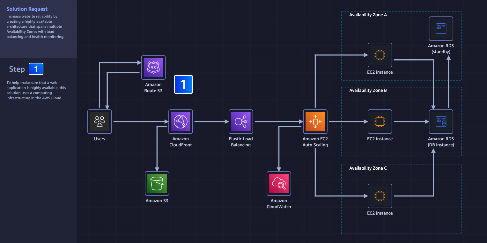
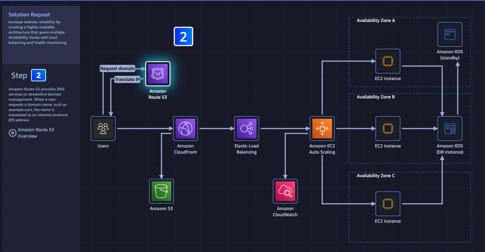
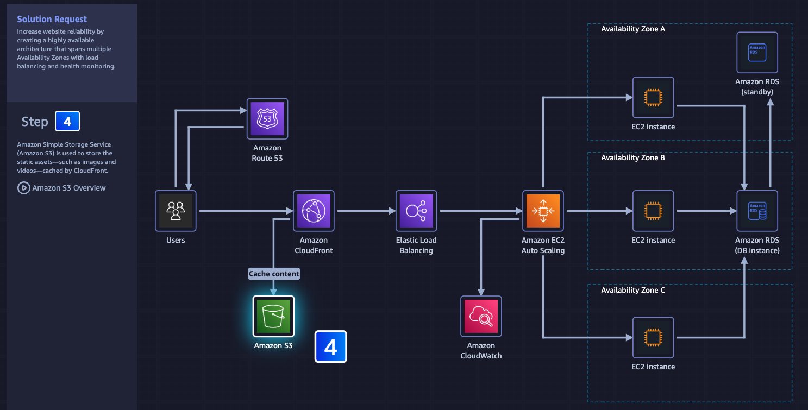
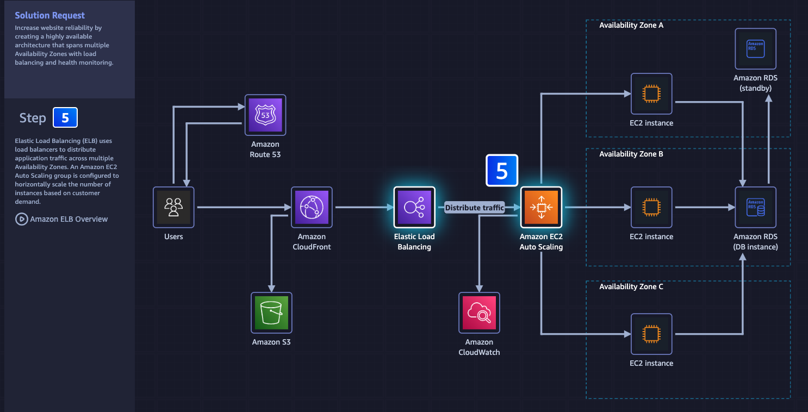
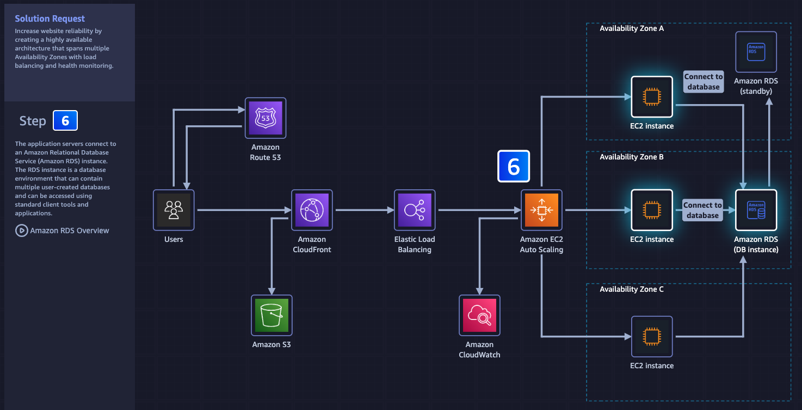
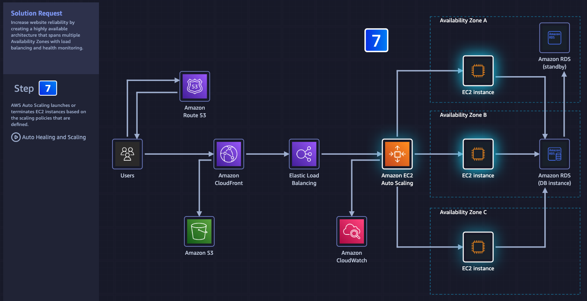
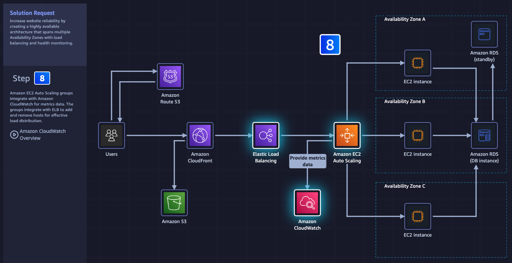
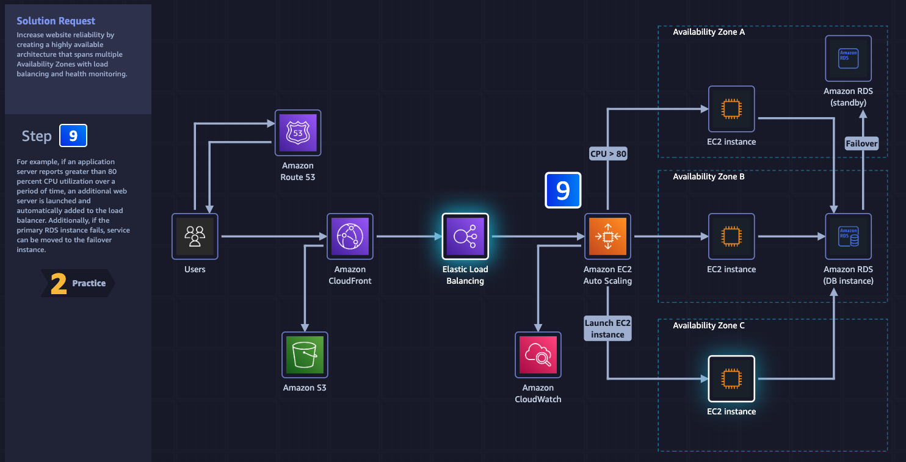
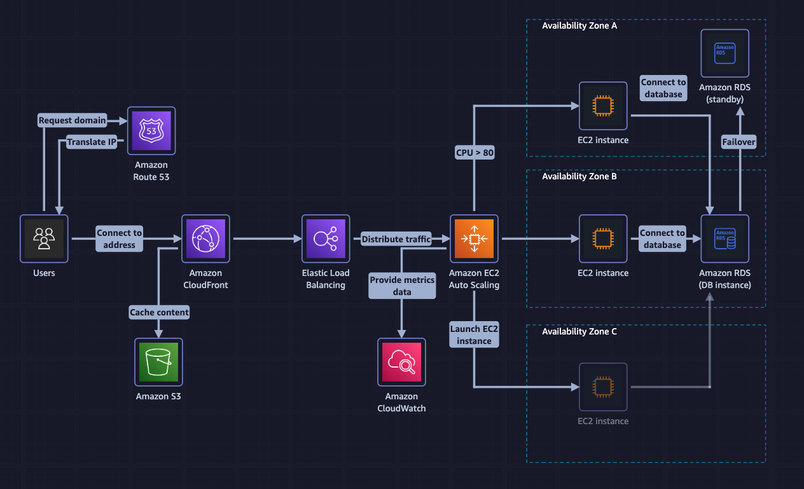
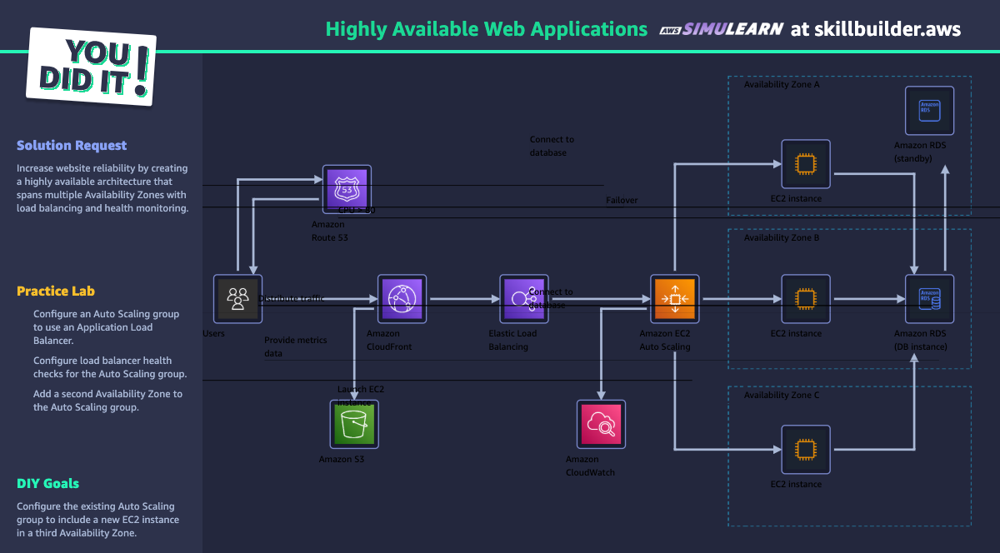

# Week 7: AWS SimuLearn: Highly Available Web Applications

* back to AWS Cloud Institute repo's root [aci.md](../aci.md)
* back to [AWS Cloud Operations 2](../aws-cloud-operations-2.md)
* back to repo's main [README.md](../../../../README.md)

## Learn

1. 
2. 
3. 
4. 
5. 
6. 
7. 
8. 
9. 

## Practice

## DIY

