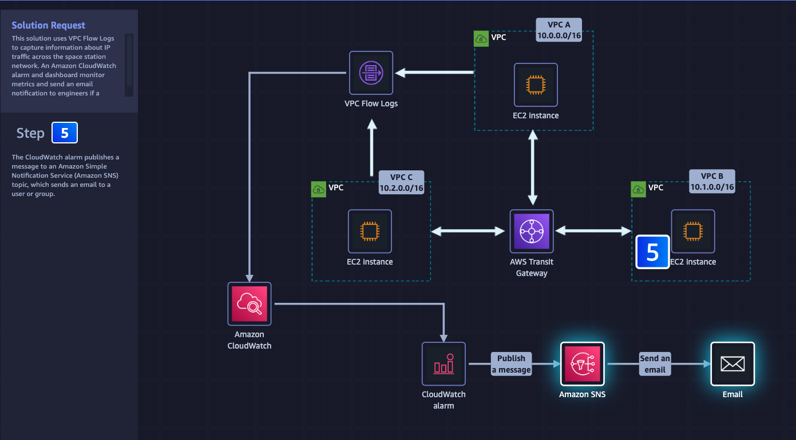
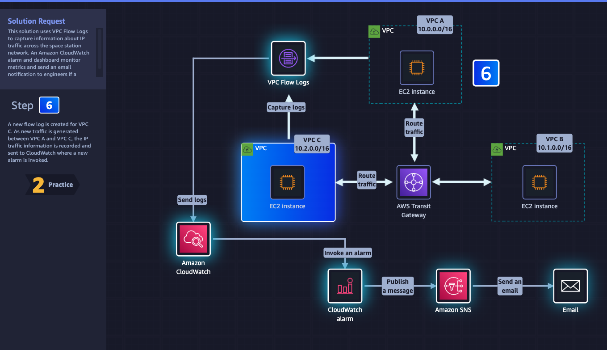
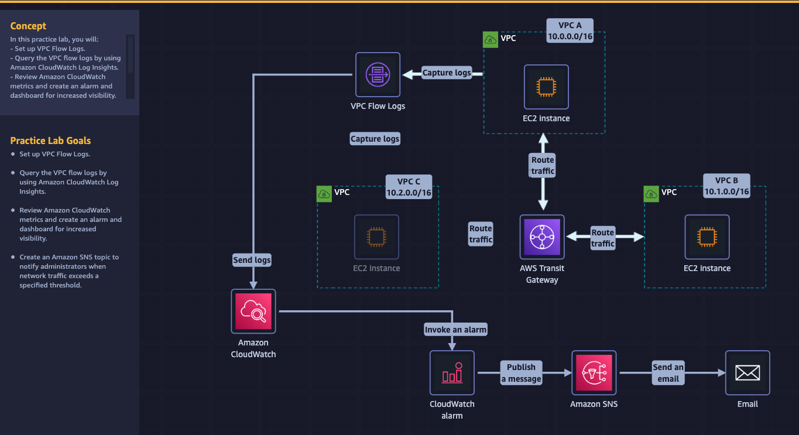

# Week 9: AWS SimuLearn: Monitor and Analyze Network Traffic

* back to AWS Cloud Institute repo's root [aci.md](../aci.md)
* back to [AWS Cloud Operations 2](../aws-cloud-operations-2.md)
* back to repo's main [README.md](../../../../README.md)

```text
Instance B Private IP 10.1.0.213
Spacestation-A-TGW tgw-attach-04debb34d7dff2b57
Spacestation_C_TGW_Attachment_VPC tgw-attach-0914480988a30522f
```

```shell
iperf3 -s
```

```shell
iperf3 -c 10.1.0.213 -P 2 -t 30
```

## Description


## Learn

1. 
2. 
3. 
4. 
5. 
6. 

## Practice



## DIY


