# Week 9: AWS SimuLearn: Traffic Mirroring

* back to AWS Cloud Institute repo's root [aci.md](../aci.md)
* back to [AWS Cloud Operations 2](../aws-cloud-operations-2.md)
* back to repo's main [README.md](../../../../README.md)

```text
i-057e7e0617728a5a6 (Source Server) eni-0df3093bab52b6927
i-06f8b2857e5c58dd5 (Target Server) eni-0639815a7e428fdc2
```

```shell
# Target
export PS1="[Target Server] $ "
export ETH=$(ifconfig | grep -o '^[^ ]*' | head -n 1 | sed 's/://')
sudo tcpdump -nni $ETH -vvv -c 5 -w baseline.pcap
sudo tcpdump -r baseline.pcap
#
sudo tcpdump -nni $ETH -vvv udp dst port 4789
# create a virtual interface on the Target Server and allows the separation of traffic from different VXLAN VNIs if the mirror target is receiving traffic from multiple mirror sessions.
sudo ip link add vni100 type vxlan id 100 dstport 4789 local 10.0.0.20 dev $ETH
sudo ip link set vni100 up
# virtual interface "vni100" and with the added option X showing packet contents
clear
sudo tcpdump -nnXi vni100
```

```shell
# Source
export PS1="[Source Server] $ "
ping 1.1.1.1 -c 2
ping 8.8.8.8 -c 2
#
ping 1.1.1.1 -c 5
# This command sends a packet, using ICMP with a custom hex-digit pattern in the data field
ping 1.1.1.1 -p C0DE -c 5
```

## Description

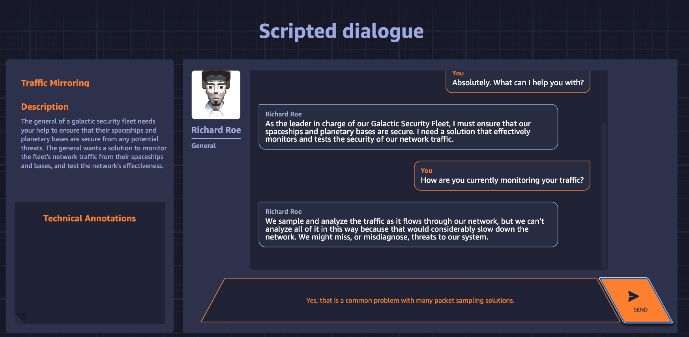

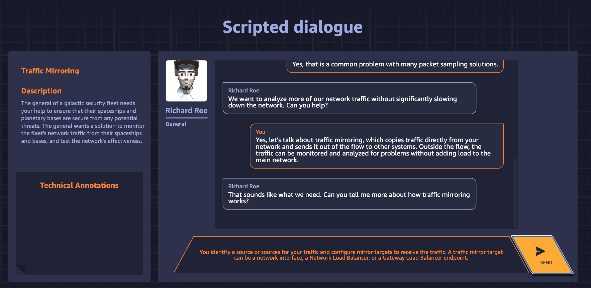

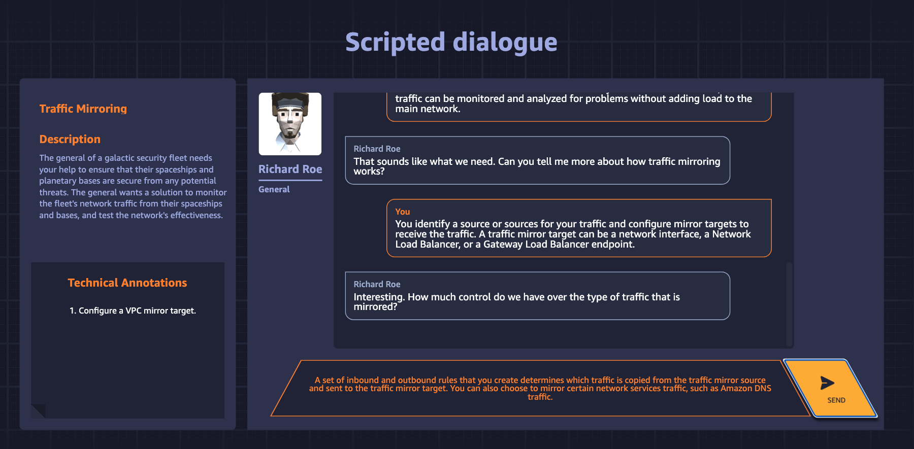

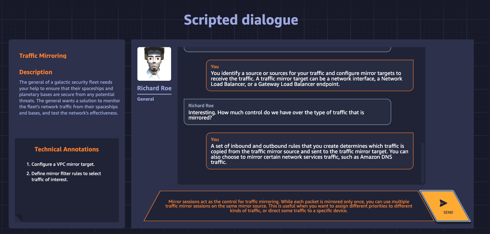

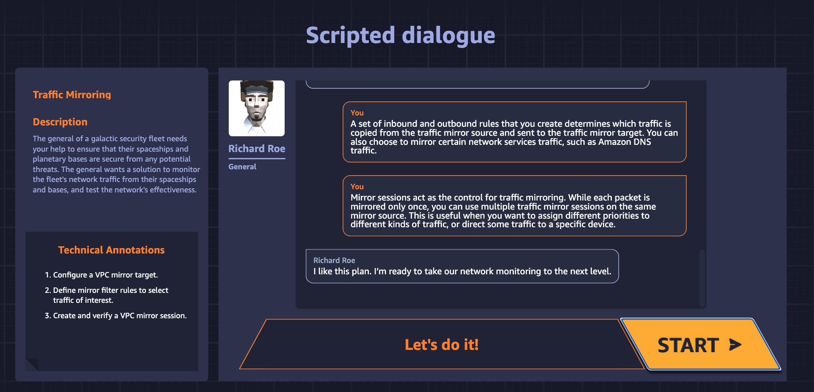

## Learn

1. 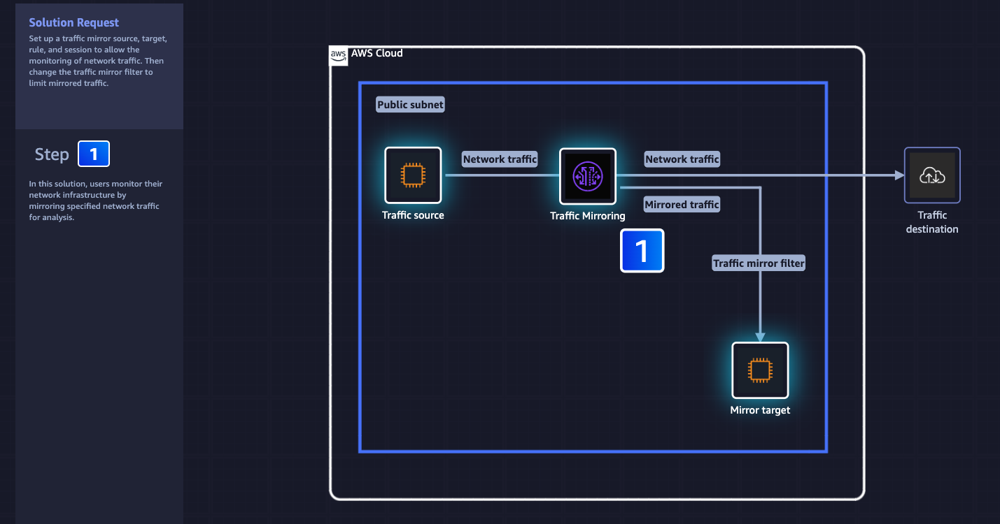
2. 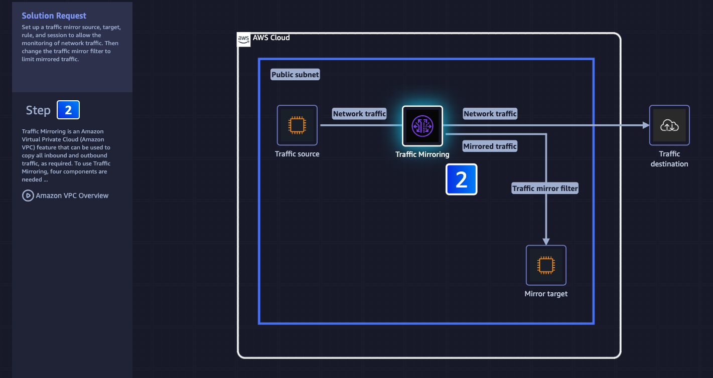
3. 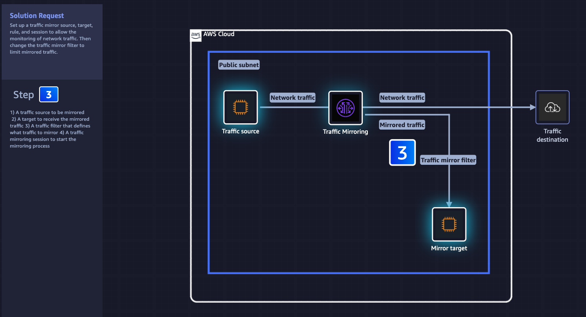
4. 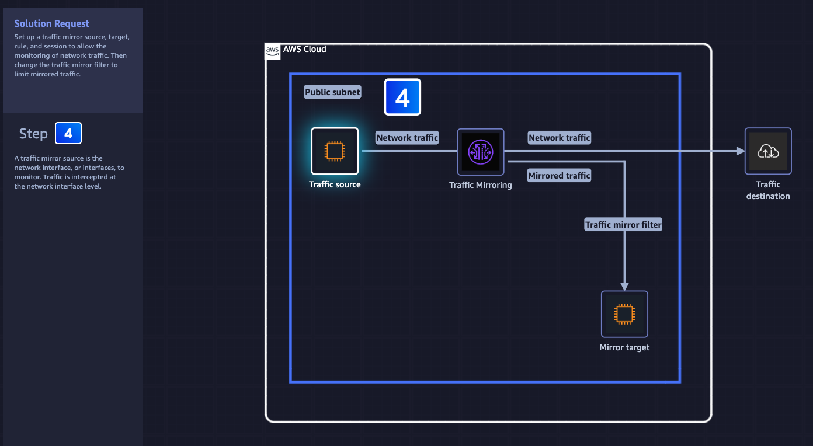
5. 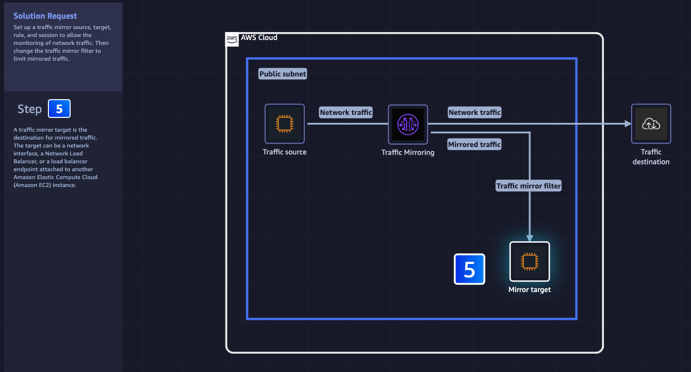
6. 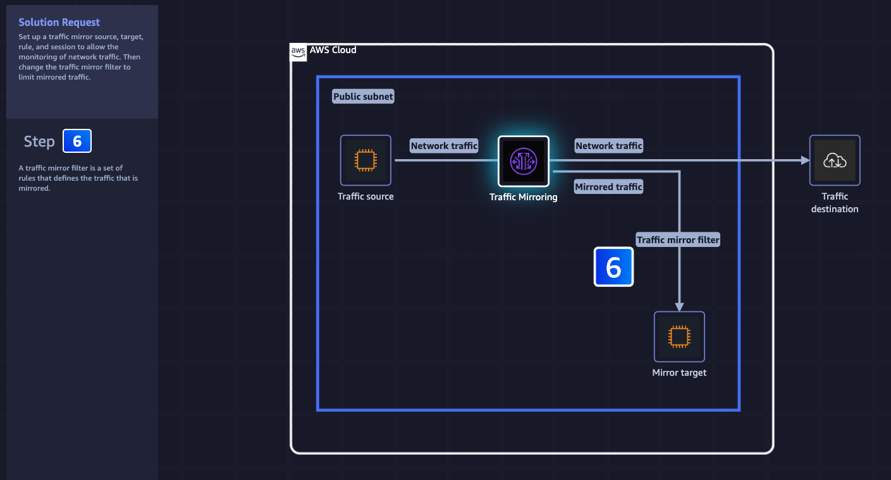
7. 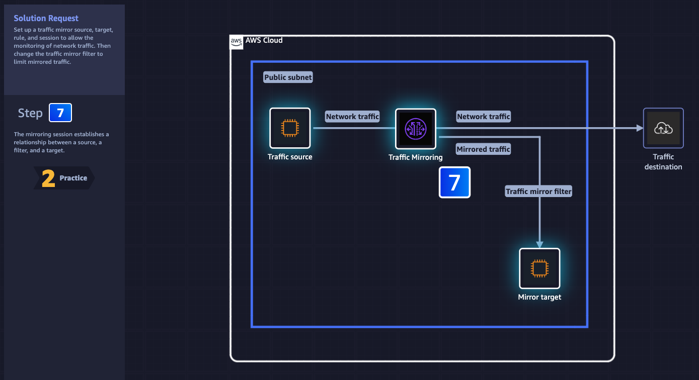

## Practice

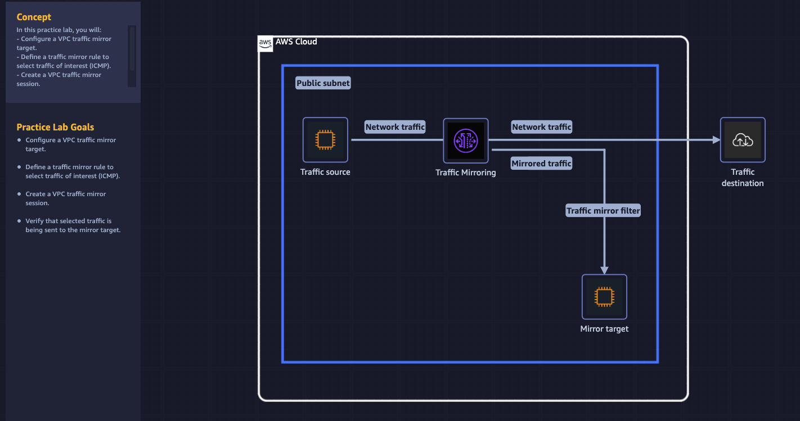

## DIY

1. 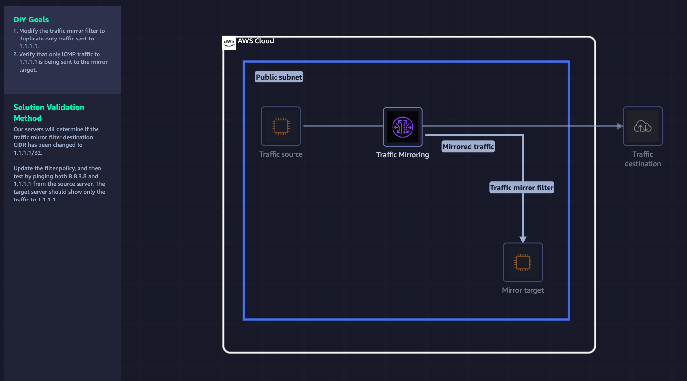
2. 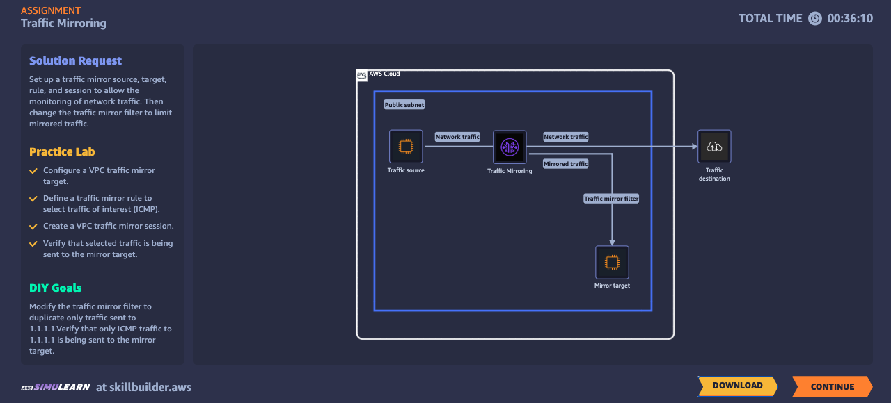
3. 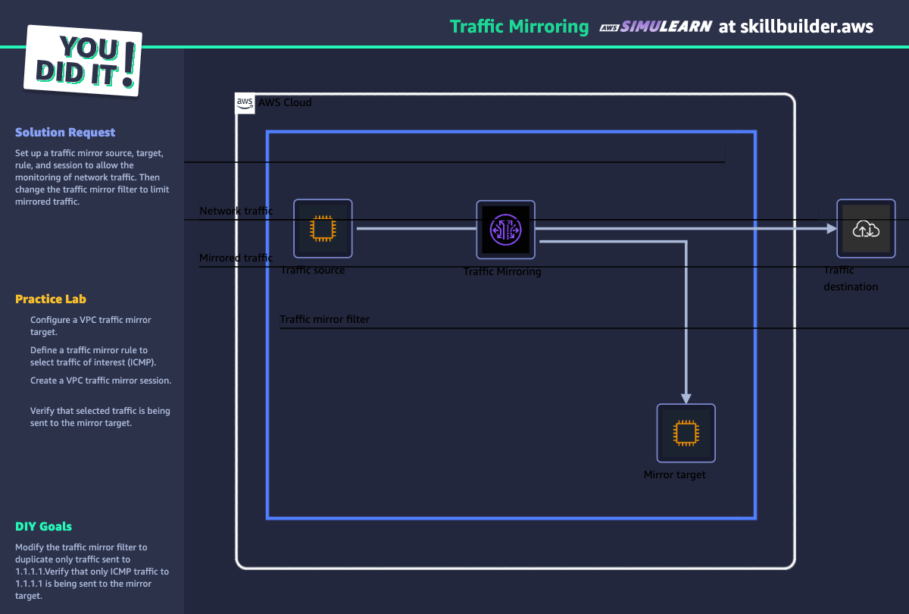
