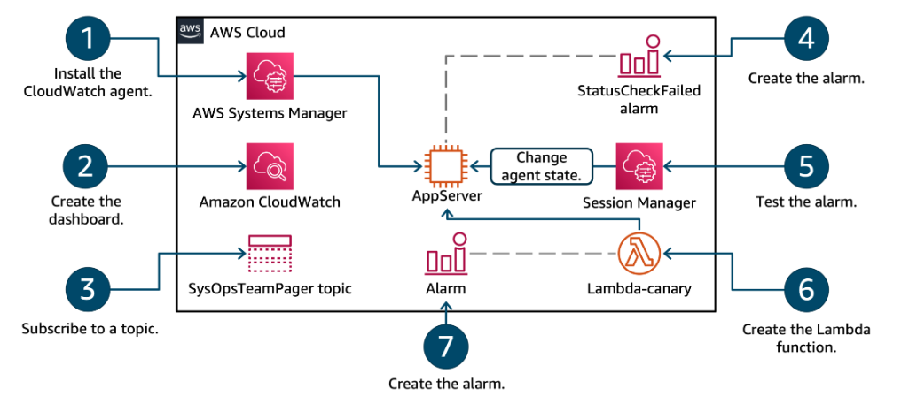

# Week 10: Monitoring Applications and Infrastructure

* back to AWS Cloud Institute repo's root [aci.md](../aci.md)
* back to [AWS Cloud Operations 2](../aws-cloud-operations-2.md)
* back to repo's main [README.md](../../../../README.md)

## Lab overview

As the CloudOps engineer for your company, you are asked to create a monitoring solution for one of the company’s more heavily used application servers. The monitoring needs to achieve situational awareness to provide timely and effective responses. To achieve this task you: configure the telemetry agent on your Amazon EC2 instances, create a CloudWatch dashboard to display and view only the metrics you want, configure an automated notification system for events that go past a defined alarm threshold, and you manually test the created alarms using the AWS CLI.

You practice setting up and monitoring metrics for business application events, defining relevant event thresholds for metrics, creating an automated notification, and remediation when metric thresholds are exceeded. Tasks include making use of a locally installed Amazon CloudWatch agent for collecting and monitoring telemetry from Amazon Elastic Compute Cloud (Amazon EC2) instances. The published metrics are used with customized dashboards, alarming, and notification services.

## Objectives

By the end of this lab, you should be able to do the following:

Configure telemetry on Amazon Elastic Compute Cloud (Amazon EC2) instances using the Amazon CloudWatch agent, AWS Sessions Manager, command documents, and Parameter Store.
Create a CloudWatch dashboard to display CloudWatch agent metrics.
Subscribe to Amazon Simple Notification Service (Amazon SNS) topics for automatic notifications.
Configure CloudWatch alarms for monitoring and notification when specific metric thresholds are crossed.
Manually test any CloudWatch alarm in your AWS environment using the AWS Command Line Interface (AWS CLI).
Create an AWS Lambda based Canary alarm for a web server.
Technical knowledge prerequisites
This hands-on lab assumes that you have completed the Cloud Operations 1 (CO1) course and the associated labs.

Duration
This lab requires 60 minutes to complete.

Icon key
Various icons are used throughout this lab to call attention to different types of instructions and notes. The following list explains the purpose for each icon:

 Command: A command that you must run.
 Copy edit: A time when copying a command, script, or other text to a text editor (to edit specific variables within it) might be easier than editing directly in the command line or terminal.
 File contents: A code block that displays the contents of a script or file that you need to run, which has been pre-created for you.
 Hint: A hint to a question or challenge.
 Learn more: Where to find more information.
 Note: A hint, tip, or important guidance.
 Task complete: A conclusion or summary point in the lab.
 WARNING: An action that is irreversible and could potentially impact the failure of a command or process (including warnings about configurations that cannot be changed after they are made).
Start lab
To launch the lab, at the top of the page, choose Start lab.

 Caution: You must wait for the provisioned AWS services to be ready before you can continue.

To open the lab, choose Open Console .

You are automatically signed in to the AWS Management Console in a new web browser tab.

 Warning: Do not change the Region unless instructed.

Common sign-in errors
Error: Choosing Start Lab has no effect
In some cases, certain pop-up or script blocker web browser extensions might prevent the Start Lab button from working as intended. If you experience an issue starting the lab:

Add the lab domain name to your pop-up or script blocker’s allow list or turn it off.
Refresh the page and try again.
Lab environment
The following diagram represents the major components used in this lab. The numbers represent the logical workflow of the architecture in this lab.

Image description: The preceding diagram depicts the use of AWS Systems Manager to make operational changes to an Amazon EC2 instance. You use the Amazon CloudWatch service to create customized dashboards for specified metrics. You also use the Amazon CloudWatch service to initiate alarms when specified metrics pass defined thresholds. You pair CloudWatch alarms with a topic from Amazon SNS to push notifications out to your subscribed email. You verify the alarming and notification mechanisms you built in the lab are working by using the Amazon CLI. Finally, you create and test an AWS Lambda function which has its own functional CloudWatch alarm.

AWS services not used in this lab
AWS service capabilities used in this lab are limited to what the lab requires. Expect errors when accessing other services or performing actions beyond those provided in this lab guide.

Task 1: Install the CloudWatch agent on the Amazon EC2 instance for monitoring
In this task, you will use AWS Systems Manager to install the CloudWatch agent to an Amazon EC2 instance. You can use the CloudWatch agent to collect both system metrics and log files from Amazon EC2 instances and on-premises servers. The agent supports both Windows Server and Linux Operating Systems and permits you to select the metrics to be collected.

The general pre-requisites for installing the CloudWatch agent on an instance using the Systems Manager service are as follows:

Appropriate AWS Identity and Access Management (IAM) credentials for the CloudWatch and Systems Manager service actions. More details on these roles can be found in the AWS documentation.
A Systems Manager agent installed on the Amazon EC2 instance or on-premise server to be monitored.
Routing and network access to the internet or AWS service endpoints, as the service agents make use of ports 443 and 80 for communication with the instance.
 Note: For this lab, all the pre-requisite requirements needed to use Sessions Manager and CloudWatch agent with the Amazon EC2 instance are met.

Task 1.1: Update the Systems Manager agent installed on the Amazon EC2 instance
You will update the Systems Manager agent on the Amazon EC2 instance by using a Systems Manager command document. Unless you require a specific version of software, updating the installed software and its dependencies to the latest production versions is a best practice. The Systems Manager agent comes pre-installed on the Amazon Linux 2023 Operating System, so you do not need to install it, only update it.

Search for Systems Manager using the search bar at the top of the AWS Console, and choose the service from the listed results.

Choose Documents from the  Shared Resources sub-menu of the AWS Systems Manager navigation bar.

 Note: The navigation bar is located on the left side of the console. You may need to expand the navigation bar by choosing the menu icon .

Locate the command document named AWS-UpdateSSMAgent in the Owned by Amazon tab.

Select the link for the AWS-UpdateSSMAgent command document from the search results list.

The Details page for the command document is displayed.

Choose the Run command button.
The Run a command page is displayed.

For the Target selection section, configure the following:

Select the  Choose instances manually option.
Select the Amazon EC2 instance named AppServer.
Expand Output options if not expanded already and deselect Enable an S3 Bucket.
Choose the Run button.
The Run Command summary page is displayed.

Choose the refresh  button in the console to periodically refresh the output on the page until the Overall status column in the Command status section displays  Success.
Select the link for the Instance ID in the Targets and outputs section.
Expand the  Output sections of all the Steps.
Review the command outputs and discover which version of the Systems Manager agent was installed on the Amazon EC2 instance.
 Hint: Step 1 of this command document determines the operating system deployed, and step 2 will have output related to the agent update.

 Task complete: You used a Systems Manager command document to update the Systems Manager agent installed on the Amazon EC2 instance and you verified which version is installed.

Task 1.2: Use AWS Systems Manager to install the CloudWatch agent to a managed Amazon EC2 instance
You will use a Systems Manager command document to install the CloudWatch agent onto a managed Amazon EC2 instance.

Choose Documents from the  Shared Resources sub-menu of the AWS Systems Manager navigation bar.
Locate the command document named AWS-ConfigureAWSPackage in the Owned by Amazon tab.
Select the link for the AWS-ConfigureAWSPackage command document from the search results list.
The Details page for the command document is displayed.

Choose the Run command button.
The Run a command page is displayed.

In the Command parameters section, enter AmazonCloudWatchAgent for the Name field.
For the Target selection section, configure the following:

Select the  Choose instances manually option.
Select the Amazon EC2 instance named AppServer.
Expand Output options if not expanded already and deselect Enable an S3 Bucket.
Choose the Run button.
The Run Command summary page is displayed.

Choose the refresh  button in the console to periodically refresh the output on the page until the Overall status column in the Command status section displays  Success.
 Task complete: You used a Systems Manager command document to install the AWS CloudWatch agent to a specific Amazon EC2 instance.

Task 2: Configure and start the CloudWatch agent installed on an Amazon EC2 instance
In this task, you will utilize Systems Manager command documents to configure and start a CloudWatch agent installed on an Amazon EC2 instance. The CloudWatch agent configuration file is a JSON file that specifies the metrics and logs that the agent is to collect, including any custom metrics. For this lab, the configuration file is already provided to you and saved in the Parameter Store.

Task 2.1: View the CloudWatch agent configuration file
You will review the config file that has been provided for the lab and stored in Parameter Store. When you store the configuration files in Parameter Store and use it in conjunction with Systems Manager command documents, you can conveniently deploy the same configuration of the CloudWatch agent on many different servers. Storing the configuration file on Parameter Store also provides an audit trail, supports AWS tagging, and the configuration document can be versioned.

Expand the Systems Manager navigation bar if necessary by choosing the menu icon  on the left side of the AWS console.
Choose Parameter Store from the  Application Management sub-menu in the AWS Systems Manager navigation bar.
Select the link for the parameter called AgentConfigFile from the console.
Review the raw JSON that makes up the configuration file under the Value section of the document. You don’t have to know what all the values mean, but just know that they specify the details of the configuration.
 Task complete: You located your CloudWatch agent configuration file in Parameter Store.

Task 2.2 : Start the CloudWatch agent
You will start the CloudWatch agent on an Amazon EC2 instance where it has been installed and configured, and verify that the CloudWatch agent is running.

Choose Documents from the  Shared Resources sub-menu of the AWS Systems Manager navigation bar.
Locate the command document named AmazonCloudWatch-ManageAgent in the Owned by Amazon tab.
Select the AmazonCloudWatch-ManageAgent link from the search results.
The Details page for the command document is displayed.

Choose the Run command button.
The Run a command page is displayed.

For the Command parameters section, configure the following parameters:

Ensure configure is selected from the Action drop-down menu.
Ensure ssm is selected from the Optional Configuration Source drop-down menu.
Enter AgentConfigFile in the Optional Configuration Location box. This is the name of the document located in Parameter Store.
Ensure yes is selected from the Optional Restart drop-down menu.
For the Target selection section, configure the following:

Select  Choose instances manually option.
Select the instance named AppServer. This is the EC2 instance where you installed and configured the AWS CloudWatch agent.
Expand Output options if not expanded already, and deselect Enable an S3 Bucket.

Choose the Run button.

The Run command summary page is displayed.

Choose the refresh  button in the console to periodically refresh the output on the page until the Overall status column displays  Success for the Amazon EC2 instance.
 Task complete: You used a command document to configure and start the CloudWatch agent on an Amazon EC2 instance.

Task 2.3: Use SSM documents to verify the CloudWatch agent status on an Amazon EC2 instance
You will run the command document named AmazonCloudWatch-ManageAgent to query the status of the agent on an Amazon EC2 instance.

Expand the Systems Manager navigation bar if necessary by choosing the menu icon  on the left side of the AWS console.
Choose Run command from the  Node Management sub-menu of the AWS Systems Manager navigation bar.
Choose the Run command button.
Enter AmazonCloudWatch-ManageAgent in the document search bar and press the Enter key.
Select the AmazonCloudWatch-ManageAgent link from the search results list.
The Details page for the command document is displayed.

Choose the Run command button.
The Run a command page is displayed.

For the Command parameters section, configure the following:

Choose status from the Action drop-down menu.
Choose default from the Optional Configuration Source drop-down menu.
Leave Optional Configuration Location blank.
For the Target selection section, configure the following:

Select  Choose instances manually option.
Fill the checkbox next to the Amazon EC2 instance named AppServer. This is the Amazon EC2 instance where you installed and configured the AWS CloudWatch agent.
Expand Output options if not expanded already and deselect Enable an S3 Bucket.

Choose the Run button.

The Run command summary page is displayed.

Choose the refresh  button in the console to periodically refresh the output on the page until the Overall status column displays  Success for the Amazon EC2 instance.
Select the link for the Instance ID in the Targets and outputs section.
The Output page is displayed.

Expand and examine Step 1 - Output and Step 2 - Output and Step 3 - Output sections.

Within any of the the step sections, locate the Step name.

Locate the step with the Step name that is relevant to the OS found on the instance.

 Hint: Since the instance has Amazon Linux installed, the Step name is ControlCloudWatchAgentLinux.

Expand the Output section of this step.

 Expected output: If the agent is running, the output contains lines that are similar to the following:

************************
**** EXAMPLE OUTPUT ****
************************

{
  "status": "running",
  "starttime": "2024-06-24T20:59:14+0000",
  "configstatus": "configured",
  "version": "1.300041.0b681"
}
 Task complete: You used a command document to verify the status of an agent running on an Amazon EC2 service.

Task 2.4: Verify CloudWatch agent metrics have been pushed to the CloudWatch service
You will verify that the CloudWatch agent metrics are appearing on the CloudWatch dashboard.

Search for CloudWatch using the search bar at the top of the AWS Console, and choose the service from the listed results.

Choose All metrics from the Metrics section of the CloudWatch navigation bar.

 Note: The navigation bar is located on the left side of the console. You may need to expand the navigation bar by choosing the menu icon .

Locate the namespace exactly named CWAgent from the  Custom Namespaces section.

 Note: If you do not find the CWAgent metric namespace wait for as long as 5 minutes before refreshing the page.

 Task complete: If the metric namespace named CWAgent is on the CloudWatch metrics console, then you have successfully verified that the CloudWatch agent is correctly pushing metrics from the Amazon EC2 instance to the CloudWatch service.

Task 3: Create a CloudWatch dashboard
In this task, you will create a customized CloudWatch dashboard consisting of metrics from both the installed CloudWatch agent as well as standard CloudWatch metrics. Dashboards are a great way to setup a tailored view of only the metrics you need for operations, without having to sort through all metrics available.

Choose Dashboards from the CloudWatch console navigation bar.
Choose the Create dashboard button.
The Create new dashboard pop-up window is displayed.

Enter myDashboard for the Dashboard name field.
Choose the Create dashboard button.
The new CloudWatch dashboard is created, and the Add widget pop-up window is displayed.

Under the Metrics data type, select the  Line widget type.

Choose Next.

The Add metric graph pop-up window is displayed.

Select the metric namespace named CWAgent from the  Custom Namespaces section in the All metrics tab.
Select the metric namespace that is exactly named ImageId, InstanceId, InstanceType.
Select the row for the instance named AppServer where the Metric Name column has a metric named mem_used_percent.
Choose the Create widget button.
The CloudWatch dashboard myDashboard now displays a singular graph for the percentage of memory used on your Amazon EC2 instance.

Choose the Save button.
Add a second widget to the CloudWatch dashboard myDashboard.

Choose the + button to add second widget.
The Add widget pop-up window is displayed.

Under the Metrics data type, select the  Stacked area widget type.

Choose Next.

The Add metric graph pop-up window is displayed.

Select the edit icon  which is next to the words, Untitled graph.
Enter AppServer network activity.
Choose the Apply button.
The metric graph now has a name.

Select the metric namespace exactly named EC2 in the  AWS Namespaces section in the All metrics tab.
Select the metric namespace exactly named Per-Instance Metrics.
Select the row for the instance named AppServer where the Metric Name column has a metric named NetworkIn.
Select the row for the instance named AppServer where the Metric Name column has a metric named NetworkOut.
 Note: If you cannot find a specific row, make sure to scroll down in the list to view all the rows. If you still have trouble finding the row, you can paste the instance id of Appserver into the metrics search filter and press enter. The search filter is located above the metrics list. The instance id can be found in the InstanceId column of any row for the AppServer instance.

Choose the Create widget button.
The CloudWatch dashboard myDashboard now displays an additional graph for the amount of network activity on your Amazon EC2 instance.

Choose the Save button.
 Learn more: Refer to the appendix for a detailed list of all CloudWatch metrics available for Amazon EC2 instances.

 Task complete: You created a CloudWatch dashboard consisting of only a few specific metrics and graphs.

Task 4: Subscribe to an AWS Simple Notification Service topic
In this task, you will subscribe your email address to a provided Amazon Simple Notification Service (Amazon SNS) topic named SysOpsTeamPager. The Amazon SNS topic is used to alert all subscribed engineers when a specified CloudWatch alarm is triggered.

Search for Simple Notification Service using the search bar at the top of the AWS Console, and choose the service from the listed results.

Select Topics from the navigation menu.

Select the link for SysOpsTeamPager topic from the list.

Choose the Create subscription button.

Select Email from the Protocol drop-down menu.

Enter a valid email address you can access in the Endpoint field.

 Note: In your personal AWS environment, this might be an alias for all of the CloudOps engineers or it might be an individual subscriber. Individual subscribers receive an email and have to confirm the subscription prior to receiving future notifications from the topic.

Choose the Create subscription button.

A banner message with text similar to, “ Subscription to SysOpsTeamPager created successfully.” is displayed at the top of the page letting you know the email address was successfully registered to the Amazon SNS topic.

Open the inbox of the email address you entered for the subscription.

Locate a recent message from AWS Notifications <no-reply@sns.amazonaws.com>.

 Note: It may take up to 5 minutes to receive the email, depending on your email server.

Select the Confirm subscription link contained in the email.

A page is opened confirming the subscription. Lab4 SNS subscription confirmation page

Close the Amazon SNS topic subscription confirmation page.
 Task complete: You created a new Amazon SNS topic and successfully subscribed to the topic, permitting Amazon SNS to push new messages from this topic to your email address.

Task 5: Create specific CloudWatch alarms for metrics
In this task, you will create an alarm to be triggered when a metric passes a defined threshold. CloudWatch alarms can be made for any of the CloudWatch metric. You are not limited to metrics you added to your customized CloudWatch dashboard for monitoring in a previous task.

Search for CloudWatch using the search bar at the top of the AWS Console, and choose the service from the listed results.
Choose All alarms from the Alarms section of the CloudWatch navigation bar.
Choose the Create alarm button.
This begins the CloudWatch Alarms guided setup process.

The Specify metric and conditions page is displayed.

Choose the Select metric button.
A Select metric pop-up window is displayed. This is similar to the process for selecting metrics for monitoring purposes on a CloudWatch dashboard, but now you are selecting metrics for alarming purposes.

Select the namespace exactly named EC2 from the console.
Select the namespace exactly named Per-Instance Metrics from the console.
Select the row for the instance named AppServer where the Metric Name column has a metric named StatusCheckFailed_System.
Choose Select metric button.
The pop-up window is closed.

The Specify metric and conditions page is displayed.

In the Conditions section:
Select  Static as the Threshold type.
Select  Greater/Equal >= threshold for Whenever StatusCheckFailed_System is…
Enter 1 in the than… Define the threshold value section.
Choose the Next button.
The Configure actions page is displayed.

Ensure Select an existing SNS topic is selected in the Notification section.
Select SysOpsTeamPager from the Send a notification to… drop-down field.
Choose the Next button.
The Add name and description page is displayed.

Enter AppServerSystemsCheckAlarm for the Alarm name field in the Name and description section.
 Copy edit: Enter the following in the Alarm description - optional field:

This alarm is triggered when an Amazon EC2 instance fails System Reachability check. It is likely that network packets are no longer reaching the instance. Instance and/or network remediation actions are needed to resolve the underlying issue. Refer to the CloudOps run book [insert your runbook URL here] for guidance on resolving this error on Application Amazon EC2 instances. To read more about Amazon EC2 Systems Check refer to AWS documentation https://docs.aws.amazon.com/AWSEC2/latest/UserGuide/monitoring-system-instance-status-check.html#types-of-instance-status-checks
It is best practice for alarm names to be self-descriptive, and for the alarm descriptions to contain useful information. Be succinct, describe the alarm, link to the Operation team’s runbooks, and suggest remediation action.

Choose the Next button.
The Preview and create page is displayed.

Choose the Create alarm button.
 Task complete: You used the CloudWatch console to create an Alarm for a defined metric and threshold. You also configured the alarm to send notifications to an existing SNS topic. More than one alarm can make use of a single Amazon SNS topic.

Task 6: Test the CloudWatch alarm from the AWS CLI
In this task, you will use Sessions Manager to log into an Amazon EC2 instance and use the AWS CLI to temporarily change the state for an alarm. It is always useful to test any alarms you build before you actually need them. When building alarms for any metric, instead of building a unique testing workload for each alarm and waiting for the alarm to trigger, it is quicker to test the alarm and any subsequently triggered actions from other services such as Amazon SNS, AWS Lambda, and Amazon EC2 by activating the alarm state from the command line.

Task 6.1: Use Systems Manager and start a session with an Amazon EC2 instance
You will use the session manager tool found in Systems Manager and start a session with an Amazon EC2 instance.

Search for Systems Manager using the search bar at the top of the AWS Console, and choose the service from the listed results.
Select Session Manager from the  Node Management sub-menu in the Systems Manager navigation menu.
Choose the Start session button.
Select the AppServer Amazon EC2 instance in the Target instances section.
Choose the Start session option.
The session is started in a new tab of your browser.

 Task complete: You started a session with an individual Amazon EC2 instance and have access to the terminal.

Task 6.2: Change the state of a CloudWatch alarm
You will use the AWS CLI to trigger the alarm state for a specific alarm metric.

 Command: Enter the following command in the terminal of the AppServer instance:

TOKEN=`curl -X PUT "http://169.254.169.254/latest/api/token" -H "X-aws-ec2-metadata-token-ttl-seconds: 21600"`
aws cloudwatch set-alarm-state \
--alarm-name "AppServerSystemsCheckAlarm" \
--state-value ALARM \
--state-reason "testing purposes" \
--region $(curl -H "X-aws-ec2-metadata-token: $TOKEN" -v http://169.254.169.254/latest/meta-data/placement/region)
 Expected output: This command returns to the prompt in the terminal if successful.

************************
**** EXAMPLE OUTPUT ****
************************

  % Total    % Received % Xferd  Average Speed   Time    Time     Time  Current
                                 Dload  Upload   Total   Spent    Left  Speed
  0     0    0     0    0     0      0      0 --:--:-- --:--:-- --:--:--     0*   Trying 169.254.169.254:80...
* Connected to 169.254.169.254 (169.254.169.254) port 80
> GET /latest/meta-data/placement/region HTTP/1.1
> Host: 169.254.169.254
> User-Agent: curl/8.5.0
> Accept: */*
> X-aws-ec2-metadata-token: AQAEACRjMuHVY5pZ3FleJp8b4eVnja-7zSFIO0QxBLzyzYTBEI8rpA==
>
< HTTP/1.1 200 OK
< X-Aws-Ec2-Metadata-Token-Ttl-Seconds: 21518
< Content-Type: text/plain
< Accept-Ranges: none
< Last-Modified: Thu, 27 Jun 2024 22:17:40 GMT
< Content-Length: 9
< Date: Thu, 27 Jun 2024 22:31:31 GMT
< Server: EC2ws
< Connection: close
<
{ [9 bytes data]
100     9  100     9    0     0   6912      0 --:--:-- --:--:-- --:--:--  9000
* Closing connection
 Note: If you receive the error ‘An error occurred (ResourceNotFound) when calling the SetAlarmState operation: Unknown’ when executing the command, then double-check the command you used for accuracy. It’s likely that either: the incorrect region was specified or a typo occurred in the command.

In the inbox of the email account you subscribed to the Amazon SNS topic named SysOpsTeamPager. A new email from the Amazon SNS topic should arrive.

 Note: If you do not recieve an email, ensure that you clicked the confirm subscription link contained in the email from a prior task.

 Task complete: You used the AWS CLI to trigger the alarm state for a specific alarm metric.

Task 6.3: Review the Alarm email and CloudWatch dashboard
You will review the email generated by Amazon SNS and the related CloudWatch alarm dashboard.

Locate and review the CloudWatch alarm email from AWS Notifications <no-reply@sns.amazonaws.com>.
 File contents: The email is similar to the example below and contains a link to the appropriate CloudWatch dashboard. Notice that the reason you stated for the alarm in the command, is present in the first few lines of the message body. The rest of the body message details the alarm.

You are receiving this email because your Amazon CloudWatch Alarm "AppServerSystemsCheckAlarm" in the US East (N. Virginia) region has entered the ALARM state, because "testing purposes" at "Thursday 18 June, 2020 19:24:09 UTC".

View this alarm in the AWS Management Console:
https://us-east-1.console.aws.amazon.com/cloudwatch/home?region=us-east-1#s=Alarms&alarm=AppServerSystemsCheckAlarm

Alarm Details:
- Name:                       AppServerSystemsCheckAlarm
- Description:                This alarm is triggered when an Amazon EC2 instance fails System Reachability check. It is likely that network packets are no longer reaching the instance. Instance and/or network remediation actions are needed to resolve the underlying issue. Refer to the Example Company's CloudOps run book [insert your runbook URL here] for guidance on resolving this error on Application Amazon EC2 instances. To read more about Amazon EC2 Systems Check refer to AWS documentation https://docs.aws.amazon.com/AWSEC2/latest/UserGuide/monitoring-system-instance-status-check.html#types-of-instance-status-checks
- State Change:               OK -> ALARM
- Reason for State Change:    testing purposes
- Timestamp:                  Thursday 18 June, 2020 19:24:09 UTC
- AWS Account:                123456789
- Alarm Arn:                  arn:aws:cloudwatch:us-east-1:123456789:alarm:AppServerSystemsCheckAlarm

Threshold:
- The alarm is in the ALARM state when the metric is GreaterThanOrEqualToThreshold 1.0 for 60 seconds.

Monitored Metric:
- MetricNamespace:                     AWS/EC2
- MetricName:                          StatusCheckFailed_System
- Dimensions:                          [InstanceId = i-0c7263cc9e278de8f]
- Period:                              60 seconds
- Statistic:                           Average
- Unit:                                not specified
- TreatMissingData:                    missing

State Change Actions:
- OK:
- ALARM: [arn:aws:sns:us-east-1:123456789:myOperationalAlarm]
- INSUFFICIENT_DATA:
Select the URL link in the email that follows the statement “View this alarm in the AWS Management Console”.
Your default web browser opens the CloudWatch console on the alarm that was triggered. For current data on the alarm, you need to review the alarm and metric data from the CloudWatch console.

 Task complete: You reviewed the alarm notification sent by Amazon SNS and located the appropriate alarm metric within CloudWatch.

Task 6.4: Return to the Amazon EC2 instance and change the state to OK
Because the alarm was triggered by a test, rather than the metric staying above the threshold defined in the alarm, the alarm state for AppServerSystemsCheckAlarm returns to the state OK by itself. However, it is useful to know that the same command can be used to change the state to OK, as well as the state ALARM.

Open the Session Manager connection to the AppServer. If the session has timed out, restart the session by closing the browser window and following the same steps from a previous task named Connect to the instance using AWS Session Manager.
 Command: Enter the following command at the command terminal of the AppServer Amazon EC2 instance:

TOKEN=`curl -X PUT "http://169.254.169.254/latest/api/token" -H "X-aws-ec2-metadata-token-ttl-seconds: 21600"`
aws cloudwatch set-alarm-state \
--alarm-name "AppServerSystemsCheckAlarm" \
--state-value OK \
--state-reason "testing purposes" \
--region $(curl -H "X-aws-ec2-metadata-token: $TOKEN" -v http://169.254.169.254/latest/meta-data/placement/region)
 Expected output:

************************
**** EXAMPLE OUTPUT ****
************************

  % Total    % Received % Xferd  Average Speed   Time    Time     Time  Current
                                 Dload  Upload   Total   Spent    Left  Speed
  0     0    0     0    0     0      0      0 --:--:-- --:--:-- --:--:--     0*   Trying 169.254.169.254:80...
* Connected to 169.254.169.254 (169.254.169.254) port 80
> GET /latest/meta-data/placement/region HTTP/1.1
> Host: 169.254.169.254
> User-Agent: curl/8.5.0
> Accept: */*
> X-aws-ec2-metadata-token: AQAEACRjMuEgLYwz8-k0JiTQTHoXepxlthQsTUxXk2YmVTzwmaFnQw==
>
< HTTP/1.1 200 OK
< X-Aws-Ec2-Metadata-Token-Ttl-Seconds: 21576
< Content-Type: text/plain
< Accept-Ranges: none
< Last-Modified: Thu, 27 Jun 2024 22:17:40 GMT
< Content-Length: 9
< Date: Thu, 27 Jun 2024 22:48:36 GMT
< Server: EC2ws
< Connection: close
<
{ [9 bytes data]
100     9  100     9    0     0   4388      0 --:--:-- --:--:-- --:--:--  4500
* Closing connection
 Note: You do not receive any email from the SNS topic for this action because you are putting the alarm into the OK state. Only those alarms that in the ALARM state trigger a notification.

The session is no longer needed for this lab and you may close it.

 Task complete: You triggered a specific CloudWatch alarm, reviewed the alarm dashboard, and then turned the alarm off.

Challenge (optional) Task 7: Configure an AWS Lambda Canary function to use Amazon EventBridge (CloudWatch Events) for a successful website response and test it
In this task, you build and test an AWS Lambda function called Canary from the Lambda blueprints. You also configure a CloudWatch alarm for the Lambda Canary function. The Lambda Canary function queries a website for a response and is configured with a pre-defined expected result. The Lambda function triggers a notification when it receives a result differing from the expected value. Finally, you test the CloudWatch alarm and notification by triggering the alarm intentionally.

Task 7.1: Create the AWS Lambda Canary function
You will use the Lambda console to create the AWS Lambda Canary function. Amazon EventBridge (CloudWatch Events) emits an event every minute, based on the schedule expression. The event triggers the Lambda function, which verifies that the expected string appears in the specified page.

Search for Lambda using the search bar at the top of the AWS Console, and choose the service from the listed results.
Choose the Create function button.
Choose the  Use a blueprint button.
Choose the selection field under Blueprint name to open a search bar.
Enter canary in the search bar.
Choose Schedule a periodic check of any URL.
In the Basic information section, configure:

Function name: lambda-canary
Execution Role: Select Use an existing role
Existing role: Choose Lambda-CanaryRole from the drop-down menu
In the EventBridge (CloudWatch Events) trigger section:

Rule: Select the Create a new rule option
Rule name: CheckWebsiteScheduledEvent
Rule description: Enter CheckWebsiteScheduledEvent trigger
Schedule expression: Enter rate(1 minute)
In the Environment variables section:

For the “site” Key, enter the associated Value: https://docs.aws.amazon.com/lambda/latest/dg/welcome.html
For the “expected” Key, enter the associated Value: What is AWS Lambda?
Choose the Create function button.
The Lambda function has been created and the browser is redirected to the function detail page.

A banner message is displayed with the text, “ Congratulations! Your Lambda function “lambda-canary” has been successfully created and configured with CheckWebsiteScheduledEvent as a trigger. Choose Test to input a test event and test your function.”

 Task complete: You created the Lambda Canary function.

Task 7.2: Test the Lambda function
You will test the Lambda function with a sample event provided by the Lambda console.

Select the Test tab.
Enter CanaryTestEvent for Event name.
Keep the default selection of cloudwatch-scheduled-event in the Template - optional drop-down menu.
Choose the Save button.
Choose the Test button.
The output from the test is shown in a banner.

Choose  Details in the banner to reveal the logs from the test event.
 Task complete: You created a test for the Lambda function.

Task 7.3: Configure a CloudWatch alarm for the Lambda Canary function
You will configure an alarm in Amazon CloudWatch that monitors the Canary Lambda function and sends a notification to an Amazon SNS topic when the defined threshold is passed.

Search for CloudWatch using the search bar at the top of the AWS Console, and choose the service from the listed results.
Choose All alarms from the CloudWatch navigation bar located on the left side of the console.
Choose the Create alarm button.
This begins the CloudWatch Alarms guided setup process.

The Specify metric and conditions page is displayed.

Choose the Select metric button.
Create an alarm with the following settings:

In the Metrics section, choose Lambda.

Choose By Function Name.

Select the row where the FunctionName column has a value lambda-canary, and the Metric Name column has a value Errors.

In the above step, if you cannot find this row, wait for up to 5 minutes before refreshing the page. It can take up to 5 minutes from creating a Lambda function, until the metrics for that first appear in CloudWatch.

Make sure to also scroll down in the list to view all the rows. If you still have trouble finding the row, you can paste lambda-canary into the metrics search filter and press enter. The search filter is located above the metrics list.

Choose the Select metric button.
The pop-up window closes.

The Specify metric and conditions page is displayed.

In the Metric section:

Choose Sum for the Statistic field.
Choose 1 minute for the Period field.
In the Conditions section:

Choose  Greater/Equal >= threshold for Whenever Errors is…
Enter 1 for than….
Choose the Next button.
The Configure actions page is displayed.

In the Notification section:

Ensure Select an existing SNS topic is selected.
Select SysOpsTeamPager from the Send a notification to… drop-down field.
Choose the Next button.
The Add name and description page is displayed.

Enter lambda-canary-alarm for Alarm name.
Enter Lambda Canary did not receive the expected response from the website. for Alarm description - optional.
Choose the Next button.
The Preview and create page is displayed.

Choose the Create alarm button.
 Task complete: You created a new alarm based on metrics collected from the Lambda canary function.

7.4: Test the alarm
You will test the alarm that has been built for the Lambda function. Rather than manually trigger a specific alarm using the AWS CLI, you intentionally cause errors with a misconfigured update to the Lambda function. This action intentionally breaks the Lambda function and puts the related CloudWatch alarm you previously created into an alarm state.

Search for Lambda using the search bar at the top of the AWS Console, and choose the service from the listed results.
Choose Functions from the AWS Lambda navigation bar.
Choose the link for the lambda-canary function.
Choose the Configuration tab.
Select Environment variables from the column of choices.
Choose the Edit button.
The Edit environment variables page is displayed.

Locate the Key named expected and change the Value to 404.
Choose the Save button.
Choose the Test tab.
Ensure the CanaryTestEvent is selected in the Event name drop-down menu.
Choose the Test button.
The misconfigured Lambda function generates an error, and the CloudWatch alarm set for the error metric of the Lambda Canary function triggers. The CloudWatch alarm notifies the Amazon SNS topic SysOpsTeamPager. This is the topic you subscribed your email address to in a previous task named Subscribe to the Amazon SNS topic.

 File contents: Locate and review the CloudWatch alarm email from AWS Notifications no-reply@sns.amazonaws.com its contents are similar to the following example:

You are receiving this email because your Amazon CloudWatch Alarm "lambda-canary-alarm" in the US West (Oregon) region has entered the ALARM state, because "Threshold Crossed: 1 out of the last 1 datapoints [1.0 (19/06/20 18:22:00)] was greater than or equal to the threshold (1.0) (minimum 1 datapoint for OK -> ALARM transition)." at "Friday 19 June, 2020 18:27:44 UTC".

View this alarm in the AWS Management Console:
https://us-west-2.console.aws.amazon.com/cloudwatch/home?region=us-west-2#s=Alarms&alarm=lambda-canary-alarm

Alarm Details:
- Name:                       lambda-canary-alarm
- Description:                lambda-canary-alarm
- State Change:               OK -> ALARM
- Reason for State Change:    Threshold Crossed: 1 out of the last 1 datapoints [1.0 (19/06/20 18:22:00)] was greater than or equal to the threshold (1.0) (minimum 1 datapoint for OK -> ALARM transition).
- Timestamp:                  Friday 19 June, 2020 18:27:44 UTC
- AWS Account:                123456789
- Alarm Arn:                  arn:aws:cloudwatch:us-west-2:298518306606:alarm:lambda-canary-alarm

Threshold:
- The alarm is in the ALARM state when the metric is GreaterThanOrEqualToThreshold 1.0 for 300 seconds.

Monitored Metric:
- MetricNamespace:                     AWS/Lambda
- MetricName:                          Errors
- Dimensions:                          [FunctionName = lambda-canary]
- Period:                              300 seconds
- Statistic:                           Sum
- Unit:                                not specified
- TreatMissingData:                    missing

State Change Actions:
- OK:
- ALARM: [arn:aws:sns:us-west-2:123456789:SysOpsTeamPager]
- INSUFFICIENT_DATA:
 Task complete: You used the Lambda Canary function to simulate the difference between the expected and returned values for a website. This triggered the related CloudWatch alarm and notification services that you setup.

Conclusion
You have successfully done the following:

Configured telemetry on Amazon Elastic Compute Cloud (Amazon EC2) instances using the Amazon CloudWatch agent, AWS Sessions Manager, command documents, and Parameter Store.
Created a CloudWatch dashboard to display CloudWatch agent metrics.
Subscribed to Amazon Simple Notification Service (Amazon SNS) topics for automatic notifications.
Configured CloudWatch alarms for monitoring and notification when specific metric thresholds are crossed.
Manually tested any CloudWatch alarm in your AWS environment using the AWS Command Line Interface (AWS CLI).
Created an AWS Lambda based Canary alarm for a web server.
End lab
Follow these steps to close the console and end your lab.

Return to the AWS Management Console.

At the upper-right corner of the page, choose AWSLabsUser, and then choose Sign out.

Choose End lab and then confirm that you want to end your lab.

Additional resources
AWS Systems Manager user guide
CloudWatch metrics available for Amazon EC2 instances
