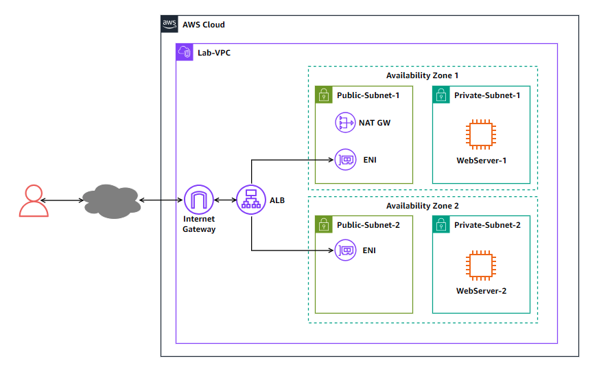

# Week 11: Troubleshooting Website Reachability Behind a Load Balancer

* back to AWS Cloud Institute repo's root [aci.md](../aci.md)
* back to [AWS Cloud Operations 2](../aws-cloud-operations-2.md)
* back to repo's main [README.md](../../../../README.md)

## Lab overview

The lab covers the concepts of configuring a web server behind an Elastic Load Balancer (ELB). The lab presents a scenario where users are not able to reach a website hosted on an Amazon Elastic Compute Cloud (Amazon EC2) instance behind a load balancer.

Your goal is to troubleshoot and fix all the misconfigured issues to allow accessing the website page using the load balancer DNS name while ensuring the solution can still work if one of the web servers instances is down.

High-level guidance and references are provided to assist you in fixing the issue. The detailed solution instructions are provided in a collapsible section which you can expand.

## Objectives

By the end of this lab, you should be able to do the following:

Examine the current configuration of the Application Load Balancer (ALB) and the website running on EC2 instances behind the ALB.
Troubleshoot and identify the issues in the existing configuration which are preventing users from accessing the website.
Remediate the configuration to allow users to access the website behind the ALB and ensure the solution is highly available.
Technical knowledge prerequisites
To successfully complete this lab, you should have a basic knowledge of:

Navigating through the AWS Management Console.
Elastic Load Balancer (ELB).
Amazon Virtual Private Cloud (Amazon VPC).
Amazon Elastic Compute Cloud (Amazon EC2).
Duration
This lab requires approximately 60 minutes to complete.

Icon key
Various icons are used throughout this lab to call attention to different types of instructions and notes. The following list explains the purpose for each icon:

 Note: A hint, tip, or important guidance.
 Hint: A hint to a question or challenge.
 Task complete: A conclusion or summary point in the lab.
 Consider: A moment to pause to consider how you might apply a concept in your own environment or to initiate a conversation about the topic at hand.
Start lab
To launch the lab, at the top of the page, choose Start lab.

 Caution: You must wait for the provisioned AWS services to be ready before you can continue.

To open the lab, choose Open Console .

You are automatically signed in to the AWS Management Console in a new web browser tab.

 Warning: Do not change the Region unless instructed.

Common sign-in errors
Error: Choosing Start Lab has no effect
In some cases, certain pop-up or script blocker web browser extensions might prevent the Start Lab button from working as intended. If you experience an issue starting the lab:

Add the lab domain name to your pop-up or script blocker’s allow list or turn it off.
Refresh the page and try again.

## Lab environment

The following diagram shows the lab scenario:

Image description: The following list details the major resources in the lab:

A VPC hosting all the lab resources.
The VPC has two public subnets and two private subnet across two availability zones.
The VPC has an internet gateway allowing public access from the internet.
A NAT gateway in one of the public subnets to provide outbound access from the private subnets.
An Application Load Balancer (ALB) with an elastic network interface (ENI) in each of the public subnets.
An EC2 instance in each of the private subnets to host the website.
Task 1: Test the web server reachability from the internet
In this task, you test the web server reachability from the internet to verify the issue. Since the web server is in a private subnet behind the load balancer, you attempt reaching the web server using the load balancer DNS name.

Copy the ALBDNSName value that is listed to the left of these instructions. Paste the value into a new browser tab, and then press Enter.
After couple of minutes, your browser page fails to connect to the web server and returns a message to indicate that the page cannot be reached. This verifies that the website is not reachable.

Close the browser tab that you attempted to access the ALBDNSName with.
 Task complete: You tested the website reachability from the internet and verified that it cannot be reached.

Task 2: Troubleshoot and remediate website reachability issues
In this task, you identify the issues in the existing configuration and remediate the configuration so the website can be accessed from the internet using the load balancer DNS name.

Now that have you confirmed the issue, you need to identify the services and resources which were misconfigured and remediate them.

You can navigate through the AWS Management Console of the EC2, VPC, or any other service you need to identify the issues in the current configuration and determine how to remediate them.

 Consider: Here are few things to consider when you attempt remediating the issue:

The HTTP service is up and running on both web server instances so you do not need to troubleshoot it.
The website HTML files and settings are correctly configured on both web server instances so you do not need to troubleshoot it.
The HTTP service on the web servers are running on the standard HTTP port (TCP port 80).
You do not need to create new resources to resolve the issue. However, you can modify existing resources.
Resolve the website reachability - Do it yourself
 Hint: Here are some references to assist you in solving the issue:

Why can’t clients connect to my Elastic Load Balancing load balancer?
Troubleshoot your Application Load Balancers
Solution
Expand the Detailed instructions section below for the full solution.

Detailed instructions
First, here is a summary of the lab scenario:

The VPC used in the lab is named as Lab-VPC.
The two public subnets are named Public-Subnet-1 and Public-Subnet-2.
The load balancer is an Application Load Balancer named Lab-lb.
The load balancer scheme is internet-facing and it has an elastic network interface in each of the public subnets.
The two private subnets are named Private-Subnet-1 and Private-Subnet-2.
Each of the two private subnets has an EC2 instance hosting the website.
The two EC2 instances are named WebServer-1 and WebServer-2.
The subnets are distributed equally across two availability zones.
An internet gateway is attached to the VPC to provide internet access.
A NAT gateway resides in Public-Subnet-1 to provide outbound access the instances in the private subnets.
All routing is properly configured to allow traffic routing between the subnets, between public subnets and internet, and outbound traffic between the private subnets and internet.
You can navigate through the VPC and EC2 configuration to explore and verify the existing configuration. You can also refer to the lab diagram in the Lab environment section.

Here are some of the things you need to check when troubleshooting issues related to connecting to a website behind a load balancer:

Load balancer listeners.
Load balancer target groups.
Security groups on the load balancer and target instances.
Subnet network access control lists.
Route tables.
Check the load balancer listeners
An Application Load Balancer must have at least one listener. A listener is a process that checks for connection requests, using the protocol and port that you configure. The rules that you define for a listener determine how the load balancer routes requests to its registered targets.

At the top of the AWS Management Console, in the search bar, search for and choose EC2.

In the navigation pane at the left of the page, under Load Balancing section, choose Load Balancers.

In the Load balancers section, choose the Lab-lb link.

In the Lab-lb page, scroll down to the Listeners and rules section under the Listeners and rules tab.

Observe the listener under the Protocol:Port column. Note that the listener is configured as HTTP:8080 and it is Not reachable.

Recall that the HTTP service on the web servers are running on port 80. This is clearly misconfigured on the load balancer listener.

Remediate the load balancer listener
Now, remediate the listener port.

Choose HTTP:8080 link.
The browser opens a new page for the HTTP:8080 listener.

From the Actions  menu, choose Edit listener.

Under the Listener details section, modify the current value under Protocol:Port from 8080 to 80.

Choose Save changes.

A message banner indicates that the listener was successfully modified.

Choose the Lab-lb link at the top to return to the Load balancer Details page in your browser.
Check the load balancer and instances security group
Now, check the security groups rules on both the load balancer and web servers instances.

In the Lab-lb page, scroll down and choose the Security tab.
Note that the security group attached to the load balancer is named ALB-SG.

Choose the sg-xxxxxxxxxxxxxx link.
The browser opens a new page for the ALB-SG security group.

Examine the rules under the Inbound rules tab.
Note that the existing inbound rule allows HTTP traffic on TCP port 80 from anywhere (0.0.0.0/0). This seems right. Now, check the outbound rules.

Choose the Outbound rules tab.
Note that the existing outbound rule allows all traffic to anywhere (0.0.0.0/0). This also seems right.

Close the current console tab and return to the Lab-lb console tab in your browser.
Now, web servers instances security groups.

In the navigation pane at the left of the page, under Instances section, choose Instances.
The two instances used to host the website appears under the Instances section. The two instances are named WebServer-1 and WebServer-2. Each one of them is in one of the private subnets.

Select the WebServer-1 instance.

Under the instance details at the bottom of the page, choose the Security tab.

Note that the security group attached to the first web server instance is named WebServer-SG.

Examine the rules under the Inbound rules section. Note that there are no ingress rules configured.

Examine the rules under the Outbound rules section. Note that the existing outbound rule allows all traffic to anywhere (0.0.0.0/0). This seems correct.

So the inbound rules are missing and must be remediated.

Now, check if the same security group is applied on the second instance WebServer-2.

In the list of instances, select the WebServer-2 instance.

Under the instance details at the bottom of the page, choose the Security tab.

Note that the security group attached to the second web server instance is the same as the first instance.

Remediate the inbound rules in the instances security group
Now, remediate the WebServer-SG security group inbound rules. For security best practice, the ingress rule should allow HTTP traffic on TCP port 80 from the load balancer security group ALB-SG.

In the navigation pane at the left of the page, under Network & Security section, choose Security Groups.

In the list of security groups, select the WebServer-SG.

Choose the Inbound rules tab.

Choose Edit inbound rules.

In the Edit inbound rules page, choose Add rule and configure the following:

For Type, select HTTP.
For Source, enter sg, then select the ALB-SG security group from the list.
Choose Save rules.
A message banner indicates that the inbound security group rules was updated successfully.

Now, test to see if the website is reachable from the internet.

Verify the website reachability
To verify that you resolved all the issues, you can simply attempt to access the website from your browser using the load balancer DNS name.

Copy the ALBDNSName value that is listed to the left of these instructions. Paste the value into a new browser tab, and then press Enter.
The browser should return the website page which should include the web server instance name WebServer-1 where the website is hosted. The page also displays the EC2 instance ID for WebServer-1. You can verify this instance ID with the value of WebServer1InstanceID which is listed to the left of these instructions.

 Note: It may take 1-2 minutes for the instance to become healthy before you can reach it via the load balancer DNS name.

Close the browser tab of WebServer-1.
 Task complete: You identified the issues in the existing configuration and remediated the configuration so the website can be accessed from the internet using the load balancer DNS name.

Task 3: Ensure the solution is highly available
After remediating the website reachability issues, you need to improve the solution resiliency to mitigate against any potential failure in the instance hosting the website.

In this task, you configure your solution to be highly available to ensure that the website is still reachable even if one instance is down.

First, you stop the instance currently hosting the website and check if the website is still reachable or not.

In the navigation pane at the left of the page, under Instances section, choose Instances.

In the list of instances, be sure to select only the WebServer-1 instance.

From the Instance state  menu at the top of the page, select Stop instance.

In the Stop instance? popup window, choose Stop.

A message banner indicates that the instance was stopped successfully.

Now, check if you can still access the website.

Copy the ALBDNSName value that is listed to the left of these instructions. Paste the value into a new browser tab, and then press Enter.
Your browser page fails to connect to the web server.

Even though you have a second instance WebServer-2 hosting the website, the website is not reachable when the first instance is down.

Close the browser tab that you attempted to access the ALBDNSName with.
Resolve the single-point of failure issue - Do it yourself
Try to troubleshoot and remediate the issue so that website is still reachable even when the WebServer-1 instance is down.

If you are stuck, expand the Detailed instructions section below for the full solution.

Detailed instructions
Check the load balancer target group
When configuring a load balancer, you need to configure a target group. The target group is a logical container of all the targets (instances in this scenario) that the load balancer can send traffic to. Check the target group configuration under the load balancer.

In the navigation pane at the left of the page, under Load Balancing section, choose Target Groups.

In the list of target groups, select the Lab-WebServer-TargetGroup target group.

In the Details tab, check the load balancer that this target group is attached to.

Note that it is attached to the Lab-lb load balancer.

Choose the Targets tab to check the instances in the group.
Note that the only instance in this target group is WebServer-1. This instance currently has a health status of Unused because it was stopped to simulate instance failure.

The second instance WebServer-2 was not added to the group in the initial configuration.

Now remediate these two issues.

Remediate the load balancer target group
Now, add the WebServer-2 instance to the target group.

Choose Register targets.

In the list of available instances, select the WebServer-2 instance. This should be the only instance in the list.

Choose Include as pending below.

The instance is added to the list of targets with a health status of Pending.

Choose Register pending targets.
A message banner indicates that the target was successfully registered to the target group.

Wait for a couple minutes till the WebServer-2 instance health status changes to healthy.

 Note: You may need to choose the refresh icon  to refresh the health status of the target.

Note that the WebServer-1 instance health status remains as unused as it still stopped.

Verify the solution
To verify that your solution, attempt to access the website using the load balancer DNS name while the WebServer-1 instance is still down (stopped).

Copy the ALBDNSName value that is listed to the left of these instructions. Paste the value into a new browser tab, and then press Enter.
The browser should return the website page which should include the web server instance name WebServer-2 where the website is hosted. The page also displays the EC2 instance ID for WebServer-2. You can verify this instance ID with the value of WebServer2InstanceID which is listed to the left of these instructions.

Now, start the WebServer-1 instance to verify that load balancing is working between the two instances.

In the navigation pane at the left of the page, under Instances section, choose Instances.

In the list of instances, select the WebServer-1 instance.

From the Instance state  menu at the top of the page, select Start instance.

A message banner indicates that the instance was started successfully.

Now, check the instance status in the target group.

In the navigation pane at the left of the page, under Load Balancing section, choose Target Groups.
In the list of target groups, select the Lab-WebServer-TargetGroup target group
Note that the both instances health status are now healthy.

 Note: You may need to choose the refresh icon  to refresh the health status of the target.

Return to the browser tab where you access the load balancer DNS name and refresh the browser multiple times. You note that the page alternates between the two instances as the indicated by the web server name and instance id displayed on each page.

 Consider: Here is a quick recap of what you learned from troubleshooting the scenario:

The load balancer listener must be configured with the correct protocol and port.
The security groups on both the load balancer and instances must be configured to allow the desired traffic.
The load balancer target group must have targets added and their health status as healthy for the load balancer to send traffic to the target.
 Task complete: You configured your solution to be highly available to ensure that the website is still reachable even if one instance is down.

Conclusion
You have successfully done the following:

Examined the current configuration of the Application Load Balancer and website running on EC2 instances behind the ALB.
Troubleshooted and identified the issues in the existing configuration which are preventing users from accessing the website.
Remediated the configuration to allow users to access the website behind the ALB and ensured the solution is highly available.
End lab
Follow these steps to close the console and end your lab.

Return to the AWS Management Console.

At the upper-right corner of the page, choose AWSLabsUser, and then choose Sign out.

Choose End lab and then confirm that you want to end your lab.

Additional resources
What is Elastic Load Balancing?
