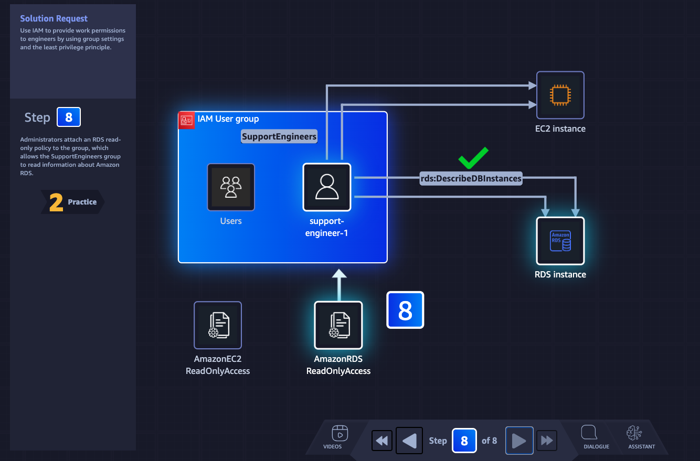

# Week 11: AWS SimuLearn: Core Security Concepts

* back to AWS Cloud Institute repo's root [aci.md](../aci.md)
* back to [AWS Cloud Operations 2](../aws-cloud-operations-2.md)
* back to repo's main [README.md](../../../../README.md)

## Description

## Learn

1. 
2. 
3. 
4. 
5. 
6. 
7. 
8. 

## DIY

1. 
2. 
3. 
4. 
