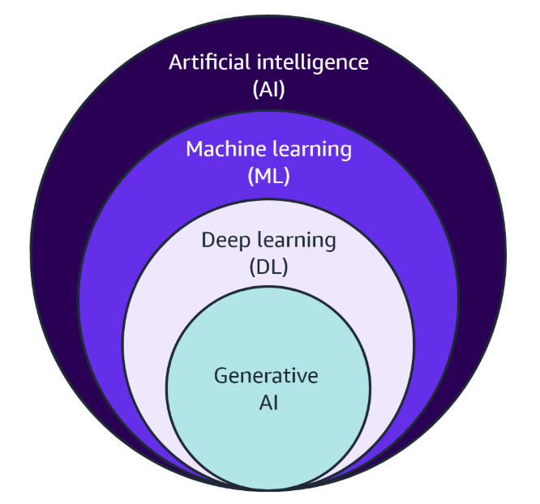

# Week 1: Fundamentals of AI and ML

* back to AWS Cloud Institute repo's root [aci.md](../aci.md)
* back to [AI for Developers](./ai-for-developers.md)
* back to repo's main [README.md](../../../README.md)

## Introduction to AI and ML

AI is the overarching concept of machines that can carry out tasks in a way that people would consider "smart." AI uses technology to do things that typically would require human intelligence, such as understanding language, recognizing images, and making decisions.

ML is a branch of AI.

ML is a field that allows computer systems to learn from data and improve over time without being explicitly programmed.

ML works by finding patterns in data, kind of like learning a new language. At first, you don't know any words, but as you're exposed to more examples like vocabulary, phrases, and sentences, you gradually begin to understand the patterns and rules. The more examples you encounter, the better you become at comprehending and using the language fluently.

So, our brain makes a model of that language, a language model.

This is similar to how ML operates. When you provide an ML algorithm with many examples, it can learn to recognize different objects, patterns, and relationships within the data. Exposing an ML algorithm to diverse data lets it learn to make accurate predictions, similar to how language immersion helps with proficiency.

As ML systems are exposed to more data, they can make better predictions and recommendations. For example, a streaming service uses ML to understand what types of shows you like, based on what you watch. It then recommends new shows with similar qualities so that you don’t have to manually search.

### History of AI and ML

AI and ML have a rich history, dating back to the mid-20th century. These fields aimed to create intelligent systems that can perform tasks traditionally requiring human intelligence.

Early AI research focused on symbolic logic and rule-based systems. In symbolic logic, propositions are represented using symbols. Logical operations like conjunction (AND), disjunction (OR), negation (NOT), and implication (IF-THEN) are defined using specific symbols and rules. These symbols and rules form the basis for constructing logical expressions. They are also used for evaluating logical arguments. Rule-based systems are a type of artificial intelligence system. Rule-based systems use symbolic logic.

These systems had limited capabilities and could not adapt to new situations.

In the 1980s, ML emerged as a new approach to AI. ML algorithms learn from data and can improve their performance over time. This allowed for more flexible and adaptive systems.

Traditional engineering approaches, which rely on predefined rules and algorithms, cannot achieve the same level of adaptability and learning capabilities as AI and ML. Traditional engineering is limited by the knowledge and assumptions of the engineers who design them.

AI and ML, on the other hand, can learn and evolve beyond their initial programming. They can discover patterns and insights that humans may overlook. This makes them better suited for complex, dynamic environments where traditional engineering approaches may fall short.

However, AI and ML also have limitations. They require large amounts of data and computational power. Their decision-making processes can be opaque, leading to concerns about bias and lack of transparency.

As AI and ML continue to advance, their impact on various industries and aspects of life will grow. It's essential to approach these technologies responsibly, addressing ethical concerns and ensuring that they benefit humanity. Ultimately, AI and ML are powerful tools that can augment and enhance human capabilities, but they are not a substitute for human intelligence, creativity, and decision-making.

### The relationship

* AI

    Artificial intelligence is any system that can ingest human-level knowledge to automate and accelerate tasks performable by humans through natural intelligence. AI has two main categories - narrow AI and general AI. Narrow AI imitates human intelligence, but is limited to one context. General AI can learn and behave intelligently across multiple contexts.

    Example of AI include:

      * Intelligent search in Amazon Kendra
      * Document analysis in Amazon Comprehend
      * Data and text extraction in Amazon Textract
      * Business metrics analysis in Amazon Lookout for Metrics and Amazon Forecast

* ML

    Machine learning is a type of AI for understanding and building methods that make it possible for machines to learn. these methods use data to improve computer performance on a set of tasks.

    ML is a way to develop statistical models that can learn and improve, without explicit instructions. Instead, they learn patterns and model the relationship in data to complete tasks. ML algorithms can be used to proceed large amounts of data.

* DL

    Deep learning is a subset of ML, where ML

* Gen AI
