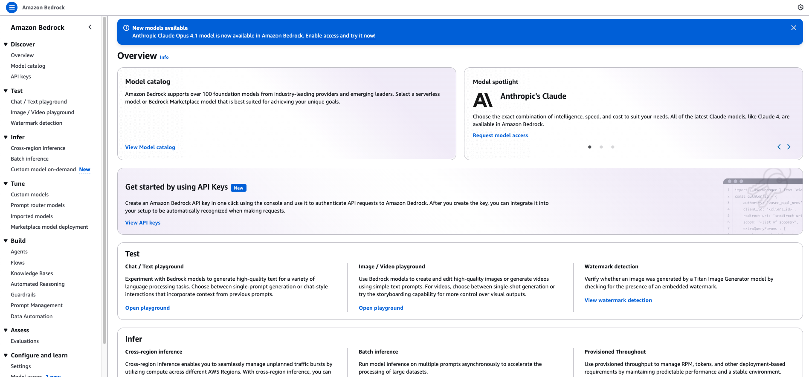
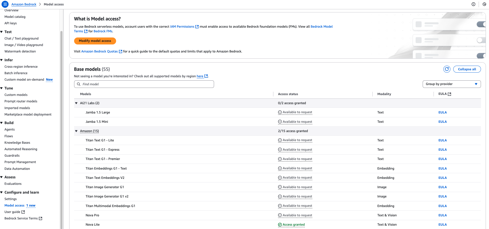
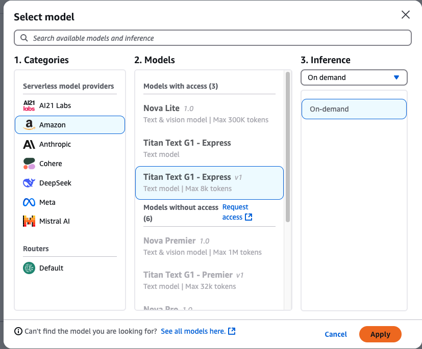
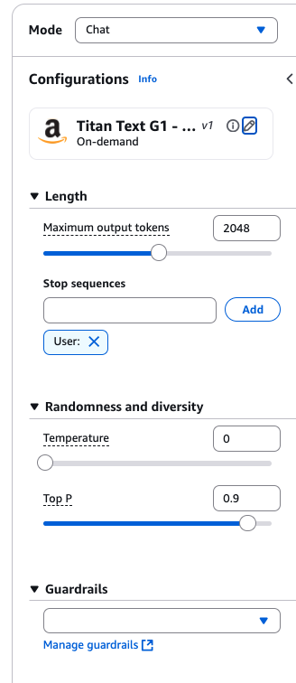
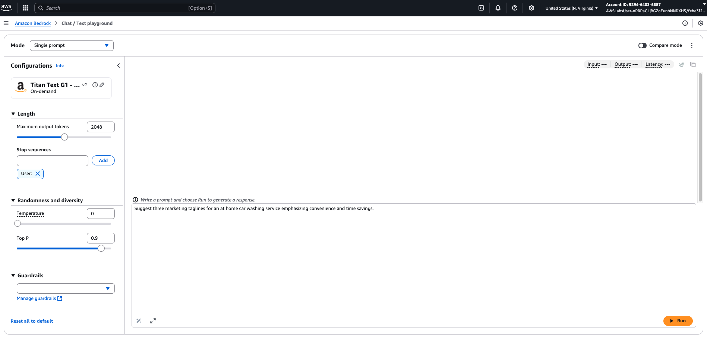
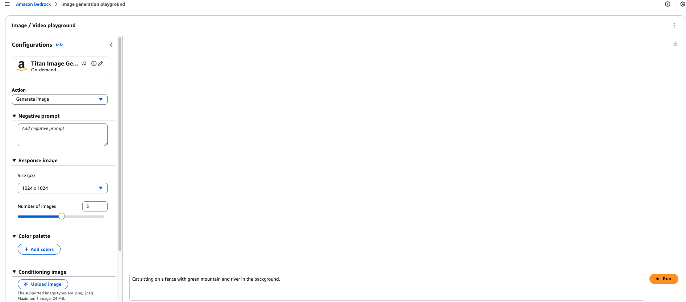
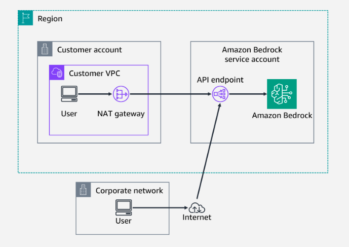
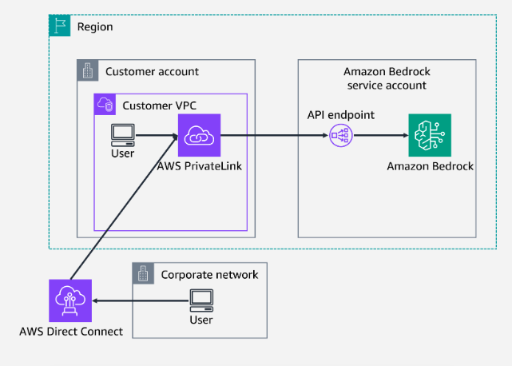
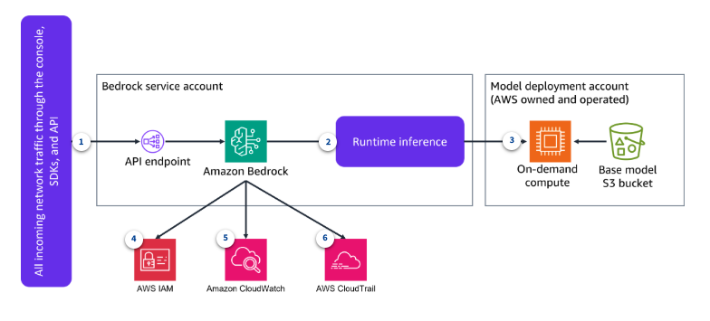
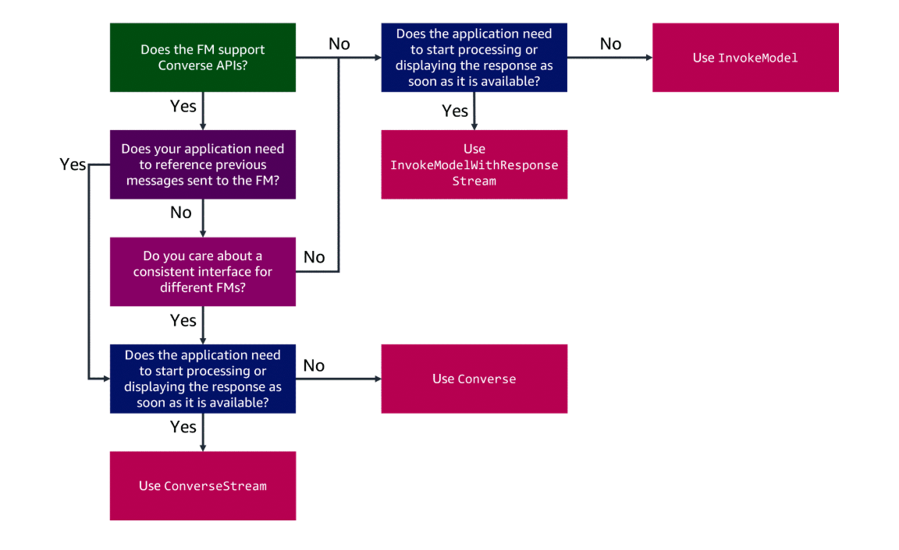

# Week 5: Developing AI Apps with Amazon Bedrock API

* back to AWS Cloud Institute repo's root [aci.md](../aci.md)
* back to [AI for Developers](./ai-for-developers.md)
* back to repo's main [README.md](../../../README.md)

## Amazon Bedrock Overview

**Amazon Bedrock** is a fully managed AWS service that enables developers to build, deploy, and scale generative AI applications using foundation models (FMs). It provides the necessary infrastructure, tools, and capabilities to support AI development with a strong focus on **security**, **privacy**, and **responsible AI**.

---

### 🔹 Key Capabilities of Amazon Bedrock

#### ✅ Model Choice

Amazon Bedrock offers access to **multiple high-performing foundation models** from leading AI providers, including:

* **Anthropic**
* **Cohere**
* **Meta**
* **Mistral AI**
* **Stability AI**
* **AI21 Labs**
* **Amazon**

With a **single API**, developers can easily switch between models or upgrade to newer versions with minimal code changes—enabling flexibility and agility.

---

#### ✅ Customization

Bedrock supports **private fine-tuning** of models using your own data:

* Fine-tune models (e.g., **Titan Text**) using **labeled datasets** for specific tasks.
* Continue pretraining with **unlabeled data** to adapt models to your domain or industry.
* Your data remains private—Bedrock creates a **separate instance** of the base model, and your data is **never used** to train shared models.

---

#### ✅ Retrieval-Augmented Generation (RAG)

Amazon Bedrock includes **Knowledge Bases** to support Retrieval-Augmented Generation:

* Enhance FM responses with **contextual company data**.
* Automate the **entire RAG workflow**, including data ingestion, retrieval, prompt augmentation, and citation generation.
* Eliminates the need for custom integration code, speeding up development and reducing complexity.

---

#### ✅ Agents

**Bedrock Agents** can automate **complex, multi-step workflows** across systems:

* Securely access and execute APIs.
* Retrieve and process data from internal systems.
* Analyze requests, orchestrate actions, and ensure secure execution.

This reduces manual effort and increases process efficiency while maintaining high standards for **privacy and security**.

---

### 🔹 Real-Life Applications of Amazon Bedrock LLMs

#### ✈️ Building Conversational AI Applications

* Developers at an airline can build **chat-based AI assistants** to help customers with:
  * Booking flights
  * Providing flight information
  * Answering common questions
* These assistants can be integrated into websites or mobile apps for **seamless, personalized customer experiences**.

---

#### 🛍️ Automating Customer Service

* E-commerce companies can use AI assistants to:
  * Automate support tickets via chat
  * Access purchase history, order status, and complaint details
* Assistants can verify users and provide **real-time updates**, improving response time and customer satisfaction.

---

#### 🏢 Enhancing Business Processes

* Media companies can deploy AI assistants to:
  * Automate tasks like meeting scheduling, report generation, and data retrieval from disconnected systems.
  * Support content creators with research, draft generation, and trend insights.
* This enhances **productivity** and **streamlines internal operations**.

---

### ✅ Summary

Amazon Bedrock provides a powerful platform to build secure, scalable, and customizable generative AI solutions. It supports a wide range of use cases across industries, enabling organizations to innovate faster while maintaining control over data and privacy.

## Interacting with Amazon Bedrock Playgrounds

You can use Amazon Bedrock in the AWS Management Console to interact with foundation models (FMs) through **Chat**, **Text**, or **Image** playgrounds. Each playground allows you to select a model, enter a prompt, and receive a response.

### How It Works

Amazon Bedrock provides an interface where users or consumers can send requests via different playgrounds to the selected foundation models (like Amazon Titan FM). Below is an architecture diagram:


### Amazon Bedrock Overview and Demonstration

---

### Signing in and Accessing Amazon Bedrock

* Sign in to the **AWS Management Console**.
* Choose the **N. Virginia** Region (`us-east-1`).
* In the Services search bar, enter "Bedrock" and select **Amazon Bedrock** from the results.



---

### Requesting Model Access

* On the Amazon Bedrock service page, choose **Get started**.
* To request access to foundation models, choose **Model access** from the side-navigation menu.
* On the **Model access** page, click **Manage model access**.



* Select **Titan Text G1 - Express** and **Titan Image Generator G1**.
* Click **Request model access** (or **Save changes** if previously requested).
* Wait for status to change to **Access granted**.

---

### Navigating the Overview Page

* Return to the **Overview** page to see available models, use cases, playgrounds, and tools.
* Playground types:
  * **Chat playground**
  * **Text playground**
  * **Image playground**

---

### Exploring the Chat Playground

* Open the **Chat playground**.
* Select the **Titan Text G1 - Express** model (Category: Amazon, Throughput: On-demand).



* Enter prompts in the **prompt section** and click **Run**.
* The conversation retains context from earlier prompts.

```text
What are some nice places to visit in NYC?
Are there any nearby water activities?
```

* Use the **Configurations** panel to adjust:
  * **Temperature** (controls creativity/randomness)
  * **Top P** (controls diversity)
  * **Length** and **Stop sequences**



* Example: Set Temperature to `1` and request:
  
```text
Write a creative blog about ways to boil an egg.
```

---

### Using the Text Playground

* The Text playground handles **single-prompt text tasks**.
* Example:
  
```text
Suggest three marketing taglines for an at home car washing service emphasizing convenience and time savings.
```

* Each prompt is independent—no context retention between queries.



---

### Using the Image Playground

* Open the **Image playground**.
* Select **Titan Image Generator G1** (Throughput: On-demand).
* Example prompt:

```text
Cat sitting on a fence with green mountain and river in the background.
```



* Adjust configuration settings to control output.
* Download, edit, or generate variations of selected images.

---

### Conclusion

Amazon Bedrock provides a unified interface to explore multiple foundation models across chat, text, and image use cases—without managing underlying infrastructure.

## Accessing Amazon Bedrock

### Ways to access Amazon Bedrock

* AWS Management Console

    When you are using Amazon Bedrock through the AWS Management Console, you can use capabilities such as safeguards, orchestration, model assessment, and deployments. This is also how you can access the Amazon Bedrock playgrounds to interact with FMs and generate text or images, or have a conversation using the chat playground. 

    By using the playgrounds in Amazon Bedrock, you can submit a natural language command (prompt) to the FM and get a response (answer). You can influence the response from the model by adjusting model inference parameters, such as temperature, to increase or decrease the randomness (or creativity) in the response. You can provide prompts to generate text, generate images, summarize text, receive answers to questions, or have a conversation by using chat.

    **Note**: Access to FMs is managed only through the AWS Management Console. It cannot be managed using the API.

* Amazon Bedrock API

    You can use an Amazon Bedrock API to securely access FMs. Using the API, you can privately pass prompts and responses between the user and the FM. The Amazon Bedrock API can be used through the AWS SDK to build a generative AI application and to integrate with other AWS services. You will learn more about this method in the next section.

---

### Access to Foundation Models (FMs)

Access to Amazon Bedrock FMs is not granted by default. To gain access to an FM, an AWS Identity and Access Management (IAM) user with sufficient permissions needs to request access to it through the console. Once access is provided to a model, it is available for all users in the account.

---

### Granting Programmatic Access to Amazon Bedrock

When you want to interact with Amazon Bedrock outside of the AWS Management Console — maybe running CLI commands, building apps with SDKs, or integrating APIs — you must grant **programmatic access**.  
This is all about *securely authenticating* your requests to AWS.  

The type of IAM identity you use determines how you set this up.

---

1. Workforce Identity. *Managed in IAM Identity Center — uses temporary credentials.*  

    These are typically **human users** in your organization, authenticated via AWS IAM Identity Center. Instead of storing permanent keys, they receive **temporary credentials** at login — much safer because the credentials automatically expire.  

    **Usage:**

    * **AWS CLI** → Configure using [AWS CLI to use AWS IAM Identity Center](https://docs.aws.amazon.com/cli/latest/userguide/cli-configure-sso.html) from the CLI User Guide.  
    * **AWS SDKs / APIs** → Use [IAM Identity Center authentication](https://docs.aws.amazon.com/sdkref/latest/guide/access-sso.html) in the SDKs & Tools Reference Guide.  

    **Key point:** *You never hardcode credentials for workforce identities — the CLI or SDK handles token retrieval for you.*

2. IAM Users (Temporary Credentials). *Issued via AWS STS (Security Token Service).*  

    Here, you still work with IAM identities, but you don’t rely on long-term access keys. Instead, you generate **short-lived credentials** from AWS STS.

    This is common for automation scripts, federated users, or workloads that assume a role.  

    **Usage:**  

    * Use the `aws sts assume-role` or `aws sts get-session-token` commands.  
    * Pass these temporary credentials to your AWS CLI profile or SDK configuration.  

    **Key point:** *Ideal for short-term jobs, CI/CD pipelines, and cross-account access.*

3. IAM Users (Long-Term Credentials). *Permanent access keys stored in AWS IAM.*  

    These are **access key ID + secret access key** pairs assigned to an IAM user.  

    They don’t expire automatically — which is why they’re **more risky** if compromised. AWS recommends rotating them regularly or replacing them with temporary credentials.  

    **Usage:**  

    * Configure directly in the AWS CLI using `aws configure`.  
    * Store in AWS SDK credentials files for persistent use.  

    **Key point:** *Avoid for human users — use only when absolutely necessary, such as for legacy integrations.*

---

✅ **Tip:**  
Whenever possible, choose **temporary credentials** (workforce identities or STS) over long-term access keys. This aligns with AWS security best practices and minimizes your exposure window if credentials are ever leaked.

### Accessing Amazon Bedrock

Before you can make an API call or use the console to interact with an FM, you need to access Amazon Bedrock itself (either over the public network, or through a more secure private connection).

#### Accessing Bedrock through a simple connection

In this scenario, the user can be in an AWS-powered office using a VPC, or gaining access another way, such as remotely from a home office. The user logs into the console or uses the Amazon Bedrock API through their local network. Their requests leave either their home network or the customer network through a NAT gateway and go over the public internet. They can perform actions from there.



#### Accessing Amazon Bedrock using AWS PrivateLink

If using the public internet to access an Amazon Bedrock endpoint is not an option, the connection can go through a more secure private connection. You can use PrivateLink with Amazon Bedrock to establish private connectivity between FMs and a VPC without exposing traffic to the public internet.

Users who access the customer network remotely can use AWS Direct Connect. Once in the customer network, a user will use PrivateLink, and then use VPC endpoints to perform their actions. In this instance, the client is going through the AWS backbone and nothing goes over the public internet. PrivateLink is automatically supported within Amazon Bedrock.



#### Making requests

The following diagram shows how inferences and other actions are performed in Amazon Bedrock. This traffic can come from the console or an API. While there are ways to access FMs without Amazon Bedrock, one key benefit is that none of the customer's data is written to the Amazon Bedrock service. Customer data used with Amazon Bedrock is not used for service improvement, and is not shared with third-party model providers. The customer always holds and controls all of their data. When accessing FMs directly, however, this is not the case.

Amazon Bedrock supports multiple communication paths for sending requests to models. All incoming traffic passes through the Bedrock API endpoint.



1. **User account**

    The user account creates calls that travel through network traffic. These calls can come from multiple sources, such as the console, CLI, an SDK, or an API.

2. **Amazon Bedrock inference service account**

    This is where the Bedrock inference service account is used. It is the one that relays the API call to make the inference on an FM.

    This account also determines which FM to use and ensures that correct permissions are applied. This account also checks that the correct logging is used.

3. **Amazon Bedrock model service account**

    This is where the Amazon Bedrock model service account is used. This account gives the Amazon Bedrock service read permissions to data sources, like an S3 bucket.

    This account also determines whether a user makes a general on-demand request (as shown in this diagram) or a request through provision capacity.

4. **AWS IAM**

    By using AWS Identity and Access Management (IAM), you can control access to your customized FMs. You can allow or deny access to specific FMs, decide which services can get inferences, and choose who can log in to the Amazon Bedrock console.

5. **Amazon CloudWatch**

    You can use Amazon CloudWatch to track usage metrics and build customized dashboards with metrics that you might require for audit purposes.

6. **AWS CloudTrail**

    Use AWS CloudTrail to monitor API activity and troubleshoot issues as you integrate other systems into your generative AI applications.

---

### Amazon Bedrock Account Types

The following table summarizes the accounts used to access FMs through Amazon Bedrock, as well as the data sources needed by the FMs.

| Account type                               | Owned by | Used for |
|--------------------------------------------|----------|----------|
| **User account**                           | Customer | * Accessing the Amazon Bedrock service |
| **Amazon Bedrock Inference service account** | AWS      | * Determining which model is used  <br> * Applying appropriate user permissions to models  <br> * Relaying inference commands  <br> * Checking for appropriate logging |
| **Amazon Bedrock Model service account**    | AWS      | * Housing the infrastructure that hosts an FM  <br> * Granting Amazon Bedrock Inference account read permissions to data sources  <br> * Determining if a user makes a general on-demand request or a request through provision capacity |

### Knowledge Check

#### Which service should a company use if they want to secure requests coming from inside their VPC to Amazon Bedrock?

* AWS PrivateLink

Wrong answers:

* Amazon Direct Connect
* AWS Site-to-Site VPN
* AWS Client VPN

##### Explanation

Using these VPC endpoints provides resources with private connectivity so traffic is not exposed to the public internet.  

The other options are incorrect for the following reasons:

* **Amazon Direct Connect**: This service provides secure, low-latency performance to on-premises networks through dedicated hardware, without traversing the internet. This would not be used for VPC to Amazon Bedrock communication.
* **AWS Site-to-Site VPN**: This service creates a secure connection between your on-premise networks, like branch offices, to AWS resources using IPSec tunneling over the internet. This service would not be used for communication between a customer VPC and Amazon Bedrock.
* **AWS Client VPN**: This service provides a client's remote workforce with secure access from client endpoints to within both AWS and on-premises networks. While this does provide a private connection to AWS, it would not be used for communication between a customer VPC and Amazon Bedrock.

#### Which of the following can be used to access an Amazon Bedrock image playground?

* AWS Management Console

Wrong answers:

* Amazon Bedrock SDK
* AWS CLI
* Amazon SageMaker Notebook

##### Explanation

The other options are incorrect because none of them provide access to the Amazon Bedrock playgrounds.

#### Which account routes Amazon Bedrock queries to the proper foundation model?

* Amazon Bedrock Inference

Wrong answers:

* User
* Root user
* Amazon Bedrock Model

##### Explanation

**Amazon Bedrock Inference** account performs actions such as the following:

* Relaying inference commands
* Applying appropriate user permissions to models
* Checking for appropriate logging

The other options are incorrect for the following reasons:

* **User**: This account is the end user and it makes the actual inferences
* **Root user**: This account should only be used for high-level account tasks unrelated. It should not be used to access Amazon Bedrock
* **Amazon Bedrock Model**: This account performs actions such as the following:
  * Granting Amazon Bedrock Inference account read permissions to data sources
  * Determining if a user makes a general on-demand request or a request through provision capacity

### Additional Resources

* [AWS PrivateLink](https://docs.aws.amazon.com/vpc/latest/privatelink/what-is-privatelink.html)
* [Configuring IAM Identity Center authentication with the AWS CLI](https://docs.aws.amazon.com/cli/latest/userguide/cli-configure-sso.html)
* [Use temporary credentials with AWS resources](https://docs.aws.amazon.com/IAM/latest/UserGuide/id_credentials_temp_use-resources.html)
* [Authenticating using IAM user credentials for the AWS CLI](https://docs.aws.amazon.com/cli/latest/userguide/cli-authentication-user.html)
* [Manage access keys for IAM users](https://docs.aws.amazon.com/IAM/latest/UserGuide/id_credentials_access-keys.html)

### Summary

Amazon Bedrock helps developers build, deploy, and scale LLMs for applications. It provides the following key benefits:

Efficient builds using foundation models 
Security of generative AI applications
Customized experiences using an organization's data
While there are ways to access FMs without Amazon Bedrock, one key benefit is that none of the customer's data is written to the Amazon Bedrock service. Customer data used with Amazon Bedrock is not used for service improvement and is not shared with third-party model providers. The customer always holds and controls all of their data.

#### Amazon Bedrock Playgrounds

You can access Amazon Bedrock with the AWS Management Console to use the text, chat, or image playgrounds. The playgrounds allow you to select an FM, enter a prompt, and generate a response.

#### Accessing Amazon Bedrock

Amazon Bedrock can be accessed using the AWS Management Console or Bedrock APIs. When you are using the APIs, access is not automatically granted if you have Amazon Bedrock access. Instead, you need to set up programmatic access, either through workforce identity or IAM.

#### Secure Amazon Bedrock access

If using the public internet to access an Amazon Bedrock endpoint is not an option, the connection can go through a more secure private connection. You can use AWS PrivateLink with Amazon Bedrock to establish private connectivity between FMs and a VPC without exposing traffic to the public internet.

#### When requests are made

There are three accounts involved in accessing FMs through Amazon Bedrock and the necessary data sources.

| Account type                               | Owned by | Used for |
|--------------------------------------------|----------|----------|
| **User account**                           | Customer | * Accessing the Amazon Bedrock service |
| **Amazon Bedrock Inference service account** | AWS      | * Determining which model is used  <br> * Applying appropriate user permissions to models  <br> * Relaying inference commands  <br> * Checking for appropriate logging |
| **Amazon Bedrock Model service account**    | AWS      | * Housing the infrastructure that hosts an FM  <br> * Granting Amazon Bedrock Inference account read permissions to data sources  <br> * Determining if a user makes a general on-demand request or a request through provision capacity |

## Amazon Bedrock API and its parameters

### Overview of the Amazon Bedrock API

As a developer, you will often access Amazon Bedrock through its API using the CLI or SDK.

AWS offers the following tools to streamline the process of setting up an environment to make Amazon Bedrock requests through the Amazon Bedrock API.

* AWS CLI
* AWS SDKs

You must ensure that you either have the most up-to-date version of the AWS CLI, or you have an SDK installed. Each SDK provides an API, code examples, and documentation that make it easier for you to build applications in your preferred language. SDKs automatically perform useful tasks for you, such as the following:

* Cryptographically signing your service requests
* Retrying requests
* Handling error responses

In its simplest format, the Amazon Bedrock API requires the following steps for invoke a model.

1. Create an endpoint connection

    The Amazon Bedrock endpoints allow you to interact with the Amazon Bedrock service and its FMs. There are several kinds of endpoints, and they provide their own unique API operations for a variety of tasks, such as the following:

    * Creating, managing, and evaluating models
    * Creating provisioned models
    * Getting foundation models
    * Getting guardrails
    * Getting model customization jobs

    ```python
    import boto3
    import json
    
    # Create the connection to Bedrock runtime
    bedrock_runtime = boto3.client(
        service_name='bedrock-runtime',
        region_name='us-east-1',
    )
    ```

2. Specify parameters

    You can set parameters for both Amazon Bedrock and for the FM you are using.

    ```python
    # Specify Amazon Bedrock parameters
    model_id = 'amazon.titan-tg1-large'
    accept = 'application/json'
    content_type = 'application/json'
    
    # Set FM specific parameters
    text_gen_config = {
        "maxTokenCount": 1000,
        "stopSequences": [],
        "temperature": 0,
    }
    ```

3. Pass a prompt and any model-specific parameters

    Next, pass your prompt to the FM and combine it with FM-specific parameters. This creates the prompt body.

    ```python
    # Define prompt and model parameters
    prompt_data = """Write an essay about why someone should drink coffee."""

    # Combine the FM specific parameters along with the prompt to create the parameter body.
    body = json. dumps ({
        "inputText": prompt_data,
        "textGenerationConfig": text_gen_config
    })
    ```

4. Invoke your FM and format the output

    Once you have entered your prompt, you need to invoke your FM and specify your preferred output format.

    ```python
    # Invoke the model
    response = bedrock_runtime.invoke_model(
        body=body,
        modelId=model_id,
        accept=accept,
        contentType=content_type
    )
    
    # Once the response is returned format it as a Python dictionary
    response_body = json.loads(response.get('body').read())
    
    # Print the response
    print(response_body['results'][0]['outputText'])
    ```

## Inference Parameters and Amazon Bedrock

### Inference parameter review

When interacting with an FM, you can configure the inference parameters to customize the FM’s response. Generally, you should only adjust one parameter at a time, and the results can vary depending on the FM.

The following parameters can be used to modify the output from the LLMs. Not all parameters are available with all LLMs.

#### 🎲 Randomness and Diversity in Foundation Models

When working with **Amazon Bedrock** foundation models, you can fine-tune **randomness** and **diversity** in responses by adjusting generation parameters.

These parameters influence how the model selects the next word (token) in a sequence.

---

#### 🌡 Temperature  

**Purpose:** Controls randomness in **word choice**.

* **How it works:**

  The model assigns probabilities to each possible next word.  
  * **Low temperature (close to `0`)** → Chooses high-probability words → **Predictable and deterministic output**  
  * **High temperature** → Allows more low-probability words → **Creative and varied output**

* **Example:**

  ```text
  Temperature = 0.1 → "The sky is blue."
  Temperature = 0.9 → "The sky shimmers with shades of sapphire."
  ```

#### 📊 Top K

**Purpose:** Controls **the number of candidate words** considered for each step.

* **How it works:**

  * **Low Top K** → Smaller candidate pool → **More likely outputs, less diversity**
  * **High Top K** → Larger candidate pool → **Increased diversity but less predictability**

* **Example:**

  ```text
  Top K = 10 → Model considers 10 most likely tokens
  Top K = 100 → Model considers 100 most likely tokens
  ```

#### 📈 Top P (Nucleus Sampling)

**Purpose:** Selects from the smallest set of tokens whose cumulative probability exceeds the Top P value.

* **How it works:**

  * **High Top P (e.g., 0.9)** → Select from a larger set → **More diversity, but risk of incoherence**
  * **Low Top P** → Select from a smaller set → **More predictable, consistent responses**

* **Example:**

  ```text
  Top P = 0.3 → Model picks from the top 30% cumulative probability tokens
  Top P = 0.9 → Model picks from the top 90% cumulative probability tokens
  ```

#### 💡 Tips

* Balance creativity and accuracy by adjusting Temperature, Top K, and Top P together.
* For factual or deterministic tasks → Lower temperature, lower Top K/P.
* For creative writing or brainstorming → Higher temperature, higher Top K/P.
* Avoid setting both Temperature and Top P extremely high—this can produce unfocused or incoherent results.

---

### Example using Temperature, Top-K, Top-P

```text
I hear the hoof beats of 
```

Let's say that the model determines the following three words to be candidates for the next token. The model also assigns a probability for each word.

```json
{
    "horses": 0.7,
    "zebras": 0.2,
    "unicorns": 0.1
}
```

A higher value for **Top P**, such as **0.9**, implies that the output will be chosen at random from a larger number of tokens, which increases diversity. However, a higher value can cause the output to become incoherent. Lower values decrease the number of tokens available for selection, which increases the predictability of the next token.

* If you set a high temperature, the probability distribution is flattened and the probabilities become less varied. This would increase the probability of choosing "unicorns" and decrease the probability of choosing "horses".
* If you set Top K as 2, the model only considers the top 2 most likely candidates: "horses" and "zebras."
* If you set Top P as 0.7, the model only considers "horses" because it is the only candidate that lies in the top 70% of the probability distribution. If you set Top P as 0.9, the model considers "horses" and "zebras" as they are both in the top 90% of probability distribution.

---

#### Length

Foundation models typically support the following parameters to control the length of the generated response.

##### Response length

Response length sets minimum and maximum token counts. It sets a hard limit on response size.

##### Length penalty

Length penalty encourages more concise responses by penalizing longer ones. It sets a soft limit on size. This parameter specifies the degree to which to penalize outputs in a response. Examples include the following:

* Length of the response
* Repeated tokens in a response
* Frequency of tokens in a response
* Types of tokens in a response

##### Stop sequences

Stop sequences include specific character combinations that signal the model to stop generating tokens when encountered. This is used for the early termination of responses.

---

### Inference parameters in Amazon Bedrock

Some inference parameters are common across most models, such as temperature, Top P, Top K, and response length. However, they might have slight differences in how they are written out, such as topP and top_P. In these cases, you may receive an error if you use the incorrect version, so it is a good practice to refer to documentation to ensure you are using the correction parameters.

Other parameters are model-specific and can be tuned to achieve the desired output based on the use case.

---

### AI21 Jurassic-2 (Mid and Ultra)

Jurassic-2 models support the following unique parameters to control randomness, diversity, length, and repetition in the response.

* **maxTokens**

  Specify the maximum number of tokens to use in the generated response.

* **presencePenalty**

  Use a higher value to lower the probability of generating new tokens that already appear at least once in the prompt or in the completion.

* **countPenalty**

  Use a higher value to lower the probability of generating new tokens that already appear at least once in the prompt or in the completion. The value is proportional to the number of appearances.

* **frequencyPenalty**

  Use a higher value to lower the probability of generating new tokens that already appear at least once in the prompt or in the completion. The value is proportional to the frequency of the token appearances (normalized to text length).

* **Penalty special tokens**

  Reduce the probability of repetition of special characters. The default values are true as follows:

  * **applyToWhitespaces**: A true value applies the penalty to white spaces and new lines
  * **applyToPunctuation**: A true value applies the penalty to punctuation
  * **applyToNumbers**: A true value applies the penalty to numbers
  * **applyToStopwords**: A true value applies the penalty to stop words
  * **applyToEmojis**: A true value excludes emojis from the penalty

The Jurassic-2 model comes in two versions, mid and ultra.

#### Jurassic-2 Mid

This is a mid-sized model that is optimized to follow natural language instructions and context, so there is no need to provide it with examples. It is ideal for composing human-like text and solving complex language tasks, such as question answering and summarization.

#### Jurassic-2 Ultra

This is a large-sized model that you can apply to language comprehension or generation tasks. Use cases include generating marketing copy, powering chat-based AI assistant, assisting with creative writing, performing summarization, and extracting information.

* **Input**

```json
{
"prompt": "<prompt>",
"maxTokens": 200,
"temperature": 0.5,
"topP": 0.5,
"stopSequences": [],
"countPenalty": {"scale": 0},
"presencePenalty": {"scale": 0},
"frequencyPenalty": {"scale": 0}
} 
```

* **Output**

```json
{
    "id": 1234,
    "prompt": {
         "text": "<prompt>",
         "tokens": [
              {
                   "generatedToken": {
                        "token": "\u2581who\u2581is",
                        "logprob": -12.980147361755371,
                        "raw_logprob": -12.980147361755371
                   },
                   "topTokens": null,
                   "textRange": {"start": 0, "end": 6}
              },
              //...
         ]
    },
    "completions": [
         {
              "data": {
                   "text": "<output>",
                   "tokens": [
                        {
                             "generatedToken": {
                                  "token": "<|newline|>",
                                  "logprob": 0.0,
                                  "raw_logprob": -0.01293118204921484
                             },
                             "topTokens": null,
                             "textRange": {"start": 0, "end": 1}
                        },
                        //...
                   ]
              },
              "finishReason": {"reason": "endoftext"}
         }
    ]
}
```

---

### Anthropic Claude 3.5

Anthropic Claude 3.5 is another model available for text generation on Amazon Bedrock. Claude is a generative AI model by Anthropic. In addition to common parameters, Claude models use the following unique parameter to further tune the response output.

* **max_tokens_to_sample**

  Specify the maximum number of tokens to use in the generated response.

* **Code example**

  The following example shows an input configuration used to invoke a response from Anthropic Claude 3.5 using Amazon Bedrock.

  * **Input**

  ```python
  import boto3
  import json

  brt = boto3.client(service_name='bedrock-runtime')

  body = json.dumps({
    'prompt': '\n\nHuman: write an essay for living on mars in 1000 words\n\nAssistant:',
    'max_tokens_to_sample': 4000
  })

  response = brt.invoke_model_with_response_stream(
      modelId='anthropic.claude-3-5-sonnet-20240620-v1:0', 
      body=body
  )

  stream = response.get('body')

  if stream:
      for event in stream:
          chunk = event.get('chunk')
          if chunk:
              print(json.loads(chunk.get('bytes').decode()))
  ```

---

### Stability AI (SDXL)

This is a text-to-image model used to generate detailed images, and it supports the following controls.

* **cfg_scale**

  This control determines how much the final image portrays the prompt. Use a lower number to increase randomness in the generation.

* **steps**

  This control determines how many times the image is sampled. More steps can result in a more accurate result.

* **seed**

  This control determines the initial noise setting. Use the same seed and the same settings as a previous run so inference can create a similar image. If you don't set this value, it is set as a random number.

* **code example**

  The following example shows an input configuration used to invoke a response from SDXL using Amazon Bedrock.

  * **Input**

  ```json
  {
     "text_prompts": [
      {"text": "this is where you place your input text"}
    ],
    "cfg_scale": 10,
    "seed": 0,
    "steps": 50
  }
  ```

  * **Output**

  ```json
  {
    "result": "success",
    "artifacts": [
      {
        "seed": 123,
        "base64": "<image in base64>",
        "finishReason": "SUCCESS"
      },
      //...
    ]
  }
  ```

---

### Cohere Command model

Command is the flagship text-generation model by Cohere. It is trained to follow user commands and be immediately useful in practical business applications, such as summarization, copywriting, dialogue, extraction, and question answering. In addition to common parameters, the Cohere Command model supports the following unique controls.

* **return_likelihoods**

  Specifies if and how the token likelihoods are returned with the response. You can specify the following options:

  * **GENERATION**: This option only returns likelihoods for generated tokens
  * **ALL**: This option returns likelihoods for all tokens
  * **NONE**: This option doesn’t return any likelihoods (his is the default option)

* **stream**

  Specifies true to return the response piece-by-piece in real time and false to return the complete response after the process finishes.

* **code samples**

  The following example shows an input configuration used to invoke a response from Cohere Command using Amazon Bedrock.

  * **Input**

  ```json
  {
    "prompt": prompt,
    "max_tokens": 200,
    "temperature": 0.6,
    "p": 1,
    "k": 0,
    "num_generations": 2,
    "return_likelihoods": "GENERATION"
  }

  {
    "prompt": prompt,
    "max_tokens": 200,
    "temperature": 0.6,
    "p": 1,
    "k": 0,
    "num_generations": 2,
    "return_likelihoods": "GENERATION",
  }
  ```

---

### Amazon Bedrock API Reference

#### Amazon Bedrock endpoints

After importing Boto3 and JSON, the next step is to use the Amazon Bedrock API to connect to an endpoint, which is used for programmatic access to an AWS service. Amazon Bedrock provides several service endpoints. When making an API request, it is important to make sure you are using the correct endpoint. for example, the bedrock or bedrock-runtime endpoints.

* **bedrock**

  This endpoint contains control plane APls for managing, training, and deploying models. You can use this endpoint when you want to access Amazon Bedrock itself. It can also be used to create and manage models. Some example methods for this endpoint are 
  * *list_foundation_models*
  * *tag_resource*
  * *get_foundation_model*

* **bedrock-runtime**

  This endpoint contains data plane APls for making inference requests for models hosted in Amazon Bedrock.

  Use this endpoint when you want to invoke a model. Some example methods for this endpoint are
  * *converse*
  * *invoke_model*
  * *invoke_model_with_response_stream*

---

### Listing available models in Amazon Bedrock

Before you invoke a model, you can obtain a list of available foundation models using the **ListFoundationModels**.

#### Which endpoint is used to obtain a list of all available foundation models in Amazon Bedrock?

* bedrock

Wrong answer:

* bedrock-runtime

The **bedrock** endpoint is used to access the **Amazon Bedrock service** itself for managing, deploying, and training models. Obtaining a list of all available foundation models aligns with this. The bedrock-runtime endpoint is used to access the actual models while using Amazon Bedrock.

### Example of ListFoundationModels

This method is used to provide a list of Amazon Bedrock foundation models that you can use.

```bash
%pip install --upgrade boto3
```

```python
import boto3
import json
bedrock = boto3.client(service_name='bedrock')              # 1
model_list=bedrock.list_foundation_models()                 # 2
for x in range(len(model_list.get('modelSummaries'))):      # 3
     print(model_list.get('modelSummaries')[x]['modelId'])
```

1. **Connecting to an endpoint**

    This is where the endpoint is created. Notice since this request is accessing the Amazon Bedrock service itself for a control plane operation, it is using the bedrock endpoint.

2. **Request**

    This is the actual request to list all the foundation models currently available in Amazon Bedrock.

3. **Output definition**

    Lines 5 and 6 determine what the output will look like. This request is asking for a list to be printed in the IDE of all foundation models and to show their modelID only.

A list of all foundation models available on Amazon Bedrock, and their respective metadata information, is returned. The following is an example of the output filtered on the model ID.

```bash
1 amazon. titan-tgl-large
2 amazon.titan-elt-medium
3 amazon.titan-embed-g1-text-02
4 amazon.titan-text-express-v1
5 amazon. titan-embed-text-v1
6 stability.stable-diffusion-xl
7 stability.stable-diffusion-x1-v0
8 ai21.j2-grande-instruct
9 ai21.j2-jumbo-instruct
10 ai21.j2-mid
11 ai21.j2-mid-v1
12 a121.j2-ultra
13 ai21.j2-ultra-v1
14 anthropic.claude-instant-v1
15 anthropic.claude-v1
16 anthropic.claude-v2
17 cohere.command-text-v14
```

---

### Invoking a model

Once you have chosen a model, you access it by running an inference on it using an API.

#### Which endpoint is used run an inference on a foundation model in Amazon Bedrock?

* bedrock-runtime

Wrong answer:

* bedrock

**bedrock-runtime** endpoint is used to access the actual foundation models while using Amazon Bedrock. The bedrock endpoint is used to manage, deploy, and train foundation models and access the actual Amazon Bedrock service.

---

### Anatomy of an invocation

When invoking a model, the following fields must be included.

#### modelID

For the **modelId** field, use either the model ID or its Amazon Resource Name (ARN). How you find the model ID or ARN depends on the type of model you use.

* If it is a base, uncustomized model, you can do one of the following.
  * Visit [Amazon Bedrock base model IDs (on-demand throughput)](https://docs.aws.amazon.com/bedrock/latest/userguide/model-ids.html#model-ids-arns) to see a list of model IDs for all base models supported by Amazon Bedrock.
  * Send a *ListFoundationModels* request, and find the *modelId* or *modelArn* of the model in the response.
  * In the console, select a model in **Providers** and find the *modelId* in the API request example displayed in the console
* If the model is customized, purchase [Provisioned Throughput](https://docs.aws.amazon.com/bedrock/latest/userguide/prov-throughput.html) for the custom model and find the model ID or ARN of the provisioned model.
* If you have created a Provisioned Throughput for a base or custom model, do one of the following.
  * Send a *ListProvisionedModelThroughputs* request and find the *provisionedModelArn* of the model to use in the response.
  * In the console, select a model in **Provisioned Throughput** and find the model ARN in the **Model details** section.

#### Body

Each base model has its own inference parameters that you set in the **body** field. The inference parameters for a custom or provisioned model depend on the base model from which it was created.

---

There are two APIs that can be used to invoke a model:

* *InvokeModel*
* *InvokeModelWithResponseStream*

### InvokeModel

This request invokes the specified Amazon Bedrock model to run inference using the prompt and inference parameters provided in the request body. You use model inference to generate text, images, and embeddings.

#### REQUEST SYNTAX

```python
response = client.invoke_model(
    body=b'bytes'|file,
    contentType='string',
    accept= 'string',
    modelId='string',
    trace=' ENABLED' 'DISABLED',
    guardrailIdentifier='string',
    guardrailversion='string'
)
```

#### REQUEST PARAMETERS

The following parameters should be used with the InvokeModel API:

* **body**: This bytes-like or seekable file-like object must be provided in JSON format
* **model_id**: This unique identifier provides the model to invoke for inference:
  * If you use a base model, specify the model ID or its ARN; use [Amazon Bedrock base model IDs](https://docs.aws.amazon.com/bedrock/latest/userguide/models-supported.html#model-ids-arns) or the ListFoundationModels method
  * If you use a provisioned model, specify the ARN of the [Provisioned Throughput](https://docs.aws.amazon.com/bedrock/latest/userguide/prov-thru-use.html)
  * If you use a custom model, first purchase Provisioned Throughput for it, then specify the [ARN](https://docs.aws.amazon.com/bedrock/latest/userguide/model-customization-use.html)
* **accept**: This string object provides the desired MIME type of the inference body in the response; the default value is application/json
* **content_type**: This string object provides the MIME type of the input data in the request; you must specify application/json

#### RESPONSE BODY

The response returns as a JSON dictionary with the following syntax:

```json
{
  "body": StreamingBody(),
  "contentType": "string"
}
```

The response returns as a streaming body, so when it is printed, it does not return a memory location for a Python object. Instead, it provides the response from the model.

---

### InvokeModel API Example

The following example shows how to run inference with the InvokeModel API using Python. This example generates an essay with up to 1000 words about why someone should drink coffee. This example will show the code in its entirety. Subsequent examples will show what is unique to that specific API.

```python{.line-numbers}
import boto3
import json                                        # 1

#Create the connection to Bedrock runtime          # 2
bedrock_runtime = boto3.client(
    service_name='bedrock-runtime',
    region_name='us-east-1', 
)

# Specify Amazon Bedrock parameters                # 3
model_id = 'amazon.titan-tg1-large'
accept = 'application/json' 
content_type = 'application/json'

# Set FM specific parameters                       # 4
text_gen_config = {
    "maxTokenCount": 1000,
    "stopSequences": [], 
    "temperature": 0,
    "topP": 0.9
}

# Define prompt and model parameters               # 5
prompt_data = """Write an essay about why someone should drink coffee."""

# Combine the FM specific parameters along with the prompt to create the parameter body
body = json.dumps({                                # 6
    "inputText": prompt_data,
    "textGenerationConfig": text_gen_config  
})

# Invoke the model 
response = bedrock_runtime.invoke_model(           # 7
    body=body, 
    modelId=model_id, 
    accept=accept, 
    contentType=content_type
)

# Once the response is returned format it as a Python dictionary
response_body = json.loads(response.get('body').read())   # 8

# Print the response
print(response_body['results'][0]['outputText'])
```

1. **Importing libraries**

    Lines 1 and 2 import the Boto3 and JSON libraries for the interpreter.

2. **Connect to an endpoint**

    In lines 5 through 8, you can see the connection to the endpoint being made. Since this example shows data plane APIs, the bedrock-runtime, in the us-east-1 Region is called.

3. **Service-level parameters**

    In lines 11 through 13, the service level parameters are called and show **InvokeModel**'s required parameters - model_id and setting the body type, as well as accept and content_type.

4. **FM-level parameters**

    In lines 16 through 21, the format of the response from the FM is adjusted. The maxTokenCount sets the response to 1,000 words or fewer. With this temperature and topP, you can expect this response to have 1,000 or fewer words and the following characteristics:

    * Answers for the question will be predictable
    * The words used to write the response will draw from a robust vocabulary

5. **Prompt definition**

    The actual prompt is now created. In this example, the request is an essay about why someone should drink coffee. Looking back at lines 16 through 21, we now know the following about the response:

    * It will be a 1,000 word essay on why someone drinks coffee
    * It will be similar every time and give predictable answers.
    * It will use varied language

6. **Body creation**

    In lines 27 through 30, the prompt data and FM-level parameters are combined in the body so they can be sent to the FM model.

7. **Model invocation**

    The previous steps have been similar to packing a package. In lines 33 through 38, the package is now sent to the FM with these defined pieces:

    * Body containing the FM parameters and prompt
    * modelID for the FM to be used
    * Accepted format
    * Content type, **application/json**

8. **Format and print**

    Lines 41 through 44 format the response as JSON dictionary with a streaming body, and print it on screen.

The modelID is Amazon Titan, the temperature is 0.0, and the topP is 0.9.

---

### InvokeModelwithResponsestream

This request invokes the specified Amazon Bedrock model to run inference using the prompt and inference parameters provided in the request body. The response is returned in a stream.

#### REQUEST SYNTAX

```python
response = client.invoke_model_with_response_stream(
    body=b'bytes' |file,
    contentType='string',
    accept='string',
    modelId='string',
    trace='ENABLED' | 'DISABLED',
    guardrailIdentifier='string',
    guardrailversion='string'
)
```

#### REQUEST PARAMETERS

The following parameters should be used with the InvokeModelWithResponseStream API:

* **body**: This bytes-like or seekable file-like object must be provided in JSON format
* **model_id**: This unique identifier provides the model to invoke for inference:
  * If you use a base model, specify the model ID or its ARN; use [Amazon Bedrock base model IDs or the ListFoundationModels method](https://docs.aws.amazon.com/bedrock/latest/userguide/models-supported.html#model-ids-arns)
  * If you use a provisioned model, specify the ARN of the [Provisioned Throughput](https://docs.aws.amazon.com/bedrock/latest/userguide/prov-thru-use.html)
  * If you use a custom model, first purchase Provisioned Throughput for it, then specify the [ARN](https://docs.aws.amazon.com/bedrock/latest/userguide/model-customization-use.html)
* **accept**: This string object provides the desired MIME type of the inference body in the response; the default value is application/ison
* **content_type**: This string object provides the MIME type of the input data in the request; you must specify application/json

#### RESPONSE BODY

The response of this operation contains an EventStream member. When iterated, the EventStream yields events based on the syntax that includes only one top-level key for each event.

```json
{
  "body": EventStream({            // 1
    "chunk": {                     // 2
      "bytes": b"bytes"            // 3 
    },
    "internalserverException": {   // 4
      "message": "string",
    },
    "modelstreamErrorException": { // 5
      "message": "string",
      "originalstatuscode": 123,
      "originalMessage": "string"
    },
    "validationException": {        // 6
      "message": "string"
    },
    "throttlingException": {        // 7
      "message": "string"
    },
    "modelTimeoutException": {      // 8
      "message": "string"
    },
    "serviceUnavailableException": {// 9
      "message": "string"
    }
  }),
  "contentType": "string"           // 10
}
```

1. **body (EventStream)**

    This will be the inference response that is specified in contentType.

2. **chunk**

    Content included in the response

3. **bytes**

    This is the base64-encoded bytes of the payload data.

4. **internalServerException**

    This is a dictionary object that can be D returned. It will prompt the user to retry their request.

5. **modelStreamErrorException**

    This is a dictionary object that can be returned. It will prompt the user to retry their request. It will also include D a status code for the original message and the original message.

6. **validationException**

    This is a dictionary object that returns the messages if there is an issue validating the input. It will prompt the user to retry their request.

7. **throttlingException**

    This is a dictionary object that is returned when a request is throttled due to service-wide limitations. It will prompt the user to retry their request later or in a different region.

8. **modelTimeoutException**

    This is a dictionary object that is returned when a request took too long to process. It will prompt the user to retry their request.

9. **serviceUnavailableException**

    This is a dictionary object that is when the service is unavailable. It will prompt the user to retry their request later.

10. **contentType**

    This sets the content of the body as a string.

---

### Why use InvokeModelWithResponseStream?

This API should be used for anything that is user-facing, has a long answer, and does not require a consistent interface for FMs. This way, the response from the model is seen as it is being generated.

To see if a model supports streaming, call GetFoundationModel and check the responseStreamingSupported field in the response. For more information on this API, visit the [InvokeModelWithResponseStream](https://docs.aws.amazon.com/bedrock/latest/APIReference/API_runtime_InvokeModelWithResponseStream.html) documentation site.

### invokeModelWithResponseStream API example

The example uses the same code as the InvokeModel API example.

The code for this API is exactly the same until it is time to invoke the model.

```python{.line-numbers}
import boto3
import json                                        # 1

#Create the connection to Bedrock runtime          # 2
bedrock_runtime = boto3.client(
    service_name='bedrock-runtime',
    region_name='us-east-1', 
)

# Specify Amazon Bedrock parameters                # 3
model_id = 'amazon.titan-tg1-large'
accept = 'application/json' 
content_type = 'application/json'

# Set FM specific parameters                       # 4
text_gen_config = {
    "maxTokenCount": 1000,
    "stopSequences": [], 
    "temperature": 0,
    "topP": 0.9
}

# Define prompt and model parameters               # 5
prompt_data = """Write an essay about why someone should drink coffee."""

# Combine the FM specific parameters along with the prompt to create the parameter body
body = json.dumps({                                # 6
    "inputText": prompt_data,
    "textGenerationConfig": text_gen_config  
})

# Invoke the model with a streamed response.       # 7

response = bedrock_runtime.invoke_model_with_response_stream(
    body=body, 
    modelId=model_id, 
    accept=accept, 
    contentType=content_type
)

# Print the response in a streamed manner.         # 8
for event in response['body']:
    data = json.loads(event['chunk']['bytes'])
    print(data['outputText'])
```

1. **Importing libraries**

    Lines 1 and 2 import the Boto3 and JSON libraries for the interpreter.

2. **Connect to an endpoint**

    In lines 5 through 8, you can see the connection to the endpoint being made. Since this example shows data plane APIs, the bedrock-runtime, in the us-east-1 Region is called.

3. **Service-level parameters**

    In lines 11 through 13, the service level parameters are called and show **InvokeModel**'s required parameters - model_id and setting the body type, as well as accept and content_type.

4. **FM-level parameters**

    In lines 16 through 21, the format of the response from the FM is adjusted. The maxTokenCount sets the response to 1,000 words or fewer. With this temperature and topP, you can expect this response to have 1,000 or fewer words and the following characteristics:

    * Answers for the question will be predictable
    * The words used to write the response will draw from a robust vocabulary

5. **Prompt definition**

    The actual prompt is now created. In this example, the request is an essay about why someone should drink coffee. Looking back at lines 16 through 21, we now know the following about the response:

    * It will be a 1,000 word essay on why someone drinks coffee
    * It will be similar every time and give predictable answers.
    * It will use varied language

6. **Body creation**

    In lines 27 through 30, the prompt data and FM-level parameters are combined in the body so they can be sent to the FM model.

7. **Model invocation**

    **The package now sent to the same FM but uses the invokeModelWithResponseStream API**

8. **Response is returned in a stream**

    Here the Python dictionary is returned as a list object. Each list object is then read as it comes in, which creates the stream.

---

### Converse and ConverseStream APIs

When you're using an AI assistant, it's like having a conversation with someone. You (user role) start by saying something (sending a message), and then the AI assistant (assistant role) responds with its own message. Imagine you're talking to a friend. You say something first, like "Hi, how are you?" That's the first message you send to the AI assistant. Then, the AI assistant processes what you said and responds with its own message, like "I'm doing well, thanks for asking."

If you want to keep the conversation going, you can send another message to the AI assistant, and it will respond based on what you said and also what was said earlier in the conversation. This back-and-forth exchange of messages is called a "conversation."

You can use the Amazon Bedrock Converse and ConverseStream APIs to create conversational applications that send and receive messages to and from an Amazon Bedrock model. For example, you can create a chat-based AI assistant that maintains a conversation over many turns and uses a persona or tone customization that is unique to your needs, such as a helpful technical support assistant.

It is important for the AI assistant to remember the previous messages in the conversation, so it can understand the context and give appropriate responses. This is called a chat history and is where the Converse and ConverseStream APIs are helpful.

While you can use existing inference operations for chat-based AI assistants, AWS recommends the Converse and ConverseStream APIs because of one key benefit – its interoperability for chat history among FMs. Converse API makes it so you can write code once and use it seamlessly with different models on Amazon Bedrock. If a model has unique inference parameters, top_p instead of topP for example, the Converse API also allows you to pass those in a model-specific structure.

#### Request

Similar to InvokeModel and InvokeModelWithResponseStream, you specify the model you want to use by setting the **modelId** field. You provide the messages that you want to pass to a model in the messages field, which maps to an array of message objects. Each message object contains the content for the message and the role that the message plays in the conversation - user or assistant.

The content of the message is stored in the **content** field, which maps to an array of ContentBlock objects. Each content block can have one of the following fields.

* **text**

The text field maps to a string specifying the prompt. The text field is interpreted alongside other fields that are specified in the same *ContentBlock*.

The following shows a *Message* object with a content array containing only a text *ContentBlock*.

```json
{
    "role": "user | assistant",
    "content": [
        {
            "text": "string"
        }
    ]
}
```

* **Image**

The image field maps to an *ImageBlock*. Pass the raw bytes, encoded in base64, for an image in the bytes field. If you use an AWS SDK, you don't need to encode the bytes in base64. If you exclude the **text** field, the model will describe the image.

The following shows a message object with a content array containing only an image *ContentBlock*.

```json
{
   "role": "user",
   "content": [
       {
           "image": {
               "format": "png | jpeg | gif | webp",
               "source": {
                   "bytes": "image in bytes"
               }
           }
       }
   ]
}
```

* **document**

The **document&& field maps to an *DocumentBlock*. If you include a *DocumentBlock*, check that your request conforms to the following restrictions:

* In the **content** field of the message object, you must also include a **text** field with a prompt related to the document.
* Pass the raw bytes, encoded in base64, for the document in the **bytes** field. If you use an AWS SDK, you don't need to encode the document **bytes** in base64.
* The **name** field can only contain the following characters:
  * Alphanumeric characters
  * Whitespace characters (no more than one in a row)
  * Hyphens
  * Parentheses
  * Square brackets

The following shows a message object with a content array containing only a document *ContentBlock* and a required accompanying text *ContentBlock*.

```json
{
    "role": "user",
    "content": [
        {
            "text": "string"
        },
        {
            "document": {
                "format": "pdf | csv | doc | docx | xls | xlsx | html | txt | md",
                "name": "string",
                "source": {
                    "bytes": "document in bytes"
                }
            }
        }
    ]
}
```

---

The following inference parameters are supported by the Converse API's inferenceConfig parameter.

* **maxTokens**: The maximum number of tokens to allow in the generated response
* **stopSequences**: A list of stop sequences, which is a sequence of characters that causes the model to stop generating the response
* **temperature**: The likelihood of the model selecting higher-probability options while generating a response
* **topP**: The percentage of most-likely candidates that the model considers for the next token

---

#### Response

The response you get from the Converse API depends on which operation you call, *Converse* or *ConverseStream*.

* **Converse response**

The Converse response has the following fields:

* **ConverseOutput**:  This contains the message the model generates
* **ContentBlock**: The message content is in this field
* **Role**: The role, user, or assistant sending the message
* **ConverseMetrics**: This field includes metrics for the call
* **stopReason**: This contains the reason why the model stopped generating
* **TokenUsage**: This field provides information about the tokens passed to the model in the request, and the tokens generated in the response
* **additionalModelResponseFields**: If you specified additional response fields in the request, the API returns them as JSON in this field

* **ConverseStream response**

If you call ConverseStream to stream the response from a model, the stream is returned in the **stream** response field. The stream emits the following events in the following order.

* **messageStart**: The start event for a message. Includes the role for the message
* **contentBlockStart**: A content block start event; tool use only
* **contentBlockDelta**: A content block delta event; includes the partial text that the model generates or the partial input json for tool use
* **contentBlockStop**: A content block stop event
* **messageStop**: The stop event for the message; includes the reason why the model stopped generating output
* **metadata**: Metadata for the request. The metadata includes the token usage in *TokenUsage* and metrics for the call in metrics *ConverseStreamMetadataEvent*

ConverseStream streams a complete content block as a *ContentBlockStartEvent* event, one or more *ContentBlockDeltaEvent* events, and a *ContentBlockStopEvent* event. Use the *contentBlockIndex* field as an index to correlate the events that make up a content block.

---

### Converse API example

This example shows how a simple chat-based AI assistant can be created. Steps that are the same as *InvokeModel* and *InvokeModelWithResponseStream* are not covered in this example.

```python
import boto3                                          # 1

# Create the connection to Bedrock runtime
bedrock_runtime = boto3.client(
    service_name='bedrock-runtime',
    region_name='us-east-1', 
)

# Specify model.  
# Converse method provides a consistent interface that works with all models that support messages. 
model_id = 'meta.llama3-8b-instruct-v1:0'
# model_id = 'anthropic.claude-3-sonnet-20240229-v1:0' # Change FMs with minimal code dependencies # 2 

# FM inference parameters to use.
temperature = 0.5
maxTokens = 200
topP = 1.0

# More common inference parameters are sent in the inference_config parameter
inference_config = {"temperature": temperature,                                                     # 3
                    "maxTokens": maxTokens,
                    "topP": topP}

# Additional inference parameters that are typically FM specific are supported under the additionalModelRequestFeilds parameter
# top_k = 200
# additional_model_fields = {"top_k": top_k}                                                         # 4

# Setup the system prompt
system_prompts = [{"text": "You are an app that responds in a clear and concise manner"}]            # 5

# messages variable will store the chat history with the FM model
messages=[]                                                                                          # 6

# Creates a continuous loop for chatting with the FM model
try:                                                                                                 # 7
    print("Welcome to this simple chatbot!  To exit, use Ctrl-C.")
    while True:
        # Prompts the user and appends the response to the chat history
        user_prompt = input("User: ")
        formatted_message = {
            "role": "user",
            "content": [{"text": user_prompt}]
            }

        messages.append(formatted_message)
        # Invoke the model                                                                            # 8
        response = bedrock_runtime.converse(
            modelId=model_id, 
            messages=messages,
            system=system_prompts,
            inferenceConfig=inference_config
            # additionalModelRequestFields=additional_model_fields #If FM specific inference parameters are required
        )

        # Adds the LLM response message to the conversation history and prints the FM response to the screen.
        output_message = response['output']['message']                                                 # 9
        messages.append(output_message)
        print("Assistant: " + output_message['content'][0]['text'].strip())
except KeyboardInterrupt:
    pass
```

1. **Importing libraries**

    Line 1 imports Boto3. There is no JSON importation because the response is automatically a dictionary.

2. **Changing libraries**

    The code in the Converse API is interoperable besides model-specific parameters. Because of this, changing models is simplified. You can even have multiple models within a code. You can then toggle between them by commenting one out and uncommenting the other one as seen in lines 11 and 12.

3. **Inference parameters**

    Converse API supports only four inference parameters:

    * Temperature
    * maxTokens
    * TopP
    * Stop sequences

    All other parameters are FM-specific.

4. **Adding FM-specific parameters**

    Just like changing libraries, FM-specific parameters can be added or taken out using commenting and uncommenting. If these parameters are active for an FM that does not use them, it will fail.

5. **Setting assistant persona**

    The system prompt sets the persona of the assistant. Based on this code, you can expect the assistant to respond clearly and concisely.

6. **Message**

    This *list* object is a required parameter, and it will contain the messages that are sent to the model.

7. **Loop creation**

    Lines 35 through 43 have the following items:

    * Creation of chat as a continuous loop.
    * Creation of user role (string), which is required, on line 41.
    * Creation of content (list), which is required, on line 42. The parameter's limitations, such as input capacity, can be found in the [Converse API](https://boto3.amazonaws.com/v1/documentation/api/latest/reference/services/bedrock-runtime/client/converse_stream.html) documentation at the "content" bullet.

8. **Model invocation**

    The model is invoked and the Converse API is used. The user's initial message is stored in the message object. Line 52 is another place that FM-specific parameters could be added.

9. **Assistant responds**

    The assistant's response is printed and added to the message history as a response message. The loop then starts over again, where the user can enter a response to the model.

---

### ConverseStream API example

The following example uses the same code as the Converse API example, but now uses the ConverseStream API. The code for this API is exactly the same until it is time to invoke the model.

```python
import boto3                                          # 1

# Create the connection to Bedrock runtime
bedrock_runtime = boto3.client(
    service_name='bedrock-runtime',
    region_name='us-east-1', 
)

# Specify model.  
# Converse method provides a consistent interface that works with all models that support messages. 
model_id = 'meta.llama3-8b-instruct-v1:0'
# model_id = 'anthropic.claude-3-sonnet-20240229-v1:0' # Change FMs with minimal code dependencies # 2 

# FM inference parameters to use.
temperature = 0.5
maxTokens = 200
topP = 1.0

# More common inference parameters are sent in the inference_config parameter
inference_config = {"temperature": temperature,                                                     # 3
                    "maxTokens": maxTokens,
                    "topP": topP}

# Additional inference parameters that are typically FM specific are supported under the additionalModelRequestFeilds parameter
# top_k = 200
# additional_model_fields = {"top_k": top_k}                                                         # 4

# Setup the system prompt
system_prompts = [{"text": "You are an app that responds in a clear and concise manner"}]            # 5

# messages variable will store the chat history with the FM model
messages=[]                                                                                          # 6

# Creates a continuous loop for chatting with the FM model
try:                                                                                                 # 7
    print("Welcome to this simple chatbot!  To exit, use Ctrl-C.")
    while True:
        # Prompts the user and appends the response to the chat history
        user_prompt = input("User: ")
        formatted_message = {
            "role": "user",
            "content": [{"text": user_prompt}]
            }

        messages.append(formatted_message)
# Invoke the model with a streamed response                                                           # 8
        response = bedrock_runtime.converse_stream(
            modelId=model_id, 
            messages=messages,
            system=system_prompts,
            inferenceConfig=inference_config
            # additionalModelRequestFields=additional_model_fields #If FM specific inference parameters are required
        )
        # Streams the LLM response to the screen and adds the message to the conversation history.     # 10
        stream = response.get('stream')
        if stream:
            ai_full_response = ""
            print ("Assistant: ", end='')
            for event in stream:
                if 'contentBlockDelta' in event:
                    message_block = event['contentBlockDelta']['delta']['text']
                    print(message_block, end="") 
                    ai_full_response += message_block
            print()
            formatted_ai_response = {
            "role": "assistant",
            "content": [{"text": ai_full_response}]
            }
            messages.append(formatted_ai_response)        

except KeyboardInterrupt:
    pass
```

1. **Importing libraries**

    Line 1 imports Boto3. There is no JSON importation because the response is automatically a dictionary.

2. **Changing libraries**

    The code in the Converse API is interoperable besides model-specific parameters. Because of this, changing models is simplified. You can even have multiple models within a code. You can then toggle between them by commenting one out and uncommenting the other one as seen in lines 11 and 12.

3. **Inference parameters**

    Converse API supports only four inference parameters:

    * Temperature
    * maxTokens
    * TopP
    * Stop sequences

    All other parameters are FM-specific.

4. **Adding FM-specific parameters**

    Just like changing libraries, FM-specific parameters can be added or taken out using commenting and uncommenting. If these parameters are active for an FM that does not use them, it will fail.

5. **Setting assistant persona**

    The system prompt sets the persona of the assistant. Based on this code, you can expect the assistant to respond clearly and concisely.

6. **Message**

    This *list* object is a required parameter, and it will contain the messages that are sent to the model.

7. **Loop creation**

    Lines 35 through 43 have the following items:

    * Creation of chat as a continuous loop.
    * Creation of user role (string), which is required, on line 41.
    * Creation of content (list), which is required, on line 42. The parameter's limitations, such as input capacity, can be found in the [Converse API](https://boto3.amazonaws.com/v1/documentation/api/latest/reference/services/bedrock-runtime/client/converse_stream.html) documentation at the "content" bullet.

8. **Model invocation**

    The model is invoked and the Converse Stream API is used. There is a space for FM-specific parameters.

9. **Streamed responds**

    The assistant's response is printed in chunked paylouds, as with *InvokeModelWithResponseStream*. The entire response is then appended to the chat history. The loop starts over and continues until the user enters **CtrI-C** to exit.

---

### Why use ConverseStream?

This API works well for chat-based AI assistants that need a consistent interface for FMs, because an end user sees the response as it is being generated, which feels more natural and human-like.

---

### API decision tree

When you are invoking an FM, the following decision tree can help you decide which API to use.



[API Decision Tree.pdf](./files/API%20Decision%20Tree.pdf)

## Demo: Bedrock API

---

### **1. Setup**

* Use **Boto3** to create a `bedrock-runtime` client with a chosen AWS Region.
* Import `json` for working with model responses.

```python
import boto3
import json

client = boto3.client(
    service_name="bedrock-runtime",
    region_name="us-east-1"
)
```

---

### **2. Getting Model Parameters from AWS Console**

* Go to **Amazon Bedrock Console → Playground → Text**.
* Select the model (e.g., Jurassic-2 Ultra or Claude v2).
* Enter a prompt and click **"View API Request"** — copy the snippet to get the correct request format.

---

### **3. Sending a Prompt**

* Replace the hard-coded prompt in the copied snippet with your variable prompt.
* Use `InvokeModel` to send the request.

```python
response = client.invoke_model(**kwargs)
```

* Response is a **streaming body** object — read and parse it to extract the generated text.

---

### **4. Parsing the Response**

* **AI21 Jurassic-2**:
  * Completion is nested:  
    `response_body["completions"][0]["data"]["text"]`
* **Claude v2**:
  * Completion is:  
    `response_body["completion"]`

---

### **5. Streaming Responses**

* Use `InvokeModelWithResponseStream` to get **chunked** output as it’s generated.
* Useful for chatbots or interactive UIs.

```python
with client.invoke_model_with_response_stream(**kwargs) as resp:
    for event in resp["body"]:
        chunk = event.get("chunk")
        if chunk:
            print(chunk["bytes"].decode(), end="")
```

---

### **6. Best Practices**

* Use prompt engineering — for example, wrapping content in `<title>` or `<text>` tags.
* Switch models by changing parameters in the request.
* Get code snippets from the AWS console to ensure the correct API format for each model.
* Use streaming to improve the perceived speed of responses.

---

### Knowledge Check

#### Which action happens first when interacting with an FM using an API?

* Connect to an endpoint

Wrong answers:

* Set the parameter specifications
* Pass prompt and FM parameters
* Invoke a model

##### Explanation

The correct order is:

1. Endpoint connection
2. Parameter specification
3. Prompt and FM parameters pass
4. Model invocation

#### What would be the expected result of the following: Prompt: Write out a list of steps explaining how to tie a shoe, maxTokens: 500, Temperature: 1, TopP: .1

* A 500-word list of instructions that provides a different answer each time using simple language

Wrong answers:

* A 500-character list of instructions that provides a different answer each time using simple language
* A 500-character list of instructions that provides a similar answer each time using varied language
* A 500-word list of instructions that provides a similar answer each time using simple language

##### Explanation

The other options are incorrect because of the following reasons:

* maxTokens sets the maximum number of words to 500.
* Temperature controls the variations in the FM's response. A lower number will create a more predictable and similar response each time. A higher number would result in more variation in the response in both structure and answers.
* TopP controls the variation in language. A higher number will result in a larger vocabulary, making the answer sound more human-like. A lower number would use less variation in vocabulary.

#### Which API should be used for a chatbot if the developer places high value on interoperability and wants the model to respond incrementally in chunks?

* ConverseStream

Wrong answers:

* InvokeModel
* InvokeModelWithResponseStream
* Converse

##### Explanation

**ConverseStream** sends messages to the specified Amazon Bedrock model and returns the response in a stream. ConverseStream and Converse provide a consistent API that works with all Amazon Bedrock models that support messages. The other options are incorrect for the following reasons:

* Converse accomplishes the interoperability but not the streaming
* InvokeModel and InvokeModelWithResponseStream do not support interoperability

### Additional Resources

* [For a comprehensive list of parameters](https://docs.aws.amazon.com/bedrock/latest/userguide/model-parameters.html)
* [bedrock](https://boto3.amazonaws.com/v1/documentation/api/latest/reference/services/bedrock.html)
* [bedrock_runtime](https://boto3.amazonaws.com/v1/documentation/api/latest/reference/services/bedrock-runtime.html)
* [Boto3 Converse](https://boto3.amazonaws.com/v1/documentation/api/latest/reference/services/bedrock-runtime/client/converse.html)
* [Boto3 InvokeModelWithResponseStream](https://boto3.amazonaws.com/v1/documentation/api/latest/reference/services/bedrock-runtime/client/invoke_model_with_response_stream.html)
* [Boto3 InvokeModel](https://boto3.amazonaws.com/v1/documentation/api/latest/reference/services/bedrock-runtime/client/invoke_model.html)

### Summary

At a high level, the following steps happen when a model is invoked.

1. Create an endpoint connection
2. Specify parameters
3. Pass a prompt and any model-specific parameters
4. Invoke your FM and format the output

#### Amazon Bedrock endpoints

After importing any necessary libraries, the first step to use the Amazon Bedrock APIs is to connect to an endpoint. There are two endpoints that are typically used, bedrock and bedrock-runtime.

* **bedrock**: used for control plane actions such as managing, training, and deploying models
* **bedrock-runtime**: used for data plane actions, such as making inference requests

#### InvokeModel

This request invokes the specified Amazon Bedrock model to run inference using the prompt and inference parameters provided in the request body. You use model inference to generate text, images, and embeddings. The following parameters should be used with the InvokeModel API:

* **body**: This bytes or seekable file-like object must be  provided in JSON format
* **model_id**: This unique identifier provides the model to invoke for inference
* **accept**: This string object provides the desired MIME type of the inference body in the response. The default value is application/json
* **content_type**: This string object provides the MIME type of the input data in the request. You must specify application/json

#### InvokeModelWithResponseStream

This request invokes the specified Amazon Bedrock model to run inference using the prompt and inference parameters provided in the request body. The response is returned in a stream. The following parameters should be used with the InvokeModel API:

* **body**: This bytes or seekable file-like object must be  provided in JSON format
* **model_id**: This unique identifier provides the model to invoke for inference
* **accept**: This string object provides the desired MIME type of the inference body in the response. The default value is application/json
* **content_type**: This string object provides the MIME type of the input data in the request. You must specify application/json

---

**InvokeModelWithResponseStream** should be used for anything that is user-facing and has a long answer. This way, the response from the model is seen as it is being generated. If the foundation model is creating a response for another application, streaming is not recommended since the application only needs a final output.

---

#### Converse and ConverseStream APIs

You can use the Amazon Bedrock Converse API to create conversational applications that send and receive messages to and from an Amazon Bedrock model. The important thing in a conversation, is that the AI assistant remembers the previous messages in the conversation, so it can understand the context and give appropriate responses. This is called a chat history, which is where the Converse and ConverseStream APIs are helpful. 

While you can use existing inference operations for chat-based AI assistants, AWS recommends these APIs because of one key benefit – the interoperability for chat history among FMs. These APIs makes it so you can write a code once and use it seamlessly with different models on Amazon Bedrock. If a model has unique inference parameters, top_p instead of topP for example, the Converse API also allows you to pass those in a model specific structure.

The following inference parameters are supported by the Converse API's *inferenceConfig* parameter.

* **maxTokens**: The maximum number of tokens to allow in the generated response
* **stopSequences**: A list of stop sequences, which is a sequence of characters that causes the model to stop generating the response
* **temperature**: The likelihood of the model selecting higher-probability options while generating a response
* **topP**: The percentage of most-likely candidates that the model considers for the next token

---

The ConverseStream API should almost always be used for chat-based AI assistants because an end user sees the response as it is being generated, which feels more natural and human-like. If the foundation model is creating a response for another application, streaming is not recommended since the application only needs to final output.

---

## [Lab: Using AWS SDK for Python with Amazon Bedrock](./labs/W050Lab01AmazonBedrockApiWithAwsSdk.md)
