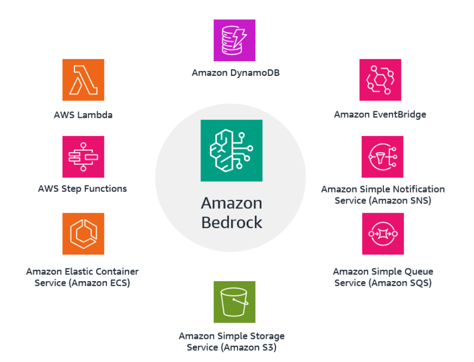
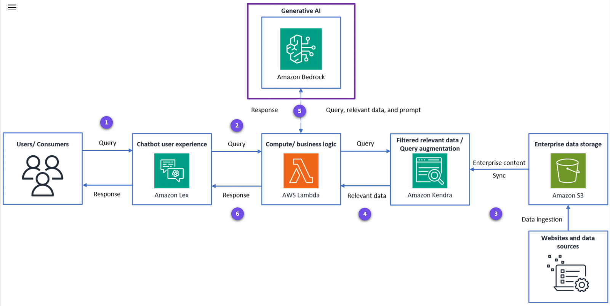
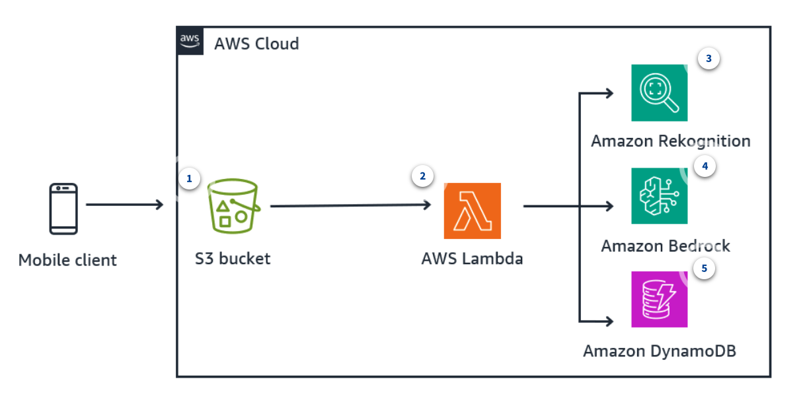
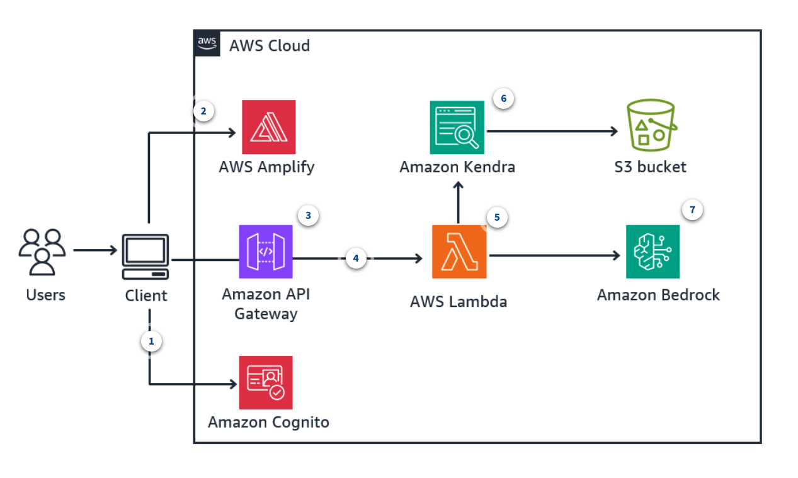
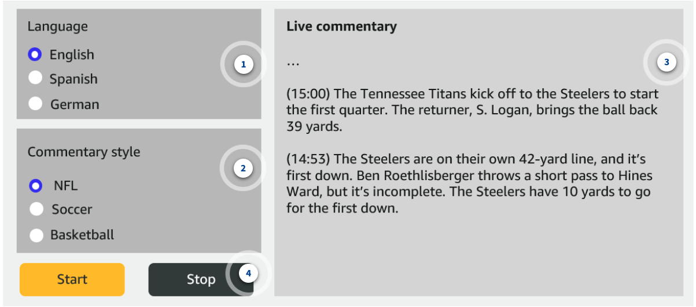
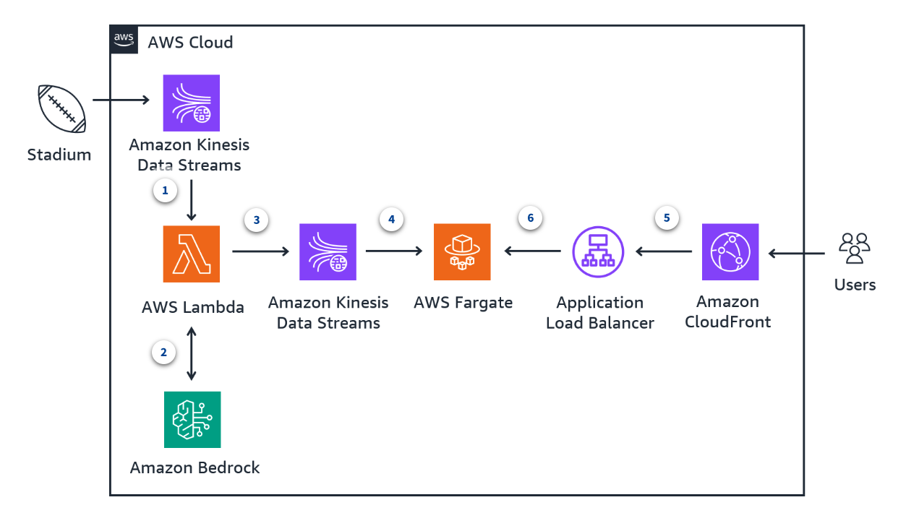
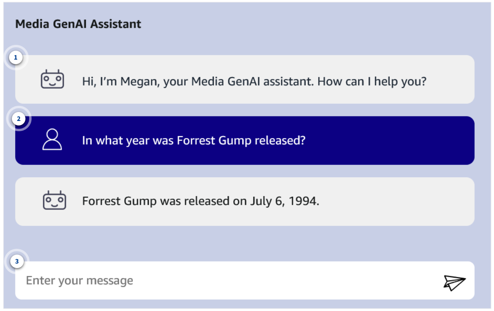
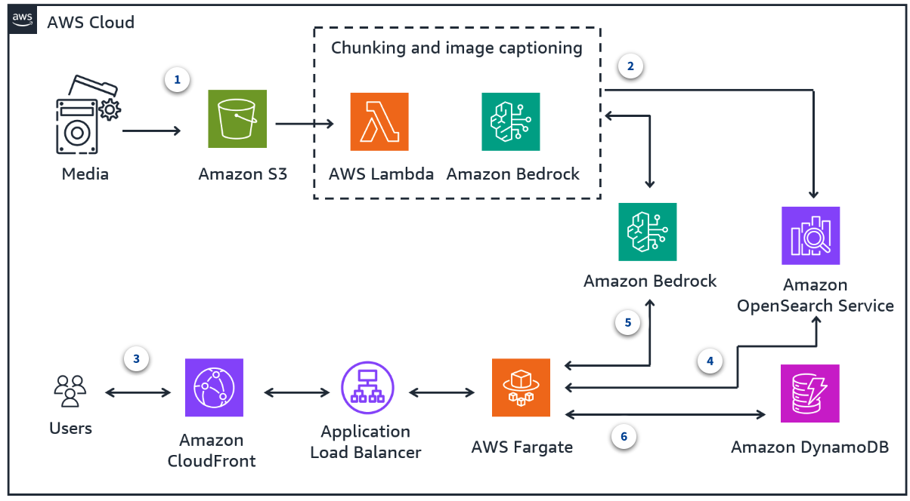
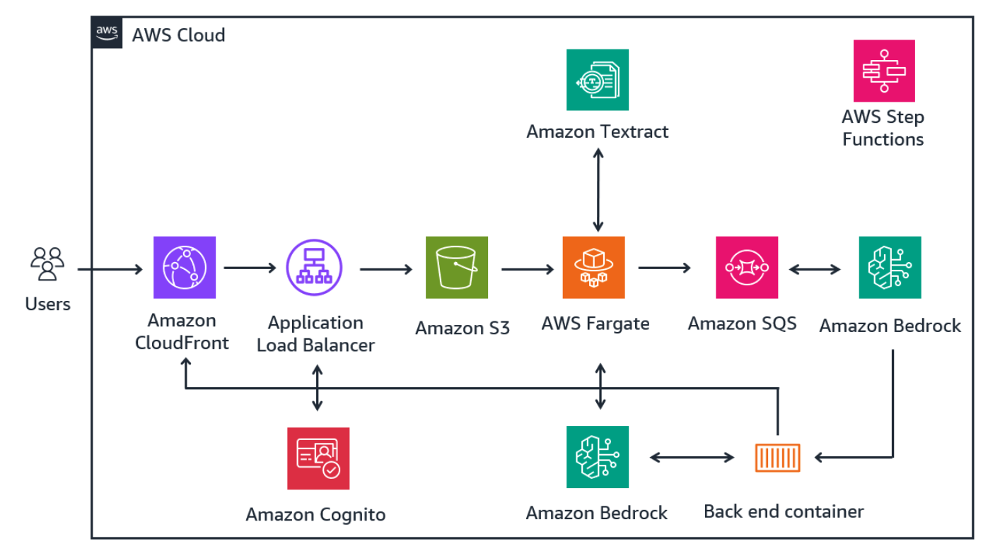

# Week 6: Developing GenAI Applications on AWS

* back to AWS Cloud Institute repo's root [aci.md](../aci.md)
* back to [AI for Developers](./ai-for-developers.md)
* back to repo's main [README.md](../../../README.md)

## Building Serverless Architectures

### Amazon Bedrock key service integrations for serverless architectures

Amazon Bedrock can use AWS serverless services to create event-driven, scalable, and cost-efficient architectures for your AI applications. Some examples of these services are AWS Lambda, Amazon API Gateway, Amazon DynamoDB, and AWS Step Functions. By abstracting away the complexities of managing infrastructure, cloud application developers can focus on writing business logic and delivering value to customers.



AWS services related to serverless computing. The central icon represents Amazon Bedrock. Surrounding it are icons for other various services. The icon for DynamoDB is at the top. Icons for Lambda, Step Functions, and Amazon Elastic Container Service (Amazon ECS) are on the left. Icons for Amazon EventBridge, Amazon Simple Notification Service (Amazon SNS), and Amazon Simple Queue Service (Amazon SQS) are on the right. There is also an icon for Amazon Simple Storage Service (Amazon S3) at the bottom.

### 1. AWS Lambda

By using Lambda functions for serverless computing, you can run code without provisioning or managing servers. Lambda functions can be used for various purposes, such as data processing, event handling, and API integrations.

### 2. Amazon DynamoDB

You can use DynamoDB to store and retrieve data generated by Amazon Bedrock models, such as model outputs, user inputs, or other application data. Use DynamoDB Streams for real-time processing of data changes.

### 3. AWS Step Functions

You can use Step Functions for building and coordinating serverless workflows. With Step Functions, you can stitch together multiple AWS services, including Lambda functions, into a business process or data processing pipeline.

### 4. Amazon ECS

You can use Amazon ECS for running and managing containerized applications. With Amazon ECS, you can deploy and scale Docker containers, making it more convenient to build and run microservices-based architectures.

### 5. Amazon S3

You can use Amazon S3 for object storage in serverless architectures. Use Amazon S3 to store and retrieve various types of data, such as application assets, media files, backups, and logs.

### 6. Amazon SQS

Use Amazon SQS for decoupling and scaling microservices, distributed systems, and serverless applications. Amazon SQS enables asynchronous message queuing, allowing components to communicate and process messages reliably.

### 7. Amazon SNS

Use Amazon SNS to build event-driven architectures and enable publish-subscribe messaging patterns. Amazon SNS can be used to send notifications, trigger Lambda functions, or integrate with other AWS services.

### 8. Amazon EventBridge

EventBridge is ideal for event-driven architectures. Use it to route events such as data updates to designated targets like Lambda functions or other services for further processing or triggering downstream actions.

### 9. API Gateway

Use API Gateway to create, publish, and manage RESTful APIs. API Gateway acts as the entry point for your applications, providing secure and scalable access to backend services like Lambda functions or Amazon ECS tasks.

### 10. Additional supporting services

* Amazon Comprehend

  Amazon Comprehend is a natural language processing (NLP) service that uses machine learning to extract insights and relationships from text. It can identify the language, entities, key phrases, sentiment, and more from documents, web pages, and other text-based content.

* Amazon Lex

  Amazon Lex is a conversational AI service for building voice and text chat-based AI assistant. It uses automatic speech recognition (ASR) and NLP to make it possible for AI assistants to understand and respond to human language. With Amazon Lex, developers can conveniently create engaging UIs for their applications.

* Amazon Transcribe

  Amazon Transcribe is an ASR service that converts speech to text. It can transcribe audio from a variety of sources, including customer service calls, audio files, and real-time streaming audio. Amazon Transcribe supports multiple languages and can identify speakers in a conversation.

* Amazon Translate

  Amazon Translate is a neural machine translation service that provides high-quality translation between a variety of languages. It uses deep learning models to provide accurate, natural sounding translations across domains like websites, apps, and documents.

* Amazon Rekognition

  Amazon Rekognition is a computer vision service that makes it convenient to add image and video analysis to applications. It uses deep learning models to identify objects, people, text, scenes, and activities. It can also detect inappropriate content and moderate image libraries.

* Amazon Textract

  Amazon Textract is a service that uses machine learning to automatically extract text, handwriting, tables, and other data from scanned documents and images. It can identify and capture data from forms, invoices, and other documents with high accuracy so that organizations can automate document processing workflows.

---

## Invoking Amazon Bedrock with a Lambda Function

---

### Amazon Bedrock with a Lambda Function Demo

The video described below explains how to invoke Amazon Bedrock using an AWS Lambda function, update the AWS SDK (`boto3`) to support Bedrock, and troubleshoot common issues.

---

#### 1. Prerequisites

* **Amazon Bedrock** enabled in your AWS account.
* Models already accessible in your AWS region (check in *Model Access* under the Bedrock console).
* Basic understanding of AWS Lambda functions.

---

#### 2. Setting up the Lambda Function

1. Go to the AWS Lambda console.
2. Create a new Lambda function using **Python 3.11** (example name: `my-bedrock-function`).
3. Add initial code:

```python
import boto3

def lambda_handler(event, context):
    bedrock = boto3.client(service_name="bedrock-runtime")
    prompt = "Write an article about a fictional planet Foobar."

    response = bedrock.invoke_model(
        modelId="model-id-here",
        accept="application/json",
        contentType="application/json",
        body=prompt.encode("utf-8")
    )

    return {
        "statusCode": 200,
        "body": response["body"].read().decode("utf-8")
    }
```

---

#### 3. Common Error: `Unknown service: bedrock-runtime`

If you run the function and see:

```text
Unknown service: bedrock-runtime
```

It means that the default AWS Lambda Python environment has an outdated version of `boto3` that doesn’t support Bedrock.

---

#### 4. Updating boto3 in AWS Lambda

##### Option 1: Using a Deployment Pipeline (SAM/CDK)

Update `requirements.txt`:

```text
boto3
```

Deploy your Lambda with the updated dependencies.

##### Option 2: Using a Lambda Layer (Quick Method)

1. **Open AWS CloudShell** in your AWS console.
2. **Create a workspace:**

    ```bash
    mkdir bedrock-layer && cd bedrock-layer
    mkdir python
    ```

    > The directory **must** be named `python`.

3. **Install latest boto3 into `python` folder:**

    ```bash
    pip3 install boto3 -t python
    ```

4. **Zip the contents:**

    ```bash
    zip -r bedrock-layer.zip python
    ```

5. **Publish the Lambda layer:**

    ```bash
    aws lambda publish-layer-version. --layer-name bedrock-layer --zip-file fileb://bedrock-layer.zip
    ```

6. **Copy the ARN** from the output.

7. **Attach the Layer to Your Lambda Function:**

    * Go to the Lambda function in the console.
    * Click **Layers → Add a layer → Specify ARN**.
    * Paste the ARN and click **Add**.

---

#### 5. Additional Configuration

* **Increase Execution Timeout:**
  * The default is **3 seconds**, which may be too short for generating large text.
  * Set it to at least **3 minutes** in your Lambda settings.

* **IAM Permissions:**
  * Your Lambda role must have permissions to call Bedrock:

  ```json
  {
      "Effect": "Allow",
      "Action": [
          "bedrock:InvokeModel"
      ],
      "Resource": "*"
  }
  ```

---

#### 6. Testing the Function

After attaching the layer and updating permissions:

1. Click **Test** in the Lambda console.
2. You should receive a generated article about the fictional planet *Foobar*.

---

#### 7. Resources

* [AWS Generative AI Community](https://community.aws/generative-ai)

---

**Summary:**  
By creating and attaching a Lambda layer with the latest version of boto3, you can successfully invoke Amazon Bedrock from an AWS Lambda function.

---

### How can you use Amazon Bedrock to architect a generative AI application?

The following architecture illustrates a cloud-based chat-based AI assistant solution powered by generative AI and enterprise data. This solution can converse with you in natural language while maintaining accuracy by including customer data.



1. **User query**

    Users or consumers query the chatbot through the UI, which is capable of understanding natural language.

2. **Compute and business logic**

    The query is processed and sent to the compute layer. The compute layer routes and orchestrates the request and response between relevant services based on the business logic and user query.

3. **Relevant data**

    The query is then augmented with relevant data that has been filtered. This data remains in sync with enterprise data stored and ingested from sources such as databases, websites, and file repositories.

4. **Query augmentation**

    The query, now augmented with the relevant enterprise data, is sent to the generative AI service Amazon Bedrock.

5. **Generative AI response**

    Amazon Bedrock uses foundation models (FMs) to get the query response and routes that response back to the compute layer.

6. **Response to user**

    The compute layer sends the response to the chatbot UI to provide a final natural language response to the users or consumers.

---

Architecture diagram with icons representing different AWS services and their interactions for a serverless application. The central icon is Amazon Bedrock which interacts with Lambda for compute and business logic. The flow starts from users and consumers issuing queries which are then processed by an event-driven service experience provided by Amazon Lex. This interacts with the compute and business logic component using Lambda after passing through Amazon Bedrock. Relevant data is fetched from Amazon Kendra, whereas enterprise content is stored in and ingested from Amazon S3. The architecture also includes components for enterprise data storage using DynamoDB and web and data sources.

---

## Reviewing Generative AI Application Architectures

### Questions to be asked when architecting generative AI solutions using Amazon Bedrock and other AWS services

* What are some alternative architectural approaches or service combinations that would achieve a similar outcome?
* Can you think of any additional features or enhancements that can be made to this architecture to improve its functionality or efficiency?
* How would you make sure that these architectures follow security best practices?

### Serverless multi-modal image text validation

#### Use case

Sometimes customers place orders at a restaurant when it is closed. A food delivery app might not notify the customer or the delivery driver. In these cases, the delivery driver captures images of restaurant operating hours as proof of closure to the customer and food delivery app. However, validating these claims can be challenging because of the variety of storefront signage, potentially leading to fraud.

#### Solution

The architecture uses AWS serverless services to validate restaurant operating hours from an image. It includes AWS Lambda, Amazon Rekognition, Amazon Bedrock, and DynamoDB. The solution automatically validates restaurant operating hours by analyzing images. This reduces the potential for fraud or disputes.



1. The process starts with a mobile client uploading an image and associated metadata to AWS.
2. The image upload event triggers a Lambda function. The Lambda function orchestrates calls to Amazon Rekognition and Amazon Bedrock.
3. The Lambda function calls the Amazon Rekognition DetectText API to extract text from the uploaded image of the restaurant's operating hours sign.
4. With the extracted text, the Lambda function invokes an Amazon Bedrock LLM to analyze the text and the current timestamp. It can then determine if the restaurant is open or closed at that time.

    The Amazon Bedrock LLM provides a detailed reasoning for its decision on whether the restaurant is open or closed.

5. Finally, the Lambda function saves the outcome (open or closed) along with the associated metadata in a DynamoDB database for further analysis or record-keeping.

---

### Serverless AI assistant

#### Use case

An educational institution has seen a significant increase in the volume and complexity of questions from students. This is especially because classes have shifted to a hybrid or fully online format in recent years. The institution requires a solution to assist students with course-related queries, assignment clarifications, or general learning support. Questions can include requests for information from course materials, textbooks, or educational resources.

#### Solution

In this example, you use general chat and Retrieval Augmented Generation (RAG) to build a generative AI-powered chat-based AI assistant. You use Amazon Bedrock to answer questions through pre-indexed content. For storing or indexing and retrieving relevant content, you use Amazon Kendra, a fully managed service that provides intelligent enterprise searches powered by machine learning. You use Lambda as the serverless compute for running the application code in an event-driven manner.



1. Users first authenticate themselves through Amazon Cognito, which handles user sign-up and sign-in, and issues access tokens and credentials for authenticated users.
2. Authenticated users interact with the chat-based AI assistant through a client application hosted on Amplify.
3. User questions are sent to Lambda functions through API Gateway, which acts as the entry point for the AI assistant's backend services.
4. Users can engage in two types of chat experiences:

    * **General chat**: Users ask general questions, and the chat-based AI assistant responds directly without additional context retrieval.
    * **RAG chat**: Users ask questions that require additional context or information from a document source.

5. This application uses two Lambda functions:

    * A general chat function that handles direct user questions and provides responses without requiring external context.
    * A RAG function that uses Amazon Kendra to retrieve relevant context from document sources based on the user's question. It then sends the retrieved context and question to the Amazon Bedrock LLM to generate a contextual response.

6. You use Amazon Kendra to retrieve relevant context or information from a document source to aid the LLM in generating a more informed response for RAG chat.
7. Amazon Bedrock hosts the LLM used for generating responses. The LLM receives the user's question, retrieved context (for RAG chat), and a prebuilt prompt to generate a relevant and contextual response. The response generated by the LLM is sent back to the client application through API Gateway and Amplify.

---

#### Amplify overview

This architecture uses AWS Amplify. Amplify is a set of tools and services that developers can use to build, deploy, and host full-stack web and mobile applications. Amplify streamlines the process of building cloud-powered applications by abstracting away the underlying infrastructure and providing a declarative programming model. It offers a range of features, including authentication, API management, storage, serverless functions, and hosting. All of these features can be effortlessly integrated into your application through a consistent and intuitive API. Amplify is designed to work seamlessly with popular front-end frameworks such as React and Angular. Developers can use these frameworks to focus on building their application logic instead of managing the underlying cloud infrastructure. For more information, see [AWS Amplify](https://aws.amazon.com/amplify/?gclid=CjwKCAjw8rW2BhAgEiwAoRO5rGGRxDrWs86mKC24id0rV_Tt69s0Q5uOfvaWGpWzo7OAvS6wELCiNhoCCIsQAvD_BwE&trk=66d9071f-eec2-471d-9fc0-c374dbda114d&sc_channel=ps&ef_id=CjwKCAjw8rW2BhAgEiwAoRO5rGGRxDrWs86mKC24id0rV_Tt69s0Q5uOfvaWGpWzo7OAvS6wELCiNhoCCIsQAvD_BwE:G:s&s_kwcid=AL!4422!3!646025317188!e!!g!!aws%20amplify!19610918335!148058249160).

---

## Using Generative AI To Create Live Sports Commentary

The following topics present sample use cases demonstrating the process of designing a generative AI application. You will review the problem statement and key requirements. Additionally, you will find a UI mockup showcasing a potential interaction flow and a technical architecture diagram outlining the AWS services involved in the solution. The goal is to provide a comprehensive example that illustrates the end-to-end process of designing a generative AI application, from defining the use case to architecting the solution.

### Live sports commentary application

#### Use case

Sports organizations use generative AI to enhance fan experiences during live events. Beyond traditional broadcasts, fans now engage through social media, live updates, and personalized content. This creates opportunities for creative fan engagement strategies. The following application uses generative AI to generate personalized game commentary from telemetry data, catering to individual preferences. Fans control the narrative style, enabling diverse experiences from a single data source. Additionally, the generative AI can draft post-game summaries, articles, and other content using aggregated game data, creating new avenues for fan engagement and content generation.

#### Application UI mockup

Through research on user preferences, you mocked up a potential UI for your application. You included language and commentary style options to cater to diverse audiences. The following graphic highlights key UI elements.



1. **Language selector**

    With language options, users can choose their preferred language for the live commentary.

2. **Commentary style selector**

    This selector lets users pick the style and format of commentary they prefer (for example, NFL, soccer, basketball). This creates a more tailored and relevant experience based on the sport they want to follow. Radio button patterns are familiar for making a single selection.

3. **Live commentary feed**

    Providing real-time text updates of the live sports action is the core functionality. Placing it centrally and with ample space allows it to be the main focus. The timestamp conventions (for example, 15:00) provide clear chronological context.

Image of a generative AI Sports Commentary Application. There are options to select Language (English, Spanish, German) and Commentary style (NFL, Soccer, Basketball). The live commentary section displays sample commentary text for an NFL game between the Tennessee Titans and the Steelers. The text details the kickoff return and an incomplete pass play. There are Start and Stop buttons below the live commentary area.

---

#### Application architecture design

The architecture solution for the live sports commentary application involves the following components:

* **Live game telemetry data ingestion**: To ingest the live game telemetry data as soon as it becomes available, you can use a streaming solution like Amazon Kinesis Data Streams. This service captures all the actions for downstream processing in real time as a continuous stream. The number of Amazon Kinesis data streams and shards required depends on the frequency of events created from the source and the number of events to be captured simultaneously.
* **Generative AI model inference**: The telemetry data is ingested into Kinesis Data Streams. A Lambda function is triggered to gather and analyze the input, transforming the data into a prompt for the generative AI model. The generative AI model then uses the prompt to generate commentary based on the analyzed telemetry data.
* **AI-generated commentary presentation**: The Lambda function then pushes the generated commentary into a target Kinesis data stream for downstream consumers, such as a web client or application, to present the commentary. This target Kinesis data stream allows additional downstream applications to subscribe to the generated commentary, enabling use cases like persisting to DynamoDB or Amazon S3 for archiving, replaying, or reselling purposes.



1. Live game telemetry data is generated and sent to Kinesis Data Streams. You invoke a Lambda function to process the incoming streaming data in batches.
2. Lambda transforms the stream event into a relevant data structure in JSON. The data is sent to a model in Amazon Bedrock to generate relevant sports commentaries.
3. Lambda publishes the sports commentary to Kinesis Data Streams for downstream consumption.
4. An AWS Fargate web application subscribes to Kinesis Data Streams as a consumer for the streaming event containing live commentaries. The commentaries are persisted locally in the container.
5. Users access the application hosted on Fargate through an Amazon CloudFront distribution fronting an Amazon Application Load Balancer.
6. Based on individual choices of commentary styles, the application hosted on Fargate retrieves the relevant commentaries to display on the UI.

## Creating a Generative AI Media Assistant

### Media library search application

#### Use case

This conversational AI assistant helps enterprises efficiently use and monetize their media assets. It enables natural language interactions, so that customers can discover content through intuitive queries.

For businesses with large media libraries, the assistant provides intelligent search and content recommendations. It can understand context, preferences, and visual cues to surface personalized content suggestions.

The key capabilities of this assistant include the following:

* Contextual conversations for natural media exploration, sustaining context, and allowing follow-up queries.
* Multi-modal search across text, images, videos, and other enterprise assets.
* Personalized recommendations based on natural language queries and user preferences.

#### Application UI mockup

For this application, you aimed for simplicity by focusing only on the core conversational experience between the user and the AI assistant. The UI uses different text styles, colors, and avatar icons to differentiate the AI assistant's responses from the user's inputs. This visual hierarchy helps clarify who is responding at each point in the conversation.



1. **Robot icon**

    The robot icon represents Megan, giving the AI a friendly visual identity that humanizes the conversational experience. An open-ended greeting prompts the user to initiate a conversation and ask a question.

2. **Example query**

    This example query demonstrates the type of media-focused question the AI can handle, related to movie release details.

3. **Message input field**

    In the text field, the user can freely type out their next query or message to continue the conversational flow with the AI assistant. The Send icon visually indicates that this is the control to submit the user's input message.

UI for a generative AI assistant named Megan. The UI has a chat interface with the human's query in a blue box and Megan's response in a grey box with her avatar icon. There is a text input field at the bottom for the user to enter new messages.

#### Architecture

This solution uses AWS services like Amazon Bedrock, along with serverless compute by using Fargate and Lambda. User interactions trigger NLP, multi-modal search, and recommendation logic backed by services like Amazon OpenSearch Service and Amazon DynamoDB. Amazon CloudFront enables global content delivery.



1. Users upload media data to Amazon S3. Data can include documents, images, and videos.
2. In this data ingestion step, you use Lambda to call FMs on Amazon Bedrock to generate captions and summaries, then ingest the metadata into OpenSearch Service.
3. Users access the application, hosted on Fargate through a CloudFront distribution that is in front of an Application Load Balancer.
4. The application invokes Amazon Bedrock and then finds the relevant media data in OpenSearch Service.
5. The application then creates a prompt with the user's query. It then asks an Amazon Bedrock LLM to generate a response.
6. The application stores the interaction in DynamoDB and returns the response to the user.

---

## Challenge: Summarizing Large Documents using Generative AI

### Generative AI large documents summarizer

#### Use case

This topic describes a generative AI application that analyzes and summarizes large documents into concise, coherent summaries. It uses LLMs to comprehend narrative elements and dialogues, and identify significant parts. This application is useful for generating summaries of large documents such as congressional hearings, movie synopses, and TV show episode guides. The application reduces high-quality summarization time from days or hours to seconds, drastically improving content production productivity.

#### Application architecture design

Following is a proposed architecture diagram for the generative AI application that analyzes and summarizes large documents into summaries. One consideration to keep in mind for this use case is that current LLMs have input limitations, restricting the amount of context they can process. In this architecture, you use Amazon Bedrock for summarization. Providing an entire large document to a model can exceed its input limit, causing unexpected errors. To address this challenge, you break down the context into manageable chunks by limiting the number of tokens in each invocation context. The given large document is divided into smaller, logical chunks based on paragraphs. Each document chunk is sent to the LLM to generate a fine-grained summary. These summaries are then combined to form the context for the final summary.



Users access an application through CloudFront and Application Load Balancer, which integrates with Amazon Cognito. From there, it depicts a flow where data is stored in Amazon S3, triggering Step Functions to orchestrate processing on Fargate using Amazon Textract service. The processed data is sent to an SQS queue, which is consumed by Lambda functions integrated with Amazon Bedrock instances. The output is sent to a backend service and finalized by another Amazon Bedrock instance. The final output is then delivered back to users through CloudFront using Step Functions.

1. Users access an application through a CloudFront distribution fronting an Amazon Application Load Balancer.
2. The Application Load Balancer redirects the user to Amazon Cognito for authentication.
3. Users upload a document using a web application hosted on Fargate. The document is stored in an S3 bucket.
4. Step Functions is triggered by the presence of the new document in the S3 bucket.
5. Step Functions orchestrates Fargate to extract text from the document using Amazon Textract.
6. Fargate splits the extracted document into smaller chunks and sends them to an Amazon SQS queue.
7. Step Functions initiates the consumption of document chunks from the SQS queue by LLMs hosted in Amazon Bedrock instances to perform the summarization task.
8. The summarized texts are sent back to Step Functions through the SQS queue.
9. Step Functions orchestrates a separate backend service to aggregate the summarized texts into a single document.
10. The aggregated document is sent to an LLM hosted in another Amazon Bedrock instance to summarize the text and generate the final summary.
11. The backend service receives the final summarized text from Amazon Bedrock.
12. Step Functions orchestrates the delivery of the final summarized text from the backend service to the CloudFront distribution.
13. The final summarized text is shown in a text box in the UI accessed through the CloudFront distribution.

#### Optional challenge

##### Some UX considerations when building conversational AI applications

* **Pen and paper** - You can start by sketching out your ideas the old-fashioned way. Freehand drawing on paper or a whiteboard is a great way to quickly explore different design alternatives.
* **Draw.io** - This is a free online diagramming tool used to build professional-looking wireframes. It has a wide range of shapes, icons, and design elements you can use.
* **Figma** - Figma is a powerful web-based interface design tool. It offers a free trial version you can use to create interactive wireframes and prototypes.
* **Framer** - Framer is a popular prototyping tool that also provides a free trial. It is great for building complex animated wireframes.
* **Adobe XD** - As part of the Adobe Creative Cloud, XD is a comprehensive design and wireframing solution. Like Figma and Framer, Adobe XD has a free trial available.

---

### [Lab: Integrating Amazon Bedrock FMs into an Application](./labs/W060Lab01IntegratingBedrockFmsIntoApp.md)

---

### [AWS SimuLearn: Extract Text from Docs](./labs/W062SimuLearn1ExtractTextFromDocs.md)

### Knowledge Check

#### Which command do you use to install the Boto3 library in a Python Lambda function?

* import boto3

Wrong answers:

* sqs = boto3.resource('sqs')
* lambda_function.lambda_handler
* import botocore

##### Explanation

`import boto3` is the command used to import the Python Boto3 library.

The other options are incorrect because:

* `sqs = boto3.resource('sqs')` is a line of code that creates an Amazon Simple Queue Service (Amazon SQS) resource client using Boto3, but it does not install the library itself.
* `lambda_function.lambda_handler(event, context)` is an example of the AWS Lambda function handler. It does not install the Boto3 library.
* `import botocore` imports the botocore library, which is a low-level library that Boto3 is built upon.

#### Which AWS service can be used to build and coordinate serverless workflows in your generative AI application?

* AWS Step Functions

Wrong answers:

* Amazon API Gateway
* Amazon EventBridge
* Amazon Simple Notification Service (Amazon SNS)

##### Explanation

You use Step Functions for building and coordinating serverless workflows.

The other options are incorrect because you use API Gateway to create, publish, and manage RESTful APIs. EventBridge is ideal for event-driven architectures. Use Amazon SNS to build event-driven architectures and enable publish-subscribe messaging patterns.

#### Which wireframing tool is the MOST appropriate way to quickly explore different design alternatives?

* Pen and paper

Wrong answers:

* Draw.io
* Figma
* Adobe XD

##### Explanation

Sketching or freehand drawing on paper or a whiteboard can help you to quickly explore different design alternatives in a convenient and flexible manner, without being constrained by digital tools.

The other options are incorrect because Draw.io, Figma, and Adobe XD are digital tools focused on building professional-looking wireframes and might require more setup and effort compared to pen and paper when quickly exploring different alternatives.

### Additional resources

* [AWS Architecture Icons](https://aws.amazon.com/architecture/icons/)
* [AWS public documentation](https://docs.aws.amazon.com/)

### Summary

#### Building Serverless Architectures

The following are some of the services you can use with Amazon Bedrock in a serverless architecture.

* AWS Lambda
* Amazon DynamoDB
* AWS Step Functions
* Amazon ECS
* Amazon S3
* Amazon SQS
* Amazon SNS
* Amazon EventBridge
* Amazon API Gateway

#### Additional AI supporting services include the following:

* Amazon Comprehend
* Amazon Lex
* Amazon Transcribe
* Amazon Translate
* Amazon Rekognition
* Amazon Textract
