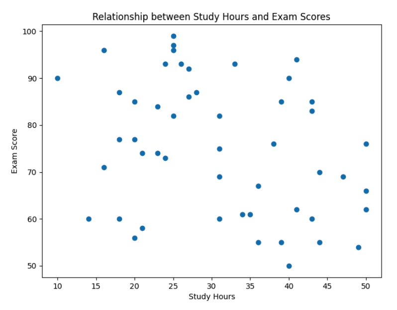

# Week 7: Using Amazon Bedrock for Data Visualization and Analysis

* back to AWS Cloud Institute repo's root [aci.md](../aci.md)
* back to [AI for Developers](./ai-for-developers.md)
* back to repo's main [README.md](../../../README.md)

## Data Analysis and Visualization

### Tools for data analysis and visualization

* Amazon Q Developer

    Amazon Q Developer is a versatile tool that integrates with integrated development environments (IDEs). It streamlines the process of importing, preparing, and optimizing data for sophisticated analysis and visualization. Complemented by its intelligent code assistance features, this solution equips developers with the essential capabilities to perform data-driven tasks with unmatched efficiency and precision.

* Amazon Bedrock

    Amazon Bedrock is a platform that enables developers to effortlessly integrate advanced data analysis and visualization capabilities powered by large language models (LLMs) into their software solutions. This powerful integration unlocks opportunities for developers to uncover profound insights and create applications with unprecedented impact.

* pandas

    pandas is an open source Python library that provides data structures and data analysis tools for working with structured (multidimensional, tabular, potentially heterogeneous) and time-series data. It allows you to efficiently read, clean, transform, and analyze large datasets. The pandas library's powerful data manipulation capabilities, combined with its integration with other data science libraries, like Matplotlib and Seaborn, make it a go-to tool for software developers who work with complex data and data-driven solutions.

* Matplotlib

    Matplotlib is an open source Python library that can create static, animated, and interactive visualizations. It provides a wide range of plotting functions and tools that allow users to create high-quality, publication-ready plots, ranging from simple line plots to complex, multi-panel figures. By using Matplotlib, developers can transform raw data into insightful and appealing visualizations, which are essential for data exploration, presentation, and communication.

* Seaborn

    Seaborn is an open source, high-level data visualization library built on top of Matplotlib. It provides an elevated aesthetically pleasing and user-friendly interface for creating attractive and informative statistical graphics. It offers a wide range of plot types, such as scatter plots, line plots, bar plots, heatmaps, and distribution plots, with a focus on highlighting patterns and trends in data.

---

The ability to effectively use data has become a vital skill in today's business world. As a cloud application developer, understanding how to analyze and visualize data can open the door to a world of possibilities, empowering you to do the following:

* Make informed decisions
* Uncover valuable insights
* Create impactful software solutions

#### Make informed decisions

A software team developing a mobile app can use data analysis and visualization to study user behavior, such as tracking user flow, identifying pain points, and understanding user engagement. This data can inform product roadmaps, UI/UX design decisions, and feature prioritization.

Team having a conference discussing user behavior trends.

#### Uncover valuable insights

A software team working on an Internet of Things (IoT) solution for industrial equipment can use data analysis and visualization to predict equipment failures, recommend preemptive maintenance, and improve overall equipment effectiveness. 

#### Create impactful software solutions

A software team working on a healthcare application can use data analysis and visualization to identify patterns in patient data, predict disease progression, and provide personalized treatment recommendations, leading to better patient outcomes.

---

### Types of data visualizations

* **Bar plot**

  * **Purpose:** To show and compare the magnitudes of categorical variables using bars.
  * **Use cases:** Presenting the counts, percentages, or mean values of different categories; comparing values across groups.

  

* **Categorical bar plot**

  * **Purpose:** To show and compare the magnitudes of a numerical variable across different categories using bars.
  * **Use cases:** Presenting the means, totals, or other summary statistics of a numerical measure for different groups; comparing values across categories.

  

* **Categorical scatter plot**

  * **Purpose:** To show the relationship between a numerical variable and a categorical variable by plotting the numerical values for each category.
  * **Use cases:** Exploring how a numerical measure varies across different categories; identifying

  

* **Clustermap**

  * **Purpose:** To show a heatmap with hierarchical clustering applied to rows or columns (or both), revealing patterns and groupings in data.
  * **Use cases:** Exploring and identifying clusters or groupings; understanding relationships and patterns in data.

  

* **Heatmap**

  * **Purpose:** To show the values of a 2D matrix or grid of data using a color-coded scheme, where the color intensity represents the magnitude of each value.
  * **Use cases:** Visualizing and comparing the values in a 2D dataset, such as a correlation matrix, product-customer matrix, or any other 2D categorical or numerical data.

  

* **Line plot**

  * **Purpose:** To show the trend of a numerical variable over time or along an ordered x-axis.
  * **Use cases:** Visualizing time-series data; tracking changes in a metric over time; comparing the trends of multiple variables.
  
  

* **Pie plot**

  * **Purpose:** To show the numerical proportion of different parts of a whole.
  * **Use cases:** Visualizing proportional data, comparing categorical data, presenting part-to-whole relationships, or analyzing survey or demographic data.

  

* **Regression plot**

  * **Purpose:** To show the linear, polynomial, or other fitted trend line that best describes the relationship between two numerical variables.
  * **Use cases:** Visualizing and assessing the strength and nature of the linear or nonlinear relationship between predictor and response variables; making predictions.

  

* **Residual plot**

  * **Purpose:** To visualize the residuals (differences between observed and predicted values) from a regression model to assess the model's fit.
  * **Use cases:** Checking for linearity, equal variance, and independence of residuals; identifying potential issues with the regression model.

  

* **Scatter plot**

  * **Purpose:** To show the relationship between two numerical variables by plotting individual data points on a 2D coordinate system.
  * **Use cases:** Exploring the strength and direction of the linear relationship between two variables; identifying patterns, clusters, or outliers.

  

---

## Comparing Determinism and Nondeterminism

* Nondeterministic systems can help improve deterministic ones.

### Determinism

Determinism refers to the ability to produce the same output for a given input. You put something in, and you can reliably predict the result that comes out, like a calculator. This predictability is crucial in situations where consistency and reliability are key.

### Nondetermisim

Nondeterminism embraces the power of randomness and unpredictability. These systems can produce different outputs for the same input, like rolling dice or flipping a coin. Generative AI is inherently nondeterministic. When you access a model in Amazon Bedrock, you are using a nondeterministic system.

### Reliable accuracy vs flexibility and adaptability

#### Determinism use cases

* Tax software and performing tax calculations
* A medical device to deliver medication directly to you, the dosage numbers must be accurate
* In the aerospace industry, determinism is needed when planning the arrivals and departures of thousands of flights

#### Nondeterminism use cases

* Consider the tax software example. Given proper direction, generative AI can create thousands of test households with varying degrees of tax complexity in a fraction of the time it would take a person to do the same. These test households could then be used to test the accuracy of the software.
* The medical device and aerospace programs could be tested with test data, as well. In addition to creating test data, generative AI can help interpret or create nondeterministic systems.

---

Generative AI can help interpret complex information, such as financial models, which are deterministic, and identify trends for a user. Amazon Bedrock and Amazon Q Developer can take generated insights and combine them with a deterministic financial model, such as rule-based systems. This ensures the output remains predictable and controllable.

To accomplish this task, Amazon Bedrock creates deterministic algorithms. For example, it could create a Python script using the pandas library. Then, Amazon Bedrock runs this script on behalf of a user.

---

To summarize, determinism is all about consistency and reliability, while nondeterminism harnesses the power of flexibility and adaptability. Both have their place in software development and AI, depending on the problem you're trying to solve.

---

* Determinism and nondeterminism are both useful for data analysis, but they have different strengths and should be used for different tasks.

  A robot painting an image at an easel and then walking to another easel and painting the exact same image. A deterministic system is like a robot that follows a set of rules to get the job done. It's very predictable and reliable. If you give it the same information, it will always give you the same answer.

* Nondeterministic generative AI is more like a curious kid who learns from experience. This type of system is more flexible and can adapt to new situations. However, it's less predictable. It might give you slightly or even drastically different outputs even if you give it the same information.

  A robot painting an image at an easel and then walking to another easel and painting something different

---

It is important to remember that generative AI is inherently nondeterministic.

---

### Deterministic algorithms

Use when you have data that meets all or some of the following criteria, it is: 

1) well known,
2) used in low to medium complexity tasks,
3) has a non-changing dataset, and
4) requires accuracy and reliability. The following are some examples:

    * Software that performs financial calculations such as account totals.
    * Mission-critical software such as the ones that map out arrivals and departures for airports.

### Nondeterminism

Use nondeterminism when you need:

1) adaptability and flexibility;
2) have unknown, possibly changing datasets; and
3) are performing medium to high complex tasks. The following are some examples:

    * Climate research team must create test data to run through climate pattern probabilistic prediction software
    * Store needs to analyze complex data, such as consumer behavior, to identify trends and make recommendations

---

### Summarizing the differences

The following table compares determinism and nondeterminism

| | Determinism | Nondeterminism |
| -------------------- | -------------------- | -------------------- |
| Flexibility | Limited flexibility, can only handle tasks it was specifically programmed to do | Higher flexibility, can adapt to new situations and learn from experience |
| Predictability | Highly predictable, same output for a given input every time | Less predictable, especially when inference parameters are adjusted for higher temperature, Top P, and Top K |
| Use cases | Tasks where accuracy is needed, like medication dosage | Tasks where variance is needed, like creating test data for software |

---

## Using Nondeterministic Generative AI in Deterministic Systems

### Human-in-the-loop

Consider the following scenario.

* User having a chat session with a chatbot on a tablet.

You open a chat session driven by AI on your trading platform. You ask the chat assistant questions about AnyCompany's stock, such as its current price and performance over the last day, month, and year. During this process, the assistant uses generative AI to create a conversational tone.

You learn that the stock is doing well, and you would like to purchase some. You ask the chat assistant to purchase 10 AnyCompany stocks. Before it completes the purchase, it presents you with a purchase order and asks you to confirm that you would like to complete the purchase.

* User reviewing stock price on their tablet.

This back and forth between human and AI is referred to as **human-in-the-loop (HITL)**. When used, a human is actively involved in the AI system's operation to provide guidance, feedback, or oversight. This approach aims to pair the complementary strengths of humans and AI to achieve better outcomes.

Human-in-the-loop is one way determinism can be introduced into nondeterministic generative AI.

---

### Using nondeterministic generative AI for data analytics

Nondeterministic generative AI can be used to perform data analytics on models that contain deterministic algorithms by introducing an element of randomness or uncertainty into the process.

This can help to uncover patterns, identify edge cases, and explore the parameter space of the deterministic model in a more comprehensive way. By using the exploratory power of generative AI, analysts can gain deeper insights and potentially identify areas for improvement or optimization in deterministic algorithms.

Explore some examples of how this could happen in different industries.

#### Aerospace sensitivity analysis

Sensitivity analysis involves systematically varying the input parameters of a deterministic model to understand how changes in these inputs affect the model's outputs. By applying a nondeterministic approach, such as randomly sampling the parameter space, analysts can gain a more comprehensive understanding of the model's behavior and identify the most critical factors that drive the model's performance.

In the aerospace engineering domain, sensitivity analysis using nondeterministic techniques can provide valuable insights into the behavior of deterministic aerodynamic models. For example, aerospace engineers might use these methods to understand how changes in aircraft design parameters, such as wing shape or engine thrust, affect the performance and stability of their computational fluid dynamics (CFD) models.

The engineers would begin by retrieving the relevant simulation data and model parameters from their engineering software or simulation environment. They could use Amazon Q Developer to help build custom machine learning (ML) models, to introduce nondeterministic elements into their analysis. Using Amazon Q Developer, the engineers could randomly sample from probability distributions of the design parameters to generate a range of possible scenarios. This allows them to systematically explore how the deterministic aerodynamic models respond to variations in the input variables.

As the nondeterministic analysis progresses, the engineers review the results and provide feedback to the process. They might perform the following actions:

* **Validate the model's predictions:** The engineers can compare the nondeterministic model's outputs to their own domain knowledge and the results of the deterministic aerodynamic models to ensure the analysis is on the right track.
* **Identify areas where deterministic algorithms are sensitive to changes:** By analyzing the variations in the nondeterministic model's predictions, the engineers can pinpoint the design parameters that have the most significant impact on the model's performance and stability.
* **Suggest more ways to investigate critical design factors:** Based on the insights gained from the nondeterministic analysis, the engineers can recommend new scenarios or experiments to explore the most critical aspects of the aircraft design.

This iterative, collaborative approach enables the engineers to achieve the following:

* Gain a deeper understanding of the deterministic aerodynamic models
* Uncover potential vulnerabilities or areas for optimization
* Make more informed decisions about the aircraft design

By using the complementary strengths of human expertise and nondeterministic data exploration facilitated by Amazon Q Developer, the aerospace team can enhance the reliability and performance of their final aircraft designs.

#### Checkout issues troubleshooting

After receiving several tickets about checkout issues on their company's ecommerce platform, a developer retrieves the relevant Amazon CloudWatch logs. To analyze the logs, the developer decides to use the capabilities of Amazon Q Developer and feeds the log data to the service. The developer could do this in several ways.

* **File content sharing:** They could copy and paste the contents of the log file directly into the conversation. This works well for smaller log files.
* **Sample data:** If the log file is large, they could share a representative sample of the log entries, including different types of log messages they're interested in analyzing or the  timestamp for when the error occurs.
* **File structure description:** They could describe the structure of the log file, including the format of log entries, types of information recorded, and any specific patterns or issues they are looking to analyze.
* **Programmatic approach:** They could write a script to read and process the log file, then share relevant parts or statistics from it. The following script counts the number of errors and warnings in a log file. They could run this and share the results, or modify it to extract other relevant information from the log file. They can even have Amazon Q Developer help write a script that achieves their end goal.

```python
import re
def analyze_log_file(file_path):
    error_count = 0
    warning_count = 0

    with open(file_path, 'r') as file:
        for line in file:
            if re.search(r'\bERROR\b', line, re.IGNORECASE):
                error_count += 1
            elif re.search(r'\bWARNING\b', line, re.IGNORECASE):
                warning_count += 1  
    return error_count, warning_count

# Usage
log_file_path = 'path/to/your/logfile.log'
errors, warnings = analyze_log_file(log_file_path)
print(f"Errors: {errors}, Warnings: {warnings}")
```

The developer could also choose to use one of the large language models (LLMs) available in Amazon Bedrock to assist with the log analysis. The LLM could process the logs and help with the following:

* **Data interpretation:** It can help interpret patterns, identify anomalies, and draw insights from the information.
* **Analysis guidance:** It can suggest approaches and techniques for log analysis based on the type of logs and the information the developer is looking to extract.
* **Code assistance:** It can help write or improve deterministic Python scripts (or scripts in other languages) to parse, analyze, and visualize log data.
* **Problem-solving:** If the developer is investigating specific issues or errors in a log, it can help the developer understand what the log entries mean and suggest potential solutions.
* **Best practices:** It can provide advice on log management, including how to structure logs for easier analysis, what information to include, and how to set up effective monitoring.
* **Visualization suggestions:** It can recommend ways to visualize the log data to make patterns and trends more apparent.

As the LLM-powered analysis progresses, the developer can provide feedback and guidance, much like in the Amazon Q Developer scenario. The LLM can then refine its understanding and generate new insights, further informing the developer's troubleshooting efforts.

With the insights gained from the generative AI-powered log analysis, the developer can now prioritize the most likely causes of the issue and test potential solutions, such as making changes to the application code, adjusting infrastructure configurations, or implementing monitoring and alerting mechanisms.

#### Financial portfolio optimization

As the financial markets continue to evolve, effective portfolio management is becoming increasingly complex. Investors must balance risk, returns, and a myriad of market factors to build a resilient investment strategy. While financial calculations and activities are deterministic, nondeterministic generative AI can assist in portfolio optimization.

Using an Amazon Bedrock LLM, financial advisors can ingest clients' current asset allocations, risk preferences, and investment objectives. The model then analyzes a vast array of market data, economic indicators, and historical performance to simulate various scenarios and recommend optimal portfolio adjustments.

With the insights gained from the model's analysis, the advisors can now prioritize the most impactful changes, such as reallocating funds, adjusting asset weightings, or introducing new investment vehicles. By combining the computational power of the model with their own financial expertise, advisors can create tailored investment strategies that align with their clients' goals and risk tolerances.

Additionally, Amazon Bedrock LLMs can help with risk management. By running stress tests and simulating market fluctuations, the model can provide valuable insights into the potential vulnerabilities of client portfolios. Using this information, advisors can proactively implement risk mitigation strategies, such as diversification or hedging, to safeguard their clients' investments against unforeseen events.

Through this seamless integration of human expertise and AI-driven analysis, advisors can help their clients navigate the complex financial landscape with greater confidence and make more informed investment decisions.

---

### Using nondeterministic generative AI to create deterministic algorithms

Incorporating nondeterministic generative AI techniques can assist in the development of deterministic algorithms. Generative AI models have shown some ability to be more efficient than humans in some contexts. By using generative AI during the algorithm development process, and iteratively refining the outputs based on human expertise, the resulting deterministic algorithms might become more adaptable and better suited for real-world applications.

#### Adaptive cybersecurity defense systems

Security teams can use an LLM available in Amazon Bedrock to create deterministic algorithms for threat detection, incident response, and security policy enforcement using nondeterministic generative AI.

The security team can fine-tune an Amazon Bedrock-hosted LLM model to simulate various cyberattack scenarios, network configurations, and user activities. This nondeterministic generative model can then propose candidate algorithms that can detect and mitigate these threats in real time.

As the LLM-powered generative model creates new algorithm proposals, the cybersecurity experts can review the outputs and provide feedback directly through the Amazon Bedrock interface. The experts might validate the model's assumptions, identify areas of vulnerability that the generated algorithms should address, and suggest additional attack scenarios or network conditions to consider.

With input from security experts, the model can refine the deterministic algorithms, ultimately helping the team build a more robust and adaptable security defense system. This collaborative approach between the LLM-based generative model and the human experts enables the security team to develop tailored solutions that can effectively detect, respond to, and mitigate evolving cyber threats.

#### Adaptive traffic management systems

Urban planners and transportation authorities can use an Amazon Bedrock LLM to employ nondeterministic generative AI in creating deterministic algorithms for traffic signal optimization, dynamic pricing, and multimodal transportation coordination.

Using Amazon Bedrock, the authorities can access a generative AI model that simulates various traffic patterns, weather conditions, and user behaviors. This nondeterministic model can then generate candidate algorithms that can respond to these real-time changes in the traffic ecosystem.

As the generative model proposes new algorithms, the human experts can review the outputs and provide feedback to the model. They might validate the model's assumptions, identify areas where the generated algorithms could be further optimized, and suggest additional simulations or parameters to explore.

Based on the experts' guidance, the model can refine its algorithms, ultimately creating deterministic systems that effectively manage urban mobility and reduce congestion. The iterative, collaborative process between the model and the human experts allows the transportation authorities to develop adaptive traffic management solutions tailored to the unique challenges of their city.

#### Optimized supply chain planning

Supply chain managers can use Amazon Q Developer to employ nondeterministic generative AI in creating deterministic algorithms for inventory management, transportation routing, and distribution optimization.

Using Amazon Q Developer and Amazon Bedrock, a supply chain team can build a generative AI model that simulates various demand patterns, supplier disruptions, and logistical constraints. This nondeterministic model can then propose candidate algorithms that can adapt to these dynamic supply chain scenarios.

As the generative model creates new algorithm proposals, the supply chain experts can review the outputs and provide feedback. They might validate the model's assumptions, identify areas where the generated algorithms could be further optimized, and suggest additional simulations or parameters to explore.

By incorporating the supply chain experts' guidance, Amazon Q Developer can refine the deterministic algorithms, ultimately helping the firm develop solutions that ensure resilient and efficient supply chain operations. This collaborative approach between the Amazon Q Developer-powered generative model and the human experts enables the supply chain managers to create tailored, adaptable algorithms that can navigate the complexities of modern supply chains.

---

### Knowledge Check

#### Which type of data visualization shows a 2D matrix of data and indicates the magnitude of each data point using color intensity?

* Heatmap

Wrong answers:

* Scatter plot
* Regression plot
* Line plot

##### Explanation

Heatmaps show the values of a 2D matrix or grid of data using a color-coded scheme, where the color intensity indicates the magnitude of each value.

The other options are incorrect because of the following reasons:

* **Scatter plot:** These plots shows the relationship between two numerical variables by plotting the data points on a 2D coordinate system.
* **Regression plot:** These plots show the linear, polynomial, or other fitted trend line that best describes the relationship between two numerical variables.
* **Line plot:** These plots show the trend of a numerical variable over time or along an ordered x-axis.

#### A message board uses generative AI to help moderate its content. When the AI finds a post that might go against the board's terms of service, it notifies a content moderator. The content moderator then determines the action that must be taken. What is this an example of?

* Human-in-the-loop

Wrong answers:

* Fully automated moderation
* Unsupervised learning
* AI-driven content curation

##### Explanation

Human-in-the-loop is when humans actively collaborate with AI systems, reviewing and refining the information, suggestions, or preliminary decisions before a final outcome is reached. This combines the complementary strengths of humans and machines.

The other options are incorrect because of the following:

* **Fully automated moderation:** The scenario is not an example of fully automated moderation, as the process involves a human content moderator reviewing the flagged content and determining the appropriate action.
* **Unsupervised learning:** The scenario does not involve unsupervised learning, but rather a combination of AI-assisted detection and human decision-making.
* **AI-driven content curation:** While the generative AI is used to help moderate the content, the scenario is more focused on content moderation and enforcement, rather than pure content curation.

#### Which scenario is an example of using nondeterministic generative AI to create deterministic algorithms?

* A machine learning model uses synthetic data to create a real-time financial fraud detection system.

Wrong answers:

* A music composition AI creates multiple unique melodies and harmonies for a new song.
* A language model generates various options for the next word in a sentence.
* A computer-aided design (CAD) tool uses an AI system to create multiple complex, organic-looking 3D models from a single prompt.

##### Explanation

This is an example of using nondeterministic generative AI data to create a deterministic algorithm.

The other options are incorrect because of the following reasons:

* Nondeterministic generative AI is needed to create multiple new melodies and harmonies for a song.
* Since the language model suggests various options for next words, it is inherently nondeterministic.
* Nondeterministic AI is needed to create multiple organic 3D models from a single prompt.

### Summary

#### Tools for data analysis and visualization

The following tools can help you analyze and visualize data:

* **Amazon Bedrock:** The large language models (LLMs) available in Amazon Bedrock can help developers access advanced data analysis and visualization capabilities, and uncover insights in data.
* **Amazon Q Developer:** This code assistant can help import and prepare data for analysis.
* **Matplotlib:** This open source Python library helps developers create static, animated, and interactive visualizations.
* **pandas:** This open source Python library provides data structures and data analysis tools.
* **Seaborn:** This open source, high-level visualization library is built on top of Matplotlib and provides out-of-the-box visualizations.

#### Determinism and nondeterminism

Generative AI is inherently nondeterministic. It can, however, aid people in analyzing and improving deterministic systems. The following table compares these two concepts.

| | Determinism | Nondeterminism |
| -------------------- | -------------------- | -------------------- |
| Flexibility | Limited flexibility, can only handle tasks it was specifically programmed to do | Higher flexibility, can adapt to new situations and learn from experience |
| Predictability | Highly predictable, same output for a given input every time | Less predictable, especially when inference parameters are adjusted for higher temperature, Top P, and Top K |
| Use cases | Tasks where accuracy is needed, like medication dosage | Tasks where variance is needed, like creating test data for software |

#### Human-in-the-loop

When using generative AI technology, like a chat assistant, human input is sometimes needed for definitive tasks, like making purchases. This back and forth between human and AI is referred to as human-in-the-loop (HITL).

---

## pandas Overview

pandas is an open source Python package that is built on top of Numerical Python (NumPy). NumPy is an open source Python library that provides support for large, multidimensional arrays and matrices, along with a vast collection of high-level mathematical functions to operate on these arrays. NumPy integrates with many other Python libraries. pandas offers the following benefits:

* pandas offers user-friendly data structures and analysis tools for working with time-series data and numeric data.
* pandas functions well with various other data science Python modules, such as NumPy and Matplotlib.
* pandas used with NumPy and Matplotlib offers users a powerful tool for performing data analytics and visualization.

You install pandas using **pip**, as shown in the following snippet.

```sh
pip install pandas
```

You then access the library using the **import** command, as shown in the following snippet.

```python
import pandas as pd
```

#### pandas code example

```python
import pandas as pd

# Create a Python list of movie genres
genres_list = ['Action', 'Romantic']
# Create a pandas Series from the list
genres_series = pd.Series(genres_list)
print(genres_series)
```

* **Output**

```output
0      Action
1    Romantic
dtype: object
```

### pandas DataFrame

Data analysis is a crucial aspect of modern decision-making processes. And Python's pandas library offers a powerful tool that can greatly enhance your data analysis capabilities – the DataFrame. DataFrames are user friendly and offer many functions for data analysis.

DataFrames are two-dimensional, tabular data structures that let you store and manipulate data in a highly efficient and intuitive manner. With DataFrames, you can load, clean, transform, and analyze large datasets, making it an indispensable tool for data scientists, analysts, and researchers.

Whether you're working with structured data from databases, semi-structured data from web scraping, or unstructured data from various sources, DataFrames provide a flexible and robust framework for handling and exploring your data.

With DataFrames, you can discover valuable insights, identify patterns, and make data-driven decisions that can drive innovation and success in your field.

```python
import pandas as pd
airlines_data = {
    "Airline": ['Airline 1', 'Airline 2', 'Airline 3', 'Airline 4'],
    "Passengers": ['402', '370', '367', '398'],
    "Baggage": ['580', '701', '432', '508']
}

df = pd.DataFrame(airlines_data)
print(df)
```

* **Output**

```output
     Airline Passengers Baggage
0  Airline 1        402     580
1  Airline 2        370     701
2  Airline 3        367     432
3  Airline 4        398     508
```

---

#### Ways to create DataFrames using different constructor methods

Here're some examples:

| Creation routine | Data source | Constructor method |
| ---------------- | ----------- | ------------------ |
| Empty | intrinsic | df = pd.DataFrame() |
| From preexisting data | list of lists | df = pd.DataFrame(data) |
| From a Python dictionary | key-value pairs | df = pd.dataframe({ key: value, key: value }) |

#### Creating an empty DataFrame

```python
import pandas as pd

# Create an empty DataFrame.
df = pd.DataFrame()

# Print the DataFrame.
print(df)
```

```output
Empty DataFrame
Columns: []
Index: []
```

#### Creating a DataFrame using preexisting data

You can also create a DataFrame using a list of lists,  and perform operations such as indexing, describing, and visualizing the data. In the following code block, you can observe a DataFrame of airline company names.

To index or locate a row in the DataFrame, pass the index value through the print(variable.loc[]) function. In the following output, you can see see loc[2] returns the third row. To view more than one row, use print(variable.loc[ : ]).

```python
import pandas as pd
# Create a list of lists
airline_data = [['Airline1', 'Domestic', 100],
        ['Airline2', 'International', 200],
        ['Airline3', 'Domestic', 150],
        ['Airline4', 'International', 300],
        ['Airline5', 'Domestic', 120],
        ['Airline6', 'International', 250]
]

# Create a DataFrame from the list of lists
df = pd.DataFrame(airline_data, columns=['Airline', 'Type', 'Passengers'])

# Print the DataFrame
print('Airline Data:', df)

# Print the third row
print('Third row:', df.loc[2])

# Use slicing to print the range of rows
print('Range of rows:', df.loc[2:4])
```

```output
Airline Data:     Airline           Type  Passengers
0  Airline1       Domestic         100
1  Airline2  International         200
2  Airline3       Domestic         150
3  Airline4  International         300
4  Airline5       Domestic         120
5  Airline6  International         250
Third row: Airline       Airline3
Type          Domestic
Passengers         150
Name: 2, dtype: object
Range of rows:     Airline           Type  Passengers
2  Airline3       Domestic         150
3  Airline4  International         300
4  Airline5       Domestic         120
```

---

The output of .loc[2:4] returns the start and stop values, meaning that all values are included, unlike slicing in NumPy, which does not include the stop value.

---

#### Creating a DataFrame from a Python dictionary

Python dictionaries are a built-in data structure used to store key-value pairs. Dictionaries are versatile and efficient, allowing for quick access to data based on a unique key. Unlike lists or arrays, which are indexed by numbers, dictionaries use keys that can be strings, numbers, or other immutable data types. Each key in a dictionary is associated with a corresponding value, which can be any data type, including lists, strings, Booleans, or even other dictionaries.

In the following example, the dictionary has four key-value pairs, where the keys are strings and the values can be of different data types, such as string, integer, and list.

| Dictionary = { | key: | value } |
| -------------- | ------------- | ------------- |
|                | "name" | "John Doe" |
|                | "age" | "35" |
|                | "occupation" | "Software engineer" |
|                | "hobbies" | ["reading", "hiking", "photography"] |

Dictionaries differ from pandas Series because dictionaries are indexed by *keys*.

* Keys are unique identifiers that cannot be duplicated.
* A key can be any immutable type, such as another string or an integer.
* A key cannot be a list because lists are mutable, meaning they can be indexed or sliced.

```python
import pandas as pd # The pandas library is imported.

# Define a dictionary containing airline origin information.
airline_origin = { # A dictionary named airline_origin is defined that contains information about different airlines, their origins, and flight numbers.
"Airline": ['Airline1', 'Airline2', 'Airline3', 'Airline4', 'Airline5', 'Airline6'],
"Origin": ['BOS', 'ESR', 'FRA', 'YVC', 'MAD', 'DUB'],
"Flight number": ['US9876', 'FS2345', 'SA5678', 'CA1357', 'AZ7880', 'DB7986']
}

# Print the dictionary.
print('Original Data:', airline_origin) # The original dictionary is printed to see its contents.

# Print the type of data.
print(type(airline_origin)) # The type of the airline_origin object is printed to confirm that it is a dictionary.

# Create a DataFrame using the dictionary.
df = pd.DataFrame(airline_origin) # A DataFrame from the **airline_origin** dictionary is created using the **pd.DataFrame()** function.

# Print the DataFrame.
print(df) # The resulting DataFrame is printed.
```

```output
Original Data: {'Airline': ['Airline1', 'Airline2', 'Airline3', 'Airline4', 'Airline5', 'Airline6'], 'Origin': ['BOS', 'ESR', 'FRA', 'YVC', 'MAD', 'DUB'], 'Flight number': ['US9876', 'FS2345', 'SA5678', 'CA1357', 'AZ7880', 'DB7986']}
<class 'dict'>
    Airline Origin Flight number
0  Airline1    BOS        US9876
1  Airline2    ESR        FS2345
2  Airline3    FRA        SA5678
3  Airline4    YVC        CA1357
4  Airline5    MAD        AZ7880
5  Airline6    DUB        DB7986
```

#### Inspecting data

This code sample also shows how to create a DataFrame from a dictionary. The resulting DataFrame has column names taken from the dictionary keys, and the values are organized into rows. Before manipulating the data, you can check how large the entire DataFrame is by using the attributes **.ndim**, **.shape**, and **.size**.

* **df.ndim**

    This attribute returns the number of dimensions (axes) of the DataFrame. In the example, the following line will print the number of dimensions of the df DataFrame.

    ```python
    print('Dimensions:', df.ndim) 
    ```

    For a 2D DataFrame, the output will be 2 (one for rows and one for columns).

* **df.shape**

    This attribute returns a tuple representing the DataFrame's dimensions. The first element of the tuple is the number of rows, and the second element is the number of columns. In the example, the following line will print the shape of the df DataFrame as a tuple (number of rows, number of columns).

    ```python
    print('Shape:', df.shape)
    ```

* **df.size**

    This attribute returns the total number of elements in the DataFrame. It is calculated by multiplying the number of rows by the number of columns. In the example, the following line of code will print the total number of elements (cells) in the df DataFrame.

    ```python
    print('Size:', df.size)
    ```

```python
import pandas as pd

# Define a dictionary containing airline origin information.
airline_origin = {
    "Airline": ['Airline1', 'Airline2', 'Airline3', 'Airline4', 'Airline5', 'Airline6'],
    "Origin": ['BOS', 'ESR', 'FRA', 'YVC', 'MAD', 'DUB'],
    "Flight number": ['US9876', 'FS2345', 'SA5678', 'CA1357', 'AZ7880', 'DB7986']
}

# Create a DataFrame using the dictionary.
df = pd.DataFrame(airline_origin)

# Print the DataFrame.
print('DataFrame:\n',df)

# Print the dimensions.
print('Dimensions:', df.ndim)

# Print the shape.
print('Shape:', df.shape)

# Print the size of DataFrame.
print('Size:', df.size)
```

```output
DataFrame:
     Airline Origin Flight number
0  Airline1    BOS        US9876
1  Airline2    ESR        FS2345
2  Airline3    FRA        SA5678
3  Airline4    YVC        CA1357
4  Airline5    MAD        AZ7880
5  Airline6    DUB        DB7986
Dimensions: 2
Shape: (6, 3)
Size: 18
```

#### Previewing data

To work efficiently, data must be in the correct format. You can check the first and last lines of data by using the .head() and .tail() functions. Previewing data before performing manipulations can save a lot of time. Here is what the code does.

```python
import pandas as pd

# Define a dictionary containing airline origin information.

airline_origin = {
    "Airline": ['Airline1', 'Airline2', 'Airline3', 'Airline4', 'Airline5', 'Airline6'],
    "Origin": ['BOS', 'ESR', 'FRA', 'YVC', 'MAD', 'DUB'],
    "Flight number": ['US9876', 'FS2345', 'SA5678', 'CA1357', 'AZ7880', 'DB7986']
}

# Create a DataFrame using the dictionary.
df = pd.DataFrame(airline_origin)

# Print the DataFrame.
print('DataFrame:\n', df) # The code prints the entire DataFrame

# Store and display the first two rows.
airline_head = df.head(2) # Stores the first two rows of the DataFrame df in a new variable airline_head
print('First two rows:\n', airline_head) # Prints the contents of airline_head, which are the first two rows of the DataFrame

# Store and display the last two rows.
airline_tail = df.tail(2) # Stores the last two rows of the DataFrame df in a new variable airline_tail
print('Last two rows:\n', airline_tail) # Prints the contents of airline_tail, which are the last two rows of the DataFrame
```

```output
DataFrame:
     Airline Origin Flight number
0  Airline1    BOS        US9876
1  Airline2    ESR        FS2345
2  Airline3    FRA        SA5678
3  Airline4    YVC        CA1357
4  Airline5    MAD        AZ7880
5  Airline6    DUB        DB7986
First two rows:
     Airline Origin Flight number
0  Airline1    BOS        US9876
1  Airline2    ESR        FS2345
Last two rows:
     Airline Origin Flight number
4  Airline5    MAD        AZ7880
5  Airline6    DUB        DB7986
```

#### Summarizing a DataFrame

To return information about a DataFrame with mixed data types, you can use **.describe()**. The output returns the count, unique, top, and frequency values.

```python
import pandas as pd

airline_origin = {
    "Airline": ['Airline1', 'Airline2', 'Airline3', 'Airline4'],
    "Origin": ['BOS', 'ESR', 'FRA', 'YVC'],
    "Passengers": ['402', '370', '367', '398'],
    "Baggage": ['580', '701', '432', '508']
}

df = pd.DataFrame(airline_origin)

# Print the DataFrame.
print('DataFrame:\n',df)

# Display statistics of the data.
summarize = df.describe()

print('Statistics:\n',summarize)
```

```output
DataFrame:
     Airline Origin Passengers Baggage
0  Airline1    BOS        402     580
1  Airline2    ESR        370     701
2  Airline3    FRA        367     432
3  Airline4    YVC        398     508
Statistics:
          Airline Origin Passengers Baggage
count          4      4          4       4
unique         4      4          4       4
top     Airline1    BOS        402     580
freq           1      1          1       1
```

### pandas Series

One of the primary advantages of pandas is data alignment. pandas DataFrames are organized into easy-to-read tabular formats.

This intrinsic property enhances readability and means that data analysts can perform operations quickly and efficiently.

The pandas *Series* refers to a column of homogeneous data within a DataFrame. This data can be any type, such as strings, integers, or floats. There are many ways to create a pandas Series. For example, you can use a Python list, N-dimensional array (ndarray), or Python dictionary.

An *ndarray*, also called a *NumPy array*, is a fundamental data structure in the NumPy library for Python. It represents a collection of elements, all of the same data type, organized in a multidimensional grid. The key features of an ndarray are its ability to efficiently store and operate on large amounts of data, and its support for a wide range of mathematical and scientific computations.

#### pandas Series example

The following code sample demonstrates how to create a pandas Series. In this code, the following steps happen.

1. An array is created that contains movie genres.
2. The pandas Series method pd.Series is called and passes the movie genres array.
3. The Series is printed.

```python
import pandas as pd
genres = ['Horror', 'Comedy', 'Thriller', 'Romance', 'Sci-Fi']

# Create a pandas series.
series = pd.Series(genres)

# Print the series.
print(series)
```

```output
0      Horror
1      Comedy
2    Thriller
3     Romance
4      Sci-Fi
dtype: object
```

The output has the following characteristics:

* A pandas Series object with its index (0, 1, 2, 3, 4) and the corresponding values from the genres list ('Horror', 'Comedy', 'Thriller', 'Romance', 'Sci-Fi')
* pandas automatically outputs the data type when printing the Series.

#### Adding custom index instead of default one

```python
import pandas as pd
genres = ['Horror', 'Comedy', 'Thriller', 'Romance', 'Sci-Fi']

# Create a pandas series.
series = pd.Series(genres, index = ['a', 'b', 'c', 'd', 'e'])

# Print the series.
print(series)
```

```Output
a      Horror
b      Comedy
c    Thriller
d     Romance
e      Sci-Fi
dtype: object
```

#### Example

```python
import pandas as pd

olive_oil = ['136.50', '142.03', '144.00', '146.44', '148.31', '151.60', '156.49', '165.76', '175.32']

oil_price = pd.Series(olive_oil)

print(oil_price)
```

```output
0    136.50
1    142.03
2    144.00
3    146.44
4    148.31
5    151.60
6    156.49
7    165.76
8    175.32
dtype: object
```

---

### Manipulating Data with pandas

#### Adding rows to a DataFrame

There are two methods that you can use to add a new row to a DataFrame. Here are some reasons why you might need to add rows to a DataFrame.

* **Data ingestion and collection:** When building data pipelines or integrating with external data sources, you might need to continuously add new rows to your DataFrame as the data is collected or ingested.
* **Missing data imputation:** If your DataFrame has missing values, you might want to add new rows to represent those missing data points, either by imputing the values or by creating placeholder rows for further processing.
* **Manual data entry or correction:** You might need to manually add or update rows in your DataFrame, for example, to correct errors, add new information, or incorporate feedback from subject matter experts.
* **Synthetic data generation:** In the context of machine learning (ML), you might want to add new, synthetically generated rows to your DataFrame to expand the size and diversity of your training data.

#### concat()

When you have an existing pandas DataFrame, you can use **concat()** with data that you want to add as new rows. This is useful when you need to combine data from multiple sources or add multiple rows at once. Additionally, it provides more flexibility compared to appending a single Series.

In this example, there are two initial DataFrames, **df1** and **df2**, each with two rows of data and organized in two columns, **'Name'** and **'Age'**. The **concat()** method is used to add the rows from **df2** to **df1**. This passes both DataFrames as a list **[df1, df2]** as the first argument. The **ignore_index=True** parameter tells pandas to assign new indices to the resulting DataFrame, rather than preserving the original indices.

```python
import pandas as pd

# Create a sample DataFrame
df1 = pd.DataFrame({'Name': ['John', 'Jane'],  
            'Age': [25, 32]})

# Create another sample DataFrame
df2 = pd.DataFrame({'Name': ['Bob', 'Alice'],
            'Age': [28, 30]})

# Concatenate the DataFrames
df = pd.concat([df1, df2], ignore_index=True)

# Observe the output
print(df)
```

```output
    Name  Age
0   John   25
1   Jane   32
2    Bob   28
3  Alice   30
```

#### loc[]

You use the **loc[]** method when you want to create a new row from scratch, without an existing Series or DataFrame. This method should also be used when you need to add a new row at a specific index, rather than appending to the end.

In this example, an initial DataFrame is created that contains three rows of data, organized in two columns, **'Name'** and **'Age'**. The **loc[]** accessor adds a new row to the DataFrame. The expression **len(df)** provides the current number of rows, which is then used to obtain the index for the new row. Next, a list containing the new values, **['Alice', 30]**, is assigned to the new index, which creates a new row in the DataFrame.

```python
import pandas as pd

# Create a sample DataFrame
df = pd.DataFrame({'Name': ['John', 'Jane', 'Bob'],         
            'Age': [25, 32, 28]})

# Add a new row using loc
df.loc[len(df)] = ['Alice', 30]

# Observe the output
print(df)
```

```output
    Name  Age
0   John   25
1   Jane   32
2    Bob   28
3  Alice   30
```

#### Adding columns to a DataFrame

There are three methods that you can use to add a new column to a DataFrame. In each of the following examples, an initial dictionary called **product_data** is created that contains sample product data with three columns, **'Product'**, **'Price'**, and **'Category'**. The dictionary is then converted into a pandas DataFrame. You will review three ways a new column, 'Warranty', can be added. Here are some reasons why you might add a column to a DataFrame.

* **Feature engineering:** You might want to create new columns that represent derived features or transformations of your existing data, which can improve the performance of your ML models.
* **Data integration:** When combining data from multiple sources, you might need to add new columns to your DataFrame to incorporate the additional information.
* **Exploratory data analysis:** During the data exploration phase, you might add new columns to your DataFrame to investigate relationships, test hypotheses, or create visualizations.
* **Data enrichment:** You can add columns to your DataFrame to supplement the existing data with additional context, metadata, or other relevant information.

#### insert()

The insert() method allows you to add a new column at a specific index in a DataFrame, rather than appending it to the end of the DataFrame. This can be helpful when you need to preserve the order of existing columns.

In this example, a list is declared, called **warranty_periods**, which contains the warranty periods in years for each product. The **insert()** method is used, specifying **1** as the index for where the new column should be inserted. This places it between the **'Product'** and **'Price'** columns.

```python
# Import pandas package
import pandas as pd

# Define a dictionary containing product data
product_data = {
    'Product': ['Laptop', 'Smartphone', 'Tablet', 'Desktop'],
    'Price': [999.99, 499.99, 299.99, 799.99],
    'Category': ['Electronics', 'Electronics', 'Electronics', 'Electronics']
}

# Convert the dictionary into a DataFrame
df = pd.DataFrame(product_data)

# Declare a list of warranty periods (in years)
warranty_periods = [2, 1, 1, 3]

# Add the 'Warranty' column using the insert() method
df.insert(1, 'Warranty', warranty_periods)

# Observe the output
print(df)
```

```output
      Product  Warranty   Price     Category
0      Laptop         2  999.99  Electronics
1  Smartphone         1  499.99  Electronics
2      Tablet         1  299.99  Electronics
3     Desktop         3  799.99  Electronics
```

#### assign()

The **assign()** method is useful when you want to add a new column and potentially perform other transformations to the DataFrame at the same time.

In this example, a new dictionary, called **warranty_periods**, is created that maps the product names to their respective warranty periods. The **assign()** method is then used to create the new **'Warranty'** column, applying the **warranty_periods** dictionary to the **'Product'** column using the **map()** function. The assign() method returns a new DataFrame with the added column, so the result is assigned back to the DataFrame.

```python
# Import pandas package
import pandas as pd

# Define a dictionary containing product data
product_data = {
    'Product': ['Laptop', 'Smartphone', 'Tablet', 'Desktop'],
    'Price': [999.99, 499.99, 299.99, 799.99], 
    'Category': ['Electronics', 'Electronics', 'Electronics', 'Electronics']
}

# Convert the dictionary into a DataFrame
df = pd.DataFrame(product_data)

# Declare a dictionary of warranty periods (in years)
warranty_periods = {'Laptop': 2, 'Smartphone': 1, 'Tablet': 1, 'Desktop': 3}

# Add the 'Warranty' column using the assign() method
df = df.assign(Warranty=df['Product'].map(warranty_periods))

# Observe the output
print(df)
```

```output
      Product   Price     Category  Warranty
0      Laptop  999.99  Electronics         2
1  Smartphone  499.99  Electronics         1
2      Tablet  299.99  Electronics         1
3     Desktop  799.99  Electronics         3
```

#### loc()

The **loc()** method offers fine-grained control over the addition of a new column. It is useful for complex data manipulation scenarios, where you need to select specific rows or columns and perform operations on them.

To add the new **'Warranty'** column, the **loc[]** accessor is used to select all rows **(:)** and the new column name **'Warranty'**. They are then assigned a list of warranty periods, **[2, 1, 1, 3]**.

```python
# Import pandas package
import pandas as pd

# Define a dictionary containing product data
product_data = {
    'Product': ['Laptop', 'Smartphone', 'Tablet', 'Desktop'],
    'Price': [999.99, 499.99, 299.99, 799.99], 
    'Category': ['Electronics', 'Electronics', 'Electronics', 'Electronics']
}

# Convert the dictionary into a DataFrame
df = pd.DataFrame(product_data)

# Add the 'Warranty' column using the loc() method
df.loc[:, 'Warranty'] = [2, 1, 1, 3]

# Observe the output
print(df)
```

```output
      Product   Price     Category  Warranty
0      Laptop  999.99  Electronics         2
1  Smartphone  499.99  Electronics         1
2      Tablet  299.99  Electronics         1
3     Desktop  799.99  Electronics         3
```

#### Dropping rows from a DataFrame

At times, you might want to drop a row from a DataFrame. Here are some reasons why.

* **Remove outliers or erroneous data:** If your dataset contains outliers or data points that are clearly erroneous, you might want to drop those rows to prevent them from skewing your analysis or model training.
* **Filter for specific conditions:** You might need to remove rows that don't meet certain criteria. For example, you might want to drop all rows where the **'Age'** column is below 18 to focus your analysis on adult data.
* **Handle missing data:** If your DataFrame contains rows with missing values that you can't or don't want to impute, you might choose to drop those rows to ensure your analysis is based on complete data.
* **Subset a dataset:** You might want to work with a smaller, more manageable subset of your data, so you want to drop rows that are not relevant to your current task or analysis.

In this example, the **drop()** method is used to drop a specific row from the DataFrame, passing the index of the row you want to remove, in this case, **1**. The **drop()** method returns a new DataFrame with the specified row removed, so the result is assigned back to the DataFrame.

```python
import pandas as pd

# Create a sample DataFrame
df = pd.DataFrame({'Name': ['John', 'Jane', 'Bob', 'Alice'], 
            'Age': [25, 32, 28, 30]})

# Observe the initial DataFrame
print(df)

# Drop the row with index 1
df = df.drop(1)

# Observe the output
print(df)
```

```output
    Name  Age
0   John   25
1   Jane   32
2    Bob   28
3  Alice   30
    Name  Age
0   John   25
2    Bob   28
3  Alice   30
```

#### Dropping columns from a DataFrame

Here are some reasons why you might want to drop a column from a DataFrame.

* **Remove unnecessary features:** If you have columns in your dataset that are not relevant or useful for your analysis or modeling task, you can drop them to reduce the dimensionality of your data and improve the efficiency of your workflow.
* **Protect sensitive information:** If your DataFrame contains sensitive or confidential data, you might want to drop certain columns to ensure that sensitive information is not accidentally exposed or used in your analysis.
* **Streamline a dataset:** As you explore and clean your data, you might identify columns that are redundant, highly correlated, or otherwise not contributing meaningful information. Dropping these columns can help streamline your dataset and make it easier to work with.
* **Prepare data for modeling:** When training ML models, you often must drop columns that are not suitable as features, such as identifiers, labels, or metadata that should not be used as predictors.

In this example, the **drop()** method is used to remove a column. The column name is passed, in this case **'Gender'**, as the first argument. The **axis=1** parameter tells pandas that you want to drop a column, rather than a row. The **drop()** method returns a new DataFrame with the specified column removed, so the result is assigned back to the DataFrame. The result has only the **'Name'** and **'Age'** columns.

```python
import pandas as pd

# Create a sample DataFrame
df = pd.DataFrame({'Name': ['John', 'Jane', 'Bob', 'Alice'], 
                   'Age': [25, 32, 28, 30],
                   'Gender': ['Male', 'Female', 'Male', 'Female']})

# Observe the initial DataFrame
print(df)

# Drop the 'Gender' column
df = df.drop('Gender', axis=1)

# Observe the output
print(df)
```

```output
    Name  Age  Gender
0   John   25    Male
1   Jane   32  Female
2    Bob   28    Male
3  Alice   30  Female
    Name  Age
0   John   25
1   Jane   32
2    Bob   28
3  Alice   30
```

#### Renaming columns in a DataFrame

Here are some reasons why you might want to rename a column in a DataFrame.

* **Improve readability:** Column names that are too long, ambiguous, or use inconsistent naming conventions can make your data difficult to work with. Renaming columns to be more descriptive and user friendly can improve the readability and understanding of data.
* **Standardize naming conventions:** If you have data from multiple sources or data that was created by different teams, the column names might not be consistent. Renaming columns to follow a standard naming convention can help streamline data processing and analysis workflows.
* **Prepare data for downstream processing:** When integrating your data with other systems or tools, the column names might need to match specific requirements or conventions. Renaming columns to meet specifications can help ensure a smooth integration process.
* **Enhance data exploration:** During the exploratory data analysis phase, you might want to rename columns to have more intuitive or meaningful names. Meaningful names help you understand data and communicate your findings.

The **rename()** method is used to rename columns and passes a dictionary as the argument, where the keys are the current column names and the values are the new column names. In this example, the **'First Name'** column is renamed as **'Firstname'**, and **'Last Name'** is renamed as **'Lastname'**. The **rename()** method returns a new DataFrame with the columns renamed, so the result is assigned back to the DataFrame.

```python
# Create a sample DataFrame
df = pd.DataFrame({'First Name': ['John', 'Jane', 'Bob', 'Alice'], 
                   'Last Name': ['Doe', 'Smith', 'Johnson', 'Williams'],
                   'Age': [25, 32, 28, 30]})

# Observe the initial DataFrame
print(df)

# Rename the columns
df = df.rename(columns={'First Name': 'Firstname', 
            'Last Name': 'Lastname'})

# Observe the output
print(df)
```

```output
  First Name Last Name  Age
0       John       Doe   25
1       Jane     Smith   32
2        Bob   Johnson   28
3      Alice  Williams   30
  Firstname  Lastname  Age
0      John       Doe   25
1      Jane     Smith   32
2       Bob   Johnson   28
3     Alice  Williams   30
```

#### Merging DataFrames

Merging DataFrames is a common operation in data analysis and data processing workflows. You might need to merge DataFrames for a variety of reasons.

* **Integrate data from multiple sources:** If you have data stored in separate DataFrames, merging them can help you combine the information into a single, more comprehensive dataset.
* **Enrich data with additional information:** You can merge a DataFrame containing core data with another DataFrame that has supplementary information, such as customer details or product specifications.
* **Perform relational queries:** Merging DataFrames allows you to run SQL-like queries, such as inner joins, outer joins, or left/right joins, to connect related data based on common columns or indices.
* **Prepare data for modeling:** Before training an ML model, you might want to merge multiple DataFrames to create a unified dataset that includes all the features and target variables required for your analysis.

This example starts with two DataFrames, **customers** and **orders**. The **merge()** method is used to combine the two DataFrames. The customers and orders DataFrames are passed as the first two arguments, and specify the column to use for the merge operation. In this example, it is **'CustomerID'** using the **on** parameter. The **how='inner'** argument tells Pandas to perform an inner join, meaning that only the rows with matching CustomerID values in both DataFrames will be included in the merged result. After calling the **merge()** function, the resulting merged DataFrame contains the combined data from both the customers and orders DataFrames, with the relevant columns from each DataFrame included.

```python
import pandas as pd

# Create two sample DataFrames
customers = pd.DataFrame({'CustomerID': [1001, 1002, 1003, 1004],
                          'Name': ['John Doe', 'Jane Smith', 'Bob Johnson', 'Alice Williams'],
                          'City': ['New York', 'Los Angeles', 'Chicago', 'Miami']})

orders = pd.DataFrame({'OrderID': [100, 101, 102, 103],
                       'CustomerID': [1001, 1002, 1003, 1004],
                       'Total': [250.00, 150.75, 300.50, 175.25]})
                       
# Observe initial DataFrames
print(customers)
print(orders)

# Merge the DataFrames based on the 'CustomerID' column
merged_df = pd.merge(customers, orders, on='CustomerID', how='inner')

# Observe the output
print(merged_df)
```

```output
   CustomerID            Name         City
0        1001        John Doe     New York
1        1002      Jane Smith  Los Angeles
2        1003     Bob Johnson      Chicago
3        1004  Alice Williams        Miami
   OrderID  CustomerID   Total
0      100        1001  250.00
1      101        1002  150.75
2      102        1003  300.50
3      103        1004  175.25
   CustomerID            Name         City  OrderID   Total
0        1001        John Doe     New York      100  250.00
1        1002      Jane Smith  Los Angeles      101  150.75
2        1003     Bob Johnson      Chicago      102  300.50
3        1004  Alice Williams        Miami      103  175.25
```

---

### Analyzing Data with pandas

#### crosstab()

The **crosstab()** function allows you to create a table that shows the frequency or count of observations that fall into different combinations of categories. For example, if you're analyzing data on customer purchases, you might use **crosstab()** to create a table that shows the number of customers who bought each type of product, broken down by their gender or age group.

The **crosstab()** function is useful when you're trying to understand the relationships among categorical variables. Categorical variables are ones that can be divided into distinct groups or categories, such as gender (male and female), marital status (single, married, and divorced), or type of product (clothing, electronics, and furniture). By seeing how observations are distributed across different combinations of categories, you can identify patterns and trends that might not be immediately obvious from raw data.

The **crosstab()** function returns a DataFrame and, by default, computes a frequency table of the factors unless an array of values and an aggregation function are passed. The following code snippet shows the **crosstab()** function and its available parameters.

```python
pandas.crosstab(index, columns, values=None, rownames=None, colnames=None, 
aggfunc=None, margins=False, margins_name='All', dropna=True, normalize=False) 
```

A cross-tabulation, also known as a **contingency table** or **crosstab**, is a statistical tool used to analyze the relationships among two or more categorical variables. It displays the frequency distribution of the variables in a tabular format, allowing you to understand how different categories of one variable are associated with the categories of another variable.

#### tabular format

A cross-tabulation is presented in a table with rows representing the categories of one variable and columns representing the categories of another variable. The cells of the table contain the frequency or count of observations that fall into the intersection of the corresponding row and column categories.

#### categorical variables

Cross-tabulations are typically used with categorical variables, which are variables that have a finite set of distinct categories or values. Examples of categorical variables include gender (male, female), education level (high school, college, graduate), or product type (electronics, apparel, home goods).

#### discovering relationships

By examining frequencies in a cross-tabulation table, you can identify patterns and relationships between the variables. For example, you might discover that a certain age group is more likely to purchase a specific product or that there is a relationship between a customer's location and their preferred payment method.

#### statistical analysis

Cross-tabulations can also be used to perform statistical tests, such as the chi-square test, to determine whether an observed relationship between variables is statistically significant or likely to have occurred by chance.

---

Cross-tabulations are widely used in various fields, including market research, social sciences, and business analytics, to gain a deeper understanding of the underlying relationships in datasets. They provide a simple and intuitive way to visualize and analyze the associations between different categorical variables, making them a valuable tool for new software developers working with data-driven applications.

#### crosstab() example

```python
import pandas as pd

# Create a sample DataFrame
data = {
    'Gender': ['Male', 'Female', 'Male', 'Female', 'Male', 'Female'],
    'Age Group': ['Young', 'Young', 'Middle', 'Middle', 'Old', 'Old']
}

df = pd.DataFrame(data)

print(df)

# Create a cross-tabulation
cross_tab = pd.crosstab(df['Gender'], df['Age Group'])
print(cross_tab)
```

* **Output**

The preceding code will output the following contingency table. The rows represent the categories of the 'Gender' variable, and the columns represent the categories of the 'Age Group' variable. The values in the cells represent the count of observations that fall into the intersection of the corresponding row and column categories.


##### Interpretation

Here's how you can interpret the cross-tabulation.

* There is **1** female in the **Middle** age group, **1** female in the **Old** age group, and **1** female in the **Young** age group.
* There is **1** male in the **Middle** age group, **1** male in the **Old** age group, and **1** male in the **Young** age group.

In addition, you can add arguments to the **crosstab()** function, such as the following:

* **normalize:** Display the values as proportions instead of counts
* **margins:** Include row and column totals
* **dropna:** Remove rows or columns with missing values

#### corr()

The **corr()** function in pandas is used to measure the relationships among two or more variables in a DataFrame. Imagine you're a student studying the relationship between the amount of time spent studying and the grades you receive in your classes. You might use the corr() function to calculate the correlation coefficient, which is a number that describes the strength and direction of the relationship between two variables.

* When applied to a DataFrame, **corr()** returns a new DataFrame, where the rows and columns represent the different columns in the original DataFrame, and the values at the intersection of each row and column represent the correlation coefficient between the two columns.
* When applied to a Series, **corr()** returns a single value, representing the correlation coefficient between the Series and another specified Series or DataFrame column.

The following code snippet shows the corr() function and its available parameters.

```python
DataFrame.corr(method='pearson', min_periods=1, numeric_only=False)
```

##### Interpretation

The correlation coefficient that is returned will be within the range of -1 through 1.

* -1 indicates a perfect negative linear relationship
* 0 indicates no linear relationship
* 1 indicates a perfect positive linear relationship

The closer the correlation coefficient is to 1 or -1, the stronger the linear relationship is between the variables.

Returning to the example of determining the correlation between studying and grades, if the **corr()** function calculates a correlation coefficient of 0.8 between study time and grades, it suggests a strong positive relationship. The more time you spend studying, the higher your grades tend to be.

On the other hand, if the **corr()** function calculates a correlation coefficient of -0.6, it suggests a moderate negative relationship. The more time you spend studying, the lower your grades tend to be. This might seem counterintuitive, but it could highlight a scenario like studying the wrong material or using ineffective study methods.

#### Use cases

Here are some use cases for the corr() function.

* Identify strongly correlated features in a dataset, which can be useful for feature selection or dimensionality reduction in ML models
* Detect potential multicollinearity issues, where two or more features are highly correlated, which can negatively impact the performance of certain models
* Explore the relationships among different variables in a dataset, which can help with data analysis and hypothesis testing

#### corr() example

The following code outputs a correlation matrix, where the values represent the Pearson correlation coefficients between the columns in the DataFrame.

```python
import pandas as pd

# Create a sample DataFrame
df = pd.DataFrame({’A’: [1, 2, 3, 4], ‘B’: [5, 4, 3, 2, 1], ‘C’: [10, 20, 30, 40, 50]})

# Compute the correlation matrix
correlation_matrix = df.corr()
print(correlation_matrix)
```

* **Output**

The preceding code will output the following table.

| 1 |   | A | B | C |
| - | -- | ---- | ---- | ---- |
| 2 | A | 1.0 | -1.0 | 1.0 |
| 3 | B | -1.0 | 1.0 | -1.0 |
| 4 | C | 1.0 | -1.0 | 1.0 |

---

### Using Generative AI to Help Analyze Data

Use a comment to ask Amazon Q Developer to generate some sample data. Once the data is generated, accept it by pressing Tab and then Return.

```python
import panda as pd

# Generate some sample data
data = {
    'Name': ['Alice', 'Bob', 'Charlie', 'David', 'Eve'],
    'Age': [25, 30, 22, 35, 28],
    'City': ['New York', 'Los Angeles', 'Chicago', 'Houston', 'Miami']
}

# Create a DataFrame from the sample data
df = pd.DataFrame(data)

# Print the first few tows of the DataFrame
print(df.head())

# Add a new column containing rent prices
df['Rent'] = [1000, 1500, 2000, 2500, 3000]

# Add the 'Rent' column to the DataFrame
df = df.assign(Rent=[1000, 1500, 2000, 2500, 3000])

# Print the update DataFrame
print(df)
```

```output
      Name  Age         City
0    Alice   25     New York
1      Bob   30  Los Angeles
2  Charlie   22      Chicago
3    David   35      Houston
4      Eve   28        Miami
      Name  Age         City  Rent
0    Alice   25     New York  1000
1      Bob   30  Los Angeles  1500
2  Charlie   22      Chicago  2000
3    David   35      Houston  2500
4      Eve   28        Miami  3000
```

### Knowledge Check

#### What is the primary purpose of the pandas library in Python?

* Providing data structures and analysis tools for working with time-series data and numeric data

Wrong answers:

* Handling large, multidimensional arrays and matrices
* Visualizing data using advanced plotting capabilities
* Integrating with various data science Python modules

##### Explanation

The other options are incorrect because of the following reasons:

* Handling large, multidimensional arrays and matrices is the primary purpose of the NumPy library, not pandas.
* While pandas can be used for data visualization, its primary purpose is not advanced plotting capabilities.
* Integrating with various data science Python modules is a benefit of using pandas, but that is not its primary purpose.

#### What is the purpose of the crosstab() function in pandas?

* Compute the frequency distribution of two or more categorical variables, and return the result as a DataFrame

Wrong answers:

* Create a histogram
* Compute the pairwise correlation between columns
* Display the first few rows of a DataFrame

##### Explanation

The other options are incorrect because the crosstab() function does not have the described outputs.

#### Which function in pandas measures the relationships among two or more variables in a DataFrame?

* corr()

Wrong answers:

* crosstab()
* describe()
* head()

##### Explanation

The other options are incorrect because of the following reasons:

* The **crosstab()** function is used to compute a cross-tabulation.
* The **describe()** function provides a statistical summary.
* The **head()** function displays the first few rows.

### Summary

pandas is an open source Python package that is built on top of NumPy that offers the following benefits:

* pandas offers user-friendly data structures and analysis tools for working with time-series and numeric data.
* pandas functions well with various other data science Python modules, such as NumPy and Matplotlib.
* pandas used with NumPy and Matplotlib offers users a powerful tool for performing data analytics and visualization.

#### DataFrames

pandas DataFrames are two-dimensional, tabular data structures that let you store and manipulate data in a highly efficient and intuitive manner. With DataFrames, you can load, clean, transform, and analyze large datasets, making DataFrames an indispensable tool for data scientists, analysts, and researchers. There are several ways you can create a DataFrame.

* Create an empty DataFrame
* Create a DataFrame using preexisting data
* Create a DataFrame from a Python dictionary

##### Inspecting DataFrames

You can use several several attributes to inspect a DataFrame, as shown in the follow categories.

* **df.ndim** - This attribute returns the number of dimensions of a DataFrame.
* **df.shape** - This attribute returns a tuple representing the dimensions of a DataFrame. The first element of the tuple is the number of rows, and the second element is the number of columns.
* **df.size** - This attribute returns the total number of elements in a DataFrame. It is calculated by multiplying the number of rows by the number of columns.

#### Series

A pandas Series is a column of homogeneous data in a DataFrame. This data can be any data type, such as strings, integers, or floats. There are many ways to create a pandas Series. For example, you can use a Python list, N-dimensional array (ndarray), or Python dictionary.

#### Manipulating data with pandas

In the pandas library, there are many ways you can manipulate the data before analyzing it.

| Manipulation | Method(s) available |
| ------------ | ------------------- |
| Add columns | assign()<br>insert()<br>loc[] |
| Add rows | concat()<br>loc[] |
| Drop rows or columns | drop() |
| Merge DataFrames | merge() |
| Rename columns | rename() |

#### Analyzing data with pandas

This section covered two ways to analyze data with pandas, **crosstab()** and **corr()**.

##### crosstab()

The **crosstab()** function in Python allows you to create a table that shows the frequency or count of observations that fall into different combinations of categories, which is useful for understanding the relationships between categorical variables. The **crosstab()** function returns a DataFrame and can compute a frequency table of the factors or aggregate the data using a specified function. It has the following characteristics and benefits:

* **Tabular format:** A cross-tabulation is presented in a table, with rows representing the categories of one variable and columns representing the categories of another variable. The cells of the table contain the frequency or count of observations that fall into the intersection of the corresponding row and column categories.
* **Categorical variables:** Cross-tabulations are typically used with categorical variables, which are variables that have a finite set of distinct categories or values.
* **Discovering relationships:** By examining the frequencies in a cross-tabulation table, you can identify patterns and relationships among variables.
* **Statistical analysis:** Cross-tabulations can also be used to perform statistical tests, such as the chi-square test, to determine whether an observed relationship between variables is statistically significant or likely to have occurred by chance.

##### corr()

The **corr()** function in pandas is used to measure the relationships among two or more variables in a DataFrame. When applied to a DataFrame, it returns a new DataFrame where the rows and columns represent the columns in the original DataFrame, and the values at the intersection of each row and column represent the correlation coefficient between the two columns. When applied to a Series, **corr()** returns a single value representing the correlation coefficient between the Series and another specified Series or DataFrame column.

The correlation coefficient that is returned will be within the range of -1 through 1.

* -1 indicates a perfect negative linear relationship.
* 0 indicates no linear relationship.
* 1 indicates a perfect positive linear relationship.

The correlation coefficient ranges from -1 through 1, with values closer to 1 or -1 indicating a stronger linear relationship between the variables. A positive correlation coefficient, such as 0.8, suggests a strong positive relationship, where the more of one variable, the more of the other. Conversely, a negative correlation coefficient, like -0.6, indicates a moderate negative relationship, where an increase in one variable corresponds to a decrease in the other, which can sometimes be counterintuitive and might point to issues with the way the variables are related.

#### Generative AI and data analysis

Amazon Q Developer can provide code assistance throughout the data analysis process and help you use libraries like pandas. Amazon Q Developer can help you determine which function to use to analyze the data as well as assist with data manipulation functions.

---

## Using Matplotlib to Visualize Data

Matplotlib is a lower-level, open source data visualization library in Python. Because it is lower-level, it provides more granular control over the plot creation process. It provides a wide range of tools and functions for creating static, animated, and interactive 2D and 3D plots, graphs, and charts. The following tabs present four key benefits of Matplotlib.

* Versatility

    Matplotlib provides a vast array of plot types, from simple line plots and scatter plots to more complex visualizations, like bar charts, histograms, pie charts, and 3D plots. This versatility allows you to create the perfect visualization for your data.

* Customization

    Matplotlib offers extensive customization options, enabling you to fine-tune the appearance of your plots, including the colors, labels, legends, tick marks, and more. This allows you to create highly polished and visually appealing graphics.

* Integration

    Matplotlib integrates well with other Python libraries, such as NumPy, pandas, and SciPy, making it easy to use Matplotlib alongside powerful data manipulation and analysis tools.

* Flexibility

    Matplotlib allows you to create static, animated, and interactive plots, making it a versatile tool for various data visualization needs, from quick exploratory analyses to polished presentations.

### Installing Matplotlib

Matplotlib releases are available as wheel packages for macOS, Windows, and Linux on PyPI. Install it using **pip**, as shown in the following code snippet.

```sh
pip install matplotlib
```

You then access the library using the **import** command, as shown in the following code snippet.

```python
import matplotlib.pyplot as plt
```

### Providing Matplotlib with data

Based on the type of visualization that you want to create, you must prepare your data accordingly. For example, if you want to create a line plot, you must provide the x-values and y-values as separate lists or NumPy arrays. Once you have your data, or know what kind of data you want to provide, there are several ways you can create or access it, as shown in the following slides.

1. **Python lists**

    Matplotlib can accept Python lists for both the x-values and y-values of a plot.

    ```python
    import matplotlib.pyplot as plt

    x = [1, 2, 3, 4, 5]
    y = [2, 4, 6, 8, 10]
    plt.plot(x, y)
    plt.show()
    ```

2. **Python dictionaries**

    If you have data stored in a dictionary, where the keys represent the x-values and the values represent the y-values, you can unpack the dictionary directly into the plotting function.

    ```python
    data = {1: 2, 2: 4, 3: 6, 4: 8, 5: 10}
    plt.plot(*data.items())
    ```

    In this code example, the following elements help unpack the dictionary:

    * **items()** returns a list of tuples of key-value pairs.
    * The asterisk (*) prefix is used before an iterable, like a list, tuple, or string. It unpacks the elements without the use of any additional resources, such as time, memory, or processing power.

    Printing **data** returns the following.

    ```output
    {1: 2, 2: 4, 3L 6, 4: 8, 5:, 10}
    ```

    Printing **data.items()** returns the following.

    ```output
    ([1, 2), (2,4), (3,6), (4,8), (5,10)])
    ```

    Printing ***data.items()** returns the following.

    ```output
    (1, 2) (2, 4) (3,6) (4, 8) (5, 10)
    ```

3. **pandas DataFrames**

    If you're working with tabular data in a pandas DataFrame, you can use the column names to plot the data.

    ```python
    import pandas as pd
    df = pd.DataFrame({'x': [1, 2, 3, 4, 5], 'y': [2, 4, 6, 8, 10]})
    plt.plot(df['x'], df['y'])
    ```

4. **Local files**

    Matplotlib can also work with data loaded from files such as CSV files. In this example, the pd.read_csv() function from pandas loads a CSV file into a pandas DataFrame df. Next, the relevant columns from the DataFrame are accessed, in this case, **'column1'** and **'column2'**, and it uses them as the x and y values for the plot.

    ```python
    import matplotlib.pyplot as plt
    import pandas as pd
    # Load data from a CSV file
    df = pd.read_csv('data.csv')

    # Access the columns to plot
    x = df['column1']
    y = df['column2']

    # Create the plot
    plt.plot(x, y)

    # Add labels and title
    plt.xlabel('X-axis')
    plt.ylabel('Y-axis')
    plt.title('My Plot')

    # Display the plot
    plt.show()
    ```

5. **Generative AI**

    Generative AI tools, like Amazon Q Developer and Amazon Bedrock, can be used to create datasets that are used by Matplotlib for visualizations.

    ```python
    import pandas as pd
    import matplotlib.pyplot as plt
    import seaborn as sns
    import numpy as np

    # Create some sample data that includes 1000 rows of randomly generated data showing age, city, industry, and income
    data = {
     'Age': np.random.randint(18, 65, 1000),
      'City': np.random.choice(['New York', 'London', 'Paris', 'Tokyo'], 1000),
     'Industry': np.random.choice(['Tech', 'Finance', 'Retail', 'Manufacturing'], 1000),
      'Income': np.random.randint(30000, 100000, 1000)
    }
    ```

---

### Matplotlib figures


In Matplotlib, the term figure refers to an entire graph or chart, including all information about the visualization, such as the axes, titles, legends, labels, and numeric intervals.

Matplotlib generates plots by passing data through x and y variables.

There are numerous ways to input data for visualization, such as from external files, Python lists and dictionaries, NumPy arrays, and pandas DataFrames.

Important considerations before plotting include the data types and structures. For example, pandas data objects or NumPy matrices might not return the expected results. So, converting them to a NumPy array might be a more effective solution.

### Altering Matplotlib figures

Several important elements can be added to a figure to help make the purpose of the visualization clearer, as described in the following tabs.

#### Axis

Adding axis labels to a Matplotlib plot helps provide context and make the data more interpretable for viewers. This is particularly important when visualizing complex datasets or when the axes represent specific units of measurement.

The following example shows the code for a plot that visualizes a company's daily stock price over the course of a year. The code example shows how to add axis labels that indicate the x-axis as Date and the y-axis as Price (USD).

```python
import pandas as pd
import matplotlib.pyplot as plt

# Load stock price data
df = pd.read_csv('stock_prices.csv')
# Create the plot
plt.figure(figsize=(10, 6))
plt.plot(df['Date'], df['Price'])

# Add axis labels
plt.xlabel('Date')
plt.ylabel('Price (USD)')
```

#### Title

Adding a descriptive title to a Matplotlib plot helps communicate the main purpose or focus of a visualization. This can be particularly useful when creating a series of related plots or when presenting a visualization to an audience.

Continuing the stock price example, the following code shows how to add a title to the plot to clearly indicate the company and time period.

```python
import matplotlib.pyplot as plt
import pandas as pd

# Load stock price data
df = pd.read_csv('stock_prices.csv')

# Create the plot
plt.figure(figsize=(10, 6))
plt.plot(df['Date'], df['Price'])

# Add axis labels
plt.xlabel('Date')
plt.ylabel('Price (USD)')

# Add a title
plt.title('AnyCompany Stock Prices (2022)')
```

#### legend

Adding a legend to a Matplotlib plot can help viewers understand the various elements or data series being displayed. This is particularly useful when creating visualizations with multiple lines, bars, or other graphical elements.

Suppose you're creating a plot to compare the stock prices of multiple companies. You would want to add a legend to clearly indicate which line corresponds to each company.

```python
import matplotlib.pyplot as plt
import pandas as pd

# Load stock price data for multiple companies
df = pd.read_csv('stock_prices.csv')

# Create the plot
plt.figure(figsize=(10, 6))
plt.plot(df['Date'], df['Any'], label='AnyCompany')
plt.plot(df['Date'], df['Example'], label='Example Corporation')

# Add axis labels
plt.xlabel('Date')
plt.ylabel('Price (USD)')

# Add a title
plt.title('Stock Price Comparison')

# Add a legend
plt.legend()
```

### Matplotlib example

In the following code snippet, you can see a pandas DataFrame containing airline ticket prices between two cities from eight airline companies in 2022 and 2023.

```python
import pandas as pd
ticket_price = { "2022": ['$175', '$210', '$275', '$480', '$180', '$187', '$190', '$229'], "2023":['$179','$205', '$295', '$520', '$199', '$199', '$211', '$250']}

df = pd.DataFrame(ticket_price, columns=["2022", "2023"], index=["Airline1", "Airline2", "Airline3", "Airline4", "Airline5", "Airline6", "Airline7", "Airline8"])

# Print the DataFrame.
print(df)
```

```output
          2022  2023
Airline1  $175  $179
Airline2  $210  $205
Airline3  $275  $295
Airline4  $480  $520
Airline5  $180  $199
Airline6  $187  $199
Airline7  $190  $211
Airline8  $229  $250
```

To compare the prices, you can convert the DataFrame into a simple line graph. Review the following code, which creates a line graph comparing airline ticket prices between 2022 and 2023 for different airline companies.

```python
import pandas as pd
import matplotlib.pyplot as plt # Import pandas and Matplotlib.

ticket_prices = { # A dictionary is created called ticket_prices that contains airline ticket prices for 2022 and 2023 for different airline companies.
   '2022': ['175', '210', '275', '480', '180', '187', '190', '229'],
   '2023': ['179', '205', '295', '520', '199', '199', '211', '250']
}

# Create a DataFrame with index values
df = pd.DataFrame(ticket_prices, columns=['2022', '2023'], index=['Airline1', 'Airline2', 'Airline3', 'Airline4', 'Airline5', 'Airline6', 'Airline7', 'Airline8']) # The ticket_prices dictionary is used to create the DataFrame, with the years as columns and the airline companies as the index.

# Convert the year values to integer
df['2022'] = df['2022'].astype(int) # The year values are converted from strings to integers, so they can be used for the bar graph.
df['2023'] = df['2023'].astype(int) # The year values are converted from strings to integers, so they can be used for the bar graph.

# Create the figure and axis objects
fig, ax = plt.subplots(figsize=(12, 6)) # plt.subplots() is used to create a figure and axis.

# Create the categorical bar graph
x = range(len(df.index)) # The categorical bar graph is created using ax.bar(). [i - width/2 for i in x] and [i + width/2 for i in x] are used to position the bars for the two years side-by-side. The width parameter controls the width of the bars.
width = 0.4

ax.bar([i - width/2 for i in x], df['2022'], width=width, label='2022')
ax.bar([i + width/2 for i in x], df['2023'], width=width, label='2023')

# Set the x-axis tick labels
ax.set_xticks(x) # The x-axis ticks and tick labels are set using ax.set_xticks() and ax.set_xticklabels().
ax.set_xticklabels(df.index)

# Set the title and axis labels
plt.title("Airline ticket prices") # The title and axis labels are set using plt.title(), plt.xlabel(), and plt.ylabel(). The legend is added using plt.legend().
plt.xlabel("Airline companies")
plt.ylabel("Prices")

# Add a legend
plt.legend()

# Save the plot to the file system
plt.savefig('airline-ticket-prices-bar-graph.png') # The figure is saved in the IDE using the file name airline-ticket-prices-bar-graph.png.
```

When you run the code, Matplotlib produces a comprehensive two-line graph, as expected, and saves it to the filesystem as **airline-ticket-prices-bar-graph.png**.


The x-axis shows the airline company names.

The y-axis shows the prices of the airline tickets for 2022 and 2023.

The graph displays the legend and title. The line graph provides an effective visualization of an overview of the data. The developer can clearly see that most prices have increased between 2022 and 2023.

### Creating basic plots

This section presents five common types of data visualizations that you can create with Matplotlib.

---

Note that the following examples all use code that assumes the existence of a CSV file to read.

---

#### Line

Line plots are commonly used to visualize trends or changes over time, such as stock prices, temperature measurements, or population growth.

In this example, a line plot visualizes the daily COVID-19 case numbers in a specific region over time. The line plot is an effective choice, as it allows the viewer to easily identify trends and patterns in the data, such as peaks, valleys, and overall growth or decline in the number of cases.

```python
import matplotlib.pyplot as plt
import pandas as pd

# Load COVID-19 case data
df = pd.read_csv('covid_cases.csv')

# Create the line plot
plt.figure(figsize=(10, 6))
plt.plot(df['Date'], df['Cases'])

# Add axis labels and title
plt.xlabel('Date')
plt.ylabel('Number of Cases')
plt.title('COVID-19 Daily Cases in XYZ Region')

plt.savefig(’line.png’)
```


#### Scatter

Scatter plots are used to visualize the relationship between two variables, often to identify patterns, clusters, or outliers in the data.

In this example, a scatter plot visualizes the relationship between a student's study hours and their exam scores. Scatter plots are well-suited for this task, as they allow the viewer to easily identify patterns or trends in the data, such as a positive correlation between study hours and exam scores.

```python
import matplotlib.pyplot as plt
import pandas as pd

# Load student performance data
df = pd.read_csv('student_performance.csv')

# Create the scatter plot
plt.figure(figsize=(8, 6))
plt.scatter(df['Study_Hours'], df['Exam_Score'])

# Add axis labels and title
plt.xlabel('Study Hours')
plt.ylabel('Exam Score')
plt.title('Relationship between Study Hours and Exam Scores')

plt.savefig(’scatter.png’)
```



#### Bar

Bar plots are commonly used to compare values or categories, such as sales figures across different products or average test scores for different student groups.

In this example, a bar plot is used to compare the average annual salaries for different job roles in a company. Bar plots are a suitable choice, as they allow the viewer to easily compare the values for each category (job role) and identify any significant differences or patterns.

```python
import matplotlib.pyplot as plt
import pandas as pd

# Load salary data for different job roles
df = pd.read_csv('salaries.csv')

# Create the bar plot
plt.figure(figsize=(10, 6))
plt.bar(df['Job_Role'], df['Average_Salary'])

# Add axis labels and title
plt.xlabel('Job Role')
plt.ylabel('Average Salary (USD)')
plt.title('Average Annual Salaries by Job Role')

plt.savefig(’bar.png’)
```


#### Pie

Pie charts are used to show the proportional sizes of different categories or components in a whole.

In this example, a pie chart visualizes the market share of different smartphone brands in a particular region. Pie charts are well-suited for this type of data, as they allow the viewer to quickly understand the relative proportions of each brand's market share.

```python
import matplotlib.pyplot as plt
import pandas as pd

# Load market share data for smartphone brands
df = pd.read_csv('smartphone_market_share.csv')

# Create the pie chart
plt.figure(figsize=(8, 6))
plt.pie(df['Market_Share'], labels=df['Brand'], autopct='%1.1f%%')

# Add a title
plt.title('Smartphone Market Share')

plt.savefig('pie.png')
```


---

## Using Seaborn to Visualize Data

Seaborn is a high-level data visualization library built on top of Matplotlib. Because it is a high-level library, it offers fewer opportunities to apply granular controls, but it generally requires less knowledge about underlying plotting concepts. The following tabs show some of the benefits Seaborn provides.

* Enhanced Matplotlib Plots

    Seaborn provides a high-level, user-friendly interface for creating attractive and informative statistical graphics compared to the low-level Matplotlib API. Seaborn's visualizations are generally more aesthetically pleasing and have better default settings than the base Matplotlib plots.

* Seamless Integration

    Seaborn is designed to work with Matplotlib. You can use Seaborn functions and then further customize the plots using Matplotlib's lower-level API. Seaborn also provides access to Matplotlib's underlying objects, allowing you to modify and extend the visualizations, as needed.

* Shared Code Base

    Seaborn's code base is built on top of Matplotlib's code base, using Matplotlib's core functionality and building on it to provide a more user-friendly and visually appealing data visualization experience.

* Complementary Capabilities

    Matplotlib offers a wide range of plot types and customization options, making it a versatile choice for creating highly customized and complex visualizations. Seaborn, on the other hand, focuses on creating high-quality, publication-ready statistical graphics, such as scatter plots, line plots, bar plots, and heatmaps, making it a great choice for exploratory data analysis and data storytelling.

### Installing Seaborn

Official releases of Seaborn can be installed from PyPI using **pip**, as shown in the following code snippet.

```sh
pip install seaborn
```

You then access the library using the **import** command, as shown here.

```python
import seaborn as sns
```

Once you have Seaborn installed, you’re ready to get started. To test it out, you could load and plot one of the example datasets that comes with Seaborn, as shown in the following example code about penguins species.

```python
import pandas as pd
import matplotlib.pyplot as plt
import seaborn as sns

df = sns.load_dataset("penguins")
sns.pairplot(df, hue="species")

# Save the plot
plt.savefig('penguin.png')
```

The resulting graph is a matrix of scatter plots, where each subplot represents the relationship between two variables in the dataset. The main diagonal of the matrix shows the distribution of each variable, often displayed as a histogram.


### Creating basic plots

There are three basic plots you can create with Seaborn - scatter, line, and bar.

#### Scatter plot

A scatter plot visualizes a relationship between two continuous variables, as shown in the following code snippet.

```python
sns.scatterplot(x="total_bill", y="tip", data=tips)
```


This example scatter plot shows the relationship between two numerical variables (in this case, **total_bill** and **tip**) by plotting individual data points. This allows you to visually inspect the distribution and potential correlation between variables.

#### Line plot

A line plot visualizes the trends of a variable over time or another variable, as shown in the following code snippet.

```python
sns.lineplot(x="day", y="total_bill", data=tips)
```


This example line plot shows the trend of a numerical variable (in this case, **signal**) over time, grouped by a categorical variable (**region** which refers to region of the brain). This is useful for visualizing longitudinal or time-series data and identifying patterns or differences among groups.

#### Bar plot

A bar plot visualizes the mean of a variable for different categories, as shown in the following code snippet.

```python
sns.barplot(x="day", y="total_bill", data=tips)
```


This example bar plot summarizes the mean of a numerical variable (in this case, **total_bill**) for each category of a categorical variable (in this case, **day**). This provides a clear visual comparison of average values across different categories.

### Visualizing categorical data

There are two ways to visualize categorical data with Seaborn. *Categorical data* is a type of data that can be divided into groups or categories. Examples of categorical data are nominal data (for example, favorite color) and ordinal data (for example, customer satisfaction levels).

#### Categorical scatter plot

A categorical scatter plot visualizes the relationship between a continuous and a categorical variable, as shown in the following code snippet.

```python
sns.catplot(x="day", y="total_bill", hue="sex", kind="scatter", data=tips)
```


This example categorical scatter plot displays the individual data points of a numerical variable (in this case, **total_bill**) for each category of a categorical variable (in this case, **day**). This can be useful for visualizing the underlying distribution of data, especially when there are many data points.

#### Categorical bar plot

A categorical bar plot visualizes the mean of a variable for different categories, as shown in the following code snippet.

```python
sns.catplot(x="day", y="total_bill", hue="sex", kind="bar", data=tips)
```


This example categorical bar plot is similar to the regular bar plot, but it allows you to visualize the distribution of a numerical variable (in this case, **total_bill**) across different categories (in this case, **day**). This can help identify trends or differences in data.

### Regression plots

There are two ways to visualize regression plots with Seaborn. Regression plots are a type of data visualization used to visualize the relationship among two or more variables, typically a dependent variable (y-axis) and one or more independent variables (x-axis). These plots help you understand the strength and direction of a linear or nonlinear relationships among variables.

#### Regression plot

A regression plot visualizes a linear relationship between two variables and the confidence interval, as shown in the following code snippet.

```python
sns.regplot(x="total_bill", y="tip", data=tips)
```


This example regression plot shows the relationship between two numerical variables (in this case, **total_bill** and **tip**) by fitting a linear regression line and displaying individual data points. This helps assess the strength and direction of the linear relationship between the variables.

#### Residual plot

A residual plot visualizes the residuals from a linear regression model, as shown in the following code snippet.

```python
sns.residplot(x="total_bill", y="tip", data=tips)
```


This example residual plot displays the residuals (the difference between the observed values and the predicted values from a regression model) against the predictor variable (in this case, **total_bill**). This can be useful for checking the assumptions of a regression model, such as linearity and homoscedasticity.

### Matrix plots

There are two ways to visualize matrix plots with Seaborn. Matrix plots, also known as heatmaps or correlation matrices, are a type of data visualization that represents the values in a 2D matrix using color-coded cells. These plots are particularly useful for visualizing and understanding the relationships among multiple variables in a dataset.

#### Heatmap

A heatmap visualizes a matrix of values as a color-coded grid, as shown in the following code snippet.

```python
corr_matrix = tips.corr()
sns.heatmap(corr_matrix, annot=True, cmap="Y10Rd")
```


This example heatmap provides a clear visual representation of the relationships among features in the Iris flower dataset, which can be useful for understanding the underlying patterns and structure of the data.

#### Clustermap

A clustermap visualizes a correlation matrix with hierarchical clustering, as shown in the following code snippet.

```python
sns.clustermap(corr_matrix, cmap="Y10Rd")
```


This example clustermap performs hierarchical clustering on the data and displays the results in a heatmap format, along with dendrograms on the side to show the clustering relationships in the Iris flower dataset. 

---

## Using Generative AI to Help Visualize Data

Amazon Q Developer can help

* generate some sample data,
* create a DataFrame for the data,
* and then create and save data visualizations.

```python
# Import pandas, Matplotlib, and Seaborn.
import pandas as pd
import matplotlib.pyplot as plt
import seaborn as sns
import numpy as np # Amazon Q Developer notes that I need to import NumPy to accept this suggestion

# Create some sample data that includes 1000 rows of randomly generated data showing age, city, industry, and income.
np.random.seed(42)  # For reproducibility
data = {
    "age": np.random.randint(20, 60, 100),
    "city": np.random.choice(["New York", "London", "Tokyo", "Berlin"], 100),
    "industry": np.random.choice(["Tech", "Finance", "Healthcare", "Media"], 100),
    "income": np.random.randint(30000, 120000, 100)
}

# Create a pandas DataFrame from the sample 
df = pd.DataFrame(data)

# Show first few rows
print(df.head())

# Create a visualization that shows the relationship between Age and Income
plt.figure(figsize=(8, 6))
sns.scatterplot(x="age", y="income", data=df) # Amazon Q Developer suggests a scatter plot
plt.title("Relationship between Age and Income")
plt.xlabel('Age')
plt.ylabel('Income')
plt.savefig("age_income_scatter.png")
plt.close()

# Create a visualization showing the relationship between City and Income
plt.figure(figsize=(8, 6))
sns.boxplot(x="city", y="income", data=df)
plt.title("Income Distribution by City")
plt.xlabel('City')
plt.ylabel('Income')
plt.savefig("city_income_box.png")
plt.close()

# Create a visualization showing the relationship between Industry and Income
plt.figure(figsize=(8, 6))
sns.violinplot(x="industry", y="income", data=df)
plt.title("Income Distribution by Industry")
plt.xlabel('Industry')
plt.ylabel('Income')
plt.savefig("industry_income_violin.png")
plt.close()

# Create a visualization showing the Income Distribution
plt.figure(figsize=(8, 6))
sns.histplot(df["income"], bins=20, kde=True)
plt.title("Distribution of Income")
plt.xlabel('Income')
plt.ylabel('Count')
plt.savefig("income_distribution.png")
plt.close()

# Create a visualization showing the Age Distribution
plt.figure(figsize=(8, 6))
sns.histplot(df["age"], bins=20, kde=True)
plt.title("Distribution of Age")
plt.xlabel('Age')
plt.ylabel('Count')
plt.savefig("age_distribution.png")
plt.close()

print("All visualizations have been saved as .png files.")
```

```output
   age    city    industry  income
0   58  Berlin       Media  115981
1   48   Tokyo       Media   90713
2   34   Tokyo  Healthcare   60306
3   27  London  Healthcare   46646
4   40  Berlin     Finance   76843
All visualizations have been saved as .png files.
```

* 
* 
* 
* 
* 

### Knowledge Check

#### Which library should be used to if you want granular control over your data visualizations?

* Matplotlib

Wrong answers:

* Seaborn
* NumPy
* Theano

##### Explanation

Matplotlib is a low-level library and provides more granular control over the plot creation process.

The other options are incorrect because of the following reasons:

* NumPy is used for multidimensional arrays and matrices, and associated mathematical equations.
* Seaborn is a high-level library and offers more out-of-the-box visualizations.
* Theano is a Python library and optimizing compiler that is used for manipulating and evaluating mathematical expressions.

#### Which statement accurately describes a Matplotlib figure?

* Chart and all elements, like axes, titles, legends, labels, and numeric intervals

Wrong answers:

* Chart only
* Chart and numeric intervals
* Chart, axes, and title

##### Explanation

The other options are incorrect because they only partially describe a Matplotlib figure.

#### A UX analyst recently gathered data on where users click the most on their company's home page. They now want to create a visualization showing the data. Which visualization type would be best suited for their use case?

* Heatmap

Wrong answers:

* Scatter
* Line
* Categorical bar

##### Explanation

Heatmaps are commonly used to visualize website analytics and user behavior data, such as where visitors click the most on a website's home page.

The other options are incorrect because of the following reasons:

* Scatter plots are best suited for showing the relationship between two continuous variables, rather than the spatial distribution of user interactions on a web page.
* Line plots are more effective at displaying trends over time, and would not effectively capture the localized hotspots of user activity across a webpage.
* Categorical bar plots can show the relative frequency of different user actions, but they would lack the spatial context and visual emphasis provided by a heatmap to highlight the most prominent areas of engagement.

### Additional Resources

* [Matplotlib's visualization capabilities](https://matplotlib.org/stable/plot_types/index.html)

### Summary

#### Matplotlib

Matplotlib is a low-level, open source data visualization library in Python. Because it is low-level, it provides more granular control over the plot creation process. It provides a wide range of tools and functions for creating static, animated, and interactive 2D and 3D plots, graphs, and charts. You can supply Matplotlib with data in a few ways, including the following:

* Python lists
* Python dictionaries
* pandas DataFrames
* Local files

#### Figure

Figure refers to an entire graph or chart, and Matplotlib generates plots by passing data through x and y variables, with numerous ways to input data for visualizations. It's important to consider the data types and structures to ensure effective results.

You can alter several key elements in figures to make them easier for viewers to understand.

* **Axis:** Adding axis labels to a Matplotlib plot helps provide context and make the data more interpretable for viewers. This is particularly important when visualizing complex datasets or when the axes represent specific units of measurement.
* **Legend:** Adding a legend to a Matplotlib plot can help viewers understand the displayed elements or data series. This is particularly useful when creating visualizations with multiple lines, bars, or other graphical elements.
* **Title:** Adding a descriptive title to a Matplotlib plot helps communicate the main purpose or focus of a visualization. This can be particularly useful when creating a series of related plots or when presenting a visualization to an audience.

#### Seaborn

Seaborn is a high-level data visualization library built on top of Matplotlib. Because it is a high-level library, there is less ability to apply granular controls, but it generally requires less knowledge about underlying plotting concepts.

#### Generative AI and data visualization

Amazon Q Developer can provide code assistance throughout the data visualization process and help you use libraries, like Matplotlib and Seaborn. Amazon Q Developer can also suggest optimal chart types, generate color palettes, and create mock datasets to quickly prototype visually appealing and informative data presentations.

---

## Using Generative AI to Analyze Data

### Using a large language model (LLM) available through Amazon Bedrock to analyze and visualize data

* Use the Amazon Bedrock API to generate code for data analysis and visualization
* Load and pre-process sales data using pandas
* Create data visualizations using Matplotlib

---

### Task

* Generate insights based on recent sales data that help a company make key business decisions such as:
  * Determening the optimal inventory levels of specific products
  * Determening the optimal inventory levels for different store locations
  * Analyze if ongoing marketing campaigns are having the intended effect

---

### Solution

* Use of LLM to generate the Python code needed to perform the analysis
* Amazon Bedrock is an AWS service that provides access to multiple LLMs
* Anthropic Claude 3 Sonnet is well suited for code generation and complex reasoning and analysis

---

#### Step 1: Setting Up Amazon Bedrock

1. Select an LLM:

    * Anthropic **Claude 3 Sonnet** is chosen for its strengths in code generation and analysis.
    * Note model details: **Model ID**, **Model ARN**, and **API request format**.

2. Access Setup:

    * Access requested via *Modify Model Access*.

---

#### Step 2: Development Environment

* Environment: **Visual Studio Code IDE** running on an **AWS EC2 instance**.
* Accessed via **CloudFront distribution URL**.
* EC2 instance has an **IAM role** allowing access to Amazon Bedrock.

Notebook Setup:

* Use **Jupyter Notebook** inside VS Code.
* Create a **Python 3 virtual environment** with `ipykernel`.
* Enable **line numbering** for easier reference.

Install Required Packages:

* **boto3** (AWS SDK for Python)
* **pandas** (data manipulation)
* **numpy** (numerical computing)
* **matplotlib**, **seaborn** (visualization)
* **faker** (generate synthetic data)

```sh
pip install boto3 pandas numpy matplotlib seaborn faker
```

```python
import boto3
import pandas as pd
import numpy as np
import matplotlib.pyplot as plt
import seaborn as sns
from faker import Faker
```

---

#### Step 3: Generating Sample Data

* Use **Faker** to generate synthetic consumer electronics sales data.
* Export as data.csv.
* Data includes:
  * Customer ID
  * Product name
  * City
  * Date
  * Price

```python
fake = Faker()
data = {
    "customer_id": [fake.uuid4() for _ in range(100)],
    "product_name": [fake.word() for _ in range(100)],
    "city": [fake.city() for _ in range(100)],
    "date": [fake.date_this_year() for _ in range(100)],
    "price": [round(np.random.uniform(50, 500), 2) for _ in range(100)]
}

df = pd.DataFrame(data)
df.to_csv("data.csv", index=False)
df.head()
```

---

#### Step 4: Connecting to Amazon Bedrock

* Import **boto3** and confirm installation.
* Initialize **Bedrock client** and list available LLMs.
* Initialize **Bedrock Runtime Client** to invoke models.

```python
bedrock = boto3.client("bedrock-runtime")

def ask_bedrock(prompt: str):
    response = bedrock.invoke_model(
        modelId="anthropic.claude-3-sonnet",
        body={"prompt": prompt, "max_tokens_to_sample": 300}
    )
    return response["body"].read().decode("utf-8")

print(ask_bedrock("Who are you?"))
```

Helper Function:

* Define a function to send prompts and print responses from Claude in blue text.

First Test Prompts:

* “Who are you?”
* “Are you good at data analysis?”

Claude responds with detailed answers, confirming the connection works.

---

#### Step 5: Generating Visualizations with the LLM

* Prompt Claude: *Generate Python code for analyzing `data.csv` and visualizing insights*.
* Output: Code using **pandas**, **matplotlib**, and **seaborn**.
* Generated charts (e.g., bar plots, histograms, line plots).

⚠️ Note: Initial prompts were **basic**, so charts were generic and not always insightful.
Next steps: Write **better prompts** to target specific business insights.

---

#### Step 6: Exploring pandas and matplotlib

**pandas**

* **DataFrame:** Think of it as an in-memory spreadsheet.
* Examples:
  * df.head() → preview rows.
  * df.shape → rows × columns.
  * df.loc[] → filter by city (e.g., London).
  * groupby() → summarize revenue per product.

```python
print(df.shape)         # rows x columns
print(df.head())        # first 5 rows
print(df["city"].value_counts().head(5))   # top cities

# Group revenue by product
revenue_per_product = df.groupby("product_name")["price"].sum().sort_values(ascending=False)
print(revenue_per_product.head(5))
```

**matplotlib**

* Basic chart creation:

```python
import matplotlib.pyplot as plt
plt.bar(["A", "B"], [10, 20])
plt.show()
```

* Combine pandas + matplotlib for grouped data visualizations.
* Add labels, titles, and layout adjustments for readability.

#### Step 7: Data Transformation Challenge

A new dataset, `data2.csv`, is discovered:

* Differences from `data.csv`:
  * ID vs. customer_id.
  * product vs. product_name.
  * Different date formats.
  * Extra column: `salesperson`.

ETL (Extract, Transform, Load) Steps:

1. Rename columns for consistency.
2. Merge `df1` and `df2`.
3. Fill missing salesperson values with `"Unknown"`.
4. Standardize date format (YYYY-DD).
5. Export merged dataset → `all_data.csv`.

#### Step 8: Generating Business Insights

Manager requests specific insights:

1. **Top 5 cities** with highest sales.
2. **Top 6 products** sold globally.
3. For each product, **top 5 cities** by sales volume.
4. Visualize with **six bar charts (3×2 layout)**.

Claude generates and executes code to produce these charts.

Verification:

* Spot-check results using Linux commands:
  * `cat all_data.csv | grep -i "ProductName" | wc -l`
* Confirmed chart accuracy against raw data.

---

#### Step 9: Heatmap Visualization

Final request: **Heatmap of sales by city and product**.

* Y-axis: Cities
* X-axis: Products
* Cell values: Total revenue

Output saved as `heatmap.png`.

* Managers loved this single-view representation.
* Helped both **inventory** and **marketing** teams align strategies.

```python
heatmap_data = df.pivot_table(values="price", index="city", columns="product_name", aggfunc="sum").fillna(0)

plt.figure(figsize=(12, 8))
sns.heatmap(heatmap_data, cmap="YlGnBu")
plt.title("Heatmap of Sales by City and Product")
plt.savefig("heatmap.png")
plt.show()
```

---

#### Conclusion

This demonstration showed how **generative AI** + **Amazon Bedrock** can accelerate data analysis workflows:

* Automating code generation for pandas and matplotlib.
* Cleaning and transforming disparate data sources.
* Creating targeted, business-ready insights with visualization.

Key takeaways:

* LLMs can assist as coding copilots, but domain knowledge remains essential.
* Always verify outputs with spot checks or logic reviews.
* Combining AI with traditional data analysis libraries creates powerful, repeatable workflows.

✅ With these tools, sales and marketing teams gain actionable insights for inventory optimization and campaign effectiveness.

## [AWS SimuLearn: Image and Video Analysis](./labs/W070SimuLearn1ImageAndVideoAnalysis.md)

* [SimuLearn Files](./labs/files/W070SimuLearn1ImageAndVideoAnalysis_files/)
