# Week 8: Building LLM Apps with RAG

* back to AWS Cloud Institute repo's root [aci.md](../aci.md)
* back to [AI for Developers](./ai-for-developers.md)
* back to repo's main [README.md](../../../README.md)

## RAG Overview

RAG is a technique that can significantly boost the accuracy of LLMs by pulling in relevant information from a knowledge base. There are benefits and limitations of RAG.

Amazon Bedrock can be used to build your own RAG-enabled application.

This week activities:

* Define the term Retrieval Augmented Generation (RAG).
* Describe the benefits of using RAG compared to other AI prompting methods.
* Identify how RAG can be used to increase the accuracy of a large language model (LLM) application.
* Define the components of RAG.
* Describe the limitations of RAG-based systems.
* Define Amazon Bedrock Knowledge Bases.
* Describe the process of creating an Amazon Bedrock knowledge base to support Retrieval Augmented Generation (RAG).
* Create RAG through Amazon Bedrock Knowledge Bases.
* Demonstrate how to integrate the Amazon Bedrock Knowledge Bases APIs to enable RAG in large language model (LLM) applications.

## Introduction to RAG

### The need for RAG

Large language models (LLMs) have demonstrated impressive capabilities in performing multiple natural language tasks, such as text generation, summarization, question answering, and sentiment analysis. These models are pre-trained on vast amounts of data, which enables the models to acquire extensive knowledge and language understanding. However, despite their strengths, LLMs face certain limitations and challenges that can lead to inaccurate or suboptimal responses.

One significant challenge is dealing with out-of-domain data or conversational contexts that deviate from the model's training data. Additionally, a single prompt to the LLM might not always provide the expected result, and it might require chaining multiple requests to produce accurate outputs. These limitations can result in hallucinations or inconsistencies in the model's responses. To mitigate these issues and use the full potential of LLMs, researchers and practitioners have explored various techniques, including prompt engineering.

Prompt engineering has been a popular technique for interacting with LLMs and using their capabilities in various applications. However, there are scenarios where basic prompt engineering alone might not be sufficient to achieve accurate and reliable responses. These limitations stem from the inherent nature of LLMs and the challenges associated with relying solely on the model's knowledge acquired during pre-training.

---

The following scenarios show you where basic prompt engineering might not be sufficient.

#### Complex reasoning and analysis

Although LLMs excel at natural language tasks, they might struggle with complex reasoning, analysis, or tasks that require integrating information from multiple sources. Prompt engineering alone cannot compensate for these limitations, because it primarily guides the model's output based on the provided context.

#### Domain-specific expertise

Certain domains, such as medicine, law, or scientific research, require a high level of specialized knowledge and expertise. LLMs trained on general-purpose data might not have the necessary depth of understanding to provide reliable and accurate responses in these domains, even with prompt engineering.

#### Knowledge gaps

LLMs, despite their impressive capabilities, have knowledge gaps due to the limited and potentially biased data that they were trained on. Prompt engineering cannot fill these gaps or provide accurate information for domains or topics that were not adequately represented in the training data.

#### Rapidly changing information

LLMs' knowledge is static, reflecting the state of the world at the time of training. For domains with rapidly evolving information, such as news, finance, or technology, prompt engineering might not be enough to ensure that the model's responses are up to date and accurate.

---

To address the limitations of basic prompt engineering and use the full potential of LLMs, a different approach is needed. The approach must combine the power of LLMs with external knowledge sources and retrieval mechanisms. This approach, known as Retrieval Augmented Generation (RAG), aims to provide more accurate and reliable responses by incorporating relevant information from external sources into the model's generation process.

---

### RAG overview

#### Introduction

Retrieval-Augmented Generation (RAG) is a technique designed to enhance the capabilities of **large language models (LLMs)** by incorporating **external knowledge sources** into the generation process.

By combining retrieval-based and generation-based approaches, RAG allows models to provide **more accurate, relevant, and up-to-date responses**, overcoming the limitations of traditional LLMs that are bound by their training data cutoff.

#### Why RAG Matters

Traditional language models excel at producing fluent, human-like text, but they face several limitations:

* **Training data cutoff** — Information created after the model’s training cutoff date is unavailable.
* **Lack of domain-specific knowledge** — Specialized fields like medicine, law, or finance may not be covered adequately.
* **Inaccuracy with complex queries** — Without access to external references, answers may be incomplete or misleading.

RAG addresses these challenges by augmenting the model’s reasoning with information retrieved from **external data sources** such as research papers, knowledge bases, or enterprise data systems.

---

#### How RAG Works

RAG introduces a two-step process:

#### 1. Retrieval Step

The system first retrieves **relevant documents** or **data** from an external knowledge base.
For example, in a medical virtual assistant scenario, the system might search through:

* Clinical studies
* Research papers
* Diagnostic databases

This ensures that the assistant has domain-specific and up-to-date knowledge at its disposal.

#### 2. Generation Step

Once the relevant information is retrieved, it is passed as context to a pre-trained language model.
The model then generates a response grounded in both its training data and the retrieved knowledge.

This hybrid approach allows the system to provide factually accurate, context-aware, and reliable answers.

---

#### Example: Medical Virtual Assistant

Imagine building a medical virtual assistant using RAG.

* **Scenario:**

A user reports symptoms such as "bad headache and sensitivity to light."

* **Process:**

1. **Retrieval** — The assistant searches its medical database for information related to headaches, migraines, and associated symptoms.
2. **Generation** — Using the retrieved data, the language model generates a response that suggests possible diagnoses (e.g., migraine) and provides treatment recommendations.

* **Outcome:**

The assistant produces accurate and medically informed advice, similar to how a human doctor would consult reference materials.

---

#### Benefits of RAG

RAG enhances language models by introducing **key advantages**:

* **Up-to-date knowledge** — Incorporates the latest research and data beyond the model’s cutoff.
* **Domain adaptability** — Easily applied to fields like medicine, law, customer support, and finance.
* **Improved accuracy** — Reduces hallucinations by grounding responses in verified knowledge sources.
* **Scalability** — Works with large datasets and unstructured information.

---

#### Conclusion

Retrieval-Augmented Generation (RAG) represents a major advancement in AI-driven knowledge systems.

By blending retrieval and generation, RAG enables LLMs to deliver accurate, reliable, and contextually relevant responses. This makes it particularly valuable for mission-critical applications such as medical assistants, enterprise knowledge platforms, and customer service automation.

In short, RAG empowers AI systems to reason like experts who consult references, bridging the gap between static training data and dynamic real-world knowledge.

---

### Benefits and risks of RAG

Although RAG offers promising capabilities for enhancing language models, its implementation and real-world deployment come with both benefits and risks that must be carefully considered.

#### Cost-effective implementation

Chat-based assistant development typically begins by using a foundation model (FM). FMs are API-accessible LLMs trained on a broad spectrum of generalized and unlabeled data.

The computational and financial costs of re-training FMs for organization-specific or domain-specific information are high. RAG is a more cost-effective approach to introducing new data to the LLM. It makes generative Al technology more broadly accessible and usable.

#### Current information

Even if the original training data sources for an LLM are suitable for your needs, it is challenging to maintain relevancy.
Developers can use RAG to provide the latest research, statistics, or news to the generative models. They can use RAG to connect the LLM directly to live social media feeds, news sites, or other frequently-updated information sources. The LLM can then provide the latest information to the users.

#### Enhanced user trust

RAG enables the LLM to present accurate information with source attribution. The output can include citations or references to sources. Users can also look up source documents themselves if they require further clarification or more detail. This can increase trust and confidence in your generative Al solution.

#### More developer control

With RAG, developers can test and improve their chat applications more efficiently. They can control and change the LLM's information sources to adapt to changing requirements or cross-functional usage.

Developers can also restrict sensitive information retrieval to different authorization levels and ensure that the LLM generates appropriate responses. In addition, they can also troubleshoot and make fixes if the LLM references incorrect information sources for specific questions. Organizations can implement generative Al technology more confidently for a broader range of applications.

---

### Risks of RAG

#### Data quality and bias issues

Although RAG integrates current information sources, the quality and biases in those data sources can get propagated into the model's outputs.

If the retrieval knowledge base contains inaccurate, outdated, or biased information, the LLM's responses will reflect those shortcomings. Careful curation and vetting of the retrieval data sources are crucial to maintain high-quality, unbiased outputs.

#### Intellectual property and licensing issues

Depending on the retrieval knowledge base used, there might be intellectual property (IP) or licensing restrictions. These restrictions could limit the use or distribution of the RAG model or its outputs. Careful consideration of IP and licensing terms is necessary to avoid legal complications.

#### Maintenance and updates

For RAG, maintaining consistent performance can be challenging. It's because that the underlying data sources can evolve over time. As a result, regular updates to the source data used in the RAG process might be necessary to ensure continued accuracy and relevance. This introduces additional operational overhead and costs.

#### Potential for inconsistencies and hallucinations

Despite retrieval augmentation, RAG-based LLM applications can still generate inconsistent or hallucinated outputs. This is especially true when dealing with topics not well represented in the retrieval knowledge base. It can also happen when making inferences beyond the retrieved information. This can undermine user trust and the reliability of the system.

#### Scalability and performance challenges

Integrating large-scale retrieval components with language models can introduce significant computational overhead and latency challenges. This is particularly true when dealing with frequently updated or high-volume data sources. Ensuring acceptable performance and responsiveness for production deployments might require substantial engineering efforts and resources.

#### Security and privacy concerns

Integrating external data sources into language models raises potential security and privacy concerns. Developers must implement robust access controls, data filtering, and monitoring mechanisms. This is necessary to prevent leakage of sensitive information or unauthorized access to proprietary data sources.

---

### Comparing RAG with model fine-tuning methods

Although RAG offers advantages over basic prompt engineering alone, it still has limitations compared to more robust AI customization methods, such as fine-tuning or training foundation models from scratch. Explore the following information to learn more.

#### Dependence on retrieval knowledge base

One limitation of the RAG approach is its dependence on the efficiency of the retrieval process, particularly when dealing with large knowledge bases. RAG relies on retrieving relevant information from an external knowledge base, performing data preparation, prompt augmentation, and potentially prompt engineering before generating the final output with LLMs.

When the knowledge base is large, the retrieval process can become time consuming, potentially impacting the overall performance of the system. Finding and retrieving all relevant data from a vast knowledge base can lead to longer response times.

In contrast, model fine-tuning techniques permit the incorporation of the knowledge base data directly into the model during the fine-tuning process. This approach eliminates the need for a separate retrieval step during inference, because the model already contains the relevant knowledge. As a result, fine-tuned models can potentially offer faster response times and better performance, particularly when dealing with large knowledge bases, because the retrieval overhead is eliminated.

#### Domain adaption

Fine-tuning and training foundation models from scratch can provide better adaptation to specific domains or tasks. This is because the models are directly optimized for the target domain or task.

In contrast, RAG systems rely on a more general language model and a separate information retrieval component. Although RAG systems can use external knowledge sources, they might not adapt to specialized domains or tasks as well as fine-tuned or task-specific models.

#### Static and adaptive knowledge

In RAG systems, the language model itself is pre-trained on a general corpus, and its knowledge is essentially static. The external knowledge base serves as a separate resource for retrieving relevant information during inference. Although this approach allows the RAG system to use existing knowledge bases, it also means that the model's knowledge is limited to what it was pre-trained on. This is because RAG doesn't change the parameters of the language model itself. If the knowledge base lacks coverage, RAG's performance suffers.

However, fine-tuning allows models learn knowledge directly from task-specific training data and diverse examples. Fine-tuning and training foundation models from scratch adapt the model's knowledge by modifying its parameters. This enables the models to effectively learn and embed relevant knowledge within themselves.

#### Cost consideration

From a cost perspective, the RAG approach can be less expensive compared to fine-tuning or training models from scratch in certain scenarios. RAG systems rely on an external knowledge base to retrieve relevant information. If a suitable, well-curated knowledge base already exists for a particular domain or task, RAG can use this existing resource. In such cases, RAG can be a more cost-effective solution because it avoids the computational expenses associated with fine-tuning or training large language models from scratch.

Fine-tuning and training from scratch involve intensive computational processes that can be time consuming and resource intensive, especially for large models. These approaches might incur higher costs due to the required computational power and time.

By using an existing knowledge base, RAG systems can bypass these high computational costs while still benefiting from the knowledge contained within the base. However, it's important to note that RAG systems still incur costs related to maintaining and updating the knowledge base, in addition to the retrieval process itself.

---

Despite these limitations, RAG can be useful in scenarios where a large collection of relevant information is available and the retrieval mechanism is effective. However, for more demanding tasks, fine-tuning (or even training foundation models from scratch) might be more appropriate. This approach is suitable when cost is not a concern. Additionally, fine-tuning or training models from scratch is recommended when high accuracy is very important.

It's important to note that these methods are not mutually exclusive. Hybrid approaches combining RAG with fine-tuning or other techniques can also be explored to use the strengths of different methods.

--

### How RAG Works

#### RAG components

1. retrieval

    This component is responsible for retrieving relevant information from an external knowledge source or data sources. The system takes your question or topic and searches the knowledge base. It finds the most relevant documents, passages, or facts to help answer your query. This process uses active searching to locate the best information for you.

2. augmentation

    The augmentation step combines the retrieved knowledge with the original user prompt to create an augmented context or input. This augmented input goes to the foundation model.

3. generation

    This is the final component where the foundation model takes the augmented context as input and generates a final answer or output text sequence. The model uses the augmented context containing both the original input and retrieved knowledge to produce a fluent and knowledge-grounded output.

---

In the RAG framework, external knowledge sources refer to any knowledge base or collection of information that is external to the pre-trained language model itself. Although these sources are typically large public repositories like Wikipedia, they can also be proprietary or private data silos owned by the company or organization. The key aspect is that this knowledge is not encoded within the model's parameters during pre-training. Instead, it serves as an external, potentially constantly updating knowledge source that RAG can query and retrieve relevant information from during the retrieval phase.

---

### Types of retrieval

In a RAG system, the retrieval component plays a crucial role in gathering relevant information from external knowledge sources. There are several types of retrieval techniques that can be employed, each with its own strengths and applications.

#### Rule-based

This involves extracting unstructured information based on predefined rules or patterns, such as keyword searches.

#### Transactional

Another option is retrieval from structured data sources, such as querying and retrieving information from knowledge graphs, tabular data, or other structured formats.

#### Semantic search

RAG primarily focuses on semantic search for retrieval. This involves retrieving relevant information based on the semantic meaning and context of the query, often from unstructured text data like documents or webpages.

Semantic search is a technique used in the retrieval component of RAG. Semantic search uses text embeddings to identify and fetch relevant documents or passages from the external knowledge sources. Unlike traditional keyword-based search methods, semantic search aims to understand the underlying meaning and semantic relationships within text.

---

### RAG workflow overview

So how does RAG work? RAG involves two workflows: one is data ingestion and knowledge base creation, and the other one is prompt augmentation and text generation. The following image provides a high-level overview of these two workflows.

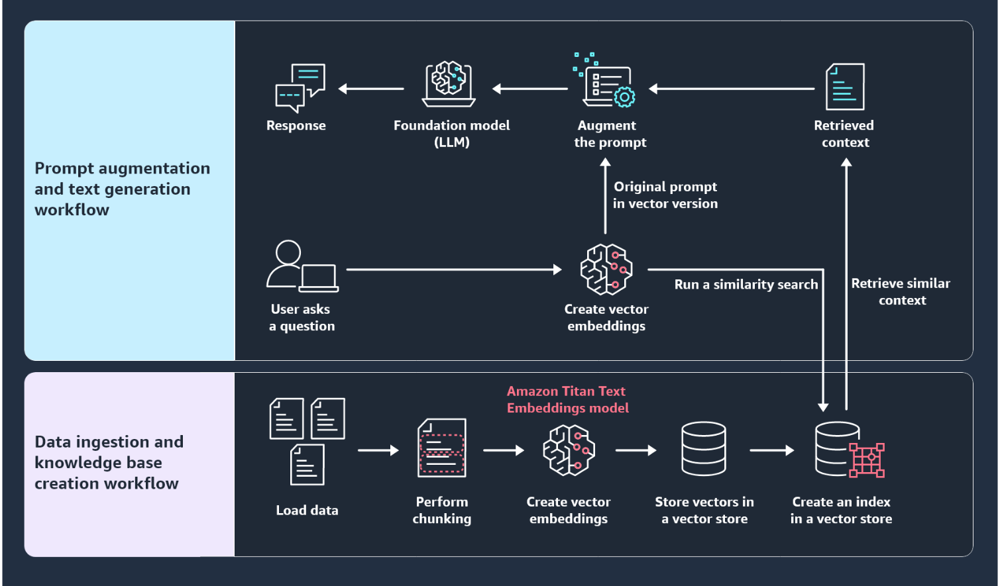

The data ingestion and knowledge base creation workflow includes loading data, performing chunking, creating vector embeddings, storing vectors in the vector store, and finally creating an index in the vector store. The prompt augmentation and text generation workflow includes the user query, creating vector embeddings, running a similarity search, retrieving similar context, augmenting prompts, and generating responses.

---

### Data ingestion and knowledge base creation

Before you can actually ask questions about your data, the data must be optimized for a RAG use case and be stored in a knowledge base. The following diagram provides an overview of the data ingestion and knowledge base creation workflow.

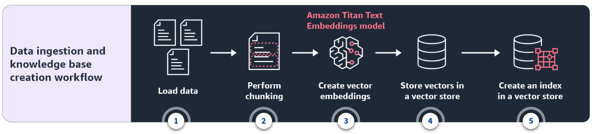

1. **Load data**

    The data ingestion workflow starts with loading the data from the external data sources, such as files (for example, CSV, JSON, or text files), databases, APIs, or web scraping.

2. **Perform chunking**

    You then take this data and go through the process called chunking. Chunking is the process of dividing large text data into smaller, more manageable pieces (chunks).

3. **Create vector embeddings**

    These chunks are then passed into an embedding model, such as Amazon Titan Text Embeddings, to create vector embeddings.

4. **Store vectors in a vector store**

    The vectors are then ultimately stored in a purpose-built vector database (vector store).

5. **Create an index in a vector store**

    The vector database (vector store) is optimized for indexing and retrieval of embeddings. It can maintain the relationship and semantic meaning that you get through an embedding model.

---

#### More on chunking

When dealing with large documents, it is common to break them down into smaller segments for efficient processing. This chunking can be done in different ways, such as fixed-sized chunks (for example, 512 tokens). Or it can be done with variable-sized chunks based on semantic boundaries (for example, paragraphs or sections).

Chunking is necessary because most vector embedding models have a maximum input length, and processing large texts in one go can be computationally expensive. Chunking is also useful for optimizing for things like relevancy.

For example, consider a large document containing information about a city, such as its history, landmarks, culture, cuisine, and transportation. If this document is treated as a single unit and embedded without chunking, the resulting vector embedding would represent a generalized meaning of the entire document. This makes it difficult to distinguish and retrieve specific information related to a particular aspect of the city.

However, if the document is chunked into smaller segments, each chunk can contain information about a specific aspect. For example, one chunk is for the city's history, another chunk is for its landmarks, and another chuck is for its cuisine. The vector embeddings for these individual chunks would better capture and represent the unique details and contexts of each aspect.

During a search or query related to a particular aspect, such as *famous landmarks in the city*, the vector store can retrieve the most relevant chunks. This is done by matching the query embedding with the embeddings of the chunks specifically focused on landmarks. It will not retrieve the entire document, which might contain irrelevant or unrelated information about other aspects like history or cuisine.

This targeted retrieval of relevant chunks optimizes the relevancy of the search results, and the user is presented with the most pertinent information directly related to their query.

---

#### More on embeddings

Remember the knowledge base concept that you just learned about? The knowledge itself (such as documents) must be stored as numerical vectors like [1.7, 0.6, 7.9,...]. There is a process to create those numerical representations from the text and save them for future retrieval in the RAG process. This process is called embedding. Let's first review what embedding is about.

Embeddings are a way of representing human text data (words, sentences, documents) as numerical vectors, typically high-dimensional vectors. These vector representations capture the semantic meaning and relationships between words or pieces of text. The idea is to encode the text into a dense vector space, where similar words or semantically related texts are mapped to nearby points in this vector space.

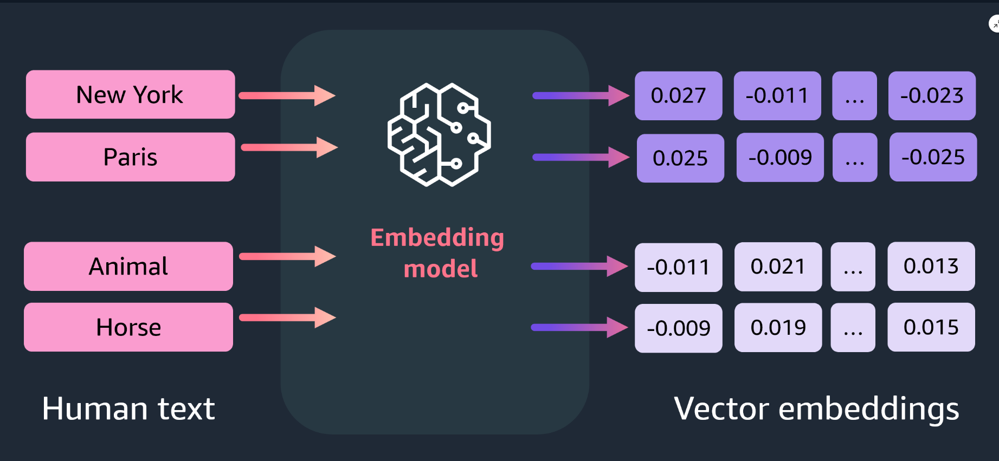

Embedding models (models specifically designed to convert text into numerical vectors) are trained on large amounts of text data. This enables them to learn and encode various features and nuances present in the text. There are various embedding models available, each with different architectures and capabilities.

For example, Amazon Titan Text Embeddings can generate high-dimensional (1,536) vector representations that capture the semantic meaning of text inputs across over 25 languages. The Amazon Titan Text Embeddings v2 model (amazon.titan-embed-text-v2:0) can take in up to 8,192 tokens and outputs a vector of 1,024 dimensions. The model also works in more than 100 different languages. The model is optimized for text retrieval tasks, but can also perform additional tasks, such as semantic similarity and clustering. Amazon Titan Text Embeddings v2 also supports long documents. However, for retrieval tasks, it is recommended to segment documents into logical segments, such as paragraphs or sections.

These models can capture intricate relationships, such as synonymy, analogies, and contextual similarities. By learning from the distributional properties of words in the training data, embedding models can generalize and represent even unseen or rare words in a meaningful way.

---

Embedding models focus on representing text elements as fixed-length vectors that capture semantic relationships. This is different than the LLMs that you use to chat. LLMs are designed for generating human-like text and understanding natural language in an open-ended manner. Embedding models are often used as input features for other machine learning models. But LLMs can be used for a variety of language generation and understanding tasks directly.

---

#### Types of embeddings

Embedding models can operate at different levels, providing vector representations for individual words, sentences, or entire documents.

#### 1. Word embeddings

Word embeddings represent individual words as vectors, capturing their semantic and contextual relationships within the text. These embeddings capture the semantic and syntactic relationships between words, so similar words have similar vector representations.

For example, consider the words **king** and **queen**. In a word embedding space, these words would have similar vector representations because they are semantically related (both referring to monarchs).

#### 2. Sentence embeddings

Sentence embeddings represent entire sentences as vectors, encoding the meaning and relationships between words within the sentence.

For example, consider the sentences *The sun is shining brightly.* and *The night sky is filled with shining stars*.* Their sentence embeddings would capture the overall meaning and context of each sentence. This permits them to be compared or used for tasks like text classification or semantic similarity.

The first sentence's embedding would encode information about the sun being out and the day being bright. The second sentence's embedding would encode information about the night and the presence of stars in the sky. This would allow the model to distinguish between the two sentences based on their overall meanings, even though they share some common words like **The**, **is**, and **shining**.

#### 3. Document embeddings

Document embeddings represent entire documents or large pieces of text as vectors, capturing the overall semantic content and relationships within the document.

For example, consider a travel blog post about visiting Paris and a cookbook with recipes for French cuisine. Their document embeddings would capture the overall topics, context, and meanings of each document. This permits them to be compared or used for tasks like document classification or information retrieval.

The travel blog post's document embedding would encode information about the author's experiences in Paris, including descriptions of famous landmarks, local culture, and personal anecdotes. However, the cookbook's document embedding would encode information about the various French dishes, ingredients, cooking techniques, and culinary traditions. This would allow the model to distinguish between the two documents based on their overall content and context, despite the fact that they both relate to French culture in some way.

---

The size of each chunk is limited by the maximum input size of the chosen embedding model. The embedding together with the original chunk of the document and additional metadata are stored in a vector database.

---

#### More on vector stores

After the text data is converted into numerical vectors (embeddings), these vectors are stored in a specialized data structure called a vector store (or vector database). Vector stores can efficiently store and retrieve high-dimensional vectors, which enables fast similarity search and retrieval operations. This is crucial for various natural language processing tasks that require finding semantically similar documents or passages based on their vector representations.

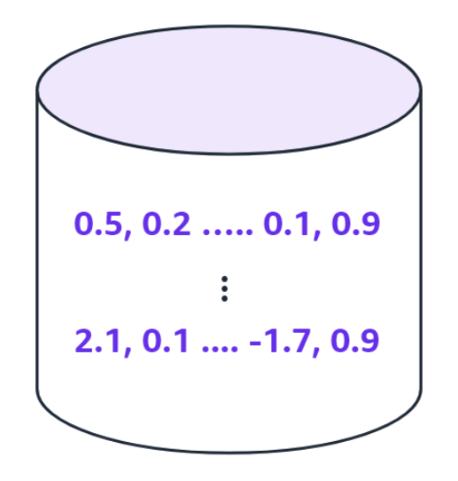

AWS offers many services for your vector database requirements, such as the following:

* **Amazon OpenSearch Service** helps you perform interactive log analytics, real-time application monitoring, website search, and more.
* **Amazon Aurora PostgreSQL-Compatible Edition** and **Amazon Relational Database Service (Amazon RDS) for PostgreSQL** support the **pgvector** extension to store embeddings from machine learning (ML) models in your database and to perform efficient similarity searches.
* **Amazon DocumentDB (with MongoDB compatibility)** supports vector search, a capability that you can use to store, index, and search millions of vectors with millisecond response times. With vector search for Amazon DocumentDB, you can set up, operate, and scale databases for your ML applications.

---

### Prompt augmentation and text generation

Now let's look at the other RAG workflow: prompt augmentation and text generation. The following diagram provides an overview of this workflow. This workflow will use the vector store (vector database or knowledge base) that you created in the data ingestion workflow.

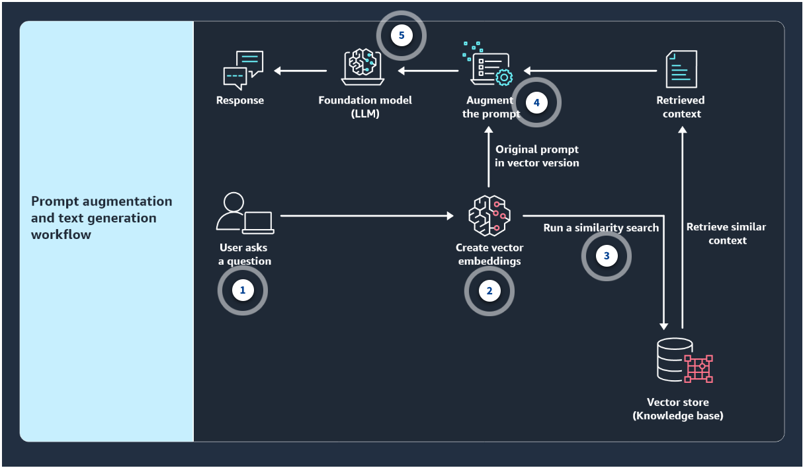

#### 1. User query

After you go through the data ingestion workflow, you are now ready to ask questions.

First, you enter your question or query. This could be something like *What are the famous landmarks in Paris?*

#### 2. Create embeddings

Your question goes through the same embedding model that was used for the data ingestion workflow. The model turns your question into a vector representation, like it did for the text data.

#### 3. Run a similarity search

Next, this question vector is searched in the vector data source. This vector data source contains all the vector embeddings of the text data from the ingestion workflow.

The magic happens during this search process. Instead of relying on exact keyword matches, the system performs a vector similarity search. It looks for vector embeddings in the data source that are similar or close to the vector embedding of your question.

#### 4. Augment the prompt

After you get the search result (the retrieval part), the retrieved context and the vector version of the question (the original prompt) make the augmented prompt.

#### 5. Generate the response

Finally, the augmented prompt will be sent to a foundation model (such as an LLM) to generate the response, and this is the generation part of the RAG process.

---

#### More on finding similarity

One of the key advantages of embeddings is that they enable efficient and meaningful comparisons between text elements. This enables semantic search, which is much more powerful than traditional keyword search.

Because the embeddings encode semantic information, the cosine similarity or distance between two embedding vectors can be used as a measure of semantic similarity between the corresponding texts. This property makes embeddings useful for tasks like document clustering, information retrieval, recommendation systems, and detecting duplicate or plagiarized content.


Cosine similarity is a measure of the angle between two vectors. The similarity value can range between −1 and 1. A smaller angle between the two vectors generates a higher cosine value. This indicates that the vectors are more semantically related. In contrast, if the angle between the two vectors is larger (for example, close to 180 degrees), it will generate a lower cosine value. This means that the two vectors are the opposite.

Even if your question uses different words from the text data, the system can still find relevant information. This is because the system understands the underlying meaning and context behind your query based on the similarity of vector embeddings.

For example, if you ask about famous landmarks in Paris, the system might retrieve information about the Eiffel Tower, the Louvre Museum, and Notre-Dame Cathedral. The system can do this even if your question didn't explicitly mention those specific landmarks. It makes these connections because the vector embeddings capture the semantic relationships between your query and the relevant information in the data source.

This semantic search capability is incredibly useful because you can ask questions in a more natural and flexible way, without being constrained by rigid keyword matching. The system can understand the intent behind your query and provide the most relevant and meaningful information.

---

The vector provided in the following section is a mock example and does not correspond to the true sentence embedding for the given question. It is provided solely to demonstrate the concept of representing text as high-dimensional vectors. Each dimension captures some aspect of the semantic meaning of the entire sentence, rather than just individual words.

---

Let's say that you ask the question: *What are some famous landmarks in Paris?*

In the vector world, this question would be represented as a high-dimensional vector, typically hundreds or thousands of dimensions. For example, the question *What are some famous landmarks in Paris?* could be represented as a 300-dimensional embedding vector as **[-0.012, 0.038, -0.124, 0.056, ..., 0.201, -0.075, 0.119]**.

This 300-dimensional vector representation, also known as the embedding, would encode the semantic meaning of the question, capturing the relationships between words like **famous**, **landmarks**, and **Paris**. The following steps show how similarity search works.

#### Step 1: Question embedding

The first step is to convert the question, *What are some famous landmarks in Paris?* into its corresponding 300-dimensional embedding vector **[-0.012, 0.038, -0.124, 0.056, ..., 0.201, -0.075, 0.119]**. This is done by using a pre-trained embedding model.

This model has learned to map text into high-dimensional vectors based on the semantic relationships present in a large training corpus.

#### Step 2: Vector store

Imagine that you have a vector store, which is a database that stores text passages (for example, sentences or paragraphs) as embedding vectors.

In this case, the vector store would contain embeddings of various text passages related to Paris, its landmarks, history, culture, and so on.

For example, in the vector store, you might have a 300-dimensional embedding for the sentence, *The Eiffel Tower is one of the most iconic landmarks in Paris, France.* And the relevant passage embedding is: **[0.028, -0.091, 0.147, -0.032, ..., -0.108, 0.063, -0.205]**.

#### Step 3: Similarity search

With the question embedding and the vector store, you can perform a similarity search. This involves computing the cosine similarity between the 300-dimensional question embedding and all the passage embeddings in the vector store.

Based on the cosine similarity scores, you can retrieve the top-k most similar passages from the vector store. These passages are likely to contain information relevant to the question about famous landmarks in Paris.

For example, the sentence about the Eiffel Tower would likely be among the top retrieved passages due to its high semantic relevance to the question.

#### Step 4: Context

Finally, the retrieved relevant passages can be provided as context to an LLM along with the original prompt.

The LLM can then generate a response by considering both the original question and the relevant context retrieved from the vector store.

---

This process of using high-dimensional embeddings to retrieve relevant information from a vector store and providing it as context to an LLM is a powerful technique that allows the model to generate more informed and accurate responses, especially for open-ended or knowledge-intensive queries.

---

#### Updating external data

After understanding how RAG works, the next question you might have is, "What if the external data becomes stale?" To maintain current information for retrieval, asynchronously update the documents and update the embedding representation of the documents. You can do this through automated real-time processes or periodic batch processing.

---

**Without RAG, the LLM takes the user input and creates a response based on information it was trained on—or what it already knows. With RAG, an information retrieval component is introduced that uses the user input to first pull information from a new data source. The user query and the relevant information are both given to the LLM. The LLM uses the new knowledge and its training data to create better responses.**

---

## RAG Use Cases

### Successful RAG implementations

#### Question answering systems

RAG systems can power intelligent assistants that provide accurate answers to queries across various domains.

For example, in healthcare, a patient asks the medical assistant, *"What are the symptoms of appendicitis?"*

The retrieval component searches authoritative medical databases and extracts information on symptoms like abdominal pain, nausea, and fever. The language model then generates a comprehensive answer combining the retrieved details. This helps patients to get reliable medical information.

#### Research assistance

RAG can help researchers by finding and combining relevant information from large academic sources.

For example, climate scientists studying how rising temperatures affect Arctic sea ice can benefit from such systems. By connecting to a collection of environmental research papers, the system finds information such as relevant papers, data on Arctic ice melt rates, and temperature models based on the scientists' research focus.

The language model can then draft analyses, literature reviews, or research summaries that combine the retrieved information. This speeds up the research process.

#### Customer service AI assistants

Companies can use RAG to build AI assistants that provide accurate and consistent product or service support.

For example, ecommerce companies can use RAG-powered AI assistants to address customer inquiries effectively. When a customer asks about return policies for defective items, the retrieval component finds the relevant details in the company's knowledge base. The language model then generates a clear explanation that is suitable for the customer's specific product or purchase. This ensures a seamless support experience.

#### Legal document analysis

RAG can help legal professionals understand and analyze complex legal documents and concepts.

For example, lawyers reviewing contracts can use RAG systems for deep analysis. When assessing if a non-compete clause is enforceable, the system finds relevant case laws and judicial precedents. The language model then provides a detailed analysis evaluating the specific terms, using the retrieved information to ensure a well-informed legal interpretation.

#### HR assistance

RAG can power intelligent HR assistants that provide personalized guidance to employees.

For example, when an employee is planning maternity leave, the system finds relevant details from company policies and benefits documents. It then generates a tailored summary addressing paid leave, benefits continuation, and the employee's specific situation. This ensures that the employee has all the necessary information.

---

### What happen if there is no RAG or RAG is used improperly

Now review the following scenarios when RAG is not used or is used improperly, and think about the impacts.

#### Medical diagnosis application

Imagine a healthcare application that uses a language model to assist physicians in diagnosing patients based on their symptoms and medical history. Without the integration of RAG, this application would rely solely on the knowledge acquired by the language model during its pre-training phase.

#### 1. Negative impact of not using RAG

The following is the potential impact if RAG is not used:

* **Knowledge gaps:** The language model's knowledge might be incomplete or outdated. This leads to inaccurate or missing diagnoses, especially for rare or newly emerging conditions.
* **Lack of context:** If the language model cannot access the patient's medical records or relevant medical literature, it might provide generic or overly broad diagnoses, and fail to consider important contextual factors.
* **Potential harm:** Inaccurate diagnoses or missed conditions could lead to improper treatment plans. This potentially puts patients' health and well-being at risk.

#### 2. Consequences of setting up RAG improperly or using RAG incorrectly

The following shows what might happen if RAG is improperly set up or used incorrectly:

* **Incorrect knowledge sources:** Connecting the application to irrelevant or low-quality medical knowledge sources could introduce misinformation or biased data. This can lead to flawed diagnoses.
* **Retrieval errors:** Issues with the retrieval component might cause the system to miss relevant medical information or retrieve incorrect information. This can result in erroneous diagnoses.

---

#### Financial investment advisory application

Consider an application that provides investment advice and portfolio management recommendations to individual investors or financial institutions. Without RAG integration, this application would rely only on the language model's pre-trained knowledge. This knowledge might be limited or outdated in the rapidly changing financial domain. The application might provide inaccurate or suboptimal recommendations without access to the latest market data, economic indicators, and financial research.

#### 1. Negative impact of not using RAG

The following is the potential impact if RAG is not used:

* **Outdated market knowledge:** The language model's knowledge might not reflect the latest market trends, economic indicators, or regulatory changes. This leads to inaccurate or suboptimal investment recommendations.
* **Lack of contextual awareness:** Without access to real-time financial data, news, and analysis, the application might fail to consider important contextual factors that could impact investment decisions.
* **Financial losses:** Inaccurate investment advice or portfolio management recommendations could result in significant financial losses for individual investors or institutional clients.

#### 2. Consequences of setting up RAG improperly or using RAG incorrectly

The following shows what might happen if RAG is improperly set up or used incorrectly: 

* **Unreliable data sources:** Connecting the application to unreliable or low-quality financial data sources could introduce erroneous or manipulated information. This leads to flawed investment recommendations.
* **Retrieval errors:** Issues with the retrieval component might cause relevant financial news, reports, or analyses to be missed. This results in incomplete or biased investment advice.
* **Regulatory non-compliance:** Failure to properly incorporate regulatory changes or compliance requirements into the knowledge sources could lead to recommendations that violate financial regulations. This potentially exposes the application and its users to legal risks.

---

### Knowledge Check

#### What is the key difference between basic prompt engineering and Retrieval Augmented Generation (RAG) techniques?

* Basic prompt engineering relies solely on the language model's internal knowledge. RAG incorporates external knowledge sources.

Wrong answers:

* Basic prompt engineering focuses on fine-tuning language models. RAG focuses on improving computational efficiency.
* Basic prompt engineering is used for creative writing tasks. RAG is used for factual question answering.
* Basic prompt engineering is a technique for pre-training language models. RAG is used during inference.

##### Explanation

The other options are incorrect because of the following reasons:

* Neither prompt engineering nor RAG is specifically focused on fine-tuning or improving computational efficiency.
* Both prompt engineering and RAG can be used for various tasks, not just creative writing or factual question answering.
* Prompt engineering is not a technique for pre-training language models, but rather for interacting with pre-trained models during inference or fine-tuning. RAG is also used during inference to augment the model's capabilities with external knowledge.

#### What are considered external knowledge sources in the Retrieval Augmented Generation (RAG) framework?

* Any collection of information external to the pre-trained language model

Wrong answers:

* The pre-trained language model's parameters and weights
* The training data used for pre-training the language model
* The output generated by the language model during inference

##### Explanation

This collection of information can be public repositories like Wikipedia or proprietary data silos owned by the company or organization.

The other options are incorrect because of the following reasons:

* The pre-trained language model's parameters and weights are the values learned during the training process and are used to make predictions or generate outputs during inference.
* The training data used for pre-training the language model is the dataset used to train the model's parameters and weights. It is not considered an external knowledge source in the context of the RAG framework.
* The output generated by the language model during inference is the result of the model's predictions or generations based on the input and the model's parameters and weights. It is not an external knowledge source.

#### What are embeddings?

* A way of representing text data (words, sentences, documents) as numerical vectors

Wrong answers:

* A technique for improving the computational efficiency of language models
* A method for augmenting language models with external knowledge sources
* A type of language model architecture used for generating human-like text outputs

##### Explanation

This captures the semantic meaning and relationships between words or pieces of text.

The other options are incorrect because of the following reasons:

* Improving the computational efficiency of language models is not the primary purpose of embeddings. Techniques like model quantization, pruning, or efficient architectures are more directly aimed at improving computational efficiency.
* Augmenting language models with external knowledge sources is not the purpose of embeddings. The Retrieval Augmented Generation (RAG) framework is specifically designed for incorporating external knowledge sources into language models.
* Embeddings are not a type of language model architecture. They are a way of representing text data as numerical vectors, which can be used as input to various language model architectures like transformers, recurrent neural networks (RNNs), or others.

---

### Summary

#### Introduction to RAG

Retrieval Augmented Generation (RAG) combines large language models (LLMs) with external knowledge sources. RAG aims to give more accurate responses by using relevant outside information. RAG has benefits like lower costs, current information, more trust, and control. But it also has risks like data bias, licensing issues, scalability problems, and privacy concerns.

RAG has limits compared to fine-tuning or training custom models. These limits include dependence on the knowledge base and not adapting well to specialized domains. But RAG can be useful when you have lots of relevant information and efficient retrieval process. For tasks that require accurate outputs, fine-tuning or custom training might work better.

#### How RAG works

RAG has three core components: **retrieval**, **augmentation**, and **generation**.

* The **retrieval component** searches an external knowledge base to find relevant documents or passages for answering queries.
* The **augmentation step** combines retrieved knowledge with the user prompt to create an augmented input for the model.
* The **generation component** uses the augmented context with retrieved knowledge to produce a final knowledge-grounded output.

RAG uses semantic search for retrieval to find relevant information from unstructured text based on query meaning. Semantic search with text embeddings enables RAG's retrieval component to fetch relevant documents by understanding textual meaning and relationships.

#### Data ingestion workflow

The data ingestion workflow optimizes data for RAG use cases before enabling question-answering capabilities.

1. The data ingestion workflow begins by loading data from external sources.
2. Chunking divides large text data into smaller, manageable chunks for efficient processing. This can be done by fixed-sized chunks, like 512 tokens, or by variable-sized chunks based on semantic boundaries, like paragraphs.
3. The chunks are then passed into an embedding model like Amazon Titan Text Embeddings to create vector embeddings. Embeddings represent text data numerically as high-dimensional vectors capturing semantic meaning. This permits similar texts to map nearby in vector space.
4. The resulting vector embeddings are then stored in a purpose-built vector store.
5. The vector store is optimized for indexing and retrieving embeddings while maintaining the semantic relationships and meanings encoded by the embedding model.

#### Type of embeddings

Embedding models can operate at different levels, providing vector representations for individual words, sentences, or entire documents.

* **Word embeddings** represent individual words as vectors, capturing semantic relationships so that similar words like **king** and **queen** have close vectors.
* **Sentence embeddings** represent entire sentences as vectors, encoding overall meaning and context.
* **Document embeddings** represent entire documents as vectors, capturing overall semantic content and relationships.

#### AWS offerings for vector databases

AWS provides the following services that are suitable for vector databases:

* **Amazon OpenSearch Service** simplifies interactive log analytics, real-time application monitoring, website search, and related capabilities.
* **Amazon Aurora PostgreSQL-Compatible Edition** and **Amazon Relational Database Service (Amazon RDS) for PostgreSQL** support the **pgvector** extension for storing machine learning (ML) model embeddings and performing efficient similarity searches on them.
* **Amazon DocumentDB (with MongoDB compatibility)** supports vector search. This enables storage, indexing, and millisecond searching of millions of vectors and simplifies setup, operation, and scaling of databases for ML applications.

#### Text generation workflow

The text generation workflow comes after you have your data ingested and stored in the vector store.

1. After data ingestion, you can enter questions or queries to access the ingested information.
2. The query gets converted into a vector by the same embedding model used during data ingestion.
3. The query vector is searched against the vector data source containing text embeddings from ingestion. The system performs a vector similarity search. It finds semantically relevant embeddings close to the query vector. This approach goes beyond keyword matching and helps understand the underlying meaning and context of the query. The cosine similarity between vectors can measure semantic similarity.
4. With the retrieved context from vector search, the system augments the original query vector by combining it with the relevant return passages. This is performing the augmentation part of the RAG process.
5. Finally, the augmented prompt combining the query and retrieved context is sent to a foundation model like an LLM to generate the response. This completes the generation part of the RAG process.

#### Updating external data

To maintain current retrieval information as external data becomes stale, embeddings for updated documents can be asynchronously updated through automated real-time processes or periodic batch processing.

#### RAG use cases

You can use RAG in a variety of applications that require combining the knowledge and language understanding capabilities of large language models. Such applications include the following:

* **Question answering systems:** RAG can power intelligent assistants that provide accurate answers to queries by combining language models with relevant external information across domains.
* **Research assistance:** RAG can help researchers find and combine relevant information from large academic sources.
* **Customer service AI assistants:** Companies can use RAG to build AI assistants that provide accurate and consistent product or service support by combining language models with relevant product information.
* **Legal document analysis:** RAG can help legal professionals understand and analyze complex legal documents and concepts by combining language models with relevant external legal information.
* **HR assistance:** RAG can power intelligent HR assistants that provide personalized guidance to employees by combining language models with relevant HR information.

Failing to use RAG or improperly implementing it in applications can lead to significant issues and negative impacts. For example, in a healthcare application without RAG integration, the language model might lack access to up-to-date medical knowledge, patient context, and relevant literature. This can potentially result in inaccurate diagnoses, improper treatment plans, and harm to patients. Improperly setting up RAG by connecting to low-quality or biased medical sources or having retrieval errors can compound these issues.

Overall, RAG integration done right can help supplement language models with crucial external knowledge for more accurate, contextualized, and up-to-date responses. This underscores the importance of RAG across domains like healthcare and finance.

---

## Amazon Bedrock Knowledge Bases

### RAG implementation challenges

When it comes to implementing Retrieval Augmented Generation (RAG), there are challenges. These challenges include managing multiple data sources, creating vector embeddings for large volumes of data, incremental updates to the vector store, coding efforts, scaling the retrieval mechanism, and orchestration.

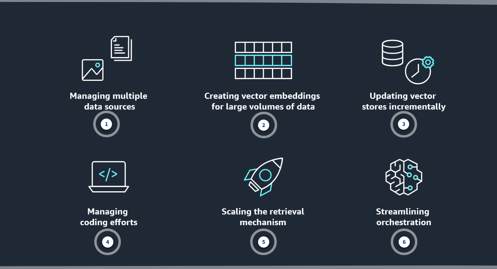

#### 1. Managing multiple data sources

In many real-world scenarios, the data required for a RAG system might come from various sources, such as databases, APIs, websites, and document repositories. Integrating and managing these diverse data sources can be challenging. It involves handling different data formats, authentication mechanisms, APIs, and ensuring data consistency and quality across sources.

#### 2. Creating vector embeddings for large volumes of data

RAG systems often deal with large volumes of text data, which have to be converted into vector embeddings for efficient retrieval. Creating embeddings for massive datasets can be computationally intensive and time consuming. This might require specialized hardware and optimized techniques for efficient embedding generation.

#### 3. Updating vector stores incrementally

As new data becomes available or existing data gets updated, the vector store must be incrementally updated to reflect these changes. This involves efficiently updating or adding new vector embeddings to the store without having to re-create the entire index or embeddings from scratch. This can be a resource-intensive process.

#### 4. Managing coding efforts

Implementing a RAG system requires significant coding efforts, because it involves integrating various components such as data ingestion pipelines, embedding models, vector stores, and retrieval mechanisms. And ensuring efficient and scalable implementations, handling edge cases, and providing a user-friendly interface for querying and result presentation can add to the coding complexity.

#### 5. Scaling the retrieval mechanism

As the volume of data and the number of users increase, the challenges increase. The retrieval mechanism has to be highly scalable and efficient to handle a large number of concurrent queries and provide real-time responses. This might involve techniques like sharding, caching, load balancing, and optimizing the underlying vector similarity search algorithms to ensure low latency and high throughput.

#### 6. Streamlining orchestration

A RAG system typically involves multiple components (for example, data ingestion, embedding generation, vector store, and retrieval mechanism) that must be orchestrated and coordinated effectively. This includes managing dependencies, handling failures, monitoring, and ensuring smooth end-to-end implementation of the workflow. Orchestration becomes increasingly complex as the number of components and the scale of the system grow.

---

### Introducing Amazon Bedrock Knowledge Bases

This is where Amazon Bedrock Knowledge Bases comes into play. Amazon Bedrock Knowledge Bases is a fully managed capability that helps you implement the entire RAG workflow. This includes ingestion, retrieval, and prompt augmentation, and you don't need to build custom integrations to data sources or manage data flows.

Amazon Bedrock Knowledge Bases takes care of creating, storing, managing, and updating your embeddings in the vector store. It ensures that your data is always in sync with your vector store. With Amazon Bedrock Knowledge Bases, you benefit from a fully managed RAG data ingestion workflow.

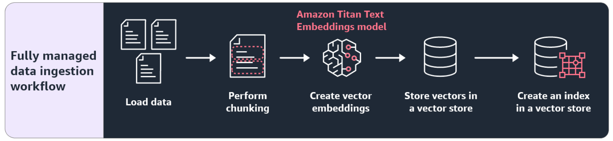

Amazon Bedrock Knowledge Bases handles loading data, performing chunking, creating vector embeddings, storing vectors in the vector store, and creating an index in the vector store.

---

The following information provides high-level steps for how you can create a knowledge base in the AWS Management Console.

1. Go to the AWS Management Console and open the Amazon Bedrock console.
2. From the left navigation pane, choose **Knowledge bases**.
3. In the **Knowledge bases** section, choose **Create knowledge base**.
4. Specify the location of your data and configure your data source.
5. Select an embedding model and configure a vector store for Amazon Bedrock to store and update your embeddings.

---

### Securely connecting FMs and agents to data sources

As part of the process to create a knowledge base, you need to provide the location of your data or documents. Amazon Bedrock Knowledge Bases supports Amazon Simple Storage Service (Amazon S3), Confluence, Salesforce, or SharePoint as source locations. You can also ingest content from the web.

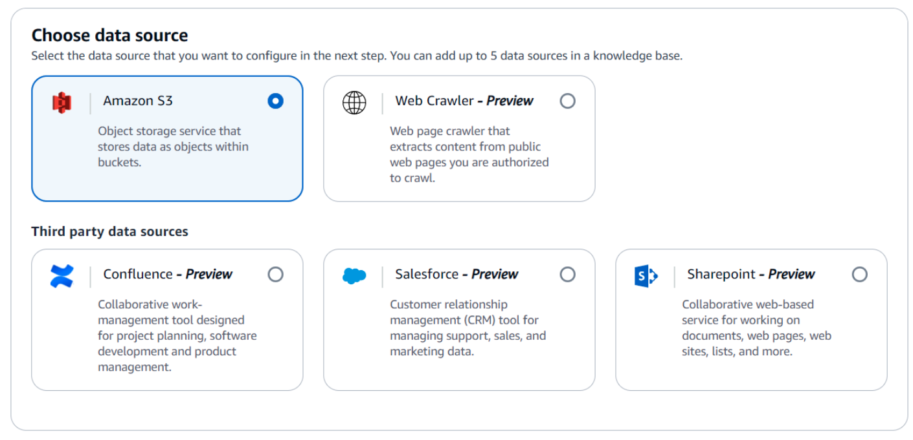

When you create a knowledge base in the Amazon Bedrock console, you can choose your data source from a variety of locations.

The files in your data source repository must be in one of the following supported formats.

| Format | Extension |
| ------ | --------- |
| Plain text | .txt |
| Markdown | .md |
| Hypertext markup language | .html |
| Microsoft Word document | .doc or .docx |
| Comma-separated values | .csv |
| Microsoft Excel spreadsheet | .xls or .xlsx |
| Portable Document Format | .pdf |

---

Ensure that the file size doesn't exceed the quota of 50 MB for a single file.

---

### Configuring the data source with default or customized settings

After you choose your data source, you can determine whether you want to use the default chunking and parsing configurations for your use cases. Alternatively, you can customize the knowledge base to deliver more accurate responses at runtime. For example, you can use advanced parsing options to understand unstructured data such as PDFs with complex content, such as tables.

|[Screenshot of using foundation model for parsing](./images/W08Img036RagBedrockFmForParsing.png)

When you choose the **Custom** option to customize the parsing strategy, you can use foundation models for parsing (advanced parsing strategy). The current foundation models that you can choose from are Claude 3 Sonnet v1 and Claude 3 Haiku v1.

---

If you choose to use advanced parsing of your documents, currently only the PDF file format is supported. You must convert to or use PDF files before you can apply advanced parsing. There are additional costs to using advanced parsing. This is due to its use of a foundation model. The cost depends on the amount of data that you have.

---

To enable effective retrieval from your data, a common practice is to first split the documents into manageable chunks. This enhances the model’s capacity to comprehend and process information more effectively. This leads to improved relevant retrievals and generation of coherent responses. Amazon Bedrock Knowledge Bases manages the chunking of your documents. When you configure the data source for your knowledge base, you can define a chunking strategy.

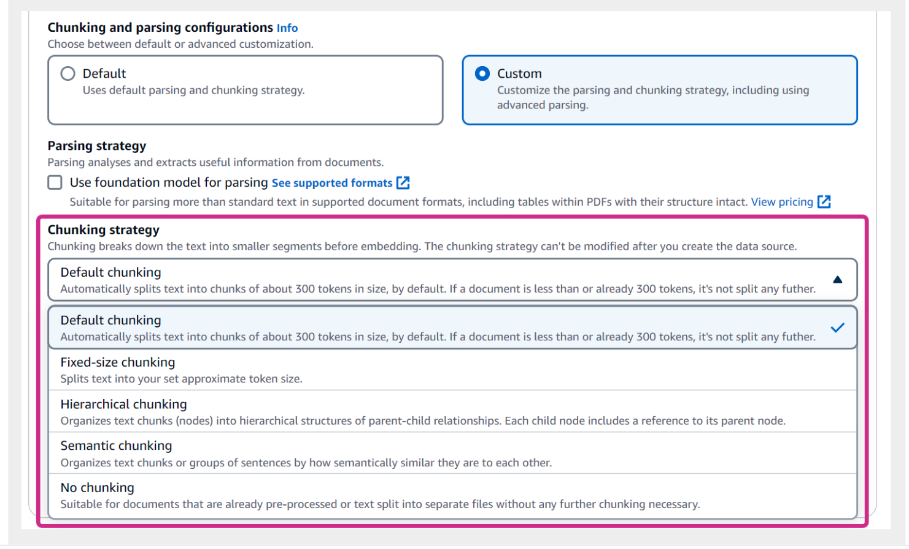

When you choose the **Custom** option to customize the chunking strategy, you use one of the AWS built-in chunking strategies. These strategies include default chunking, fixed-size chunking, hierarchical chunking, semantic chunking, and no chunking.

---

The following information shows you different chunking strategies that you can find on the console.

#### Default chunking

Default chunking splits data into chunks of about 300 tokens in size, by default. This is optimized for question-answer tasks. Use default chunking when you are not sure of the optimal chunk size for your data.

#### Fixed-size chunking

Fixed-size chunking splits text into your set approximate token size. Use fixed-size chunking if you know the optimal chunk size and overlap for your data (based on file attributes, accuracy testing, and so on). An overlap between chunks in the recommended range of 0 to 20 percent can help improve accuracy. Higher overlap can lead to decreased relevancy scores.

#### Hierarchical chunking

Hierarchical chunking organizes text chucks (nodes) into hierarchical structures of parent-child relationship. Each child node includes a reference to its parent node.

When creating a data source, you can define the parent chunk size, child chunk size, and the number of tokens overlapping between each chunk. During retrieval, the system initially retrieves child chunks, but replaces them with broader parent chunks so as to provide the model with more comprehensive context.

Small text embeddings are more precise, but retrieval aims for comprehensive context. A hierarchical chunking system balances these needs by replacing retrieved child chunks with their parent chunks when appropriate.

#### Semantic chunking

Semantic chunking is a natural language processing technique that divides text into meaningful chunks to enhance understanding and information retrieval. It aims to improve retrieval accuracy by focusing on the semantic content rather than just syntactic structure.

By doing so, it facilitates more precise extraction and manipulation of relevant information.

#### No chunking

No chunking is suitable for documents that are already preprocessed or text split into separate files without any further chunking necessary.

Use this option if you don’t want Amazon Bedrock to chunk your data—for example, if you want to chunk your data offline by using an algorithm that is specific to your use case. Common use cases include code documentation.

---

You can’t change the chunking strategy after you have created the data source.

---

You can also write your own chunking code as an AWS Lambda function to perform further customized chunking. You can even ready-made components from frameworks like **LangChain** and **LlamaIndex**.

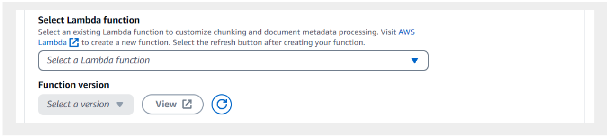

The **Select Lambda function** section will be displayed when you choose the **Custom** option in the **Chunking and parsing configurations** section.

---

### Embedding models and vector store

After the content is ingested, Amazon Bedrock Knowledge Bases divides the content into blocks of text, converts the text into embeddings, and stores the embeddings in your vector database. Amazon Bedrock Knowledge Bases also manages workflow complexities such as content comparison, failure handling, throughput control, encryption, and more.

If you choose the **Quick create a new vector store** option in the console, Amazon Bedrock creates a vector index in Amazon OpenSearch Serverless in your account. This removes the need to manage anything yourself.

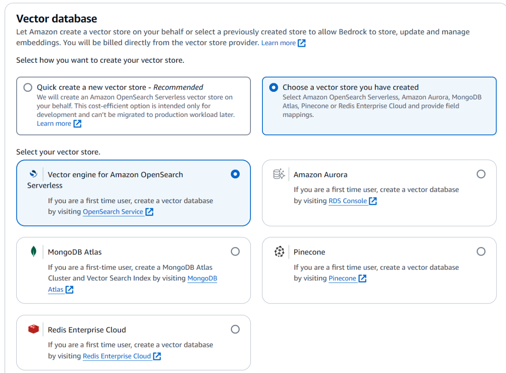

Alternatively, you can select a custom vector store. The available vector database options include vector engine for Amazon OpenSearch Serverless, Amazon Aurora, MongoDB Atlas, Pinecone, and Redis Enterprise Cloud. To use a custom vector store, you must create a new, empty vector database from the list of supported options. Then you provide the vector database index name and the index field and metadata field mappings. This vector database will have to be for exclusive use with Amazon Bedrock.

|[Screenshot of vector database options on the Amazon Bedrock console under knowledge bases](./images/W08Img042RagBedrockVectorDbQuickCreate.png)

---

You can use the following embedding models to embed your data sources in a vector store.

| Model name | Model ID |
| ---------- | -------------------- |
| Amazon Titan Embeddings G1 - Text | amazon.titan-embed-text-v1 |
| Amazon Titan Text Embeddings V2 | amazon.titan-embed-text-v2:0 |
| Cohere Embed (English) | cohere.embed-english-v3 |
| Cohere Embed (Multilingual) | cohere.embed-multilingual-v3 |

---

## Knowledge Bases for a RAG Process

Amazon Bedrock supports two APIs for Retrieval Augmented Generation (RAG) that handle the embedding and retrieving data from knowledge bases. In addition, Amazon Bedrock Knowledge Bases can augment the user query with retrieved embedding and pass that to a large language model (LLM) to generate text.

These two APIs are the **RetrieveAndGenerate API** and the **Retrieve API**.

### RetrieveAndGenerate API

With the **RetrieveAndGenerate API**, you can directly retrieve relevant information from your knowledge bases and have Amazon Bedrock generate a response from the results. You do this by specifying a foundation model (FM) in your API call.

The **RetrieveAndGenerate API** takes care of the entire RAG workflow (fully managed RAG workflow). Behind the scenes, Amazon Bedrock will convert queries into embeddings. It runs a similarity search in the knowledge base and augments the user query prompt with the search results (retrieved context). For multi-turn conversations, it manages the short-term memory to provide more contextual results. Finally, it returns the FM-generated response to the user's query.

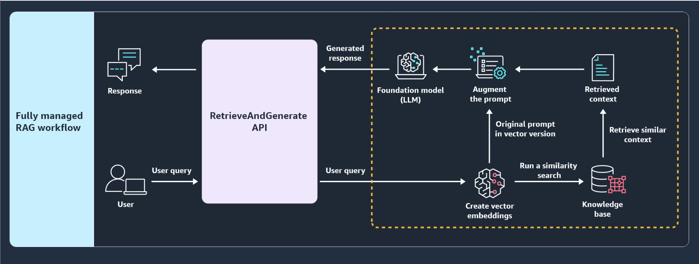

In the fully managed RAG workflow, the user query goes to the **RetrieveAndGenerate API**. This API then creates vector embeddings, runs a similarity search, retrieves similar context, augments the prompts, and generates the response. The **RetrieveAndGenerate API** then returns the generated response back to the user.

---

You can use the following models with the RetrieveAndGenerate API operation to generate responses after retrieving information from knowledge bases.

| Model name | Model ID |
| -------------------- | ------------------------------ |
| Amazon Titan Text Premier | amazon.titan-text-premier-v1:0 |
| Anthropic Claude v2.0 | anthropic.claude-v2 |
| Anthropic Claude v2.1 | anthropic.claude-v2:1 |
| Anthropic Claude 3 Sonnet v1 | anthropic.claude-3-sonnet-20240229-v1:0 |
| Anthropic Claude 3 Sonnet 3.5 | anthropic.claude-3-5-sonnet-20240620-v1:0 |
| Anthropic Claude 3 Haiku v1 | anthropic.claude-3-haiku-20240307-v1:0 |
| Anthropic Claude Instant v1 | anthropic.claude-instant-v1 |

---

### Providing source attribution

With the **RetrieveAndGenerate API**, all the information retrieved from the knowledge bases is provided with citations to improve transparency and minimize hallucinations.

The following example shows how the **RetrieveAndGenerate API** can work in the Amazon Bedrock console when you test your knowledge base. This is the configuration when you turn on the **Generate responses** option. A user asks, "Give me talking points for benefits of air travel." and the output displays the generated messages with citations.

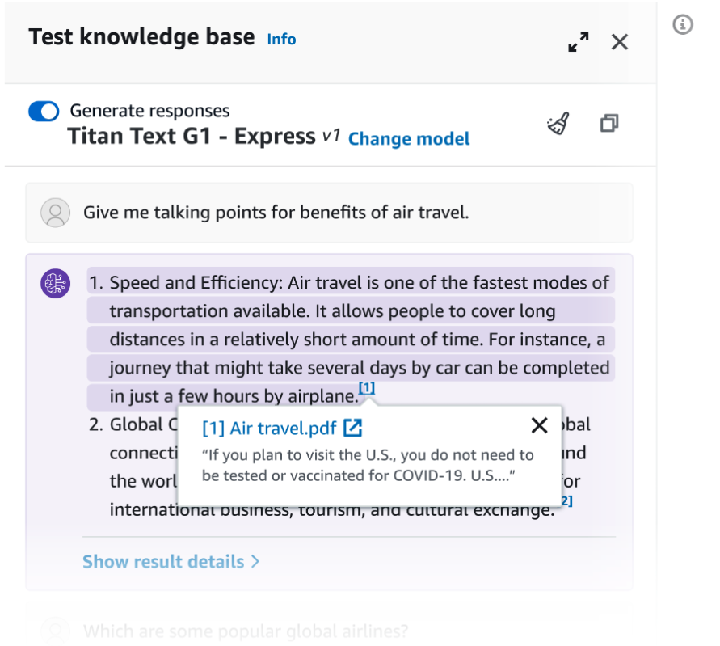

---

The following example shows how you could use the **RetrieveAndGenerate API** with Python. To learn more about the code, choose the circle-numbered annotations.

```python
def retrieveAndGenerate(input, kbId):                        # 1
    return bedrock_agent_runtime.retrieve_and_generate(      # 2
        input={
            "text": input                                    # 3
        },
        retrieveAndGenerateConfiguration={                   # 4
            "type": "KNOWLEDGE_BASE",
            "knowledgeBaseConfiguration": {                 # 5
                "knowledgeBaseId": kbId,
                "modelArn": "arn:aws:bedrock:us-east-1::foundation-model/anthropic.claude-instant-v1"
            }
        }
    )

response = retrieveAndGenerate("What is Amazon Bedrock?", "KB12345678")["output"] ["text"]       # 6
```

#### 1. `def retrieveAndGenerate`

This line defines a Python function named **retrieveAndGenerate** that takes two arguments: input (a string) and kbld (a string representing a knowledge base ID).

#### 2. `return bedrock_agent_runtime.retrieve_and_generate`

This line calls the **retrieve_and_generate** function from the **bedrock_agent_runtime** module. The function takes two augments: **input** and **retrieveAndGenerationConfiguration**.

#### 3. `input`

This is a dictionary containing the input text.

#### 4. `retrieveAndGenerateConfiguration`

This is a dictionary specifying the type of retrieval and generation task, and the configuration for that task. In this case, the type is set to **'KNOWLEDGE_BASE'**, indicating that the retrieval and generation should be based on a knowledge base.

#### 5. The `knowledgeBaseConfiguration` dictionary

It specifies the configuration for the knowledge base:

* **knowledgeBaseld:** This is the ID of the knowledge base to use, which is passed in as the **kbld** argument to the **retrieveAndGenerate** function.
* **modelArn:** This is the Amazon Resource Name (ARN) of the foundation model to use for retrieval and generation. In this case, it's set to **arn:aws:bedrock:us-east-1::foundation-model/anthropic.claude-instant-v1**.

#### 6. `response = retrieveAndGenerate`

This line calls the **retrieveAndGenerate** function with the input text **"What is Amazon Bedrock?"** and the knowledge base ID **"KB12345678"**. The output of the function is a dictionary, and the line extracts the
**"text"** value from the **"output"** key of that dictionary and assigns it to the response variable.

---

The output of the **RetrieveAndGenerate API** includes the generated response, the source attribution (or citation), and the retrieved text chunks. The citation is extremely important to validate faithfulness and relevancy of the vector databases. The LLM can use the citation in conjunction with the right prompt template to generate a response that is grounded in the facts provided by the knowledge base.

The following example shows what an API response might look like.

```json
{
    // ...
    "output": { "text": "Amazon Bedrock is a managed service from AWS that ..." }, // 1
    "citations":                                                                   // 2
    [ 
        { "generatedResponsePart":                                                  // 3
            { "textResponsePart": { "text": "Amazon Bedrock is ...", 
                "span": { "start": 0, "end": 241 } }
            },
            "retrievedReferences":                                                  // 4
            [ { "content": { "text": "AWS-managed service API activity..." },
                "location": { "type": "53", "s3Location": { "uri": "s3://amzn-S3-demo-bucket/example.pdf" } } 
              },
              { "content": { "text": "Changing a portion of the image using ..." },
                "location": { "type": "s3", "s3Location": {"uri": "s3://amzn-s3-demo-bucket/example.pdf" } }
              } //, ...
            ]
            // ...
        } 
    ]
}
```

#### 1. `"output"`

This is a dictionary containing the generated text response from the model. In this case, it has a single key, **"text"**, with the value being the generated text response.

#### 2. `"citations"`

This is a list of citation dictionaries, each containing information about a part of the generated response and the references used to generate that part.

#### 3. `"GeneratedResponsePart"`

This is a dictionary containing information about the part of the generateD Response that the citation is for. It has a single key, "textResponsePart", which is another dictionary with two keys:

* **"text":** This is the actual text of the generated response part.
* **"span":** This is a dictionary with **"start"** and **"end"** keys indicating the start and end indices of the generated
text within the overall response.

#### 4. `"retrievedReferences"`

This is a list of dictionaries, each representing a reference that was used to generate the corresponding part of the response. Each reference dictionary has two keys:

* **content:** This is a dictionary with a single key, 'text', containing the content of the retrieved reference.
* **location:** This is a dictionary specifying the location of the retrieved reference. In this case, the type is **"S3"**. The **"s3Location"** key contains a dictionary with a single key, **"uri"**, which is the **S3 URI** of the reference.

---

### Retrieve API

If you want to process retrieved text chunks further, see relevance scores, or develop custom orchestration for text generation, you use the **Retrieve API**. This API converts user queries into embeddings and does the similarity searches in the knowledge base. It then returns relevant results (the retrieved context).

This gives you more control to build custom workflows on top of the semantic search results.

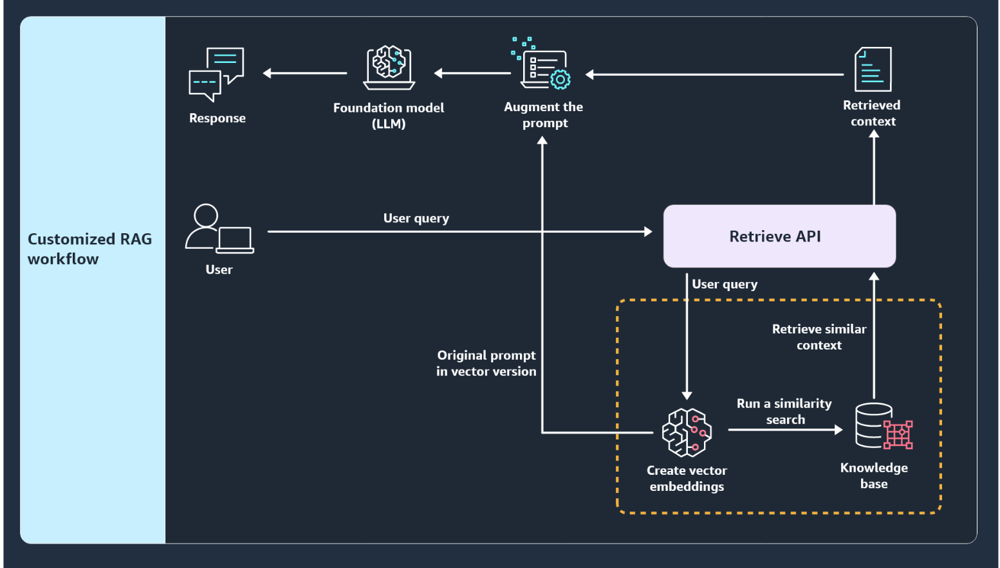

In the customized RAG workflow, the retrieved data from the knowledge base is passed to the customized workflow. The user query first goes to the **Retrieve API**. This API then creates vector embeddings, runs a similarity search, and retrieves similar context. The **Retrieve API** then returns the retrieved context. The user can then use this retrieved context to build other workflows if needed.

---

The following example shows how the **Retrieve API** can work in the **Amazon Bedrock console** when you test your knowledge base. This is the configuration when you turn off the **Generate responses** option. A user asks, **"What is Amazon Bedrock?"** and the output only displays the retrieval results.

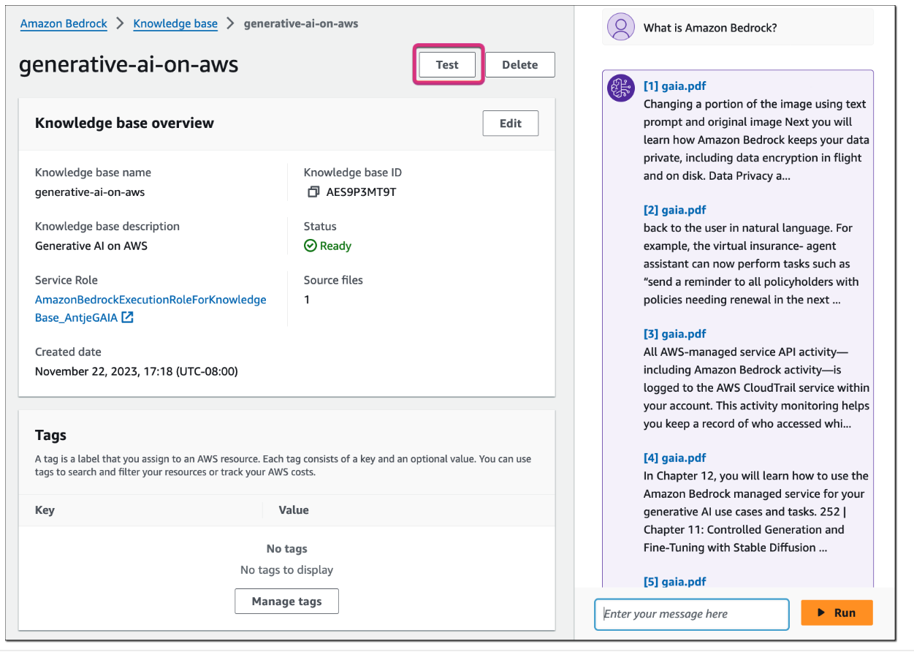

---

The **RetrieveAndGenerate API** queries the knowledge base and uses supported Amazon Bedrock knowledge base models to generate responses from the information that it retrieves. The **Retrieve API** only queries the knowledge base; it doesn't generate responses. Therefore, after retrieving results with the **Retrieve API**, you could use the results in an **InvokeModel** request with any Amazon Bedrock model or an implemented FM in Amazon SageMaker to generate responses.

---

The following example shows how you could use the **Retrieve API** with Python. To learn more about the code, choose the circle-numbered annotations.

```python
import boto3

bedrock_agent_runtime = boto3.client(
    service_name = "bedrock-agent-runtime"
)

def retrieve(querye. kbId, numberOfResults=5):     # 1
    return bedrock_agent_runtime.retrieve(         # 2
        retrievalQuery={
            "text": query                          # 3
        },
        knowledgeBaseId=kbId,                      # 4
        retrievalConfiguration= {                  # 5
            "vectorSearchConfiguration": {
                "numberOfResults": number0fResults
            }
        }
    )

response = retrieve("What is Amazon Bedrock?", "KB12345678")["retrievalResults"]   # 6
```

#### 1. `def retrieve`

This line defines a Python function named retrieve that takes three arguments:

* **query:** This is a string representing the search query.
* **kbid:** This is a string representing the ID of the knowledge base to search.
* **numberOfResults:** This is an optional integer specifying the maximum number of results to return, with a default value of 5.

#### 2. `return bedrock_agent_runtime.retrieve`

This block of code calls the retrieve method of the **bedrock_agent_runtime** client object. It takes three arguments: **retrievalQuery**, **knowledgeBaseld**, and **retrievalConfiguration**.

#### 3. `retrievalQuery`

This is a dictionary containing the search query as the **"text"** value.

#### 4. `knowledgeBaseld`

This is the ID of the knowledge base to search, passed in as the **kbld** argument to the retrieve function.

#### 5. `retrievalConfiguration`

This is a dictionary specifying the configuration for the retrieval operation. In this case, it contains a **"vectorSearchConfiguration"** dictionary with a single key **"numberOfResults"**, which is set to the value of the **numberOfResults** argument passed to the retrieve function.

#### 6. `response = retrieve`

This line calls the **retrieve** function with the query **"What is Amazon Bedrock?"**, the
knowledge base ID **"KB12345678"**, and the default value of **5** for **numberOfResults**. The output of the retrieve function is a dictionary, and this line extracts the value of the **"retrievalResults"** key from that dictionary and assigns it to the response variable.

---

The **Retrieve API** output includes retrieved text chunks, location type, source data URI, and relevance scores. The score helps to determine chunks that match more closely with the query.

The following example shows what the API response looks like.

```python
[{"content": {"text": "Changing a portion of the image using ..."},   # 1
    "location": {"type": "S3",
    "s3Location": {"uri": "s3://amzn-s3-demo-bucket/example.pdf"}},
    "score": 0.7329834},
{"content": {"text": "back to the user in natural language. For ..."},
    "location": {"type": "S3",                                         # 2
    "s3Location": {"uri": "s3://amzn-s3-demo-bucket/example.pdf"}},
    "score": 0.73310883},                                              # 3
# ...
]
```

#### 1. `"content"`

This is a dictionary containing the actual content of the retrieved result. In this case, it has a single key **"text"** with the value being the text content of the result.

#### 2. `"location"`

This is a dictionary specifying the location of the retrieved result. Here, the **"type"** key indicates that the result is stored in an Amazon Simple Storage Service (Amazon S3) bucket. The **"s3Location"** key contains a dictionary with a single key **"uri"**, which is the **S3 URI** of the retrieved result.

#### 3. `"score"`

This is a float value representing the relevance score of the retrieved result for the given query. A higher score indicates a more relevant result.

---

### Integrating RAG with other generative AI tools and applications

What if you want to build an AI assistant that can perform multistep tasks and access company data sources to generate more relevant and context-aware responses? You can integrate knowledge bases with **Amazon Bedrock Agents** to provide contextual information to agents. Amazon Bedrock Agents offers you the ability to build and configure autonomous agents in your application. An agent helps your end users complete actions based on organization data and user input. Agents orchestrate interactions between foundation models, data sources, software applications, and user conversations. In addition, agents automatically call APIs to take actions and invoke knowledge bases to supplement information for these actions.

You can also use the Amazon Bedrock Knowledge Bases retrieval plugin for **LangChain** to integrate RAG workflows into your generative AI applications.

---

## [Lab: Performing RAG with Amazon Bedrock Knowledge Bases](./labs/W080Lab01RagWithAmazonBedrockKnowledgeBases.md)

---

### Knowledge Check

#### Which file format is supported for advanced parsing in Amazon Bedrock Knowledge Bases?

* PDF

Wrong answers:

* HTML
* YAML
* Plain text

##### Explanation

Currently, only the PDF file format is supported for advanced parsing.

The other options are incorrect because of the following reasons:

* HTML and plain text are not supported for advanced parsing.
* YAML is not a supported file format as the data source in Amazon Bedrock Knowledge Bases.

#### What can the maximum file size for a single file be in the data source for Amazon Bedrock Knowledge Bases?

* 50 MB

Wrong answers:

* 5 MB
* 5 GB
* 5 TB

##### Explanation

The other options are incorrect because of the following reasons:

* 5 MB is not the maximum file size for a single file for Amazon Bedrock Knowledge Bases. It is the minimum object size in the Amazon S3 multipart upload.
* 5 GB is the maximum object size in the Amazon S3 multipart upload.
* 5 TB is the maximum object size in an Amazon S3 bucket.

#### What are two APIs that handle the embedding and querying for Amazon Bedrock Knowledge Bases? (Select TWO.)

* Retrieve
* RetrieveAndGenerate

Wrong answers:

* AllocateHosts
* CreateKnowledgeBase
* CreatePrompt

##### Explanation

The **RetrieveAndGenerate API** takes care of the entire Retrieval Augmented Generation (RAG) workflow by starting with converting queries into embeddings. It then runs a similarity search in the knowledge base and augments the user query prompt with the search results. Finally, it returns the foundation model (FM)-generated response to the user's query. The **Retrieve API** converts user queries into embeddings and does the similarity searches in the knowledge base. It then returns relevant results (the retrieved context).

The other options are incorrect because of the following reasons:

* **AllocateHosts** is an API for Amazon EC2. It allocates a Dedicated Host to an AWS account.
* **CreatePrompt** is an API that creates a prompt in the prompt library that a user can add to a flow in Amazon Bedrock.
* **CreateKnowledgeBase** is an API that creates a knowledge base that contains data sources from which information can be queried and used by large language models (LLMs).

---

### Summary

#### Amazon Bedrock Knowledge Bases

Amazon Bedrock Knowledge Bases is a fully managed capability that simplifies the implementation of the Retrieval Augmented Generation (RAG) workflow. It connects foundation models (FMs) and agents to data sources with minimum efforts. It can ingest content from **Amazon Simple Storage Service (Amazon S3)**, **web sources**, **Confluence**, **Salesforce**, or **SharePoint**.

This capability handles content ingestion automatically. It divides content into chunks and converts these chunks to embeddings. It stores embeddings in a vector database. It also supports **advanced parsing** for unstructured data. This includes **PDFs**, **scanned images**, and **complex content like tables**.

You can also use advanced data chunking options, including **custom chunking** with **AWS Lambda functions** or ready-mage components like **LangChain** and **LlamaIndex**. AWS also provides built-in chunking strategies like fixed size, no chunking, hierarchical, or semantic chunking.

The **Retrieve API** fetches relevant results for user queries from knowledge bases. The **RetrieveAndGenerate API** directly uses the retrieved results to augment an original prompt provided by the user and return the response. Knowledge bases can also be added to Amazon Bedrock Agents to provide contextual information. All retrieved information includes citations to promote transparency and minimize hallucinations.

---

### Additional Resources

* [Amazon Bedrock Console](https://console.aws.amazon.com/bedrock/)
* [Retrieve Data and Generate AI Responses with Knowledge Bases](https://docs.aws.amazon.com/bedrock/latest/userguide/knowledge-base.html)
* [Advanced Parsing Options](https://docs.aws.amazon.com/bedrock/latest/userguide/kb-advanced-parsing.html)
* [AI Stylist](https://aistylist.awsplayer.com/)
* [RetrieveAndGenerate API](https://docs.aws.amazon.com/bedrock/latest/APIReference/API_agent-runtime_RetrieveAndGenerate.html)
* [Retrieve API](https://docs.aws.amazon.com/bedrock/latest/APIReference/API_agent-runtime_Retrieve.html)
* [Amazon Bedrock Agents](https://aws.amazon.com/bedrock/agents/)
