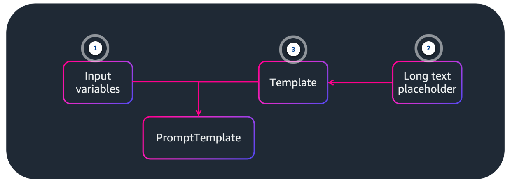
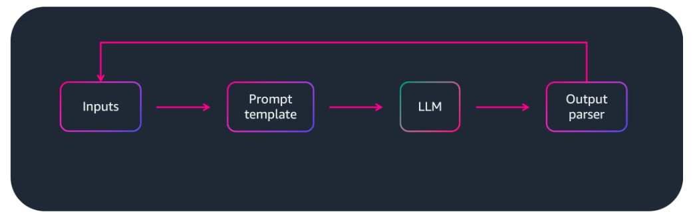
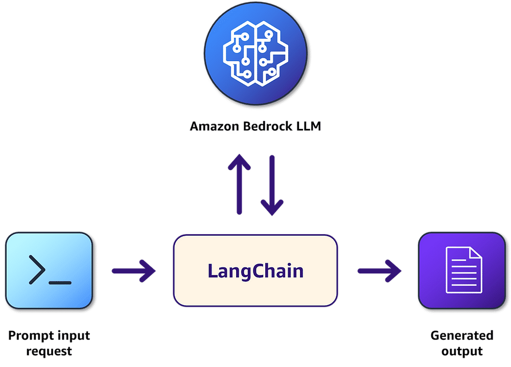
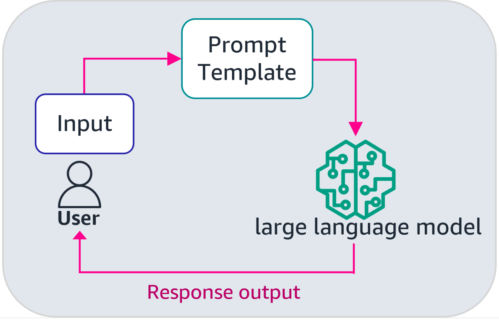
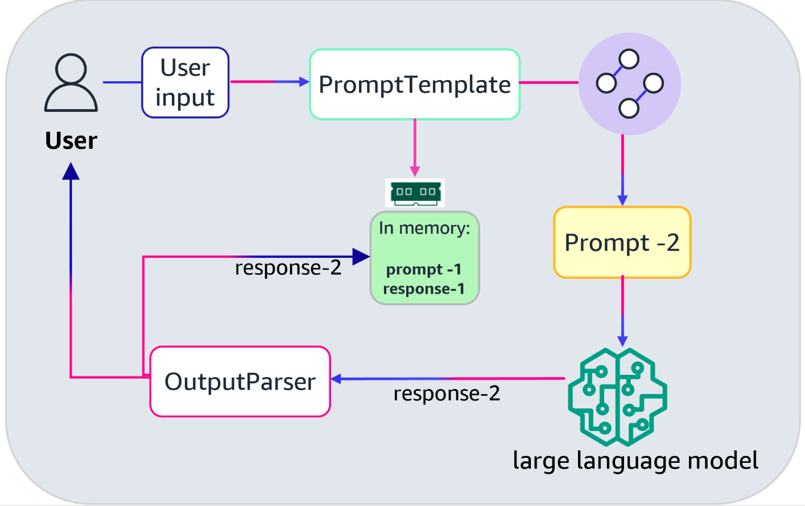

# Week 9: Getting started with LangChain

* back to AWS Cloud Institute repo's root [aci.md](../aci.md)
* back to [AI for Developers](./ai-for-developers.md)
* back to repo's main [README.md](../../../README.md)

## LangChain – Framework for LLM Applications

---

LangChain connects large language models (LLMs) with other data sources to improve the accuracy of responses.

---

### LangChain overview

LangChain is a software development framework. It provides the software building blocks to reduce the complexity of building large language model (LLM) applications.

### LLM performance challenges

LLMs are pre-trained on large data collections. They're generalized and can perform multiple tasks

* text generation
* text summarization
* question answering
* sentiment analysis

Challenges:

* Out-of-domain data or remembering conversational context.
* Hallucinations or inaccurate response.

*LangChain* is a tool that reduces the complexity of building RAG, a prompt history store, or a conversational history store functionality from scratch.

Large language models or foundation models in general are stateless. They don't retain state between invocations. So if we want to provide past context to a large language model, for example, that needs to be managed by the application and passed back into the model with the next prompt.

Large language models can also develop reasoning to solve problems, such as multistep problems, where the application needs to find information in steps to solve a problem.

LangChain provides components to make it more efficient to perform common tasks:

* managing context
* maintaining conversational history
* the sequencing of steps when interacting with a large language model
* building language model applications

### LangChain availability

* Python
* TypeScript
* JavaScript

LangChain chains are a sequence of components that work together to process input, generate language, and handle output in various ways.

LangChain provides components for both the retrieval and generation.

---

### Optimizing LLM performance

LLMs are pre-trained on large data collections, and they can perform multiple tasks, such as text generation, text summarization, question answering, and sentiment analysis.

LLMs don't perform well when the task requires dealing with out-of-domain data or remembering conversational context. These types of tasks can lead to hallucinations or inaccurate responses. In addition, a single prompt to an LLM might not always provide the expected result. It might require providing a sequence of requests—known as chaining—to the model to produce accurate results.

As a developer, you must consider how to handle the application workflow and decide which development approach helps reach your application's goals. A manual approach involves writing the code that handles each task that the application must perform. Alternatively, you could use a software framework that provides existing code that could handle the logic for you.

### Simplifying LLM development with LangChain

LLMs don't retain state between invocations. This requires the LLM application to manage any conversation context. For example, to provide a chat experience, an LLM needs the whole conversation as part of the context to produce the desired results. The whole conversation allows the LLM to provide answers based on previous questions from the user.

Additionally, LLMs can develop reasoning to solve complex problems, such as multistep problems where the application needs to find information in steps to solve a problem. LangChain provides components to make it more efficient to perform the common tasks of managing context or the sequencing of steps when interacting with an LLM.


LangChain components help with writing the logic of an application.

A Retrieval Augmented Generation (RAG) application can be built with Amazon Bedrock. LangChain has components that help you build a RAG application from scratch. Or, if you prefer, LangChain helps you build LLM applications that follow other advanced prompting techniques. You can also use these components for text summarization, code generation, and interacting with various APIs.

### Supported languages

LangChain provides support for a variety of programming and markup languages. This allows you to work in the language of your choice for various tasks, such as parsing source code and text splitting.

LangChain supports languages such as JavaScript, Python, and TypeScript. For text splitting, it supports HTML, LaTeX, and Markdown. Because LangChain is open source and continually evolving, always refer to the LangChain documentation for updated lists of supported languages and features.

### LangChain limitations and challenges

As with all technology, ensure that you understand what LangChain can do and what is out of scope. Understanding the framework's limitations helps you develop a more robust development approach to building your LLM application.

#### Performance overhead

The modular design and comprehensive features of LangChain might introduce some performance overhead, particularly in applications that require real-time responses.

For example, complex chaining of components could introduce latency in your application. Integrating multiple external tools or services increases processing and wait times. It's best to carefully optimize your implementation and monitor any performance impact.

#### Incomplete documentation

LangChain is an ever-evolving software development framework for building LLM applications. A small team is focused on building and improving its functionality. Often, the team depends on the LangChain community to help improve the documentation for accuracy, clarity, and typographical errors. This means that the LangChain documentation doesn't consistently provide exhaustive details and explanations about how to use available components.

For example, when reading about the *LLMChain* class, you might overlook important parameters like *temperature* or *max_tokens* because their descriptions and default values are not clearly stated in the documentation. You might have to go outside of the documentation to learn how to use several components.

#### Debugging complexity

Troubleshooting issues with multiple LangChain components can be challenging, especially when you consider how those components are orchestrated. Each LangChain component adds a layer of abstraction to your coding.

To benefit from LangChain, you need to use multiple components because you are adding layers of abstraction between your code and the underlying service APIs that your application uses. Orchestrating a complex component sequence introduces many potential points of failure that you must debug to resolve the source of an error. You could be in a situation where you will have to look into the LangChain source code to isolate application errors.

#### LangChain evolution

LangChain is a relatively new framework that's still in development. As such, there is a high frequency of updates and potential changes, some of which might break your application.

---

Being aware of both the functionality of LangChain and its limitations can help guide your decisions around using LangChain in your LLM application projects. Limitations discussed are based on the current version, and capabilities might change in future releases.

It is a good practice to stay updated with the latest LangChain documentation and community resources as you build your LLM application.

By using a framework like LangChain, you can simplify application development. LangChain abstracts away many of the complexities involved in building LLM applications, allowing you to focus on the high-level application logic.

---

## LangChain Architecture

Large language model (LLM) applications provide a unique set of components that differ from traditional software architecture models. Not every LLM application requires each component. The following diagram illustrates available components that you might want to include in your application. The goal of your LLM application determines which components are appropriate to use. 

Take a moment to learn more about the LLM software architecture.


### 1. User interface

Similar to traditional applications, LLM applications require a user interface for interaction. However, you should design the user interface to handle natural language inputs and outputs effectively.

### 2. Prompt

LLM applications require careful assembly of user inputs, system prompts, and chat history.
After assembly, the combined information is sent to the LLM to generate an appropriate response.

### 3. Knowledge base

Your LLM app might need to access external knowledge bases. You can implement interfaces to retrieve relevant information that
complements the LLM's inherent knowledge.

### 4.Memory

Unlike stateless traditional applications, LLM apps often require memory components to maintain context across interactions. You might need to implement mechanisms to store and retrieve conversation history.

### 5. Data preparation

When you use a knowledge base, you must first preprocess and format the data before storing it in the knowledge base for LLM consumption.

This step involves cleaning, structuring, and optimizing data to improve the LLM's performance.

### 6. Orchestration

When you want your application to handle complex tasks, you need a mechanism to orchestrate the sub-tasks. The mechanism needs to manage the interactions with an LLM or other application interfaces.

### 7. Plugins

To extend functionality, you can develop plugins that connect your LLM application to external APls. These integrations allow for realtime data access and additional capabilities.

### 8. LLM

Your application might interact with the LLM multiple times before it sends a response back to the user. You also might want your application to interact with multiple LLMs from a single prompt.

---

Developing each application component for your LLM application adds complexity challenges and a long list of tasks to complete. As a developer, you could either build each one yourself, or you could use a software framework to help you. A software development framework that helps with building LLM applications should provide tooling that aligns to this LLM software architecture. 

---

### LangChain architecture

The architecture of the LangChain framework consists of open source software packages. These packages align with the application components of the preceding LLM software architecture diagram. The LangChain architecture can be extended with other packages developed and maintained by the LangChain company.

The extended LangChain architecture is described in the following diagram.


### 1. langchain

The main package offers a wide range of tools and utilities for LLM application development. You will find pre-built chains, agents, output parsers, and other high-level abstractions here.

### 2. langchain-core

This package contains the fundamental building blocks (the base abstractions) for LangChain applications. You use it to create core components and define basic interfaces.

Example components in this package include prompt templates, language models, and document loaders.

### 3. Partner packages

LangChain provides additional packages developed in collaboration with partners. These extend the framework's capabilities and offer specialized functionalities for specific use cases.

The *langchain_aws* package is an example of a partner package.

### 4. langchain-community

This package provides community-contributed integrations and extensions of core LangChain components. You can use it to incorporate additional functionalities and connect to various services.

### 5. langgraph

Lang Graph (the langgraph package) helps you build complex, multistep workflows for your LLM applications. You use it to create sophisticated reasoning and decision-making processes.

### 6. langserve

With LangServe (the langserve package), you can deploy your LangChain applications as API endpoints. It simplifies the process of making your LLM apps accessible over the network.

### 7. LangSmith

LangSmith offers tools for testing, monitoring, and debugging your LLM applications. You use it to ensure the quality and reliability of your LangChain-based projects. LangSmith is a commercial offering from LangChain.

---

LangChain provides additional functionalities to help developers with integrating LangChain components. Specifically, LangChain offers the LangChain Expression Language (LCEL).

---

## LangChain Components

* Optimizing LLM performance
* Using models with LangChain
* Constructing prompts
* Structuring documents with indexes
* Storing and retrieving data with memory
* Using chains to sequence components
* Managing external resources with LangChain agents

### LLMs: Interacting with Bedrock through LangChain

LangChain provides LLM components to interact with different language models.

```python
from langchain.lIms import Bedrock

inference_modifiers = {"temperature": 0.3, "maxTokenCount": 512}

Ilm = Bedrock(
    client = boto3_bedrock,
    model_id="amazon.titan-tg1-large",
    model_kwargs=inference_modifiers
)

response = IIm.predict("What is the largest city in Vermont?")

print(response)
```

---
Here we're interacting with Bedrock via Bedrock class imported from `llm` module of `langchain` library. Before we used boto3 SDK to interact directly with the Bedrock.

---

### Chat models

* **Input**

```python
from langchain.chat_models.bedrock import BedrockChat
from langchain.schema import HumanMessage
chat = BedrockChat(model_id="anthropic.claude-v2", model_kwargs={"temperature":0.1})

messages = [
    HumanMessage(
        content="I would like to try Indian food. Name three Indian vegetarian dishes for a meal."
    )
]
chat(messages)
```

* **Sample response**

```log
Response:
AlMessage(content="Here is a list of Indian vegetarian dishes for a meal: aloo gobi, chana masala, and dal tadka.", additional_kwargs={}, example=False)
```

---

### Constructing prompts

The prompt is a single text instruction given to the LLM as input to get a response.

Good prompt:

* Instructions to the model
* Context - external information to guide the model
* Input data
* Output indicator

---

### Prompt templates in LangChain

```python
from langchain import PromptTemplate

# Create a prompt template that has multiple input variables
multi_var_prompt = PromptTemplate(
    input_variables=["customerName", "feedbackFromCustomer"], 
    template="""
    Human: Create an email to {customerName} in response to the following customer service feedback that was received from the customer:
    <customer_feedback>
        {feedbackFromCustomer}
    </customer_feedback>
    Assistant:"""
)
# Pass in values to the input variables
prompt = multi_var_prompt.format(customerName="John Doe",
    feedbackFromCustomer="""
    Hello AnyCompany,
    I am very pleased with the recent experience I had when I called your customer support.
    I got an immediate call back, and the representative was very knowledgeable in fixing the problem.
    We are very happy with the response provided and will consider recommending it to other businesses.
    """
)
```

---

### Chat models in detail

*Chat models* are a type of language models designed to handle conversational interactions by taking a sequence of messages as input and returning a new message as output. In LangChain, chat model components are used when building applications that require a dialog-like experience. These components serve as wrappers around the APIs of various chat model providers, including Amazon Bedrock. LangChain chat model components ensure a consistent programming interface, independent of the underlying API. Chat models help developers reduce the amount of code changes when switching providers or models during development and testing.

The following diagram illustrates how LangChain's Amazon Bedrock components interact with Amazon Bedrock service APIs.


ChatBedrock is a wrapper for the Amazon Bedrock InvokeModel API, and ChatBedrockConverse is a wrapper for the Amazon Bedrock Converse API.

When working with chat models, you can do the following:

* Pass a string input, which will be converted automatically to a LangChain message (for example, HumanMessage)
* Pass a list of messages, which the chat model will use as the context for generating a new response
* Configure parameters when initializing the chat model, like temperature, max tokens, and more

LangChain's *chat model classes* use a set of standard parameters when creating an instance. The number of parameters defined depends on two factors—the specific requirements for using the language model and the particular model provider chosen. The defined parameters determine how the language model operates in your application.

The following list is a non-exhaustive list of chat model parameters:

* **model_id:** Name of the model
* **temperature:** Sampling temperature
* **stop:** Default stop sequences

```python
from langchain_aws import ChatBedrock
from langchain_core.prompts import ChatPromptTemplate
from langchain_core.output_parsers import StrOutputParser

model_kwargs = {
   "max_tokens": 512,  # Updated parameter name
   "temperature": 0.8
}

# Create the system and human messages using ChatPromptTemplate

prompt = ChatPromptTemplate.from_messages([
  ("system", "You are a helpful AI instructor that teaches about AI topics. Respond in a friendly way."),
   ("human", "What is top_p in an LLM configuration?  Explain in 1 sentence."),
])

# Initialize the model
llm = ChatBedrock(
   model_id="amazon.titan-text-premier-v1:0",
   model_kwargs=model_kwargs
)

# Create the chain using LCEL
chain = prompt | llm | StrOutputParser()

# Execute the chain
response = chain.invoke({})

print(response)
```

* **Output**

```log
AIMessage(content="Hey there, let's dive into the fascinating world of language models! 🤖\n\nTop-p, also known as nucleus sampling, is a technique used to generate text from a language model."
```

The preceding code instantiates a **ChatBedrock** instance. It also specifies the LLM, the parameters for the LLM, and the client configuration for Amazon Bedrock. It uses the **.invoke()** method to send the content of **messages** to the Amazon Titan LLM. LangChain recommends using the **.invoke()** method when passing prompts to LLMs.

---

#### Amazon Bedrock

LangChain supports Amazon Bedrock as an LLM. Input sent to an instantiated LLM object is formatted into a string before being passed to the target model. To learn more about the parameters for the *BedrockLLM* class, visit the LangChain documentation link in the Additional Resources section.

---

The following code example demonstrates how to create an instance of the Amazon Bedrock class and invoke the Amazon Titan LLM from the LangChain *Bedrock* module. The **model_id** is the value of the selected model available in Amazon Bedrock. Note that the Amazon Titan LLM used in the code example is not a low-level LLM, but it can accomplish text-prediction tasks.

```python
from langchain_aws.llms import BedrockLLM
import boto3

boto3_bedrock = boto3.client('bedrock-runtime')
inference_modifiers={"temperature": 0.3, "maxTokenCount": 512}

llm = BedrockLLM(
   client = boto3_bedrock,
   model_id = "amazon.titan-text-premier-v1:0",
   model_kwargs = inference_modifiers
)

response = llm.invoke("What is the largest city in Vermont?")
print(response)
```

---

### Prompt templates

A *prompt* is a single text instruction given to an LLM as input to get a response. When building complex generative AI applications, you might need to construct prompts in a specific way. You can include instructions, context, or examples, and dynamically populate input variables to guide the LLM to return output to meet your requirements.


#### 1. Accept user input

The frontend user interface of your application prompts the user to provide the custom values of the prompt. The custom values could be questions or product categories.

#### 2. Prompt template

The user's input is provided to the prompt template in your application. Prompt templates provide a way to create reusable prompts with placeholders for dynamic content. LangChain converts the prompt template to a prompt.

#### 3. Prompt

LangChain offers other capabilities to augment the prompt before sending it to the LLM. The completed prompt is sent to the LLM to process.

---

LangChain provides different types of prompt templates. The following list highlights a few available templates:

* **PromptTemplate:** A template used to format a single string input.
* **ChatPromptTemplate:** A template use to format a sequence of messages, with each message having a role (user, system, and so forth).
* **FewShotPromptTemplate:** A special prompt template used to send a a few-shot prompt to an LLM. This template combines example shots and a PromptTemplate into one component.

---

You can use prompt templates to prepare the input for your preferred LLM.

The following code example implements the **ChatPromptTemplate** template.

```python
from langchain_core.prompts import ChatPromptTemplate

# Create a prompt template that has multiple input variables
template = ChatPromptTemplate([
 ("system", "You are a helpful customer support agent for an e-commerce company."),
 ("human", "I have a question about {product_category}."),
 ("ai", "Certainly! I'd be happy to help you with your question about {product_category}. What would you like to know?"),
 ("human", "{user_question}")
])

# Pass in values to the input variables
formatted_prompt = template.format_messages(
  product_category="electronics",
  user_question="What's the warranty period for laptops?"
)
```

* **Output**

```log
# Output
system: You are a helpful customer support agent for an e-commerce company.
human: I have a question about electronics.
ai: Certainly! I'd be happy to help you with your question about electronics. What would you like to know?
human: What's the warranty period for laptops?
```

The preceding code example creates a structured conversation template for a customer support scenario. The code uses the **.format_messages()** method to define the placeholders in the template variable. The code could be updated to accept input directly from a user to define the **product_category** and **user_questio**n variables.

---

### Few-shot prompting with LangChain

LangChain offers prompt templates that go beyond creating a template with placeholders for user input. For example, suppose you want to create a template that incorporates the few-shot prompting technique. LangChain provides a template for this technique, but you must define the required values prior to its creation.



#### 1. Input variables

In this example, input variables are provided to capture dynamic values for the prompt template.

#### 2. Long text placeholder

Few-shot prompting involves providing multiple examples of how the LLM should respond to a prompt. This typically involves a large amount of text. In this kind of case, it's best to separate the examples from the template.

#### 3. Template

The template itself is defined independently of any examples. It holds placeholders for both input variables and examples you intend to pass to the LLM in the prompt. All three components will create the PromptTemplate component.

---

### Few-shot code example

The following code examples demonstrate how you can build a few-shot prompting template that instructs an LLM to determine the sentiment of a sentence.

---

#### 1. Define the shot examples

```python
from langchain_core.prompts import FewShotPromptTemplate
from langchain_core.prompts import PromptTemplate

few_shots_examples = [
  {
        "review": "I love this course",
        "sentiment": "positive"
 }, {
        "review": "I did not have much experience with AI ",
        "sentiment": "neutral"
 }, {
       "review": "This topic is really hard and I will not be able to pass this course.",
       "sentiment": "negative"
 }
]

few_shots_prompt = PromptTemplate(
    input_variables=["review", "sentiment"],
    template= """
                human: {review}
                ai: {sentiment}
               """
)
# Don't try to format the entire list at once
# Instead this will be handled by the FewShotPromptTemplate
instruction = "Identify the sentiment of the following sentence in one word"
new_review = "Wow, this is an amazing framework to use."

few_shot_prompt_template = FewShotPromptTemplate(
 examples=few_shots_examples,
 example_prompt=few_shots_prompt,
 prefix=instruction,
 suffix="human: {input}\nai:", # This is the pattern for the new input
 input_variables=["input"], # Changed to match the variable name we'll use
)

from langchain_aws.llms import BedrockLLM
import boto3
boto3_bedrock = boto3.client('bedrock-runtime')

inference_modifiers={"temperature": 0.3, "maxTokenCount": 512}

llm = BedrockLLM(
   client = boto3_bedrock,
   model_id = "amazon.titan-text-premier-v1:0",
   model_kwargs = inference_modifiers
)

# Format the prompt with the new review as the input
formatted_prompt = few_shot_prompt_template.format(input=new_review)
response = llm.invoke(formatted_prompt)

print(response)
```

The preceding code block places the sentiment examples in a list of dictionaries and assigns the list to the variable **few_shots_examples**.

---

#### 2. Define the few-shots template

```python
few_shots_prompt = PromptTemplate(
     input_variables=["review", "sentiment"],
 template= """
             human: {review}
             ai: {sentiment}
            """
)
```

The preceding example code creates a prompt template that can accept the sentiment examples. To test the template, you can use the following line.

```python
print(few_shots_prompt.format(**few_shots_examples[0]))
```

* **Output**

```log
# Output
human: I love this course
ai: positive
```

The first sentiment example is printed to the screen.

---

#### 3. Assemble the few-shot template

```python
few_shots_prompt = PromptTemplate(
    input_variables=["review", "sentiment"],
    template= """
                human: {review}
                ai: {sentiment}
               """
)

# Don't try to format the entire list at once
# Instead this will be handled by the FewShotPromptTemplate
instruction = "Identify the sentiment of the following sentence in one word"
new_review = "Wow, this is an amazing framework to use."

few_shot_prompt_template = FewShotPromptTemplate(
 examples=few_shots_examples,
 example_prompt=few_shots_prompt,
 prefix=instruction,
 suffix="human: {input}\nai:", # This is the pattern for the new input  input_variables=["input"], # Changed to match the variable name we'll use

)

from langchain_aws.llms import BedrockLLM
import boto3

boto3_bedrock = boto3.client('bedrock-runtime')

inference_modifiers={"temperature": 0.3, "maxTokenCount": 512}

llm = BedrockLLM(
   client = boto3_bedrock,
   model_id = "amazon.titan-text-premier-v1:0",
   model_kwargs = inference_modifiers
)

# Format the prompt with the new review as the input
formatted_prompt = few_shot_prompt_template.format(input=new_review)
response = llm.invoke(formatted_prompt)

print(response)
```

In this example, all of the previous components and variables are added to the **FewShotPromptTemplate**. You can expect the LLM to follow the examples format. The LLM will evaluate the provided input and offer a single-word response. You can use the **.invoke()** method to test it. The following code is an example.

```python
# Format the prompt with the new review as the input
formatted_prompt = few_shot_prompt_template.format(input=new_review)
response = llm.invoke(formatted_prompt)

print(response)
```

* The output should be *'Positive'*.

---

### Messages

The LangChain messages component provides structure to a conversation between a user and an AI assisted application. Messages are the basic units of communication in a chat-based application, and the messages component helps organize and parse various types of messages between a user and an application. Although you could write your own messages syntax, the messages component offers maintainable code and simpler integration with other LangChain components.

The following code snippets illustrate the difference between using and not using the **messages** component.

* **Python example**

```python
from langchain_core.prompts import ChatPromptTemplate

chat_template = ChatPromptTemplate.from_messages(
    [
      ("system", "You are a helpful AI expert that answers a AI queries."),
      ("human", "{user_query}"),
   ]
)

messages = chat_template.format_messages(user_query="What does top_p mean for the Anthropic Claude model?")
```

* **LangChain messages example**

```python
from langchain_core.prompts import HumanMessagePromptTemplate, SystemMessagePromptTemplate, ChatPromptTemplate

chat_template = ChatPromptTemplate.from_messages(
    [
      SystemMessagePromptTemplate.from_template("You are a helpful AI expert that answers AI queries"),
      HumanMessagePromptTemplate.from_template("{query}"),
    ]
)

messages = chat_template.format_messages(query="What does top_p mean for the Anthropic Claude model?")
```

The **messages** component offers several other benefits for application developers, including the following:

* **Standardization and consistency:** It provides a standardized way to structure and handle messages across different parts of your application. This consistency helps with maintaining your code base, especially when you're working with various language models or APIs.
* **Built-in functionality:** It comes with pre-built functionality, such as handling different message types (such as human, AI, or system), metadata, and additional attributes. This saves you time and effort because you don't have to implement these features from scratch.
* **Extensibility:** It is designed to be extensible, so you can add custom properties or methods as needed. This flexibility accommodates a wide range of use cases and requirements.
* **Future-proofing:** It helps ensure that your application can easily adopt new features and improvements as LangChain continues to evolve and improve.

#### Types of messages

LangChain provides different message classes to represent messages from different roles.

* **HumanMessage:** Represents a message from the user.
* **AIMessage:** Represents a message from the AI assistant. This message also contains metadata about the response.
* **SystemMessage:** Represents a message that sets the behavior or instructions for the AI assistant. Not every model provider supports this message type.
* **ToolMessage:** Represents the result of calling an external tool from the AI assistant.

The following code example demonstrates how you can use the **HumanMessage** and **SystemMessage** components.

```python
from langchain_core.messages import HumanMessage, SystemMessage
from langchain_aws import ChatBedrock
from langchain_core.messages import HumanMessage

# Create the BedrockChat model
llm = ChatBedrock(
   model_id="anthropic.claude-3-haiku-20240307-v1:0",
   model_kwargs={"temperature": 0.1},
   region="us-east-1"
)

# Instantiate system and human message instances
messages = [
   SystemMessage(content="Translate the following from English into Italian"),
   HumanMessage(content="Hello!"),
]

response = llm.invoke(messages)
translated_text = response.content

print(f"Translated text: {translated_text}")
```

* **Output**

```log
content='Ciao!' additional_kwargs={'usage': {'prompt_tokens': 17, 'completion_tokens': 7, 'total_tokens': 24}, 'stop_reason': 'end_turn', 'model_id': 'anthropic.claude-3-sonnet-20240229-v1:0'} response_metadata={'usage': {'prompt_tokens': 17, 'completion_tokens': 7, 'total_tokens': 24}, 'stop_reason': 'end_turn', 'model_id': 'anthropic.claude-3-sonnet-20240229-v1:0'} id='run-d56f8251-7f91-4bd0-af7e-40edc7b20b5a-0' usage_metadata={'input_tokens': 17, 'output_tokens': 7, 'total_tokens': 24}
```

---

### Output parsers

When building an LLM application, you might need to parse the output either before sending it back to a user or as input to a function in your application. LangChain provides output parsers to help provide structure to an LLM's output. Output parsers are used to transform the text output from an LLM into different structured representations, like JSON, YAML, or Pydantic model.



The diagram shows the process for how input passes into a prompt template, which is then passed to an LLM. An output parser parses the output, so it can be used as input for another part of the application.

LangChain provides various output parsers that you can use, such as *JsonOutputParser*, *XMLOutputParser*, *StrOutputParser*, and so forth. By using an output parser, you can ensure that the LLM's response is in a friendly format that your application can use as input.

#### Step 1: JsonOutputParser

```python
from langchain_core.output_parsers import JsonOutputParser

# <Some code omitted for this example>

llm = ChatBedrock(
    model_id=model_id,
 model_kwargs=model_kwargs,
 client=bedrock_client
)

# Create a prompt template for JSON output
prompt = PromptTemplate(
 input_variables=["topic"],
 template="Generate a JSON object about {topic} with the following keys: 'name', 'description', and 'key_features' (as a list). Ensure the output is valid JSON."
)

# Initialize the JsonOutputParser
parser = JsonOutputParser()

# Create the chain
chain = prompt | llm | parser

# Invoke the chain
result = chain.invoke({"topic": "artificial intelligence"})

print(result)
```

The preceding example code imports the **JsonOutputParser** from the **langhcain_core.output_parsers** module. This parser handles JSON-formatted output. It initializes an instance named parser. A JSON-formatted string is passed to the ***parser***. In this example, the string is parsed into a Python-friendly format. The prompt instructs the LLM to return output in a JSON format.

The output from the LLM could appear as follows.

```log
{'name': 'AI', 'description': 'Artificial intelligence', 'key_features': ['Machine learning', 'Natural language processing', 'Robotics', 'Computer vision']}
```

#### Step 2: CommaSeparatedListOutputParser

```python
from langchain.output_parsers import CommaSeparatedListOutputParser

# <Some code omitted for this example>

# Instantiate a comma separated list output parser
output_parser = CommaSeparatedListOutputParser()
format_instructions = output_parser.get_format_instructions()

# Instantiate a prompt template instance
prompt = PromptTemplate(
  template="List five {topics_to_learn_in}.\n{format_instructions}",    input_variables=["topics_to_learn_in"],    partial_variables={"format_instructions": format_instructions},
)

# Create the chain
chain = prompt | llm | output_parser

print(format_instructions)

result = chain.invoke({"topics_to_learn_in": "artificial intelligence"})

print(result)
```

In the preceding example code, an instance of the **CommaSeparatedListOutputParser** is assigned to the **output_parser** variable. As the name implies, this output parser will parse the response of an LLM into a Python-list friendly format. The prompt template in the example code instructs the LLM to return a list of five topics in a desired output format. The print statement should yield the following output:

```output
Your response should be a list of comma separated values, eg: `foo, bar, baz` or `foo,bar,baz`
```

If the value of topics_to_learn_in is AI, then you can expect similar output from an LLM as follows:

```output
['ChatGPT', 'Alexa', 'Siri', 'Google Assistant', 'IBM Watson.']
```

---

### Document loaders

*Document loaders* allow you to ingest and structure raw data from a variety of sources, such as code, HTML, and PDF. A document loader can convert or structure raw data into document objects that are used by your application.

Document loaders are a first step to building retrieval-based applications that allow you to use technologies like Retrieval Augmented Generation (RAG) to query external or internal documents. Being able to query internal documentation allows you to build an internal chatbot to answer questions about your business. You could have an HR or benefits chatbot answer employee questions around company policies or benefits. Perhaps you could provide a technical support team with product documentation allowing them to ask and get answers more quickly to support your customers.

Document loaders help you simplify preprocessing workflows. You can split long documents into chunks; add metadata, like author, version, and create date; or normalize and clean the text. Allowing a document loader to complete these tasks makes indexing and embeddings faster, streamlining your document pipeline.

---

## Demonstration: Using LangChain with Amazon Bedrock

We are going to generate an email to an unhappy customer, and we're going to provide additional context by giving the model the actual email received from that unhappy customer. So the model, in this case, it's going to be Claude, can hopefully provide a much more personalized and relevant response to the customer. Now to do this, we are going to be using LangChain to pass in the context, which in this case is the customer email, into a predefined LangChain prompt template.



Bedrock with LangChain using a Prompt that includes Context.

### 1. Setup

```python
import json
import os
import sys
import boto3

module_path=".."
sys-path.append(os.path.abspath(module_path))
from labutils import bedrock, print_ww

# ---- Un-comment and edit the below lines as needed for your AWS setup ---

# os.environ ["AWS_DEFAULT_REGION" ] = "<REGION_NAME»" # E.g. "us-east-]"
# os. environ ["AWS_PROFILE" J = "«YOUR_PROFILE›"
# os. environ ["BEDROCK_ASSUME_ROLE" ] = "<YOUR_ROLE_ARN»" # E.g. "arn:aws:..."

boto3_bedrock = bedrock.get_bedrock_client(
    assumed_role os.environ.get ("BEDROCK_ASSUME_ROLE", None), 
    region os.environ-get ("AWS_DEFAULT_ REGION", None)
)
```

### 2. Reference the Bedrock LLM

```python
from langchain.llms.bedrock import Bedrock

inference_modifier = { "max_token_to_sample": 4096,
    "temperature": 0.5,
    "top_k": 250,
    "top_p": 1,
    "stop_sequences": "\n\nHuman"
}

textgen_llm = Bedrock(model_id="anthropic.claude-v2",
                client=boto_bedrock,
                model_kwargs=inference_modifier
)
```

### 3. Create a LamgChain custom prompt template

```python
from langchain.prompts import PromptTemplate

# Create a prompt template that has multiple input variables
multi_var_prompt = PromptTemplate(
    input_variables("customerServiceManager", "customerName", "feedbackFromCustomer"),
    template: """
    
    Human: Create an apology email from the Service Manager {customerServiceManager} to {customerName} in response to the following feedback that was received from the customer:
    <customer_feedback>
    {feedbackFromCustomer}
    </customer_feedback>

    Assistant:"""
)

# Pass in values to the input variables
prompt = multi_var_prompt.format(customerServiceManager="Bob",
                                 customerName="John Doe", 
                                 feedbackFromCustomer="""Hello Bob,
    I am very disappointed with the recent experience I had when I called your customer support.
    I was expecting an immediate call back but it took three days for us to get a call back.
    The first suggestion to fix the problem was incorrect. Ultimately the problem was fixed after three days.
    We are very unhappy with the response provided and may consider taking our business elsewhere.
    """
    )
```

### 4. Print the number of tokens in the prompt (for interest/debug)

Wwe calculate the number of tokens - and our prompt has 127 tokens. This can be useful because different models have different limits on the number of tokens that can be passed in: models don't have an infinite number of memory.

```sh
%pip install anthropic
```

```python
num_tokens = textgen_llm.get_num_tokens(prompt)
print(f"Our prompt has {num_tokens} tokens")
print(prompt)
```

```output
Human: Create an apology email from the Service Manager Bob to John Doe in response to the following feedback that was received from the customer:
<customer_feedback>
Hello Bob,
    I am very disappointed with the recent experience I had when I called your customer support.
    I was expecting an immediate call back but it took three days for us to get a call back.
    The first suggestion to fix the problem was incorrect. Ultimately the problem was fixed after three days.
    We are very unhappy with the response provided and may consider taking our business elsewhere.

</customer_feedback>

Assistant:
```

### 5. Invoke the model and print the response

```python
response = textgen_llm(prompt)
email = response[response.index('\n')+1:]
print_ww(email)
```

```output
I want to sincerely apologize for the poor service you recently received from our customer support team. Based on the feedback you provided, it is clear we failed to meet your expectations and provide you with the timely, knowledgeable support you deserve.

I was disappointed to hear that it took three days to receive a callback after your initial request. That is unacceptable, and I will be working with our team to ensure we have proper staffing and procedures in place to provide prompt responses in the future Additionally, I'm troubled that you were given incorrect advice that prolonged getting the issue resolved. This highlights a need for improved training to equip our agents with the knowledge necessary to diagnose and fix problems quickly and accurately.

I realize that this experience has understandably caused frustration and may lead you to take your business elsewhere. I want to assure you that we are taking steps to prevent this from happening again. Your business is important to us, and we are committed to earning back your trust by providing exemplary customer service.

Please accept my sincere apologies for letting you down. I would welcome the opportunity to discuss this further and hear any additional feedback you may have on how we can improve. Feel free to reach me directly at 555-1234. I hope we can work together to ensure you receive the excellent service you expect and deserve going forward.

Sincerely,

Bob,
Service Manager
```

This message is much more personalized.

---

### Knowledge Check

#### Which challenges does LangChain help address when developers work with large language models (LLMs)? (Select TWO.)

* Maintaining conversational context
* Performing multistep reasoning tasks

Wrong answers:

* Simplifying the deployment and scaling of LLMs
* Data preprocessing for training language models
* Fine-tuning foundational models

##### Explanation

LangChain provides tools and abstractions for managing conversation state. LangChain offers components for complex chaining sequences and task-specific agents.

The other options are incorrect for the following reasons:

* LangChain is not primarily focused on fine-tuning the performance of language models themselves. Instead, it provides an abstraction layer and tools for building applications that use existing pre-trained language models effectively.
* LangChain does not focus on deployment or scaling of LLMs.
* LangChain is not designed for data preprocessing for training language models.

#### What is the purpose of orchestration in a large language model (LLM) software architecture? 

* It manages the interactions with an LLM or other application interfaces.

Wrong answers:

* It optimizes a language model's internal neural network structure.
* It handles data preprocessing before input to the LLM.
* It connects an LLM application to external APIs.

##### Explanation

Orchestration ensures that requests are properly routed, responses are handled, and the overall system functions cohesively.

The other options are incorrect for the following reasons:

* Optimizing a language model's internal neural network structure is performed during model training.
* Data preparation components handle data preprocessing.
* Plugins connect an LLM application to external APIs.

#### A developer working on a LangChain application intends to evaluate large language model (LLM) initial responses before sending them back to a user. Which LangChain component could the developer use to accomplish this task?

* Output parser

Wrong answers:

* Chat prompt template
* Response schema
* Document Loader

##### Explanation

Output parsers are designed to process and structure the raw output from language models. They can be used to validate, format, or extract specific information from an LLM's response. In this case, the developer can implement custom logic with an output parser to evaluate the initial responses, based on certain criteria, before they are sent to the user.

The other options are incorrect for the following reasons:

* A chat prompt template is used to structure input for the LLM, not evaluate its output.
* Document loaders are used to import and process various types of documents or data sources for use in LLM applications. They are not designed to evaluate or modify LLM responses.
* Although a response schema is used to define response structure, it doesn't provide the functionality to process output.

---

### Summary

* LangChain is a software development framework that helps reduce the complexity of building large language model (LLM) applications. LLMs are language models trained on large datasets, but they struggle with tasks that require dealing with out-of-domain data or remembering conversational context. Because of this, responses can sometimes be inaccurate or unusable.
* LangChain provides components to make it easier to perform common tasks while interacting with LLMs, such as managing context, sequencing multistep reasoning, and integrating external data sources.
* LangChain is an open source project available in JavaScript, Python, and TypeScript. It is built on the concept of *chains*. Chains are sequences of components that work together to process input, generate language, and handle output. LangChain simplifies the application development process, as compared to coding the logic from scratch.

---

### Additional Resources

* [LangChain documentation](https://python.langchain.com/docs/introduction/)
* [LangChain releases](https://js.langchain.com/docs/versions/release_policy/)
* [LangChain integrations](https://python.langchain.com/docs/integrations/platforms/aws/)
* [LangServe](https://python.langchain.com/docs/langserve/)
* [ChatBedRock](https://python.langchain.com/docs/integrations/chat/bedrock/)
* [LangChain is an open source project licensed under the MIT License](https://langchain.com/)

## Describing LangChain Chains

---

Chains allow you to build sophisticated workflows using multiple smaller components.

---

LangChain is an open source framework for building applications based on large language models (LLMs). By definition, a *framework* is a set of tools designed to help simplify the development, training, and deployment of LLM applications. LangChain is a set of tools, or abstractions, that help developers connect LLMs.

The LangChain framework uses its toolset to provide responses that are accurate and efficient. LangChain responses are built using responsible AI practices, such as fairness, safety, transparency, privacy, security, and governance.

### Defining chains

*Chains* are the underlying building blocks on which LangChain operates. A chain is a sequence of steps, or components, designed to complete tasks in a specific order. Think of a chain as a pipeline. Each step in the chain passes information to the next step. Each step is reusable, allowing you to create complex applications using small, easy-to-build modules that can be linked together. Each step in the chain has an input that is processed and then passed as output (or information) to the next step in the chain.


Input + PromptTemplate + LLM equals a Chain.

The idea of chaining also applies to linking, or chaining, the chains themselves. LangChain allows you to create a chain made of other chains. This allows the creation of complex forked workflows that make multiple calls to a single LLM or multiple calls to multiple LLMs. The chain uses the results of one call as the input for the next step, all the way through the chain. The chain then filters the response, sanitizes the content, and returns the final output to the user.

The following image illustrates a simple chain, passing the output of one chain as the input to the next.


At its core, a chain is a set of components that are orchestrated in a specific flow, with the execution of the entire flow initiated by a single invocation. Each component in the chain has inputs in specific formats and output(s). For example, an LLM chain uses an input from a user, consumes the input in the prompt template, passes it to the LLM, and returns the output of the LLM call. The chain can parse the output of the LLM to a specific format and return the data in a more structured way.


#### 1. Data input

The chain receives a query from a user.

#### 2. PromptTemplate

The query is combined with the PromptTemplate, and additional information or context is added.

#### 3.LLM

The prompt is then fed into an LLM to generate a response.

#### 4. Post-processing

The output is refined, summarized, formatted, and filtered for appropriate content.

#### 5. Final output

The output is formatted, filtered, or cleansed for appropriate content, and the response is provided to the user.

---

Chains allow you to build sophisticated workflows that incorporate multiple operations (steps), including querying, data processing, translating, summarizing, and connecting to the internet or internal document repositories or systems.

---

### Understanding the purpose of chains

Chains allow you to build applications that are stateful, observable, and composable. Chains are helpful in cases where there is more data to process than what the context window can contain. For example, you might need to summarize a large document. The chain might invoke multiple steps to chunk, or cut, the document into pieces, which then makes multiple calls to the LLM to produce a single summary. Memory can also be added to a chain to hold more context.

LangChain simplifies the development of applications that integrate LLMs with other types of tools. The modular, step-by-step nature of chaining allows you to build complex applications and workflows using small manageable pieces. With large applications, a failure in one piece might require lengthy troubleshooting sessions spent trying to identify where the failure occurred. Once you identify a failure in a large application, additional time is used to ensure that your intended fix doesn't break another piece of the application. With chains, because each step is small and logically defined, it's easier to identify and resolve a failure in a particular step of the workflow.

To build complex generative AI applications, you chain LLMs with other LangChain components, such as memory and retrievers. For example, you could chain two different types of tasks. The first component in the chain might ask the LLM to write a blog post on pizza making. The second chain might request that the model create an appropriate title for the pizza making blog post.

### Chaining

Chains refer to a sequences of calls—whether to an LLM, tool, or data preprocessing step. The primary and recommended way to create chains is to use LangChain Expression Language (LCEL). A chain is built by a developer with no preconfigured behavior other than the ones added by the developer. This is known as a *generic chain*. You can also use or integrate existing off-the-shelf chains that exhibit preconfigured behaviors. Preconfigured chains are also known as *utility chains*, and they are supported by LangChain.

* **Generic chains** are the simplest form of chain, and they are used by developers as building blocks to create more intricate and complex chains. Because these chains don't have a predefined purpose, they require configuration before being usable, and they are not usually used in isolation.
* **Utility chains** have a defined purpose and perform specialized tasks, such as math computations or sequential flows. They use both an LLM and a utility from the LangChain library to complete tasks. You can use and modify predefined and prebuilt utility chains.

---

#### LLMChain

This is the most basic of the chains and doesn't have a predefined behavior. This chain does exactly what the developer writes it to do and nothing else. If a chain is built using the LLMChain, like the one shown in the illustration, it takes a user's input and hands it to the first element in the chain, which is the PromptTemplate. The PromptTemplate adds the input into the defined format in the template. The completed prompt is then passed to the LLM, which is the last element in the chain before the response is given to the user.



The chains created by the LLMChain class do not change the input or the output by default (such as cleansing, filtering, or passing it to another chain or LLM), unless they are explicitly defined by the chain's creator. Chains created by LLMChain help developers break down larger tasks and distribute them into to a multiple-step chain.

---

## Building Using LCEL

---

Chains provide a high-level interface for working with large language models (LLMs), hiding much of the underlying complexity to build advanced LLM-enabled applications.

---

As a developer, you might need to integrate LangChain components in a repeatable and reliable manner. In these cases, using a domain-specific language (DSL) is beneficial. A DSL is typically developed when a programming language doesn't provide adequate abstractions or constructs. When a language lacks the ability to express complex concepts in a particular domain (in this case, LLM applications) concisely and intuitively, a DSL can be highly useful. The LangChain Expression Language (LCEL) is a DSL.

### LangChain Expression Language

LCEL is a domain-specific language that simplifies how LangChain components work together. Using LCEL, you can write complex LangChain operations and data transformations with minimal code. LCEL uses familiar Python-like syntax, including lists, dictionaries, and Lambda functions. You can perform operations such as arithmetic calculations, comparisons, and function calls.

LCEL expressions can range from simple combinations, like prompt + LLM, to complex chains that orchestrate multiple components and processing steps.

The key benefits of LCEL include expressiveness, increased productivity, and domain-specific optimization.

#### 1. Expressiveness

LCEL is designed to express concepts and operations in a specific domain more clearly and concisely than a general-purpose language, like Python.

#### 2. Productivity

By providing domain-specific constructs and abstractions, LCEL can increase developer productivity by reducing the amount of boilerplate code and allowing developers to focus on the core logic of the application rather than low-level implementation details.

#### 3. Domain-specific optimization

LCEL is optimized for the AI domain, enabling better performance or more efficient execution compared to general-purpose languages, which need to cater to a wide range of use cases.

---

### Declarative methods

LCEL uses a *declarative method* for chaining components together. A declarative method tells software what you want it to do, rather than telling it how to accomplish the task. For example, telling someone to "bake a cake" is declarative, because you are telling them *what* to do—make a cake. You aren't providing the step-by-step instructions of how to make the cake.

LCEL simplifies complex tasks and chains, reducing the need for extensive coding experience. With LangChain runnables, you can create declarative methods that define your application's behavior. The pipe **(|)** operator in LCEL streamlines chain creation.

---

### Example: LCEL usage

To use LCEL, you define your chain declaratively by using the pipe operator to chain components together. The function of the pipe operator is similar to piping in an operating system function. Specifically, an object's value is passed as input to the next object.

The following code snippet shows how LCEL provides custom chaining.

```python
# Use LCEL to create a chain sequence of LangChain components 
chain = prompt | llm | parser

# Invoke the chaining sequence
joke = chain.invoke({"topic": "cats"})
print(joke)
```

In the example, LCEL chains the **prompt**, **llm**, and **parser** components together, creating a joke-generating application.

1. The computation begins with the **prompt** variable.
2. LCEL passes the **prompt** value to the llm object.
3. The output from **llm** is then passed to the **parser** object.

The example also demonstrates how to use the **.invoke()** method to run an LCEL expression. You can invoke the resulting chain object either synchronously or asynchronously, using LCEL's built-in features.

---

## Orchestrating with Runnables

A *runnable* in LangChain is a fundamental unit of work that can be invoked, batched, streamed, transformed, and composed. It provides a standard interface to interact with various LangChain components, like language models, output parsers, retrievers, and compiled LangGraph graphs, in a consistent and predictable manner.

### Understanding the purpose of runnables

Many LangChain components, including chat models, large language models (LLMs), output parsers, retrievers, and prompt templates, can be used as inputs or outputs of a runnable. You can use runnables to invoke chains, too. Each of those components can complete a specific task. In general, using the LCEL pipe operator is the way to create sequential chains among components, while using *Runnable* provides more flexibility and control to create more complex flows of chains or scenarios where you need to manipulate the input and output data between chain components.

Runnables can comprise a chain, where the output of one runnable is the input for the next runnable. For example, if you are making a cake, it might be set up as follows: The first runnable adds the ingredients, the next runnable mixes the ingredients, the third runnable takes the mixed ingredients and pours the mixture into a pan, and the last runnable bakes the cake.

In each case, you are creating declarative steps, where each step builds on the previous step. By chaining steps together, you set a path of invocation in LangChain. A runnable is an orchestrator that runs chains in the order (the *how-to instructions*) that you determine. Runnables also have the ability to run Python code. Runnables are another layer of abstraction to manage the flow of invocation or messages across components to create simple or complex workflows.


In this diagram of a runnable workflow, the user input is passed to, and consumed by, **Runnable-1**, the **educational_chain**. The output of the **educational_chain** is passed to **Runnable-2**, the **quiz_chain**. The **quiz_chain** generates the output before sending back the result to the user.

---

### Using pipe

The pipe operator is used to create sequential paths before calling them in more complex runnable flows. By using the pipe operator, you can feed in the output of one component as the input into the next component.

In the following code example, the chain is called by specifying the prompt to run. Then, the prompt output is given to the LLM as input. Finally, the LLM output might go into an OutputParser. Each is separated by the pipe operator. This is a faster way to write the code that builds the chain.

#### Pipe operator example

In the following code snippet, a sequential chain called **chain1** is created with the pipe operator, and it is invoked by using the **invoke()** method and passing the required user inputs. The commented line shows the legacy method of creating a sequential chain.

```python
# from langchain.chains import LLMChain

educational_template = PromptTemplate(
    input_variables =['parameter', 'modelname'],
    template = "Write one educational paragraph about {parameter} in Bedrock {modelname} model." )

# final_prompt = educational_template .format(parameter="top_p" , modelname= 'claude')
# print(final_prompt) bedrock_llm = initialize_llm()

#chain = LLMChain(llm=bedrock_llm, prompt=educational_template)

chain1 = educational_template | bedrock_llm
chain1.invoke(input={"parameter" : "top_p", "modelname" : 'claude'}).content
```

---

### Using runnables to create advanced workflows

Runnables define a common set of invocation methods, such as *batch()*, *invoke()*, *stream()*, and *async*.

* **Batch** operations allow for processing multiple inputs in parallel.
* **Invoke** calls the chain on an input.
* **Streaming** allows for building a more responsive experience.
* **Async** allows servers hosting LCEL-based programs to scale for more demanding concurrent workloads. *Async* also provides the following corresponding *async* methods:

  * **astream** streams back chunks of a *response async*.
  * **ainvoke** calls the chain on an *input async*.
  * **abatch** calls the chain when a list of inputs *async*.
  * **astream_log** streams back intermediate steps as they happen, in addition to the final response.

The main composition primitives are *RunnableParallel* and *RunnableSequence*.

* **RunnableParallel** invokes runnables concurrently, providing the same input to each one. These runnables are constructed using a dictionary (*dict*) literal in a sequence and by passing the *dict* to *RunnableParallel*.
* **RunnableSequence** invokes a series of runnables sequentially, with one runnable’s output serving as the next runnable's input. These are constructed using the pipe operator.

The following code snippet is an example of how a *RunnableParallel* is written. The **{type}** indicates which runnable you are using, such as *RunnableSequence*, *RunnablePassthrough*, *RunnableLambda*, or any of the other dozens of **Runnable** options.

```lsel
Runnable{type}({“var1”:chain1, “var2:chain2})
```


---

### Runnable example

The following example sets up a visual explanation of parallel and passthrough runnables. The code and outputs for each chain are listed after the diagram.

* There are two chains: **Yellow** chain and **Blue** chain.
* Each chain contains the same PromptTemplate, as follows:

    ```python
    template = "Explain this topic in a single paragraph: {topic}."
    ```

* The user input of both chains is the following question:

    ```python
    "topic" : Why is the sky blue?
    ```

* Each chain queries a different LLM. The **Yellow** chain uses **Anthropic Claude**, and the **Blue** chain uses **Amazon Titan** models.
* Each chain is invoked using the pipe operator.

  * ```yellow_chain = yellow_template | bedrock_claude_llm | StrOutputParser()```
  * ```blue_chain = blue_template | bedrock_titan_llm  | StrOutputParser()```

Now, explore the following diagram to see how each chain works.


#### 1. Input

Here, the user is given the following prompt:

```text
Explain this topic in a single paragraph: {topic}.
```

And the user adds the **{topic}**. In this example, the **{topic}** is `Why is the sky blue?`.

The purpose of the chains is to complete the following task:

```text
Explain this topic in a single paragraph: {Why is the sky blue?}.
```

#### 2. PromptTemplate

The output of the first runnable becomes the input parameter for the next runnable in the workflow. Here, the user input is added to the PromptTemplate.

```text
Explain this topic in a single paragraph: {Why is the sky blue?}.
```

This is added to the LLM.

#### 3. LLM

Each chain uses a different model so that the responses can be compared. Because each model is trained on different data and fine-tuned with different methods, and each model uses different hyperparameters, the answers to the same question will differ.

#### 4. OutputParser

The OutputParser formats the response and ensures that the answer is appropriate before it is returned to the user.

---

### Chain code

* [Yellow chain](./images/W09Img046LangChainRunnableParallelYellowChain.png)

```python
yellow_template = PromptTemplate(
    input_variables =["topic"],
    template = "Explain this topic in a single paragraph: {topic}."
)

yellow_chain = yellow_template | bedrock_claude_llm  | StrOutputParser()
print(yellow_chain.invoke({"topic": "Why is the sky blue?"}))
```

* [Blue chain](./images/W09Img048LangChainRunnableParallelBlueChain.png)

```python
blue_template = PromptTemplate(
    input_variables =["topic"],
    template = "Explain this topic in a single paragraph: {topic}."
)

blue_chain = blue_template | bedrock_titan_llm  | StrOutputParser()
print(blue_chain.invoke({"topic": "Why is the sky blue?"}))
```

---

### Chain response

* [Yellow chain response](./images/W09Img050LangChainRunnableParallelYellowChainResponse.png)

```text
Here's a single paragraph explaining why the sky appears blue: The sky appears blue due to a phenomenon called Rayleigh scattering. Sunlight is composed of various wavelengths of visible light, and when these wavelengths encounter the gas molecules in the Earth's atmosphere, they get scattered in different directions. The shorter wavelengths of light, such as blue and violet, are more easily scattered by the tiny gas molecules than the longer wavelengths like red and orange. As a result, the blue and violet wavelengths get scattered in all directions by the gas molecules in the atmosphere, making the sky appear blue to our eyes. This effect is more pronounced during the day when the sun is higher in the sky, as the light has to travel through more atmosphere, allowing for more scattering of the blue wavelengths.
```

* [Blue chain response](./images/W09Img052LangChainRunnableParallelBlueChainResponse.png)

```text
The sky appears blue because of the way light interacts with the atmosphere. When sunlight enters the atmosphere, it is scattered and bent by air molecules. Blue light has a shorter wavelength than other colors, so it is scattered more than other colors. This scattering effect is more pronounced when the light passes through a larger volume of air, like the atmosphere. As a result, the blue light is scattered in all directions, and our eyes perceive the sky as blue.
```

---

### Chaining in a more complex flow

The real benefit of using LangChain comes when you need to build complex flows.

This new chain, the *Judge* chain, is built to evaluate and compare the responses from the Yellow and Blue chains to determine which response is better. To accomplish this, the Judge chain needs to know the user's input (saved in the **topic** variable); otherwise, it cannot determine the quality of the output.

To pass the user input without any processing to the Judge chain, you can use a different runnable, called *RunnablePassthrough*, to pass the topic, or user input, to the Judge chain, as illustrated in the following diagram.


#### 1. User input

The user input is **"topic"**: `"Why is the sky blue?"`

#### 2. RunnableParallel

*RunnableParallel* invokes runnables concurrently, providing the same input to each.  

In this example, yellow, blue, and passthrough run concurrently. The outputs are then given to the Judge chain, where all three outputs are processed.

#### 3. Yellow chain

The **Yellow** chain is using the **Anthropic Claude** model as the LLM in the chain. The output from the Claude model is passed to the Judge chain.

#### 4. Blue chain

The **Blue** chain is using the **Amazon Titan** model as the LLM in the chain. The output from the Titan model is passed to the Judge chain.

#### 5. Passthrough

In order for the Judge chain to determine which chain, **Yellow** chain or **Blue** chain, has the better answer, the Judge chain must know the question.

The *RunnablePassthrough* takes whatever is passed to it as input and passes that through to the next step.

Here, there is only one input, the topic from the user input. This is passed through to the Judge chain and saved in the **"topic"** key.

#### 6. Output to the Judge chain

In order for the Judge chain to determine which feedback is better, the output of the **Yellow** chain and the **Blue** chain must pass to the Judge chain as inputs.

#### 7. Judge chain PromptTemplate

The output from the **Yellow** chain and **Blue** chain is passed to the Judge chain, where it's incorporated with the Judge PromptTemplate.

The Judge PromptTemplate has input variables of **"topic"**, **"yellow_output"**, and **"blue_output"**.

And the template reads:

```text
template = """
Which of the following two outputs sounds like a better explanation for this topic: {topic}.
"""
```

#### 8. Topic

The topic, or original user input, is passed to the *JudgePromptTemplate* so it knows the original prompt. If it doesn't know the question (input), it won't know if the Yellow chain or Blue chain answered better.

#### 9. Output to user

The Judge chain compares the output from the Yellow chain and Blue chain along with user input from passthrough, and produces the following answer. Note that the output does not include the original topic question. This is important for the next example.

Answer:

```text
The Yellow Output provides a more detailed and better explanation for why the sky appears blue. Here's why:

1. The Yellow Output explains the underlying phenomenon of Rayleigh scattering, which is the primary reason for the sky's blue color. It describes how sunlight is composed of different wavelengths and how the shorter wavelengths (like blue and violet) are more easily scattered by gas molecules in the atmosphere.

2. It provides additional details about how the scattering of blue light is more intense in the direction towards the sun, which explains why the sky appears more vibrant blue when looking in that direction.

3. The explanation is more comprehensive and covers the key points necessary to understand the phenomenon.
```

---

The following sections is an example of the code and output from the Judge chain. Notice that even though the Judge chain uses the user input for its function, it does not show it to the user as its output. Someone reading this output would have no knowledge that the **Yellow** and **Blue** chains were answering the `Why is the sky blue?` question. This is important for the next part of the example.

* **Example code**

The following code snippet identifies what the runnable code looks like when the yellow, blue, and passthrough variables are used. Remember, when using runnables, you must identify which runnable is being used. Here, **RunnableParallel** is being invoked.

```python
primary_chain = (RunnableParallel({"yellow_output": yellow_chain , "blue_output": blue_chain, "topic": RunnablePassthrough()})
 | judge_template | bedrock_judge_llm | StrOutputParser()
)
result = primary_chain.invoke("Why is the sky blue?")

print(result)
```

* **Example output**

```text
The Yellow Output provides a more detailed and better explanation for why the sky appears blue. Here's why:

1. The Yellow Output explains the underlying phenomenon of Rayleigh scattering, which is the primary reason for the sky's blue color. It describes how sunlight is composed of different wavelengths and how the shorter wavelengths (like blue and violet) are more easily scattered by gas molecules in the atmosphere.

2. It provides additional details about how the scattering of blue light is more intense in the direction towards the sun, which explains why the sky appears more vibrant blue when looking in that direction.

3. The explanation is more comprehensive and covers the key points necessary to understand the phenomenon. On the other hand, the Blue Output is too brief and oversimplified. While it mentions that blue light has shorter wavelengths and is scattered more than red light, it doesn't provide the underlying reason or mechanism for this phenomenon. It lacks the necessary details to fully explain why the sky appears blue.

Therefore, the Yellow Output is a better explanation as it provides a more complete and scientifically accurate description of the Rayleigh scattering process that causes the sky's blue color.
```

---

### Include the topic in the output

In the preceding output example, the output did not include the original topic question, `Why is the sky blue?` It would be beneficial for anyone reading the response to know the original user input, so they could understand the decision from the Judge chain.

The following example shows how it looks when the original topic is passed through from the Judge chain to the final output. Review the following diagram to learn how to get the original question passed through in the final user output.


#### 1. User input

The user input is a simple question.

```json
"topic": "Why is the sky blue?"
```

#### 2. RunnableParallel

As with the earlier example, this is a *RunnableParallel*, which invokes runnables concurrently, providing the same input to each. In this example, the **yellow**, **blue**, and **passthrough** variables are run concurrently. The outputs are then given to the Judge chain, where all three outputs are processed.

#### 3. Passthrough

In this example, the goal is to have the original user input, `"Why is the sky blue?"`, as part of the user output. This allows the user to see the original question with the verdict from the Judge chain. In the earlier example, the Judge chain delivered its verdict that the **Yellow** chain has a better answer, but there was no indication of what the question was.

#### 4. Passthrough layer

In this example, the passthrough runnable takes the input from the user and passes it through to the the next layer. Here, it takes the output of the **Yellow** chain and the **Blue** chain, as well as the topic from the user input, and passes it along to the user output.

#### 5. Passthrough prompt

The prompt is passed in its original form to the next step.

#### 6. Passthrough to Judge chain

The *RunnablePassthrough* takes the topic from the user input and gives it to the Judge chain. This allows the Judge chain to know what question it is using to assess the output from the **Yellow** chain and **Blue** chain.

---

* **Example code**

The following code snippet identifies what the runnable code looks like when the **Yellow**, **Blue**, and **passthrough** variables are used. Remember, when using runnables, you must identify which runnable is being used. Here, **RunnableParallel** is being invoked.

```python
from langchain_core.runnables import RunnableParallel, RunnablePassthrough
from langchain_core.output_parsers import StrOutputParser

<Code snipped for brevity>

judge_chain = judge_template | bedrock_judge_llm | StrOutputParser()

primary_chain_2 = (
 RunnableParallel({"yellow_output": yellow_chain , "blue_output": blue_chain, "topic": RunnablePassthrough()})
 | RunnableParallel({"prompt":RunnablePassthrough(), "judgement": judge_chain})
)

result = primary_chain_2.invoke("Why is the sky blue?")
print(f"judgment:{result['judgement']}")
print("---------")
print(f"query: {result['prompt']['topic']}")
```

* **Example output**

```text
judgment: The Yellow Output provides a more comprehensive and detailed explanation for why the sky appears blue. It covers the key concepts of Rayleigh scattering, the composition of sunlight, the interaction of light with gas molecules in the atmosphere, and the selective scattering of shorter blue wavelengths. The explanation also touches on the reddish or orangish appearance of the sky during sunrise and sunset due to the longer path of sunlight through the atmosphere.

While the Blue Output is a concise explanation, it lacks the depth and specifics that the Yellow Output provides. The Yellow Output breaks down the phenomenon into multiple steps, making it easier to understand the underlying principles and mechanisms involved.

For a topic like "Why is the sky blue?", a more detailed and scientifically accurate explanation like the Yellow Output is generally preferred, as it provides a better understanding of the phenomenon and the physical processes involved.
---------
query: Why is the sky blue?
```

It's important to note that the responses from different language models may vary in detail and comprehensiveness. In this particular instance, the judge chain has identified that one LLM provided a more thorough answer than the other. However, this single example does not indicate that one LLM is inherently superior to the other. We could change the question to determine which answer was shorter or longer, instead of better. Additionally, in production the Judge model would use a unique and different LLM than either of the input models. However, our example uses the same LLM in both the Judge and Yellow LLM. As a best practice, these should be a completely different set of LLMs.

Due to the non-deterministic nature of LLM outputs, asking the same question multiple times can yield different responses, even from the same model. In a subsequent query, the roles could easily be reversed, with the other LLM potentially offering a more comprehensive answer.

The judge chain in this case is simply comparing the two given answers for this specific question, rather than making a broader assessment of which LLM is generally better. This evaluation should be viewed as a snapshot of performance for this particular instance, not as a definitive comparison of the models' overall capabilities.

---

## Storing and Retrieving Data with Memory

Large language models (LLMs) generate text, but they don't have built-in memory to remember conversations. For that reason, memory plays a crucial role in building conversational interfaces, like chat-based AI assistants. In order for a chat-based assistant to provide a chat-like experience, the LLM needs to remember the previous conversation, or context, to produce relevant answers. For instance, if you told an LLM-powered AI assistant that your name is Mateo and then asked it to write a song using your name, you'd expect it to remember that your name is Mateo. If it can't remember your name, it's not going to provide a successful or useful experience.

LangChain memory provides the mechanism to store and summarize, if needed, prior conversational elements that are included in the context for subsequent invocations. LangChain provides components in the form of helper utilities for managing and manipulating previous chat messages. These utilities are modular. You can chain them with other components and interact with different types of abstractions to build powerful chat-based AI assistants.

### Memory management

By default, LLMs do not retain state between invocations. Because they don't retain any information from previous conversations, it's necessary to include the required context from prior conversations for them. This context is added to the prompt to enable the LLM to reply based on historical context.

To save the content of a conversation, memory must be added to the chain. Choose each of the following tabs to learn how memory works in a chain. The examples in this section use an LLMChain.

#### Start with empty memory

During the initial interaction, the memory is empty, as there was no previous conversation to save. The interaction looks like the following image. In this interaction, a user starts a conversation or adds input into the application. The user input is then placed in the PromptTemplate, where additional information for the prompt is combined with the user input. This is sent to the LLM. The LLM generates a response, and the response is sent to the OutputParser. The OutputParser formats the answer into its final form before returning it to the user. A copy of the response is stored in memory for future use.


#### Last conversation held in memory

When the user requests additional information, the user sends the user input into the application. The user input is again placed in the PromptTemplate. The PromptTemplate adds the user input and then adds the context held in memory. This modified prompt and the context information is sent to the LLM. The LLM now has both the second user input and the conversation from the original user input. Using this additional information, the LLM generates a response. The response is sent to the OutputParser, which formats the answer into its final form before returning it to the user. A copy of the response is stored in memory for future use.



---

In LangChain, there are different ways to implement conversational memory. You can store the entire conversation, word-for-word; you can store only the last few messages; or you can store a summary of the conversation.

---

### BaseChatMessageHistory

**BaseChatMessageHistory** is a way to record both sides of a conversation regarding who said what and when did they say it. It's like a notebook or journal where the conversation is recorded so that it can be referred back to if needed.

* **BaseChatMessageHistory**

The code sets up a way to store chat history in memory using a class called *BaseChatMessageHistory*. The LangChain message histories might have a *session_id* or a  *namespace* allowing it to remember and track different conversations.

```python
from langchain_aws import ChatBedrockConverse
from langchain_core.chat_history import BaseChatMessageHistory
from langchain_core.messages import BaseMessage, SystemMessage
from langchain_core.prompts import ChatPromptTemplate, MessagesPlaceholder
from langchain_core.runnables.history import RunnableWithMessageHistory

# Using BaseChatMessageHistory as a template, add additional functionality for our use case
class InMemoryHistory(BaseChatMessageHistory):
  """Simple in-memory chat history"""
  def init(self):
      self.messages = []

  def add_message(self, message: BaseMessage) -> None:
      self.messages.append(message)

  def get_messages(self) -> list[BaseMessage]:
      return self.messages

  def clear(self) -> None:
      self.messages = []

# Here we use a global variable to store the chat message history.
store = {}

def get_history_by_session_id(session_id: str) -> BaseChatMessageHistory:
  if session_id not in store:
      store[session_id] = InMemoryHistory()
  return store[session_id]

# Initialize model
bedrock_model = ChatBedrockConverse(
  model_id="anthropic.claude-v2",
  temperature=0.7,
  max_tokens=500
)

# Create prompt template
prompt = ChatPromptTemplate.from_messages([
  SystemMessage(content="You are a helpful AI assistant."),
  MessagesPlaceholder(variable_name="chat_history"),
  ("human", "{input}")
])

# Create conversation chain
chain = prompt | bedrock_model

chain_with_history = RunnableWithMessageHistory(
  chain,
  get_history_by_session_id, # This is passing the function as an argument. I.e. "Use this function get the correct chat history"
  input_messages_key="input",
  history_messages_key="chat_history",
)

# Simple chat function
def chat(user_input):
  response = chain_with_history.invoke(
      {"input": user_input},
      config={"configurable": {"session_id": "1"}} # Required by RunnableWithMessageHistory(). This is where the session id is passed
  )

  return response.content if hasattr(response, 'content') else str(response)

# Interactive chat loop
if name == "__main__":
  print("AI: Hello! How can I help you today?")

  while True:
      user_input = input("You: ")

      if user_input.lower() in ["exit", "quit", "bye"]:
          print("AI: Goodbye!")
          break

      try:
          response = chat(user_input)
          print(f"AI: {response}")
      except Exception as e:
          print(f"Error: {e}")
```

---

## Storing Data with Amazon DynamoDB

Amazon DynamoDB is a fully managed NoSQL database service that's designed to store and retrieve large amounts of data. Amazon DynamoDB allows you to create a database to store and retrieve large volumes of data while maintaining the service level. It dynamically scales to meet demand. It automatically distributes both data and traffic across servers to allow the database to handle any capacity you specify.

You can use Amazon DynamoDB to store chat-based AI conversations' message history for your LangChain workflows.

### Reasons to use Amazon DynamoDB

There are many reasons to use a NoSQL database, like DynamoDB, to store historical conversations and interactions between large language models (LLMs). Complex LangChain applications use, process, and generate enormous amounts of data. If you build a chat-based AI assistant, you might have hundreds or thousands of people talking and interacting with it in a single day. These user interactions, session data, and content creations might not be within the limits of your current server's memory capacity.

Perhaps, you've experienced a chat-based assistant that couldn't remember a question you asked previously. How frustrating was it for you to remind the assistant of your previous question? To avoid this situation, you can store and retrieve the historical data in your chains for a better user experience. Additionally, due to the high volume of data for users' interactions with an LLM, DynamoDB can serve users in real time, with very low latency, with no performance degradation.

The following image illustrates a basic workflow using DynamoDB as a way to store chat-based conversations' history, context, metadata, and so forth.


#### 1. Input

A user enters input into the chat-based AI assistant or LangChain chain.

#### 2. LangChain

This represents the LangChain chains. These could be very complex application chains or a simple LLMChain.

#### 3. DynamoDB

DynamoDB can store context, conversations, and chat history.

---

### Requirements

To configure DynamoDB in your Python environment, you must first complete the following tasks:

* Install the AWS SDK for Python (Boto3) package
* Configure your AWS credentials

The following code creates a table in DynamoDB called ***SessionTable***. The primary key of the table is a simple hash key named **SessionId**. A *hash key* is a unique identifier for each item in the table. The **SessionId** data type is **S**, which stands for a *string* data type, meaning that the **SessionId** attribute will store string values.

The billing mode is **"PAY_PER_REQUEST"**. In this billing mode, you pay for the read and write capacity units consumed by your application on a per-request basis, rather than provisioning capacity in advance.

* **Example configuration code**

The following code creates a DynamoDB table and attributes.

```python
import boto3

# Get the service resource.
dynamodb = boto3.resource("dynamodb")

# Create the DynamoDB table.
table = dynamodb.create_table(
 TableName="SessionTable",
 KeySchema=[{"AttributeName": "SessionId", "KeyType": "HASH"}],
 AttributeDefinitions=[{"AttributeName": "SessionId", "AttributeType": "S"}],
 BillingMode="PAY_PER_REQUEST",
)
# Wait until the table exists.
table.meta.client.get_waiter("table_exists").wait(TableName="SessionTable")

# Print out some data about the table.
print(table.item_count)
```

---

### Conversation context in DynamoDB

Storing context comes down to cost and function. You must determine how much context you need to retain for your application to function easily and give your customers a good experience.

* **DynamoDB example**

In this example, the first line in the following code imports **DynamoDBChatMessageHistory**.

This class allows LangChain to store the conversation history in DynamoDB.

```python
import boto3
from langchain_community.chat_message_histories import DynamoDBChatMessageHistory
from langchain_aws import ChatBedrock
from langchain_core.prompts import ChatPromptTemplate, MessagesPlaceholder
from langchain_core.runnables.history import RunnableWithMessageHistory
from langchain_core.output_parsers import StrOutputParser
```

* **Storing context for multiple interactions**

In the first interaction, you specify the the name of the table, (in this case **SessionTable**), and **the session_id**.

Code:

* First interaction with chat-based AI assistant.
* After importing the DynamoDBChatMessageHistory class, you configure it to use the previously created table.

    ```python
    DynamoDBChatMessageHistory(table_name="SessionTable", session_id="2")
    ```

* Each **session_id** represents one user session to identify that session's interaction.
* The **message_history** object holds that session interaction.
* The second line of code assigns that object name (message_history) to the chat_memory variable in the **ConversationBufferMemory** configuration.  The result is saved in the **memory** variable.
* Later, the **memory** variable becomes part of the LLMChain.

```python
# 1. Set up DynamoDB Table (do this once)
def create_dynamodb_table(table_name="ChatSessions"):
  """Create a DynamoDB table for storing chat histories."""
  dynamodb = boto3.resource("dynamodb")

  try:
      table = dynamodb.create_table(
          TableName=table_name,
          KeySchema=[
              {"AttributeName": "SessionId", "KeyType": "HASH"}
          ],
          AttributeDefinitions=[
              {"AttributeName": "SessionId", "AttributeType": "S"}
          ],
          BillingMode="PAY_PER_REQUEST"
      )
      # Wait for the table to be created
      table.meta.client.get_waiter("table_exists").wait(TableName=table_name)
      print(f"Table {table_name} created successfully!")

  except dynamodb.meta.client.exceptions.ResourceInUseException:
      print(f"Table {table_name} already exists.")
```

* **Output:**

```text
First input is "Hi, my name is Jane."

Because this is the first input, there is no historical conversation. As a result, the (Current conversation) list is empty ( [] ).

The Finished chain shows the input and the generated response.
```

```console
> Entering new LLMChain chain...
Prompt after formatting:
The following is a friendly conversation between a human and an AI.
The AI is talkative and provides lots of specific details from its context.
If the AI does not know the answer to a question, it truthfully says it does not know.
Current conversation:
[]
Human: Hi, my name is Jane
Assistant:
> Finished chain.
Hello Jane, it's nice to meet you! I'm an AI assistant created by Anthropic. I'm always eager to chat and learn new things. Please feel free to ask me anything you'd like - I'll do my best to provide helpful and detailed responses. And if there's something I don't know, I'll let you know that as well. I look forward to our conversation!
```

* **Code:**

In the next interaction, you ask a simple math question (2+2). .

```python
output = chain.run(opens in a new tab)(input="2 + 2 = ?")
output
```

* **Output:**

In this output, in the Current conversation list, you have the first HumanMessage and the first AIMessage.

```console
> Entering new LLMChain chain...
Prompt after formatting:
The following is a friendly conversation between a human and an AI.
The AI is talkative and provides lots of specific details from its context.
If the AI does not know the answer to a question, it truthfully says it does not know.

Current conversation:
[HumanMessage(content='Hi, my name is Jane'),
AIMessage(content="Hello Jane, it's nice to meet you! I'm an AI assistant created by Anthropic. I'm always eager to chat and learn new things. Please feel free to ask me anything you'd like - I'll do my best to provide helpful and detailed responses. And if there's something I don't know, I'll let you know that as well. I look forward to our conversation!"),

Human: 2 + 2 = ?
Assistant:

> Finished chain.
'2 + 2 = 4'
```

* **Code:**

Final user interaction asks AI to remember the context from the initial interaction.

```python
output = chain.run(input="What's my name?")
output
```

* **Final output:**

After asking about the first round of interaction, you receive the following output.

```console
> Entering new LLMChain chain...
Prompt after formatting:
The following is a friendly conversation between a human and an AI.
The AI is talkative and provides lots of specific details from its context.
If the AI does not know the answer to a question, it truthfully says it does not know.

Current conversation:
[HumanMessage(content='Hi, my name is Jane'),

AIMessage(content="Hello Jane, it's nice to meet you! I'm an AI assistant created by Anthropic. I'm always eager to chat and learn new things. Please feel free to ask me anything you'd like - I'll do my best to provide helpful and detailed responses. And if there's something I don't know, I'll let you know that as well. I look forward to our conversation!"),

HumanMessage(content='2 + 2 = ?'),

AIMessage(content='2 + 2 = 4'),

HumanMessage(content="What's my name?"), AIMessage(content='Based on the conversation so far, your name is Jane. You introduced yourself by saying "Hi, my name is Jane" at the beginning.')
]

Human: What's my name?

Assistant:
> Finished chain.
'Based on the conversation so far, your name is Jane. You introduced yourself by saying "Hi, my name is Jane." at the beginning of our chat.'
```

---

## [Lab: Simplifying AI Development with LangChain](./labs/W090Lab01AiDevelopmentWithLangChain.md)

---

## [Optional Lab: Creating AI Assistants with LangChain](./labs/W092Lab02AiAssistantsWithLangChain.md)

---

### Knowledge Check

#### Which LangChain components are necessary for creating a simple few-shot prompt? (Select TWO.) 

* FewShotPromptTemplate
* PromptTemplate

Wrong answers:

* AutoGPTPrompt
* PipelinePromptTemplate
* ChatMessagePromptTemplate

##### Explanation

The *FewShotPromptTemplate* provides a way to define a set of examples (few-shots) and a prefix/suffix to create a prompt that uses few-shot learning. *PromptTemplate* is used in conjunction with *FewShotPromptTemplate* to define the overall structure of the few-shot prompt.

The other options are incorrect for the following reasons:

* *PipelinePromptTemplate* is used for chaining multiple prompt templates together, not specifically for few-shot prompts. It is not necessary for a simple few-shot prompt.
* *ChatMessagePromptTemplate* is designed for creating prompts in a chat format. Although it can be used in some conversational few-shot situations, it's not a core component for creating a simple few-shot prompt.
* *AutoGPTPrompt* is designed to work with AutoGPT agents. It is not necessary for creating simple few-shot prompts.

#### A developer is building a generative AI writing assistant using LangChain. The application needs to generate an outline, expand each section, and polish the full draft. Which chaining approach would be most effective?

* SequentialChain

Wrong answers:

* LLMChain
* SimpleSequentialChain
* Passthrough runnable

##### Explanation

A *SequentialChain* allows the creation of a multistep process where each step can have multiple inputs and outputs. The chain passes the outline to the expansion step, and then the expanded sections pass to the polishing step.

The other options are incorrect for the following reasons:

* While LLMChain is useful, it's too basic for this multistep process. It wouldn't allow the flexibility to chain the outline, expansion, and polishing steps.
* The SimpleSequentialChain is close, but it only allows a single input and output between steps.
* A passthrough runnable allows a developer to pass inputs to other chains, unchanged.

#### Which challenges does LangChain help address when working with large language models (LLMs)? (Select TWO.)

* Maintaining conversational context
* Performing multistep reasoning tasks

Wrong answers:

* Simplifying the deployment and scaling of LLMs
* Data preprocessing for training language models
* Fine-tuning foundational models

##### Explanation

LangChain provides tools and abstractions for managing conversation state. LangChain offers components for complex chaining sequences and task-specific agents.

The other options are incorrect for the following reasons:

* LangChain is not primarily focused on fine-tuning the performance of language models themselves. Instead, it provides an abstraction layer and tools for building applications that use existing pre-trained language models effectively.
* LangChain does not focus on deployment or scaling of LLMs.
* LangChain is not designed for data preprocessing for training language models.

#### A developer working on a LangChain application intends to evaluate the initial responses from a large language model (LLM) before sending them back to a user. Which LangChain component could the developer use to accomplish this task?

* Output parser

Wrong answers:

* Chat prompt template
* Response schema
* Document loader

##### Explanation

Output parsers are designed to process and structure the raw output from language models. They can be used to validate, format, or extract specific information from an LLM's response. In this case, the developer can implement custom logic with an output parser to evaluate the initial responses, based on certain criteria, before they are sent to the user.

The other options are incorrect for the following reasons:

* A chat prompt template is used to structure input for an LLM, not to evaluate its output.
* Document loaders are used to import and process various types of documents or data sources for use in LLM applications. They are not designed to evaluate or modify LLM responses.
* Although a response schema is used to define response structure, it doesn't provide the functionality to process output.

#### A developer is building a large-scale chat-based AI assistant that needs to handle thousands of concurrent users. They need to store conversation history to provide context for each user's interactions. Which storage solution would be most appropriate?

* Amazon DynamoDB

Wrong answers:

* In-memory storage
* Local file system
* Amazon Elastic Block Store (Amazon EBS)

##### Explanation

DynamoDB is a fully managed NoSQL database that can handle large amounts of data and high concurrency. It's scalable, has low latency, and is well-suited for storing chat history in a production environment.

The other options are incorrect for the following reasons:

* In-memory storage wouldn't persist between sessions and would be limited by the application's available memory. It's not suitable for a large-scale application with thousands of users.
* A local file system isn't appropriate for a large-scale, distributed application. It doesn't handle concurrent access well or scale across multiple servers.
* Amazon EBS is a block-based storage solution, which isn't suitable for this solution.

---

### Summary

* LangChain helps developers build repetitive, complex, and useful applications that use the power of large language models (LLMs).
* Chains allow you to build sophisticated workflows using multiple smaller components. These components are declarative in nature and allow you to identify and troubleshoot problems when they arise. Using smaller pieces means that you can use simpler code and chunks to build large, complex workflows.
* There are various types of chains with different purposes and functions.
* LangChain Expression Language (LCEL) runnables are small, reusable pieces of code. Each runnable completes a specific task, such as processing text, retrieving data, or querying an LLM. Runnables allow you to chain together different tasks to build a pipeline.
* Memory plays a crucial role in building conversational interfaces, like chat-based AI assistants. For an assistant to provide a chat-like experience, the LLM must remember the previous conversation, or context, in order to produce correct or meaningful answers. Memory must be managed and invoked in a chat-base assistant or runnable workflow.
* For scalable chat history management, an application must manage conversation context, handle outputs, and integrate with storage solutions, like Amazon DynamoDB.

---

### Additional Resources

* [Amazon DynamoDB](https://aws.amazon.com/dynamodb/)
* [LangChain Chains](https://python.langchain.com/api_reference/langchain/chains.html)
* [Runnables](https://python.langchain.com/api_reference/core/runnables/langchain_core.runnables.base.Runnable.html)
* [LCEL](https://python.langchain.com/docs/how_to/lcel_cheatsheet/)

---

## [AWS SimuLearn Challenge Restore Proper Functionality to the Storyteller Chatbot](./labs/W094SimuLearn1LangChainStorytellingChatbot.md)

In this lab, your task is to repair a chatbot application that generates children's stories in both text and audio formats. The application components are set up, but they do not function correctly. Your goal is to complete all challenge tests to restore the chatbot to full working order. You can access the Storyteller Chatbot application after the resources have been successfully provisioned in your AWS environment.

Throughout the lab, you will work through the problem after being provided the context needed.

This challenge is a timed challenge. It begins with Step 1 where you encounter a scripted dialog to give you context. Step 2 you are provided details on the task and you must solve the challenge. The timer starts at this moment. Step 3, work through the problem and complete all challenges before the timer expires. You may retry this challenge unlimited times.

---
