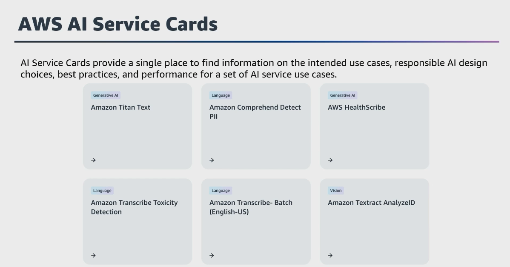
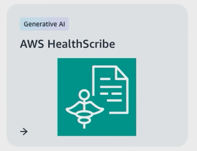
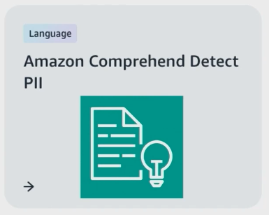

# Week 10: Applying Responsible AI

* back to AWS Cloud Institute repo's root [aci.md](../aci.md)
* back to [AI for Developers](./ai-for-developers.md)
* back to repo's main [README.md](../../../README.md)

## Responsible AI Overview

Responsible AI refers to practices and principles that ensure that AI systems are transparent and trustworthy while mitigating potential risks and negative outcomes. These responsible standards should be considered throughout the entire lifecycle of an AI application. This includes the initial design, development, deployment, monitoring, and evaluation phases.

### Defining Responsible Al

"[...] Al that is innovative and trustworthy and that respects human rights and democratic values."

* [Organization for Economic Cooperation and Development](https://oecd.ai/en/ai-principles)

---

### What is responsible Al?

Responsible Al refers to the **development**, **deployment**, and **use** of Al in an **ethical**, **transparent**, and **accountable** manner, with consideration for the potential impact on individuals, society, and the environment.

* Al systems should be **transparent**. It should include clear explanations of how it works and how it makes decisions. Clearly define the responsibility and accountability of the system, and provide mechanisms for users to challenge and address the decisions it makes.
* Al systems should be designed and used in accordance with **ethical principles** and **guidelines**, such as privacy, fairness, nondiscrimination, and transparency.

---

### Responsible Al throughout the lifecycle

#### Phase 1: Design and Development

* Establishing requirements, defining performance criteria, exploring the potential impact of the system on users.
* Collecting and curating training data, and building and testing models and other system components.

#### Phase 2: Deployment

* Preparing and deploying AI/ML systems for use, including understanding and accounting for capabilities, limitations, and risks associated with deployment.

#### Phase 3: Operation

* Ongoing operation of the system after it is developed and deployed.

---

### Responsible Al in practice

* Define application use cases narrowly
* Match processes to risk
* Treat datasets as product specs
* Distinguish application performance by dataset

---

### Business benefits of responsible AI

Responsible AI offers key business benefits in the development and deployment of AI systems, as described in the following categories.

#### Increased trust and reputation

Customers are more likely to interact with AI applications if they believe the system is fair and safe. This enhances their reputation and brand value.

#### Regulatory compliance

As AI regulations emerge, companies with robust ethical AI frameworks are better positioned to comply with guidelines on data privacy, fairness, accountability, and transparency.

#### Risk mitigation

Responsible AI practices help mitigate risks such as bias, privacy violations, security breaches, and unintended negative impacts on society. This reduces legal liabilities and financial costs.

#### Competitive advantage

Companies that prioritize responsible AI can differentiate themselves from competitors and gain a competitive edge, especially as consumer awareness of AI ethics grows.

#### Improved decision-making

AI systems built with fairness, accountability, and transparency in mind are more reliable and less likely to produce biased or flawed outputs, which leads to better data-driven decisions.

#### Improved products and business

Responsible AI encourages a diverse and inclusive approach to AI development. Because it draws on varied perspectives and experiences, it can drive more creative and innovative solutions.

---

## Core Dimensions of Responsible AI

The core dimensions of responsible AI provide a comprehensive framework for developing and deploying AI systems that are ethical, trustworthy, and accountable.

* **Fairness:** How a system impacts different subpopulations of users
* **Explainability:** Mechanisms to evaluate the outputs of an Al system
* **Privacy and security:** Data protected from theft and exposure
* **Robustness:** Mechanisms to ensure an Al system operates reliably
* **Governance:** Processes to define, implement and enforce responsible Al practices
* **Transparency:** Communicating information about an Al system so stakeholders can make informed choices about their use of the system
* **Safety**
* **Controllability**

No single dimension is a standalone goal for responsible AI. In fact, each topic is required for a complete implementation of responsible AI. You will find considerable overlap among many of these dimensions. For example, you will find that when you implement transparency in your AI system, elements of explainability, fairness, and governance will be required.

Safety and controllability are the most recent additions to the list of responsible AI core dimensions. As AI use grows and evolves, the frameworks and strategies to uphold responsible AI also evolve.

---

### AWS Al Service Cards

Al Service Cards provide a single place to find information on the intended use cases, responsible Al design choices, best practices, and performance for a set of Al service use cases.



---

### Apply the core dimensions of responsible AI to a financial chat-based AI

How might the core dimensions of responsible AI, such as fairness, transparency, accountability, and privacy, apply in a real-world scenario? Consider a financial institution that wants to develop a chat-based AI assistant.

#### Fairness

In the context of the module scenario, it's crucial that your financial chat-based AI assistant makes fair and unbiased recommendations to customers, without discriminating based on factors like income, location, or demographics. Careful dataset curation and model testing will be needed to ensure that the chat-based AI treats all customers equitably.

**Definition** - Fairness is how a system impacts different subpopulations of users.
Bias can appear based on race and **ethnicity**, gender, sexual orientation, disability, and class. This is the process of correcting and eliminating algorithmic bias from machine learning models.

For example, when Al systems provide guidance on **medical treatment**, **loan applications**, or **employment**, they should make the same recommendations to everyone who has similar symptoms, financial circumstances, or professional qualifications.

#### What problems does fairness solve?

Fairness allows Al systems to promote **inclusion**, prevent **discrimination**, uphold **ethical values** and legal norms, and **build trust** with society - all crucial fol developing responsible Al systems. Considering fairness helps create systems suitable and beneficial for all.

#### Best practices for fairness in responsible Al systems

* Representative data
* Mitigate biases
* Fairness metrics
* Bias testing

#### Fairness - Example from AWS Al Service Cards


Our goal is that Rekognition face matching work well for all human faces.

To achieve this, we use the iterative development process described above.

We routinely test across use cases on datasets of face images for which we have reliable demographic labels such as **gender**, **age**, and **skin tone**.

---

#### Explainability

Customers interacting with your financial chat-based AI should be able to understand how it makes its recommendations about things like loans or investment products. Providing transparency into the model's decision-making process can build trust with your customers.

#### What problems does explainability solve?

The purpose of model explainability is to create an **understandable solution** which can **communicate results** of Al/ML technology.

Because AI/ML methods have **increased in complexity** to satisfy industry needs, the **requirement** for model explainability has **risen**.

#### Best practices for explainability in responsible Al systems

* Model interpretation
* Transparency reports
* Provenance tracking
* User notifications

#### SageMaker Clarify

Understanding a model's behavior is important to develop more accurate models and make better decisions.


Amazon SageMaker Clarify provides greater insight into **fairness and explainability**, so you can provide transparency to stakeholders, inform humans making decisions, and track whether a model is performing as intended.

#### Explainability - Example from AWS Al Service Cards



AWS HealthScribe returns **timestamps** and **confidence scores** for each word transcribed in the audio.

Customers can use the timestamps to listen to the segments of the input audio and **verify the transcript** content.

For the note generation capability, AWS HealthScribe provides the summary along with **evidence mapping**, which **links every sentence in the summary** to the **relevant dialogue in the transcript**.

Customers can use the **evidence mapping** to verify and understand the context behind the insight.

#### Testimonial from CapCom

```text
"SageMaker Clarify helps us understand the model behavior by providing **explainability** through SHAP values.

With SageMaker Clarify, we reduced the computation cost of SHAP values by up to 50% compared to a local calculation."
```

* Masahiro Takamoto, Head of Data Group, CAPCOM

---

#### Privacy and security

Since the financial chat-based AI assistant will be handling sensitive customer financial data, robust data protection, access controls, and security measures must be in place to maintain customer privacy and prevent data breaches.

#### What problems does privacy and security solve?

Incorporating **privacy and security safeguards** allows developing Al that respects user rights, protects data populations, robustly withstands attacks, follows regulations and builds critical user trust through ethical data handling.

Al directly handling **personal data** requires responsible privacy and security practices. Ignoring these can lead to dangerous failures.

#### Best practices for privacy and security

* Data anonymization
* Access Controls
* Encryption
* Lifecycle protections

#### Privacy - Example from AWS Al Service Cards


Amazon Transcribe Toxicity Detection identifies and classifies toxic language including hate speech, harassment and threats

Privacy focus:

* Transcribe Toxicity Detection **only processes audio input data**.
* **Audio inputs are never included in the output** returned by the service.
* **Audio inputs and service outputs are never shared** between customers.

#### Using Amazon Comprehend to extract PlI

* Analyzed text


---

#### Transparency

Your organization should maintain high standards of transparency in how the financial chat-based AI assistant was developed, what its capabilities and limitations are, and provide clear documentation for stakeholders and customers.

#### Transparency - Problems it solves

The term transparency focuses on **disclosing when Al is being used** (in a prediction, recommendation or decision, or that the user is interacting directly with an Al-powered agent, such as a chatbot).

Transparency further means **enabling people to understand** how an Al system is developed. trained, operates, and deployed.

#### Transparency - Best Practices

* Model cards
* Data sheets
* Algorithmic auditing
* Open standards over black boxes

#### Transparency - Example from AWS Al Service Cards


Where appropriate for their use case, customers who incorporate **AnalyzelD** in their workflow should consider disclosing their use of ML to end users and other individuals impacted by the application, and give their end users the ability to provide feedback to improve workflows. In their documentation, customers can also reference this Al Service Card.

---

#### Veracity and robustness

Your financial chat-based AI assistant needs to perform reliably and safely, even when faced with unexpected user inputs or volatile market changes. Thorough testing and monitoring will be required to ensure the chat-based AI remains trustworthy.

#### What problem does robustness solve

Robustness allows Al systems to **reliably function within their original design specifications**. This prevents unexpected and potentially dangerous behavior.

It allows taking Al from controlled environments to real-world situations in a **dependable and responsible manner** across diverse user groups. Ignoring robustness leads to instable, unsafe systems.

#### Robustness - Best Practices

* Extensive testing
* Adversarial testing
* Algorithmic monitoring
* Fail-safes and circuit breakers

#### Robustness - Example from AWS Al Service Cards


When testing robustness with NaturalQuestions, a question-answering dataset, Titan Text Lite and Titan Text Express score
0.63 and 0.72 respectively.

The **NaturalQuestions dataset** is one dataset which challenges the model's ability to answer **everyday questions**. Answers are derived from Wikipedia.

---

#### Governance

Clear policies, review procedures, and accountability measures should guide the development and deployment of the financial chat-based AI assistant to ensure that it is being used responsibly and aligned with your organization's values.

#### Governance - Problems it solves

Al governance provides the guiding processes and institutional mechanisms to ensure **responsibility**, **risk mitigation**, **ethics** and **oversight** for Al from R&D to deployment.

It encourages **maximizing user benefit** while **minimizing harm** from Al - crucial for its responsible adoption.

#### Governance - Best Practices

* Policies and processes
* Operational integration
* Compliance verification
* Documentation and reporting

#### Governance - Example from AWS Al Service Cards



"[AWS incorporates] Responsible Al at the **design phase**, in design consultations and implementation assessments by dedicated Responsible Al science and data experts, as well as **routine testing**, **reviews with customers**, and best practice **development**, **dissemination**, and **training**."

---

#### Safety

The financial chat-based AI assistant must be carefully designed and tested to avoid causing any unintended harm or negative impacts to your customers. Safeguards should be in place to prevent misuse or the generation of inappropriate content.

---

#### Controllability

Your organization should have the ability to monitor and guide the financial chat-based AI assistant's behavior to ensure that it remains aligned with your intended use case and does not exhibit any unexpected or undesirable actions.

---

## Challenges to Responsible AI

The landscape of AI challenges has dramatically shifted with the emergence of generative AI. Although traditional AI systems focused on specific tasks like loan approvals or medical diagnoses, today's generative AI can create stories, code, images, and more. This evolution has fundamentally changed how organizations must approach responsible AI implementation. For instance, although a traditional lending model might need to ensure equal error rates across gender groups, a generative AI system must consider whether it perpetuates stereotypes when writing stories about doctors, lawyers, or nurses.