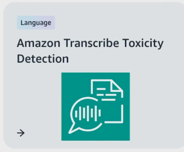

# Week 10: Applying Responsible AI

* back to AWS Cloud Institute repo's root [aci.md](../aci.md)
* back to [AI for Developers](./ai-for-developers.md)
* back to repo's main [README.md](../../../README.md)

## Responsible AI Overview

Responsible AI refers to practices and principles that ensure that AI systems are transparent and trustworthy while mitigating potential risks and negative outcomes. These responsible standards should be considered throughout the entire lifecycle of an AI application. This includes the initial design, development, deployment, monitoring, and evaluation phases.

### Defining Responsible Al

"[...] Al that is innovative and trustworthy and that respects human rights and democratic values."

* [Organization for Economic Cooperation and Development](https://oecd.ai/en/ai-principles)

---

### What is responsible Al?

Responsible Al refers to the **development**, **deployment**, and **use** of Al in an **ethical**, **transparent**, and **accountable** manner, with consideration for the potential impact on individuals, society, and the environment.

* Al systems should be **transparent**. It should include clear explanations of how it works and how it makes decisions. Clearly define the responsibility and accountability of the system, and provide mechanisms for users to challenge and address the decisions it makes.
* Al systems should be designed and used in accordance with **ethical principles** and **guidelines**, such as privacy, fairness, nondiscrimination, and transparency.

---

### Responsible Al throughout the lifecycle

#### Phase 1: Design and Development

* Establishing requirements, defining performance criteria, exploring the potential impact of the system on users.
* Collecting and curating training data, and building and testing models and other system components.

#### Phase 2: Deployment

* Preparing and deploying AI/ML systems for use, including understanding and accounting for capabilities, limitations, and risks associated with deployment.

#### Phase 3: Operation

* Ongoing operation of the system after it is developed and deployed.

---

### Responsible Al in practice

* Define application use cases narrowly
* Match processes to risk
* Treat datasets as product specs
* Distinguish application performance by dataset

---

### Business benefits of responsible AI

Responsible AI offers key business benefits in the development and deployment of AI systems, as described in the following categories.

#### Increased trust and reputation

Customers are more likely to interact with AI applications if they believe the system is fair and safe. This enhances their reputation and brand value.

#### Regulatory compliance

As AI regulations emerge, companies with robust ethical AI frameworks are better positioned to comply with guidelines on data privacy, fairness, accountability, and transparency.

#### Risk mitigation

Responsible AI practices help mitigate risks such as bias, privacy violations, security breaches, and unintended negative impacts on society. This reduces legal liabilities and financial costs.

#### Competitive advantage

Companies that prioritize responsible AI can differentiate themselves from competitors and gain a competitive edge, especially as consumer awareness of AI ethics grows.

#### Improved decision-making

AI systems built with fairness, accountability, and transparency in mind are more reliable and less likely to produce biased or flawed outputs, which leads to better data-driven decisions.

#### Improved products and business

Responsible AI encourages a diverse and inclusive approach to AI development. Because it draws on varied perspectives and experiences, it can drive more creative and innovative solutions.

---

## Core Dimensions of Responsible AI

The core dimensions of responsible AI provide a comprehensive framework for developing and deploying AI systems that are ethical, trustworthy, and accountable.

* **Fairness:** How a system impacts different subpopulations of users
* **Explainability:** Mechanisms to evaluate the outputs of an Al system
* **Privacy and security:** Data protected from theft and exposure
* **Robustness:** Mechanisms to ensure an Al system operates reliably
* **Governance:** Processes to define, implement and enforce responsible Al practices
* **Transparency:** Communicating information about an Al system so stakeholders can make informed choices about their use of the system
* **Safety**
* **Controllability**

No single dimension is a standalone goal for responsible AI. In fact, each topic is required for a complete implementation of responsible AI. You will find considerable overlap among many of these dimensions. For example, you will find that when you implement transparency in your AI system, elements of explainability, fairness, and governance will be required.

Safety and controllability are the most recent additions to the list of responsible AI core dimensions. As AI use grows and evolves, the frameworks and strategies to uphold responsible AI also evolve.

---

### AWS Al Service Cards

Al Service Cards provide a single place to find information on the intended use cases, responsible Al design choices, best practices, and performance for a set of Al service use cases.


---

### Apply the core dimensions of responsible AI to a financial chat-based AI

How might the core dimensions of responsible AI, such as fairness, transparency, accountability, and privacy, apply in a real-world scenario? Consider a financial institution that wants to develop a chat-based AI assistant.

#### Fairness

In the context of the module scenario, it's crucial that your financial chat-based AI assistant makes fair and unbiased recommendations to customers, without discriminating based on factors like income, location, or demographics. Careful dataset curation and model testing will be needed to ensure that the chat-based AI treats all customers equitably.

**Definition** - Fairness is how a system impacts different subpopulations of users.
Bias can appear based on race and **ethnicity**, gender, sexual orientation, disability, and class. This is the process of correcting and eliminating algorithmic bias from machine learning models.

For example, when Al systems provide guidance on **medical treatment**, **loan applications**, or **employment**, they should make the same recommendations to everyone who has similar symptoms, financial circumstances, or professional qualifications.

#### What problems does fairness solve?

Fairness allows Al systems to promote **inclusion**, prevent **discrimination**, uphold **ethical values** and legal norms, and **build trust** with society - all crucial fol developing responsible Al systems. Considering fairness helps create systems suitable and beneficial for all.

#### Best practices for fairness in responsible Al systems

* Representative data
* Mitigate biases
* Fairness metrics
* Bias testing

#### Fairness - Example from AWS Al Service Cards


Our goal is that Rekognition face matching work well for all human faces.

To achieve this, we use the iterative development process described above.

We routinely test across use cases on datasets of face images for which we have reliable demographic labels such as **gender**, **age**, and **skin tone**.

---

#### Explainability

Customers interacting with your financial chat-based AI should be able to understand how it makes its recommendations about things like loans or investment products. Providing transparency into the model's decision-making process can build trust with your customers.

#### What problems does explainability solve?

The purpose of model explainability is to create an **understandable solution** which can **communicate results** of Al/ML technology.

Because AI/ML methods have **increased in complexity** to satisfy industry needs, the **requirement** for model explainability has **risen**.

#### Best practices for explainability in responsible Al systems

* Model interpretation
* Transparency reports
* Provenance tracking
* User notifications

#### SageMaker Clarify

Understanding a model's behavior is important to develop more accurate models and make better decisions.


Amazon SageMaker Clarify provides greater insight into **fairness and explainability**, so you can provide transparency to stakeholders, inform humans making decisions, and track whether a model is performing as intended.

#### Explainability - Example from AWS Al Service Cards


AWS HealthScribe returns **timestamps** and **confidence scores** for each word transcribed in the audio.

Customers can use the timestamps to listen to the segments of the input audio and **verify the transcript** content.

For the note generation capability, AWS HealthScribe provides the summary along with **evidence mapping**, which **links every sentence in the summary** to the **relevant dialogue in the transcript**.

Customers can use the **evidence mapping** to verify and understand the context behind the insight.

#### Testimonial from CapCom

```text
"SageMaker Clarify helps us understand the model behavior by providing **explainability** through SHAP values.

With SageMaker Clarify, we reduced the computation cost of SHAP values by up to 50% compared to a local calculation."
```

* Masahiro Takamoto, Head of Data Group, CAPCOM

---

#### Privacy and security

Since the financial chat-based AI assistant will be handling sensitive customer financial data, robust data protection, access controls, and security measures must be in place to maintain customer privacy and prevent data breaches.

#### What problems does privacy and security solve?

Incorporating **privacy and security safeguards** allows developing Al that respects user rights, protects data populations, robustly withstands attacks, follows regulations and builds critical user trust through ethical data handling.

Al directly handling **personal data** requires responsible privacy and security practices. Ignoring these can lead to dangerous failures.

#### Best practices for privacy and security

* Data anonymization
* Access Controls
* Encryption
* Lifecycle protections

#### Privacy - Example from AWS Al Service Cards



Amazon Transcribe Toxicity Detection identifies and classifies toxic language including hate speech, harassment and threats

Privacy focus:

* Transcribe Toxicity Detection **only processes audio input data**.
* **Audio inputs are never included in the output** returned by the service.
* **Audio inputs and service outputs are never shared** between customers.

#### Using Amazon Comprehend to extract PlI

* Analyzed text


---

#### Transparency

Your organization should maintain high standards of transparency in how the financial chat-based AI assistant was developed, what its capabilities and limitations are, and provide clear documentation for stakeholders and customers.

#### Transparency - Problems it solves

The term transparency focuses on **disclosing when Al is being used** (in a prediction, recommendation or decision, or that the user is interacting directly with an Al-powered agent, such as a chatbot).

Transparency further means **enabling people to understand** how an Al system is developed. trained, operates, and deployed.

#### Transparency - Best Practices

* Model cards
* Data sheets
* Algorithmic auditing
* Open standards over black boxes

#### Transparency - Example from AWS Al Service Cards


Where appropriate for their use case, customers who incorporate **AnalyzelD** in their workflow should consider disclosing their use of ML to end users and other individuals impacted by the application, and give their end users the ability to provide feedback to improve workflows. In their documentation, customers can also reference this Al Service Card.

---

#### Veracity and robustness

Your financial chat-based AI assistant needs to perform reliably and safely, even when faced with unexpected user inputs or volatile market changes. Thorough testing and monitoring will be required to ensure the chat-based AI remains trustworthy.

#### What problem does robustness solve

Robustness allows Al systems to **reliably function within their original design specifications**. This prevents unexpected and potentially dangerous behavior.

It allows taking Al from controlled environments to real-world situations in a **dependable and responsible manner** across diverse user groups. Ignoring robustness leads to instable, unsafe systems.

#### Robustness - Best Practices

* Extensive testing
* Adversarial testing
* Algorithmic monitoring
* Fail-safes and circuit breakers

#### Robustness - Example from AWS Al Service Cards


When testing robustness with NaturalQuestions, a question-answering dataset, Titan Text Lite and Titan Text Express score
0.63 and 0.72 respectively.

The **NaturalQuestions dataset** is one dataset which challenges the model's ability to answer **everyday questions**. Answers are derived from Wikipedia.

---

#### Governance

Clear policies, review procedures, and accountability measures should guide the development and deployment of the financial chat-based AI assistant to ensure that it is being used responsibly and aligned with your organization's values.

#### Governance - Problems it solves

Al governance provides the guiding processes and institutional mechanisms to ensure **responsibility**, **risk mitigation**, **ethics** and **oversight** for Al from R&D to deployment.

It encourages **maximizing user benefit** while **minimizing harm** from Al - crucial for its responsible adoption.

#### Governance - Best Practices

* Policies and processes
* Operational integration
* Compliance verification
* Documentation and reporting

#### Governance - Example from AWS Al Service Cards


"[AWS incorporates] Responsible Al at the **design phase**, in design consultations and implementation assessments by dedicated Responsible Al science and data experts, as well as **routine testing**, **reviews with customers**, and best practice **development**, **dissemination**, and **training**."

---

#### Safety

The financial chat-based AI assistant must be carefully designed and tested to avoid causing any unintended harm or negative impacts to your customers. Safeguards should be in place to prevent misuse or the generation of inappropriate content.

---

#### Controllability

Your organization should have the ability to monitor and guide the financial chat-based AI assistant's behavior to ensure that it remains aligned with your intended use case and does not exhibit any unexpected or undesirable actions.

---

## Challenges to Responsible AI

The landscape of AI challenges has dramatically shifted with the emergence of generative AI. Although traditional AI systems focused on specific tasks like loan approvals or medical diagnoses, today's generative AI can create stories, code, images, and more. This evolution has fundamentally changed how organizations must approach responsible AI implementation. For instance, although a traditional lending model might need to ensure equal error rates across gender groups, a generative AI system must consider whether it perpetuates stereotypes when writing stories about doctors, lawyers, or nurses.

---

### Fairness and modality challenges

The challenge of fairness has become increasingly complex in the generative era. Consider a scenario where an AI system is writing news articles: it must not only avoid explicit bias but also handle subtle tone differences in describing different groups.

This complexity is further amplified when you consider different modalities. In speech recognition, for example, fairness isn't just about demographic categories—it's about handling diverse accents, dialects, and acoustic conditions. A system might excel at transcribing standard American English but struggle with regional dialects or non-native speakers, creating a new dimension of fairness concerns.

### Privacy and intellectual property

The generative AI era has transformed privacy concerns from simple data protection to complex questions of content reproduction. Imagine a programmer using an AI coding assistant: the system might generate code that's not an exact copy of its training data, but maintains the same structure with just variable names changed.

Similarly, when an artist requests a *painting in the style of Andy Warhol*, you face questions about the boundaries between inspiration and imitation. These challenges extend beyond traditional privacy concerns into new territory where the line between original creation and AI-generated content becomes increasingly blurred.

### The challenge of hallucinations and toxicity

One of the most pressing concerns in the generative AI era is the phenomenon of hallucinations. Picture a researcher using an AI system to write a literature review and the system confidently generates citations that sound perfectly plausible, but don't actually exist.

Alongside this, content toxicity presents another significant challenge. The system might generate content that appears harmless at first glance but contains subtle biases or inappropriate implications that are difficult to detect and prevent systematically.

### Real-world implementation and last-mile effects

The deployment of AI systems in real-world conditions reveals what AWS calls *last-mile* challenges. For instance, a generative AI system might perform perfectly in controlled conditions but produce unexpected results when deployed in specific enterprise environments.

These challenges are particularly complex in the generative era because the potential variations in output are virtually unlimited. A healthcare provider might find that their AI transcription service, which works perfectly in most situations, suddenly struggles with medical terminology in specific acoustic conditions.

### The role of external testing and collaboration

The complexity of generative AI systems has led to a new approach in testing and validation. Rather than relying solely on internal testing, organizations are increasingly recognizing the value of external scrutiny. This has led to the development of *bias bounties* — similar to traditional software bug bounties — where external testers are invited to identify potential biases or issues in AI systems. This collaborative approach is particularly crucial for generative AI, where the potential outputs are so vast that no internal team could anticipate all possible scenarios.

Through these interconnected challenges, you see that responsible AI in the generative era requires a comprehensive approach that goes beyond traditional frameworks, combining technical solutions with robust testing, clear policies, and ongoing collaboration between developers, users, and the broader AI community.

### The future of responsible AI implementation

The path forward for responsible AI requires balancing enthusiasm for AI's capabilities with practical and effective checks on potential risks. As noted in AWS's experience, this isn't a one-time solution but rather an iterative process that requires:

* Careful curation of training data to improve fairness and reduce toxicity
* Development of guardrail models to detect and filter unwanted content
* Implementation of watermarking and attribution techniques
* Creation of robust testing frameworks including external validation
* Ongoing collaboration between developers, users, and the broader AI community

The landscape of responsible AI will continue to shift as technology evolves, but the fundamental principles remain constant: ensuring AI systems are safe, faithful, helpful, and responsible in their responses while avoiding potentially wrong or harmful outcomes. This requires not just technical solutions but also policy frameworks, educational initiatives, and strong collaboration across the AI ecosystem.

---

## Assessing the Risks of AI

In today's digital world, AI is revolutionizing how organizations operate and serve their customers. As AI technologies become more prevalent, organizations must develop systematic approaches to evaluate and manage potential risks.

---

### Understanding risk levels in AI

AI risk assessment requires a comprehensive view that considers multiple organizational layers and their interactions. This multi-faceted approach ensures that potential risks are not overlooked in the assessment process.

### Three-level risk framework

Organizations must evaluate risks across three distinct but interconnected levels. Each level presents unique challenges and requires specific attention to ensure comprehensive risk management.

#### AI model risk

AI model risk assessment should focus on these technical considerations:

* Model accuracy measurements should include performance across different scenarios and user groups.
* Data quality evaluations should assess completeness, relevance, and potential biases in training data.
* Security assessments should consider vulnerabilities to both internal and external threats.

#### AI system risk

In evaluating AI system risk, organizations must assess the following implementation factors:

* Integration capabilities determine how effectively new AI systems work with existing infrastructure and technologies.
* System reliability measures include performance consistency across different conditions and workload levels.
* Process adaptation requirements outline necessary changes to existing workflows and procedures.
* Component interaction effects detail how multiple AI elements work together within the larger system.

#### Enterprise risk

When examining enterprise risk, organizations should consider the following comprehensive business impacts:

* Financial implications extend beyond initial implementation costs to include ongoing maintenance, potential liability costs, and impact on revenue streams.
* Operational considerations encompass changes in workflow efficiency, staff training requirements, and potential disruptions to existing business processes.
* Strategic impacts affect market competitiveness, long-term growth potential, and the ability to adapt to changing industry demands.

---

Within an organization, all levels of risk management should be considered and aligned.

---

### Risk definition and components

Risk in AI systems is defined as the effect of uncertainty on objectives, calculated as a multiplicative measure of an event's probability of occurring and the magnitude of its consequences.


This framework distinguishes between two risk types:

* **Inherent risk:** This represents the amount of risk the AI system exhibits, in the absence of any mitigations or controls.
* **Residual risk:** This captures the remaining risks after implementing mitigation strategies and control measures.

Risk assessment is a human-centric activity that requires organization-wide efforts. These efforts range from ensuring that all relevant stakeholders are included in the assessment process (such as product, engineering, science, sales, and security teams) to assessing how social perspectives and norms influence the perceived likelihood and consequences of certain events.

---

### Importance of risk evaluation

Risk evaluation serves as a foundational element in responsible AI development and deployment. Understanding its importance helps organizations to allocate the appropriate resources and attention to this process.

#### 1. Organizational benefits

Organizations that implement thorough risk evaluation processes gain the following key benefits:

* **Improved decision-making:** By understanding the risks associated with AI systems, organizations can make better decisions about how to mitigate those risks and use AI systems in a safe and responsible manner.
* **Increased compliance planning:** A risk assessment framework can help organizations prepare for risk assessment requirements related to relevant laws and regulations.
* **Building trust:** By demonstrating that they are taking steps to mitigate the risks of AI systems, organizations can show their customers and stakeholders that they are committed to using AI in a safe and responsible manner.

#### 2. Societal impact

Beyond organizational benefits, proper risk evaluation contributes to broader societal well-being. Public safety considerations are enhanced through systematic evaluation:

* Community impact assessments help identify potential effects on different demographic groups.
* Safety protocols are developed based on a comprehensive risk understanding.
* Preventive measures are implemented to protect public interests.

---

### Risk assessment methodology

Effective risk assessment requires a structured approach that balances thoroughness with practicality. This section outlines the key steps and considerations in developing a comprehensive risk assessment process.


The process of assessing risk involves three key steps. The first step is to define the use case and relevant stakeholders. The second step is to identify potentially harmful events and evaluate inherent and residual risk. The third step is to summarize risk levels for all risk dimensions and conclude findings.

#### Step 1: Define the use case and relevant stakeholders

The foundation of successful risk assessment lies in thorough preparation and clear documentation. Organizations should establish a systematic approach to gathering and analyzing relevant information.

Use case documentation should address the following essential elements:

* Business objectives clearly define the intended purpose and expected outcomes of the AI system.
* System workflows detail each step of the AI process, from data input to final output.
* Performance requirements specify measurable criteria for system success.
* User interaction patterns outline how different stakeholders will engage with the system.

Stakeholder mapping requires careful consideration of all affected parties:

* Primary users need a clear understanding of their roles and responsibilities in system operation.
* Support teams are identified with specific responsibilities for system maintenance.
* Oversight personnel require defined roles in monitoring and governance.
* External stakeholders should be mapped based on their interaction with or impact from the system.

To help you avoid overlooking stakeholders, the following chart is a good starting point to map out AI stakeholder roles. The chart divides AI stakeholders into six categories: AI providers, AI producers, AI customers, AI partners, AI subjects, and relevant authorities.


Each category includes the following roles:

* **AI providers:** AI platform providers and AI product or service providers
* **AI producers:** AI developers
* **AI customers:** AI users
* **AI partners:** AI system integrators, data providers, AI evaluators, and AI auditors
* **AI subjects:** Data subjects and other subjects
* **Relevant authorities:** Policy makers and regulators

#### Step 2: Identify potentially harmful events and evaluate inherent and residual risk

A systematic approach to risk evaluation ensures comprehensive coverage while maintaining practical feasibility, and this process should incorporate both qualitative and quantitative measures.

##### Event identification

The identification of potentially harmful events must consider different dimensions of responsible AI. The following are the key components.

###### Fairness assessment

* Organizations must evaluate potential failure scenarios that could affect different demographic groups differently.
* Teams should analyze system outcomes to ensure equitable treatment across all user populations.
* Assessments should document how the system maintains fairness across various operational conditions

###### Robustness evaluation**

* Teams must identify and document specific technical failures that could occur during system operation.
* Organizations should evaluate system performance under various operational disruptions and adverse conditions.
* Assessment teams need to analyze system behavior when faced with potential adversarial scenarios.

###### Impact analysis

* Organizations must trace impact chains through all system components to understand cascading effects.
* Teams should document both direct and indirect effects of system operations on different stakeholder groups.
* Environmental factors must be evaluated to determine their influence on system reliability and performance.

###### Regulatory compliance

* Organizations must document all compliance requirements specific to the AI system's use case and deployment context.
* Teams should establish and document recovery procedures that align with regulatory standards and requirements.
* Assessment processes must verify adherence to relevant regulations governing AI system operations.

---

##### Risk quantification

Risk quantification requires clear measurement criteria using both qualitative and semi-quantitative approaches:

* Likelihood scales should use qualitative nonnumerical categories ranging from very low to very high risk.
* Severity measurements must consider both immediate and long-term consequences.
* Semi-quantitative assessments can use numerical scales (1-10), bins, or other representative numbers.
* Monitoring metrics should be established for ongoing risk assessment and evaluation of control effectiveness.

---

After quantifying individual potential harmful event, organizations must establish frameworks for evaluating overall risk levels and determining acceptability. The risk level of a specific, harmful event can be characterized by multiplying the likelihood of the event occurring and the severity of the event outcome or impact.

##### Likelihood

Likelihood is the chance of the specific harm happening, ranging from highly unlikely to almost certain. The likelihood scale criteria can be different for different types of services, depending on the specific harmful event type.

| Likelihood level | Description |
| ---------------- | ----------- |
| Almost certain | Happens with certainty; for example, with a probability of 95% or higher |
| Likely | Happens with some certainty; for example, with a probability from 75% to 95% |
| Possible | Might happen; for example, with a probability from 25% to 75% |
| Unlikely | Not expected, but can happen; for example, with a probability from 5% to 25% |
| Highly unlikely | Very rare and improbable; for example, with a probability of less than 5% |

##### Severity

Severity refers to the degree of damage and can be tiered into five levels ranging from very low (no negative impact to stakeholders) to extreme (severe life-threatening outcomes).

| Severity level | Description |
| -------------- | ----------- |
| Extreme | Multiple catastrophic adverse effects |
| Major | Severe or catastrophic adverse effect |
| Moderate | Serious adverse effect |
| Low | Limited adverse effect |
| Very low | Negligible adverse effect |

---

For instance, when evaluating an event with *low severity and highly unlikely likelihood*, it would be classified as *very low risk* according to the matrix framework.


##### Detailed description of the risk matrix (accessible content)

###### Very low risk

* An event with *highly unlikely* likelihood of occurring and very *low*, *low*, or *moderate* severity is considered very low risk.
* An event with *unlikely* likelihood of occurring and *very low* or *low* severity is considered very low risk.
* An event with *possible* or *likely* likelihood of occurring and *very low* severity is considered very low risk.

###### Low risk

* An event with *unlikely* likelihood of occurring and *moderate* severity is considered low risk.
* An event with *possible* or *likely* likelihood of occurring and *low severity* is considered low risk.
* An event with *almost certain* likelihood of occurring and *very low* severity is considered low risk.

###### Medium risk

* An event with *highly unlikely* or *unlikely* likelihood of occurring and *major* severity is considered medium risk.
* An event with *possible* or *likely* likelihood of occurring and *moderate* severity is considered medium risk.
* An event with *almost certain* likelihood of occurring and *low severity* is considered medium risk.

###### High risk

* An event with *highly unlikely* or *unlikely* likelihood of occurring and *extreme* severity is considered high risk.
* An event with *possible* or *likely* likelihood of occurring and *major* severity is considered high risk.
* An event with *almost certain* likelihood of occurring and *moderate* severity is considered high risk.

###### Critical risk

* An event with *possible*, *likely*, or *almost certain* likelihood of occurring and *extreme* severity is considered critical risk.
* An event with *almost certain* likelihood of occurring and *major* severity is considered critical risk.

---

In cases where multiple events are identified along the same dimension, organizations should adopt a conservative approach by selecting the highest risk level to report out in the final assessment summary. This ensures that the most significant potential impacts are properly accounted for in the decision-making process.

#### Step 3: Summarize risk levels for all risk dimensions and conclude findings

Finally, organizations must carefully define acceptable risk levels for their AI systems through a comprehensive evaluation process. This determination should take into account the organization's own risk tolerance levels, while also considering broader industry standards.

Additionally, organizations should ensure compliance with relevant regulations and policies governing AI systems. Throughout this process, stakeholder considerations will be integrated into the decision-making framework to ensure that all perspectives are properly weighted in determining acceptable risk thresholds.

---

### Example: Risk assessment of a generative AI news writing system

To illustrate how risk assessment works in practice, let's examine an example of a generative AI system designed for news article creation. This case study demonstrates how to identify, evaluate, and understand the potential impacts of AI risks in a critical application area.

#### System context

The generative AI writing tool is designed to assist news organizations in creating articles by generating content based on provided prompts or data. Although intended to increase efficiency in news production, this system presents significant risks that require careful assessment.

For example, during a test run, when prompted to write an article about a major public health initiative, the system generated a convincing story that included fabricated medical statistics, non-existent research studies, and false claims about treatment effectiveness. Although this content was caught during editorial review, it demonstrated how the system could potentially generate and distribute harmful misinformation if similar content were to bypass verification processes.

---

#### Risk assessment components

The assessment of AI system risks requires a systematic evaluation of multiple factors to understand the full scope of potential issues. This evaluation includes identifying specific harmful events, analyzing affected stakeholders, and quantifying the level of risk through careful consideration of severity and likelihood. Let's examine each of these components in detail.

##### Event identification

The primary risk identified is the system's potential to generate and distribute fabricated news stories about medical and health-related events. Despite being entirely hallucinated, these stories can appear highly credible due to the sophisticated nature of the AI's natural language generation capabilities.

##### Stakeholder analysis

The impact of this risk extends across multiple stakeholder groups:

* The general public relies on accurate news reporting to make informed decisions about civic participation and daily life.
* Healthcare providers and medical institutions whose reputations and practices could be significantly affected by false medical narratives.
* News media organizations whose credibility and trustworthiness are at stake.

##### Risk quantification

###### Severity assessment

The severity is classified as Extreme because historical examples demonstrate how false health information can spread quickly and be difficult to retract:

* A single fabricated health treatment story reached 1 million readers in less than 24 hours.
* False medical claims have influenced public health decisions in multiple regions.
* Health information retractions rarely reach the same audience as original false stories.
* Recovery of public trust in health institutions takes years after major misinformation incidents.

###### Likelihood evaluation

The probability is assessed as Possible because that data from similar systems indicates the following:

* Content generation errors occur in 30-40 percent of medical and health-related topics.
* Medical fact-checking processes miss approximately 25 percent of fabricated research details.
* High-pressure health news environments lead to reduced verification about 35 percent of the time.
* Similar incidents have occurred in 40 percent of deployed health news AI systems.

---

#### Impact analysis

Understanding the consequences of identified risks is essential for developing effective mitigation strategies. The impact analysis examines both the immediate effects that manifest shortly after an incident and the long-term implications that could affect stakeholders and society over time. Let's explore these dimensions of impact.

##### Immediate consequences

The immediate effects of this risk materializing would cascade through society:

* Public misinformation could lead to rapid spread of false narratives across social media platforms.
* Healthcare institutions and medical professionals might face immediate reputation damage requiring costly crisis management.
* News organizations could experience sudden loss of credibility and audience trust.

##### Long-term implications

The enduring impacts present even greater concerns:

* The system could lead to systematic erosion of public trust in media institutions and healthcare organizations over time.
* The system might cause fundamental changes to how health information is communicated and consumed by the public.
* News organizations could face increased operational costs due to enhanced fact-checking requirements.
* The industry might experience potential regulatory changes affecting AI use in health journalism and medical reporting.

---

#### Risk rating

Based on the combination of extreme severity and possible likelihood, this risk is rated as *Critical* according to the standard risk matrix. This rating demands immediate attention and robust mitigation strategies before system deployment. The risk assessment report will include this rating and the risks outlined here for mitigation.

---

## Activity: Assessing and Mitigating AI Risks

It's crucial to apply a systematic approach to risk assessment and mitigation while developing and deploying AI systems.

Consider a scenario where your organization is developing a large language model (LLM) for customer service applications. 

### Task 1

Who are the key stakeholders you need to consider when implementing an Al customer service system?

#### Response 1

When implementing an AI customer service system, it's important to consider both internal and external stakeholders. The primary stakeholders include the customers who will interact with the system and the customer service team who will oversee it. Support teams who maintain the system and regulatory bodies who ensure compliance must also be considered. Understanding these stakeholder groups helps ensure that the system meets everyone's needs while maintaining appropriate safeguards.

### Task 2

What do you think are the most important risks to consider when deploying an Al customer service system?

#### Response 2

Some critical risks to consider are privacy breaches and biased responses. Customer service interactions often involve sensitive personal information, so protecting customer privacy is essential.

Additionally, the system must be carefully designed to treat all customers fairly and not discriminate based on language patterns or cultural differences.

### Task 3

How would you rate the likelihood and severity of privacy breaches and biased responses?

#### Response 3

Privacy breaches are considered a high-severity risk because they could seriously damage customer trust and lead to legal issues. Although good security measures can reduce the likelihood, the risk remains significant.

Biased responses present a medium severity risk that is fairly likely to occur without proper controls, making it an important area for monitoring and improvement.

### Task 4

What are three key safeguards you would put in place to protect customers that are using this Al system?

#### Response 4

Three essential safeguards would include the following:

* Implement strong privacy controls to protect customer information.
* Establish regular monitoring of system responses for accuracy and fairness.
* Maintain human oversight for sensitive customer interactions.

These measures help to ensure that the system remains safe and trustworthy for all users.

---

### Knowledge Check

#### Responsible AI should be incorporated into all phases of an AI system's development lifecycle. Which choice best describes responsible AI?

* Responsible AI refers to the standards that uphold responsible practices and mitigate potential risks and negative outcomes of an AI application.

Wrong answers:

* Responsible AI refers to the security and compliance responsibilities that are shared between AWS and the customer.
* Responsible AI refers to the ability to create AI systems that add creativity, productivity, and connectivity to your business.
* Responsible AI refers to standards of upholding responsible practices that are exclusively needed for generative AI systems.

##### Explanation

Responsible AI involves a set of principles and practices meant to ensure that AI systems are developed and deployed in a transparent, accountable, and trustworthy manner. This includes considerations around fairness, privacy, security, and the broader societal impact of an AI application.

The other options are incorrect for the following reasons:

* Responsible AI is not solely about the shared security and compliance responsibilities between a cloud provider and the customer.
* Responsible AI is not just about creating AI systems that add creativity, productivity, and connectivity, but also about mitigating potential risks.
* Responsible AI is not exclusively needed for generative AI systems, but rather applies to all types of AI applications.

#### A developer is building a healthcare AI system that will recommend treatment plans. During testing, they discover that the system recommends different treatments for various demographic groups. Which core dimension of responsible AI should they MOST focus on addressing?

* Fairness

Wrong answers:

* Robustness
* Transparency
* Controllability

##### Explanation

Fairness ensures that AI systems make unbiased recommendations across all demographic groups, which is critical in healthcare where treatment decisions must be equitable for all patients.

The other options are incorrect for the following reasons:

* Robustness focuses on system reliability and consistent performance under varying conditions, not on addressing demographic bias.
* Transparency relates to clear documentation and disclosure of system capabilities, not directly to addressing bias in recommendations.
* Controllability deals with monitoring and guiding AI behavior to stay within intended parameters, not specifically addressing fairness across groups.

#### A quality assurance (QA) engineer needs to validate a generative AI system for potential biases and safety issues. Which testing approach would be MOST comprehensive?

* Implement both internal testing and independent third-party bias assessments

Wrong answers:

* Conduct automated testing with predefined test cases
* Perform extensive internal testing with the development team
* Use third-party testing tools exclusively

##### Explanation

This approach combines systematic internal validation with objective external evaluations to provide a comprehensive assessment of potential biases and safety issues. Third-party assessments can identify blind spots that internal teams might miss, while internal testing ensures a thorough evaluation within the system's specific context.

The other options are incorrect for the following reasons:

* Automated testing with predefined test cases is limited to known scenarios and may miss unexpected biases.
* Internal testing alone, even if extensive, lacks independent perspectives and may have inherent blind spots.
* Using only third-party tools provides a narrow scope of testing and misses the benefits of internal expertise and context.

### Summary

Responsible AI concept:

* The three-tier risk framework for AI systems, encompassing ML model risk, AI system risk, and enterprise risk assessment approaches.
* Risk evaluation methodology, including the components of inherent and residual risk, and how they are calculated through likelihood and severity measures.
* Risk assessment dimensions and processes, including stakeholder mapping, event identification, and systematic evaluation procedures.
* Responsible AI principles and practices that help ensure that AI systems are transparent and trustworthy throughout their lifecycle, while delivering key business benefits, including increased trust, regulatory compliance, and risk mitigation.
* The eight core dimensions of responsible AI: fairness, explainability, privacy and security, robustness, governance, transparency, safety, and controllability; understanding that these dimensions work together as an interconnected framework rather than standalone elements.
* The evolving landscape of AI challenges in the generative AI era, including fairness across different modalities, privacy concerns, and intellectual property considerations.
* Critical technical challenges, including AI hallucinations, content toxicity, and last-mile implementation effects in real-world deployments.
* Implementation strategies for responsible AI, including data curation, guardrail development, testing frameworks, and the importance of cross-industry collaboration.

---

## Applying Responsible AI

Responsible AI is a comprehensive approach to developing and deploying AI systems that prioritizes ethical considerations, transparency, and accountability throughout the entire AI lifecycle. To successfully implement responsible AI practices, organizations must establish strong foundational principles and carefully manage each phase of the AI lifecycle, from initial scoping to continuous improvement.

This lesson explores the essential design principles that form the foundation of responsible AI implementation, followed by detailed discussions of data architecture considerations and the key phases of the AI lifecycle. By understanding and applying these elements, organizations can create AI systems that are not only powerful and efficient but also trustworthy, fair, and aligned with ethical standards. Each component plays a vital role in ensuring that AI solutions are developed and operated responsibly while meeting business objectives and maintaining stakeholder trust.

### Foundational responsible AI practices

The following design principles form the foundation for building successful and responsible AI solutions.

#### Design principle 1: Design for controlled autonomy

Implement comprehensive guardrails and boundaries that govern how AI systems operate, scale, and interact. This ensures AI systems remain within safe, efficient, and cost-effective parameters while maintaining reliability and ethical operation.

#### Design principle 2: Implement comprehensive observability

Monitor and measure all aspects of your AI system, including security, performance, cost, and environmental impact. This holistic approach enables data-driven decisions about system improvements and ensures responsible operation through continuous monitoring of model behavior and user feedback.

#### Design principle 3: Optimize resource efficiency

Select and configure AI components based on empirical requirements rather than assumptions. This balanced approach ensures efficient resource utilization while maintaining necessary capabilities and reducing environmental impact, contributing to responsible AI development.

#### Design principle 4: Establish distributed resilience

Design systems that remain operational despite component or regional failures. This principle ensures consistent and reliable service delivery while supporting efficient global operations, which is crucial for responsible AI deployment.

#### Design principle 5: Standardize resource management

Maintain centralized catalogs and controls for critical components like prompts, models, and access permissions. This structured approach enables version control, governance, and optimization while maintaining operational excellence and accountability.

#### Design principle 6: Secure interaction boundaries

Protect and control data flows and system interfaces through least-privilege access, secure communications, and comprehensive monitoring. This principle ensures system security and integrity while supporting responsible AI operations.

---

These design principles provide a comprehensive framework for developing and deploying AI solutions that are not only powerful and efficient but also responsible, secure, and sustainable.

---

### Data architecture

The data architecture forms a critical foundation for successful generative AI systems, playing a crucial role in the development, deployment, and ongoing operation of AI models. This requires careful consideration of different data use cases and their unique architectural requirements to ensure responsible and effective AI implementation.

#### Pre-training data architecture

Architecting pre-training data requires managing and processing vast, diverse datasets, often at the petabyte scale. Organizations should develop highly scalable infrastructure capable of handling enormous data volumes efficiently.

This includes implementing data quality management across diverse sources of largely unstructured data, establishing efficient storage and retrieval systems, and managing computational resources for processing.

Organizations should also consider data versioning, privacy protection for broad datasets, and sustainable practices for long-term data storage and processing.

#### Fine-tuning data architecture

Architecting fine-tuning data focuses on adapting pre-trained models to specific tasks or domains using smaller, more focused datasets. This requires flexible architectures that can efficiently handle varying data sizes and types.

Organizations should implement systems that support rapid iteration, efficient data preprocessing, and careful versioning to track the relationship between datasets and model performance.

The architecture should enable increasing dataset quality and relevance while reducing potential biases.

#### RAG architecture

Architecting Retrieval Augmented Generation (RAG) data combines pre-trained models with dynamic retrieval from external knowledge bases. This requires implementing low-latency data retrieval systems and seamless integration of external knowledge with model inference.

Organizations should address requirements such as efficient indexing of large knowledge bases, real-time data retrieval, and maintaining up-to-date information.

The architecture should also consider privacy and security in accessing and using external data sources during inference.

---

### AI lifecycle

The term *AI lifecycle* refers to the structured process of designing, developing, and operating AI systems. The AI lifecycle phases can be broken down into several sub-stages, each playing an important role in the overall success of AI solutions. To help the development of trustworthy and effective AI systems, responsible AI practices must be integrated throughout every phase of this lifecycle. Organizations will approach each phase with careful consideration of ethical implications, technical requirements, and societal impact to create AI systems that are not only powerful and efficient but also transparent, fair, and accountable.


#### Scoping phase

The scoping phase represents the critical initial stage of the AI lifecycle where organizations define their objectives and evaluate the feasibility of AI implementation. This phase sets the foundation for all subsequent development efforts and requires careful consideration of multiple factors to ensure responsible and effective AI deployment. A thorough scoping process helps organizations identify potential challenges early and develop appropriate strategies for addressing them.

##### Problem definition and assessment

Organizations begin by thoroughly evaluating whether AI is the appropriate solution for their specific challenges. This involves careful analysis of the business problem, identification of high-impact feasible applications, and alignment of stakeholders to project goals.

Success metrics must be clearly established, considering both technical performance and responsible AI dimensions. The assessment should include consideration of model types needed, whether off-the-shelf models will suffice, and whether multiple models in an orchestrated workflow might be necessary.

##### Risk management

A comprehensive risk profile will be developed that examines technical, business, and societal impacts of the proposed AI solution. This includes creating security scoping matrices for different use cases and evaluating potential vulnerabilities.

Organizations need to assess not only the immediate risks but also long-term implications of AI deployment. The risk assessment should consider cost implications for sustainable solutions, including factors like prompt lengths, data architecture, access patterns, model selection, and agent orchestration.

##### Responsible AI integration

Organizations should incorporate comprehensive responsible AI assessments during scoping. This includes conducting fairness impact assessments to evaluate how the AI solution might affect different stakeholder groups and defining clear governance structures for decision-making.

Success metrics should explicitly include responsible AI measurements, such as fairness indicators and safety thresholds. The risk assessment framework should be expanded to include specific evaluation criteria for each core dimension of responsible AI.

##### Feasibility analysis

Technical feasibility assessment should evaluate organizational readiness, resource requirements, and infrastructure needs. This includes analyzing data availability and quality, assessing computational resources needed for development and deployment, and evaluating the organization's technical capabilities.

The analysis should also consider the availability of necessary expertise and the potential need for additional training or hiring.

---

#### Model selection phase

Model selection represents a critical decision point in the AI lifecycle that can significantly impact the success and responsibility of the final AI system. This phase requires careful evaluation of multiple factors beyond just technical performance, including ethical considerations and practical implementation requirements. Organizations must approach model selection with a comprehensive understanding of their specific needs and constraints.

##### Technical evaluation

The technical evaluation process should consider various aspects of model performance and capabilities. This includes assessing model size and parameter count, analyzing context window requirements, evaluating inference latency needs, and reviewing compatibility with existing infrastructure. Organizations should also consider different model hosting options and evaluate instance types for model deployment.

For systems using RAG, the selection and availability requirements for vector databases need to be carefully assessed.

##### Responsible AI considerations

Model selection should incorporate responsible AI principles throughout the evaluation process. This includes reviewing data usage policies, assessing potential biases, evaluating model transparency and explainability, and considering environmental impact. Organizations need to understand licensing agreements and any restrictions on commercial use. The evaluation should also consider the model's ability to maintain privacy and security standards.

Organizations should develop specific testing protocols for fairness across different demographic groups and establish clear governance documentation requirements for model selection decisions. The evaluation process should include assessment of model explainability capabilities and alignment with organizational ethical guidelines.

Additionally, the model's capacity for responsible agency should be evaluated—its ability to understand and make decisions based on established principles rather than pure utility maximization. This includes assessing the model's ability to engage in responsible reasoning with clear boundaries for human oversight and intervention.

Environmental sustainability considerations should also be integrated, including energy consumption optimization, efficient resource usage, and environmental impact assessment. Organizations should understand the model's carbon footprint and implement strategies for sustainable operation.

##### Model evaluation (selection phase)

Model evaluation during selection needs to be conducted using relevant test datasets, as model performance is not inherent to the model alone but is a function of both the model and the test dataset.

Organizations must evaluate how well models perform on specific datasets over time, considering that dataset characteristics might evolve. This includes assessing the model's ability to handle both current and anticipated future requirements.

The assessment should also include evaluation of economic implications, operational costs, and monitoring of sustainability metrics to ensure long-term viability and responsible deployment.

---

#### Model customization phase

The model customization phase focuses on aligning selected models with specific application goals while maintaining responsible AI practices. This phase transforms a generic model into a solution tailored to specific data, context, and user expectations through various techniques and approaches. The customization process should balance technical optimization with ethical considerations to ensure responsible implementation.

##### Customization techniques

Model customization involves multiple sophisticated approaches to align the model with specific use cases. This includes implementing prompt engineering with robust template management, developing RAG systems for enhanced knowledge integration, and applying fine-tuning methods for specific domain adaptation.

Organizations must incorporate human feedback alignment mechanisms to ensure the model's outputs align with desired ethical guidelines and quality standards. The customization process should be iterative, with continuous refinement based on performance evaluation and stakeholder feedback.

##### Quality assurance

Quality assurance in model customization requires comprehensive testing and validation frameworks. Organizations must implement robust bias mitigation strategies and establish clear ethical guidelines that govern the customization process.

This includes developing systematic approaches to validate customization results and verify that modified models maintain both performance standards and ethical compliance. Regular assessment of model outputs helps ensure consistency with organizational values and responsible AI principles.

Safety testing procedures need to be established to evaluate customized model outputs for potential harmful content or biases. Governance documentation should track all customization decisions and their impact on model behavior.

##### Model evaluation (customization phase)

Model evaluation during customization must focus on both technical efficiency and responsible operation. This includes refining model parameters for specific use cases while maintaining ethical guidelines, implementing comprehensive monitoring systems to track performance metrics, and developing feedback loops for continuous improvement.

Organizations need to ensure that optimization efforts don't compromise the model's ability to operate within established ethical boundaries.

---

#### Development and integration phase

The development and integration phase bridges the gap between a trained model and its practical application, making it fully functional and ready for production use. This phase requires careful attention to both technical implementation and responsible AI practices to ensure the resulting system meets all requirements while maintaining ethical standards. Organizations should focus on creating robust, secure, and responsible systems that can operate effectively in production environments.

##### System integration

System integration should create seamless connections between AI components and existing infrastructure while maintaining security and ethical standards. This includes implementing conversational interfaces, prompt catalogs, agents, and knowledge bases.

Organizations must ensure that integrated systems maintain data privacy and security while providing efficient and reliable operation. The integration process should include building user-friendly interfaces and establishing comprehensive monitoring systems.

##### Security implementation

Security measures need to be comprehensive and integrated throughout the system. This includes developing robust security controls, implementing data protection measures, and deploying automated testing systems.

Organizations must create effective system guardrails to prevent misuse while maintaining system functionality. Security implementation should consider both current and emerging threats to AI systems.

Organizations should also develop controllability mechanisms through comprehensive logging and monitoring systems. Integration testing should include specific verification of responsible AI controls and their effectiveness.

##### Performance optimization

System performance optimization must balance efficiency with responsible operation. This includes implementing model optimization techniques for real-time inference, developing scalable infrastructure, and integrating performance monitoring tools.

Organizations should establish reliability measures that ensure consistent performance under production conditions while maintaining ethical standards and responsible AI practices.

---

#### Deployment phase

The deployment phase marks the transition of the AI solution to production, requiring careful attention to infrastructure, security, and operational readiness. This phase involves rolling out the generative AI solution in a controlled manner and scaling it to handle real-world data and usage patterns. Organizations must focus on creating robust deployment processes that support long-term sustainable operation.

##### Infrastructure management

Infrastructure management requires implementing robust CI/CD pipelines and utilizing Infrastructure as Code (IaC) principles to maintain system resilience.

Organizations must establish comprehensive version control systems and develop detailed deployment procedures. This includes documenting infrastructure components to maintain system stability and enable quick rollbacks if needed.

##### Security and compliance

Security and compliance measures must be thoroughly verified during deployment. This includes implementing comprehensive security controls, maintaining privacy standards, and establishing appropriate access controls.

Organizations need to ensure ongoing compliance with regulatory requirements and maintain documentation of security measures.

##### Operational readiness

Operational readiness requires developing comprehensive procedures for system operation and maintenance. This includes implementing monitoring systems, establishing incident response protocols, and creating maintenance procedures.

Organizations must ensure that operational staff are properly trained in both technical aspects and responsible AI practices. Training programs for operational staff should include specific modules on responsible AI principles and practices, ensuring that teams understand and can implement responsible AI controls effectively.

---

#### Continuous improvement phase

The continuous improvement phase represents an ongoing commitment to maintaining and enhancing AI system performance while ensuring responsible operation. This phase involves the ongoing process of monitoring, enhancement, and adaptation to ensure AI systems remain effective, ethical, and aligned with organizational goals over time.

##### Model evaluation (continuous phase)

Comprehensive monitoring systems should track key metrics including accuracy, toxicity, and coherence of generated outputs. Organizations will gather feedback from users regarding the quality and usefulness of the generated outputs to identify areas for improvement and potential concerns.

This includes assessing model drift and performance degradation to maintain system effectiveness over time.

Governance review processes should be established for system enhancements, including documentation of changes and their impact on responsible AI dimensions. Transparency reporting should be integrated into regular system performance reviews, providing stakeholders with clear insights into system behavior and decision-making processes.

##### System enhancement

System enhancement efforts must focus on maintaining and improving both technical performance and responsible operation. This includes updating the training data set with new examples, refining model parameters, and enhancing quality controls.

Organizations should stay current with advancements in generative AI and regularly reassess and update their AI strategy.

##### Sustainability and evolution

Long-term sustainability requires monitoring environmental impact and assessing system sustainability. Organizations must adapt to new requirements and integrate technological advances while maintaining responsible AI practices.

This includes investing in ongoing education and training for teams and continuously improving the model to stay relevant and effective.

---

## Amazon Bedrock and Amazon SageMaker AI Overview for Responsible AI

AWS offers services such as Amazon Bedrock and Amazon SageMaker AI that have built-in tools to help you with responsible AI. These tools cover areas such as safeguards for generative AI, foundation model (FM) evaluation, bias detection, model prediction explanations, monitoring and human reviews, and governance improvement.

### The AWS generative Al layers


* **Foundation model as a service:** Amazon Bedrock
* **Build you own models:** Amazon SageMaker and Amazon SageMaker Jumpstart
* **Compute:** AWS Trainium, AWS Inferencia

#### Layer: Compute

By developing their own machine learning silicon like **AWS Trainium** and **AWS Inferentia**, AWS helps with

* More **efficient and scalable training** of Al models, which allows for more thorough testing and auditing for things like bias, fairness, and transparency.
* Computational power to support **advanced techniques for explainable Al**, which helps to make Al systems more interpretable.

#### Layer: Build your own models

##### Detecting bias

* **Amazon SageMaker Clarify** helps you mitigate bias by detecting potential bias during data preparation, after model training, and in your deployed model by examining specific attributes.

##### Explaining model predictions

* Use **Amazon SageMaker Clarify** to rank the importance of features in terms of how much they influence the predictions it makes.


This gives us a clear indication in terms of which feature is most influencing the model predictions.

#### Layer: Foundation models as a service

##### Foundation model (FM) evaluations

* Model Evaluation on Amazon Bedrock - Automatic model evaluation jobs or Model evaluation jobs that use human workers

##### Implementing safeguards in generative Al

* Guardrails for Amazon Bedrock - define a set of topics to avoid within the context of your application. Guardrails detects and blocks user inputs and FM responses that fall into the restricted topics. Guardrails also provide content filters with configurable thresholds to filter harmful content across hate, insults, sexual, violence.

---

## Guardrails

### Safeguarding AI

As a developer working on an AI system, you have a critical responsibility to ensure that the technology is developed and deployed in a responsible and ethical manner. This involves implementing a range of safeguards throughout the model training and development lifecycle to mitigate risks and protect against unintended consequences. By addressing the following key safeguards, you can help ensure that an AI system is trustworthy, ethical, and aligned with organizational values.

#### Understanding scope and implications

Your decisions can significantly impact a system's real-world performance. You must understand your scope of work and the potential implications, such as how data management choices can introduce biases or privacy issues, and how oversights in development and testing can lead to discrimination and erode user trust. Integration and deployment also require robust controls to prevent misuse and enable accountability.

#### Blocking undesirable topics

Depending on the use case, you might need to implement safeguards to prevent an AI system from generating content on certain sensitive or inappropriate topics. This might involve explicit filtering of known harmful keywords or phrases, as well as proactive detection and blocking of requests related to illegal activities, self-harm, or other high-risk areas.

#### Filtering harmful content

Beyond blocking specific topics, you should also implement content filters to detect and remove any generated outputs that might be harmful, offensive, or in violation of the organization's policies. This can involve sentiment analysis to identify toxic or abusive language, as well as automated content moderation to flag inappropriate or explicit material.

#### Implementing PII safeguards

Protecting user privacy is a critical responsibility. You should ensure that your AI system does not store or transmit personally identifiable information (PII) without explicit consent, and use techniques like differential privacy to obfuscate sensitive data. Also, you should provide clear explanations to users about how their data is being used and protected.

#### Blocking inappropriate content

In addition to blocking harmful content, you should implement safeguards to prevent the generation of inappropriate or explicit material that might be unsuitable for certain audiences. This can include filtering out profanity, sexual references, and other mature content, as well as enforcing age restrictions or content warnings, when appropriate.

#### Detecting hallucinations

AI systems can sometimes generate completely fabricated or nonsensical outputs, known as *hallucinations*. You should implement mechanisms to detect and flag these occurrences, such as anomaly detection and confidence scoring. Anomaly detection identifies outputs that deviate significantly from expected patterns, and confidence scoring ensures that a system only provides responses above a certain threshold of certainty.

---

### Amazon Bedrock Guardrails

To implement these safeguards in practice, you can use Amazon Bedrock Guardrails. Amazon Bedrock Guardrails provides a comprehensive framework that addresses multiple dimensions of responsible AI through the following four key mechanisms. This framework helps control the interaction between users and foundation models (FMs) by filtering undesirable and harmful content, redacting personally identifiable information (PII), and enhancing content safety and privacy in generative AI applications. You can create multiple guardrails with different configurations tailored to specific use cases and continuously monitor and analyze user inputs and FM responses that can violate customer-defined policies.

Content filters, denied topics, word filters, and sensitive information filters are features within the guardrails framework that you can use to implement guardrails.

#### Content filters

Content filters serve as the first line of defense against inappropriate or harmful AI-generated content, addressing multiple responsible AI dimensions:

* **Safety and controllability:** Implements robust detection and filtering of toxic content across six distinct categories (hate, insults, sexual content, violence, misconduct, and prompt injections). The system allows organizations to adjust filter strengths, providing precise control over content sensitivity levels and helping prevent harmful outputs while maintaining appropriate AI behavior.
* **Governance and transparency:** Enables consistent enforcement of content policies through clear documentation and monitoring of filtered content. Organizations can establish and maintain standardized safety protocols while providing visibility into the filtering process, supporting both compliance requirements and user trust.
* **Veracity and robustness:** Helps ensure reliable and appropriate outputs by systematically screening content against defined criteria, maintaining consistent quality standards across all AI interactions.


#### Denied topics

Building upon content filtering capabilities, denied topics provide an additional layer of protection by managing subject matter boundaries:

* **Safety and controllability:** Blocks engagement with potentially harmful or unsuitable subjects through natural language definitions and example phrases. Organizations can precisely define prohibited topics and customize response messages when blocked topics are detected, maintaining control over AI system behavior.
* **Veracity and transparency:** Helps prevent the system from generating responses about topics outside its expertise or authority. Clear messaging when blocked topics are detected ensures users understand why certain interactions are not permitted, supporting transparent AI operations.
* **Governance:** Enables systematic implementation of topic-based restrictions, supporting organizational policies and compliance requirements through consistent enforcement of subject matter boundaries.


#### Word filters

To complement broader content controls, word filters offer granular control at the vocabulary level:

* **Safety and controllability:** Provides precise control over system vocabulary by allowing organizations to block up to 10,000 specific words, phrases, and profanity. This granular control helps prevent inappropriate language while maintaining desired communication standards.
* **Governance and veracity:** Supports enforcement of organizational language policies while helping maintain accuracy by preventing inappropriate terminology. This ensures AI communications align with organizational standards and professional requirements.
* **Privacy and security:** Can be used to block specific terms that might compromise security or privacy, adding an additional layer of protection for sensitive information.


#### Sensitive information filters

Finally, sensitive Information filters focus specifically on protecting confidential and personal data:

* **Privacy and security:** Implements robust protection for personally identifiable information (PII) through detection and management of sensitive data. Organizations can choose to either block sensitive information requests entirely or redact/mask sensitive data in responses.
* **Safety and controllability:** Prevents exposure of sensitive data through configurable filtering options, allowing organizations to maintain appropriate levels of information security while still enabling necessary AI functionality.
* **Governance and compliance:** Helps maintain compliance with privacy regulations through systematic management of sensitive information, supporting organizational requirements for data protection and privacy.


---

These mechanisms work together to create a comprehensive safety framework that simultaneously addresses multiple responsible AI dimensions. Yous can customize these guardrails based on specific needs while maintaining alignment with responsible AI principles. This makes sure that your AI applications are developed and deployed in a safe, controlled, and ethical manner.

---

### Demonstration: Amazon Bedrock Guardrails

Amazon Bedrock Guardrails provide a way to enforce **responsible AI practices** across three main dimensions:  

1. **Privacy & Security**  
2. **Governance**  
3. **Robustness**  

This guide walks you through creating and testing a Guardrail in Amazon Bedrock.

---

#### 1. Create a New Guardrail


1. Navigate to **Safeguards → Guardrails**.  
2. Click **Create new Guardrail**.  
3. Enter a **name** for your Guardrail (e.g., `Invest`).  
4. Click **Next**.

---

#### 2. Configure Prompt Filters

Prompt filters control incoming user requests before they reach the model.


* **Set filter strength** for categories such as:
  * Hate
  * Insults
  * Violence  
* Example setting: **High** for hate/insults.  
* Enable **Prompt Attack Filter** (detects malicious inputs trying to override system instructions).  
  * Example: Set to **Low**.

Click **Next**.

---

#### 3. Configure Response Filters

Response filters apply after the model generates an answer.

* Enable **filters for responses**.  
* Adjust filter levels (e.g., **High** for hate/insults).  

Click **Next**.

---

#### 4. Configure Denied Topics

Denied topics explicitly block certain subject areas.

1. Leave empty if you want to observe unfiltered behavior first.  
2. To add denied topics later:
   * Enter a **topic title** (e.g., `Stock`).  
   * Add **sample phrases**:
     * *"What stock should I buy?"*  
     * *"Should I sell Nvidia or buy Apple?"*  
   * Save and confirm.  

Click **Next**.

---

#### 5. Configure PII (Personally Identifiable Information) Redaction

1. Choose **PII Types** to protect. Examples:  
   * **Name** → Mask  
   * **Email address** → Mask  
2. Select **Behavior**:
   * **Mask** → Replace with placeholders.  
   * **Block** → Prevent output entirely.  

Click **Next**.

---

#### 6. Customize Blocked Messaging

1. Define what message users see when content is blocked.  
   * Default: *"Sorry, the model cannot answer this question."*  
   * You may replace this with a more polite/custom message.  

Click **Next**.

---

#### 7. Review & Create Guardrail

1. Review all settings.  
2. Click **Create**.  

Your Guardrail is now ready.

---

#### 8. Test the Guardrail

##### Example 1 – Normal Prompt

1. Select a model (e.g., **Meta Llama 2**).  
2. Enter: *"What stock should I buy?"*  
3. Since no denied topics were configured initially, the model will return investment advice.

---

##### Example 2 – Denied Topic

1. Edit Guardrail → **Add denied topic**: `Investment advice`.  
2. Enter prompt again: *"What stock should I buy?"*  
3. Response: *"Sorry, the model cannot answer this question."*  

---

##### Example 3 – PII Redaction

1. Provide input with sensitive data:  

   ```text
   Summarize a dialogue:
   Agent: Hello John Doe, can I confirm your email is johndoe@email.com?
   Customer: Yes, that’s correct.
   ```

2. Guardrail processes the response.  
   * Raw model output: May contain John Doe’s name & email.  
   * **Final Guardrail output**:  
     * Name → Masked  
     * Email → Masked  

---

##### 9. Key Takeaways

* **Prompt filters** prevent malicious or unsafe inputs.  
* **Response filters** safeguard outputs after generation.  
* **Denied topics** block specific subjects (e.g., investment advice).  
* **PII redaction** ensures personal data is masked or removed.  

Using Guardrails in Amazon Bedrock helps enforce **responsible AI practices** across privacy, governance, and robustness.  

---

### Amazon Bedrock Guardrails best practices

There are a couple of best practices that you can follow when using Amazon Bedrock Guardrails. They are version control and tagging Amazon Bedrock resources.

#### Version control

When you're ready to deploy your guardrail to production, you can create a version of your guardrail and then use that version in your application. A *version* is a snapshot of your guardrail at a specific point in time, captured as you're working. A best practice is to create a new version when you are satisfied with a set of configurations. This will let you test how different versions of your guardrail perform when you're evaluating input prompts and model responses, and generating the final output. Testing how different versions perform enables you to make the best selection for your use case.  Using versions also gives you the flexibility to switch between different configurations as needed and update your application. You can create, delete, and view information about your versions. To go through the steps to create, delete, and view information about your versions through the console or API, use the link to the steps on the Additional Resources page.

#### Tagging Amazon Bedrock resources

A *tag* is a label that you can attach to your AWS resources. Each tag has a key and a value, which provides you flexibility in how you categorize and group resources. For example, you can use tags to sort by purpose, owner, or application. Tagging your resources is a best practice for the following reasons:

* **Identifying and organizing:** Many AWS services support tagging, so you can use the same tags across different resources to show they're related.
* **Tracking your costs:** When you activate tags on the AWS Billing and Cost Management dashboard, it allows AWS to categorize your monthly costs and provide detailed reports.
* **Controlling access:** You can create policies based on tags and attached to IAM roles or users to manage who has permissions to access your Amazon Bedrock resources.

The Amazon Bedrock resources that you can tag include the following:

* Knowledge bases
* Custom models
* Model evaluations (console only)
* Model customization jobs
* Prompts in prompt management
* Model duplication jobs
* Provisioned models
* Flows
* Flow alias
* Batch inference jobs (API only)
* Agents
* Agent aliases

---

### Model Evaluation

Model evaluation is essential for responsible AI implementation, and AWS offers two primary services for this purpose—Model Evaluation on Amazon Bedrock and Amazon SageMaker Clarify. Each service serves different but complementary purposes in model evaluation. The choice between these services depends on your specific use case.

#### Model Evaluation on Amazon Bedrock

This is designed specifically for foundation models (FMs) and generative AI use cases. You should use Amazon Bedrock for the following use cases:

* You need to experiment with and evaluate different FMs through API calls
* You want to compare various FMs for tasks like text generation, chat, and image generation
* You need to evaluate FMs using predefined metrics like accuracy, robustness, and toxicity
* You want to set up human evaluation workflows for subjective metrics like relevance and brand voice alignment

#### Amazon SageMaker Clarify

This provides complementary FM evaluation capabilities for your generative AI applications. You should use Amazon SageMaker Clarify when you have the following use cases:

* You need to automatically evaluate FMs for your generative AI use case with metrics such as accuracy, robustness, and toxicity
* You want to use sophisticated human judgment for reviewing model responses using your own workforce or an AWS-managed workforce
* You need customizable evaluation workflows with comprehensive reporting capabilities
* You want to evaluate the risk of your FM encoding stereotypes or generating toxic content
* You need to integrate model evaluations within your broader AWS ML development and governance framework

---

### Evaluating foundation models with Amazon Bedrock

Model Evaluation on Amazon Bedrock helps you evaluate, compare, and select the best FMs for your specific use case based on custom metrics, such as accuracy, robustness, and toxicity. This evaluation framework addresses several core dimensions of responsible AI while providing straightforward ways to assess model performance through both automated systems and human oversight.

Let's examine the main elements of this evaluation framework.

#### Automated evaluation system

The framework's automated evaluation capabilities form the foundation of the assessment process, addressing three key responsible AI dimensions:

* **Veracity and robustness:** Measures and validates accuracy metrics to ensure reliable and correct outputs. The system evaluates model performance across various scenarios, including unexpected inputs, to ensure consistent and dependable results. This includes testing the model's ability to maintain accuracy even when faced with different variations of the same query.
* **Safety:** Analyzes toxicity levels using specialized datasets to prevent harmful outputs. The system employs content filters across multiple categories including hate speech, insults, sexual content, violence, and misconduct, helping organizations maintain safe and appropriate AI interactions.
* **Fairness:** Evaluates potential biases across different demographics using datasets like Bias in Open-ended Language Generation Dataset (BOLD). This assessment covers five key domains: profession, gender, race, religious ideologies, and political ideologies to help ensure that AI systems treat all users equitably.

#### Human oversight components

To complement automated testing, the framework incorporates critical human oversight.

* **Transparency:** Provides clear visibility into model decision-making processes through detailed evaluation reports and performance metrics. This helps organizations understand how their models arrive at specific outputs and identify areas for improvement.
* **Controllability:** Implements direct human oversight of model outputs, allowing organizations to steer AI behavior and ensure alignment with intended use cases. This includes the ability to adjust evaluation criteria and set specific performance thresholds.
* **Governance:** Maintains human verification of model performance through structured evaluation processes, ensuring compliance with organizational policies and industry standards. This includes documentation of evaluation results and decision-making processes.

#### Evaluation features

The framework makes it easy to do the following:

* Compare different models for your specific needs through standardized metrics and customizable evaluation criteria. This includes assessing models across multiple dimensions simultaneously to make informed selection decisions.
* Test common tasks like text generation and question answering with built-in evaluation capabilities that measure both technical performance and responsible AI considerations.
* Monitor model performance over time through ongoing evaluations, allowing organizations to track changes and maintain consistent quality standards.
* Make data-driven decisions about model selection based on comprehensive evaluation results that consider both automated metrics and human assessment.

---

By combining automated metrics with human oversight, the Amazon Bedrock evaluation framework helps organizations develop AI applications that are not only effective, but also align with responsible AI principles. This balanced approach ensures that models meet both performance requirements and ethical standards while remaining accessible to implement.

---

### Evaluating FMs with Amazon SageMaker Clarify

SageMaker Clarify automatically evaluates FMs for your generative AI use case with metrics such as accuracy, robustness, and toxicity to support your responsible AI initiative. For criteria or nuanced content that requires sophisticated human judgment, you can choose to use your own workforce or use a managed workforce provided by AWS to review model responses.

Let's explore the main evaluation capabilities of SageMaker Clarify.

#### Customization

Customization capabilities support governance and controllability by offering both pre-curated resources and flexibility for organization-specific needs.

Organizations can utilize standard datasets and algorithms while maintaining the ability to implement custom solutions. The availability of open-source libraries and integration with SageMaker MLOps and governance tools ensures that organizations can maintain consistent oversight and control throughout their AI development lifecycle.

#### Evaluation wizard and reports

The evaluation wizard and reports serve as the foundation for implementing responsible AI principles, particularly transparency and controllability. The wizard-based interface guides users through selecting models, tasks, and evaluation types, while comprehensive reports provide transparency into model performance across multiple dimensions.

These reports enable informed decision-making by showcasing both high and low-performing outputs. This helps organizations understand and control their AI systems' behavior while quantifying the impact of various customization techniques like prompt engineering, reinforcement learning from human feedback (RLHF), retrieval augmented generation (RAG), and supervised fined tuning (SFT).

#### Human-based evaluations

Human-based evaluations enhance the controllability and transparency dimensions by incorporating human judgment for nuanced criteria that automated systems cannot effectively assess.

Whether using internal workforce or AWS-managed teams, these evaluations examine crucial aspects like helpfulness, tone, and brand voice adherence. This human oversight approach ensures that AI systems align with organizational values and guidelines while maintaining appropriate controls.

#### Model quality evaluations

Model quality evaluations address the veracity and robustness dimension of responsible AI by ensuring that AI systems produce correct outputs, even under challenging conditions.

Through specialized algorithms like **Bert Score**, **Rouge**, and **F1**, these evaluations assess model accuracy across various tasks such as summarization and question answering. The system also tests semantic robustness by evaluating model performance against different input perturbations to ensure consistent and reliable outputs.

#### Model responsibility evaluations

Model responsibility evaluations directly support the fairness dimension of responsible AI by examining potential biases and stereotypes across diverse demographic categories including race, gender, sexual orientation, religion, age, nationality, disability, physical appearance, and socioeconomic status.

This comprehensive evaluation framework also addresses the safety dimension by assessing risks of toxic content generation, helping organizations prevent harmful system outputs.

---

The comprehensive evaluation framework of SageMaker Clarify transforms responsible AI from theoretical principles into practical implementation. By combining automated metrics, customizable evaluations, and human oversight, it enables organizations to develop AI applications that are not only powerful, but also fair, safe, and transparent. The service's integration with broader AWS ML tools and governance frameworks ensures that responsible AI practices can be consistently maintained throughout the entire AI development lifecycle. This helps organizations build trust with their stakeholders while delivering innovative AI solutions.

---

### Bias and Explainability

#### Balancing datasets

Balanced datasets, for both generative and traditional AI, are important for creating responsible AI models that do not unfairly discriminate or exhibit unwanted biases. Balanced datasets should represent all groups of people or data topics, which means that the dataset should contain an adequate number of examples or instances of each group to ensure that the model is not biased toward any particular group or factor. The concept of balanced datasets is particularly important in applications like hiring, lending, and criminal justice, where fairness and equity are essential.

To achieve balanced datasets, the data collected needs to be inclusive and diverse, and the data also needs to be curated to optimize it for training.

#### Inclusive and diverse data collection

Inclusiveness and diversity in data collection ensure that data collection processes are fair and unbiased. Data collection in both traditional and generative AI should accurately reflect the diverse perspectives and experiences required for the use case of the AI system. This includes a diverse range of sources, viewpoints, and demographics. By doing this, the AI system can work to ensure that decisions are unbiased in their performance.

For example, if a machine learning (ML) model is trained primarily on data from middle-aged people, it might be less accurate when making predictions involving younger and older people. Therefore, the datasets should be collected so that age groups are equally represented.

Inclusiveness and diversity in data collection is a primary concern for data that focuses on people. This is because alienating groups of people in the training data can lead to societal harms and legal repercussions. However, inclusiveness and diversity in data collection should be a primary focus regardless of the topic. For example, collection of data for people, scientific research, geography, weather, products, and other topics should be collected with a focus on the diverse range for each topic.


By promoting inclusiveness and diversity in AI, organizations can promote fairness, transparency, and accountability in their AI systems and contribute to the responsible development of AI technology.

#### Data curation

The second part of balancing the datasets involves curation of the datasets. Curating datasets is the process of labeling, organizing, and preprocessing the data so that it can perform accurately on a model. Curation can help to ensure that the data is representative of the problem and free of biases or other issues that can impact the accuracy of the AI model. It also helps ensure that AI models are trained and evaluated on high-quality, reliable data that is relevant to the task they are intended to perform.

The main steps of curating data for both traditional and generative AI include data preprocessing, data augmentation, and regular auditing.


##### Data preprocessing

Preprocessing data ensures that it is accurate, complete, and unbiased. Techniques such as data cleaning, normalization, and feature selection can help to eliminate biases in a dataset.

##### Data augmentation

Data augmentation techniques can generate new instances of underrepresented groups. This can help to balance a dataset and prevent biases toward more represented groups. Generative AI is an especially helpful tool for data augmentation.

##### Regular auditing

Regularly auditing a dataset helps to ensure that it remains balanced and fair. When auditing, check for biases and take corrective actions, if necessary.

---

#### Balance your data for the intended use case

The use case for an AI system determines how the data must be balanced. For example, if you are creating an AI system about childhood cancer, you would collect the data and curate it to focus on children and not include adult-focused datasets. 

---

### Detecting bias and explaining predictions

Amazon SageMaker Clarify helps you mitigate bias by detecting potential bias during data preparation, after model training, and in your deployed model by examining specific attributes. With SageMaker Clarify, you specify input features, such as gender or age, and SageMaker Clarify runs an analysis job to detect potential bias in those features. The service then provides a visual report with a description of the metrics and measurements of potential bias so that you can identify steps to remediate the bias.

#### Bias detection

Bias detection supports the fairness dimension. SageMaker Clarify provides advanced bias detection capabilities that can identify a wide range of bias types, including demographic parity, equal opportunity, and disparate impact. These bias detection algorithms work seamlessly across different data types, including tabular, text, and image data. The tool generates detailed reports and visualizations that help developers and data scientists understand the sources and extent of bias in their ML models.

#### Explanations

Explanations focus on the explainability dimension. One of the key features of SageMaker Clarify is its ability to generate interpretable explanations for model predictions. These explanations can be generated for a variety of model types, including linear models, tree-based models, and deep learning models.

SageMaker Clarify supports multiple explanation methods:

* **SHAP (SHapley Additive exPlanations):** A game theory-based approach that calculates how much each feature contributes to the prediction by comparing what a model predicts with and without that feature present.
* **LIME (Local Interpretable Model-agnostic Explanations):** A technique that explains individual predictions by creating a simple, interpretable model around a single prediction that approximates how the original model behaves in that local Region.
* **Integrated Gradients:** A method particularly useful for deep learning models that attributes the prediction of a deep network to its input features by examining the gradients of the model's output with respect to its inputs.

These methods provide you with a comprehensive understanding of how your models are make decisions, which enables better model transparency and accountability.

---

SageMaker Clarify is designed to be used throughout the entire ML lifecycle. During model development, you can employ the bias detection and explanation features to identify and mitigate bias. Before deploying a model, you can thoroughly evaluate the fairness and interpretability of the model using SageMaker Clarify. After deployment, the model monitoring capabilities ensure that fairness and performance are maintained over time. SageMaker Clarify is particularly valuable in high-stakes domains, such as healthcare, finance, and criminal justice, where fairness and transparency are crucial for building trust and ensuring ethical decision-making. By integrating SageMaker Clarify into the ML development and deployment process, organizations can confidently use the power of AI while upholding the principles of fairness and accountability.

---

### Monitoring and Human-in-the-Loop

Monitoring is essential for maintaining high-quality machine learning (ML) models and ensuring responsible AI implementation. AWS provides comprehensive monitoring capabilities through automated services that can be enhanced with human oversight through *human-in-the-loop* processes, creating a robust approach to model quality and reliability.

What is human-in-the-loop? Human-in-the-loop (HITL) monitoring adds a critical layer of oversight and quality control to AI/ML systems by incorporating human judgment and expertise into the model evaluation and refinement process. This approach is particularly valuable in high-stakes applications where errors could have significant consequences, such as healthcare diagnostics or financial decision-making. HITL monitoring allows organizations to catch and correct model mistakes in real-time, validate uncertain predictions, and continuously improve model performance through expert feedback.

For example, when an ML model flags a transaction as potentially fraudulent, a human analyst can review the case and either confirm the flag or mark it as a false positive, with this feedback then being used to refine the model's accuracy. This combination of automated intelligence and human expertise not only enhances model reliability but also helps maintain regulatory compliance and build trust with end-users.

#### Monitoring services

Let's explore the automated monitoring capabilities that help organizations track, evaluate, and maintain model performance throughout its lifecycle. These services offer systematic oversight to ensure model quality and reliability.

##### Amazon SageMaker Model Monitor

Amazon SageMaker Model Monitor provides comprehensive monitoring capabilities to maintain high-quality ML models in production. The service offers four distinct types of monitoring:

* **Data quality monitoring:** Automatically monitors machine learning models in production and notifies you when data quality issues arise by detecting if the statistical nature of the data drifts away from the baseline data.
* **Model quality monitoring:** Monitors the performance of a model by comparing the predictions that the model makes with the actual Ground Truth labels that the model attempts to predict.
* **Bias drift monitoring:** Helps data scientists and ML engineers monitor predictions for bias on a regular basis by detecting when the distribution of live data differs from training data, which can introduce or exacerbate bias in deployed ML models.
* **Feature attribution drift monitoring:** Helps data scientists and ML engineers monitor predictions for feature attribution drift by detecting when the distribution of live data results in corresponding drift in feature attribution values, using Normalized Discounted Cumulative Gain (NDCG) scores to compare feature attribution rankings between training and live data.

Note that, although SageMaker Model Monitor and Amazon SageMaker Clarify can both detect bias, they serve different purposes.

SageMaker Clarify helps detect and explain bias during model development through the following key functions:

* It identifies potential bias in your data before model training begins.
* It detects any bias that might emerge during the training process.
* It provides comprehensive metrics to measure different types of bias and explains feature importance.
* It generates detailed governance reports for risk and compliance teams to review.

SageMaker Model Monitor focuses on detecting bias drift in deployed models through the following capabilities:

* It continuously monitors your production models to detect when bias metrics drift from the established baseline.
* It tracks and measures changes in bias metrics throughout the model's deployment.
* It automatically alerts teams when bias metrics deviate beyond acceptable thresholds.
* It enables the ongoing monitoring of production models to ensure continued fairness.

You can implement SageMaker Model Monitor in the following two ways:

* Through continuous monitoring with real-time endpoints.
* Through scheduled monitoring for asynchronous batch transform jobs.

The service provides a comprehensive dashboard of deployed models and endpoints, making it easy to track performance and identify potential issues. When deviations in model behavior occur, automated alerts are run through Amazon CloudWatch integration, enabling early detection and prompt corrective actions.

##### Amazon Bedrock Guardrails

Amazon Bedrock Guardrails helps monitor and filter content in real-time across your generative AI applications. It provides continuous monitoring of both user inputs and model responses to detect and filter harmful content, blocked topics, inappropriate words, and sensitive information. Its monitoring capabilities include:

* Continuous evaluation of user inputs and model responses against defined policies
* Real-time detection and filtering of harmful or inappropriate content
* Monitoring for potential hallucinations in model responses through contextual grounding checks
* Tracking of policy violations and filtering actions

This monitoring helps your AI applications maintain compliance with your responsible AI policies while providing insights into user interactions and model behavior.

##### Amazon CloudWatch

You can use CloudWatch metrics to monitor Amazon Bedrock. Amazon CloudWatch metrics give you visibility into key aspects of your model's behavior. This includes metrics such as invocation count, latency, error rates, and throttling events. By closely tracking these model-level metrics, you can quickly identify and address any anomalies or issues that could impact the security and reliability of your generative AI applications.

---

#### Human-in-the-loop services

The following specialized services bring human oversight and feedback integration into your ML workflows, so that you can use human expertise for expert validation and continuous model improvement.

##### Amazon SageMaker Ground Truth

Amazon SageMaker Ground Truth allows for systematic human feedback integration across the ML lifecycle, which addresses the transparency and controllability dimensions.

This human-in-the-loop approach helps improve model accuracy and relevancy by incorporating expert review and validation to ensure that models remain aligned with intended objectives and quality standards.

##### Amazon Augmented AI (A2I)

Amazon Augmented AI (Amazon A2I) is a fully managed service that streamlines the integration of human reviews into ML workflows. The service eliminates the need to build custom human review systems or manage large teams of human analysts.

###### Implementation flexibility

Amazon A2I helps you implement human reviews and audits of ML predictions based on your specific requirements. The service supports multiple reviewers for thorough evaluation and can be integrated with any ML application, whether it is running on AWS or another platform.

###### Streamlined workflow management

Through pre-built workflows, A2I helps organizations get to market faster while maintaining quality control over ML predictions. These workflows simplify the process of incorporating human judgment into ML applications, making it easier to scale human review processes, as needed.

###### Continuous improvement

A key advantage of A2I is its ability to support model improvement through human feedback. As reviewers evaluate ML predictions, their input can be used to retrain models, creating a cycle of continuous improvement that enhances model performance over time.

This comprehensive approach to human-in-the-loop processes helps organizations maintain high standards of quality and accuracy in their ML applications while efficiently managing human review workflows.

---

Together, these capabilities help ensure governance and safety by maintaining model quality through continuous monitoring and human oversight, supporting a comprehensive approach to responsible AI implementation.

---

### Governance and Transparency

Implementing responsible AI requires robust governance structures and transparent practices throughout the AI/ML lifecycle. Organizations need effective tools and frameworks to ensure that their AI systems are deployed and managed in accordance with responsible AI principles. AWS provides comprehensive solutions to address two critical aspects of responsible AI implementation: governance mechanisms to maintain control and oversight of machine learning (ML) projects, and transparency tools to ensure clarity and understanding of AI systems' operations.

#### Improving governance

ML governance from Amazon SageMaker AI provides purpose-built tools for improving the governance of your ML projects by giving you tighter control and visibility over your ML models. You can easily capture and share model information and stay informed on model behavior, like bias, all in one place. Amazon SageMaker AI offers following key governance tools.

##### SageMaker Role Manager

SageMaker Role Manager is a comprehensive access control tool that streamlines permission management for ML workflows through simplified yet secure access controls.

The service delivers the following core functionality for essential access control:

* Provides a catalog of pre-built AWS Identity and Access Management (IAM) policies that establish baseline permissions for ML activities and personas, ensuring appropriate access levels while maintaining security.
* Enables administrators to define minimum required permissions within minutes through an intuitive, self-guided process that reduces complexity in permission management.
* Supports diverse ML activities including data preparation and model training, while accommodating different roles, such as ML engineers and data scientists.

SageMaker Role Manager includes the following advanced features for enhanced customization and scalability:

* Streamlines policy creation by automatically generating IAM policies based on specified governance requirements, including network access boundaries and encryption keys.
* Offers flexibility to meet specific organizational needs by maintaining baseline permissions or enhancing them through additional managed IAM policy attachments.
* Includes robust tagging capabilities for efficient role organization and management across AWS services, facilitating better access-control administration at scale.

##### SageMaker Model Cards

SageMaker Model Cards enhances transparency by centralizing and standardizing model documentation. Model cards automatically capture essential information like training details, input datasets, and training results.

You can use model cards to document critical details about your ML models, in a single place, for streamlined governance and reporting. Model cards can catalog details, such as the intended use and risk rating of a model, training details and metrics, evaluation results, and observations. They can also catalog additional information, such as considerations, recommendations, and custom details.

The tool also supports visualization of evaluation results through charts and graphs, providing key insights into model performance.

By creating model cards, you can do the following:

* Provide guidance on how a model should be used
* Support audit activities with detailed descriptions of model training and performance
* Communicate how a model is intended to support business goals
* Share documentation easily with stakeholders through PDF export functionality


##### SageMaker Model Dashboard

SageMaker Model Dashboard provides a unified view to monitor deployed models and endpoints. The dashboard displays key dimensions about models, such as data quality, model quality, bias drift, and feature attribution drift, without a need to open the Amazon SageMaker Clarify service page. This comprehensive monitoring helps you maintain oversight of your models' performance and behavior.

The dashboard enhances model oversight through its automated alerting system, which proactively notifies you when monitoring jobs are missing or inactive. This automation helps ensure continuous monitoring coverage across all your deployed models. You can also configure alerts for specific deviations in model behavior, enabling a quickly response to potential issues.

For troubleshooting purposes, the dashboard provides detailed analytical capabilities for investigating individual models in depth. You can examine performance trends over time and identify contributing factors to model behavior changes. With these insights, you can implement targeted corrective measures when necessary. This combination of automated monitoring, alerting, and detailed analysis capabilities makes the Model Dashboard a crucial tool for maintaining model quality and reliability in production environments.

---

#### Enhancing transparency

AWS provides multiple offerings to enhance transparency in AI systems. These offerings help you understand how AI works so you can make informed decisions about their use.

##### AWS AI Service Cards

AI Service Cards are comprehensive resources that provide a single place to find information about AWS AI services and models. These cards detail intended use cases, limitations, responsible AI design choices, and performance-optimization best practices.

AWS offers AI Service Cards across various services, including Amazon Bedrock models, Amazon Comprehend, Amazon Transcribe, Amazon Rekognition, and AWS HealthScribe.

##### Amazon SageMaker Model Cards

Amazon SageMaker Model Cards help centralize and standardize model documentation, making it easier to capture and share essential model information. This includes training details, input datasets, model purpose, and performance goals, providing transparency throughout the model lifecycle.

##### Amazon Titan Image Generator invisible watermark

For AI-generated content, AWS provides tools like the Amazon Titan Image Generator invisible watermark, which helps users identify and verify AI-generated images. This feature supports content authenticity and helps reduce the spread of misinformation.

---

These offerings work together to provide clarity and understanding about AWS AI services to support responsible AI development and deployment across organizations.

---

### [Lab: Securing AI with Amazon Bedrock Guardrails](./labs/W100Lab01SecuringAiWithAmazonBedrockGuardrails.md)

---

### Knowledge Check

#### An organization is developing a financial chat-based AI assistant to provide personalized guidance and support to customers. Which AWS service can the development team use to reduce the bias against applicants who have lived in Wyoming for fewer than 10 years, in the quickest possible manner?

* Amazon SageMaker Clarify

Wrong answers:

* Amazon Bedrock Watermark Detection
* Amazon Comprehend
* Amazon Rekognition

##### Explanation

Amazon SageMaker Clarify supports the evaluation of foundation models (FMs), including the ability to automatically assess metrics like accuracy, robustness, and toxicity to identify and mitigate potential biases. This capability is crucial for ensuring that the financial AI assistant's outputs remain fair and unbiased.

The other options are incorrect for the following reasons:

* Amazon Bedrock Watermark Detection focuses on identifying watermarks in images and documents, and it does not address model bias detection.
* Amazon Comprehend is a natural language processing (NLP) service, but it does not have the specific capability to evaluate FMs for responsible AI considerations like bias.
* Amazon Rekognition is an image and video analysis service, and it does not provide functionality for assessing biases in generative AI models.

#### A lending agency is using an AI system so that customers can apply for a loan in Wyoming. However, the development team tested the model and noticed that there is a bias against loan applicants who have lived in Wyoming for fewer than 10 years. The development team's research revealed that there is not a lot of data sample available for this group of people. What could the development team do to reduce the bias against applicants who have lived in Wyoming for fewer than 10 years, in the quickest possible manner?

* Augment the data

Wrong answers:

* Use more inclusive data
* Preprocess the data
* Conduct regular audits on the data

##### Explanation

By augmenting the data, the development team can reduce the bias against loan applicants who have lived in Wyoming for fewer than 10 years.

The other options are incorrect because of the following reasons:

* Using more inclusive data alone might not be sufficient if there is a lack of data for the specific group of interest (that is, applicants who have lived in Wyoming fewer than 10 years).
* Preprocessing the data can help, but it does not directly address the issue of insufficient data.
* Conducting regular audits is important, but it does not directly mitigate the bias in the model.

#### A team wants to ensure that their generative AI model outputs maintain consistent quality and comply with content safety requirements. What service should they implement?

* Amazon Bedrock Guardrails

Wrong answers:

* Amazon CloudWatch
* Amazon SageMaker Ground Truth
* Amazon SageMaker Model Monitor

##### Explanation

 It allows teams to implement safety controls and content-filtering rules for generative AI outputs to ensure they meet quality and safety requirements.

The other options are incorrect for the following reasons:

* Amazon CloudWatch monitors operational metrics but doesn't control model output content.
* Amazon SageMaker Ground Truth focuses on human feedback for training data, not output control.
* Amazon SageMaker Model Monitor is for general machine learning (ML) model quality monitoring, not content safety controls.

---

### Summary

* Design principles for responsible AI implementation, including controlled autonomy, observability, resource efficiency, distributed resilience, and secure interaction boundaries
* Data architecture considerations for AI systems, encompassing pre-training, fine-tuning, and RAG architectures
* The comprehensive AI lifecycle phases from scoping to continuous improvement, including model selection, customization, development, deployment, and ongoing enhancement
* Model selection criteria for AI systems, including performance factors such as customization levels, model size, inference options, licensing agreements, context windows, and latency
* The importance of evaluating models based on test datasets rather than assuming inherent model quality, understanding that performance varies across different datasets
* Sustainable model selection considerations incorporating responsible agency, environmental impact, and economic factors
* AWS services such as Amazon Bedrock and Amazon SageMaker AI that provide built-in tools for implementing responsible AI, including safeguards for generative AI, foundation model evaluation, bias detection, and model monitoring
* Amazon Bedrock Guardrails framework and its four key mechanisms (content filters, denied topics, word filters, and sensitive information filters) for implementing AI safeguards and controlling interactions between users and foundation models
* Best practices for implementing guardrails, including version control strategies and resource tagging approaches for effective management of Amazon Bedrock resources
* Evaluation frameworks in Amazon Bedrock and Amazon SageMaker Clarify for assessing foundation models across metrics like accuracy, robustness, and toxicity, combining automated evaluation systems with human oversight components
* The importance of balanced datasets in AI development, including inclusive data collection and data curation practices to ensure fair representation across all groups
* Capabilities for Amazon SageMaker Clarify for bias detection and explanation features throughout the ML lifecycle, supporting fairness and interpretability in AI systems
* Monitoring and human review capabilities through AWS services including Amazon SageMaker Model Monitor, Ground Truth, Amazon Bedrock Guardrails, and Amazon CloudWatch to maintain model quality and ensure governance through continuous monitoring and human oversight
* AWS governance tools for ML projects, including SageMaker Role Manager, Model Cards, and Model Dashboard to improve control and visibility over ML models
* Transparency tools and resources provided by AWS, such as AI Service Cards, model documentation, and transparency in generated content, to enhance understanding of AI services

---

### Additional Resources

* [Amazon Bedrock Version Control](https://docs.aws.amazon.com/bedrock/latest/userguide/guardrails-deploy.html)
* [Amazon SageMaker Model Cards](https://docs.aws.amazon.com/sagemaker/latest/dg/model-cards.html)
* [Amazon Bedrock Tagging](https://docs.aws.amazon.com/bedrock/latest/userguide/tagging.html)
